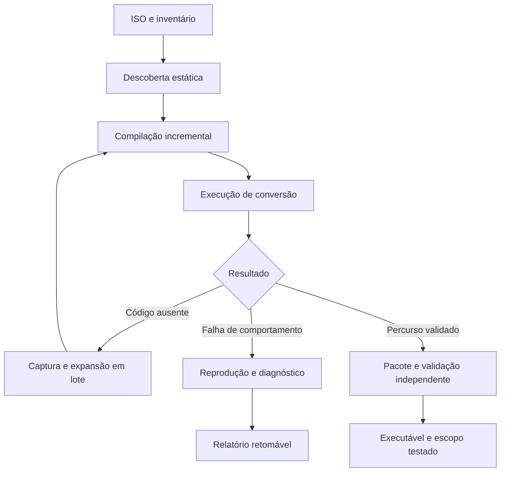

# PS2Native NEXO — uma ISO, um comando, um jogo nativo para PC

**Estado atual (03/10/2026): experimental.** O alvo desta etapa é conversão
automática até menus, som e controles; gameplay 3D fica depois. A CLI já contém
recuperação EE offline com memória privada e reuso, sem agente de IA na conversão.
O replay comercial mais recente produziu PCM não nulo e abertura animada, mas
**0/5 menus estão qualificados**. Universalidade, 90% e natividade integral
continuam sem comprovação. Evidências e roteiro atual:
[adaptação automática](docs/ADAPTACAO_AUTONOMA_20261003.md),
[Beta v0.1](docs/BETA_V01.md) e
[prompt de retomada](docs/PROMPT_CONTINUAR_CODEX.txt).
Para reconstruir em outro servidor: [retomada na VPS](docs/VPS_CONTINUACAO.md).
Os marcos e a priorização abaixo preservam o levantamento histórico anterior.

**Repositório:** [Pedrohs1771/ps2-native](https://github.com/Pedrohs1771/ps2-native)  
**Alvo imediato:** Linux x86-64, Vulkan, execução nativa de EE/IOP/VU.  
**Prioridade:** destravar a partida, colocar o 3D na tela e integrar a conversão automática.  
**Arquivo:** [README.md](sandbox:/workspace/scratch/2c1b44b59f19/PS2Native_NEXO/README.md)

## 1. Objetivo e ordem de execução

O PS2Native transforma imagens de jogos de PlayStation 2 em aplicativos nativos para PC. A experiência final é fornecer uma ISO, executar um comando e receber o jogo completo, sem cadastrar endereços, editar configurações por título ou depender de um desenvolvedor durante a conversão.

A meta de produto é **90%+ de compatibilidade automática na biblioteca avaliada**, avançando para cobertura integral. O executável entregue deve usar código EE, IOP e VU compilado antecipadamente, sem interpretar ou recompilar essas instruções durante a partida.

Este README substitui a priorização anterior. Preservar os componentes, correções, testes e catálogos existentes. A sequência de trabalho passa a ser:

1. Resolver o bloqueio atual do loading.
2. Alcançar gameplay controlável no runner atualizado.
3. Apresentar a cena por Vulkan e acelerar o GS na GPU.
4. Entregar um pacote independente com execução nativa integrada.
5. Automatizar descoberta, compilação incremental, repetição e empacotamento no comando existente.
6. Ampliar a compatibilidade com ISOs inéditas e medir o resultado.

**A janela de execução é de 24 horas.** Ela organiza um sprint agressivo de integração; o estado documentado não permite garantir jogo perfeito ou 90% da biblioteca nesse prazo. O resultado deve ser código executável, uma demonstração reproduzível e a relação objetiva do que passou ou continua bloqueado.

A primeira ação de implementação é concluir a publicação das continuações EE já em desenvolvimento e executar novamente o jogo com o catálogo posterior à correção de J/JAL.

## 2. Ponto de partida real

Base documental: levantamento de **01/10/2026, 22:36:40 -03**, branch `codex/ps2-native-recomp`, commit publicado `d70a1684b72b6b8a1a78d26b46150099034ba594`. Os resultados abaixo pertencem àquele levantamento; conferir o checkout antes de continuar.

| Frente | O que já existe | Próxima entrega |
|---|---|---|
| Pipeline | Inspeção da ISO, extração, análise, geração C++, compilação e pacote experimental | Integrar o ciclo automático de descoberta e repetição |
| EE concreto | 34 bancos, 537.368 entradas | Reutilizar bancos e compilar continuações ausentes em lote |
| Famílias EE | 8.293 famílias admitidas, 293 unidades de compilação | Publicar regiões lineares e sucessoras atualmente omitidas |
| IOP | Caminho nativo com 3.947 kernels; 30.425.512 operações nativas no checkpoint observado | Manter o catálogo correto no runner e validar a progressão |
| VU | AOT e replay VIF com comparações de estado | Integrar esse caminho na execução real do jogo |
| GS | Renderização CPU e infraestrutura de replay | Apresentação Vulkan e primeira rasterização acelerada |
| Testes | 78/78 CTest e 487/487 testes C++ no estado publicado | Regressão focal por correção e suíte completa na integração |
| Jogo | Runner recente parado no loading | Partida, controle, imagem, áudio e persistência no mesmo build |

O último runner nativo passou por `0x1a51b70`, `0x1a51b9c` e `0x1a51bb4`, parando em **`0x1a51be8`** após aproximadamente 189 segundos.

Esse runner antecede a correção final de J/JAL. O catálogo corrigido foi gerado, mas ainda precisa ser exercitado no jogo.

Há trabalho local ainda não publicado em:

- `lab/discover_ee_data_families.py`
- `lab/tests/test_ee_data_families.py`

Preservar essas alterações. Não reiniciar a implementação nem substituir o trabalho local por uma versão antiga.

A cena 3D obtida em experimentos anteriores pertence a outro perfil. O build geral registrado em `build/` é diagnóstico e tem opções nativas desativadas; seus testes aprovados não qualificam automaticamente o pacote final.

## 3. Marcos corrigidos

| Marco | Entrega | Evidência necessária |
|---|---|---|
| **M6 — partida e gráficos no PC** | Loading ultrapassado, cena 3D controlável, apresentação Vulkan e primeiros draws acelerados | Execução atual, vídeo, input causal e contadores do backend |
| **M7 — pacote nativo integrado** | EE/IOP/VU AOT, dispositivos e recursos integrados | Pacote executado fora do checkout, percurso de gameplay, áudio e salvar/sair/carregar |
| **M8 — conversão automática por ISO** | Um comando conduz descoberta, compilação, reexecução e pacote | Primeira conversão de títulos inéditos sem edição por jogo |
| **M9 — compatibilidade ampla** | Expansão para 90%+ do catálogo definido | Resultados por título/revisão, falhas incluídas e protocolo publicado |

M6 e M7 são entregas de integração. “Jogo completo” exige validação do conteúdo relevante, incluindo campanha ou modos principais; passar um trecho inicial não encerra essa validação.

**M8 é automação da conversão no PC.** Sua implementação reaproveita a CLI e os geradores existentes. Não depende de uma nova linguagem intermediária, de provas formais globais ou de reconstruir o projeto.

## 4. Sprint de 24 horas

As faixas abaixo são orçamentos de trabalho contados a partir do início da execução. Se uma dependência continuar bloqueada, registrar o resultado e reorganizar o tempo restante.

| Tempo | Trabalho principal | Resultado verificável |
|---|---|---|
| 0–0,5 h | Conferir checkout, alterações locais, catálogos e comando do último runner | Reprodução identificada e trabalho preservado |
| 0,5–3 h | Concluir descoberta/publicação das continuações EE | Catálogo válido e execução além do bloqueio, ou nova causa isolada |
| 3–6 h | Automatizar captura e recompilação em lote; corrigir a próxima falha causal | Partida ou reprodução mínima do impedimento seguinte |
| 6–12 h | Integrar apresentação Vulkan e acelerar o conjunto GS observado | Cena apresentada e trabalho gráfico efetivo na GPU |
| 12–16 h | Integrar VU AOT e verificar input, áudio, transições e saves | Percurso jogável no perfil nativo |
| 16–21 h | Fechar o ciclo na CLI e executar ISOs inéditas | Conversões sem intervenção ou diagnósticos automáticos precisos |
| 21–24 h | Validar pacote independente, regressões e demonstração | Artefato reproduzível, vídeo e tabela de resultados |

O replay GS já disponível permite desenvolver o backend gráfico enquanto uma execução longa ou compilação está em andamento. Aproveitar essa independência sem criar alterações concorrentes conflitantes nos mesmos arquivos.

Regras para manter velocidade:

- Após 30 minutos sem evidência nova, reduzir a reprodução ou melhorar a observação.
- Se uma generalização de famílias consumir uma hora sem destravar a execução, usar o caminho AOT concreto existente para os bytes descobertos automaticamente.
- Processar conjuntos de entradas e sucessores; evitar o ciclo manual de um endereço por execução.
- Quando houver cobertura e a execução continuar errada, investigar semântica, sincronização ou dispositivos.
- Ao fechar a janela, preservar o melhor pacote funcional e a reprodução exata do bloqueio restante.

## 5. Destravar o loading agora

### 5.1 Causa já identificada

Em `0x1a51be8`, o frontend aceita uma dependência linear de 28 palavras já presente nos dados preparados. O detector orientado apenas a regiões com transferência terminal omitiu essa continuação.

A extensão da captura até a primeira transferência, incluindo seu delay slot, produz uma região de 36 palavras. A correção deve atender à classe de continuações; o endereço serve como regressão do problema observado.

O protótipo de descoberta canônica examinou 102.145 raízes e produziu 43.452 propostas de forma, mas a serialização ultrapassou 64 MiB antes da publicação. Os 28 testes passaram; o catálogo resultante ainda não foi integrado ao jogo.

**O próximo gargalo é concluir a publicação e executar o resultado.**

### 5.2 Arquivos de intervenção

Os caminhos são relativos à raiz do repositório.

| Arquivo | Responsabilidade imediata |
|---|---|
| `lab/discover_ee_data_families.py` | Descobrir regiões lineares, terminais e continuações |
| `lab/tests/test_ee_data_families.py` | Preservar os testes existentes e a regressão do caso |
| `lab/prepare_ee_family_batch.py` | Integrar a política corrigida à preparação em lote |
| `lab/generate_ee_family_catalog.py` | Deduplicar, particionar e publicar o catálogo |
| `ps2xRecomp/src/lib/native_data_family.cpp` | Emissão das famílias aceitas |
| `ps2xRecomp/src/lib/control_flow_emitter.cpp` | Controle de fluxo, J/JAL e delay slots |
| `ps2xRuntime/src/lib/ps2_ee_data_family.cpp` | Lookup, verificação e despacho |
| `ps2xRuntime/cmake/ee_family_catalog.cmake` | Fontes estáveis e compilação incremental |

### 5.3 Política de descoberta

Concluir a política já iniciada:

1. Partir das raízes conhecidas e dos sucessores descobertos.
2. Examinar até 127 palavras a partir de cada entrada.
3. Ao encontrar transferência de controle, incluir o delay slot completo, respeitando o limite de 128 palavras.
4. Sem transferência nesse intervalo, emitir uma região linear de 127 palavras com continuação explícita.
5. Enfileirar os sucessores identificáveis e registrar destinos indiretos para descoberta posterior.
6. Rejeitar captura truncada que não contenha a dependência necessária.
7. Deduplicar por estrutura e dependências, preservando o contexto de entrada.

Entrada normal e execução como delay slot precisam continuar distintas. Preservar as verificações de bytes e de versão no lookup e na chamada efetiva.

### 5.4 Publicação sem explosão de relatório

O limite de serialização não deve exigir redesenhar o catálogo.

- Armazenar cada corpo ou estrutura uma vez.
- Referenciar a proveniência por identificadores compactos.
- Separar o resumo consultado pelo build dos detalhes de diagnóstico.
- Escrever detalhes em partes limitadas, mantendo ordenação determinística.
- Reutilizar as unidades estáveis já geradas; regenerar somente o conteúdo alterado.
- Publicar o manifest apenas depois de todos os arquivos referenciados estarem completos.

**43.452 propostas não significam 43.452 famílias admitidas.** Aplicar a admissão antes de concluir que o limite de 32.768 famílias do catálogo foi excedido.

Se o total admitido ultrapassar a capacidade atual, particionar o catálogo e preservar a detecção de ambiguidade entre todas as partes. Não descartar o excedente nem escolher silenciosamente o primeiro match.

### 5.5 Caminho concreto para manter avanço

Quando a parametrização não admitir uma região suportada, compilar os bytes exatos pelo gerador de overlays já existente. Alimentar essa alternativa pela mesma fila automática de raízes e sucessores.

Isso permite avançar enquanto a generalização é melhorada. O pacote mantém código compilado previamente; a captura e a compilação continuam restritas à etapa de conversão.

### 5.6 Critério de conclusão

A correção só termina quando:

- A continuação antes omitida aparece no catálogo publicado.
- A região respeita bytes, contexto e sucessores.
- O catálogo posterior à correção de J/JAL está ligado ao runner.
- O mesmo percurso de New Game executa além de `0x1a51be8`.
- O próximo resultado está registrado: gameplay, outra ausência de código ou falha de comportamento.

Gerar fontes ou obter `Ready` em um probe é uma etapa intermediária.

## 6. Resolver a próxima falha pela causa

Manter um registro circular curto dos últimos eventos e um contador de progresso. Capturar PC, subsistema, módulo, versão de código, evento pendente e último avanço observável.

| Sintoma | Investigar primeiro | Ação |
|---|---|---|
| Entrada EE ausente | Região, bytes, contexto e sucessores | Capturar e compilar um lote |
| Família ambígua | Predicados e dependências sobrepostos | Corrigir admissão ou usar entrada concreta |
| Espera de RPC/SIF | Pedido, resposta, fila, interrupção e módulo IOP | Corrigir o serviço ou a entrega do evento |
| Loop sem progresso | Evento esperado, contador e avanço temporal | Corrigir a causa da espera |
| VIF/VU parado | Upload, banco selecionado, chamada, continuação e término | Integrar ou corrigir o caminho VU |
| GIF recebido, tela vazia | Estado GS, framebuffer, transferências e apresentação | Reproduzir no backend gráfico |
| Execução diverge com cobertura disponível | Delay slots, ABI, memória, FPU e exceções | Corrigir a semântica e criar regressão |
| Crash após troca de código | Versão, aliases e entrada obsoleta | Invalidar o despacho afetado |

Não resolver uma espera com sucesso RPC fictício, salto sobre instruções ou avanço arbitrário de relógio.

A divergência VU documentada de 247 ciclos é uma investigação localizada. Priorizá-la quando explicar o bloqueio ou uma diferença observável; não transformar a conclusão de toda a pesquisa temporal em pré-requisito para integrar o que já funciona.

## 7. Colocar o 3D em Vulkan

No replay VIF registrado, o receptor GS consumiu aproximadamente **248 ms de 251 ms**, enquanto o VU exclusivo consumiu cerca de 1,3 ms. Esse resultado torna o GS a primeira frente de desempenho naquele percurso.

Reutilizar a interface de backend existente, começando por:

- `ps2xRuntime/include/runtime/gs/gs_backend.h`
- `ps2xRuntime/src/lib/gs/gs_cpu_backend.cpp`

Confirmar os nomes no checkout e adicionar o backend Vulkan nessa fronteira.

### 7.1 Primeira entrega: imagem apresentada

Criar dispositivo, fila, swapchain, sincronização e upload do framebuffer produzido pelo caminho existente. Exibir a cena real e preservar input e redimensionamento.

Registrar explicitamente `present_backend=vulkan` e `raster_backend=cpu` nessa etapa. Uma janela Vulkan ou a apresentação de um framebuffer CPU ainda não demonstram aceleração do GS.

### 7.2 Segunda entrega: rasterização na GPU

Usar os pacotes GIF capturados para implementar o conjunto de estados que a cena realmente utiliza:

1. Transferências e representação de VRAM.
2. Primitivas, coordenadas e viewport/scissor.
3. Texturas e paletas necessárias.
4. Testes de profundidade e alfa.
5. Blending e máscaras de escrita.
6. Leitura de resultados, feedback e apresentação.

Escolher rasterização gráfica, compute ou combinação conforme a operação. Evitar depender de um comportamento do pipeline host que não reproduza a operação GS necessária.

Executar o mesmo replay no backend CPU e no backend Vulkan. Comparar framebuffer, áreas relevantes de VRAM e estado final. O backend CPU fornece regressão útil; discrepâncias compartilhadas exigem referência independente.

### 7.3 Fallback e coerência

Operações ainda não implementadas podem usar o GS CPU para manter a imagem correta durante a integração. Esse caminho é código host de dispositivo e não interpreta a ISA do jogo.

O backend híbrido precisa controlar:

- Qual lado possui a versão atual de cada região de VRAM.
- Quais regiões ficaram sujas.
- Quando a GPU deve terminar antes de uma leitura CPU.
- Quando alterações CPU precisam ser enviadas à GPU.
- Quais dependências impedem reordenar draws ou transferências.

Evitar readback integral por frame. Sincronizar as regiões necessárias nos pontos de dependência.

### 7.4 Evidência mínima

Registrar dispositivo físico, driver, backend de apresentação, backend de rasterização, draws GPU/CPU, tempo GPU/CPU, readbacks e tempo de frame p50/p95/p99.

O marco gráfico exige uma cena do jogo e trabalho real na GPU. Medições em renderizador por software não demonstram aceleração na placa.

## 8. Integrar EE, IOP e VU já disponíveis

### EE

Manter a prioridade atual de entradas concretas e a resolução de famílias sem ambiguidade. Preservar J/JAL, link, destinos relocados, delay slots e verificações das dependências de código.

Escritas que alterem código precisam invalidar as entradas afetadas. Novos bytes são descobertos e compilados durante a conversão; o pacote final não gera código convidado durante a partida.

### IOP

Usar o frontend IRX, relocação, imports e catálogo nativo existentes. Conferir se o runner liga o manifest correto e se carregamento, unload, RPC e interrupções mantêm o ciclo de vida esperado.

As 30 milhões de operações nativas documentadas justificam reutilizar esse caminho. Elas não substituem a validação dos serviços posteriores.

### VU

Conectar o banco AOT já exercitado aos uploads e chamadas VIF do jogo, preservando seleção de banco, continuações e estado compartilhado.

O replay comparou 168 payloads GIF e estados finais relevantes, mas o experimento de jogo ainda usava VU diagnóstico. Essa integração é necessária para qualificar o pacote como integralmente nativo.

Se aparecer microprograma sem cobertura, capturá-lo, compilá-lo offline e repetir o percurso. O executável entregue deve diagnosticar uma ausência de cobertura, sem recorrer a interpretação oculta.

### Perfis de build

Manter diretórios persistentes separados para diagnóstico e execução nativa. Usar as opções existentes:

- `PS2X_RUNTIME_AOT_EE_OVERLAYS`
- `PS2X_RUNTIME_EE_DATA_FAMILIES`
- `PS2X_RUNTIME_NATIVE_IOP`
- `PS2X_IOP_ENABLE_INTERPRETER`
- `NEXO_EE_FAMILY_MANIFEST`
- `NEXO_IOP_BANK_MANIFEST`

No perfil nativo, ativar os caminhos e catálogos correspondentes e desativar a interpretação IOP. Conferir no código a integração VU e os demais caminhos convidados; uma flag isolada não comprova natividade.

Não alternar continuamente o mesmo cache CMake entre os dois perfis.

## 9. Uma linha de comando: fechar a esteira existente

A interface pública já existe:

```bash
python3 -m tools.ps2native convert "/caminho/jogo.iso"
python3 -m tools.ps2native build --iso "/caminho/jogo.iso" --target desktop --out "/caminho/pacote-novo"
```

**Estado atual:** `convert` constrói o pacote experimental, executa probes de recuperação offline no Linux, verifica os hashes e abre o runner desktop com a ISO identificada. Use `--no-run` para converter sem o lançamento final, ou `--run-timeout N` para limitar esse lançamento; expirar o prazo é falha. A conversão usa ferramentas locais, sem API de IA. O lançamento remove o driver de compilação EE ao vivo. Isso não comprova natividade integral de EE/IOP/VU nem compatibilidade de menus.

O ciclo miss → captura → geração offline → compilação → relink → replay está integrado ao `convert`. O processo convidado para antes da compilação. A memória privada em `build/ps2native-memory` reutiliza casos por identidade de ISO, gerador e fontes; os bancos conferem os bytes das instruções antes de executar. `--adapt-rounds` limita recuperações e `--probe-timeout` define a duração de cada probe. `--no-adapt` permite somente o build experimental. O probe automático exige Linux, Xvfb, xdotool, ImageMagick e PulseAudio; eles são ferramentas de conversão, não dependências de IA.

Threads e callbacks sem função compilada chegam à captura estrita, preservando argumentos e o endereço solicitado. A recuperação de código KSEG0/KSEG1 mantém o PC virtual e verifica os bytes na RAM física; outros segmentos e janelas que excedem a RAM são recusados. Esses contratos permitem adaptação automática a código observado. Não implementam automaticamente os dispositivos ainda ausentes nem aprovam um jogo pela ausência de falta de código.

No lote de laboratório de 03/10/2026, as cinco ISOs chegaram ao fim de probes delimitados. Quatro destinos EE ausentes foram recuperados automaticamente em R-Type e Sega Ages; a repetição reutilizou os quatro casos sem nova recuperação. O lote reutiliza objetos convidados de builds anteriores e não qualifica uma conversão fria nem menus. Menus, áudio, controles, IOP/VU nativos e a meta de compatibilidade continuam pendentes. Veja [o checkpoint da adaptação](docs/ADAPTACAO_AUTONOMA_20261003.md).

O destino deve ser novo. O usuário informa a ISO e o diretório de saída; a ferramenta resolve inventário, workspace, catálogos e compilação.

### 9.1 Fluxo de conversão



A execução de conversão pode usar instrumentação e caminhos diagnósticos para descobrir código. O pacote distribuído executa as traduções nativas produzidas e os dispositivos host.

### 9.2 Algoritmo do orquestrador

```text
inspecionar ISO e identificar inputs
criar ou retomar workspace compatível
descobrir executáveis, módulos e entradas
gerar catálogos e compilar alterações

enquanto houver orçamento e progresso:
    executar percurso de conversão
    classificar resultado

    se faltar código suportado:
        capturar bytes, módulo, contexto e dependências
        expandir raízes e sucessores em lote
        gerar famílias admitidas e regiões concretas restantes
        compilar somente alterações
        reiniciar a reprodução

    se houver falha de comportamento:
        produzir reprodução e diagnóstico
        aplicar apenas recuperação genérica já implementada e validada
        se a causa continuar desconhecida:
            preservar estado do trabalho e encerrar como bloqueado

    se o percurso de aceitação passar:
        congelar catálogos
        empacotar
        executar validação fora do workspace
        registrar escopo efetivamente testado
        encerrar

se faltar orçamento ou progresso:
    preservar trabalho e emitir relatório retomável
```

Uma implementação universal não depende de um agente reescrever o runtime arbitrariamente para cada usuário. O primeiro ciclo autônomo deve resolver as classes já mecanizáveis: descoberta, expansão, geração, compilação e repetição. Correções genéricas adicionais entram no motor após regressão.

### 9.3 Descoberta além do ELF inicial

Combinar o inventário estático com observação nos pontos existentes de carregamento:

- Executáveis secundários e overlays.
- Módulos IRX e suas relocações.
- Código produzido por descompressão, cópia ou relocação.
- Uploads de microprogramas VU.
- Novas versões de páginas executadas e destinos indiretos observados.

Capturar código quando se torna executável ou é requisitado pelo despacho. Evitar tratar indiscriminadamente cada palavra de RAM como instrução.

A análise semântica identifica estrutura e dependências; famílias reutilizam formas compatíveis; regiões concretas cobrem casos suportados que ainda não generalizam. Os três caminhos alimentam o mesmo compilador e runtime.

### 9.4 Retomada e exploração

Persistir hashes dos inputs, versões das ferramentas, fila de descoberta, catálogos, objetos reutilizáveis, comando de execução e último resultado.

Um snapshot EE não contém necessariamente a máquina inteira. Até existir checkpoint completo validado, repetir desde o boot com entradas reproduzíveis ou usar o mecanismo normal de save já testado.

Os templates atuais de navegação de Monster House são fixtures de regressão. Para ISOs inéditas, implementar navegação genérica com observação de tela/estado, registro das ações e limites de tentativa. Menus não resolvidos devem produzir diagnóstico.

Exploração automática não comprova todos os caminhos do jogo. Uma nova ISO só conta como conversão automática quando não exige roteiro, endereço ou configuração escrito especificamente para ela.

## 10. Manter o ciclo de desenvolvimento rápido

Os ganhos documentados já indicam a direção:

| Operação | Resultado registrado |
|---|---|
| Configuração CMake | Aproximadamente 124 s para 6,9 s |
| Compilação fria de 293 unidades de famílias | Aproximadamente 323 s |
| Rebuild sem alterações | Aproximadamente 0,8 s, zero fontes recompilados |
| Link observado | Aproximadamente 17,4 s |
| Geração/orquestração recente | Aproximadamente 15–21 s |

Preservar:

- Fontes endereçados por conteúdo e nomes estáveis.
- Manifest compacto lido uma vez pela integração de build.
- Recompilação somente das unidades afetadas.
- Cache de compilação quando disponível.
- Paralelismo limitado pela RAM.
- Build de iteração sem IPO/LTO global.
- Otimização localizada nos hotspots medidos.
- Logs limitados, com captura detalhada acionada por falha.

A otimização privada de GS CPU de O1 para O2 reduziu um replay de aproximadamente 251 ms para 213 ms, preservando os estados comparados. Manter esse ganho enquanto Vulkan é integrado.

Não colocar no caminho crítico: novo IR, nova linguagem, reescrita do scheduler, motor geral de provas, serviço em nuvem, interface gráfica de conversão ou reorganização cosmética do repositório.

## 11. Validar o que será entregue

### Por correção

Executar o caso que falhava, um caso de fronteira relevante e a reprodução no runner. Ampliar a bateria quando a mudança afetar uma fronteira compartilhada.

### Na integração

Rodar as suítes existentes no perfil apropriado. A bateria completa registrada levou cerca de 37 segundos; preservar essa proteção.

### No pacote

Executar fora do checkout e sem dependência de geradores, compilador convidado ou caminhos absolutos do ambiente de desenvolvimento:

1. Iniciar o jogo.
2. Criar ou carregar uma partida.
3. Controlar personagem ou câmera e observar resposta causal.
4. Exercitar a cena 3D e uma transição relevante.
5. Verificar áudio.
6. Salvar, encerrar e carregar novamente.
7. Sustentar ao menos 30 minutos no percurso de estabilidade.
8. Registrar CPU, GPU, memória e tempo de frame.

Usar memory card isolado nos testes. O harness só pode encerrar processos gráficos que ele próprio criou.

Registrar separadamente operações interpretadas ou recompiladas em execução para EE, IOP e VU. Exigir zero no percurso nativo e conferir que o pacote não contém um fallback convidado habilitado.

Preservar velocidade de simulação e cadência original. Medir 60 FPS quando o conteúdo e a cadência do título permitirem; duplicar frames ou acelerar a lógica não satisfaz o objetivo de desempenho.

## 12. Medir a compatibilidade universal

Começar com Monster House como regressão e pelo menos três títulos inéditos com características diferentes. Essa rodada avalia generalização inicial; quatro jogos não demonstram 90% da biblioteca.

Congelar a versão da ferramenta e executar cada ISO inédita a partir de workspace limpo, sem catálogos produzidos manualmente para aquele título. Se surgir uma correção genérica, iniciar uma nova rodada identificada.

Manter uma tabela simples:

```csv
iso_hash,title,revision,tool_commit,build,native,boot,gameplay,audio,save_reload,completion,automatic,conversion_seconds,first_failure
```

| Resultado | Significado |
|---|---|
| `built` | Pacote construído e inventário verificado |
| `booted` | Inicialização observada |
| `playable` | Percurso declarado jogável |
| `complete` | Conteúdo principal validado no escopo publicado |
| `blocked` | Conversão ou execução impedida, com causa registrada |

`automatic=true` significa ausência de intervenção específica por título durante a conversão. Jogar para verificar o resultado não equivale a editar o conversor; fornecer manualmente configuração ou exploração necessária à geração equivale.

A taxa de compatibilidade completa é a proporção de títulos/revisões aprovados como completos, nativos e automáticos dentro do catálogo definido. Incluir falhas e timeouts no denominador.

Publicar também taxas de build e gameplay. Contagens de instruções, entradas, famílias e testes não substituem compatibilidade por jogo.

## 13. Onde está a inovação a entregar

A contribuição técnica buscada é a integração de:

- Descoberta estática e observação de código materializado durante a conversão.
- Recuperação de estrutura e dependências sem exigir reconstrução integral do código-fonte.
- Famílias compiladas que cobrem variações admitidas de uma estrutura.
- Regiões concretas compiladas para preservar avanço e correção.
- Expansão automática em lote, com build incremental.
- Execução integrada de EE/IOP/VU e dispositivos.
- Empacotamento reproduzível comandado pela ISO.

O resultado relevante é reduzir o trabalho por título até que novas ISOs atravessem a mesma esteira. Isso deve aparecer em código, tempo de conversão e jogos funcionando.

A combinação é a proposta do projeto. Prioridade histórica absoluta ou uma “primeira descoberta mundial” exigiriam investigação própria; esses rótulos não são necessários para entregar a inovação.

## 14. Comandos de continuidade

### Conferir o checkout existente

```bash
cd /home/pedrohs/Downloads/ps2-native-recompiler
git status --short
git branch --show-current
git rev-parse HEAD
git diff -- lab/discover_ee_data_families.py lab/tests/test_ee_data_families.py
```

Preservar o diff e continuar a implementação local.

### Inspecionar, construir e verificar

```bash
python3 -m tools.ps2native inspect --iso "/caminho/jogo.iso" --json-output
python3 -m tools.ps2native convert "/caminho/jogo.iso" --no-run
python3 -m tools.ps2native build --iso "/caminho/jogo.iso" --target desktop --out "/caminho/pacote-novo"
python3 -m tools.ps2native verify --package "/caminho/pacote-novo"
```

`verify` confere a integridade declarada do pacote. A validação jogável é a execução descrita neste README.

### Preparar um lote EE

```bash
python3 lab/prepare_ee_family_batch.py \
  --previous-batch "/caminho/lote-anterior" \
  --capture "/caminho/captura-ee" \
  --family-generator build/ps2xRecomp/ps2_native_data_family \
  --overlay-generator build/ps2xRecomp/ps2_native_overlay \
  --output "/caminho/lote-novo" \
  --workers 8
```

O comando existente precisa receber a integração da política de continuações. Ajustar workers à memória disponível e reutilizar os geradores do perfil correto.

### Regressões existentes

```bash
ctest --test-dir build --output-on-failure -j 4
build/ps2xTest/ps2x_tests
```

Esses comandos exercitam o diretório informado. Repetir a validação relevante no perfil nativo efetivamente empacotado.

### Localizar os últimos experimentos

- `build/lab/latest-ee-structure-batch-job.txt`
- `build/lab/latest-ee-canonical-regions-job.txt`
- `build/lab/latest-monsterhouse-native-vif-evidence.txt`

Usar os manifests e comandos desses experimentos para reconstruir o runner. Não inventar caminhos para artefatos ainda não produzidos.

## 15. Instruções para o agente de implementação

Manter a configuração de programação já adotada, **GPT 6.1 xhigh**. O trabalho agora é implementar, executar e corrigir.

Cada incremento deve produzir:

1. Uma causa identificada ou uma hipótese testável.
2. Uma alteração pequena e reutilizável.
3. A regressão relevante.
4. Uma execução que mostre avanço ou delimite a próxima falha.

Continuar da geração do catálogo até o runner. Continuar do runner até o pacote. Continuar do pacote até uma ISO inédita. Não encerrar uma etapa de integração apenas porque um helper compilou.

Usar estas regras:

- Preservar alterações locais e resultados úteis.
- Preferir correções por classe de comportamento.
- Usar endereços observados como fixtures de diagnóstico.
- Manter verificações de bytes, contexto, limites e ambiguidade.
- Não fabricar sucessos para ultrapassar o loading.
- Não transformar uma proposta em recurso anunciado como disponível.
- Não marcar `closure_proved` ou `strict_approval` como verdadeiros por ter passado um percurso.
- Reutilizar o código e os testes existentes antes de criar infraestrutura.
- Manter a documentação de andamento curta.

Concentrar o andamento em `docs/STATUS_PC.md`, criando-o se necessário, com apenas: commit, perfil, comando de reprodução, último resultado, bloqueio atual e próxima ação. Este README define a direção; o arquivo de status registra a execução.

## 16. Preparação para os programas de apoio open source

Preparar a candidatura depois da demonstração funcional, sem colocá-la no caminho crítico do loading.

O material útil é:

- Repositório público com licença e créditos preservados.
- Build reproduzível e CI com testes redistribuíveis.
- Vídeo mostrando comando, conversão e gameplay real.
- Tabela honesta de compatibilidade.
- Descrição das contribuições próprias sobre a base utilizada.
- Plano concreto de uso do apoio em manutenção, regressões e expansão.
- Indicadores reais de adoção e contribuição.

**Codex for Open Source:** o programa oficial oferece seis meses de ChatGPT Pro com Codex, acesso condicional ao Codex Security e possibilidade de créditos de API para trabalho de manutenção open source. A página convida mantenedores centrais e projetos públicos amplamente usados; também admite candidatura justificada de projetos relevantes que não se encaixem no perfil principal. [Programa e candidatura](https://developers.openai.com/community/codex-for-oss). genui{"citation":{"ref":"turn9view0"}}

**Claude for Open Source:** o programa oficial oferece seis meses de Claude Max 20x e publica critérios relacionados a adoção, contribuições, comunidade e infraestrutura crítica, com possibilidade de justificar relevância fora desses critérios. [Programa e candidatura](https://claude.com/contact-sales/claude-for-oss). genui{"citation":{"ref":"turn9view1"}}

O relatório técnico não comprova elegibilidade nem seleção. Preparar evidências verificáveis e apresentar o projeto pelo que executa. Publicar testes e demonstrações com conteúdo que o projeto possa distribuir; manter ISOs e dados comerciais fora do repositório.

## 17. Checklist de execução

- [ ] Preservar o trabalho local de continuações.
- [ ] Corrigir a serialização e publicar o catálogo.
- [ ] Ligar o catálogo posterior à correção de J/JAL.
- [ ] Executar além de `0x1a51be8`.
- [ ] Alcançar partida controlável no build atual.
- [ ] Apresentar a cena por Vulkan.
- [ ] Executar rasterização real na GPU e medir fallback.
- [ ] Integrar VU AOT ao runner do jogo.
- [ ] Validar EE/IOP/VU nativos, áudio, input e save/load.
- [ ] Executar o pacote fora do checkout.
- [ ] Integrar captura, expansão e rebuild ao comando `build`.
- [ ] Exercitar ISOs inéditas sem ajustes por título.
- [ ] Publicar artefato, demonstração e resultados por escopo.

**Próxima ação técnica: concluir a publicação das continuações, ligar o runner atualizado e repetir New Game até identificar o primeiro resultado novo além de `0x1a51be8`.**
