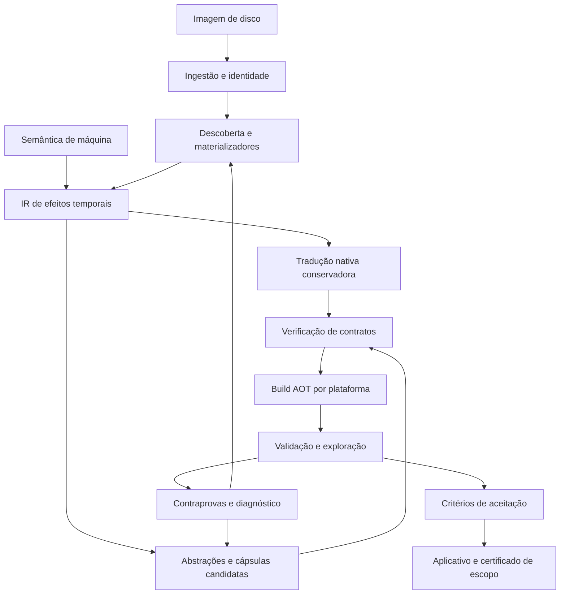
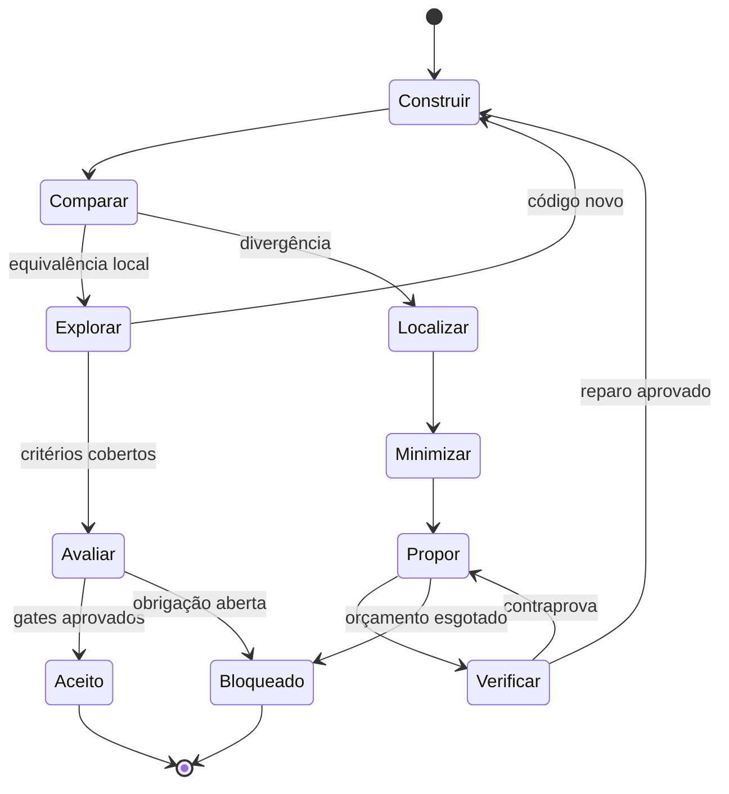

# PS2Native NEXO — Compilação Nativa por Contratos Causais

**Documento fundacional · Especificação de pesquisa e implementação · Revisão 0.1 · 30 de setembro de 2026**

**Arquivo:** [README.md](sandbox:/workspace/scratch/2c1b44b59f19/PS2Native_NEXO/README.md)

## 1. Missão e tese arquitetural

O PS2Native NEXO propõe transformar uma imagem de disco de PlayStation 2 em um aplicativo autônomo para computadores e Android, com execução nativa do código EE, IOP e VU, descoberta automática dos programas presentes e latentes, preservação do comportamento observável e otimização conjunta dos processadores e dispositivos.

A unidade fundamental de compilação será a **Cápsula Causal Nativa — CCN**: uma região de comportamento que pode atravessar instruções, chamadas, módulos, transferências, microprogramas e operações gráficas, acompanhada de um contrato verificável de memória, tempo, materialização de código e efeitos externos.

A descompilação propõe estruturas de alto nível; a semântica operacional delimita o que elas podem significar; a recompilação produz caminhos nativos conservadores; a verificação autoriza substituições mais eficientes. Todas essas representações permanecem ligadas ao mesmo contrato, em vez de formar ferramentas independentes conectadas por heurísticas irreversíveis.

O salto proposto é **compilar a cadeia causal de uma operação do jogo, incluindo as condições que produzem seu código futuro**, e não apenas traduzir as instruções visíveis no ELF inicial.

O objetivo de produto permanece:

- Uma ISO como entrada do usuário.
- Nenhuma configuração, correção ou seleção manual por título.
- Pacotes independentes para as ABIs anunciadas.
- Nenhum interpretador de EE, IOP ou VU no aplicativo final.
- Nenhuma compilação de código convidado durante a execução final.
- Compatibilidade automática de pelo menos 90% de um catálogo global definido, avançando para 100%.
- Execução em tempo real e apresentação estável; 60+ quadros reais quando o contrato temporal do jogo e o dispositivo permitirem, com a meta adicional de conversão automática de cadência especificada separadamente.

**Estado desta proposta:** arquitetura especificada, ainda não implementada nem validada. O relatório anexo é a evidência disponível sobre o protótipo existente. Os novos mecanismos, teoremas condicionais e metas deste documento não são resultados experimentais.

**Ineditismo:** a contribuição reivindicada é a organização técnica proposta neste documento, especialmente a composição entre fechamento de código latente, cápsulas multicomponente e reconstrução de estado observável. Não se declara prioridade científica ou patenteabilidade: comprovar ausência de antecedentes exige revisão própria. Ferramentas conhecidas são instrumentos de implementação, não evidência de que o sistema inteiro já exista.

## 2. Vocabulário normativo

Os termos **DEVE**, **NÃO DEVE** e **PODE** indicam requisitos, proibições e opções da arquitetura proposta.

| Termo | Definição operacional |
|---|---|
| Código convidado | Instruções EE, IOP, VU e demais programas originalmente executados no console |
| AOT estrito | Código de máquina das CPUs hospedeiras produzido antes da entrega; nenhum novo bloco convidado compilado durante a execução final |
| Nativo | Instruções do jogo executadas por funções da arquitetura hospedeira, com serviços de dispositivos também implementados no host |
| Runtime | Implementação nativa de memória, eventos, dispositivos e integração com o sistema operacional |
| Zero-touch | Conversão e validação sem intervenção humana específica na submissão |
| Zero-shot do pipeline | Submissão inédita para uma versão congelada do sistema, sem perfil, patch, rastro ou resultado prévio específico do título |
| Fechamento de código | Demonstração de que toda transferência de controle possível no domínio declarado encontra tradução nativa previamente produzida |
| Domínio de execução | Conjunto explícito de entradas, periféricos, estados iniciais, versões de hardware e serviços externos considerados |
| Equivalência fiel | Preservação de observações, causalidade, progresso e tempo convidado no domínio declarado |
| Otimização guardada | Substituição válida sob uma condição verificável, com caminho conservador nativo quando a condição falha |
| Materializador | Código que carrega, descomprime, reloca, modifica ou gera bytes que poderão ser executados |

Um runtime de dispositivos conserva comportamento de hardware em software. Portanto, existe modelagem ou emulação semântica de dispositivos mesmo quando toda instrução convidada foi compilada. “Nativo” não significa recuperar o projeto original do estúdio nem eliminar as obrigações de compatibilidade.

A compilação de shaders pelo driver, o carregamento normal de bibliotecas e os componentes internos do sistema operacional não são recompilação de instruções PS2. Essa distinção DEVE aparecer no contrato do produto, sem apresentar SPIR-V como código de máquina universal de GPU.

## 3. Ponto de partida comprovado pelo relatório

O relatório de 30/09/2026 descreve uma implementação local derivada de PS2Recomp, com o commit-base documental `75d729c`. Este documento não realizou nova auditoria do repositório localizado no computador do autor.

| Evidência no relatório | O que será aproveitado | O que ainda precisa mudar |
|---|---|---|
| ISO → análise → C++ → pacote Linux | Ingestão, orquestração e rastreabilidade | Separar descoberta, semântica, prova e geração por ABI |
| 705.383 bindings no caso estudado | Entradas interiores e despacho em lote | Associar endereço a versão de código, contexto de entrada e contrato |
| Overlays EE compilados durante execução Linux | Descoberta e coleta no laboratório | Retirar compilador do produto final; demonstrar fechamento AOT |
| Cache por bytes e ferramentas | Armazenamento endereçado por conteúdo | Incluir pressupostos semânticos, memória, dispositivos e versões do verificador |
| Registro reduzido de 136.045.196 para 2.253.899 bytes | Compactação e geração incremental | Despacho paginado sem expansão obrigatória de todos os aliases |
| IOP e VU interpretados | Referências provisórias e fixtures | Gerar implementações nativas completas e validar estado oculto |
| GS principalmente em software | Caminho comparativo inicial | Construir backend GPU fiel, com sincronização e formatos corretos |
| 484/484 testes C++ e 18/18 testes Python | Regressões existentes | Ampliar semântica, independência de oráculos e testes de integração |
| Ganhos VU de aproximadamente 31–33% em replays | Metodologia de replay alternado | Medir impacto no frame e em entradas distintas |
| Cerca de 1,53 uploads/s em Xvfb/llvmpipe | Linha de base daquele ambiente | Medir GPU física, frame completo e controle causal |
| Preparação Android | Estrutura de empacotamento | Validar ARM64 físico, áudio, vídeo, controles e ciclo de vida |
| Monster House parcialmente observado | Caso de regressão integrado | Aprovar progressão, imagem, som e saves; expandir corpus |

Os 13.706 erros/instruções não tratadas pertencem a um relatório inicial retido. Não são uma contagem auditada de falhas atuais. Da mesma forma, bindings, arquivos gerados e testes aprovados não fornecem uma porcentagem de jogos compatíveis.

O ganho necessário não pode ser calculado dividindo 60 por 1,53: a medição foi de uploads de apresentação em um ambiente específico, e o caminho físico de GPU ainda precisa de benchmark.

## 4. Limites que o contrato precisa resolver

### 4.1 “Qualquer ISO” e “toda a biblioteca” são universos distintos

Uma biblioteca comercial catalogada é um conjunto finito. “Qualquer ISO do mundo” também pode incluir homebrew, corrupção, conteúdo incompleto, revisões desconhecidas, programas deliberadamente adversariais e jogos dependentes de servidores ou periféricos indisponíveis.

A ferramenta DEVE aceitar a submissão de qualquer arquivo, identificar seu formato e produzir um resultado estruturado. Isso não implica conseguir produzir um jogo funcional a partir de informação ausente.

O denominador principal será um catálogo versionado de imagens e revisões. Arquivos inválidos serão identificados separadamente; títulos válidos que excedam os recursos, exijam comportamento ainda desconhecido ou não sejam convertidos continuam sendo falhas no denominador correspondente.

### 4.2 Universalidade não decorre de um algoritmo de descoberta

Para programas gerais com recursos não limitados, prever todo comportamento futuro envolve problemas indecidíveis. Um PS2 fisicamente limitado tem estado finito; nesse modelo fechado, enumerar estados é teoricamente possível. O obstáculo passa a ser a explosão combinatória, acrescida do ambiente externo, e não uma aplicação indiscriminada do problema da parada.

Logo, não se afirma que AOT universal seja logicamente impossível para uma máquina finita. Afirma-se que este documento não fornece um método viável que garanta fechamento, prazo e desempenho para toda entrada concebível.

O contrato prático será um compilador parcialmente decisório: quando consegue justificar seus pressupostos, emite o pacote; quando não consegue, registra a obrigação não resolvida. Um timeout não vira prova, incompatibilidade demonstrada ou sucesso.

### 4.3 A ISO não contém necessariamente todo o ambiente

Firmware, comportamento de periféricos, relógio, rede e respostas de dispositivos não estão integralmente descritos no disco. Para manter uma única entrada, o sistema deve oferecer implementações comportamentais próprias e verificadas dos serviços necessários.

Se uma execução depende de bytes específicos de firmware ausentes, de segredo externo ou de um servidor não reproduzido, a dependência permanece explícita. Não será resolvida inventando dados ou incorporando silenciosamente material externo.

### 4.4 60 FPS não é consequência automática de código nativo

Um jogo originalmente limitado a 30 ou 50 atualizações por segundo pode executar perfeitamente em tempo real sem gerar 60 estados visuais distintos. Dobrar sua frequência pode alterar física, scripts, áudio e controle.

O sistema manterá métricas distintas de simulação, renderização, apresentação e repetição/interpolação. A meta de 60+ quadros reais exige capacidade do dispositivo e, quando necessário, uma transformação temporal adicional demonstrada. Essa transformação é uma frente de pesquisa, não uma consequência da tradução da ISA.

## 5. O paradigma NEXO

O NEXO combina cinco mecanismos:

1. **Representações ligadas por refinamento:** instruções exatas, estruturas descompiladas e código otimizado permanecem relacionados por obrigações verificáveis.
2. **Fechamento de código por materializadores:** analisar os produtores de código e suas famílias de resultados, além dos bytes encontrados em execuções.
3. **Cápsulas causais multicomponente:** otimizar regiões que atravessam EE, IOP, DMA, VIF, VU, GIF e GS quando seus efeitos intermediários podem ser reconstruídos.
4. **Tempo observável explícito:** conservar eventos, leituras de relógio e arbitragem sem obrigar toda operação a percorrer um dispatcher por ciclo.
5. **Autorreparo com autoridade limitada:** modelos e sintetizadores propõem; verificadores e evidências independentes decidem.

| Estratégia | Unidade predominante | Restrição que o NEXO procura superar |
|---|---|---|
| Tradução literal | Instrução ou bloco | Custo de estado, despacho e fronteiras artificiais |
| Descompilação isolada | Função ou estrutura de programa | Hipóteses sem garantia suficiente sobre dispositivos e código futuro |
| Descoberta por execução | Caminho observado | Ausência de cobertura dos caminhos não visitados |
| Substituição de SDK por nomes | Rotina conhecida | Ambiguidade de ABI, versão, efeitos e memória observável |
| NEXO | Cápsula causal com família de código e contrato temporal | Composição das quatro dimensões no mesmo artefato verificável |

A hipótese de pesquisa é que uma parcela relevante do custo e da dificuldade de fechamento está nas fronteiras artificiais entre esses componentes. A arquitetura será julgada por experimentos que removem cada mecanismo, mantendo os demais constantes.

## 6. Arquitetura global



O laboratório de conversão PODE executar interpretadores, compiladores dinâmicos, solvers e exploradores. O aplicativo entregue contém apenas o runtime necessário, funções AOT, recursos e metadados de validação.

O laboratório e o produto serão builds distintos. Excluir o laboratório por flags sem verificar símbolos, dependências e caminhos alcançáveis não basta.

## 7. Modelo formal de comportamento

### 7.1 Estado global

Define-se o estado convidado:

\[
S=(E,I,V_0,V_1,M,C,D,G,A,P,K,Q,T,X).
\]

Os componentes representam EE, IOP, VUs, memória, caches e visibilidade, DMA e barramentos, GS, áudio, periféricos, serviços de sistema, eventos pendentes, relógios e ambiente externo.

Cada processador inclui registradores, flags, exceções, estado de pipeline relevante e contexto de retomada. O estado de VU inclui operações em voo. A memória inclui aliases e regiões de dispositivos; o GS inclui memória local e efeitos pendentes.

A semântica é um sistema de transição rotulado:

\[
S \xrightarrow{e,\Delta t} S'.
\]

O rótulo identifica um efeito ou uma transição interna. O tempo é convidado: não corresponde à duração de execução da função nativa.

### 7.2 Observações

O contrato define a projeção \(\pi_O\) dos rastros sobre:

- Valores que o programa pode ler, inclusive memória de código lida como dados.
- Exceções, interrupções, transferências e sua ordem observável.
- Respostas de serviços, arquivos, controles e periféricos.
- Alterações persistentes em saves e cartões.
- Saída audiovisual nos pontos definidos pelo contrato.
- Leituras de contadores, sincronismo e progresso.

Uma operação interna só pode desaparecer se nenhum observador permitido distinguir sua remoção, inclusive observadores futuros.

### 7.3 Relação entre execução original e nativa

Sejam \(R\) o modelo de referência, \(N\) o programa nativo, \(D\) o domínio de entradas e \(\rho\) a relação entre seus estados. A obrigação fiel é uma equivalência observacional por simulação nos dois sentidos, permitindo passos internos adicionais:

\[
\forall u\in D:\quad
\pi_O(\operatorname{Traces}(R,u))
=
\pi_O(\operatorname{Traces}(N,u)).
\]

Para uma referência determinística e uma entrada fixada, compara-se o rastro correspondente. Se a referência contém escolhas reais de ambiente, elas precisam ser acopladas; não é válido escolher retrospectivamente uma execução de referência conveniente.

A prova deve preservar terminação, divergência observável e progresso. Um programa que deixa de emitir efeitos porque entrou em loop não satisfaz a equivalência por ter reproduzido um prefixo correto.

Perfis que permitem aproximação audiovisual ou alteração temporal usam outra relação, explicitamente nomeada. Eles não recebem o mesmo certificado de equivalência fiel.

## 8. Cápsula Causal Nativa

Uma cápsula é definida por:

\[
C=(\mathcal E,P,\mathcal V,F_r,F_w,\mathcal O,\Theta,
B,N_o,\rho,\kappa,\mathcal M,\Pi).
\]

| Campo | Significado |
|---|---|
| \(\mathcal E\) | Entradas válidas, com contexto de branch, exceção e pipeline |
| \(P\) | Pré-condição sobre estado e ambiente |
| \(\mathcal V\) | Versões e famílias de código cobertas |
| \(F_r,F_w\) | Efeitos de leitura e escrita, incluindo aliases e dispositivos |
| \(\mathcal O\) | Portas de observação e efeitos externos |
| \(\Theta\) | Transformação temporal e fronteiras de eventos |
| \(B\) | Implementação nativa conservadora |
| \(N_o\) | Implementação nativa otimizada opcional |
| \(\rho\) | Relação entre estados representados |
| \(\kappa\) | Guarda de validade da implementação otimizada |
| \(\mathcal M\) | Mapas de reconstrução nos pontos de saída |
| \(\Pi\) | Certificados e evidências associados |

A cápsula pode conter uma função, parte de uma função ou uma cadeia de trabalho distribuída. Seu tamanho é decidido pela observabilidade, pelos limites de prova e pelo custo de execução.

### 8.1 Composição condicional

Se duas cápsulas satisfazem seus contratos e suas condições de interface são compatíveis, sua composição preserva o contrato composto, desde que:

1. A pós-condição da primeira estabeleça a pré-condição da segunda.
2. Os efeitos compartilhados sejam ordenados ou comutativos sob prova.
3. As hipóteses sobre código, memória e ambiente permaneçam válidas.
4. As transições internas não eliminem progresso ou observações temporais.

Essa é uma obrigação a mecanizar por indução e composição de simulações. A formulação não constitui uma prova já executada do PS2Native.

### 8.2 Retomada sem interpretação

Se uma guarda falha antes da cápsula, executa-se \(B\). Se um evento exige sair durante sua execução, a saída ocorre em uma porta previamente compilada, com reconstrução de estado.

Uma cápsula só pode atravessar um intervalo sem portas quando houver prova de que nenhum evento observável pode interrompê-lo. Caso contrário, o compilador deve inserir portas ou manter uma região menor.

Eventos externos já publicados não podem ser desfeitos por rollback. Recuperação exige fronteiras de commit ou computação especulativa em estado privado, antes de qualquer efeito irreversível.

## 9. IR de Efeitos Temporais — IET

A IET manterá três vistas relacionadas:

| Vista | Conteúdo | Uso |
|---|---|---|
| Exata | Bits, registradores, memória, exceções e transições de dispositivos | Referência de tradução e caminho conservador |
| Estrutural | SSA, loops, funções, chamadas, regiões e relações de alias | Descompilação e análise |
| Causal | Contratos compostos, trabalho vetorial, transferências e operações gráficas | Fusão e planejamento de execução |

Uma abstração não substitui sua origem: registra uma relação verificável com ela. Nomes de variáveis, tipos de estruturas e reconhecimento de funções podem permanecer hipóteses sem afetar a correção do executável.

### 9.1 Tipos e efeitos

Tipos fundamentais:

```text
bits<N>               inteiro modular ou representação crua
guest_addr<space>      endereço convidado sem identidade de ponteiro host
guest_fp<profile>      operação de ponto flutuante do perfil especificado
mem_token<region>      dependência de acesso e visibilidade
event_token<domain>    dependência causal entre componentes
clock<domain>          relógio convidado
code_family<id>        família de código fechada
resume_state<id>       estado reconstruível em uma porta
```

Efeitos relevantes:

```text
read, write, fetch, cache_update, dma_publish, interrupt,
exception, fifo_push, fifo_pop, clock_read, code_publish,
vram_observe, audio_commit, save_commit, external_input
```

Operações com efeitos usam tokens e não podem ser reorganizadas apenas por parecerem independentes na SSA de valores.

### 9.2 Exemplo ilustrativo

```text
capsule skin_batch(ctx, vertices, matrices, count):
  requires code_family == vu_skin_family
  requires no_unmodeled_alias(vertices, matrices)
  requires next_observable_event >= certified_exit_time

  (packet, t1) = vif_unpack_exact(ctx.vif, vertices, count, ctx.time)
  (gif, vu_state, t2) = vu_skin_exact(packet, matrices, t1)
  (gs_state, t3) = gs_submit_ordered(ctx.gs, gif, t2)

  ensures reconstructible_at(exit_port)
  returns (vu_state, gs_state, t3)
```

Os nomes `skin` e `vertices` são hipóteses legíveis. A validade depende das operações exatas e das provas de substituição, não do acerto desses nomes.

## 10. Descompilação bidirecional e geração conservadora

A frente de descompilação recupera fluxo, expressões, tipos candidatos, estruturas repetidas e bibliotecas. Ela pode usar análise abstrata, execução simbólica, síntese e modelos de linguagem.

A frente conservadora traduz cada instrução descoberta para operações exatas, mantendo pontos de entrada e efeitos. Esse caminho existe mesmo quando a estrutura de alto nível não foi recuperada.

O fluxo é bidirecional porque uma contraprova de uma abstração retorna à representação exata e invalida as hipóteses dependentes, preservando os fragmentos já demonstrados.

### 10.1 Otimização por obrigações

Cada transformação deve registrar:

```text
origem + pré-condição + candidato + efeitos + obrigação + resultado
```

Resultados possíveis: `proved`, `refuted`, `bounded_only`, `tested_only`, `unknown`.

Somente `proved`, dentro do escopo correspondente, autoriza eliminar o caminho conservador. Testes podem apoiar uma variante experimental, mas não promovê-la automaticamente a equivalência demonstrada.

### 10.2 Saturação de equivalências

E-graphs podem representar alternativas para expressões e regiões puras. Tokens de efeitos e condições temporais delimitam as reescritas. Igualdades matemáticas reais não autorizam transformações de ponto flutuante convidado.

A biblioteca `egg` documenta e-graphs e equality saturation como técnicas anteriores ao próprio projeto; sua utilização não será apresentada como invenção do NEXO. [R4] genui{"citation":{"ref":"turn3view2"}}

O custo de extração será multicritério: latência, código, memória, tráfego, prova e recompilação. Regiões terão limites de nós, tempo e alternativas para evitar explosão combinatória.

### 10.3 Backend e confiança

LLVM é uma opção de backend, não um certificado automático. A IET deve impedir que overflow modular, aliases, shifts, divisão excepcional ou ponto flutuante convidado sejam convertidos em comportamento indefinido do host. A semântica de `poison`, atributos e flags de otimização precisa ser respeitada. [R6] genui{"citation":{"ref":"turn3view4"}}

Alive2 pode validar transformações LLVM dentro de seu escopo; sua validação limitada não demonstra, por si, loops arbitrários, drivers, dispositivos ou o executável completo. [R3] genui{"citation":{"ref":"turn4search0"}}

## 11. Descoberta do disco e dos programas

### 11.1 Preservação da imagem

A ingestão cria duas vistas ligadas:

- Vista de setores e intervalos, preservando a informação efetivamente contida na imagem.
- Vista de arquivos, caminhos, extensões e metadados conhecidos.

A extração por arquivos não pode substituir a imagem quando o programa usa leituras por LBA, layouts especiais, alinhamento, setores sobrepostos ou dados não representados por arquivos comuns.

O detector deve distinguir ISO de dados, imagens com outras organizações e arquivos apenas renomeados para `.iso`. Setores ou metadados inexistentes na entrada não podem ser reconstruídos por suposição.

### 11.2 Inventário multimodal

Fontes de candidatos:

1. `SYSTEM.CNF`, boot ELF e cabeçalhos de módulos.
2. Segmentos, relocations, símbolos e tabelas presentes.
3. Rotinas de leitura, descompressão, carga, relocação e publicação.
4. Escritas em memória posteriormente utilizada para fetch.
5. Uploads de microprogramas VU e encadeamentos DMA.
6. Entradas indiretas descobertas por análise de valores e exploração.

Flags ELF isoladas não classificam definitivamente EE versus IOP. A identificação combina carregador, espaço de endereços, ISA, importações e comportamento de execução.

### 11.3 Código e dados

O sistema mantém hipóteses sobre bytes, não uma classificação irreversível por região. O mesmo conteúdo pode ser dados em uma fase e código em outra.

Desassemblar toda palavra alinhada gera candidatos, não prova alcançabilidade. Por outro lado, um endereço executável não precisa coincidir com o início de uma função inferida.

O fechamento exige que todo alvo indireto admissível tenha tradução ou pertença a uma família nativa coberta. Alvos inalcançáveis só podem ser excluídos mediante análise conservadora suficiente para o domínio.

## 12. Código latente e fechamento por materializadores

### 12.1 O problema

Um inventário de executáveis não encontra necessariamente código comprimido, relocável, gerado, modificado ou construído a partir de dados. Executar algumas rotas e congelar os blocos visitados também não demonstra que todas as versões futuras foram cobertas.

O NEXO analisa a função que produz o código.

Se \(m(x)\) produz bytes executáveis, o problema passa a ser encontrar uma implementação nativa parametrizada \(n_m(x,s)\) tal que:

\[
\forall x\in D_m,\forall s\in P_m(x):\quad
\operatorname{Exec}_{PS2}(m(x),s)
\simeq_O n_m(x,s).
\]

Também é necessário provar que as invocações alcançáveis de \(m\) usam entradas de \(D_m\). Provar apenas a equivalência da família, sem provar sua abrangência, deixa o fechamento incompleto.

### 12.2 Quatro classes de resolução

| Classe | Tratamento AOT |
|---|---|
| Conteúdo fixo carregado do disco | Extrair ou materializar durante a conversão e compilar |
| Família finita de overlays | Enumerar variantes alcançáveis ou superconjunto conservador |
| Template com parâmetros de dados | Gerar função nativa parametrizada e provar a família |
| Gerador de programa arbitrário sem família fechada demonstrada | Registrar obrigação aberta e não aprovar AOT estrito |

Não se pressupõe que a quarta classe domine ou seja rara na biblioteca; sua prevalência será medida.

### 12.3 Exemplo de especialização sem JIT

Um materializador produz rotinas de cópia com endereços e tamanho variáveis. Se a estrutura semântica é sempre a mesma, pode-se emitir antecipadamente:

```text
native_copy_family(dst, src, length, guest_context)
```

A função deve preservar sobreposição, acessos desalinhados, exceções, ordem e tempo observável. Não se pode substituí-la cegamente por `memcpy`.

Os bytes convidados produzidos continuam disponíveis para leitura, checksum e outros observadores. A otimização substitui sua execução, não necessariamente suas escritas.

Parâmetros de dados podem variar sem produzir código de máquina novo. Se os parâmetros passam a codificar uma sequência arbitrária de opcodes consumida por um executor genérico, o mecanismo voltou a interpretar uma ISA e viola o contrato.

### 12.4 Linguagem restrita de famílias

O descritor de família pode escolher entre kernels e formas de controle previamente compilados e carregar constantes verificadas. Não pode conter um programa convidado arbitrário despachado instrução por instrução.

Loops sobre arrays de dados são permitidos. Loops que leem e executam um fluxo genérico de instruções EE/IOP/VU são proibidos no runtime final.

Interpretadores de scripts que já pertenciam ao jogo podem ser recompilados como parte dele. Isso não autoriza introduzir um interpretador novo do processador PS2 para cobrir falhas de tradução.

### 12.5 Algoritmo de fechamento

```text
worklist := entradas iniciais + materializadores conhecidos
closed := vazio
obligations := vazio

while worklist não vazia e orçamento disponível:
    item := selecionar_por_risco_e_custo(worklist)
    resultado := analisar_conservadoramente(item)

    se código fixo:
        traduzir entradas e registrar sucessores
    se família parametrizada:
        sintetizar candidato e verificar contrato universal
    se alvo indireto:
        calcular conjunto conservador de destinos
    se pressuposto não demonstrado:
        registrar obrigação; solicitar contraprova ou refinamento

    acrescentar dependências novas à worklist
    atualizar certificados e invalidações

aceitar fechamento somente se:
    entradas iniciais cobertas
    sucessores e famílias fechados no domínio
    todas as obrigações obrigatórias resolvidas
```

A worklist vazia por falta de novos rastros não é suficiente. O certificado deve explicar por que não restam sucessores possíveis fora do conjunto coberto.

### 12.6 Síntese concreta de uma família

O sintetizador trabalha sobre os produtores de bytes, com os seguintes passos:

1. Construir um slice retroativo das escritas que alimentam fetch, incluindo descompressão, relocação, endianness e aliases.
2. Separar constantes, parâmetros de dados, escolhas de estrutura e dependências externas.
3. Decodificar simbolicamente as expressões de bytes durante a conversão, produzindo restrições sobre instruções possíveis.
4. Particionar escolhas que mudam o fluxo ou a seleção de registradores; manter imediatos e endereços como parâmetros quando for correto.
5. Traduzir cada estrutura finita para uma função nativa, com primitivas exatas e parâmetros tipados.
6. Provar um invariante do produtor que relacione seus bytes finais ao descritor da família.
7. Provar a execução da família para todos os parâmetros admissíveis e verificar que as chamadas alcançáveis satisfazem esse domínio.

O aprendizado por contraprovas pode refinar as partições. Um exemplo observado sugere um template; a obrigação universal determina se ele cobre mais do que o exemplo.

Se a análise abstrata retorna `top` para a estrutura de instruções, o sistema não converte esse resultado em uma família universal executável. Deve refinar, enumerar um conjunto finito justificável ou registrar falha de fechamento.

Por exemplo, variar somente o endereço de destino pode produzir uma única função parametrizada. Variar campos que escolhem instruções e registradores exige demonstrar uma estrutura limitada. Se a única generalização restante for executar uma sequência arbitrária de operações codificadas, a família é rejeitada pelo contrato nativo.

### 12.7 Certificado de fechamento como ponto fixo

Seja \(A\) uma sobreaproximação dos estados alcançáveis nas entradas de código e \(F\) o conjunto de traduções e famílias aceitas. O fechamento requer:

\[
Init\subseteq A,\qquad Post(A)\subseteq A,\qquad
\forall s\in A:\operatorname{NextCode}(s)\subseteq\operatorname{Covered}(F).
\]

Essas relações incluem transições de dispositivos e escritores externos permitidos. `Post` não é apenas o CFG do ELF.

`NextCode(s)` é o conjunto de identidades executáveis que podem ser selecionadas a partir desse estado; em um estado terminal sem continuação, ele é vazio. Cada identidade inclui processador, versão, endereço e contexto de entrada.

O sistema pode provar essas condições por módulos e contratos de interface, sem enumerar todos os estados concretos. Entretanto, uma aproximação tão ampla que inclua destinos desconhecidos impede o certificado até ser refinada. Essa é a fronteira explícita entre análise conservadora e esperança baseada em rastros.

## 13. Memória, identidade e invalidação

### 13.1 Identidade de execução

Um PC isolado não identifica código. A chave de execução inclui:

```text
processador + endereço virtual + tradução física + modo arquitetural
+ contexto de entrada + visão de fetch + identidade da versão de código
+ perfil semântico + contrato de dependências
```

A visão de fetch pode diferir da RAM mais recente por regras de cache e visibilidade. A implementação deve modelar quando uma escrita passa a afetar instruções executadas.

### 13.2 Escritores cobertos

Stores EE/IOP, DMA, loaders, HLE, uploads VU e qualquer outro escritor reconhecido devem passar pelo mesmo protocolo de publicação. Páginas protegidas pelo sistema operacional podem ajudar no diagnóstico, mas não substituem esse protocolo.

Aliases virtuais convergem para uma identidade física e suas visões arquiteturais. O epoch pode ser por página, linha ou intervalo, conforme o custo, mas nunca omitir um alias observável.

### 13.3 Publicação e execução concorrente

Uma atualização segue:

1. Registrar as escritas no modelo de memória.
2. Atualizar visibilidade no momento arquitetural correto.
3. Invalidar entradas e guardas dependentes.
4. Publicar a nova identidade de código.
5. Selecionar implementação AOT já coberta.

Uma escrita que muda instruções ainda por executar na cápsula atual exige saída na fronteira correta. Invalidar apenas futuras chamadas não resolve automodificação dentro da região ativa.

### 13.4 Cache de artefatos

O cache persistente inclui bytes, relocations, pressupostos, semântica, pipeline de otimização, alvo, ABI, dependências de runtime e versão do verificador. Um hash forte identifica conteúdo; não demonstra equivalência.

A consulta pode usar hashes para localizar candidatos e validação exata de descritores antes de ligá-los. Perfis de desempenho por driver ou dispositivo não alteram o certificado semântico.

## 14. Semântica EE e entradas interiores

O novo frontend deve cobrir explicitamente:

- Operações escalares, extensões e resultados parciais de registradores.
- MMI, lanes, saturação e acumuladores HI/LO.
- Loads/stores, alinhamento, merges e exceções.
- Branches, branch-likely, delay slots e efeitos anulados.
- Saltos indiretos, link registers e entradas em meio de regiões.
- COP0, modos de execução, TLB, contadores e interrupções.
- COP1, representação, flags e comportamento numérico particular.
- Interface macro VU0 e sincronização associada.
- Instruções de cache, sincronismo e efeitos sobre fetch.

Uma entrada direta no endereço de um delay slot não é equivalente à execução desse endereço como delay slot. O identificador de entrada deve distinguir esses contextos e preservar informações de exceção, como o vínculo ao branch anterior.

Comportamentos indefinidos ou dependentes de revisão do hardware, incluindo combinações problemáticas de controle, requerem caracterização do modelo selecionado. A arquitetura não escolhe arbitrariamente uma interpretação conveniente.

### 14.1 Aritmética e ponto flutuante

A semântica numérica terá primitivas explícitas. Operações host rápidas só substituem primitivas convidadas sob equivalência demonstrada para o domínio utilizado.

Testes incluirão padrões extremos, zeros com sinal, representações especiais, arredondamento, normalização, flags, aliases de operandos e uso dos bits como inteiros. `fast-math`, contração FMA e conversões implícitas não serão habilitados globalmente.

O caso relatado de `SQRT.S`/`RSQRT.S` torna obrigatório testar seleção de operandos separadamente da aproximação aritmética. A preservação de bits observada em VU também impede tratar todo valor carregado como número abstrato.

### 14.2 Despacho

Entradas interiores serão representadas por diretórios compactos de páginas e offsets, com mapas para pontos de retomada compilados. Caminhos diretos válidos poderão ser ligados diretamente; indiretos consultam a identidade completa.

Quando nenhum destino AOT válido existir, o runtime emite `UNSEEN_CODE` e um registro reproduzível. Não chama um compilador, não interpreta a instrução e não retorna sucesso fictício.

## 15. IOP, módulos e contratos de serviços

O IOP receberá frontend, IR, análise de código latente e backend próprios. Tratar seus módulos apenas como serviços nomeados não cobre código IRX desconhecido ou drivers particulares.

O carregador deve representar relocations, importações, exportações, substituição de módulos, callbacks, GP, pilha, reinicializações e endereços observáveis. Nomes de funções e assinaturas conhecidas ajudam a descobrir contratos; não autorizam substituir uma rotina sem verificar a versão e seus efeitos.

### 15.1 Dois caminhos nativos

- **Tradução AOT do módulo:** preserva a implementação presente na imagem.
- **Serviço nativo por contrato:** substitui uma implementação reconhecida quando retorno, memória, callbacks, estados intermediários observáveis e comportamento temporal estão cobertos.

A alternativa conservadora continua sendo código compilado do módulo. Um serviço não reconhecido não cai num interpretador IOP.

Funções de sistema que não estão disponíveis na ISO exigem o modelo comportamental do ambiente. Elas não podem ter uma alternativa compilada de bytes que o sistema não possui.

### 15.2 ABI observável

O contrato de chamada descreve registradores de argumentos, largura, extensão, layout de estruturas, retorno, efeitos sobre registradores preservados, stack, GP e memória.

A falha double/float relatada em `libm` será transformada em uma classe de regressão: reconhecer o nome `sqrt` não basta para escolher uma assinatura, uma aproximação numérica ou a ABI do host.

HLE de uma função longa também deve preservar interrupções e alterações intermediárias acessíveis a outros componentes. Igualdade da memória apenas na entrada e na saída é insuficiente quando há observadores concorrentes.

### 15.3 Kernel e serviços

O modelo deverá cobrir threads, prioridades, semáforos, event flags, alarmes, handlers, filas, timers, resets e cancelamentos. As regras precisam ser explícitas em relação a reentrância e chamadas a partir de interrupções.

IOMAN, LOADFILE, SIF/RPC e bibliotecas de suporte devem preservar limites, erros, assinaturas, buffers e estados de sessão. O PS2SDK é uma referência primária útil para interfaces e testes homebrew, mas não constitui descrição completa de toda implementação comercial. [R8] genui{"citation":{"ref":"turn3view1"}}

## 16. VU como programa nativo com estado de pipeline

VU0 e VU1 serão compilados a partir de uma semântica que inclua execução de pares de instruções, conflitos, latências, flags, registradores especiais, memória e interação com VIF/GIF.

### 16.1 Estado completo

O snapshot canônico deve incluir:

```text
VF, VI, ACC, Q, P, I, R
flags e resultados ainda não publicados
PC, branch pendente e contexto de delay
operações das pipelines com tempos de conclusão
memória de dados e visão de microcódigo
estado de início, continuação, pausa e término
estado observável de transferências e XGKICK
```

Campos concretos serão derivados do modelo adotado. O formato não pode ser um dump de `struct` dependente de padding ou da ABI x86.

### 16.2 Compilação em três níveis

| Nível | Transformação | Condição |
|---|---|---|
| V0 | Código nativo por microbloco com pipeline explícita | Semântica implementada e entradas cobertas |
| V1 | Agenda estática com timestamps e dependências resolvidas | Latências e acessos suficientemente conhecidos |
| V2 | Kernel vetorial ou computacional de alto nível | Equivalência dos dados, flags, efeitos e estado de saída |

O nível V0 elimina a interpretação, mas pode continuar caro. V1 evita recalcular a mesma lógica de pipeline em cada instrução. V2 permite SIMD de CPU ou processamento em GPU quando o agrupamento compensa e o contrato permite.

Uma otimização que calcula a geometria correta, mas altera um GIF tag, um flag consultado depois ou o estado de `MSCNT`, é incorreta.

### 16.3 Critério de offload

Enviar um lote à GPU exige tamanho suficiente, ausência de observações intermediárias incompatíveis e uma estratégia comprovada de reconstrução. Microprogramas pequenos, readbacks frequentes ou comunicação intensa podem permanecer na CPU.

Os 54.000 replays do relatório ajudam a preservar regressões. A igualdade entre duas versões nesses inputs não substitui a caracterização independente do hardware, especialmente para pipelines não serializadas nas capturas antigas.

## 17. Tempo, eventos e execução paralela

### 17.1 Relógios separados do host

O runtime usa um eixo temporal inteiro amplo ou relações racionais exatas entre domínios. Frequências, divisores, wraparound e instantes de atualização pertencem ao perfil semântico.

O relógio convidado não é avançado pelo tempo gasto pelo host. Uma CPU mais rápida deve reduzir a latência física da execução, não acelerar involuntariamente o jogo.

Leituras de `Count`, esperas, timers, eventos de áudio, vídeo e disco devem continuar coerentes com o mesmo histórico temporal.

### 17.2 Horizonte seguro

Para uma cápsula, calcula-se um horizonte até o próximo evento que possa alterar sua execução ou tornar visível um efeito. Ela pode avançar até esse horizonte; além dele, precisa sincronizar ou refinar a análise.

Intervalos de tempo abstratos podem orientar a análise. Se um intervalo atravessa uma fronteira observável, deve ser refinado ou tratado pelo caminho conservador. Escolher arbitrariamente um ponto dentro dele pode mudar o jogo.

### 17.3 Comutatividade condicionada

Duas operações \(a\) e \(b\) só podem trocar de ordem quando:

\[
\{P\}\;a;b\;\simeq_O\;b;a
\]

e a troca preserva o calendário de observações relevante.

Ausência de conflito em RAM não basta: ambos podem compartilhar barramento, FIFO, prioridade DMA, clock, recurso de dispositivo ou instante de interrupção.

O primeiro runtime executará uma agenda determinística conservadora. Paralelismo entre threads host será introduzido apenas para regiões com independência demonstrada ou protocolo explícito de sincronização.

### 17.4 Arbitragem e empates

Eventos simultâneos não serão ordenados por um contador arbitrário apenas para tornar a execução repetível. A ordem deve corresponder ao modelo de arbitragem ou representar suas alternativas admissíveis.

Determinismo de implementação e fidelidade ao hardware são propriedades diferentes.

## 18. GS: memória local exata e execução acelerada

O backend gráfico terá como referência o estado observável do GS, não apenas uma imagem visualmente semelhante.

### 18.1 Memória e aliasing

Texturas, render targets, buffers de profundidade, paletas e transferências podem compartilhar memória local. O sistema manterá uma representação canônica dos bytes e vistas derivadas com validade controlada.

Swizzles, formatos, máscaras, packing e reinterpretações devem ser descritos por operações exatas. Uma textura host não pode ser tratada como proprietária exclusiva de bytes que também são observados por outra vista.

Cada acesso produz dependências sobre intervalos e máscaras de bytes ou palavras. Pixels diferentes ainda podem compartilhar uma unidade de armazenamento; a independência deve ser provada na representação física apropriada.

### 18.2 Caminhos de renderização

| Caminho | Papel |
|---|---|
| Rasterização host direta | Operações cujo comportamento coincide com o contrato GS |
| Compute ordenado por regiões | Blending, testes, formatos e feedback que exigem controle mais preciso |
| Kernel nativo conservador | Casos sem mapeamento acelerado aprovado ou hardware insuficiente |

O caminho conservador não interpreta EE/IOP/VU. Ele executa uma implementação nativa do dispositivo, mas pode reprovar a meta de desempenho.

### 18.3 Ordenação e feedback

O planejamento gráfico cria um grafo de dependências de leitura/escrita, efeitos e observações. Primitivas podem ser processadas em paralelo somente quando suas dependências permitem.

Feedback de framebuffer, leitura de destino, testes de alpha, mistura de formatos e transferências parciais exigem preservar a ordem efetiva. Dividir uma imagem em tiles não elimina dependências entre tiles nem aliases físicos.

Uma otimização pode manter resultados intermediários na GPU, mas deve materializar a memória correta antes de readbacks, leituras de CPU, transferências dependentes ou outra porta de observação.

### 18.4 Semântica numérica gráfica

Interpolação, precisão, clipping, testes, blending, saturação, truncamento, dither e máscaras serão especificados independentemente das conveniências da API host. Estados não expressáveis exatamente pela rasterização fixa devem usar shaders ou kernels adequados.

Reescritas que omitem primitivas, corrigem a câmera à força ou substituem resultados inválidos por valores visualmente plausíveis são diagnósticos, não correções fiéis.

### 18.5 Sincronização host

Barreiras, visibilidade e ownership de recursos devem seguir o modelo da API. Vulkan atribui à aplicação responsabilidades explícitas de sincronização; ordem de submissão não substitui todas as dependências de memória necessárias. [R9] genui{"citation":{"ref":"turn2search0"}}

A abstração do backend deve permitir Vulkan e uma implementação apropriada para plataformas que usem outra API. Igualdade do algoritmo em duas APIs não dispensa validação de precisão e sincronização em cada backend.

## 19. Dispositivos restantes e ambiente de execução

| Subsistema | Obrigações principais |
|---|---|
| DMA | Tags, cadeia, fragmentação, prioridades, stalls, interrupções e visibilidade |
| VIF | Parsing incremental, resíduos de pacotes, máscaras, ciclos, modos e uploads |
| GIF | Arbitragem de caminhos, registros, formatos e continuidade dos fluxos |
| SIF | Memória compartilhada, comandos, RPC, callbacks e resets |
| SPU2 | Decodificação, vozes, envelopes, mistura, efeitos, DMA, interrupções e saída temporal |
| IPU | Bitstream, estados parciais, comandos e resultados observáveis |
| CDVD | Leituras por setor, status, erros, seeks, streaming e sincronismo |
| Controles | Pacotes, identificação, modos, pressão, analógicos e amostragem temporal |
| Memory card | Diretórios, erros, formato, persistência e atomicidade apropriada |
| Rede e periféricos especiais | Contratos de interação e dependências externas explícitas |

### 19.1 Áudio

A produção de amostras usa o relógio convidado. O resampler e o dispositivo de saída host ficam numa fronteira identificada. Correção interna, sincronismo audiovisual e qualidade final são medidos separadamente.

O oráculo compara amostras internas quando determinísticas, sequência de eventos e alinhamento temporal. Um único hash do áudio capturado pelo sistema operacional não é adequado se diferentes resamplers ou dispositivos introduzem variação esperada.

Underruns, repetições, cortes e deriva audiovisual devem aparecer na telemetria. Acelerar o jogo para manter o buffer cheio não é reparo válido.

### 19.2 Vídeo e IPU

Decodificação multimídia nativa pode substituir um caminho convidado quando os resultados observáveis e o consumo temporal estejam cobertos. Caso contrário, preserva-se a operação do dispositivo. Desabilitar uma dependência de vídeo no Android não elimina a necessidade funcional.

### 19.3 Saves e estado inicial

Cartões e saves usam serialização canônica e transações de escrita. Testes incluem criar, listar, carregar, sobrescrever, apagar, esgotar espaço e retomar após interrupção do aplicativo.

Memória não inicializada, relógio e outros elementos variáveis precisam de política explícita. Escolher sempre zero só é correto quando autorizado pelo modelo ou pelo domínio certificado.

### 19.4 Serviços externos

Um jogo que exige servidor, câmera, microfone, instrumento ou outro periférico deve ser avaliado nesse contrato. A compatibilidade do modo offline não demonstra compatibilidade de todas as funções.

## 20. Fusão causal: exemplo completo

Considere uma sequência que lê dados, descomprime geometria, prepara DMA, executa VIF/VU, produz GIF e rasteriza.

O caminho conservador implementa todas as etapas e seus estados. O candidato otimizado pode:

1. Reconhecer o contrato do descompressor e produzir uma representação temporária adequada.
2. Eliminar cópias intermediárias sem observadores, mantendo o efeito lógico das escritas.
3. Resolver parâmetros constantes de VIF.
4. Substituir a família VU por um kernel vetorial verificado.
5. Emitir operações gráficas diretamente para o backend.
6. Reconstruir os estados convidados nos pontos onde voltam a ser observáveis.

Para autorizar essa transformação, deve provar:

- Que nenhum componente lê os buffers eliminados antes da reconstrução.
- Que interrupções e acessos concorrentes não revelam estados omitidos.
- Que bytes, flags e tags permanecem equivalentes.
- Que o tempo convidado e os sinais de conclusão são preservados.
- Que readbacks e observações futuras recebem a representação correta.
- Que as famílias de código e os parâmetros usados permanecem válidos.

Se um callback pode observar o buffer no meio da operação, a região deve ser dividida ou materializar o estado nesse ponto. Se essa exigência destrói o ganho, mantém-se o caminho conservador.

O benefício esperado vem da eliminação de representações e comunicação redundantes. A magnitude é uma hipótese mensurável; não se presume aceleração universal.

### 20.1 Compilar também a reconstrução

A implementação otimizada pode armazenar um estado mais compacto que o conjunto de registradores e buffers convidados. Para cada porta, o compilador gera antecipadamente uma função de reconstrução que transforma esse estado compacto no estado convidado exigido.

Essa função usa valores retidos, versões de memória e resultados calculados; não interpreta um rastro de instruções PS2. Sua correção integra o contrato da cápsula.

O compilador calcula retroativamente o conjunto de valores exigidos por observadores futuros. Se um valor eliminado ainda puder ser lido, deve conservar informação suficiente para reconstruí-lo. Leituras desconhecidas ampliam conservadoramente esse conjunto.

A reconstrução pode exigir cópias ou recomputação, cujo custo entra na escolha da variante. Dados de entrada necessários não podem ser descartados ou sobrescritos antes da última porta que deles depende.

### 20.2 Fronteiras móveis, sem efeitos retroativos

A posição das fronteiras entre componentes passa a ser uma decisão de compilação: uma versão mantém VIF, VU e GS separados; outra atravessa duas dessas fronteiras; uma terceira funde toda a região autorizada.

Todas preservam o mesmo contrato externo e o calendário convidado, inclusive efeitos de contenção que permaneçam relevantes. O runtime seleciona uma versão já compilada segundo guardas e capacidade do host.

Essa seleção altera a representação e a distribuição do trabalho. Não altera retroativamente um efeito já observado, não muda a cadência convidada e não requer gerar código de máquina novo.

## 21. Compilação e entrega por plataforma

### 21.1 Alvos independentes

| Alvo | Saída proposta | Validação obrigatória |
|---|---|---|
| Linux x86-64 | Executável e bibliotecas nativas | ABI, SIMD, drivers, áudio e entrada |
| Linux ARM64 | Executável ARM64 | Paridade semântica e comportamento da plataforma |
| Windows x86-64/ARM64 | Pacote por arquitetura anunciada | ABI, exceções, armazenamento e backend gráfico |
| macOS ARM64 | Aplicativo assinado conforme distribuição | Backend gráfico, ciclo de vida e empacotamento |
| Android ARM64 | APK instalável e recursos associados | Hardware físico, áudio, touch, storage e termal |

A aprovação de uma ABI não se transfere automaticamente às demais. A primeira linha de implementação será Linux x86-64 e Android ARM64; outras plataformas só serão anunciadas após seus gates.

### 21.2 Android

Requisitos específicos:

- AOT de todo código convidado necessário, incluindo IOP e VU.
- Integração nativa de superfície, áudio, controles e ciclo de vida.
- Suspend/resume, perda de superfície e recuperação de contexto gráfico.
- Tratamento de perda de dispositivo, pressão de memória e interrupções de áudio.
- Layout touch automático e suporte a controle externo.
- Bibliotecas sem pressupor páginas host de 4 KiB.
- Validação de alinhamento e execução em configurações de páginas de 16 KiB, conforme a documentação Android. [R10] genui{"citation":{"ref":"turn2search4"}}
- Assets grandes em armazenamento apropriado, com acesso aleatório e sem cópia integral desnecessária a cada execução.
- Assinatura, integridade e atualização de pacote reproduzíveis dentro dos limites do mecanismo de assinatura.

Não se transportam bibliotecas `.so` x86-64 do cache Linux para ARM64. Reutilizam-se IR, contratos e resultados independentes da arquitetura; os objetos nativos são gerados novamente.

### 21.3 Recursos e tamanho

O pacote pode conter um arquivo de recursos que preserve a vista de setores necessária e índices de acesso. Extrações derivadas são armazenadas somente quando compensam seu custo.

Código e dados originais podem ser lidos para validação, checksums e serviços. Sua presença no pacote não implica interpretação, desde que o runtime não execute a ISA convidada a partir deles.

O build não deve criar uma função independente para cada binding quando múltiplas entradas compartilham uma região. O tamanho será controlado por compartilhamento de templates, blocos frios compactos e otimização seletiva.

### 21.4 Reprodutibilidade

Toolchains, dependências, regras e parâmetros terão identidade fixa. A geração manterá conteúdo e timestamps quando nada mudar, preservando o benefício incremental do protótipo.

Assinaturas e metadados variáveis serão separados da reprodução dos payloads. Dois builds devem poder comparar exatamente os componentes determinísticos e explicar diferenças esperadas.

### 21.5 Auditoria de natividade

A auditoria combina construção por componentes permitidos, proveniência das operações geradas, inspeção de dependências e rastros do executável final. Procurar símbolos com nomes de interpretadores, isoladamente, é insuficiente.

O runtime autorizado não possui uma operação genérica capaz de consumir bytes EE/IOP/VU e executá-los. Consultas de identidade podem escolher funções existentes; não podem sintetizar instruções host. Páginas de dados convidadas não se tornam páginas executáveis do host.

Bibliotecas carregáveis devem integrar o inventário AOT aprovado. Instrumentação registra qualquer criação de código executável e identifica exceções próprias da plataforma, como o driver gráfico. Um mecanismo de extensão que pudesse introduzir traduções convidadas novas invalidaria o perfil estrito.

## 22. Autonomia: diagnóstico e reparo

O motor de autonomia será uma máquina de estados com orçamento, não um loop ilimitado de edição.



### 22.1 Primeira divergência causal

O sistema compara checkpoints canônicos e usa hashes hierárquicos para localizar a região divergente. A investigação retrocede até os produtores dos valores ou eventos afetados.

“Primeira divergência” significa a primeira no alinhamento causal estabelecido. Dois hosts podem executar operações internas em ordens distintas e ainda produzir o mesmo comportamento; comparar número de instrução host ou timestamp de parede geraria falsos diagnósticos.

### 22.2 Redução de casos

A minimização preserva a falha e suas dependências: estado inicial, bytes de código, pipeline, memória relevante, eventos pendentes e entrada externa.

O resultado é uma fixture portátil com descrição da propriedade violada. Cortar o replay sem conservar um evento pendente pode apagar a causa ou fabricar outra falha.

### 22.3 Classes de reparo

| Falha | Ação admissível |
|---|---|
| Alvo desconhecido | Refinar descoberta e fechamento |
| Tradução incorreta | Corrigir lowering ou regra semântica demonstrada |
| ABI incorreta | Refinar contrato de chamada e adaptador |
| Ordenação errada | Restaurar dependência ou fronteira temporal |
| Família mal generalizada | Restringir guarda válida ou ampliar prova e implementação |
| Otimização incorreta | Rejeitar variante e usar caminho nativo conservador |
| Desempenho insuficiente | Gerar candidato equivalente e medir |
| Modelo de hardware incerto | Solicitar evidência independente ao laboratório; manter obrigação aberta |

### 22.4 Limites de autoridade

O proponente não pode modificar os critérios de aceitação, apagar testes, alterar observações obrigatórias, substituir o oráculo pelo próprio candidato ou excluir estados difíceis do domínio para obter aprovação.

Uma guarda mais restrita pode desabilitar uma otimização, desde que o caminho conservador cubra os demais casos. Ela não pode restringir silenciosamente o conjunto de entradas aceitas pelo produto.

Patches por endereço que pulam lógica, retornos artificiais de sucesso, omissão de geometria e ajustes visuais sem equivalência são rejeitados pelo perfil fiel.

### 22.5 Atualização do modelo semântico

Uma especificação de hardware incorreta não é consertada provando conformidade com ela mesma. Alterações nessa especificação exigem evidência independente e uma nova versão semântica.

Durante uma avaliação zero-shot, a especificação e os critérios ficam congelados. Se precisarem mudar, o resultado pertence a uma nova rodada e não reescreve a anterior como sucesso automático.

## 23. Papel da inteligência artificial

Modelos de linguagem e outros modelos aprendidos podem:

- Formular hipóteses sobre estruturas, bibliotecas, ABIs e materializadores.
- Propor invariantes de loop e particionamentos de cápsulas.
- Gerar candidatos de otimização e reparo.
- Planejar exploração de menus e rotas.
- Produzir tentativas de prova e explicações de contraprovas.

Não podem servir como oráculo final de equivalência nem autorizar uma transformação apenas por confiança estatística.

O núcleo de aceitação verifica os artefatos produzidos. Se uma prova contém axiomas novos, passos admitidos ou dependências não verificadas, isso aparece no certificado e pode impedir a aprovação.

A arquitetura continua operacional sem um modelo específico. A ausência de inferência pode aumentar o custo ou reduzir a taxa de fechamento, mas não muda o significado de `proved`.

Texto encontrado em imagens de disco, nomes de arquivos, strings e documentação extraída é dado não confiável. Não altera instruções do orquestrador, permissões, critérios ou acesso a serviços.

## 24. Exploração automática e evidência de conteúdo

### 24.1 Objetivos de exploração

O explorador procura novos estados e obrigações, não apenas novos endereços. Sua função de prioridade considera:

\[
U=\alpha C_{code}+\beta C_{device}+\gamma C_{state}
+\delta C_{progress}+\eta C_{uncertainty}-\lambda Cost.
\]

Os coeficientes são parâmetros de planejamento. Essa função não é um critério de correção.

Fontes de exploração incluem entradas sistemáticas, políticas aprendidas, análise de condições, execução simbólica localizada, mutações válidas de saves e replays de eventos.

### 24.2 Controle causal

Exibir um personagem não prova que os controles funcionam. O teste deve comparar execuções com entradas diferentes e verificar alterações causais coerentes no estado e na saída.

O mesmo princípio vale para pause, menus, inventário, câmera, interação, save/load e transições. Resultados podem ser específicos do gênero; a inferência automática desses objetivos continua sendo problema de pesquisa.

### 24.3 Campanha e modos

Uma rota de aceitação deve ser produzida automaticamente para que o resultado conte como zero-touch integral. Rotas humanas podem formar um conjunto separado de avaliação funcional, com sua proveniência indicada.

Checkpoints inseridos artificialmente podem exercitar estados profundos, mas não demonstram que a progressão até eles funciona. Uma aprovação de campanha requer uma cadeia válida de estados alcançados ou um contrato de avaliação explicitamente mais limitado.

Jogos sem campanha linear usam objetivos adequados: partidas, temporadas, rotas, personagens, pistas, sessões prolongadas e persistência. O sistema não deve inventar uma condição de conclusão universal.

### 24.4 Limite da exploração

Horas sem falha e saturação aparente de cobertura não provam fechamento. Exploração fornece casos e contraprovas; análise conservadora e certificados tratam a abrangência formal.

Se a ferramenta não consegue validar suficientemente o conteúdo, emite `VALIDATION_INCOMPLETE`, mesmo que já tenha produzido um executável.

## 25. Verificação, oráculos e base de confiança

### 25.1 Camadas de evidência

| Camada | Método | Limitação explícita |
|---|---|---|
| Instruções | Especificação executável, testes dirigidos e provas locais | Depende de semântica correta |
| Blocos | Comparação simbólica e concreta de estado e efeitos | Depende do domínio e das condições de entrada |
| Loops e famílias | Invariantes, indução ou prova equivalente | Não resolvidos automaticamente em geral |
| Dispositivos | Testes de protocolo, rastros e hardware de referência | Cobertura física limitada |
| Cápsulas | Prova de composição e reconstrução | Pressupostos de interface precisam ser completos |
| Backend | Validação de tradução e testes de código final | Trechos não verificados permanecem na base de confiança |
| Jogo | Exploração, rotas e comparação audiovisual | Evidência de conteúdo, não prova universal de todos os inputs |
| Plataforma | Dispositivo real, ciclo de vida e desempenho | Resultado restrito à configuração medida |

### 25.2 Independência

Serão usados, quando disponíveis, microtestes em hardware PS2, um modelo executável separado e implementações independentes como referências comparativas.

PCSX2 é uma implementação madura útil para investigação diferencial, mas não é um oráculo infalível. Reutilizar a mesma fórmula errada em gerador, referência e teste pode produzir concordância falsa. [R7] genui{"citation":{"ref":"turn1view4"}}

Cada evidência terá uma marca de independência: origem física, implementação independente, código compartilhado ou autorreferência. Resultados do último grupo não resolvem sozinhos dúvidas de semântica.

### 25.3 Especificação executável

Sail é uma opção para formalizar ISAs e gerar modelos executáveis e definições para ferramentas de prova. Isso não significa que já exista nele um modelo completo e validado de R5900, IOP e VU adequado a este projeto. [R2] genui{"citation":{"ref":"turn1view3"}}

O projeto pode adotar outra linguagem, desde que mantenha interpretação precisa dos bits, geração de testes e conexão com o verificador.

### 25.4 Base de confiança

O manifesto identifica, no mínimo:

```text
modelo de hardware e ambiente
kernel de prova e verificador de certificados
parsers e representação do problema
solvers sem certificados verificáveis, quando utilizados
partes não verificadas do compilador e linker
runtime, bibliotecas e backend gráfico
sistema operacional, driver e hardware host
```

CompCert demonstra que preservação semântica precisa de um escopo definido e explicita fronteiras de confiança, como etapas externas. Usá-lo ou adotar sua metodologia não prova automaticamente o pipeline PS2 completo. [R5] genui{"citation":{"ref":"turn1view0"}}

### 25.5 Integridade e correção

Hashes verificam identidade e integridade. Assinaturas vinculam artefatos a um emissor. Certificados descrevem propriedades demonstradas sob pressupostos. Testes mostram resultados em execuções determinadas.

Nenhuma dessas quatro categorias substitui as demais.

### 25.6 Nível de garantia separado do modo de execução

`strict-aot` descreve como o código convidado é executado. Não significa, por si, que todo bit do aplicativo foi formalmente verificado.

O certificado registra separadamente `reference-tested`, `region-proved` ou `end-to-end-proved`, sempre acompanhado do domínio e da base de confiança. Somente o último pode ser descrito como prova de ponta a ponta, e apenas se a cadeia efetivamente estiver coberta.

Aceitação empírica de fidelidade deve ser chamada de validação de fidelidade; não de teorema sobre todas as execuções. A prova de fechamento também permanece relativa ao modelo de hardware e ambiente declarado.

## 26. Desempenho e contrato de 60+ FPS

### 26.1 Quatro frequências

O relatório de desempenho distingue:

```text
simulation_hz       evolução de estados de lógica
render_hz           renderizações calculadas para instantes do jogo
present_hz          imagens apresentadas pelo host
generated_hz        imagens repetidas ou sintetizadas por pós-processamento
```

Uma cena estática pode produzir quadros calculados com pixels idênticos. Por isso, contar hashes visuais distintos também não mede corretamente a frequência de renderização. A instrumentação deve registrar a origem e o instante lógico dos quadros.

### 26.2 Perfis temporais

| Perfil | Garantia pretendida | Relação com a meta absoluta |
|---|---|---|
| `faithful-time` | Velocidade e cadência convidadas preservadas | Base de compatibilidade fiel |
| `presentation-60` | Apresentação host a pelo menos 60 Hz | Não demonstra 60 quadros reais do jogo |
| `native-60` | Lógica/renderização adequadas a pelo menos 60 quadros reais | Exige transformação adicional quando a origem não oferece essa cadência |
| `native-unlocked` | Cadência variável acima do mínimo certificado | Exige contrato explícito de independência temporal |

Cadências fracionárias e diferenças entre campos e quadros são registradas exatamente. Um modo de aproximadamente 59,94 Hz não será descrito como prova literal de um limite mínimo de 60,000 Hz.

### 26.3 Transformação temporal proposta

O NEXO investigará recuperação de relações entre tempo, física, animação, câmera, scripts, áudio e renderização. Variáveis candidatas serão analisadas por fluxo de dados e intervenção controlada.

Uma transformação só poderá ser promovida quando tiver um contrato novo explícito, por exemplo:

- Tempo de jogo e áudio preservados em segundos.
- Eventos discretos mantidos na sequência correta.
- Estados nos instantes originais relacionados ao comportamento de referência.
- Novos estados intermediários definidos por uma regra verificada.
- Saves, input, colisões e scripts consistentes com essa regra.

Não existe informação suficiente, em geral, para recuperar a intenção original do desenvolvedor nos instantes intermediários. Portanto, isso certifica uma extensão especificada do jogo, não uma equivalência automaticamente deduzida em todos os tempos.

Se a transformação não for demonstrada, a conversão pode passar em `faithful-time` e falhar em `native-60`. A taxa que satisfaz a meta absoluta será calculada pela interseção dos requisitos, sem substituir uma pela outra.

### 26.4 Critérios de estabilidade

Para um dispositivo, resolução, rota e perfil fixados, medir:

- Tempos de CPU, GPU, espera e frame completo, com percentis.
- Deadlines perdidos e duração de sequências de atraso.
- Velocidade convidada em relação ao tempo real.
- Latência de entrada e áudio, underruns e deriva audiovisual.
- Memória, consumo e temperatura em regime sustentado.
- Carregamento, primeira execução, compilação de shaders do driver e retomada.

Um SLO inicial proposto para `native-60` é cumprir pelo menos 99,9% dos deadlines de 16,667 ms nas janelas interativas definidas, sem desacelerar o relógio convidado, após aquecimento documentado. Devem ser divulgados também o pior atraso e a sequência máxima de perdas.

Esse SLO estatístico não significa ausência matemática de todo stutter. “Estável” deve sempre apontar para o SLO e para a duração medida. Testes sustentados de pelo menos 30 minutos são um gate inicial, complementado pelas rotas longas de conteúdo.

### 26.5 Limites físicos e planejamento

O tempo mínimo depende do caminho crítico, do trabalho, da largura de banda e da comunicação. Um limite inferior simplificado é:

\[
T_{frame}\ge
\max(T_{critical},W_{cpu}/P_{cpu},W_{gpu}/P_{gpu},B/BW).
\]

Os termos são estimativas dependentes da máquina; não são previsão completa. Sincronização, caches, latência e concorrência podem aumentar o custo.

Mover VU para GPU pode reduzir computação e aumentar comunicação. Fundir cápsulas pode eliminar cópias e elevar pressão de registradores. A política de escolha exige medições no alvo e mantém alternativas nativas semanticamente equivalentes.

Não se promete 60 FPS em qualquer computador ou celular. O certificado de desempenho identifica o dispositivo ou uma classe de capacidade definida por testes reproduzíveis.

## 27. Compatibilidade, autonomia e avaliação zero-shot

### 27.1 Denominador

O catálogo deve identificar título, região, revisão e hash, com uma política de agrupamento publicada antes da avaliação. Duplicatas e revisões não podem ser acrescentadas seletivamente para aumentar a taxa.

Serão divulgadas métricas por imagem/revisão e por título agrupado. Ambas incluirão falhas, timeouts, dependências externas e validação incompleta.

### 27.2 Taxas separadas e conjuntas

Para um catálogo \(L\), versão congelada \(v\), orçamento \(b\) e plataforma \(p\):

\[
C_{fiel}(L,v,b,p)=
\frac{|\{g\in L:AOT(g)\land Auto(g)\land Fiel(g,p)\}|}{|L|}.
\]

\[
C_{absoluto}(L,v,b,p)=
\frac{|\{g\in L:AOT(g)\land Auto(g)\land FielBase(g,p)
\land Native60(g,p)\}|}{|L|}.
\]

`FielBase` exige uma base fiel aprovada; `Native60` exige a extensão temporal aprovada quando necessária. Não são duas equivalências simultâneas incompatíveis da mesma execução.

Para “PC e Android”, calcula-se também a interseção dos sucessos nas plataformas anunciadas. A média de 95% no PC e 85% no Android não demonstra 90% funcionando em ambos.

### 27.3 Protocolo zero-shot

Antes da rodada, congelar:

```text
compilador, runtime, modelo semântico e regras
modelos aprendidos e prompts operacionais
catálogo, critérios, orçamento e dispositivos
oráculos, corpus de treinamento e caches permitidos
```

A submissão não pode consultar patches, perfis, replays, endereços ou soluções previamente preparados para aquele título. Conhecimento genérico de ISA, dispositivos e bibliotecas comuns é permitido, com proveniência registrada.

Análise, exploração, síntese de artefatos e busca durante a conversão são permitidas: fazem parte da inferência do pipeline. Se “zero-shot” for usado no sentido estrito de aprendizado de máquina, seus critérios precisam ser publicados separadamente; ausência de intervenção não garante ausência de dados anteriores no treinamento de um modelo.

### 27.4 Aprendizado entre rodadas

Correções genéricas encontradas numa rodada podem melhorar a próxima versão. Não podem ser aplicadas retroativamente e contadas como se a versão congelada anterior já tivesse resolvido aqueles títulos.

Resultados com cache aquecido do próprio jogo pertencem a uma categoria diferente de conversão fria inédita. Reuso de módulos genéricos deve ser discriminado.

### 27.5 Amostragem e confiança

Se todo o catálogo for avaliado, a fração observada é uma medida desse catálogo e desses critérios. Se apenas uma amostra for avaliada, é necessária inferência estatística coerente com o desenho amostral.

Como ilustração, 95 sucessos em 100 itens aleatórios têm limite inferior de aproximadamente 88,8% no intervalo bilateral de Wilson de 95%; isso não demonstra um piso de 90%.

Jogos relacionados por engine ou revisão são correlacionados. Amostragem estratificada, agrupamento por engine e análise de sensibilidade serão necessários. Uma amostra escolhida entre títulos já conhecidos por funcionar não sustenta inferência global.

## 28. Pipeline de conversão proposto

### 28.1 Estados do job

```text
RECEIVED -> IDENTIFIED -> INVENTORIED -> MODELED -> DISCOVERED
-> LOWERED -> CONTRACTS_CHECKED -> BUILT -> EXERCISED
-> EVALUATED -> PACKAGED
```

Os estados não equivalem a aprovação de compatibilidade. Um job pode produzir um pacote experimental e manter `compatibility=unknown`.

### 28.2 Algoritmo principal

```text
convert(image, targets, policy):
    job = freeze_inputs_and_policy(image, targets, policy)
    disc = ingest_without_losing_sector_semantics(image)
    model = instantiate_environment(policy.semantic_profile)
    graph = discover_initial_programs(disc, model)

    while job.has_budget():
        exact_ir = lower_with_explicit_effects(graph, model)
        baseline = compile_native_baseline(exact_ir, targets)
        candidates = propose_abstractions_and_families(exact_ir)
        checked = verify_candidates(candidates, baseline, policy)
        closure = establish_code_closure(graph, checked, policy)
        binaries = build_target_artifacts(baseline, checked)
        evidence = explore_and_compare(binaries, disc, model, policy)

        if evidence.has_counterexample():
            graph, checked = refine_from_minimized_case(evidence)
            continue

        if gates_pass(closure, evidence, binaries, policy):
            return package_with_scoped_certificate(job, binaries, evidence)

        if no_justified_next_action():
            break

    return structured_unresolved_result(job)
```

`no_justified_next_action` encerra uma busca dentro de orçamento. Não declara que o problema é insolúvel.

### 28.3 CLI futura

Os comandos abaixo especificam uma interface a implementar; não são comandos já existentes no protótipo auditado.

```sh
ps2native convert jogo.iso \
  --target linux-x86_64 \
  --target android-arm64 \
  --contract strict-aot \
  --evaluation zero-shot \
  --out pacote

ps2native inspect-certificate pacote
ps2native verify-package pacote
ps2native replay caso.nexo
ps2native benchmark pacote --device dispositivo --route rota
```

O fluxo padrão não solicita nome de engine, TOML, endereços ou seleção de hacks. Opções avançadas definem plataforma, recursos e contrato; não terceirizam ao usuário a correção do título.

### 28.4 Interface nativa interna

IDL conceitual:

```text
invoke(capsule_id, machine_state, event_horizon) -> Exit

Exit =
    Continue(next_entry)
  | Yield(event_id, canonical_state)
  | GuestException(exception_state)
  | CodeVersionChange(version_id, resume_state)
  | ContractFailure(reason, reproducible_case)
```

`GuestException` representa comportamento do programa original. `ContractFailure` representa limite ou falha do sistema de conversão; não deve ser transformado automaticamente em uma exceção convidada equivalente sem fundamento.

## 29. Manifesto, evidências e diagnóstico

### 29.1 Exemplo de manifesto não aprovado

O exemplo abaixo ilustra a estrutura; não descreve uma conversão executada.

```json
{
  "schema": "nexo.package.v1",
  "example": true,
  "artifact_status": "built",
  "acceptance_status": "blocked",
  "input": {
    "image_digest": null,
    "catalog_revision": null
  },
  "contract": {
    "requested_execution": "strict-aot",
    "requested_temporal_profile": "native-60",
    "semantic_profile_digest": null,
    "environment_domain_digest": null
  },
  "native_execution": {
    "ee": "aot",
    "iop": "aot",
    "vu0": "aot",
    "vu1": "aot",
    "guest_interpreter_present": false,
    "guest_runtime_compiler_present": false,
    "code_closure": "unknown"
  },
  "validation": {
    "boot": "passed",
    "content": "incomplete",
    "audio": "unknown",
    "save_reload": "unknown",
    "native_60": "unmeasured"
  },
  "zero_shot": {
    "pipeline_frozen": true,
    "title_specific_prior_artifacts": false,
    "human_interventions": 0
  },
  "unresolved": [
    "CODE_FAMILY_CLOSURE",
    "CONTENT_VALIDATION",
    "TARGET_PERFORMANCE"
  ]
}
```

Campos obrigatórios ausentes impedem aceitação real. Valores nulos só são válidos em exemplos ou resultados parciais explicitamente marcados.

### 29.2 Certificado de cápsula

Cada certificado registra:

```text
identidade da cápsula e dos bytes de origem
entradas e contextos cobertos
pré-condição e domínio quantificado
efeitos, tempo e hipóteses de ambiente
famílias de código e suas provas de abrangência
mapas de reconstrução e pontos de commit
implementações conservadora e otimizada
obrigações, métodos, resultados e limites
identidade dos verificadores e dependências
```

Um certificado de loop limitado inclui o limite. Um certificado de teste inclui os casos. Nenhum é serializado como prova universal.

### 29.3 Códigos de resultado

| Código | Significado |
|---|---|
| `ACCEPTED_STRICT` | Todos os gates do contrato solicitado passaram |
| `BUILT_UNVERIFIED` | Pacote construído, aprovação insuficiente |
| `UNSUPPORTED_IMAGE_LAYOUT` | Organização da entrada ainda não suportada |
| `INCOMPLETE_INPUT` | Informação necessária ausente na imagem |
| `UNRESOLVED_SEMANTICS` | Comportamento necessário sem modelo suficiente |
| `UNRESOLVED_CODE_CLOSURE` | Família ou alvo possível fora da cobertura demonstrada |
| `REFERENCE_DISAGREEMENT` | Oráculos divergem em ponto relevante |
| `VALIDATION_INCOMPLETE` | Conteúdo ou funcionalidade não suficientemente exercitados |
| `TARGET_PERFORMANCE_FAILED` | Critério de desempenho não atingido |
| `EXTERNAL_DEPENDENCY` | Serviço ou periférico exigido não disponível no contrato |
| `RESOURCE_BUDGET_EXCEEDED` | Busca ou build excedeu orçamento |
| `UNSEEN_CODE` | Execução alcançou versão não coberta pelo pacote |

Cada resultado inclui causa, escopo, evidência e próxima obrigação técnica. Um retorno não aprovado não conta como compatibilidade.

## 30. Organização de implementação

A estrutura a seguir é proposta, não um inventário de diretórios existentes.

| Diretório | Responsabilidade |
|---|---|
| `spec/isa/` | Semânticas EE, IOP e VU |
| `spec/devices/` | Protocolos, memória e eventos de dispositivos |
| `spec/contracts/` | Contratos, perfis e obrigações formais |
| `ingest/` | Imagens, setores, arquivos e inventário |
| `analysis/` | Fluxo, aliasing, materializadores e fechamento |
| `ir/` | IET e ligações entre suas vistas |
| `decompile/` | Hipóteses estruturais e recuperação de abstrações |
| `synthesis/` | Famílias, invariantes e candidatos |
| `verify/` | Certificados, provas, contraprovas e limites |
| `codegen/` | Backends e geração conservadora |
| `runtime/` | Estado, eventos, serviços e despacho AOT |
| `graphics/` | Memória GS e backends acelerados |
| `lab/` | Oráculos, exploração, snapshots e redução |
| `platform/` | Integração Linux, Android e outros alvos |
| `pipeline/` | Jobs, orçamento, cache e empacotamento |
| `tests/` | Microtestes, fixtures, integração e regressões |
| `schemas/` | Formatos canônicos e migrações de versão |

### 30.1 Linguagens e fronteiras

Uma implementação viável pode manter C++ no runtime existente, usar Rust em parsers e orquestração sensíveis à memória, LLVM no backend e uma linguagem de especificação/prova nas semânticas.

Essa seleção é substituível. Não se propõe reescrever tudo antes de obter o primeiro resultado. As fronteiras devem usar formatos explícitos, ownership e ABIs pequenos, evitando propagar estruturas internas por todo o projeto.

### 30.2 Construção incremental

Artefatos serão endereçados por conteúdo e dependências semânticas. Alterar a regra de uma instrução invalida regiões que a utilizam e seus certificados dependentes; alterar um header genérico desnecessariamente não deve reconstruir todo o jogo.

Unidades frias usam otimização barata. Regiões quentes recebem otimização adicional somente quando o benefício previsto justifica compilação e prova. Builds de laboratório e release mantêm flags e identidades distintas.

### 30.3 Replay portátil

O formato usa campos de largura fixa, endianness definida, versões, checksums e referências a blobs. Não contém ponteiros host ou dumps opacos de ABI.

O replay inclui efeitos externos necessários e estado oculto. A execução em x86-64 e ARM64 deve reconstruir o mesmo estado convidado canônico antes de comparar resultados.

## 31. Migração do PS2Native existente

| Etapa | Mudança | Gate de saída |
|---|---|---|
| M0 | Congelar evidências e separar build de aprovação | Manifests sem estados ambíguos |
| M1 | Introduzir estado canônico e eventos portáteis | Replay equivalente em duas arquiteturas |
| M2 | Formalizar memória, entradas e semântica EE prioritária | Diferenciais e regressões sem stubs de sucesso |
| M3 | Migrar overlays para banco de versões e famílias | Detectar escritas, aliases e mudanças de fetch |
| M4 | Produzir IOP AOT | Módulos e serviços exercitados sem interpretação |
| M5 | Produzir VU AOT com pipeline | Estado completo e continuações validados |
| M6 | Acelerar GS mantendo memória e efeitos | Imagem, readbacks e transferências aprovados |
| M7 | Fechar primeiro jogo integral | Progressão, áudio, controles e saves em build normal |
| M8 | Aprovar Android físico | Instalação, execução sustentada e ciclo de vida |
| M9 | Implementar fechamento e cápsulas avançadas | Famílias e fusões demonstradas em casos reais |
| M10 | Automatizar reparo e validação | Submissões inéditas sem correção humana |
| M11 | Avaliar catálogo congelado | Taxas conjuntas e falhas publicadas |

As etapas representam dependências e gates, não um cronograma linear obrigatório. O trabalho de semântica, backend e infraestrutura pode ocorrer em paralelo quando suas interfaces estiverem estabelecidas.

### 31.1 Primeiro incremento concreto

O primeiro incremento deve extrair do caso Monster House um replay portátil que contenha entrada VIF, microcódigo VU, estado oculto necessário e saída GIF/GS.

Esse caso será executado por:

1. Implementação de referência escolhida e identificada.
2. Caminho atual, preservado para regressão.
3. Novo VU AOT conservador.
4. Variante otimizada, quando houver prova e benefício.

A entrega desse incremento inclui o frontend mínimo, a serialização, o mapa de divergências e a medição em CPU física. Ele resolve uma fronteira concreta sem exigir que a descompilação universal esteja pronta.

### 31.2 Preservação do trabalho existente

Ingestão, CLI, fixtures, redução do registro, geração incremental e isolamento headless permanecem úteis. O driver Linux de overlays passa a ser ferramenta de laboratório.

Hacks diagnósticos ficam identificados e fora do perfil fiel. Relatórios antigos continuam disponíveis com data e escopo; a migração não converte retrospectivamente evidência parcial em aprovação completa.

## 32. Experimentos que podem refutar a proposta

| Hipótese | Experimento | Resultado que a enfraquece |
|---|---|---|
| H1: famílias de materializadores cobrem parcela relevante do código latente | Classificar ISOs inéditas e tentar fechamento sem rastros prévios | Predomínio de famílias não fecháveis no orçamento |
| H2: IET reduz erros de fronteira | Comparar diagnósticos e reparos com pipeline separado | Custo maior sem redução de divergências |
| H3: fusão causal melhora execução | Ablation com mesmas semânticas e backends | Ganho eliminado por guardas, sincronização ou reconstrução |
| H4: VU AOT elimina overhead importante | Comparar V0, V1 e V2 em corpus distinto | Código maior ou regressões sem ganho sustentado |
| H5: GS acelerado permanece fiel | Comparar VRAM, efeitos e frames sob feedback e aliasing | Divergências persistentes ou serialização dominante |
| H6: reparos generalizam | Aplicar regra a títulos e microtestes retidos | Melhora local acompanhada de regressões externas |
| H7: automação alcança conteúdo profundo | Avaliar rotas inéditas com orçamento fixo | Exploração presa em menus ou ausência de aprovação confiável |
| H8: 60 nativo pode ser ampliado automaticamente | Transformar cadências em conjunto diverso | Quebras temporais ou necessidade frequente de ajuste manual |

### 32.1 Ablations obrigatórias

Comparar a arquitetura completa com variantes sem fechamento por materializadores, sem fusão multicomponente, sem propostas aprendidas, sem otimização VU avançada e sem reuso entre módulos.

Manter corpus, hardware, critérios e orçamento comparáveis. Medir taxa de sucesso, custo de conversão, tamanho, tempo de prova, desempenho e falhas. Um aumento de compatibilidade obtido com cem vezes mais orçamento precisa ser apresentado como tal.

### 32.2 Testes adversariais de correção

O conjunto inclui:

- Automodificação que atinge a próxima instrução ou outro alias.
- Código lido como dados depois de uma otimização.
- Entrada direta em delay slot e exceção durante o slot.
- Mudança de microprograma entre início e continuação VU.
- VIF/GIF fragmentados em todas as fronteiras relevantes.
- DMA concorrente com leituras e publicação de código.
- Wrap de contadores e alarmes durante suspensão.
- Feedback gráfico com vistas diferentes da mesma memória.
- Callbacks que observam buffers intermediários.
- Saves interrompidos e retomada com estado externo alterado.

Os casos devem tentar falsificar propriedades, não apenas reproduzir a estrutura da implementação.

## 33. Recursos, escala e serviço de conversão

### 33.1 Orçamento multidimensional

Cada job recebe limites separados para:

```text
tempo de parede e CPU acumulada
memória e armazenamento temporário
estados de exploração e checkpoints
consultas de solver e tamanho de prova
candidatos de reparo e tentativas de build
uso de inferência e custo financeiro, quando aplicável
```

O esgotamento de uma dimensão gera resultado parcial reproduzível. Não reduz silenciosamente a qualidade exigida.

### 33.2 Reuso

Compartilhar semânticas, runtime, contratos de bibliotecas e IR comprovadamente idêntica pode reduzir custo entre títulos. Igualdade de nome, engine presumida ou semelhança de bytes não basta.

Reuso por família inclui o predicado de validade e suas dependências. Uma nova versão do modelo semântico invalida certificados que dependiam do comportamento alterado.

### 33.3 Execução distribuída

Análise de módulos independentes, provas locais, backends por ABI e testes distintos podem ser distribuídos. Fechamento global e integração causal continuam exigindo coordenação.

O serviço terá armazenamento de artefatos, filas duráveis, workers isolados, cancelamento, checkpoints, limites e trilhas de versão. O relatório não identificou esse serviço implementado no projeto atual.

A nuvem aumenta capacidade de trabalho; não resolve ausência de semântica, falta de oráculo ou uma obrigação não demonstrada.

### 33.4 Isolamento

ISOs são entradas binárias potencialmente defeituosas. Parsers, decodificadores e execuções exploratórias devem operar em ambientes isolados, sem acesso implícito a credenciais ou arquivos externos.

Saves e dados de usuário permanecem separados dos artefatos compartilhados. Pacotes derivados de imagens não são publicados automaticamente; reutilização técnica e distribuição de conteúdo são operações distintas.

## 34. Riscos fundamentais e respostas

| Risco | Resposta de arquitetura | Limite remanescente |
|---|---|---|
| Semântica incorreta | Modelos explícitos e evidência independente | Hardware mal caracterizado continua sendo risco |
| Explosão de estados | Abstração, famílias e composição | Pode impedir fechamento no orçamento |
| Provas caras | Provas locais, reuso e baseline nativa | Regiões complexas podem ficar sem otimização |
| Guardas caras | Guardas amortizadas e dependências incrementais | Podem consumir o ganho de desempenho |
| Código AOT excessivo | Compartilhamento e parametrização | Famílias irregulares podem crescer muito |
| GS difícil de paralelizar | Dependências e caminhos exatos | Fidelidade pode limitar velocidade |
| Causalidade temporal incompleta | Portas de observação e agenda conservadora | Precisão exige caracterização suficiente |
| Autorreparo enganoso | Avaliador independente e critérios imutáveis | Não garante encontrar reparo válido |
| Exploração insuficiente | Rotas, estados e análise conservadora | Validação de conteúdo pode ficar incompleta |
| Android heterogêneo | Certificados por configuração e medições físicas | Não há desempenho universal |
| Dependência externa ausente | Contrato explícito e modelo quando possível | A ISO sozinha pode ser insuficiente |
| Meta conjunta não alcançada | Medição de interseção e causas de falha | Arquitetura não substitui demonstração empírica |

O resultado aceitável de pesquisa pode ser descobrir que alguma combinação de cobertura, custo, AOT estrito e cadência não é atingível com esta abordagem. O sistema deve tornar essa conclusão mensurável, em vez de protegê-la por terminologia.

## 35. Referências e proveniência

As referências delimitam componentes conhecidos e obrigações técnicas. Elas não atestam o ineditismo do NEXO nem demonstram suas metas de compatibilidade.

- **[R0] Relatório fornecido:** `RELATORIO_PS2NATIVE_ESTADO_ATUAL.md`, auditoria de 30/09/2026, registro consolidado consultado em `2026-09-30T13:24:04.546896+00:00`. Fonte das observações sobre o protótipo e Monster House; resultados anteriores, não reexecutados neste documento.
- **[R1] PS2Recomp:** [repositório do projeto](https://github.com/ran-j/PS2Recomp). Documenta tradução R5900 para C++, configuração e runtime; sua versão pública não substitui a auditoria da árvore local descrita no relatório. genui{"citation":{"ref":"turn3view0"}}
- **[R2] Sail:** [linguagem de especificação de ISAs](https://github.com/rems-project/sail). Referência para modelos executáveis, semântica de instruções e integração com ferramentas de prova.
- **[R3] Alive2:** [artigo dos autores sobre validação limitada de tradução](https://users.cs.utah.edu/~regehr/alive2-pldi21.pdf) e [implementação](https://github.com/AliveToolkit/alive2). O limite de desenrolamento de loops impede interpretar toda aprovação como garantia irrestrita.
- **[R4] egg:** [documentação de e-graphs e equality saturation](https://egraphs-good.github.io/egg/egg/tutorials/_01_background/index.html). Base para busca de alternativas equivalentes, com antecedentes explicitamente reconhecidos pelo projeto.
- **[R5] CompCert:** [manual sobre preservação semântica e escopo de verificação](https://compcert.org/man/manual001.html). Referência metodológica; não cobre automaticamente dispositivos PS2 nem toda a cadeia proposta.
- **[R6] LLVM:** [Language Reference Manual](https://llvm.org/docs/LangRef.html). Semântica normativa da IR a respeitar ao usar esse backend.
- **[R7] PCSX2:** [repositório oficial](https://github.com/PCSX2/pcsx2). Implementação primária para estudo e comparação diferencial, sem atribuir-lhe infalibilidade.
- **[R8] PS2SDK:** [repositório oficial do SDK homebrew](https://github.com/ps2dev/ps2sdk). Referência de interfaces e fonte de programas de teste.
- **[R9] Vulkan:** [Synchronization and Cache Control](https://docs.vulkan.org/spec/latest/chapters/synchronization.html) e [Memory Model](https://docs.vulkan.org/spec/latest/appendices/memorymodel.html). Regras de dependência, disponibilidade e visibilidade de memória no backend.
- **[R10] Android:** [suporte a páginas de 16 KiB](https://developer.android.com/guide/practices/page-sizes). Requisito de portabilidade de aplicações com bibliotecas nativas.

Implementações devem fixar commits e versões dos materiais efetivamente utilizados. Links para branches atuais servem para consulta, não como identidade reproduzível de dependência.

## 36. Condições normativas de aceitação

Um pacote só recebe `ACCEPTED_STRICT` se todas as condições exigidas pelo contrato solicitado forem verdadeiras:

1. A identidade da entrada e do domínio está completa.
2. As entradas iniciais e sucessores possíveis estão cobertos pelo fechamento declarado.
3. Todo código EE, IOP e VU alcançável no domínio usa implementações AOT presentes no pacote.
4. Nenhum caminho alcançável introduz interpretação ou recompilação da ISA convidada no runtime final.
5. Mudanças de código, aliases e visibilidade de fetch respeitam o modelo.
6. Otimizações têm justificativa apropriada e reconstrução válida nos pontos observáveis.
7. Semântica, serviços e dispositivos não dependem de stubs que simulam aprovação.
8. Critérios de conteúdo, áudio, controles, persistência e plataforma passaram no escopo anunciado.
9. A avaliação de autonomia não contém intervenção ou artefato específico proibido pelo protocolo.
10. O desempenho exigido foi medido no alvo e no perfil temporal correspondente.
11. Obrigações abertas, dependências externas e limites não foram omitidos.
12. Os artefatos entregues correspondem aos que receberam as evidências e certificados.

Formalmente, para contrato \(c\), domínio \(d\), plataforma \(p\) e pacote \(a\):

\[
\operatorname{Accept}(a,c,d,p)=
\operatorname{Identity}(a)
\land\operatorname{Closed}(a,d)
\land\operatorname{NativeAOT}(a,d,p)
\land\operatorname{Semantics}(a,c,d)
\land\operatorname{Content}(a,c,d,p)
\land\operatorname{Autonomy}(a,c)
\land\operatorname{Performance}(a,c,p)
\land\operatorname{EvidenceBoundToArtifact}(a).
\]

Qualquer termo `unknown`, `unmeasured`, `bounded_only` fora do escopo exigido ou `failed` impede a aprovação correspondente. A taxa de 90–100% só é atingida quando essa conjunção passa na fração exigida do catálogo e nas plataformas declaradas.

`INVARIANTE FINAL: nenhuma hipótese, observação parcial ou ausência de contraprova pode ser promovida silenciosamente a garantia de equivalência, fechamento, autonomia, compatibilidade ou desempenho.`
