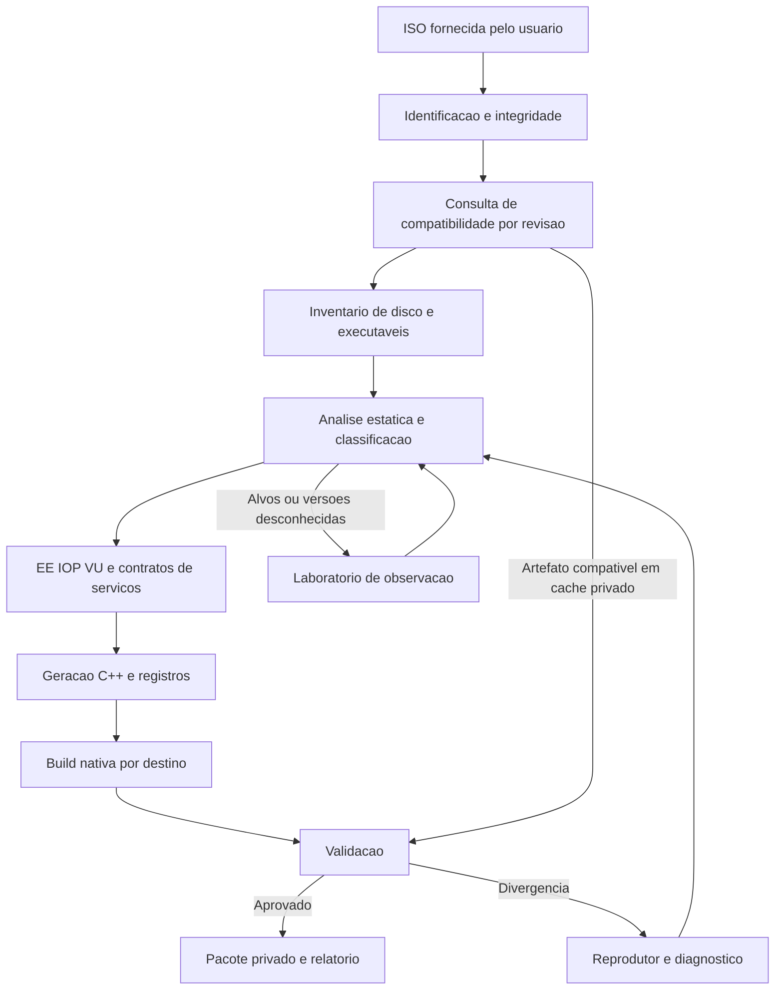

# PS2 Native Recompiler — plano mestre de automação universal

> **Meta:** uma pessoa fornece sua ISO de PS2, escolhe PC e/ou Android e recebe um pacote nativo instalável, com preparação automática e evidências de compatibilidade.
>
> **Autonomia final:** o próprio sistema descobre, diagnostica, propõe reparos e valida títulos novos, sem exigir agentes externos ou edição humana por jogo. As correções manuais da fase inicial devem virar capacidades reutilizáveis. A meta de 90% é intermediária; a direção de expansão é toda a biblioteca PS2.
>
> **Ambição de cobertura:** alcançar pelo menos 90% de sucesso conjunto nos destinos definidos, dentro de um catálogo versionado e representativo. Esse número é uma meta de produto; ainda não é um resultado do projeto.
>
> **Estado deste arquivo:** plano de engenharia e pesquisa. As propostas abaixo não foram implementadas apenas por estarem documentadas.

**Auditoria:** 28–29 de setembro de 2026.\
**Repositório:** `/home/pedrohs/Downloads/ps2-native-recompiler`.\
**Origem:** [ran-j/PS2Recomp](https://github.com/ran-j/PS2Recomp).\
**Commit base local:** `75d729ce40d7eed9649fd4bb05628dee520f3d0c`, com alterações locais anteriores a este documento.\
**Primeiro jogo de referência:** Monster House, executável `SLUS_214.00`, revisão fornecida pelo usuário.\
**Destinos iniciais:** Linux x86-64, Windows x86-64 e Android ARM64.\
**Forma de execução deste planejamento:** análise individual; nenhuma nova delegação após a instrução de trabalhar sem subagentes.

Este documento concentra visão, auditoria, decisões, arquitetura, experimentos, tarefas e critérios de entrega. Ele amplia a visão de [PROJECT_SPEC.md](PROJECT_SPEC.md) para incluir processamento em nuvem e um destino final sem interpretação de instruções de jogo. Onde a especificação anterior admite fallback no produto, este plano o restringe ao laboratório de diagnóstico. A mudança de contrato ainda precisa ser refletida no software.

## Índice

1. [O produto e seu contrato](#s01)
2. [O que realmente existe](#s02)
3. [Como medir os 90%](#s03)
4. [Conhecimento e ferramentas a reaproveitar](#s04)
5. [Arquitetura geral](#s05)
6. [Artefatos, identidades e contratos](#s06)
7. [Entrada, disco e descoberta de código](#s07)
8. [Compilador e semântica do EE](#s08)
9. [IOP, VU e serviços do sistema](#s09)
10. [Gráficos, áudio, vídeo e tempo](#s10)
11. [Diagnóstico e primeiro port: Monster House](#s11)
12. [Técnicas experimentais propostas](#s12)
13. [Compilação rápida e uso correto da GPU](#s13)
14. [Motor autônomo de correção e pipeline de nuvem](#s14)
15. [Isolamento, dados e cadeia de distribuição](#s15)
16. [Pacotes para PC e Android](#s16)
17. [Validação de correção e jogo completo](#s17)
18. [Catálogo e crescimento da compatibilidade](#s18)
19. [Observabilidade e classificação de falhas](#s19)
20. [Marcos e ordem de execução](#s20)
21. [Backlog executável](#s21)
22. [Riscos previstos e respostas](#s22)
23. [Custos, capacidade e prazo](#s23)
24. [Organização do código e decisões de arquitetura](#s24)
25. [Comandos que existem hoje](#s25)
26. [Critérios finais e próximos passos](#s26)
27. [Fontes e glossário](#s27)
28. [Pesquisa avançada e experimentos de fronteira](#s28)
29. [Mais três ISOs depois de Monster House](#s29)
30. [Execução imediata e compromisso de qualidade](#s30)

<a id="s01"></a>
## 1. O produto e seu contrato

### 1.1 Experiência desejada

O usuário seleciona uma ISO, escolhe destinos e recebe um resultado compreensível:

1. A imagem é identificada, verificada e associada à revisão exata.
2. O sistema informa se aquela revisão já tem compatibilidade validada.
3. A preparação ocorre localmente ou em um ambiente privado de nuvem.
4. O pipeline descobre executáveis e módulos, traduz código, compila e valida.
5. São entregues um pacote para PC e/ou um pacote Android, além de controles e dados necessários.
6. O jogo instalado funciona offline, salvo funcionalidades que originalmente dependam de rede.
7. Uma revisão ainda não suportada recebe um diagnóstico reproduzível e não ganha o selo “jogo completo”.

A experiência pode ser simples mesmo quando o processamento interno é complexo. Perfis de compatibilidade podem ser selecionados automaticamente por identidade forte. O usuário final não deve editar TOML, informar endereços de funções nem corrigir C++.

### 1.2 O significado de “nativo”

O contrato final proposto é:

- Código do jogo para EE/R5900 convertido antecipadamente em código de máquina do host.
- Código específico do jogo para IOP convertido antecipadamente quando for necessário executá-lo.
- Microprogramas VU conhecidos convertidos antecipadamente; funções reconhecidas podem usar implementações nativas equivalentes verificadas.
- Serviços de sistema, memória, dispositivos, gráficos, áudio e sincronização implementados por uma camada nativa de compatibilidade.
- Nenhum interpretador genérico de instruções EE/IOP/VU ou JIT desses processadores no caminho de execução do pacote qualificado.
- Alvos desconhecidos e versões inesperadas de código produzem diagnóstico explícito; não ativam silenciosamente um emulador.

Essa camada continua reproduzindo comportamentos do PS2. Recompilar a CPU não elimina a necessidade de implementar GS, VIF, GIF, DMA, SPU2, CDVD e temporização.

**O protótipo atual não satisfaz esse contrato estrito:** seu EE usa C++ recompilado, mas o IOP possui um interpretador R3000A e há interpretação de microprogramas VU. Isso deve aparecer no relatório técnico até a migração estar concluída.

Durante o desenvolvimento, emuladores e interpretadores de referência são ferramentas importantes de observação e comparação. Executá-los no laboratório ou no builder não equivale a entregá-los como o mecanismo do jogo recompilado.

### 1.3 O significado de “descompilar tudo em C++”

A saída inicial deve ser **C++ semanticamente equivalente ao código de máquina identificado**, com estado explícito do processador e metadados de origem.

Não é necessário recuperar nomes originais de classes, comentários, tipos de alto nível ou a organização original do projeto. Uma ISO não contém necessariamente essas informações. Transformar essa recuperação em requisito atrasaria o caminho até o jogo executável.

Distinguir três produtos:

| Produto | Finalidade |
|---|---|
| C++ gerado | Compilar e preservar a execução do jogo |
| Relatório de análise | Explicar funções, módulos, relações e incertezas |
| Reimplementações de alto nível | Substituir componentes reconhecidos quando houver equivalência comprovada |

A ferramenta e as contribuições ao runtime podem ser abertas. A geração de C++ a partir de um jogo não atribui automaticamente uma nova licença ao conteúdo de entrada. Preservar a origem e a separação entre infraestrutura, perfis e artefatos privados.

### 1.4 Limites de promessa

“Qualquer ISO” é a direção de expansão da ferramenta. Não é possível afirmar hoje que toda imagem arbitrária será transformada automaticamente em um port completo.

Entradas inválidas, formatos ainda não suportados, executáveis compactados, código gerado durante a execução, periféricos específicos e dependências de serviços externos podem impedir uma entrega automática.

Para um catálogo conhecido, é possível desenvolver suporte progressivo, perfis automáticos e um ciclo de descoberta assistida. A cobertura observada precisa ser publicada com seu denominador, suas revisões e seus dispositivos.

### 1.5 Definição proposta de concluído

Uma revisão só recebe a classificação completa quando:

- Instala e inicia do zero nos destinos declarados.
- Passa por menus, gameplay, cenas, áudio e transições.
- Salva, fecha, reabre e carrega o progresso corretamente.
- Permite completar a campanha ou os modos centrais definidos para aquele jogo.
- Atende aos critérios de fidelidade e desempenho na matriz de hardware declarada.
- Não executa instruções de jogo por interpretação/JIT.
- Pode ser reconstruída por um pipeline limpo usando entradas e versões registradas.
- Não depende de edições manuais perdidas em `build/`.
- Tem evidências associadas ao hash do pacote entregue.

<a id="s02"></a>
## 2. O que realmente existe

### 2.1 Inventário auditado

| Componente | Evidência local | Situação real |
|---|---|---|
| Inspeção e extração de ISO | [tools/iso_inspect](tools/iso_inspect/README.md) | ISO9660/Joliet, BOOT2, hashes e inventário ELF; formatos especiais têm limites explícitos |
| Orquestração local | [pipeline.py](tools/ps2native/pipeline.py), [cli.py](tools/ps2native/cli.py) | Inspeciona, extrai, analisa, recompila e prepara pacote |
| Analisador | [ps2xAnalyzer/src](ps2xAnalyzer/src) | Símbolos, heurísticas, padrões, classificação e TOML |
| Recompilador EE | [ps2xRecomp/src/lib](ps2xRecomp/src/lib) | R5900 → C++, com relatórios e caminhos de instrução não tratada |
| Registro de módulos | [function_table_emitter.cpp](ps2xRecomp/src/lib/function_table_emitter.cpp), [ps2_runtime.cpp](ps2xRuntime/src/lib/ps2_runtime.cpp) | Tabelas por módulo, aliases e ativação associada ao carregamento |
| Descoberta de ELF secundário | [pipeline.py](tools/ps2native/pipeline.py) | Heurística baseada em ELF/MIPS III; não cobre todos os overlays ou IRX |
| Runtime | [ps2xRuntime/src/lib](ps2xRuntime/src/lib) | Memória, escalonamento, serviços, gráficos, áudio, VFS e integração IOP parciais |
| IOP | [ps2xIOP/README.md](ps2xIOP/README.md), [iop_cpu.cpp](ps2xIOP/src/emulator/core/iop_cpu.cpp) | Interpretador R3000A, kernel virtual, imports e serviços HLE |
| VU | [ps2_vu1_core.cpp](ps2xRuntime/src/lib/vu/ps2_vu1_core.cpp), [ps2_runtime.cpp](ps2xRuntime/src/lib/ps2_runtime.cpp) | Execução de microprogramas presente; AOT integral não demonstrado |
| GS | [gs_cpu_backend.cpp](ps2xRuntime/src/lib/gs/gs_cpu_backend.cpp), [gs_backend.h](ps2xRuntime/include/runtime/gs/gs_backend.h) | Backend de rasterização em CPU e interface útil para evolução |
| Desktop | [template CMake](tools/ps2native/templates/desktop/CMakeLists.txt) | Executável do ABI do host; não há produto multiplataforma certificado |
| Android | [app/build.gradle](android/app/build.gradle), [Activity](android/app/src/main/java/com/ps2x/runner/Ps2PackageActivity.java) | Projeto ARM64 e preparação de assets; APK do jogo não validado |
| Controles de toque | [ps2_android_runtime.cpp](ps2xRuntime/src/lib/ps2_android_runtime.cpp) | O arquivo ainda contém TODO para overlay de controles |
| Testes | [ps2xTest](ps2xTest/CMakeLists.txt), [test_cli.py](tools/ps2native/tests/test_cli.py) | Existem suítes de componentes; não demonstram campanha completa |
| CI | [build.yml](.github/workflows/build.yml) | Builds/testes Linux e Windows; não é o serviço de conversão em nuvem |
| Serviço de nuvem | Árvore e workflows auditados | Não foi encontrado API/filas/storage/workers que implementem o produto descrito |
| Compatibilidade de Monster House | Logs privados da execução local | Boot parcial; nenhuma tela jogável comprovada |

A estrutura planejada `profiles/`, uma representação intermediária semântica própria e o serviço cloud não devem ser apresentados como componentes já implementados apenas porque aparecem em documentos anteriores.

### 2.2 Monster House: números com contexto

Workspace auditado:

```text
build/ps2native/
  monster-house-br-usa-t2.0-www.romsportugues.com-cb596f3249f4/
    run-49a313b6d817/
```

Identidade do executável:

```text
boot: SLUS_214.00
entrypoint: 0x00100008
ELF SHA-256:
e279c66114a1c1e98c94f69048a2fa5dbd4479d2a031e512b0e7d630d4070b5d
```

O log mais recente de geração `logs/recompiler-vtable-batch.log` registra:

| Medida | Valor observado | Interpretação correta |
|---|---:|---|
| Funções descobertas/processadas | 7.224 | Resultado do analisador, não total verdadeiro conhecido do jogo |
| Funções recompiladas | 7.033 | Contador de processamento; não prova correção |
| Funções ligadas a stubs | 191 | É preciso auditar se cada handler implementa o comportamento necessário |
| Funções geradas | 7.234 | Não é percentual de jogo portado |
| Entradas adicionais | 402.358 | Pode haver grande expansão de pontos de retomada |
| Entradas de fallback indireto | 765.944 | Fallback de despacho/análise; não prova interpretação funcional de código desconhecido |
| Ocorrências de instruções não tratadas | 13.706 | Exigem deduplicação por endereço e classificação código/dados |
| Warnings | 2.280 | Pendências de análise não desaparecem porque o link terminou |
| `register_functions.cpp` | 78.809.054 bytes | Aproximadamente 78,8 MB decimais; gargalo concreto de compilação |

Há registros com palavras como `0xefefefef` e padrões que podem ser dados dentro de faixas classificadas como função. Isso sustenta uma **hipótese de erro de delimitação**, não a conclusão de que todas as 13.706 ocorrências sejam falsas. Também há endereços repetidos no log: não contar ocorrências como instruções únicas.

O `manifest.json` salvo contém contadores anteriores, incluindo 7.233 funções geradas e 401.678 entradas adicionais. O pacote foi alterado após a produção original desse manifest. Logo, **o manifest não é atualmente uma atestação fiel da última build**. Corrigir essa associação é uma prioridade.

O último teste de aproximadamente 25 segundos:

- Inicializou janela, áudio e o runtime.
- Recebeu o caminho da ISO.
- Registrou o carregamento do ELF e mensagens de reboot do IOP.
- Terminou seu log em `IOP syncing...`.
- Produziu captura preta/magenta.
- Foi encerrado pelo teste; não houve evidência de gameplay.

O renderer informado nesse teste foi `llvmpipe`, sob Xvfb. Ele não mede o desempenho da GPU física.

### 2.3 Diagnósticos anteriores que precisam de precisão

A última linha do log não identifica necessariamente a função em que o processo ficou preso.

Em particular, [SIF.cpp](ps2xRuntime/src/lib/Kernel/Stubs/SIF.cpp) implementa `sceSifSyncIop` retornando `1`. Antes de modificar esse retorno, é preciso capturar o PC convidado, a pilha nativa e o estado do escalonador. O travamento pode estar depois da mensagem, em uma chamada diferente ou em uma espera sem progresso.

A ausência de novas mensagens de `sceCdRead unresolved LBN` no teste curto também não demonstra que todo o CD está correto. O teste pode simplesmente não ter alcançado a mesma leitura.

### 2.4 Dívida concreta criada durante a exploração

1. A configuração de argumentos de Monster House foi aplicada em fonte gerada; deve virar perfil/hook persistente com identidade exata.
2. Uma correção de `isnan` foi reaplicada após geração; deve entrar no emissor ou helper apropriado.
3. O launcher do pacote conhece `PS2NATIVE_CD_IMAGE`, mas o gerador de launchers em `pipeline.py` ainda não reproduz essa conveniência.
4. Alternar IPO no mesmo diretório provocou recompilação ampla; houve reaproveitamento manual de objetos/timestamps. Esse histórico deve ser substituído por builds limpas e cache com identidade.
5. O registro de funções é enorme e repete bindings em estruturas distintas.
6. O pipeline desativa unity build e PCH mesmo existindo opções no runtime.
7. `_run()` captura stdout inteiro em memória e só grava depois do término; isso dificulta progresso e limites de log.
8. Um log antigo de smoke ocupa aproximadamente 689 MB. Repetição sem limite pode ocupar disco e mascarar o primeiro erro.
9. `status: complete` significa conclusão do pipeline de build; o próprio manifest mantém gameplay não verificado.
10. Android configura `release` com assinatura de debug. Não tratar esse artefato como release distribuível sem revisar assinatura.

Esses pontos são oportunidades de acelerar o trabalho com correção. Não justificam descartar o código existente.

<a id="s03"></a>
## 3. Como medir os 90%

### 3.1 Fixar o denominador

Criar um catálogo versionado `C` de revisões distintas, identificado por hashes. O catálogo deve incluir jogos de diferentes motores, anos, regiões, mídias, formatos de código e tipos de carga.

Para cada revisão `g` e destino `t`, definir:

```text
success(g, t) =
    preparação automática
    AND build reproduzível
    AND pacote instalável
    AND AOT estrito
    AND funcionamento completo no protocolo da revisão
    AND desempenho aprovado no hardware declarado
```

Publicar separadamente:

```text
PC_Linux = sucessos Linux / total do catálogo
PC_Windows = sucessos Windows / total do catálogo
Android = sucessos Android / total do catálogo

Conjunto_PC_Android =
    revisões aprovadas simultaneamente em todos os destinos obrigatórios
    / total do catálogo
```

A meta principal é `Conjunto_PC_Android >= 0,90`. Se o conjunto de destinos mudar, criar outra versão da métrica.

Um título que passou no PC e falhou no Android não entra no numerador conjunto. Um título não tentado permanece no denominador do catálogo congelado.

### 3.2 Separar compatibilidade de automação

Duas taxas respondem a perguntas diferentes:

- **Compatibilidade automática:** quantos jogos do catálogo conseguem a entrega completa, sem intervenção naquela submissão.
- **Novos títulos sem ajuste:** quantos jogos nunca usados no desenvolvimento funcionam sem criar um novo perfil ou corrigir a ferramenta.

Um perfil previamente produzido e selecionado automaticamente pode contar para experiência plug-and-play. Isso não demonstra que um título desconhecido seja resolvido sem engenharia adicional.

Registrar tempo de intervenção por título e por família de engine. Reduzir esse tempo é uma meta tão relevante quanto reduzir minutos de compilação.

### 3.3 Níveis de evidência

| Nível | Critério | Pode anunciar jogo completo? |
|---|---|---|
| E0 — inventariado | Disco e executáveis identificados | Não |
| E1 — compilado | Artefato nativo produzido | Não |
| E2 — inicializado | Boot e menu reproduzidos | Não |
| E3 — jogável | Gameplay representativo, controles e áudio | Não |
| E4 — completo no protocolo | Campanha/modos centrais, saves, transições e destinos aprovados | Sim, com escopo publicado |
| E5 — manutenção validada | Regressões, sessões prolongadas e atualizações aprovadas | Fortalece a entrega |

Nenhum teste finito demonstra todas as sequências possíveis de ações. “Completo” significa cumprir um protocolo público suficientemente exigente, com rotas, exceções e limitações explícitas.

### 3.4 Métricas técnicas auxiliares

- Cobertura de bytes de código classificados, com categorias separadas para dados e desconhecidos.
- Cobertura dinâmica de blocos/arestas nos cenários executados.
- Número de destinos indiretos sem resolução.
- Quantidade de epochs/versões de código conhecidas e desconhecidas.
- Instruções EE/IOP/VU interpretadas em builds de diagnóstico, separadamente.
- Stubs classificados como implementação completa, parcial, retorno artificial ou desconhecido.
- Divergências de registradores, memória, eventos, frames e áudio.
- Tempo de build frio, build incremental e consulta de cache.
- P50/P95 de duração por etapa; pico de RAM e disco.
- Tempo de frame, velocidade de simulação, latência de áudio e temperatura no celular.
- Taxa de sucesso sem intervenção em revisões mantidas fora do desenvolvimento.

Cobertura de execução alta pode significar repetir o menu muitas vezes. Por isso, publicar também cenas, transições e rotas visitadas. Uma proporção de 90% de instruções AOT não satisfaz o contrato de jogo completo AOT.

### 3.5 Avaliação sem favorecer o próprio resultado

Começar com corpus pequeno e estratificado, mas manter um conjunto separado de títulos/revisões que não orienta os patches.

A divisão deve ocorrer por família/engine quando possível. Colocar duas revisões quase idênticas em desenvolvimento e avaliação pode produzir uma taxa artificialmente alta.

Quando houver apenas amostragem, publicar intervalo de confiança e método de seleção. Uma amostra conveniente de sucessos não permite extrapolar para a biblioteca inteira.

<a id="s04"></a>
## 4. Conhecimento e ferramentas a reaproveitar

A estratégia é selecionar componentes que eliminem trabalho real. Integrar muitas ferramentas sobrepostas pode consumir mais tempo do que reutilizar um conjunto pequeno e confiável.

| Projeto/ferramenta | Uso proposto | Limite e decisão |
|---|---|---|
| [PS2Recomp](https://github.com/ran-j/PS2Recomp) | Base já integrada para análise, tradução e runtime | Preservar a base; corrigir lacunas observadas e manter rastreio do upstream |
| [PCSX2](https://github.com/PCSX2/pcsx2) | Referência diferencial, debugger e estudo de subsistemas maduros | Não embutir um emulador completo e classificar isso como port AOT |
| [Play!](https://github.com/jpd002/Play-) | Referência para HLE e operação em Android/ARM | Compatibilidade e interfaces diferem; reaproveitamento exige auditoria técnica e de licença |
| [ps2sdk](https://github.com/ps2dev/ps2sdk) | Programas sintéticos, contratos de bibliotecas e módulos de teste | SDK homebrew não implementa automaticamente todo comportamento de SDKs comerciais |
| [ps2autotests](https://github.com/unknownbrackets/ps2autotests) | Casos pequenos com resultados de hardware | Incorporar casos relevantes e registrar a origem da expectativa |
| [ps2tek](https://psi-rockin.github.io/ps2tek/) | Referência de hardware para formular e revisar hipóteses | Resolver ambiguidades por testes; documentação isolada não é certificado |
| [Rabbitizer](https://github.com/Decompollaborate/rabbitizer) | Decodificação R5900 já usada | Decoder identifica instruções; a semântica continua sendo responsabilidade do projeto |
| [Ghidra](https://github.com/NationalSecurityAgency/ghidra) | Análise headless, mapas de funções, xrefs e investigação | Validar o processor/language e extensões PS2; pseudocódigo não é compilador correto por si só |
| [N64Recomp](https://github.com/N64Recomp/N64Recomp) | Aprender organização de recompilação e overlays/relocações | N64 e PS2 têm diferenças de ISA, VU e hardware; não é backend substituto |
| [XenonRecomp](https://github.com/hedge-dev/XenonRecomp) | Referência para hooks e otimizações sob contratos de ABI | PPC/Xbox 360 não é R5900; só transportar a ideia com validação |
| [angr](https://github.com/angr/angr) | Experimentos limitados de exploração e resolução de alvos | Não assumir semântica completa de R5900/MMI/VU; adaptador e custo podem inviabilizar |
| [Z3](https://github.com/Z3Prover/z3) | Equivalência de operações inteiras e precondições em blocos pequenos | Timeout é desconhecido; não prova jogo inteiro |
| [Alive2](https://github.com/AliveToolkit/alive2) | Verificar transformações LLVM em experiências futuras | Não verifica automaticamente o levantamento PS2 nem todo LTO interprocedural |
| [Clang ThinLTO](https://clang.llvm.org/docs/ThinLTO.html) e [LLVM DTLTO](https://www.llvm.org/docs/DTLTO.html) | LTO incremental e distribuição futura de trabalho de backend | Fixar versão de Clang/LLD e testar suporte do alvo antes da adoção |
| [sccache](https://github.com/mozilla/sccache) | Cache local/remoto de compilação; já existe integração opcional | Cache não acelera um miss por má identidade ou fonte sempre reescrita |
| [Bazel remote caching](https://docs.bazel.build/versions/main/remote-caching.html) | Referência para cache por ação e execução distribuída posterior | Manter CMake inicialmente; migração só com benefício medido |
| [Firecracker](https://github.com/firecracker-microvm/firecracker) | Opção de isolamento de jobs CPU em microVM | Avaliar KVM/host; GPU não deve ser pressuposta nessa arquitetura |
| [Android NDK e ferramentas de publicação](https://developer.android.com/studio/publish/app-signing) | Compilar, alinhar, assinar e verificar o pacote mobile | A disponibilidade da toolchain não prova fidelidade nem desempenho do jogo |

### 4.1 O exemplo de Simpsons: Hit & Run

O [repositório do port Android citado](https://github.com/Carlox33/The-Simpsons-Hit-and-Run-Android) se apresenta como continuação de ports anteriores e pede os arquivos da **versão PC**. É uma referência útil de integração Android, controles e mídia.

Ele não demonstra um conversor genérico de ISO PS2. Usá-lo como referência de produto e comparar sua arquitetura é válido; assumir que resolve a descoberta e recompilação de qualquer binário PS2 seria uma inferência incorreta.

### 4.2 Ordem de preferência para reutilização

1. Corrigir e usar módulos já existentes e testados.
2. Estudar implementações maduras e reproduzir testes observáveis.
3. Integrar código compatível quando a fronteira técnica e sua licença estiverem claras.
4. Criar adaptadores pequenos ao redor de APIs estáveis.
5. Implementar algo novo somente onde os caminhos anteriores não resolvem o problema.
6. Registrar a alternativa descartada e a medição que motivou a escolha.

Reutilizar um GS maduro pode economizar muito trabalho, mas extrair um subsistema de um emulador pode exigir memória, DMA, threads e estado global desse projeto. Fazer um experimento de integração delimitado antes de assumir que é uma biblioteca pronta.

<a id="s05"></a>
## 5. Arquitetura geral

### 5.1 Fluxo de entrega



O laboratório pode usar execução de referência. O pacote final qualificado contém apenas o resultado AOT e os serviços nativos aceitos.

### 5.2 Separação de responsabilidades

| Camada | Responsabilidade | Evitar |
|---|---|---|
| Cliente | Seleção de ISO, destino, progresso e download | Pedir endereços internos ao usuário |
| API | Identidade, autorização, orçamento e jobs | Executar ferramentas pesadas dentro de requests HTTP |
| Orquestrador | Dependências, retries, cancelamento e publicação | Decidir correção de tradução por mensagem textual de sucesso |
| Builder | Análise, geração e compilação | Acesso amplo a contas, segredos ou diretórios do host |
| Laboratório | Replays, snapshots, comparação e reprodutores | Tratar referência única como verdade infalível |
| Runtime | Serviços PS2, despacho de AOT e adaptação ao host | Descoberta remota obrigatória durante o jogo |
| Catálogo | Revisões, perfis, estado e evidência | Marcar todos os discos de um serial como equivalentes |
| Assinatura | Assinar artefato aprovado | Disponibilizar chaves privadas ao processo que analisou a ISO |

### 5.3 Caminho curto e caminho longo

**Caminho curto, revisão já suportada:** verificar identidade, obter análise/perfil/objetos válidos do cache autorizado, construir o destino necessário, validar checks mínimos e entregar.

**Caminho longo, revisão desconhecida:** inventariar, analisar, executar laboratório com orçamento, identificar divergências e produzir diagnóstico. Esse caminho pode exigir trabalho de engenharia e não deve prometer entrega automática em minutos.

Um sucesso no caminho longo pode gerar um perfil reutilizável que torne as próximas submissões do mesmo título rápidas.

<a id="s06"></a>
## 6. Artefatos, identidades e contratos

### 6.1 Identidade forte

O hash da ISO é necessário, mas não basta como chave única de todos os caches.

```text
DiscIdentity:
  hash da imagem original
  formato e geometria de setores
  SYSTEM.CNF e caminho de boot
  serial e região inferida
  manifest de extents e hashes de arquivos

CodeIdentity:
  hash do módulo
  ISA e variante
  mapa de carga e relocações
  versão de código/epoch
  perfil semântico
  versão do analisador e decoder

BuildIdentity:
  CodeIdentity
  fontes geradas
  runtime ABI e hash do runtime
  compilador/linker e flags efetivas
  target triple e CPU baseline
  dependências e toolchain
  perfil de compatibilidade
```

ISO traduzida, modificada ou com outra ordem de setores recebe identidade própria. Duas ISOs com o mesmo ELF podem compartilhar determinadas análises, mas não necessariamente layout de disco, áudio, vídeo ou dados.

### 6.2 Artefatos por etapa

| Artefato proposto | Conteúdo |
|---|---|
| `disc-manifest.json` | Identidade, layout, arquivos, extents e dependências |
| `code-inventory.json` | EE, IOP, VU, candidatos, origem e confiança |
| `code-map.json` | Blocos, dados, alvos, limites, relocações e desconhecidos |
| `semantic-report.json` | Instruções únicas, semântica suportada e falhas |
| `module-registry.json` | Identidade e ativação das versões recompiladas |
| `build-manifest.json` | Entradas exatas, ferramentas, flags e resultados |
| `validation-report.json` | Rotas executadas, divergências e critérios |
| `compatibility.json` | Nível aprovado por destino e revisão |
| `provenance.json` | Relação entre pacote, build e evidências |
| `failure-bundle` | Reprodutor mínimo privado e contexto do primeiro erro |

Esses nomes descrevem contratos propostos. O pipeline atual possui `manifest.json`, `source_manifest.json`, `function_coverage.csv` e `address_coverage.csv`; a migração deve preservar compatibilidade com consumidores existentes.

### 6.3 Estados que não confundem build com jogo pronto

```text
submitted
  -> validating_input
  -> analyzing
  -> generating
  -> compiling
  -> build_complete
  -> validating_runtime
  -> playable_unverified_completion
  -> qualified_complete
  -> packaging
  -> delivered
```

Estados alternativos:

```text
unsupported_input
needs_analysis
semantic_gap
runtime_divergence
budget_exhausted
infrastructure_failed
cancelled
```

Armazenar o estado da build e a classificação do jogo em campos separados. `build_complete` pode coexistir com `semantic_gap` e compatibilidade não verificada.

### 6.4 Escrita e publicação

- Cada etapa recebe entradas imutáveis e escreve em um diretório temporário próprio.
- Só publicar o manifest de conclusão após hashes e outputs estarem persistidos.
- Jobs repetidos devem produzir efeitos idempotentes.
- Um worker antigo não pode sobrescrever o resultado de uma tentativa mais recente; usar lease e token de geração.
- O manifesto final registra o hash do binário realmente distribuído.
- Alteração manual de um artefato invalida sua atestação.
- Pacotes assinados podem variar por fatores da assinatura; distinguir reprodutibilidade do payload de reprodutibilidade byte a byte do pacote final.

### 6.5 Exemplo de relatório desejado

Exemplo de esquema futuro, não uma declaração de sucesso atual:

```json
{
  "schema_version": 2,
  "revision_id": "sha256:...",
  "target": "aarch64-linux-android",
  "build": {
    "status": "build_complete",
    "artifact_sha256": "..."
  },
  "execution_contract": {
    "mode": "strict_aot",
    "unknown_code_policy": "stop_with_report"
  },
  "validation": {
    "level": "E2",
    "campaign_complete": false,
    "unexpected_code_versions": 0,
    "evidence_id": "..."
  },
  "compatibility": {
    "status": "not_qualified"
  }
}
```


<a id="s07"></a>
## 7. Entrada, disco e descoberta de código

### 7.1 Preservar o disco como dispositivo

Extrair arquivos resolve caminhos por nome, mas não preserva sozinho o comportamento de leituras por setor.

O pipeline precisa manter:

- Imagem original ou representação equivalente dos setores.
- Relação entre LBN/LBA, extents, arquivos e regiões sem nome.
- Geometria e tamanho de setor usados pela API.
- Metadados de mídia e diferenças entre caminhos CD/DVD relevantes.
- Identidade de todos os arquivos e módulos referenciados.

A correção recente que aceita uma ISO no runner confirma a necessidade de distinguir `file_open(path)` de `read_sector(lbn, count)`.

No futuro, um pacote pode transportar um arquivo de dados indexado que preserve a visão de disco sem carregar uma cópia desnecessária de todo arquivo extraído. Isso exige demonstrar que todos os setores acessíveis estão representados. Remontar uma ISO com outra ordem de arquivos pode quebrar jogos que usam endereços fixos.

### 7.2 Formatos e classificação

Primeiro estabilizar o formato já suportado. Depois acrescentar, em etapas independentes:

1. Variações de ISO9660/Joliet e arquivos multi-extent.
2. Discos grandes e leituras próximas às bordas dos extents.
3. Mídias de múltiplos discos com troca explícita.
4. Contêineres comprimidos ou faixas brutas, por adaptadores específicos.
5. Arquivos internos compactados que possam conter executáveis ou microcódigo.

Uma extensão `.iso` não identifica o console nem garante consistência. O inspector deve produzir `unsupported_input` para layouts que não entende.

### 7.3 Inventário de executáveis

Para cada candidato, preservar:

- Offset e container de origem.
- Cabeçalho ELF, segmentos, seções, flags e símbolos disponíveis.
- Evidência de ISA: EE, IOP, VU ou desconhecida.
- Imports, exports, relocações e rotina de carregamento.
- Endereço de entrada e mapa de memória esperado.
- Possível compressão, relocação ou sobreposição de regiões.
- Grau de confiança e contradições da classificação.

`EM_MIPS` e flags isoladas não bastam para declarar que um módulo é EE. IRX e executáveis secundários precisam de classificação própria. Nomes de arquivos ajudam a investigar, mas não devem decidir o decoder.

### 7.4 Descoberta em camadas

Aplicar análise do mais confiável ao mais incerto:

1. Segmentos, símbolos e relocações explícitos.
2. Mapas externos verificáveis associados ao hash correto.
3. Alvos diretos de controle.
4. Propagação de constantes e análise de fluxo de valores.
5. Jump tables com limites e evidência de uso.
6. Tabelas de ponteiros, vtables e trampolins.
7. Funções próximas, thunks e prólogos conhecidos.
8. Observações de execução de referência.
9. Investigação manual das regiões restantes.

Cada conclusão deve ter origem. Um endereço “encontrado porque parece ponteiro” não tem a mesma força de um salto executado e capturado.

### 7.5 Separar código de dados

A representação precisa admitir:

```text
instruction
embedded_data
padding
vu_payload
relocation_data
mixed_region
unknown
```

Não usar o fim da próxima função como prova de que todos os bytes intermediários são instruções. Isso pode inflar o registro e gerar milhares de erros sobre texto, constantes e preenchimento.

Na auditoria de Monster House, a função estimada `sub_00355F80` aparece associada a erros muito adiante no binário. Uma tarefa prioritária é conferir seus limites contra fluxo real, xrefs e conteúdo. O objetivo não é silenciar o relatório; é torná-lo semanticamente correto.

### 7.6 Alvos indiretos e pontos de retomada

Distinguir:

- Entrada de função.
- Label interno.
- Retorno de chamada.
- Continuação após yield/interrupção.
- Destino de jump table.
- Entrada alternativa de uma função.
- Endereço inválido ou pertencente a outra versão do módulo.

Não mapear um PC para a “função mais próxima” sem garantir que o código gerado pode retomar exatamente naquele ponto.

A chave conceitual do despacho deve incluir:

```text
address_space + module_identity + load_epoch + guest_pc
```

A geração de centenas de milhares de aliases pode ser uma solução conservadora útil, mas precisa ser medida. Reduzir aliases exige preservar todos os pontos de retomada realmente necessários.

### 7.7 Overlays e código modificado

Implementar eventos explícitos de:

- Carga, relocação, ativação e descarga de módulo.
- Escrita em região executável.
- Publicação de uma nova versão executável.
- Invalidação de traduções ou bindings antigos.
- Mudança de mapeamento que altera a identidade do código.

Detectar writes em páginas ajuda, mas não é suficiente quando há alias, DMA ou cópia indireta. Instrumentar o caminho central de memória e carregadores; proteção de páginas do host é uma ferramenta complementar de diagnóstico.

Uma escrita que só muda constantes dentro do código pode, em casos delimitados, ser transformada em parâmetro da versão AOT. Isso exige análise da semântica exata. Uma alteração arbitrária de opcode precisa de outra versão recompilada ou permanece fora do suporte estrito.

### 7.8 Descoberta assistida por execução

O builder de diagnóstico pode:

1. Executar uma referência com entradas reproduzíveis.
2. Registrar destinos de salto e eventos de carga.
3. Capturar bytes de regiões executáveis após descompressão.
4. Associar cada captura a hash, origem, relocação e estado.
5. Recompilar novas regiões fora da execução do pacote final.
6. Repetir as rotas e comparar os resultados.

Esse método aproxima a análise de um ponto fixo observado. Não demonstra que todas as possibilidades futuras de código foram enumeradas. Rotas desconhecidas, cheats, conteúdo opcional e saves diferentes precisam continuar sendo considerados.

<a id="s08"></a>
## 8. Compilador e semântica do EE

### 8.1 Evoluir o emissor existente

Manter o caminho C++ atual como base. Evitar uma reescrita imediata para LLVM ou outro IR.

A evolução sugerida é:

```text
decoder
  -> instrução com metadados
  -> operação semântica explícita
  -> bloco com efeitos
  -> C++ conservador
  -> otimizações sob contratos
  -> experimento opcional com LLVM IR
```

O IR semântico inicial pode ser pequeno e interno. Ele deve resolver duplicação de semântica, rastreio de efeitos e validação; não precisa começar como um framework de compilador completo.

### 8.2 Modelo de estado

O estado convidado deve representar tudo que pode ser observado pelo jogo ou pelo runtime:

- Registradores inteiros e suas porções relevantes.
- HI/LO e bancos associados às operações específicas.
- PC, próximo PC, estado de delay slot e motivo de saída.
- Registradores de ponto flutuante, acumuladores e flags necessárias.
- Estado de COP0, exceções e interrupções modeladas.
- Ligações com VU0 e memória especial.
- Contadores de tempo/eventos usados na sincronização.

Eliminar campos ou convertê-los em variáveis locais só depois de demonstrar que nenhuma saída, callback, interrupção ou chamada observa o valor intermediário.

### 8.3 Checklist semântico por família

| Família | Risco a testar |
|---|---|
| Inteiros de 32/64 bits | Extensão de sinal, truncamento, preservação de lanes e registrador zero |
| Shifts | Máscaras de contagem e comportamento nas bordas |
| Multiplicação/divisão | HI/LO, overflow, divisão por zero e variantes |
| Loads/stores | Alinhamento, acessos parciais, aliases e endianness |
| Branches | Delay slot, branch likely, condições e destino efetivo |
| JAL/JALR/JR | Valor do link, entradas alternativas e retorno não estruturado |
| Exceções | Estado observável, contexto de delay slot e retomada |
| COP0/cache/sync | Interação com mapeamento, tempo, memória e publicação de código |
| COP1/FPU | Arredondamento, flags, valores extremos e diferenças em relação ao host |
| MMI/SIMD | Saturação, ordem das lanes, packing e operações especiais |
| COP2/VU0 | Intertravamento, transferência de registradores e execução macro/micro |
| Syscalls | Convenção de argumentos, retornos, erros e efeitos de memória |

O conjunto de instruções decodificáveis não equivale ao conjunto de semânticas corretas.

### 8.4 Evitar comportamento indefinido do C++

Gerar operações com largura e conversões explícitas:

- Aritmética modular via tipos unsigned apropriados.
- Extensão de sinal definida e testada.
- Máscaras de shift explícitas.
- Acesso a memória sem violações de alinhamento/aliasing do host.
- Tratamento explícito para divisões excepcionais.
- Conversões bit a bit para floats quando necessárias.
- Limites e efeitos MMIO fora de ponteiros diretos arbitrários.
- Proibição de otimizações que pressuponham propriedades que o convidado não oferece.

Sanitizers ajudam a encontrar UB do host, mas não provam semântica do PS2.

### 8.5 Ponto flutuante

Não assumir que SSE, NEON, `float` do C++ e PS2 produzem os mesmos bits para todas as entradas.

Criar um conjunto de vetores por operação, incluindo extremos e dependências de flags. Separar o modelo exigido pelo EE do modelo do VU. Quando houver diferenças, usar helpers de semântica ou sequências específicas do host.

O arquivo [ReleaseMode.cmake](ps2xRuntime/cmake/ReleaseMode.cmake) habilita `/fp:fast` no MSVC. Isso merece auditoria antes de promover a build Windows. Uma opção aceitável para apresentação gráfica pode ser incorreta no código que determina física e estado do jogo.

Evitar `fast-math` global. Qualquer relaxamento deve ter escopo, contrato e evidência de que não altera estados observáveis.

### 8.6 Fluxo não estruturado e escalonamento

Chamadas C++ simples funcionam para muitos casos, mas o convidado pode usar:

- Tail calls.
- Saltos para labels internos.
- Retornos manipulados.
- Threads com stacks próprias.
- setjmp/longjmp ou mecanismos equivalentes.
- Callbacks e interrupções.
- Mudança de módulo no mesmo endereço.

A implementação conservadora deve permitir blocos AOT com saídas explícitas, por exemplo `continue`, `call`, `return`, `yield` e `exception`. Um dispatcher entre blocos já compilados continua sendo AOT; ele não precisa decodificar instruções em tempo de jogo.

Otimizar trechos comprovadamente estruturados para chamadas nativas diretas. Preservar o caminho conservador para regiões complexas.

### 8.7 Um contrato mínimo de bloco

Pseudocódigo arquitetural:

```cpp
struct GuestBlockIdentity {
    uint64_t moduleId;
    uint64_t codeEpoch;
    uint32_t entryPc;
};

struct BlockExit {
    uint32_t nextPc;
    ExitReason reason;
    uint64_t guestCycles;
};

BlockExit executeCompiledBlock(
    GuestState& state,
    RuntimeServices& services);
```

Os nomes e tipos são propostas. A fronteira deve permitir medir efeitos e retomar execução sem depender da stack nativa como representação exclusiva do controle convidado.

### 8.8 Validação da tradução

Comparar:

```text
estado inicial + bytes convidados + eventos controlados
                    |
           execução de referência
                    |
                 estado A

estado inicial + bloco nativo correspondente + mesmos eventos
                    |
                 estado B

comparar A e B na fronteira semântica definida
```

Começar com blocos sem MMIO e aumentar complexidade. Quando há dispositivos, comparar também a sequência ordenada de efeitos, não apenas registradores finais.

Usar minimização automática para reduzir um erro a poucas instruções e entradas. Guardar o caso reduzido como teste de regressão.

### 8.9 Otimizações após correção

Ordem sugerida:

1. Remover geração redundante e aliases comprovadamente desnecessários.
2. Reduzir dependência de headers pesados.
3. Manter registradores locais entre fronteiras sem efeitos externos.
4. Resolver chamadas diretas com identidade estável.
5. Especializar acessos a RAM quando não podem ser MMIO.
6. Agrupar blocos quentes preservando pontos de saída.
7. Aplicar PGO em rotas diversas.
8. Avaliar LLVM IR direto somente com baseline diferencial estável.

Não usar ausência de execução de um bloco em um replay como prova de que ele pode ser apagado.

<a id="s09"></a>
## 9. IOP, VU e serviços do sistema

### 9.1 IOP: a lacuna entre o estado atual e AOT estrito

O componente existente executa IRX por interpretação, oferece um kernel virtual e combina servidores reais de módulos com serviços HLE genéricos.

Migrar sem perder esse conhecimento:

1. Usar o interpretador atual como uma das referências de regressão.
2. Separar carregamento/relocação de módulo da execução de instruções.
3. Criar um frontend R3000A próprio, sem reutilizar automaticamente regras R5900.
4. Recompilar módulos IRX conhecidos para funções/blocos nativos.
5. Manter imports e exports resolvidos por identidade e versão.
6. Preservar o comportamento de threads, semáforos, callbacks e interrupções.
7. Executar testes de RPC/DMA e áudio com implementações AOT.
8. Remover a dependência do interpretador no alvo qualificado.

Um IRX relocável não deve ser recompilado como se seus endereços fossem fixos. Modelar relocações e bases de carga, inclusive relações HI16/LO16 quando aplicáveis.

### 9.2 Serviços HLE

Bibliotecas identificadas podem ser substituídas por serviços nativos se o contrato for suficiente para os usos do jogo.

Cada serviço deve declarar:

- Identidade e versões reconhecidas.
- ABI de parâmetros e retorno.
- Memória lida/escrita.
- Sincronia ou assincronia.
- Eventos, callbacks e interrupções gerados.
- Códigos de erro.
- Dependências de estado e ordem de chamada.
- Casos suportados e casos explicitamente incompletos.

Um retorno constante que permite avançar no boot é um recurso de triagem, não uma implementação completa.

### 9.3 SIF/RPC

Preservar:

- Memórias EE e IOP como espaços distintos.
- Cópia real dos dados transmitidos.
- Disponibilidade e ciclo de vida de cada SID/servidor.
- Ordem de bind, envio, resposta e callback.
- Reboot/reset como transição de estado.
- Bloqueio e desbloqueio de threads.
- Cancelamentos e erros quando um módulo desaparece.

O runtime já tem testes úteis nessa fronteira. Expandir testes com situações de atraso e interleaving, e não apenas sucesso imediato.

### 9.4 VU0 e VU1

Separar ISA macro do EE de programas micro VU.

Plano AOT:

1. Inventariar microprogramas a partir de ELF, transferências e observação.
2. Registrar hash dos bytes, endereço de entrada e estado relevante.
3. Traduzir operações upper/lower com seus efeitos.
4. Representar dependências, flags, branches e latências necessárias.
5. Modelar relações com VIF e transferência ao GS.
6. Compilar CPU inicialmente para obter comparação precisa.
7. Avaliar especialização SIMD e GPU apenas em programas adequados.
8. Invalidar a seleção ao mudar o microcódigo.

Um programa VU pode ser reutilizado entre cenas com dados diferentes. A chave de código não deve incorporar dados irrelevantes, mas precisa incorporar tudo que muda a semântica.

### 9.5 Sincronização entre processadores

Uma conversão rápida pode continuar errada se executar subsistemas na ordem errada.

Adotar inicialmente um escalonador determinístico de eventos:

```text
tempo convidado
  -> execução EE até próxima fronteira
  -> progresso IOP
  -> progresso VU
  -> conclusão DMA
  -> interrupções e callbacks
  -> áudio/vídeo e vblank
```

A ordem exata depende do modelo validado. Não impor essa sequência textual como regra universal do hardware; usá-la como organização da fila de eventos.

Depois introduzir paralelismo do host com relações explícitas de dependência. “Mais threads” não deve mudar o resultado observável.

### 9.6 Estados que devem sobreviver a pausas

Para suspender/retomar corretamente:

- Registradores e PC de todos os contextos.
- Filas de eventos e deadlines convidados.
- Transferências DMA em andamento.
- Estado de RPC e callbacks.
- Microprograma ativo e estado VU.
- Áudio pendente e posição de reprodução.
- Estado de disco/streams.
- Memória de vídeo e caches deriváveis.
- Estado de input e threads.

Saves normais do jogo e snapshots internos são produtos distintos. Não depender de conversão de save states de outro emulador como mecanismo de progresso.

<a id="s10"></a>
## 10. Gráficos, áudio, vídeo e tempo

### 10.1 GS: melhorar uma fronteira existente

O projeto já separa frontend e backend de GS. Usar essa fronteira para criar testes de pacotes e replay gráfico.

Rota proposta:

1. Capturar lotes e estados do frontend.
2. Reproduzir no backend CPU atual.
3. Comparar com referência independente nos casos necessários.
4. Definir uma interface estável de memória, transferências e apresentação.
5. Desenvolver ou adaptar backend GPU.
6. Validar em GPUs de PC e de Android.

A escolha inicial sugerida para evolução é Vulkan, com um backend conservador de referência. A decisão deve passar por um protótipo medido; substituir o renderer inteiro antes do primeiro gameplay aumenta a quantidade de problemas simultâneos.

### 10.2 Casos gráficos que costumam invalidar uma tradução simplista

- Formatos de pixel e endereçamento de VRAM.
- Texturas paletizadas e mudanças de CLUT.
- Render target usado posteriormente como textura.
- Leitura e escrita sobrepostas.
- Blending dependente do destino.
- Alpha test, depth test, máscaras e condições de escrita.
- Regras de rasterização e coordenadas.
- Transfers host→local, local→host e local→local.
- Feedback e invalidação de caches.
- Interlace, resolução e apresentação.
- Sincronização de GIF paths e XGKICK.
- Ordem de comandos que parece redundante, mas produz efeito observável.

Copiar a imagem final para uma textura OpenGL não transforma uma rasterização CPU em renderização GS acelerada por GPU.

### 10.3 Reaproveitamento de renderers maduros

Comparar dois experimentos:

| Experimento | Benefício possível | Custo a medir |
|---|---|---|
| Backend novo atrás da interface atual | Menor acoplamento ao projeto externo | Mais implementação de comportamento gráfico |
| Adaptador para renderer maduro | Muitos casos especiais já conhecidos | Dependência de estado, memória e sincronização do projeto de origem |

Escolher pelo número de casos gráficos aprovados por semana de trabalho e pela manutenção da fronteira, não pelo tamanho do código importado.

### 10.4 Áudio e SPU2

Preservar:

- Vozes e envelopes.
- Pitch, loops e formatos comprimidos usados.
- Transfers de memória e DMA.
- Mixagem, volumes e efeitos relevantes.
- Streaming, buffers e notificações.
- Sincronização com vídeo e tempo convidado.

A validação deve medir underruns, continuidade e sincronização além de “saiu som”.

O backend do host deve manter o jogo sincronizado sem usar o callback de áudio para executar operações pesadas ou bloquear filas de jogo.

### 10.5 Vídeo, IPU e codecs

Monster House possui arquivos `.BIK` no pacote extraído. A existência de um handler MPEG e FFmpeg no desktop não prova suporte ao caminho real de reprodução desses arquivos.

Investigar como o jogo consome a mídia:

- Através de uma biblioteca reconhecida.
- Via código recompilado que decodifica os dados.
- Via IPU ou outro serviço.
- Com áudio separado ou intercalado.
- Com streams por setores.

Uma substituição por decoder nativo precisa preservar entrega de frames, callbacks, timestamps, formato de saída e comportamento de pausa/skip. O suporte FFmpeg desativado por padrão no Android é uma lacuna explícita de integração, não razão para remover cinematics da definição de completo.

### 10.6 Tempo convidado e tempo de parede

O tempo da simulação deve ser independente da velocidade de compilação, do escalonamento do sistema operacional e de quanto a GPU demorou a apresentar um frame.

Definir:

- Relógio convidado.
- Relógio de apresentação.
- Relógio de áudio.
- Política de atraso e recuperação.
- Comportamento em background e após suspensão.

Acelerar um busy loop pode mudar efeitos de temporização. A otimização de esperas exige identificar o evento que o encerra.

### 10.7 Desempenho no celular

Medir velocidade de simulação em relação à referência do jogo, não impor 60 FPS a todo título.

Proposta inicial de teste sustentado:

- Resolução interna documentada.
- Rota de pelo menos 30 minutos em gameplay representativo.
- Tempo de frame P50/P95/P99.
- Áudio sem interrupções persistentes.
- RAM, temperatura e throttling.
- Entrada e resposta visual.
- Reinício após pausa e troca de foco.

A meta numérica final depende do jogo e do aparelho de referência. Declarar um modelo mínimo de celular somente depois das medições.

<a id="s11"></a>
## 11. Diagnóstico e primeiro port: Monster House

### 11.1 Congelar uma base reproduzível

Antes de mais correções de comportamento:

1. Registrar hash do runner, fontes geradas, configuração e runtime.
2. Guardar o log atual como evidência histórica.
3. Migrar patches de argc/argv e geração FPU para fontes persistentes.
4. Incluir configuração de disco no pipeline, não só no launcher já gerado.
5. Criar build de diagnóstico em diretório separado, com flags fixas.
6. Regenerar e comparar as alterações esperadas.
7. Corrigir o manifest para descrever exatamente esse executável.

A verificação precisa começar de workspace limpo ou de cache verificável. Timestamps forçados não são identidade de build.

### 11.2 Descobrir o bloqueio atual

O próximo experimento deve responder onde a execução está e quem deveria fazê-la avançar.

Capturar, com orçamento de tempo:

- PC convidado e últimos blocos executados.
- Registradores relevantes e endereço de retorno.
- Pilhas nativas das threads.
- Estado/runnable threads do EE.
- Contadores de ciclo/instrução do IOP.
- Módulos carregados, imports não resolvidos e servidores RPC.
- Transfers SIF/DMA pendentes.
- Últimos acessos a CD e erro de leitura, se houver.
- Contadores de progresso do renderer e áudio.

Classificar o resultado:

| Sinal | Hipótese inicial | Próxima verificação |
|---|---|---|
| PC repete sem eventos | Busy wait ou condição nunca atualizada | Identificar produtor da flag e ordem de memória |
| Thread EE bloqueada | Evento/RPC/IOP não conclui | Traçar fila e wakeup esperado |
| Pilha nativa cresce | Recursão por tradução de salto/retorno | Conferir CFG e links convidados |
| IOP não avança | Falta de accounting/scheduling ou módulo | Comparar ciclo de vida e chamadas de progresso |
| Retorna de sync, trava depois | Último log não localiza o erro | Breakpoints no retorno e chamadas seguintes |
| PC em região ambígua | Descoberta/registro incorreto | Comparar bytes, epoch e mapa de código |
| Ausência de flush de log | Observação incompleta | Coleta estruturada e buffer circular |

Nenhuma dessas hipóteses está confirmada pela captura preta/magenta.

### 11.3 Corrigir com evidência

Para cada bloqueio:

1. Criar um reprodutor pequeno ou snapshot privado.
2. Observar o comportamento de referência.
3. Formular a correção no componente responsável.
4. Executar o teste reduzido.
5. Reexecutar do boot frio.
6. Confirmar que a execução alcança um marco novo sem invalidar os anteriores.

Evitar adotar `ret1` ou ignorar leitura como solução permanente apenas para avançar a tela.

### 11.4 Marcos próprios do jogo

- MH0: build limpa e identidades fiéis.
- MH1: reboot/serviços IOP com progresso demonstrado.
- MH2: entrada e carregamento inicial completos.
- MH3: primeira apresentação legítima de jogo, logo ou menu.
- MH4: menu controlável, áudio e início de partida.
- MH5: primeira área jogável com eventos e transição.
- MH6: save/load e pausa/retomada.
- MH7: campanha completa no PC, incluindo cenas relevantes.
- MH8: mesmo protocolo no Android físico.
- MH9: execução estritamente AOT nos subsistemas de código exigidos.
- MH10: submissão limpa da ISO produz o pacote aprovado sem edição manual.

É aceitável usar o IOP/VU atual para investigar MH1–MH8. A classificação final do projeto continua pendente até MH9; o uso de interpretação deve permanecer visível.

### 11.5 Perfis específicos e correções gerais

Uma correção de semântica ou serviço entra no runtime/compilador e ganha regressão geral.

Uma configuração própria dessa revisão, como argumentos de inicialização, entra num perfil identificado por hash. O mecanismo existente usa nome, entrypoint e CRC32; ampliar para SHA-256 e precondições de bytes.

Cada hook deve explicar:

- O comportamento necessário.
- A evidência.
- O hash/revisão a que se aplica.
- O ponto exato de aplicação.
- Como detectar que o hook deixou de ser necessário.

Não transferir endereços de Monster House automaticamente para outro jogo ou tradução.

<a id="s12"></a>
## 12. Técnicas experimentais propostas

Estas são propostas para este projeto, baseadas em combinações de ideias conhecidas de compilação, análise e testes. Não foi feita uma busca de anterioridade capaz de afirmar que são invenções inéditas no mundo.

Cada técnica precisa competir com uma alternativa simples. Se não melhorar correção, cobertura ou custo, deve ser descartada.

### 12.1 Descoberta AOT orientada por evidência

**Hipótese:** juntar análise estática e alvos observados reduz entradas ausentes sem compilar todo byte como código.

**Implementação inicial:**

- Cada bloco recebe evidências de origem.
- Um replay registra destinos e versões desconhecidas.
- O builder acrescenta somente regiões justificadas.
- A geração é incremental e preserva o histórico das hipóteses.
- Um diagnóstico distingue “não observado” de “provado inalcançável”.

**Experimento:** comparar com a estratégia atual em Monster House e fixtures com jump tables, thunks e dados intercalados.

**Métrica:** alvos ausentes, bytes gerados, tamanho da tabela, custo de compilação e divergências.

**Descartar se:** exigir percorrer manualmente todo o jogo sem reduzir o trabalho de análise ou perder destinos existentes.

### 12.2 Catálogo de versões de código materializadas

**Hipótese:** muitos jogos que parecem dinâmicos usam um conjunto finito de overlays ou código descompactado, que pode ser capturado e recompilado antes da entrega.

**Mecanismo:** registrar `hash do código + entrada + relocações + epoch` e selecionar a versão AOT quando a mesma região for materializada.

**Experimento:** fixture com duas versões no mesmo endereço, seguida de um módulo real que se comporte assim.

**Critério:** alternância correta entre versões, nenhuma execução com binding antigo e pacote final sem compilação dinâmica.

**Limite:** conteúdo arbitrário gerado conforme entrada pode produzir versões não enumeráveis na prática. Guardar hashes de alguns exemplos não resolve esse caso.

### 12.3 Biblioteca de assinaturas semânticas com validação

**Hipótese:** bibliotecas compartilhadas entre títulos permitem resolver imports e substituir rotinas com menos trabalho.

**Mecanismo:**

- Normalizar operandos relocáveis e estrutura de CFG.
- Usar assinatura como geradora de candidatos.
- Confirmar com ABI, efeitos e testes.
- Aplicar HLE apenas quando o contrato reconhecido é suficiente.
- Propagar perfis com identidade e versão.

**Métrica:** correspondências confirmadas, falsos positivos e quantidade de títulos beneficiados.

**Descartar se:** o ganho depende de aceitar correspondências aproximadas sem validação. Um falso positivo pode corromper um save muito depois do boot.

### 12.4 Comparação pela primeira divergência causal

**Hipótese:** encontrar o primeiro evento diferente é mais produtivo do que analisar a tela errada no fim.

**Mecanismo:** checkpoints de estado e uma sequência ordenada de eventos permitem localizar o intervalo da primeira divergência; uma segunda execução coleta detalhes apenas nessa janela.

**Experimento:** injetar erros conhecidos de branch, DMA e retorno RPC em fixtures.

**Critério:** diagnóstico aponta a região responsável antes que o erro se propague por milhares de frames.

**Limite:** relógios, callbacks e fontes de não determinismo precisam ser normalizados.

### 12.5 Priorização de exploração por novidade útil

**Hipótese:** replays escolhidos para visitar novos módulos, transições e serviços descobrem mais incompatibilidades do que tempo equivalente em inputs aleatórios.

**Mecanismo:** pontuar estados por novidade de código, transfers, SID, microprograma, cena e transição; escolher a próxima rota por ganho esperado e custo.

**Experimento:** mesmo orçamento em replay guiado, aleatório e sequência fixa.

**Critério:** mais falhas distintas e estados relevantes encontrados por hora.

**Limite:** não supor que isso zera automaticamente qualquer jogo; puzzles, combate e dependências longas podem exigir rotas humanas.

### 12.6 ABI estável entre jogo gerado e runtime

**Hipótese:** separar código do jogo e implementação de serviços reduz rebuilds gigantes a relinks pequenos.

**Mecanismo:** estado e interface versionados, biblioteca de serviços e callbacks com layout estável; nos builds de desenvolvimento, avaliar biblioteca compartilhada para o runtime.

**Experimento:** alterar um handler SIF e comparar build incremental antes/depois.

**Critério:** não recompilar milhares de funções do jogo quando uma implementação interna de serviço muda.

**Limite:** mudanças de layout ou semântica do ABI invalidam objetos; a chave de cache deve capturá-las. O custo de indireção também precisa ser medido.

### 12.7 Registro compacto com dados e sharding determinístico

**Hipótese:** a tabela textual de aproximadamente 79 MB pode ser substituída por representação menor e mais barata de compilar.

**Alternativas:**

- Arrays constantes de pares endereço/função.
- Índice paginado por endereço.
- Intervalos apenas quando todos os pontos do intervalo têm a mesma semântica de retomada.
- Separação de bindings por grupos determinísticos.
- Tabela principal de função mais tabela de labels internos.

**Experimento:** comparar igualdade dos bindings, PCs de borda, módulos sobrepostos, lookup, startup, tamanho de objeto e tempo de link.

**Critério:** mesma execução e queda medida no custo total.

**Limite:** agrupar endereços incorretamente pode fazer um salto para o meio de uma função reiniciar sua entrada.

### 12.8 Especialização verificada de microprogramas VU

**Hipótese:** microprogramas recorrentes podem gerar kernels nativos rápidos com interfaces estáveis.

**Mecanismo:** identificar o programa, determinar entradas/saídas e compilar uma especialização CPU/SIMD. Candidatos GPU só entram quando o volume de trabalho cobre custos de transferência e sincronização.

**Experimento:** comparar estados completos antes/depois em dados adversariais e capturas reais.

**Critério:** equivalência suficiente ao contrato e aceleração sustentada em aparelho real.

**Limite:** flags, latências e efeitos sobre o resto do sistema podem impedir a transformação em shader independente.

### 12.9 Perfis que carregam sua própria evidência

**Hipótese:** um perfil deixa de ser uma coleção de hacks quando inclui precondições verificáveis e teste de regressão.

**Conteúdo:** hash, bytes esperados, causa, efeito, fixture e critério de aplicação/remoção.

**Experimento:** testar revisão correta, revisão errada e revisão com patch parcial.

**Critério:** nunca aplicar silenciosamente em executável incompatível; rejeição informa qual precondição falhou.

### 12.10 Planejador de build por custo observado

**Hipótese:** agrupar unidades pelo custo previsto é melhor do que agrupar sempre 32 funções.

**Mecanismo:** medir duração e RAM por unidade; formar shards por custo, manter nomes estáveis e isolar outliers.

**Experimento:** mesmos fontes e hardware, com arquivos individuais, unity fixo e shards por custo.

**Critério:** reduzir duração e memória de pico sem destruir taxa de acerto do cache incremental.

**Limite:** reorganizar todos os shards a cada alteração pode custar mais que a otimização. Usar particionamento estável com correções locais.

### 12.11 Substituição de serviços guiada por efeitos

**Hipótese:** é possível reconhecer que uma rotina realiza um serviço conhecido sem depender apenas de seu nome ou bytes exatos.

**Mecanismo:** comparar traces de chamadas, memória e eventos com um contrato de serviço; gerar candidato HLE; validar em múltiplas revisões.

**Experimento:** rotinas de cópia, acesso a disco e inicialização controlada, começando pelas mais simples.

**Critério:** mesmas saídas e efeitos sob casos normais e falhas.

**Limite:** traces finitos não provam equivalência geral. Não aceitar contratos parciais como prova para funções complexas de gameplay.

### 12.12 Reparo assistido por modelos com confirmação executável

**Hipótese:** um modelo pode acelerar triagem e propor patches úteis quando recebe um reprodutor pequeno e contratos explícitos.

**Uso:** resumir divergências, sugerir classificação de dados, escrever candidatos e explicar dependências.

**Confirmação:** compilar, executar fixture, comparar referência e reexecutar o cenário do jogo. Candidatos rejeitados ficam registrados para evitar repetição.

**Limites:** o modelo não escolhe sozinho o resultado esperado do teste, não valida seu próprio patch apenas por texto e não publica pacotes. Não enviar ISOs ou código privado para serviços externos implicitamente.

### 12.13 Orçamento de pesquisa

Reservar inicialmente a maior parte do esforço para o caminho crítico comprovado. Uma proposta de divisão é 80% em correção/integração e 20% em experimentos delimitados.

Cada experimento deve produzir uma decisão, incluindo “não vale a pena”. Uma técnica sofisticada sem resultado mensurável não deve bloquear Monster House.

<a id="s13"></a>
## 13. Compilação rápida e uso correto da GPU

### 13.1 Medir o que está demorando

Instrumentar:

```text
inspeção
extração
análise
geração
configuração
compilação por unidade
arquivamento
link e LTO
empacotamento
validação
upload/download
```

Registrar duração, CPU, RSS máximo, bytes lidos/escritos e cache hits por etapa. O percentual que CMake mostra não representa tempo restante proporcional.

### 13.2 Três perfis de build

| Perfil proposto | Uso | Política |
|---|---|---|
| Diagnóstico | Corrigir bloqueios e obter stack/PC | Símbolos, otimização controlada, LTO desligado |
| Iteração rápida | Replays repetidos | Otimização moderada, cache, shards estáveis |
| Release | Desempenho e distribuição | Otimização validada, PGO/ThinLTO quando compensar |

Usar diretórios separados. A opção atual `PS2X_ENABLE_RELEASE_IPO` ajuda, mas precisa ser exposta coerentemente pelo pipeline e auditada nos geradores de build de múltiplas configurações.

Nunca reutilizar um objeto só porque o timestamp parece recente. Reutilizar apenas quando entradas e flags compatíveis estiverem demonstradas.

### 13.3 Prioridades imediatas

1. Parar de reescrever fontes cujo conteúdo não mudou.
2. Remover paths absolutos e ruído não necessário das saídas cacheáveis.
3. Preservar headers estáveis.
4. Dividir o registro gigante e validar igualdade.
5. Testar unity em lotes pequenos nas funções geradas, isolando registradores e unidades especiais.
6. Comparar PCH com headers mínimos; não assumir que ambos sempre ajudam.
7. Ativar cache com chave correta e métricas.
8. Separar objetos do runtime dos objetos do jogo.
9. Limitar paralelismo pelo orçamento de RAM, não apenas pelos núcleos.
10. Rodar LTO caro só depois que o cenário de correção passou.

A implementação atual já exclui `register_functions.cpp` do LTO e do unity em determinados builds GNU/Clang. Evoluir a partir dessa medida existente.

### 13.4 Paralelismo CPU e distribuição

Compilações de unidades independentes podem ser distribuídas. Dependências, configuração, thin link e link final continuam impondo etapas sequenciais.

Estimativa de paralelismo seguro:

```text
workers_compilacao <= min(
  capacidade CPU útil,
  RAM disponível / pico observado por unidade,
  capacidade de I/O,
  limite de custo
)
```

Usar uma margem de memória. Shards muito grandes podem reduzir o número de jobs e causar picos.

Para LLVM, [ThinLTO](https://clang.llvm.org/docs/ThinLTO.html) oferece um modelo incremental; [DTLTO](https://www.llvm.org/docs/DTLTO.html) permite distribuir backends sob condições específicas. Fixar Clang e LLD compatíveis e medir a troca antes de migrar do GCC.

### 13.5 O papel da GPU

| Trabalho | GPU é boa candidata? | Razão |
|---|---|---|
| GCC/Clang compilando C++ genérico | Não neste pipeline | As etapas atuais são executadas pela CPU |
| Renderização GS | Sim | Há trabalho gráfico massivamente paralelo, condicionado à semântica |
| Comparação de muitos frames | Possivelmente | Operações de imagem em lote |
| Execução de modelos locais | Possivelmente | Depende do modelo e do custo |
| Busca de assinaturas em lotes grandes | Experimento | Transferências e preparação podem dominar |
| Microprogramas VU independentes e grandes | Experimento | Sincronização e dependências podem anular ganhos |
| Uma espera sequencial de IOP/RPC | Geralmente não | O gargalo pode ser comportamento incorreto |

Acelerar a compilação com GPU exigiria construir ou integrar outro sistema de compilação especializado. Não é o caminho mais curto para este projeto.

### 13.6 Otimização por custo total

Uma build rápida que entrega código errado aumenta o custo de depuração. Uma build extremamente otimizada que leva muito tempo reduz a quantidade de hipóteses testadas por dia.

A métrica principal de produtividade deve ser:

```text
tempo até confirmar ou rejeitar uma correção
```

Medir também custo por revisão compatível nova. Isso impede que otimizações de infraestrutura escondam estagnação de compatibilidade.


<a id="s14"></a>
## 14. Motor autônomo de correção e pipeline de nuvem

### 14.1 A meta final é resolver títulos novos

O objetivo final não é manter uma equipe editando cada jogo. É construir um programa que faça descoberta, tradução, diagnóstico, correção e validação automaticamente a partir de qualquer ISO **de PS2** apresentada, dentro dos formatos e comportamentos que consiga reconhecer ou aprender a tratar.

A meta de 90% é um marco intermediário de cobertura. A direção de expansão continua sendo a biblioteca inteira. Autonomia e cobertura são medidas separadas: o sistema pode operar sem intervenção e ainda encontrar um caso que não consegue resolver.

O critério central para títulos inéditos será:

```text
ISO nunca usada para ajustar a ferramenta
  -> descoberta automática
  -> falha reproduzida e classificada, se ocorrer
  -> reparo automático quando houver solução verificável
  -> validação independente
  -> build nativa
  -> pacote qualificado

intervenções humanas nessa submissão = 0
```

Perfis já conhecidos aceleram o sistema, mas um catálogo de patches manuais não satisfaz sozinho essa meta. O próprio pipeline deve poder gerar novos metadados e perfis a partir de evidências.

### 14.2 Como transformar o trabalho inicial em capacidades

Cada correção feita agora deve deixar quatro produtos:

1. **Diagnóstico identificável:** quais sinais detectam a classe do problema.
2. **Transformação reutilizável:** qual regra, análise ou implementação resolve essa classe.
3. **Verificação independente:** como demonstrar que o resultado é correto.
4. **Caso de regressão:** como impedir o reaparecimento do problema.

Exemplos:

| Problema inicial | Capacidade que deve permanecer |
|---|---|
| Ponteiro para função não registrada | Recuperação de alvos indiretos e registro com evidência |
| Dados tratados como instruções | Refinamento de limites e mapa código/dados |
| ELF carregado durante o jogo | Descoberta e ativação de módulos por identidade/epoch |
| Argumentos de boot incompletos | Contrato de inicialização e perfil verificado |
| Leitura por LBN falha | Visão de disco por setores e diagnóstico de extents |
| Instrução traduzida incorretamente | Helper semântico correto e teste diferencial |
| RPC não conclui | Modelo de ciclo de vida, scheduling e transações |
| Link demora demais | Particionamento estável, cache e separação de ABI |

Uma correção inevitavelmente específica de revisão pode permanecer em perfil. O sistema precisa reconhecer quando aplicá-la e, na meta avançada, conseguir derivar equivalentes em novas revisões. Nunca transportar um endereço fixo sem conferir sua identidade.

### 14.3 Componentes do motor de reparo

| Componente proposto | Responsabilidade |
|---|---|
| Coletor | Capturar primeiro erro, estado convidado, eventos e versões |
| Classificador | Distinguir falha de build, descoberta, semântica, runtime, dispositivo ou infraestrutura |
| Redutor | Produzir o menor cenário que ainda reproduz o erro |
| Planejador | Selecionar transformações compatíveis com as evidências |
| Gerador de candidatos | Aplicar regras, síntese limitada ou propostas de modelo |
| Executor isolado | Compilar e testar cada candidato |
| Verificador | Comparar com referência e invariantes que o candidato não controla |
| Gestor de regressão | Reexecutar casos que podem ser afetados |
| Promotor | Publicar perfil/artefato elegível com proveniência |
| Memória de resultados | Evitar tentativas repetidas e reutilizar soluções validadas |

Começar com regras determinísticas para as falhas frequentes. Modelos são auxiliares opcionais para propor candidatos complexos; a operação do serviço não depende de alguém abrir um chat e editar o projeto.

### 14.4 Ciclo automático

```text
1. Executar cenário com orçamento.
2. Detectar falha ou ausência de progresso.
3. Capturar estado e criar assinatura do incidente.
4. Reproduzir; se não reproduzir, classificar como não determinístico.
5. Reduzir o cenário e preservar resultado de referência.
6. Consultar reparos já validados para aquela classe.
7. Gerar candidatos pequenos, cada um com precondições.
8. Compilar somente o necessário.
9. Comparar estados, efeitos e invariantes.
10. Executar regressões locais e de títulos afetados.
11. Aplicar o candidato aprovado numa revisão isolada.
12. Voltar ao cenário original e ao boot frio.
13. Repetir até cumprir o protocolo ou esgotar o orçamento.
14. Entregar artefato aprovado ou relatório inconclusivo.
```

Um timeout, o silêncio do log ou a remoção de uma exceção não são critérios de aprovação.

### 14.5 Hierarquia de reparos

Aplicar primeiro os reparos de menor risco e maior poder de verificação:

1. Corrigir caminhos, aliases e metadados com base no disco.
2. Corrigir classificação, limites e entrypoints com evidência.
3. Selecionar versão conhecida de módulo/microprograma.
4. Aplicar contrato HLE já validado e reconhecido.
5. Selecionar implementação semântica testada para uma instrução.
6. Inferir parâmetros de um modelo conhecido.
7. Sintetizar transformação pequena e verificar equivalência.
8. Propor alteração nova no compilador/runtime, executar bateria ampliada e mantê-la isolada até aprovação automática suficiente.

Não promover uma alteração global porque ela fez um único jogo avançar. Correções de escopo incerto podem ficar restritas à revisão, com motivo e precondições, até haver evidência para generalização.

### 14.6 O verificador não pode ser controlado pelo reparo

Separar as superfícies de escrita:

- O candidato altera a implementação ou metadados explicitamente permitidos.
- Referências, resultados esperados e critérios de sucesso são somente leitura para esse candidato.
- Mudanças em dados de teste exigem outro fluxo de validação, com origem independente.
- O motor não pode reduzir cobertura, aumentar tolerância ou desligar um teste para fazer sua própria proposta passar.
- A aprovação associa a evidência ao hash exato da implementação testada.

Manter casos reservados e perturbações de entrada. Um patch que “decora” o replay observado precisa falhar em entradas vizinhas.

### 14.7 Memória de reparos e aprendizado acumulado

Armazenar:

```text
assinatura da falha
precondições
classe de transformação
versão das ferramentas
candidato e hash
casos positivos e negativos
resultado diferencial
regressões executadas
títulos/revisões afetados
custo e duração
motivo de aprovação ou rejeição
```

Compartilhar regras e conhecimento de infraestrutura conforme sua licença. Manter bytes de jogo, snapshots, saves e artefatos derivados em escopo privado.

Usar similaridade apenas para sugerir. A aplicação depende de precondições verificadas.

### 14.8 Contenção de loops e erros novos

- Número máximo de candidatos e ciclos por incidente.
- Orçamento de CPU, memória, tempo e armazenamento.
- Assinatura de tentativas já feitas.
- Rollback automático quando aparecer regressão.
- Snapshot antes de cada alteração.
- Promoção atômica; nunca deixar metade de um patch ativa.
- Cancelamento que encerra subprocessos e descendentes.
- Quarentena para artefatos inconsistentes.
- Retomada por checkpoint após falha de infraestrutura.

Esgotar o orçamento significa `budget_exhausted` ou `needs_analysis`. Esse caso não entra nos sucessos dos 90%. A meta é reduzir esses resultados com a evolução da ferramenta.

### 14.9 A dificuldade que continua sendo pesquisa

Não existe aqui uma demonstração de que reparo automático consegue resolver todo programa possível ou certificar ausência absoluta de bugs. O projeto deve buscar cobertura crescente e evidência forte sem transformar a meta em uma garantia matemática.

Especialmente difíceis:

- Código gerado em quantidade ou forma imprevisível.
- Referência que também falha.
- Diferenças que só aparecem depois de horas.
- Gameplay que o explorador não consegue completar.
- Correções que passam numa rota e falham em outra.
- Hardware/periféricos sem modelo suficiente.

Esses problemas precisam aparecer nos resultados. Ocultá-los produz uma ferramenta que aparenta sucesso e entrega ports quebrados.

### 14.10 Nuvem mínima antes de uma plataforma grande

Usar a CLI atual como executor de etapas. Acrescentar inicialmente:

- API pequena de submissão e consulta.
- PostgreSQL para jobs, tentativas, leases e resultados.
- Armazenamento de objetos privado para entradas e artefatos.
- Workers CPU descartáveis.
- Worker de laboratório separado.
- Serviço de assinatura separado.
- Canal de progresso e logs com limites.

[PostgreSQL](https://www.postgresql.org/docs/current/sql-select.html) oferece operações de locking úteis para filas; a proposta é usá-las com leases, idempotência e fencing. Isso não fornece “execução exatamente uma vez” automaticamente.

Não iniciar com Kubernetes, múltiplas filas e vários orquestradores simultaneamente. Adotar complexidade adicional quando capacidade, confiabilidade ou isolamento exigirem.

### 14.11 Grafo de tarefas

```text
validar input -> inventariar -> analisar -> gerar código
                                         |
                    +--------------------+---------------------+
                    |                    |                     |
               Linux x86-64        Windows x86-64        Android ARM64
                    |                    |                     |
               validar alvo         validar alvo          validar alvo
                    +--------------------+---------------------+
                                         |
                               qualificar e empacotar
                                         |
                                   assinar/entregar
```

A análise independente do host pode ser compartilhada. Objetos nativos, ABI, flags, runtime e resultados de dispositivos permanecem específicos do destino.

O laboratório de reparo pode devolver novas entradas para o grafo. Cada iteração usa nova identidade; resultados antigos não devem ser confundidos com a versão corrigida.

### 14.12 API proposta

Estas rotas ainda não existem:

| Rota | Efeito |
|---|---|
| `POST /v1/uploads` | Criar upload privado com limites e retomada |
| `POST /v1/jobs` | Criar job idempotente com input, destinos e orçamento |
| `GET /v1/jobs/{id}` | Consultar etapas, compatibilidade e custo |
| `GET /v1/jobs/{id}/events` | Receber progresso resumido |
| `POST /v1/jobs/{id}/cancel` | Solicitar cancelamento persistente |
| `GET /v1/jobs/{id}/artifacts` | Obter links autorizados e temporários |
| `GET /v1/compatibility/{revision}` | Consultar evidências permitidas dessa revisão |

Hashes identificam conteúdo; não substituem autorização de acesso.

### 14.13 Planejamento de workers

- CPU: análise e compilação, com memória dimensionada pelos dados.
- CPU/microVM: execução de artefatos e parsing não confiável.
- GPU isolada: testes gráficos e experimentos que precisam de aceleração.
- Windows: build/validação em ambiente apropriado.
- Android físico: instalação, input, áudio, lifecycle e desempenho sustentado.

Não assumir passagem de GPU para Firecracker. Usar outro isolamento apropriado ou worker dedicado quando o experimento exigir GPU.

<a id="s15"></a>
## 15. Isolamento, dados e cadeia de distribuição

O serviço processará arquivos arbitrários e executará binários gerados. Essa característica torna isolamento parte da arquitetura funcional.

### 15.1 Fronteiras dos jobs

- Workers sem privilégios administrativos e sem acesso a segredos de produção.
- Disco temporário com quota e limpeza verificável.
- Toolchain previamente materializada e fixada por versão/hash.
- Rede desativada durante análise e execução, salvo necessidades explicitamente previstas.
- Nenhuma execução de scripts encontrados dentro da ISO.
- Metadados tratados como dados, nunca como shell ou código C++ sem escaping.
- Limites de recursão, expansão, arquivos, tamanho de logs e subprocessos.
- Validação de offsets, overflow, extents e tamanho de memória antes de leitura/cópia.
- Job não pode ler arquivos de outro usuário.
- Host não deve executar pacotes não validados fora do isolamento.

O inspector atual já contém validações úteis. Preservá-las ao ampliar formatos.

### 15.2 Política de conteúdo

Manter três grupos separados:

1. Código e dependências públicas da ferramenta.
2. Perfis e evidências publicáveis sem conteúdo privado.
3. ISO, extrações, código gerado do jogo, saves e snapshots privados.

O objetivo de processamento cloud está autorizado como **plano** nesta tarefa. Este documento não representa upload já realizado nem implantação de infraestrutura.

O usuário deve conhecer retenção, exclusão e acesso antes de enviar arquivos ao produto. O modo local continua útil e utiliza os mesmos contratos.

### 15.3 Cache sem vazamento entre usuários

O cache público pode guardar toolchains, runtime e fixtures públicas.

Caches de objetos derivados do jogo e de dados privados precisam respeitar isolamento por proprietário ou mecanismo explícito de autorização. Saber o hash de um arquivo não dá acesso ao seu conteúdo.

Se houver deduplicação física entre contas, ela não pode expor existência, metadados ou downloads sem autorização. Começar com cache privado por usuário é mais simples.

### 15.4 Assinatura e atualização

- Assinar somente depois dos gates.
- Chaves não entram no worker de parsing/compilação.
- Registrar identidade do aplicativo, versão, certificado e hash do payload.
- Manter estratégia estável de atualização e de compatibilidade dos saves.
- Evitar que uma nova build use outro certificado e impeça atualização.
- Armazenar símbolos e proveniência para diagnosticar crashes.
- Ter rollback da versão distribuída e revogação de links comprometidos.

A documentação oficial de [assinatura Android](https://developer.android.com/studio/publish/app-signing) orienta esse fluxo. O `signingConfigs.debug` atual é adequado para experimentação, não para estabelecer a identidade definitiva do produto.

### 15.5 Dependências e licença

O repositório contém licença GPL-3.0. Registrar origem, versão e licença de cada componente integrado e preservar os avisos.

Antes de distribuir uma combinação de runtime, renderer, codec e bibliotecas, conferir seus termos específicos e a forma de vinculação. Não assumir que todos os projetos listados no plano podem ser copiados indistintamente.

O inventário de dependências deve acompanhar a build. Não publicar jogos, firmware ou artefatos privados junto ao código da infraestrutura.


<a id="s16"></a>
## 16. Pacotes para PC e Android

### 16.1 Desktop

Linux e Windows precisam de artefatos próprios.

No Linux, registrar baseline de libc/CPU, dependências, paths relativos e localização de saves. Testar em máquina limpa, sem depender das bibliotecas do computador de desenvolvimento.

No Windows, validar MSVC ou clang-cl, DLLs, SIMD mínimo, ponto flutuante e empacotamento. O `/arch:AVX2` atual deve virar escolha consciente de baseline ou variante, com detecção adequada; não anunciar compatibilidade com todo PC x86-64.

O pacote final deve oferecer:

- Executável/launcher simples.
- Dados com integridade verificada.
- Input configurado.
- Saves fora de diretórios substituídos em atualizações.
- Logs de diagnóstico com limite.
- Identidade da revisão e da build.
- Desinstalação e atualização que preservem progresso.

### 16.2 Android ARM64

O projeto local configura SDK 34, NDK `28.2.13676358`, CMake `3.22.1`, min SDK 28 e AGP 8.6.1. Esses são valores observados, não uma recomendação de versões mais recentes.

Falta concluir ou validar:

1. Toolchain reproduzível, incluindo wrapper Gradle funcional.
2. Compilação ARM64 de todo código gerado e dependências.
3. Semântica SSE→NEON e implementação de operações específicas.
4. Carregamento e integridade de dados grandes.
5. Controles de toque, gamepad e reconexão.
6. Áudio, cinematics e dependências de codec.
7. Pause/resume, foco, chamadas, bloqueio de tela e retorno do background.
8. Saves persistentes e importação/exportação.
9. Assinatura estável.
10. Testes em aparelho real e diferentes drivers.
11. Compatibilidade de bibliotecas nativas com páginas de 16 KB.
12. Tratamento de falta de espaço e instalação interrompida.

A documentação de [páginas de 16 KB](https://developer.android.com/guide/practices/page-sizes) exige atenção ao alinhamento e a suposições do código nativo. Separar tamanho de página **convidado** de tamanho de página do **host**: um pode ser fixo por definição; o outro não deve ser presumido indevidamente.

### 16.3 Dados grandes e inicialização

Hoje a Activity copia os assets antes de iniciar o código nativo. Para jogos grandes, isso pode bloquear a inicialização, duplicar armazenamento e tornar atualizações lentas.

Evolução proposta:

- Preparação assíncrona com progresso.
- Copiar ou mapear somente o necessário, conforme o formato.
- Retomada de cópia e validação por hashes.
- Ativação atômica de uma versão de dados.
- Contagem de espaço para dados atuais, temporários e rollback.
- Separar saves de dados reinstaláveis.
- Manter visão de disco por setores quando exigida.

O destino pode usar APK com dados privados associados ou outra estratégia de distribuição apropriada. Um APK único gigantesco não deve ser requisito inflexível. “Sem complicações” significa o instalador resolver o fluxo.

Distribuição direta e publicação em loja têm requisitos distintos. Verificar políticas e limites vigentes na implementação; não fixar aqui um tamanho universal supostamente válido para todas as formas de entrega.

### 16.4 Compatibilidade de revisões e saves

Usar identidade de revisão para código, mas não necessariamente criar um aplicativo completamente diferente a cada rebuild.

Definir:

- ID estável do aplicativo por título/linha de compatibilidade.
- Versão de pacote.
- Hash da revisão de jogo.
- Formato e namespace do save.
- Migrações explicitamente suportadas.
- Backup antes de atualização de formato.

Não converter ou reinterpretar saves de outra revisão silenciosamente. Disponibilidade de arquivos não prova compatibilidade binária.

<a id="s17"></a>
## 17. Validação de correção e jogo completo

### 17.1 Pirâmide de evidências

| Camada | Teste | O que resolve |
|---|---|---|
| Entrada | ISOs/ELFs sintéticos válidos e malformados | Parsing, limites e identificação |
| Instrução | Vetores e comparação independente | Semântica EE/IOP/VU |
| Bloco | Estado e efeitos em fronteiras | Fluxo, delay slots e memória |
| Módulo | Carga/relocação/imports/descarga | Overlays, IRX e identidade |
| Subsistema | Replay DMA, RPC, GS, áudio e disco | Comportamento observável |
| Integração | Boot e cenários sintéticos completos | Contratos entre componentes |
| Título | Rotas, saves, transições e campanha | Compatibilidade real |
| Plataforma | Instalação, lifecycle e hardware | Entrega utilizável |
| Produto | ISO inédita submetida sem edição | Automação efetiva |

A suíte atual é uma base importante. O número de testes aprovados não deve ser convertido em porcentagem de jogos suportados.

### 17.2 Referências

Usar resultados de hardware quando disponíveis e apropriados, incluindo [ps2autotests](https://github.com/unknownbrackets/ps2autotests). Emuladores maduros ajudam a ampliar cenários, mas divergências entre referências precisam de investigação.

Registrar versão, configuração, origem do programa, entradas e hardware. Um replay capturado com configuração diferente de temporização pode não ser comparável.

Não assumir que save states binários de outro runtime podem ser carregados diretamente. Replays desde boot e formato próprio de snapshots são mais controláveis.

### 17.3 Determinismo e replay

Controlar ou registrar:

- Input por frame/tempo convidado.
- Relógios visíveis ao jogo.
- Estado inicial e save de origem.
- Seed ou fontes de aleatoriedade relevantes.
- Resultado e ordem de I/O.
- Eventos de interrupção e scheduler.
- Identidade de código e dados.

Quando não for possível reproduzir exatamente, comparar invariantes e intervalos explicitamente justificados. Nunca ampliar tolerância sem explicar a causa.

### 17.4 Imagem e áudio

Frames:

- Comparação exata onde o pipeline permitir.
- Métricas perceptuais e máscaras documentadas onde houver variação legítima.
- Capturas em transições, efeitos, UI e cenas difíceis.
- Estado de GS/VRAM para localizar diferenças.
- Verificação de frame realmente novo: apresentar a mesma imagem repetida não é progresso.

Áudio:

- Eventos e posições de reprodução.
- Continuidade, canais, latência e sincronização.
- Comparação de amostras quando os caminhos forem determinísticos.
- Ausência de underruns persistentes.

Captura bonita isolada não comprova interação nem progresso.

### 17.5 Exploração automática do jogo

Para a meta sem intervenção, desenvolver um explorador que combine:

- Replays existentes associados à revisão.
- Estados salvos controlados e marcos reconhecíveis.
- Novidade de código, cena e evento.
- Regras de navegação de menus.
- Planejamento de ações em tarefas delimitadas.
- Reconhecimento visual e sinais internos de estado.
- Verificação de avanço real e de softlocks.

O explorador deve distinguir “não conseguiu vencer o desafio” de “o port está errado”. Um sistema que joga mal pode gerar falso defeito; um sistema que evita uma área pode perder um defeito real.

A geração universal de uma campanha completa de teste para um jogo desconhecido é um subprojeto de pesquisa. Não esconder essa dependência atrás da palavra “automático”.

### 17.6 O que “perfeito” significa para entrega

Adotar um padrão operacional exigente:

- Nenhum bloqueio conhecido que impeça concluir o protocolo.
- Nenhuma corrupção de save observada.
- Nenhuma divergência sem explicação nos testes determinísticos obrigatórios.
- Áudio, cenas e controles funcionando.
- Desempenho sustentado aprovado no hardware declarado.
- Nenhum fallback de instruções oculto.
- Nenhum patch de triagem pendente no caminho qualificado.
- Relatório reprodutível das rotas e limitações.

Isso é verificável. Ausência absoluta de qualquer bug em qualquer input e qualquer celular não é uma propriedade que esta bateria finita consiga certificar.

<a id="s18"></a>
## 18. Catálogo e crescimento da compatibilidade

### 18.1 Crescimento por capacidade

Após Monster House, selecionar títulos que exercitem classes novas de comportamento:

- Outro compilador ou convenção de funções.
- Outros módulos IOP.
- Outro conjunto VU.
- Uso mais intenso de framebuffer/feedback.
- Outro formato de streaming.
- Overlays e relocações diferentes.
- Região, vídeo e tradução modificada.
- Casos de saves e transições mais complexos.

A correção de um subsistema deve beneficiar uma classe de jogos. Isso tem maior valor que acrescentar muitos hooks desconectados.

### 18.2 Catálogo não é dependência obrigatória de suporte manual

O catálogo registra conhecimento e evidência. Ele não deve se tornar uma lista fechada em que todo jogo desconhecido exige um engenheiro.

Para cada revisão nova, medir:

```text
sucesso direto
sucesso após autorreparo
falha após orçamento
intervenção humana durante desenvolvimento
tempo até solução geral
```

Somente os dois primeiros são sucessos do caminho autônomo. Contabilizar um reparo manual como automático falsearia a meta.

### 18.3 Estratégia de corpus

Etapas propostas:

1. Fixtures sintéticas públicas e resultados de hardware.
2. Monster House como piloto profundo.
3. Pequeno grupo contrastante de títulos privados disponíveis.
4. Conjunto estratificado maior, congelado antes da avaliação.
5. Revisões/títulos nunca usados para orientar reparos.
6. Expansão contínua com regressão das versões anteriores.

Não é necessário publicar ISOs para publicar metodologia, hashes permitidos e métricas.

### 18.4 Generalização e promoção

Uma regra nova deve passar por:

- Casos em que deve aplicar.
- Casos semelhantes em que deve recusar aplicação.
- Regressões das capacidades relacionadas.
- Pelo menos um teste reservado quando houver dados suficientes.
- Comparação com a regra anterior.
- Rollback se a compatibilidade líquida piorar.

O objetivo de médio prazo é aumentar o conjunto de **classes de problema resolvidas automaticamente**, não apenas contar perfis.

<a id="s19"></a>
## 19. Observabilidade e classificação de falhas

### 19.1 Eventos estruturados

Cada evento relevante deve carregar:

```text
job_id, attempt_id, stage, target
ISO/ELF/module hash
guest_pc, code_epoch, subsystem
event_kind, guest_time, host_time
error_class, evidence_ref
```

Não colocar bytes de jogo ou segredos em logs públicos. Capturas detalhadas ficam privadas.

### 19.2 Ausência de progresso

Usar watchdog com vários sinais:

- PCs/blocos diferentes.
- Ciclos e eventos convidados.
- Progresso de I/O.
- Frames novos.
- Respostas a input.
- Mudança de estado/marco do jogo.

Um vídeo pode avançar sem gameplay, e um loading legítimo pode ficar visualmente parado. O watchdog precisa classificar o contexto, não matar qualquer tela estática.

Quando houver suspeita de hang, capturar evidência antes do encerramento.

### 19.3 Logs limitados e úteis

- Streaming de subprocessos em vez de stdout inteiro na RAM.
- Limite por job e rotação.
- Agregação de eventos repetidos por chave.
- Contador de repetições e primeira/última ocorrência.
- Buffer circular de detalhes anteriores à falha.
- Coleta detalhada sob demanda.
- Barra de progresso por etapa com duração observada.

O log de aproximadamente 689 MB é um caso concreto para validar essa melhoria.

### 19.4 Taxonomia mínima

| Classe | Retry automático? | Ação |
|---|---|---|
| Rede/worker perdido | Sim, limitado | Retomar etapa idempotente |
| OOM | Uma tentativa ajustada, se orçamento permitir | Reduzir paralelismo ou escolher memória adequada |
| Input inválido | Não | Relatório de formato/offset |
| Build incorreta | Pelo motor de reparo | Redutor de compilação e transformação |
| Alvo ausente | Pelo motor de análise | Descobrir origem e epoch |
| Divergência semântica | Pelo verificador/reparo | Primeiro evento diferente e fixture |
| Timeout sem progresso | Após classificação | Snapshot e análise de espera |
| GPU/driver | Conforme evidência | Reproduzir e comparar backend/dispositivo |
| Orçamento esgotado | Não silenciosamente | Resultado explícito e checkpoints |

Retries cegos de falhas determinísticas desperdiçam tempo e dinheiro.


<a id="s20"></a>
## 20. Marcos e ordem de execução

### 20.1 Caminho crítico até o primeiro jogo completo

```text
G0: base reproduzível e relatórios fiéis
  -> G1: diagnóstico do bloqueio atual
  -> G2: boot, menu e primeira área
  -> G3: serviços, gráficos, áudio, vídeo e saves corretos
  -> G4: campanha e rotas obrigatórias no PC
  -> G5: pacote Android e protocolo em aparelho real
  -> G6: EE/IOP/VU necessários executados em AOT estrito
  -> G7: ISO limpa gera os dois pacotes sem edição manual
  -> G8: novas falhas das classes aprendidas são reparadas automaticamente
  -> G9: escala de catálogo e meta dos 90%
```

A instrumentação do motor autônomo começa em G0. G8 é a demonstração de autonomia, não o momento de começar a pensá-la.

O trabalho de IOP/VU AOT pode começar assim que as fronteiras estiverem testáveis. Não esperar toda a campanha para descobrir que o modo estrito é inviável para um componente obrigatório.

### 20.2 Critérios por marco

| Marco | Saída obrigatória | Impedimento para avançar a classificação |
|---|---|---|
| G0 | Configuração persistente, hashes, geração e build repetíveis | Patches só em `build/` ou manifest desatualizado |
| G1 | PC/espera/causa do bloqueio com reprodutor | Suposição baseada apenas na última linha do log |
| G2 | Menu e gameplay controlável, cold boot reproduzível | Retornos artificiais escondendo falhas |
| G3 | Subsistemas usados pelo jogo aprovados | Áudio/mídia/saves ausentes |
| G4 | Campanha PC registrada, regressões e cenas obrigatórias | Softlock, corrupção ou caminho principal incompleto |
| G5 | Instalação e campanha Android, lifecycle e desempenho | Só compilar ARM64 ou testar em ambiente simulado |
| G6 | Contrato AOT cumprido, versão desconhecida diagnosticada | Interpretação/JIT de jogo no pacote qualificado |
| G7 | Submissão do zero reproduz resultado e evidência | Ajuste manual por submissão |
| G8 | Falhas novas de classes cobertas resolvidas sem edição | Motor só repete patches por endereço |
| G9 | Catálogo congelado, taxa conjunta e generalização publicadas | Numerador sem denominador ou exclusão silenciosa de falhas |

É possível trabalhar em infraestrutura e perfis de build enquanto uma falha é investigada, mas mudanças demais no mesmo experimento dificultam localizar a causa.

### 20.3 A ordem para ganhar velocidade

1. Tornar o erro observável.
2. Reduzir o ciclo de build.
3. Corrigir a classe do erro.
4. Guardar fixture e reparo.
5. Repetir o jogo desde boot.
6. Aumentar cobertura.
7. Qualificar o título.
8. Automatizar a entrega em nuvem.
9. Expandir a descoberta e reparo para títulos inéditos.
10. Aumentar hardware apenas quando o trabalho for paralelizável e medido.

Uma interface cloud pode ser prototipada cedo, mas escalar submissões de um runtime que não completa o piloto apenas multiplica falhas.

<a id="s21"></a>
## 21. Backlog executável

Cada item abaixo precisa ser dividido em alterações pequenas quando ultrapassar uma sessão focada. “Concluído” requer evidência, não apenas implementação.

### 21.1 Primeira sequência: tornar Monster House depurável e reproduzível

| ID | Dependência | Entrega | Verificação | Áreas principais |
|---|---|---|---|---|
| T01 | Nenhuma | Snapshot de fontes/configuração/artefato e manifest fiel | Hashes correspondem ao runner testado | `tools/ps2native`, workspace |
| T02 | T01 | Args de boot persistentes por revisão | Regenerar do zero e observar os mesmos argumentos | overrides, config, inicialização |
| T03 | T01 | Correção FPU no emissor/helper | C++ regenerado compila sem edição manual | `fpu_translator.cpp`, helpers |
| T04 | T01 | Configuração de disco reproduzida pelo pipeline | Launcher novo passa a ISO e leituras por setor funcionam | `pipeline.py`, `main.cpp`, VFS/CD |
| T05 | T01 | Build de diagnóstico separada, com flags fixas | Mesma fonte, símbolos e hash registrados | CMake, pipeline |
| T06 | T05 | Snapshot de hang e progresso | Capturar PC, stack, filas, IOP e transfers sem log ilimitado | runtime, scheduler, IOP |
| T07 | T06 | Reprodutor do primeiro bloqueio | Falha reproduz em cenário menor | fixture e subsistema identificado |
| T08 | T07 | Correção de causa, detector e regressão | Teste reduzido + boot frio alcançam novo marco | Componente responsável |
| T09 | T01 | Relatório único por endereço e classificação de dados | Revisar ocorrências em `sub_00355F80`; manter desconhecidos visíveis | parser, análise, reporter |
| T10 | T09 | Alvos indiretos e continuations com evidência | Casos de vtable, label interno e overlay | CFG, emitter, registry |

**Prioridade operacional imediata:** T01–T08. T09/T10 fecham uma fonte grande de incerteza e custo, mas não devem atrasar a captura do bloqueio real.

### 21.2 Reduzir o tempo de cada tentativa

| ID | Dependência | Entrega | Verificação |
|---|---|---|---|
| T11 | T01 | Métricas de tempo/RAM por etapa | Baseline frio e incremental, mesmas flags/hardware |
| T12 | T11 | Geração que preserva arquivos idênticos | Reexecução sem alterações não recompila o jogo inteiro |
| T13 | T10/T11 | Registro dividido/compacto | Mesmos bindings e comportamento em todos os casos de borda |
| T14 | T11 | Experimento unity/PCH/shards | Comparação de custo total, memória e cache |
| T15 | T12 | Cache privado por identidade completa | Hit correto; mudança de ABI/flags invalida |
| T16 | T11 | Separação runtime/jogo | Alterar serviço não recompila milhares de fontes estáveis |
| T17 | T11 | Logs em streaming e quotas | Processo verboso não esgota RAM/disco |
| T18 | T14–T16 | Experimento ThinLTO/PGO | Ganho de runtime medido sem regressão semântica |

Nenhum ganho percentual dessas tarefas foi medido nesta auditoria. Registrar antes/depois e descartar mudanças sem benefício.

### 21.3 Do boot à campanha

| ID | Dependência | Entrega | Verificação |
|---|---|---|---|
| T19 | T08/T10 | Serviços IOP e RPC usados no boot | Imports, binds, callbacks e erros corretos |
| T20 | T19 | Menu e primeira área | Cold boot, input, carregamento e primeira transição |
| T21 | T20 | Gráficos corretos nos caminhos observados | Replay GS e cenas de referência |
| T22 | T20 | Áudio e cinematics reais do jogo | Reprodução, pausa, skip quando permitido e sincronização |
| T23 | T20 | Save/load e estabilidade | Salvar, fechar, reabrir, carregar e continuar |
| T24 | T21–T23 | Campanha PC e rotas obrigatórias | Registro dos marcos e ausência de bloqueios conhecidos |
| T25 | T19 | Frontend/execução AOT de IRX usados | Comparação com referências e zero instruções IOP interpretadas |
| T26 | T20 | Microprogramas VU usados em AOT | Estados/efeitos iguais e versões conhecidas |
| T27 | T25/T26 | Alvo estrito sem interpretadores convidados necessários | Inventário de execução, linkage e cenários completos |
| T28 | T20 | Build e bootstrap ARM64 | ELF nativo correto, instalação e inicialização em aparelho |
| T29 | T28 | Input, lifecycle, mídia, dados e saves Android | Roteiro de dispositivo e casos de interrupção |
| T30 | T24/T27/T29 | Monster House completo nos destinos | Protocolo E4 e desempenho sustentado |

As tarefas T25/T26 são projetos relevantes, não correções de poucas linhas. Podem revelar que a semântica observada ainda está incompleta.

### 21.4 Autonomia e poucos minutos

| ID | Dependência | Entrega | Verificação |
|---|---|---|---|
| T31 | T06/T08 | Assinaturas de falha e reprodutores automáticos | Erros injetados conhecidos são classificados |
| T32 | T09/T10/T31 | Reparos automáticos de descoberta | Alvos/dados corrigidos em fixtures não usadas no ajuste |
| T33 | T25/T26/T31 | Seleção/síntese limitada de reparos semânticos | Verificador independente rejeita candidatos errados |
| T34 | T32/T33 | Loop com orçamento, rollback e memória | Não repete tentativas e não aprova regressões |
| T35 | T15/T17 | Serviço cloud mínimo | Job retomável, cancelável e isolado |
| T36 | T30/T35 | Conversão limpa PC+Android | Nenhum arquivo editado manualmente durante submissão |
| T37 | T18/T36 | Caminho rápido com cache | P50/P95 medidos no cenário declarado |
| T38 | T34/T36 | Jogo/revisão inédita por autorreparo | Zero intervenção e evidência E4 independente |
| T39 | T38 | Corpus estratificado e reservado | Taxas de generalização, falhas e custo publicadas |
| T40 | T39 | Marco 90% conjunto | Critérios da seção 3 cumpridos |

### 21.5 Evidência mínima por tarefa

Cada tarefa deve produzir: problema, hipótese, alteração, entradas exatas, comando de verificação, resultado e regressões consideradas.

Não encerrar uma tarefa de correção apenas porque desapareceu o erro original. Conferir que o comportamento esperado realmente aconteceu.

<a id="s22"></a>
## 22. Riscos previstos e respostas

| Risco | Sinal inicial | Resposta planejada | Condição de bloqueio |
|---|---|---|---|
| Dados confundidos com código | Muitos opcodes estranhos e funções enormes | Mapa código/dados, CFG e evidência dinâmica | Região executada continua desconhecida |
| Alvo indireto ausente | Salto para PC sem binding | Descoberta de valor, tabela e epoch | Alvo não pode ser associado com segurança |
| Binding antigo após overlay | Erro ao trocar área/módulo | Registro por identidade e versão | Código diferente usa tradução antiga |
| FPU/MMI diferente no ARM | Física/flags divergem só no Android | Vetores, helpers exatos e comparação cruzada | Divergência semântica não explicada |
| UB do C++ gerado | Resultado muda com otimização | Operações definidas e sanitizers em fixtures | Release depende de UB |
| HLE reconhecida incorretamente | Boot avança, dados corrompem depois | Assinaturas com contrato e testes negativos | Correspondência ambígua |
| Espera infinita no IOP/RPC | Flag não muda, threads bloqueadas | Captura de produtor/consumidor e eventos | Não há evento válido para desbloqueio |
| VU microcódigo novo | Hash desconhecido em nova área | Inventário de versões e compilação offline | Pacote estrito precisaria interpretar |
| GS incompleto | Efeitos/transparências incorretos | Replay de comandos e backend de referência | Divergência relevante persistente |
| Áudio aparentemente presente, mas errado | Underruns/desync/vozes ausentes | Testar streams, envelopes e tempo | Cenas ou gameplay dependem de áudio ausente |
| Disco extraído sem semântica de setores | LBN sem arquivo correspondente | Imagem/dispositivo de setores | Setores necessários não representados |
| Vídeo não coberto | Filme preto ou bloqueio de transição | Investigar caminho real de codec | Cinematics essenciais não funcionam |
| Save corrompido | Progresso não retorna após reinício | Fixtures, escrita atômica e backups | Corrupção observada |
| Log e build esgotam RAM/disco | Crescimento sem limite | Streaming, quotas e shards | Job ameaça estabilidade do worker |
| Cache devolve código incompatível | Falha após troca de flags/runtime | Chave completa e atestação | Proveniência não verificável |
| Perfil aplicado à revisão errada | Tradução/mod muda comportamento | SHA-256 e bytes esperados | Precondições falham |
| Autorreparo aprende o replay | Passa caso observado, falha variante | Casos reservados e perturbações | Não generaliza ao contrato |
| Referência também tem bug | Emuladores discordam | Reduzir e conferir hardware/documentação | Não há expectativa confiável |
| Exploração não conclui o jogo | Repetição sem novos marcos | Planejamento, estados e novas rotas | Não há evidência de conclusão |
| Otimização altera timing | Erro intermitente no release | Tempo convidado e testes de ordem | Resultado depende de corrida do host |
| APK instala, mas não sustenta jogo | Throttling ou falta de RAM | Teste prolongado em aparelho real | Hardware mínimo anunciado não atende |
| Correção global quebra outro título | Regressão no corpus | Escopo restrito e rollback | Ganho local causa perda não aceita |
| Infraestrutura cresce antes do runtime | Muitos jobs, poucos jogos completos | Gates de compatibilidade | Escala não reduz custo por sucesso |
| Promessa de poucos minutos omite rede | Upload domina duração | Mostrar tempo ponta a ponta e por etapa | SLO anunciado não corresponde à medição |

A lista não é exaustiva. Cada incidente novo deve acrescentar uma classe observável, um teste e uma resposta reutilizável.

<a id="s23"></a>
## 23. Custos, capacidade e prazo

### 23.1 Meta de poucos minutos

Metas iniciais propostas, ainda sem benchmark:

| Cenário | Meta de engenharia | O que está incluído |
|---|---|---|
| Revisão e artefatos já qualificados em cache autorizado | P95 de processamento ≤ 5 minutos | Verificação de identidade, seleção, checks rápidos, empacotamento/entrega preparada |
| Revisão conhecida, objetos parciais em cache | Buscar P95 ≤ 10 minutos | Compilar mudanças necessárias e regressões apropriadas |
| Revisão conhecida, build fria | Primeiro medir; depois buscar redução para poucos minutos | Geração/compilação por destinos e validação exigida |
| Revisão inédita com falha desconhecida | Sem prazo garantido | Descoberta, autorreparo e qualificação |
| Campanha completa nova | Orçamento separado | Exploração, correção e evidência de conclusão |

A meta final inclui reduzir também o custo da primeira conversão, por generalização das regras e modelos de hardware. Cache sozinho não prova conversão universal rápida.

### 23.2 Quando reutilizar evidência

Evidência pode ser reutilizada quando identidade do código/dados, runtime, perfil, destino e condições relevantes correspondem ao resultado qualificado.

Se muda a semântica de um componente, invalidar os cenários afetados. Não reutilizar um selo completo apenas porque o nome do jogo é igual.

Uma campanha já comprovada não precisa ser repetida integralmente para cada download do **mesmo artefato**. Uma correção nova pode exigir nova campanha ou conjunto de regressões justificado pelo seu escopo.

Acelerar testes pela divisão em checkpoints só é válido após demonstrar que os checkpoints preservam o estado e as dependências necessárias. Pular cutscenes para reduzir duração não comprova que elas funcionam.

### 23.3 Orçamento de latência do caminho rápido

Distribuição ilustrativa do orçamento de cinco minutos, a validar:

```text
identidade e consulta:             30 s
análise/geração reutilizável:      30 s
build incremental por destinos:  120 s
checks e empacotamento:            90 s
margem de variação:                30 s
total de processamento:           300 s
```

Fila, upload e download devem aparecer separadamente e também no total ponta a ponta. A divisão não é medição do protótipo atual.

Por exemplo, transmitir 4 GiB a 20 Mbit/s leva cerca de 28,6 minutos mesmo sem overhead. Nenhum cache de compilação elimina esse limite físico quando o upload completo é necessário. Retomada e reaproveitamento autorizado de blocos podem reduzir transferências repetidas.

### 23.4 Custo por job

```text
custo =
  CPU-horas por tipo de worker
  + GPU-horas realmente usadas
  + armazenamento × retenção
  + operações e tráfego
  + minutos de dispositivo/laboratório
  + inferência opcional de modelos
```

Não há preços de provedor fixados nem infraestrutura contratada por este documento.

Medir custo por:
- Build aprovada.
- Revisão nova qualificada.
- Classe de falha resolvida.
- Minuto de evidência útil.
- Conversão repetida em cache.

Acompanhar desperdício com reexecuções, logs gigantes, cache misses e tentativas de reparo repetidas.

### 23.5 Planejamento de prazo

Uma data confiável para Monster House depende primeiro de localizar o bloqueio atual e medir a quantidade de comportamento ausente. As 13.706 ocorrências do relatório não podem ser convertidas diretamente em dias de trabalho.

Depois de G2, estimar separadamente:
- Correções semânticas.
- IOP/VU AOT.
- Gráficos e mídia.
- Android e hardware.
- Campanha e regressões.
- Automação e infraestrutura.

Usar histórico de tarefas concluídas e variação observada para produzir uma faixa de previsão. Revisá-la a cada marco.

A otimização da build reduz espera entre experimentos. Ela não transforma automaticamente meses de comportamento desconhecido em minutos de engenharia.


<a id="s24"></a>
## 24. Organização do código e decisões de arquitetura

### 24.1 Estrutura proposta, preservando a base

```text
ps2xAnalyzer/          descoberta e classificação
ps2xRecomp/            semântica, IR incremental e emissão
ps2xIOP/               serviços, loader e futura execução AOT
ps2xRuntime/           memória, eventos, dispositivos e host
tools/iso_inspect/     disco e inventário
tools/ps2native/       pipeline local e executor de etapas
android/              integração e empacotamento Android

Novos diretórios propostos:
profiles/             metadados e precondições, sem assets
tools/lab/            captura, replay, redução e comparação
tools/repair/         regras, candidatos, orçamento e promoção
services/             API e coordenação cloud
schemas/              contratos versionados
tests/corpus/         fixtures publicáveis e descrições de cenários
```

Os diretórios novos não foram criados nesta tarefa. Este README é o único arquivo novo do planejamento.

### 24.2 Decisões principais

| Decisão | Motivo | Revisitar quando |
|---|---|---|
| Evoluir PS2Recomp | Já há pipeline e runtime úteis | Evidência mostrar que uma fronteira específica custa mais que alternativa |
| C++ primeiro | Menor distância até o protótipo atual | IR direto trouxer ganho mensurável e semântica validada |
| Estado explícito e AOT por blocos onde necessário | Preservar controle não estruturado | Otimização demonstrar contrato mais restrito |
| AOT estrito no produto qualificado | Atender a execução nativa solicitada | Só mediante mudança explícita do requisito |
| Referência de execução no builder | Descoberta e correção verificáveis | Referência insuficiente exigir hardware/novo método |
| Reparo baseado em evidência | Autonomia sem depender de edição por jogo | Expandir classes de reparo, mantendo verificador independente |
| Perfis automáticos por identidade forte | Suportar diferenças legítimas de revisão | Generalizar regras quando evidência permitir |
| CMake e pipeline Python existentes | Aproveitar o trabalho atual | Escala justificar migração medida |
| Cloud mínima e jobs idempotentes | Evitar infraestrutura dominar compatibilidade | Capacidade/isolamento exigirem orquestração maior |
| Certificação por revisão e destino | Impedir afirmações genéricas sem teste | Novos destinos/catálogos criarem novas versões da métrica |

### 24.3 Disciplina de alteração

- Corrigir a camada responsável pelo comportamento.
- Evitar patches repetidos em fontes geradas.
- Manter semântica convidada independente do host.
- Preservar interfaces e versionar mudanças.
- Todo reparo reutilizável deve ter precondições.
- Toda otimização deve ter baseline.
- Todo resultado de compatibilidade deve apontar para artefato e evidência.
- Separar fatos observados, inferências e propostas.
- Não misturar atualização de dependências com diagnóstico de um bug sem necessidade.
- Nenhuma tarefa é concluída por passar apenas no caso que inspirou o patch.

<a id="s25"></a>
## 25. Comandos que existem hoje

Os comandos abaixo refletem interfaces presentes no repositório. São instruções para execução futura; **não foram executados como uma nova build ou nova suíte durante a escrita deste plano**.

### 25.1 Ferramentas de host

Executar na raiz do repositório:

```sh
cmake -S . -B out/host-tools \
  -DCMAKE_BUILD_TYPE=Release \
  -DPS2X_BUILD_RUNTIME=OFF \
  -DPS2X_BUILD_TEST=OFF \
  -DPS2X_BUILD_STUDIO=OFF

cmake --build out/host-tools \
  --target ps2iso-inspect ps2_analyzer ps2_recomp \
  --parallel 4
```

O caminho `out/host-tools` não é um dos defaults documentados do descobridor da CLI. Para usar esses executáveis com o pipeline, passar `--inspector`, `--analyzer` e `--recompiler` com seus caminhos de saída efetivos, ou configurar as variáveis `PS2NATIVE_*` correspondentes.

### 25.2 Inspeção e preparação de pacote

Com ferramentas já descobertas/configuradas:

```sh
python3 -m tools.ps2native inspect \
  --iso "/caminho/jogo.iso" \
  --json-output

python3 -m tools.ps2native build \
  --iso "/caminho/jogo.iso" \
  --target desktop \
  --out "/caminho/novo-pacote-pc" \
  --build-jobs 4

python3 -m tools.ps2native build \
  --iso "/caminho/jogo.iso" \
  --target android \
  --out "/caminho/novo-pacote-android"
```

O destino `--out` deve ser novo. O alvo desktop usa o host atual; não existe hoje um argumento implementado que gere todos os sistemas de PC de uma vez.

O alvo Android pode parar por falta de toolchain. Mesmo um APK produzido precisa passar pelos gates de execução.

### 25.3 Verificação existente

```sh
python3 -m unittest discover \
  -s tools/ps2native/tests \
  -p 'test_*.py'

cmake -S . -B out/dev \
  -DCMAKE_BUILD_TYPE=Debug \
  -DPS2X_BUILD_STUDIO=OFF \
  -DPS2X_ENABLE_DEBUG_UI=OFF

cmake --build out/dev --target ps2x_tests --parallel 4
./out/dev/ps2xTest/ps2x_tests
```

IOP isolado:

```sh
cmake -S ps2xIOP -B out/iop-tests \
  -DPS2X_IOP_BUILD_TESTS=ON

cmake --build out/iop-tests --parallel 4
ctest --test-dir out/iop-tests --output-on-failure
```

As suítes têm escopos distintos. Passar no CTest de uma subárvore não implica executar todos os testes do projeto.

### 25.4 Artefatos atuais de Monster House

A entrada fornecida foi:

```text
/home/pedrohs/Downloads/Monster House (BR-USA) (T2.0) (www.romsportugues.com).iso
```

Dentro do workspace descrito na seção 2:

```text
analysis/ps2native.toml
analysis/output/
logs/recompiler-vtable-batch.log
logs/cmake-build-vtable-batch.log
logs/desktop-smoke-iso.log
logs/desktop-smoke-iso-25s.png
desktop-project/build/
package/bin/ps2EntryRunner
package/run-ps2native.sh
manifest.json
```

Esses arquivos são evidência experimental. O runner atual não é uma entrega jogável qualificada.

<a id="s26"></a>
## 26. Critérios finais e próximos passos

### 26.1 Entrega do primeiro jogo

- [ ] Monster House regenerado sem edições manuais em fontes produzidas.
- [ ] Bloqueio atual explicado e corrigido com teste.
- [ ] Código/dados, alvos e módulos relevantes identificados.
- [ ] Campanha PC concluída no protocolo.
- [ ] Saves, áudio, cinematics, controles e transições aprovados.
- [ ] Android instalado e aprovado em aparelho real.
- [ ] Desempenho sustentado documentado.
- [ ] EE/IOP/VU necessários em AOT estrito.
- [ ] Pacotes vinculados aos seus manifests e evidências.
- [ ] ISO limpa reproduz a entrega sem intervenção durante a submissão.

### 26.2 Entrega do produto autônomo

- [ ] Falhas são classificadas e reduzidas automaticamente.
- [ ] Reparos reutilizáveis têm precondições e validação.
- [ ] Candidatos não podem alterar seus critérios de aprovação.
- [ ] Regressões provocam rollback.
- [ ] Novas revisões passam pelo fluxo sem edição humana.
- [ ] O sistema produz perfis automaticamente quando necessário.
- [ ] O catálogo reservado mede generalização.
- [ ] Custos, tentativas e tempo têm limites.
- [ ] Caminho rápido atende à meta medida de minutos.
- [ ] Cobertura conjunta de 90% foi demonstrada no catálogo definido.
- [ ] Falhas restantes permanecem contadas e orientam expansão.

### 26.3 Próxima ação concreta

Retomar em **T01–T08**, com foco em obter um diagnóstico reproduzível do bloqueio de Monster House.

O primeiro resultado útil deve ser um pacote de evidências com PC, pilha, estado de espera, módulos/serviços e o menor reprodutor possível. A partir dele, corrigir a causa e incorporar a capacidade de detectar/verificar essa classe no motor automático.

A cada bloqueio resolvido, perguntar operacionalmente: **qual parte desta solução permite que a ferramenta resolva o próximo caso sozinha?**

### 26.4 Estado ao concluir este documento

Foi realizada análise de fontes, configuração, manifests e logs existentes, além de pesquisa em fontes primárias dos projetos citados. Não foi executada uma nova campanha, nova build do jogo ou implantação cloud durante a redação.

O plano está escrito. A execução da arquitetura proposta, o port completo e a demonstração dos 90% continuam sendo trabalho a realizar.

### 26.5 Estado da execução em 29 de setembro de 2026

Este checkpoint sucede a redação do plano e registra trabalho já iniciado:

- T01 continua **parcial**: o pipeline calcula fingerprint de fontes/configuração, hashes de ferramentas, inventário integral do pacote e oferece `ps2native verify`. Uma build desktop limpa pelo pipeline está em andamento para vincular manifesto, fontes e runner recém-gerados.
- O workspace histórico ainda é evidência histórica: seu inventário observado cobre os arquivos atuais daquele pacote, sem provar quais bytes entraram na build original. `ps2native verify` conferiu seus 2.314 arquivos imutáveis.
- Os 17 testes Python do pipeline e os quatro executáveis de teste C++ do IOP passam. A suíte C++ de compatibilidade contém dois testes novos para registrar LOADFILE no reset, responder a versão e carregar um módulo HLE.
- T07 localizou o bloqueio reproduzível: Monster House espera o servidor SIF `LOADFILE`, SID `0x80000006`; `client->server` fica nulo em `0x3cbce4`. O loop `_lf_bind` em `0x119788` repete o bind enquanto o servidor não aparece. O código de `IopSubsystem::reset()` apagava os servidores do IOP, mas não iniciava LOADFILE.
- T08 está **parcial**: o runtime agora ativa um serviço LOADFILE HLE genérico no reset, com versão e carga de módulo por RPC usando o carregador existente. O teste reduzido falhava antes da mudança e passa depois. Ainda falta o boot frio da ISO e registrar qual chamada LOADFILE vem em seguida.
- A pilha em `EeScheduler::processDueDeadlines()` representava a thread esperando entre consultas guest; não era a causa do bloqueio. O relatório [monster-house-diagnostic-capture.md](build/ps2native/monster-house-br-usa-t2.0-www.romsportugues.com-cb596f3249f4/run-49a313b6d817/logs/monster-house-diagnostic-capture.md) separa essa observação inicial da captura posterior de PC, registradores e memória válida.
- A build limpa de PC está compilando 7.235 arquivos C++ gerados pela ISO. O próximo marco é atingir o bind LOADFILE, descobrir as chamadas seguintes e qualificar a primeira tela jogável. Campanha completa, áudio, controle, saves e Android continuam sem validação.

<a id="s27"></a>
## 27. Fontes e glossário

### 27.1 Fontes locais da auditoria

- [PROJECT_SPEC.md](PROJECT_SPEC.md): visão anterior, estado do pipeline e limites.
- [README.md](README.md): base upstream e integração local.
- [tools/ps2native/README.md](tools/ps2native/README.md): contratos da CLI e outputs.
- [tools/ps2native/pipeline.py](tools/ps2native/pipeline.py): build, launchers, manifests e subprocessos.
- [tools/iso_inspect/README.md](tools/iso_inspect/README.md): formatos, extração e limites de entrada.
- [docs/RECOMPILER_GAPS.md](docs/RECOMPILER_GAPS.md): lacunas registradas; conferidas contra código relevante.
- [docs/NATIVE_HANDOFF.md](docs/NATIVE_HANDOFF.md): experimento de integração de ELF sintético.
- [ps2xRecomp/src/lib/function_table_emitter.cpp](ps2xRecomp/src/lib/function_table_emitter.cpp): registros gerados.
- [ps2xRuntime/CMakeLists.txt](ps2xRuntime/CMakeLists.txt): geração, unity, PCH, IPO e destinos.
- [ps2xRuntime/cmake/ReleaseMode.cmake](ps2xRuntime/cmake/ReleaseMode.cmake): flags de release.
- [ps2xRuntime/src/main.cpp](ps2xRuntime/src/main.cpp): entrada ELF/ISO.
- [ps2xRuntime/src/lib/Kernel/Stubs/SIF.cpp](ps2xRuntime/src/lib/Kernel/Stubs/SIF.cpp): comportamento atual de serviços.
- [ps2xRuntime/include/game_overrides.h](ps2xRuntime/include/game_overrides.h): escopo de overrides.
- [ps2xIOP/README.md](ps2xIOP/README.md): execução atual de IRX.
- [android/app/build.gradle](android/app/build.gradle): ABI, toolchain e assinatura.
- [Ps2PackageActivity.java](android/app/src/main/java/com/ps2x/runner/Ps2PackageActivity.java): preparação de assets.
- [.github/workflows/build.yml](.github/workflows/build.yml): CI existente.
- [LICENSE](LICENSE): licença da base.

Os logs do workspace são privados e podem mudar ou ser removidos. Os valores citados neste documento são um retrato da auditoria de 28–29/09/2026.

### 27.2 Fontes externas

As fontes primárias estão ligadas junto às propostas correspondentes. Principais grupos:

- Recompilação: [PS2Recomp](https://github.com/ran-j/PS2Recomp), [N64Recomp](https://github.com/N64Recomp/N64Recomp), [XenonRecomp](https://github.com/hedge-dev/XenonRecomp).
- Referência PS2: [PCSX2](https://github.com/PCSX2/pcsx2), [Play!](https://github.com/jpd002/Play-), [ps2sdk](https://github.com/ps2dev/ps2sdk), [ps2autotests](https://github.com/unknownbrackets/ps2autotests), [ps2tek](https://psi-rockin.github.io/ps2tek/).
- Análise: [Rabbitizer](https://github.com/Decompollaborate/rabbitizer), [Ghidra](https://github.com/NationalSecurityAgency/ghidra), [angr](https://github.com/angr/angr).
- Verificação: [Z3](https://github.com/Z3Prover/z3), [Alive2](https://github.com/AliveToolkit/alive2).
- Build: [ThinLTO](https://clang.llvm.org/docs/ThinLTO.html), [DTLTO](https://www.llvm.org/docs/DTLTO.html), [sccache](https://github.com/mozilla/sccache), [Bazel remote caching](https://docs.bazel.build/versions/main/remote-caching.html).
- Infraestrutura: [Firecracker](https://github.com/firecracker-microvm/firecracker), [PostgreSQL](https://www.postgresql.org/docs/current/sql-select.html).
- Android: [assinatura](https://developer.android.com/studio/publish/app-signing), [páginas de 16 KB](https://developer.android.com/guide/practices/page-sizes).
- Comparação com port por código disponível: [Simpsons: Hit & Run Android](https://github.com/Carlox33/The-Simpsons-Hit-and-Run-Android).

Versões e capacidade dos projetos externos devem ser reconferidas e fixadas na integração. A lista não significa que todos foram instalados ou incorporados ao repositório.

### 27.3 Glossário

| Termo | Uso neste plano |
|---|---|
| AOT | Tradução e compilação antes de executar o jogo instalado |
| JIT | Tradução de instruções durante a execução |
| EE | Processador principal do PS2 |
| IOP | Processador e ambiente de serviços de entrada/saída |
| IRX | Módulo carregável associado ao IOP |
| VU | Unidades vetoriais e seus programas |
| GS | Sistema gráfico cuja semântica precisa ser reproduzida |
| HLE | Implementação nativa de um serviço em nível mais alto |
| CFG | Grafo de fluxo de controle |
| IR | Representação intermediária de operações e efeitos |
| Overlay | Código carregado sob demanda, possivelmente sobre outra região |
| Epoch | Identidade temporal de uma versão de código/mapeamento |
| LBN/LBA | Endereço lógico usado em leitura de setores |
| ABI | Contrato binário de chamadas, dados e layout |
| PGO | Otimização guiada por perfis de execução |
| LTO | Otimização que considera múltiplas unidades durante o link |
| Cache por conteúdo | Reutilização condicionada à identidade das entradas |
| Replay | Reprodução de entradas e eventos sob condições registradas |
| Qualificação | Aprovação de uma revisão/destino por critérios e evidências |
| Autorreparo | Ciclo automático de diagnóstico, candidato, verificação e promoção |
| Universalização | Expansão das classes resolvidas até cobrir a biblioteca pretendida |

**Direção final:** transformar cada descoberta do primeiro jogo em uma capacidade geral, para que a próxima ISO exija menos trabalho até o processamento ocorrer sem intervenção. A velocidade vem da reutilização correta; a qualidade vem de semântica, execução de referência e testes que o reparador não pode manipular.


<a id="s28"></a>
## 28. Pesquisa avançada: ideias de maior potencial e experimentos de fronteira

**Escopo:** propostas adicionais para acelerar generalização e execução. Algumas combinam técnicas conhecidas de formas específicas para este pipeline. Não se afirma ineditismo mundial nem superioridade ao estado da arte sem implementação e comparação publicadas.

O valor da pesquisa será medido por classes novas resolvidas, correção preservada, custo reduzido e títulos inéditos qualificados. Uma técnica interessante que atrase o piloto sem produzir evidência deve sair do caminho crítico.

### 28.1 Rastrear o caminho dos setores até o código executado

**Ideia:** quando surgirem bytes executáveis desconhecidos na memória, seguir sua origem até a leitura do disco e a rotina que os transformou.

No laboratório, associar intervalos de memória a eventos de leitura/cópia/descompressão. Se uma região recebe execução, reconstruir o grafo de produtores: setores → buffer → transformação → região executável.

Isso pode revelar executáveis dentro de containers proprietários sem exigir que alguém descubra previamente todo o formato.

**Primeiro experimento:** fixture que lê dois segmentos, descompacta um overlay e salta para ele. O sistema deve recuperar a origem, o hash materializado e a rotina produtora.

**Aceitação:** recompilar o overlay offline e reproduzir duas rotas com entradas distintas. Depois aplicar em um caso real.

**Limites:** rastreamento byte a byte pode ser caro; começar com intervalos e refinar apenas na janela relevante. Origem observada não prova que outras entradas produzam o mesmo código.

### 28.2 Especialização AOT com guardas verificáveis

**Ideia:** gerar duas formas nativas para uma região: uma conservadora e outra especializada sob hipóteses verificadas em runtime.

Exemplos de hipóteses:

- Endereço pertence à RAM comum e não a MMIO.
- Epoch do módulo é a esperada.
- Layout e alinhamento correspondem ao contrato.
- Microprograma ativo tem hash conhecido.
- Não existe evento pendente antes da próxima fronteira.

A guarda escolhe entre implementações **já compiladas**. Se a hipótese falha, executar a forma AOT conservadora; se a própria versão de código é desconhecida, gerar diagnóstico. Não introduzir interpretação disfarçada.

**Experimento:** rotina de cópia com caso RAM e caso MMIO. Validar todos os efeitos e estados de saída.

**Risco:** sair do trecho especializado exige estado convidado consistente, inclusive flags e tempo. Guardas incompletas anulam a correção.

### 28.3 Transformar esperas em avanços de eventos comprovados

**Ideia:** reconhecer loops que apenas esperam uma condição e avançar até o próximo evento capaz de alterá-la, preservando os efeitos intermediários.

Exigir prova ou contrato de que:

- O corpo não tem efeitos relevantes além dos modelados.
- Leituras não disparam efeitos de dispositivo.
- O produtor da condição está identificado.
- Contadores e interrupções intermediárias continuam contabilizados.
- Nenhuma entrada externa relevante é ignorada.

**Experimento:** duas fixtures: espera puramente passiva e espera com leitura MMIO que tem efeito. A primeira pode acelerar; a segunda deve manter execução conservadora.

**Aplicação possível:** reduzir custo de sincronização em testes e jogo. O bloqueio atual de Monster House não deve receber essa otimização antes de sua causa ser conhecida.

### 28.4 Síntese de sequências inteiras com prova local

**Ideia:** descobrir sequências menores de operações nativas para padrões R5900/MMI, verificando equivalência por bitvectors e efeitos explícitos.

[Equality saturation em egg](https://egraphs-good.github.io/egg/egg/tutorials/_01_background/index.html) oferece uma técnica existente para explorar reescritas. [Souper](https://github.com/google/souper) é uma referência de superotimização LLVM com SMT; seu repositório está arquivado, portanto não deve ser adotado como dependência central sem avaliar manutenção.

**Primeiro escopo:** blocos curtos de inteiros sem memória, exceções ou ponto flutuante. Preservar todas as saídas vivas, não apenas o registrador final aparente.

**Verificação:** prova local, testes adversariais e medição em x86-64/ARM64. O menor número de instruções não garante menor latência.

**Limites:** equivalência entre dois modelos errados não prova semântica PS2. O modelo de entrada precisa de confirmação independente.

### 28.5 Gerar automaticamente testes a partir de efeitos observados

**Ideia:** transformar uma divergência real em uma família de fixtures, em vez de guardar apenas um snapshot enorme.

O sistema identifica:
- Registradores de entrada realmente lidos.
- Memória necessária.
- Eventos e respostas de dispositivo.
- Saídas observadas.
- Precondições do bloco ou serviço.

Em seguida, produz uma fixture reduzida e perturba valores nas fronteiras: alinhamentos, comprimentos, flags, latências e códigos de erro.

**Experimento:** erro controlado numa transferência SIF. O gerador deve produzir casos normais, vazios, atrasados e com endereços inválidos segundo o contrato.

**Critério:** detectar a correção falsa que apenas satisfaz o snapshot original.

### 28.6 Grafo de dependências das evidências

**Ideia:** fazer cada evidência declarar exatamente quais versões de semântica, componentes e dados sustentam sua validade.

Uma correção em um codec não deveria necessariamente invalidar testes de aritmética inteira. Uma mudança no scheduler pode invalidar grande parte da evidência temporal.

Usar esse grafo para selecionar regressões e reduzir o tempo de requalificação.

**Experimento:** alterações artificiais em helper isolado, registro de módulo e scheduler. Conferir o conjunto de testes invalidado em cada caso.

**Regra conservadora:** observação dinâmica incompleta não prova ausência de dependência. Aliases, chamadas indiretas e efeitos globais desconhecidos ampliam a invalidação.

### 28.7 Reutilizar objetos nativos por contrato de módulo

**Ideia:** compartilhar mais do que código-fonte gerado: objetos nativos de bibliotecas/microprogramas com identidade e contratos equivalentes.

Para isso:
- Separar endereços convidados relocáveis de código do host.
- Versionar ABI e semântica.
- Associar cada objeto às hipóteses aceitas.
- Reconhecer a mesma implementação em diferentes layouts apenas com evidência suficiente.
- Respeitar o escopo privado dos artefatos derivados.

**Experimento:** a mesma biblioteca numa fixture com duas bases de carga. Compilar uma vez, resolver endereços de forma correta e executar ambas.

**Ganho esperado a medir:** reduzir trabalho em títulos que repetem bibliotecas. Identidade aproximada sem confirmação deve produzir miss, não reutilização silenciosa.

### 28.8 Otimizar também as ferramentas que compilam o jogo

**Ideia:** coletar perfis do compilador e linker processando os arquivos típicos deste projeto, e avaliar uma toolchain otimizada para essa carga.

O LLVM documenta [PGO para a própria toolchain](https://llvm.org/docs/HowToBuildWithPGO.html) e [BOLT como otimização pós-link](https://llvm.org/docs/AdvancedBuilds.html). Essa é uma técnica existente; sua utilidade específica aqui precisa ser medida.

**Experimento:** mesmos fontes, versões e flags, comparando toolchain comum com toolchain otimizada. Usar funções pequenas, tabelas grandes e casos fora do treinamento.

**Critério econômico:** o custo de construir/manter essa toolchain deve ser amortizado pelo volume de builds. Não fazer isso antes de resolver reescrita desnecessária de fontes e registros gigantes.

### 28.9 Selecionar reparos por informação produzida

**Ideia:** escolher o próximo experimento pelo quanto ele reduz a incerteza sobre a causa, além da chance de fazer o jogo avançar.

Exemplo: antes de alterar três serviços, capturar uma fronteira que distingue erro de scheduling de erro de leitura de disco. Um teste que rejeita duas hipóteses pode economizar várias compilações.

O planejador mantém causas candidatas, custo dos experimentos e resultados anteriores. Começar com regras transparentes; só aprender uma política mais complexa quando houver histórico suficiente.

**Experimento:** conjunto de falhas injetadas com causa conhecida. Comparar número de builds, custo e precisão do diagnóstico com uma ordem fixa.

**Limite:** priorização não deve substituir evidência por probabilidade. A confirmação final continua executável.

### 28.10 Tratar combinações de patches como restrições

**Ideia:** perfis automáticos devem declarar quais hipóteses e versões exigem. Um resolvedor detecta patches incompatíveis antes da build.

Exemplo: uma alteração que supõe conclusão RPC imediata não pode coexistir silenciosamente com outra que exige resposta assíncrona observável.

**Experimento:** perfis sintéticos com conflitos de epoch, ABI e política temporal.

**Aceitação:** o sistema explica a contradição, escolhe uma combinação compatível ou rejeita a composição. Testes de integração continuam necessários mesmo sem conflitos declarados.

### 28.11 Contrato de especialistas em vez de uma única tradução gigante

**Ideia:** organizar o compilador como seleção entre implementações especializadas verificadas:
- Bloco inteiro simples.
- Memória comum.
- MMIO.
- Vetores.
- Serviço reconhecido.
- Fluxo não estruturado.
- Transferência/sincronização.

O despacho da compilação escolhe o especialista pelas propriedades provadas; a saída mantém a mesma fronteira de estado.

**Experimento:** conjunto pequeno que cruza essas classes e valida transições entre elas.

**Benefício potencial:** melhorar código e limitar o alcance de um bug. **Custo:** fronteiras excessivas podem aumentar overhead; medir coalescência segura entre especialistas.

### 28.12 Regressão metamórfica para a própria ferramenta

**Ideia:** além de comparar com uma referência, construir variações de fixtures que deveriam preservar relações conhecidas.

Exemplos:
- Relocar um módulo mantendo relocações corretas.
- Inserir padding que não é executado.
- Alterar nomes de arquivos sem mudar o mapeamento explícito.
- Reordenar funções independentes.
- Mudar base de buffers mantendo alinhamento e contrato.
- Variar limites de compilação sem alterar a semântica.

**Critério:** a ferramenta conserva os comportamentos esperados e não depende acidentalmente de ordem, endereço ou nome.

**Limite:** essas relações devem ser demonstradas na fixture. Uma alteração aparentemente neutra pode ser observável em um jogo real.

### 28.13 Prioridade das propostas

| Horizonte | Experimentos prioritários | Motivo |
|---|---|---|
| Antes de mais builds longas | Diagnóstico informativo, fixtures reduzidas, registro compacto | Reduzem custo do bloqueio atual |
| Primeiro gameplay | Rastreio de origem, contratos de módulo, waits validados | Ampliam descoberta e execução |
| Primeiro jogo completo | Grafo de evidências, reparos com restrições, metamórficos | Aumentam confiança e generalização |
| Vários títulos | Objetos reutilizáveis, especialização AOT | Amortizam código compartilhado |
| Volume alto de builds | Toolchain PGO/BOLT, síntese/equality saturation | Pesquisa de desempenho com baseline sólido |

Essas 12 propostas complementam as 12 da seção 12. Não é necessário implementar todas para entregar Monster House. O plano seleciona as que resolvem o próximo gargalo demonstrado.

<a id="s29"></a>
## 29. Depois de Monster House: mais três ISOs para generalizar

O próximo ciclo deve conter **três ISOs adicionais**, fornecidas quando disponíveis. Os títulos ainda não foram escolhidos. Selecioná-los após inspeção das características técnicas, sem presumir que qualquer grupo de três representa toda a biblioteca.

### 29.1 Papéis diferentes no conjunto

| Caso | Seleção desejada | Pergunta principal |
|---|---|---|
| ISO A — transferência | Bibliotecas ou características parcialmente compartilhadas | O que aprendemos em Monster House é reaproveitado automaticamente? |
| ISO B — diversidade | Engine, VU/IOP ou streaming diferentes | O sistema resolve classes novas sem depender do perfil do piloto? |
| ISO C — avaliação reservada | Título mantido fora do ajuste das regras | A automação funciona num caso não usado para construí-la? |

Se o inventário real não oferecer essas diferenças, registrar a limitação e escolher o melhor conjunto disponível.

Uma revisão quase idêntica é útil para testar fingerprint e relocações, mas não deve substituir toda a diversidade do ciclo.

### 29.2 Protocolo das três submissões

1. Congelar versão de compilador, runtime, reparador e critérios.
2. Apresentar a ISO sem fornecer patches manuais.
3. Executar a mesma entrada de produto.
4. Medir build, descoberta, reparos, tentativas e custo.
5. Registrar qualquer intervenção humana.
6. Validar PC e Android, gameplay, saves, mídia e contrato AOT.
7. Guardar as falhas com reprodutores.
8. Transformar soluções em capacidades gerais.
9. Reexecutar Monster House e os casos anteriores.
10. Avaliar ISO C antes de usar seus problemas para ajustar a ferramenta.

Após usar ISO C para desenvolvimento, ela deixa de ser avaliação reservada. Escolher outro caso reservado na expansão seguinte.

### 29.3 Resultado esperado desse ciclo

Produzir uma matriz:

```text
                    MH      ISO A      ISO B      ISO C
build automática
boot/menu
gameplay
campanha/protocolo
AOT EE/IOP/VU
PC aprovado
Android aprovado
reparos automáticos
intervenções humanas
tempo/custo
```

Quatro jogos aprovados demonstram evolução concreta. Não demonstram 90% da biblioteca PS2. Usar as diferenças entre eles para escolher o próximo conjunto estratificado.

### 29.4 O que significa “normalizar” o pipeline

- Mesma CLI/API para todos.
- Mesmos estados e relatórios.
- Nenhum ramo do pipeline que simplesmente pergunta “é Monster House?” para contornar arquitetura.
- Perfis selecionados por identidade e precondições.
- Novas falhas entrando no mesmo motor de reparo.
- Artefatos e caches associados a contratos consistentes.
- Regressão cruzada após cada melhoria.
- Resultado inconclusivo contado como tal.

O título piloto pode ter um perfil próprio; o mecanismo que o aplica deve ser geral.

<a id="s30"></a>
## 30. Execução imediata e compromisso de qualidade

### 30.1 O que fica concluído hoje neste trabalho de planejamento

- Documento único com auditoria, arquitetura e caminho até o primeiro jogo.
- Motor de correção autônoma como objetivo central.
- Backlog de 40 tarefas com dependências e verificações.
- 24 propostas de pesquisa/otimização, com limites e experimentos.
- Metas de poucos minutos claramente associadas aos cenários medidos.
- Protocolo de três ISOs adicionais após Monster House.
- Distinção entre protótipo atual, implementação futura e evidência de conclusão.

### 30.2 A próxima sessão de implementação

Executar nesta ordem:

1. T01: preservar e tornar fiel o estado atual.
2. T02–T05: regeneração persistente e build de diagnóstico.
3. T06: capturar o ponto real de ausência de progresso.
4. T07: reduzir o primeiro erro.
5. T08: corrigir a causa e criar detector/reparo/teste reutilizáveis.
6. Repetir o ciclo até atingir o próximo marco MH, registrando evidências.

Se o bloqueio for pequeno, o avanço pode ser rápido. Se revelar semântica, módulo ou dispositivo ausente, implementar a capacidade necessária. O plano não afirma que toda essa execução terminará no mesmo dia.

### 30.3 O que não pode ser sacrificado para cumprir uma data

Não classificar tela de boot como jogo completo; não omitir cenas; não fazer saves parecerem funcionar sem reabertura; não esconder interpretação; não aprovar um reparo alterando o teste; não anunciar poucos minutos medindo apenas a cópia de um executável sem explicar o cache.

A entrega desejada é forte: jogo completo, nativo e automático. O caminho mais rápido sustentável é diminuir o tempo de cada diagnóstico e fazer cada solução beneficiar o sistema inteiro.

**Próximo objetivo operacional:** explicar e resolver o bloqueio real de Monster House, transformando o resultado em capacidade reutilizável do recompilador autônomo.
