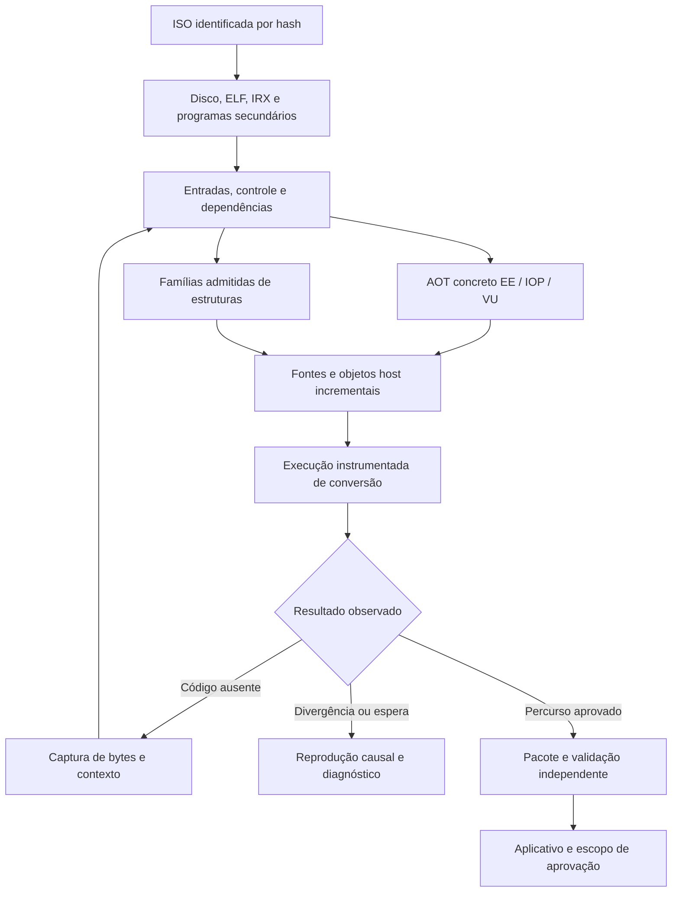
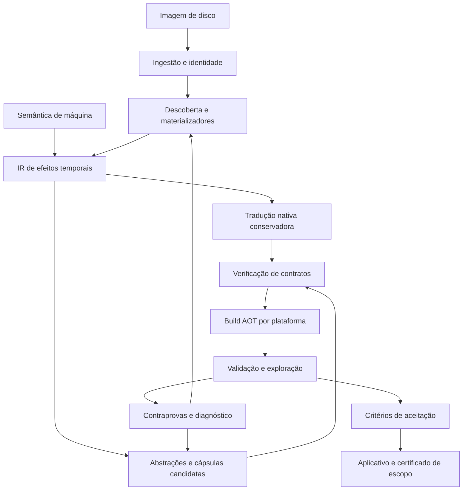
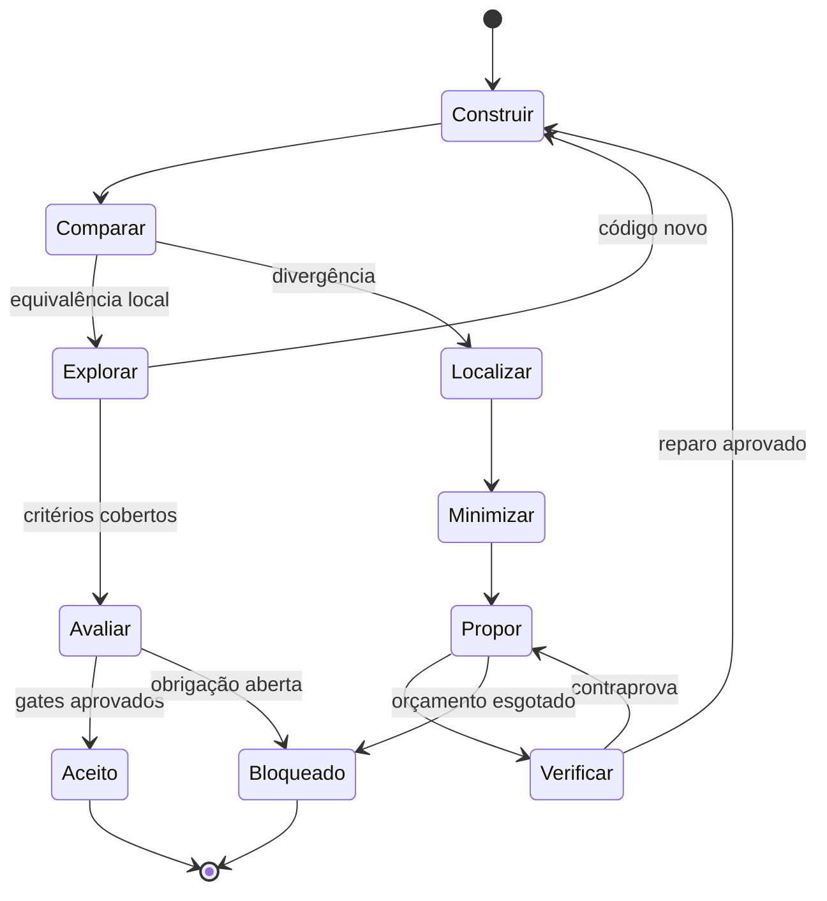
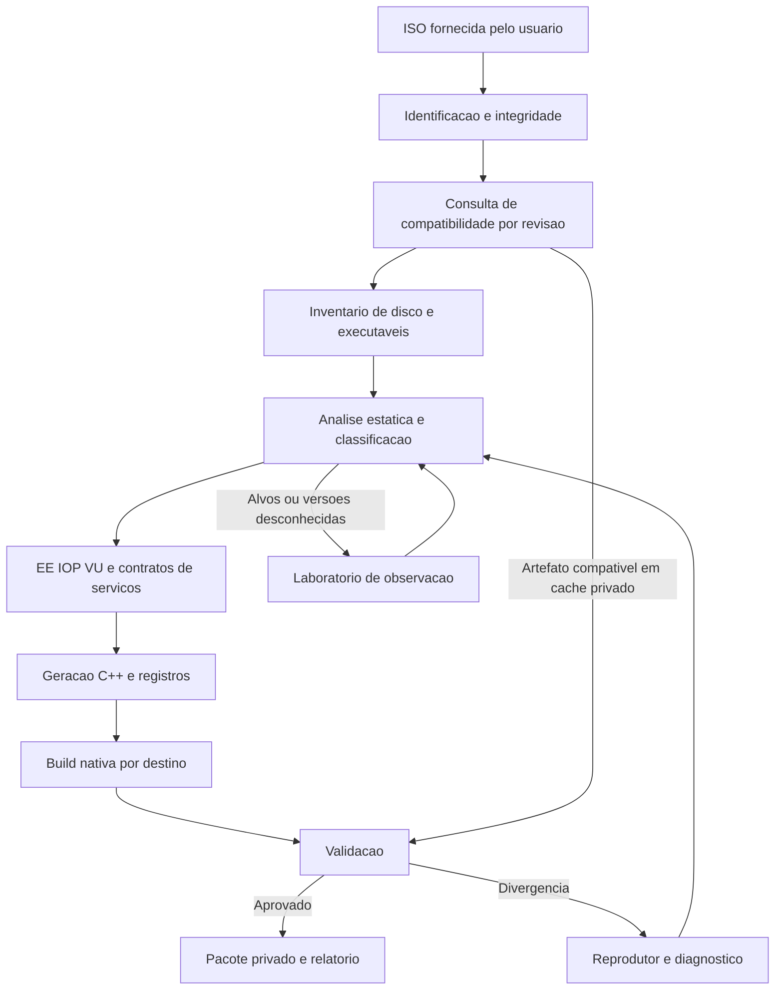
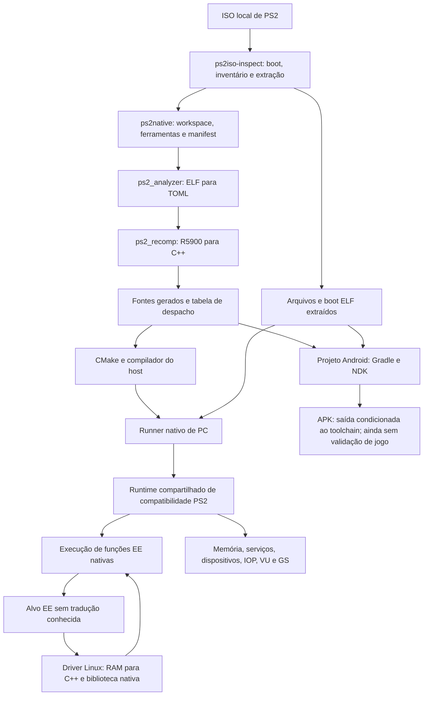
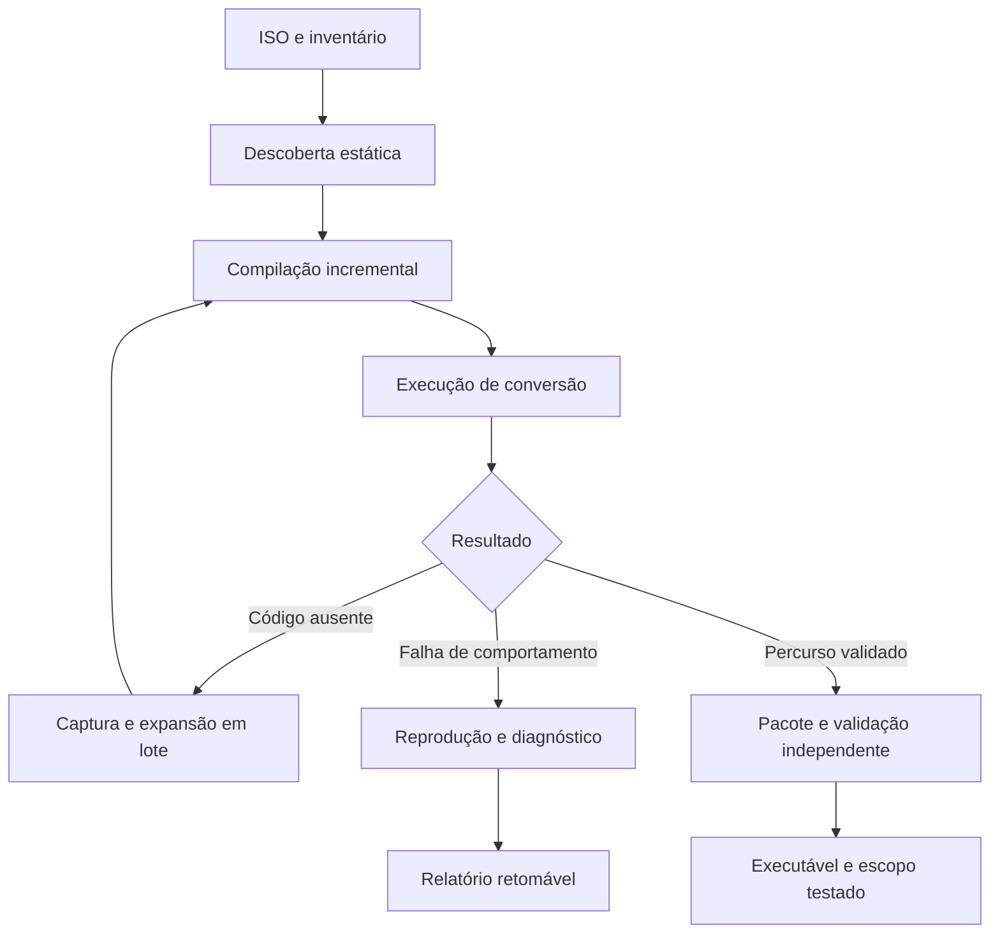
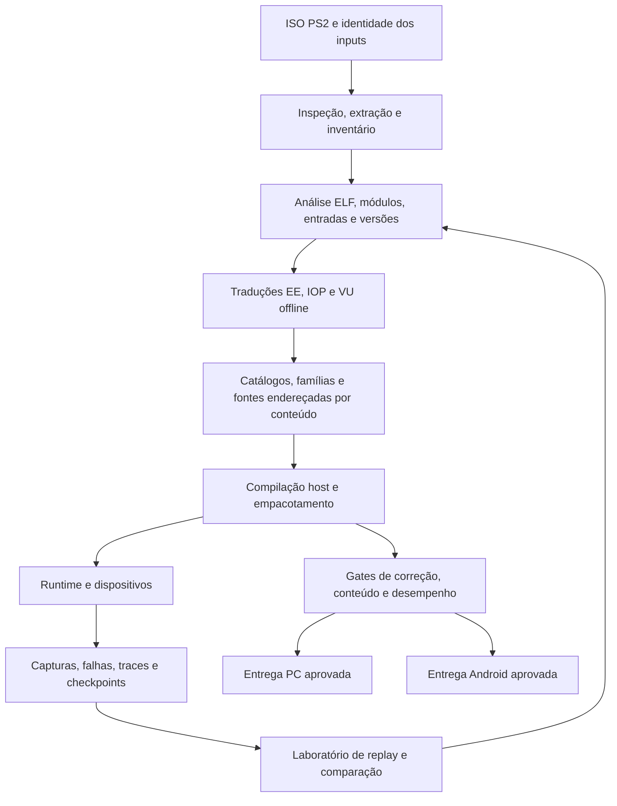

# PS2Native — README completo: planos, implementação, resultados e continuidade

**Documento único do projeto inteiro.** Reúne o plano de automação universal anterior, a arquitetura NEXO anterior, o plano atual, os relatórios, os contratos, a documentação dos componentes, os experimentos e o estado verificado nesta atualização.

**Levantamento:** 2026-10-02T09:34:55.782462-03:00 — America/Sao_Paulo.
**Repositório:** [Pedrohs1771/ps2-native](https://github.com/Pedrohs1771/ps2-native).
**Checkout:** `/home/pedrohs/Downloads/ps2-native-recompiler`.
**Branch:** `codex/ps2-native-recomp`.
**HEAD consultado:** `abe2a2b211634f81514ea82f8757bea896f113c7`.
**Plano vigente:** `README.md`, 582 linhas, conservado integralmente no [Anexo 32](#anexo-32).
**Primeira plataforma de integração:** Linux x86-64; Android continua como meta posterior.
**Produto desejado:** uma ISO de PS2 entra; a ferramenta entrega aplicativos nativos completos para PC e mobile, sem desenvolvimento específico exigido durante cada conversão.

## Como ler este documento

A síntese inicial registra o estado mais recente, incluindo a ponte GPU exercitada depois das 08:40. Os Anexos 44 e 45 descrevem o estado anterior dessa ponte; os Anexos 46–48 registram o avanço posterior. Os anexos preservam os documentos completos e os estados anteriores, com origem, tamanho e SHA-256. Checklists, resultados e prazos dos anexos continuam ligados à data e ao perfil originais.

**Estado central:** existem recompiler, runtime, dispositivos, CLI experimental, bancos concretos, famílias EE e infraestrutura de IOP/VU AOT. O corpus mais recente tem **39 casos, 59.245 propostas, 14.395 famílias admitidas e 44.850 recusas**. A preservação de unidades antigas reduziu uma expansão medida de **438,949 s para 112,010 s** de compilação. A última suíte completa registrada passou **78/78 CTest** em **46,288 s** no perfil diagnóstico; ela antecede os arquivos novos da ponte GPU.

O runner atualizado foi relinkado em **11,722 s**, sem recompilar os objetos originais do jogo. Dois percursos headless, de **220,957 s** e **481,711 s**, não produziram nova captura de ausência EE. A execução longa gerou 199 screenshots; a imagem final mostra livro e fotos sobre um tapete, com defeitos visuais. **Ainda não está demonstrado que o personagem ou a câmera respondam causalmente ao input.**

O detector da fixture mantém a etiqueta `loading` depois de confirmar New Game; não classifica novamente as cenas posteriores. Esse texto do recibo não prova loading permanente. A ausência de miss e a mudança da imagem também não aprovam gameplay. Uma terceira execução de **360,576 s**, com **152 screenshots e três capturas de cena**, registrou avanço EE/VU e draws GS texturizados; a identidade da cena e o efeito causal dos controles continuam pendentes.

**Pendências de integração:** corrigir e validar o transporte VIF→GIF no jogo; demonstrar gameplay controlável e imagem fiel; concluir apresentação Vulkan; integrar VU AOT ao runner; auditar natividade; validar áudio, save/reload, conteúdo e pacote independente; fechar a conversão automática de ISOs inéditas. **M6, M7, M8 e M9 permanecem abertos.**

**GPU, avanço mais recente:** `submitGif` foi implementado; transporte completo/fragmentado e frontend GS passaram em ensaios na **AMD Radeon RX 6600 (RADV NAVI23)**. O runner experimental com rasterização Vulkan e apresentação OpenGL por readback foi relinkado em **15,274 s**, sem recompilar os objetos originais do jogo. A execução de **361,977 s** registrou trabalho GPU, mas apresentou imagem corrompida; `route-162.png`, inspecionado nesta consolidação, está magenta. Há **162 screenshots no disco**, enquanto o recibo informa **163**. A divergência é mantida explícita.

**Causa técnica investigada:** o VIF legado cria novas tags IMAGE para entregar fragmentos ao receptor CPU. A ponte GPU conserva a tag original e acaba recebendo outra como pixels. Foi escrito um modo de transporte dos bytes originais, ainda sem execução aprovada. Seu novo teste **falhou na compilação por falta de `<memory>`**. O registro TLS dos threads Granite também foi ajustado no código, depois do primeiro runner; a nova versão ainda precisa ser compilada e exercitada.

**Código local:** sucessores canônicos, publicação compacta, FPU fixa, preservação de fontes e ponte GS têm alterações locais fora do HEAD indicado. A consolidação documental preservou esses arquivos e o plano do usuário. Os testes anteriores não qualificam automaticamente as duas correções mais recentes.

**Cobertura documental:** todos os 32 documentos Markdown próprios do checkout, além dos textos anteriores e suas versões históricas relevantes, estão incorporados neste único arquivo. A montagem verifica hashes, cobertura e âncoras em **48 anexos**, incluindo as sínteses anteriores, recibos novos, o delta de implementação e o inventário local. O conjunto inclui os planos completos e suas 40 tarefas e 24 propostas experimentais; essas propostas continuam identificadas como propostas.

### Convenções de estado

| Expressão | Significado |
|---|---|
| Implementado | Existe código correspondente no checkout |
| Exercitado | Há execução delimitada com resultado registrado |
| Publicado | O commit ou manifest foi publicado no contexto indicado |
| Laboratório | Evidência limitada aos inputs, perfil e percurso identificados |
| Pendente | O critério ainda não tem prova suficiente de aprovação |
| Proposto | Plano ou hipótese que precisa de implementação e experimento |

Uma fonte gerada, um linker bem-sucedido, um `Ready` no probe ou uma tela apresentada têm escopos diferentes. A aprovação final exige o mesmo artefato executar o conteúdo declarado, com fidelidade, recursos integrados e perfil nativo auditado.

## Índice principal

1. [Objetivo, contrato e prioridade atual](#consolidado-01)
2. [Estado executivo e marcos](#consolidado-02)
3. [Mapa completo do repositório](#consolidado-03)
4. [Arquitetura e processo de conversão](#consolidado-04)
5. [EE: tradução concreta e despacho](#consolidado-05)
6. [Famílias EE e continuações canônicas](#consolidado-06)
7. [Publicação compacta e proveniência](#consolidado-07)
8. [Admissão, geração e build](#consolidado-08)
9. [Runner mais recente, probe e execução real](#consolidado-09)
10. [IOP nativo e serviços](#consolidado-10)
11. [VU, VIF e referências](#consolidado-11)
12. [GS, Vulkan e desempenho gráfico](#consolidado-12)
13. [Áudio, vídeo, controles e saves](#consolidado-13)
14. [Processo completo feito com Monster House](#consolidado-14)
15. [Testes e limites da evidência](#consolidado-15)
16. [Headless, isolamento e retomada](#consolidado-16)
17. [Compilação incremental e uso da GPU](#consolidado-17)
18. [Automação já existente e ciclo a integrar](#consolidado-18)
19. [Natividade e pacote independente](#consolidado-19)
20. [Memória, código dinâmico e tempo](#consolidado-20)
21. [PC, Android e nuvem](#consolidado-21)
22. [Caminho concreto para M6, M7 e M8](#consolidado-22)
23. [Backlog de continuidade e situação de cada entrega](#consolidado-23)
24. [Riscos e diagnóstico por causa](#consolidado-24)
25. [Pesquisa, propostas e otimizações](#consolidado-25)
26. [Mais três ISOs e meta dos 90%](#consolidado-26)
27. [Comandos e reproduções](#consolidado-27)
28. [Estado Git, alterações e publicação](#consolidado-28)
29. [Evidências, identidades e integridade documental](#consolidado-29)
30. [Decisões, critérios finais e glossário](#consolidado-30)
31. [Detalhes técnicos para continuar sem perder o trabalho](#consolidado-31)
32. [Índice de documentos integrais](#consolidado-anexos)

<a id="consolidado-01"></a>

## 1. Objetivo, contrato e prioridade atual

A experiência desejada é fornecer uma ISO e receber um executável nativo completo. O sistema deve identificar os programas, descobrir código materializado, traduzir as instruções, compilar, executar a conversão instrumentada, diagnosticar falhas, repetir quando houver recuperação validada, validar e empacotar.

O aplicativo entregue deve usar traduções previamente compiladas de EE, IOP e VU, junto dos dispositivos implementados em código host. A fase de conversão pode usar diagnósticos e referências. A partida final exige zero interpretação ou recompilação dessas ISAs no contrato declarado.

O usuário não deve cadastrar PCs, editar TOML ou pedir correção específica por título. O primeiro jogo serve para transformar falhas observadas em capacidades gerais do compilador, do runtime e do orquestrador.

### 1.1 Ordem vigente e avanço já feito

1. A publicação canônica, a correção FPU e a expansão dos sucessores conhecidos foram implementadas e exercitadas no corpus local.
2. O próximo gate é identificar o estado atual e alcançar gameplay controlável, usando captura de cena e input causal.
3. Concluir integração gráfica: a rasterização Vulkan foi exercitada no runner experimental; corrigir transporte e imagem, depois apresentação Vulkan.
4. Integrar EE/IOP/VU, dispositivos, áudio e persistência no mesmo pacote.
5. Executar esse pacote fora do checkout e validar o conteúdo declarado.
6. Fechar o ciclo de conversão na CLI existente.
7. Medir generalização em ISOs inéditas e compatibilidade em catálogo definido.
8. Retomar Android e infraestrutura de nuvem sobre a esteira reproduzível.

A janela de 24 horas do plano é orçamento de sprint. Não determina uma data de jogo perfeito nem de 90% da biblioteca.

### 1.2 Relação entre os planos

| Documento | Papel |
|---|---|
| `README.md` atual | Ordem de execução e critérios vigentes; Anexo 32 |
| `README.md` NEXO anterior | Arquitetura detalhada e pesquisa; Anexo 01 |
| `README_AUTOMACAO_UNIVERSAL.md` | Plano completo de longo prazo; Anexo 02 |
| Relatório anterior e especificação | Histórico de implementação e decisões; Anexos 03–04 |
| Documentação de componentes e schemas | Contratos e reproduções; demais anexos |
| Sínteses anteriores | Evolução do estado; Anexos 33, 34 e 39 |
| Contratos locais mais recentes | Sucessores, publicação compacta e preservação de fontes; Anexos 40–42 |

O M8 atual significa automação no PC. A numeração histórica em alguns anexos associava M8 ao Android. Usar os critérios vigentes sem somar marcos de planos distintos.

<a id="consolidado-02"></a>

## 2. Estado executivo e marcos

| Frente | Estado demonstrado | Pendência principal |
|---|---|---|
| ISO/pipeline | Inventário, extração, análise, geração C++, build e pacote experimental | Integrar execução, captura, expansão e repetição na CLI |
| EE concreto | 34 bancos, 537.368 entradas do corpus observado | Rotas posteriores e versões corretas do código materializado |
| Famílias EE | 14.395 admitidas em 39 casos; biblioteca compilada | Cobertura fora das janelas e recusas suportadas pelo AOT concreto |
| Descoberta | Continuações canônicas e fila de sucessores conhecidos dentro das janelas | Produtores, destinos indiretos e descoberta entre janelas |
| Publicação | Candidatos v2 com proveniência verificada; conjunto vazio rejeitado | Evoluir limites e partições quando outro corpus justificar |
| Build | Preserva 511 fontes de corpo anteriores; expansão compilada em 112,010 s | Medir custo total e manter identidade de ABI/headers/flags |
| IOP | 3.947 kernels em 12 módulos; checkpoint anterior com 30.425.512 operações nativas | Serviços posteriores e auditoria do perfil final |
| VU | AOT, captura, replay e comparação de estado | Integração AOT no runner do jogo e divergências temporais relevantes |
| GS | Transporte e frontend sintéticos aprovados na RX 6600; runner GPU ligado e exercitado | Validar VIF/GIF real, corrigir imagem, apresentar por Vulkan e medir frame time |
| Android | Staging e estrutura de build | ARM64, integração completa e aparelho físico |
| Monster House | Três rotas CPU anteriores; uma rota GPU com imagem corrompida e trabalho gráfico registrado | Recuperar fidelidade, identificar cena, provar controle e qualificar conteúdo |
| Universalidade | Geradores, catálogos e mecanismos offline reutilizáveis | Conversão inédita sem edição ou roteiro exigido por título |

### 2.1 Marcos vigentes

| Marco | Critério | Estado |
|---|---|---|
| **M6 — partida e gráficos no PC** | Loading vencido, cena controlável, Vulkan e primeiros draws acelerados | **Em andamento; não aprovado** |
| **M7 — pacote nativo integrado** | EE/IOP/VU AOT, recursos integrados, execução independente, áudio e save/reload | **Pendente** |
| **M8 — conversão automática por ISO no PC** | CLI conduz descoberta/build/reexecução/pacote; títulos inéditos sem edição por jogo | **Pendente** |
| **M9 — compatibilidade ampla** | 90%+ no catálogo definido, incluindo falhas no denominador | **Pendente de avaliação** |

### 2.2 Avanços desde o levantamento de 01:17

1. A publicação vazia passou a ser rejeitada antes de escrever arquivos.
2. A captura de `0x1a4e2a4` virou um caso de 64 KiB e 14.897 bindings; a raiz de sete palavras foi admitida pelo frontend existente.
3. A descoberta passou a enfileirar retornos de chamadas, ramos conhecidos e continuações lineares, com deduplicação.
4. O corpus de 39 casos produziu 59.245 propostas e 14.395 famílias admitidas.
5. A falha de orçamento de varredura foi medida; os limites continuam explícitos e foram ajustados ao corpus.
6. O resumo v2 omite `word_count` redundante e o leitor reconstrói e valida a dimensão.
7. O teste real mostrou que muitas famílias novas invalidavam quase todas as folhas de hash antigas.
8. O publicador ganhou preservação de unidades completas com comparação dos bytes atualmente emitidos.
9. A expansão passou de 614 para 135 compilações novas na medição; o tempo de build passou de 438,949 para 112,010 s.
10. O runner foi ligado em 11,722 s, sem recompilar os objetos originais do jogo.
11. Dois percursos headless terminaram sem nova captura de ausência EE; cinco cards foram restaurados em cada execução.
12. A bateria completa CTest passou 78/78 depois das mudanças EE locais.
13. Uma reprodução de 360,576 s produziu três capturas de RAM/contexto/GS/VU, 152 screenshots e zero novas capturas de ausência EE.
14. A dependência paraLLEl-GS compilou isoladamente em 18,770 s, O2 sem LTO.
15. A ponte passou a enviar pacotes e fragmentos GIF originais; testes sintéticos passaram na RX 6600.
16. Uma reprodução isolou consumo de um vértice ainda não entregue no parser otimizado upstream; uma cópia de compatibilidade corrigiu os limites e passou o mesmo teste.
17. O frontend GS ganhou estado de stream por caminho, shadow state e encaminhamento único; testes de rasterização, transferências e apresentação CPU por readback passaram.
18. O runtime experimental foi ligado em 15,274 s, substituindo quatro objetos GS e conservando os objetos originais do jogo.
19. A rota GPU terminou em 361,977 s com imagem corrompida, contadores GPU e cinco cards restaurados.
20. O diagnóstico identificou retagging IMAGE legado no VIF; modo raw escrito, teste novo ainda bloqueado por erro de include.
21. A documentação foi consolidada com os estados históricos, fonte local e resultados negativos preservados.

### 2.3 Limites do resultado

Esses resultados comprovam avanços de descoberta, publicação e custo de compilação no corpus observado. Não aprovam campanha, fidelidade independente das ISAs, gameplay controlável, 60 FPS, Vulkan, APK, pacote integralmente nativo ou automação universal.

<a id="consolidado-03"></a>

## 3. Mapa completo do repositório

O levantamento encontrou **483 arquivos rastreados pelo Git**. A contagem descreve o checkout, não inclui todo o conteúdo experimental ignorado em `build/` e não mede maturidade do produto.

| Diretório | Arquivos rastreados | Responsabilidade |
|---|---:|---|
| `.github` | 1 | Automação do repositório |
| `android` | 9 | Estrutura do aplicativo Android e build |
| `docs` | 4 | Handoff, lacunas, Android e iteração nativa |
| `lab` | 100 | Captura, AOT experimental, catálogos, replay e regressões |
| `ps2xAnalyzer` | 16 | Descoberta e análise de executáveis |
| `ps2xIOP` | 67 | IOP, módulos, serviços e caminho nativo |
| `ps2xRecomp` | 52 | Emissão C++ e ferramentas de recompilação |
| `ps2xRuntime` | 150 | Estado EE, despacho, memória e dispositivos |
| `ps2xStudio` | 9 | Componente de ferramentas existente |
| `ps2xTest` | 26 | Suíte de testes C++ |
| `schemas` | 15 | Formatos e contratos do laboratório |
| `tools` | 23 | ISO, CLI, pipeline e harnesses |
| `vita` | 2 | Estrutura histórica de outro alvo |

Arquivos de raiz completam a contagem. A presença de um diretório de plataforma não demonstra que um jogo foi qualificado nela.

### 3.1 Fronteiras centrais

| Caminho | Função |
|---|---|
| `tools/ps2native/cli.py` | Interface pública `inspect`, `build` e `verify` |
| `tools/ps2native/pipeline.py` | Etapas de construção e pacote |
| `tools/iso_inspect/` | Inventário da imagem de disco |
| `lab/prepare_ee_miss.py` | Preparação de uma ausência EE capturada |
| `lab/generate_ee_bank_catalog.py` | Catálogo de bancos concretos |
| `lab/discover_ee_data_families.py` | Descoberta, extensão canônica e publicação de candidatos |
| `lab/generate_ee_family_catalog.py` | Admissão pelo frontend e publicação de fontes/manifest |
| `lab/prepare_ee_family_batch.py` | Ownership e orquestração offline dos casos |
| `ps2xRecomp/src/lib/native_data_family.cpp` | Tradução das famílias suportadas |
| `ps2xRecomp/src/lib/control_flow_emitter.cpp` | J/JAL, links, delay slots e destinos |
| `ps2xRuntime/src/lib/ps2_ee_data_family.cpp` | Verificação e despacho de família |
| `ps2xRuntime/cmake/ee_family_catalog.cmake` | Integração do catálogo no build |
| `ps2xRuntime/include/runtime/gs/gs_backend.h` | Fronteira do backend GS |
| `ps2xRuntime/src/lib/gs/gs_cpu_backend.cpp` | Backend GS CPU existente |
| `ps2xIOP/src/emulator/core/iop_native.cpp` | Caminho IOP nativo |
| `lab/tests/` | Fixtures, leitores e regressões focalizadas |

<a id="consolidado-04"></a>

## 4. Arquitetura e processo de conversão



O diagrama reúne etapas implementadas e integrações pendentes. A presença da seta de repetição descreve o objetivo do orquestrador; o comando público ainda não conduz sozinho todo esse ciclo.

### 4.1 Responsabilidades

O compilador transforma código convidado em código host. O runtime mantém estado e coordena entradas recompiladas. Os dispositivos implementam disco, memória, DMA, SIF/RPC, VIF/VU, GIF/GS, áudio e input. O pipeline organiza artefatos, ferramentas e publicação. O laboratório fornece capturas e comparações para corrigir fronteiras concretas.

### 4.2 O papel de C++

A tradução em C++ é um meio de produzir execução host. Ela não reconstrói automaticamente nomes, comentários, classes ou a estrutura original do código-fonte do jogo. A recompilação pode preservar o comportamento sem recuperar essas informações.

O estado recompilado do motor também não transforma os assets comerciais em conteúdo aberto. O projeto, suas contribuições e suas dependências têm identidades e licenças próprias; dados do jogo permanecem como inputs locais do usuário.

<a id="consolidado-05"></a>

## 5. EE: tradução concreta e despacho

O caminho EE existente emite C++, compila para o host e registra entradas para executar o estado convidado. Bancos concretos compilam os bytes exatos capturados ou preparados. O catálogo observado reúne **34 bancos e 537.368 entradas**.

Essas entradas descrevem o corpus conhecido. Não indicam 537.368 funções originais, nem cobertura completa do jogo, nem percentual da biblioteca PS2.

### 5.1 Problemas já abordados

- Destinos indiretos, callbacks e entradas descobertas em RAM.
- Regiões carregadas depois do ELF inicial.
- Dependências de bytes para uma entrada normal.
- Distinção entre entrada normal e execução como delay slot.
- Guardas e recusa quando os bytes não satisfazem o corpo compilado.
- Tradução de J/JAL com destino, link e contexto adequados.
- Catálogos concretos e famílias como componentes reutilizáveis.

### 5.2 Obrigações restantes

Continuam abertos a cobertura das rotas posteriores, as instruções não admitidas em certos domínios, os produtores de código latente, a invalidação por escrita e aliases, as exceções e a fidelidade temporal integrada.

O runtime deve diagnosticar uma ausência real. Acrescentar um endereço ao TOML por rodada não resolve a classe de descoberta. O caminho concreto existente deve receber lotes automáticos de regiões e sucessores quando a parametrização não admitir a estrutura.

<a id="consolidado-06"></a>

## 6. Famílias EE e continuações canônicas

Uma família representa uma estrutura de instruções com guardas exatas para opcode, registros e controle, admitindo apenas determinados campos de dados como parâmetros. O corpo host é compilado antecipadamente e serve às variações que satisfazem o contrato.

### 6.1 Falhas observadas e correção geral

O detector antigo orientado a terminais omitia a continuação linear em `0x1a51be8`. Sua extensão até a primeira transferência e slot produz 36 palavras. A correção canônica resolveu essa classe; a execução posterior revelou FPU fora do domínio anterior e depois uma nova janela em `0x1a40000`.

A janela nova não existia nos 38 casos anteriores. Portanto, o miss `0x1a4e2a4` não demonstra que aquele endereço tivesse sido omitido dentro de um snapshot já presente. O novo caso acrescenta bytes antes ausentes do corpus.

### 6.2 Contrato `canonical-v1`

1. Partir de raízes conhecidas e incluir a entrada requisitada, mesmo quando interior aos metadados anteriores.
2. Examinar até 127 palavras para encontrar a primeira transferência.
3. Incluir o delay slot completo; a região terminal pode ter até 128 palavras.
4. Sem transferência no intervalo, emitir região linear de 127 palavras.
5. Rejeitar final truncado que não ofereça a dependência completa.
6. Admitir a entrada normal de offset zero daquela região.
7. Aplicar a política tipada de operandos e a admissão do frontend.
8. Enfileirar sucessores conhecidos dentro do snapshot, deduplicando raízes.

Detecção de transferência não prova suporte semântico. A admissão posterior continua obrigatória, com bytes e contexto conferidos.

### 6.3 Sucessores implementados

| Término | Entrada conhecida a enfileirar |
|---|---|
| Região linear | Endereço imediatamente depois da região |
| J | Alvo direto, sem inventar fallthrough |
| JAL | Alvo direto e endereço após o slot, para retorno |
| JALR válido com registrador de link diferente de zero | Endereço após o slot; alvo indireto ainda depende de observação |
| Branch condicional válido | Destino relativo com sinal e endereço após o slot |
| JR/retorno e outros indiretos | Nenhum destino especulativo |

A fila usa deduplicação para não repetir backedges indefinidamente. Destinos fora da janela são contabilizados. **O mecanismo não captura automaticamente essas outras janelas e não demonstra fechamento da máquina inteira.** Campos reservados continuam sujeitos à validação do frontend.

### 6.4 Corpus e evolução

| Corpus | Propostas | Admitidas | Recusadas | Fontes totais |
|---|---:|---:|---:|---:|
| 37 casos canônicos | 43.452 | 8.923 | 34.529 | 313 |
| 38 casos, FPU fixa, partição por hash | 43.736 | 11.236 | 32.500 | 512 |
| 39 casos com sucessores, partição por hash | 59.245 | 14.395 | 44.850 | 615 |
| Mesmo corpus, unidades anteriores preservadas | 59.245 | 14.395 | 44.850 | 647 |

O lote novo registrou 597.133 bindings, 159.589 regiões e 5.821.819 palavras examinadas. Foram 31.623 regiões lineares, 127.599 terminais, 28.067 raízes sucessoras e 36.615 sucessores externos contabilizados; 364 finais lineares e três terminais truncados foram recusados. As categorias não representam instruções executadas ou funções originais únicas.

As duas últimas linhas têm famílias e ledger de recusas idênticos. A diferença de fontes é apenas o agrupamento para compilação.

### 6.5 FPU com identidade exata

A admissão reutiliza a tradução concreta para LWC1, SWC1 e operações COP1 suportadas. Os bits dessas instruções ficam fixos; não foi criado um domínio livre de parâmetros FPU.

- Movimentos de registradores rejeitam campos reservados.
- CFC1 admite FCR0/FCR31; CTC1 admite FCR31.
- Formatos e funções não suportados são recusados.
- BC1F/BC1T/BC1FL/BC1TL usam término e slot corretos.
- Um COP1 branch inválido não passa como operação de dados sem efeito.
- Fixtures incluem links, likely annulment, entrada normal do slot, zeros com sinal, subnormais, infinitos e NaN silencioso.

A comparação usa o emissor concreto do próprio projeto. Ela testa consistência entre traduções; não aprova independentemente a FPU PS2 nem o timing.

### 6.6 Políticas e domínio

O orquestrador local usa `canonical-v1` por padrão. `metadata-terminal` conserva a política histórica. Os defaults do detector isolado são próprios e precisam ser considerados ao reproduzir um experimento.

O fechamento de sucessores locais está implementado. A descoberta entre janelas, módulos, produtores e versões permanece parte da integração automática a concluir.

<a id="consolidado-07"></a>

## 7. Publicação compacta e proveniência

O relatório antigo repetia parâmetros e origens e ultrapassava 64 MiB. O formato v2 mantém um resumo limitado e proveniência deduplicada em shards com identidade por SHA-256.

### 7.1 Formato e verificação

O resumo contém forma, guardas, entradas normais e contagens de observação. As origens identificam imagem, metadados e base. Os detalhes referenciam IDs, PC, hash das palavras, parâmetros e contexto normal.

Nome, hash, tamanho e registros de cada shard são conferidos pelo leitor. O publicador verifica também a identidade inicial do resumo entre leituras. O leitor continua aceitando o formato anterior.

No compacto v2, `word_count` pode ser omitido e é derivado do tamanho das guardas. Se vier explícito, precisa coincidir. Essa mudança retirou redundância sem remover as guardas executáveis ou a proveniência. Uma publicação canônica vazia é rejeitada antes de escrever resumo ou partes.

### 7.2 Orçamentos locais atuais

| Recurso | Limite |
|---|---:|
| Regiões examinadas | 262.144 |
| Palavras examinadas agregadas | 8.388.608 |
| Propostas de forma | 65.536 |
| Famílias admitidas | 32.768 |
| Resumo de candidatos | 64 MiB |
| Um shard | 4 MiB |
| Total dos shards | 128 MiB |
| Quantidade de shards | 64 |
| Manifest do catálogo | 16 MiB |
| Famílias por fonte | Até 32 |

Os limites continuam limitando CPU, memória e publicação. Exceder um orçamento exige diagnóstico e evolução explícita; não permite descartar cobertura silenciosamente.

### 7.3 Falha medida e solução

A primeira descoberta com sucessores parou ao atingir 4.194.345 palavras. A medição separada revelou o corpus completo de 5.821.819 palavras e 59.245 propostas. O resumo anterior seria de 67.528.073 bytes, acima de 64 MiB.

O ajuste dos limites de varredura permaneceu finito. A omissão da dimensão redundante deixou a publicação dentro do mesmo teto de resumo. Os detalhes medidos somavam 21.473.005 bytes em seis shards.

O comando real de preparação/publicação terminou com retorno zero em 53,422 s. Um wrapper posterior falhou ao comparar o índice fixo alterado como se fosse um corpo imutável; o erro foi registrado e a análise corrigida. O catálogo não foi regenerado para esconder essa ocorrência.

### 7.4 Contratos e histórico

Os Anexos 19 e 36 conservam versões anteriores. O Anexo 40 contém o contrato atual de candidatos; o Anexo 41 contém preservação de fontes e o Anexo 42 contém o domínio de famílias. A sequência de versões permite reconstruir o significado dos recibos anteriores.

<a id="consolidado-08"></a>

## 8. Admissão, geração e build

### 8.1 Publicação mais recente

O lote de 39 casos admitiu 14.395 famílias e registrou 44.850 recusas. A descoberta produziu 59.245 propostas. Esses artefatos mantêm `strict_approval=false` e `closure_proved=false`.

O corpus foi publicado com dois agrupamentos equivalentes. A partição `hash-trie-v1` gerou 615 fontes. A partição `preserved-units-v1` gerou 647 fontes, preservando as unidades antigas e emitindo apenas as famílias restantes em novos grupos.

### 8.2 Por que a árvore de hash não bastou

A árvore por prefixos de hash restringe a invalidação de uma inserção pequena. A expansão real acrescentou 3.159 famílias e tocou quase todas as folhas antigas: apenas um corpo ficou idêntico, e 614 fontes novas ou alteradas foram compiladas.

O resultado motivou preservar unidades inteiras da publicação anterior. O novo algoritmo valida manifest, nomes e hashes, extrai as famílias da unidade gerada e compara **todos os bytes** com os corpos emitidos pelo gerador atual. Só retém uma unidade quando todas as famílias continuam presentes e os bytes correspondem exatamente.

Corpos alterados, famílias removidas ou mudança do contrato de entrada invalidam a unidade correspondente. O índice do catálogo sempre representa o conjunto atual. Headers, flags, compilador e ABI continuam sendo dependências do build, mesmo quando o corpo C++ é idêntico.

### 8.3 Reutilização observada

| Item | Resultado |
|---|---:|
| Famílias atuais | 14.395 |
| Famílias em unidades anteriores preservadas | 11.236 |
| Fontes de corpo preservadas | 511 |
| Fontes totais no catálogo novo | 647 |
| Arquivos novos perante o catálogo anterior, incluindo índice | 136 |
| Compilações efetivamente novas na medição | 135 |
| Recompilações de objetos existentes | Zero |
| Objetos existentes preservados na medição | 1.439 |

O índice correspondente ao conjunto atual já tinha objeto em cache no ensaio anterior. Por isso há 135 compilações, embora a comparação de publicações conte 136 arquivos novos perante o catálogo FPU antigo.

### 8.4 Tempos e perfil

| Operação | `hash-trie-v1` expandido | Unidades preservadas |
|---|---:|---:|
| Configuração CMake | 5,032 s | 5,609 s |
| Compilação | 438,949 s | 112,010 s |
| Compilações novas | 614 | 135 |
| Famílias/recusas | Idênticas | Idênticas |

A compilação dessa expansão ficou aproximadamente **3,9 vezes mais rápida**, com redução de **74,5%** do tempo medido. O resultado não mede conversão total de uma ISO e os ensaios não são benchmarks isolados de todos os efeitos de cache ou concorrência.

Projeto: `build/lab/native-ee-family-project`. Build persistente: `build/ee-families-native`. Target: `ps2_ee_compiled_families`. Flags observadas: O1, `-fno-lto`, IPO desativado, quatro workers.

### 8.5 Integração de publicação anterior

O publicador aceita `--previous-catalog`. O orquestrador deriva o manifest de `--previous-batch` por padrão e aceita `--previous-family-catalog` para selecionar o layout realmente compilado.

Na continuidade deste experimento, usar os casos de `expanded-batch/` e o manifest de `reuse-catalog/catalog.json`. Apontar para o layout antigo de 615 fontes desperdiçaria parte do ganho de preservar as unidades atuais.

<a id="consolidado-09"></a>

## 9. Runner mais recente, probe e execução real

O runner EE/CPU anterior está em `build/lab/ee-next-continuations-1790915279940576004`. O runner gráfico experimental mais recente está em `build/lab/gs-parallel-transport-1790941496435642611/native-gpu-runner`. A publicação EE ampliada foi ligada ao runtime congelado e aos catálogos concretos/IOP; o experimento GPU reutiliza essa base. As subseções 9.1–9.6 registram a base CPU; a 9.7 registra o resultado posterior.

### 9.1 Link e admissão

| Operação | Resultado |
|---|---:|
| Link do runner | 11,722 s |
| Compilações dos objetos originais do jogo | Zero |
| Entradas consultadas pelo probe | 14.897 |
| `Ready` | 9.743 |
| `Ambiguous` | Zero |
| Ausentes na consulta de famílias | 5.154 |
| Checagens de candidatos | 7.864.708 |
| Alvo `0x1a4e2a4` | Ready, 880 checagens |

O probe faz lookup com a RAM capturada e contextos construídos. Não executa todos esses caminhos. Entradas sem família podem ter tradução concreta ou não ser alcançadas no percurso; a contagem não é compatibilidade por jogo.

### 9.2 Percursos headless finalizados

| Percurso | Duração | Screenshots | Nova captura EE ausente | Limpeza |
|---|---:|---:|---:|---|
| Roteiro de menu limitado | 220,957 s | 97 | Zero | Cinco cards restaurados com hashes |
| Roteiro estendido com inputs | 481,711 s | 199 | Zero | Cinco cards restaurados com hashes |
| Diagnóstico com três capturas de cena | 360,576 s | 152 | Zero | Cinco cards restaurados com hashes |

Os helpers retornaram zero e encerraram pelo orçamento de duração. Seus recibos não declaram aprovação de gameplay. Na inspeção posterior, os PIDs registrados do runner e Xvfb da execução longa já não existiam.

### 9.3 O que foi visto e o que ainda é desconhecido

A última imagem `route-198.png` mostra livro e fotos sobre um tapete. Há defeitos visuais. A inspeção da imagem não permite concluir sozinha se esse estado é intro, loading animado, cutscene ou gameplay.

A fixture muda sua fase para `loading` ao confirmar o arquivo e mantém essa etiqueta. Ela não reconhece todas as cenas seguintes. Usar a etiqueta como classificação definitiva do frame final seria incorreto.

Foram enviados X/Start e movimentos WASD em horários registrados. Mudança entre screenshots não demonstra que os comandos moveram personagem/câmera: a cena pode ter animação independente. É necessário comparar percursos com e sem input ou observar estado do jogo correspondente.

### 9.4 Próxima investigação concreta

A captura foi habilitada na terceira reprodução, desde o lançamento. RAM/contexto e estado GS/VRAM/VU foram obtidos em três momentos. Usar esses dados para identificar a cena e planejar a comparação causal; os snapshots já mostram avanço, mas não confirmam controle. Se uma espera persistir, reconstruir pedido/evento/serviço correspondente.

Não ampliar novamente o catálogo só porque a classificação da cena está incerta. Gerar mais código é apropriado quando houver uma ausência registrada; divergência ou espera com cobertura exige diagnóstico da causa.

### 9.5 Perfis distintos

O build raiz é diagnóstico, com opções nativas EE/IOP desativadas no cache consultado e interpretação IOP ativada. A biblioteca de famílias está num diretório persistente separado. O runner usa bibliotecas congeladas e o catálogo ampliado, com GS CPU/OpenGL e VU diagnóstico.

Os percursos atuais não aprovam um pacote integralmente nativo. A integração final precisa ligar VU AOT, desativar interpretação convidada, auditar bibliotecas e contadores e executar fora do checkout.

A preservação de fontes mudou o agrupamento, mantendo famílias e recusas idênticas. Os percursos citados usaram o binário já ligado antes dessa troca, não um binário novo publicado implicitamente pela reconstrução do arquivo estático.

### 9.6 Capturas da reprodução mais recente

Job: `build/lab/ee-native-scene-capture-1790940438695638355`. O binário copiado tem SHA-256 `f55a7a3be3e4839295c95fc5dfe02ec395ddcef31134368e201712f9a6bcf668` e mantém o perfil anterior, sem VU AOT integrado ou GS GPU.

| Solicitação aproximada | EE PC | EE ciclos | VU1 ciclos | Geração de código VU1 | Último frame no histórico GS |
|---|---|---:|---:|---:|---:|
| 200 s, antes dos controles adicionais | `0x11ac6b0` | 14.372.354.740 | 126.519.048 | 12.179 | 1.488 |
| 285 s, depois de X/Start | `0x1141b50` | 15.001.519.748 | 431.363.924 | 19.603 | 1.616 |
| 315 s, depois do comando W | `0xf62794` | 15.222.694.195 | 538.548.583 | 22.213 | 1.661 |

Cada captura preserva um anel de 512 eventos GS, dos quais 413 são eventos de draw. Os últimos incluem triangle strips texturizados, três vértices e profundidade variável. O estado registra framebuffer de 512×448, alternância das bases 0/112, texturas e depth test. Isso demonstra atividade gráfica no backend CPU e progresso dos subsistemas observados.

O número de eventos no anel não representa todos os triângulos de um frame. A razão entre números de frame internos e tempo de parede também não é benchmark formal de FPS; há boot, navegação, capturas e custo diagnóstico.

Os inputs adicionais foram X, Start, X, W por oito segundos e D por oito segundos, além da navegação da fixture. Não houve uma execução de controle equivalente sem esses inputs. Movimento da imagem e avanço dos PCs continuam insuficientes para aprovar gameplay causal.

O helper retornou zero por timeout delimitado de 360 s; a duração observada foi 360,576 s. Cinco arquivos de card mudaram durante a execução e foram restaurados exatamente por hash. Os PIDs históricos de runner e Xvfb não existiam no levantamento documental.

### 9.7 Runner GPU mais recente — experimento integrado ainda reprovado visualmente

| Campo | Resultado observado |
|---|---|
| Job | `build/lab/gs-parallel-transport-1790941496435642611` |
| Runner | `native-gpu-runner` |
| SHA-256 do runner | `aed4708fc9857c937425e379aeb58b0c7adea99d1b31a3a1bc5ac97cce643c07` |
| Link | 15,273903 s; retorno zero; zero compilações originais do jogo |
| Raster | `parallel-vulkan`, RX 6600 física |
| Present | `opengl-readback` |
| VU | Diagnóstico, sem aprovação AOT integrada |
| Duração no helper | 361,977384 s; orçamento nominal de 360 s |
| Retorno do helper | Zero por encerramento delimitado; não aprovação do port |
| Fase da fixture | `logos`; classificador não conseguiu comprovar o menu |
| Screenshots | 162 arquivos `route-001.png`…`route-162.png`; recibo informa 163 |
| Captura de cena encontrada | Uma, `capture-1790943326021212187` |
| Cards | Cinco arquivos restaurados por hash; recibo informa que não mudaram |
| PIDs históricos | Runner e Xvfb ausentes no levantamento atual |
| Resultado visual | Imagem corrompida; última captura inspecionada magenta |
| Gameplay / FPS | Não aprovados; nenhum benchmark de 60 FPS |

O log confirma duas amostras de contadores acumulados: em 120 apresentações, 5.345 chunks, 26 primitivas GPU, nove passes e 578.813.952 bytes de readback; em 240 apresentações, 13.601 chunks, 1.871 primitivas GPU, 36 passes e 1.115.684.864 bytes de readback. Essas contagens confirmam trabalho gráfico e custo de cópia. Não medem FPS, fidelidade ou progresso de campanha.

Há 1.932 linhas do diagnóstico de thread Granite no log. O registro TLS foi escrito depois desse runner. Não atribuir o teste sintético anterior à revisão posterior do código. A captura manual registra EE PC `0x1cac0c`, 1.524.192.306 ciclos e thread 1; o shadow GS contém valores incoerentes com a rota CPU anterior. A sequência de IMAGE duplicado é uma causa concreta a eliminar; a recuperação visual ainda precisa de nova execução.

A diferença 162/163 e a quantidade de capturas são contagens reais do diretório no levantamento. O recibo original foi conservado. Não foi inferida uma causa para a diferença de screenshots.

<a id="consolidado-10"></a>

## 10. IOP nativo e serviços

O projeto já dispõe de frontend IRX, relocação, resolução de imports, catálogo de módulos, kernels nativos e integração experimental com o runtime.

O catálogo de captura ao vivo observado reúne **3.947 kernels** em **12 módulos**. Um checkpoint de jogo registrou **30.425.512 operações nativas**, sem operações interpretadas na rota IOP contabilizada naquele experimento.

Esses números justificam reutilizar o caminho existente. Não provam que todos os módulos e serviços posteriores estão corretos ou que qualquer biblioteca reutilizada tem o interpretador desativado em sua construção.

### 10.1 Critérios de integração

- Associar cada módulo à identidade e à versão corretas.
- Preservar carga, relocação, imports, unload e substituição.
- Entregar RPC, SIF e interrupções na ordem exigida pelo percurso.
- Manter estado entre chamadas e esperas.
- Contabilizar nativamente as operações executadas.
- Diagnosticar módulo ou serviço ausente sem fabricar uma resposta de sucesso.

Uma espera RPC deve ser resolvida pela cadeia pedido, processamento, resposta e evento. Pular essa cadeia pode avançar uma tela e perder dados necessários ao jogo.

<a id="consolidado-11"></a>

## 11. VU, VIF e referências

Há tradução VU AOT conservadora, bancos de microprogramas, formato de estado, captura VIF, replay e mecanismos de seleção/continuação. Os documentos de VU e de referência PCSX2 estão preservados nos anexos.

### 11.1 O que foi exercitado

- Capturas ligadas a uploads e chamadas VIF reais de Monster House.
- Comparações entre caminhos nativos e modelos de referência de laboratório.
- Comparação de payloads GIF e estados finais relevantes.
- Investigação de issue, término e XGKICK com uma referência independente fixada.
- Bancos e callbacks correspondentes ao corpus capturado.

O replay citado no plano atual comparou **168 payloads GIF**. Experimentos anteriores também registraram nove callbacks e dois bancos, dentro de seu domínio específico.

### 11.2 Timing ainda aberto

Na comparação temporal independente registrada, o modelo do projeto produziu **4.024 ciclos**, enquanto a referência produziu **3.777**, uma diferença de **247 ciclos**. A análise completa registrada identificou 3.761 pares de issue correspondentes, com diferenças localizadas de issue e cauda.

Essa igualdade parcial de rastros não aprova timing integral. A divergência deve ser priorizada quando explicar um bloqueio ou diferença observável. O sprint atual não exige concluir toda a pesquisa temporal antes de integrar componentes já exercitados.

### 11.3 O que falta na partida

Conectar o caminho AOT aos uploads, à seleção de banco, às chamadas e às continuações do runner atual. Capturar microprogramas sem cobertura durante a conversão e compilá-los offline. A ausência de cobertura no pacote final não pode acionar interpretação convidada oculta.

### 11.4 Fronteira VIF→GIF contínua — correção escrita, validação pendente

O caminho `forwardDirect` existente usa `m_vif1PendingPath2ImageQwc` e constrói uma tag IMAGE nova para cada porção restante. Esse contrato atende ao parser CPU legado. Quando o receptor guarda o estado da tag original, uma nova tag passa a ocupar os primeiros 16 bytes dos pixels esperados e desloca a stream seguinte.

O código novo adiciona `PS2Memory::setGifStreamTransport(bool)` e consulta `GS::usesRawGifTransport()` durante a ligação dos subsistemas. Com receptor contínuo, `forwardDirect` envia exatamente os bytes originais por PATH2. A alternância de modo durante DIRECT/IMAGE pendente é recusada. O modo é binding host do receptor, sem campo novo em `PS2Memory`; não é tratado como estado convidado serializado.

Foi escrito `lab/tests/vif_gif_stream_tests.cpp`: duas entregas DIRECT, uma tag IMAGE de dois qwords, 32 bytes de pixels e fragmentação do primeiro comando VIF. A expectativa é receber `{tag original, pixels originais}`, preservando PATH2, sem tag sintética.

Situação exata: o primeiro build foi pedido antes da configuração e falhou porque o alvo ainda não existia; `cmake -S . -B build` terminou em 2,873480 s; o build configurado terminou com retorno 2 em 35,422872 s porque o teste usa `std::make_unique` sem incluir `<memory>`. O arquivo de runtime foi compilado antes desse erro, mas o teste novo não foi ligado nem executado. Os targets de regressão seguintes também não foram aprovados nessa chamada interrompida.

A próxima validação precisa corrigir esse include, compilar o teste e os targets afetados, executar os testes e ligar um runner distinto com `ps2_runtime.cpp` e `ps2_vif1_interpreter.cpp` atualizados. A prova de correção no jogo depende da imagem resultante e do estado, além da igualdade dos bytes na fixture.

<a id="consolidado-12"></a>

## 12. GS, Vulkan e desempenho gráfico

**Estado atual:** há uma ponte GS Vulkan implementada e exercitada em testes sintéticos na RX 6600, além de um runner experimental que enviou trabalho gráfico do jogo à GPU. A imagem desse runner está corrompida. A apresentação ainda usa readback para OpenGL. Correção visual, apresentação Vulkan e desempenho sustentado continuam pendentes.

### 12.1 Gargalo CPU previamente medido

No replay VIF observado, o receptor GS consumiu aproximadamente 248 ms de 251 ms; VU exclusivo ficou próximo de 1,3 ms. Passar o componente GS de O1 para O2 reduziu o replay para aproximadamente 213 ms, conservando os estados comparados. Esse experimento justificou priorizar o renderer e não fornece FPS do jogo.

### 12.2 Dependência reutilizada e identidade

Fonte: [Arntzen-Software/parallel-gs](https://github.com/Arntzen-Software/parallel-gs), checkout local fixado em `3a66c1976170cbc2cb53a3593fabbc7c4b2ccfbd`; Granite `16e7395f6a4858c1783dbf6f521f90b9d5f82ac5`. Os registros locais identificam GS como LGPL-3.0+ e Granite como MIT. A integração deve conservar arquivos e identificação das licenças correspondentes.

O build usa Vulkan-Headers e dependências fixadas no checkout isolado, sem instalar pacotes do sistema. A biblioteca upstream compilou standalone em 18,770 s. O build inicial posterior, incluindo ponte e teste, consumiu 19,427431 s. São operações distintas; nenhum desses tempos é conversão integral de ISO.

### 12.3 Dispositivo, pacotes e VRAM

`ParallelDevice` mantém Context, Device e GSInterface com destruição na ordem apropriada, mutex próprio, quatro contextos de frame e seleção de dispositivo físico. O ensaio recusa renderer de software como comprovação de aceleração. A GPU registrada foi AMD Radeon RX 6600, RADV NAVI23.

O transporte completo valida caminhos 1–3, tamanho não vazio, qwords de 16 bytes, teto de 64 MiB, estado de início de tag e extensão de todos os payloads antes de submeter. PACKED, REGLIST com padding ímpar, IMAGE e IMAGE_RESERVED são considerados. Spans sem alinhamento de 16 bytes recebem cópia alinhada sem modificar os bytes.

O transporte contínuo conserva qwords pendentes por caminho e entrega chunks originais ao upstream. Os acessos de VRAM verificam offset e comprimento dentro de 4 MiB sem soma sujeita a overflow. Leitura flusha o GS antes de mapear; reset de registros conserva VRAM e limpa pendências do transporte. Há contadores de pacotes, chunks, primitivas, passes, uploads, readbacks e bytes.

Essas validações têm o escopo exercitado nas fixtures. A validação dos endereços A+D recebidos dentro de payloads precisa de revisão adicional: `writeRegister` direto recusa endereço acima de 127, mas o transporte bruto ainda delega decodificação de A+D ao upstream. Não declarar proteção completa de payloads arbitrários.

### 12.4 Fragmentação e correção de limite no upstream

A fixture RED demonstrou que o fast handler podia consumir um vértice presente no backing storage, mas ainda não entregue no tamanho do chunk. O log registra `GIF fragment consumed an unsent future vertex`.

`parallel_gs_compat.cmake` exige SHA-256 exato do original `gs_interface.cpp`: `93246b693e3507f5498d2fa33929486bfd28623e0457d48df608d8b754606b69`. Produz uma cópia de build com dois ajustes: só entra no handler otimizado quando `size - i >= nreg`; calcula loops disponíveis com `(size - i) / nreg`. O checkout externo permanece intacto. O mesmo teste ficou GREEN em 0,164146 s depois de rebuild de 5,873969 s.

O ensaio ampliado cobre início/término de tags, NREG, REGLIST ímpar, IMAGE fragmentado e isolamento dos caminhos. Passou em 0,164162 s: 2.048 pixels verificados, seis pacotes completos, 13 chunks, duas primitivas GPU e dois passes. Não é uma auditoria integral do GS.

### 12.5 Frontend GS e envio único

A fronteira `GSBackend` recebeu métodos adicionais para estado contínuo, submissão original, escrita de registros, observação de IMAGE e declaração de consumo raw. Os métodos virtuais anteriores mantêm sua ordem. O frontend guarda shadow state e parseia fragmentos usando estado por caminho disponibilizado pelo backend.

`GifArbiter::currentDeliveryPath()` fornece PATH1/2/3 durante a callback com restauração do contexto TLS ao sair. O frontend evita reenviar `vertexKick` ao batch CPU quando o backend consome a stream raw e evita repetir uploads já contidos no pacote original. Q, PRE e padding de REGLIST são tratados no parser contínuo.

`GSParallelBackend` dá autoridade de VRAM ao dispositivo GPU. O backend CPU host fornece operações/sombra e apresentação intermediária. Reads, writes CPU e transferências local→host exigem coerência com a mesma versão de VRAM. A fixture aprovada cobre uma primitiva enviada uma vez, PATH1 interrompido/intercalado com PATH2, upload nativo, FIFO local→host, escrita host e apresentação 64×64 por readback.

O primeiro teste de frontend falhou por ausência do envio raw. A tentativa seguinte falhou na dimensão esperada pela fixture; ela passou depois de acomodar o mínimo de 64 scanlines do presenter existente. O resultado final está em `frontend-fixture-test.json`, retorno zero, 0,164075 s. O nome `frontend-green-test.json` é de uma tentativa com retorno 1; nomes de arquivos não equivalem a aprovação.

### 12.6 Integração do runner e ABI observada

A opção `PS2X_RUNTIME_PARALLEL_GS` fica OFF por padrão; `PS2X_GS_BACKEND=parallel-vulkan` seleciona a ponte quando compilada e produz erro explícito se indisponível. O projeto isolado compila os componentes GS com O2, sem LTO, quatro workers.

Para o primeiro runner, foi copiado o arquivo estático congelado e substituídos `gs_frontend.cpp.o`, `gs_cpu_backend.cpp.o`, `ps2_gs_memory.cpp.o` e `ps2_gif_arbiter.cpp.o`. GS, GSCpuBackend e GifArbiter tiveram sizeof/align comparados antes/depois: `115656/8`, `10560/64`, `56/8`, respectivamente. Recompilar a classe derivada CPU foi necessário após estender a vtable. Esse resultado é específico dessas estruturas/revisões, não garantia geral de ABI.

O runtime original preserva SHA-256 `6396890ca1db1025f34d443e70d9a18ed02ed8a85f2e0d5bfd771494831405f8`; a cópia GPU ligada tem SHA-256 `10cc7b953373cb78a08ca8a26231b627a269c6327bcb83141b5aa9e9e95f1473`. O link demorou 15,273903 s e não compilou objetos originais do jogo.

### 12.7 Resultado real e retagging IMAGE

O runner inicializou a RX 6600, enviou milhares de chunks e registrou 1.871 primitivas/36 passes na amostra de 240 apresentações. A imagem não foi correta e o classificador permaneceu `logos`. O último screenshot existente é magenta. Uma captura manual de cena conserva RAM/contexto/GS/VU para diagnóstico.

Na stream VIF previamente capturada, um evento contém uma tag IMAGE com pixels pendentes; a entrega seguinte começa com outra tag IMAGE criada pelo caminho legado. Para o receptor que conserva a primeira tag, a segunda vira pixels. A contagem restante e a leitura dos próximos registros ficam deslocadas. Exemplos inspecionados incluem uma tag de oito loops seguida de 16 bytes de tag nova e 128 bytes de pixels; outra transferência usa 8.192 loops e uma entrega de 131.088 bytes com a tag repetida.

O modo raw de VIF já foi escrito para eliminar essa transformação ao usar receptor contínuo. A validação ainda não foi concluída: o novo teste falhou por falta de `<memory>`. O próximo runner precisa incorporar também `ps2_runtime.cpp.o` e `ps2_vif1_interpreter.cpp.o` atualizados. O runner já executado não contém essa correção.

### 12.8 Thread Granite — ajuste posterior ainda pendente

O log real contém 1.932 diagnósticos de thread não registrado. A ponte agora chama `Util::register_thread_index(0)` para cada thread host que entra no dispositivo, sob o mutex, e na destruição. Uma fixture de readback por worker foi acrescentada. A revisão foi escrita depois do último build/teste GPU registrado; precisa de build e execução próprios. O diagnóstico do IMAGE duplicado é uma causa distinta e não deve ser encoberto pela redução de logs.

### 12.9 Apresentação e performance ainda a concluir

O caminho atual copia a VRAM inteira de 4 MiB quando precisa atualizar a sombra usada na apresentação. A amostra de 240 apresentações já acumulou 1.115.684.864 bytes de readback. É um caminho intermediário caro. Não há swapchain Vulkan final integrada nem benchmark de frame time da cena jogável.

Depois de provar transporte e imagem, priorizar apresentação direta, regiões coerentes, redução de flush/readback e caches gráficos apropriados. Medir GPU/driver, draws, fallback host, p50/p95/p99, tempo convidado, CPU, GPU e bytes. Novas otimizações precisam manter a comparação de VRAM/framebuffer e ordenação dos efeitos do convidado.

### 12.10 Gate de aprovação gráfica

1. Fixture VIF transmite exatamente os bytes originais; regressões CPU/snapshots/capturas passam após a alteração.
2. Device e frontend passam com a revisão TLS atual, inclusive worker host.
3. Stream real é reexecutada desde estado inicial identificado, com ordenação dos caminhos e imagem comparadas.
4. Novo runner completa boot/menu/cena com imagem fiel e input causal.
5. Apresentação Vulkan final e custo de readback são identificados e medidos.
6. O mesmo perfil integrado atende estabilidade e frame time declarados.

Até isso ocorrer, o estado é **rasterização GPU exercitada, integração visual pendente**. M6 permanece aberto.

<a id="consolidado-13"></a>

## 13. Áudio, vídeo, controles e saves

Há componentes e regressões relacionados a input, serviços, áudio, disco e persistência. A documentação histórica registra observações parciais. Nesta atualização não houve nova qualificação integrada dessas frentes no runner canônico.

### 13.1 Critérios jogáveis

| Recurso | Evidência requerida |
|---|---|
| Controle | Ação registrada muda personagem ou câmera de forma causal |
| Áudio | Conteúdo audível correto, com continuidade e sincronização |
| Vídeo | Sequências relevantes, transições e sincronização exercitadas |
| Save | Criar, salvar, encerrar processo e carregar novamente |
| Memory card | Isolamento, integridade e preservação do estado anterior |
| Estabilidade | Ao menos 30 minutos no percurso declarado e conteúdo principal avaliado |

Uma imagem parecida antes/depois de uma tecla não comprova movimento sem controlar câmera, lógica e momento de captura. A presença de arquivos de save também não comprova que o jogo os recarrega corretamente.

<a id="consolidado-14"></a>

## 14. Processo completo feito com Monster House

### 14.1 Input e primeira esteira

ISO local: `/home/pedrohs/Downloads/Monster House (BR-USA) (T2.0) (www.romsportugues.com).iso`.
SHA-256 registrado: `cb596f3249f48e392bc20ec04cdf29074805ae6ef8469c3c18b1abca0c865f74`.

O trabalho inicial inspecionou disco, executável EE, módulos e assets, preparou geração C++, construiu runner e staging experimental. O conteúdo comercial permanece como input local. O README registra identidade e processo, sem incorporar seus bytes.

### 14.2 Capacidades extraídas do primeiro jogo

1. Disciplina de inspeção e manifests por identidade de input.
2. Caminho EE concreto e catálogos de versões observadas.
3. Captura de ausência/guard miss com RAM e contexto.
4. Preparação e expansão offline de bancos, substituindo cadastro isolado de PCs.
5. Dependências por entrada normal, com distinção de delay slots.
6. Correções de J/JAL, links e destinos relativos/relocados.
7. Famílias com parâmetros tipados e guardas verificadas.
8. Captura de IRX, relocação/imports e IOP nativo.
9. Captura/replay VIF/VU e referência temporal independente delimitada.
10. Replay GS e profiling do custo gráfico CPU.
11. Publicação compacta com proveniência e fontes por conteúdo.
12. Descoberta canônica de regiões e fechamento de sucessores locais.
13. Admissão FPU fixa e regressões negativas de campos reservados.
14. Preservação de unidades antigas para reduzir expansão real de build.
15. Harness headless com displays próprios, input e restauração de cards.

Essas capacidades pertencem à ferramenta; o título fornece casos de integração. A cobertura observada do título continua limitada aos percursos exercitados.

### 14.3 Evolução do primeiro impedimento

| Estado | Famílias | Resultado no percurso |
|---|---:|---|
| Lote estrutural antigo | 8.293 | Miss `0x1a51be8`, cerca de 189 s |
| Publicação canônica | 8.923 | Miss `0x1a530f8`, 165,978 s |
| FPU fixa | 11.236 | Miss `0x1a4e2a4`, 165,925 s |
| Sucessores + janela nova | 14.395 | Nenhum novo miss EE em 220,957 s |
| Mesmo runner, roteiro estendido | 14.395 | Nenhum novo miss EE em 481,711 s; cena final ainda sem gameplay aprovado |
| Mesmo runner, captura de cena | 14.395 | 360,576 s, três snapshots com avanço EE/VU/GS; zero miss, input causal pendente |

As durações incluem boot e navegação. Não medem diretamente velocidade de gameplay. Experimentos diagnósticos antigos com cena 3D pertencem aos perfis originais preservados nos anexos.

### 14.4 Fixtures e origem do caso atual

A continuação de 36 palavras tem forma `aa138ef0f253b39c62a3ee5ebc6d13627d9f7b81492865cafc6e45627f864aaa`. O teste local aprovou duas verificações e 36 comparações de entradas, usando callee sintético. No callee real `0x1a51df0`, o harness registrou fronteira `missing-target`; esse teste não validou a máquina inteira.

A captura seguinte está em `build/lab/ee-fixed-fpu-1790913118638018580/game-run/misses/ee-miss-000001`. O caso atual cobre a janela de 64 KiB na base `0x1a40000`, inclui 14.897 bindings e raiz `0x1a4e2a4` com sete palavras admitidas.

### 14.5 Resultado ainda necessário

Provar que a cena é controlável e que o jogo progride corretamente. Depois integrar Vulkan, VU AOT, áudio/saves e pacote final. A campanha completa continua exigindo percurso e evidências próprias.

<a id="consolidado-15"></a>

## 15. Testes e limites da evidência

| Bateria/experimento | Resultado registrado | Escopo e revisão |
|---|---|---|
| CTest completo EE anterior | 78/78; 46,288 s | Depois dos sucessores/preservação; anterior às novas alterações GPU/VIF |
| Python focal anterior | 70/70; 3,067 s | Coberto pelo CTest posterior no perfil correspondente |
| C++ geral após integração inicial GS | 487/487; 4,129773 s | Antes do modo raw VIF/TLS mais recente |
| Snapshot de dispositivos | 14/14; 2,571286 s | Antes do modo raw VIF mais recente |
| Captura VIF | 16/16; 2,768819 s | Antes do modo raw VIF mais recente |
| Famílias FPU | 8/8 de geração | Admissão positiva/negativa de campos e branches |
| Comparação de famílias | 97 estruturas, 537 fixtures, 2.832 entradas | Emissor concreto compartilhado; não oráculo ISA independente |
| Publicação vazia | RED e GREEN registrados | Rejeição antes de escrever arquivos |
| Preservação de fontes real | 511 corpos mantidos; famílias/recusas idênticas | Mesmo corpus e identidade dos bytes gerados |
| Device GS, completo inicial | GREEN; 2.048 pixels, uma primitiva/pass | RX 6600 física; sprite e VRAM |
| Fragmento GS | RED upstream e GREEN com cópia corrigida | Não consumir vértice ainda não entregue |
| Device GS, ensaio ampliado | GREEN; 0,164162 s | Seis pacotes, 13 chunks, duas primitivas/passes |
| Frontend GS | GREEN; 0,164075 s | Raw uma vez, paths, transferência e present CPU por readback |
| Runner GPU real | Helper zero após 361,977384 s; imagem corrompida | Sem gameplay, fidelidade, 60 FPS ou port aprovados |
| Fixture VIF raw nova | Build retorno 2; falta `<memory>` | Não houve execução do teste |
| Ajuste TLS/worker GPU novo | Fonte escrita | Sem build/teste posterior registrado |

Os recibos originais de build e teste ficam nos jobs correspondentes e no Anexo 46. A última chamada configurada do build VIF parou na compilação da fixture; não significa uma regressão observada de comportamento VIF, nem um teste verde. O runtime ter compilado não aprova o teste que falhou depois.

Esta entrega documental leu recibos, coletou a conclusão de um build já iniciado antes e auditou conteúdo, hashes e links. Não iniciou novos builds, suites ou percursos de gameplay. As aprovações de software indicadas pertencem às revisões e inputs dos recibos.

### 15.1 Limites dos oráculos

Comparações EE verificam contexto e RAM do caso identificado. O emissor concreto compartilhado pode ocultar erros comuns. Fixtures GS aprovam casos delimitados, não toda a semântica de texturas, blending, timing, feedback ou campanha. Replays e referências independentes precisam registrar seu domínio, versão e divergências.

### 15.2 Hierarquia de evidência

```text
Fonte -> compilação -> despacho -> estado local -> replay
      -> execução integrada -> imagem/input corretos -> pacote independente
      -> conteúdo declarado -> conversão inédita -> catálogo compatível
```

O conjunto avançou até rasterização GPU e execução integrada experimental. A imagem real, o controle causal, o pacote integralmente nativo, o conteúdo completo e a conversão inédita continuam sem aprovação.

### 15.3 Integridade dos recibos e contagem independente

O helper GPU declarou 163 frames/screenshot tentativas; o diretório contém 162 screenshots consecutivos de 001 a 162. Há uma captura de cena, não três, nessa rota GPU. A rota CPU anterior tem três. Os registros originais foram mantidos e as diferenças ficam explícitas. Sem investigação adicional, não atribuir a diferença a perda de arquivo, falha do renderer ou bug específico do harness.

<a id="consolidado-16"></a>

## 16. Headless, isolamento e retomada

Os testes visuais podem usar Xvfb e screenshots sem ocupar a sessão gráfica do usuário. O projeto dispõe de harness e driver de fixture de menu para o percurso conhecido de Monster House.

### 16.1 Disciplina operacional

- Criar display próprio e registrar ownership dos processos.
- Usar saída de áudio isolada nos experimentos.
- Capturar tela, log, contexto e hashes dos artefatos.
- Encerrar apenas runner, Xvfb e helpers pertencentes ao job.
- Preservar e restaurar memory cards com comparação de hashes.
- Manter limite de tempo e registrar o primeiro resultado causal.

O driver arquiva os cards; o wrapper `run-menu-with-card-restore.py` realiza a restauração em sua limpeza. Nos dois percursos recentes, `cleanup.json` confirmou cinco arquivos restaurados e hashes iguais ao estado anterior. Os cards foram modificados durante as rotas, por isso a restauração era necessária.

O percurso mais recente usou display próprio `:90`. O recibo registra os PIDs criados; ao consolidar o resultado, nenhum runner ou Xvfb desse experimento permanecia ativo. O sink de áudio pertence ao helper. Uma futura execução deve criar destino de captura novo; o script atual conserva um `game-run` já ocupado.

### 16.2 Snapshot não é checkpoint completo

Uma captura de RAM EE e registradores não inclui necessariamente IOP, VU, filas DMA, GS, áudio, disco e eventos. Até existir checkpoint completo validado, repetir do boot com ações reproduzíveis ou usar saves normais já exercitados.

O template atual de Monster House é uma fixture de regressão. Navegação automática de uma ISO inédita continua pendente; não se deve promover esse roteiro específico a explorador universal.

<a id="consolidado-17"></a>

## 17. Compilação incremental e uso da GPU

### 17.1 Medições existentes

| Operação | Resultado e contexto |
|---|---|
| CMake histórico | Aproximadamente 124 s para 6,9 s após leitura compacta do manifest |
| Build frio histórico | 293 fontes em aproximadamente 323 s |
| Rebuild sem mudança histórico | Aproximadamente 0,8 s; zero fontes recompiladas |
| Migração de partição FPU | 512 fontes, 346,809 s |
| Expansão real por hash | 614 compilações novas, 438,949 s |
| Mesma expansão com unidades preservadas | 135 compilações novas, 112,010 s |
| Relink recente | 11,722 s, zero compilações originais do jogo |
| Geração/publicação expandida | 53,422 s |
| Geração com preservação medida separadamente | 47,026 s |

A preservação reduziu o custo medido de build da expansão. As operações têm corpus, cache e concorrência próprios. Somar tempos de recibos diferentes não produz um benchmark honesto de conversão completa.

### 17.2 Perfil de desenvolvimento

Usar diretórios persistentes separados, O1 ou O2 conforme componente e medição, sem IPO/LTO global durante iteração. Reutilizar objetos por bytes e contrato; limitar paralelismo pela memória. Otimização final precisa partir de pacote funcional e validado.

Fontes por hash identificam conteúdo. Preservar agrupamento evita que uma expansão grande troque todos os hashes das unidades. O compilador ainda deve recompilar quando headers, ABI, flags ou toolchain mudam.

### 17.3 Onde entram GPU e VRAM

A GPU tem trabalho útil direto na rasterização GS, transformações ou comparações em lote quando o custo justificar. O compilador C++ e o linker existentes usam CPU. VRAM não é RAM transparente para esses processos; usá-la como armazenamento improvisado não remove parsing, otimização, I/O e sincronização.

O profiling do replay aponta o GS CPU como gargalo medido. A prioridade GPU é acelerar trabalho gráfico efetivo e preservar coerência de VRAM. Uma apresentação Vulkan com framebuffer CPU é etapa intermediária.

### 17.4 Conversão em poucos minutos

Separar cache quente, expansão incremental e ISO inédita. Poucos minutos podem ser uma meta plausível de engenharia para um domínio já coberto; precisam ser medidos com tempo total, exploração, descoberta, compilação e validação.

Uma campanha inteira não pode ser validada apenas porque o build terminou em minutos. Publicar latência de conversão e escopo de qualificação separadamente.

### 17.5 Iteração gráfica efetivamente medida

O primeiro link gráfico demorou 15,274 s e reaproveitou todos os objetos originais do jogo. O rebuild do dispositivo com a correção de fragmentação levou 5,874 s; o ensaio ampliado do dispositivo levou 2,468 s de build e 0,164 s de execução. O frontend final sintético levou 3,520 s de build e 0,164 s de teste.

Esses números comprovam iteração curta em componentes isolados. O build raiz de regressões anteriores levou 58,144 s. A tentativa nova de VIF consumiu 35,423 s e falhou na fixture. Não comparar os tempos como se compilassem o mesmo conjunto.

A estratégia operacional é conservar fontes/objetos com identidade válida, compilar módulos afetados e relinkar. Alterações em classes/contextos/headers podem exigir recompilar dependentes; a checagem de sizeof/align de três classes no experimento não dispensa essa regra. GPU/VRAM aceleram trabalho gráfico implementado para esse dispositivo; não eliminam descoberta de código, compilação host, integração ou validação da campanha.

<a id="consolidado-18"></a>

## 18. Automação já existente e ciclo a integrar

### 18.1 Já mecanizado

- Inspeção e identidade de ISO.
- Seleção de boot e inventário de executáveis.
- Extração e invocação das ferramentas.
- Geração de C++, build e staging de pacote.
- Verificação da integridade declarada.
- Preparação de capturas EE e casos pertencentes ao lote.
- Descoberta de estruturas e admissão pelo frontend.
- Síntese paralela, ledger de recusas e manifest.
- Ownership de inputs e fontes identificadas por hash.
- Harnesses e replays para rotas conhecidas.

### 18.2 Ainda a integrar

```text
enquanto houver orçamento e progresso:
    executar o percurso de conversão
    classificar o primeiro impedimento
    se faltar código suportado:
        capturar bytes, contexto e identidade
        expandir raízes e sucessores em lote
        gerar famílias e regiões concretas restantes
        compilar somente mudanças
        repetir o percurso
    se houver divergência semântica ou de dispositivo:
        reduzir reprodução e aplicar recuperação genérica validada
        preservar diagnóstico quando a causa permanecer aberta
    se o percurso passar:
        congelar catálogos, empacotar e validar fora do checkout
```

Esse algoritmo é o trabalho do M8. O comando `build` atual produz pacote experimental; a integração de toda a repetição ainda não foi demonstrada.

### 18.3 Autocorreção responsável

As primeiras recuperações autônomas devem tratar classes já implementadas e verificáveis. Um motor que gere correções arbitrárias do runtime e as promova sozinho continua sendo pesquisa. Ele não pode alterar o oráculo, esconder falhas ou declarar sucesso ao esgotar tempo.

Persistir inputs, fila, ferramentas, objetos, reprodução e motivo de parada permite retomar sem reiniciar todo o trabalho.

<a id="consolidado-19"></a>

## 19. Natividade e pacote independente

Um pacote final exige mais que o sucesso do linker. A identidade do binário, o perfil de build, as bibliotecas, os manifests e os caminhos efetivamente usados precisam ser auditados juntos.

### 19.1 Condições do pacote

- EE, IOP e VU executam código compilado antes da partida.
- Contadores de interpretação e recompilação convidada são zero no percurso nativo.
- Fallback convidado não está habilitado para preencher silenciosamente cobertura ausente.
- Os dispositivos host preservam o comportamento necessário.
- O executável não depende de gerador convidado ou checkout de desenvolvimento.
- Assets, bibliotecas e localização de dados seguem o contrato do pacote.
- Input, áudio, transições e saves são exercitados no mesmo artefato.
- A execução fora do workspace passa com perfil e inputs congelados.

A ausência de um símbolo isolado não fecha essa auditoria. O runtime congelado e a biblioteca de IOP reutilizada no experimento recente ainda não qualificam automaticamente todos os caminhos do pacote.

### 19.2 Conteúdo completo

Definir e registrar campanha, capítulos ou modos relevantes. Aprovar boot, menu e uma cena controlável é uma entrega intermediária. A completude exige progressão, condições de conclusão, recursos e estabilidade no escopo publicado.

<a id="consolidado-20"></a>

## 20. Memória, código dinâmico e tempo

### 20.1 Materialização de código

O conversor precisa encontrar código após descompressão, cópia, relocação e carregamento de overlays, além de novos módulos IRX e uploads VU. Capturar só destinos que falharam em uma rota não fecha todos os produtores possíveis.

A arquitetura NEXO anterior descreve contratos causais, materializadores, versões de código e cápsulas. São recursos de pesquisa e de expansão. O plano atual não exige reconstruir um motor global de provas antes de integrar gameplay.

### 20.2 Fetch e invalidação

Identificar páginas, aliases, escritores e versões relevantes. Validar guardas no lookup e na execução. Uma escrita dentro da dependência do corpo pode exigir saída ou invalidação antes de executar bytes antigos.

As famílias atuais têm domínio finito admitido. Não representam uma prova de fechamento de todas as novas versões de RAM.

### 20.3 Eventos e velocidade

Tempo convidado coordena processadores, DMA, interrupções, áudio e dispositivos. Avançar relógios arbitrariamente ou forçar uma espera a retornar pode introduzir divergência mesmo quando o PC avança.

Manter cadência e velocidade de simulação originais. Quando o título suportar 60 FPS reais, medir o custo e o frame pacing nesse contrato. Duplicar imagens ou acelerar a lógica não satisfaz a meta.

<a id="consolidado-21"></a>

## 21. PC, Android e nuvem

### 21.1 PC imediato

O alvo exercitado é Linux x86-64. O próximo backend de apresentação e rasterização é Vulkan. Windows, macOS e outras ABIs não recebem aprovação por consequência do sucesso Linux.

### 21.2 Android

O staging Android, o projeto Gradle/CMake, a Activity e o alvo ARM64 permanecem documentados. Não há nesta atualização aprovação de APK jogável, instalação física, estabilidade térmica ou equivalência do conteúdo.

Android volta à sequência depois de estabilizar a integração nativa no PC. A mudança de prioridade mantém a meta de mobile e evita condicionar a correção do loading à montagem de outra plataforma.

### 21.3 Nuvem

O plano anterior descreve upload, storage por conteúdo, filas, workers, orçamento, retomada, cache e entrega. O serviço operacional universal ainda não está demonstrado.

Uma CLI local reproduzível é base útil para workers futuros. A infraestrutura de nuvem não deve ocupar o caminho crítico do primeiro gameplay. A interface final pode reutilizar o mesmo protocolo de artefatos e estados.

<a id="consolidado-22"></a>

## 22. Caminho concreto para M6, M7 e M8

### 22.1 M6 — partida e gráficos: próxima sequência concreta

1. Acrescentar `<memory>` à fixture VIF e compilar `nexo_vif_gif_stream_tests`, `nexo_device_snapshot_tests` e `nexo_vif_capture_tests`.
2. Executar a nova comparação de bytes PATH2 e as regressões afetadas; guardar revisão, comandos e resultado.
3. Compilar e executar device/frontend GS com o ajuste TLS e o teste de worker presentes no checkout.
4. Recompilar os dois objetos runtime/VIF alterados e os componentes GS necessários; criar arquivo estático e runner novos, conservando a execução anterior.
5. Fazer replay real a partir de estado inicial completo identificado; conferir PIXEL/VRAM/registros e isolamento PATH1/2/3.
6. Repetir a rota do jogo em display próprio, comparando boot/menu/cena com as imagens CPU e a stream recebida.
7. Se persistir corrupção, localizar a primeira divergência de bytes, registro ou transferência; investigar esse caso antes de outra execução longa.
8. Quando a imagem estiver correta, identificar a cena e demonstrar resposta causal dos controles.
9. Concluir apresentação Vulkan, reduzir readback e medir frame time na cena controlável.
10. Registrar o gate M6 com o runner, GPU, input, imagem e métricas do mesmo perfil.

Os subpassos de publicação EE, sucessores, preservação de fontes, transporte GS sintético e primeiro link GPU já foram exercitados. A correção raw VIF foi escrita; a aprovação restante começa com a fixture que não compilou.

### 22.2 M7 — pacote integrado

1. Integrar VU AOT aos uploads, bancos, chamadas e continuações reais.
2. Construir perfil final distinto com manifests EE/IOP/VU e dispositivos correspondentes.
3. Desativar interpretação/recompilação convidada e auditar bibliotecas, despacho e contadores.
4. Executar fora do checkout, sem exigir geradores/compiladores durante a partida.
5. Validar áudio, input, vídeo, transições, salvar/sair/carregar e pelo menos 30 minutos de estabilidade.
6. Qualificar campanha/modos e declarar precisamente o conteúdo aprovado.

### 22.3 M8 — um comando por ISO

1. Conectar na CLI execução instrumentada, classificação, captura, descoberta, geração, build incremental, repetição e pacote.
2. Persistir fila de casos, versões, inputs, layout compilado, objetos, comandos e limites por job.
3. Compilar concretamente recusas alcançáveis suportadas e ampliar descoberta entre janelas/produtores.
4. Criar exploração de conversão genérica; a fixture Monster House permanece regressão identificada.
5. Fazer retoma e reuse somente com inputs, ferramenta, ABI e perfil compatíveis.
6. Congelar versões e exercitar três ISOs inéditas em workspaces limpos.
7. Produzir entrega com escopo aprovado ou diagnóstico retomável da primeira falha.

### 22.4 Prazo e condição de progresso

O orçamento de 24 horas do plano é sprint. Não existe ETA confiável de jogo perfeito ou biblioteca universal. Depois de 30 minutos sem informação nova, melhorar observação/redução do caso. Uma hora de parametrização sem destravar código concreto suportado exige alimentá-lo na fila AOT existente. A próxima ação precisa produzir nova evidência; repetir o mesmo percurso sem mudança causal não aprova um gate.

<a id="consolidado-23"></a>

## 23. Backlog de continuidade e situação de cada entrega

### Implementado e exercitado localmente

- [x] Inventário e pipeline experimental de geração/build/pacote.
- [x] Bancos concretos EE e catálogo IOP do corpus capturado.
- [x] Captura de ausência EE com RAM, contexto e janela.
- [x] Famílias tipadas, guardas e PCs relativos.
- [x] Correções de J/JAL, links e entradas normais de slots.
- [x] Continuações canônicas e default no orquestrador.
- [x] Sucessores locais conhecidos e inclusão da entrada requisitada interior.
- [x] Proveniência compacta v2 e identidade inicial do resumo.
- [x] Rejeição de publicação canônica vazia.
- [x] Admissão FPU fixa e negativas de campos reservados.
- [x] Fixtures de 97 estruturas e 2.832 comparações.
- [x] Lote de 39 casos e 14.395 famílias, com ledger de recusas.
- [x] Preservação de 511 unidades anteriores por bytes atuais.
- [x] Delta real de 135 compilações em 112,010 s.
- [x] Relink em 11,722 s sem recompilar objetos originais do jogo.
- [x] Percursos de 220,957 e 481,711 s sem nova captura EE ausente.
- [x] Cards restaurados e processos próprios encerrados.
- [x] Último CTest registrado 78/78 aprovado no perfil diagnóstico EE, anterior à ponte GPU nova.
- [x] Três capturas de cena na rota de 360,576 s, com avanço de EE/VU e histórico GS.
- [x] Dependência paraLLEl-GS standalone compilada em 18,770 s, O2 sem LTO.
- [x] `submitGif` completo e stream fragmentada exercitados na RX 6600.
- [x] Correção de limite do parser upstream demonstrada por RED→GREEN.
- [x] Frontend raw com envio único, paths, transferências e present sintético exercitado.
- [x] Runtime GPU relinkado em 15,274 s sem recompilar objetos originais do jogo.
- [x] Primeira rota GPU registrada, com falha visual e cards preservados.
- [x] Diagnóstico do retagging IMAGE e implementação local de modo raw VIF, ainda sem aprovação.

### Próximas tarefas técnicas

- [ ] Classificar a cena já capturada e explicar seu progresso.
- [ ] Demonstrar resposta causal ao input e gameplay controlável.
- [ ] Integrar descoberta entre janelas, indiretos e produtores.
- [ ] Alimentar AOT concreto automaticamente para recusas suportadas.
- [ ] Corrigir o include e executar a fixture VIF raw nova e regressões afetadas.
- [ ] Compilar/exercitar o registro TLS e readback por worker no device.
- [ ] Ligar runner com runtime/VIF raw corrigidos e recuperar a imagem fiel.
- [ ] Comparar stream real, VRAM e framebuffer desde estado inicial identificado.
- [ ] Concluir apresentação Vulkan e reduzir readbacks integrais.
- [ ] Medir coerência, fallback, frame time e estabilidade na cena jogável.
- [ ] Integrar VU AOT no runner do jogo.
- [ ] Auditar natividade de EE/IOP/VU no perfil final.
- [ ] Validar áudio, transições, save/reload e estabilidade.
- [ ] Validar conteúdo principal e pacote fora do checkout.
- [ ] Integrar todo o ciclo ao comando público.
- [ ] Exercitar três ISOs inéditas sem edição por título.
- [ ] Medir catálogo, tempo total e compatibilidade.
- [ ] Entregar Android ARM64 validado em aparelho físico.

Os itens concluídos têm escopo local. A lista não transforma os marcos de integração ainda abertos em aprovados.

<a id="consolidado-24"></a>

## 24. Riscos e diagnóstico por causa

| Sintoma ou risco | Causa a verificar | Resposta adequada |
|---|---|---|
| Destino EE ausente | Bytes, raiz, contexto e dependências | Captura e expansão em lote |
| Família ambígua | Predicados ou dependências sobrepostos | Corrigir admissão ou compilar região concreta |
| Espera RPC/SIF | Pedido, serviço, resposta e interrupção | Restaurar a cadeia de eventos |
| Loop sem progresso | Evento esperado e último avanço | Diagnóstico temporal e reprodução menor |
| VIF/VU parado | Upload, banco, chamada e término | Integrar seleção e continuação corretas |
| GIF recebido sem imagem | Estado GS, VRAM, transferência e apresentação | Replay gráfico e comparação de estado |
| Divergência com cobertura | Slot, ABI, memória, FPU ou exceção | Regressão semântica da primeira diferença |
| Crash após escrita de código | Versão ou entrada obsoleta | Invalidação e verificação de dependências |
| Corpus cresce demais | Proveniência duplicada ou orçamento insuficiente | Deduplicação e partição explícitas |
| Artefato mudou entre leituras | Identidade ou publicação inconsistente | Leitura imutável e conferência de identidade |
| Runtime congelado incompatível | ABI, header ou semântica mudou | Rebuild do componente necessário |
| CPU e GPU discordam sobre VRAM | Ownership e dirty ranges | Sincronização das regiões dependentes |
| Testes compartilham erro | Mesmo emissor ou oráculo parcial | Referência independente e casos de fronteira |
| Novo título exige roteiro manual | Exploração específica necessária | Classificar automação como não demonstrada |
| Pacote funciona só no checkout | Caminhos ou ferramentas externas | Execução independente e contrato de dados |
| Fim do tempo parece sucesso | Critério trocado por timeout | Relatar bloqueio e preservar retomada |

A janela de mudança do relatório entre suas leituras agora possui conferência do SHA inicial e regressão. Continuar observando identidade de ferramentas, sources, manifests e bibliotecas reutilizadas. A publicação canônica vazia foi corrigida e coberta pela bateria posterior. Novos limites, catálogos e reuso ainda precisam preservar as mesmas recusas e identidades.

### 24.1 Riscos novos observados na integração GPU

| Risco | Evidência / estado | Resposta necessária |
|---|---|---|
| Tag IMAGE sintética entregue como pixel | Código `forwardDirect` e sequência capturada | Raw VIF por contrato do receptor e comparação de bytes |
| Fast parser consome qword futuro | Fixture RED registrada | Cópia upstream por hash com limites corrigidos; GREEN registrado |
| Batch e stream duplicam desenho | Fixture RED do frontend | Consumo raw envia uma vez; GREEN sintético registrado |
| Thread Granite não registrado | 1.932 diagnósticos no jogo | Build/teste da revisão TLS e worker ainda pendentes |
| A+D bruto fora da tabela | Escrita direta validada; payload bruto não auditado integralmente | Revisar decodificação/endereços antes da chamada upstream |
| Readback integral mascara gargalo | Mais de 1,1 GB na amostra acumulada | Coerência por região e apresentação direta depois da correção |
| CPU snapshot usado como restore GPU | Codec GS permanece orientado a CPU | Contrato de bootstrap/restore explícito; não inferir equivalência |
| Recibo contado como diretório | 163 declarados, 162 arquivos presentes | Conservar ambos; contar artefatos independentemente |

Nenhum desses casos justifica pular código, falsificar RPC, acelerar relógio convidado ou marcar timeout como sucesso do port. Um fix só fica concluído depois de reproduzir a falha e verificar sua resolução no escopo relevante.

<a id="consolidado-25"></a>

## 25. Pesquisa, propostas e otimizações

O plano anterior contém **24 propostas experimentais**. O NEXO anterior aprofunda cápsulas causais, produtores, contratos temporais, fetch e composição de efeitos. Todos esses textos estão preservados na íntegra.

### 25.1 Frentes ligadas à implementação atual

| Frente | Peça existente | Próxima evidência |
|---|---|---|
| Descoberta por execução | Capturas e preparação de miss | Repetição automática para submissão inédita |
| Famílias tipadas | Frontend, guards e catálogo | Generalização em corpus retido |
| Proveniência compacta | Candidatos v2, shards e dimensões derivadas | Manter orçamento e identidade em corpus maior |
| Fontes por conteúdo | Unidades anteriores preservadas; delta real medido | Reuso após mudanças de ABI/headers e em ISOs inéditas |
| AOT concreto | Bancos e overlays | Alimentação automática de recusas suportadas |
| VU especializado | Bancos e replay | Integração no runner sem interpretação |
| Primeira divergência | Capturas e comparação de rastros | Diagnóstico integrado entre subsistemas |
| GS GPU | Fronteira CPU e replays | Vulkan com VRAM e draws corretos |
| Cache por contrato | Identidades e objetos reutilizados | Invalidação completa por versões relevantes |
| Exploração por novidade | Fixtures específicas e observação | Navegação genérica com resultado verificável |

### 25.2 Hipóteses de longo prazo

Fechamento por materializadores, fusão de cadeias causais, IR de efeitos temporais, seleção de reparos por informação, regressão metamórfica e composição de especialistas podem reduzir trabalho e custo. Precisam de experimentos com baseline, domínio, casos negativos e critérios de promoção.

Esta consolidação não certifica que uma técnica seja inédita na comunidade. A contribuição buscada é a integração demonstrável e reutilizável em conversões reais.

### 25.3 O que fica fora do caminho crítico

Nova linguagem, novo IR global, reconstrução total do scheduler, motor geral de provas, frontend de conversão, plataforma de nuvem e reorganização cosmética não antecedem o primeiro gameplay. Preservar a arquitetura útil sem transformar toda a pesquisa em dependência obrigatória do sprint.

<a id="consolidado-26"></a>

## 26. Mais três ISOs e meta dos 90%

Monster House é regressão de integração. Depois dele, executar três títulos inéditos com diferenças úteis de engine, VU, IOP, carregamento e gráficos. Os inputs e revisões precisam estar identificados antes da rodada.

### 26.1 Protocolo mínimo

1. Congelar commit, ferramentas, hardware e critérios.
2. Iniciar cada ISO em workspace limpo.
3. Proibir endereços, roteiro de geração e correções necessários escritos para aquela submissão.
4. Registrar build, boot, gameplay, áudio, saves, natividade e completude separadamente.
5. Medir tempo total e tempo por etapa.
6. Incluir falhas e timeouts.
7. Se entrar correção genérica, iniciar uma nova rodada identificada.

```csv
iso_hash,title,revision,tool_commit,build,native,boot,gameplay,audio,save_reload,completion,automatic,conversion_seconds,first_failure
```

### 26.2 Métrica conjunta

```text
compatibilidade completa automática =
    títulos/revisões aprovados como completos, nativos e automáticos
    / total de títulos/revisões do catálogo definido
```

Publicar também taxas de build e gameplay. Quatro títulos não demonstram 90% da biblioteca. Contagens de instruções, bancos, famílias ou casos de teste não entram como substitutos do denominador de jogos.

O objetivo permanece ampliar o domínio até a biblioteca inteira. A correção de qualquer ISO desconhecida continua exigindo capacidades não demonstradas hoje.

<a id="consolidado-27"></a>

## 27. Comandos e reproduções

As interfaces abaixo existem no checkout. Os caminhos genéricos devem ser substituídos e destinos novos precisam permanecer separados dos inputs. Esta tarefa documental não executou novamente build, jogo ou testes de software.

### 27.1 Produto host

```bash
cd /home/pedrohs/Downloads/ps2-native-recompiler
python3 -m tools.ps2native inspect --iso "/caminho/jogo.iso" --json-output
python3 -m tools.ps2native build --iso "/caminho/jogo.iso" --target desktop --out "/caminho/pacote-novo"
python3 -m tools.ps2native verify --package "/caminho/pacote-novo"
```

`verify` confere a integridade declarada. Gameplay e completude exigem execução adicional.

### 27.2 Expansão preservando o layout realmente compilado

```bash
python3 lab/prepare_ee_family_batch.py   --previous-batch "/caminho/expanded-batch"   --previous-family-catalog "/caminho/reuse-catalog/catalog.json"   --capture "/caminho/nova-captura-ee"   --family-generator build/ps2xRecomp/ps2_native_data_family   --overlay-generator build/ps2xRecomp/ps2_native_overlay   --region-policy canonical-v1   --output "/caminho/lote-novo"   --workers 4
```

O job desta atualização fornece `expanded-batch/` e `reuse-catalog/catalog.json`. A captura nova é condição para essa próxima expansão; nenhuma nova captura EE apareceu nas duas execuções atuais. Não executar o exemplo com caminho inventado.

O publicador isolado aceita `--previous-catalog`. O build persistente aceita `NEXO_EE_FAMILY_MANIFEST`; manifests e fontes ficam imutáveis por publicação.

### 27.3 Regressões existentes

```bash
ctest --test-dir build --output-on-failure -j 4
build/ps2xTest/ps2x_tests
```

Os resultados pertencem ao perfil do diretório informado. Para entrega, validar o perfil efetivamente empacotado.

### 27.4 Ponteiros locais

```bash
cat build/lab/latest-ee-next-continuations-job.txt
cat build/lab/latest-ee-native-scene-capture-job.txt
cat build/lab/latest-parallel-gs-integration-job.txt
cat build/lab/latest-gs-parallel-transport-job.txt
cat build/lab/latest-ee-fixed-fpu-job.txt
cat build/lab/latest-ee-canonical-publication-job.txt
cat build/lab/latest-iop-live-capture-job.txt
cat build/lab/latest-monsterhouse-original-vif-native-evidence.txt
cat build/lab/latest-readme-full-state-job.txt
```

Ponteiros `latest-*` são mutáveis. Os caminhos e hashes da seção 29 fixam o experimento relatado.

### 27.5 Ensaios gráficos existentes e regressão VIF pendente

Os comandos abaixo usam o projeto isolado já configurado. Executar cada teste depois de um build bem-sucedido; eles não foram repetidos nesta consolidação.

```bash
cmake --build build/gs-parallel-probe --target ps2_gs_parallel_tests ps2_gs_parallel_frontend_tests --parallel 4
build/gs-parallel-probe/ps2_gs_parallel_tests
build/gs-parallel-probe/ps2_gs_parallel_frontend_tests
```

Os testes tiveram resultados anteriores GREEN, mas os sources atuais incluem revisão TLS/worker posterior. Registrar nova identidade/resultados antes de aprová-la.

```bash
cmake -S . -B build
cmake --build build --target nexo_vif_gif_stream_tests nexo_device_snapshot_tests nexo_vif_capture_tests --parallel 4
build/lab/nexo_vif_gif_stream_tests
build/lab/nexo_device_snapshot_tests
build/lab/nexo_vif_capture_tests
```

O último build dessa segunda sequência falhou porque `lab/tests/vif_gif_stream_tests.cpp` não inclui `<memory>`. Corrigir isso antes da tentativa seguinte. O runtime raw VIF precisa ser relinkado num runner novo; executar o `native-gpu-runner` existente não exercita a correção escrita depois.

### 27.6 Identidade e opções do perfil gráfico

`PS2X_RUNTIME_PARALLEL_GS=ON` habilita integração de build; `PS2X_PARALLEL_GS_SOURCE_DIR` identifica o checkout da dependência. `PS2X_GS_BACKEND=parallel-vulkan` seleciona o backend em runtime; `PS2X_GS_GPU_TRACE=1` habilita contadores. O env de backend não converte sozinho um runner compilado sem a opção.

`PS2X_PARALLEL_GS_RUN_GPU_TESTS` controla registro dos testes físicos no CTest; quando habilitados, recebem label e resource lock próprios. Essas opções não resolvem VU AOT, pacote independente, apresentação final ou cobertura automática de jogo.


<a id="consolidado-28"></a>

## 28. Estado Git, alterações e publicação

### 28.1 HEAD e histórico

HEAD: `abe2a2b211634f81514ea82f8757bea896f113c7`; branch `codex/ps2-native-recomp`.

| Commit | Entrega |
|---|---|
| `76a50eb` | Bancos EE concretos offline e diagnóstico de versões ausentes |
| `3745bec` | Captura e expansão incremental de guard misses |
| `bbe8352` | Dependências por entrada normal |
| `18c43ed` | Lotes offline com inputs pertencentes ao job |
| `bcc0330` | Descoberta tipada de candidatos |
| `c2d6bda` | Famílias com PCs relativos |
| `518891d` | Admissão e verificação em runtime |
| `93c5cbb` | Catálogos estáveis e build incremental |
| `d70a168` | Orquestração offline e síntese em lote |
| `abe2a2b` | Consolidação documental publicada anteriormente |

### 28.2 Arquivos locais preservados

| Arquivo | Bytes | SHA-256 |
|---|---:|---|
| `README.md` | 33574 | `bef2d52b24f226abc9722719c45a57e2a50d2b0300c9ba74a19b4d0385ae9b37` |
| `lab/discover_ee_data_families.py` | 26369 | `f3dc612ea9319e7ecf46b805806846421cd5bc44733a86ba7ced9c39ead61ea4` |
| `lab/generate_ee_family_catalog.py` | 19844 | `539fdb458d05a29e109f333517328238f50dd3b7a458b04a9c25e04373ed83b8` |
| `lab/prepare_ee_family_batch.py` | 11100 | `cbd2a84493c9bfad4db4758209f1993335375850fd12d5fb14832f50563ec14f` |
| `lab/tests/ee_data_family_codegen_tests.cpp` | 9202 | `ebe93eb748eeeb5690ec59ba0bbb320029e2c5ef5d8b4c77bcfad9750871ceee` |
| `lab/tests/ee_data_family_execution_tests.cpp` | 7259 | `17aab542983414ebf1b2d808530689997b49004dc9b3139ef578fd778f092e37` |
| `lab/tests/generate_ee_data_family_fixture.py` | 9116 | `499665674e79fce426f7a3ba835bfa4846b09026143cc0e6e9280b7ce1b1e4cb` |
| `lab/tests/test_ee_data_families.py` | 24530 | `57ab96cf7eff9677b1d23aa01b7305e9cf29e2298d5833d43b0b0e5434e06d00` |
| `lab/tests/test_ee_family_catalog.py` | 18468 | `9ac2a2cc01a4dc7061b2420a4d826a1fc01d29169b33c8652b3baae180c23b85` |
| `lab/tests/test_prepare_ee_family_batch.py` | 9223 | `f5eabc11d6af967d01f7a0ba6b2be6c1541efb61b43b1352d3d2ca81cbae0275` |
| `ps2xRecomp/src/lib/native_data_family.cpp` | 8197 | `2b6aeb73079291db53b7919f69345414e6da94e4ceb48d66e833612343ddaa05` |
| `schemas/nexo-ee-data-family-candidates-v1.md` | 10087 | `1aab6783925093cf52327ef70339478bf22e820f87cd0b783cf1d657867250f8` |
| `schemas/nexo-ee-family-catalog-v0.md` | 11366 | `272b4989d3f69a4aea530a90ccd68ca0592d8392d14c7c90a2bc1f95c33483db` |
| `schemas/nexo-ee-native-data-family-v0.md` | 8353 | `ece26e06e53361cf886c0b9dead99b2703c1f61d9c753d63b249d287a8074b82` |
| `docs/STATUS_PC.md` | 2070 | `4d51f7c0b746906e2c1ff778bb76cdde1b6afac184952c6ff4d3f95a52550b68` |

Esses hashes identificam arquivos no levantamento; não constituem commit. O trabalho local inclui canônico/FPU/sucessores/preservação e regressões. O CTest anterior está verde no escopo registrado. O novo teste VIF falhou na compilação; a revisão TLS/worker ainda não foi exercitada. A integração final permanece incompleta.

`README.md` é o plano colocado pelo usuário: 582 linhas e SHA-256 `bef2d52b24f226abc9722719c45a57e2a50d2b0300c9ba74a19b4d0385ae9b37`. Seus bytes foram preservados. A documentação de status de 00:50 permanece arquivada como estado histórico; este README consolidado apresenta o resultado atual.

### 28.3 Publicação e conteúdo

Remote do projeto: `ps2native`, `Pedrohs1771/ps2-native`. `origin` aponta para a base `ran-j/PS2Recomp`. Esta tarefa documental não fez commit/push nem alterou remotes.

ISOs, assets, capturas comerciais e binários permanecem no laboratório local. O documento incorpora documentação, contagens e identidades. Não houve uso de API paga nesta consolidação.

As referências externas dos planos permanecem como texto histórico. Esta tarefa não revalidou ofertas, programas de apoio ou cada fonte externa citada nos anexos.

### 28.4 Inventário atual de implementação local

Todos os arquivos abaixo foram encontrados antes da consolidação e preservados. O Anexo 47 registra patches de arquivos rastreados e fontes novas integrais. A tabela identifica a revisão atual, que pode ser posterior ao último teste aprovado.

| Arquivo | Bytes | SHA-256 |
|---|---:|---|
| `lab/CMakeLists.txt` | 22743 | `ccc72a3367c513dfb6d2b0bca02863a5f8ff4c323c3404c0e8eb3082a57dfa2b` |
| `lab/discover_ee_data_families.py` | 26369 | `f3dc612ea9319e7ecf46b805806846421cd5bc44733a86ba7ced9c39ead61ea4` |
| `lab/generate_ee_family_catalog.py` | 19844 | `539fdb458d05a29e109f333517328238f50dd3b7a458b04a9c25e04373ed83b8` |
| `lab/prepare_ee_family_batch.py` | 11100 | `cbd2a84493c9bfad4db4758209f1993335375850fd12d5fb14832f50563ec14f` |
| `lab/tests/ee_data_family_codegen_tests.cpp` | 9202 | `ebe93eb748eeeb5690ec59ba0bbb320029e2c5ef5d8b4c77bcfad9750871ceee` |
| `lab/tests/ee_data_family_execution_tests.cpp` | 7259 | `17aab542983414ebf1b2d808530689997b49004dc9b3139ef578fd778f092e37` |
| `lab/tests/generate_ee_data_family_fixture.py` | 9116 | `499665674e79fce426f7a3ba835bfa4846b09026143cc0e6e9280b7ce1b1e4cb` |
| `lab/tests/test_ee_data_families.py` | 24530 | `57ab96cf7eff9677b1d23aa01b7305e9cf29e2298d5833d43b0b0e5434e06d00` |
| `lab/tests/test_ee_family_catalog.py` | 18468 | `9ac2a2cc01a4dc7061b2420a4d826a1fc01d29169b33c8652b3baae180c23b85` |
| `lab/tests/test_prepare_ee_family_batch.py` | 9223 | `f5eabc11d6af967d01f7a0ba6b2be6c1541efb61b43b1352d3d2ca81cbae0275` |
| `ps2xRecomp/src/lib/native_data_family.cpp` | 8197 | `2b6aeb73079291db53b7919f69345414e6da94e4ceb48d66e833612343ddaa05` |
| `ps2xRuntime/CMakeLists.txt` | 34976 | `a80594e4b3d5effbe8ae23be8f5ebf9f665877ae77814c0d418a5d290d84638c` |
| `ps2xRuntime/include/runtime/gs/gs_backend.h` | 2160 | `b0135cbb8a2d76a79e83239755fc87a40de5baef940934ebcc79ddaa353cb50c` |
| `ps2xRuntime/include/runtime/gs/gs_frontend.h` | 8502 | `45c65cd7cc0067b12e635b9f9dc470eabcc715df76a553cfd3f9263eca0c7c76` |
| `ps2xRuntime/include/runtime/gs/ps2_gif_arbiter.h` | 1299 | `24154b9f316e92dbd4df0e97c7d325c866d8555a305a94a36d3c1e38e33fc110` |
| `ps2xRuntime/include/runtime/ps2_memory.h` | 16393 | `a4bedf57735badeb15296db6b8f5584526407f67a0446a4e2291583a71884cdb` |
| `ps2xRuntime/src/lib/gs/gs_frontend.cpp` | 60966 | `bfe5a9591980c952615d8bd8e9cf80a1a2f08002ead43730faad661446b5ff89` |
| `ps2xRuntime/src/lib/gs/ps2_gif_arbiter.cpp` | 2457 | `031db0a4d431a40eca7b8bb6215c68d142de03062e1d002836851402fb983d7f` |
| `ps2xRuntime/src/lib/ps2_runtime.cpp` | 98368 | `c79be0c3f2d5a984058642204983ecaa42ed44532127ecfe7df0e9372a44745a` |
| `ps2xRuntime/src/lib/ps2_vif1_interpreter.cpp` | 34896 | `1b484051d48f284976b05910f60e3b34454ef766876d2364ea741e5de800260a` |
| `schemas/nexo-ee-data-family-candidates-v1.md` | 10087 | `1aab6783925093cf52327ef70339478bf22e820f87cd0b783cf1d657867250f8` |
| `schemas/nexo-ee-family-catalog-v0.md` | 11366 | `272b4989d3f69a4aea530a90ccd68ca0592d8392d14c7c90a2bc1f95c33483db` |
| `schemas/nexo-ee-native-data-family-v0.md` | 8353 | `ece26e06e53361cf886c0b9dead99b2703c1f61d9c753d63b249d287a8074b82` |
| `lab/tests/gs_parallel_device_tests.cpp` | 9922 | `3e2ff1df6b595571164bf0985a75ef9f830f8412d621e5963b1c29f9612466b5` |
| `lab/tests/gs_parallel_frontend_tests.cpp` | 5834 | `9ea6154542e5909cb7556b5d56ac517dd076ac791e358937a276a08cd8c7c8dc` |
| `lab/tests/vif_gif_stream_tests.cpp` | 2258 | `db3b7adb3a8ac7983f6f179fc5a9e8dca5e4d14c4d8ea8e8532e544f82f2ab79` |
| `ps2xRuntime/cmake/parallel_gs.cmake` | 1754 | `95d36c04ca9f96c2f6b14798ff91337c9a5f494d83b48396bac9ba8729090a2b` |
| `ps2xRuntime/cmake/parallel_gs_compat.cmake` | 2488 | `c266e62463f43fa2a0ecaf9b249ee37ae289846d456fa201a96d26815b0907ca` |
| `ps2xRuntime/include/runtime/gs/gs_parallel_backend.h` | 1770 | `93ad3ec1db238240d846809a786d47826645eb463f7d166dff726cc91d308cf4` |
| `ps2xRuntime/include/runtime/gs/gs_parallel_device.h` | 1741 | `1884a4a4530858b66d5540e6f2fed6b50bc1984b48fd46ed226ff0f87e7fc715` |
| `ps2xRuntime/src/lib/gs/gs_parallel_backend.cpp` | 6282 | `5e58f98b0c3df21b6200eece0bc7140b089bbec38663ac9a0573f718f5b6ac45` |
| `ps2xRuntime/src/lib/gs/gs_parallel_device.cpp` | 8107 | `38036b327a22bd82f390412eb1d3fad1c9bd5c6e31b714201e9cb7e48927c0cd` |

O Anexo 44 conserva o primeiro device incompleto; o 45 conserva a síntese das 08:40; o 47 conserva o delta atual. `docs/STATUS_PC.md` continua sendo um status histórico de 00:50, incorporado integralmente. O estado vigente está nesta síntese. Apenas `README_GERAL_COMPLETO.md` foi alterado por esta entrega documental; os scripts/recibos da montagem estão em `build/`.

### 28.5 Limite entre publicado e local

O HEAD consultado continua `abe2a2b211634f81514ea82f8757bea896f113c7`. Os novos avanços EE e GPU permanecem no working tree. Esta atualização não executou commit ou push. Referências remotas locais não substituem conferência de publicação no servidor. Antes de publicar o código, rever a integração e a seleção dos artefatos; ISOs, assets e binários locais não pertencem ao patch documental.


<a id="consolidado-29"></a>

## 29. Evidências, identidades e integridade documental

### 29.1 Job atual

```text
/home/pedrohs/Downloads/ps2-native-recompiler/build/lab/ee-next-continuations-1790915279940576004
```

| Artefato | Conteúdo |
|---|---|
| `inputs.json` | Lote FPU anterior, captura nova e runtime congelado |
| `current-case/` / `prepare-case.json` | Janela nova e preparação de 14.897 bindings |
| `root-admission.json` | Raiz de sete palavras admitida pelo frontend |
| `discovery-failure.json` | Falha de orçamento inicial, preservada |
| `successor-resource-measurement.json` | Medição completa, sem aprovação de jogo |
| `prepare-expanded.json` | Preparação/publicação efetiva e retorno zero |
| `expanded-batch/report.json` | 39 casos, 59.245 propostas e resultado |
| `expanded-batch/catalog/catalog.json` | Publicação de 14.395 famílias em 615 fontes |
| `publication-analysis-error.json` | Erro do wrapper de comparação posterior |
| `source-delta.json` | Diferença real de fontes entre lotes |
| `native-family-build.json` / `incremental-build.json` | 438,949 s e 614 compilações novas |
| `relink.json` | 11,722 s; runtime e zero compilações originais |
| `admission-probe-summary.json` | 9.743 Ready, zero Ambiguous |
| `reuse-catalog/catalog.json` | Mesmo conjunto, 647 fontes, unidades preservadas |
| `reuse-validation.json` | Famílias/recusas idênticas e 511 fontes retidas |
| `reused-generation.json` | 47,026 s de geração separada |
| `reused-family-build.json` / `reused-incremental-build.json` | 112,010 s, 135 compilações e zero recompilações existentes |
| `ctest.json` / `ctest.log` | 78/78 no perfil diagnóstico |
| `game-run/headless-test.json` / `cleanup.json` | 220,957 s, 97 screenshots e cards restaurados |
| `gameplay-check-1790917185768599433/game-run/` | 481,711 s, 199 screenshots, inputs e limpeza |

As capturas recentes têm zero diretórios de miss EE. Essa observação pertence à janela e ao percurso, não à campanha inteira.

### 29.2 Identidades e recibos

- Plano atual: `bef2d52b24f226abc9722719c45a57e2a50d2b0300c9ba74a19b4d0385ae9b37`.
- Consolidado anterior: `44382264b6b95d1c8341f4a7d80907e59eaadce422cad4bb9d81b8ecb649b5b4`.
- Runtime congelado: `6396890ca1db1025f34d443e70d9a18ed02ed8a85f2e0d5bfd771494831405f8`.

| Artefato do job atual | SHA-256 |
|---|---|
| `inputs.json` | `d21b98fd088cbf1ac68cab5f3b47762e1351f8972a85211c8f4b6bfc471093d4` |
| `prepare-case.json` | `e120a1e11afa7cbffc78f2802b6cba9479e420eff40a94153694a6c2b48d30d8` |
| `root-admission.json` | `216ec68886b342f7b002389f3672b6a826a13c249878342bf204d8629b96a51b` |
| `discovery-failure.json` | `5f2fa265c02f566fb370f28bae7d9aba78cd62df251c010e497348c9c3aef6d4` |
| `successor-resource-measurement.json` | `944f4e45ab789d4798af4c47d178ebd4e6a6471fbf2a952f3ce97daec4660a1e` |
| `prepare-expanded.json` | `f1fc846478ef803785f948ec581bbe09c732fcee9f3873d33a4722d992d5389d` |
| `expanded-batch/report.json` | `39be6aa4132964487d9565977e851ecd2f4afff6922fbb3848f423efb2d0e854` |
| `expanded-batch/catalog/catalog.json` | `fd586f12365068a03da12e31c405275d164b42d9b788cb6655c895213d726980` |
| `source-delta.json` | `52b121e5c30ad5f25c1861628a794373d38e704e3381c287cbcff4de4db7b05f` |
| `native-family-build.json` | `79f24de4215d4cf6f1fe22e631edceb03b3132d2010a99c5a8267f59623206bc` |
| `incremental-build.json` | `c07c02e773b53d225777a6c62e5ba0790efdf7a3fd4272a8e7e1a7036fe0cb8b` |
| `relink.json` | `968774d41d0c43ee9f3bdfac866cbb701d867d6b57db2a55526795a48c7df332` |
| `admission-probe-summary.json` | `1510cc9997f27a00a11c73029384ffe7e4e81ba551fa79379a16e32056fc2ae4` |
| `reuse-catalog/catalog.json` | `b5ebb2afe6da11a291be84a83004b5dbf9fee0401d9849cf82d708d62401ffc4` |
| `reuse-validation.json` | `760058b6703151921eaf70da2b4a8c515ebe447f54afe6921864d856e2f868d1` |
| `reused-generation.json` | `f6b1811acfd6d0320d94a4c635374c14efb0c861f7015ca9b27527ea307431ca` |
| `reused-family-build.json` | `4640e771964a33db47d82fa211867b8bb47abbf8535124294dc3a2ed6c0273fb` |
| `reused-incremental-build.json` | `084187265df09d99d4f2aec9255b39aaaa84247799f96c845893c5923fd73b66` |
| `ctest.json` | `a7aa6927d573e044414f7003263da961b280ca4112591438748d47cac040e40c` |
| `game-run/headless-test.json` | `97b8b3daa2e664a5c8ead3d09f6729b5da7100919bce3d5f88834cbcb01382a4` |
| `game-run/cleanup.json` | `af4a1f746e985f755ead438c40c861c823dffdd52daf639f038280764888a54e` |
| `gameplay-check-1790917185768599433/game-run/headless-test.json` | `c968079a462c3db717a4900030390ef7d8b29542a6e3feda9243ea63487ea133` |
| `gameplay-check-1790917185768599433/game-run/cleanup.json` | `af4a1f746e985f755ead438c40c861c823dffdd52daf639f038280764888a54e` |

### 29.3 Montagem e auditoria

Os 44 anexos anteriores foram conservados byte a byte. A síntese das 08:40 entrou no Anexo 45, sem repetir recursivamente seus anexos. O Anexo 46 reúne recibos posteriores de GPU/VIF, incluindo falhas; o 47 conserva o delta de implementação; o 48 registra inventário e cobertura. Os planos anterior e vigente, relatórios, componentes, contratos e propostas continuam completos no mesmo arquivo.

Cada versão incorporada tem tamanho e SHA-256 verificados. A auditoria confere cobertura dos documentos Markdown próprios do checkout, fontes preservadas, âncoras explícitas, índice principal, ausência de placeholders e padrões comuns de credenciais.

Recibos desta consolidação: `build/lab/readme-project-complete-1790944495709189822`. A consolidação de 08:40 está em `build/lab/readme-unified-latest-1790941254356611267`. A montagem anterior está registrada em `build/lab/readme-full-state-1790918128074299349`. Eles apoiam a montagem; o artefato solicitado é este único README. A auditoria documental não substitui testes de software ou aprovação de gameplay.

### 29.4 Experimentos mais recentes e limites de reprodução

| Job | Artefatos que sustentam o estado |
|---|---|
| `build/lab/ee-native-scene-capture-1790940438695638355` | `inputs.json`, `game-run/headless-test.json`, `cleanup.json`, `inputs.jsonl`, `scene-requests.jsonl`, três `scene.txt` |
| `build/lab/parallel-gs-integration-1790940572005841426` | `inputs.json`, `dependency-build.json` e logs do build standalone |
| `build/gs-parallel-probe` | Projeto configurado, testes device/frontend ligados e bibliotecas GS/Granite produzidas |
| `build/lab/gs-parallel-transport-1790941496435642611` | RED/GREEN GPU, ABI, link, runner real, falha visual e build VIF posterior reprovado |

O Anexo 44 contém os recibos JSON integrais selecionados e hashes das capturas de texto. O laboratório local conserva capturas grandes e assets. Um clone do GitHub não recebe automaticamente os binários/ISOs/estados ignorados; a reprodução precisa dos inputs identificados e da esteira correspondente.

### 29.5 Identidades posteriores da ponte gráfica

- Runner GPU executado: `aed4708fc9857c937425e379aeb58b0c7adea99d1b31a3a1bc5ac97cce643c07`.
- Runtime GPU ligado: `10cc7b953373cb78a08ca8a26231b627a269c6327bcb83141b5aa9e9e95f1473`.
- Runtime congelado preservado: `6396890ca1db1025f34d443e70d9a18ed02ed8a85f2e0d5bfd771494831405f8`.
- Consolidado anterior de 08:40: `3305507adccc21f30ad9f492dc2d2d2e6c3e4b48e58bd6895f58e25e057e356b`.

O Anexo 46 conserva os 33 recibos JSON encontrados na raiz do job GPU, o headless/cleanup da rota, os trechos conclusivos dos testes e a contagem independente. O Anexo 48 identifica os arquivos rastreados e fontes locais; os snapshots de código foram hash-verificados na montagem.

Os hashes do artefato final e os resultados da auditoria ficam no recibo externo da montagem, evitando hash autorreferente impossível dentro do próprio documento. Isso verifica integridade documental, não correção do jogo.

<a id="consolidado-30"></a>

## 30. Decisões, critérios finais e glossário

### 30.1 Decisões vigentes

- Continuar sobre o código, correções e catálogos existentes.
- Expandir regiões e sucessores conhecidos em lote, preservando contexto e bytes.
- Alimentar AOT concreto quando uma família recusar uma região suportada.
- Reutilizar unidades somente quando os bytes emitidos atuais correspondem.
- Registrar falhas, recusas, perfil e escopo; manter gates de aprovação separados.
- Investir em GS GPU conforme o profiling e usar captura para diagnosticar o estado real.
- Separar perfis diagnósticos e finais, com natividade auditada.
- Transformar o ciclo local em conversão automática antes de ampliar serviço em nuvem.

### 30.2 Critérios finais

| Entrega | Evidência necessária |
|---|---|
| Primeiro gameplay | Runner atual, cena controlável e input causal |
| M6 | Gameplay com Vulkan e rasterização GPU exercitada |
| M7 | Pacote independente integrado e nativo; recursos e conteúdo declarado |
| M8 | CLI converte ISOs inéditas sem edição por título |
| Conversão em minutos | Tempo total medido e cache/domínio explicitados |
| 90% | Catálogo definido e taxa conjunta de completo/nativo/automático |
| Android | ARM64 em aparelho físico com o mesmo contrato de conteúdo |

### 30.3 Glossário

| Termo | Significado |
|---|---|
| EE | Emotion Engine, processador principal convidado |
| IOP | Processador de I/O e serviços |
| VU/VIF | Unidades vetoriais e interface que alimenta sua execução |
| GIF/GS | Fluxo e processador gráficos |
| IRX | Formato de módulo do IOP |
| AOT | Tradução/compilação anterior à partida entregue |
| Overlay | Código carregado/substituído depois do programa inicial |
| Delay slot | Instrução no contexto de uma transferência MIPS |
| Família | Corpo host com guardas e variações admitidas |
| Banco concreto | Traduções de bytes identificados |
| Miss | Entrada/cobertura ausente no contexto registrado |
| Probe | Consulta de admissão, sem execução completa |
| Proveniência | Inputs e identidades que justificam o artefato |
| Headless | Experimento em display próprio sem ocupar a sessão do usuário |
| Preserved units | Agrupamentos completos conservados por igualdade dos bytes atuais |

**Próxima ação técnica:** capturar e identificar a cena atual, verificar progresso e demonstrar input causal. A última evidência é execução ampliada sem nova captura EE ausente; gameplay, Vulkan e pacote final continuam sem aprovação.

<a id="consolidado-31"></a>

## 31. Detalhes técnicos para continuar sem perder o trabalho

### 31.1 Estado que deve ser preservado

| Peça | Identidade/estado |
|---|---|
| Último lote de casos | `expanded-batch/` do job atual, 39 casos |
| Layout atualmente compilado | `reuse-catalog/catalog.json`, 647 fontes |
| Runner exercitado | `native-canonical-runner`, ligado antes da troca de agrupamento |
| Build de famílias | `build/ee-families-native`, persistente e separado |
| Runtime congelado | SHA-256 registrado na seção 29 |
| Rota estendida | `gameplay-check-1790917185768599433` |
| Execução da rota | Finalizada; não presumir processo ativo pelo state file |
| Saves de teste | Cinco arquivos restaurados por hash ao estado anterior |
| Aprovação estrita | Falsa nos artefatos de laboratório |

Um state file registra PIDs históricos; não prova que continuam vivos. Uma espera só deve se apoiar em processo ou sessão revalidada. Não reiniciar uma execução porque uma observação expirou.

### 31.2 Arquivos de intervenção e regressão

| Arquivo | Trabalho atual |
|---|---|
| `lab/discover_ee_data_families.py` | Extensão canônica, fila de sucessores, budgets e compacto v2 |
| `lab/generate_ee_family_catalog.py` | Admissão, fontes determinísticas e preservação por bytes |
| `lab/prepare_ee_family_batch.py` | Ownership, casos anteriores e manifest do layout compilado |
| `lab/tests/test_ee_data_families.py` | Vazio, truncamento, sucessores, backedge e entrada interior |
| `lab/tests/test_ee_family_catalog.py` | Preservação, rejeição de origem adulterada e contrato de entrada |
| `lab/tests/test_prepare_ee_family_batch.py` | Reutilização automática em lote |
| `ps2xRecomp/src/lib/native_data_family.cpp` | Domínio FPU fixo e campos reservados |
| `lab/tests/ee_data_family_*tests.cpp` | Geração e comparação executável |
| `ps2xRuntime/cmake/ee_family_catalog.cmake` | Cache de fontes por conteúdo e dependências de build |
| `ps2xRuntime/include/runtime/gs/gs_backend.h` | Fronteira para integração gráfica |
| `ps2xRuntime/src/lib/gs/gs_cpu_backend.cpp` | Baseline GS CPU e operações existentes |

Os arquivos de implementação não foram alterados para produzir este README. Seus hashes são registrados para reconhecer mudanças posteriores.

### 31.3 Captura de cena e observação causal

O runtime possui captura acionada por `PS2X_CAPTURE_SCENE`, configurado no lançamento. A solicitação `.request` aciona captura de RAM/contexto e estado GS/VRAM/dispositivos, com histórico gráfico. O helper headless oferece `--capture-scene` para preparar essa opção.

As duas primeiras rotas não habilitaram esse recurso; a terceira lançou com diretório próprio e produziu três capturas. Criar `.request` após um lançamento sem a opção não ativa o recurso retroativamente. O recurso fornece RAM/contexto/GS/VRAM/VU e histórico, sem stream GIF integral ou restore qualificado.

Captura de EE ou cena não está automaticamente qualificada como checkpoint completo e quiescente. Até que esse contrato exista, reproduzir desde boot com inputs registrados ou save normal validado.

Indicadores como `gif`, `gsw` e `vif` de MMIO não representam toda a atividade do backend: DMA pode alimentar caminhos que não incrementam a mesma contagem. Interpretar contador baixo junto dos pacotes, estado e framebuffer.

### 31.4 Experimento mínimo de gameplay

Protocolo proposto para a próxima etapa:

1. Lançar runner identificado em display próprio, com cards isolados e captura habilitada.
2. Reproduzir os menus e registrar o primeiro estado posterior.
3. Obter um intervalo sem comandos e um intervalo com comando controlado.
4. Comparar estado do personagem/câmera, apresentação e evolução temporal.
5. Se possível, repetir o mesmo ponto com comandos opostos e observar direção correspondente.
6. Registrar resultado causal, sem inferir controle apenas de imagens diferentes.
7. Preservar a primeira espera/divergência com evento, fila e versão do código.

WASD alimenta analógico esquerdo; setas alimentam D-pad; X é Cross, Z Square, C Circle, V Triangle e Return Start. O helper verifica ownership do processo/display e libera teclas ao terminar.

### 31.5 Reuso correto e invalidação

O reuso de fonte exige manifest anterior válido, dimensão limitada, nomes esperados, digest real e bytes atuais idênticos. Unidades com famílias removidas, bytes novos ou entradas diferentes são reemitidas. Propriedade duplicada de corpo é erro.

Reuso de objeto exige também compilador, flags, ABI e headers compatíveis. O cache CMake mantém essas dependências normais. Preservar código gerado não autoriza ligar uma biblioteca congelada quando a estrutura do contexto ou sua semântica mudou.

O agrupamento preservado depende da publicação anterior. Para reprodução, fixar o hash desse manifest. Dois históricos podem produzir agrupamentos distintos do mesmo conjunto sem alterar o contrato de famílias; a validação deve comparar o conjunto e os bytes executáveis, além do layout quando necessário.

### 31.6 Como tratar as 44.850 recusas

Recusa significa que a proposta não foi admitida no domínio atual de famílias. Pode representar dados examinados como código, codificação reservada, instrução não suportada ou forma fora do domínio. Não equivale a 44.850 falhas de execução alcançáveis.

A integração seguinte deve cruzar essas propostas com entradas efetivamente requisitadas e produtores. Regiões concretas suportadas podem seguir o emissor AOT existente. Instruções ou comportamentos ausentes exigem regressão semântica, sem mudar o oráculo para fazer a recusa desaparecer.

### 31.7 Decisões que evitam repetir o ciclo lento

| Situação | Próxima ação |
|---|---|
| Novo miss com bytes válidos | Preparar janela e sucessores, gerar lote, preservar unidades |
| Nenhum miss, cena incerta | Captura e classificação de estado |
| Cobertura presente, espera | Investigar evento/serviço/sincronização |
| Corpo alterado | Recompilar unidades afetadas e dependentes |
| ABI/headers mudaram | Invalidar objetos/bibliotecas correspondentes |
| Perfil final | Construir separadamente, sem esconder caminho diagnóstico |
| Tempo expirou | Registrar resultado e artefatos; não transformar timeout em aprovação |

Um microinterpretador pode ser uma ferramenta diagnóstica de conversão quando declarado. Ele não satisfaz o contrato final de EE/IOP/VU AOT e não deve preencher silenciosamente faltas durante a partida entregue.

### 31.8 Próximas otimizações, ainda propostas

- Indexar admissão para reduzir as 7.864.708 checagens do probe, preservando detecção de ambiguidade.
- Capturar produtores e uploads para reduzir repetições de boot até o próximo miss.
- Compilar recusas concretas alcançáveis na mesma fila offline.
- Separar latência de publicação, compilação, link, boot, exploração e validação.
- Concluir a ponte GS já exercitada: VIF raw correto, apresentação direta e regiões de VRAM coerentes.
- Expandir regressões de cache para remoção de famílias, mudança de entradas e ABI.
- Medir conversões retidas e inéditas sem reutilizar catálogo manual produzido para o título.

Essas linhas descrevem continuidade. Não são recursos anunciados como concluídos e não substituem os 24 experimentos completos do plano anterior.

### 31.9 Ponto preciso de retomada técnica

| Ordem | Ação | Evidência de saída exigida |
|---:|---|---|
| 1 | Corrigir include `<memory>` no novo teste VIF | Build do alvo com retorno zero |
| 2 | Executar VIF raw e regressões afetadas | Bytes originais/PATH2 e resultados registrados |
| 3 | Rebuild/teste device e frontend com TLS/worker atual | RX 6600 física, worker válido e sem regressão de transporte |
| 4 | Compilar runtime/VIF alterados e relinkar runner distinto | SHA, flags, ABI e zero recompilação original indevida |
| 5 | Replay real com bootstrap identificado | Primeira divergência de stream/VRAM/framebuffer ou igualdade |
| 6 | Rota headless corrigida | Menus/cena fiel, snapshots e cards conservados |
| 7 | Comparação causal de input | Estado/câmera/personagem responde ao comando |
| 8 | Present Vulkan e menos readback | Backends identificados e frame time medido |
| 9 | VU AOT e pacote final | Auditoria nativa integrada e execução independente |
| 10 | Orquestrador por ISO e held-out | Conversões inéditas sem edição específica por título |

Não reaproveitar o primeiro runner GPU como se tivesse o modo raw VIF: ele foi ligado antes da correção. Não sobrescrever o seu log/binário, porque reproduzem a falha. O runtime congelado original e a primeira cópia GPU devem permanecer identificáveis.

### 31.10 Estado host, checkpoints e threads

O binding `rawGifStream` é host, conservado num estado interno de DIRECT. O codec GS existente continua orientado ao backend CPU; a captura de cena não fornece restore qualificado. Bootstrap de replay GPU deve explicitar como carregar VRAM, registros, stream parcial e estado dos caminhos. Um arquivo `.request` ou uma imagem não basta para reconstruir esse estado.

O registro Granite usa índice zero porque as operações do device são serializadas por mutex. A inicialização, a destruição e callbacks provenientes de threads distintos precisam da mesma disciplina de vida útil. O worker test escrito ainda não foi executado; qualquer resultado de concorrência além do ensaio anterior é pendência.

### 31.11 Observação dirigida antes de outra tentativa longa

Capturar as primeiras tags IMAGE e comparar bytes antes/depois de VIF, na entrega do arbiter e na entrada de `gif_transfer`. As entregas devem preservar a mesma sequência e caminho; o parser GS deve atravessar os limites de DIRECT sem reconstruir tags para o receptor contínuo.

Se a stream ficar correta e a imagem divergir, comparar o primeiro registro/transferência diferente, a coerência CPU/GPU e o estado privilegiado usado pelo presenter. Depois conferir conteúdo, alpha/depth, formato de textura e framebuffer. A cor magenta atual é evidência de falha visual; não identifica sozinha o subsistema causal.

### 31.12 Estado da entrega documental

Este README conserva os planos e o histórico integral, registra todos os resultados novos encontrados e aponta a próxima ação concreta. O documento está concluído como consolidação. O projeto de recompiler continua em desenvolvimento; nenhum marco final foi marcado completo por gerar este arquivo.


<a id="consolidado-anexos"></a>

## 32. Índice de todos os documentos integrais

Os Anexos 01–31 conservam o acervo da primeira consolidação. O Anexo 32 contém o plano atual completo. Os Anexos 33, 34, 39, 43 e 45 preservam sínteses anteriores. Os Anexos 35–42 conservam status e contratos históricos/atuais de famílias EE. O 44 guarda a primeira experiência GPU incompleta; o 46 registra testes físicos e a falha real posterior; o 47 guarda o delta atual; o 48 fornece inventário completo e cobertura.

O estado vigente está no início e nos detalhes da seção 31. Resultados dos anexos continuam vinculados a sua data, inputs e perfil. Aprovação de componente, build e timeout não aprovam o port completo.

1. [README.md — 1532 linhas](#anexo-01)
2. [README_AUTOMACAO_UNIVERSAL.md — 2756 linhas](#anexo-02)
3. [RELATORIO_PS2NATIVE_ESTADO_ATUAL.md — 582 linhas](#anexo-03)
4. [PROJECT_SPEC.md — 156 linhas](#anexo-04)
5. [lab/README.md — 1123 linhas](#anexo-05)
6. [lab/PCSX2_VU_REFERENCE.md — 214 linhas](#anexo-06)
7. [tools/ps2native/README.md — 124 linhas](#anexo-07)
8. [tools/iso_inspect/README.md — 42 linhas](#anexo-08)
9. [docs/FAST_NATIVE_ITERATION.md — 654 linhas](#anexo-09)
10. [docs/NATIVE_HANDOFF.md — 116 linhas](#anexo-10)
11. [docs/ANDROID_PIPELINE.md — 188 linhas](#anexo-11)
12. [docs/RECOMPILER_GAPS.md — 74 linhas](#anexo-12)
13. [android/README.md — 41 linhas](#anexo-13)
14. [ps2xIOP/README.md — 134 linhas](#anexo-14)
15. [ps2xRuntime/Readme.md — 77 linhas](#anexo-15)
16. [ps2xAnalyzer/Readme.md — 85 linhas](#anexo-16)
17. [schemas/nexo-device-state-v1.md — 152 linhas](#anexo-17)
18. [schemas/nexo-ee-aot-v0.md — 119 linhas](#anexo-18)
19. [schemas/nexo-ee-data-family-candidates-v1.md — 120 linhas](#anexo-19)
20. [schemas/nexo-ee-entry-dependencies-v1.md — 115 linhas](#anexo-20)
21. [schemas/nexo-ee-family-catalog-v0.md — 149 linhas](#anexo-21)
22. [schemas/nexo-ee-miss-batch-v1.md — 57 linhas](#anexo-22)
23. [schemas/nexo-ee-miss-v1.md — 153 linhas](#anexo-23)
24. [schemas/nexo-ee-native-data-family-v0.md — 131 linhas](#anexo-24)
25. [schemas/nexo-iop-aot-v0.md — 194 linhas](#anexo-25)
26. [schemas/nexo-observed-vif-case-v1.md — 162 linhas](#anexo-26)
27. [schemas/nexo-vu-aot-v0.md — 40 linhas](#anexo-27)
28. [schemas/nexo-vu-capture-v1.md — 48 linhas](#anexo-28)
29. [schemas/nexo-vu-runtime-binding-v0.md — 60 linhas](#anexo-29)
30. [schemas/nexo-vu-state-v1.md — 88 linhas](#anexo-30)
31. [schemas/nexo-vu-state-v2.md — 45 linhas](#anexo-31)
32. [README.md — plano atual completo — 582 linhas](#anexo-32)
33. [Síntese anterior completa — snapshot histórico — 1177 linhas](#anexo-33)
34. [Síntese intermediária completa — 02/10/2026, 00:02 — 1148 linhas](#anexo-34)
35. [docs/STATUS_PC.md — versão local integral — 13 linhas](#anexo-35)
36. [schemas/nexo-ee-data-family-candidates-v1.md — versão local integral — 155 linhas](#anexo-36)
37. [schemas/nexo-ee-family-catalog-v0.md — versão local integral — 165 linhas](#anexo-37)
38. [schemas/nexo-ee-native-data-family-v0.md — versão local integral — 147 linhas](#anexo-38)
39. [Síntese anterior integral — 02/10/2026, 01:17 — 1301 linhas](#anexo-39)
40. [schemas/nexo-ee-data-family-candidates-v1.md — versão local integral neste levantamento — 169 linhas](#anexo-40)
41. [schemas/nexo-ee-family-catalog-v0.md — versão local integral neste levantamento — 185 linhas](#anexo-41)
42. [schemas/nexo-ee-native-data-family-v0.md — versão local integral neste levantamento — 147 linhas](#anexo-42)
43. [Síntese anterior integral — 02/10/2026, 02:15 — 1404 linhas](#anexo-43)
44. [Caderno recente de cena/GPU — recibos e código incompleto — 582 linhas](#anexo-44)
45. [Síntese anterior integral — 02/10/2026, 08:40 — 1510 linhas](#anexo-45)
46. [GPU/VIF — resultados físicos, execução do jogo e falhas pendentes — 1300 linhas](#anexo-46)
47. [Implementação local atual — patches e fontes novas integrais — 2813 linhas](#anexo-47)
48. [Inventário completo, working tree e cobertura documental — 779 linhas](#anexo-48)

<!-- PS2NATIVE_DOCUMENTATION_APPENDICES_BEGIN -->

---

<a id="anexo-01"></a>

# ANEXO 01 — README.md anterior: arquitetura NEXO histórica

Origem: [README.md](README.md). Linhas originais: **1532**. Bytes: **95589**. SHA-256: `041e38dbe28d29fdf2672f7bd881ae7c49b0c7c8bf1c2978564bf0e5592438fa`.

Este é o texto integral do documento de origem no snapshot. Seu estado e suas medições têm o escopo e a data descritos no próprio texto; conferir a síntese atualizada para o estado consolidado.

<!-- PS2NATIVE_SOURCE_BEGIN:README.md -->
# PS2Native NEXO — Compilação Nativa por Contratos Causais

**Documento fundacional · Especificação de pesquisa e implementação · Revisão 0.1 · 30 de setembro de 2026**

**Arquivo:** [README.md](sandbox:/workspace/scratch/2c1b44b59f19/PS2Native_NEXO/README.md)

## 1. Missão e tese arquitetural

O PS2Native NEXO propõe transformar uma imagem de disco de PlayStation 2 em um aplicativo autônomo para computadores e Android, com execução nativa do código EE, IOP e VU, descoberta automática dos programas presentes e latentes, preservação do comportamento observável e otimização conjunta dos processadores e dispositivos.

A unidade fundamental de compilação será a **Cápsula Causal Nativa — CCN**: uma região de comportamento que pode atravessar instruções, chamadas, módulos, transferências, microprogramas e operações gráficas, acompanhada de um contrato verificável de memória, tempo, materialização de código e efeitos externos.

A descompilação propõe estruturas de alto nível; a semântica operacional delimita o que elas podem significar; a recompilação produz caminhos nativos conservadores; a verificação autoriza substituições mais eficientes. Todas essas representações permanecem ligadas ao mesmo contrato, em vez de formar ferramentas independentes conectadas por heurísticas irreversíveis.

O salto proposto é **compilar a cadeia causal de uma operação do jogo, incluindo as condições que produzem seu código futuro**, e não apenas traduzir as instruções visíveis no ELF inicial.

O objetivo de produto permanece:

- Uma ISO como entrada do usuário.
- Nenhuma configuração, correção ou seleção manual por título.
- Pacotes independentes para as ABIs anunciadas.
- Nenhum interpretador de EE, IOP ou VU no aplicativo final.
- Nenhuma compilação de código convidado durante a execução final.
- Compatibilidade automática de pelo menos 90% de um catálogo global definido, avançando para 100%.
- Execução em tempo real e apresentação estável; 60+ quadros reais quando o contrato temporal do jogo e o dispositivo permitirem, com a meta adicional de conversão automática de cadência especificada separadamente.

**Estado desta proposta:** arquitetura especificada, ainda não implementada nem validada. O relatório anexo é a evidência disponível sobre o protótipo existente. Os novos mecanismos, teoremas condicionais e metas deste documento não são resultados experimentais.

**Ineditismo:** a contribuição reivindicada é a organização técnica proposta neste documento, especialmente a composição entre fechamento de código latente, cápsulas multicomponente e reconstrução de estado observável. Não se declara prioridade científica ou patenteabilidade: comprovar ausência de antecedentes exige revisão própria. Ferramentas conhecidas são instrumentos de implementação, não evidência de que o sistema inteiro já exista.

## 2. Vocabulário normativo

Os termos **DEVE**, **NÃO DEVE** e **PODE** indicam requisitos, proibições e opções da arquitetura proposta.

| Termo | Definição operacional |
|---|---|
| Código convidado | Instruções EE, IOP, VU e demais programas originalmente executados no console |
| AOT estrito | Código de máquina das CPUs hospedeiras produzido antes da entrega; nenhum novo bloco convidado compilado durante a execução final |
| Nativo | Instruções do jogo executadas por funções da arquitetura hospedeira, com serviços de dispositivos também implementados no host |
| Runtime | Implementação nativa de memória, eventos, dispositivos e integração com o sistema operacional |
| Zero-touch | Conversão e validação sem intervenção humana específica na submissão |
| Zero-shot do pipeline | Submissão inédita para uma versão congelada do sistema, sem perfil, patch, rastro ou resultado prévio específico do título |
| Fechamento de código | Demonstração de que toda transferência de controle possível no domínio declarado encontra tradução nativa previamente produzida |
| Domínio de execução | Conjunto explícito de entradas, periféricos, estados iniciais, versões de hardware e serviços externos considerados |
| Equivalência fiel | Preservação de observações, causalidade, progresso e tempo convidado no domínio declarado |
| Otimização guardada | Substituição válida sob uma condição verificável, com caminho conservador nativo quando a condição falha |
| Materializador | Código que carrega, descomprime, reloca, modifica ou gera bytes que poderão ser executados |

Um runtime de dispositivos conserva comportamento de hardware em software. Portanto, existe modelagem ou emulação semântica de dispositivos mesmo quando toda instrução convidada foi compilada. “Nativo” não significa recuperar o projeto original do estúdio nem eliminar as obrigações de compatibilidade.

A compilação de shaders pelo driver, o carregamento normal de bibliotecas e os componentes internos do sistema operacional não são recompilação de instruções PS2. Essa distinção DEVE aparecer no contrato do produto, sem apresentar SPIR-V como código de máquina universal de GPU.

## 3. Ponto de partida comprovado pelo relatório

O relatório de 30/09/2026 descreve uma implementação local derivada de PS2Recomp, com o commit-base documental `75d729c`. Este documento não realizou nova auditoria do repositório localizado no computador do autor.

| Evidência no relatório | O que será aproveitado | O que ainda precisa mudar |
|---|---|---|
| ISO → análise → C++ → pacote Linux | Ingestão, orquestração e rastreabilidade | Separar descoberta, semântica, prova e geração por ABI |
| 705.383 bindings no caso estudado | Entradas interiores e despacho em lote | Associar endereço a versão de código, contexto de entrada e contrato |
| Overlays EE compilados durante execução Linux | Descoberta e coleta no laboratório | Retirar compilador do produto final; demonstrar fechamento AOT |
| Cache por bytes e ferramentas | Armazenamento endereçado por conteúdo | Incluir pressupostos semânticos, memória, dispositivos e versões do verificador |
| Registro reduzido de 136.045.196 para 2.253.899 bytes | Compactação e geração incremental | Despacho paginado sem expansão obrigatória de todos os aliases |
| IOP e VU interpretados | Referências provisórias e fixtures | Gerar implementações nativas completas e validar estado oculto |
| GS principalmente em software | Caminho comparativo inicial | Construir backend GPU fiel, com sincronização e formatos corretos |
| 484/484 testes C++ e 18/18 testes Python | Regressões existentes | Ampliar semântica, independência de oráculos e testes de integração |
| Ganhos VU de aproximadamente 31–33% em replays | Metodologia de replay alternado | Medir impacto no frame e em entradas distintas |
| Cerca de 1,53 uploads/s em Xvfb/llvmpipe | Linha de base daquele ambiente | Medir GPU física, frame completo e controle causal |
| Preparação Android | Estrutura de empacotamento | Validar ARM64 físico, áudio, vídeo, controles e ciclo de vida |
| Monster House parcialmente observado | Caso de regressão integrado | Aprovar progressão, imagem, som e saves; expandir corpus |

Os 13.706 erros/instruções não tratadas pertencem a um relatório inicial retido. Não são uma contagem auditada de falhas atuais. Da mesma forma, bindings, arquivos gerados e testes aprovados não fornecem uma porcentagem de jogos compatíveis.

O ganho necessário não pode ser calculado dividindo 60 por 1,53: a medição foi de uploads de apresentação em um ambiente específico, e o caminho físico de GPU ainda precisa de benchmark.

## 4. Limites que o contrato precisa resolver

### 4.1 “Qualquer ISO” e “toda a biblioteca” são universos distintos

Uma biblioteca comercial catalogada é um conjunto finito. “Qualquer ISO do mundo” também pode incluir homebrew, corrupção, conteúdo incompleto, revisões desconhecidas, programas deliberadamente adversariais e jogos dependentes de servidores ou periféricos indisponíveis.

A ferramenta DEVE aceitar a submissão de qualquer arquivo, identificar seu formato e produzir um resultado estruturado. Isso não implica conseguir produzir um jogo funcional a partir de informação ausente.

O denominador principal será um catálogo versionado de imagens e revisões. Arquivos inválidos serão identificados separadamente; títulos válidos que excedam os recursos, exijam comportamento ainda desconhecido ou não sejam convertidos continuam sendo falhas no denominador correspondente.

### 4.2 Universalidade não decorre de um algoritmo de descoberta

Para programas gerais com recursos não limitados, prever todo comportamento futuro envolve problemas indecidíveis. Um PS2 fisicamente limitado tem estado finito; nesse modelo fechado, enumerar estados é teoricamente possível. O obstáculo passa a ser a explosão combinatória, acrescida do ambiente externo, e não uma aplicação indiscriminada do problema da parada.

Logo, não se afirma que AOT universal seja logicamente impossível para uma máquina finita. Afirma-se que este documento não fornece um método viável que garanta fechamento, prazo e desempenho para toda entrada concebível.

O contrato prático será um compilador parcialmente decisório: quando consegue justificar seus pressupostos, emite o pacote; quando não consegue, registra a obrigação não resolvida. Um timeout não vira prova, incompatibilidade demonstrada ou sucesso.

### 4.3 A ISO não contém necessariamente todo o ambiente

Firmware, comportamento de periféricos, relógio, rede e respostas de dispositivos não estão integralmente descritos no disco. Para manter uma única entrada, o sistema deve oferecer implementações comportamentais próprias e verificadas dos serviços necessários.

Se uma execução depende de bytes específicos de firmware ausentes, de segredo externo ou de um servidor não reproduzido, a dependência permanece explícita. Não será resolvida inventando dados ou incorporando silenciosamente material externo.

### 4.4 60 FPS não é consequência automática de código nativo

Um jogo originalmente limitado a 30 ou 50 atualizações por segundo pode executar perfeitamente em tempo real sem gerar 60 estados visuais distintos. Dobrar sua frequência pode alterar física, scripts, áudio e controle.

O sistema manterá métricas distintas de simulação, renderização, apresentação e repetição/interpolação. A meta de 60+ quadros reais exige capacidade do dispositivo e, quando necessário, uma transformação temporal adicional demonstrada. Essa transformação é uma frente de pesquisa, não uma consequência da tradução da ISA.

## 5. O paradigma NEXO

O NEXO combina cinco mecanismos:

1. **Representações ligadas por refinamento:** instruções exatas, estruturas descompiladas e código otimizado permanecem relacionados por obrigações verificáveis.
2. **Fechamento de código por materializadores:** analisar os produtores de código e suas famílias de resultados, além dos bytes encontrados em execuções.
3. **Cápsulas causais multicomponente:** otimizar regiões que atravessam EE, IOP, DMA, VIF, VU, GIF e GS quando seus efeitos intermediários podem ser reconstruídos.
4. **Tempo observável explícito:** conservar eventos, leituras de relógio e arbitragem sem obrigar toda operação a percorrer um dispatcher por ciclo.
5. **Autorreparo com autoridade limitada:** modelos e sintetizadores propõem; verificadores e evidências independentes decidem.

| Estratégia | Unidade predominante | Restrição que o NEXO procura superar |
|---|---|---|
| Tradução literal | Instrução ou bloco | Custo de estado, despacho e fronteiras artificiais |
| Descompilação isolada | Função ou estrutura de programa | Hipóteses sem garantia suficiente sobre dispositivos e código futuro |
| Descoberta por execução | Caminho observado | Ausência de cobertura dos caminhos não visitados |
| Substituição de SDK por nomes | Rotina conhecida | Ambiguidade de ABI, versão, efeitos e memória observável |
| NEXO | Cápsula causal com família de código e contrato temporal | Composição das quatro dimensões no mesmo artefato verificável |

A hipótese de pesquisa é que uma parcela relevante do custo e da dificuldade de fechamento está nas fronteiras artificiais entre esses componentes. A arquitetura será julgada por experimentos que removem cada mecanismo, mantendo os demais constantes.

## 6. Arquitetura global



O laboratório de conversão PODE executar interpretadores, compiladores dinâmicos, solvers e exploradores. O aplicativo entregue contém apenas o runtime necessário, funções AOT, recursos e metadados de validação.

O laboratório e o produto serão builds distintos. Excluir o laboratório por flags sem verificar símbolos, dependências e caminhos alcançáveis não basta.

## 7. Modelo formal de comportamento

### 7.1 Estado global

Define-se o estado convidado:

\[
S=(E,I,V_0,V_1,M,C,D,G,A,P,K,Q,T,X).
\]

Os componentes representam EE, IOP, VUs, memória, caches e visibilidade, DMA e barramentos, GS, áudio, periféricos, serviços de sistema, eventos pendentes, relógios e ambiente externo.

Cada processador inclui registradores, flags, exceções, estado de pipeline relevante e contexto de retomada. O estado de VU inclui operações em voo. A memória inclui aliases e regiões de dispositivos; o GS inclui memória local e efeitos pendentes.

A semântica é um sistema de transição rotulado:

\[
S \xrightarrow{e,\Delta t} S'.
\]

O rótulo identifica um efeito ou uma transição interna. O tempo é convidado: não corresponde à duração de execução da função nativa.

### 7.2 Observações

O contrato define a projeção \(\pi_O\) dos rastros sobre:

- Valores que o programa pode ler, inclusive memória de código lida como dados.
- Exceções, interrupções, transferências e sua ordem observável.
- Respostas de serviços, arquivos, controles e periféricos.
- Alterações persistentes em saves e cartões.
- Saída audiovisual nos pontos definidos pelo contrato.
- Leituras de contadores, sincronismo e progresso.

Uma operação interna só pode desaparecer se nenhum observador permitido distinguir sua remoção, inclusive observadores futuros.

### 7.3 Relação entre execução original e nativa

Sejam \(R\) o modelo de referência, \(N\) o programa nativo, \(D\) o domínio de entradas e \(\rho\) a relação entre seus estados. A obrigação fiel é uma equivalência observacional por simulação nos dois sentidos, permitindo passos internos adicionais:

\[
\forall u\in D:\quad
\pi_O(\operatorname{Traces}(R,u))
=
\pi_O(\operatorname{Traces}(N,u)).
\]

Para uma referência determinística e uma entrada fixada, compara-se o rastro correspondente. Se a referência contém escolhas reais de ambiente, elas precisam ser acopladas; não é válido escolher retrospectivamente uma execução de referência conveniente.

A prova deve preservar terminação, divergência observável e progresso. Um programa que deixa de emitir efeitos porque entrou em loop não satisfaz a equivalência por ter reproduzido um prefixo correto.

Perfis que permitem aproximação audiovisual ou alteração temporal usam outra relação, explicitamente nomeada. Eles não recebem o mesmo certificado de equivalência fiel.

## 8. Cápsula Causal Nativa

Uma cápsula é definida por:

\[
C=(\mathcal E,P,\mathcal V,F_r,F_w,\mathcal O,\Theta,
B,N_o,\rho,\kappa,\mathcal M,\Pi).
\]

| Campo | Significado |
|---|---|
| \(\mathcal E\) | Entradas válidas, com contexto de branch, exceção e pipeline |
| \(P\) | Pré-condição sobre estado e ambiente |
| \(\mathcal V\) | Versões e famílias de código cobertas |
| \(F_r,F_w\) | Efeitos de leitura e escrita, incluindo aliases e dispositivos |
| \(\mathcal O\) | Portas de observação e efeitos externos |
| \(\Theta\) | Transformação temporal e fronteiras de eventos |
| \(B\) | Implementação nativa conservadora |
| \(N_o\) | Implementação nativa otimizada opcional |
| \(\rho\) | Relação entre estados representados |
| \(\kappa\) | Guarda de validade da implementação otimizada |
| \(\mathcal M\) | Mapas de reconstrução nos pontos de saída |
| \(\Pi\) | Certificados e evidências associados |

A cápsula pode conter uma função, parte de uma função ou uma cadeia de trabalho distribuída. Seu tamanho é decidido pela observabilidade, pelos limites de prova e pelo custo de execução.

### 8.1 Composição condicional

Se duas cápsulas satisfazem seus contratos e suas condições de interface são compatíveis, sua composição preserva o contrato composto, desde que:

1. A pós-condição da primeira estabeleça a pré-condição da segunda.
2. Os efeitos compartilhados sejam ordenados ou comutativos sob prova.
3. As hipóteses sobre código, memória e ambiente permaneçam válidas.
4. As transições internas não eliminem progresso ou observações temporais.

Essa é uma obrigação a mecanizar por indução e composição de simulações. A formulação não constitui uma prova já executada do PS2Native.

### 8.2 Retomada sem interpretação

Se uma guarda falha antes da cápsula, executa-se \(B\). Se um evento exige sair durante sua execução, a saída ocorre em uma porta previamente compilada, com reconstrução de estado.

Uma cápsula só pode atravessar um intervalo sem portas quando houver prova de que nenhum evento observável pode interrompê-lo. Caso contrário, o compilador deve inserir portas ou manter uma região menor.

Eventos externos já publicados não podem ser desfeitos por rollback. Recuperação exige fronteiras de commit ou computação especulativa em estado privado, antes de qualquer efeito irreversível.

## 9. IR de Efeitos Temporais — IET

A IET manterá três vistas relacionadas:

| Vista | Conteúdo | Uso |
|---|---|---|
| Exata | Bits, registradores, memória, exceções e transições de dispositivos | Referência de tradução e caminho conservador |
| Estrutural | SSA, loops, funções, chamadas, regiões e relações de alias | Descompilação e análise |
| Causal | Contratos compostos, trabalho vetorial, transferências e operações gráficas | Fusão e planejamento de execução |

Uma abstração não substitui sua origem: registra uma relação verificável com ela. Nomes de variáveis, tipos de estruturas e reconhecimento de funções podem permanecer hipóteses sem afetar a correção do executável.

### 9.1 Tipos e efeitos

Tipos fundamentais:

```text
bits<N>               inteiro modular ou representação crua
guest_addr<space>      endereço convidado sem identidade de ponteiro host
guest_fp<profile>      operação de ponto flutuante do perfil especificado
mem_token<region>      dependência de acesso e visibilidade
event_token<domain>    dependência causal entre componentes
clock<domain>          relógio convidado
code_family<id>        família de código fechada
resume_state<id>       estado reconstruível em uma porta
```

Efeitos relevantes:

```text
read, write, fetch, cache_update, dma_publish, interrupt,
exception, fifo_push, fifo_pop, clock_read, code_publish,
vram_observe, audio_commit, save_commit, external_input
```

Operações com efeitos usam tokens e não podem ser reorganizadas apenas por parecerem independentes na SSA de valores.

### 9.2 Exemplo ilustrativo

```text
capsule skin_batch(ctx, vertices, matrices, count):
  requires code_family == vu_skin_family
  requires no_unmodeled_alias(vertices, matrices)
  requires next_observable_event >= certified_exit_time

  (packet, t1) = vif_unpack_exact(ctx.vif, vertices, count, ctx.time)
  (gif, vu_state, t2) = vu_skin_exact(packet, matrices, t1)
  (gs_state, t3) = gs_submit_ordered(ctx.gs, gif, t2)

  ensures reconstructible_at(exit_port)
  returns (vu_state, gs_state, t3)
```

Os nomes `skin` e `vertices` são hipóteses legíveis. A validade depende das operações exatas e das provas de substituição, não do acerto desses nomes.

## 10. Descompilação bidirecional e geração conservadora

A frente de descompilação recupera fluxo, expressões, tipos candidatos, estruturas repetidas e bibliotecas. Ela pode usar análise abstrata, execução simbólica, síntese e modelos de linguagem.

A frente conservadora traduz cada instrução descoberta para operações exatas, mantendo pontos de entrada e efeitos. Esse caminho existe mesmo quando a estrutura de alto nível não foi recuperada.

O fluxo é bidirecional porque uma contraprova de uma abstração retorna à representação exata e invalida as hipóteses dependentes, preservando os fragmentos já demonstrados.

### 10.1 Otimização por obrigações

Cada transformação deve registrar:

```text
origem + pré-condição + candidato + efeitos + obrigação + resultado
```

Resultados possíveis: `proved`, `refuted`, `bounded_only`, `tested_only`, `unknown`.

Somente `proved`, dentro do escopo correspondente, autoriza eliminar o caminho conservador. Testes podem apoiar uma variante experimental, mas não promovê-la automaticamente a equivalência demonstrada.

### 10.2 Saturação de equivalências

E-graphs podem representar alternativas para expressões e regiões puras. Tokens de efeitos e condições temporais delimitam as reescritas. Igualdades matemáticas reais não autorizam transformações de ponto flutuante convidado.

A biblioteca `egg` documenta e-graphs e equality saturation como técnicas anteriores ao próprio projeto; sua utilização não será apresentada como invenção do NEXO. [R4] genui{"citation":{"ref":"turn3view2"}}

O custo de extração será multicritério: latência, código, memória, tráfego, prova e recompilação. Regiões terão limites de nós, tempo e alternativas para evitar explosão combinatória.

### 10.3 Backend e confiança

LLVM é uma opção de backend, não um certificado automático. A IET deve impedir que overflow modular, aliases, shifts, divisão excepcional ou ponto flutuante convidado sejam convertidos em comportamento indefinido do host. A semântica de `poison`, atributos e flags de otimização precisa ser respeitada. [R6] genui{"citation":{"ref":"turn3view4"}}

Alive2 pode validar transformações LLVM dentro de seu escopo; sua validação limitada não demonstra, por si, loops arbitrários, drivers, dispositivos ou o executável completo. [R3] genui{"citation":{"ref":"turn4search0"}}

## 11. Descoberta do disco e dos programas

### 11.1 Preservação da imagem

A ingestão cria duas vistas ligadas:

- Vista de setores e intervalos, preservando a informação efetivamente contida na imagem.
- Vista de arquivos, caminhos, extensões e metadados conhecidos.

A extração por arquivos não pode substituir a imagem quando o programa usa leituras por LBA, layouts especiais, alinhamento, setores sobrepostos ou dados não representados por arquivos comuns.

O detector deve distinguir ISO de dados, imagens com outras organizações e arquivos apenas renomeados para `.iso`. Setores ou metadados inexistentes na entrada não podem ser reconstruídos por suposição.

### 11.2 Inventário multimodal

Fontes de candidatos:

1. `SYSTEM.CNF`, boot ELF e cabeçalhos de módulos.
2. Segmentos, relocations, símbolos e tabelas presentes.
3. Rotinas de leitura, descompressão, carga, relocação e publicação.
4. Escritas em memória posteriormente utilizada para fetch.
5. Uploads de microprogramas VU e encadeamentos DMA.
6. Entradas indiretas descobertas por análise de valores e exploração.

Flags ELF isoladas não classificam definitivamente EE versus IOP. A identificação combina carregador, espaço de endereços, ISA, importações e comportamento de execução.

### 11.3 Código e dados

O sistema mantém hipóteses sobre bytes, não uma classificação irreversível por região. O mesmo conteúdo pode ser dados em uma fase e código em outra.

Desassemblar toda palavra alinhada gera candidatos, não prova alcançabilidade. Por outro lado, um endereço executável não precisa coincidir com o início de uma função inferida.

O fechamento exige que todo alvo indireto admissível tenha tradução ou pertença a uma família nativa coberta. Alvos inalcançáveis só podem ser excluídos mediante análise conservadora suficiente para o domínio.

## 12. Código latente e fechamento por materializadores

### 12.1 O problema

Um inventário de executáveis não encontra necessariamente código comprimido, relocável, gerado, modificado ou construído a partir de dados. Executar algumas rotas e congelar os blocos visitados também não demonstra que todas as versões futuras foram cobertas.

O NEXO analisa a função que produz o código.

Se \(m(x)\) produz bytes executáveis, o problema passa a ser encontrar uma implementação nativa parametrizada \(n_m(x,s)\) tal que:

\[
\forall x\in D_m,\forall s\in P_m(x):\quad
\operatorname{Exec}_{PS2}(m(x),s)
\simeq_O n_m(x,s).
\]

Também é necessário provar que as invocações alcançáveis de \(m\) usam entradas de \(D_m\). Provar apenas a equivalência da família, sem provar sua abrangência, deixa o fechamento incompleto.

### 12.2 Quatro classes de resolução

| Classe | Tratamento AOT |
|---|---|
| Conteúdo fixo carregado do disco | Extrair ou materializar durante a conversão e compilar |
| Família finita de overlays | Enumerar variantes alcançáveis ou superconjunto conservador |
| Template com parâmetros de dados | Gerar função nativa parametrizada e provar a família |
| Gerador de programa arbitrário sem família fechada demonstrada | Registrar obrigação aberta e não aprovar AOT estrito |

Não se pressupõe que a quarta classe domine ou seja rara na biblioteca; sua prevalência será medida.

### 12.3 Exemplo de especialização sem JIT

Um materializador produz rotinas de cópia com endereços e tamanho variáveis. Se a estrutura semântica é sempre a mesma, pode-se emitir antecipadamente:

```text
native_copy_family(dst, src, length, guest_context)
```

A função deve preservar sobreposição, acessos desalinhados, exceções, ordem e tempo observável. Não se pode substituí-la cegamente por `memcpy`.

Os bytes convidados produzidos continuam disponíveis para leitura, checksum e outros observadores. A otimização substitui sua execução, não necessariamente suas escritas.

Parâmetros de dados podem variar sem produzir código de máquina novo. Se os parâmetros passam a codificar uma sequência arbitrária de opcodes consumida por um executor genérico, o mecanismo voltou a interpretar uma ISA e viola o contrato.

### 12.4 Linguagem restrita de famílias

O descritor de família pode escolher entre kernels e formas de controle previamente compilados e carregar constantes verificadas. Não pode conter um programa convidado arbitrário despachado instrução por instrução.

Loops sobre arrays de dados são permitidos. Loops que leem e executam um fluxo genérico de instruções EE/IOP/VU são proibidos no runtime final.

Interpretadores de scripts que já pertenciam ao jogo podem ser recompilados como parte dele. Isso não autoriza introduzir um interpretador novo do processador PS2 para cobrir falhas de tradução.

### 12.5 Algoritmo de fechamento

```text
worklist := entradas iniciais + materializadores conhecidos
closed := vazio
obligations := vazio

while worklist não vazia e orçamento disponível:
    item := selecionar_por_risco_e_custo(worklist)
    resultado := analisar_conservadoramente(item)

    se código fixo:
        traduzir entradas e registrar sucessores
    se família parametrizada:
        sintetizar candidato e verificar contrato universal
    se alvo indireto:
        calcular conjunto conservador de destinos
    se pressuposto não demonstrado:
        registrar obrigação; solicitar contraprova ou refinamento

    acrescentar dependências novas à worklist
    atualizar certificados e invalidações

aceitar fechamento somente se:
    entradas iniciais cobertas
    sucessores e famílias fechados no domínio
    todas as obrigações obrigatórias resolvidas
```

A worklist vazia por falta de novos rastros não é suficiente. O certificado deve explicar por que não restam sucessores possíveis fora do conjunto coberto.

### 12.6 Síntese concreta de uma família

O sintetizador trabalha sobre os produtores de bytes, com os seguintes passos:

1. Construir um slice retroativo das escritas que alimentam fetch, incluindo descompressão, relocação, endianness e aliases.
2. Separar constantes, parâmetros de dados, escolhas de estrutura e dependências externas.
3. Decodificar simbolicamente as expressões de bytes durante a conversão, produzindo restrições sobre instruções possíveis.
4. Particionar escolhas que mudam o fluxo ou a seleção de registradores; manter imediatos e endereços como parâmetros quando for correto.
5. Traduzir cada estrutura finita para uma função nativa, com primitivas exatas e parâmetros tipados.
6. Provar um invariante do produtor que relacione seus bytes finais ao descritor da família.
7. Provar a execução da família para todos os parâmetros admissíveis e verificar que as chamadas alcançáveis satisfazem esse domínio.

O aprendizado por contraprovas pode refinar as partições. Um exemplo observado sugere um template; a obrigação universal determina se ele cobre mais do que o exemplo.

Se a análise abstrata retorna `top` para a estrutura de instruções, o sistema não converte esse resultado em uma família universal executável. Deve refinar, enumerar um conjunto finito justificável ou registrar falha de fechamento.

Por exemplo, variar somente o endereço de destino pode produzir uma única função parametrizada. Variar campos que escolhem instruções e registradores exige demonstrar uma estrutura limitada. Se a única generalização restante for executar uma sequência arbitrária de operações codificadas, a família é rejeitada pelo contrato nativo.

### 12.7 Certificado de fechamento como ponto fixo

Seja \(A\) uma sobreaproximação dos estados alcançáveis nas entradas de código e \(F\) o conjunto de traduções e famílias aceitas. O fechamento requer:

\[
Init\subseteq A,\qquad Post(A)\subseteq A,\qquad
\forall s\in A:\operatorname{NextCode}(s)\subseteq\operatorname{Covered}(F).
\]

Essas relações incluem transições de dispositivos e escritores externos permitidos. `Post` não é apenas o CFG do ELF.

`NextCode(s)` é o conjunto de identidades executáveis que podem ser selecionadas a partir desse estado; em um estado terminal sem continuação, ele é vazio. Cada identidade inclui processador, versão, endereço e contexto de entrada.

O sistema pode provar essas condições por módulos e contratos de interface, sem enumerar todos os estados concretos. Entretanto, uma aproximação tão ampla que inclua destinos desconhecidos impede o certificado até ser refinada. Essa é a fronteira explícita entre análise conservadora e esperança baseada em rastros.

## 13. Memória, identidade e invalidação

### 13.1 Identidade de execução

Um PC isolado não identifica código. A chave de execução inclui:

```text
processador + endereço virtual + tradução física + modo arquitetural
+ contexto de entrada + visão de fetch + identidade da versão de código
+ perfil semântico + contrato de dependências
```

A visão de fetch pode diferir da RAM mais recente por regras de cache e visibilidade. A implementação deve modelar quando uma escrita passa a afetar instruções executadas.

### 13.2 Escritores cobertos

Stores EE/IOP, DMA, loaders, HLE, uploads VU e qualquer outro escritor reconhecido devem passar pelo mesmo protocolo de publicação. Páginas protegidas pelo sistema operacional podem ajudar no diagnóstico, mas não substituem esse protocolo.

Aliases virtuais convergem para uma identidade física e suas visões arquiteturais. O epoch pode ser por página, linha ou intervalo, conforme o custo, mas nunca omitir um alias observável.

### 13.3 Publicação e execução concorrente

Uma atualização segue:

1. Registrar as escritas no modelo de memória.
2. Atualizar visibilidade no momento arquitetural correto.
3. Invalidar entradas e guardas dependentes.
4. Publicar a nova identidade de código.
5. Selecionar implementação AOT já coberta.

Uma escrita que muda instruções ainda por executar na cápsula atual exige saída na fronteira correta. Invalidar apenas futuras chamadas não resolve automodificação dentro da região ativa.

### 13.4 Cache de artefatos

O cache persistente inclui bytes, relocations, pressupostos, semântica, pipeline de otimização, alvo, ABI, dependências de runtime e versão do verificador. Um hash forte identifica conteúdo; não demonstra equivalência.

A consulta pode usar hashes para localizar candidatos e validação exata de descritores antes de ligá-los. Perfis de desempenho por driver ou dispositivo não alteram o certificado semântico.

## 14. Semântica EE e entradas interiores

O novo frontend deve cobrir explicitamente:

- Operações escalares, extensões e resultados parciais de registradores.
- MMI, lanes, saturação e acumuladores HI/LO.
- Loads/stores, alinhamento, merges e exceções.
- Branches, branch-likely, delay slots e efeitos anulados.
- Saltos indiretos, link registers e entradas em meio de regiões.
- COP0, modos de execução, TLB, contadores e interrupções.
- COP1, representação, flags e comportamento numérico particular.
- Interface macro VU0 e sincronização associada.
- Instruções de cache, sincronismo e efeitos sobre fetch.

Uma entrada direta no endereço de um delay slot não é equivalente à execução desse endereço como delay slot. O identificador de entrada deve distinguir esses contextos e preservar informações de exceção, como o vínculo ao branch anterior.

Comportamentos indefinidos ou dependentes de revisão do hardware, incluindo combinações problemáticas de controle, requerem caracterização do modelo selecionado. A arquitetura não escolhe arbitrariamente uma interpretação conveniente.

### 14.1 Aritmética e ponto flutuante

A semântica numérica terá primitivas explícitas. Operações host rápidas só substituem primitivas convidadas sob equivalência demonstrada para o domínio utilizado.

Testes incluirão padrões extremos, zeros com sinal, representações especiais, arredondamento, normalização, flags, aliases de operandos e uso dos bits como inteiros. `fast-math`, contração FMA e conversões implícitas não serão habilitados globalmente.

O caso relatado de `SQRT.S`/`RSQRT.S` torna obrigatório testar seleção de operandos separadamente da aproximação aritmética. A preservação de bits observada em VU também impede tratar todo valor carregado como número abstrato.

### 14.2 Despacho

Entradas interiores serão representadas por diretórios compactos de páginas e offsets, com mapas para pontos de retomada compilados. Caminhos diretos válidos poderão ser ligados diretamente; indiretos consultam a identidade completa.

Quando nenhum destino AOT válido existir, o runtime emite `UNSEEN_CODE` e um registro reproduzível. Não chama um compilador, não interpreta a instrução e não retorna sucesso fictício.

## 15. IOP, módulos e contratos de serviços

O IOP receberá frontend, IR, análise de código latente e backend próprios. Tratar seus módulos apenas como serviços nomeados não cobre código IRX desconhecido ou drivers particulares.

O carregador deve representar relocations, importações, exportações, substituição de módulos, callbacks, GP, pilha, reinicializações e endereços observáveis. Nomes de funções e assinaturas conhecidas ajudam a descobrir contratos; não autorizam substituir uma rotina sem verificar a versão e seus efeitos.

### 15.1 Dois caminhos nativos

- **Tradução AOT do módulo:** preserva a implementação presente na imagem.
- **Serviço nativo por contrato:** substitui uma implementação reconhecida quando retorno, memória, callbacks, estados intermediários observáveis e comportamento temporal estão cobertos.

A alternativa conservadora continua sendo código compilado do módulo. Um serviço não reconhecido não cai num interpretador IOP.

Funções de sistema que não estão disponíveis na ISO exigem o modelo comportamental do ambiente. Elas não podem ter uma alternativa compilada de bytes que o sistema não possui.

### 15.2 ABI observável

O contrato de chamada descreve registradores de argumentos, largura, extensão, layout de estruturas, retorno, efeitos sobre registradores preservados, stack, GP e memória.

A falha double/float relatada em `libm` será transformada em uma classe de regressão: reconhecer o nome `sqrt` não basta para escolher uma assinatura, uma aproximação numérica ou a ABI do host.

HLE de uma função longa também deve preservar interrupções e alterações intermediárias acessíveis a outros componentes. Igualdade da memória apenas na entrada e na saída é insuficiente quando há observadores concorrentes.

### 15.3 Kernel e serviços

O modelo deverá cobrir threads, prioridades, semáforos, event flags, alarmes, handlers, filas, timers, resets e cancelamentos. As regras precisam ser explícitas em relação a reentrância e chamadas a partir de interrupções.

IOMAN, LOADFILE, SIF/RPC e bibliotecas de suporte devem preservar limites, erros, assinaturas, buffers e estados de sessão. O PS2SDK é uma referência primária útil para interfaces e testes homebrew, mas não constitui descrição completa de toda implementação comercial. [R8] genui{"citation":{"ref":"turn3view1"}}

## 16. VU como programa nativo com estado de pipeline

VU0 e VU1 serão compilados a partir de uma semântica que inclua execução de pares de instruções, conflitos, latências, flags, registradores especiais, memória e interação com VIF/GIF.

### 16.1 Estado completo

O snapshot canônico deve incluir:

```text
VF, VI, ACC, Q, P, I, R
flags e resultados ainda não publicados
PC, branch pendente e contexto de delay
operações das pipelines com tempos de conclusão
memória de dados e visão de microcódigo
estado de início, continuação, pausa e término
estado observável de transferências e XGKICK
```

Campos concretos serão derivados do modelo adotado. O formato não pode ser um dump de `struct` dependente de padding ou da ABI x86.

### 16.2 Compilação em três níveis

| Nível | Transformação | Condição |
|---|---|---|
| V0 | Código nativo por microbloco com pipeline explícita | Semântica implementada e entradas cobertas |
| V1 | Agenda estática com timestamps e dependências resolvidas | Latências e acessos suficientemente conhecidos |
| V2 | Kernel vetorial ou computacional de alto nível | Equivalência dos dados, flags, efeitos e estado de saída |

O nível V0 elimina a interpretação, mas pode continuar caro. V1 evita recalcular a mesma lógica de pipeline em cada instrução. V2 permite SIMD de CPU ou processamento em GPU quando o agrupamento compensa e o contrato permite.

Uma otimização que calcula a geometria correta, mas altera um GIF tag, um flag consultado depois ou o estado de `MSCNT`, é incorreta.

### 16.3 Critério de offload

Enviar um lote à GPU exige tamanho suficiente, ausência de observações intermediárias incompatíveis e uma estratégia comprovada de reconstrução. Microprogramas pequenos, readbacks frequentes ou comunicação intensa podem permanecer na CPU.

Os 54.000 replays do relatório ajudam a preservar regressões. A igualdade entre duas versões nesses inputs não substitui a caracterização independente do hardware, especialmente para pipelines não serializadas nas capturas antigas.

## 17. Tempo, eventos e execução paralela

### 17.1 Relógios separados do host

O runtime usa um eixo temporal inteiro amplo ou relações racionais exatas entre domínios. Frequências, divisores, wraparound e instantes de atualização pertencem ao perfil semântico.

O relógio convidado não é avançado pelo tempo gasto pelo host. Uma CPU mais rápida deve reduzir a latência física da execução, não acelerar involuntariamente o jogo.

Leituras de `Count`, esperas, timers, eventos de áudio, vídeo e disco devem continuar coerentes com o mesmo histórico temporal.

### 17.2 Horizonte seguro

Para uma cápsula, calcula-se um horizonte até o próximo evento que possa alterar sua execução ou tornar visível um efeito. Ela pode avançar até esse horizonte; além dele, precisa sincronizar ou refinar a análise.

Intervalos de tempo abstratos podem orientar a análise. Se um intervalo atravessa uma fronteira observável, deve ser refinado ou tratado pelo caminho conservador. Escolher arbitrariamente um ponto dentro dele pode mudar o jogo.

### 17.3 Comutatividade condicionada

Duas operações \(a\) e \(b\) só podem trocar de ordem quando:

\[
\{P\}\;a;b\;\simeq_O\;b;a
\]

e a troca preserva o calendário de observações relevante.

Ausência de conflito em RAM não basta: ambos podem compartilhar barramento, FIFO, prioridade DMA, clock, recurso de dispositivo ou instante de interrupção.

O primeiro runtime executará uma agenda determinística conservadora. Paralelismo entre threads host será introduzido apenas para regiões com independência demonstrada ou protocolo explícito de sincronização.

### 17.4 Arbitragem e empates

Eventos simultâneos não serão ordenados por um contador arbitrário apenas para tornar a execução repetível. A ordem deve corresponder ao modelo de arbitragem ou representar suas alternativas admissíveis.

Determinismo de implementação e fidelidade ao hardware são propriedades diferentes.

## 18. GS: memória local exata e execução acelerada

O backend gráfico terá como referência o estado observável do GS, não apenas uma imagem visualmente semelhante.

### 18.1 Memória e aliasing

Texturas, render targets, buffers de profundidade, paletas e transferências podem compartilhar memória local. O sistema manterá uma representação canônica dos bytes e vistas derivadas com validade controlada.

Swizzles, formatos, máscaras, packing e reinterpretações devem ser descritos por operações exatas. Uma textura host não pode ser tratada como proprietária exclusiva de bytes que também são observados por outra vista.

Cada acesso produz dependências sobre intervalos e máscaras de bytes ou palavras. Pixels diferentes ainda podem compartilhar uma unidade de armazenamento; a independência deve ser provada na representação física apropriada.

### 18.2 Caminhos de renderização

| Caminho | Papel |
|---|---|
| Rasterização host direta | Operações cujo comportamento coincide com o contrato GS |
| Compute ordenado por regiões | Blending, testes, formatos e feedback que exigem controle mais preciso |
| Kernel nativo conservador | Casos sem mapeamento acelerado aprovado ou hardware insuficiente |

O caminho conservador não interpreta EE/IOP/VU. Ele executa uma implementação nativa do dispositivo, mas pode reprovar a meta de desempenho.

### 18.3 Ordenação e feedback

O planejamento gráfico cria um grafo de dependências de leitura/escrita, efeitos e observações. Primitivas podem ser processadas em paralelo somente quando suas dependências permitem.

Feedback de framebuffer, leitura de destino, testes de alpha, mistura de formatos e transferências parciais exigem preservar a ordem efetiva. Dividir uma imagem em tiles não elimina dependências entre tiles nem aliases físicos.

Uma otimização pode manter resultados intermediários na GPU, mas deve materializar a memória correta antes de readbacks, leituras de CPU, transferências dependentes ou outra porta de observação.

### 18.4 Semântica numérica gráfica

Interpolação, precisão, clipping, testes, blending, saturação, truncamento, dither e máscaras serão especificados independentemente das conveniências da API host. Estados não expressáveis exatamente pela rasterização fixa devem usar shaders ou kernels adequados.

Reescritas que omitem primitivas, corrigem a câmera à força ou substituem resultados inválidos por valores visualmente plausíveis são diagnósticos, não correções fiéis.

### 18.5 Sincronização host

Barreiras, visibilidade e ownership de recursos devem seguir o modelo da API. Vulkan atribui à aplicação responsabilidades explícitas de sincronização; ordem de submissão não substitui todas as dependências de memória necessárias. [R9] genui{"citation":{"ref":"turn2search0"}}

A abstração do backend deve permitir Vulkan e uma implementação apropriada para plataformas que usem outra API. Igualdade do algoritmo em duas APIs não dispensa validação de precisão e sincronização em cada backend.

## 19. Dispositivos restantes e ambiente de execução

| Subsistema | Obrigações principais |
|---|---|
| DMA | Tags, cadeia, fragmentação, prioridades, stalls, interrupções e visibilidade |
| VIF | Parsing incremental, resíduos de pacotes, máscaras, ciclos, modos e uploads |
| GIF | Arbitragem de caminhos, registros, formatos e continuidade dos fluxos |
| SIF | Memória compartilhada, comandos, RPC, callbacks e resets |
| SPU2 | Decodificação, vozes, envelopes, mistura, efeitos, DMA, interrupções e saída temporal |
| IPU | Bitstream, estados parciais, comandos e resultados observáveis |
| CDVD | Leituras por setor, status, erros, seeks, streaming e sincronismo |
| Controles | Pacotes, identificação, modos, pressão, analógicos e amostragem temporal |
| Memory card | Diretórios, erros, formato, persistência e atomicidade apropriada |
| Rede e periféricos especiais | Contratos de interação e dependências externas explícitas |

### 19.1 Áudio

A produção de amostras usa o relógio convidado. O resampler e o dispositivo de saída host ficam numa fronteira identificada. Correção interna, sincronismo audiovisual e qualidade final são medidos separadamente.

O oráculo compara amostras internas quando determinísticas, sequência de eventos e alinhamento temporal. Um único hash do áudio capturado pelo sistema operacional não é adequado se diferentes resamplers ou dispositivos introduzem variação esperada.

Underruns, repetições, cortes e deriva audiovisual devem aparecer na telemetria. Acelerar o jogo para manter o buffer cheio não é reparo válido.

### 19.2 Vídeo e IPU

Decodificação multimídia nativa pode substituir um caminho convidado quando os resultados observáveis e o consumo temporal estejam cobertos. Caso contrário, preserva-se a operação do dispositivo. Desabilitar uma dependência de vídeo no Android não elimina a necessidade funcional.

### 19.3 Saves e estado inicial

Cartões e saves usam serialização canônica e transações de escrita. Testes incluem criar, listar, carregar, sobrescrever, apagar, esgotar espaço e retomar após interrupção do aplicativo.

Memória não inicializada, relógio e outros elementos variáveis precisam de política explícita. Escolher sempre zero só é correto quando autorizado pelo modelo ou pelo domínio certificado.

### 19.4 Serviços externos

Um jogo que exige servidor, câmera, microfone, instrumento ou outro periférico deve ser avaliado nesse contrato. A compatibilidade do modo offline não demonstra compatibilidade de todas as funções.

## 20. Fusão causal: exemplo completo

Considere uma sequência que lê dados, descomprime geometria, prepara DMA, executa VIF/VU, produz GIF e rasteriza.

O caminho conservador implementa todas as etapas e seus estados. O candidato otimizado pode:

1. Reconhecer o contrato do descompressor e produzir uma representação temporária adequada.
2. Eliminar cópias intermediárias sem observadores, mantendo o efeito lógico das escritas.
3. Resolver parâmetros constantes de VIF.
4. Substituir a família VU por um kernel vetorial verificado.
5. Emitir operações gráficas diretamente para o backend.
6. Reconstruir os estados convidados nos pontos onde voltam a ser observáveis.

Para autorizar essa transformação, deve provar:

- Que nenhum componente lê os buffers eliminados antes da reconstrução.
- Que interrupções e acessos concorrentes não revelam estados omitidos.
- Que bytes, flags e tags permanecem equivalentes.
- Que o tempo convidado e os sinais de conclusão são preservados.
- Que readbacks e observações futuras recebem a representação correta.
- Que as famílias de código e os parâmetros usados permanecem válidos.

Se um callback pode observar o buffer no meio da operação, a região deve ser dividida ou materializar o estado nesse ponto. Se essa exigência destrói o ganho, mantém-se o caminho conservador.

O benefício esperado vem da eliminação de representações e comunicação redundantes. A magnitude é uma hipótese mensurável; não se presume aceleração universal.

### 20.1 Compilar também a reconstrução

A implementação otimizada pode armazenar um estado mais compacto que o conjunto de registradores e buffers convidados. Para cada porta, o compilador gera antecipadamente uma função de reconstrução que transforma esse estado compacto no estado convidado exigido.

Essa função usa valores retidos, versões de memória e resultados calculados; não interpreta um rastro de instruções PS2. Sua correção integra o contrato da cápsula.

O compilador calcula retroativamente o conjunto de valores exigidos por observadores futuros. Se um valor eliminado ainda puder ser lido, deve conservar informação suficiente para reconstruí-lo. Leituras desconhecidas ampliam conservadoramente esse conjunto.

A reconstrução pode exigir cópias ou recomputação, cujo custo entra na escolha da variante. Dados de entrada necessários não podem ser descartados ou sobrescritos antes da última porta que deles depende.

### 20.2 Fronteiras móveis, sem efeitos retroativos

A posição das fronteiras entre componentes passa a ser uma decisão de compilação: uma versão mantém VIF, VU e GS separados; outra atravessa duas dessas fronteiras; uma terceira funde toda a região autorizada.

Todas preservam o mesmo contrato externo e o calendário convidado, inclusive efeitos de contenção que permaneçam relevantes. O runtime seleciona uma versão já compilada segundo guardas e capacidade do host.

Essa seleção altera a representação e a distribuição do trabalho. Não altera retroativamente um efeito já observado, não muda a cadência convidada e não requer gerar código de máquina novo.

## 21. Compilação e entrega por plataforma

### 21.1 Alvos independentes

| Alvo | Saída proposta | Validação obrigatória |
|---|---|---|
| Linux x86-64 | Executável e bibliotecas nativas | ABI, SIMD, drivers, áudio e entrada |
| Linux ARM64 | Executável ARM64 | Paridade semântica e comportamento da plataforma |
| Windows x86-64/ARM64 | Pacote por arquitetura anunciada | ABI, exceções, armazenamento e backend gráfico |
| macOS ARM64 | Aplicativo assinado conforme distribuição | Backend gráfico, ciclo de vida e empacotamento |
| Android ARM64 | APK instalável e recursos associados | Hardware físico, áudio, touch, storage e termal |

A aprovação de uma ABI não se transfere automaticamente às demais. A primeira linha de implementação será Linux x86-64 e Android ARM64; outras plataformas só serão anunciadas após seus gates.

### 21.2 Android

Requisitos específicos:

- AOT de todo código convidado necessário, incluindo IOP e VU.
- Integração nativa de superfície, áudio, controles e ciclo de vida.
- Suspend/resume, perda de superfície e recuperação de contexto gráfico.
- Tratamento de perda de dispositivo, pressão de memória e interrupções de áudio.
- Layout touch automático e suporte a controle externo.
- Bibliotecas sem pressupor páginas host de 4 KiB.
- Validação de alinhamento e execução em configurações de páginas de 16 KiB, conforme a documentação Android. [R10] genui{"citation":{"ref":"turn2search4"}}
- Assets grandes em armazenamento apropriado, com acesso aleatório e sem cópia integral desnecessária a cada execução.
- Assinatura, integridade e atualização de pacote reproduzíveis dentro dos limites do mecanismo de assinatura.

Não se transportam bibliotecas `.so` x86-64 do cache Linux para ARM64. Reutilizam-se IR, contratos e resultados independentes da arquitetura; os objetos nativos são gerados novamente.

### 21.3 Recursos e tamanho

O pacote pode conter um arquivo de recursos que preserve a vista de setores necessária e índices de acesso. Extrações derivadas são armazenadas somente quando compensam seu custo.

Código e dados originais podem ser lidos para validação, checksums e serviços. Sua presença no pacote não implica interpretação, desde que o runtime não execute a ISA convidada a partir deles.

O build não deve criar uma função independente para cada binding quando múltiplas entradas compartilham uma região. O tamanho será controlado por compartilhamento de templates, blocos frios compactos e otimização seletiva.

### 21.4 Reprodutibilidade

Toolchains, dependências, regras e parâmetros terão identidade fixa. A geração manterá conteúdo e timestamps quando nada mudar, preservando o benefício incremental do protótipo.

Assinaturas e metadados variáveis serão separados da reprodução dos payloads. Dois builds devem poder comparar exatamente os componentes determinísticos e explicar diferenças esperadas.

### 21.5 Auditoria de natividade

A auditoria combina construção por componentes permitidos, proveniência das operações geradas, inspeção de dependências e rastros do executável final. Procurar símbolos com nomes de interpretadores, isoladamente, é insuficiente.

O runtime autorizado não possui uma operação genérica capaz de consumir bytes EE/IOP/VU e executá-los. Consultas de identidade podem escolher funções existentes; não podem sintetizar instruções host. Páginas de dados convidadas não se tornam páginas executáveis do host.

Bibliotecas carregáveis devem integrar o inventário AOT aprovado. Instrumentação registra qualquer criação de código executável e identifica exceções próprias da plataforma, como o driver gráfico. Um mecanismo de extensão que pudesse introduzir traduções convidadas novas invalidaria o perfil estrito.

## 22. Autonomia: diagnóstico e reparo

O motor de autonomia será uma máquina de estados com orçamento, não um loop ilimitado de edição.



### 22.1 Primeira divergência causal

O sistema compara checkpoints canônicos e usa hashes hierárquicos para localizar a região divergente. A investigação retrocede até os produtores dos valores ou eventos afetados.

“Primeira divergência” significa a primeira no alinhamento causal estabelecido. Dois hosts podem executar operações internas em ordens distintas e ainda produzir o mesmo comportamento; comparar número de instrução host ou timestamp de parede geraria falsos diagnósticos.

### 22.2 Redução de casos

A minimização preserva a falha e suas dependências: estado inicial, bytes de código, pipeline, memória relevante, eventos pendentes e entrada externa.

O resultado é uma fixture portátil com descrição da propriedade violada. Cortar o replay sem conservar um evento pendente pode apagar a causa ou fabricar outra falha.

### 22.3 Classes de reparo

| Falha | Ação admissível |
|---|---|
| Alvo desconhecido | Refinar descoberta e fechamento |
| Tradução incorreta | Corrigir lowering ou regra semântica demonstrada |
| ABI incorreta | Refinar contrato de chamada e adaptador |
| Ordenação errada | Restaurar dependência ou fronteira temporal |
| Família mal generalizada | Restringir guarda válida ou ampliar prova e implementação |
| Otimização incorreta | Rejeitar variante e usar caminho nativo conservador |
| Desempenho insuficiente | Gerar candidato equivalente e medir |
| Modelo de hardware incerto | Solicitar evidência independente ao laboratório; manter obrigação aberta |

### 22.4 Limites de autoridade

O proponente não pode modificar os critérios de aceitação, apagar testes, alterar observações obrigatórias, substituir o oráculo pelo próprio candidato ou excluir estados difíceis do domínio para obter aprovação.

Uma guarda mais restrita pode desabilitar uma otimização, desde que o caminho conservador cubra os demais casos. Ela não pode restringir silenciosamente o conjunto de entradas aceitas pelo produto.

Patches por endereço que pulam lógica, retornos artificiais de sucesso, omissão de geometria e ajustes visuais sem equivalência são rejeitados pelo perfil fiel.

### 22.5 Atualização do modelo semântico

Uma especificação de hardware incorreta não é consertada provando conformidade com ela mesma. Alterações nessa especificação exigem evidência independente e uma nova versão semântica.

Durante uma avaliação zero-shot, a especificação e os critérios ficam congelados. Se precisarem mudar, o resultado pertence a uma nova rodada e não reescreve a anterior como sucesso automático.

## 23. Papel da inteligência artificial

Modelos de linguagem e outros modelos aprendidos podem:

- Formular hipóteses sobre estruturas, bibliotecas, ABIs e materializadores.
- Propor invariantes de loop e particionamentos de cápsulas.
- Gerar candidatos de otimização e reparo.
- Planejar exploração de menus e rotas.
- Produzir tentativas de prova e explicações de contraprovas.

Não podem servir como oráculo final de equivalência nem autorizar uma transformação apenas por confiança estatística.

O núcleo de aceitação verifica os artefatos produzidos. Se uma prova contém axiomas novos, passos admitidos ou dependências não verificadas, isso aparece no certificado e pode impedir a aprovação.

A arquitetura continua operacional sem um modelo específico. A ausência de inferência pode aumentar o custo ou reduzir a taxa de fechamento, mas não muda o significado de `proved`.

Texto encontrado em imagens de disco, nomes de arquivos, strings e documentação extraída é dado não confiável. Não altera instruções do orquestrador, permissões, critérios ou acesso a serviços.

## 24. Exploração automática e evidência de conteúdo

### 24.1 Objetivos de exploração

O explorador procura novos estados e obrigações, não apenas novos endereços. Sua função de prioridade considera:

\[
U=\alpha C_{code}+\beta C_{device}+\gamma C_{state}
+\delta C_{progress}+\eta C_{uncertainty}-\lambda Cost.
\]

Os coeficientes são parâmetros de planejamento. Essa função não é um critério de correção.

Fontes de exploração incluem entradas sistemáticas, políticas aprendidas, análise de condições, execução simbólica localizada, mutações válidas de saves e replays de eventos.

### 24.2 Controle causal

Exibir um personagem não prova que os controles funcionam. O teste deve comparar execuções com entradas diferentes e verificar alterações causais coerentes no estado e na saída.

O mesmo princípio vale para pause, menus, inventário, câmera, interação, save/load e transições. Resultados podem ser específicos do gênero; a inferência automática desses objetivos continua sendo problema de pesquisa.

### 24.3 Campanha e modos

Uma rota de aceitação deve ser produzida automaticamente para que o resultado conte como zero-touch integral. Rotas humanas podem formar um conjunto separado de avaliação funcional, com sua proveniência indicada.

Checkpoints inseridos artificialmente podem exercitar estados profundos, mas não demonstram que a progressão até eles funciona. Uma aprovação de campanha requer uma cadeia válida de estados alcançados ou um contrato de avaliação explicitamente mais limitado.

Jogos sem campanha linear usam objetivos adequados: partidas, temporadas, rotas, personagens, pistas, sessões prolongadas e persistência. O sistema não deve inventar uma condição de conclusão universal.

### 24.4 Limite da exploração

Horas sem falha e saturação aparente de cobertura não provam fechamento. Exploração fornece casos e contraprovas; análise conservadora e certificados tratam a abrangência formal.

Se a ferramenta não consegue validar suficientemente o conteúdo, emite `VALIDATION_INCOMPLETE`, mesmo que já tenha produzido um executável.

## 25. Verificação, oráculos e base de confiança

### 25.1 Camadas de evidência

| Camada | Método | Limitação explícita |
|---|---|---|
| Instruções | Especificação executável, testes dirigidos e provas locais | Depende de semântica correta |
| Blocos | Comparação simbólica e concreta de estado e efeitos | Depende do domínio e das condições de entrada |
| Loops e famílias | Invariantes, indução ou prova equivalente | Não resolvidos automaticamente em geral |
| Dispositivos | Testes de protocolo, rastros e hardware de referência | Cobertura física limitada |
| Cápsulas | Prova de composição e reconstrução | Pressupostos de interface precisam ser completos |
| Backend | Validação de tradução e testes de código final | Trechos não verificados permanecem na base de confiança |
| Jogo | Exploração, rotas e comparação audiovisual | Evidência de conteúdo, não prova universal de todos os inputs |
| Plataforma | Dispositivo real, ciclo de vida e desempenho | Resultado restrito à configuração medida |

### 25.2 Independência

Serão usados, quando disponíveis, microtestes em hardware PS2, um modelo executável separado e implementações independentes como referências comparativas.

PCSX2 é uma implementação madura útil para investigação diferencial, mas não é um oráculo infalível. Reutilizar a mesma fórmula errada em gerador, referência e teste pode produzir concordância falsa. [R7] genui{"citation":{"ref":"turn1view4"}}

Cada evidência terá uma marca de independência: origem física, implementação independente, código compartilhado ou autorreferência. Resultados do último grupo não resolvem sozinhos dúvidas de semântica.

### 25.3 Especificação executável

Sail é uma opção para formalizar ISAs e gerar modelos executáveis e definições para ferramentas de prova. Isso não significa que já exista nele um modelo completo e validado de R5900, IOP e VU adequado a este projeto. [R2] genui{"citation":{"ref":"turn1view3"}}

O projeto pode adotar outra linguagem, desde que mantenha interpretação precisa dos bits, geração de testes e conexão com o verificador.

### 25.4 Base de confiança

O manifesto identifica, no mínimo:

```text
modelo de hardware e ambiente
kernel de prova e verificador de certificados
parsers e representação do problema
solvers sem certificados verificáveis, quando utilizados
partes não verificadas do compilador e linker
runtime, bibliotecas e backend gráfico
sistema operacional, driver e hardware host
```

CompCert demonstra que preservação semântica precisa de um escopo definido e explicita fronteiras de confiança, como etapas externas. Usá-lo ou adotar sua metodologia não prova automaticamente o pipeline PS2 completo. [R5] genui{"citation":{"ref":"turn1view0"}}

### 25.5 Integridade e correção

Hashes verificam identidade e integridade. Assinaturas vinculam artefatos a um emissor. Certificados descrevem propriedades demonstradas sob pressupostos. Testes mostram resultados em execuções determinadas.

Nenhuma dessas quatro categorias substitui as demais.

### 25.6 Nível de garantia separado do modo de execução

`strict-aot` descreve como o código convidado é executado. Não significa, por si, que todo bit do aplicativo foi formalmente verificado.

O certificado registra separadamente `reference-tested`, `region-proved` ou `end-to-end-proved`, sempre acompanhado do domínio e da base de confiança. Somente o último pode ser descrito como prova de ponta a ponta, e apenas se a cadeia efetivamente estiver coberta.

Aceitação empírica de fidelidade deve ser chamada de validação de fidelidade; não de teorema sobre todas as execuções. A prova de fechamento também permanece relativa ao modelo de hardware e ambiente declarado.

## 26. Desempenho e contrato de 60+ FPS

### 26.1 Quatro frequências

O relatório de desempenho distingue:

```text
simulation_hz       evolução de estados de lógica
render_hz           renderizações calculadas para instantes do jogo
present_hz          imagens apresentadas pelo host
generated_hz        imagens repetidas ou sintetizadas por pós-processamento
```

Uma cena estática pode produzir quadros calculados com pixels idênticos. Por isso, contar hashes visuais distintos também não mede corretamente a frequência de renderização. A instrumentação deve registrar a origem e o instante lógico dos quadros.

### 26.2 Perfis temporais

| Perfil | Garantia pretendida | Relação com a meta absoluta |
|---|---|---|
| `faithful-time` | Velocidade e cadência convidadas preservadas | Base de compatibilidade fiel |
| `presentation-60` | Apresentação host a pelo menos 60 Hz | Não demonstra 60 quadros reais do jogo |
| `native-60` | Lógica/renderização adequadas a pelo menos 60 quadros reais | Exige transformação adicional quando a origem não oferece essa cadência |
| `native-unlocked` | Cadência variável acima do mínimo certificado | Exige contrato explícito de independência temporal |

Cadências fracionárias e diferenças entre campos e quadros são registradas exatamente. Um modo de aproximadamente 59,94 Hz não será descrito como prova literal de um limite mínimo de 60,000 Hz.

### 26.3 Transformação temporal proposta

O NEXO investigará recuperação de relações entre tempo, física, animação, câmera, scripts, áudio e renderização. Variáveis candidatas serão analisadas por fluxo de dados e intervenção controlada.

Uma transformação só poderá ser promovida quando tiver um contrato novo explícito, por exemplo:

- Tempo de jogo e áudio preservados em segundos.
- Eventos discretos mantidos na sequência correta.
- Estados nos instantes originais relacionados ao comportamento de referência.
- Novos estados intermediários definidos por uma regra verificada.
- Saves, input, colisões e scripts consistentes com essa regra.

Não existe informação suficiente, em geral, para recuperar a intenção original do desenvolvedor nos instantes intermediários. Portanto, isso certifica uma extensão especificada do jogo, não uma equivalência automaticamente deduzida em todos os tempos.

Se a transformação não for demonstrada, a conversão pode passar em `faithful-time` e falhar em `native-60`. A taxa que satisfaz a meta absoluta será calculada pela interseção dos requisitos, sem substituir uma pela outra.

### 26.4 Critérios de estabilidade

Para um dispositivo, resolução, rota e perfil fixados, medir:

- Tempos de CPU, GPU, espera e frame completo, com percentis.
- Deadlines perdidos e duração de sequências de atraso.
- Velocidade convidada em relação ao tempo real.
- Latência de entrada e áudio, underruns e deriva audiovisual.
- Memória, consumo e temperatura em regime sustentado.
- Carregamento, primeira execução, compilação de shaders do driver e retomada.

Um SLO inicial proposto para `native-60` é cumprir pelo menos 99,9% dos deadlines de 16,667 ms nas janelas interativas definidas, sem desacelerar o relógio convidado, após aquecimento documentado. Devem ser divulgados também o pior atraso e a sequência máxima de perdas.

Esse SLO estatístico não significa ausência matemática de todo stutter. “Estável” deve sempre apontar para o SLO e para a duração medida. Testes sustentados de pelo menos 30 minutos são um gate inicial, complementado pelas rotas longas de conteúdo.

### 26.5 Limites físicos e planejamento

O tempo mínimo depende do caminho crítico, do trabalho, da largura de banda e da comunicação. Um limite inferior simplificado é:

\[
T_{frame}\ge
\max(T_{critical},W_{cpu}/P_{cpu},W_{gpu}/P_{gpu},B/BW).
\]

Os termos são estimativas dependentes da máquina; não são previsão completa. Sincronização, caches, latência e concorrência podem aumentar o custo.

Mover VU para GPU pode reduzir computação e aumentar comunicação. Fundir cápsulas pode eliminar cópias e elevar pressão de registradores. A política de escolha exige medições no alvo e mantém alternativas nativas semanticamente equivalentes.

Não se promete 60 FPS em qualquer computador ou celular. O certificado de desempenho identifica o dispositivo ou uma classe de capacidade definida por testes reproduzíveis.

## 27. Compatibilidade, autonomia e avaliação zero-shot

### 27.1 Denominador

O catálogo deve identificar título, região, revisão e hash, com uma política de agrupamento publicada antes da avaliação. Duplicatas e revisões não podem ser acrescentadas seletivamente para aumentar a taxa.

Serão divulgadas métricas por imagem/revisão e por título agrupado. Ambas incluirão falhas, timeouts, dependências externas e validação incompleta.

### 27.2 Taxas separadas e conjuntas

Para um catálogo \(L\), versão congelada \(v\), orçamento \(b\) e plataforma \(p\):

\[
C_{fiel}(L,v,b,p)=
\frac{|\{g\in L:AOT(g)\land Auto(g)\land Fiel(g,p)\}|}{|L|}.
\]

\[
C_{absoluto}(L,v,b,p)=
\frac{|\{g\in L:AOT(g)\land Auto(g)\land FielBase(g,p)
\land Native60(g,p)\}|}{|L|}.
\]

`FielBase` exige uma base fiel aprovada; `Native60` exige a extensão temporal aprovada quando necessária. Não são duas equivalências simultâneas incompatíveis da mesma execução.

Para “PC e Android”, calcula-se também a interseção dos sucessos nas plataformas anunciadas. A média de 95% no PC e 85% no Android não demonstra 90% funcionando em ambos.

### 27.3 Protocolo zero-shot

Antes da rodada, congelar:

```text
compilador, runtime, modelo semântico e regras
modelos aprendidos e prompts operacionais
catálogo, critérios, orçamento e dispositivos
oráculos, corpus de treinamento e caches permitidos
```

A submissão não pode consultar patches, perfis, replays, endereços ou soluções previamente preparados para aquele título. Conhecimento genérico de ISA, dispositivos e bibliotecas comuns é permitido, com proveniência registrada.

Análise, exploração, síntese de artefatos e busca durante a conversão são permitidas: fazem parte da inferência do pipeline. Se “zero-shot” for usado no sentido estrito de aprendizado de máquina, seus critérios precisam ser publicados separadamente; ausência de intervenção não garante ausência de dados anteriores no treinamento de um modelo.

### 27.4 Aprendizado entre rodadas

Correções genéricas encontradas numa rodada podem melhorar a próxima versão. Não podem ser aplicadas retroativamente e contadas como se a versão congelada anterior já tivesse resolvido aqueles títulos.

Resultados com cache aquecido do próprio jogo pertencem a uma categoria diferente de conversão fria inédita. Reuso de módulos genéricos deve ser discriminado.

### 27.5 Amostragem e confiança

Se todo o catálogo for avaliado, a fração observada é uma medida desse catálogo e desses critérios. Se apenas uma amostra for avaliada, é necessária inferência estatística coerente com o desenho amostral.

Como ilustração, 95 sucessos em 100 itens aleatórios têm limite inferior de aproximadamente 88,8% no intervalo bilateral de Wilson de 95%; isso não demonstra um piso de 90%.

Jogos relacionados por engine ou revisão são correlacionados. Amostragem estratificada, agrupamento por engine e análise de sensibilidade serão necessários. Uma amostra escolhida entre títulos já conhecidos por funcionar não sustenta inferência global.

## 28. Pipeline de conversão proposto

### 28.1 Estados do job

```text
RECEIVED -> IDENTIFIED -> INVENTORIED -> MODELED -> DISCOVERED
-> LOWERED -> CONTRACTS_CHECKED -> BUILT -> EXERCISED
-> EVALUATED -> PACKAGED
```

Os estados não equivalem a aprovação de compatibilidade. Um job pode produzir um pacote experimental e manter `compatibility=unknown`.

### 28.2 Algoritmo principal

```text
convert(image, targets, policy):
    job = freeze_inputs_and_policy(image, targets, policy)
    disc = ingest_without_losing_sector_semantics(image)
    model = instantiate_environment(policy.semantic_profile)
    graph = discover_initial_programs(disc, model)

    while job.has_budget():
        exact_ir = lower_with_explicit_effects(graph, model)
        baseline = compile_native_baseline(exact_ir, targets)
        candidates = propose_abstractions_and_families(exact_ir)
        checked = verify_candidates(candidates, baseline, policy)
        closure = establish_code_closure(graph, checked, policy)
        binaries = build_target_artifacts(baseline, checked)
        evidence = explore_and_compare(binaries, disc, model, policy)

        if evidence.has_counterexample():
            graph, checked = refine_from_minimized_case(evidence)
            continue

        if gates_pass(closure, evidence, binaries, policy):
            return package_with_scoped_certificate(job, binaries, evidence)

        if no_justified_next_action():
            break

    return structured_unresolved_result(job)
```

`no_justified_next_action` encerra uma busca dentro de orçamento. Não declara que o problema é insolúvel.

### 28.3 CLI futura

Os comandos abaixo especificam uma interface a implementar; não são comandos já existentes no protótipo auditado.

```sh
ps2native convert jogo.iso \
  --target linux-x86_64 \
  --target android-arm64 \
  --contract strict-aot \
  --evaluation zero-shot \
  --out pacote

ps2native inspect-certificate pacote
ps2native verify-package pacote
ps2native replay caso.nexo
ps2native benchmark pacote --device dispositivo --route rota
```

O fluxo padrão não solicita nome de engine, TOML, endereços ou seleção de hacks. Opções avançadas definem plataforma, recursos e contrato; não terceirizam ao usuário a correção do título.

### 28.4 Interface nativa interna

IDL conceitual:

```text
invoke(capsule_id, machine_state, event_horizon) -> Exit

Exit =
    Continue(next_entry)
  | Yield(event_id, canonical_state)
  | GuestException(exception_state)
  | CodeVersionChange(version_id, resume_state)
  | ContractFailure(reason, reproducible_case)
```

`GuestException` representa comportamento do programa original. `ContractFailure` representa limite ou falha do sistema de conversão; não deve ser transformado automaticamente em uma exceção convidada equivalente sem fundamento.

## 29. Manifesto, evidências e diagnóstico

### 29.1 Exemplo de manifesto não aprovado

O exemplo abaixo ilustra a estrutura; não descreve uma conversão executada.

```json
{
  "schema": "nexo.package.v1",
  "example": true,
  "artifact_status": "built",
  "acceptance_status": "blocked",
  "input": {
    "image_digest": null,
    "catalog_revision": null
  },
  "contract": {
    "requested_execution": "strict-aot",
    "requested_temporal_profile": "native-60",
    "semantic_profile_digest": null,
    "environment_domain_digest": null
  },
  "native_execution": {
    "ee": "aot",
    "iop": "aot",
    "vu0": "aot",
    "vu1": "aot",
    "guest_interpreter_present": false,
    "guest_runtime_compiler_present": false,
    "code_closure": "unknown"
  },
  "validation": {
    "boot": "passed",
    "content": "incomplete",
    "audio": "unknown",
    "save_reload": "unknown",
    "native_60": "unmeasured"
  },
  "zero_shot": {
    "pipeline_frozen": true,
    "title_specific_prior_artifacts": false,
    "human_interventions": 0
  },
  "unresolved": [
    "CODE_FAMILY_CLOSURE",
    "CONTENT_VALIDATION",
    "TARGET_PERFORMANCE"
  ]
}
```

Campos obrigatórios ausentes impedem aceitação real. Valores nulos só são válidos em exemplos ou resultados parciais explicitamente marcados.

### 29.2 Certificado de cápsula

Cada certificado registra:

```text
identidade da cápsula e dos bytes de origem
entradas e contextos cobertos
pré-condição e domínio quantificado
efeitos, tempo e hipóteses de ambiente
famílias de código e suas provas de abrangência
mapas de reconstrução e pontos de commit
implementações conservadora e otimizada
obrigações, métodos, resultados e limites
identidade dos verificadores e dependências
```

Um certificado de loop limitado inclui o limite. Um certificado de teste inclui os casos. Nenhum é serializado como prova universal.

### 29.3 Códigos de resultado

| Código | Significado |
|---|---|
| `ACCEPTED_STRICT` | Todos os gates do contrato solicitado passaram |
| `BUILT_UNVERIFIED` | Pacote construído, aprovação insuficiente |
| `UNSUPPORTED_IMAGE_LAYOUT` | Organização da entrada ainda não suportada |
| `INCOMPLETE_INPUT` | Informação necessária ausente na imagem |
| `UNRESOLVED_SEMANTICS` | Comportamento necessário sem modelo suficiente |
| `UNRESOLVED_CODE_CLOSURE` | Família ou alvo possível fora da cobertura demonstrada |
| `REFERENCE_DISAGREEMENT` | Oráculos divergem em ponto relevante |
| `VALIDATION_INCOMPLETE` | Conteúdo ou funcionalidade não suficientemente exercitados |
| `TARGET_PERFORMANCE_FAILED` | Critério de desempenho não atingido |
| `EXTERNAL_DEPENDENCY` | Serviço ou periférico exigido não disponível no contrato |
| `RESOURCE_BUDGET_EXCEEDED` | Busca ou build excedeu orçamento |
| `UNSEEN_CODE` | Execução alcançou versão não coberta pelo pacote |

Cada resultado inclui causa, escopo, evidência e próxima obrigação técnica. Um retorno não aprovado não conta como compatibilidade.

## 30. Organização de implementação

A estrutura a seguir é proposta, não um inventário de diretórios existentes.

| Diretório | Responsabilidade |
|---|---|
| `spec/isa/` | Semânticas EE, IOP e VU |
| `spec/devices/` | Protocolos, memória e eventos de dispositivos |
| `spec/contracts/` | Contratos, perfis e obrigações formais |
| `ingest/` | Imagens, setores, arquivos e inventário |
| `analysis/` | Fluxo, aliasing, materializadores e fechamento |
| `ir/` | IET e ligações entre suas vistas |
| `decompile/` | Hipóteses estruturais e recuperação de abstrações |
| `synthesis/` | Famílias, invariantes e candidatos |
| `verify/` | Certificados, provas, contraprovas e limites |
| `codegen/` | Backends e geração conservadora |
| `runtime/` | Estado, eventos, serviços e despacho AOT |
| `graphics/` | Memória GS e backends acelerados |
| `lab/` | Oráculos, exploração, snapshots e redução |
| `platform/` | Integração Linux, Android e outros alvos |
| `pipeline/` | Jobs, orçamento, cache e empacotamento |
| `tests/` | Microtestes, fixtures, integração e regressões |
| `schemas/` | Formatos canônicos e migrações de versão |

### 30.1 Linguagens e fronteiras

Uma implementação viável pode manter C++ no runtime existente, usar Rust em parsers e orquestração sensíveis à memória, LLVM no backend e uma linguagem de especificação/prova nas semânticas.

Essa seleção é substituível. Não se propõe reescrever tudo antes de obter o primeiro resultado. As fronteiras devem usar formatos explícitos, ownership e ABIs pequenos, evitando propagar estruturas internas por todo o projeto.

### 30.2 Construção incremental

Artefatos serão endereçados por conteúdo e dependências semânticas. Alterar a regra de uma instrução invalida regiões que a utilizam e seus certificados dependentes; alterar um header genérico desnecessariamente não deve reconstruir todo o jogo.

Unidades frias usam otimização barata. Regiões quentes recebem otimização adicional somente quando o benefício previsto justifica compilação e prova. Builds de laboratório e release mantêm flags e identidades distintas.

### 30.3 Replay portátil

O formato usa campos de largura fixa, endianness definida, versões, checksums e referências a blobs. Não contém ponteiros host ou dumps opacos de ABI.

O replay inclui efeitos externos necessários e estado oculto. A execução em x86-64 e ARM64 deve reconstruir o mesmo estado convidado canônico antes de comparar resultados.

## 31. Migração do PS2Native existente

| Etapa | Mudança | Gate de saída |
|---|---|---|
| M0 | Congelar evidências e separar build de aprovação | Manifests sem estados ambíguos |
| M1 | Introduzir estado canônico e eventos portáteis | Replay equivalente em duas arquiteturas |
| M2 | Formalizar memória, entradas e semântica EE prioritária | Diferenciais e regressões sem stubs de sucesso |
| M3 | Migrar overlays para banco de versões e famílias | Detectar escritas, aliases e mudanças de fetch |
| M4 | Produzir IOP AOT | Módulos e serviços exercitados sem interpretação |
| M5 | Produzir VU AOT com pipeline | Estado completo e continuações validados |
| M6 | Acelerar GS mantendo memória e efeitos | Imagem, readbacks e transferências aprovados |
| M7 | Fechar primeiro jogo integral | Progressão, áudio, controles e saves em build normal |
| M8 | Aprovar Android físico | Instalação, execução sustentada e ciclo de vida |
| M9 | Implementar fechamento e cápsulas avançadas | Famílias e fusões demonstradas em casos reais |
| M10 | Automatizar reparo e validação | Submissões inéditas sem correção humana |
| M11 | Avaliar catálogo congelado | Taxas conjuntas e falhas publicadas |

As etapas representam dependências e gates, não um cronograma linear obrigatório. O trabalho de semântica, backend e infraestrutura pode ocorrer em paralelo quando suas interfaces estiverem estabelecidas.

### 31.1 Primeiro incremento concreto

O primeiro incremento deve extrair do caso Monster House um replay portátil que contenha entrada VIF, microcódigo VU, estado oculto necessário e saída GIF/GS.

Esse caso será executado por:

1. Implementação de referência escolhida e identificada.
2. Caminho atual, preservado para regressão.
3. Novo VU AOT conservador.
4. Variante otimizada, quando houver prova e benefício.

A entrega desse incremento inclui o frontend mínimo, a serialização, o mapa de divergências e a medição em CPU física. Ele resolve uma fronteira concreta sem exigir que a descompilação universal esteja pronta.

### 31.2 Preservação do trabalho existente

Ingestão, CLI, fixtures, redução do registro, geração incremental e isolamento headless permanecem úteis. O driver Linux de overlays passa a ser ferramenta de laboratório.

Hacks diagnósticos ficam identificados e fora do perfil fiel. Relatórios antigos continuam disponíveis com data e escopo; a migração não converte retrospectivamente evidência parcial em aprovação completa.

## 32. Experimentos que podem refutar a proposta

| Hipótese | Experimento | Resultado que a enfraquece |
|---|---|---|
| H1: famílias de materializadores cobrem parcela relevante do código latente | Classificar ISOs inéditas e tentar fechamento sem rastros prévios | Predomínio de famílias não fecháveis no orçamento |
| H2: IET reduz erros de fronteira | Comparar diagnósticos e reparos com pipeline separado | Custo maior sem redução de divergências |
| H3: fusão causal melhora execução | Ablation com mesmas semânticas e backends | Ganho eliminado por guardas, sincronização ou reconstrução |
| H4: VU AOT elimina overhead importante | Comparar V0, V1 e V2 em corpus distinto | Código maior ou regressões sem ganho sustentado |
| H5: GS acelerado permanece fiel | Comparar VRAM, efeitos e frames sob feedback e aliasing | Divergências persistentes ou serialização dominante |
| H6: reparos generalizam | Aplicar regra a títulos e microtestes retidos | Melhora local acompanhada de regressões externas |
| H7: automação alcança conteúdo profundo | Avaliar rotas inéditas com orçamento fixo | Exploração presa em menus ou ausência de aprovação confiável |
| H8: 60 nativo pode ser ampliado automaticamente | Transformar cadências em conjunto diverso | Quebras temporais ou necessidade frequente de ajuste manual |

### 32.1 Ablations obrigatórias

Comparar a arquitetura completa com variantes sem fechamento por materializadores, sem fusão multicomponente, sem propostas aprendidas, sem otimização VU avançada e sem reuso entre módulos.

Manter corpus, hardware, critérios e orçamento comparáveis. Medir taxa de sucesso, custo de conversão, tamanho, tempo de prova, desempenho e falhas. Um aumento de compatibilidade obtido com cem vezes mais orçamento precisa ser apresentado como tal.

### 32.2 Testes adversariais de correção

O conjunto inclui:

- Automodificação que atinge a próxima instrução ou outro alias.
- Código lido como dados depois de uma otimização.
- Entrada direta em delay slot e exceção durante o slot.
- Mudança de microprograma entre início e continuação VU.
- VIF/GIF fragmentados em todas as fronteiras relevantes.
- DMA concorrente com leituras e publicação de código.
- Wrap de contadores e alarmes durante suspensão.
- Feedback gráfico com vistas diferentes da mesma memória.
- Callbacks que observam buffers intermediários.
- Saves interrompidos e retomada com estado externo alterado.

Os casos devem tentar falsificar propriedades, não apenas reproduzir a estrutura da implementação.

## 33. Recursos, escala e serviço de conversão

### 33.1 Orçamento multidimensional

Cada job recebe limites separados para:

```text
tempo de parede e CPU acumulada
memória e armazenamento temporário
estados de exploração e checkpoints
consultas de solver e tamanho de prova
candidatos de reparo e tentativas de build
uso de inferência e custo financeiro, quando aplicável
```

O esgotamento de uma dimensão gera resultado parcial reproduzível. Não reduz silenciosamente a qualidade exigida.

### 33.2 Reuso

Compartilhar semânticas, runtime, contratos de bibliotecas e IR comprovadamente idêntica pode reduzir custo entre títulos. Igualdade de nome, engine presumida ou semelhança de bytes não basta.

Reuso por família inclui o predicado de validade e suas dependências. Uma nova versão do modelo semântico invalida certificados que dependiam do comportamento alterado.

### 33.3 Execução distribuída

Análise de módulos independentes, provas locais, backends por ABI e testes distintos podem ser distribuídos. Fechamento global e integração causal continuam exigindo coordenação.

O serviço terá armazenamento de artefatos, filas duráveis, workers isolados, cancelamento, checkpoints, limites e trilhas de versão. O relatório não identificou esse serviço implementado no projeto atual.

A nuvem aumenta capacidade de trabalho; não resolve ausência de semântica, falta de oráculo ou uma obrigação não demonstrada.

### 33.4 Isolamento

ISOs são entradas binárias potencialmente defeituosas. Parsers, decodificadores e execuções exploratórias devem operar em ambientes isolados, sem acesso implícito a credenciais ou arquivos externos.

Saves e dados de usuário permanecem separados dos artefatos compartilhados. Pacotes derivados de imagens não são publicados automaticamente; reutilização técnica e distribuição de conteúdo são operações distintas.

## 34. Riscos fundamentais e respostas

| Risco | Resposta de arquitetura | Limite remanescente |
|---|---|---|
| Semântica incorreta | Modelos explícitos e evidência independente | Hardware mal caracterizado continua sendo risco |
| Explosão de estados | Abstração, famílias e composição | Pode impedir fechamento no orçamento |
| Provas caras | Provas locais, reuso e baseline nativa | Regiões complexas podem ficar sem otimização |
| Guardas caras | Guardas amortizadas e dependências incrementais | Podem consumir o ganho de desempenho |
| Código AOT excessivo | Compartilhamento e parametrização | Famílias irregulares podem crescer muito |
| GS difícil de paralelizar | Dependências e caminhos exatos | Fidelidade pode limitar velocidade |
| Causalidade temporal incompleta | Portas de observação e agenda conservadora | Precisão exige caracterização suficiente |
| Autorreparo enganoso | Avaliador independente e critérios imutáveis | Não garante encontrar reparo válido |
| Exploração insuficiente | Rotas, estados e análise conservadora | Validação de conteúdo pode ficar incompleta |
| Android heterogêneo | Certificados por configuração e medições físicas | Não há desempenho universal |
| Dependência externa ausente | Contrato explícito e modelo quando possível | A ISO sozinha pode ser insuficiente |
| Meta conjunta não alcançada | Medição de interseção e causas de falha | Arquitetura não substitui demonstração empírica |

O resultado aceitável de pesquisa pode ser descobrir que alguma combinação de cobertura, custo, AOT estrito e cadência não é atingível com esta abordagem. O sistema deve tornar essa conclusão mensurável, em vez de protegê-la por terminologia.

## 35. Referências e proveniência

As referências delimitam componentes conhecidos e obrigações técnicas. Elas não atestam o ineditismo do NEXO nem demonstram suas metas de compatibilidade.

- **[R0] Relatório fornecido:** `RELATORIO_PS2NATIVE_ESTADO_ATUAL.md`, auditoria de 30/09/2026, registro consolidado consultado em `2026-09-30T13:24:04.546896+00:00`. Fonte das observações sobre o protótipo e Monster House; resultados anteriores, não reexecutados neste documento.
- **[R1] PS2Recomp:** [repositório do projeto](https://github.com/ran-j/PS2Recomp). Documenta tradução R5900 para C++, configuração e runtime; sua versão pública não substitui a auditoria da árvore local descrita no relatório. genui{"citation":{"ref":"turn3view0"}}
- **[R2] Sail:** [linguagem de especificação de ISAs](https://github.com/rems-project/sail). Referência para modelos executáveis, semântica de instruções e integração com ferramentas de prova.
- **[R3] Alive2:** [artigo dos autores sobre validação limitada de tradução](https://users.cs.utah.edu/~regehr/alive2-pldi21.pdf) e [implementação](https://github.com/AliveToolkit/alive2). O limite de desenrolamento de loops impede interpretar toda aprovação como garantia irrestrita.
- **[R4] egg:** [documentação de e-graphs e equality saturation](https://egraphs-good.github.io/egg/egg/tutorials/_01_background/index.html). Base para busca de alternativas equivalentes, com antecedentes explicitamente reconhecidos pelo projeto.
- **[R5] CompCert:** [manual sobre preservação semântica e escopo de verificação](https://compcert.org/man/manual001.html). Referência metodológica; não cobre automaticamente dispositivos PS2 nem toda a cadeia proposta.
- **[R6] LLVM:** [Language Reference Manual](https://llvm.org/docs/LangRef.html). Semântica normativa da IR a respeitar ao usar esse backend.
- **[R7] PCSX2:** [repositório oficial](https://github.com/PCSX2/pcsx2). Implementação primária para estudo e comparação diferencial, sem atribuir-lhe infalibilidade.
- **[R8] PS2SDK:** [repositório oficial do SDK homebrew](https://github.com/ps2dev/ps2sdk). Referência de interfaces e fonte de programas de teste.
- **[R9] Vulkan:** [Synchronization and Cache Control](https://docs.vulkan.org/spec/latest/chapters/synchronization.html) e [Memory Model](https://docs.vulkan.org/spec/latest/appendices/memorymodel.html). Regras de dependência, disponibilidade e visibilidade de memória no backend.
- **[R10] Android:** [suporte a páginas de 16 KiB](https://developer.android.com/guide/practices/page-sizes). Requisito de portabilidade de aplicações com bibliotecas nativas.

Implementações devem fixar commits e versões dos materiais efetivamente utilizados. Links para branches atuais servem para consulta, não como identidade reproduzível de dependência.

## 36. Condições normativas de aceitação

Um pacote só recebe `ACCEPTED_STRICT` se todas as condições exigidas pelo contrato solicitado forem verdadeiras:

1. A identidade da entrada e do domínio está completa.
2. As entradas iniciais e sucessores possíveis estão cobertos pelo fechamento declarado.
3. Todo código EE, IOP e VU alcançável no domínio usa implementações AOT presentes no pacote.
4. Nenhum caminho alcançável introduz interpretação ou recompilação da ISA convidada no runtime final.
5. Mudanças de código, aliases e visibilidade de fetch respeitam o modelo.
6. Otimizações têm justificativa apropriada e reconstrução válida nos pontos observáveis.
7. Semântica, serviços e dispositivos não dependem de stubs que simulam aprovação.
8. Critérios de conteúdo, áudio, controles, persistência e plataforma passaram no escopo anunciado.
9. A avaliação de autonomia não contém intervenção ou artefato específico proibido pelo protocolo.
10. O desempenho exigido foi medido no alvo e no perfil temporal correspondente.
11. Obrigações abertas, dependências externas e limites não foram omitidos.
12. Os artefatos entregues correspondem aos que receberam as evidências e certificados.

Formalmente, para contrato \(c\), domínio \(d\), plataforma \(p\) e pacote \(a\):

\[
\operatorname{Accept}(a,c,d,p)=
\operatorname{Identity}(a)
\land\operatorname{Closed}(a,d)
\land\operatorname{NativeAOT}(a,d,p)
\land\operatorname{Semantics}(a,c,d)
\land\operatorname{Content}(a,c,d,p)
\land\operatorname{Autonomy}(a,c)
\land\operatorname{Performance}(a,c,p)
\land\operatorname{EvidenceBoundToArtifact}(a).
\]

Qualquer termo `unknown`, `unmeasured`, `bounded_only` fora do escopo exigido ou `failed` impede a aprovação correspondente. A taxa de 90–100% só é atingida quando essa conjunção passa na fração exigida do catálogo e nas plataformas declaradas.

`INVARIANTE FINAL: nenhuma hipótese, observação parcial ou ausência de contraprova pode ser promovida silenciosamente a garantia de equivalência, fechamento, autonomia, compatibilidade ou desempenho.`
<!-- PS2NATIVE_SOURCE_END:README.md -->

---

<a id="anexo-02"></a>

# ANEXO 02 — README_AUTOMACAO_UNIVERSAL.md

Origem: [README_AUTOMACAO_UNIVERSAL.md](README_AUTOMACAO_UNIVERSAL.md). Linhas originais: **2756**. Bytes: **146446**. SHA-256: `378861bf8d2ad2308eaf69b278073d0fe0e2ab4dbf51071fafecaf60da1ee793`.

Este é o texto integral do documento de origem no snapshot. Seu estado e suas medições têm o escopo e a data descritos no próprio texto; conferir a síntese atualizada para o estado consolidado.

<!-- PS2NATIVE_SOURCE_BEGIN:README_AUTOMACAO_UNIVERSAL.md -->
# PS2 Native Recompiler — plano mestre de automação universal

> **Meta:** uma pessoa fornece sua ISO de PS2, escolhe PC e/ou Android e recebe um pacote nativo instalável, com preparação automática e evidências de compatibilidade.
>
> **Autonomia final:** o próprio sistema descobre, diagnostica, propõe reparos e valida títulos novos, sem exigir agentes externos ou edição humana por jogo. As correções manuais da fase inicial devem virar capacidades reutilizáveis. A meta de 90% é intermediária; a direção de expansão é toda a biblioteca PS2.
>
> **Ambição de cobertura:** alcançar pelo menos 90% de sucesso conjunto nos destinos definidos, dentro de um catálogo versionado e representativo. Esse número é uma meta de produto; ainda não é um resultado do projeto.
>
> **Estado deste arquivo:** plano de engenharia e pesquisa. As propostas abaixo não foram implementadas apenas por estarem documentadas.

**Auditoria:** 28–29 de setembro de 2026.\
**Repositório:** `/home/pedrohs/Downloads/ps2-native-recompiler`.\
**Origem:** [ran-j/PS2Recomp](https://github.com/ran-j/PS2Recomp).\
**Commit base local:** `75d729ce40d7eed9649fd4bb05628dee520f3d0c`, com alterações locais anteriores a este documento.\
**Primeiro jogo de referência:** Monster House, executável `SLUS_214.00`, revisão fornecida pelo usuário.\
**Destinos iniciais:** Linux x86-64, Windows x86-64 e Android ARM64.\
**Forma de execução deste planejamento:** análise individual; nenhuma nova delegação após a instrução de trabalhar sem subagentes.

Este documento concentra visão, auditoria, decisões, arquitetura, experimentos, tarefas e critérios de entrega. Ele amplia a visão de [PROJECT_SPEC.md](PROJECT_SPEC.md) para incluir processamento em nuvem e um destino final sem interpretação de instruções de jogo. Onde a especificação anterior admite fallback no produto, este plano o restringe ao laboratório de diagnóstico. A mudança de contrato ainda precisa ser refletida no software.

## Índice

1. [O produto e seu contrato](#s01)
2. [O que realmente existe](#s02)
3. [Como medir os 90%](#s03)
4. [Conhecimento e ferramentas a reaproveitar](#s04)
5. [Arquitetura geral](#s05)
6. [Artefatos, identidades e contratos](#s06)
7. [Entrada, disco e descoberta de código](#s07)
8. [Compilador e semântica do EE](#s08)
9. [IOP, VU e serviços do sistema](#s09)
10. [Gráficos, áudio, vídeo e tempo](#s10)
11. [Diagnóstico e primeiro port: Monster House](#s11)
12. [Técnicas experimentais propostas](#s12)
13. [Compilação rápida e uso correto da GPU](#s13)
14. [Motor autônomo de correção e pipeline de nuvem](#s14)
15. [Isolamento, dados e cadeia de distribuição](#s15)
16. [Pacotes para PC e Android](#s16)
17. [Validação de correção e jogo completo](#s17)
18. [Catálogo e crescimento da compatibilidade](#s18)
19. [Observabilidade e classificação de falhas](#s19)
20. [Marcos e ordem de execução](#s20)
21. [Backlog executável](#s21)
22. [Riscos previstos e respostas](#s22)
23. [Custos, capacidade e prazo](#s23)
24. [Organização do código e decisões de arquitetura](#s24)
25. [Comandos que existem hoje](#s25)
26. [Critérios finais e próximos passos](#s26)
27. [Fontes e glossário](#s27)
28. [Pesquisa avançada e experimentos de fronteira](#s28)
29. [Mais três ISOs depois de Monster House](#s29)
30. [Execução imediata e compromisso de qualidade](#s30)

<a id="s01"></a>
## 1. O produto e seu contrato

### 1.1 Experiência desejada

O usuário seleciona uma ISO, escolhe destinos e recebe um resultado compreensível:

1. A imagem é identificada, verificada e associada à revisão exata.
2. O sistema informa se aquela revisão já tem compatibilidade validada.
3. A preparação ocorre localmente ou em um ambiente privado de nuvem.
4. O pipeline descobre executáveis e módulos, traduz código, compila e valida.
5. São entregues um pacote para PC e/ou um pacote Android, além de controles e dados necessários.
6. O jogo instalado funciona offline, salvo funcionalidades que originalmente dependam de rede.
7. Uma revisão ainda não suportada recebe um diagnóstico reproduzível e não ganha o selo “jogo completo”.

A experiência pode ser simples mesmo quando o processamento interno é complexo. Perfis de compatibilidade podem ser selecionados automaticamente por identidade forte. O usuário final não deve editar TOML, informar endereços de funções nem corrigir C++.

### 1.2 O significado de “nativo”

O contrato final proposto é:

- Código do jogo para EE/R5900 convertido antecipadamente em código de máquina do host.
- Código específico do jogo para IOP convertido antecipadamente quando for necessário executá-lo.
- Microprogramas VU conhecidos convertidos antecipadamente; funções reconhecidas podem usar implementações nativas equivalentes verificadas.
- Serviços de sistema, memória, dispositivos, gráficos, áudio e sincronização implementados por uma camada nativa de compatibilidade.
- Nenhum interpretador genérico de instruções EE/IOP/VU ou JIT desses processadores no caminho de execução do pacote qualificado.
- Alvos desconhecidos e versões inesperadas de código produzem diagnóstico explícito; não ativam silenciosamente um emulador.

Essa camada continua reproduzindo comportamentos do PS2. Recompilar a CPU não elimina a necessidade de implementar GS, VIF, GIF, DMA, SPU2, CDVD e temporização.

**O protótipo atual não satisfaz esse contrato estrito:** seu EE usa C++ recompilado, mas o IOP possui um interpretador R3000A e há interpretação de microprogramas VU. Isso deve aparecer no relatório técnico até a migração estar concluída.

Durante o desenvolvimento, emuladores e interpretadores de referência são ferramentas importantes de observação e comparação. Executá-los no laboratório ou no builder não equivale a entregá-los como o mecanismo do jogo recompilado.

### 1.3 O significado de “descompilar tudo em C++”

A saída inicial deve ser **C++ semanticamente equivalente ao código de máquina identificado**, com estado explícito do processador e metadados de origem.

Não é necessário recuperar nomes originais de classes, comentários, tipos de alto nível ou a organização original do projeto. Uma ISO não contém necessariamente essas informações. Transformar essa recuperação em requisito atrasaria o caminho até o jogo executável.

Distinguir três produtos:

| Produto | Finalidade |
|---|---|
| C++ gerado | Compilar e preservar a execução do jogo |
| Relatório de análise | Explicar funções, módulos, relações e incertezas |
| Reimplementações de alto nível | Substituir componentes reconhecidos quando houver equivalência comprovada |

A ferramenta e as contribuições ao runtime podem ser abertas. A geração de C++ a partir de um jogo não atribui automaticamente uma nova licença ao conteúdo de entrada. Preservar a origem e a separação entre infraestrutura, perfis e artefatos privados.

### 1.4 Limites de promessa

“Qualquer ISO” é a direção de expansão da ferramenta. Não é possível afirmar hoje que toda imagem arbitrária será transformada automaticamente em um port completo.

Entradas inválidas, formatos ainda não suportados, executáveis compactados, código gerado durante a execução, periféricos específicos e dependências de serviços externos podem impedir uma entrega automática.

Para um catálogo conhecido, é possível desenvolver suporte progressivo, perfis automáticos e um ciclo de descoberta assistida. A cobertura observada precisa ser publicada com seu denominador, suas revisões e seus dispositivos.

### 1.5 Definição proposta de concluído

Uma revisão só recebe a classificação completa quando:

- Instala e inicia do zero nos destinos declarados.
- Passa por menus, gameplay, cenas, áudio e transições.
- Salva, fecha, reabre e carrega o progresso corretamente.
- Permite completar a campanha ou os modos centrais definidos para aquele jogo.
- Atende aos critérios de fidelidade e desempenho na matriz de hardware declarada.
- Não executa instruções de jogo por interpretação/JIT.
- Pode ser reconstruída por um pipeline limpo usando entradas e versões registradas.
- Não depende de edições manuais perdidas em `build/`.
- Tem evidências associadas ao hash do pacote entregue.

<a id="s02"></a>
## 2. O que realmente existe

### 2.1 Inventário auditado

| Componente | Evidência local | Situação real |
|---|---|---|
| Inspeção e extração de ISO | [tools/iso_inspect](tools/iso_inspect/README.md) | ISO9660/Joliet, BOOT2, hashes e inventário ELF; formatos especiais têm limites explícitos |
| Orquestração local | [pipeline.py](tools/ps2native/pipeline.py), [cli.py](tools/ps2native/cli.py) | Inspeciona, extrai, analisa, recompila e prepara pacote |
| Analisador | [ps2xAnalyzer/src](ps2xAnalyzer/src) | Símbolos, heurísticas, padrões, classificação e TOML |
| Recompilador EE | [ps2xRecomp/src/lib](ps2xRecomp/src/lib) | R5900 → C++, com relatórios e caminhos de instrução não tratada |
| Registro de módulos | [function_table_emitter.cpp](ps2xRecomp/src/lib/function_table_emitter.cpp), [ps2_runtime.cpp](ps2xRuntime/src/lib/ps2_runtime.cpp) | Tabelas por módulo, aliases e ativação associada ao carregamento |
| Descoberta de ELF secundário | [pipeline.py](tools/ps2native/pipeline.py) | Heurística baseada em ELF/MIPS III; não cobre todos os overlays ou IRX |
| Runtime | [ps2xRuntime/src/lib](ps2xRuntime/src/lib) | Memória, escalonamento, serviços, gráficos, áudio, VFS e integração IOP parciais |
| IOP | [ps2xIOP/README.md](ps2xIOP/README.md), [iop_cpu.cpp](ps2xIOP/src/emulator/core/iop_cpu.cpp) | Interpretador R3000A, kernel virtual, imports e serviços HLE |
| VU | [ps2_vu1_core.cpp](ps2xRuntime/src/lib/vu/ps2_vu1_core.cpp), [ps2_runtime.cpp](ps2xRuntime/src/lib/ps2_runtime.cpp) | Execução de microprogramas presente; AOT integral não demonstrado |
| GS | [gs_cpu_backend.cpp](ps2xRuntime/src/lib/gs/gs_cpu_backend.cpp), [gs_backend.h](ps2xRuntime/include/runtime/gs/gs_backend.h) | Backend de rasterização em CPU e interface útil para evolução |
| Desktop | [template CMake](tools/ps2native/templates/desktop/CMakeLists.txt) | Executável do ABI do host; não há produto multiplataforma certificado |
| Android | [app/build.gradle](android/app/build.gradle), [Activity](android/app/src/main/java/com/ps2x/runner/Ps2PackageActivity.java) | Projeto ARM64 e preparação de assets; APK do jogo não validado |
| Controles de toque | [ps2_android_runtime.cpp](ps2xRuntime/src/lib/ps2_android_runtime.cpp) | O arquivo ainda contém TODO para overlay de controles |
| Testes | [ps2xTest](ps2xTest/CMakeLists.txt), [test_cli.py](tools/ps2native/tests/test_cli.py) | Existem suítes de componentes; não demonstram campanha completa |
| CI | [build.yml](.github/workflows/build.yml) | Builds/testes Linux e Windows; não é o serviço de conversão em nuvem |
| Serviço de nuvem | Árvore e workflows auditados | Não foi encontrado API/filas/storage/workers que implementem o produto descrito |
| Compatibilidade de Monster House | Logs privados da execução local | Boot parcial; nenhuma tela jogável comprovada |

A estrutura planejada `profiles/`, uma representação intermediária semântica própria e o serviço cloud não devem ser apresentados como componentes já implementados apenas porque aparecem em documentos anteriores.

### 2.2 Monster House: números com contexto

Workspace auditado:

```text
build/ps2native/
  monster-house-br-usa-t2.0-www.romsportugues.com-cb596f3249f4/
    run-49a313b6d817/
```

Identidade do executável:

```text
boot: SLUS_214.00
entrypoint: 0x00100008
ELF SHA-256:
e279c66114a1c1e98c94f69048a2fa5dbd4479d2a031e512b0e7d630d4070b5d
```

O log mais recente de geração `logs/recompiler-vtable-batch.log` registra:

| Medida | Valor observado | Interpretação correta |
|---|---:|---|
| Funções descobertas/processadas | 7.224 | Resultado do analisador, não total verdadeiro conhecido do jogo |
| Funções recompiladas | 7.033 | Contador de processamento; não prova correção |
| Funções ligadas a stubs | 191 | É preciso auditar se cada handler implementa o comportamento necessário |
| Funções geradas | 7.234 | Não é percentual de jogo portado |
| Entradas adicionais | 402.358 | Pode haver grande expansão de pontos de retomada |
| Entradas de fallback indireto | 765.944 | Fallback de despacho/análise; não prova interpretação funcional de código desconhecido |
| Ocorrências de instruções não tratadas | 13.706 | Exigem deduplicação por endereço e classificação código/dados |
| Warnings | 2.280 | Pendências de análise não desaparecem porque o link terminou |
| `register_functions.cpp` | 78.809.054 bytes | Aproximadamente 78,8 MB decimais; gargalo concreto de compilação |

Há registros com palavras como `0xefefefef` e padrões que podem ser dados dentro de faixas classificadas como função. Isso sustenta uma **hipótese de erro de delimitação**, não a conclusão de que todas as 13.706 ocorrências sejam falsas. Também há endereços repetidos no log: não contar ocorrências como instruções únicas.

O `manifest.json` salvo contém contadores anteriores, incluindo 7.233 funções geradas e 401.678 entradas adicionais. O pacote foi alterado após a produção original desse manifest. Logo, **o manifest não é atualmente uma atestação fiel da última build**. Corrigir essa associação é uma prioridade.

O último teste de aproximadamente 25 segundos:

- Inicializou janela, áudio e o runtime.
- Recebeu o caminho da ISO.
- Registrou o carregamento do ELF e mensagens de reboot do IOP.
- Terminou seu log em `IOP syncing...`.
- Produziu captura preta/magenta.
- Foi encerrado pelo teste; não houve evidência de gameplay.

O renderer informado nesse teste foi `llvmpipe`, sob Xvfb. Ele não mede o desempenho da GPU física.

### 2.3 Diagnósticos anteriores que precisam de precisão

A última linha do log não identifica necessariamente a função em que o processo ficou preso.

Em particular, [SIF.cpp](ps2xRuntime/src/lib/Kernel/Stubs/SIF.cpp) implementa `sceSifSyncIop` retornando `1`. Antes de modificar esse retorno, é preciso capturar o PC convidado, a pilha nativa e o estado do escalonador. O travamento pode estar depois da mensagem, em uma chamada diferente ou em uma espera sem progresso.

A ausência de novas mensagens de `sceCdRead unresolved LBN` no teste curto também não demonstra que todo o CD está correto. O teste pode simplesmente não ter alcançado a mesma leitura.

### 2.4 Dívida concreta criada durante a exploração

1. A configuração de argumentos de Monster House foi aplicada em fonte gerada; deve virar perfil/hook persistente com identidade exata.
2. Uma correção de `isnan` foi reaplicada após geração; deve entrar no emissor ou helper apropriado.
3. O launcher do pacote conhece `PS2NATIVE_CD_IMAGE`, mas o gerador de launchers em `pipeline.py` ainda não reproduz essa conveniência.
4. Alternar IPO no mesmo diretório provocou recompilação ampla; houve reaproveitamento manual de objetos/timestamps. Esse histórico deve ser substituído por builds limpas e cache com identidade.
5. O registro de funções é enorme e repete bindings em estruturas distintas.
6. O pipeline desativa unity build e PCH mesmo existindo opções no runtime.
7. `_run()` captura stdout inteiro em memória e só grava depois do término; isso dificulta progresso e limites de log.
8. Um log antigo de smoke ocupa aproximadamente 689 MB. Repetição sem limite pode ocupar disco e mascarar o primeiro erro.
9. `status: complete` significa conclusão do pipeline de build; o próprio manifest mantém gameplay não verificado.
10. Android configura `release` com assinatura de debug. Não tratar esse artefato como release distribuível sem revisar assinatura.

Esses pontos são oportunidades de acelerar o trabalho com correção. Não justificam descartar o código existente.

<a id="s03"></a>
## 3. Como medir os 90%

### 3.1 Fixar o denominador

Criar um catálogo versionado `C` de revisões distintas, identificado por hashes. O catálogo deve incluir jogos de diferentes motores, anos, regiões, mídias, formatos de código e tipos de carga.

Para cada revisão `g` e destino `t`, definir:

```text
success(g, t) =
    preparação automática
    AND build reproduzível
    AND pacote instalável
    AND AOT estrito
    AND funcionamento completo no protocolo da revisão
    AND desempenho aprovado no hardware declarado
```

Publicar separadamente:

```text
PC_Linux = sucessos Linux / total do catálogo
PC_Windows = sucessos Windows / total do catálogo
Android = sucessos Android / total do catálogo

Conjunto_PC_Android =
    revisões aprovadas simultaneamente em todos os destinos obrigatórios
    / total do catálogo
```

A meta principal é `Conjunto_PC_Android >= 0,90`. Se o conjunto de destinos mudar, criar outra versão da métrica.

Um título que passou no PC e falhou no Android não entra no numerador conjunto. Um título não tentado permanece no denominador do catálogo congelado.

### 3.2 Separar compatibilidade de automação

Duas taxas respondem a perguntas diferentes:

- **Compatibilidade automática:** quantos jogos do catálogo conseguem a entrega completa, sem intervenção naquela submissão.
- **Novos títulos sem ajuste:** quantos jogos nunca usados no desenvolvimento funcionam sem criar um novo perfil ou corrigir a ferramenta.

Um perfil previamente produzido e selecionado automaticamente pode contar para experiência plug-and-play. Isso não demonstra que um título desconhecido seja resolvido sem engenharia adicional.

Registrar tempo de intervenção por título e por família de engine. Reduzir esse tempo é uma meta tão relevante quanto reduzir minutos de compilação.

### 3.3 Níveis de evidência

| Nível | Critério | Pode anunciar jogo completo? |
|---|---|---|
| E0 — inventariado | Disco e executáveis identificados | Não |
| E1 — compilado | Artefato nativo produzido | Não |
| E2 — inicializado | Boot e menu reproduzidos | Não |
| E3 — jogável | Gameplay representativo, controles e áudio | Não |
| E4 — completo no protocolo | Campanha/modos centrais, saves, transições e destinos aprovados | Sim, com escopo publicado |
| E5 — manutenção validada | Regressões, sessões prolongadas e atualizações aprovadas | Fortalece a entrega |

Nenhum teste finito demonstra todas as sequências possíveis de ações. “Completo” significa cumprir um protocolo público suficientemente exigente, com rotas, exceções e limitações explícitas.

### 3.4 Métricas técnicas auxiliares

- Cobertura de bytes de código classificados, com categorias separadas para dados e desconhecidos.
- Cobertura dinâmica de blocos/arestas nos cenários executados.
- Número de destinos indiretos sem resolução.
- Quantidade de epochs/versões de código conhecidas e desconhecidas.
- Instruções EE/IOP/VU interpretadas em builds de diagnóstico, separadamente.
- Stubs classificados como implementação completa, parcial, retorno artificial ou desconhecido.
- Divergências de registradores, memória, eventos, frames e áudio.
- Tempo de build frio, build incremental e consulta de cache.
- P50/P95 de duração por etapa; pico de RAM e disco.
- Tempo de frame, velocidade de simulação, latência de áudio e temperatura no celular.
- Taxa de sucesso sem intervenção em revisões mantidas fora do desenvolvimento.

Cobertura de execução alta pode significar repetir o menu muitas vezes. Por isso, publicar também cenas, transições e rotas visitadas. Uma proporção de 90% de instruções AOT não satisfaz o contrato de jogo completo AOT.

### 3.5 Avaliação sem favorecer o próprio resultado

Começar com corpus pequeno e estratificado, mas manter um conjunto separado de títulos/revisões que não orienta os patches.

A divisão deve ocorrer por família/engine quando possível. Colocar duas revisões quase idênticas em desenvolvimento e avaliação pode produzir uma taxa artificialmente alta.

Quando houver apenas amostragem, publicar intervalo de confiança e método de seleção. Uma amostra conveniente de sucessos não permite extrapolar para a biblioteca inteira.

<a id="s04"></a>
## 4. Conhecimento e ferramentas a reaproveitar

A estratégia é selecionar componentes que eliminem trabalho real. Integrar muitas ferramentas sobrepostas pode consumir mais tempo do que reutilizar um conjunto pequeno e confiável.

| Projeto/ferramenta | Uso proposto | Limite e decisão |
|---|---|---|
| [PS2Recomp](https://github.com/ran-j/PS2Recomp) | Base já integrada para análise, tradução e runtime | Preservar a base; corrigir lacunas observadas e manter rastreio do upstream |
| [PCSX2](https://github.com/PCSX2/pcsx2) | Referência diferencial, debugger e estudo de subsistemas maduros | Não embutir um emulador completo e classificar isso como port AOT |
| [Play!](https://github.com/jpd002/Play-) | Referência para HLE e operação em Android/ARM | Compatibilidade e interfaces diferem; reaproveitamento exige auditoria técnica e de licença |
| [ps2sdk](https://github.com/ps2dev/ps2sdk) | Programas sintéticos, contratos de bibliotecas e módulos de teste | SDK homebrew não implementa automaticamente todo comportamento de SDKs comerciais |
| [ps2autotests](https://github.com/unknownbrackets/ps2autotests) | Casos pequenos com resultados de hardware | Incorporar casos relevantes e registrar a origem da expectativa |
| [ps2tek](https://psi-rockin.github.io/ps2tek/) | Referência de hardware para formular e revisar hipóteses | Resolver ambiguidades por testes; documentação isolada não é certificado |
| [Rabbitizer](https://github.com/Decompollaborate/rabbitizer) | Decodificação R5900 já usada | Decoder identifica instruções; a semântica continua sendo responsabilidade do projeto |
| [Ghidra](https://github.com/NationalSecurityAgency/ghidra) | Análise headless, mapas de funções, xrefs e investigação | Validar o processor/language e extensões PS2; pseudocódigo não é compilador correto por si só |
| [N64Recomp](https://github.com/N64Recomp/N64Recomp) | Aprender organização de recompilação e overlays/relocações | N64 e PS2 têm diferenças de ISA, VU e hardware; não é backend substituto |
| [XenonRecomp](https://github.com/hedge-dev/XenonRecomp) | Referência para hooks e otimizações sob contratos de ABI | PPC/Xbox 360 não é R5900; só transportar a ideia com validação |
| [angr](https://github.com/angr/angr) | Experimentos limitados de exploração e resolução de alvos | Não assumir semântica completa de R5900/MMI/VU; adaptador e custo podem inviabilizar |
| [Z3](https://github.com/Z3Prover/z3) | Equivalência de operações inteiras e precondições em blocos pequenos | Timeout é desconhecido; não prova jogo inteiro |
| [Alive2](https://github.com/AliveToolkit/alive2) | Verificar transformações LLVM em experiências futuras | Não verifica automaticamente o levantamento PS2 nem todo LTO interprocedural |
| [Clang ThinLTO](https://clang.llvm.org/docs/ThinLTO.html) e [LLVM DTLTO](https://www.llvm.org/docs/DTLTO.html) | LTO incremental e distribuição futura de trabalho de backend | Fixar versão de Clang/LLD e testar suporte do alvo antes da adoção |
| [sccache](https://github.com/mozilla/sccache) | Cache local/remoto de compilação; já existe integração opcional | Cache não acelera um miss por má identidade ou fonte sempre reescrita |
| [Bazel remote caching](https://docs.bazel.build/versions/main/remote-caching.html) | Referência para cache por ação e execução distribuída posterior | Manter CMake inicialmente; migração só com benefício medido |
| [Firecracker](https://github.com/firecracker-microvm/firecracker) | Opção de isolamento de jobs CPU em microVM | Avaliar KVM/host; GPU não deve ser pressuposta nessa arquitetura |
| [Android NDK e ferramentas de publicação](https://developer.android.com/studio/publish/app-signing) | Compilar, alinhar, assinar e verificar o pacote mobile | A disponibilidade da toolchain não prova fidelidade nem desempenho do jogo |

### 4.1 O exemplo de Simpsons: Hit & Run

O [repositório do port Android citado](https://github.com/Carlox33/The-Simpsons-Hit-and-Run-Android) se apresenta como continuação de ports anteriores e pede os arquivos da **versão PC**. É uma referência útil de integração Android, controles e mídia.

Ele não demonstra um conversor genérico de ISO PS2. Usá-lo como referência de produto e comparar sua arquitetura é válido; assumir que resolve a descoberta e recompilação de qualquer binário PS2 seria uma inferência incorreta.

### 4.2 Ordem de preferência para reutilização

1. Corrigir e usar módulos já existentes e testados.
2. Estudar implementações maduras e reproduzir testes observáveis.
3. Integrar código compatível quando a fronteira técnica e sua licença estiverem claras.
4. Criar adaptadores pequenos ao redor de APIs estáveis.
5. Implementar algo novo somente onde os caminhos anteriores não resolvem o problema.
6. Registrar a alternativa descartada e a medição que motivou a escolha.

Reutilizar um GS maduro pode economizar muito trabalho, mas extrair um subsistema de um emulador pode exigir memória, DMA, threads e estado global desse projeto. Fazer um experimento de integração delimitado antes de assumir que é uma biblioteca pronta.

<a id="s05"></a>
## 5. Arquitetura geral

### 5.1 Fluxo de entrega



O laboratório pode usar execução de referência. O pacote final qualificado contém apenas o resultado AOT e os serviços nativos aceitos.

### 5.2 Separação de responsabilidades

| Camada | Responsabilidade | Evitar |
|---|---|---|
| Cliente | Seleção de ISO, destino, progresso e download | Pedir endereços internos ao usuário |
| API | Identidade, autorização, orçamento e jobs | Executar ferramentas pesadas dentro de requests HTTP |
| Orquestrador | Dependências, retries, cancelamento e publicação | Decidir correção de tradução por mensagem textual de sucesso |
| Builder | Análise, geração e compilação | Acesso amplo a contas, segredos ou diretórios do host |
| Laboratório | Replays, snapshots, comparação e reprodutores | Tratar referência única como verdade infalível |
| Runtime | Serviços PS2, despacho de AOT e adaptação ao host | Descoberta remota obrigatória durante o jogo |
| Catálogo | Revisões, perfis, estado e evidência | Marcar todos os discos de um serial como equivalentes |
| Assinatura | Assinar artefato aprovado | Disponibilizar chaves privadas ao processo que analisou a ISO |

### 5.3 Caminho curto e caminho longo

**Caminho curto, revisão já suportada:** verificar identidade, obter análise/perfil/objetos válidos do cache autorizado, construir o destino necessário, validar checks mínimos e entregar.

**Caminho longo, revisão desconhecida:** inventariar, analisar, executar laboratório com orçamento, identificar divergências e produzir diagnóstico. Esse caminho pode exigir trabalho de engenharia e não deve prometer entrega automática em minutos.

Um sucesso no caminho longo pode gerar um perfil reutilizável que torne as próximas submissões do mesmo título rápidas.

<a id="s06"></a>
## 6. Artefatos, identidades e contratos

### 6.1 Identidade forte

O hash da ISO é necessário, mas não basta como chave única de todos os caches.

```text
DiscIdentity:
  hash da imagem original
  formato e geometria de setores
  SYSTEM.CNF e caminho de boot
  serial e região inferida
  manifest de extents e hashes de arquivos

CodeIdentity:
  hash do módulo
  ISA e variante
  mapa de carga e relocações
  versão de código/epoch
  perfil semântico
  versão do analisador e decoder

BuildIdentity:
  CodeIdentity
  fontes geradas
  runtime ABI e hash do runtime
  compilador/linker e flags efetivas
  target triple e CPU baseline
  dependências e toolchain
  perfil de compatibilidade
```

ISO traduzida, modificada ou com outra ordem de setores recebe identidade própria. Duas ISOs com o mesmo ELF podem compartilhar determinadas análises, mas não necessariamente layout de disco, áudio, vídeo ou dados.

### 6.2 Artefatos por etapa

| Artefato proposto | Conteúdo |
|---|---|
| `disc-manifest.json` | Identidade, layout, arquivos, extents e dependências |
| `code-inventory.json` | EE, IOP, VU, candidatos, origem e confiança |
| `code-map.json` | Blocos, dados, alvos, limites, relocações e desconhecidos |
| `semantic-report.json` | Instruções únicas, semântica suportada e falhas |
| `module-registry.json` | Identidade e ativação das versões recompiladas |
| `build-manifest.json` | Entradas exatas, ferramentas, flags e resultados |
| `validation-report.json` | Rotas executadas, divergências e critérios |
| `compatibility.json` | Nível aprovado por destino e revisão |
| `provenance.json` | Relação entre pacote, build e evidências |
| `failure-bundle` | Reprodutor mínimo privado e contexto do primeiro erro |

Esses nomes descrevem contratos propostos. O pipeline atual possui `manifest.json`, `source_manifest.json`, `function_coverage.csv` e `address_coverage.csv`; a migração deve preservar compatibilidade com consumidores existentes.

### 6.3 Estados que não confundem build com jogo pronto

```text
submitted
  -> validating_input
  -> analyzing
  -> generating
  -> compiling
  -> build_complete
  -> validating_runtime
  -> playable_unverified_completion
  -> qualified_complete
  -> packaging
  -> delivered
```

Estados alternativos:

```text
unsupported_input
needs_analysis
semantic_gap
runtime_divergence
budget_exhausted
infrastructure_failed
cancelled
```

Armazenar o estado da build e a classificação do jogo em campos separados. `build_complete` pode coexistir com `semantic_gap` e compatibilidade não verificada.

### 6.4 Escrita e publicação

- Cada etapa recebe entradas imutáveis e escreve em um diretório temporário próprio.
- Só publicar o manifest de conclusão após hashes e outputs estarem persistidos.
- Jobs repetidos devem produzir efeitos idempotentes.
- Um worker antigo não pode sobrescrever o resultado de uma tentativa mais recente; usar lease e token de geração.
- O manifesto final registra o hash do binário realmente distribuído.
- Alteração manual de um artefato invalida sua atestação.
- Pacotes assinados podem variar por fatores da assinatura; distinguir reprodutibilidade do payload de reprodutibilidade byte a byte do pacote final.

### 6.5 Exemplo de relatório desejado

Exemplo de esquema futuro, não uma declaração de sucesso atual:

```json
{
  "schema_version": 2,
  "revision_id": "sha256:...",
  "target": "aarch64-linux-android",
  "build": {
    "status": "build_complete",
    "artifact_sha256": "..."
  },
  "execution_contract": {
    "mode": "strict_aot",
    "unknown_code_policy": "stop_with_report"
  },
  "validation": {
    "level": "E2",
    "campaign_complete": false,
    "unexpected_code_versions": 0,
    "evidence_id": "..."
  },
  "compatibility": {
    "status": "not_qualified"
  }
}
```


<a id="s07"></a>
## 7. Entrada, disco e descoberta de código

### 7.1 Preservar o disco como dispositivo

Extrair arquivos resolve caminhos por nome, mas não preserva sozinho o comportamento de leituras por setor.

O pipeline precisa manter:

- Imagem original ou representação equivalente dos setores.
- Relação entre LBN/LBA, extents, arquivos e regiões sem nome.
- Geometria e tamanho de setor usados pela API.
- Metadados de mídia e diferenças entre caminhos CD/DVD relevantes.
- Identidade de todos os arquivos e módulos referenciados.

A correção recente que aceita uma ISO no runner confirma a necessidade de distinguir `file_open(path)` de `read_sector(lbn, count)`.

No futuro, um pacote pode transportar um arquivo de dados indexado que preserve a visão de disco sem carregar uma cópia desnecessária de todo arquivo extraído. Isso exige demonstrar que todos os setores acessíveis estão representados. Remontar uma ISO com outra ordem de arquivos pode quebrar jogos que usam endereços fixos.

### 7.2 Formatos e classificação

Primeiro estabilizar o formato já suportado. Depois acrescentar, em etapas independentes:

1. Variações de ISO9660/Joliet e arquivos multi-extent.
2. Discos grandes e leituras próximas às bordas dos extents.
3. Mídias de múltiplos discos com troca explícita.
4. Contêineres comprimidos ou faixas brutas, por adaptadores específicos.
5. Arquivos internos compactados que possam conter executáveis ou microcódigo.

Uma extensão `.iso` não identifica o console nem garante consistência. O inspector deve produzir `unsupported_input` para layouts que não entende.

### 7.3 Inventário de executáveis

Para cada candidato, preservar:

- Offset e container de origem.
- Cabeçalho ELF, segmentos, seções, flags e símbolos disponíveis.
- Evidência de ISA: EE, IOP, VU ou desconhecida.
- Imports, exports, relocações e rotina de carregamento.
- Endereço de entrada e mapa de memória esperado.
- Possível compressão, relocação ou sobreposição de regiões.
- Grau de confiança e contradições da classificação.

`EM_MIPS` e flags isoladas não bastam para declarar que um módulo é EE. IRX e executáveis secundários precisam de classificação própria. Nomes de arquivos ajudam a investigar, mas não devem decidir o decoder.

### 7.4 Descoberta em camadas

Aplicar análise do mais confiável ao mais incerto:

1. Segmentos, símbolos e relocações explícitos.
2. Mapas externos verificáveis associados ao hash correto.
3. Alvos diretos de controle.
4. Propagação de constantes e análise de fluxo de valores.
5. Jump tables com limites e evidência de uso.
6. Tabelas de ponteiros, vtables e trampolins.
7. Funções próximas, thunks e prólogos conhecidos.
8. Observações de execução de referência.
9. Investigação manual das regiões restantes.

Cada conclusão deve ter origem. Um endereço “encontrado porque parece ponteiro” não tem a mesma força de um salto executado e capturado.

### 7.5 Separar código de dados

A representação precisa admitir:

```text
instruction
embedded_data
padding
vu_payload
relocation_data
mixed_region
unknown
```

Não usar o fim da próxima função como prova de que todos os bytes intermediários são instruções. Isso pode inflar o registro e gerar milhares de erros sobre texto, constantes e preenchimento.

Na auditoria de Monster House, a função estimada `sub_00355F80` aparece associada a erros muito adiante no binário. Uma tarefa prioritária é conferir seus limites contra fluxo real, xrefs e conteúdo. O objetivo não é silenciar o relatório; é torná-lo semanticamente correto.

### 7.6 Alvos indiretos e pontos de retomada

Distinguir:

- Entrada de função.
- Label interno.
- Retorno de chamada.
- Continuação após yield/interrupção.
- Destino de jump table.
- Entrada alternativa de uma função.
- Endereço inválido ou pertencente a outra versão do módulo.

Não mapear um PC para a “função mais próxima” sem garantir que o código gerado pode retomar exatamente naquele ponto.

A chave conceitual do despacho deve incluir:

```text
address_space + module_identity + load_epoch + guest_pc
```

A geração de centenas de milhares de aliases pode ser uma solução conservadora útil, mas precisa ser medida. Reduzir aliases exige preservar todos os pontos de retomada realmente necessários.

### 7.7 Overlays e código modificado

Implementar eventos explícitos de:

- Carga, relocação, ativação e descarga de módulo.
- Escrita em região executável.
- Publicação de uma nova versão executável.
- Invalidação de traduções ou bindings antigos.
- Mudança de mapeamento que altera a identidade do código.

Detectar writes em páginas ajuda, mas não é suficiente quando há alias, DMA ou cópia indireta. Instrumentar o caminho central de memória e carregadores; proteção de páginas do host é uma ferramenta complementar de diagnóstico.

Uma escrita que só muda constantes dentro do código pode, em casos delimitados, ser transformada em parâmetro da versão AOT. Isso exige análise da semântica exata. Uma alteração arbitrária de opcode precisa de outra versão recompilada ou permanece fora do suporte estrito.

### 7.8 Descoberta assistida por execução

O builder de diagnóstico pode:

1. Executar uma referência com entradas reproduzíveis.
2. Registrar destinos de salto e eventos de carga.
3. Capturar bytes de regiões executáveis após descompressão.
4. Associar cada captura a hash, origem, relocação e estado.
5. Recompilar novas regiões fora da execução do pacote final.
6. Repetir as rotas e comparar os resultados.

Esse método aproxima a análise de um ponto fixo observado. Não demonstra que todas as possibilidades futuras de código foram enumeradas. Rotas desconhecidas, cheats, conteúdo opcional e saves diferentes precisam continuar sendo considerados.

<a id="s08"></a>
## 8. Compilador e semântica do EE

### 8.1 Evoluir o emissor existente

Manter o caminho C++ atual como base. Evitar uma reescrita imediata para LLVM ou outro IR.

A evolução sugerida é:

```text
decoder
  -> instrução com metadados
  -> operação semântica explícita
  -> bloco com efeitos
  -> C++ conservador
  -> otimizações sob contratos
  -> experimento opcional com LLVM IR
```

O IR semântico inicial pode ser pequeno e interno. Ele deve resolver duplicação de semântica, rastreio de efeitos e validação; não precisa começar como um framework de compilador completo.

### 8.2 Modelo de estado

O estado convidado deve representar tudo que pode ser observado pelo jogo ou pelo runtime:

- Registradores inteiros e suas porções relevantes.
- HI/LO e bancos associados às operações específicas.
- PC, próximo PC, estado de delay slot e motivo de saída.
- Registradores de ponto flutuante, acumuladores e flags necessárias.
- Estado de COP0, exceções e interrupções modeladas.
- Ligações com VU0 e memória especial.
- Contadores de tempo/eventos usados na sincronização.

Eliminar campos ou convertê-los em variáveis locais só depois de demonstrar que nenhuma saída, callback, interrupção ou chamada observa o valor intermediário.

### 8.3 Checklist semântico por família

| Família | Risco a testar |
|---|---|
| Inteiros de 32/64 bits | Extensão de sinal, truncamento, preservação de lanes e registrador zero |
| Shifts | Máscaras de contagem e comportamento nas bordas |
| Multiplicação/divisão | HI/LO, overflow, divisão por zero e variantes |
| Loads/stores | Alinhamento, acessos parciais, aliases e endianness |
| Branches | Delay slot, branch likely, condições e destino efetivo |
| JAL/JALR/JR | Valor do link, entradas alternativas e retorno não estruturado |
| Exceções | Estado observável, contexto de delay slot e retomada |
| COP0/cache/sync | Interação com mapeamento, tempo, memória e publicação de código |
| COP1/FPU | Arredondamento, flags, valores extremos e diferenças em relação ao host |
| MMI/SIMD | Saturação, ordem das lanes, packing e operações especiais |
| COP2/VU0 | Intertravamento, transferência de registradores e execução macro/micro |
| Syscalls | Convenção de argumentos, retornos, erros e efeitos de memória |

O conjunto de instruções decodificáveis não equivale ao conjunto de semânticas corretas.

### 8.4 Evitar comportamento indefinido do C++

Gerar operações com largura e conversões explícitas:

- Aritmética modular via tipos unsigned apropriados.
- Extensão de sinal definida e testada.
- Máscaras de shift explícitas.
- Acesso a memória sem violações de alinhamento/aliasing do host.
- Tratamento explícito para divisões excepcionais.
- Conversões bit a bit para floats quando necessárias.
- Limites e efeitos MMIO fora de ponteiros diretos arbitrários.
- Proibição de otimizações que pressuponham propriedades que o convidado não oferece.

Sanitizers ajudam a encontrar UB do host, mas não provam semântica do PS2.

### 8.5 Ponto flutuante

Não assumir que SSE, NEON, `float` do C++ e PS2 produzem os mesmos bits para todas as entradas.

Criar um conjunto de vetores por operação, incluindo extremos e dependências de flags. Separar o modelo exigido pelo EE do modelo do VU. Quando houver diferenças, usar helpers de semântica ou sequências específicas do host.

O arquivo [ReleaseMode.cmake](ps2xRuntime/cmake/ReleaseMode.cmake) habilita `/fp:fast` no MSVC. Isso merece auditoria antes de promover a build Windows. Uma opção aceitável para apresentação gráfica pode ser incorreta no código que determina física e estado do jogo.

Evitar `fast-math` global. Qualquer relaxamento deve ter escopo, contrato e evidência de que não altera estados observáveis.

### 8.6 Fluxo não estruturado e escalonamento

Chamadas C++ simples funcionam para muitos casos, mas o convidado pode usar:

- Tail calls.
- Saltos para labels internos.
- Retornos manipulados.
- Threads com stacks próprias.
- setjmp/longjmp ou mecanismos equivalentes.
- Callbacks e interrupções.
- Mudança de módulo no mesmo endereço.

A implementação conservadora deve permitir blocos AOT com saídas explícitas, por exemplo `continue`, `call`, `return`, `yield` e `exception`. Um dispatcher entre blocos já compilados continua sendo AOT; ele não precisa decodificar instruções em tempo de jogo.

Otimizar trechos comprovadamente estruturados para chamadas nativas diretas. Preservar o caminho conservador para regiões complexas.

### 8.7 Um contrato mínimo de bloco

Pseudocódigo arquitetural:

```cpp
struct GuestBlockIdentity {
    uint64_t moduleId;
    uint64_t codeEpoch;
    uint32_t entryPc;
};

struct BlockExit {
    uint32_t nextPc;
    ExitReason reason;
    uint64_t guestCycles;
};

BlockExit executeCompiledBlock(
    GuestState& state,
    RuntimeServices& services);
```

Os nomes e tipos são propostas. A fronteira deve permitir medir efeitos e retomar execução sem depender da stack nativa como representação exclusiva do controle convidado.

### 8.8 Validação da tradução

Comparar:

```text
estado inicial + bytes convidados + eventos controlados
                    |
           execução de referência
                    |
                 estado A

estado inicial + bloco nativo correspondente + mesmos eventos
                    |
                 estado B

comparar A e B na fronteira semântica definida
```

Começar com blocos sem MMIO e aumentar complexidade. Quando há dispositivos, comparar também a sequência ordenada de efeitos, não apenas registradores finais.

Usar minimização automática para reduzir um erro a poucas instruções e entradas. Guardar o caso reduzido como teste de regressão.

### 8.9 Otimizações após correção

Ordem sugerida:

1. Remover geração redundante e aliases comprovadamente desnecessários.
2. Reduzir dependência de headers pesados.
3. Manter registradores locais entre fronteiras sem efeitos externos.
4. Resolver chamadas diretas com identidade estável.
5. Especializar acessos a RAM quando não podem ser MMIO.
6. Agrupar blocos quentes preservando pontos de saída.
7. Aplicar PGO em rotas diversas.
8. Avaliar LLVM IR direto somente com baseline diferencial estável.

Não usar ausência de execução de um bloco em um replay como prova de que ele pode ser apagado.

<a id="s09"></a>
## 9. IOP, VU e serviços do sistema

### 9.1 IOP: a lacuna entre o estado atual e AOT estrito

O componente existente executa IRX por interpretação, oferece um kernel virtual e combina servidores reais de módulos com serviços HLE genéricos.

Migrar sem perder esse conhecimento:

1. Usar o interpretador atual como uma das referências de regressão.
2. Separar carregamento/relocação de módulo da execução de instruções.
3. Criar um frontend R3000A próprio, sem reutilizar automaticamente regras R5900.
4. Recompilar módulos IRX conhecidos para funções/blocos nativos.
5. Manter imports e exports resolvidos por identidade e versão.
6. Preservar o comportamento de threads, semáforos, callbacks e interrupções.
7. Executar testes de RPC/DMA e áudio com implementações AOT.
8. Remover a dependência do interpretador no alvo qualificado.

Um IRX relocável não deve ser recompilado como se seus endereços fossem fixos. Modelar relocações e bases de carga, inclusive relações HI16/LO16 quando aplicáveis.

### 9.2 Serviços HLE

Bibliotecas identificadas podem ser substituídas por serviços nativos se o contrato for suficiente para os usos do jogo.

Cada serviço deve declarar:

- Identidade e versões reconhecidas.
- ABI de parâmetros e retorno.
- Memória lida/escrita.
- Sincronia ou assincronia.
- Eventos, callbacks e interrupções gerados.
- Códigos de erro.
- Dependências de estado e ordem de chamada.
- Casos suportados e casos explicitamente incompletos.

Um retorno constante que permite avançar no boot é um recurso de triagem, não uma implementação completa.

### 9.3 SIF/RPC

Preservar:

- Memórias EE e IOP como espaços distintos.
- Cópia real dos dados transmitidos.
- Disponibilidade e ciclo de vida de cada SID/servidor.
- Ordem de bind, envio, resposta e callback.
- Reboot/reset como transição de estado.
- Bloqueio e desbloqueio de threads.
- Cancelamentos e erros quando um módulo desaparece.

O runtime já tem testes úteis nessa fronteira. Expandir testes com situações de atraso e interleaving, e não apenas sucesso imediato.

### 9.4 VU0 e VU1

Separar ISA macro do EE de programas micro VU.

Plano AOT:

1. Inventariar microprogramas a partir de ELF, transferências e observação.
2. Registrar hash dos bytes, endereço de entrada e estado relevante.
3. Traduzir operações upper/lower com seus efeitos.
4. Representar dependências, flags, branches e latências necessárias.
5. Modelar relações com VIF e transferência ao GS.
6. Compilar CPU inicialmente para obter comparação precisa.
7. Avaliar especialização SIMD e GPU apenas em programas adequados.
8. Invalidar a seleção ao mudar o microcódigo.

Um programa VU pode ser reutilizado entre cenas com dados diferentes. A chave de código não deve incorporar dados irrelevantes, mas precisa incorporar tudo que muda a semântica.

### 9.5 Sincronização entre processadores

Uma conversão rápida pode continuar errada se executar subsistemas na ordem errada.

Adotar inicialmente um escalonador determinístico de eventos:

```text
tempo convidado
  -> execução EE até próxima fronteira
  -> progresso IOP
  -> progresso VU
  -> conclusão DMA
  -> interrupções e callbacks
  -> áudio/vídeo e vblank
```

A ordem exata depende do modelo validado. Não impor essa sequência textual como regra universal do hardware; usá-la como organização da fila de eventos.

Depois introduzir paralelismo do host com relações explícitas de dependência. “Mais threads” não deve mudar o resultado observável.

### 9.6 Estados que devem sobreviver a pausas

Para suspender/retomar corretamente:

- Registradores e PC de todos os contextos.
- Filas de eventos e deadlines convidados.
- Transferências DMA em andamento.
- Estado de RPC e callbacks.
- Microprograma ativo e estado VU.
- Áudio pendente e posição de reprodução.
- Estado de disco/streams.
- Memória de vídeo e caches deriváveis.
- Estado de input e threads.

Saves normais do jogo e snapshots internos são produtos distintos. Não depender de conversão de save states de outro emulador como mecanismo de progresso.

<a id="s10"></a>
## 10. Gráficos, áudio, vídeo e tempo

### 10.1 GS: melhorar uma fronteira existente

O projeto já separa frontend e backend de GS. Usar essa fronteira para criar testes de pacotes e replay gráfico.

Rota proposta:

1. Capturar lotes e estados do frontend.
2. Reproduzir no backend CPU atual.
3. Comparar com referência independente nos casos necessários.
4. Definir uma interface estável de memória, transferências e apresentação.
5. Desenvolver ou adaptar backend GPU.
6. Validar em GPUs de PC e de Android.

A escolha inicial sugerida para evolução é Vulkan, com um backend conservador de referência. A decisão deve passar por um protótipo medido; substituir o renderer inteiro antes do primeiro gameplay aumenta a quantidade de problemas simultâneos.

### 10.2 Casos gráficos que costumam invalidar uma tradução simplista

- Formatos de pixel e endereçamento de VRAM.
- Texturas paletizadas e mudanças de CLUT.
- Render target usado posteriormente como textura.
- Leitura e escrita sobrepostas.
- Blending dependente do destino.
- Alpha test, depth test, máscaras e condições de escrita.
- Regras de rasterização e coordenadas.
- Transfers host→local, local→host e local→local.
- Feedback e invalidação de caches.
- Interlace, resolução e apresentação.
- Sincronização de GIF paths e XGKICK.
- Ordem de comandos que parece redundante, mas produz efeito observável.

Copiar a imagem final para uma textura OpenGL não transforma uma rasterização CPU em renderização GS acelerada por GPU.

### 10.3 Reaproveitamento de renderers maduros

Comparar dois experimentos:

| Experimento | Benefício possível | Custo a medir |
|---|---|---|
| Backend novo atrás da interface atual | Menor acoplamento ao projeto externo | Mais implementação de comportamento gráfico |
| Adaptador para renderer maduro | Muitos casos especiais já conhecidos | Dependência de estado, memória e sincronização do projeto de origem |

Escolher pelo número de casos gráficos aprovados por semana de trabalho e pela manutenção da fronteira, não pelo tamanho do código importado.

### 10.4 Áudio e SPU2

Preservar:

- Vozes e envelopes.
- Pitch, loops e formatos comprimidos usados.
- Transfers de memória e DMA.
- Mixagem, volumes e efeitos relevantes.
- Streaming, buffers e notificações.
- Sincronização com vídeo e tempo convidado.

A validação deve medir underruns, continuidade e sincronização além de “saiu som”.

O backend do host deve manter o jogo sincronizado sem usar o callback de áudio para executar operações pesadas ou bloquear filas de jogo.

### 10.5 Vídeo, IPU e codecs

Monster House possui arquivos `.BIK` no pacote extraído. A existência de um handler MPEG e FFmpeg no desktop não prova suporte ao caminho real de reprodução desses arquivos.

Investigar como o jogo consome a mídia:

- Através de uma biblioteca reconhecida.
- Via código recompilado que decodifica os dados.
- Via IPU ou outro serviço.
- Com áudio separado ou intercalado.
- Com streams por setores.

Uma substituição por decoder nativo precisa preservar entrega de frames, callbacks, timestamps, formato de saída e comportamento de pausa/skip. O suporte FFmpeg desativado por padrão no Android é uma lacuna explícita de integração, não razão para remover cinematics da definição de completo.

### 10.6 Tempo convidado e tempo de parede

O tempo da simulação deve ser independente da velocidade de compilação, do escalonamento do sistema operacional e de quanto a GPU demorou a apresentar um frame.

Definir:

- Relógio convidado.
- Relógio de apresentação.
- Relógio de áudio.
- Política de atraso e recuperação.
- Comportamento em background e após suspensão.

Acelerar um busy loop pode mudar efeitos de temporização. A otimização de esperas exige identificar o evento que o encerra.

### 10.7 Desempenho no celular

Medir velocidade de simulação em relação à referência do jogo, não impor 60 FPS a todo título.

Proposta inicial de teste sustentado:

- Resolução interna documentada.
- Rota de pelo menos 30 minutos em gameplay representativo.
- Tempo de frame P50/P95/P99.
- Áudio sem interrupções persistentes.
- RAM, temperatura e throttling.
- Entrada e resposta visual.
- Reinício após pausa e troca de foco.

A meta numérica final depende do jogo e do aparelho de referência. Declarar um modelo mínimo de celular somente depois das medições.

<a id="s11"></a>
## 11. Diagnóstico e primeiro port: Monster House

### 11.1 Congelar uma base reproduzível

Antes de mais correções de comportamento:

1. Registrar hash do runner, fontes geradas, configuração e runtime.
2. Guardar o log atual como evidência histórica.
3. Migrar patches de argc/argv e geração FPU para fontes persistentes.
4. Incluir configuração de disco no pipeline, não só no launcher já gerado.
5. Criar build de diagnóstico em diretório separado, com flags fixas.
6. Regenerar e comparar as alterações esperadas.
7. Corrigir o manifest para descrever exatamente esse executável.

A verificação precisa começar de workspace limpo ou de cache verificável. Timestamps forçados não são identidade de build.

### 11.2 Descobrir o bloqueio atual

O próximo experimento deve responder onde a execução está e quem deveria fazê-la avançar.

Capturar, com orçamento de tempo:

- PC convidado e últimos blocos executados.
- Registradores relevantes e endereço de retorno.
- Pilhas nativas das threads.
- Estado/runnable threads do EE.
- Contadores de ciclo/instrução do IOP.
- Módulos carregados, imports não resolvidos e servidores RPC.
- Transfers SIF/DMA pendentes.
- Últimos acessos a CD e erro de leitura, se houver.
- Contadores de progresso do renderer e áudio.

Classificar o resultado:

| Sinal | Hipótese inicial | Próxima verificação |
|---|---|---|
| PC repete sem eventos | Busy wait ou condição nunca atualizada | Identificar produtor da flag e ordem de memória |
| Thread EE bloqueada | Evento/RPC/IOP não conclui | Traçar fila e wakeup esperado |
| Pilha nativa cresce | Recursão por tradução de salto/retorno | Conferir CFG e links convidados |
| IOP não avança | Falta de accounting/scheduling ou módulo | Comparar ciclo de vida e chamadas de progresso |
| Retorna de sync, trava depois | Último log não localiza o erro | Breakpoints no retorno e chamadas seguintes |
| PC em região ambígua | Descoberta/registro incorreto | Comparar bytes, epoch e mapa de código |
| Ausência de flush de log | Observação incompleta | Coleta estruturada e buffer circular |

Nenhuma dessas hipóteses está confirmada pela captura preta/magenta.

### 11.3 Corrigir com evidência

Para cada bloqueio:

1. Criar um reprodutor pequeno ou snapshot privado.
2. Observar o comportamento de referência.
3. Formular a correção no componente responsável.
4. Executar o teste reduzido.
5. Reexecutar do boot frio.
6. Confirmar que a execução alcança um marco novo sem invalidar os anteriores.

Evitar adotar `ret1` ou ignorar leitura como solução permanente apenas para avançar a tela.

### 11.4 Marcos próprios do jogo

- MH0: build limpa e identidades fiéis.
- MH1: reboot/serviços IOP com progresso demonstrado.
- MH2: entrada e carregamento inicial completos.
- MH3: primeira apresentação legítima de jogo, logo ou menu.
- MH4: menu controlável, áudio e início de partida.
- MH5: primeira área jogável com eventos e transição.
- MH6: save/load e pausa/retomada.
- MH7: campanha completa no PC, incluindo cenas relevantes.
- MH8: mesmo protocolo no Android físico.
- MH9: execução estritamente AOT nos subsistemas de código exigidos.
- MH10: submissão limpa da ISO produz o pacote aprovado sem edição manual.

É aceitável usar o IOP/VU atual para investigar MH1–MH8. A classificação final do projeto continua pendente até MH9; o uso de interpretação deve permanecer visível.

### 11.5 Perfis específicos e correções gerais

Uma correção de semântica ou serviço entra no runtime/compilador e ganha regressão geral.

Uma configuração própria dessa revisão, como argumentos de inicialização, entra num perfil identificado por hash. O mecanismo existente usa nome, entrypoint e CRC32; ampliar para SHA-256 e precondições de bytes.

Cada hook deve explicar:

- O comportamento necessário.
- A evidência.
- O hash/revisão a que se aplica.
- O ponto exato de aplicação.
- Como detectar que o hook deixou de ser necessário.

Não transferir endereços de Monster House automaticamente para outro jogo ou tradução.

<a id="s12"></a>
## 12. Técnicas experimentais propostas

Estas são propostas para este projeto, baseadas em combinações de ideias conhecidas de compilação, análise e testes. Não foi feita uma busca de anterioridade capaz de afirmar que são invenções inéditas no mundo.

Cada técnica precisa competir com uma alternativa simples. Se não melhorar correção, cobertura ou custo, deve ser descartada.

### 12.1 Descoberta AOT orientada por evidência

**Hipótese:** juntar análise estática e alvos observados reduz entradas ausentes sem compilar todo byte como código.

**Implementação inicial:**

- Cada bloco recebe evidências de origem.
- Um replay registra destinos e versões desconhecidas.
- O builder acrescenta somente regiões justificadas.
- A geração é incremental e preserva o histórico das hipóteses.
- Um diagnóstico distingue “não observado” de “provado inalcançável”.

**Experimento:** comparar com a estratégia atual em Monster House e fixtures com jump tables, thunks e dados intercalados.

**Métrica:** alvos ausentes, bytes gerados, tamanho da tabela, custo de compilação e divergências.

**Descartar se:** exigir percorrer manualmente todo o jogo sem reduzir o trabalho de análise ou perder destinos existentes.

### 12.2 Catálogo de versões de código materializadas

**Hipótese:** muitos jogos que parecem dinâmicos usam um conjunto finito de overlays ou código descompactado, que pode ser capturado e recompilado antes da entrega.

**Mecanismo:** registrar `hash do código + entrada + relocações + epoch` e selecionar a versão AOT quando a mesma região for materializada.

**Experimento:** fixture com duas versões no mesmo endereço, seguida de um módulo real que se comporte assim.

**Critério:** alternância correta entre versões, nenhuma execução com binding antigo e pacote final sem compilação dinâmica.

**Limite:** conteúdo arbitrário gerado conforme entrada pode produzir versões não enumeráveis na prática. Guardar hashes de alguns exemplos não resolve esse caso.

### 12.3 Biblioteca de assinaturas semânticas com validação

**Hipótese:** bibliotecas compartilhadas entre títulos permitem resolver imports e substituir rotinas com menos trabalho.

**Mecanismo:**

- Normalizar operandos relocáveis e estrutura de CFG.
- Usar assinatura como geradora de candidatos.
- Confirmar com ABI, efeitos e testes.
- Aplicar HLE apenas quando o contrato reconhecido é suficiente.
- Propagar perfis com identidade e versão.

**Métrica:** correspondências confirmadas, falsos positivos e quantidade de títulos beneficiados.

**Descartar se:** o ganho depende de aceitar correspondências aproximadas sem validação. Um falso positivo pode corromper um save muito depois do boot.

### 12.4 Comparação pela primeira divergência causal

**Hipótese:** encontrar o primeiro evento diferente é mais produtivo do que analisar a tela errada no fim.

**Mecanismo:** checkpoints de estado e uma sequência ordenada de eventos permitem localizar o intervalo da primeira divergência; uma segunda execução coleta detalhes apenas nessa janela.

**Experimento:** injetar erros conhecidos de branch, DMA e retorno RPC em fixtures.

**Critério:** diagnóstico aponta a região responsável antes que o erro se propague por milhares de frames.

**Limite:** relógios, callbacks e fontes de não determinismo precisam ser normalizados.

### 12.5 Priorização de exploração por novidade útil

**Hipótese:** replays escolhidos para visitar novos módulos, transições e serviços descobrem mais incompatibilidades do que tempo equivalente em inputs aleatórios.

**Mecanismo:** pontuar estados por novidade de código, transfers, SID, microprograma, cena e transição; escolher a próxima rota por ganho esperado e custo.

**Experimento:** mesmo orçamento em replay guiado, aleatório e sequência fixa.

**Critério:** mais falhas distintas e estados relevantes encontrados por hora.

**Limite:** não supor que isso zera automaticamente qualquer jogo; puzzles, combate e dependências longas podem exigir rotas humanas.

### 12.6 ABI estável entre jogo gerado e runtime

**Hipótese:** separar código do jogo e implementação de serviços reduz rebuilds gigantes a relinks pequenos.

**Mecanismo:** estado e interface versionados, biblioteca de serviços e callbacks com layout estável; nos builds de desenvolvimento, avaliar biblioteca compartilhada para o runtime.

**Experimento:** alterar um handler SIF e comparar build incremental antes/depois.

**Critério:** não recompilar milhares de funções do jogo quando uma implementação interna de serviço muda.

**Limite:** mudanças de layout ou semântica do ABI invalidam objetos; a chave de cache deve capturá-las. O custo de indireção também precisa ser medido.

### 12.7 Registro compacto com dados e sharding determinístico

**Hipótese:** a tabela textual de aproximadamente 79 MB pode ser substituída por representação menor e mais barata de compilar.

**Alternativas:**

- Arrays constantes de pares endereço/função.
- Índice paginado por endereço.
- Intervalos apenas quando todos os pontos do intervalo têm a mesma semântica de retomada.
- Separação de bindings por grupos determinísticos.
- Tabela principal de função mais tabela de labels internos.

**Experimento:** comparar igualdade dos bindings, PCs de borda, módulos sobrepostos, lookup, startup, tamanho de objeto e tempo de link.

**Critério:** mesma execução e queda medida no custo total.

**Limite:** agrupar endereços incorretamente pode fazer um salto para o meio de uma função reiniciar sua entrada.

### 12.8 Especialização verificada de microprogramas VU

**Hipótese:** microprogramas recorrentes podem gerar kernels nativos rápidos com interfaces estáveis.

**Mecanismo:** identificar o programa, determinar entradas/saídas e compilar uma especialização CPU/SIMD. Candidatos GPU só entram quando o volume de trabalho cobre custos de transferência e sincronização.

**Experimento:** comparar estados completos antes/depois em dados adversariais e capturas reais.

**Critério:** equivalência suficiente ao contrato e aceleração sustentada em aparelho real.

**Limite:** flags, latências e efeitos sobre o resto do sistema podem impedir a transformação em shader independente.

### 12.9 Perfis que carregam sua própria evidência

**Hipótese:** um perfil deixa de ser uma coleção de hacks quando inclui precondições verificáveis e teste de regressão.

**Conteúdo:** hash, bytes esperados, causa, efeito, fixture e critério de aplicação/remoção.

**Experimento:** testar revisão correta, revisão errada e revisão com patch parcial.

**Critério:** nunca aplicar silenciosamente em executável incompatível; rejeição informa qual precondição falhou.

### 12.10 Planejador de build por custo observado

**Hipótese:** agrupar unidades pelo custo previsto é melhor do que agrupar sempre 32 funções.

**Mecanismo:** medir duração e RAM por unidade; formar shards por custo, manter nomes estáveis e isolar outliers.

**Experimento:** mesmos fontes e hardware, com arquivos individuais, unity fixo e shards por custo.

**Critério:** reduzir duração e memória de pico sem destruir taxa de acerto do cache incremental.

**Limite:** reorganizar todos os shards a cada alteração pode custar mais que a otimização. Usar particionamento estável com correções locais.

### 12.11 Substituição de serviços guiada por efeitos

**Hipótese:** é possível reconhecer que uma rotina realiza um serviço conhecido sem depender apenas de seu nome ou bytes exatos.

**Mecanismo:** comparar traces de chamadas, memória e eventos com um contrato de serviço; gerar candidato HLE; validar em múltiplas revisões.

**Experimento:** rotinas de cópia, acesso a disco e inicialização controlada, começando pelas mais simples.

**Critério:** mesmas saídas e efeitos sob casos normais e falhas.

**Limite:** traces finitos não provam equivalência geral. Não aceitar contratos parciais como prova para funções complexas de gameplay.

### 12.12 Reparo assistido por modelos com confirmação executável

**Hipótese:** um modelo pode acelerar triagem e propor patches úteis quando recebe um reprodutor pequeno e contratos explícitos.

**Uso:** resumir divergências, sugerir classificação de dados, escrever candidatos e explicar dependências.

**Confirmação:** compilar, executar fixture, comparar referência e reexecutar o cenário do jogo. Candidatos rejeitados ficam registrados para evitar repetição.

**Limites:** o modelo não escolhe sozinho o resultado esperado do teste, não valida seu próprio patch apenas por texto e não publica pacotes. Não enviar ISOs ou código privado para serviços externos implicitamente.

### 12.13 Orçamento de pesquisa

Reservar inicialmente a maior parte do esforço para o caminho crítico comprovado. Uma proposta de divisão é 80% em correção/integração e 20% em experimentos delimitados.

Cada experimento deve produzir uma decisão, incluindo “não vale a pena”. Uma técnica sofisticada sem resultado mensurável não deve bloquear Monster House.

<a id="s13"></a>
## 13. Compilação rápida e uso correto da GPU

### 13.1 Medir o que está demorando

Instrumentar:

```text
inspeção
extração
análise
geração
configuração
compilação por unidade
arquivamento
link e LTO
empacotamento
validação
upload/download
```

Registrar duração, CPU, RSS máximo, bytes lidos/escritos e cache hits por etapa. O percentual que CMake mostra não representa tempo restante proporcional.

### 13.2 Três perfis de build

| Perfil proposto | Uso | Política |
|---|---|---|
| Diagnóstico | Corrigir bloqueios e obter stack/PC | Símbolos, otimização controlada, LTO desligado |
| Iteração rápida | Replays repetidos | Otimização moderada, cache, shards estáveis |
| Release | Desempenho e distribuição | Otimização validada, PGO/ThinLTO quando compensar |

Usar diretórios separados. A opção atual `PS2X_ENABLE_RELEASE_IPO` ajuda, mas precisa ser exposta coerentemente pelo pipeline e auditada nos geradores de build de múltiplas configurações.

Nunca reutilizar um objeto só porque o timestamp parece recente. Reutilizar apenas quando entradas e flags compatíveis estiverem demonstradas.

### 13.3 Prioridades imediatas

1. Parar de reescrever fontes cujo conteúdo não mudou.
2. Remover paths absolutos e ruído não necessário das saídas cacheáveis.
3. Preservar headers estáveis.
4. Dividir o registro gigante e validar igualdade.
5. Testar unity em lotes pequenos nas funções geradas, isolando registradores e unidades especiais.
6. Comparar PCH com headers mínimos; não assumir que ambos sempre ajudam.
7. Ativar cache com chave correta e métricas.
8. Separar objetos do runtime dos objetos do jogo.
9. Limitar paralelismo pelo orçamento de RAM, não apenas pelos núcleos.
10. Rodar LTO caro só depois que o cenário de correção passou.

A implementação atual já exclui `register_functions.cpp` do LTO e do unity em determinados builds GNU/Clang. Evoluir a partir dessa medida existente.

### 13.4 Paralelismo CPU e distribuição

Compilações de unidades independentes podem ser distribuídas. Dependências, configuração, thin link e link final continuam impondo etapas sequenciais.

Estimativa de paralelismo seguro:

```text
workers_compilacao <= min(
  capacidade CPU útil,
  RAM disponível / pico observado por unidade,
  capacidade de I/O,
  limite de custo
)
```

Usar uma margem de memória. Shards muito grandes podem reduzir o número de jobs e causar picos.

Para LLVM, [ThinLTO](https://clang.llvm.org/docs/ThinLTO.html) oferece um modelo incremental; [DTLTO](https://www.llvm.org/docs/DTLTO.html) permite distribuir backends sob condições específicas. Fixar Clang e LLD compatíveis e medir a troca antes de migrar do GCC.

### 13.5 O papel da GPU

| Trabalho | GPU é boa candidata? | Razão |
|---|---|---|
| GCC/Clang compilando C++ genérico | Não neste pipeline | As etapas atuais são executadas pela CPU |
| Renderização GS | Sim | Há trabalho gráfico massivamente paralelo, condicionado à semântica |
| Comparação de muitos frames | Possivelmente | Operações de imagem em lote |
| Execução de modelos locais | Possivelmente | Depende do modelo e do custo |
| Busca de assinaturas em lotes grandes | Experimento | Transferências e preparação podem dominar |
| Microprogramas VU independentes e grandes | Experimento | Sincronização e dependências podem anular ganhos |
| Uma espera sequencial de IOP/RPC | Geralmente não | O gargalo pode ser comportamento incorreto |

Acelerar a compilação com GPU exigiria construir ou integrar outro sistema de compilação especializado. Não é o caminho mais curto para este projeto.

### 13.6 Otimização por custo total

Uma build rápida que entrega código errado aumenta o custo de depuração. Uma build extremamente otimizada que leva muito tempo reduz a quantidade de hipóteses testadas por dia.

A métrica principal de produtividade deve ser:

```text
tempo até confirmar ou rejeitar uma correção
```

Medir também custo por revisão compatível nova. Isso impede que otimizações de infraestrutura escondam estagnação de compatibilidade.


<a id="s14"></a>
## 14. Motor autônomo de correção e pipeline de nuvem

### 14.1 A meta final é resolver títulos novos

O objetivo final não é manter uma equipe editando cada jogo. É construir um programa que faça descoberta, tradução, diagnóstico, correção e validação automaticamente a partir de qualquer ISO **de PS2** apresentada, dentro dos formatos e comportamentos que consiga reconhecer ou aprender a tratar.

A meta de 90% é um marco intermediário de cobertura. A direção de expansão continua sendo a biblioteca inteira. Autonomia e cobertura são medidas separadas: o sistema pode operar sem intervenção e ainda encontrar um caso que não consegue resolver.

O critério central para títulos inéditos será:

```text
ISO nunca usada para ajustar a ferramenta
  -> descoberta automática
  -> falha reproduzida e classificada, se ocorrer
  -> reparo automático quando houver solução verificável
  -> validação independente
  -> build nativa
  -> pacote qualificado

intervenções humanas nessa submissão = 0
```

Perfis já conhecidos aceleram o sistema, mas um catálogo de patches manuais não satisfaz sozinho essa meta. O próprio pipeline deve poder gerar novos metadados e perfis a partir de evidências.

### 14.2 Como transformar o trabalho inicial em capacidades

Cada correção feita agora deve deixar quatro produtos:

1. **Diagnóstico identificável:** quais sinais detectam a classe do problema.
2. **Transformação reutilizável:** qual regra, análise ou implementação resolve essa classe.
3. **Verificação independente:** como demonstrar que o resultado é correto.
4. **Caso de regressão:** como impedir o reaparecimento do problema.

Exemplos:

| Problema inicial | Capacidade que deve permanecer |
|---|---|
| Ponteiro para função não registrada | Recuperação de alvos indiretos e registro com evidência |
| Dados tratados como instruções | Refinamento de limites e mapa código/dados |
| ELF carregado durante o jogo | Descoberta e ativação de módulos por identidade/epoch |
| Argumentos de boot incompletos | Contrato de inicialização e perfil verificado |
| Leitura por LBN falha | Visão de disco por setores e diagnóstico de extents |
| Instrução traduzida incorretamente | Helper semântico correto e teste diferencial |
| RPC não conclui | Modelo de ciclo de vida, scheduling e transações |
| Link demora demais | Particionamento estável, cache e separação de ABI |

Uma correção inevitavelmente específica de revisão pode permanecer em perfil. O sistema precisa reconhecer quando aplicá-la e, na meta avançada, conseguir derivar equivalentes em novas revisões. Nunca transportar um endereço fixo sem conferir sua identidade.

### 14.3 Componentes do motor de reparo

| Componente proposto | Responsabilidade |
|---|---|
| Coletor | Capturar primeiro erro, estado convidado, eventos e versões |
| Classificador | Distinguir falha de build, descoberta, semântica, runtime, dispositivo ou infraestrutura |
| Redutor | Produzir o menor cenário que ainda reproduz o erro |
| Planejador | Selecionar transformações compatíveis com as evidências |
| Gerador de candidatos | Aplicar regras, síntese limitada ou propostas de modelo |
| Executor isolado | Compilar e testar cada candidato |
| Verificador | Comparar com referência e invariantes que o candidato não controla |
| Gestor de regressão | Reexecutar casos que podem ser afetados |
| Promotor | Publicar perfil/artefato elegível com proveniência |
| Memória de resultados | Evitar tentativas repetidas e reutilizar soluções validadas |

Começar com regras determinísticas para as falhas frequentes. Modelos são auxiliares opcionais para propor candidatos complexos; a operação do serviço não depende de alguém abrir um chat e editar o projeto.

### 14.4 Ciclo automático

```text
1. Executar cenário com orçamento.
2. Detectar falha ou ausência de progresso.
3. Capturar estado e criar assinatura do incidente.
4. Reproduzir; se não reproduzir, classificar como não determinístico.
5. Reduzir o cenário e preservar resultado de referência.
6. Consultar reparos já validados para aquela classe.
7. Gerar candidatos pequenos, cada um com precondições.
8. Compilar somente o necessário.
9. Comparar estados, efeitos e invariantes.
10. Executar regressões locais e de títulos afetados.
11. Aplicar o candidato aprovado numa revisão isolada.
12. Voltar ao cenário original e ao boot frio.
13. Repetir até cumprir o protocolo ou esgotar o orçamento.
14. Entregar artefato aprovado ou relatório inconclusivo.
```

Um timeout, o silêncio do log ou a remoção de uma exceção não são critérios de aprovação.

### 14.5 Hierarquia de reparos

Aplicar primeiro os reparos de menor risco e maior poder de verificação:

1. Corrigir caminhos, aliases e metadados com base no disco.
2. Corrigir classificação, limites e entrypoints com evidência.
3. Selecionar versão conhecida de módulo/microprograma.
4. Aplicar contrato HLE já validado e reconhecido.
5. Selecionar implementação semântica testada para uma instrução.
6. Inferir parâmetros de um modelo conhecido.
7. Sintetizar transformação pequena e verificar equivalência.
8. Propor alteração nova no compilador/runtime, executar bateria ampliada e mantê-la isolada até aprovação automática suficiente.

Não promover uma alteração global porque ela fez um único jogo avançar. Correções de escopo incerto podem ficar restritas à revisão, com motivo e precondições, até haver evidência para generalização.

### 14.6 O verificador não pode ser controlado pelo reparo

Separar as superfícies de escrita:

- O candidato altera a implementação ou metadados explicitamente permitidos.
- Referências, resultados esperados e critérios de sucesso são somente leitura para esse candidato.
- Mudanças em dados de teste exigem outro fluxo de validação, com origem independente.
- O motor não pode reduzir cobertura, aumentar tolerância ou desligar um teste para fazer sua própria proposta passar.
- A aprovação associa a evidência ao hash exato da implementação testada.

Manter casos reservados e perturbações de entrada. Um patch que “decora” o replay observado precisa falhar em entradas vizinhas.

### 14.7 Memória de reparos e aprendizado acumulado

Armazenar:

```text
assinatura da falha
precondições
classe de transformação
versão das ferramentas
candidato e hash
casos positivos e negativos
resultado diferencial
regressões executadas
títulos/revisões afetados
custo e duração
motivo de aprovação ou rejeição
```

Compartilhar regras e conhecimento de infraestrutura conforme sua licença. Manter bytes de jogo, snapshots, saves e artefatos derivados em escopo privado.

Usar similaridade apenas para sugerir. A aplicação depende de precondições verificadas.

### 14.8 Contenção de loops e erros novos

- Número máximo de candidatos e ciclos por incidente.
- Orçamento de CPU, memória, tempo e armazenamento.
- Assinatura de tentativas já feitas.
- Rollback automático quando aparecer regressão.
- Snapshot antes de cada alteração.
- Promoção atômica; nunca deixar metade de um patch ativa.
- Cancelamento que encerra subprocessos e descendentes.
- Quarentena para artefatos inconsistentes.
- Retomada por checkpoint após falha de infraestrutura.

Esgotar o orçamento significa `budget_exhausted` ou `needs_analysis`. Esse caso não entra nos sucessos dos 90%. A meta é reduzir esses resultados com a evolução da ferramenta.

### 14.9 A dificuldade que continua sendo pesquisa

Não existe aqui uma demonstração de que reparo automático consegue resolver todo programa possível ou certificar ausência absoluta de bugs. O projeto deve buscar cobertura crescente e evidência forte sem transformar a meta em uma garantia matemática.

Especialmente difíceis:

- Código gerado em quantidade ou forma imprevisível.
- Referência que também falha.
- Diferenças que só aparecem depois de horas.
- Gameplay que o explorador não consegue completar.
- Correções que passam numa rota e falham em outra.
- Hardware/periféricos sem modelo suficiente.

Esses problemas precisam aparecer nos resultados. Ocultá-los produz uma ferramenta que aparenta sucesso e entrega ports quebrados.

### 14.10 Nuvem mínima antes de uma plataforma grande

Usar a CLI atual como executor de etapas. Acrescentar inicialmente:

- API pequena de submissão e consulta.
- PostgreSQL para jobs, tentativas, leases e resultados.
- Armazenamento de objetos privado para entradas e artefatos.
- Workers CPU descartáveis.
- Worker de laboratório separado.
- Serviço de assinatura separado.
- Canal de progresso e logs com limites.

[PostgreSQL](https://www.postgresql.org/docs/current/sql-select.html) oferece operações de locking úteis para filas; a proposta é usá-las com leases, idempotência e fencing. Isso não fornece “execução exatamente uma vez” automaticamente.

Não iniciar com Kubernetes, múltiplas filas e vários orquestradores simultaneamente. Adotar complexidade adicional quando capacidade, confiabilidade ou isolamento exigirem.

### 14.11 Grafo de tarefas

```text
validar input -> inventariar -> analisar -> gerar código
                                         |
                    +--------------------+---------------------+
                    |                    |                     |
               Linux x86-64        Windows x86-64        Android ARM64
                    |                    |                     |
               validar alvo         validar alvo          validar alvo
                    +--------------------+---------------------+
                                         |
                               qualificar e empacotar
                                         |
                                   assinar/entregar
```

A análise independente do host pode ser compartilhada. Objetos nativos, ABI, flags, runtime e resultados de dispositivos permanecem específicos do destino.

O laboratório de reparo pode devolver novas entradas para o grafo. Cada iteração usa nova identidade; resultados antigos não devem ser confundidos com a versão corrigida.

### 14.12 API proposta

Estas rotas ainda não existem:

| Rota | Efeito |
|---|---|
| `POST /v1/uploads` | Criar upload privado com limites e retomada |
| `POST /v1/jobs` | Criar job idempotente com input, destinos e orçamento |
| `GET /v1/jobs/{id}` | Consultar etapas, compatibilidade e custo |
| `GET /v1/jobs/{id}/events` | Receber progresso resumido |
| `POST /v1/jobs/{id}/cancel` | Solicitar cancelamento persistente |
| `GET /v1/jobs/{id}/artifacts` | Obter links autorizados e temporários |
| `GET /v1/compatibility/{revision}` | Consultar evidências permitidas dessa revisão |

Hashes identificam conteúdo; não substituem autorização de acesso.

### 14.13 Planejamento de workers

- CPU: análise e compilação, com memória dimensionada pelos dados.
- CPU/microVM: execução de artefatos e parsing não confiável.
- GPU isolada: testes gráficos e experimentos que precisam de aceleração.
- Windows: build/validação em ambiente apropriado.
- Android físico: instalação, input, áudio, lifecycle e desempenho sustentado.

Não assumir passagem de GPU para Firecracker. Usar outro isolamento apropriado ou worker dedicado quando o experimento exigir GPU.

<a id="s15"></a>
## 15. Isolamento, dados e cadeia de distribuição

O serviço processará arquivos arbitrários e executará binários gerados. Essa característica torna isolamento parte da arquitetura funcional.

### 15.1 Fronteiras dos jobs

- Workers sem privilégios administrativos e sem acesso a segredos de produção.
- Disco temporário com quota e limpeza verificável.
- Toolchain previamente materializada e fixada por versão/hash.
- Rede desativada durante análise e execução, salvo necessidades explicitamente previstas.
- Nenhuma execução de scripts encontrados dentro da ISO.
- Metadados tratados como dados, nunca como shell ou código C++ sem escaping.
- Limites de recursão, expansão, arquivos, tamanho de logs e subprocessos.
- Validação de offsets, overflow, extents e tamanho de memória antes de leitura/cópia.
- Job não pode ler arquivos de outro usuário.
- Host não deve executar pacotes não validados fora do isolamento.

O inspector atual já contém validações úteis. Preservá-las ao ampliar formatos.

### 15.2 Política de conteúdo

Manter três grupos separados:

1. Código e dependências públicas da ferramenta.
2. Perfis e evidências publicáveis sem conteúdo privado.
3. ISO, extrações, código gerado do jogo, saves e snapshots privados.

O objetivo de processamento cloud está autorizado como **plano** nesta tarefa. Este documento não representa upload já realizado nem implantação de infraestrutura.

O usuário deve conhecer retenção, exclusão e acesso antes de enviar arquivos ao produto. O modo local continua útil e utiliza os mesmos contratos.

### 15.3 Cache sem vazamento entre usuários

O cache público pode guardar toolchains, runtime e fixtures públicas.

Caches de objetos derivados do jogo e de dados privados precisam respeitar isolamento por proprietário ou mecanismo explícito de autorização. Saber o hash de um arquivo não dá acesso ao seu conteúdo.

Se houver deduplicação física entre contas, ela não pode expor existência, metadados ou downloads sem autorização. Começar com cache privado por usuário é mais simples.

### 15.4 Assinatura e atualização

- Assinar somente depois dos gates.
- Chaves não entram no worker de parsing/compilação.
- Registrar identidade do aplicativo, versão, certificado e hash do payload.
- Manter estratégia estável de atualização e de compatibilidade dos saves.
- Evitar que uma nova build use outro certificado e impeça atualização.
- Armazenar símbolos e proveniência para diagnosticar crashes.
- Ter rollback da versão distribuída e revogação de links comprometidos.

A documentação oficial de [assinatura Android](https://developer.android.com/studio/publish/app-signing) orienta esse fluxo. O `signingConfigs.debug` atual é adequado para experimentação, não para estabelecer a identidade definitiva do produto.

### 15.5 Dependências e licença

O repositório contém licença GPL-3.0. Registrar origem, versão e licença de cada componente integrado e preservar os avisos.

Antes de distribuir uma combinação de runtime, renderer, codec e bibliotecas, conferir seus termos específicos e a forma de vinculação. Não assumir que todos os projetos listados no plano podem ser copiados indistintamente.

O inventário de dependências deve acompanhar a build. Não publicar jogos, firmware ou artefatos privados junto ao código da infraestrutura.


<a id="s16"></a>
## 16. Pacotes para PC e Android

### 16.1 Desktop

Linux e Windows precisam de artefatos próprios.

No Linux, registrar baseline de libc/CPU, dependências, paths relativos e localização de saves. Testar em máquina limpa, sem depender das bibliotecas do computador de desenvolvimento.

No Windows, validar MSVC ou clang-cl, DLLs, SIMD mínimo, ponto flutuante e empacotamento. O `/arch:AVX2` atual deve virar escolha consciente de baseline ou variante, com detecção adequada; não anunciar compatibilidade com todo PC x86-64.

O pacote final deve oferecer:

- Executável/launcher simples.
- Dados com integridade verificada.
- Input configurado.
- Saves fora de diretórios substituídos em atualizações.
- Logs de diagnóstico com limite.
- Identidade da revisão e da build.
- Desinstalação e atualização que preservem progresso.

### 16.2 Android ARM64

O projeto local configura SDK 34, NDK `28.2.13676358`, CMake `3.22.1`, min SDK 28 e AGP 8.6.1. Esses são valores observados, não uma recomendação de versões mais recentes.

Falta concluir ou validar:

1. Toolchain reproduzível, incluindo wrapper Gradle funcional.
2. Compilação ARM64 de todo código gerado e dependências.
3. Semântica SSE→NEON e implementação de operações específicas.
4. Carregamento e integridade de dados grandes.
5. Controles de toque, gamepad e reconexão.
6. Áudio, cinematics e dependências de codec.
7. Pause/resume, foco, chamadas, bloqueio de tela e retorno do background.
8. Saves persistentes e importação/exportação.
9. Assinatura estável.
10. Testes em aparelho real e diferentes drivers.
11. Compatibilidade de bibliotecas nativas com páginas de 16 KB.
12. Tratamento de falta de espaço e instalação interrompida.

A documentação de [páginas de 16 KB](https://developer.android.com/guide/practices/page-sizes) exige atenção ao alinhamento e a suposições do código nativo. Separar tamanho de página **convidado** de tamanho de página do **host**: um pode ser fixo por definição; o outro não deve ser presumido indevidamente.

### 16.3 Dados grandes e inicialização

Hoje a Activity copia os assets antes de iniciar o código nativo. Para jogos grandes, isso pode bloquear a inicialização, duplicar armazenamento e tornar atualizações lentas.

Evolução proposta:

- Preparação assíncrona com progresso.
- Copiar ou mapear somente o necessário, conforme o formato.
- Retomada de cópia e validação por hashes.
- Ativação atômica de uma versão de dados.
- Contagem de espaço para dados atuais, temporários e rollback.
- Separar saves de dados reinstaláveis.
- Manter visão de disco por setores quando exigida.

O destino pode usar APK com dados privados associados ou outra estratégia de distribuição apropriada. Um APK único gigantesco não deve ser requisito inflexível. “Sem complicações” significa o instalador resolver o fluxo.

Distribuição direta e publicação em loja têm requisitos distintos. Verificar políticas e limites vigentes na implementação; não fixar aqui um tamanho universal supostamente válido para todas as formas de entrega.

### 16.4 Compatibilidade de revisões e saves

Usar identidade de revisão para código, mas não necessariamente criar um aplicativo completamente diferente a cada rebuild.

Definir:

- ID estável do aplicativo por título/linha de compatibilidade.
- Versão de pacote.
- Hash da revisão de jogo.
- Formato e namespace do save.
- Migrações explicitamente suportadas.
- Backup antes de atualização de formato.

Não converter ou reinterpretar saves de outra revisão silenciosamente. Disponibilidade de arquivos não prova compatibilidade binária.

<a id="s17"></a>
## 17. Validação de correção e jogo completo

### 17.1 Pirâmide de evidências

| Camada | Teste | O que resolve |
|---|---|---|
| Entrada | ISOs/ELFs sintéticos válidos e malformados | Parsing, limites e identificação |
| Instrução | Vetores e comparação independente | Semântica EE/IOP/VU |
| Bloco | Estado e efeitos em fronteiras | Fluxo, delay slots e memória |
| Módulo | Carga/relocação/imports/descarga | Overlays, IRX e identidade |
| Subsistema | Replay DMA, RPC, GS, áudio e disco | Comportamento observável |
| Integração | Boot e cenários sintéticos completos | Contratos entre componentes |
| Título | Rotas, saves, transições e campanha | Compatibilidade real |
| Plataforma | Instalação, lifecycle e hardware | Entrega utilizável |
| Produto | ISO inédita submetida sem edição | Automação efetiva |

A suíte atual é uma base importante. O número de testes aprovados não deve ser convertido em porcentagem de jogos suportados.

### 17.2 Referências

Usar resultados de hardware quando disponíveis e apropriados, incluindo [ps2autotests](https://github.com/unknownbrackets/ps2autotests). Emuladores maduros ajudam a ampliar cenários, mas divergências entre referências precisam de investigação.

Registrar versão, configuração, origem do programa, entradas e hardware. Um replay capturado com configuração diferente de temporização pode não ser comparável.

Não assumir que save states binários de outro runtime podem ser carregados diretamente. Replays desde boot e formato próprio de snapshots são mais controláveis.

### 17.3 Determinismo e replay

Controlar ou registrar:

- Input por frame/tempo convidado.
- Relógios visíveis ao jogo.
- Estado inicial e save de origem.
- Seed ou fontes de aleatoriedade relevantes.
- Resultado e ordem de I/O.
- Eventos de interrupção e scheduler.
- Identidade de código e dados.

Quando não for possível reproduzir exatamente, comparar invariantes e intervalos explicitamente justificados. Nunca ampliar tolerância sem explicar a causa.

### 17.4 Imagem e áudio

Frames:

- Comparação exata onde o pipeline permitir.
- Métricas perceptuais e máscaras documentadas onde houver variação legítima.
- Capturas em transições, efeitos, UI e cenas difíceis.
- Estado de GS/VRAM para localizar diferenças.
- Verificação de frame realmente novo: apresentar a mesma imagem repetida não é progresso.

Áudio:

- Eventos e posições de reprodução.
- Continuidade, canais, latência e sincronização.
- Comparação de amostras quando os caminhos forem determinísticos.
- Ausência de underruns persistentes.

Captura bonita isolada não comprova interação nem progresso.

### 17.5 Exploração automática do jogo

Para a meta sem intervenção, desenvolver um explorador que combine:

- Replays existentes associados à revisão.
- Estados salvos controlados e marcos reconhecíveis.
- Novidade de código, cena e evento.
- Regras de navegação de menus.
- Planejamento de ações em tarefas delimitadas.
- Reconhecimento visual e sinais internos de estado.
- Verificação de avanço real e de softlocks.

O explorador deve distinguir “não conseguiu vencer o desafio” de “o port está errado”. Um sistema que joga mal pode gerar falso defeito; um sistema que evita uma área pode perder um defeito real.

A geração universal de uma campanha completa de teste para um jogo desconhecido é um subprojeto de pesquisa. Não esconder essa dependência atrás da palavra “automático”.

### 17.6 O que “perfeito” significa para entrega

Adotar um padrão operacional exigente:

- Nenhum bloqueio conhecido que impeça concluir o protocolo.
- Nenhuma corrupção de save observada.
- Nenhuma divergência sem explicação nos testes determinísticos obrigatórios.
- Áudio, cenas e controles funcionando.
- Desempenho sustentado aprovado no hardware declarado.
- Nenhum fallback de instruções oculto.
- Nenhum patch de triagem pendente no caminho qualificado.
- Relatório reprodutível das rotas e limitações.

Isso é verificável. Ausência absoluta de qualquer bug em qualquer input e qualquer celular não é uma propriedade que esta bateria finita consiga certificar.

<a id="s18"></a>
## 18. Catálogo e crescimento da compatibilidade

### 18.1 Crescimento por capacidade

Após Monster House, selecionar títulos que exercitem classes novas de comportamento:

- Outro compilador ou convenção de funções.
- Outros módulos IOP.
- Outro conjunto VU.
- Uso mais intenso de framebuffer/feedback.
- Outro formato de streaming.
- Overlays e relocações diferentes.
- Região, vídeo e tradução modificada.
- Casos de saves e transições mais complexos.

A correção de um subsistema deve beneficiar uma classe de jogos. Isso tem maior valor que acrescentar muitos hooks desconectados.

### 18.2 Catálogo não é dependência obrigatória de suporte manual

O catálogo registra conhecimento e evidência. Ele não deve se tornar uma lista fechada em que todo jogo desconhecido exige um engenheiro.

Para cada revisão nova, medir:

```text
sucesso direto
sucesso após autorreparo
falha após orçamento
intervenção humana durante desenvolvimento
tempo até solução geral
```

Somente os dois primeiros são sucessos do caminho autônomo. Contabilizar um reparo manual como automático falsearia a meta.

### 18.3 Estratégia de corpus

Etapas propostas:

1. Fixtures sintéticas públicas e resultados de hardware.
2. Monster House como piloto profundo.
3. Pequeno grupo contrastante de títulos privados disponíveis.
4. Conjunto estratificado maior, congelado antes da avaliação.
5. Revisões/títulos nunca usados para orientar reparos.
6. Expansão contínua com regressão das versões anteriores.

Não é necessário publicar ISOs para publicar metodologia, hashes permitidos e métricas.

### 18.4 Generalização e promoção

Uma regra nova deve passar por:

- Casos em que deve aplicar.
- Casos semelhantes em que deve recusar aplicação.
- Regressões das capacidades relacionadas.
- Pelo menos um teste reservado quando houver dados suficientes.
- Comparação com a regra anterior.
- Rollback se a compatibilidade líquida piorar.

O objetivo de médio prazo é aumentar o conjunto de **classes de problema resolvidas automaticamente**, não apenas contar perfis.

<a id="s19"></a>
## 19. Observabilidade e classificação de falhas

### 19.1 Eventos estruturados

Cada evento relevante deve carregar:

```text
job_id, attempt_id, stage, target
ISO/ELF/module hash
guest_pc, code_epoch, subsystem
event_kind, guest_time, host_time
error_class, evidence_ref
```

Não colocar bytes de jogo ou segredos em logs públicos. Capturas detalhadas ficam privadas.

### 19.2 Ausência de progresso

Usar watchdog com vários sinais:

- PCs/blocos diferentes.
- Ciclos e eventos convidados.
- Progresso de I/O.
- Frames novos.
- Respostas a input.
- Mudança de estado/marco do jogo.

Um vídeo pode avançar sem gameplay, e um loading legítimo pode ficar visualmente parado. O watchdog precisa classificar o contexto, não matar qualquer tela estática.

Quando houver suspeita de hang, capturar evidência antes do encerramento.

### 19.3 Logs limitados e úteis

- Streaming de subprocessos em vez de stdout inteiro na RAM.
- Limite por job e rotação.
- Agregação de eventos repetidos por chave.
- Contador de repetições e primeira/última ocorrência.
- Buffer circular de detalhes anteriores à falha.
- Coleta detalhada sob demanda.
- Barra de progresso por etapa com duração observada.

O log de aproximadamente 689 MB é um caso concreto para validar essa melhoria.

### 19.4 Taxonomia mínima

| Classe | Retry automático? | Ação |
|---|---|---|
| Rede/worker perdido | Sim, limitado | Retomar etapa idempotente |
| OOM | Uma tentativa ajustada, se orçamento permitir | Reduzir paralelismo ou escolher memória adequada |
| Input inválido | Não | Relatório de formato/offset |
| Build incorreta | Pelo motor de reparo | Redutor de compilação e transformação |
| Alvo ausente | Pelo motor de análise | Descobrir origem e epoch |
| Divergência semântica | Pelo verificador/reparo | Primeiro evento diferente e fixture |
| Timeout sem progresso | Após classificação | Snapshot e análise de espera |
| GPU/driver | Conforme evidência | Reproduzir e comparar backend/dispositivo |
| Orçamento esgotado | Não silenciosamente | Resultado explícito e checkpoints |

Retries cegos de falhas determinísticas desperdiçam tempo e dinheiro.


<a id="s20"></a>
## 20. Marcos e ordem de execução

### 20.1 Caminho crítico até o primeiro jogo completo

```text
G0: base reproduzível e relatórios fiéis
  -> G1: diagnóstico do bloqueio atual
  -> G2: boot, menu e primeira área
  -> G3: serviços, gráficos, áudio, vídeo e saves corretos
  -> G4: campanha e rotas obrigatórias no PC
  -> G5: pacote Android e protocolo em aparelho real
  -> G6: EE/IOP/VU necessários executados em AOT estrito
  -> G7: ISO limpa gera os dois pacotes sem edição manual
  -> G8: novas falhas das classes aprendidas são reparadas automaticamente
  -> G9: escala de catálogo e meta dos 90%
```

A instrumentação do motor autônomo começa em G0. G8 é a demonstração de autonomia, não o momento de começar a pensá-la.

O trabalho de IOP/VU AOT pode começar assim que as fronteiras estiverem testáveis. Não esperar toda a campanha para descobrir que o modo estrito é inviável para um componente obrigatório.

### 20.2 Critérios por marco

| Marco | Saída obrigatória | Impedimento para avançar a classificação |
|---|---|---|
| G0 | Configuração persistente, hashes, geração e build repetíveis | Patches só em `build/` ou manifest desatualizado |
| G1 | PC/espera/causa do bloqueio com reprodutor | Suposição baseada apenas na última linha do log |
| G2 | Menu e gameplay controlável, cold boot reproduzível | Retornos artificiais escondendo falhas |
| G3 | Subsistemas usados pelo jogo aprovados | Áudio/mídia/saves ausentes |
| G4 | Campanha PC registrada, regressões e cenas obrigatórias | Softlock, corrupção ou caminho principal incompleto |
| G5 | Instalação e campanha Android, lifecycle e desempenho | Só compilar ARM64 ou testar em ambiente simulado |
| G6 | Contrato AOT cumprido, versão desconhecida diagnosticada | Interpretação/JIT de jogo no pacote qualificado |
| G7 | Submissão do zero reproduz resultado e evidência | Ajuste manual por submissão |
| G8 | Falhas novas de classes cobertas resolvidas sem edição | Motor só repete patches por endereço |
| G9 | Catálogo congelado, taxa conjunta e generalização publicadas | Numerador sem denominador ou exclusão silenciosa de falhas |

É possível trabalhar em infraestrutura e perfis de build enquanto uma falha é investigada, mas mudanças demais no mesmo experimento dificultam localizar a causa.

### 20.3 A ordem para ganhar velocidade

1. Tornar o erro observável.
2. Reduzir o ciclo de build.
3. Corrigir a classe do erro.
4. Guardar fixture e reparo.
5. Repetir o jogo desde boot.
6. Aumentar cobertura.
7. Qualificar o título.
8. Automatizar a entrega em nuvem.
9. Expandir a descoberta e reparo para títulos inéditos.
10. Aumentar hardware apenas quando o trabalho for paralelizável e medido.

Uma interface cloud pode ser prototipada cedo, mas escalar submissões de um runtime que não completa o piloto apenas multiplica falhas.

<a id="s21"></a>
## 21. Backlog executável

Cada item abaixo precisa ser dividido em alterações pequenas quando ultrapassar uma sessão focada. “Concluído” requer evidência, não apenas implementação.

### 21.1 Primeira sequência: tornar Monster House depurável e reproduzível

| ID | Dependência | Entrega | Verificação | Áreas principais |
|---|---|---|---|---|
| T01 | Nenhuma | Snapshot de fontes/configuração/artefato e manifest fiel | Hashes correspondem ao runner testado | `tools/ps2native`, workspace |
| T02 | T01 | Args de boot persistentes por revisão | Regenerar do zero e observar os mesmos argumentos | overrides, config, inicialização |
| T03 | T01 | Correção FPU no emissor/helper | C++ regenerado compila sem edição manual | `fpu_translator.cpp`, helpers |
| T04 | T01 | Configuração de disco reproduzida pelo pipeline | Launcher novo passa a ISO e leituras por setor funcionam | `pipeline.py`, `main.cpp`, VFS/CD |
| T05 | T01 | Build de diagnóstico separada, com flags fixas | Mesma fonte, símbolos e hash registrados | CMake, pipeline |
| T06 | T05 | Snapshot de hang e progresso | Capturar PC, stack, filas, IOP e transfers sem log ilimitado | runtime, scheduler, IOP |
| T07 | T06 | Reprodutor do primeiro bloqueio | Falha reproduz em cenário menor | fixture e subsistema identificado |
| T08 | T07 | Correção de causa, detector e regressão | Teste reduzido + boot frio alcançam novo marco | Componente responsável |
| T09 | T01 | Relatório único por endereço e classificação de dados | Revisar ocorrências em `sub_00355F80`; manter desconhecidos visíveis | parser, análise, reporter |
| T10 | T09 | Alvos indiretos e continuations com evidência | Casos de vtable, label interno e overlay | CFG, emitter, registry |

**Prioridade operacional imediata:** T01–T08. T09/T10 fecham uma fonte grande de incerteza e custo, mas não devem atrasar a captura do bloqueio real.

### 21.2 Reduzir o tempo de cada tentativa

| ID | Dependência | Entrega | Verificação |
|---|---|---|---|
| T11 | T01 | Métricas de tempo/RAM por etapa | Baseline frio e incremental, mesmas flags/hardware |
| T12 | T11 | Geração que preserva arquivos idênticos | Reexecução sem alterações não recompila o jogo inteiro |
| T13 | T10/T11 | Registro dividido/compacto | Mesmos bindings e comportamento em todos os casos de borda |
| T14 | T11 | Experimento unity/PCH/shards | Comparação de custo total, memória e cache |
| T15 | T12 | Cache privado por identidade completa | Hit correto; mudança de ABI/flags invalida |
| T16 | T11 | Separação runtime/jogo | Alterar serviço não recompila milhares de fontes estáveis |
| T17 | T11 | Logs em streaming e quotas | Processo verboso não esgota RAM/disco |
| T18 | T14–T16 | Experimento ThinLTO/PGO | Ganho de runtime medido sem regressão semântica |

Nenhum ganho percentual dessas tarefas foi medido nesta auditoria. Registrar antes/depois e descartar mudanças sem benefício.

### 21.3 Do boot à campanha

| ID | Dependência | Entrega | Verificação |
|---|---|---|---|
| T19 | T08/T10 | Serviços IOP e RPC usados no boot | Imports, binds, callbacks e erros corretos |
| T20 | T19 | Menu e primeira área | Cold boot, input, carregamento e primeira transição |
| T21 | T20 | Gráficos corretos nos caminhos observados | Replay GS e cenas de referência |
| T22 | T20 | Áudio e cinematics reais do jogo | Reprodução, pausa, skip quando permitido e sincronização |
| T23 | T20 | Save/load e estabilidade | Salvar, fechar, reabrir, carregar e continuar |
| T24 | T21–T23 | Campanha PC e rotas obrigatórias | Registro dos marcos e ausência de bloqueios conhecidos |
| T25 | T19 | Frontend/execução AOT de IRX usados | Comparação com referências e zero instruções IOP interpretadas |
| T26 | T20 | Microprogramas VU usados em AOT | Estados/efeitos iguais e versões conhecidas |
| T27 | T25/T26 | Alvo estrito sem interpretadores convidados necessários | Inventário de execução, linkage e cenários completos |
| T28 | T20 | Build e bootstrap ARM64 | ELF nativo correto, instalação e inicialização em aparelho |
| T29 | T28 | Input, lifecycle, mídia, dados e saves Android | Roteiro de dispositivo e casos de interrupção |
| T30 | T24/T27/T29 | Monster House completo nos destinos | Protocolo E4 e desempenho sustentado |

As tarefas T25/T26 são projetos relevantes, não correções de poucas linhas. Podem revelar que a semântica observada ainda está incompleta.

### 21.4 Autonomia e poucos minutos

| ID | Dependência | Entrega | Verificação |
|---|---|---|---|
| T31 | T06/T08 | Assinaturas de falha e reprodutores automáticos | Erros injetados conhecidos são classificados |
| T32 | T09/T10/T31 | Reparos automáticos de descoberta | Alvos/dados corrigidos em fixtures não usadas no ajuste |
| T33 | T25/T26/T31 | Seleção/síntese limitada de reparos semânticos | Verificador independente rejeita candidatos errados |
| T34 | T32/T33 | Loop com orçamento, rollback e memória | Não repete tentativas e não aprova regressões |
| T35 | T15/T17 | Serviço cloud mínimo | Job retomável, cancelável e isolado |
| T36 | T30/T35 | Conversão limpa PC+Android | Nenhum arquivo editado manualmente durante submissão |
| T37 | T18/T36 | Caminho rápido com cache | P50/P95 medidos no cenário declarado |
| T38 | T34/T36 | Jogo/revisão inédita por autorreparo | Zero intervenção e evidência E4 independente |
| T39 | T38 | Corpus estratificado e reservado | Taxas de generalização, falhas e custo publicadas |
| T40 | T39 | Marco 90% conjunto | Critérios da seção 3 cumpridos |

### 21.5 Evidência mínima por tarefa

Cada tarefa deve produzir: problema, hipótese, alteração, entradas exatas, comando de verificação, resultado e regressões consideradas.

Não encerrar uma tarefa de correção apenas porque desapareceu o erro original. Conferir que o comportamento esperado realmente aconteceu.

<a id="s22"></a>
## 22. Riscos previstos e respostas

| Risco | Sinal inicial | Resposta planejada | Condição de bloqueio |
|---|---|---|---|
| Dados confundidos com código | Muitos opcodes estranhos e funções enormes | Mapa código/dados, CFG e evidência dinâmica | Região executada continua desconhecida |
| Alvo indireto ausente | Salto para PC sem binding | Descoberta de valor, tabela e epoch | Alvo não pode ser associado com segurança |
| Binding antigo após overlay | Erro ao trocar área/módulo | Registro por identidade e versão | Código diferente usa tradução antiga |
| FPU/MMI diferente no ARM | Física/flags divergem só no Android | Vetores, helpers exatos e comparação cruzada | Divergência semântica não explicada |
| UB do C++ gerado | Resultado muda com otimização | Operações definidas e sanitizers em fixtures | Release depende de UB |
| HLE reconhecida incorretamente | Boot avança, dados corrompem depois | Assinaturas com contrato e testes negativos | Correspondência ambígua |
| Espera infinita no IOP/RPC | Flag não muda, threads bloqueadas | Captura de produtor/consumidor e eventos | Não há evento válido para desbloqueio |
| VU microcódigo novo | Hash desconhecido em nova área | Inventário de versões e compilação offline | Pacote estrito precisaria interpretar |
| GS incompleto | Efeitos/transparências incorretos | Replay de comandos e backend de referência | Divergência relevante persistente |
| Áudio aparentemente presente, mas errado | Underruns/desync/vozes ausentes | Testar streams, envelopes e tempo | Cenas ou gameplay dependem de áudio ausente |
| Disco extraído sem semântica de setores | LBN sem arquivo correspondente | Imagem/dispositivo de setores | Setores necessários não representados |
| Vídeo não coberto | Filme preto ou bloqueio de transição | Investigar caminho real de codec | Cinematics essenciais não funcionam |
| Save corrompido | Progresso não retorna após reinício | Fixtures, escrita atômica e backups | Corrupção observada |
| Log e build esgotam RAM/disco | Crescimento sem limite | Streaming, quotas e shards | Job ameaça estabilidade do worker |
| Cache devolve código incompatível | Falha após troca de flags/runtime | Chave completa e atestação | Proveniência não verificável |
| Perfil aplicado à revisão errada | Tradução/mod muda comportamento | SHA-256 e bytes esperados | Precondições falham |
| Autorreparo aprende o replay | Passa caso observado, falha variante | Casos reservados e perturbações | Não generaliza ao contrato |
| Referência também tem bug | Emuladores discordam | Reduzir e conferir hardware/documentação | Não há expectativa confiável |
| Exploração não conclui o jogo | Repetição sem novos marcos | Planejamento, estados e novas rotas | Não há evidência de conclusão |
| Otimização altera timing | Erro intermitente no release | Tempo convidado e testes de ordem | Resultado depende de corrida do host |
| APK instala, mas não sustenta jogo | Throttling ou falta de RAM | Teste prolongado em aparelho real | Hardware mínimo anunciado não atende |
| Correção global quebra outro título | Regressão no corpus | Escopo restrito e rollback | Ganho local causa perda não aceita |
| Infraestrutura cresce antes do runtime | Muitos jobs, poucos jogos completos | Gates de compatibilidade | Escala não reduz custo por sucesso |
| Promessa de poucos minutos omite rede | Upload domina duração | Mostrar tempo ponta a ponta e por etapa | SLO anunciado não corresponde à medição |

A lista não é exaustiva. Cada incidente novo deve acrescentar uma classe observável, um teste e uma resposta reutilizável.

<a id="s23"></a>
## 23. Custos, capacidade e prazo

### 23.1 Meta de poucos minutos

Metas iniciais propostas, ainda sem benchmark:

| Cenário | Meta de engenharia | O que está incluído |
|---|---|---|
| Revisão e artefatos já qualificados em cache autorizado | P95 de processamento ≤ 5 minutos | Verificação de identidade, seleção, checks rápidos, empacotamento/entrega preparada |
| Revisão conhecida, objetos parciais em cache | Buscar P95 ≤ 10 minutos | Compilar mudanças necessárias e regressões apropriadas |
| Revisão conhecida, build fria | Primeiro medir; depois buscar redução para poucos minutos | Geração/compilação por destinos e validação exigida |
| Revisão inédita com falha desconhecida | Sem prazo garantido | Descoberta, autorreparo e qualificação |
| Campanha completa nova | Orçamento separado | Exploração, correção e evidência de conclusão |

A meta final inclui reduzir também o custo da primeira conversão, por generalização das regras e modelos de hardware. Cache sozinho não prova conversão universal rápida.

### 23.2 Quando reutilizar evidência

Evidência pode ser reutilizada quando identidade do código/dados, runtime, perfil, destino e condições relevantes correspondem ao resultado qualificado.

Se muda a semântica de um componente, invalidar os cenários afetados. Não reutilizar um selo completo apenas porque o nome do jogo é igual.

Uma campanha já comprovada não precisa ser repetida integralmente para cada download do **mesmo artefato**. Uma correção nova pode exigir nova campanha ou conjunto de regressões justificado pelo seu escopo.

Acelerar testes pela divisão em checkpoints só é válido após demonstrar que os checkpoints preservam o estado e as dependências necessárias. Pular cutscenes para reduzir duração não comprova que elas funcionam.

### 23.3 Orçamento de latência do caminho rápido

Distribuição ilustrativa do orçamento de cinco minutos, a validar:

```text
identidade e consulta:             30 s
análise/geração reutilizável:      30 s
build incremental por destinos:  120 s
checks e empacotamento:            90 s
margem de variação:                30 s
total de processamento:           300 s
```

Fila, upload e download devem aparecer separadamente e também no total ponta a ponta. A divisão não é medição do protótipo atual.

Por exemplo, transmitir 4 GiB a 20 Mbit/s leva cerca de 28,6 minutos mesmo sem overhead. Nenhum cache de compilação elimina esse limite físico quando o upload completo é necessário. Retomada e reaproveitamento autorizado de blocos podem reduzir transferências repetidas.

### 23.4 Custo por job

```text
custo =
  CPU-horas por tipo de worker
  + GPU-horas realmente usadas
  + armazenamento × retenção
  + operações e tráfego
  + minutos de dispositivo/laboratório
  + inferência opcional de modelos
```

Não há preços de provedor fixados nem infraestrutura contratada por este documento.

Medir custo por:
- Build aprovada.
- Revisão nova qualificada.
- Classe de falha resolvida.
- Minuto de evidência útil.
- Conversão repetida em cache.

Acompanhar desperdício com reexecuções, logs gigantes, cache misses e tentativas de reparo repetidas.

### 23.5 Planejamento de prazo

Uma data confiável para Monster House depende primeiro de localizar o bloqueio atual e medir a quantidade de comportamento ausente. As 13.706 ocorrências do relatório não podem ser convertidas diretamente em dias de trabalho.

Depois de G2, estimar separadamente:
- Correções semânticas.
- IOP/VU AOT.
- Gráficos e mídia.
- Android e hardware.
- Campanha e regressões.
- Automação e infraestrutura.

Usar histórico de tarefas concluídas e variação observada para produzir uma faixa de previsão. Revisá-la a cada marco.

A otimização da build reduz espera entre experimentos. Ela não transforma automaticamente meses de comportamento desconhecido em minutos de engenharia.


<a id="s24"></a>
## 24. Organização do código e decisões de arquitetura

### 24.1 Estrutura proposta, preservando a base

```text
ps2xAnalyzer/          descoberta e classificação
ps2xRecomp/            semântica, IR incremental e emissão
ps2xIOP/               serviços, loader e futura execução AOT
ps2xRuntime/           memória, eventos, dispositivos e host
tools/iso_inspect/     disco e inventário
tools/ps2native/       pipeline local e executor de etapas
android/              integração e empacotamento Android

Novos diretórios propostos:
profiles/             metadados e precondições, sem assets
tools/lab/            captura, replay, redução e comparação
tools/repair/         regras, candidatos, orçamento e promoção
services/             API e coordenação cloud
schemas/              contratos versionados
tests/corpus/         fixtures publicáveis e descrições de cenários
```

Os diretórios novos não foram criados nesta tarefa. Este README é o único arquivo novo do planejamento.

### 24.2 Decisões principais

| Decisão | Motivo | Revisitar quando |
|---|---|---|
| Evoluir PS2Recomp | Já há pipeline e runtime úteis | Evidência mostrar que uma fronteira específica custa mais que alternativa |
| C++ primeiro | Menor distância até o protótipo atual | IR direto trouxer ganho mensurável e semântica validada |
| Estado explícito e AOT por blocos onde necessário | Preservar controle não estruturado | Otimização demonstrar contrato mais restrito |
| AOT estrito no produto qualificado | Atender a execução nativa solicitada | Só mediante mudança explícita do requisito |
| Referência de execução no builder | Descoberta e correção verificáveis | Referência insuficiente exigir hardware/novo método |
| Reparo baseado em evidência | Autonomia sem depender de edição por jogo | Expandir classes de reparo, mantendo verificador independente |
| Perfis automáticos por identidade forte | Suportar diferenças legítimas de revisão | Generalizar regras quando evidência permitir |
| CMake e pipeline Python existentes | Aproveitar o trabalho atual | Escala justificar migração medida |
| Cloud mínima e jobs idempotentes | Evitar infraestrutura dominar compatibilidade | Capacidade/isolamento exigirem orquestração maior |
| Certificação por revisão e destino | Impedir afirmações genéricas sem teste | Novos destinos/catálogos criarem novas versões da métrica |

### 24.3 Disciplina de alteração

- Corrigir a camada responsável pelo comportamento.
- Evitar patches repetidos em fontes geradas.
- Manter semântica convidada independente do host.
- Preservar interfaces e versionar mudanças.
- Todo reparo reutilizável deve ter precondições.
- Toda otimização deve ter baseline.
- Todo resultado de compatibilidade deve apontar para artefato e evidência.
- Separar fatos observados, inferências e propostas.
- Não misturar atualização de dependências com diagnóstico de um bug sem necessidade.
- Nenhuma tarefa é concluída por passar apenas no caso que inspirou o patch.

<a id="s25"></a>
## 25. Comandos que existem hoje

Os comandos abaixo refletem interfaces presentes no repositório. São instruções para execução futura; **não foram executados como uma nova build ou nova suíte durante a escrita deste plano**.

### 25.1 Ferramentas de host

Executar na raiz do repositório:

```sh
cmake -S . -B out/host-tools \
  -DCMAKE_BUILD_TYPE=Release \
  -DPS2X_BUILD_RUNTIME=OFF \
  -DPS2X_BUILD_TEST=OFF \
  -DPS2X_BUILD_STUDIO=OFF

cmake --build out/host-tools \
  --target ps2iso-inspect ps2_analyzer ps2_recomp \
  --parallel 4
```

O caminho `out/host-tools` não é um dos defaults documentados do descobridor da CLI. Para usar esses executáveis com o pipeline, passar `--inspector`, `--analyzer` e `--recompiler` com seus caminhos de saída efetivos, ou configurar as variáveis `PS2NATIVE_*` correspondentes.

### 25.2 Inspeção e preparação de pacote

Com ferramentas já descobertas/configuradas:

```sh
python3 -m tools.ps2native inspect \
  --iso "/caminho/jogo.iso" \
  --json-output

python3 -m tools.ps2native build \
  --iso "/caminho/jogo.iso" \
  --target desktop \
  --out "/caminho/novo-pacote-pc" \
  --build-jobs 4

python3 -m tools.ps2native build \
  --iso "/caminho/jogo.iso" \
  --target android \
  --out "/caminho/novo-pacote-android"
```

O destino `--out` deve ser novo. O alvo desktop usa o host atual; não existe hoje um argumento implementado que gere todos os sistemas de PC de uma vez.

O alvo Android pode parar por falta de toolchain. Mesmo um APK produzido precisa passar pelos gates de execução.

### 25.3 Verificação existente

```sh
python3 -m unittest discover \
  -s tools/ps2native/tests \
  -p 'test_*.py'

cmake -S . -B out/dev \
  -DCMAKE_BUILD_TYPE=Debug \
  -DPS2X_BUILD_STUDIO=OFF \
  -DPS2X_ENABLE_DEBUG_UI=OFF

cmake --build out/dev --target ps2x_tests --parallel 4
./out/dev/ps2xTest/ps2x_tests
```

IOP isolado:

```sh
cmake -S ps2xIOP -B out/iop-tests \
  -DPS2X_IOP_BUILD_TESTS=ON

cmake --build out/iop-tests --parallel 4
ctest --test-dir out/iop-tests --output-on-failure
```

As suítes têm escopos distintos. Passar no CTest de uma subárvore não implica executar todos os testes do projeto.

### 25.4 Artefatos atuais de Monster House

A entrada fornecida foi:

```text
/home/pedrohs/Downloads/Monster House (BR-USA) (T2.0) (www.romsportugues.com).iso
```

Dentro do workspace descrito na seção 2:

```text
analysis/ps2native.toml
analysis/output/
logs/recompiler-vtable-batch.log
logs/cmake-build-vtable-batch.log
logs/desktop-smoke-iso.log
logs/desktop-smoke-iso-25s.png
desktop-project/build/
package/bin/ps2EntryRunner
package/run-ps2native.sh
manifest.json
```

Esses arquivos são evidência experimental. O runner atual não é uma entrega jogável qualificada.

<a id="s26"></a>
## 26. Critérios finais e próximos passos

### 26.1 Entrega do primeiro jogo

- [ ] Monster House regenerado sem edições manuais em fontes produzidas.
- [ ] Bloqueio atual explicado e corrigido com teste.
- [ ] Código/dados, alvos e módulos relevantes identificados.
- [ ] Campanha PC concluída no protocolo.
- [ ] Saves, áudio, cinematics, controles e transições aprovados.
- [ ] Android instalado e aprovado em aparelho real.
- [ ] Desempenho sustentado documentado.
- [ ] EE/IOP/VU necessários em AOT estrito.
- [ ] Pacotes vinculados aos seus manifests e evidências.
- [ ] ISO limpa reproduz a entrega sem intervenção durante a submissão.

### 26.2 Entrega do produto autônomo

- [ ] Falhas são classificadas e reduzidas automaticamente.
- [ ] Reparos reutilizáveis têm precondições e validação.
- [ ] Candidatos não podem alterar seus critérios de aprovação.
- [ ] Regressões provocam rollback.
- [ ] Novas revisões passam pelo fluxo sem edição humana.
- [ ] O sistema produz perfis automaticamente quando necessário.
- [ ] O catálogo reservado mede generalização.
- [ ] Custos, tentativas e tempo têm limites.
- [ ] Caminho rápido atende à meta medida de minutos.
- [ ] Cobertura conjunta de 90% foi demonstrada no catálogo definido.
- [ ] Falhas restantes permanecem contadas e orientam expansão.

### 26.3 Próxima ação concreta

Retomar em **T01–T08**, com foco em obter um diagnóstico reproduzível do bloqueio de Monster House.

O primeiro resultado útil deve ser um pacote de evidências com PC, pilha, estado de espera, módulos/serviços e o menor reprodutor possível. A partir dele, corrigir a causa e incorporar a capacidade de detectar/verificar essa classe no motor automático.

A cada bloqueio resolvido, perguntar operacionalmente: **qual parte desta solução permite que a ferramenta resolva o próximo caso sozinha?**

### 26.4 Estado ao concluir este documento

Foi realizada análise de fontes, configuração, manifests e logs existentes, além de pesquisa em fontes primárias dos projetos citados. Não foi executada uma nova campanha, nova build do jogo ou implantação cloud durante a redação.

O plano está escrito. A execução da arquitetura proposta, o port completo e a demonstração dos 90% continuam sendo trabalho a realizar.

### 26.5 Estado da execução em 29 de setembro de 2026

Este checkpoint sucede a redação do plano e registra trabalho já iniciado:

- T01 continua **parcial**: o pipeline calcula fingerprint de fontes/configuração, hashes de ferramentas, inventário integral do pacote e oferece `ps2native verify`. Uma build desktop limpa pelo pipeline está em andamento para vincular manifesto, fontes e runner recém-gerados.
- O workspace histórico ainda é evidência histórica: seu inventário observado cobre os arquivos atuais daquele pacote, sem provar quais bytes entraram na build original. `ps2native verify` conferiu seus 2.314 arquivos imutáveis.
- Os 17 testes Python do pipeline e os quatro executáveis de teste C++ do IOP passam. A suíte C++ de compatibilidade contém dois testes novos para registrar LOADFILE no reset, responder a versão e carregar um módulo HLE.
- T07 localizou o bloqueio reproduzível: Monster House espera o servidor SIF `LOADFILE`, SID `0x80000006`; `client->server` fica nulo em `0x3cbce4`. O loop `_lf_bind` em `0x119788` repete o bind enquanto o servidor não aparece. O código de `IopSubsystem::reset()` apagava os servidores do IOP, mas não iniciava LOADFILE.
- T08 está **parcial**: o runtime agora ativa um serviço LOADFILE HLE genérico no reset, com versão e carga de módulo por RPC usando o carregador existente. O teste reduzido falhava antes da mudança e passa depois. Ainda falta o boot frio da ISO e registrar qual chamada LOADFILE vem em seguida.
- A pilha em `EeScheduler::processDueDeadlines()` representava a thread esperando entre consultas guest; não era a causa do bloqueio. O relatório [monster-house-diagnostic-capture.md](build/ps2native/monster-house-br-usa-t2.0-www.romsportugues.com-cb596f3249f4/run-49a313b6d817/logs/monster-house-diagnostic-capture.md) separa essa observação inicial da captura posterior de PC, registradores e memória válida.
- A build limpa de PC está compilando 7.235 arquivos C++ gerados pela ISO. O próximo marco é atingir o bind LOADFILE, descobrir as chamadas seguintes e qualificar a primeira tela jogável. Campanha completa, áudio, controle, saves e Android continuam sem validação.

<a id="s27"></a>
## 27. Fontes e glossário

### 27.1 Fontes locais da auditoria

- [PROJECT_SPEC.md](PROJECT_SPEC.md): visão anterior, estado do pipeline e limites.
- [README.md](README.md): base upstream e integração local.
- [tools/ps2native/README.md](tools/ps2native/README.md): contratos da CLI e outputs.
- [tools/ps2native/pipeline.py](tools/ps2native/pipeline.py): build, launchers, manifests e subprocessos.
- [tools/iso_inspect/README.md](tools/iso_inspect/README.md): formatos, extração e limites de entrada.
- [docs/RECOMPILER_GAPS.md](docs/RECOMPILER_GAPS.md): lacunas registradas; conferidas contra código relevante.
- [docs/NATIVE_HANDOFF.md](docs/NATIVE_HANDOFF.md): experimento de integração de ELF sintético.
- [ps2xRecomp/src/lib/function_table_emitter.cpp](ps2xRecomp/src/lib/function_table_emitter.cpp): registros gerados.
- [ps2xRuntime/CMakeLists.txt](ps2xRuntime/CMakeLists.txt): geração, unity, PCH, IPO e destinos.
- [ps2xRuntime/cmake/ReleaseMode.cmake](ps2xRuntime/cmake/ReleaseMode.cmake): flags de release.
- [ps2xRuntime/src/main.cpp](ps2xRuntime/src/main.cpp): entrada ELF/ISO.
- [ps2xRuntime/src/lib/Kernel/Stubs/SIF.cpp](ps2xRuntime/src/lib/Kernel/Stubs/SIF.cpp): comportamento atual de serviços.
- [ps2xRuntime/include/game_overrides.h](ps2xRuntime/include/game_overrides.h): escopo de overrides.
- [ps2xIOP/README.md](ps2xIOP/README.md): execução atual de IRX.
- [android/app/build.gradle](android/app/build.gradle): ABI, toolchain e assinatura.
- [Ps2PackageActivity.java](android/app/src/main/java/com/ps2x/runner/Ps2PackageActivity.java): preparação de assets.
- [.github/workflows/build.yml](.github/workflows/build.yml): CI existente.
- [LICENSE](LICENSE): licença da base.

Os logs do workspace são privados e podem mudar ou ser removidos. Os valores citados neste documento são um retrato da auditoria de 28–29/09/2026.

### 27.2 Fontes externas

As fontes primárias estão ligadas junto às propostas correspondentes. Principais grupos:

- Recompilação: [PS2Recomp](https://github.com/ran-j/PS2Recomp), [N64Recomp](https://github.com/N64Recomp/N64Recomp), [XenonRecomp](https://github.com/hedge-dev/XenonRecomp).
- Referência PS2: [PCSX2](https://github.com/PCSX2/pcsx2), [Play!](https://github.com/jpd002/Play-), [ps2sdk](https://github.com/ps2dev/ps2sdk), [ps2autotests](https://github.com/unknownbrackets/ps2autotests), [ps2tek](https://psi-rockin.github.io/ps2tek/).
- Análise: [Rabbitizer](https://github.com/Decompollaborate/rabbitizer), [Ghidra](https://github.com/NationalSecurityAgency/ghidra), [angr](https://github.com/angr/angr).
- Verificação: [Z3](https://github.com/Z3Prover/z3), [Alive2](https://github.com/AliveToolkit/alive2).
- Build: [ThinLTO](https://clang.llvm.org/docs/ThinLTO.html), [DTLTO](https://www.llvm.org/docs/DTLTO.html), [sccache](https://github.com/mozilla/sccache), [Bazel remote caching](https://docs.bazel.build/versions/main/remote-caching.html).
- Infraestrutura: [Firecracker](https://github.com/firecracker-microvm/firecracker), [PostgreSQL](https://www.postgresql.org/docs/current/sql-select.html).
- Android: [assinatura](https://developer.android.com/studio/publish/app-signing), [páginas de 16 KB](https://developer.android.com/guide/practices/page-sizes).
- Comparação com port por código disponível: [Simpsons: Hit & Run Android](https://github.com/Carlox33/The-Simpsons-Hit-and-Run-Android).

Versões e capacidade dos projetos externos devem ser reconferidas e fixadas na integração. A lista não significa que todos foram instalados ou incorporados ao repositório.

### 27.3 Glossário

| Termo | Uso neste plano |
|---|---|
| AOT | Tradução e compilação antes de executar o jogo instalado |
| JIT | Tradução de instruções durante a execução |
| EE | Processador principal do PS2 |
| IOP | Processador e ambiente de serviços de entrada/saída |
| IRX | Módulo carregável associado ao IOP |
| VU | Unidades vetoriais e seus programas |
| GS | Sistema gráfico cuja semântica precisa ser reproduzida |
| HLE | Implementação nativa de um serviço em nível mais alto |
| CFG | Grafo de fluxo de controle |
| IR | Representação intermediária de operações e efeitos |
| Overlay | Código carregado sob demanda, possivelmente sobre outra região |
| Epoch | Identidade temporal de uma versão de código/mapeamento |
| LBN/LBA | Endereço lógico usado em leitura de setores |
| ABI | Contrato binário de chamadas, dados e layout |
| PGO | Otimização guiada por perfis de execução |
| LTO | Otimização que considera múltiplas unidades durante o link |
| Cache por conteúdo | Reutilização condicionada à identidade das entradas |
| Replay | Reprodução de entradas e eventos sob condições registradas |
| Qualificação | Aprovação de uma revisão/destino por critérios e evidências |
| Autorreparo | Ciclo automático de diagnóstico, candidato, verificação e promoção |
| Universalização | Expansão das classes resolvidas até cobrir a biblioteca pretendida |

**Direção final:** transformar cada descoberta do primeiro jogo em uma capacidade geral, para que a próxima ISO exija menos trabalho até o processamento ocorrer sem intervenção. A velocidade vem da reutilização correta; a qualidade vem de semântica, execução de referência e testes que o reparador não pode manipular.


<a id="s28"></a>
## 28. Pesquisa avançada: ideias de maior potencial e experimentos de fronteira

**Escopo:** propostas adicionais para acelerar generalização e execução. Algumas combinam técnicas conhecidas de formas específicas para este pipeline. Não se afirma ineditismo mundial nem superioridade ao estado da arte sem implementação e comparação publicadas.

O valor da pesquisa será medido por classes novas resolvidas, correção preservada, custo reduzido e títulos inéditos qualificados. Uma técnica interessante que atrase o piloto sem produzir evidência deve sair do caminho crítico.

### 28.1 Rastrear o caminho dos setores até o código executado

**Ideia:** quando surgirem bytes executáveis desconhecidos na memória, seguir sua origem até a leitura do disco e a rotina que os transformou.

No laboratório, associar intervalos de memória a eventos de leitura/cópia/descompressão. Se uma região recebe execução, reconstruir o grafo de produtores: setores → buffer → transformação → região executável.

Isso pode revelar executáveis dentro de containers proprietários sem exigir que alguém descubra previamente todo o formato.

**Primeiro experimento:** fixture que lê dois segmentos, descompacta um overlay e salta para ele. O sistema deve recuperar a origem, o hash materializado e a rotina produtora.

**Aceitação:** recompilar o overlay offline e reproduzir duas rotas com entradas distintas. Depois aplicar em um caso real.

**Limites:** rastreamento byte a byte pode ser caro; começar com intervalos e refinar apenas na janela relevante. Origem observada não prova que outras entradas produzam o mesmo código.

### 28.2 Especialização AOT com guardas verificáveis

**Ideia:** gerar duas formas nativas para uma região: uma conservadora e outra especializada sob hipóteses verificadas em runtime.

Exemplos de hipóteses:

- Endereço pertence à RAM comum e não a MMIO.
- Epoch do módulo é a esperada.
- Layout e alinhamento correspondem ao contrato.
- Microprograma ativo tem hash conhecido.
- Não existe evento pendente antes da próxima fronteira.

A guarda escolhe entre implementações **já compiladas**. Se a hipótese falha, executar a forma AOT conservadora; se a própria versão de código é desconhecida, gerar diagnóstico. Não introduzir interpretação disfarçada.

**Experimento:** rotina de cópia com caso RAM e caso MMIO. Validar todos os efeitos e estados de saída.

**Risco:** sair do trecho especializado exige estado convidado consistente, inclusive flags e tempo. Guardas incompletas anulam a correção.

### 28.3 Transformar esperas em avanços de eventos comprovados

**Ideia:** reconhecer loops que apenas esperam uma condição e avançar até o próximo evento capaz de alterá-la, preservando os efeitos intermediários.

Exigir prova ou contrato de que:

- O corpo não tem efeitos relevantes além dos modelados.
- Leituras não disparam efeitos de dispositivo.
- O produtor da condição está identificado.
- Contadores e interrupções intermediárias continuam contabilizados.
- Nenhuma entrada externa relevante é ignorada.

**Experimento:** duas fixtures: espera puramente passiva e espera com leitura MMIO que tem efeito. A primeira pode acelerar; a segunda deve manter execução conservadora.

**Aplicação possível:** reduzir custo de sincronização em testes e jogo. O bloqueio atual de Monster House não deve receber essa otimização antes de sua causa ser conhecida.

### 28.4 Síntese de sequências inteiras com prova local

**Ideia:** descobrir sequências menores de operações nativas para padrões R5900/MMI, verificando equivalência por bitvectors e efeitos explícitos.

[Equality saturation em egg](https://egraphs-good.github.io/egg/egg/tutorials/_01_background/index.html) oferece uma técnica existente para explorar reescritas. [Souper](https://github.com/google/souper) é uma referência de superotimização LLVM com SMT; seu repositório está arquivado, portanto não deve ser adotado como dependência central sem avaliar manutenção.

**Primeiro escopo:** blocos curtos de inteiros sem memória, exceções ou ponto flutuante. Preservar todas as saídas vivas, não apenas o registrador final aparente.

**Verificação:** prova local, testes adversariais e medição em x86-64/ARM64. O menor número de instruções não garante menor latência.

**Limites:** equivalência entre dois modelos errados não prova semântica PS2. O modelo de entrada precisa de confirmação independente.

### 28.5 Gerar automaticamente testes a partir de efeitos observados

**Ideia:** transformar uma divergência real em uma família de fixtures, em vez de guardar apenas um snapshot enorme.

O sistema identifica:
- Registradores de entrada realmente lidos.
- Memória necessária.
- Eventos e respostas de dispositivo.
- Saídas observadas.
- Precondições do bloco ou serviço.

Em seguida, produz uma fixture reduzida e perturba valores nas fronteiras: alinhamentos, comprimentos, flags, latências e códigos de erro.

**Experimento:** erro controlado numa transferência SIF. O gerador deve produzir casos normais, vazios, atrasados e com endereços inválidos segundo o contrato.

**Critério:** detectar a correção falsa que apenas satisfaz o snapshot original.

### 28.6 Grafo de dependências das evidências

**Ideia:** fazer cada evidência declarar exatamente quais versões de semântica, componentes e dados sustentam sua validade.

Uma correção em um codec não deveria necessariamente invalidar testes de aritmética inteira. Uma mudança no scheduler pode invalidar grande parte da evidência temporal.

Usar esse grafo para selecionar regressões e reduzir o tempo de requalificação.

**Experimento:** alterações artificiais em helper isolado, registro de módulo e scheduler. Conferir o conjunto de testes invalidado em cada caso.

**Regra conservadora:** observação dinâmica incompleta não prova ausência de dependência. Aliases, chamadas indiretas e efeitos globais desconhecidos ampliam a invalidação.

### 28.7 Reutilizar objetos nativos por contrato de módulo

**Ideia:** compartilhar mais do que código-fonte gerado: objetos nativos de bibliotecas/microprogramas com identidade e contratos equivalentes.

Para isso:
- Separar endereços convidados relocáveis de código do host.
- Versionar ABI e semântica.
- Associar cada objeto às hipóteses aceitas.
- Reconhecer a mesma implementação em diferentes layouts apenas com evidência suficiente.
- Respeitar o escopo privado dos artefatos derivados.

**Experimento:** a mesma biblioteca numa fixture com duas bases de carga. Compilar uma vez, resolver endereços de forma correta e executar ambas.

**Ganho esperado a medir:** reduzir trabalho em títulos que repetem bibliotecas. Identidade aproximada sem confirmação deve produzir miss, não reutilização silenciosa.

### 28.8 Otimizar também as ferramentas que compilam o jogo

**Ideia:** coletar perfis do compilador e linker processando os arquivos típicos deste projeto, e avaliar uma toolchain otimizada para essa carga.

O LLVM documenta [PGO para a própria toolchain](https://llvm.org/docs/HowToBuildWithPGO.html) e [BOLT como otimização pós-link](https://llvm.org/docs/AdvancedBuilds.html). Essa é uma técnica existente; sua utilidade específica aqui precisa ser medida.

**Experimento:** mesmos fontes, versões e flags, comparando toolchain comum com toolchain otimizada. Usar funções pequenas, tabelas grandes e casos fora do treinamento.

**Critério econômico:** o custo de construir/manter essa toolchain deve ser amortizado pelo volume de builds. Não fazer isso antes de resolver reescrita desnecessária de fontes e registros gigantes.

### 28.9 Selecionar reparos por informação produzida

**Ideia:** escolher o próximo experimento pelo quanto ele reduz a incerteza sobre a causa, além da chance de fazer o jogo avançar.

Exemplo: antes de alterar três serviços, capturar uma fronteira que distingue erro de scheduling de erro de leitura de disco. Um teste que rejeita duas hipóteses pode economizar várias compilações.

O planejador mantém causas candidatas, custo dos experimentos e resultados anteriores. Começar com regras transparentes; só aprender uma política mais complexa quando houver histórico suficiente.

**Experimento:** conjunto de falhas injetadas com causa conhecida. Comparar número de builds, custo e precisão do diagnóstico com uma ordem fixa.

**Limite:** priorização não deve substituir evidência por probabilidade. A confirmação final continua executável.

### 28.10 Tratar combinações de patches como restrições

**Ideia:** perfis automáticos devem declarar quais hipóteses e versões exigem. Um resolvedor detecta patches incompatíveis antes da build.

Exemplo: uma alteração que supõe conclusão RPC imediata não pode coexistir silenciosamente com outra que exige resposta assíncrona observável.

**Experimento:** perfis sintéticos com conflitos de epoch, ABI e política temporal.

**Aceitação:** o sistema explica a contradição, escolhe uma combinação compatível ou rejeita a composição. Testes de integração continuam necessários mesmo sem conflitos declarados.

### 28.11 Contrato de especialistas em vez de uma única tradução gigante

**Ideia:** organizar o compilador como seleção entre implementações especializadas verificadas:
- Bloco inteiro simples.
- Memória comum.
- MMIO.
- Vetores.
- Serviço reconhecido.
- Fluxo não estruturado.
- Transferência/sincronização.

O despacho da compilação escolhe o especialista pelas propriedades provadas; a saída mantém a mesma fronteira de estado.

**Experimento:** conjunto pequeno que cruza essas classes e valida transições entre elas.

**Benefício potencial:** melhorar código e limitar o alcance de um bug. **Custo:** fronteiras excessivas podem aumentar overhead; medir coalescência segura entre especialistas.

### 28.12 Regressão metamórfica para a própria ferramenta

**Ideia:** além de comparar com uma referência, construir variações de fixtures que deveriam preservar relações conhecidas.

Exemplos:
- Relocar um módulo mantendo relocações corretas.
- Inserir padding que não é executado.
- Alterar nomes de arquivos sem mudar o mapeamento explícito.
- Reordenar funções independentes.
- Mudar base de buffers mantendo alinhamento e contrato.
- Variar limites de compilação sem alterar a semântica.

**Critério:** a ferramenta conserva os comportamentos esperados e não depende acidentalmente de ordem, endereço ou nome.

**Limite:** essas relações devem ser demonstradas na fixture. Uma alteração aparentemente neutra pode ser observável em um jogo real.

### 28.13 Prioridade das propostas

| Horizonte | Experimentos prioritários | Motivo |
|---|---|---|
| Antes de mais builds longas | Diagnóstico informativo, fixtures reduzidas, registro compacto | Reduzem custo do bloqueio atual |
| Primeiro gameplay | Rastreio de origem, contratos de módulo, waits validados | Ampliam descoberta e execução |
| Primeiro jogo completo | Grafo de evidências, reparos com restrições, metamórficos | Aumentam confiança e generalização |
| Vários títulos | Objetos reutilizáveis, especialização AOT | Amortizam código compartilhado |
| Volume alto de builds | Toolchain PGO/BOLT, síntese/equality saturation | Pesquisa de desempenho com baseline sólido |

Essas 12 propostas complementam as 12 da seção 12. Não é necessário implementar todas para entregar Monster House. O plano seleciona as que resolvem o próximo gargalo demonstrado.

<a id="s29"></a>
## 29. Depois de Monster House: mais três ISOs para generalizar

O próximo ciclo deve conter **três ISOs adicionais**, fornecidas quando disponíveis. Os títulos ainda não foram escolhidos. Selecioná-los após inspeção das características técnicas, sem presumir que qualquer grupo de três representa toda a biblioteca.

### 29.1 Papéis diferentes no conjunto

| Caso | Seleção desejada | Pergunta principal |
|---|---|---|
| ISO A — transferência | Bibliotecas ou características parcialmente compartilhadas | O que aprendemos em Monster House é reaproveitado automaticamente? |
| ISO B — diversidade | Engine, VU/IOP ou streaming diferentes | O sistema resolve classes novas sem depender do perfil do piloto? |
| ISO C — avaliação reservada | Título mantido fora do ajuste das regras | A automação funciona num caso não usado para construí-la? |

Se o inventário real não oferecer essas diferenças, registrar a limitação e escolher o melhor conjunto disponível.

Uma revisão quase idêntica é útil para testar fingerprint e relocações, mas não deve substituir toda a diversidade do ciclo.

### 29.2 Protocolo das três submissões

1. Congelar versão de compilador, runtime, reparador e critérios.
2. Apresentar a ISO sem fornecer patches manuais.
3. Executar a mesma entrada de produto.
4. Medir build, descoberta, reparos, tentativas e custo.
5. Registrar qualquer intervenção humana.
6. Validar PC e Android, gameplay, saves, mídia e contrato AOT.
7. Guardar as falhas com reprodutores.
8. Transformar soluções em capacidades gerais.
9. Reexecutar Monster House e os casos anteriores.
10. Avaliar ISO C antes de usar seus problemas para ajustar a ferramenta.

Após usar ISO C para desenvolvimento, ela deixa de ser avaliação reservada. Escolher outro caso reservado na expansão seguinte.

### 29.3 Resultado esperado desse ciclo

Produzir uma matriz:

```text
                    MH      ISO A      ISO B      ISO C
build automática
boot/menu
gameplay
campanha/protocolo
AOT EE/IOP/VU
PC aprovado
Android aprovado
reparos automáticos
intervenções humanas
tempo/custo
```

Quatro jogos aprovados demonstram evolução concreta. Não demonstram 90% da biblioteca PS2. Usar as diferenças entre eles para escolher o próximo conjunto estratificado.

### 29.4 O que significa “normalizar” o pipeline

- Mesma CLI/API para todos.
- Mesmos estados e relatórios.
- Nenhum ramo do pipeline que simplesmente pergunta “é Monster House?” para contornar arquitetura.
- Perfis selecionados por identidade e precondições.
- Novas falhas entrando no mesmo motor de reparo.
- Artefatos e caches associados a contratos consistentes.
- Regressão cruzada após cada melhoria.
- Resultado inconclusivo contado como tal.

O título piloto pode ter um perfil próprio; o mecanismo que o aplica deve ser geral.

<a id="s30"></a>
## 30. Execução imediata e compromisso de qualidade

### 30.1 O que fica concluído hoje neste trabalho de planejamento

- Documento único com auditoria, arquitetura e caminho até o primeiro jogo.
- Motor de correção autônoma como objetivo central.
- Backlog de 40 tarefas com dependências e verificações.
- 24 propostas de pesquisa/otimização, com limites e experimentos.
- Metas de poucos minutos claramente associadas aos cenários medidos.
- Protocolo de três ISOs adicionais após Monster House.
- Distinção entre protótipo atual, implementação futura e evidência de conclusão.

### 30.2 A próxima sessão de implementação

Executar nesta ordem:

1. T01: preservar e tornar fiel o estado atual.
2. T02–T05: regeneração persistente e build de diagnóstico.
3. T06: capturar o ponto real de ausência de progresso.
4. T07: reduzir o primeiro erro.
5. T08: corrigir a causa e criar detector/reparo/teste reutilizáveis.
6. Repetir o ciclo até atingir o próximo marco MH, registrando evidências.

Se o bloqueio for pequeno, o avanço pode ser rápido. Se revelar semântica, módulo ou dispositivo ausente, implementar a capacidade necessária. O plano não afirma que toda essa execução terminará no mesmo dia.

### 30.3 O que não pode ser sacrificado para cumprir uma data

Não classificar tela de boot como jogo completo; não omitir cenas; não fazer saves parecerem funcionar sem reabertura; não esconder interpretação; não aprovar um reparo alterando o teste; não anunciar poucos minutos medindo apenas a cópia de um executável sem explicar o cache.

A entrega desejada é forte: jogo completo, nativo e automático. O caminho mais rápido sustentável é diminuir o tempo de cada diagnóstico e fazer cada solução beneficiar o sistema inteiro.

**Próximo objetivo operacional:** explicar e resolver o bloqueio real de Monster House, transformando o resultado em capacidade reutilizável do recompilador autônomo.
<!-- PS2NATIVE_SOURCE_END:README_AUTOMACAO_UNIVERSAL.md -->

---

<a id="anexo-03"></a>

# ANEXO 03 — RELATORIO_PS2NATIVE_ESTADO_ATUAL.md

Origem: [RELATORIO_PS2NATIVE_ESTADO_ATUAL.md](RELATORIO_PS2NATIVE_ESTADO_ATUAL.md). Linhas originais: **582**. Bytes: **52228**. SHA-256: `cb4eceb264c56f20b5bd37391f61cb17c4f4a19ffc077cf09c474691e52b5936`.

Este é o texto integral do documento de origem no snapshot. Seu estado e suas medições têm o escopo e a data descritos no próprio texto; conferir a síntese atualizada para o estado consolidado.

<!-- PS2NATIVE_SOURCE_BEGIN:RELATORIO_PS2NATIVE_ESTADO_ATUAL.md -->
# PS2Native — relatório completo de implementação e estado atual

**Data da auditoria:** 30 de setembro de 2026.\
**Projeto:** `/home/pedrohs/Downloads/ps2-native-recompiler`.\
**Último registro consolidado de validação consultado:** `2026-09-30T13:24:04.546896+00:00`.\
**Foco:** a ferramenta universal PS2Native; Monster House aparece como caso de desenvolvimento e validação.

Este relatório descreve o código, a documentação e as evidências locais existentes. Os resultados de testes apresentados são execuções registradas anteriormente, consultadas nesta auditoria; não são uma nova rodada de testes. As mudanças de desenvolvimento continuam na árvore de trabalho local e não equivalem a uma versão publicada.

## 1. Objetivo e conclusão atual

A meta permanece: **receber uma ISO de PS2, descobrir e recompilar o código necessário, integrar os serviços do console e entregar um executável nativo para PC ou um APK para Android, automaticamente, sem alguém corrigindo cada jogo à mão.** Os 90% são uma etapa intermediária de compatibilidade medida; a ambição final é a biblioteca inteira.

Hoje temos uma ferramenta experimental com um caminho local real de **ISO → análise → C++ gerado → compilação → pacote de PC**, além da infraestrutura de preparação e build para Android. Também temos mecanismos para registrar chamadas indiretas em lote e traduzir novos blocos EE encontrados durante a execução no Linux.

O projeto ainda não demonstrou conversão universal, um jogo completo aprovado ou o motor que descobre e corrige autonomamente qualquer falha. O código EE recompilado executa como código nativo do host; IOP e VU ainda usam interpretação em partes importantes. Gráficos, áudio, dispositivos e temporização continuam dependendo do runtime de compatibilidade.

**Estado do produto:** protótipo funcional de recompilação e empacotamento, com validação de componentes e progresso em um título real. Universalidade, autonomia completa e entrega Android validada continuam em desenvolvimento.

## 2. Quadro do que já existe

| Capacidade | Estado atual | Alcance da evidência |
|---|---|---|
| Inspecionar e extrair ISO | Implementada | ISO9660/Joliet suportados; outros layouts não estão cobertos universalmente |
| Resolver o executável inicial | Implementada | Leitura de `SYSTEM.CNF` e caminho `BOOT2` |
| Inventariar executáveis | Implementada | ELF, segmentos e hashes; deduplicação de conteúdo |
| Analisar e recompilar o EE | Implementada | R5900 → C++ → código de máquina do host, com lacunas semânticas explícitas |
| Recompilar candidatos ELF secundários | Implementada | Heurística conservadora para MIPS III `ET_EXEC`; não identifica todo código possível |
| Registrar entradas indiretas estáticas em lote | Implementada e testada | Limites de instrução decodificados nas funções EE geradas não stub |
| Traduzir blocos EE ausentes em execução | Implementada para desenvolvimento Linux | Gera C++, compila biblioteca nativa, registra e retoma; casos não suportados continuam falhando |
| Cache de blocos EE nativos | Implementado | Identidade de código e ferramentas; validação dos bytes do bloco antes de reutilizar |
| Reutilizar objetos após regeneração | Implementada | Arquivos idênticos mantêm timestamps; CMake reaproveita objetos e PCH |
| Empacotar PC | Implementado e exercitado | Pacote Linux nativo para a ABI da máquina de build |
| Preparar projeto Android por ISO | Implementado | Gradle/CMake/NDK, assets, Activity e biblioteca nativa |
| APK de jogo validado em celular | Não demonstrado | Não há aprovação de instalação, boot e campanha em ARM64 físico |
| Runtime de serviços PS2 | Implementado parcialmente | Memória, scheduling, SIF/IOP, VIF/VU/GIF/GS, arquivos, pad e memory card |
| Testar sem interferir no desktop | Implementado e verificado | Xvfb privado, capturas, entrada e áudio isolados |
| Relatar build, hashes e lacunas | Implementado | Manifests, relatórios CSV, logs e verificação de integridade |
| Diagnosticar falhas complexas | Ferramentas implementadas | Captura e replay; a investigação causal ainda foi conduzida durante o desenvolvimento |
| Corrigir qualquer falha sem agente | Planejado | Não existe ainda o ciclo autônomo completo de diagnóstico, reparo e aprovação |
| Serviço de conversão na nuvem | Planejado | Nenhum serviço operacional de upload, filas e workers foi identificado nesta auditoria |
| Biblioteca PS2 inteira / 90% | Não medido | Um título incompleto não constitui um denominador de compatibilidade |
| Conversão completa em poucos minutos | Meta | Há tempos curtos de etapas e cache; não existe benchmark universal de ponta a ponta |

## 3. Base reaproveitada e trabalho construído por cima

O PS2Native usa o **PS2Recomp** como base experimental. O ponto de partida auditado nos documentos foi o commit `75d729c`. Já havia analisador, tradutores de instruções, runtime, IOP e estrutura de builds. A base não foi criada toda do zero nesta sessão.

O trabalho local acrescentou e ampliou:

- Inspeção/extração de ISO e seleção automática do boot ELF.
- CLI e orquestrador `ps2native`, workspaces por ISO e publicação de pacotes.
- Integração dos fontes gerados ao runner, substituindo a tabela vazia de exemplo.
- Inventário e recompilação de candidatos EE secundários, com registros por módulo.
- Preparação Android por título, inclusão dos dados e inicialização em armazenamento privado.
- Manifests, hashes de artefatos e relatórios de cobertura com limites explícitos.
- Registro de entradas internas e chamadas indiretas em lote.
- Registro compacto, regeneração incremental e perfil de build sem LTO.
- Tradução nativa de blocos EE materializados em RAM e cache Linux.
- Correções genéricas de instruções, ABIs, serviços e transferências encontradas com Monster House.
- Capturas, fixtures nativas, replay VU, benchmarks e execução headless isolada.

As propostas de IR independente do host, compilação nativa completa de IOP/VU, backend gráfico acelerado completo e motor autônomo permanecem objetivos. Uma seção de arquitetura em um documento não prova que seu componente já foi implementado.

## 4. Arquitetura que executa hoje



| Módulo | Responsabilidade atual |
|---|---|
| `tools/iso_inspect/` | Ler a imagem, resolver boot, inventariar ELF e extrair o disco |
| `tools/ps2native/` | CLI, subprocessos, workspaces, manifests, pacotes, overlays e testes headless |
| `ps2xAnalyzer/` | Análise do ELF e emissão da configuração TOML |
| `ps2xRecomp/` | Decodificação R5900, descoberta de entradas e emissão de C++ |
| `ps2xRuntime/` | Contexto EE, memória, despacho, serviços e integração de dispositivos |
| `ps2xIOP/` | Núcleo R3000A interpretado, módulos IRX, kernel e serviços IOP |
| `android/` | Projeto Gradle, wrapper CMake e preparação dos dados antes do native startup |
| `ps2xTest/` | Regressões C++ de compilador, runtime e subsistemas |
| `docs/` | Evidências, limites e procedimentos |

O caminho atual emite C++20 e usa um compilador C++ para gerar código da arquitetura de destino. Não temos hoje um novo backend próprio completo que emita diretamente x86-64/ARM64 a partir de uma IR independente do host.

## 5. Processo automático da ISO ao pacote

### 5.1 Entrada e identificação

1. A CLI recebe a ISO e descobre inspector, analyzer, recompiler e ferramentas de build por argumentos, variáveis de ambiente, `PATH` e diretórios locais conhecidos.
2. O inspector retorna JSON de contrato schema-v1, identifica o filesystem e lê `SYSTEM.CNF`.
3. O pipeline registra SHA-256 da ISO e do boot ELF, caminhos e inventário dos executáveis.
4. Um workspace exclusivo é criado em `<título>-<hash-da-ISO>/run-*`; dados e fontes gerados ficam separados do código compartilhado.
5. O disco é extraído e os hashes relevantes são conferidos. A árvore extraída é preservada como fonte de dados para os serviços de disco/arquivos.

### 5.2 Análise e recompilação

6. O analisador transforma o boot ELF em configuração TOML.
7. O recompilador decodifica funções/entradas e emite fontes C++, declarações, stubs, registro de despacho e relatórios.
8. Candidatos secundários ELF32 little-endian MIPS `ET_EXEC` com flags MIPS III passam por invocações separadas e recebem namespaces e registros próprios.
9. Falhas de candidatos secundários são retidas no manifest; outros candidatos continuam sendo processados. Uma flag MIPS III é uma heurística de classificação, não prova definitiva de que o módulo pertence ao EE.
10. Normalizações locais de compatibilidade do C++ gerado são aplicadas quando necessárias, sem alterar manualmente a estrutura compartilhada para cada título.

### 5.3 Compilação e entrega

11. Para PC, um wrapper CMake conecta os fontes gerados ao runtime e compila o runner para a ABI do host. Para Android, o pipeline prepara um projeto isolado e solicita o build ARM64 ao Gradle/NDK quando seus pré-requisitos existem.
12. O pacote recebe código nativo, dados do disco, boot ELF, configuração de execução e manifest. A publicação em destino novo usa staging e rename atômico sem sobrescrever um pacote existente.

O verificador de pacote detecta arquivos alterados, ausentes ou inesperados em relação ao inventário. Logs e saves declarados como saídas mutáveis recebem tratamento próprio. **Essa verificação mede integridade dos arquivos, não qualidade gráfica ou possibilidade de terminar o jogo.** Os hashes também não constituem assinatura de procedência.

Uma ISO não é apenas o executável inicial. Ela pode conter módulos EE, IRX/IOP, microprogramas VU, código carregado de arquivos, scripts e todos os dados audiovisuais. Universalizar a entrada exige acompanhar também o código e os serviços usados depois do boot.

## 6. O que a recompilação produz

A análise combina metadados ELF, símbolos quando presentes, informações de debug/mapas, alvos J/JAL, endereços materializados, tabelas de ponteiros e heurísticas de funções. Depois vêm a decodificação R5900, análise de controle e tradutores das famílias integer, COP0, FPU, MMI e operações relacionadas a VU.

O C++ mantém explicitamente contexto de registradores, PC e memória convidada. Chamadas para serviços, MMIO, scheduling e gráficos entram no runtime. O compilador do host transforma esse C++ em instruções nativas.

Isso produz uma **tradução semântica executável**, não recupera automaticamente o projeto original do estúdio, seus nomes, comentários, organização da engine ou arquivos-fonte. Tornar a ferramenta aberta e gerar C++ de um binário são operações diferentes; os dados e o programa derivados da ISO continuam sendo os insumos e resultados daquele jogo.

Instruções não implementadas podem resultar em diagnóstico e exceção no C++ gerado. Por isso um arquivo C++ compilável pode conter caminhos que falharão somente quando forem executados. O manifest precisa preservar esse estado parcial.

## 7. Chamadas indiretas: mudança estrutural já feita

O método anterior de adicionar um endereço ao TOML, compilar o jogo inteiro e esperar o próximo endereço ausente foi substituído, para o código estático decodificado, por **registro em lote dos limites de instrução**.

- Cada limite decodificado dentro das funções EE geradas não stub pode receber entrada de retomada.
- O wrapper seleciona o ponto correto a partir de `ctx->pc`.
- Sobreposições usam o dono decodificado mais específico; os inícios das funções mantêm suas entradas.
- Entrada independente numa instrução de delay slot executa essa instrução isoladamente e devolve o próximo PC ao dispatcher. Na execução normal do branch, o delay slot continua executando uma vez.
- Branch dentro de delay slot entrado independentemente continua sendo um caso explicitamente não suportado.
- Endereços não decodificados ou sem tradução continuam aparecendo como lacuna, em vez de serem declarados cobertos.

**Medições do caso Monster House:**

| Medida | Resultado registrado |
|---|---:|
| Limites internos de instrução decodificados | 698.143 |
| Entradas de retomada | 699.283 |
| Bindings totais do despacho | 705.383 |
| Inícios de stubs | 191 |
| Bindings incorretos apontando para stub no teste registrado | 0 |

Os endereços `0x176b10`, `0x1639e0` e `0x177350` passaram a ser emitidos sem suas três entradas manuais no TOML. **705.383 bindings não significam 705.383 funções:** vários endereços compartilham a mesma função nativa e entram em labels diferentes.

## 8. Tradução nativa de código EE encontrado em RAM

Existe um segundo mecanismo para alvos EE ausentes no desenvolvimento Linux:

```text
Alvo EE sem tradução disponível
  → capturar os bytes atuais da RAM
  → descobrir blocos dentro de orçamento limitado
  → gerar C++ para esses blocos
  → compilar biblioteca nativa .so
  → carregar e registrar as entradas
  → retomar execução nativa
```

O driver é `tools/ps2native/native_overlay_driver.py`, integrado ao runtime por `PS2X_NATIVE_OVERLAY_DRIVER`. Ele usa compilador do host com `-O0 -fno-lto`; não exige reconstruir o runner inteiro ou cadastrar individualmente o endereço no TOML.

Snapshots normalmente têm 64 KiB, com janela sobreposta para fronteiras que atravessam um branch e seu delay slot. Blocos têm limite de 128 instruções e existem orçamentos de quantidade de blocos/instruções. O prefetch é especulativo e não garante descobrir todos os endereços.

O cache incorpora bytes de código, endereço de entrada, ferramentas, fonte do driver e headers do runtime. Antes de reutilizar uma tradução, o runtime confere os bytes do bloco que a originou. Traduções que falharam podem ser tentadas novamente quando o snapshot mudar, incluindo alterações além dos primeiros 16 bytes.

**Limites atuais:** Linux; dependência de compilador local; casos de instrução/controle não suportados continuam sendo erro. Não existe o mesmo driver pronto para Android, Windows ou macOS, nem acompanhamento universal completo de toda escrita em páginas de código EE.

Esse mecanismo é **compilação nativa durante a execução**, não AOT estrito de todo o programa antes de iniciar. Para a meta de pacote totalmente AOT, uma evolução necessária é usar essas descobertas na validação, congelar as versões de código e incorporá-las ao build final, com tratamento explícito para versões realmente novas.

Não foi implementado um microinterpretador EE universal que execute qualquer endereço ausente até achar código conhecido. A interpretação que existe em IOP/VU é um subsistema distinto.

## 9. Compilação incremental e redução do tempo de tentativa

### 9.1 Perfil de desenvolvimento

- `PS2X_FAST_ITERATION=ON`: fontes normais do jogo em `-O1 -fno-lto` no caminho GNU/Clang relevante.
- `PS2X_ENABLE_RELEASE_IPO=OFF`: elimina LTO do loop de desenvolvimento.
- PCH do runner reaproveita os headers efetivos daquele título.
- Registro de funções em `-O0`, sem PCH incompatível.
- Fontes gerados maiores que 4 MiB usam `-O0` no perfil rápido para limitar o custo do otimizador.
- Os três fontes privados do VU podem usar `-O2`; o restante do jogo permanece em `-O1`, sem LTO.

### 9.2 Registro compacto

Endereços consecutivos que compartilham wrapper são emitidos como intervalos. O registro expande esses intervalos em execução, preservando buracos e donos distintos. Não removemos entradas para conseguir o ganho.

| Fonte gerado de registro | Bytes |
|---|---:|
| Antes | 136.045.196 |
| Depois | 2.253.899 |

Isso representa cerca de **60 vezes menos texto C++ de registro**, aproximadamente 98,34% de redução. O número de bindings executáveis permanece preservado.

### 9.3 Regeneração que não invalida objetos sem necessidade

O gerador compara os conteúdos antes de gravar fontes e headers. Arquivos idênticos mantêm timestamps; apenas os alterados precisam voltar ao compilador.

Uma repetição de geração levou **5,66 segundos** e preservou os timestamps de **7.244 arquivos C++/headers**, com zero arquivos alterados, sob compilação concorrente. Esse conjunto de geração não é o mesmo inventário de fontes retido no manifest inicial.

Exemplos registrados de regeneração seletiva: correções MMI alteraram 12 fontes; a correção SQRT/RSQRT alterou 138. Os outros objetos puderam ser reutilizados. Alterações em headers públicos ou flags compartilhadas ainda podem invalidar mais objetos.

**Tempos curtos registrados são de etapas específicas:** relink de mudanças restritas ao runtime na ordem de 10 segundos; novo lote de overlay na ordem de 5–10 segundos; bibliotecas de overlay já em cache em cerca de 67–81 ms. Isso não é medição de conversão completa de uma ISO nova.

## 10. Correções genéricas produzidas com Monster House

Monster House tem servido para revelar erros das camadas compartilhadas. A intenção das correções abaixo é melhorar capacidades usadas por muitos títulos; sua generalização para a biblioteca precisa ser medida em outros jogos.

| Camada | Mudança feita | Efeito e limite |
|---|---|---|
| MMI/R5900 | Produtos halfword e acumuladores HI/LO; modos PMFHL, PMTHL e movimentos de 128 bits; interleaving, saturação e ordem de lanes | 21 variantes executadas contra oráculos escalares; não certifica toda a ISA MMI |
| FPU/R5900 | `SQRT.S` lê FT; `RSQRT.S` calcula FS / sqrt(FT) | Corrige erro de operandos compartilhado pelo gerador estático e overlay; flags/exceções/rounding completo continuam fora desse teste |
| COP0/clock | Count compartilhado acompanha o relógio virtual EE, trocas de thread, callbacks, writes, wrap e idle/VSync | O vídeo deixa de repetir indefinidamente o primeiro frame; não estabelece timing cycle-exact nem todos os Compare interrupts |
| ABI libm | 13 funções double passam a ler argumentos de 64 bits e devolver resultado double em V0 | Corrige cadeia de projeção/câmera que gerava FOV zero; não prova todas as variantes de toolchain PS2 ou igualdade bit a bit da libm |
| LOADFILE/IOP | Carregamento por buffer lê RAM física IOP; argumentos IRX recebem argc/argv corretos | Evita uso do espaço de endereço ou formato de argumento errado |
| IOP/kernel | Alarmes preservam GP/userdata, deadline de 64 bits, repetição e cancelamento | Regressões de callbacks e scheduling; kernel completo ainda exige mais cobertura |
| IOP/sysclib | `_wmemcopy`/`_wmemset` tratam tamanho em bytes e preservam tails | Evita corromper alocações adjacentes |
| IOP/heap | Reutilização de espaços liberados, gaps, validação de overflow/alinhamento e maior espaço livre | Melhora estabilidade de alocação; não elimina todos os limites de memória |
| IOP/IOMAN | VFS de leitura: open/close/read limitado/seek assinado/EOF/reset | Escrita e dispositivos personalizados continuam sem cobertura geral |
| SPU AutoDMA | Temporização por frame PCM estéreo de 32 bits: 768 clocks IOP | Corrige callbacks de refill excessivamente rápidos; áudio audível completo não foi aprovado |
| SIF/RPC | Adaptador de assinatura SDK, tabelas de comando visíveis na memória convidada e dispatch respeitando writes diretos | Preserva handler e contexto GP; não implementa todos os serviços RPC |
| VIF/GIF/DMA | DIRECT e IMAGE continuam entre segmentos; palavras TTE não são tratadas como pixels | Regressões de transferências; todos os modos/fragmentações ainda não estão certificados |
| VIF1 | Retenção de headers/payloads parciais STMASK/STROW/STCOL/MPG/UNPACK | Stream fragmentado reproduz o completo nos casos testados; VIF0 e timing parcial permanecem separados |
| VIF UNPACK | V2 escreve X,Y,X,Y; V4-5 expande RGB5 e alpha corretamente e mantém bypass de STMOD | Corrige formatos observados; V3 e alguns modos ROW/STCYCL ainda requerem investigação |
| VU/VI | Branch após cadeia de writes conserva o valor anterior à cadeia inteira | Um microprograma capturado deixa de esgotar 65.536 ciclos |
| VU/LOI/MIN/MAX | Preservação dos bits crus dos operandos e campos de GIF | Evita zerar valores 1, 6 e 14 usados em tags gráficas |
| Pad/ABI | Byte baixo dos botões no offset 2, alto no 3, conforme consumidor SDK | Corrige troca Start/R1; há testes de bytes e verificações reais anteriores |
| Pad/teclado | WASD → analógico esquerdo; setas → D-pad; opostos neutralizam o eixo | Entrega de pacote foi verificada; pacote correto não demonstra sozinho movimento do personagem |
| Memory card | Consultas de diretório exatas distinguem entrada de seus filhos/wildcards | Criação e leitura de save inicial observadas; campanha e saves arbitrários não aprovados |

Na libm foram corrigidas `sqrt`, `sin`, `cos`, `tan`, `atan`, `atan2`, `pow`, `exp`, `log`, `log10`, `ceil`, `floor` e `fabs`. Os testes preservam as variantes float relevantes enquanto verificam o ABI double.

Uma investigação anterior dos botões assumiu ordem de bytes errada a partir de um consumidor de menu. O consumidor de gameplay e as regressões SDK corrigiram essa conclusão. O relatório registra a conclusão atual, sem contar a tentativa anterior como uma capacidade válida.

## 11. Como Monster House foi usado no processo

O ciclo concreto de desenvolvimento foi:

1. **Inspecionar a ISO e recompilar o boot:** confirmar o executável e conectar o C++ gerado a um runner de verdade.
2. **Sair da correção por endereço:** registrar entradas internas em lote e adicionar compilação nativa de blocos em RAM.
3. **Passar do boot para os vídeos/menu:** corrigir MMI, Count, serviços IOP e transferências necessárias.
4. **Exercitar estado persistente e controles:** observar criação/leitura do save inicial e corrigir ABI de pad e diretórios de memory card.
5. **Investigar travamento em código de colisão:** identificar operandos errados de SQRT/RSQRT, reproduzir em fixture nativa e regenerar somente os fontes afetados.
6. **Investigar os pacotes gráficos:** capturar VIF/VU/GIF, reproduzir microprograma fora do boot e corrigir cadeia VI e preservação de bits.
7. **Investigar cena preta:** seguir coordenadas inválidas até a cadeia de conversão double/float da câmera; corrigir o ABI libm e confirmar em build normal novo.
8. **Medir antes de otimizar:** capturar programas VU reais, aplicar mudanças locais e comparar estado/dados e tempo em replays alternados.
9. **Isolar testes da máquina do usuário:** criar harness headless privado para screenshots e entrada sem usar o desktop.

Esse caminho gerou componentes reutilizáveis, testes e dados de diagnóstico. **A investigação causal e a implementação dessas correções ainda foram trabalho de desenvolvimento; o PS2Native não fez todo esse ciclo sozinho.**

### 11.1 Inventário e relatório inicial de tradução

A ISO consultada contém **12 conteúdos ELF únicos** no inventário: um boot ELF e 11 outros MIPS ELF. Nesse caso não foram encontrados candidatos secundários EE elegíveis pela heurística atual. Os demais não foram todos convertidos AOT; entram no inventário e nas rotas IOP/runtime aplicáveis.

O snapshot inicial retido no manifest registra:

| Contador | Valor |
|---|---:|
| Funções descobertas/processadas | 7.224 |
| Funções recompiladas | 7.033 |
| Funções stubbed | 191 |
| Funções geradas reportadas | 7.233 |
| Falhas de decode reportadas | 0 |
| Instruções não tratadas/erros reportados | 13.706 |
| Warnings/promotions reportados | 2.280 |

**Esses são contadores do relatório inicial armazenado.** Houve correções e regenerações posteriores; não devem ser apresentados como 13.706 falhas ativas atuais ou como auditoria semântica completa da versão final. O assessment estático retido continua `known_gaps`/`partial`, e não há uma certificação global atualizada que limpe todas as famílias e caminhos.

O ledger inicial atribui intervalos de funções sobre 2.885.888 bytes executáveis de arquivo, registra 296.320 bytes de zero-fill, sobreposições e oito bytes não atribuídos. Intervalos são heurísticos: um intervalo atribuído pode conter dados e tradução incorreta. Esses números não estabelecem 99,99% de compatibilidade.

### 11.2 Resultado observado, resumido

Boot, avanço de vídeos, menu, criação/leitura/carregamento do save inicial e chegada anterior a HUD/tutorial do primeiro capítulo têm evidências registradas. Um build normal corrigido também mostra um interior 3D avançando, com piso, paredes, escadas e três personagens animados, sem redirects de função, restauração de câmera ou omissão de primitivas pelo debugger.

Há defeitos de renderização dos personagens e não foi demonstrado controle causal de movimento nessa cena mais recente. Campanha completa, áudio audível correto, saves arbitrários, Android e 60 FPS permanecem sem aprovação. Monster House ainda é **caso de validação incompleto**, não um port completo certificado.

## 12. Quanto do processo já é automático

| Tipo de automação | Já temos | Ainda falta |
|---|---|---|
| Preparação e build | Inspecionar, extrair, selecionar boot, analisar, emitir C++, compilar, empacotar e registrar resultados | Universalizar formatos e tornar todo o fluxo reproduzível em todas as plataformas |
| Descoberta de entradas | Heurísticas estáticas, registro interno em lote e compilação de alvos EE novos em RAM no Linux | Código comprimido/relocado, formatos diversos, invalidação completa e inclusão final de todas as versões |
| Diagnóstico | Logs, estado, capturas EE/VU/GS, replay, fixtures e snapshots | Classificação causal automática confiável, identificação sistemática da primeira divergência |
| Correção sem pessoa | Mecanismos específicos resolvem algumas classes automaticamente, como certos alvos EE ausentes | Motor geral que escolha um reparo, gere regressão, implemente, valide, rejeite regressões e tente novamente |
| Validação de jogo | Checkpoints, screenshots e resultados locais registrados | Exploração automática de campanha, saves, áudio, controles e dispositivos com oráculos adequados |

O motor autônomo do plano precisa fechar o ciclo:

```text
Receber ISO nova
  → construir e observar
  → classificar falha
  → reproduzir a menor divergência útil
  → propor correção de compilador/runtime
  → provar a correção e executar regressões
  → incorporar apenas reparos aprovados
  → repetir dentro de orçamento
  → entregar pacote aprovado ou diagnóstico explícito
```

Esse ciclo completo **não está implementado**. Capturar uma falha automaticamente ajuda a investigar; não significa que a ferramenta já saiba consertá-la. Traduzir um endereço novo resolve uma classe de problema, mas não corrige automaticamente um ABI double errado, uma regra VIF incorreta ou um efeito GS ausente.

Uma meta central de universalização é transformar as correções encontradas no primeiro jogo em capacidades genéricas, acompanhadas de regressões, em vez de acumular endereços hardcoded e patches escolhidos manualmente por título.

## 13. Fronteira atual entre nativo, interpretação e dispositivos

| Parte | Implementação atual | Consequência para nossa meta |
|---|---|---|
| EE estático traduzido | C++ compilado para código nativo | Parte efetiva do recompiler já existe |
| Novos blocos EE no Linux | C++ compilado para `.so` durante execução | Continua execução nativa, mas não é AOT estrito prévio |
| IOP / IRX | Núcleo R3000A interpretado e serviços HLE selecionados | Ainda falta tradução nativa completa do código IOP para o contrato final desejado |
| Microprogramas VU | Cores interpretados, com correções e otimizações | Ainda falta estratégia nativa/AOT de VU e validação das pipelines |
| Serviços SDK/sistema | Implementações nativas no runtime, incluindo stubs/HLE | Precisam reproduzir corretamente comportamento e ABI, não apenas retornar sucesso |
| GS | Rasterização principalmente em software na CPU | Backend acelerado completo e fiel permanece trabalho importante |
| Apresentação da imagem | OpenGL/raylib; no Xvfb consultado, llvmpipe | Mostrar textura via OpenGL não implica rasterização GS toda na GPU |

Mesmo um port com todo código convidado compilado precisa implementar o comportamento dos dispositivos e serviços do PS2. Isso pode ser feito em código nativo e com aceleração do host. A parte ainda distante da exigência de recompilar tudo é a execução interpretada de programas IOP/VU e o código EE ainda desconhecido.

O documento inicial `PROJECT_SPEC.md` admite fallback seletivo; o plano universal posterior descreve o objetivo mais estrito. Esta auditoria registra a implementação real. A remoção do código convidado interpretado exige marcos próprios e evidência; não se resolve trocando o nome do pacote para “native”.

## 14. Android e PC: o que está conectado e o que falta

### 14.1 PC

O pacote desktop contém `bin/ps2EntryRunner`, a árvore `game/`, boot ELF de referência, manifest e wrapper de execução. O CMake recebe `PS2X_GENERATED_CODE_DIR`, inclui os fontes daquele jogo e exclui o `register_functions.cpp` vazio de exemplo.

O caminho efetivamente exercitado nesta máquina é **Linux x86-64**. O alvo `desktop` usa a ABI do host; não é um serviço pronto de cross-compilation automática para todos os sistemas. A existência de templates ou CI não certifica o jogo no Windows/macOS, e o driver de overlay vivo é Linux apenas.

### 14.2 Android

A infraestrutura implementada:

- Cria um projeto por ISO sem sobrescrever o projeto Android compartilhado.
- Passa os fontes C++ gerados para o wrapper CMake do Android.
- Solicita biblioteca nativa e APK `arm64-v8a`.
- Deriva a identidade de aplicação do hash da ISO.
- Inclui o disco extraído em `app/src/main/assets/game/`.
- `Ps2PackageActivity` copia dados para `getFilesDir()/game/` antes do native startup.
- O runtime resolve `ANativeActivity::internalDataPath/game/boot.elf`.
- Registra bloqueios de ferramentas e projeto staged; não declara APK quando o build não ocorreu.

Pré-requisitos documentados: JDK 17, Gradle 8.7+, SDK platform 34, NDK `28.2.13676358` e Android CMake `3.22.1`. O projeto usa min SDK 28. Há propriedades do wrapper Gradle, mas não um wrapper completo executável/JAR; o builder aceita Gradle instalado ou distribuição em cache.

**O que não foi demonstrado:** APK real deste caso, execução ARM64 física, paridade das operações SIMD, integração audiovisual completa, campanha e desempenho no celular. O caminho ARM usa `sse2neon`, que precisa de validação semântica própria. Controles touch continuam incompletos.

O driver atual de overlays depende de compilador Linux e de ABI/bibliotecas do host; seu cache não pode ser transplantado como código executável para ARM64. Para o APK final, precisamos incorporar traduções descobertas previamente ou fornecer um mecanismo nativo apropriado ao destino.

Dados de disco embutidos podem criar APKs enormes, com cópia adicional para armazenamento privado. Split/OBB ou outra entrega de dados grandes ainda não está implementada. O build de protótipo usa assinatura debug; um pacote distribuível exige identidade de assinatura apropriada. FFmpeg fica desabilitado por padrão no Android, portanto caminhos de vídeo dependentes dessa integração também precisam ser fechados.

## 15. Testes e evidências que já temos

| Conjunto | Resultado registrado | O que demonstra |
|---|---:|---|
| Suíte C++ principal | 484/484 | Regressões de compilador/runtime/subsistemas cobertos |
| Mesma suíte ligada ao runtime desktop real com VU `-O2` | 484/484 | Mudança de otimização privada não quebrou esses testes |
| Pipeline Python | 18/18 | Casos de CLI, staging/publicação, inventário e isolamento cobertos |
| IOP | 4/4 executáveis/grupos | Importações, compatibilidade e comportamento testado do IOP |
| Fixture nativa de despacho | 4 caminhos; 16 bindings | C++ emitido compila e retoma nas entradas do fixture |
| Fixture nativa MMI | 21 variantes × 512 = 10.752 execuções | Semântica coberta comparada a oráculos escalares |
| Fixture nativa FPU | 7 variantes × 512 = 3.584 execuções | Operand/alias de SQRT/RSQRT nos casos testados |
| ABI libm double | 66 chamadas unárias, 10 binárias e 4 round trips de câmera | Argumento/retorno double e preservação float testados |
| Replay VU de desempenho | 54.000 replays sobre 3 capturas | Estado/dados iguais antes/depois e ganho local medido |
| Harness headless | 5 verificações CLI e 4 de schema | Isolamento e rejeição de sessões inválidas nos casos registrados |

O histórico contém falhas reproduzidas antes das correções e resultados verdes depois, por exemplo em pad SDK, formatos VIF, analógico de teclado e ABI double. Isso ajuda a mostrar que a regressão detecta o erro original.

**A quantidade de testes não é um percentual de títulos compatíveis.** Os conjuntos têm escopos diferentes e não devem ser somados como se cada execução cobrisse um pedaço independente de toda a biblioteca. Também não são prova de todos os modos de exceção, arredondamento, DMA, timing ou renderização.

## 16. Desempenho: resultados medidos e limites

### 16.1 VU

Uma amostragem pequena de stacks apontou VU como alvo de otimização: 20 de 24 interrupções estavam ali, duas no GS software e duas no scan de ready threads IOP. Essa amostra não é uma medição uniforme de tempo de CPU e não estabelece “83% do custo”.

Foram feitas três mudanças:

1. Visitar somente os bits ativos das máscaras de dependência VI, preservando ordem e latência.
2. Normalizar Q/I no cálculo FMAC apenas quando a instrução os usa.
3. Compilar somente três fontes privados VU em `-O2`, mantendo jogo em `-O1` e sem LTO.

Trials alternados antes/depois: três capturas MSCAL reais, três trials, 3.000 replays por variante por trial; **54.000 replays ao todo**. Todas as capturas tiveram hashes de estado e dados VU iguais entre variantes.

| Captura | Mediana anterior | Mediana otimizada | Redução de tempo |
|---|---:|---:|---:|
| Interior, 1.650 ciclos | 433,466 µs | 290,029 µs | 33,09% |
| Cena anterior, 4.873 ciclos | 1.286,710 µs | 872,148 µs | 32,22% |
| Continuação diagnóstica, 2.062 ciclos | 485,227 µs | 334,043 µs | 31,16% |

Essas medições são de **execução VU aquecida em replay**, não de frame completo, compilação fria, VRAM final ou campanha. Os hashes mostram equivalência entre as versões nesses inputs; não provam por si sós equivalência ao hardware PS2 em todos os casos.

A mudança de flags compartilhadas agendou 48 compilações runtime/utilitários, mas zero compilações de fontes gerados do jogo/PCH naquele rebuild. Mudanças posteriores restritas a fontes privados mantêm o caminho curto de relink.

### 16.2 Taxa de apresentação observada

Uma amostra de 15,006 segundos no interior 3D contou 23 uploads de apresentação: aproximadamente **1,53 uploads por segundo** no Xvfb com llvmpipe. É uma taxa ruim, explicitamente mantida no registro. Não é benchmark da GPU física nem prova de gameplay controlável, mas impede apresentar o ganho local VU como “jogo a 60 FPS”.

### 16.3 Conversão em minutos e GPU

Já reduzimos custos desnecessários: LTO no loop de desenvolvimento, registro C++ gigantesco, gravação idêntica de fontes, rebuild de todos os objetos e cadastro individual de entradas. Cache aquecido e compilação incremental têm ganhos comprovados em etapas.

Ainda não temos uma medição de conversão fria completa que entregue um jogo aprovado em dez minutos. Extrair dados, descobrir código, traduzir, compilar, validar todos os caminhos e corrigir uma incompatibilidade desconhecida são custos diferentes.

No projeto atual, parsing, emissão C++ e compilação/link são trabalhos do toolchain no CPU. A GPU pode ajudar fortemente onde existir backend de gráficos/compute adequado; VRAM adicional não fornece automaticamente semântica R5900/IOP/VU, não corrige falhas e não substitui o compilador C++ existente. Experimentos de aceleração precisam de implementação e medição próprias.

## 17. Diagnóstico, replay e headless

Há mecanismos de observação sem recompilar milhares de fontes apenas para mudar verbosidade: controles de tracing, captura de cenas e marcadores para solicitar inputs VU.

Uma captura MSCAL guarda microcode, dados, estado de entrada/saída e um ring limitado das últimas 512 duplas de instrução. O replay pode reproduzir o microprograma sem dar boot no jogo ou abrir uma janela. Saída de sucesso exige terminação normal registrada; esgotar orçamento de ciclos não é contado como sucesso.

O estado cru capturado depende da ABI local do host; registros de trace têm 664 bytes nessa máquina. Isso não é formato portátil de save state. Pipelines ocultas de MSCNT não estão completamente serializadas. O benchmark reseta o interpreter entre execuções independentes para não acumular o relógio absoluto e falsear a medição.

O harness `headless_native_test.py` usa Xvfb em display livre de número 90 ou superior, Xauthority privado e identificação do processo dono. Screenshots e comandos de teclado são direcionados somente a essa sessão validada; sessões do desktop são rejeitadas. Key-up executa mesmo após interrupção. O áudio do runner vai para um sink temporário silencioso, sem mudar a saída padrão do usuário.

Esse isolamento permite desenvolver e observar o runtime sem movimentar o mouse, focar janelas ou capturar o desktop. Ele não resolve automaticamente equivalência de imagem, controle causal do personagem ou aprovação de áudio audível.

## 18. Manifests e significado dos estados

O pacote consultado traz:

```json
{
  "status": "complete",
  "support_tier": "experimental",
  "gameplay_compatibility": "native_chapter_one_tutorial_observed_rendering_incomplete",
  "native_translation_assessment": {
    "status": "known_gaps"
  }
}
```

**`complete` significa que aquele pacote experimental foi construído.** O campo `artifact_completion_scope` esclarece expressamente que isso não certifica um jogo completo ou jogável.

O resumo estático interno ainda conserva `gameplay_compatibility: unverified`; as observações reais posteriores estão no estado geral de compatibilidade e no registro de validação. São escopos distintos e relatórios de momentos distintos. Uma futura consolidação precisa manter essa proveniência, sem interpretar nenhum desses campos como aprovação de campanha.

Os manifests guardam identidade da entrada, ferramentas, fontes, etapas, erros, listas de artefatos, tamanhos e SHA-256. `function_coverage.csv` e `address_coverage.csv` ajudam a localizar intervalos e lacunas, mas não certificam toda instrução, código dinâmico ou serviço de dispositivo.

## 19. Plano, pesquisas e componentes ainda não entregues

O plano mestre `README_AUTOMACAO_UNIVERSAL.md` tem **2.756 linhas na versão consultada**, 30 seções, backlog e propostas experimentais. Ele cobre automação, diagnóstico, nuvem, cache, compilação rápida, primeiro jogo e generalização com mais três ISOs.

Entre as direções descritas estão descoberta AOT orientada por execução, catálogo de versões de código materializadas, primeira divergência causal, especialização VU verificada, reutilização por contrato de módulo, planejamento de build por custo e reparos validados por execução. São **propostas de pesquisa e engenharia**; não há demonstração de que todas estejam implementadas ou de que sejam inéditas na comunidade.

Já existem elementos relacionados a algumas dessas direções, como registro compacto, cache de código EE e replay de microprogramas. Isso não equivale a realizar automaticamente o desenho inteiro do plano.

Não foi identificado nesta árvore um serviço operacional de conversão com upload, autenticação, armazenamento, filas, workers, monitoramento de jobs e download de artefatos. Também não existe demonstração do motor geral de reparos autônomos. A nuvem poderá distribuir trabalho; não garante que uma tradução incorreta se torne correta.

## 20. Lacunas que bloqueiam a universalidade

| Lacuna | Por que importa | Evidência necessária para fechar |
|---|---|---|
| Identificar todo código relevante | Jogos usam módulos, arquivos próprios, overlays, relocação e materialização em RAM | Corpus com inventário e rastros mostrando que entradas executadas foram traduzidas ou explicitamente diagnosticadas |
| Semântica completa do EE | Uma instrução ou ABI errada pode corromper estado sem crash imediato | Testes diferenciais por família, flags, aliases, delay slots, memória e exceções |
| Ciclo de vida do código | Mesmos endereços podem receber novas versões | Rastreamento de load/write/unload, identidade e invalidação de traduções antigas |
| IOP nativo | IRX e R3000A ainda dependem de interpretação e imports parciais | Loader/relocações/imports corretos e execuções nativas verificadas |
| VU nativo e pipelines | Microprogramas e latências podem determinar geometria e GIF | Tradução/especialização com oráculo de estado, dados, flags, término e pipelines |
| GS fiel e rápido | Apresentação OpenGL não cobre todos os efeitos/rasterização do PS2 | Comparação de frames/VRAM e desempenho em backend acelerado real |
| DMA/VIF/GIF/SIF | Fragmentação, máscaras e ordenação alteram dados e sincronização | Fixtures de modos restantes e rastros de títulos distintos |
| Áudio/SPU2/CDVD/IPU e timing | Boot e imagem não provam som, sincronismo ou leituras corretas | Comparações de áudio/vídeo, eventos e acesso a disco |
| Android ARM64 | Build local x86 não prova a execução no celular | APK instalado, SIMD/ABI verificados, controles, áudio, storage e sessões no dispositivo |
| Autocorreção | Resolver alvos novos não repara toda falha de sistema | Ciclo sem intervenção com falhas injetadas, reparos aprovados e regressões rejeitadas |
| Validação de conteúdo completo | Uma cena não cobre campanha, saves, modos e transições | Rotas de aceitação completas e reprodutíveis por revisão |
| Generalização e 90% | Um caso pode favorecer caminhos de uma engine | Corpus diverso, denominador fixado e resultados publicados por hash/revisão |
| Conversão em minutos | Etapas rápidas não garantem baixa latência total | Tempos frios/aquecidos de ponta a ponta, custo e taxa de sucesso sem reparo humano |

Não é possível atribuir honestamente um percentual geral de conclusão com os dados disponíveis. Os contadores medem componentes, intervalos, casos de teste e checkpoints, não a fração da biblioteca que já funciona.

## 21. Sequência concreta para chegar ao produto pretendido

### Marco A — primeiro caso de aceitação completo

Usar Monster House para fechar as capacidades genéricas ainda expostas: renderização, controle real, progressão, áudio e save/reload. Aceitar apenas um build normal reproduzível; resultados obtidos com redirects de debugger continuam diagnósticos. Depois validar o caminho Android em dispositivo físico.

Esse marco testa o conjunto integrado; ele não constitui a universalidade e não exige organizar o projeto permanentemente em torno desse único jogo.

### Marco B — generalização com mais três ISOs

O ciclo proposto no plano ainda não foi concluído. Escolher títulos que exercitem características diferentes e congelar as capacidades gerais antes de cada submissão. Para cada ISO, registrar o que o pipeline resolveu sozinho, a primeira falha, a correção necessária e quais regressões passaram.

Promover correções ao compilador/runtime por comportamento e evidência. Qualquer perfil específico necessário deve ser selecionado automaticamente por identidade exata e não mascarar uma falha genérica compartilhada.

### Marco C — autonomia mensurável

Transformar as classes de diagnóstico já aprendidas em classificadores, reproduções mínimas e regras de reparo. Separar proponente de reparo e avaliador. O sistema precisa rejeitar “correções” que pulam instruções, omitem geometria, apenas mudam o critério de sucesso ou quebram outros títulos.

Aceitação: submissões novas resolvidas sem editar TOML/C++ à mão, com limite de custo, rastros do processo e regressões preservadas. Falhas não solucionadas precisam sair como diagnósticos explícitos.

### Marco D — código convidado totalmente nativo

Fechar IOP/VU nativos, versões de código dinâmico e pacotes por ABI. Converter descobertas de execução em artefatos AOT quando possível. Medir e registrar qualquer fallback restante; não declarar AOT total enquanto programas convidados ainda dependerem de interpretação.

### Marco E — conversão rápida e nuvem

Com comportamento validado, consolidar identidade forte de cache, reuso de objetos/runtime, toolchains pré-preparados, filas e workers por destino. Medir tempo total e custo por ISO fria, revisão nova e cache aquecido. A meta de minutos precisa passar nesses cenários, não apenas no tempo de carregar uma biblioteca já compilada.

### Marco F — medir 90% e ampliar a biblioteca

Definir catálogo, revisões, dispositivos e critérios de suporte. Medir separadamente:

- **Compatibilidade:** quais jogos/revisões passaram os critérios completos.
- **Automação:** quantos desses resultados foram obtidos sem intervenção.
- **Natividade:** quais processadores/caminhos ainda usam código convidado interpretado.
- **Desempenho:** taxa de frames estável, frame times, áudio, consumo e temperatura por dispositivo.
- **Latência de conversão:** tempos e custo frio/aquecido.

Só então “90%” se torna um resultado calculável. A expansão para a biblioteca inteira continua sendo objetivo, com falhas e classes não suportadas visíveis.

## 22. Comandos e localização dos artefatos

Comandos existentes, executados a partir da raiz do projeto:

```sh
python3 -m tools.ps2native inspect --iso '/caminho/jogo.iso'
python3 -m tools.ps2native inspect --iso '/caminho/jogo.iso' --json-output
python3 -m tools.ps2native build --iso '/caminho/jogo.iso' --target desktop --out '/caminho/pacote-novo'
python3 -m tools.ps2native build --iso '/caminho/jogo.iso' --target android --out '/caminho/pacote-android-novo'
python3 -m tools.ps2native verify --package '/caminho/pacote'
```

Opções atuais incluem `--work-root`, ferramentas explícitas, `--gradle`, `--build-jobs` e timeout por ferramenta. Os comandos descrevem a interface existente; não são uma promessa de que qualquer jogo passará o runtime. `--out` exige destino ainda não existente.

Workspace principal consultado:

```text
build/ps2native/
  monster-house-br-usa-t2.0-www.romsportugues.com-cb596f3249f4/
    run-d99723de6164/
      analysis/ps2native.toml
      analysis/output/                 C++ e relatórios do recompilador
      desktop-project/build/          compilação nativa por título
      logs/                           fixtures, capturas e validação
      package/
        bin/ps2EntryRunner
        game/                         dados do disco e outputs mutáveis
        manifest.json
```

As principais fontes desta auditoria:

- [Plano mestre de automação](/home/pedrohs/Downloads/ps2-native-recompiler/README_AUTOMACAO_UNIVERSAL.md).
- [Contrato inicial do projeto](/home/pedrohs/Downloads/ps2-native-recompiler/PROJECT_SPEC.md).
- [CLI e pipeline documentados](/home/pedrohs/Downloads/ps2-native-recompiler/tools/ps2native/README.md).
- [Implementação do pipeline](/home/pedrohs/Downloads/ps2-native-recompiler/tools/ps2native/pipeline.py).
- [Driver de overlays nativos](/home/pedrohs/Downloads/ps2-native-recompiler/tools/ps2native/native_overlay_driver.py).
- [Correções, testes e medições recentes](/home/pedrohs/Downloads/ps2-native-recompiler/docs/FAST_NATIVE_ITERATION.md).
- [Auditoria inicial das lacunas](/home/pedrohs/Downloads/ps2-native-recompiler/docs/RECOMPILER_GAPS.md).
- [Pipeline Android](/home/pedrohs/Downloads/ps2-native-recompiler/docs/ANDROID_PIPELINE.md).
- [README Android](/home/pedrohs/Downloads/ps2-native-recompiler/android/README.md).
- [Ferramenta de testes headless](/home/pedrohs/Downloads/ps2-native-recompiler/tools/ps2native/headless_native_test.py).
- [Registro consolidado de validação](/home/pedrohs/Downloads/ps2-native-recompiler/build/ps2native/monster-house-br-usa-t2.0-www.romsportugues.com-cb596f3249f4/run-d99723de6164/logs/dispatch-validation.json).
- [Manifest do pacote experimental](/home/pedrohs/Downloads/ps2-native-recompiler/build/ps2native/monster-house-br-usa-t2.0-www.romsportugues.com-cb596f3249f4/run-d99723de6164/package/manifest.json).
- [Benchmark VU final](/home/pedrohs/Downloads/ps2-native-recompiler/build/ps2native/monster-house-br-usa-t2.0-www.romsportugues.com-cb596f3249f4/run-d99723de6164/logs/vu-final-benchmark-summary.json).
- [Testes ligados ao runtime desktop otimizado](/home/pedrohs/Downloads/ps2-native-recompiler/build/ps2native/monster-house-br-usa-t2.0-www.romsportugues.com-cb596f3249f4/run-d99723de6164/logs/vu-o2-desktop-root-tests.log).
- [Taxa de apresentação headless registrada](/home/pedrohs/Downloads/ps2-native-recompiler/build/ps2native/monster-house-br-usa-t2.0-www.romsportugues.com-cb596f3249f4/run-d99723de6164/logs/headless-vu-o2-interior-presentation-rate.json).

Alguns documentos são snapshots anteriores: por exemplo, a auditoria inicial de lacunas antecede o driver de overlays, e seções antigas de iteração registram totais menores de testes. Para resultados recentes, este relatório dá precedência ao registro consolidado de validação, aos logs correspondentes e às seções atualizadas de iteração.

## 23. Resumo final do PS2Native

**Já temos:** entrada de ISO, inventário e extração; análise e recompilação EE; ligação e pacote nativo de PC; preparação Android; módulos secundários heurísticos; despacho em lote; overlays EE nativos no Linux; cache e build incremental; runtime parcialmente funcional; correções compartilhadas; fixtures nativas; replay e observação headless; relatórios de integridade e lacunas.

**Aprendemos com Monster House:** vários bloqueios tinham origem em semântica de instruções, ABI, buffers e temporização compartilhados. Resolver essas causas produziu melhorias de ferramenta, em vez de apenas uma lista de endereços para um jogo.

**Ainda falta para o objetivo final:** fechar semântica e dispositivos, eliminar dependência de interpretação de programas convidados conforme o contrato desejado, validar plataformas e conteúdo completo, demonstrar generalização, construir autocorreção e serviço na nuvem, e medir conversão rápida com compatibilidade real.

O próximo salto de produto é transformar a capacidade de construir e investigar um título em **capacidade comprovada de resolver ISOs novas automaticamente**. Essa é a direção do projeto e também o ponto que ainda precisa ser demonstrado.
<!-- PS2NATIVE_SOURCE_END:RELATORIO_PS2NATIVE_ESTADO_ATUAL.md -->

---

<a id="anexo-04"></a>

# ANEXO 04 — PROJECT_SPEC.md

Origem: [PROJECT_SPEC.md](PROJECT_SPEC.md). Linhas originais: **156**. Bytes: **12572**. SHA-256: `ae42f29ca50b459bce0f9854acc41f577404f594f72bf0efbf60be7182152468`.

Este é o texto integral do documento de origem no snapshot. Seu estado e suas medições têm o escopo e a data descritos no próprio texto; conferir a síntese atualizada para o estado consolidado.

<!-- PS2NATIVE_SOURCE_BEGIN:PROJECT_SPEC.md -->
# PS2 Native Recompiler — Project Specification

## Status

Draft baseline for the active project. The long-term objective remains: accept PS2 disc images and generate complete native builds for Android and PC with a plug-and-play workflow. This specification does not claim universal compatibility exists today; it defines the architecture and evidence required to earn that claim.

Current working-tree progress: supported ISO9660/Joliet intake, `SYSTEM.CNF` boot selection, content-deduplicated ELF inventory, boot-ELF AOT compilation, heuristic MIPS III secondary-ELF compilation, module-scoped function registration, isolated desktop packaging, and Android per-title project/asset staging are implemented. SIF loads activate matching compiled ranges with overlap ownership. Other MIPS executables and arbitrary overlays remain unresolved; Android APK generation and real-title playability remain unverified.

## Objective

Build an open-source toolchain that takes a user-supplied PS2 ISO, discovers its executable code and data, statically recompiles EE/IOP guest code to native host code, links a reusable PS2 compatibility runtime, and packages a game-specific Android APK or PC executable.

“Native” means EE/IOP instructions are translated ahead of time to ARM64 or x86-64 machine code and execute as host code. A shared runtime still implements PS2 device semantics (GS, VU, DMA, SPU2, CDVD, IOP services, timing, input, and saves). Dynamically generated or undiscovered guest code may use a selective fallback path; the normal game CPU path must not require a full-system PS2 CPU emulator.

The source project, translator, runtime, profiles, and packaging tools are open source. Game ISOs, extracted files, firmware, and generated game-derived builds remain local inputs/outputs unless separately licensed for redistribution.

## Assumptions

1. PS2 is the first and only console family in this project; `.iso` does not imply a console or executable format.
2. Initial host targets are Android ARM64-v8a, Windows x86-64, and Linux x86-64. The architecture should permit additional PC/mobile targets.
3. A desktop builder accepts a local ISO and emits an installable APK or a desktop executable. Runtime users should not need to hand-edit configuration or extract files manually for supported games.
4. User-provided game data is read locally and is not uploaded, committed, or included in public source releases.
5. The initial codebase is the public GPL-3.0 PS2Recomp project in this directory. Preserve upstream notices and keep the full derivative project GPL-compatible.
6. A title-specific compatibility profile is an allowed automated fallback when static discovery or generic hardware behavior is insufficient; the long-term product goal remains broad ISO coverage and low-touch use.

## Product Flow

```text
Local PS2 ISO
  -> inspect disc and SYSTEM.CNF
  -> locate boot ELF, IRX modules, overlays, and assets
  -> analyze code/data and discover guest entry points
  -> lower R5900/IOP/VU code into host-independent IR
  -> emit AArch64 or x86-64 native code
  -> link PS2 compatibility runtime and user assets
  -> sign/package APK or stage desktop executable
```

## Interface

Initial interface is a desktop CLI so the end-to-end pipeline can be automated and debugged. A GUI can call the same stable library/commands later.

```sh
python3 -m tools.ps2native inspect --iso "/path/game.iso" --json-output
python3 -m tools.ps2native build --iso "/path/game.iso" --target android --out out/android-package
python3 -m tools.ps2native build --iso "/path/game.iso" --target desktop --out out/desktop-package
```

The current `desktop` target builds for the host machine ABI. Separate Windows,
Linux, and macOS cross-compilation targets are future work; the current
`android` target emits an ARM64 APK only when its Gradle/SDK/NDK toolchain is
installed.

The build report must list game ID, region/revision, source hashes, discovered executables/overlays, translated instruction coverage, runtime services used, target ABI, compatibility profile, warnings, and unresolved behavior.

## Technical Stack

- C++20 and CMake for the shared runtime, translator, analysis libraries, and packager.
- Existing PS2Recomp modules are the starting point: `ps2xAnalyzer`, `ps2xRecomp`, `ps2xRuntime`, and `ps2xIOP`.
- A host-independent guest IR separates instruction semantics from ARM64 and x86-64 code generation.
- Android builds use Android NDK/Gradle and produce ARM64-v8a APKs; desktop packaging is target-specific.
- Vulkan is the preferred shared graphics backend where available, behind a GS-facing abstraction. Audio, input, files, clocks, and threading also sit behind host interfaces.

## Core Components

1. **Disc and executable intake:** ISO9660 directory reader, `SYSTEM.CNF` parser, boot ELF and IRX discovery, checksums, deterministic manifest, and clear diagnostics for malformed/unsupported images.
2. **Binary analysis:** ELF segments/relocations/symbols, function boundary discovery, CFG recovery, jump tables, overlay/code-region tracking, confidence labels, and optional user-supplied Ghidra maps.
3. **Guest semantics:** explicit R5900 MIPS, MMI, COP0/COP1, branch-delay, exception, memory, and IOP/R3000A semantics. Unsupported instructions must be diagnosed, never silently replaced with NOPs.
4. **Static recompilation:** lift to a host-independent IR, optimize without changing guest-visible behavior, emit AArch64 and x86-64, and register code for overlays/dynamic entry points.
5. **Selective dynamic fallback:** detect code writes, invalidate stale translated blocks, and route unknown or runtime-generated blocks through an interpreter/JIT fallback. Report every fallback path.
6. **PS2 compatibility runtime:** EE/IOP memory and scheduling; VU0/VU1; DMAC/VIF/GIF/SIF; GS; SPU2; IPU/CDVD; BIOS/HLE services; controller; memory card; timing; and per-game override/profile hooks.
7. **Host adapters:** Android APK lifecycle, rendering surface, audio, controller/touch mapping, scoped storage, and save storage; equivalent desktop window/audio/input/file adapters.
8. **Packaging:** private local asset staging, native library linking, app metadata, debug/release signing options, launch configuration, and reproducible build manifest.
9. **Compatibility database:** public metadata and tests keyed to exact game ID, region, revision, and executable hash. Profiles may contain code/configuration but not game content.

## Project Structure

```text
ps2xAnalyzer/             ISO/ELF analysis and code discovery
ps2xRecomp/               Guest IR and native code generators
ps2xRuntime/              Shared PS2 hardware compatibility services
ps2xIOP/                  IOP execution and service bridge
android/                  Android runner and APK packaging
desktop/                  Windows/Linux runner and packaging
tools/                    ISO inspection, build orchestration, manifests
profiles/                 Source-only compatibility profiles
docs/                     Architecture, support matrix, reverse-engineering notes
PROJECT_SPEC.md           Product contract and acceptance criteria
```

## Code Style

Keep guest state explicit and independent from host ABI. Centralize guest address translation and never cast guest addresses directly to host pointers.

```cpp
struct GuestAddress {
    std::uint32_t value;
};

Result<BootManifest> inspectDisc(const std::filesystem::path& isoPath);
```

Use descriptive lower-camel-case functions, PascalCase types, RAII for host resources, structured diagnostics with guest address/instruction context, and deterministic output ordering. All guest-visible arithmetic and flags must use named semantic helpers instead of host-dependent implicit behavior.

## Build, Run, and Verification Commands

Existing upstream baseline:

```sh
cmake -S . -B build -DCMAKE_BUILD_TYPE=Release
cmake --build build --parallel
./build/ps2_analyzer --help
./build/ps2_recomp --help
```

Current prototype commands:

```sh
python3 -m tools.ps2native inspect --iso game.iso --json-output
python3 -m tools.ps2native build --iso game.iso --target desktop --out out/desktop-package
python3 -m tools.ps2native build --iso game.iso --target android --out out/android-package
```

Android packaging must have a documented NDK/Gradle invocation and produce a signed installable APK. Full-game compatibility claims require repeatable cold-boot gameplay runs and a public status row for the exact ISO/executable hash.

## Compatibility and Completion Criteria

The long-term success criterion is that a user supplies any supported PS2 ISO and receives a complete native PC build and/or Android APK without editing project files. Support means the exact game/revision reaches playable gameplay and correctly handles its menus, scenes/FMVs where present, audio, controls, save/load, and transitions. If a game requires a profile, the profile must be selected automatically from its identity and hash.

Every accepted ISO must produce one of three explicit outcomes: **buildable**, **buildable with an automatically selected profile**, or a diagnostic report identifying the unsupported binary/hardware behavior. Silent partial builds are failures.

“Any PS2 ISO” is not considered proven by a single demo. Completion requires a compatibility corpus covering the target library, automatic code discovery for retail stripped executables and overlays, complete hardware-service coverage for observed title behavior, and native runtime verification on Android ARM64 and PC x86-64. Compatibility reports must separate CPU translation coverage from full-game playability.

## Phased Delivery

1. **Baseline and intake:** preserve upstream build, document its gaps, parse ISO and `SYSTEM.CNF`, hash-deduplicate ELF candidates, distinguish the boot executable from MIPS III secondary candidates and IRX candidates, and emit a deterministic report. The boot path and heuristic MIPS III module handoff are implemented; retail classification coverage remains.
2. **Compiler foundation:** establish semantic IR, complete instruction coverage accounting, decoder/runtime differential tooling, ARM64 and x86-64 backends.
3. **End-to-end host build:** ISO-to-native desktop output including overlays, assets, basic boot, controller, audio, and saves.
4. **Android target:** cross-compile runtime/native code, generate APK, input/audio/rendering/storage integration, installable build.
5. **Dynamic code and hardware completion:** discover/recompile or selectively interpret dynamic blocks; close EE/IOP/VU/GS/DMA/SPU2/CDVD service gaps.
6. **Universalization:** build a broad PS2 compatibility corpus, auto-match profiles, fix regressions, publish per-title/per-region compatibility evidence, and remove manual setup for supported images.

## Boundaries

- **Always:** preserve upstream licenses; read user ISOs locally; keep game-derived files out of source releases; retain original hashes and exact revision metadata; expose incomplete coverage honestly.
- **Ask first:** change upstream project license, publish generated game-specific artifacts, or add network upload/telemetry of any user files.
- **Never:** bundle a commercial ISO, BIOS image, extracted assets, generated executable code, or unreviewed third-party game content in public releases.

## Current Known Risks

- The host recompiler/analyzer/packager are now separate from the Android runtime build, but no Android APK has been built in the current environment.
- Secondary MIPS `ET_EXEC` candidates are ambiguous between EE and IOP code from basic ELF headers alone. Compiling them as R5900 code without further classification would be incorrect.
- The boot path keeps its legacy global dense function table and registers sparse aliases for SIF loads. Generated MIPS III modules register sparse function maps per runtime; SIF loads activate path-matched ranges and newest loads own overlaps. Failed heuristic candidates remain visible in the manifest. Named partial `SifLoadElfPart` loads currently fail without writing memory. The e_flags classification is heuristic, and buffer-loaded modules and arbitrary overlays are not covered.
- Static control-flow analysis cannot guarantee discovery of indirect jumps, overlays, or runtime-generated code.
- VU microcode, GS behavior, DMA ordering, timing, IOP modules, and firmware services are substantial compatibility subsystems.
- The provided `JUYL Unlimited Codes.rar` is password-protected, so its ISO, region, and title remain unverified until an accessible archive/password is supplied.
<!-- PS2NATIVE_SOURCE_END:PROJECT_SPEC.md -->

---

<a id="anexo-05"></a>

# ANEXO 05 — lab/README.md

Origem: [lab/README.md](lab/README.md). Linhas originais: **1123**. Bytes: **70422**. SHA-256: `1cd8dd7482e0746ba67320b1ee574ae533023634dcbf501006ec0e907fda36d7`.

Este é o texto integral do documento de origem no snapshot. Seu estado e suas medições têm o escopo e a data descritos no próprio texto; conferir a síntese atualizada para o estado consolidado.

<!-- PS2NATIVE_SOURCE_BEGIN:lab/README.md -->
# NEXO laboratory: canonical device state and conservative native V0

This implements a **partial preparation** for the first increment in the root
README, section 31.1. It preserves the current VU runtime as a regression
baseline and implements a laboratory AOT V0 backend for finite microcode banks.
An original VIF-call replay now includes VU, GIF and CPU GS state. An independent
reference with a qualified full state relation, broader external-input closure,
second-architecture validation and a qualified native game package remain
unfinished. The identified independent VU engine and its timing differences are
described in `PCSX2_VU_REFERENCE.md`.

## Finite offline EE overlay catalog

`extract_ee_overlay.py` recovers source snapshots and binding identities from
identified diagnostic ELF artifacts without loading them. `generate_ee_bank_catalog.py`
regenerates each bank offline, checks every recovered binding, isolates native
symbols by bank namespace and emits a hashed static catalog. The opt-in
`PS2X_RUNTIME_AOT_EE_OVERLAYS=ON` backend uses sparse physical-PC pages and complete
declared instruction-footprint guards. It retains multiple precompiled versions
and stops on uncovered code, including branches under diagnostic skip policies.
The diagnostic driver implementation is omitted from this backend. The complete
V0 contract and commands are in [`nexo-ee-aot-v0.md`](../schemas/nexo-ee-aot-v0.md).

The original Monster House observation yielded **32 banks, 508,176 bindings**.
Resuming validated recovery after replacing a quadratic symbol search took
1.778 seconds. Initial C++ generation took 4.458 seconds. Regenerated bindings
agreed exactly with the recovered tables; these measurements cover that observed
corpus only. All snapshots/generated commercial sources remain local and ignored.

The first native catalog/runtime/test build took 167.928 seconds with four workers
and no LTO. The EE catalog and its test built successfully; the overall command
then failed on an incorrectly named additional IOP target. The corrected
incremental build took 11.515 seconds. Updating only the catalog index and manifest
took 10.117 seconds and retained **all 32 bank objects' bytes and timestamps**.
Relinking the actual game against EE and IOP catalogs took 12.757 seconds, using
the existing original game objects with zero original EE game recompilations.

The isolated Xvfb run had the EE diagnostic driver explicitly removed from its
environment. The executable contains the AOT dispatcher/catalog and lacks the
identified diagnostic EE resolver/release and generic IOP execution symbols.
It displayed the Sony logo and autosave confirmation, then remained on a dark
loading screen with a memory-card notice. Captures recorded 14 module loads and
4,096 RPC requests. At the last captured checkpoint: 29,724,395 native IOP
instructions, zero interpreted instructions and no captured native fault.
The RPC capture limit was reached; these are subset observations, not total
execution counters or service-fidelity evidence. VU remained diagnostic.

The run automatically stopped with `EE:UNSEEN_CODE` at `0x1193880`, called from
`0x119a458`. That PC already exists in the recovered catalog. Its first four
logged instruction words agree with the old snapshot; the full declared
40-byte dependency and entry/module context were not captured at the miss.
The precise rejection reason is therefore unqualified. Adding the same address
manually would not establish coverage. The next step is automatic miss-state
capture and comparison, then version/family admission from exact observed bytes.
No gameplay, save correctness, 60 FPS, Android or full campaign gate passed.

The restored diagnostic build passed 65 CTest groups and 485 general runtime
cases. The native EE profile passed its three C++ cases and four selected CTest
groups before restoration; Python coverage includes five extractor cases,
six catalog cases and six headless isolation cases. The current diagnostic IOP
profile passed eight groups and the current native catalog profile passed four.
Restoration retained 51 of 52 common runtime objects' bytes/timestamps; the
runtime source rebuilt after its included overlay header was edited. This is
not an unrelated whole-runtime rebuild from the backend selection flag.

Evidence is under the ignored directory in `build/lab/latest-ee-aot-bank-job.txt`:
recovered banks, manifests, command/timing records, source/binary copies, symbol
audit, RPC observations, screenshots, unseen classification and regression logs.
The root README's M3/publication/context/canonical-checkpoint requirements remain
open. Finite observed coverage does not prove closure or independent fidelity.

### Automatic EE guard diagnosis and incremental admission

The laboratory now captures an AOT miss's RAM, optional canonical EE model
context, module ownership and every declared candidate footprint. The copied
RAM supports reproducible guard comparison; writer quiescence and a complete
machine checkpoint remain unqualified. `prepare_ee_miss.py` converts an admitted
byte capture into a fresh offline bank case. Catalog `--extend` validates prior
identities and preserves unchanged sources and their timestamps. The minimal
`ps2_ee_aot_bank.h` isolates bank declarations from dispatcher/diagnostic changes.
The format, exact entry restrictions and commands are in
[`nexo-ee-miss-v1.md`](../schemas/nexo-ee-miss-v1.md).

In the new isolated Monster House run, the previous `0x1193880` miss was captured
as `CodeChanged`, with no loaded-module ownership. The 40-byte candidate begins
eight bytes before the observed entry. Only those preceding words changed:
`0` became `0x857610` and `0x8578d0`; all 32 bytes from the entry agreed.
Preparation used the observed target without a TOML address edit and emitted
16,381 bindings. Its root dependency begins at `0x1193880` and spans 32 bytes.
This refines the generated boundary while retaining complete declared guards;
it does not qualify general interior-entry semantics or hardware fetch state.

The catalog grew from 32 to 33 banks. Extension generation took **4.392 seconds**,
the new-bank/index build **17.217 seconds**, and actual game relink **10.707
seconds**. All **32 previous active bank objects retained their bytes and
timestamps**, with zero original EE game compilations. The earlier header
isolation migration required a one-time 158.240-second build of the 32 banks;
the 5.429-second capture-fixture rebuild retained all cached bank objects.
These are current-host laboratory measurements, not an ISO conversion SLA.

Tests cover 409 model cell/lane mutations, fixed-width context bit preservation,
malformed encodings, model inventory drift, whole RAM/context nonmutation,
capture limits/failure paths, offline entry contracts, prepared-case consumption,
generator identity and extension preservation. The second game run reached
another miss at `0x1142ce0`, called from `0x114302c`. Its 44-byte dependency
begins four bytes before the entry; only that preceding word changed from zero
to `0x857150`. The 40 bytes from this new entry matched. Both runs exited under
the runtime's normal stop policy, without killing another process.

An isolated guard probe linked against the preserved 33-bank artifacts admits
`0x1193880` against both saved RAM copies and rejects `0x1142ce0` against the
second copy, reproducing the diagnosis without executing a guest callback.
The second capture is prepared as a regression case, **not compiled into another
address-specific workaround**. The repeated prefix-only mismatch motivates a
general offline entry/dependency-boundary correction, with tests for normal,
interior and delay-slot entries before any guard is refined. Adding addresses
individually would not solve that generator issue. Full entry-context/fetch
qualification remains separate from this correction.

The restored regression profile passed **69 CTest groups and 485 general cases**.
Restoration took 14.774 seconds and retained all 54 common runtime object bytes
and timestamps. Gameplay, save correctness, 60 FPS, Android, VU runtime migration,
complete checkpoint replay and universal closure remain open.
Evidence is in the ignored directory recorded by `build/lab/latest-ee-miss-job.txt`.

### Batch correction of normal-entry dependencies

The repeated prefix mismatch above now has a generic offline correction. Normal
entries guard their suffix plus any earlier local static target reachable within
the callback. Standalone terminal slot entries guard their own instruction; the
runtime adapter rejects pending architectural delay contexts and rechecks bytes
at invocation. Raw RAM diagnosis remains a query, not context admission. The
diagnostic DSO driver explicitly retains legacy whole-block guards.
See [`nexo-ee-entry-dependencies-v1.md`](../schemas/nexo-ee-entry-dependencies-v1.md)
for the sidecar, producer checks and precise unresolved obligations.

Migrating **33 banks / 524,557 entries** took **9.135 seconds**, producing **58,945
dependency runs** without changing any bank C++ source. The index/runtime/test
build took **9.547 seconds** and retained **all 33 bank object hashes and
timestamps**. Actual game relink took **10.969 seconds** with no LTO and zero
original game compilations. Both saved prefix-only failures passed guard replay;
the second address-specific regression bank was not added to the catalog.

The isolated actual game reached its title, main menu and new-game file menu.
Attempting to start the selected game then stopped at `0x1724d70`, called from
`0x1baae4`, with `MissingEntry` and zero candidates. RAM, model context and the
64 KiB window were captured automatically. This is a newly uncovered region,
not either previous prefix-only rejection. Existing memory-card files were backed
up before confirming the test. No complete gameplay qualification is claimed.
Synthetic adapter execution verifies local loops, stale-code rejection after
resolution, skipped prefixes, standalone slots and preservation of guest RAM and
context on rejection. Migration tests reject callback source rewrites and retain
prior timestamps. Evidence is under `build/lab/latest-ee-entry-job.txt`.
The restored diagnostic profile passed **69 CTest groups and 487 general cases**;
the catalog group includes **14 Python cases**. The native EE profile passed its
four C++ cases. Profile restoration took **13.773 seconds**, preserving all 54
common runtime objects. The five preexisting test memory-card files were unchanged.
Full entry/fetch semantics, native VU in the game, independent fidelity, campaign,
saves, Android, universal coverage and sustained 60 FPS remain open.

### Automatic offline EE miss batches and owned inputs

`admit_ee_misses.py` consumes up to 16 captured records, prepares every case before
changing the catalog, deduplicates bank identities and calls the verified offline
publisher. After one bootstrap, hashed input copies under `ee_cases/` let the next
batch reuse all old cases automatically. A per-bank producer ledger preserves
prepared-case provenance across generator migrations. It cannot authorize an
unseen foreign case or any rewrite of a previously compiled bank source.
See [`nexo-ee-miss-batch-v1.md`](../schemas/nexo-ee-miss-batch-v1.md) for the command
and the distinction between prepared candidates and published banks.

The captured Monster House region at `0x1724d70` contributed **12,811 entries**
from its 64 KiB image. Batch preparation/extension took **11.546 seconds**, growing
the catalog to **34 banks / 537,368 entries**. The new-bank/index/runtime build
took **14.885 seconds**, preserving all **33 prior bank objects' hashes and
timestamps**; game relink took **12.934 seconds**, with no LTO and no original EE
game compilations. Saved-RAM guard replay now admits that region.

A repeat submission with no external case paths took **11.308 seconds**, detected
the duplicate and retained 34 banks. This still regenerates checked source
descriptors offline; it does not compile another bank or claim semantic cache
correctness. Synthetic tests cover atomic rejection of invalid preparations,
producer lineage, input ownership/hash/path/symlink checks, immutable timestamps,
duplicate handling, bootstrap restrictions, output conflicts and terminal reports.

This implements one laboratory preparation step of autonomy. It does not repair
arbitrary semantics, prove closure or produce a zero-touch campaign route. Game
input in the current experiment is agent-controlled and recorded. Strict approval
remains false; complete game/VU/Android/fidelity/performance gates remain open.
Evidence is under `build/lab/latest-ee-batch-job.txt`.

The 34-bank actual run stopped at `0x184f448`, again called from `0x1baae4`,
with no candidate. Both RAM copies still contain the earlier `0x1724d70` routine.
In the new RAM, three 19-word routines have the same normalized structure; only
two 16-bit immediate fields of a LUI/store pair differ, encoding distinct data
addresses. This suggests a shared initializer shape across code copies/modules.
It does not identify their materializer or prove a relocation family. The earlier
bank's saved-RAM guard success does not prove that this run executed it. No second
address-specific bank was added for the new target. Producer tracing and guarded
native family synthesis are the next investigation, alongside the remaining
entry/fetch/fidelity obligations; gameplay remains unqualified.

The restored diagnostic profile passed **70 CTest groups and 487 general cases**.
Catalog tests include **17 Python cases**, and the new batch command has **7**.
The native EE profile passed its four C++ cases. Restoration took **15.939
seconds**, retaining all 54 common runtime objects. The five preexisting test
memory-card files remained unchanged; the owned test runner exited normally.

### Offline discovery of typed EE data-family candidates

`discover_ee_data_families.py` analyzes the owned captured inputs without editing
the catalog, compiling another address-specific bank or running guest code. It
groups exact dependency-byte structures, proposing only varying LUI unsigned
immediates and SW signed offsets. Opcode/register/control changes split groups;
unchanged immediates retain exact guards. Input and search budgets, deterministic
identities, signed boundaries, round trips, duplicates and output conflicts are
covered by tests. See the
[`candidate schema`](../schemas/nexo-ee-data-family-candidates-v1.md).

The 34-bank input set yielded **196 candidates** from **71,757 dependency regions /
872,138 words**, in **1.447 seconds** including owned-ledger validation. Adding
the next miss as an offline prepared observation yielded **226 candidates** from
35 cases in **1.739 seconds**, including preparation. No bank was admitted and
the game executable/catalog remained unchanged. The eight-word suffix at
`0x184f474` (`0x184f448 + 44`) matched the same guarded structure at **eight
observed locations**, with LUI/SW parameters `389` and `-1852`. This automates
the previous manual instruction-shape comparison; it does not synthesize the
native function yet.

All **1,896 source-origin round trips** across the 226 candidates reconstructed
their exact captured bytes and hashes. Final-source replay reproduced the same
candidate structures and counts; reports now pin the analyzer source hash.
The **16 detector tests** and **71 CTest groups** passed. These extraction and
regression checks do not validate execution of a native family.

All approval fields remain false. These dependencies may be speculative or
partial function regions. Producer invariants, reachable parameter domains,
relative-PC/control semantics, entry/fetch/write/alias obligations, independent
hardware fidelity and native execution of the candidate remain open. Candidate
recognition alone cannot resume the stopped game. Evidence is under
`build/lab/latest-ee-data-family-job.txt`.

### Generated native EE data-family functions

The offline `ps2_native_data_family` frontend now reuses the existing semantic
emitters with typed LUI/SW data operands and relative PC expressions. Its generated
wrapper guards the complete physical RAM structure and normal entry, extracts
live data fields, and calls a precompiled native body. All instruction resume
labels and standalone terminal slots are retained. There is no opcode execution
loop or compilation in the runtime function. Initial regions are linear, with an
optional terminal JR/JALR plus slot; unsupported forms fail explicitly. See the
[`native synthesis contract`](../schemas/nexo-ee-native-data-family-v0.md).

The synthetic compiled fixture passed **168 execution comparisons** over three
families, 36 concrete variants/bases and every normal entry. It compares the
identified complete EE context codec and all 32 MiB of RAM. The actual observed
eight-word suffix was also compiled as **one shared function**, passing **64
entry comparisons** across its eight observed variants/bases, including the new
miss at `0x184f474`. Its generated fixture compiled in **2.275 seconds**, linked
in **0.423 seconds** without LTO and ran in **2.548 seconds**. These are constructed
context tests against the shared conservative emitter, not independent hardware
or complete-machine game replay.

The initial 226-proposal sweep generated **167 candidates** and rejected **59**
unsupported shapes in **0.397 seconds**. Generated source is not an executed or
approved family. All 34 prior concrete bank sources remained byte-identical to
the archived converter's output. The game catalog, backend and executable have
not been extended with these functions yet. Family admission, materializer/domain
proofs, fetch/write/alias/device semantics and all complete-game gates remain
open. Evidence is under `build/lab/latest-ee-family-native-job.txt`.

### Experimental precompiled family admission in the game

The finite family matcher/backend now selects immutable native structures by
their complete masked RAM identity and entry offset, across physical bases.
It rejects ambiguous matches and pending architectural slots and repeats
admission at invocation. The generated native function then rechecks its guard
and reads its live typed parameters. There is no guest compiler or opcode
execution loop in this family path. The build option defaults OFF and requires
the AOT EE laboratory profile. See the
[catalog and admission contract](../schemas/nexo-ee-family-catalog-v0.md).

The offline publisher hashes generated sources and input provenance, merges
duplicate structures and records unsupported bodies. CMake checks manifest
types, counts, laboratory flags, paths and hashes before compiling. Neither
publication nor a successful match establishes producer domains or code
closure. Fetch/cache/writes/aliases and independent fidelity remain open.

The actual Monster House test used two families, generated in **0.093 seconds**:
the observed eight-word saved-frame suffix and its eleven-word fixed prefix.
The native incremental build took **13.861 seconds**, followed by a
**16.428-second game link**, with **zero original game compilations** and no
LTO. No new concrete bank or per-address TOML entry was added. The final
provenance publication took 0.115 seconds and preserved both generated bodies
byte-for-byte.

An owned Xvfb `:90` display and isolated silent audio sink reached New Game.
The log passed the previous `0x184f448` missing entry and recorded its
`0x184f474` continuation, then stopped at another uncovered callback
`0x184f498`, source `0x1ba930`. The capture contains EE model context and RAM;
it is not a complete machine checkpoint. All five memory-card files remained
unchanged, and the runner/display/audio helper exited. Agent-supplied menu
inputs are recorded; autonomous gameplay has not been validated.

The matcher and backend recheck groups each passed three C++ cases. Eight
Python cases cover publication/provenance and malformed CMake inputs. The
native concrete-directory group also passed four cases. These are laboratory
regressions, not PS2 or campaign approval. After restoring the diagnostic
development profile, **76/76 CTest groups** and **487/487 general C++ cases**
passed. Coverage of loaded code, control-flow
family synthesis, producer/fetch proofs, native VU, Android and 60 FPS remain
open. Evidence is under `build/lab/latest-ee-family-admission-job.txt`.

### Batched typed families and stable source cache, 2026-10-01

The synthesis frontend and runtime descriptor validation now share a classifier
for 20 low-16 integer data operand classes. Integer conditional branches,
branch-likely and REGIMM link forms use relocated precise PCs and preserve the
existing conservative slot policy. Opcode/register/control bits stay fixed.
Direct J/JAL, coprocessor branches and unsupported operations remain explicit
synthesis failures. This is restricted ahead-of-time synthesis, not universal
guest execution support.

The publisher groups compiled structures into bounded hash buckets and records
the numerical family ledger in manifest schema 2. CMake verifies source hashes
and uses immutable content-addressed copies, retaining object paths across
fresh job directories. A changed header or compiler flag still invalidates its
normal dependencies. Corrupt cached bytes are rejected.

The current capture corpus proposed 1,956 families from 36 cases. Offline
publication admitted **1,622 structures in 69 source files**, using root-only
entries, terminal-transfer filtering and typed operands in one prepared root.
These restrictions and the once-observed root parameter proposal are recorded
in provenance. Counts measure this corpus, not supported games or an ISO
compatibility percentage. Unsupported/filtered proposals remain in the ledger.

Measured under the local development profile, with no LTO:

- The typed catalog's cold cache build took **55.421 seconds**; its game link
  took **11.823 seconds**, compiling zero original game source units.
- Moving an identical catalog into a fresh job directory took **0.227 seconds**
  to rebuild its family target, with zero compilations.
- Republishing after the final emitter regression fix took **4.980 seconds**;
  all 69 source files and the numerical family ledger remained unchanged.
- All 34 concrete bank sources remained byte-identical to the archived
  converter after the final changes. This checks default emission stability,
  not independent semantic correctness.

The generated differential fixture passes **1,464 normal-entry comparisons**
across 43 structures and 360 concrete fixtures, checking the identified EE
context and all 32 MiB RAM. The parameterized ADDIU-to-zero slot test first
failed because the canonical zero elided delay metadata, then passed with its
live-parameter emission guard. Comparisons share semantic emitters; they do
not cover the complete machine, independent hardware or campaign fidelity.

`nexo_ee_family_probe` diagnoses admission against immutable captured RAM and
constructed normal-entry contexts without invoking guest callbacks. Its JSON
records lookup status, candidate checks and false approval/execution flags.
For the relocated callback and its continuation, both queries returned Ready;
the result qualified a guard lookup only.

The subsequent owned Xvfb/silent-audio game test passed that relocated callback
and advanced into another loaded module. It stopped at an uncovered normal
entry `0x1a51b70`, reached through the loader's indirect call. Its eleven-word
prefix ends in BNE plus a complete slot and is supported by the current generic
frontend; the current catalog does not provide coverage there. No new concrete
bank or address-specific TOML was added in this increment. Capture, prefix
diagnosis and module coverage remain separate steps; the latter still needs an
automated batch expansion policy.

This menu regression used finite image templates prepared by the agent, ran
174.015 seconds and ended during loading. It is not a zero-shot campaign
validator. Its owned processes exited; changed memory-card files were archived
and the five original files restored with identical hashes. VU remains
diagnostic in this game experiment. Full gameplay, graphics/audio/save fidelity,
native VU closure, physical Android and sustained 60 FPS are still unqualified.

Evidence and frozen native artifacts are identified by
`build/lab/latest-ee-family-batch-job.txt`; generated game assets stay ignored.
Final native-profile admission/catalog/probe checks passed all five selected
CTest groups. After freezing those artifacts and restoring the diagnostic
build profile, the rebuilt regression suite passed **77/77 CTest groups** and
the general C++ suite **487/487 cases**. Diagnostic-profile success does not
approve a native game package.

### Singleton structure batches and offline orchestration, 2026-10-01

The detector now exposes an explicit singleton/typed policy, retaining the
original two-variant policy by default. This avoids excluding a routine merely
because it was observed once. All opcode/register/control bits remain fixed;
the broader immediate domains retain false producer/fidelity approval.

The bounded offline orchestrator prepares captures, owns hash-checked case
copies, deduplicates them and publishes a catalog with a diagnostic receipt:

```sh
python lab/prepare_ee_family_batch.py \
  --catalog /path/to/previous-concrete-catalog \
  --capture /path/to/new-ee-miss \
  --family-generator build/ps2xRecomp/ps2_native_data_family \
  --overlay-generator build/ps2xRecomp/ps2_native_overlay \
  --output /path/to/fresh-batch --workers 8
```

Additional `--case` inputs bootstrap existing laboratory cases. Subsequent jobs
can use `--previous-batch /path/to/previous-batch` with new captures; this verifies
the receipt, manifest, framed case identities and exact owned bytes. The source
cases are never rewritten. The tool launches neither a game nor a compiler in
a game's execution path, and does not change title TOMLs. It currently proposes
root-only entries and terminal-transfer regions; those are explicit incomplete
coverage policies. A failure leaves a false-approval receipt with its stage.

The publisher supports up to 32,768 finite structures and 16 concurrent offline
converter processes. Source bytes remain deterministic across worker counts.
Body units are bounded by both 32 families and 1 MiB; the index is bounded by
8 MiB and the manifest by 16 MiB. Candidate serialization has a 64 MiB bound
checked before publication. Direct J/JAL synthesis now preserves absolute
targets and relocated source/link PCs, including slot ordering; encoded targets
remain fixed, and unsupported operations are still declined explicitly.

The 37-case experiment found **15,272 candidate structures** in 2.356 seconds.
With direct control support, eight offline workers admitted **8,293 structures
in 293 source units** in 14.809 seconds; 6,979 proposals were declined with
reasons. The full orchestrator then reproduced exactly the same numerical
ledger and all 293 source files in 18.170 seconds. These numbers count captured
byte structures, not games or code closure.

The initial CMake configuration took 123.979 seconds. Profiling its structure
showed that every source query reparsed the large numerical JSON ledger.
Extracting the smaller source/hash indexes reduced the later measured
configuration to **6.891 seconds**. The first native compilation took
322.753 seconds; the identical catalog in the orchestrated job rebuilt in
**0.816 seconds with zero source compilations**. The game link took 17.403
seconds, retaining all original game objects. Measurements use the local
development profile and uncontrolled host load, not a conversion-time guarantee.

The admission-only probe queried 14,483 prepared addresses against captured
RAM in 0.179 seconds: 3,456 Ready, 11,027 MissingEntry, zero Ambiguous, and
5,866,982 candidate checks. These include speculative window bindings and
constructed normal contexts; they are not an execution coverage percentage.

The owned headless New Game test passed `0x1a51b70`, continued through
`0x1a51b9c` and `0x1a51bb4`, and stopped at `0x1a51be8`. The latter's 28-word
linear dependency was already present in the prepared case and is accepted by
the generic synthesis frontend. It was omitted by the terminal-only policy.
The next work must include and qualify these linear regions in batches, rather
than adding a binding for that one address. Runtime progress is documented by
the guest trace, not inferred from probe results alone.

The route took 189.480 seconds and ended during loading. Its menu templates are
an agent-authored finite regression fixture. Its processes exited and changed
card files were archived, then all five original files restored by exact hash.
Gameplay, zero-touch exploration, producer/fetch/alias/timing proofs, native VU,
physical Android and sustained 60 FPS remain unqualified.

Review subsequently added actual-region checks for J/JAL destinations that
land inside a relocated family. The final development-profile regression passed
**78/78 CTest groups and 487/487 general cases**; the generated differential
fixture compared **1,518 normal entries across 387 fixtures / 47 structures**.
These compare shared emitter semantics, not an independent PS2 reference.
The archived game runner and its measured catalog predate this final local
destination correction; their traces and timings identify that earlier build.
A fresh offline batch after the correction reproduced the same 8,293-family
numerical ledger in 20.586 seconds; 134 of its 293 source units remained
identical. All 34 conventional overlay outputs remained byte-identical with
the same default normal-entry generation recipe. This fresh catalog has not
yet supplied a new game execution test.

Evidence is identified by `build/lab/latest-ee-structure-batch-job.txt`.

## Initial IOP AOT path

The IOP now also has an instruction-specialized V0 bridge integrated with IRX
startup and RPC callbacks. `generate_iop_bank.py` consumes an already relocated
RAM bank, creates an entry for every aligned word, and emits C++ operations with
constant instruction parameters. The native dispatcher verifies live code
identity, supports interior entries and RAM aliases, and refuses missing,
changed, or misaligned code without interpreting it.

The synthetic acceptance corpus has 23 strict native cases, 26 diagnostic cases
(including 292 absolute and 159 parameterized one-step comparisons to the
identified CPU model), and 12 converter cases. It includes native RPC, self modification, all RAM writers,
pending loads and branches, unknown imports, incomplete relocations, and
unfinished startup. `PS2X_IOP_ENABLE_INTERPRETER=OFF` removes the generic CPU
instruction-execution symbol from the native test executable.

This is preparation for M4. The default game runtime uses its diagnostic IOP
configuration; an explicit native IOP catalog option is described below.
Banks for its complete commercial corpus,
independent R3000A fidelity, canonical snapshots and qualified service/timing
contracts remain open. A synthetic startup/RPC result does not qualify Monster
House or a complete game. Commands and the internal bank contract are in
[`nexo-iop-aot-v0.md`](../schemas/nexo-iop-aot-v0.md).

### Original IRX startup bridge

`PS2X_IOP_BUILD_LAB=ON` adds `nexo_iop_inspect`: it runs the existing loader
offline, rejects incomplete relocation tables and misaligned/out-of-range entry
points, and writes a complete relocated RAM bank plus `module.json`.
`generate_iop_bank.py --loaded-module` reads that metadata directly; no manual
function-entry or callback address list is supplied.

```sh
cmake -S ps2xIOP -B build/iop-aot-strict -DPS2X_IOP_BUILD_LAB=ON -DPS2X_IOP_BUILD_TESTS=ON -DPS2X_IOP_ENABLE_INTERPRETER=OFF '-DCMAKE_CXX_FLAGS_RELEASE=-O1 -DNDEBUG -fno-lto' -DCMAKE_BUILD_TYPE=Release
cmake --build build/iop-aot-strict --target nexo_iop_inspect --parallel 4
build/iop-aot-strict/nexo_iop_inspect /path/to/module.irx /path/to/new-case
python lab/generate_iop_bank.py --loaded-module /path/to/new-case --output /path/to/generated --symbol compiledIopProgram
cmake -S ps2xIOP -B build/iop-aot-strict -DNEXO_IOP_BANK_CPP=/path/to/generated/iop_native_bank.cpp
cmake --build build/iop-aot-strict --target nexo_iop_native_probe --parallel 4
build/iop-aot-strict/nexo_iop_native_probe /path/to/module.irx /path/to/new-result
```

The native probe uses a bounded laboratory host and reports unsupported external
operations as failures. It captures final physical IOP RAM and EE RAM, startup
return, counters and logs. `nexo_iop_baseline_probe` is a separate target available
only with the diagnostic interpreter enabled. Neither probe is a game runner.

The original Monster House `HKSIF.IRX` startup was exercised with 85 native guest
operations and 11 service dispatches, zero interpreted operations and no generic
CPU execution symbol in the native binary. Its 2 MiB IOP RAM, 32 MiB EE RAM,
startup return, counters and logs matched the identified diagnostic model.
All 11 external IRX files passed **offline loader acceptance**, each isolated at
the default base. The later catalog experiment below also executed their startups.

Relocation-family binding in the actual game, embedded `IOPRP271.IMG` modules,
canonical hidden state and independent fidelity remain open. The commercial
images, generated C++ and captures stay in ignored local build directories.

### Relocatable IRX families

The inspector also emits `source-image.bin` and per-word relocation masks.
`generate_iop_bank.py --family-module` embeds the full image identity and generates
fixed operation shapes with bound operands. It admits immediate-16 operand
forms and J/JAL targets. Full-word relocated data and unqualified operand forms
receive no executable callback; jumping to them fails explicitly.

```sh
build/iop-aot-strict/nexo_iop_inspect /path/to/module.irx /path/to/new-family-case
python lab/generate_iop_bank.py --family-module /path/to/new-family-case --output /path/to/family-generated --symbol compiledIopProgram
cmake -S ps2xIOP -B build/iop-aot-strict -DNEXO_IOP_BANK_CPP=/path/to/family-generated/iop_native_bank.cpp
cmake --build build/iop-aot-strict --target nexo_iop_native_probe --parallel 4
build/iop-aot-strict/nexo_iop_native_probe /path/to/module.irx /path/to/new-family-result 2
```

The subsystem binds the compiled family after relocation and before startup.
The dispatcher owns image/entry metadata, checks source identity, dimensions,
relocation masks and fixed instruction bits, then guards the complete bound
word before each native guest operation. Reset clears bindings while retaining
compiled families. Directory replacement invalidates a previous overlapping
binding completely; module unload also retires its directory.

The original HKSIF family passed two consecutive startups, automatically placed
at `0x10000` and `0x10500`: 170 native operations, 22 service dispatches, zero
interpreted operations and no native faults. Full RAM and all reported fields
apart from native/diagnostic counters agreed with the identified model. A
modified source image failed before executing a native operation.

This is one module's startup coverage. The loader remains an identified model;
independent fidelity, hidden state, service/version/timing contracts, code
publication epochs and full kernel lifecycle on replacement are open. Buffer
load identity variants, the complete module corpus and final game integration
are also open. Matching a family at two bases does not qualify M4 or a game.

### Shared multi-module catalog and runtime adapter

`--family-catalog` accepts multiple inspector directories and emits one catalog.
Each full image keeps its own directory and complete bound-word guards. Immediate
and jump target operands share compiled operation shapes across modules, including
non-relocated instructions whose original words must still match exactly. The
operation pool is explicitly instantiated once, in 64 stable hash shards; module
directories contain references only. Unchanged files retain their mtimes.

```sh
python lab/generate_iop_bank.py --family-catalog /path/to/case-a /path/to/case-b --output /path/to/catalog --symbol compiledIopProgram
cmake -S ps2xIOP -B build/iop-catalog-strict -DPS2X_IOP_BUILD_TESTS=ON -DPS2X_IOP_BUILD_LAB=ON -DPS2X_IOP_ENABLE_INTERPRETER=OFF -DNEXO_IOP_BANK_CPP= -DNEXO_IOP_BANK_MANIFEST=/path/to/catalog/catalog.json -DCMAKE_BUILD_TYPE=Release '-DCMAKE_CXX_FLAGS_RELEASE=-O1 -DNDEBUG -fno-lto'
cmake --build build/iop-catalog-strict --parallel 4
ctest --test-dir build/iop-catalog-strict --output-on-failure
build/iop-catalog-strict/nexo_iop_native_probe /path/to/module.irx /path/to/new-result
```

CMake admits only generated C++ basenames and checks the hashes of every source
and the semantics header. Source/header changes trigger manifest revalidation
before building. The converter has eight catalog tests covering normalization,
deduplication, incremental stability, unsafe manifests and changed sources.

For the 11 external Monster House IRX images, generation took 0.40 s and a new
standalone library/catalog/probe/test build took 27.58 s with four workers and
`-O1 -fno-lto`. Their 156,928 directory words selected 3,933 shared kernels;
435 relocated-data or unqualified words have no executable callback. All 11
isolated startups completed: 1,915 native operations, zero interpreted operations
and zero native faults. Each reported state and full IOP/EE RAM matched the
identified diagnostic model. Created background threads were not exercised.
These measurements cover this IOP corpus, not whole-game conversion or FPS.

The experimental root integration uses the actual runtime file/memory adapter:

```sh
cmake -S . -B build/runtime-native-iop -DPS2X_BUILD_NEXO_LAB=ON -DPS2X_FAST_ITERATION=ON -DPS2X_IOP_ENABLE_INTERPRETER=OFF -DPS2X_RUNTIME_NATIVE_IOP=ON -DNEXO_IOP_BANK_MANIFEST=/path/to/catalog/catalog.json
cmake --build build/runtime-native-iop --target nexo_iop_runtime_probe --parallel 4
env -u DISPLAY -u WAYLAND_DISPLAY SDL_VIDEODRIVER=dummy SDL_AUDIODRIVER=dummy build/runtime-native-iop/lab/nexo_iop_runtime_probe /path/to/module.irx /path/to/new-runtime-result
```

The runtime probe initializes RAM only, never window/audio or EE/VU execution,
and loads the module twice through `PS2Runtime::loadIopModule`. Original HKSIF
completed both startups with 170 native operations, zero interpreted operations
and no faults; full RAM and reported state matched the actual diagnostic runtime
adapter. The native executable lacks the generic IOP instruction-execution symbol.
The opt-in requires a compiled catalog and the IOP interpreter disabled; it does
not qualify the application's EE/VU paths. In the root fast-iteration profile,
both the IOP library and catalog use `-O1 -fno-lto` and disable IPO.
In the existing root cache, rebuilding the native adapter/library/catalog with
that profile took 27.37 s; the next unchanged build took 0.26 s. Regenerating the
same catalog took 0.39 s and preserved all 78 source/header/manifest mtimes. A
one-byte change to the original HKSIF source was rejected by the actual runtime
before any guest operation, with no interpreted fallback.

Complete dependency ordering/RPC, embedded `IOPRP271.IMG`, buffer-load identity
variants, full replacement lifecycle, independent fidelity, service/timing
contracts and complete game execution remain
open. All commercial inputs, generated sources and RAM captures remain local in
ignored build directories.

### Import guards and bounded combined boot sequence

Native service dispatch now requires admitted identities for the import stub,
its ordinal word, table metadata and all preceding words examined by the
identified decoder. A known library name cannot execute a service from an empty
bank. Guest stores that change the ordinal, library name or version fail before
service execution. Relocated metadata can have a guarded data identity without
acquiring an executable callback. Aliases, reset and malformed dependency ranges
are covered by the native tests. This checks import dependencies; it does not
qualify the underlying service implementations or fetch/publication timing.

The actual runtime probe can load multiple modules and schedule IOP work after
each load without executing EE/VU code or initializing a window:

```sh
env -u DISPLAY -u WAYLAND_DISPLAY SDL_VIDEODRIVER=dummy SDL_AUDIODRIVER=dummy build/runtime-native-iop/lab/nexo_iop_runtime_probe --sequence /path/to/new-sequence-result 80000 /path/to/SIO2MAN.IRX /path/to/PADMAN.IRX
```

The decimal cycle budget is EE cycles per load (0..16,000,000), passed to the
existing IOP clock model. At most 32 module paths from one host directory are
accepted. Reports include each load/scheduling checkpoint and detect exhausted
startup budgets. Four CLI tests cover invalid budgets/counts, mixed directories
and preservation of existing outputs.

The ten external modules in a preserved Monster House boot log were exercised
in its observed order, with 0, 800 and 80,000 EE cycles scheduled after each
load. At 80,000 cycles, the actual native runtime adapter observed eight threads,
six registered RPC servers, 6,482 native operations, zero interpreted operations
and no native faults; 4,758 guest/service instructions occurred during scheduling.
All reported fields except execution counters, full IOP/EE RAM, and runtime logs
agreed with the identified diagnostic adapter at all three budgets.

This experiment covers that module sequence and bounded thread work. It does
not cover RPC requests, the game's EE path, load arguments, complete dependency
ordering, or game progression. The guest logs include an event-wait failure and
a SIF-initialization warning in both adapters; model equality does not resolve
those issues. Embedded modules, buffer identities, full replacement lifecycle,
canonical hidden state, service fidelity and hardware timing remain open.

### Observed module and RPC capture

The root `PS2X_BUILD_NEXO_LAB=ON` build now includes optional IOP observation
hooks. Set `PS2X_IOP_CAPTURE_DIR` to a fresh local directory when launching a
laboratory producer or the actual-runtime probe. The non-laboratory build does
not compile these hooks. The standalone `PS2X_IOP_BUILD_LAB` option continues
to select offline inspector/probe tools; it does not enable live observation.

Each chronological event has a numbered directory. Module events contain the
exact loader input (`image.irx`), raw arguments (`arguments.bin`) and metadata.
RPC events record request metadata and bounded EE send bytes, then result
policies, instruction counters and bounded receive bytes. A native fault records
its diagnostic and physical IOP RAM. Missing payloads are explicitly marked;
a missing metadata/result file is incomplete evidence. Recording errors are
reported without writing guest memory, and failure of the diagnostic sink is
contained. Output event directories are never reused.

Capture has separate process-wide limits: 4,096 RPC events, 256 module events
and 16 fault events. RPC payloads are limited to 1 MiB. Exhaustion warns once
per event kind and leaves the other kinds' budgets available. These are bounded
observations, not complete execution histories or canonical state checkpoints.
Captures add work and are unsuitable for certifying performance.

Four capture CLI tests cover raw arguments and escaping, request/result
payloads and policies, invalid and oversized buffers, empty buffers, an HLE
route and an unhandled route, recording failures, disabled observation,
independent event budgets, preserved existing events, first native-fault
observation, and unchanged actual-runtime reports/full RAM.

A headless Monster House diagnostic producer yielded ten external module
images, four buffer module loads and 4,082 handled RPC observations before
the original shared event limit was exhausted. The four buffer images were
byte-identical (7,096 bytes, SHA-256
`aae4e64bbb49d54caf2e1c9c9071dccf46ed95f06deaf072a4c79eef7b8765c1`),
so they require one additional offline family. The captured unique images plus
CUTSTRM produced a twelve-module catalog with 3,947 shared kernels. Generation
took 0.412 seconds and the cached standalone native build took 21.113 seconds
with four workers and `-O1 -fno-lto`. Relinking the diagnostic game runner reused
all existing EE objects and took 9.988 seconds.

The captured buffer family executed one/four isolated startups with 28/103
native operations, zero interpreted operations and zero native faults. Reports
and full IOP/EE RAM matched the identified diagnostic model. Its startup return
was **1**, and the isolated probe registered no threads or RPC servers; this
does not establish residency or successful operation in the game's dependency
context. Actual RPC replay, native game progression, complete replacement
lifecycle, hidden state, service/hardware fidelity and platform/game gates remain
open. The headless producer still used diagnostic IOP/VU and EE overlay paths.
Commercial images, payloads, generated catalogs and screenshots remain local.

### Native IOP in the observed game path

The twelve-module catalog was linked into the actual Monster House producer
with `PS2X_RUNTIME_NATIVE_IOP=ON` and the IOP interpreter excluded. On its
isolated virtual display it loaded ten external IRXs and all four buffer
instances. Those buffer startups returned **2** in the game context, unlike
their isolated/staged startups, which returned **1**. Captured inputs therefore
do not replace the dependency and RPC state needed to reproduce a load.

The bounded capture contains 4,096 handled RPC calls across four SIDs and
30,425,512 native operations at its last RPC checkpoint, with zero interpreted
operations and no native fault event/log. Among the diagnostic producer's
previous observations, 2,718 transactions had identical request metadata,
send bytes, result policies and receive bytes; 1,378 native observations had no
identical recorded request. No identical request had an unmatched result in
that comparison. This is observed transaction agreement, not aligned histories,
canonical state replay, hardware fidelity or a proof for unobserved requests.
The RPC capture budget was exhausted, so the complete run is not represented.

A separate staged fourteen-module sequence at zero/80,000 EE cycles per load
matched the identified diagnostic adapter's reports (apart from execution
counters) and full IOP/EE RAM, with zero native faults. It correctly failed
startup acceptance because all four buffer startups returned 1. That result
is retained as a context counterexample; RAM agreement does not turn it into
successful residency.

The game remained on its loading screen while the diagnostic EE driver
compiled additional overlays. EE closure/AOT packaging, VU integration, the
GS backend, campaign progression, fidelity, FPS and Android qualification
remain open. This producer proves observed IOP execution through the original
modules and handlers without its generic instruction interpreter; it is not a
final native game package.

### Isolated runtime IOP backend selection

The native/diagnostic constructor choice now lives in a private object target,
`ps2_runtime_iop_backend`. This keeps its flag out of the common runtime's
`flags.make`: Make dependencies previously recompiled unrelated runtime objects
even though the flag was attached to only one source. Public runtime headers
and generated EE objects do not change.

A Make-based regression switches diagnostic → native → diagnostic and checks
that the common object's bytes and timestamp stay unchanged, the backend
object changes, and the executable selects the requested implementation.
In the actual cached root build, native → diagnostic configuration took 2.850
seconds and the build took 9.056 seconds with four workers. All 52 common
runtime objects retained their bytes and timestamps. The IOP library and the
small backend still rebuild when their profile changes; the larger runtime does
not. The one-time migration of its shared flags took 34.722 seconds.

Actual-runtime HKSIF probes through both factory variants still agreed on
reports/full RAM: two native startups executed 170 native operations with zero
interpreted operations and zero faults. These measurements concern profile
iteration and bounded module startups, not complete ISO conversion latency.

## Build and run

```sh
cmake -S . -B build -DPS2X_BUILD_NEXO_LAB=ON -DPS2X_FAST_ITERATION=ON
cmake --build build --target nexo_vu_snapshot_tests nexo_device_snapshot_tests nexo_vu_native_tests nexo_vu_replay nexo_vu_inspect --parallel 4
ctest --test-dir build -R '^nexo_(vu_|device_)' --output-on-failure
build/lab/nexo_vu_replay /path/to/canonical-capture 65536 100
```

The replay's explicit cycle budget must match the recorded call budget. Restore
uses continuation semantics even for MSCAL: the capture already contains the
fresh-call scheduler normalization. Re-executing a fresh call would normalize
the captured pipeline a second time. MSCNT captures must retain their pending
work. Fresh-call normalization in this runtime preserves the absolute clock.

The lab targets compile with `-O1 -fno-lto`, and IPO is disabled. The existing
runtime fast-iteration profile uses `-O1 -fno-lto` with its private VU sources
at `-O2`. There is no rebuild of generated EE game functions for a replay case.
Laboratory capture hooks and the codec enter the runtime archive only when the
lab option is enabled. The default option is off.

Root development settings now apply to the recompilation, analysis and test
targets too. Their prior release helper ignored fast iteration and enabled LTO
for 48 source units. The Linux compile-command audit now finds zero LTO units
among those project targets. Release IPO requires both fast iteration off and
`PS2X_ENABLE_RELEASE_IPO=ON`; MSVC's explicit /GL and /LTCG follow that gate too.
Only the Linux configuration has been exercised for this change.

## Capture boundary

Set `PS2X_CAPTURE_SCENE` to a private local directory and create `.vu-request`
inside it. A lab-enabled runner consumes the marker at the next VU1 MSCAL or
MSCNT call. It records canonical input/output state, code/data byte memories,
and timed PATH1 submissions. Capture and code/data writers must be synchronous.
Commercial game data belongs in ignored local build workspaces.

The state codec covers pending vector/integer/ACC writes, delayed flags, Q/P
results, readiness and resource clocks, branch history and partially transferred
XGKICK packets. Host pointers and derived decode caches are rebuilt on restore.
See the versioned documents in `schemas/` for field order and bounds. States
with a second XGKICK already issued and waiting for PATH1 use the version-2
extension; empty request slots retain the exact version-1 encoding. Tests
exercise the second pair's Upper operation, its latched source, live future
payload reads, and continuation without generic VU execution in the AOT path.

Legacy `.bin` register images remain useful only with the original host ABI.
They cannot substitute for `input-state.nexo` in this tool.

The replay observes submissions using an otherwise empty GIF receiver. It does
not restore GIF arbitration, VIF execution, GS state or VRAM; it does not render
the game. Comparisons are explicitly `tested_only`, against the same runtime.
An enclosing case manifest must bind all blobs and producer/reference binaries
with SHA-256 before it can be used as evidence.

## Compile a finite native VU bank

After the inspector has been built, translate a captured bank before execution:

```sh
python lab/generate_vu_bank.py --inspect build/lab/nexo_vu_inspect \
  --code /path/to/canonical-capture/code.bin --unit vu1 \
  --output build/lab/compiled-vu-bank.cpp --manifest build/lab/compiled-vu-bank.json
cmake -S . -B build -DPS2X_BUILD_NEXO_LAB=ON -DPS2X_FAST_ITERATION=ON \
  -DNEXO_VU_BANK_CPP="$PWD/build/lab/compiled-vu-bank.cpp"
cmake --build build --target nexo_vu_native_replay nexo_vu_runtime_replay --parallel 4
build/lab/nexo_vu_native_replay /path/to/canonical-capture 65536 100
build/lab/nexo_vu_runtime_replay /path/to/canonical-capture 65536 100
```

The converter derives static dependency descriptors and emits upper/lower
operations specialized by compile-time instruction constants, including the
opcode-dependent numeric and flag helpers. The native scheduler takes the
compiled entries and data memory; it has no guest instruction buffer to fetch
or decode. Unsupported entries, invalid PCs and code identity changes produce
`UNSEEN_CODE`, without an interpreter or runtime guest compiler fallback.

Eight link wrappers reject generic interpreter execution entry points in this
replay executable. A deliberate forbidden call verifies that the trap is active.
The inspector is a separate conversion target. The prototype still shares
pipeline and device helpers with the existing runtime, and the linked runtime
contains legacy interpreter code. These checks do not establish final-package
interpreter absence or native execution of the whole game. Linux with the
GNU/LLVM C++ ABI is the currently supported laboratory configuration.

## Native runtime integration

`bindNativeVu1` installs strict native callbacks into an initialized PS2Runtime
memory session, using the existing VIF MSCAL/MSCALF and MSCNT interfaces. It
copies bank descriptors and identities into owned storage. Compiled function
pointers must remain loaded. Selection compares complete microcode bytes on
every call, including after raw mutable code writes that bypass generation
counters. Ambiguous identities and malformed collections are rejected before
replacing an installation. Unknown code does not fall back to interpretation.

Native fresh execution resets pending work according to the identified runtime
model while retaining the clock. Native MSCNT retains pending pipelines. Both
propagate D/T enables and CPU-visible stop flags through the normal runtime.
The current callback horizon is 65,536 cycles. See
`schemas/nexo-vu-runtime-binding-v0.md` for ownership, reset and scope limits.

The runtime replay executable restores a normalized VU capture and drives it
through a **synthesized MSCNT command**. It reconstructs TOP/ITOP and D/T inputs
from canonical VU fields and observes PATH1 with the same empty receiver as the
standalone replay. This exercises real VIF parsing and native runtime callbacks;
it does not reconstruct the original VIF command stream, full VIF state, GIF
arbitration or GS/VRAM. Its JSON identifies the synthesized input explicitly.
Headless fixtures contain no executable EE entries and open no user window.

Both native replay executables link the same compiled bank archive, avoiding
duplicate bank compilation. Semantic generation updates both output timestamps
so unchanged outputs do not make Make rerun generation for each dependent target.

## Transport and CPU graphics checkpoints

`Vif1SnapshotCodec`, `GifSnapshotCodec` and `GsSnapshotCodec` preserve the current
runtime's incremental VIF parser/transport, queued GIF submissions, and CPU GS
frontend/backend plus VRAM. Restore is bounded and transactional. GS includes
partially assembled primitives, loaded palettes and remembered CBPs, stale
texture page bytes, partly consumed readbacks, private register values, and
latched presentation data. Host pointers and callbacks remain owned by the
receiving instance. Execution and all writers must be paused before capture.

The headless device suite splits example VIF inputs at every byte and compares
restored continuations. It tests GS/GIF continuation and corrupt states as well.
See `schemas/nexo-device-state-v1.md` for exact scope, ordering and bounds.
The older VU replay CLIs retain their documented empty GIF receiver and
synthesized input. The separate original-call replay below restores these
device codecs with the runtime's real GIF-to-GS routing. Neither comparison
is an independent graphics reference.

## Original VIF call and all observed native banks

Create `.vif-request` in the lab runner's `PS2X_CAPTURE_SCENE` directory. The
request remains pending until a completed call containing a VU callback. It
captures the literal VIF argument before parser normalization, full VIF/VU/GIF/
CPU-GS states, 16 KiB code/data memories, each actually executed code identity,
and both GIF submissions and GS deliveries. Host presentation is serialized
across acquisition; other writers must remain quiescent. See
`schemas/nexo-observed-vif-case-v1.md` for the boundary and exclusions.

```sh
cmake --build build --target nexo_vif_replay nexo_vu_inspect --parallel 4
build/lab/nexo_vif_replay /path/to/completed-vif-case 10
python lab/generate_vif_banks.py --case /path/to/completed-vif-case \
  --inspect build/lab/nexo_vu_inspect --output build/lab/vif-banks \
  --cache build/lab/vif-bank-cache
cmake -S . -B build -DPS2X_BUILD_NEXO_LAB=ON -DPS2X_FAST_ITERATION=ON \
  -DPS2X_ENABLE_RELEASE_IPO=OFF \
  -DNEXO_VIF_BANK_SOURCES="$(cat build/lab/vif-banks/cmake-sources.txt)"
cmake --build build --target nexo_vif_native_replay --parallel 4
build/lab/nexo_vif_native_replay /path/to/completed-vif-case 10
ctest --test-dir build -R '^nexo_' --output-on-failure
```

Conversion processes the entire finite bank collection, rather than waiting for
an unknown callback and manually adding one address. Metadata reuse binds the
inspector/emitter/converter identities and full bank bytes. Corrupt cache is
reinspected; unchanged generated C++ retains its timestamp. Changing unseen
game code still requires conversion-time closure, rather than silent runtime
interpretation. The collection manifest explicitly denies closure beyond the
observed case.

The native CLI installs strict owned native callbacks and eight fatal VU
interpreter link traps. Both original-call CLIs open no user window, compare
complete canonical component states and events, and produce JSON on stdout
with diagnostics on stderr. The acquisition runner remains a laboratory
producer with legacy IOP/VU and overlay paths; it is not a final game package.

The headless launch tool supports `--runner` and explicit `--capture-scene`.
It chooses a free display after the base display option and checks that the
Xvfb lock PID belongs to its own process group before executing the game.
This avoids an installed wrapper's behavior of launching a client even when
its new server failed. An existing session's virtual server is rejected.

### Original Monster House sample, 2026-09-30

The captured original call contains nine VU callbacks and two distinct full
code banks. All ten baseline repetitions and ten conservative AOT repetitions
match the recorded VIF, VU, GIF, CPU GS/VRAM, code/data, relevant CPU status and
ordered events exactly. No interpreter wrapper fired in the native path.
These results are same-model `tested_only` evidence for one observed call.

Compiling both banks and the native CLI took 23.489 seconds under concurrent
host load, with six source compilations and zero generated EE compilations.
An earlier diagnostic game relink took 11.621 seconds using existing EE objects.
These are scoped development build measurements, not whole-ISO conversion,
whole-game gameplay or a promise of 60 FPS.

Repeated conversion of the unchanged collection used zero inspector runs,
preserved every C++ source timestamp and took 0.348 seconds. The following
unchanged native replay build took 0.307 seconds and compiled zero source
files. These measurements cover local cache reuse, under uncontrolled host
load, and exclude discovery of unobserved code.

At commit `ea497eb`, the eight laboratory suites passed 82 cases: 14 VU checkpoints, 14 device
checkpoints, 21 native VU cases, 11 original VIF cases, three Python generator
suites of six cases each, and four headless isolation cases. The rebuilt general
runtime suite passes 484/484 with DISPLAY, WAYLAND_DISPLAY and capture unset.

## Profiling the original call and CPU GS compilation

```sh
build/lab/nexo_vif_native_replay /path/to/completed-vif-case 10 --profile
cmake -S . -B build -DPS2X_FAST_ITERATION=ON \
  -DPS2X_FAST_ITERATION_OPTIMIZE_GS_CPU=ON -DPS2X_ENABLE_RELEASE_IPO=OFF
cmake --build build --target nexo_vif_native_replay --parallel 4
```

Profiling brackets actual VU callbacks, GIF submission and GS delivery using
thread-local host timers. Nested exclusive totals avoid counting GS work again
as VU work. Profiling remains outside canonical states/events, is disabled by
default, and includes observation overhead according to the documented scope.
There is no guest interpreter fallback in the native replay.

In ten instrumented repetitions of the original Monster House case, the GS
receiver used 247.990 ms out of 250.813 ms of VIF-call wall time (about 98.9%).
VU callback exclusive time was 1.296 ms. These are one-case measurements under
uncontrolled host load, not whole-game throughput.

A paired `ABBA ABBA` experiment compared CPU GS at `-O1` with `-O2` and FP
contraction disabled. Each mode replayed the original case 20 times. Median
call execution was 251.435 ms versus 212.890 ms (measured ratio 1.181), with
identical full states and events. No new graphics algorithm, hardware fidelity
proof, GPU backend, game FPS or whole-game qualification follows from this.

The kernel lives in `ps2_gs_cpu_backend`, a separate object target included in
the runtime archive. It inherits the runtime's includes, definitions and common
compile options. Its private optimization flags have their own Makefile: the
previous per-source-option placement changed `ps2_runtime/flags.make` and
recompiled 52 runtime units. This target split isolates later option changes.
The first structural migration still invalidates the old monolithic flags.
Linux GNU/Make is the configuration exercised for this change.

After that migration, switching the GS option off and on compiled exactly one
source each time, taking 2.192 and 2.742 seconds respectively. The global
runtime flags file remained byte-identical; generated EE compilation count
remained zero. Each switch replayed the original case five times with exact
state/event equality. The optimization remains an opt-in development variant.

The final CTest run passes all 55 registered groups, including the expanded 85
laboratory cases and 484 general runtime cases. Original-call reference,
native and instrumented native paths each match ten repetitions of the
recording with the split object target. The three new timing cases initially
failed, then passed after nested timing and the actual callback brackets were
implemented. They cover memory filtering, nested exclusive subtraction,
exception unwinding, disabled timing and preservation of canonical state/trace.

The external gprofng sampling attempt was rejected because the collector
reported a changed interval timer and unreliable data. Its 49 samples cannot
support whole-run CPU percentages. Direct scope measurements replaced that
attempt; matching game state alone does not approve a profiler.

For independent-reference investigation, upstream PCSX2 revision
`94d86c891b1621c0b252e4fc2e155bf90274dcc0` was acquired with source hashes and
its GPL license in ignored local reference storage. It has not executed this
canonical case. An adapter must establish its state correspondence and device
boundary before it can provide independent evidence. No Android device was
attached at the latest ADB inventory.

## Recorded checks, 2026-09-30

- Device checkpoint cycle: all six initial cases first failed against explicit
  stubs; VIF/GIF implementation passed five, then GS completed all six. The
  expanded suite passes 14/14 cases, including checksummed semantic corruption,
  transactional rejection, partial transfers/vertices, cached palettes and
  texture visibility, atomics and presentation state. Together with the other
  four lab suites this is 61 passing cases. General runtime regressions remain
  484/484 after rebuilding against the new sources, with no user display.
- A development rebuild after touching only `lab/src/gs_snapshot.cpp` took
  7.537 seconds under concurrent CPU load, compiled exactly one source unit
  and rebuilt no generated EE functions. This is a codec rebuild measurement,
  not ISO conversion time or whole-game compilation.
- Initial codec test cycle: 6 failures / 1 pass, then 7/7 passes; expanded to 10/10.
- Capture integration: the new MSCAL/MSCNT tests first failed, then 12/12 passed.
- Timed PATH1 capture: the added XGKICK test first failed, then 13/13 passed.
- Standalone replay: the three integration cases first failed against its stub,
  then all 13 tests passed with the implementation.
- Six malformed CLI invocations were rejected.
- A checksum-valid scalar deadline outside the scheduler model was first
  accepted by the decoder (the new test failed), then rejected transactionally
  after adding deadline bounds. The expanded suite passes 14/14.
- A real Monster House MSCAL capture ran for 277 VU cycles and issued 254 pairs.
  All 100 standalone repetitions matched the complete canonical output state,
  VU data memory and timed PATH1 submissions exactly.
- That sample averaged 104.589 microseconds for VU execution, including cold
  derived-code decoding and PATH1 recording. File input, machine construction,
  state restoration and final comparison were outside the measured interval.
  This is one CPU sample, not game FPS, an AOT speedup, or sustained performance.
- The diagnostic game runner was relinked in 13.408 seconds using existing EE
  objects: zero generated-source compilations. Its legacy overlay driver still
  compiles guest code at runtime; it is not eligible for final AOT acceptance.
- Initial conservative native V0: 11/11 C++ cases passed, including FMAC, suspended Q/P
  pipelines, VI branch history, stores, future XGKICK reads, interpreter traps,
  unknown entries and an overflowing PC. The latter first caused a segmentation
  fault, then was rejected before table lookup after fixing the bounds check.
- The native suite now passes 21/21 cases. Added checks cover fresh normalization,
  real VIF callbacks, ownership after source views are destroyed, changed banks
  with pending pipelines, CPU-visible D/T status, unknown identities, ambiguous
  installations, canonical runtime replay and its exact budget and D/T inputs.
  The new behavior first failed against explicit implementation stubs. The D/T
  replay check subsequently exposed overwritten enables and passed after their
  canonical inputs were reconstructed. Captured TOP/ITOP outside the VIF callback
  domain are explicitly rejected, rather than silently masked.
- A continuation test exposed a stale reference decode cache after a raw write.
  The fixture now publishes that write to the reference's generation counter;
  native selection still detects the new bytes without a generation increment.
- Semantic generation and bank generation each pass 6/6 Python cases. Together
  with the 14 codec/capture cases, the four laboratory suites cover 47 cases;
  the latest CTest run completed in 1.51 seconds.
- The existing general C++ suite was rebuilt in the fast profile and passes
  484/484 cases with DISPLAY, WAYLAND_DISPLAY and scene capture unset.
- An unchanged rebuild of all five laboratory executable/test targets completed
  in 1.534 seconds, compiled zero source units and reran the semantic generator
  zero times. This measures an unchanged incremental build, not ISO conversion.
- The real Monster House bank contains 2,048 compiled entries. Frontend analysis
  and C++ emission took 0.169 seconds; this excludes C++ compilation and linking.
- All 100 native-only repetitions of the real capture matched complete state,
  data and timed PATH1 submissions exactly, without triggering the interpreter
  traps. A changed instruction byte was rejected by the identity guard.
- Undefined-symbol audits of the generated bank and native scheduler objects
  found no generic interpreter execution/decoder imports. This is an audit of
  those two objects, not a complete executable reachability proof.
- All 100 repetitions through the real runtime's native VIF callbacks also
  matched the Monster House recording exactly. Changed-code and wrong-budget
  CLI cases were rejected. The existing reference and direct native paths each
  retained 100/100 exact matches after the shared replay refactor.
- The final integrated sample averaged 112.056 microseconds under uncontrolled CPU
  load, including synthesized VIF processing and native bank selection. It is
  not a controlled speed comparison, whole-game FPS or evidence of a faster port.

Local evidence is under `build/nexo-*.log`. The canonical game capture and its
SHA-256 manifest are in the directory named by
`build/lab/latest-monsterhouse-vu-capture.txt`. Generated captures/binaries are
ignored and must not be committed with the laboratory sources.
The native validation receipt and frozen artifacts are identified by
`build/lab/latest-monsterhouse-native-v0-evidence.txt`.
Integrated runtime replay evidence is identified by
`build/lab/latest-monsterhouse-native-vif-evidence.txt`.

## Remaining first-increment work

1. Capture/replay VIF input and hidden state at the same boundary.
2. Integrate the transport/CPU GS checkpoints into the synchronized original
   VIF case and compare GIF/GS effects with identified references. Synthetic
   checkpoint tests do not complete this integration gate.
3. Add an identified independent reference and extend V0 validation to more
   programs, both VUs, additional operations and code-upload variants.
4. Map divergences to semantic fields and causal events; current CLI reports
   only the first differing byte per output blob.
5. Validate the canonical format and execution on a second architecture.
6. Measure baseline/AOT/optimized variants on a held-out corpus with proof gates.
7. Extend runtime integration to all required banks, prove upload/code closure
   and exclude legacy guest execution from a separate final package build.

None of these outstanding gates is satisfied by matching one case against the
same runtime. Full game progression, Android and universal conversion remain
separate unfinished milestones in the root plan.
<!-- PS2NATIVE_SOURCE_END:lab/README.md -->

---

<a id="anexo-06"></a>

# ANEXO 06 — lab/PCSX2_VU_REFERENCE.md

Origem: [lab/PCSX2_VU_REFERENCE.md](lab/PCSX2_VU_REFERENCE.md). Linhas originais: **214**. Bytes: **11967**. SHA-256: `28787716badabb6f98df3fce3cb908c6eb52c7baf4d651ade8daf7b258823114`.

Este é o texto integral do documento de origem no snapshot. Seu estado e suas medições têm o escopo e a data descritos no próprio texto; conferir a síntese atualizada para o estado consolidado.

<!-- PS2NATIVE_SOURCE_BEGIN:lab/PCSX2_VU_REFERENCE.md -->
# Independent VU reference for the original VIF case

This laboratory implements the separate VU implementation required by README
§31.1. It does not qualify the whole PS2 runtime, the complete Monster House
port, the hidden-state correspondence, or a final native package.

## Source identity and isolation

The reference is the official PCSX2 repository at commit
`94d86c891b1621c0b252e4fc2e155bf90274dcc0`. The instruction engine compiles
`VUops.cpp`, `VUflags.cpp`, and `VU1microInterp.cpp` byte-for-byte unchanged.
`VU.h`, `VUops.h`, `VUflags.h`, and `VUmicro.h` are unchanged too. GIF tag parsing
and packet sizing are unchanged slices of that revision's `Gif_Unit.h`, with
the original copyright/license header retained. The complete original header
and GPLv3 license are also staged. Source SHA-256 values are pinned in
`prepare_pcsx2_reference.py`; a mismatch fails configuration.

The adapter supplies a small surrounding environment instead of building the
whole emulator. Unsupported IRQs, asynchronous VIF wakeups, unknown opcodes,
unfinished microcalls, blocked GIF delivery, foreign-thread execution, and
unmapped starting states fail. These paths do not return invented success.
The optional reference archive only links to its laboratory executables.
Neither the native VIF executable nor final packaging depends on this engine.

Build flags are `-O1 -fno-lto -fno-strict-aliasing -ffp-contract=off`.
The explicitly selected FP policy is rounding toward zero, FTZ and DAZ enabled,
overflow clamping enabled, and the configurable ADD/SUB hack disabled. This is
an identified comparison configuration; it is not a hardware accuracy proof.
The upstream interpreter's own instruction arithmetic remains unchanged.

## Input domain and state mapping

The initial adapter accepts exactly the canonical reset VU1 snapshot. It checks
the complete byte encoding, including the hidden state, before accepting it.
Its schema-v1 reset encoding is fixed independently of the current model's
constructor; changes to that model cannot silently broaden this import domain.
It rejects a warm pipeline instead of dropping its pending writes. Microcode
and data each require 16 KiB of aligned, disjoint storage. VU0 activity and
interrupt enables are excluded from this replay's initial domain.

The Monster House original VIF capture meets this initial VU domain: cycle 0,
empty pipelines, no branch or transfer pending, VF0.w/Q/R reset bits, and all
remaining architectural registers reset. MPG and UNPACK still execute through
the current VIF parser. Each callback then executes the separate upstream VU
engine. Its registers, hidden pipelines, and monotonic VU clock persist across
callbacks. No register or cycle is overwritten to force comparison agreement.

VIF parsing, GIF arbitration, and the CPU GS remain shared components. The
reference's raw XGKICK chunk boundaries and cycles are retained. Chunks are
aggregated at the upstream EOP boundary before delivery to the shared GS;
this delivery translation is explicitly reported. Consequently a matching GS
output is evidence about VU output under this environment, not independent GS
accuracy or whole-machine scheduling accuracy. A physical PS2 trace and a
qualified relation between both hidden pipeline representations remain open.

## Build and run

Acquisition is explicit; ordinary CMake configuration does not download the
reference. Existing cached files are verified before staging. Unchanged files
keep their timestamps, avoiding another reference compilation on every run.

```sh
python3 lab/prepare_pcsx2_reference.py \
  --source build/lab/references/pcsx2/94d86c891b1621c0b252e4fc2e155bf90274dcc0 \
  --output build/lab/pcsx2-reference --fetch

cmake -S . -B build -DPS2X_BUILD_NEXO_LAB=ON \
  -DPS2X_FAST_ITERATION=ON -DPS2X_ENABLE_RELEASE_IPO=OFF \
  -DNEXO_PCSX2_VU_SOURCE_DIR="$PWD/build/lab/references/pcsx2/94d86c891b1621c0b252e4fc2e155bf90274dcc0"

cmake --build build --target nexo_vif_pcsx2_reference nexo_pcsx2_vu_reference_tests -j 4
env -u DISPLAY -u WAYLAND_DISPLAY -u PS2X_CAPTURE_SCENE \
  build/lab/nexo_vif_pcsx2_reference /absolute/path/to/observed-case /new/output/directory
```

The executable runs a private, windowless runtime. It requires a complete input
case and a new output directory. Exit 0 means all explicitly compared fields
agree; exit 2 means execution completed with comparison differences; exit 1
means an input, domain, execution, or publication failure. A `.complete` byte
is written last. It means a completed laboratory observation, not certification.

`report.json` records source revision, FP/device policies, comparisons, all
architectural differences, and callback clocks. Raw artifacts include GS/VIF/GIF
snapshots, actual data and microcode, engine chunk events, VIF events using the
reference's own clock, and register projections at every callback exit.
There is deliberately no fabricated canonical NEXO hidden-state output.

Binary artifacts use the existing version-1, little-endian, CRC32 envelope:

| Magic/variant | Payload |
|---|---|
| `NEXOVPR\0` / 1 | VF[32][4] u32 bits, VI[16] u16, ACC[4] u32 bits, Q/P/I/R/MAC/STATUS/CLIP/byte-PC u32, cycle u64 |
| `NEXOPXR\0` / 1 | u32 chunk count; each chunk: cycle u64, EOP-boundary bool8, byte blob |
| `NEXOPXC\0` / 1 | u32 callback count; each callback: complete `NEXOVPR` envelope as a byte blob |

## First original-case result

The first executed original case contained 1,825,472 VIF input bytes, nine VU
callbacks, and two uploaded 16 KiB banks. Under the identified environment:

- All 168 GIF submission payloads and paths agree with the recorded runtime.
- Final VIF, GIF, CPU-GS, microcode, and VU data bytes agree.
- Final projected registers, flags, and PC agree.
- VU time differs: the reference ends at 3,777 cycles, the recorded model at
  4,024 cycles. Canonical VIF events therefore differ too.

This exposes a timing obligation instead of hiding it behind matching images.
The current replay is `tested_only`; `full_reference_qualified`,
`vu_hidden_state_relation_qualified`, `gs_reference_independent`,
`final_package_qualified`, and `whole_gameplay_qualified` remain false.
The measured host time for this one call is not a gameplay FPS measurement.

## Complete instruction issue traces

Tracing is optional and disabled by default. The following commands replay the
same original VIF input with the original callback sequence. They do not open
a window or drive a running game process. All output directories must be new.

```sh
cmake --build build --target nexo_vif_issue_trace nexo_vif_pcsx2_reference -j 4
env -u DISPLAY -u WAYLAND_DISPLAY build/lab/nexo_vif_issue_trace \
  /absolute/path/to/observed-case /new/model-trace
env -u DISPLAY -u WAYLAND_DISPLAY build/lab/nexo_vif_pcsx2_reference \
  /absolute/path/to/observed-case /new/reference-trace --issue-trace
# The identified case returns 2: its timing disagreement is retained.
python3 lab/compare_vu_issue_traces.py \
  --case /absolute/path/to/observed-case --model /new/model-trace \
  --reference /new/reference-trace --output /new/timing-map.json
```

The model records every pair, including histories longer than the legacy
512-entry diagnostic ring. Each callback has its own complete receipt and
canonical input/output state. The reference uses the pinned interpreter's
upper-dispatch logging point after its leading cycle tick and issue stalls.
The unchanged upstream core is not patched to add observations. Its shim
identifies the existing diagnostic call; diagnostic arguments remain unevaluated.

`NEXOVPI\0` uses the version-1 CRC32 envelope. Variant 1 means the model issue
point and variant 2 means the upstream dispatch point. The payload is a u32
count followed by cycle u64, byte-PC u32, lower-word u32, and upper-word u32.
Each history is bounded at 262,144 pairs and 6 MiB. The adapter's identified
coordinate relation is `model issue = reference dispatch clock - 1`. Both raw
clocks are retained; this relation describes logging phases and does not remove
stalls or end-of-program drain time.

The mapper verifies receipts, checksums, callback partitions, original callback
arguments, full code-bank bytes, and clock horizons. A changed PC, instruction,
or pair count stops timing alignment. It reports the first disagreement and
every change in accumulated issue delta, then separately reports the tail from
the last issue to callback completion. Input and output digests bind this map
to its observed artifacts.

## Observed timing decomposition

The complete original-case trace contains **3,761 identical instruction pairs**
across nine callbacks. Enabling tracing preserves the model's entire recorded
output state and event stream. The independent reference also preserves its
untraced architectural outputs, packets, and cycle count.

| Callback | Pairs | Last issue delta | Model tail | Reference tail | Elapsed delta |
|---|---:|---:|---:|---:|---:|
| 0 | 254 | 8 | 14 | 1 | 21 |
| 1 | 254 | 8 | 14 | 1 | 21 |
| 2 | 255 | 10 | 1 | 1 | 10 |
| 3 | 245 | 10 | 1 | 1 | 10 |
| 4 | 412 | 11 | 14 | 1 | 24 |
| 5 | 412 | 11 | 14 | 1 | 24 |
| 6 | 1,105 | 16 | 74 | 1 | 89 |
| 7 | 412 | 11 | 14 | 1 | 24 |
| 8 | 412 | 11 | 14 | 1 | 24 |

All values are guest cycles. For each callback, elapsed delta equals last
issue delta plus model tail minus reference tail. Totals are **96 issue cycles
and 151 tail cycles**, accounting for the entire 247-cycle disagreement.

Bank 0 first differs at byte-PC `0x148`, lower word `0x800f18f0`: an integer add
consuming VI15 after ILW. Bank 1 first differs at byte-PC `0x28`, lower word
`0x80016b70`: an integer add consuming the preceding loaded VI registers.
The model waits for its four-cycle pending VI writes. In the pinned upstream
interpreter, `_vuRegsILW` declares four cycles but `_vuTestLowerStalls` only
dispatches integer dependency stall checks for the branch pipeline. ILW writes
the upstream VI value immediately; IADD can therefore issue before that load's
declared completion. This is a difference between implementations, not proof
that either implementation's timing agrees with physical hardware.

At E termination the upstream core clears its VU-running bit before flushing
pending XGKICK data. The final packet transfer then does not advance its VU
clock. The model's `flushPipelines` advances cycles while pending transfers
drain. Two reduced cross-engine regression cases preserve these observations:
ILW followed by dependent IADD, and an E-terminated XGKICK IMAGE packet compared
with the same two-pair NOP program. They deliberately preserve timing
disagreements while checking the loaded value and completed transfer.

## Remaining timing obligations

The manufacturer's VU User's Manual v6.0, pp.44-45/168, describes integer-load
data hazards and ILW's four-cycle latency. This supports retaining the model's
load-consumer waits rather than adopting the pinned interpreter's omitted IALU
stall. It remains documentary evidence, without a new physical measurement.
The same manual's pp.52/196 describe the following-pair stall for a second
XGKICK. The runtime now latches that request while allowing its Upper to issue;
the queued checkpoint extension is documented in `schemas/nexo-vu-state-v2.md`.
[Manufacturer manual mirror](https://studylib.net/doc/25815876/vuusersmanual.158394566).

Retain exact original input, source, executable, policy, and output identities.
Use the complete trace and reduced microtests to establish the required
hardware timing and observable device boundaries before changing the model.
Do not subtract a fitted constant, reset a
clock between callbacks, or adopt every PCSX2 approximation as hardware truth.

Then expand the input-state relation beyond reset, execute on a second
architecture, acquire independent GS/device and physical timing evidence,
and proceed through the remaining IOP AOT, GPU GS, game progression, audio,
controls, saves, Android, and catalogue gates in the root README.
<!-- PS2NATIVE_SOURCE_END:lab/PCSX2_VU_REFERENCE.md -->

---

<a id="anexo-07"></a>

# ANEXO 07 — tools/ps2native/README.md

Origem: [tools/ps2native/README.md](tools/ps2native/README.md). Linhas originais: **124**. Bytes: **7562**. SHA-256: `625434f1bd747291c79364e9a316d637db0ef2ff1152a0992670687f5c323727`.

Este é o texto integral do documento de origem no snapshot. Seu estado e suas medições têm o escopo e a data descritos no próprio texto; conferir a síntese atualizada para o estado consolidado.

<!-- PS2NATIVE_SOURCE_BEGIN:tools/ps2native/README.md -->
# `ps2native` host builder

`ps2native` is a host-side orchestrator for the current PS2Recomp analyzer and
recompiler. The analyzer/recompiler and desktop CMake configure on the build
machine; the eventual package contains generated game C++, the current runtime,
and extracted disc files. It does not promise universal PS2 game compatibility.

## Commands

```sh
python3 -m tools.ps2native inspect --iso /path/to/game.iso
python3 -m tools.ps2native inspect --iso /path/to/game.iso --json-output
python3 -m tools.ps2native build --iso /path/to/game.iso --target desktop
python3 -m tools.ps2native build --iso /path/to/game.iso --out /path/to/new-package
python3 -m tools.ps2native verify --package /path/to/new-package
```

The equivalent executable is `tools/ps2native/ps2native`. `inspect` requires
the separate `ps2iso-inspect` executable and consumes its schema-version-1 JSON
contract. `build` calls the inspector to identify the boot ELF and extract the
disc, verifies the ISO and boot-ELF hashes, then runs `ps2_analyzer` followed by
`ps2_recomp`.

The inspector's ELF inventory is preserved in `manifest.json` and summarized
as `executable_inventory`. It deduplicates identical ELF contents while
retaining their disc paths and identifies secondary MIPS `ET_EXEC` and IRX
candidates. Secondary ELF32 little-endian MIPS `ET_EXEC` files whose MIPS
`e_flags` select MIPS III are treated as EE candidates, compiled into unique
module directories, and linked with sparse runtime registration tables. This
is a conservative heuristic rather than definitive EE/IOP identification;
other MIPS executables remain inventory-only. At runtime the SIF loader
activates a matching table by normalized module path, with the newest loaded
executable owning overlapping code ranges. The boot ELF keeps its legacy
dense table while registering sparse aliases for the ISO path and staged
`boot.elf`. Candidate-specific analysis/recompile failures remain in the
manifest and do not prevent other candidates from being processed. CD path
resolution is ASCII case-insensitive and strips ISO version suffixes for each
path component. Named partial `SifLoadElfPart` loads currently fail before
guest memory is changed.

Tool discovery checks the matching `PS2NATIVE_INSPECTOR`,
`PS2NATIVE_ANALYZER`, `PS2NATIVE_RECOMPILER`, and `PS2NATIVE_CMAKE` environment
variables, command search path, then `<checkout>/build` and
`<checkout>/out/build`. Explicit `--inspector`, `--analyzer`, `--recompiler`,
and `--cmake` options override discovery. `--work-root` selects the isolated
workspace parent; each invocation receives a unique `<title>-<iso-hash>/run-*`
directory. Generated work is kept out of runtime/recompiler source trees.
`--out` chooses a package destination outside that workspace. It must not
already exist; the completed package is copied to a sibling staging directory
and published with an atomic no-replace rename. Intermediate builds and logs
stay in the isolated workspace.

The complete workspace includes extraction, per-tool logs, analyzer TOML,
recompiler output, `source_manifest.json`, and `manifest.json`. The manifest
records hashes, resolved tool paths, pipeline steps, source lists, and errors.
Completed package builds also store a SHA-256 and size for every packaged file
except `manifest.json` itself. `verify` detects changed, missing, or added
files against that inventory, while allowing the declared runtime log paths
(`ps2_log.txt` and `game/ps2_log.txt`) to be created or updated after launch.
If either path was already present in the ISO, its original packaged bytes
remain in the immutable inventory. The manifest includes a compact source-tree
fingerprint and resolved analyzer/recompiler/inspector binary hashes. These
hashes detect drift against the stored inventory; they are not a signature and
do not attest gameplay compatibility.
`native_translation_assessment` summarizes reported function counts,
skipped/stubbed functions, decode failures, unhandled instructions, and
recompiler errors for the boot ELF and each compiled secondary candidate.
`known_gaps` means the counters identify a static gap, `unknown` means the
report is incomplete, and `runtime_stubs_present` means generated runtime
stubs exist. `no_reported_instruction_gaps` means only that the reported
counters are clean; every status retains `gameplay_compatibility: unverified`.
This summary does not measure undiscovered code, dynamic overlays, IOP/VU or
device behavior, or whether a game can be completed. When emitted by the
recompiler, `function_coverage.csv` lists each discovered function's estimated
address span, processing status, and decoded instruction count. Those function
records are not a byte-complete map of executable ELF segments. The pipeline
also writes `address_coverage.csv`, partitioning each executable `PT_LOAD`
file-backed span into reported function ranges, overlaps, and unattributed
bytes; executable zero-fill is listed separately. Unattributed bytes may be
data or padding, and range attribution does not prove instruction semantics.
The boot ELF is copied to the extracted disc root as `boot.elf` so the
runtime's disc-root inference points at the extracted disc tree.

## Desktop target

Desktop packaging is a native build for the host ABI. A standalone template
under `templates/desktop/CMakeLists.txt` adds the checkout with
`add_subdirectory` and passes `PS2X_GENERATED_CODE_DIR` before the runtime is
configured. Runtime CMake removes the checked-in `register_functions.cpp`
placeholder from `ps2EntryRunner` and adds the generated sources and includes.
The CMake project and build tree live in the isolated title workspace. The
package contains `bin/ps2EntryRunner`, `game/` (the extracted disc, with a root
`boot.elf` alias), and `run-ps2native.sh` or `run-ps2native.bat`.

The wrapper currently disables the debug UI to keep the first native build path
focused. FFmpeg uses the runtime CMake default, retaining FMV support when host
FFmpeg development packages are available. It uses any already populated source dependencies in the
checkout's `build/_deps`; otherwise CMake fetches the dependencies declared by
the runtime. Host builds do not yet cross-compile to a different desktop ABI.

## Android target

`--target android` stages a per-title Gradle project, puts the extracted disc
tree under `app/src/main/assets/game/`, passes `PS2X_GENERATED_CODE_DIR` to the
Android CMake wrapper, and asks Gradle for an `arm64-v8a` release APK.
`Ps2PackageActivity` copies those assets into app-private storage before
`NativeActivity` starts; the runtime resolves
`ANativeActivity::internalDataPath/game/boot.elf`. If Gradle, JDK 17, Android
SDK platform 34, NDK 28.2, Android CMake 3.22.1, or the Activity bridge is
missing, the manifest records `status: blocked`, the exact prerequisites, and
the staged project path; no APK artifact is claimed. Embedded disc files can
make an APK larger than common distribution limits; split/OBB packaging is not
implemented.

## Current functional boundary

The pipeline covers the boot ELF and MIPS III secondary ELF candidates found
in the ISO. It does not discover/recompile arbitrary overlays or prove that
all EE/IOP, VU, GS, DMA, SPU2, firmware, save-data, and game-specific system
behavior has been implemented. A successful desktop link proves the package
compiled; gameplay compatibility still needs per-title validation.
Every generated manifest and CLI summary marks the support tier `experimental`
and gameplay compatibility `unverified` until a real-title acceptance run
exists.
<!-- PS2NATIVE_SOURCE_END:tools/ps2native/README.md -->

---

<a id="anexo-08"></a>

# ANEXO 08 — tools/iso_inspect/README.md

Origem: [tools/iso_inspect/README.md](tools/iso_inspect/README.md). Linhas originais: **42**. Bytes: **4794**. SHA-256: `b1fe117b795523561161cda37fc90635e51205a35bd275737d38589cca804473`.

Este é o texto integral do documento de origem no snapshot. Seu estado e suas medições têm o escopo e a data descritos no próprio texto; conferir a síntese atualizada para o estado consolidado.

<!-- PS2NATIVE_SOURCE_BEGIN:tools/iso_inspect/README.md -->
# PS2 ISO Inspector

`ps2iso-inspect` is a standalone C++20 command-line tool for inspecting a local PS2 ISO9660/Joliet image. It reads disc metadata, `SYSTEM.CNF`, and ELF records for identification and inventory. Its explicit `extract` subcommand copies the disc tree to a new host directory. The input image is read-only.

## Build and run

Requires CMake 3.16+ and a C++20 compiler. There are no third-party runtime dependencies.

```sh
cmake -S . -B build -DCMAKE_BUILD_TYPE=Release
cmake --build build --parallel
./build/ps2iso-inspect /path/to/game.iso
```

The CLI prints the volume ID, block size, every file and directory path, the SHA-256 of the input image, and the PS2 boot metadata. It locates the executable named by `BOOT2`, reports its ELF32 little-endian MIPS entrypoint and `PT_LOAD` segments, and prints the boot ELF SHA-256.

For machine-readable output, use `ps2iso-inspect --json /path/to/game.iso`. The stable top-level contract is `schema_version: 1` with `image`, `entries`, `elf_inventory`, and `boot` objects. `boot.system_cnf` contains `path`, `boot2`, `version`, `video_mode`, and `region_inferred`. `boot.elf` contains `path`, `format`, `byte_order`, `machine`, `machine_id`, `entrypoint`, `sha256`, and `load_segments`. For PS2 boot ELFs, `byte_order` is `little-endian`, `machine` is `MIPS R5900`, and `machine_id` is the ELF `EM_MIPS` numeric value `8`. Segment offsets and addresses are fixed-width hexadecimal strings; sizes, flags, and alignment are JSON numbers. Missing optional `VER`/`VMODE` values are empty strings. Parse failures write a human-readable message to stderr and return exit code 1; usage errors return 2.

`elf_inventory` has its own schema version. It scans ELF magic in all ISO files, records class, byte order, type, machine, flags, entrypoint, loadable ranges, SHA-256, and all ISO paths for identical contents. ELF32 little-endian MIPS `ET_EXEC` files outside `BOOT2` are secondary executable candidates, not assumed EE programs; their subsystem must be identified before recompilation. MIPS `ET_REL` `.IRX` records remain IOP module candidates. Inventory is discovery metadata and does not claim that secondary code is compiled or executable in the native runner.

To copy the ISO9660 tree to a new host directory, run `ps2iso-inspect extract /path/to/game.iso /path/to/new-directory`. The destination must not already exist, and its parent directory must exist. This subcommand removes terminal `;` plus numeric ISO version suffixes from physical host names (for example, `SYSTEM.CNF;1` becomes `SYSTEM.CNF`) while the inspector JSON keeps the original ISO paths. It rejects unsafe components and ASCII case-insensitive collisions after normalization before creating the destination. Extraction writes regular files and directories only; it never creates symlinks. A failed extraction removes the newly created destination tree.

```sh
cmake -S . -B build -DBUILD_TESTING=ON
cmake --build build --parallel
ctest --test-dir build --output-on-failure
```

Tests construct synthetic ISO images in the system temporary directory; no commercial disc image or game asset is stored in this project.

## Interpretation notes

- `VER` and `VMODE` are reported as written in `SYSTEM.CNF`.
- Region is a heuristic based on known PS2 serial prefixes in the `BOOT2` executable name (`SLPM`/`SLPS`/`SCPS`/`SCAJ`, `SLUS`/`SCUS`, `SLES`/`SCES`). The label explicitly says it is inferred; unknown prefixes remain unknown.
- Joliet supplementary volume descriptors are supported and preferred for path names when present. Primary ISO9660 identifiers are percent-escaped when they contain non-printable bytes.
- The ISO SHA-256 covers the entire input file, including any bytes after the volume's declared end. This fingerprints the actual image file supplied to the CLI.
- Multi-extent directory records are rejected with a clear error. Raw 2352-byte CD tracks, CUE/BIN sets, and UDF-only images are outside this component's current scope. The boot ELF must be ELF32 little-endian MIPS `ET_EXEC`; other ELF variants can appear in the inventory as unsupported candidates.
- This tool identifies and reports the boot ELF. It does not decompile/recompile the game or translate PS2 graphics, audio, input, I/O, or hardware behavior to another platform.

## Input bounds

The parser validates descriptor signatures, both-endian ISO fields, volume and extent ranges, directory record lengths, path depth, entry count, and ELF program-header/segment bounds before reading. It limits a single directory read to 64 MiB, cumulative directory data to 256 MiB, the path list to 64 MiB, the entry count to 250,000, the `SYSTEM.CNF` read to 64 KiB, and the ELF program-header table to 16 MiB. Hashing and extraction file copies are streamed in fixed-size chunks.
<!-- PS2NATIVE_SOURCE_END:tools/iso_inspect/README.md -->

---

<a id="anexo-09"></a>

# ANEXO 09 — docs/FAST_NATIVE_ITERATION.md

Origem: [docs/FAST_NATIVE_ITERATION.md](docs/FAST_NATIVE_ITERATION.md). Linhas originais: **654**. Bytes: **37581**. SHA-256: `86f38a0272f3aef1074ed5560787663947d9738d6fd507875a9adc1a6be588ca`.

Este é o texto integral do documento de origem no snapshot. Seu estado e suas medições têm o escopo e a data descritos no próprio texto; conferir a síntese atualizada para o estado consolidado.

<!-- PS2NATIVE_SOURCE_BEGIN:docs/FAST_NATIVE_ITERATION.md -->
# Native iteration and complete static dispatch

## Development build

Use these options in the generated desktop project:

```sh
cmake -S <desktop-project> -B <desktop-project>/build \
  -DPS2X_FAST_ITERATION=ON \
  -DPS2X_ENABLE_RELEASE_IPO=OFF \
  -DPS2X_ENABLE_RUNNER_PCH=ON
cmake --build <desktop-project>/build --target ps2EntryRunner --parallel 12
```

`PS2X_FAST_ITERATION` uses `-O1 -fno-lto` on GNU/Clang Release builds.
Registration code uses `-O0 -fno-lto` and skips PCH because its compiler
options differ. Generated sources larger than 4 MiB also use `-O0` without PCH
in fast iteration, bounding optimizer cost for outliers. Other game sources
use `-O1` with PCH. PCH resolves declaration headers from the actual generated
game directory. The host pipeline supplies these options explicitly, including
when configuring an existing CMake cache.

For a final optimized package, disable fast iteration and enable release IPO.
Compilation alone does not validate game compatibility.

## Offline EE overlay banks

The experimental `PS2X_RUNTIME_AOT_EE_OVERLAYS=ON` backend consumes a hashed
`NEXO_EE_BANK_MANIFEST`. Generation and compilation happen offline; the running
game chooses existing callbacks by PC and source-byte identity and stops on
uncovered code. Its private selection flag does not affect every common runtime
object's compiler flags. The diagnostic overlay driver implementation is omitted
from the AOT backend. See [the V0 contract](../schemas/nexo-ee-aot-v0.md).

Monster House's 32 observed banks retained all 32 compiled bank objects during a
catalog-index update; that build took 10.117 seconds. The actual game relink took
12.757 seconds and reused its original EE objects. The first catalog build still
required offline compilation. These measurements do not promise whole-ISO
conversion times, complete dynamic-code coverage or gameplay compatibility.

For an isolated AOT observation, pass `--disable-overlay-driver` to
`tools/ps2native/headless_native_test.py launch` with an explicit laboratory
runner. The helper removes the inherited diagnostic compiler driver in its owned
child and records this choice. A miss must be diagnosed from full source/state
identity; registering an already registered PC cannot repair a rejected version.

## Indirect calls

The recompiler registers every decoded instruction boundary in every generated
non-stub EE function. This includes interior callback thunks in functions that
contain no indirect calls of their own. Overlaps use the most specific decoded
owner. Function starts retain their own entries, and unresolved/undecoded
addresses remain unresolved.

The generated wrapper selects the exact label from `ctx->pc`. Direct entry into
a branch delay-slot instruction uses a separate handler that executes that
instruction alone, publishes its next PC, and returns to the native dispatcher.
Normal branch execution still executes its architectural delay slot once.
A branch inside an independently entered delay slot is explicitly unsupported.

This covers decoded static code; dynamic overlays, self-modifying code, missing
instruction implementations and PS2 device compatibility require separate work.
The code remains native EE translation backed by the PS2 compatibility runtime.

## Build cost

Consecutive addresses sharing a wrapper are emitted as ranges. The generated
module registrar expands those ranges at startup; the dense dispatcher fills
exact ranges with `std::fill_n`. Holes and different owners are preserved.
The number of runtime bindings does not decrease.

Multi-file generation compares existing contents before writing each C++ source
and declaration header. Identical files retain timestamps, allowing CMake to
reuse their objects and PCH. Changed files are written and checked for I/O errors.
Combined single-file output and diagnostic CSV output are not covered by this
timestamp optimization.

## Reproduced checks (2026-09-29)

- Monster House: 698,143 decoded interior instruction boundaries registered;
  699,283 resumable entries after the existing CFG and configured targets.
- Previously missing `0x176b10`, `0x1639e0` and `0x177350` are emitted without
  their three manually added TOML entries.
- Registration C++: 136,045,196 bytes before compression, 2,253,899 after.
- Repeating generation of this Monster House workspace took 5.66 seconds under
  concurrent compilation and changed zero of 7,244 C++/header timestamps.
- `tools/ps2native/check_dispatch_fixture.py` compiles generated code from a
  synthetic ELF and executes four paths. It also verifies all 16 compressed
  dense bindings. No commercial assets or graphics window are required.
- The code-generator suite covers range holes, overlapping owners and independent
  delay-slot labels. The incremental-output regression checks both unchanged
  timestamps and replacement of modified output.

Run the relevant checks from the repository root:

```sh
cmake --build build --target ps2x_tests ps2_recomp --parallel 2
./build/ps2xTest/ps2x_tests
python3 tools/ps2native/check_dispatch_fixture.py
python3 -m unittest discover -s tools/ps2native/tests -v
```

These checks establish the dispatch/build changes. They do not certify a
playable Monster House campaign; runtime boot, rendering, audio, input and saves
must be checked on the actual native package.

## Live native EE overlays (Linux development)

Set `PS2X_NATIVE_OVERLAY_DRIVER` to the absolute path of
`tools/ps2native/native_overlay_driver.py`. A missing EE target can then be
translated from its current RAM contents into C++ and compiled as a native
shared library. The runtime registers the resulting instruction entries; there
is no per-address TOML edit or rebuild of the full game runner for this path.
Build `ps2_native_overlay` in the repository's `build` directory first.

```sh
cmake --build build --target ps2_native_overlay --parallel 4
cd <package>
PS2X_FUNCTION_TRACE=0 PS2X_TRACE_SIF_DMA=0 \
PS2X_NATIVE_OVERLAY_DRIVER=/absolute/repository/tools/ps2native/native_overlay_driver.py \
./bin/ps2EntryRunner ./game/boot.elf /absolute/path/to/game.iso
```

The driver uses a host C++ compiler with `-O0 -fno-lto`, without a shell.
`clang++` is the default. `PS2X_NATIVE_OVERLAY_CXX`,
`PS2X_NATIVE_OVERLAY_GENERATOR`, and `PS2X_NATIVE_OVERLAY_CACHE` can override
its compiler, generator and cache directory. The runner must export runtime
symbols for these libraries; the generated Linux desktop project already uses
`-Wl,--export-dynamic`.

The cache includes code bytes, entry address, tool binaries, driver source and
runtime headers. Four Monster House libraries loaded from cache in 66–67 ms
each in the SPU timing smoke. A new cross-boundary batch took 9.63 seconds.
These are batch measurements on this machine, not a full-game conversion time.
Windows, macOS and Android live compilation are not implemented by this driver.

Snapshots are normally 64 KiB. A root near the end uses an overlapping window
so that a branch and its delay slot can cross the previous boundary. Blocks are
limited to 128 instructions, with global block/instruction budgets; speculative
prefetch does not guarantee coverage of every address in a window. Each lookup
checks the owning block's bytes before reusing native code. Failed translations
are retried when the snapshot changes, including changes beyond the first
16 bytes. Unsupported instructions and branch-in-delay-slot cases remain errors.

`PS2X_FUNCTION_TRACE=0` suppresses the shared function-entry/exit file stream in
already compiled tracing builds. `PS2X_TRACE_SIF_DMA=0` suppresses verbose DMA
calls/descriptors. Other diagnostics remain available. These options avoid
rebuilding thousands of generated objects solely to turn off this tracing.
For IOP debugging, `PS2X_IOP_DEBUG_SYMBOLS=ON` adds symbols only to its emulator
and thread-kernel implementation files. It does not enable LTO.

## IOP compatibility fixes checked on 2026-09-29

- LOADFILE function 6 and the EE module-buffer helper read physical IOP RAM.
- Resident IRX entry points receive `argc/argv`, including the module name and
  NUL-separated arguments, rather than a raw byte-count/payload pair.
- Internal SDK `_sceSifSendCmd` wrappers remove their extra `mode` argument
  before dispatching to the public six-argument helper.
- IOP thread alarms retain callback GP/userdata, use a 64-bit deadline, repeat
  according to the callback return value, and support cancellation.
- Sysclib `_wmemcopy` and `_wmemset` sizes are bytes. Only complete words are
  touched; tests protect adjacent allocations and partial-word tails.
- SPU AutoDMA output uses 768 IOP clocks per 32-bit stereo PCM sample frame,
  while ordinary SPU transfers retain their existing RAM-copy timing. The game
  was observed using core 1 AutoDMA with a 2048-byte buffer. Its old 1024-cycle
  completion generated refill callbacks much faster than audio playback.
- The IOP heap reuses freed buffers and gaps between live allocations, checks
  arithmetic overflow/alignment and reports the largest free gap.
- IOMAN supports read-only host/CD files through the host VFS: open, close,
  bounded physical IOP reads, signed seek, EOF and reset cleanup. Writes return
  an explicit error. This does not implement every custom IOP device operation.

The IOP test group has four executables. The root native overlay integration
also checks cross-window delay slots and retry after a failed block changes:

```sh
cmake --build build --target ps2x_tests --parallel 4
PS2X_TEST_NATIVE_OVERLAY_DRIVER="$PWD/tools/ps2native/native_overlay_driver.py" \
./build/ps2xTest/ps2x_tests
ctest --test-dir /tmp/ps2native-iop-tests --output-on-failure
```

## SIF command tables and VIF image transfers

The EE and IOP SIF command registration helpers now mirror function/userdata
pairs into the guest command buffers. Dispatch reads those buffers, including
guest writes performed without the registration helper. This keeps the SDK's
reserved control handler visible when the RAD code allocates its own handlers.
The IOP path retains callback GP and clears handlers associated with an unloaded
module. Tests cover registration, direct writes, removal and module cleanup.

VIF DIRECT payloads are assembled before being submitted to GIF. Continuation
across DMA segments retains the declared byte count; VIF command words are not
uploaded as pixels. GIF IMAGE data can also continue across separate DIRECT
commands. Tests include TTE command words before image data, reset, independent
memory instances, and readable VIF register state. This does not establish
complete PACKED/REGLIST fragmentation or every MPG/UNPACK case.

## Packed MMI arithmetic used by movie decoding

The generated implementations of PMULTH, PMADDH and PMSUBH preserve all eight
signed halfword products in the R5900 HI/LO banks. PMFHL's five modes, PMTHL.LW,
the 128-bit HI/LO moves, PINTH/PINTEH, PADDUH/PSUBUH and PEXEH/PREVH now preserve
their lane ordering, signedness and saturation. Source values are captured
before writing aliased destinations; writing register zero still updates HI/LO
where required. These are translator fixes; they do not certify every MMI
instruction or every legacy runtime macro.

```sh
python3 tools/ps2native/check_mmi_fixture.py
```

This fixture generates a synthetic ELF, compiles the emitted C++, and executes
21 variants against independent scalar oracles, with 512 boundary/random cases
each: **10,752 native executions passed**. It checks all HI/LO banks, register
zero, aliased operands and return behavior. The previous PMULTH implementation
failed its first case. Regenerating Monster House changed 12 generated C++
files; the remaining game objects were reused.

## COP0 Count and observed native video

The scheduler advances a shared COP0 Count with its virtual EE cycle clock.
Threads and callbacks observe that shared value instead of restoring stale
copies from saved contexts. Guest MTC0 writes are retained, the 32-bit counter
wraps, and idle/VSync time also advances it. Four regressions cover wraparound,
thread switches, callback writes and idle time. Compare interrupts and
cycle-exact CPU timing are not established by this change.

Monster House's Bink clock reads Count and converts 294,912 cycles into one
millisecond. The counter previously never advanced, so the game repeatedly
displayed its first movie frame. After the clock and MMI fixes, actual native
image transfers advance through colorful Columbia intro frames, and the game
window proceeds into later publisher introductions. The capture comes from
the game's own generated code and GS transfers; no external video decoder is
substituted into the runtime. Start input is visible in `padread` diagnostics.

## Controller byte-array ABI

`scePadRead` publishes the active-low button **low byte at offset 2 and high
byte at offset 3**. This is the little-endian `unsigned short btns` field in
[PS2SDK's padButtonStatus](https://github.com/ps2dev/ps2sdk/blob/master/ee/rpc/pad/include/libpad.h).
An earlier change reversed these bytes after inspecting only a boot/menu
consumer that reconstructs them with `LBU`, `SLL 8`, `OR`. That diagnosis was
wrong: the actual gameplay consumer tests Start in byte 2 and Cross in byte 3.
The reversed implementation made R1 pause the game and Enter fail to pause.
The corrected native run confirms Enter pauses and R1 no longer pauses.
Tests check literal bytes for all relevant combinations and independently check
Start/R1 and Cross/Down separation across all 16 button bits.

The raylib host backend also previously mapped WASD to D-pad buttons while
leaving both analog axes at 128. It now maps WASD to the left stick and arrows
to the D-pad, matching the existing SDK fallback. Opposing keys neutralize that
axis; diagonals can drive both axes. Two regressions cover all 16 WASD
combinations and 18 arrow/button keys through the same private mapping used by
the backend. A live `PSPadBackend::readState` capture confirmed W changes LY
from 128 to 0 without pressing Up. That verifies packet delivery, not visible
player movement in the incomplete scene.

Latest reproduced root check: **483/483 tests**. Earlier independent checks:
**4/4 IOP test groups**,
**18/18 Python pipeline tests**, the native dispatch fixture's **4 execution
cases / 16 bindings**, and the **10,752 MMI executions**. These measurements
cover the named checks, not a complete campaign.

## Memory-card exact directory queries

`sceMcGetDir` searches the last path component, even when that component names
an existing directory. An exact save-directory query now returns that directory's
single metadata entry; `directory/*` still enumerates its children. The previous
implementation silently converted existing directories into `*` searches.
Monster House received seven entries for its save directory, reported changed
card statistics and failed a subsequent save attempt. The new regression failed
before this fix and passes for relative, absolute and wildcard directory names.
This fix follows the filename-search interface documented in
[PS2SDK libmc](https://github.com/ps2dev/ps2sdk/blob/master/ee/rpc/memorycard/include/libmc.h).
It does not establish directory-search continuation/pagination support.

## Scene diagnostics without rebuilding

Launch the native runner with `PS2X_CAPTURE_SCENE=/absolute/capture-directory`.
Create that directory and write an empty `.request` file inside it to request
one capture. At a guest executor checkpoint, the runner consumes the marker
and writes a unique `capture-*` subdirectory with EE RAM/context, the published
main EE context, GS VRAM,
VU1 code/data and textual register/graphics metadata. The opt-in session also
retains the bounded GS event ring. With the variable unset, capture is disabled.

```sh
mkdir -p /absolute/capture-directory
touch /absolute/capture-directory/.request
```

Captures contain game data and remain local. They are diagnostic files tied to
the host ABI, not portable or restorable savestates. Two regressions check binary
sizes, guest bytes, metadata, unchanged guest state and missing initialization.

## R5900 square-root operands

R5900 `SQRT.S` reads the radicand from FT. `RSQRT.S` computes FS / sqrt(FT).
The translator previously used FS for SQRT and computed 1 / sqrt(FS) for RSQRT.
The fix is shared by static game translation and the native overlay generator.
The operand definitions also match
[PCSX2's EE FPU implementation](https://github.com/PCSX2/pcsx2/blob/master/pcsx2/FPU.cpp).

Monster House instruction `0x46010044` at `0x2e4eb0` must compute F1 = sqrt(F1).
The previous generated code computed F1 = sqrt(F0), where F0 had just been set
to zero. The following reciprocal then divided by zero. A first-chapter RAM
capture showed NaNs in the collision direction and transformed support vector,
and roughly 61 million iterations in the collision loop. This establishes a
translation error. The corrected native run advances through the 3D prologue
and into Chapter One's HUD/tutorial instead of remaining in that collision
loop. Rendering remains incomplete; campaign compatibility is not established.

```sh
python3 tools/ps2native/check_fpu_fixture.py
```

The synthetic ELF fixture compiles the emitted C++ and executes seven SQRT/RSQRT
operand/alias variants over 512 cases each: **3,584 native executions passed**.
The pre-fix translator failed the first case. The root suite passed **469/469**
at that stage, and the packed MMI fixture still passed **10,752** executions. Regenerating
Monster House changed 138 generated sources; unchanged game objects were reused.
These checks cover finite operands and nonnegative square-root inputs, including
zero for SQRT. They do not certify exceptional-value behavior, FCR31 flags or
exact PS2 rounding.

## VIF1 payloads split across transfers

VIF1 now retains incomplete command headers and STMASK/STROW/STCOL/MPG/UNPACK
payloads across FIFO or DMA chunks. Later payload bytes are never interpreted
as fresh commands simply because they resemble an opcode. UNPACK's retained
length accounts for STCYCL fill-write cycles and NUM=0. Complete streams keep
their existing direct read path; only incomplete commands require concatenation.
The internal per-memory state is released by FBRST, initialization and destruction,
without changing the public memory ABI or rebuilding generated game objects.

A regression compares complete and fragmented streams for seven chunk sizes
from one to 31 bytes, including control registers, microcode, unpacked vectors
and following commands. It failed before the fix. Reset and instance-isolation
checks also pass. The root suite passed **475/475** at that stage.
VIF0 streaming and partial-transfer timing still require separate coverage.

## VIF1 V2 replication and packed color values

V2 UNPACK must write X,Y,X,Y rather than leave Z/W at their previous values.
The decoder now replicates the two decoded lanes before masking and STMOD,
for 32-, 16- and 8-bit sources, with signed/unsigned extension retained.
V4-5 expands each five-bit RGB field by three bits and the alpha bit by seven,
yielding RGB 0..248 and alpha 0/128. V4-5 continues to bypass STMOD.
These rules match [PCSX2's VIF unpack implementation](https://github.com/PCSX2/pcsx2/blob/master/pcsx2/Vif_Unpack.cpp).
The two new regressions failed before the fixes and passed afterward:
**478/478 root tests** at that stage. They cover six V2 formats and V4-5
under all four STMOD values with nonzero ROW registers. V3's source-dependent
fourth lane, STMOD=3 ROW updates and zero-valued STCYCL lengths remain separate
questions; this is not complete VIF conformance.

## VU write chains and raw MIN/MAX operands

A branch following consecutive writes to one VI must retain the value from
before the entire write chain. The interpreter previously replaced that saved
value at each write. Monster House issues consecutive SQI instructions, then
compares the output counter with its endpoint. Losing the original counter
caused the equality to be missed repeatedly. Tests cover SQI, LQI and IADDIU
chains, alongside the existing single-write, intervening-instruction and stall
cases. Actual VI writes and their pipeline commits remain separate from the
value retained for the branch.

LOI stores raw bits. VU MIN/MAX select raw operands by encoded numeric order,
preserving denormals, signed zeros and values whose IEEE encodings resemble
infinities or NaNs. Arithmetic continues to normalize operands when consumed.
Monster House constructs GIF fields 1, 6 and 14 using LOI/MAXi; flushing those
values to zero produced malformed graphics packets. Regressions cover exact
GIF tag construction and 48 MIN/MAX vector, broadcast and immediate cases,
including aliased destinations and unchanged arithmetic flags. The semantics
match [PCSX2's VU implementation](https://github.com/PCSX2/pcsx2/blob/master/pcsx2/VUops.cpp).

One actual Monster House MSCAL input was reproduced locally:

| Runtime | Result |
| --- | --- |
| Before the write-chain fix | Reached 65,536-cycle limit, no program end |
| Write-chain fix alone | Advanced in 412 cycles, then stopped on malformed GIF packet |
| Write-chain and LOI/MIN/MAX fixes | Program ended normally in 438 cycles, no stop or limit |

This checks one captured graphics program, not complete game compatibility.
The installed runner has since displayed a progressing, corrupted 3D prologue
and the first-chapter movement tutorial. This does not establish playable 3D
gameplay.

## Isolated graphics replay

With `PS2X_CAPTURE_SCENE` enabled, create `.vu-request` in its directory to
capture the next fresh VU1 MSCAL execution. Its `vu-input-*` directory contains
microcode, input/output data, input/output `VU1State` and a bounded ring of the
last 512 issued instruction pairs with VI registers and flags. `trace-state.bin`
also stores the full `VU1State` for each retained issued pair, including VF,
ACC, Q/P/I and arithmetic flags. On this host each record is 664 bytes; this
is a raw host ABI format, not a portable interchange format. The metadata
distinguishes normal termination, a stop and exhaustion of the cycle budget.
No further captures occur without another marker. MSCNT's hidden pending
pipelines are not captured by this mechanism.

`tools/ps2native/replay_vu_capture.cpp`, linked against the same host runtime and
the test function table, reproduces a captured MSCAL without a game boot or
graphics window. It accepts the capture directory, an optional cycle budget
and an optional output directory. Exit 0 requires recorded normal termination;
exit 2 reports exhaustion of the budget, and exit 1 reports an error or other
stop. A low cycle count alone is not treated as success. Diagnostic inputs
remain local and depend on the host state ABI.

## Current Monster House progression

The native runner has now displayed the Portuguese autosave notice,
the Start prompt, and the main menu. Enter sends Start; X/Space sends Cross.
Selecting New Game advances into the memory-card dialogs. Left changed the
save-creation choice to Yes, and Cross confirmed it. The game created
`mc0/BASLUS-21400/BASLUS-21400` (1,204 bytes) plus its icon files, then read back
the save payload and icon data through libmc. This establishes initial file
creation and reads, not recovery of campaign progress after a fresh launch.

The game subsequently displayed a progressing but visually corrupted 3D
prologue, the loading titles “A Casa Monstro” and “Capítulo Um / Dentro da Casa”,
and Chapter One's HUD and movement tutorial. Enter pauses the chapter; R1
does not pause it. Loading an existing save displays “Carregado com sucesso”
and reaches the first chapter without repeating the long exterior prologue.
This verifies an initial save load, not arbitrary campaign save/resume.

Before the double-libm fix below, the chapter's world was mostly black. Small floor/fire fragments appeared
during its introduction; the complete environment and player movement remain
unverified. Native code loaded into RAM is
translated automatically in batches, with no manual TOML address additions.
The main-menu smoke measured warm batches around 67–81 ms and new batches
around 5–9 seconds on this host; these are batch costs, not complete ISO
conversion times.

Playable 3D gameplay, audible sound, full save/resume and Android operation
remain unverified. The current package is experimental. Logs and captures are in the
Monster House workspace's `logs/` directory; `dispatch-validation.json` records
the latest confirmed stage. In particular, `pad-corrected-menu-smoke.log`,
`native-main-menu-window.png`, and `native-create-save-dialog.png` document the
real menu/initial-save run.

The current root suite is **484/484**, with durable red/green test logs for the
SDK pad layout, VIF formats, keyboard analog mapping and double libm ABI. The latest package
contains normal native builds of these fixes; changes to private runtime files
did not require regeneration or recompilation of game translation units.
The long-running GDB session separately used temporary VIF and pad function
redirects to preserve its chapter state. Those diagnostic redirects are not
a production hot-reload facility or a fresh-launch validation of the package.

## Black-scene investigation

Both framebuffers in a first-chapter capture contain almost only RGB 0/1.
This establishes an actual rendered-output problem rather than only a window
presentation problem. Twelve valid raw GIF packets and the GS event history
show a full-screen untextured gray quad, after HUD primitives, with blending
enabled. Its alpha changed from 128 in an earlier capture to 1 later; this is
a diagnostic lead, not an established cause. Untextured packets' unused ST
fields may contain arbitrary values and are not evidence of corruption.

Thirty-two sampled MSCNT executions completed in 1,665..5,594 cycles with a
65,536-cycle budget; none exhausted it. This rules out budget exhaustion for
those samples, not for every VU program. The software GS rasterizer and VU
interpreter remain performance work. No game-specific primitive suppression
has been added to the runtime. Diagnostic samples, packet captures and the
SDK-corrected menu/pause screenshots are retained under `logs/`.

### Zero world coordinates traced back to camera projection

A bounded sample of 1,600 `GSCpuBackend::Submit` batches contains 1,340
textured triangle-fan batches for the two main framebuffers. All their world
vertices arrive with X, Y and Z equal to zero; HUD coordinates in the same
sample remain valid. A captured fresh VU1 invocation reproduces zero XYZ in
its generated GIF packets and ends normally after 7,200 cycles. These are
measured samples, not a claim about every model or VU invocation.

The invalid projection already exists in the VU input and EE RAM. Tracing its
EE matrix producer shows a valid screen transform and an incoming camera
projection containing infinities. The perspective builder receives a horizontal
field of view of about 1.303225 and a vertical field of view of zero; its vertical
reciprocal consequently becomes infinity. This localizes a bad camera input
before VIF, VU execution and GS presentation. A fresh packaged-runner launch initially sets both camera
values correctly, including approximately 1.303225 / 0.977419. A hardware
watchpoint later catches their first transition to zero through the original
camera angle conversion: `fptodp -> atan -> dpmul -> dptofp -> tanf`. The
double `atan` stub returned float bits in V0. The following double operations
consumed those bits as a tiny double, which narrowed to zero. This is a libm
calling-convention error, reproduced in a fresh runner before the fix.

A temporary debugger-only experiment omitted the observed full-screen gray
quad. It exposed the HUD more clearly but did not restore the world. No such
omission, camera constant or game-specific projection override is included in
the runtime.

Evidence: `native-gs-batches.bin`, `native-gs-batch-layout.json`,
`native-gs-batches.json`, `native-world-any-gif-packets.jsonl`,
`native-perspective-input.json`, `native-camera-projection-fields.json`,
`native-fov-start-inputs.jsonl` and the captured `vu-input-*` files under the
workspace's `logs/` directory. Raw batches, contexts and VU state are tied to
this host ABI. The debugger samples and isolated VU replay do not prove a
complete fresh-launch playthrough.


## Double libm arguments and return values

The standard double libm stubs now read 64-bit A0 (and A1 for `atan2`/`pow`)
and return the IEEE double bits in V0. They no longer read or overwrite the
single-precision FPRs. The change covers `sqrt`, `sin`, `cos`, `tan`, `atan`,
`atan2`, `pow`, `exp`, `log`, `log10`, `ceil`, `floor` and `fabs`. Float kernel
entry points retain their float argument conventions. No public runtime header,
generated source or per-game configuration change is involved.

For Monster House, the original `atan`, `sin`, `cos`, `fabs` and `floor` machine
code consumes A0's full 64-bit value, consistent with the guest's soft double
conversion helpers. A fresh pre-fix watchpoint caught camera FOV becoming
0 / 0 inside `sub_001C60D0`, after the libm conversion chain. This reproduces
the earlier bad camera independently of the long-running session's VIF/pad
redirects.

Three regressions exercise 66 unary calls, ten binary calls and four camera
angle round trips, including signed zero, precision beyond float, NaN/domain
cases and preservation of all float registers. They failed before the fix:
**480 passed / 3 failed**. Afterward the root suite passes **483/483**. These
are host-libm ABI tests, not certification of PS2 libm's exact rounding, errno
or all compiler-specific short-double variants. Symbol recognition must also
identify the calling convention for those variants before substituting a stub.

A debugger-only continuation redirected these 13 functions to the corrected
bodies and restored the immediately preceding camera values recorded by its
getter. The native camera conversion then produced roughly 0.622356 / 0.466767;
128 further perspective samples had valid vertical FOV. In 276 sampled
textured fan batches, coordinates became finite and nonzero. Rendering still
showed serious defects, including a dark environment and corrupted HUD. Omitting
the gray quad in a separate debugger experiment exposed a small character
fragment; that primitive omission is not included in the runtime. These tests
do not establish playable gameplay or a clean complete playthrough.

The normally compiled runner/runtime have been repackaged. A separate fresh
launch now displays a progressing 3D interior with floor, walls and stairs,
without function redirects, restored camera values or primitive omissions.
Graphics remain defective; corrected chapter controls and a complete campaign
are still unverified. `native-libm-fixed-fresh-interior.png` records this clean
run. Durable evidence also includes `libm-double-{red,green}-tests.log`,
`libm-double-native-build.log`, `native-fresh-fov-zero-write-{context,ee}.bin`,
`native-fresh-fov-zero-write-stack.txt`, `native-post-math-fan-batches.bin`,
`libm-double-diagnostic-redirects.json` and `native-libm-fixed-fresh-*` logs.

## Measured VU execution improvements

A 24-interruption CPU sample found 20 stacks in VU execution, two in software
GS drawing and two in the IOP ready-thread scan. This small, nonuniform sample
identified an optimization target; it is not an exact CPU-time percentage.
`native-libm-fixed-cpu-samples.json` retains the stacks.

The VU scheduler now visits only the set bits of VI dependency masks instead
of scanning VI1..VI15 for every instruction pair. It excludes constant VI0 and
preserves lowest-register selection and writeback latency. Double-width FMAC
flag calculation normalizes Q/I only when the instruction uses them. Neither
change skips guest instructions or changes a game-specific address table.

`PS2X_FAST_ITERATION_OPTIMIZE_VU` defaults to ON. For GNU/Clang fast-iteration
Release/RelWithDebInfo builds it appends `-O2` only to the three private VU
sources. Generated game code remains at `-O1`, and LTO remains disabled.
The Makefiles dry run scheduled 48 runtime/utility compilations because their
shared flags file changed, including those three VU sources; it scheduled
zero generated game or PCH compilations. Subsequent source-only edits retain
the existing short relink path.

Alternating before/after trials used three actual MSCAL captures, three trials
and 3,000 replays per variant per trial: **54,000 replays**. Each replay checked
VU state and data against its first replay; that replay also had to terminate
at the recorded PC and reproduce the recorded data. Before and after variants
had identical state/data hashes in all three captures.

| Capture | Earlier runtime, median µs | Optimized runtime, median µs | Time reduction |
| --- | ---: | ---: | ---: |
| Interior, 1,650 cycles | 433.466 | 290.029 | 33.1% |
| Earlier scene, 4,873 cycles | 1,286.710 | 872.148 | 32.2% |
| Diagnostic continuation, 2,062 cycles | 485.227 | 334.043 | 31.2% |

These are warm VU replay timings with an isolated GS instance, not full-frame
timings, cold compilation costs, VRAM comparisons or proof of 60 FPS.
The initial mask-only change reduced median time by 7.5..9.1%; the final table
also includes deferred scalar normalization and source-local `-O2`.
Evidence: `vu-{mask,lazy,final}-alternating-trials.json`,
`vu-{mask,final}-benchmark-summary.json`, and `vu-o2-desktop-build.log`.

`tools/ps2native/benchmark_vu_capture.cpp` resets the interpreter between
independent replays. `execute()` intentionally retains its absolute scheduler
clock; omitting `reset()` initially made the benchmark report nondeterminism
because the cycle counter accumulated. Restoring state uses raw byte copies
to retain the local capture ABI padding. The benchmark does not serialize
hidden MSCNT pipelines or provide a portable save-state format.

The all-VI-bits regression passed before and after the scheduler optimization.
The root suite passes **484/484**. A separate test executable linked against
the actual desktop runtime with VU at `-O2` also passes **484/484**, launched
from the project root as required by its source-reading tests. Its initial
launch from the game workspace failed the source-file lookup test; the VU
tests passed. `vu-o2-desktop-root-tests.log` records the corrected invocation.

## Isolated headless native testing

`tools/ps2native/headless_native_test.py` starts Xvfb on a free display numbered
90 or higher. It records the runner PID and private Xauthority file path in a
local session JSON, and routes only this runner's audio to a temporary PulseAudio
null sink. It does not change the default audio output. Its screenshot and
input commands verify that the live runner owns that virtual display and refuse
desktop displays. Key releases run even when a held-input test is interrupted.
No desktop window activation, desktop screenshots or physical input is needed.

Requirements on this Linux host: Xvfb, xvfb-run, xauth, xdotool, ImageMagick
`import` and a running PulseAudio-compatible `pactl` service. Run from the game
workspace, using the user's local ISO:

```sh
python3 /home/pedrohs/Downloads/ps2-native-recompiler/tools/ps2native/headless_native_test.py launch \
  --package package \
  --iso '/home/pedrohs/Downloads/Monster House (BR-USA) (T2.0) (www.romsportugues.com).iso' \
  --state logs/headless-native-session.json \
  --log logs/native-headless-optimized.log
```

The launch command stays alive with the runner and prints `status: ready` when
its virtual window exists. In another terminal/process:

```sh
python3 /home/pedrohs/Downloads/ps2-native-recompiler/tools/ps2native/headless_native_test.py screenshot \
  --state logs/headless-native-session.json --output logs/headless-checkpoint.png
python3 /home/pedrohs/Downloads/ps2-native-recompiler/tools/ps2native/headless_native_test.py press \
  --state logs/headless-native-session.json w --hold 2
```

SIGINT/SIGTERM to the launcher closes its runner/display and removes only the
silent sink it created. The session file remains as a record; a terminated
session cannot send input. The local smoke confirmed screenshots, Cross and
Start on `:90`, and rejected a `:1` session before executing any screenshot or
input command. The observed Xvfb OpenGL renderer is **llvmpipe**. Full-game FPS
in this environment must be reported separately from hardware-GPU desktop FPS.
Muted headless playback does not validate audible sound.

The fresh optimized package has now reached that same progressing interior on
`:90`: floor, walls, stairs and three animated characters are visible, with
character rendering defects. `headless-vu-o2-current-scene.png` and
`headless-vu-o2-interior-start.png` record it. No debugger redirects or camera
restoration were used. `headless-harness-validation.json` records five CLI
checks, and `headless-isolation-verified.json` confirms the runner's audio
stream is on its silent sink. Player control and stable 60 FPS remain unverified.
Four additional malformed/stale/desktop session records were rejected before
input or capture, recorded in `headless-harness-schema-validation.json`.
A 15-second sample of the progressing interior cutscene counted 23 presentation
uploads, approximately **1.53 uploads/second**, on Xvfb/llvmpipe. This poor rate
is retained in `headless-vu-o2-interior-presentation-rate.json`; the VU replay
speedup must not be presented as a 60-FPS or hardware-GPU result.
<!-- PS2NATIVE_SOURCE_END:docs/FAST_NATIVE_ITERATION.md -->

---

<a id="anexo-10"></a>

# ANEXO 10 — docs/NATIVE_HANDOFF.md

Origem: [docs/NATIVE_HANDOFF.md](docs/NATIVE_HANDOFF.md). Linhas originais: **116**. Bytes: **9526**. SHA-256: `16e1a4f5362fceb004757ec4dc2611f1c3ec375877ae1b07baba44ed9d97698a`.

Este é o texto integral do documento de origem no snapshot. Seu estado e suas medições têm o escopo e a data descritos no próprio texto; conferir a síntese atualizada para o estado consolidado.

<!-- PS2NATIVE_SOURCE_BEGIN:docs/NATIVE_HANDOFF.md -->
# ELF to native runner handoff

Audit was run in an isolated tree at `/tmp/ps2-native-handoff-75d729c-20260928`; no production source or CMake file was edited for this test. The host build and a generated-function desktop link both succeeded. Android APK compilation was not run because this environment has no `gradle`, `ANDROID_HOME`, or `ANDROID_SDK_ROOT`.

## Existing host pipeline

`ps2_analyzer <input.elf> <output.toml>` discovers functions and writes a TOML next to the requested file. Its generator sets `general.output` to a sibling `output/` directory and `single_file_output = false` by default. `ps2_recomp <config.toml>` then emits one `.cpp` per function plus `register_functions.cpp`, `ps2_recompiled_functions.h`, and `ps2_recompiled_stubs.h` into that directory. Relevant sources are `ps2xAnalyzer/src/analyzer_main.cpp`, `ps2xAnalyzer/src/toml_generator.cpp`, `ps2xRecomp/src/runner/main.cpp`, and `ps2xRecomp/src/lib/ps2_recompiler.cpp`.

The default runtime target does **not** link the configured recompiler output directory. `ps2xRuntime/CMakeLists.txt` builds `ps2EntryRunner` from the runtime runner sources and links it to `ps2_runtime`; its source glob also picks up `ps2xRuntime/src/runner/register_functions.cpp`, which is an empty-table placeholder. A game build must add the generated function sources and headers and replace that placeholder’s table source. Otherwise the executable does not contain the generated game entrypoint.

## Reproduced smoke path

Host tools were built outside the checkout. The root `PS2X_BUILD_RUNTIME=OFF` option keeps raylib and runner dependencies out of the tool build; the analyzer still builds its required `ps2_recomp_lib` dependency.

```sh
REPO=/home/pedrohs/Downloads/ps2-native-recompiler
WORK=/tmp/ps2-native-handoff-75d729c-20260928

mkdir -p "$WORK/host" "$WORK/fixture"
cmake -S "$REPO" -B "$WORK/host" \
  -DCMAKE_BUILD_TYPE=Release \
  -DPS2X_BUILD_RUNTIME=OFF \
  -DPS2X_BUILD_TEST=OFF \
  -DPS2X_BUILD_STUDIO=OFF
cmake --build "$WORK/host" --target ps2_analyzer ps2_recomp -j2
```

For a toolchain smoke test, this Python snippet writes a 264-byte ELF32 little-endian MIPS executable with one executable PT_LOAD segment at `0x00100000`. Its two instructions are `jr $ra; nop`; this checks the handoff and is not a game-compatibility test.

```sh
python3 - "$WORK/fixture/mini.elf" <<'PY'
import os, struct, sys
out = sys.argv[1]
os.makedirs(os.path.dirname(out), exist_ok=True)
ident = b'\x7fELF' + bytes([1, 1, 1, 0, 0]) + bytes(7)
code = struct.pack('<II', 0x03e00008, 0)
header = struct.pack('<16sHHIIIIIHHHHHH', ident, 2, 8, 1,
                     0x00100000, 52, 0, 0, 52, 32, 1, 40, 0, 0)
ph = struct.pack('<IIIIIIII', 1, 0x100, 0x00100000, 0x00100000,
                 len(code), len(code), 5, 0x1000)
with open(out, 'wb') as f:
    f.write(header)
    f.write(ph)
    f.write(bytes(0x100 - f.tell()))
    f.write(code)
PY

"$WORK/host/ps2xAnalyzer/ps2_analyzer" \
  "$WORK/fixture/mini.elf" "$WORK/fixture/config.toml"
"$WORK/host/ps2xRecomp/ps2_recomp" "$WORK/fixture/config.toml"
```

Observed analyzer/recompiler result: one discovered and recompiled function, zero decode failures, zero unhandled instructions. Files produced in `$WORK/fixture/output/` were `sub_00100000_0x100000.cpp`, `register_functions.cpp`, `ps2_recompiled_functions.h`, and `ps2_recompiled_stubs.h`.

## Desktop link and run

This temporary CMake wrapper proves the missing handoff without changing the repository’s target definition. It adds generated `.cpp` files to `ps2EntryRunner`, adds the generated-header include directory, and filters out the checked-in empty registration table. It also disables optional debug UI and FFmpeg for this small test:

```sh
mkdir -p "$WORK/link"
cat > "$WORK/link/CMakeLists.txt" <<'EOF'
cmake_minimum_required(VERSION 3.21)
project(ps2_native_handoff LANGUAGES C CXX)

set(PS2X_BUILD_RECOMP OFF CACHE BOOL "" FORCE)
set(PS2X_BUILD_ANALYZER OFF CACHE BOOL "" FORCE)
set(PS2X_BUILD_TEST OFF CACHE BOOL "" FORCE)
set(PS2X_BUILD_STUDIO OFF CACHE BOOL "" FORCE)
set(PS2X_ENABLE_DEBUG_UI OFF CACHE BOOL "" FORCE)
set(PS2X_ENABLE_FFMPEG OFF CACHE BOOL "" FORCE)
set(PS2X_ENABLE_RUNNER_PCH OFF CACHE BOOL "" FORCE)
set(PS2X_ENABLE_SCCACHE OFF CACHE BOOL "" FORCE)

add_subdirectory("/home/pedrohs/Downloads/ps2-native-recompiler" ps2x)

get_target_property(runner_sources ps2EntryRunner SOURCES)
list(FILTER runner_sources EXCLUDE REGEX "register_functions\\.cpp$")
set_property(TARGET ps2EntryRunner PROPERTY SOURCES "${runner_sources}")
file(GLOB generated_title_sources CONFIGURE_DEPENDS
     "/tmp/ps2-native-handoff-75d729c-20260928/fixture/output/*.cpp")
target_sources(ps2EntryRunner PRIVATE ${generated_title_sources})
target_include_directories(ps2EntryRunner PRIVATE
    "/tmp/ps2-native-handoff-75d729c-20260928/fixture/output")
EOF

cmake -S "$WORK/link" -B "$WORK/desktop" -DCMAKE_BUILD_TYPE=Release
cmake --build "$WORK/desktop" --target ps2EntryRunner -j2
xvfb-run -a gdb --batch \
  -ex 'set debuginfod enabled off' \
  -ex 'set pagination off' \
  -ex 'break sub_00100000_0x100000' \
  -ex run \
  --args "$WORK/desktop/ps2x/ps2xRuntime/ps2EntryRunner" "$WORK/fixture/mini.elf"
```

This configures, compiles, and breaks in the translated guest function under a virtual X server.

Observed: the host build linked `ps2_runtime`, `ps2_iop`, raylib, generated function code, and the generated table. GDB hit `sub_00100000_0x100000` on the `GameThread`, confirming the guest ELF entry dispatched to the translated host function. The isolated desktop configure used `PS2X_ENABLE_FFMPEG=OFF`; on non-Windows desktop builds FFmpeg is on by default and its development libraries are found through pkg-config. Debug UI is on by default and can be disabled with `PS2X_ENABLE_DEBUG_UI=OFF`.

For an interactive run without GDB, run the same `ps2EntryRunner <mini.elf>` command under a desktop display. The smoke function returns to guest PC zero; the raylib window remains open, so the app waits for its window loop to close. In the headless smoke run, a five-second timeout returned 124 after initialization and entry dispatch.

## Required Android wiring

The Android APK should compile the **same generated title sources** with the NDK. Keep `ps2_analyzer` and `ps2_recomp` as desktop host tools; root CMake intentionally disables them under `ANDROID`. In `ps2xRuntime/CMakeLists.txt`, add a cache path such as `PS2X_GENERATED_CODE_DIR`, glob the generated directory’s `.cpp` files, remove the checked-in `src/runner/register_functions.cpp` from `RUNNER_SRC_FILES` when generated code is supplied, append the generated sources, and add that directory to `ps2EntryRunner`’s private include paths. The current Android runner target is a shared library named `ps2EntryRunner`; those source/include changes let Gradle’s existing external CMake target compile and link the game functions into `libps2EntryRunner.so`.

In `android/app/build.gradle`, read a `ps2xGeneratedCodeDir` Gradle property and pass it as `-DPS2X_GENERATED_CODE_DIR=...` in the existing CMake arguments. Build after host recompile, for example `gradle -p android assembleRelease -Pps2xGeneratedCodeDir=/path/to/generated`. Use a unique staging directory per title/build; do not copy generated files over the checked-in placeholder or include host executables in the APK. The Gradle target already names `ps2EntryRunner` and filters Android ABIs; `arm64-v8a` is the phone target, while Android `x86_64` is for Android devices/emulators and is distinct from a desktop x86-64 executable.

Generated code alone is insufficient to boot a game. `PS2Runtime::loadELF()` still loads the original guest ELF to initialize guest memory and data. The current Android README uses a device-side ELF path plus `adb push`; a self-contained APK additionally needs the boot ELF and game files packaged as assets, copied into app-private storage, and resolved to a device path. Do not pass the desktop build machine’s ELF path as `PS2X_DEFAULT_BOOT_ELF`.

The Android dependency path uses the root `sse2neon` FetchContent shim for ARM. The checked-in `ps2xRuntime/CMakeLists.txt` currently also has an in-progress x86 compile-option change that propagates SSE4.1 to the runtime/runner; the desktop link above used that working-tree change. Keep host SIMD requirements explicit when integrating generated sources. Android’s `PS2X_ENABLE_FFMPEG` default is off, so MPEG video uses the runtime’s stub-frame path unless an Android FFmpeg build is added.

## What “native” means in this build

The recompiler emits C++ for EE/R5900 functions; the desktop compiler or Android NDK turns those functions into x86-64 or ARM64 machine code. That is native host code for the translated EE functions. The generated code still operates on `R5900Context` and guest RAM, and calls `PS2Runtime` for branches, syscalls, MMIO, scheduling, graphics, audio, and other PS2 services. Other processors remain runtime subsystems: `ps2xIOP` contains an R3000A interpreter, and VU0 microprograms execute through the runtime VU core. This handoff is an AOT EE code recompiler linked to a PS2 compatibility runtime, not recovered game-engine source or a runtime-free native port.

The smoke test establishes only that one supported `jr $ra` ELF can be analyzed, translated, compiled into a native desktop runner, loaded, and dispatched. It says nothing about an arbitrary commercial title’s instruction coverage, dynamic overlays, libraries, disc reads, or full-game behavior.
<!-- PS2NATIVE_SOURCE_END:docs/NATIVE_HANDOFF.md -->

---

<a id="anexo-11"></a>

# ANEXO 11 — docs/ANDROID_PIPELINE.md

Origem: [docs/ANDROID_PIPELINE.md](docs/ANDROID_PIPELINE.md). Linhas originais: **188**. Bytes: **20388**. SHA-256: `d2939d7c41d614fd89124e571b3d72441f6ea85339f7e8405879b4e6e5513a28`.

Este é o texto integral do documento de origem no snapshot. Seu estado e suas medições têm o escopo e a data descritos no próprio texto; conferir a síntese atualizada para o estado consolidado.

<!-- PS2NATIVE_SOURCE_BEGIN:docs/ANDROID_PIPELINE.md -->
# ISO-to-Android APK Build Pipeline

## Purpose and boundary

This document specifies a desktop-hosted build that accepts a locally supplied PS2 ISO, runs the existing analysis and static recompiler tools on the desktop, then cross-compiles the generated C++ and PS2 runtime into an ARM64 Android APK.

The recompiler and analyzer remain host programs. The APK contains the Android runtime, the generated title-specific code, and the game files selected for that package. It does not contain the analyzer, the recompiler, or a general-purpose ISO-to-APK builder.

This produces a **game-specific native build backed by the PS2 compatibility runtime**. It does not turn arbitrary PS2 engine code into source code or remove the runtime's responsibility for PS2 memory, graphics, audio, IOP, and device behavior. A title is complete only after its generated code, runtime paths, assets, and supported device behavior have been validated together.

## Implementation status (2026-09-28)

The checkout now contains `tools/iso_inspect/`, the host-side `tools/ps2native`
orchestrator, an isolated desktop CMake package template, and Android Gradle /
CMake / `Ps2PackageActivity` wiring. A synthetic adapter run has configured,
linked, and packaged the desktop runner. It does not validate a commercial ISO,
real analyzer output, or gameplay. Android packaging is staged, but this host
has no JDK 17 or Android SDK/NDK, so an APK has not been built here. The
builder records that state as `blocked` and never reports an APK when the
toolchain is absent.

## What the repository does today

| Observed in this tree | Consequence for the pipeline |
|---|---|
| The root [`CMakeLists.txt`](../CMakeLists.txt#L16-L32) defines separate `PS2X_BUILD_*` switches. When `ANDROID` is set, it disables host recompiler/analyzer/tests/Studio and leaves the runtime as the Android product. | Host analysis and NDK runtime builds remain separate toolchains. |
| [`ps2iso-inspect`](../tools/iso_inspect/README.md) reads supported ISO9660/Joliet images, reports `SYSTEM.CNF` and the boot ELF, inventories ELF contents and `PT_LOAD` ranges, and can extract the tree. | MIPS III flags are used as a secondary EE-candidate heuristic; other MIPS `ET_EXEC` and IRX files remain outside automatic EE recompilation. Raw/CUE-BIN images, multi-extent files, and some unusual layouts remain outside its verified scope. |
| [`ps2_analyzer`](../ps2xAnalyzer/src/analyzer_main.cpp#L5-L64) accepts an ELF and emits TOML. [`ps2_recomp`](../ps2xRecomp/src/runner/main.cpp#L7-L45) consumes TOML and emits C++ output; [`ps2native`](../tools/ps2native/README.md) invokes them for the boot ELF and MIPS III secondary candidates. | The boot keeps its dense table and adds sparse aliases; module paths and function symbols are namespaced. Failed secondary candidates stay in the manifest while other work continues. Partial named `SifLoadElfPart` loads currently fail before guest memory is written. |
| The analyzer's [`TomlGenerator`](../ps2xAnalyzer/src/toml_generator.cpp#L24-L61) writes an output directory beside its TOML file. The recompiler emits `register_functions.cpp`, generated function sources, and headers ([`ps2_recompiler.cpp`](../ps2xRecomp/src/lib/ps2_recompiler.cpp#L1375-L1385), [`ps2_recompiler.cpp`](../ps2xRecomp/src/lib/ps2_recompiler.cpp#L1771-L1881)). | `ps2native` runs those tools in a per-ISO workspace, preserves logs, and records the generated source list and hashes in its manifest. |
| [`ps2xRuntime/CMakeLists.txt`](../ps2xRuntime/CMakeLists.txt#L440-L463) builds `ps2EntryRunner` as a desktop executable or Android shared library. `PS2X_GENERATED_CODE_DIR` is the generated-source handoff. | Runtime CMake replaces the checked-in empty `register_functions.cpp` only for a per-game build; normal source files stay untouched. |
| The checked-in placeholder [`register_functions.cpp`](../ps2xRuntime/src/runner/register_functions.cpp) is replaced when `PS2X_GENERATED_CODE_DIR` is set. Runtime CMake adds generated sources/headers to `ps2EntryRunner` without modifying the checkout. | Per-title builds can run in isolated workspaces without overwriting the shared placeholder. |
| [`android/app/build.gradle`](../android/app/build.gradle) uses NDK 28.2, min SDK 28, ARM64 ABI by default, and `android/CMakeLists.txt` as an external wrapper. It passes `PS2X_GENERATED_CODE_DIR` to runtime CMake. | The host builder copies the Android project per title, stages `assets/game/`, and invokes Gradle only after checking prerequisites. |
| [`ps2xRuntime/src/main.cpp`](../ps2xRuntime/src/main.cpp) resolves Android boot ELF from `ANativeActivity::internalDataPath/game/boot.elf`. | Device boot selection uses app-private storage instead of a host path or public-storage location. |
| [`Ps2PackageActivity.java`](../android/app/src/main/java/com/ps2x/runner/Ps2PackageActivity.java) copies `assets/game/**` into app-private `files/game/**` before `NativeActivity` loads the native library. The manifest enables Java code and launches that activity. | ISO selection stays on the host; APK contains the complete staged disc tree for the runtime. Asset delivery may make APKs large; split/OBB delivery is not implemented. |
| [`android/README.md`](../android/README.md) describes `ps2native build --target android`; this checkout has wrapper properties but no Gradle wrapper executable/JAR. | Provide Gradle through `PATH`, `--gradle`, or the local wrapper-distribution cache. The builder does not install SDK/NDK components or accept SDK licenses. |
| [`ps2xStudio/CMakeLists.txt`](../ps2xStudio/CMakeLists.txt#L1-L3) builds a desktop SDL/ImGui tool linked to the analyzer, recompiler, and test library. | Studio may later front the builder, but the first end-to-end implementation should expose a deterministic CLI contract that can also be called by a GUI. |

The components above form an experimental host-to-package path, not a universal ISO converter. The C++ recompiler translates the boot ELF and selected secondary candidates into native host code that runs within a substantial PS2 runtime; successful compilation or APK generation does not establish full-game compatibility.

## Target architecture

```text
Desktop CLI or Studio front-end
  └─ host builder/orchestrator
      ├─ inspect ISO and resolve SYSTEM.CNF boot path
      ├─ extract boot ELF and stage the disc file tree
      ├─ invoke host ps2_analyzer → TOML/report
      ├─ invoke host ps2_recomp → generated C++/headers/table
      ├─ validate support gates and write package manifest
      └─ invoke Gradle + Android NDK in an isolated package workspace
          └─ game-specific APK
              ├─ lib/arm64-v8a/libps2EntryRunner.so
              ├─ generated title code linked into the native runner
              ├─ Android manifest and game files
              └─ runtime libraries and Android resources
```

The same generated title sources feed the desktop package path as well. The desktop artifact and Android APK are distinct products with their own host APIs and ABIs.

### Implemented pieces and remaining gates

1. **ISO intake and ELF inventory (implemented).** `ps2iso-inspect` identifies `SYSTEM.CNF` and the boot ELF, hashes the image, extracts supported ISO9660/Joliet trees, and inventories ELF files by content hash and disc paths. Secondary MIPS `ET_EXEC` files remain EE/IOP-ambiguous until runtime profile or stronger binary analysis classifies them. Raw 2352/CUE-BIN images and multi-extent files remain unsupported.
2. **Disc staging (implemented).** `ps2native` stages the complete extracted tree, verifies the extracted boot ELF hash, and adds a root `boot.elf` alias for runtime boot. Secondary EE ELFs and raw overlays are not yet analyzed or recompiled.
3. **Host analysis and recompilation (boot ELF only).** The builder invokes `ps2_analyzer` and `ps2_recomp`, retains their logs/config/generated sources, and records source hashes and counts. The tools do not yet provide a complete, machine-readable title-compatibility gate.
4. **Desktop and Android package handoff (implemented, experimental).** Isolated CMake/Gradle projects pass `PS2X_GENERATED_CODE_DIR` into runtime CMake, where the per-game registration table replaces the empty placeholder. Android stages assets under `assets/game/`, derives an application ID from the ISO hash, and records missing toolchain components as `blocked` instead of reporting a nonexistent APK.

### Generated-source handoff to CMake

The runner still globs checked-in sources, and now also accepts the generated directory through `PS2X_GENERATED_CODE_DIR`. Runtime CMake gathers generated `.cpp`/headers and includes them in `ps2EntryRunner`; when the option is set it filters out the checked-in empty registration table.

Keep the existing runtime source list and host-side tool targets separate. Do not configure the Android toolchain for `ps2_recomp` or `ps2_analyzer`; the Android Gradle build should only compile the runtime and generated title C++ with the NDK.

The generated [`register_functions.cpp`](../ps2xRecomp/src/lib/ps2_recompiler.cpp#L1771-L1781) is title-specific even though the repository has a checked-in placeholder with the same filename. Per-title runtime CMake links the staged version and filters out the placeholder, without copying over it. This avoids dirtying the checkout, cross-game contamination, and races between simultaneous builds.

### Android assets and boot selection

The boot ELF and disc data are staged for the runtime at launch:

1. Package the staged disc tree under Android assets and add a small hash marker for cache reuse.
2. On first launch, copy the tree into app-private files storage, preserving the relative paths the PS2 VFS/CDVD layer expects.
3. Resolve the boot ELF using `internalDataPath/game/boot.elf`; the build machine ISO path is not embedded in the APK.
4. `Ps2PackageActivity` stages the files before `NativeActivity` loads its native library. Raylib's Android app context exposes the activity through `GetAndroidApp()`, and `main()` resolves `internalDataPath/game/boot.elf` from there.

The Java activity verifies the packaged ELF and copies the tree transactionally to app-private `files/game/`. A package marker based on ISO/boot hashes avoids copying the same data on every launch. The native runner resolves that private path through raylib's `GetAndroidApp()` accessor; no machine-specific absolute path is compiled into the app.

Package the complete extracted disc tree for the MVP because disc reads, IOP modules, and overlays can be discovered at runtime. This increases APK size and first-launch storage use. If a title is too large for the chosen distribution channel, define an external-data or split-asset delivery mode; do not silently omit files. Keep BIOS/firmware outside the builder and package unless the runtime has a clean, redistributable implementation for the required service. A missing firmware requirement should be explicit in the manifest and support report.

## Builder interface and UI boundary

### CLI-first contract

The host builder currently exposes this command interface:

```text
python3 -m tools.ps2native build --iso <local.iso> --target android --out <new-directory>
```

It currently:

- validates and hashes the ISO, then identifies/extracts its boot ELF;
- records named stages in `manifest.json` and preserves tool logs/reports when a stage fails;
- supports process interruption through the host CLI;
- invokes processes with argument vectors rather than shell-concatenated user paths;
- builds under a temporary per-input workspace and publishes only a completed artifact to a previously absent destination;
- returns nonzero exit status for parse, analysis, recompile, Android build, or packaging failures;
- prints the final package path and marks gameplay as `unverified` / `experimental` until a real-title run exists.

Expected workspace structure:

```text
<workspace>/
  manifest.json
  source_manifest.json
  disc/                 # extracted game files
  analysis/             # ELF, generated TOML, and C++
  android-project/       # isolated Gradle/CMake project for Android
  desktop-project/       # isolated CMake project for desktop
  package/               # completed package before optional --out publication
  logs/
```

The `package/` directory contains the desktop runner package or Android APK. The final `--out` directory receives the completed package contents and `manifest.json`; the full workspace remains under the configured workspace root. Never put generated game files into tracked runtime source directories.

### GUI role

`ps2xStudio` can later call the same builder API/CLI to provide ISO selection, output selection, progress, cancellation, reports, and per-title profile selection. It should not duplicate analysis, codegen, or Gradle orchestration logic. The builder remains callable without Studio for automation and reproducibility.

The generated Android APK is a **player for one packaged title**. It should not contain an ISO analyzer/recompiler screen or ask the user for the desktop ISO again. The desktop builder owns ISO access and package generation. Android settings should be limited to runtime concerns such as display, input, and saves.

## Gradle, CMake, and artifact evolution

1. **Keep separate build trees:** `out/host` uses the desktop compiler; `out/android/<disc-hash>` uses Gradle's Android toolchain and NDK. Never reuse CMake cache directories across host and Android toolchains.
2. **Build host tools first:** the current root options allow a host tools-only configure by keeping recomp/analyzer enabled and setting runtime/tests/Studio off. The analyzer depends on the recompiler library, so the host build includes both `ps2_recomp` and `ps2_analyzer`.
3. **Generated-source input (implemented):** the runtime's `ps2EntryRunner` target remains the Android shared library. `PS2X_GENERATED_CODE_DIR` supplies staged title C++ and headers, and CMake excludes the placeholder registration source for per-title builds.
4. **Per-build Gradle properties (implemented for the current target):** the builder supplies a unique application ID derived from the ISO hash, plus the generated-source path and ARM64 ABI as separate build properties. The display label remains generic and signing uses the debug key for local builds.
5. **Target packaging:** MVP output is `arm64-v8a`. Android `x86_64` may be added for Android emulators but does not create a Windows/Linux desktop executable. Build desktop x86-64 separately using the host runtime target.
6. **Pin the toolchain:** Android pins AGP, SDK, NDK, and CMake; the repository has wrapper properties but no wrapper executable/JAR. The builder can use Gradle on `PATH`, `--gradle`, or a cached distribution, and checks for JDK 17 before invoking it.
7. **Signing:** current release config uses Gradle's debug signing config. That is suitable only for local prototypes. Any distributable release needs a signing key owned by the publisher/user and must never place that secret in the repository or generated build logs.

For desktop artifacts, build the generated source and runtime as a separate target using the desktop toolchain. Reuse the package manifest and disc tree, but do not try to put desktop x86-64 binaries in the Android APK's ABI directories.

## Open-world compatibility plan

Use versioned support records keyed by disc hash plus boot ELF hash/region. A serial number alone is not enough to distinguish revisions. A profile may describe verified boot-file selection, known overlays, compatibility patches, firmware requirements, and tested runtime features. Every patch needs an address, expected original bytes, reason, and exact identity match; never apply a title patch to a different hash by default.

Publish support as explicit tiers:

- **Automatic:** the generic pipeline extracted, analyzed, recompiled, packaged, and launched this tested revision without a game-specific patch.
- **Profiled:** a checked-in or user-supplied version-specific profile is required; it is still one-command after selection.
- **Experimental:** APK generation succeeds, but one or more runtime paths have not passed full-game acceptance.
- **Unsupported:** extraction, static analysis, generated-source coverage, firmware/device requirements, or runtime behavior blocks packaging or execution.

The project can expand its supported-title set over time, but it must not market the first working APK as proof that arbitrary ISOs are plug-and-play. This tree currently recompiles an ELF into C++ and runs it inside a substantial PS2 runtime. Dynamic overlays, unrecognized code paths, runtime-loaded IOP modules, unusual disc access, and device timing can require additional runtime support or per-title work.

## Acceptance checkpoints

These remain title-level release gates. The desktop CMake plumbing smoke test does not satisfy the real-ISO or gameplay gates.

### A. Host pipeline

- A clean desktop build produces `ps2_analyzer` and `ps2_recomp` without configuring Android.
- Given a supported test ISO, ISO intake resolves the boot ELF and emits an extraction manifest with ISO/ELF hashes and relative file paths.
- Analyzer and recompiler run in the per-ISO workspace and emit all expected generated code, headers, registration table, and reports.
- A malformed ISO, missing boot ELF, analyzer failure, or missing Android SDK produces a stage-specific error and no final APK. Unsupported-instruction analysis is retained in the recompiler log, but a complete compatibility gate is not implemented yet.
- Two builds for different ISO hashes can run concurrently without writing into or overwriting the source checkout or each other's outputs.

### B. Android package build

- Gradle builds the Android runtime and generated title code with the NDK for `arm64-v8a`; host `ps2_analyzer`/`ps2_recomp` are absent from the APK.
- APK inspection confirms a game-specific runner library, package manifest, and complete staged game-data tree; no path from the build machine is embedded as the runtime boot path.
- The generated package installs side-by-side with another generated title package using a distinct deterministic application ID.
- A physical ARM64 device launches the APK offline, stages assets into app-private storage, resolves the boot ELF, and reaches the first defined gameplay checkpoint.

### C. Title support claim

- The tested ISO revision has a published support record and build report with profile and firmware requirements.
- The title passes its defined end-to-end acceptance route: launch, menus, controls, level/session transition, audio, save, process restart, and save reload. For a “complete” claim, all known game modes and content paths must be accounted for, not only boot or one playable scene.
- Every incomplete subsystem or known crash remains visible as experimental/unsupported; APK generation alone is not a compatibility pass.

## Unsupported assumptions to resolve before implementation

- **ISO coverage:** current intake covers supported ISO9660/Joliet directory records and boot ELF paths; raw/CUE-BIN, multi-extent files, and unusual disc layouts need explicit fixtures/support.
- **Disc/VFS integration:** whether the existing runtime can map an extracted disc tree to every CDVD/IOP access pattern required by the selected title. Full ISO-tree extraction does not itself implement CDVD timing or device behavior.
- **Generated-source integration:** `PS2X_GENERATED_CODE_DIR` is implemented for desktop and Android; it still needs validation against real commercial-title output.
- **Android asset bootstrap:** `Ps2PackageActivity` copies packaged assets into app-private storage; device boot and complete disc access still need a real ARM64 acceptance run.
- **Runtime completeness:** the generated C++ and existing PS2 runtime must support the selected game's EE/VU/GS/audio/IOP paths. A successful C++ compile does not prove gameplay completeness.
- **Distribution mode:** whether packages are local sideloads or store releases; asset size handling and signing differ.
- **Build prerequisites:** the desktop machine needs a compatible JDK, Gradle, Android SDK/NDK, CMake, and access to dependencies fetched by CMake/Gradle. Offline and reproducible dependency caching are future requirements unless explicitly added to MVP.
<!-- PS2NATIVE_SOURCE_END:docs/ANDROID_PIPELINE.md -->

---

<a id="anexo-12"></a>

# ANEXO 12 — docs/RECOMPILER_GAPS.md

Origem: [docs/RECOMPILER_GAPS.md](docs/RECOMPILER_GAPS.md). Linhas originais: **74**. Bytes: **16480**. SHA-256: `167fe59ac6decdf2bcddeb5b00f4ed95ca64fac1a2d997c6bf841277c79b4067`.

Este é o texto integral do documento de origem no snapshot. Seu estado e suas medições têm o escopo e a data descritos no próprio texto; conferir a síntese atualizada para o estado consolidado.

<!-- PS2NATIVE_SOURCE_BEGIN:docs/RECOMPILER_GAPS.md -->
# PS2 recompiler: current pipeline and coverage gaps

Audit baseline: repository commit `75d729c` (`Feature/iop emulator (#244)`). The ISO intake, `ps2native` host builder, and per-title package handoff described below were added after that baseline in the current working tree. This note records that integration as well as the remaining compatibility gaps; it does not claim complete gameplay for any title.

## Current path through the code

```text
PS2 ISO
  -> ps2iso-inspect (SYSTEM.CNF, boot ELF metadata, disc extraction)
  -> tools/ps2native (hash checks, workspace and package orchestration)
  -> ps2_analyzer (boot ELF -> TOML)
  -> ps2_recomp / PS2Recompiler::initialize()
  -> ElfParser (sections, symbols, relocations, DWARF/Ghidra map, heuristics)
  -> R5900Decoder + InstructionTranslator / CodeGenerator
  -> generated C++ functions + register_functions.cpp + headers
  -> isolated desktop CMake build or Android Gradle/NDK build
  -> ps2EntryRunner / PS2Runtime::loadELF() + static guest-address function table
```

The recompiler accepts one ELF and TOML configuration per invocation; the host `ps2native` layer resolves `SYSTEM.CNF`/`BOOT2`, extracts the ISO, recompiles the boot ELF, and now runs additional invocations for secondary ELF32 little-endian MIPS `ET_EXEC` files whose MIPS `e_flags` declare MIPS III. This is a conservative EE-candidate heuristic and does not prove title playability.

| Stage | Current implementation and boundaries |
|---|---|
| CLI/config | `ps2xRecomp/src/runner/main.cpp` runs `PS2Recompiler` after `initialize()` using one TOML config. `ps2xRecomp/src/lib/config_manager.cpp` reads `[general].input` and output options. The CLI usage is `ps2recomp <config.toml>`. |
| ELF input | `ps2xRecomp/src/lib/elf_parser.cpp`: `ElfParser::parse()` uses ELFIO and rejects non-`EM_MIPS`; then `loadSections()`, `loadSymbols()`, `loadRelocations()`, and `loadDebugFunctions()`. It can fall back to PT_LOAD-derived sections when section headers are absent. It parses ELF metadata and executable bytes, not an ISO container or the complete PS2 filesystem. |
| Function discovery | `ElfParser::extractFunctions()` combines sized `STT_FUNC` symbols, DWARF/Ghidra map entries, and fallback discovery. `ScanFunctionStartsFallback()` in the same file seeds the ELF entry and direct J/JAL targets, then uses `ScanMaterializedCodeAddresses()`, `ScanDataFunctionPointerTables()`, and `ScanAdjacentLeafThunkRuns()`. It fills missing bounds from known starts/section ends and clamps ranges to sections. These are useful heuristics, not a proof that every callable address is found. |
| Control flow | `ps2xRecomp/src/lib/ps2_recompiler.cpp`: `recompile()` decodes discovered functions, then calls `discoverAdditionalEntryPoints()`. This collects internal J/JAL targets and configured hints, uses `ps2xRecomp/src/lib/control_flow_analyzer.cpp`/`CodeGenerator::collectInternalBranchTargets()` for branch, indirect fallback, and jump-table candidates, and `ResliceEntryFunctions()`/`CollectInternalEntryTargets()` for extra entry slices. The result still depends on static target recovery. |
| R5900 decode | `ps2xRecomp/src/lib/r5900_decoder.cpp` initializes Rabbitizer’s R5900 instruction model, calls `RabbitizerInstructionR5900_processUniqueId()`, and fills the project `Instruction` record in `ps2xRecomp/include/ps2recomp/instructions.h`. Rabbitizer supplies decoding/disassembly metadata; the project translators implement semantics. |
| Translation/code emission | `ps2xRecomp/src/lib/instruction_translator.cpp` routes to `special_translator.cpp`, `regimm_translator.cpp`, `cop0_translator.cpp`, `fpu_translator.cpp`, `mmi_translator.cpp`/`mmi_translation_helpers.cpp`, and `vu_translator.cpp`/`vu_translation_helpers.cpp` (all under `ps2xRecomp/src/lib/`); ordinary integer and memory operations are also handled in the instruction translator. `code_generator.cpp` is the translator façade; `function_emitter.cpp` and `control_flow_emitter.cpp` emit C++ for instructions, branches, and delay slots; `function_table_emitter.cpp` emits the static function-address table. `ps2_recompiler.cpp::generateOutput()` writes `ps2_recompiled_functions.cpp` (or per-function sources), `register_functions.cpp`, `ps2_recompiled_functions.h`, and `ps2_recompiled_stubs.h` into the configured output directory. |
| Unsupported translation | `CodeGenerator::emitUnhandledInstruction()` in `ps2xRecomp/src/lib/code_generator.cpp` records the unsupported instruction and emits a `throw std::runtime_error(...)` into generated C++. Several translator switches route unknown encodings there. A successful parse or source-generation pass therefore does not establish complete ISA coverage or playable behavior. |
| Runtime boot/dispatch | `ps2xRuntime/src/lib/ps2_runtime.cpp::loadELF()` loads a 32-bit little-endian `EM_MIPS`, `ET_EXEC` ELF from its PT_LOAD segments, zeros BSS, and registers executable regions. `lookupFunction()` indexes the generated static function table. `dispatchGuestBranch()` reports an absent target; its missing-function policies do not decode or execute arbitrary EE code. |
| ISO/package handoff | `tools/ps2native` invokes the ISO inspector, analyzer, and recompiler, then stages generated sources and the extracted disc into isolated desktop or Android projects. Runtime CMake accepts `PS2X_GENERATED_CODE_DIR`; the Android activity copies `assets/game/` to app-private storage before native startup. Android APK production still depends on the host JDK/Gradle/SDK/NDK toolchain, and the current environment did not produce an APK. |

## Specific coverage gaps visible in this tree

### Disc, modules, and assets

- Basic ISO intake and full disc-tree extraction are implemented for supported ISO9660/Joliet images. The inspector inventories ELF contents by SHA-256, retains every ISO path, records `PT_LOAD` ranges, and classifies MIPS III `ET_EXEC` files as secondary EE candidates by a documented heuristic. The builder compiles those candidates into isolated directories and creates module-scoped registration sources; the runtime activates the module matching the normalized SIF path and gives the newest load ownership of overlapping executable ranges. CD lookup resolves ASCII case differences and strips ISO `;version` suffixes per path component. The boot ELF keeps its legacy dense table and also registers sparse bindings for its ISO aliases and staged `boot.elf` path. Other MIPS candidates remain unresolved, and a MIPS III flag is evidence rather than proof of EE ownership. Raw 2352-byte/CUE-BIN inputs, multi-extent files, unusual layouts, and arbitrary overlays remain outside the verified scope.
- Initial runtime boot starts from the boot ELF. The ISO manifest feeds MIPS III secondary candidate paths through the analyzer and recompiler; a failed candidate is retained with its error in the manifest and does not stop other modules. Generated descriptors are registered per `PS2Runtime` instance before boot. The EE SIF loader activates a matching module only after a full ELF load. Named section loads through `SifLoadElfPart` currently return an error before writing guest memory; they are not silently treated as full loads. Arbitrary archive-embedded executables, relocated `ET_REL` modules, and all overlay formats remain unsupported.
- Android now has a per-title asset packaging and startup staging path. It is still an experimental local APK build path: Android packaging was not built in this environment, large-game split/OBB delivery is absent, and packaging does not establish gameplay compatibility.

### Entry points, overlays, and dynamic code

- Retail symbol/DWARF data may be incomplete. The fallback scans recover many common function patterns, and the analyzer also detects some jump tables, but computed function pointers, unusual thunks, split functions, decompression-at-boot, and game-specific overlay formats can evade bounded pattern heuristics. `ps2xAnalyzer/src/analysis_passes.cpp::detectJumpTables()` uses recognizable instruction sequences; `ElfAnalyzer::isSelfModifyingCode()` delegates to a pattern heuristic. These are signals, not complete proofs of all targets or writes.
- `ElfParser::isExecutableSection()` deliberately excludes `.vutext*` and `.DVP.overlay*` from EE/R5900 function discovery because those section payloads use the VU ISA. The runtime executes VU0 through `PS2Runtime::executeVU0Microprogram()`/`m_vu0.execute()`, but the EE static function scanner has no generic overlay model that enumerates, relocates, and recompiles every later-loaded code block.
- Runtime code regions are registered while loading the main ELF, and the SIF loader also records secondary `PF_X` ranges as module ownership. Generated module function maps are sparse and instance-local; a loaded range with no exact function does not fall back to an older boot/module mapping. `PS2Memory` has VU0/VU1 code-generation counters for VU code writes, but there is no general EE recompile/invalidate-on-write path. An EE call to an unregistered target reaches `reportMissingFunction()`/the missing-function handler, not a guest EE interpreter or JIT.
- `register_functions.cpp` checked into `ps2xRuntime/src/runner/` remains an empty default table. For per-title builds, runtime CMake now requires the generated directory's table, excludes the placeholder, and compiles the generated sources without modifying the checkout. The dispatch table still covers only the boot ELF's statically discovered functions.

### ISA and host code

- The output is native host C++ source that a host compiler can turn into machine code; it is not a separate x86-64/ARM64 machine-code emitter or host-neutral IR. Vector helpers in `instruction_translator.cpp` use `__m128`/SSE-style operations, with root CMake fetching `sse2neon` and defining `USE_SSE2NEON` for ARM targets. This provides a compatibility route, but does not by itself prove exact R5900 lane, flag, exception, or timing semantics on both hosts.
- R5900 integer, COP0, FPU, MMI, and VU0 macro-op translators exist, which is meaningful coverage. Their explicit unhandled paths and runtime dependencies remain per-instruction and per-title compatibility gates. `RecompilerReporter` reports discovered/processed/recompiled/skipped functions, decode failures, unhandled instructions, stubs, and correctness-critical failures. The host manifest now aggregates these counters per compiled ELF under `native_translation_assessment`; its scope is the boot ELF and heuristic MIPS III `ET_EXEC` candidates. `no_reported_instruction_gaps` only means the reported static counters are clean. The report does not account for undiscovered or dynamically generated code and does not certify a complete runnable game.
- `ps2Runtime` models useful systems (EE scheduling, memory/MMIO, GS/GIF, VIF1, VU, audio, VFS, and IOP integration), but many syscall/library compatibility handlers live under `ps2xRuntime/src/lib/Kernel/Stubs/` and `Syscalls/`; some cases still route through `TODO_NAMED` or unimplemented handlers. `ps2xIOP` implements an R3000A core and selected imports/modules, not every game’s IRX, RPC service, CDVD behavior, or device profile.

### Targets and build dependencies

| Target/host path | Build graph and relevant dependencies |
|---|---|
| `ps2_recomp_lib`, `ps2_recomp` | `ps2xRecomp/CMakeLists.txt`; C++20. FetchContent dependencies: ELFIO `Release_3.12`, toml11 `v4.4.0`, fmt `12.1.0`, libdwarf `v2.2.0`, Rabbitizer `1.14.3`. |
| `ps2_analyzer_lib`, `ps2_analyzer` | `ps2xAnalyzer/CMakeLists.txt`; links `ps2_recomp_lib` and nlohmann/json `v3.11.3`. |
| `ps2_iop`, `ps2_runtime`, `ps2EntryRunner` | `ps2xIOP/CMakeLists.txt` and `ps2xRuntime/CMakeLists.txt`; runtime links `ps2_iop`, `ps2_host_backend`/raylib, and optional FFmpeg. `PS2X_ENABLE_FFMPEG` defaults on except Android, where it defaults off; enabled Windows builds fetch prebuilt FFmpeg, while other enabled builds require pkg-config libraries. `ps2EntryRunner` is an executable on desktop and a shared library on Android. |
| `ps2x_tests`, `ps2xStudio` | Optional top-level targets. Studio fetches SDL2 and ImGui components and requires OpenGL; test sources cover CPU/recompiler/runtime areas, but a passing build is not game-compatibility evidence. |
| ARM/Android | Root CMake fetches sse2neon for ARM targets. Android Gradle uses SDK 34, NDK `28.2.13676358`, CMake `3.22.1`, min SDK 28, and ARM64 for per-title packages; the README expects Gradle 8.7+ and JDK 17. Android disables host recompiler/analyzer/tests/Studio and builds only `ps2EntryRunner`. No runnable Gradle wrapper is checked in. |

## Prioritized work toward broad title coverage

1. **Complete reproducible package acceptance.** The host builder and desktop package path now exist, and a synthetic ELF has been translated, linked, and dispatched in the desktop runtime. Add real-title acceptance on desktop and Android from a clean environment; retain toolchain, ABI, source-hash, and gameplay status in each manifest. Android APK generation is not verified yet.
2. **Broaden module discovery and validate dispatch.** The MIPS III candidate path, per-module symbols, sparse registries, and SIF activation are implemented. Establish explicit EE/IOP classification across retail images, handle path aliases and modules loaded from buffers, and exercise overlays that reuse addresses. Acceptance: a fixture loads and calls a second EE ELF through normal SIF dispatch, followed by an instrumented retail title trace.
3. **Extend the initial coverage summary into a semantic executable-range ledger.** The host manifest aggregates recompiler function/instruction counters and links each ELF to `function_coverage.csv` and `address_coverage.csv`. The latter partitions executable `PT_LOAD` file bytes by heuristic function spans, showing overlaps and unattributed bytes; zero-fill is separate. Unattributed bytes may be data or padding, and a function span does not prove the instructions were translated correctly. Still needed: distinguish translated instructions from embedded data, configured stubs, VU payloads, unresolved code/data, indirect targets, and excluded ranges; preserve relocation/symbol provenance; report indirect branches, jump-table candidates, and heuristic confidence. Use a corpus of legally sourced test ELFs and instruction-level differential checks against a trusted R5900 reference before expanding title claims. Acceptance: an artifact build fails or carries an explicit unresolved-address report rather than silently treating gaps as covered.
4. **Model module/overlay and EE code lifecycle.** Add explicit parsers for supported overlay/module formats and their relocation/load events. Track writes to EE executable pages and correlate runtime-observed entry targets with the static map. For any target that cannot be known before execution, either add a documented runtime translation fallback or mark that game outside the strict AOT support envelope; do not count VU code-generation counters as EE coverage. Acceptance: instrumented title traces show every executed EE target maps to generated code or a recorded, handled unsupported case.
5. **Close instruction and hardware semantics with evidence.** Use reporter output plus instruction tests to prioritize unhandled R5900/MIPS III, MMI, COP0/FPU, and VU0 macro forms. Differentially validate register lanes, overflow/exception paths, delay slots, branch targets, memory/MMIO, and host SIMD behavior on x86-64 and ARM64. In parallel, implement title-observed missing syscalls, IRX/RPC imports, GS/VIF/GIF/DMA, CDVD/IPU, SPU2, and input behavior. Acceptance: per-title boot-to-gameplay traces and frame/audio comparisons, not just successful compilation.
6. **Finish platform delivery after compatibility work.** Isolate the SSE compatibility layer behind a validated host SIMD interface; add Android touch controls (the current `ps2_android_runtime.cpp` marks them TODO), large-game asset delivery, and a PC launcher/configuration path. These are deployment steps after code coverage and runtime behavior have measurable support.

This repository now has an experimental ISO-to-package path over its static recompilation foundation: ISO inspection/extraction, boot-ELF analysis, generated C++, and isolated desktop/Android handoff. It still does not make arbitrary PS2 titles plug-and-play. Secondary code, dynamic overlays, missing instruction/system behavior, and actual title/device validation remain open work.
<!-- PS2NATIVE_SOURCE_END:docs/RECOMPILER_GAPS.md -->

---

<a id="anexo-13"></a>

# ANEXO 13 — android/README.md

Origem: [android/README.md](android/README.md). Linhas originais: **41**. Bytes: **2012**. SHA-256: `7ed9c4f1ef5c1eef258b3d00265f73b839dba6f22fcf851f24c8825299e20968`.

Este é o texto integral do documento de origem no snapshot. Seu estado e suas medições têm o escopo e a data descritos no próprio texto; conferir a síntese atualizada para o estado consolidado.

<!-- PS2NATIVE_SOURCE_BEGIN:android/README.md -->
# Android runner

## Building a game package

Run the desktop builder from the repository root:

```sh
python3 -m tools.ps2native build --iso /path/to/game.iso --target android --out /path/to/new-package
```

The host needs JDK 17, Gradle 8.7 or newer, Android SDK platform 34, NDK
`28.2.13676358`, and Android CMake `3.22.1`. Set `ANDROID_SDK_ROOT` or
`ANDROID_HOME`; pass `--gradle /path/to/gradle` when Gradle is not on `PATH`.
The builder also checks a cached Gradle wrapper distribution under
`~/.gradle/wrapper/dists`. This checkout has `gradle-wrapper.properties` but no
wrapper scripts or wrapper JAR, so the builder does not rely on `./gradlew`.

The builder creates a separate project under the per-ISO workspace, copies the
extracted disc to `app/src/main/assets/game/`, and passes generated C++ through
`PS2X_GENERATED_CODE_DIR`. It does not write title files into the checked-in
Android project. Each APK gets an application ID derived from the ISO SHA-256
prefix and a stable output name such as `game-<hash>-arm64.apk`.

If Gradle, JDK, SDK, NDK, CMake, or `Ps2PackageActivity` is missing, the command
records the exact blocker and staged project path in `manifest.json`, exits as
`blocked`, and does not report an APK artifact. The builder does not install
SDK components or accept Android SDK licenses on the host's behalf.

## Runtime asset path

`Ps2PackageActivity` copies `assets/game/` into
`getFilesDir()/game/` before starting the native library. The runtime resolves
the boot ELF at `ANativeActivity::internalDataPath/game/boot.elf`; no ISO path
or external-storage permission is needed. The APK embeds the complete extracted
disc tree, so large games produce large APKs. Split/OBB delivery is not
implemented.

The checked-in Gradle project can build a generic runtime with the placeholder
registration source when `PS2X_GENERATED_CODE_DIR` is empty. The host builder is
the supported route for a game-specific generated build. Runtime output is
available through `adb logcat -s ps2x`.
<!-- PS2NATIVE_SOURCE_END:android/README.md -->

---

<a id="anexo-14"></a>

# ANEXO 14 — ps2xIOP/README.md

Origem: [ps2xIOP/README.md](ps2xIOP/README.md). Linhas originais: **134**. Bytes: **7274**. SHA-256: `3675db68978b2d72b3ecdaeebeea07a8eee2700446a48c8b50ae9f389aa5e521`.

Este é o texto integral do documento de origem no snapshot. Seu estado e suas medições têm o escopo e a data descritos no próprio texto; conferir a síntese atualizada para o estado consolidado.

<!-- PS2NATIVE_SOURCE_BEGIN:ps2xIOP/README.md -->
# ps2xIOP

`ps2xIOP` runs original IRX modules on an R3000A interpreter, with a virtual
IOP kernel providing imports without a PS2 BIOS. The C++20 static library
`ps2_iop` / `ps2x::iop` is linked into `ps2xRuntime`.

There is now an initial native AOT path with an internal laboratory bank ABI.
Constructing the subsystem with an `IopNativeProgram` requires compiled entries;
missing or changed instructions fail with `UNSEEN_CODE` and never use the
interpreter. `PS2X_IOP_ENABLE_INTERPRETER=OFF` excludes the diagnostic interpreter
from the library and makes the default constructor require a native bank too.
The runtime defaults to the diagnostic configuration. An experimental native
IOP catalog option has passed original HKSIF startup through its actual adapter;
complete commercial game execution remains unqualified.

## Execution policy

Game-specific IOP code executes from IRX modules. There is no game-profile
selection or native profile-plugin loader. A physical IRX RPC server is
authoritative for its SID.

Generic HLE services remain available when no loaded IRX provides an endpoint:

| Service | SID | Activation | Implemented operations |
| --- | --- | --- | --- |
| LOADFILE | `0x80000006` | IOP boot/reset | Version query and path based module load |
| MCSERV | `0x80000400`, `0x80000480` | Recognized module load | Memory-card RPC subset |
| LIBSD | `0x80000701` | Recognized module load | Runtime audio dispatch |
| DBCMAN | `0x80001300` | Recognized module load | Version query |

LOADFILE is part of the no-BIOS boot profile and is registered whenever the
IOP resets. Its module-load RPC delegates to the same IOP module manager used by
the direct runtime calls. The other HLE services are dormant before module
load and after reset or the final module stop. Unsupported LOADFILE operations
remain unhandled and appear in its counters; this is not a full LOADFILE
protocol implementation yet. Unknown modules fail to load; unknown RPC SIDs
remain unhandled.
Games previously using TSNDDRV, CRI DTX, CLFILE, SOUND or SDRDRV profiles now
require their IRX modules and support for the imports and hardware they use.

## Lifecycle and transport

- `reset()` clears loaded modules, HLE service state and emulator state.
- `loadModule(...)` / `loadModuleBuffer(...)` load and start an IRX.
- `stopModule(...)` releases a module and its owned state.
- `runEeCycles(...)` advances the IOP from EE cycle accounting.
- `selectRpcAbi(...)`, `handleRpc(...)` and `onSifTransfer(...)` connect SIF transport.

IOP RAM is separate from EE RAM. The transport copies data through the IOP
memory accessors; SIF notifications do not mirror bytes into equal-numbered EE
addresses. `RpcResult` describes completion and dispatch actions for the runtime.

Link with `target_link_libraries(my_runtime PRIVATE ps2x::iop)`. The public API
is [iop_subsystem.h](include/ps2x/iop/iop_subsystem.h); `PS2Runtime` owns its
subsystem and host adapter.

## Diagnostics and tests

`debugSnapshot()` exposes emulator cycle/instruction counts, loaded module,
thread and RPC-server counts, generic service metrics and load diagnostics.
It also reports native instructions, interpreted instructions, and whether a
persistent native fault is present (zero or one). Reset clears those counters
and failures while retaining the configured compiled bank.
The runtime debugger renders these in the **IOP/SIF** tab.

Build standalone tests with:

```sh
cmake -S ps2xIOP -B out/build/iop-tests -DPS2X_IOP_BUILD_TESTS=ON
cmake --build out/build/iop-tests
ctest --test-dir out/build/iop-tests --output-on-failure
```

The suites cover IRX execution, RPC, imports, version resolution and generic
HLE compatibility. `ps2x_tests` also covers runtime SIF RPC/DMA integration.

## Native AOT laboratory

```text
already relocated RAM words → offline C++ generation → host compiler
                            → compiled bank → native dispatcher
```

The converter is `lab/generate_iop_bank.py`. It covers every aligned word in
the supplied RAM range, including interior entries, with fixed instruction
parameters. The runtime reads the live word only to verify its identity.
Parameterized kernels also extract admitted immediate/jump operands after the
full bound-word guard; opcode and register fields remain compiled constants.
The dispatcher owns its entry directory; callbacks must remain loaded while
the subsystem uses the bank. Its ABI is internal and not installed for third
party use yet.

`PS2X_IOP_BUILD_LAB=ON` builds an offline IRX loader frontend. Its output can be
passed to the converter with `--loaded-module`, so the base and complete bank
range are taken from loader metadata. A native startup probe accepts generated
bank C++ through `NEXO_IOP_BANK_CPP`; the diagnostic startup probe is a separate
target. Both record their scope and reject unsupported external host operations.
See [the laboratory guide](../lab/README.md) for the complete commands.

`--family-catalog` generates a shared operation pool and per-image directories for
multiple IRX files. Set `NEXO_IOP_BANK_MANIFEST` instead of `NEXO_IOP_BANK_CPP` to
link it. CMake verifies source/header hashes before building. Stable hash shards
and unchanged-file preservation support incremental compilation. The root
`PS2X_FAST_ITERATION` profile compiles the IOP library and catalog with
`-O1 -fno-lto`, with IPO disabled.

At the root, `PS2X_RUNTIME_NATIVE_IOP=ON` requires a compiled catalog and
`PS2X_IOP_ENABLE_INTERPRETER=OFF`. The laboratory runtime probe loads modules
through the real adapter without initializing a window. This option covers IOP
only; EE/VU, complete services and final game qualification are separate gates.

The original bank binds absolute physical addresses. The optional IRX family
frontend adds full source-image identity and binding across loader-selected
bases, with static operation/register fields and bound immediate/jump operands.
Module unload/reset retire bindings; the full kernel lifecycle on module
replacement remains unqualified. The initial semantics are specialized from
the existing CPU model: differential agreement
does not certify hardware semantics or timing. Native service contracts also
retain the current qualification limits. See
[the V0 contract](../schemas/nexo-iop-aot-v0.md) for commands and remaining gates.

The standalone native tests exercise synthetic IRX startup, load and branch
checkpoints, interior entries and aliases, code writes, empty/invalid banks,
unresolved imports, incomplete relocations, and startup budget exhaustion.
Diagnostic builds additionally compare the emitted operations to the identified
CPU model. The strict build excludes its generic instruction-execution symbol.

Native import dispatch also guards the stub, ordinal and table dependency words
against admitted identities before invoking a service. Empty banks cannot admit
known imports. Bound data metadata remains non-executable. The actual runtime
laboratory probe can load a module sequence and advance the IOP scheduler between
loads; a bounded original boot sequence observed threads and registered RPC
servers with native operations and complete RAM/model agreement. Service fidelity,
guest warning causes, canonical state and complete game execution remain open.
<!-- PS2NATIVE_SOURCE_END:ps2xIOP/README.md -->

---

<a id="anexo-15"></a>

# ANEXO 15 — ps2xRuntime/Readme.md

Origem: [ps2xRuntime/Readme.md](ps2xRuntime/Readme.md). Linhas originais: **77**. Bytes: **2869**. SHA-256: `82120aefb2db56b10af603502a834b82a5d9ebd8fa2237946744855b358ed2d4`.

Este é o texto integral do documento de origem no snapshot. Seu estado e suas medições têm o escopo e a data descritos no próprio texto; conferir a síntese atualizada para o estado consolidado.

<!-- PS2NATIVE_SOURCE_BEGIN:ps2xRuntime/Readme.md -->
# Runtime Library
The runtime library provides the execution environment for recompiled code, including:

* Memory management (32MB main RAM, scratchpad, etc.)
* Register context (128-bit GPRs, VU0 registers, etc.)
* Function table for dynamic linking
* Basic PS2 system call stubs

# How to use:

Take your decompiled code and place the cpp files on ps2xRuntime/src/runner and header files on ps2xRuntime/include and compile/be happy.

Desktop runners accept the boot ELF as the first argument and an optional raw
disc image as the second argument. The image supplies sector reads such as
`sceCdRead`; extracted files alone do not provide data for arbitrary LBNs.

```sh
ps2EntryRunner /path/to/boot.elf /path/to/game.iso
```

The generated package launcher also accepts the image through
`PS2NATIVE_CD_IMAGE`:

```sh
PS2NATIVE_CD_IMAGE="/path/to/game.iso" ./run-ps2native.sh
```

Release configurations default to `PS2X_FAST_ITERATION=ON`: generated game
code and the runner use `-O1` without LTO so changed code can be rebuilt and
linked quickly. For final packaging, configure with
`-DPS2X_FAST_ITERATION=OFF -DPS2X_ENABLE_RELEASE_IPO=ON` to enable release LTO.

## Vita Build Notes

The Vita runtime uses `Quenom/raylib-5.5-vita` for vita build. I recommend build runtime only.

Expected environment:

* `VITASDK` points to your VitaSDK root.
* `Quenom/raylib-5.5-vita` has already been built and installed into `$VITASDK/arm-vita-eabi`.
* SDL2 with the PVR backend required by that raylib fork is also installed into the same VitaSDK prefix.
* `PS2X_DEFAULT_BOOT_ELF` is mandatory, you need to define where your game is like "ux0:data/RANJ00001/game/SLUS_201.84".

The CMake for `ps2xRuntime` consumes those preinstalled headers and libraries from VitaSDK. It does not fetch or install the Vita raylib fork for you.

## Adding Custom Function Implementations
You can add custom implementations for PS2 system calls or game functions by:

1. Creating function implementations that match the signature:
```cpp
void function_name(uint8_t* rdram, R5900Context* ctx, PS2Runtime *runtime);
```

2. Registering them with the runtime:
```cpp
runtime.registerFunction(address, function_name);
```

## Advanced Features
Memory Translation
The runtime handles PS2's memory addressing, including:

* KSEG0/KSEG1 direct mapping
* TLB lookups for user memory
* Special memory areas (scratchpad, I/O registers)

## Vector Unit Support
PS2-specific 128-bit MMI instructions and VU0 macro mode instructions are supported via SSE/AVX intrinsics.

## Instruction Patching
You can patch specific instructions in the recompiled code to fix game issues or implement custom behavior.

## Limitations

* Graphics and sound output require external implementations
* Some PS2-specific hardware features may not be fully supported
* Performance may vary based on the complexity of the game
<!-- PS2NATIVE_SOURCE_END:ps2xRuntime/Readme.md -->

---

<a id="anexo-16"></a>

# ANEXO 16 — ps2xAnalyzer/Readme.md

Origem: [ps2xAnalyzer/Readme.md](ps2xAnalyzer/Readme.md). Linhas originais: **85**. Bytes: **4169**. SHA-256: `ced2830b4973818cf959210d4ac03971c000f8634177b39b88bec93b69ce877a`.

Este é o texto integral do documento de origem no snapshot. Seu estado e suas medições têm o escopo e a data descritos no próprio texto; conferir a síntese atualizada para o estado consolidado.

<!-- PS2NATIVE_SOURCE_BEGIN:ps2xAnalyzer/Readme.md -->
# PS2 ELF Analyzer Tool

The PS2 ELF Analyzer Tool automates the creation of TOML configuration files for the PS2Recomp static recompiler. It identifies function boundaries, library stubs, and problematic instructions.

## Analysis Paths

The analyzer supports three distinct paths for discovering code within a PS2 binary:

### 1. DWARF Debug Information
If the ELF was compiled with debug symbols (`-g`), the analyzer uses `libdwarf` to extract perfect function names and exact start/end addresses. This is common in homebrew or early development builds.

### 2. Native Heuristic Scanner (Test only)
For commercial games where symbols are stripped, the analyzer uses a "JAL Scanner":
* It scans executable sections for `JAL` (Jump and Link) instructions.
* It infers function start points based on jump targets.
* It generates names like `sub_XXXXXXXX`.

Use this path only as a quick fallback when you do not yet have a Ghidra project. It is not the preferred workflow for retail games.

### 3. SCE SDK Symbol Database (For SDK Function Names)
For stripped retail games, the analyzer can identify SCE/PS2SDK library functions from a
`sce-symbol-scanner` compatible database. A snapshot of the database is embedded in the
analyzer. Pass the directory that contains `symbols.json` and `tree.json`, or point
`PS2RECOMP_SCE_SYMBOL_DB` at that directory, only when you want to override the embedded
snapshot.

This path is meant to recover names such as CD/DVD, pad, DMA, GS, kernel, and libc SDK
functions so they can be classified before the expensive analysis passes run.

The current database was built from PS2 games with debug information, primarily the
Japanese set, and depends on samples that retained relocations. Treat the result as a
high-confidence hint rather than a complete SDK catalog: it can miss SDK variants that
were not present in the sampled games, and ambiguous matches are intentionally ignored.

### 4. Ghidra Integration
1. Use the provided script: `ps2xRecomp/tools/ghidra/ExportPS2Functions.java`.
2. Run it in Ghidra to export a CSV map of all functions.
3. Let the script generate the TOML, and keep the CSV path in `ghidra_output = "path/to/map.csv"`.
4. Run the recompiler with that exported TOML.
5. The recompiler will prioritize Ghidra's boundaries over its own heuristics.

## Key Features

* Analyzes PS2 ELF binaries to extract symbols, functions, and structure
* Identifies common library functions that should be stubbed
* Reports risky instruction patterns for manual review without auto-skipping functions
* Detects potential instruction patterns that may need patching
* Generates a ready-to-use TOML configuration file for PS2Recomp

## Using the Analyzer
```bash
ps2_analyzer <input_elf> <output_toml> [sce_symbol_db_dir]
```

### Parameters:

* `input_elf`: Path to the PS2 ELF file.
* `output_toml`: Path where the generated TOML configuration will be saved.
* `sce_symbol_db_dir`: Optional override path to a directory containing `symbols.json` and `tree.json`.

## Example Workflow
1. Open `game.elf` in Ghidra.
2. Run `ps2xRecomp/tools/ghidra/ExportPS2Functions.java`.
3. Use the exported TOML and CSV.
4. Run the recompiler: `ps2recomp config.toml`

Fallback:
1. Run `ps2_analyzer game.elf config.toml`.
2. Use that TOML only for quick bring-up or symbol-rich builds.

## Generated Configuration
The tool creates a TOML file with the following sections:
* `[general]`: Paths to ELF and Ghidra maps.
* `stubs`: Runtime-known functions to be replaced by C++ stubs or syscall handlers.
* `untracked_stubs`: Detected library-like functions without runtime handlers. This is informational only and is ignored by the recompiler.
* `entry_points`: Guest functions without runtime handlers that may be referenced by address.
* `skip`: Legacy compatibility field. The analyzer no longer auto-populates it.
* `[patches]`: Individual instructions that need to be replaced (SYSCALLs, COP0, etc.).

## Limitations

* Heuristics may not catch all special cases in highly optimized code.
* Self-modifying code is flagged but requires manual review.

For more details on the recompilation process, see the [Main README](../README.md).
<!-- PS2NATIVE_SOURCE_END:ps2xAnalyzer/Readme.md -->

---

<a id="anexo-17"></a>

# ANEXO 17 — schemas/nexo-device-state-v1.md

Origem: [schemas/nexo-device-state-v1.md](schemas/nexo-device-state-v1.md). Linhas originais: **152**. Bytes: **8377**. SHA-256: `9c72b971ddc33a0092266eda044ca38bbeab38ccdd4adfac327c234b01db3ad5`.

Este é o texto integral do documento de origem no snapshot. Seu estado e suas medições têm o escopo e a data descritos no próprio texto; conferir a síntese atualizada para o estado consolidado.

<!-- PS2NATIVE_SOURCE_BEGIN:schemas/nexo-device-state-v1.md -->
# NEXO VIF1, GIF queue and CPU GS checkpoints, version 1

These laboratory formats describe the **identified current runtime model**.
Matching a restored model against the same model is `tested_only` evidence.
It does not establish independent PS2 correctness, full-game native execution,
Android support, universal code closure, or whole-game frame rate.

The codecs operate while execution and all writers are paused. Their internal
locks protect storage ownership; they do not create a cross-device atomic
capture boundary. The enclosing case must pause CPU, DMA, VIF, VU, GIF, GS and
presentation writers and bind all component states, input bytes and producer
implementations with hashes. No host pointers or callbacks are serialized.

## Common envelope

| Offset | Bytes | Meaning |
| --- | --- | --- |
| 0 | 8 | Format magic below |
| 8 | 4 | Envelope version, `1` |
| 12 | 4 | Component variant below |
| 16 | 4 | Payload length, excluding the 24-byte envelope |
| 20 | 4 | CRC32 of envelope and payload, skipping bytes 20–23 |
| 24 | variable | Explicit component fields |

All integers are little-endian. Booleans occupy one byte and accept only 0/1.
Enums use their declared fixed-width underlying integer type. Floating point
values preserve their IEEE binary32/binary64 bits, including signed zero and
NaN payloads; no host struct padding is included. Byte blobs use a `u32` length
followed by exactly that many bytes. Arrays contain their elements in order
without another length. CRC32 uses the reflected polynomial `0xEDB88320`,
initial accumulator `0xFFFFFFFF`, and final bitwise complement. CRC detects
accidental corruption; an enclosing evidence manifest provides SHA-256 binding.

The reader verifies magic, version, variant, exact length, size budget and CRC
before decoding. It rejects truncated fields and trailing bytes. Decoding uses
owned temporary storage. A rejected restore preserves the target state; all
allocations and validation precede publication. Target callbacks, pointers and
backend ownership remain installed.

## VIF1 variant 1

Magic: `4e 45 58 4f 56 49 46 00` (`NEXOVIF` plus zero).
Maximum encoded size: 64 MiB including the envelope.

Payload order:

1. Twenty-three `u32` VIF1 register words: `stat, fbrst, err, mark, cycle, mode,
   num, mask, code, itops, base, ofst, tops, itop, top`, then `row[4], col[4]`.
2. Parser residue: `remainingBytes:u32, directHl:bool, payload:blob,
   pendingCommand:blob`.
3. Transport: `path3Masked:bool, pendingPath2ImageQwc:u32,
   pendingPath2DirectHl:bool`.
4. Masked PATH3 FIFO: packet count `u32`, then one blob per packet in queue order.

An incomplete DIRECT/DIRECTHL transfer is bounded by 65,536 qwords (1 MiB).
Consumed payload plus remaining bytes must fit that budget and total a whole
qword when a DIRECT transfer is active. Pending command residue is at most
4,099 bytes. A parser cannot have an active DIRECT transfer and pending command
residue simultaneously; completed DIRECT payload storage is empty. Pending
PATH2 IMAGE qwords are at most 32,767. Masked FIFO packets are at least 16 bytes.
Packet counts are checked against remaining encoded bytes before allocation.

This checkpoint excludes VIF0, RAM/scratchpad, VU memories/state, CPU status,
DMA registers/queued DMA work, completed DMA causes, MMIO storage, the GIF
arbiter and GS. Those are separate parts of an enclosing causal case. The
parser bridge accesses the existing sidecar keyed by the memory instance,
without changing the memory class layout. A memory reset still discards its
parser sidecar. Resetting an instance after restore discards the restored state.

## GIF arbitration queue variant 0

Magic: `4e 45 58 4f 47 41 52 00` (`NEXOGAR` plus zero).
Maximum encoded size: 64 MiB including the envelope.

Payload: queue count `u32`, then for every packet:
`pathId:u8, path2DirectHl:bool, path3Image:bool, data:blob`.

`pathId` is 1, 2 or 3. Packet data is at least 16 bytes. DIRECTHL metadata is
valid only for PATH2. The PATH3 IMAGE bit must agree with the first tag's format.
Queue order and all metadata survive restore; the receiving target's callback
is preserved. The codec does not alter or certify the runtime's arbitration
algorithm or its relationship to hardware timing. It does not serialize
callbacks, VIF's separately masked PATH3 FIFO, or delivered packet history.

## CPU GS variant 0

Magic: `4e 45 58 4f 47 53 00 00` (`NEXOGS` plus two zeros).
Maximum encoded size: 128 MiB including the envelope.

Source and target must have the identified `GSCpuBackend`, coherent frontend
and backend VRAM pointers, and exactly 4 MiB of initialized local memory.
The target must match whether privileged registers are bound. Other raster
backends and uninitialized instances are rejected.

Payload order:

1. Privileged-register presence `bool`, then twenty `u64` values in the declared
   `GSRegisters` order: `pmode, smode1, smode2, srfsh, synch1, synch2, syncv,
   dispfb1, display1, dispfb2, display2, extbuf, extdata, extwrite, bgcolor, csr,
   vsyncTick, imr, busdir, siglblid`. An unbound register set contains all zeros.
   Atomics are sampled/restored as values, rather than serialized as objects.
2. VRAM byte blob, exactly 4 MiB.
3. Frontend fields, in the `GS_FRONT_FIELDS` order in `lab/src/gs_snapshot.cpp`:
   both contexts; active, PRIM and PRMODE primitive registers; current color,
   Q/ST/UV/fog inputs; global draw registers; transfer registers; all six vertex
   slots and both signed 32-bit counters; display snapshot; preferred display
   source; latched presentation frame/metadata; native upload/packet counters.
4. Backend CLUT: 512 `u16` values and two remembered CBP values as `u32`.
5. Texture page state: page base `u32` and 8,192 cached bytes. Base is either
   `UINT32_MAX` or an aligned page entirely within VRAM.
6. Transfer command fields: BITBLTBUF, TRXPOS, TRXREG, direction `u32`.
7. Transfer progress: `x, y, totalPixels, copiedPixels, direction` as `u32`,
   then stored pending-byte count as explicit `u64` with host-size fit checking.
8. Local-to-host staging blob and read cursor as explicit `u64`.

Public GS aggregates use explicit fields in declaration order, recursively,
as listed by `GS_FIELDS` in the codec. Vertex Z is binary64; X/Y/Q/S/T are
binary32. Primitive registers contain a `u8` type plus eight booleans. Reserved
primitive type 7 is preserved because the current parser can produce it.
The runtime's vertex index accumulates across draws; it is not restricted to
the six-slot queue length. Both counters must be nonnegative.

### Hidden state that must survive

Loaded CLUT colors and remembered CBPs are not reconstructed from VRAM. A game
may reuse the palette source after loading it. Likewise the current backend's
texture page may intentionally hide subsequent VRAM writes until TEXFLUSH.
The page bytes are preserved even if they differ from VRAM; silently clearing
this cache would change the continuation. Partly assembled primitives retain
all vertices, input registers and counters. Local-to-host staged bytes retain
their subpixel byte cursor instead of being regenerated.

The codec preserves presentation buffers so it can compare subsequent host
observations of this model. Diagnostic history rings, log counters, mutexes,
VRAM handlers, host pointers, vtables and backend ownership are excluded.
No GPU state or full global-machine state is represented by this variant.
Frontend, backend and presentation writers must be quiescent before capture.

## Tests and remaining gates

The device suite exercises every byte split in UNPACK, MPG and DIRECTHL example
streams; masked PATH3 retention; queued GIF metadata and drain continuation;
in-flight host-to-local transfers; partial local-to-host reads; loaded CLUT and
half-built sprite continuation; stale texture visibility until TEXFLUSH;
privileged atomics, float payloads and latched presentation buffers. It also
checks checksummed semantic corruption and transactional target rejection.

These synthetic tests establish restoration of this model in these cases.
An original Monster House call now has an enclosing current-model replay,
documented in `nexo-observed-vif-case-v1.md`. Complete external-input closure,
independent reference and second-architecture replay remain unfinished gates.
Existing normalized VU captures cannot be relabeled as original VIF captures.
<!-- PS2NATIVE_SOURCE_END:schemas/nexo-device-state-v1.md -->

---

<a id="anexo-18"></a>

# ANEXO 18 — schemas/nexo-ee-aot-v0.md

Origem: [schemas/nexo-ee-aot-v0.md](schemas/nexo-ee-aot-v0.md). Linhas originais: **119**. Bytes: **6666**. SHA-256: `7ee40403e17ddb6d80d4afbde5822ddf0c8a30af72b8fe164a29b5f4a0388013`.

Este é o texto integral do documento de origem no snapshot. Seu estado e suas medições têm o escopo e a data descritos no próprio texto; conferir a síntese atualizada para o estado consolidado.

<!-- PS2NATIVE_SOURCE_BEGIN:schemas/nexo-ee-aot-v0.md -->
# Finite EE overlay catalog V0

This experimental catalog migrates **observed** diagnostic EE snapshots into
offline compiled callbacks. It is partial preparation for M3 in the root README.
It does not qualify code publication, closure, independent fidelity, a complete
game, Android, or a fully native package. The diagnostic VU backend remains.

## Artifact recovery

`lab/extract_ee_overlay.py` reads an identified ELF64 little-endian Linux x86-64
`ET_DYN` artifact. It parses ordinary symbol tables and RELA relocations without
loading the library or executing its getter. The recovered producer layout has
32-byte bindings and the identified `snapshot` and `bindings` objects. Native
callback symbols must belong to file-backed executable section ranges.

```sh
python lab/extract_ee_overlay.py observed.so new-case --entry 0x10000
```

The entry must come from the producer observation. Recovery emits
`snapshot.bin` and `bank.json`: physical base, observed root, image/artifact
SHA-256, byte length, and every recovered PC/source dependency. The file is
bounded to 128 MiB, the snapshot to 64 KiB, and bindings to 32,768. Output must
be fresh. A failed write can leave an incomplete output; it is not a case without
both files. `live_abi_independently_verified=false` is intentional: identifying
the artifact layout does not independently verify the running ABI.

## Offline catalog generation

```sh
python lab/generate_ee_bank_catalog.py new-case other-case \
  --generator build/ps2xRecomp/ps2_native_overlay --output new-catalog
```

The generator admits the image hash/dimensions before invoking the existing
overlay translator against a private copy of those bytes. Every regenerated
binding must agree with the recovered PC/source dependency. Cases are sorted by
their content key, so input order does not affect the catalog. Each bank gets its
own C++ namespace; versions at the same guest address coexist without symbol
collisions. The tool emits up to 512 banks, an index, and `catalog.json` with
source hashes, bank identities and generator/script hashes. No C++ compilation
occurs in the game runtime.

New catalogs use the explicit `normal-entry-v1` dependency policy. Legacy bank
sources remain identical; the index refines copied descriptors after checking
callback identity and local backedges. The sidecar, migration commands, invocation
adapter and limitations are in
[`nexo-ee-entry-dependencies-v1.md`](nexo-ee-entry-dependencies-v1.md).

A complete manifest is written last. Failed generation can leave sources in a
fresh output directory; those sources are not an admitted catalog. There is no
automatic overwrite of previous cases. Explicit `--extend` validates an existing
catalog and preserves all unchanged source timestamps, as described in
[`nexo-ee-miss-v1.md`](nexo-ee-miss-v1.md). The manifest records producer
identity, not a qualified semantics/build fingerprint or a cache correctness
proof. Runtime headers and compiler settings still require separate provenance.

## Runtime admission

```sh
cmake -S . -B build -DPS2X_BUILD_NEXO_LAB=ON -DPS2X_FAST_ITERATION=ON \
  -DPS2X_RUNTIME_AOT_EE_OVERLAYS=ON \
  -DNEXO_EE_BANK_MANIFEST=/absolute/new-catalog/catalog.json
```

CMake requires schema 1, `compiledEeProgram`, one generated index, one source
per bank, unique generated basenames, and exact source hashes. The catalog
compiles with `-O0 -fno-lto` on GNU/Clang; the runtime selection bit belongs only
to a separate backend object. The diagnostic EE driver implementation is omitted
from that backend when AOT is selected. IOP selection remains a separate option.

The dispatcher owns source image/entry metadata and uses sparse 4 KiB pages of
aligned PC slots. Each slot chains finite precompiled candidates. Lookup compares
the candidate's full declared instruction footprint against physical EE RAM and
returns an existing callback only on equality. It does not decode guest opcodes,
interpret instructions, call a compiler, or load a generated DSO.

Limits are 512 banks, 64 KiB per image, 32,768 bindings per bank, and 2,097,152
total bindings. Invalid dimensions, misidentified pointers, unaligned footprints,
null callbacks and duplicate PCs within a bank reject the directory. Lookup
distinguishes `Ready`, `MissingEntry`, `CodeChanged`, `MisalignedPc`, `OutsideRam`
and `NoRam`. Invocation admission additionally rejects `UnsupportedEntryContext`
for null or pending-delay contexts and rechecks bytes at the actual context PC.
This V0 admits physical addresses only; other aliases fail admission.

Actual runtime misses emit `EE:UNSEEN_CODE` and request a stop. This overrides
diagnostic continue/skip policies, including the earlier branch-report path.
`hasFunction` remains a query. Existing static/core and loaded-module tables have
their original precedence and are not newly qualified by this change.

## Explicit unresolved obligations

- Guards observe RAM at query and **again at invocation**. Instruction-cache visibility, DMA/store
  publication epochs, alias coherence and changes during a running block are
  unqualified. Matching RAM bytes alone is not a fetch-state proof.
- Entry context, temporal device contracts, hidden kernel state and independent
  R5900 fidelity are not qualified. This uses the existing EE translator.
- Observations cannot prove that the finite catalog covers all future code.
  Unseen code stops; automatic family synthesis and full campaign exploration
  remain open.
- Opt-in miss capture now preserves copied RAM, optional canonical fields of the
  identified EE context model and candidate footprint differences. Offline byte
  preparation is implemented. A complete canonical reproducible EE/system miss
  checkpoint and full-machine replay remain unimplemented.
- Commercial snapshots and generated callbacks remain ignored local artifacts;
  the repository contains the tools and synthetic tests.
- Passing the synthetic tests or displaying game logos/menus does not establish
  gameplay, save correctness, rendering/audio fidelity, 60 FPS, Android execution
  or universal ISO conversion.

## Checks

`nexo_ee_aot_tests` exercises version replacement, owned source identity, interior
entries, malformed footprints and strict runtime call misses. The extractor tests
compile a synthetic DSO and corrupt its ranges. `nexo_ee_bank_catalog_tests`
executes two generated native arithmetic/JR/delay-slot variants, checks independent
interior entry, rejects stale code, and checks deterministic generation, recovered
binding agreement, source hashes and unsafe manifests. Headless isolation tests
cover removing an inherited diagnostic driver in the owned child process.
<!-- PS2NATIVE_SOURCE_END:schemas/nexo-ee-aot-v0.md -->

---

<a id="anexo-19"></a>

# ANEXO 19 — schemas/nexo-ee-data-family-candidates-v1.md

Origem: [schemas/nexo-ee-data-family-candidates-v1.md](schemas/nexo-ee-data-family-candidates-v1.md). Linhas originais: **120**. Bytes: **6962**. SHA-256: `64ad64f5686438fda12d021a39a8a57f612342a9ebff07d8524f6743ab8b396c`.

Este é o texto integral do documento de origem no snapshot. Seu estado e suas medições têm o escopo e a data descritos no próprio texto; conferir a síntese atualizada para o estado consolidado.

<!-- PS2NATIVE_SOURCE_BEGIN:schemas/nexo-ee-data-family-candidates-v1.md -->
# EE data-family candidates, laboratory v1

`lab/discover_ee_data_families.py` groups bounded observed dependency regions
during conversion. It writes an offline proposal, not a runtime program, compiled
bank, certificate or execution authorization. Every report retains
`strict_approval`, `closure_proved`, `producer_invariant_proved` and
`native_execution_validated` as false.

## Input and command

Use hash-checked copies already owned by a catalog:

```sh
python lab/discover_ee_data_families.py \
  --catalog /path/to/catalog \
  --output /path/to/fresh-candidates.json
```

Alternatively, repeat `--case /path/to/prepared-case`. Each case contains
`snapshot.bin` and `bank.json` as specified by the EE extraction/miss preparation
tools. Input schema, exact snapshot hash/size, aligned physical RAM bounds,
strictly sorted unique bindings and requested-entry coverage are validated.
Bindings are byte dependencies reported by those tools; this detector does not
independently prove they are complete instruction/fetch footprints or reached
code. A source region is not necessarily a whole function or a basic block.

Paths including parents must not be symlinks. Output must be fresh; repeated
submissions do not replace an existing report. The catalog and game executable
are never modified. Catalog mode validates the owned input ledger before analysis.

## Restricted discovery

The grouping key is the complete region's normalized bytes, not just a digest.
The original classifier had two operand types. Current reports declare
`data_operand_profile: 2`, which additionally supports the ordinary fields below.
Register selection and control instructions are never normalized.

| Kind | Fixed fields | Candidate field | Reported value |
|---|---|---|---|
| `lui-u16` | LUI opcode, zero reserved source register, destination register | Low 16 bits | Unsigned integer 0..65535 |
| `sw-s16` | SW opcode, source/base and value registers | Low 16 bits | Signed integer -32768..32767 |
| `addiu-s16`, `slti-s16`, `sltiu-s16` | Exact opcode and registers | Low 16 bits | Signed integer |
| `andi-u16`, `ori-u16`, `xori-u16` | Exact opcode and registers | Low 16 bits | Unsigned integer |
| `lb/lh/lw/lbu/lhu/lwu/ld/lq-s16` | Exact load opcode and registers | Low 16 bits | Signed displacement |
| `sb/sh/sd/sq-s16` | Exact store opcode and registers | Low 16 bits | Signed displacement |

All other bits, including branches and jump targets, remain exact. Changes in
opcode, register selection, region length or fixed control encoding split groups.
By default, only fields that actually differ within a group become proposed parameters.
Eligible immediates that remain constant retain a full `0xffffffff` guard mask.
An identical region at several addresses alone does not become a data-family
candidate. Repeated copies at the same address with the same bytes are deduplicated
while retaining all source identities.

The explicit batch options `--minimum-variants 1 --operand-policy typed` also
propose singleton structures and parameterize every eligible data immediate.
Opcode/register/control fields remain fixed. These broader domains are proposals
without producer or independent fidelity approval. `--root-only` retains only
bindings at their dependency start; `--terminal-only` retains regions with a
syntactically complete terminal transfer for subsequent frontend validation.
Skipped bindings and nonterminal regions are counted. The latter restriction
can omit executable linear continuations and is not a closure algorithm.

This is a syntactic partition, not an assertion that an immediate is causally
unrelated to control flow. A parameter may feed an indirect destination or alter
observable memory behavior. Those obligations remain open. Direct jump semantics,
relative-PC expressions, exception/call locations, guest timing, entry/delay
context, writes during execution and aliases also require separate validation.

## Report

Top-level `schema_version` is 1, `status` is `CANDIDATES_LABORATORY`, and `counts`
describe submitted cases, bindings, unique per-case regions, scanned words and
oversized skipped regions. `analyzer_sha256` identifies the exact tool source
used for the report, without certifying its semantics. `families` is sorted by
`shape_sha256`.
`discovery_policy` records the minimum distinct byte variants, operand policy
and root/terminal filters. Retained older reports omit that field.

Each candidate contains:

- `word_count`: length of the proposed structure, in little-endian 32-bit words.
- `guard_words`: exact words with candidate parameter bits zeroed.
- `guard_masks`: `0xffff0000` for a proposed supported immediate; otherwise
  `0xffffffff`. No arbitrary masks are accepted from input.
- `parameters`: ordered `word_index`, `kind`, and `bits: 16` records.
- `normal_entry_offsets`: the union of actual declared binding offsets for the
  observed regions; it is not inferred from every instruction. Each observation
  also retains its own offsets. These are proposals, not entry-ownership proofs.
- `observations`: physical `pc`, exact `word_sha256`, ordered extracted
  `parameters`, and sorted `origins`. Each origin gives exact image and metadata
  SHA-256 identities and the image base.
- `shape_sha256`: hash of the versioned classifier tag followed by little-endian
  guard words and guard masks. It identifies a candidate, never a semantic proof.
  Profile 2 uses `ee-data-shape-typed-v2`; retained profile-1 artifacts keep their
  older classifier tag and exact analyzer identity.

For an observed region, replacing each parameter word's low 16 bits with
`parameter & 0xffff` reconstructs its exact bytes. This round trip is a data
extraction check. It does not validate a native kernel or unobserved parameters.
Reports contain observed values, not an approved domain or generalized bound.
The analyzer has no instruction execution, guest decoder at runtime, compiler
invocation, external model request or paid service use.

## Bounds and next stage

Limits: 512 cases; 64 KiB per image; 8 MiB per metadata document; 64 MiB aggregate
metadata; 32,768 bindings per case and 2,097,152 aggregate; 131,072 dependency
regions; 4,194,304 scanned words. Regions longer than 128 words are explicitly
skipped, counted and left unqualified. Exceeding other aggregate limits aborts
publication. These are laboratory search budgets, not coverage limits that can
be silently waived for strict approval.
At most 32,768 candidate families and 64 MiB of serialized report are permitted.
Serialization is charged before creating the publication path.

Next steps are producer/write slicing, restricted native synthesis using the
existing EE semantic emitters, context/relative-PC guards, differential checks
and independent fidelity, then establishing admissible parameter domains and
reachable-caller coverage. Candidate discovery alone does not prevent a game
stop and does not satisfy M9 or any complete-game gate.
<!-- PS2NATIVE_SOURCE_END:schemas/nexo-ee-data-family-candidates-v1.md -->

---

<a id="anexo-20"></a>

# ANEXO 20 — schemas/nexo-ee-entry-dependencies-v1.md

Origem: [schemas/nexo-ee-entry-dependencies-v1.md](schemas/nexo-ee-entry-dependencies-v1.md). Linhas originais: **115**. Bytes: **6831**. SHA-256: `8fcfb8417aa7aa3574da0bd5f02897eeeb6e74a29af4e565ad50d6174e2864fa`.

Este é o texto integral do documento de origem no snapshot. Seu estado e suas medições têm o escopo e a data descritos no próprio texto; conferir a síntese atualizada para o estado consolidado.

<!-- PS2NATIVE_SOURCE_BEGIN:schemas/nexo-ee-entry-dependencies-v1.md -->
# EE normal-entry dependencies V1

This is a laboratory refinement of the finite EE AOT catalog, not a complete
R5900 entry, instruction-fetch, publication or semantic-cache contract. It fixes
guards that rejected ordinary interior entries because skipped prefix words had
changed. The callback bodies, immutable snapshots and original binding ABI stay
identical; only the active catalog's dependency descriptors change.

## Entry admission

The current translator emits an independent resume label for every instruction.
For an ordinary entry at `pc`, the linear prefix before that label is skipped.
Its declared dependency begins at `pc`, except when the same callback can reach
an earlier local static branch/jump target. In that case it begins at the earliest
such target or `pc`, whichever is lower. It ends at the original block end.
This remains conservative: bytes that cannot execute may still be included.

A separately entered terminal delay-slot label executes that instruction and
returns to the next PC; it does not repeat its preceding branch. Its dependency
is its own four-byte instruction. This is different from resuming a pending
architectural branch. The runtime invocation adapter rejects a null context or
`context.in_delay_slot=true`, preserving guest RAM and context. It rechecks bytes
at invocation, including changes since the earlier resolver query. It stops on
rejection; there is no guest interpreter, decoder or runtime compiler fallback.

`Dispatcher::lookup` and `diagnose` are RAM-only queries. `Ready` from them does
not promise that an execution context can be admitted. Runtime resolution returns
an adapter, whose invocation selects by the actual context PC and calls
`admitNormalEntry`. Complete hardware entry-context semantics remain unqualified.
Existing static/core and loaded-module tables retain their prior behavior.

The C++ API accepts `OverlayDependencyContract::NormalEntry` (default) or
`LegacyWholeBlock`. The CLI defaults to normal dependencies; its optional sixth
argument `--legacy-footprints` reproduces the original whole-block descriptors.
The separate diagnostic live DSO driver explicitly requests legacy footprints,
because that consumer does not use the new invocation adapter. It remains a
development baseline and is omitted from the selected AOT EE backend.

## Offline producer and immutable banks

New catalog generation emits both descriptor variants from the same snapshot.
It checks identical callback/snapshot/getter text, identical callback names and
entry sets, and dependency ranges contained in the legacy footprint. Bank C++
sources retain the legacy descriptors and their byte identity. The index owns
copies of bindings and applies the normal dependencies to those copies once.
Changes to this index therefore need not rebuild existing bank objects.

Recovered cases without `dependency_contract` mean `whole-block-v0`; their
recorded bindings are compared against the legacy emission. Prepared cases now
record `normal-entry-v1` and are compared against the normal emission. Ordinary
extension preserves the catalog's policy and requires the same generator hash.

Explicit migration:

```sh
python lab/generate_ee_bank_catalog.py all-previous-case-directories \
  --generator build/ps2xRecomp/ps2_native_overlay \
  --output existing-catalog --extend --migrate-entry-guards
```

The old manifest and every old source hash are checked first. Migration allows
a different producer binary only when every previously compiled bank source
regenerates byte-for-byte identically. A captured case pinned to the old producer
is admitted only for a bank already listed in that verified old catalog. Any
old bank removal or source rewrite rejects the update before publication.
The new manifest records the previous producer and catalog hashes. This proves
the stated source identity, not compiler/header identity or hardware fidelity.

## Dependency sidecar

`ee_entry_dependencies.json` is bounded to 64 MiB, with schema 1 and
`dependency_contract=normal-entry-v1`. Each bank names its generated C++ source
and contains compressed `runs`. Each run is `[first,last,begin,end]`:

- `first` is an included aligned entry PC; `last` is the excluded aligned bound.
- PCs in the run are consecutive four-byte entries; missing PCs start a new run.
- `begin=4294967295` means each entry's own PC; otherwise it is a fixed floor.
- `end` is the excluded dependency end. The complete range is compared to RAM.

Compression must reconstruct the exact emitted entry descriptors. The manifest
records its basename, SHA-256, total run count, index/source hashes and producer
identities. CMake rejects unknown policies, ambiguous scalar types, wrong names,
symlinks, excessive sizes/counts and changed hashes. CMake does not independently
prove a run's semantic meaning or its correspondence to the C++ index; those
are producer/test obligations, not an authentication or cache-correctness claim.

Publication requires an exclusively owned offline directory without concurrent
producers/builds. The sidecar is replaced before the index, and the manifest last.
Interruption can leave an incomplete update that fails subsequent identity
validation. This is not the root README's qualified publication protocol.

## Checks and remaining obligations

Synthetic native execution covers skipped-prefix changes, local backedges,
reachable-prefix rejection, standalone slots, mutation after resolver query,
pending-delay/null context rejection and guest RAM/context preservation. Migration
tests check old producer identity, immutable source timestamps, callback rewrite
rejection and lossless descriptor compression. The diagnostic DSO driver is
checked separately for its retained legacy descriptors.

The active 33-bank Monster House migration refined 524,557 entries into 58,945
runs. It took 9.135 seconds; rebuilding index/runtime/tests took 9.547 seconds,
preserving all 33 bank object hashes and timestamps. Relinking the existing game
objects took 10.969 seconds with `-fno-lto`, with zero original game compilations.
Both previously captured prefix-only failures passed saved-RAM guard replay.
These are measured local increments, not full ISO conversion times or fidelity
evidence. The isolated game reached its title, main menu and new-game file menu;
campaign gameplay and all final qualification gates remain open.
Attempting to start the selected game stopped at a new region, PC `0x1724d70`,
with `MissingEntry` and no candidates; the new miss was captured automatically.

Instruction-cache visibility, writes during callbacks, writer quiescence,
complete canonical machine replay, independent EE fidelity, universal coverage,
native VU in the actual game, Android, campaign/save/audio/rendering correctness
and sustained 60 FPS remain separate, unresolved obligations.
<!-- PS2NATIVE_SOURCE_END:schemas/nexo-ee-entry-dependencies-v1.md -->

---

<a id="anexo-21"></a>

# ANEXO 21 — schemas/nexo-ee-family-catalog-v0.md

Origem: [schemas/nexo-ee-family-catalog-v0.md](schemas/nexo-ee-family-catalog-v0.md). Linhas originais: **149**. Bytes: **8955**. SHA-256: `6848ad74b3aac8982b0a96b36576a2adbc969a07b5be59993c7d5b654dc32d9c`.

Este é o texto integral do documento de origem no snapshot. Seu estado e suas medições têm o escopo e a data descritos no próprio texto; conferir a síntese atualizada para o estado consolidado.

<!-- PS2NATIVE_SOURCE_BEGIN:schemas/nexo-ee-family-catalog-v0.md -->
# Finite precompiled EE family admission, laboratory v0

This opt-in runtime experiment implements the catalog and admission step after
the [restricted synthesis frontend](nexo-ee-native-data-family-v0.md). A match
authorizes a laboratory callback under the stated RAM/context model. It does
not authorize a strict native package or claim a producer invariant, code
closure, instruction-cache equivalence, independent PS2 fidelity or campaign
completion. The delivered product requirements in the root README still apply.

## Offline publication

```sh
python lab/generate_ee_family_catalog.py \
  --candidates candidates.json --generator build/ps2xRecomp/ps2_native_data_family \
  --output fresh-catalog [--shape SHAPE_SHA256] [--case prepared-ee-case]
```

The publisher accepts 1..32768 bounded candidates (a report up to 64 MiB) and up to 16 prepared
root cases. The candidate report must have integer schema 1, laboratory status
and Boolean false approval. Words/masks must be numeric uint32 values, with
1..128 words per structure. Normal entries are aligned byte offsets in the
complete guard. Current proposals declare their observed entry offsets; retained
older reports keep the all-resume-label convention. Prepared
cases expose only their captured requested entry. The synthesis frontend still
rejects unsupported control, operations, masks and reserved fields.

Identical normalized word/mask structures merge their entry offsets. The
publisher derives its own filename digest from these numeric inputs; proposed
shape identifiers cannot supply source expressions or paths. Each generated
body has a separate namespace, descriptor and immutable words/masks/entry
arrays. A separate index exports `compiledEeFamilyProgram()`.

Manifest schema 2 groups bodies into source units, with at most 32 families and
1 MiB per body unit; the separate descriptor index has an 8 MiB bound. The
manifest has a 16 MiB publication bound. Stable hash buckets constrain insertion changes to their bucket.
`family_count`, `source_count` and the numerical `families` ledger describe the
result. CMake retains schema-1 support for older one-family-per-file catalogs.
Verified copies use stable content-addressed paths under the build's
`ee-family-source-cache`, so fresh job directories do not invalidate unchanged
objects. Header/compiler dependencies still apply; corrupted cache bytes fail.
Sources are checked again before publication and the cached copy is hashed
after copying, so a changed source cannot silently establish a new cache identity.
CMake extracts source-name/hash indexes once, avoiding a full family-ledger JSON
parse for every source query. `--workers 1..16` bounds concurrent converter
processes; ordered results preserve source bytes across worker counts. Buckets
split on both their family-count and byte budgets.

`--entry-policy root-only` limits proposals to offset-zero bindings, and
`--terminal-only` declines regions without a complete terminal transfer. These
are explicit laboratory coverage limits, not closure proofs. All normal labels
remain supported by the generated body.

`--root-data-parameters` proposes eligible data fields in a prepared root even
when seen only once. It keeps opcode/register/branch bits fixed and records this
policy in provenance. A captured data address is then a live typed operand.
The broader parameter domains still need producer, alias/fetch and independent
fidelity evidence before release approval.

The manifest records all generated source hashes, the converter before/after
identity, publisher identity, input report hash, selected shapes and exact
prepared-case metadata/image hashes and bounded dependency locations. Declined
structures are recorded. The output directory must be fresh. `catalog.json` is
written after the source files; interrupted publication without that manifest
is not a complete catalog. Publication assumes one owner of these paths.

`strict_approval` and `closure_proved` are Boolean false. These fields must not
be replaced with a success claim because a source file was emitted. Source
hashes bind build inputs; they are not proofs of guest behavior or a sandbox
for arbitrary native source supplied outside this trusted offline generator.

## Runtime descriptors and lookup

```cpp
using Function = void (*)(uint8_t*, R5900Context*, PS2Runtime*, uint32_t base);
struct Family {
    Function function;
    std::span<const uint32_t> words, masks, normalOffsets;
};
struct Program { std::span<const Family> families; };
```

The dispatcher validates the budgets, callback, sizes, masks and unique entry
offsets, then owns copies of the identity arrays and its entry index. Duplicate
complete structures are rejected rather than allowing competing callbacks.
Only full-word masks or low-16 data masks on the 20 supported operand classes are accepted. The
frontend independently checks support for the complete native body.

Lookup reads the word at an aligned physical PC and uses exact/upper-16 indexes
to find potential structure/entry-offset pairs. It computes `base=pc-offset`,
checks the complete bounded region, then compares every guarded word. The
callback and base are returned only for one matching pair. Two matching pairs,
including overlapping regions in the same family, produce `Ambiguous` and no
callback. There is no priority heuristic. No opcode is executed by this lookup.

`admitNormalEntry` also rejects null or pending architectural delay contexts.
The backend resolves existing concrete AOT entries first, then families. Its
returned adapter repeats admission using the **actual invocation PC, context
and current RAM**, rather than retaining a stale query result. The generated
wrapper again checks its complete guard and extracts current data parameters
before running its fixed compiled body. Rejection never requests a runtime
guest compiler or an EE interpretation fallback in this profile.

This is a serial RAM admission model. Whole-region checks do not establish
instruction-cache fetch identity, writer quiescence, DMA/concurrent safety,
self-modification inside an executing body, alias equivalence or kernel/device
timing. Masked immediates can influence memory and future code; they are not
automatically proven data-only domains. Unknown or ambiguous code still stops.

## Build boundary and evidence

`PS2X_RUNTIME_EE_DATA_FAMILIES` defaults OFF. Enabling it requires both the AOT
EE backend and the NEXO laboratory, with `NEXO_EE_FAMILY_MANIFEST` pointing to a
published catalog. CMake checks field types, counts, laboratory flags, source
names, hashes, sizes and ordinary paths. The matcher/backend and generated
family objects are separate build targets. Their debug profile uses no LTO;
changing this catalog does not regenerate the original game's sources.

Tests cover copied identities, relocations, live data, interior entries, stale
queries, changed invocation PCs, pending architectural slots, ambiguity,
descriptor errors, publication provenance and build-time rejection. Callback
mocks in admission tests record selection only. The existing generated-body
comparisons are conservative model regressions with shared semantic emitters.

The initial Monster House experiment published two structures: an observed
eight-word suffix with two typed parameters and an eleven-word fixed prefix
ending at its indirect call. Publication took 0.093 seconds; the incremental
native build took 13.861 seconds and the game link 16.428 seconds, retaining all
original game objects. The headless New Game route passed the previous
`0x184f448` miss and traced its `0x184f474` continuation, then stopped at an
uncovered callback `0x184f498`. No new address-specific TOML or bank was added.

This proves limited execution progress under the current laboratory runtime.
Inputs were supplied by the agent, not an autonomous campaign validator. VU
remains diagnostic, and game fidelity, full gameplay, Android and sustained
60 FPS are unqualified. The next discovery work must cover whole loaded code
structures and unsupported control flow in batches, with model regressions,
producer-domain evidence and independent validation before release approval.

The later batch experiment admitted 1,622 structures in 69 stable source units.
Typed root operands covered the relocated callback and its continuation; the
owned New Game route then stopped at another module entry, `0x1a51b70`.
Root-only/terminal-only policy, parameter domains, module coverage and whole-game
qualification remain open. See the dated batch evidence in `lab/README.md`.

`lab/prepare_ee_family_batch.py` owns and deduplicates previous cases, prepares
fresh captures, proposes typed singleton structures and publishes this catalog
in one offline command. `--previous-batch` verifies the previous receipt,
manifest and owned case hashes before reusing them. Failed jobs retain a false
approval diagnostic receipt. The tool does not launch games or certify closure.
<!-- PS2NATIVE_SOURCE_END:schemas/nexo-ee-family-catalog-v0.md -->

---

<a id="anexo-22"></a>

# ANEXO 22 — schemas/nexo-ee-miss-batch-v1.md

Origem: [schemas/nexo-ee-miss-batch-v1.md](schemas/nexo-ee-miss-batch-v1.md). Linhas originais: **57**. Bytes: **3507**. SHA-256: `cc6a0ad21a278af94197d5c09fb3f6431f79fa49f51eedb766367ff879c38130`.

Este é o texto integral do documento de origem no snapshot. Seu estado e suas medições têm o escopo e a data descritos no próprio texto; conferir a síntese atualizada para o estado consolidado.

<!-- PS2NATIVE_SOURCE_BEGIN:schemas/nexo-ee-miss-batch-v1.md -->
# Offline EE miss batch V1

This laboratory command consumes bounded captured EE misses and extends an
existing finite native catalog. It derives roots and bytes from each capture;
there is no address list or title-specific repair rule. It is preparation for
the autonomy work in README sections 22 and 31, not strict approval or a proof
of universal closure, semantics, publication or complete machine replay.

`lab/admit_ee_misses.py --catalog DIR --capture RECORD ... --generator TOOL
--output FRESH_JOB` prepares at most 16 complete records before modifying the
catalog. Any invalid preparation rejects the whole batch. Duplicate bank
identities retain the existing case. The existing catalog publisher verifies
source identities, preserves all prior bank C++ sources and their timestamps,
and publishes its manifest last. The game never runs this command or a compiler.

Older catalogs need one bootstrap with `--case DIR` for every previous case.
New catalog manifests own `case_inputs`: per-bank relative directories under
`ee_cases/`, with snapshot and metadata SHA-256. Directory names contain bank
and metadata hashes. Reads reject symlinks, wrong paths, dimensions, hashes and
incomplete ledgers. New directories are published before the manifest; existing
input copies are immutable. They are laboratory artifacts and remain ignored.

`case_producers` retains a prepared case's original producer identity across
later extensions. It applies only to an already verified bank source; a foreign
new case cannot reuse that exception. Every retained callback source must still
regenerate exactly. Producer hashes identify claimed provenance, not authenticity
or semantic correctness. Build/compiler/header identities need separate evidence.

The fresh job report records input/output identities, prepared/duplicate/new bank
counts and terminal status. Status is `EXTENDED_LABORATORY`,
`NO_NEW_BANKS_LABORATORY` or `FAILED`; `strict_approval`, `closure_proved` and
`complete_machine_checkpoint` remain false. An interruption leaves incomplete
artifacts that must pass identity checks before reuse; there are no concurrent
producer/build guarantees. Compilation and game exploration are separate steps.
`prepared_new_banks` counts candidates; `new_banks` is set only after successful
extension and `manifest_published` records that terminal manifest step. A failed
preparation therefore reports zero published banks. Bootstrap cases must match
exactly the existing catalog, and cannot add unobserved cases through that option.

Example after the one-time bootstrap:

```sh
python lab/admit_ee_misses.py --catalog /path/to/catalog \
  --capture /path/to/ee-miss-000001 --capture /path/to/ee-miss-000002 \
  --generator build/ps2xRecomp/ps2_native_overlay --output /path/to/fresh-job
cmake --build build --target ps2_runtime ps2_ee_compiled_catalog --parallel 4
```

The build command assumes the existing selected native catalog configuration.
CMake validates the compiled source/dependency-plan hashes; owned input validation
belongs to the offline publisher. Neither mechanism authenticates the capture or
proves semantic cache correctness. A successful batch does not approve a package.

Tests must cover invalid all-or-nothing preparation, duplicate inputs, automatic
reuse of owned cases, producer migration lineage, unchanged bank timestamps,
corrupt/escaping/symlinked owned inputs, output conflicts and reported failure.
Actual game execution and every final qualification gate remain separate.
<!-- PS2NATIVE_SOURCE_END:schemas/nexo-ee-miss-batch-v1.md -->

---

<a id="anexo-23"></a>

# ANEXO 23 — schemas/nexo-ee-miss-v1.md

Origem: [schemas/nexo-ee-miss-v1.md](schemas/nexo-ee-miss-v1.md). Linhas originais: **153**. Bytes: **8983**. SHA-256: `3d3d8d63da039d7c22ac8c85fca319e81f47cd605591a09c8d1581fd6d1597cd`.

Este é o texto integral do documento de origem no snapshot. Seu estado e suas medições têm o escopo e a data descritos no próprio texto; conferir a síntese atualizada para o estado consolidado.

<!-- PS2NATIVE_SOURCE_BEGIN:schemas/nexo-ee-miss-v1.md -->
# Observed EE miss and model context, version 1

This laboratory record diagnoses a finite AOT guard rejection. It preserves
the identified EE context model and a RAM copy for **guard replay**. It does
not establish writer quiescence, architectural fetch state, a full machine
checkpoint, independent R5900 fidelity, code closure or a qualified game.

## Capture contract

With the opt-in laboratory build, set `PS2X_EE_MISS_CAPTURE_DIR` on an owned
test process. A missing AOT invocation creates an exclusive `ee-miss-NNNNNN`
directory, with owner-only permissions and a maximum of 16 attempts per process.
Existing records are not overwritten. Failures are reported and contained;
capture does not change guest RAM or registers. Capture is absent unless the
environment variable is explicitly set. An AOT miss retains its stop policy.

The record contains:

- `ee-ram.bin`: 33,554,432 physical RAM bytes, if RAM is available.
- `snapshot.bin`: an aligned window of at most 65,536 bytes around the target,
  copied from that saved RAM. A target within the final 512 bytes of a 64 KiB
  region uses a 32 KiB overlap. The window is cropped at the end of physical RAM.
- `ee-context.bin`: the context model below, when the invocation supplies one.
  The contextless lookup API explicitly records absence.
- `expected-N.bin`: the immutable declared footprint for each finite directory
  candidate at the target, in diagnostic iteration order.
- `request.json`: schema 1, written last after all blob writes complete.

The request identifies processor `EE`, admission `missing`, physical target PC,
source PC, numeric `GuestBranchKind`, operation, module ownership/key, directory
availability, diagnostic lookup status, versions checked, captured components,
window dimensions and each candidate's bank index, dependency start/size,
expected filename, mismatch byte count and first mismatch offset. Zero mismatches
use a null offset. Text fields are capped at 4,096 bytes with explicit truncation.
Directory candidates are bounded by 512 banks. Bank indices are local to the
identified catalog, not permanent global identifiers.

`complete=true` means the listed record was written. Both
`quiescence_qualified=false` and `complete_machine_checkpoint=false` remain
explicit. The diagnostic comparison uses the saved RAM copy, not a second live
read; the original admission and this later copy can differ if writers run.
EE context copying is not synchronized with all other processors and devices.
No claim of an atomic world checkpoint or resumable whole-game state is made.

## Context model envelope

| Absolute offset | Bytes | Meaning |
|---:|---:|---|
| 0 | 8 | Magic `NEXOEE` followed by two zero bytes |
| 8 | 4 | Format version, u32, exactly 1 |
| 12 | 4 | Identified model profile, u32, exactly 1 |
| 16 | 4 | Payload length, u32, exactly 1,619 |
| 20 | 4 | IEEE CRC32 of bytes 0–19 concatenated with bytes 24–end |
| 24 | 1,619 | Ordered model fields below |

The envelope is exactly **1,643 bytes**. All integers use little-endian fixed
widths. Float fields preserve their binary32 bits without numeric conversion.
SIMD values contain four u32 bit lanes in lane 0 through lane 3 order. Arrays
use increasing indices. The delay boolean is one byte, exactly 0 or 1. There
are no ABI padding bytes or host pointers. Unknown headers, checksums, length,
booleans, truncation and trailing bytes are rejected by the typed codec.

The payload order is:

1. `r[32]`, four u32 lanes each.
2. `pc` u32; `insn_count`, `hi`, `lo`, `hi1`, `lo1` u64; `sa` u32.
3. `vu0_vf[32]`, four bit lanes each; `vi[16]` u16.
4. `vu0_q`, `vu0_p`, `vu0_i` binary32; `vu0_r`, `vu0_acc`, four bit lanes each.
5. `vu0_status` u16; `vu0_mac_flags`, `vu0_clip_flags`, `vu0_clip_flags2` u32.
6. `vu0_cmsar0`, `vu0_cmsar1`, `vu0_cmsar2`, `vu0_cmsar3` u32.
7. `vu0_vpu_stat`, `vu0_vpu_stat2`, `vu0_vpu_stat3`, `vu0_vpu_stat4` u32.
8. `vu0_tpc`, `vu0_tpc2`, `vu0_fbrst`, `vu0_fbrst2`, `vu0_fbrst3`,
   `vu0_fbrst4`, `vu0_itop`, `vu0_top`, `vu0_info`, `vu0_xitop`, `vu0_pc` u32.
9. `vu0_cf[4]` binary32.
10. `cop0_index`, `cop0_random`, `cop0_entrylo0`, `cop0_entrylo1`, `cop0_context`,
    `cop0_pagemask`, `cop0_wired`, `cop0_badvaddr`, `cop0_count`, `cop0_entryhi`,
    `cop0_compare`, `cop0_status`, `cop0_cause`, `cop0_epc`, `cop0_prid`,
    `cop0_config`, `cop0_badpaddr`, `cop0_debug`, `cop0_perf`, `cop0_taglo`,
    `cop0_taghi`, `cop0_errorepc` u32.
11. `llbit`, `lladdr` u32; `in_delay_slot` bool8; `branch_pc` u32.
12. `cop2_ccr[32]` u32; `f[32]`, `f_acc` binary32; `fcr31` u32.

The absolute PC offset is 536; the delay boolean is at 1,374. This model includes
the declared VU0 macro fields, not complete VU pipeline state. TLB/cache state,
kernel continuation, scheduler, IOP, DMA, devices and event queues are outside
this context envelope. Portability of these bytes is tested on the current
x86-64 host only; a second architecture remains unqualified.

## Offline preparation and extension

```sh
python lab/prepare_ee_miss.py /path/to/ee-miss-000001 \
  --generator build/ps2xRecomp/ps2_native_overlay --output fresh-case
python lab/generate_ee_bank_catalog.py old-case-1 old-case-2 fresh-case \
  --generator build/ps2xRecomp/ps2_native_overlay --output existing-catalog --extend
```

Preparation admits only complete physical RAM byte cases with `MissingEntry` or
`CodeChanged`, without loaded-module ownership. It verifies window equality
against saved RAM. A supplied model context must pass the envelope checks,
have PC equal to the target and be outside a pending delay slot. Unsupported
entry contracts are rejected, not silently reset. Missing context is allowed
for byte generation and stays explicitly unqualified.

The generator executes offline against a private copy; preparation checks
aligned dependency ranges, unique entries, the requested root and a stable
producer executable hash. Output is fresh `snapshot.bin` and `bank.json`, with
RAM, context, request, image, generator and preparer hashes. These identify the
observed producers and bytes; they do not authenticate capture origin or prove
semantics. Catalog regeneration checks a recorded generator hash when supplied.
New prepared cases explicitly record `dependency_contract=normal-entry-v1`.
Old untagged cases retain `whole-block-v0` metadata; catalog generation verifies
them against the original descriptors before applying normal refinements.

Extension requires all previous cases plus the new case, validates old source
hashes and generator identity, and refuses removal or rewriting of prior banks.
Unchanged source files retain their bytes and timestamps. Only new bank sources,
the changed index and the manifest are replaced; the manifest is published last.
Use an exclusively owned offline directory without concurrent producers/builds.
Interruption can leave an incomplete update: reuse requires fresh hash validation,
and conflicting unrecorded artifacts require a fresh catalog. This is an
incremental build aid, not a qualified semantic cache or publication protocol.

An explicit `--extend --migrate-entry-guards` can refine the index while retaining
every prior bank source exactly, including when changing the producer binary.
It verifies all old identities and refuses any old callback source rewrite.
The bounded hashed dependency sidecar and exact entry restrictions are described
in [`nexo-ee-entry-dependencies-v1.md`](nexo-ee-entry-dependencies-v1.md).

`admit_ee_misses.py` now prepares bounded batches and reuses verified input copies
owned by the catalog. Its retained producer ledger allows later ordinary
extensions after a generator migration, only for already verified bank sources.
The command, duplicate handling and failure-report scope are in
[`nexo-ee-miss-batch-v1.md`](nexo-ee-miss-batch-v1.md).

The game runtime never invokes this preparation, generator or compiler. Finite
bank admission still compares each callback's complete **declared** footprint.
Requested entry generation can yield a different block boundary; it does not
erase mismatch evidence or disable guards. Automatic family synthesis, complete
entry-context contracts and unseen-path closure remain future obligations.

## Checks

The C++ codec tests mutate all 409 declared model cells/lanes independently,
compare original/restored member bits and reject corrupt encodings. An independent
declaration inventory test rejects model changes without test inventory updates.
Capture fixtures compare all guest RAM and canonical context before/after;
they cover missing/changed/module-owned cases, absent RAM/context, disabled
capture, exclusive records, event budget and contained write failure.
Preparation tests cover RAM/window mismatch, corrupt context, PC/delay contracts,
existing outputs and consumption by the catalog generator. Catalog tests reject
producer mismatch and prove extension preserves prior source bytes/timestamps.
These checks establish the stated laboratory behavior, not hardware fidelity.
<!-- PS2NATIVE_SOURCE_END:schemas/nexo-ee-miss-v1.md -->

---

<a id="anexo-24"></a>

# ANEXO 24 — schemas/nexo-ee-native-data-family-v0.md

Origem: [schemas/nexo-ee-native-data-family-v0.md](schemas/nexo-ee-native-data-family-v0.md). Linhas originais: **131**. Bytes: **7294**. SHA-256: `0bd5c9b5e8fb9fd77cd4ec618ffcd543eb2c99f7aaa92ea6dbdd084f8051032a`.

Este é o texto integral do documento de origem no snapshot. Seu estado e suas medições têm o escopo e a data descritos no próprio texto; conferir a síntese atualizada para o estado consolidado.

<!-- PS2NATIVE_SOURCE_BEGIN:schemas/nexo-ee-native-data-family-v0.md -->
# Native EE data-family synthesis, laboratory v0

This frontend implements a restricted conversion step of README §12.6. It
produces C++ ahead of time using the existing EE instruction and delay-slot
emitters. It does not approve closure, discover a producer invariant, prove
fetch/cache/write/alias semantics. Its separate experimental catalog integration
is described in [finite family admission](nexo-ee-family-catalog-v0.md).

## Converter interface

```cpp
std::string ps2recomp::generateNativeDataFamily(
    std::span<const uint32_t> words,
    std::span<const uint32_t> masks);
```

Each input has 1..128 numeric words and the counts must match. Word values
represent a fixed candidate structure, not a program interpreted at runtime.
Masks may be `0xffffffff` or `0xffff0000`. The latter is allowed only for one of
the 20 data classes in `ps2_native_data_operands.h`: LUI(rs=0), ADDIU, SLTI/SLTIU,
ANDI/ORI/XORI and ordinary integer loads/stores. Opcodes, register selection and control encodings
remain exact. Parameters are extracted as uint16 values; SW emission explicitly
sign extends its value through int16/int32 before 32-bit address addition.

Initially, supported regions are linear integer/ordinary memory instructions,
optionally ending in one J/JAL, register JR/JALR or integer conditional branch and its
complete architectural slot. Conditional destinations, links, internal targets
and loop/checkpoint locations use relative PCs. Branch-likely and REGIMM link
forms retain the existing conservative slot/link policy.
Direct J/JAL preserve their fixed target bits and construct the destination from
the actual architectural PC high nibble. A destination is mapped to a local
label only after comparison against the actual relocated region; local
backedges retain checkpoints. External destinations use the existing runtime
directory. JAL links relocate before its slot. No jump target
field is a parameter in this profile.
Local indirect-target specialization, coprocessor branches, syscalls,
other unsupported data/device operations and unsupported reserved fields are
explicitly rejected. Rejection is an open synthesis obligation, not a success
stub or a request to interpret the rejected bytes.

The CLI consumes two bounded little-endian files (at most 512 bytes each):

```sh
build/ps2xRecomp/ps2_native_data_family words.bin masks.bin fresh-family.cpp
```

It needs an exclusively owned output path and rejects an existing output or
symlink. The tool belongs in the converter. It is not included in a delivered
native game's guest execution path.

## Generated function

```cpp
void ps2native_data_family(uint8_t* ram, R5900Context* context,
                          PS2Runtime* runtime, uint32_t familyBase);
```

The generated wrapper rejects null resources, misaligned/outside physical RAM
bases, PCs outside the complete region, misaligned PCs and pending architectural
delay context before executing effects. It checks every expected guarded RAM word
and extracts the exact live low-16 data fields into a fixed-size temporary array.
The original guest bytes are preserved. Guard mismatch throws `invalid_argument`.

The following body contains fixed native operations. There is no runtime guest
decoder, opcode dispatch loop, guest-to-host compiler or new executable memory.
The comparison loop in the wrapper only checks identity and loads typed data.
Canonical instruction addresses become `ADD32(family_base, offset)` expressions
at precise PC, architectural delay, branch-source and link/return locations.
Every instruction has a normal resume label; an independently entered terminal
slot executes without replaying its preceding branch or link update. Pending
architectural delay context remains unsupported rather than being reclassified.

Masks alone are not a proof that a parameter is unrelated to control or code
writes. Store destinations may alias instructions; caller targets and devices
may change the world. RAM guard success does not prove instruction-cache fetch
identity. Matching observations does not establish universal domains, reachable
caller coverage, scheduler/device timing or independent PS2 correctness.

## Evidence and remaining integration

The synthetic build-time fixture compiles three families and 36 concrete
conservative reference regions. Execution comparisons cover all **168 normal
entries**, including signed-immediate boundaries, relocated PCs, saved-frame
register restoration, JALR link-before-slot behavior and standalone slots. They
compare all fields of the identified EE context codec and every byte of 32 MiB
RAM. Guard tests verify rejected contexts/structural bytes have no effects.

That initial fixture is now expanded to **47 structures / 387 concrete fixtures /
1,518 normal-entry comparisons**: all 20 data classes at signed/unsigned
boundaries, both branch outcomes, branch-likely annulment, REGIMM links, external
positive/negative targets, internal backedges, variable decrements and
parameterized ADDIU-to-zero slots/body operations. A new slot test first failed
because canonical zero erased the concrete emitter's delay metadata; emission
now retains its parameter-dependent decision. Every
comparison checks the identified context and 32 MiB RAM against the shared
emitter reference. This remains a model regression, not independent PS2
equivalence or whole-machine replay.
Direct J/JAL fixtures also compare links, ordinary slots and independently
entered slots at three physical bases and four signed operand boundaries.
Generation checks cover an absolute target of zero without a false local jump.
Actual local J/JAL destinations also exercise a slot entered a second time as
an ordinary instruction, including an observable JAL link update.

The fixture generator also accepts an exact proposal from the candidate report:

```sh
python lab/tests/generate_ee_data_family_fixture.py \
  build/ps2xRecomp/ps2_native_data_family build/ps2xRecomp/ps2_native_overlay \
  observed-fixture.cpp --candidate-json candidates.json --shape SHAPE_SHA256
```

The eight-word saved-frame suffix found at eight captured locations, including
`0x184f474`, passed **64 normal-entry comparisons** using one family function and
the eight observed byte variants/bases. Contexts are constructed test inputs;
this is not a complete replay of the missing-entry game checkpoint. It is not
independent hardware validation, since both paths share EE semantic emitters.

All 34 prior concrete bank sources were regenerated with both the archived and
new converter and remained byte-identical. This guards against accidental
default-generator changes; it does not certify semantic cache correctness.

The bounded immutable catalog and invocation recheck now exist as an opt-in
laboratory experiment. The first game run passed its previous initializer miss
and stopped at the next uncovered callback; full code coverage is still open.

Next: cover whole loaded structures and unsupported control flow in batches;
trace the materializer and
establish admissible parameter domains; validate fetch/writer/alias/timing and
independent fidelity. Complete game dispatch, campaign, native VU, Android and sustained
60 FPS remain unqualified. Source generation or model equality alone cannot
authorize a strict native package.
<!-- PS2NATIVE_SOURCE_END:schemas/nexo-ee-native-data-family-v0.md -->

---

<a id="anexo-25"></a>

# ANEXO 25 — schemas/nexo-iop-aot-v0.md

Origem: [schemas/nexo-iop-aot-v0.md](schemas/nexo-iop-aot-v0.md). Linhas originais: **194**. Bytes: **11397**. SHA-256: `3aacfbeda31b6efbf21775b190a32caefb34a3e7f0bfad1c303d46514ca49eda`.

Este é o texto integral do documento de origem no snapshot. Seu estado e suas medições têm o escopo e a data descritos no próprio texto; conferir a síntese atualizada para o estado consolidado.

<!-- PS2NATIVE_SOURCE_BEGIN:schemas/nexo-iop-aot-v0.md -->
# NEXO: primeiro caminho IOP AOT (V0)

## Objetivo e autorização

Implementar a tradução conservadora do código IOP prevista no README, seção 15,
e preparar M4. O README e a execução autônoma desse plano já foram autorizados.
Este passo é um contrato interno de laboratório; não conclui M4 nem certifica
um jogo completo. Não altera o README principal.

## Contrato e limites

- A conversão acontece offline. Cada palavra de instrução é um parâmetro C++
  constante; não há decodificação de opcode de bytes convidados durante sua execução.
- O primeiro banco recebe uma visão **já relocada** de RAM, endereço físico
  alinhado e bytes. Todas as posições alinhadas dessa visão recebem entradas,
  inclusive entradas interiores e delay slots. Não há lista manual de callbacks.
- A entrada associa PC físico, palavra esperada e função nativa especializada.
  A verificação da palavra na memória é uma guarda de identidade, não um decoder.
- O banco é copiado e validado na construção. Código ausente, modificado ou
  PC desalinhado produz `UNSEEN_CODE`, com PC e palavra observada, sem fallback.
- O modo nativo usa o kernel, memória e contratos de importação existentes. Uma
  importação não resolvida falha; não se transforma em retorno de sucesso.
- Estado de registradores, COP0, HI/LO, branch e load pendentes é preservado
  entre passos. A semântica inicial deriva do modelo IOP identificado; sua
  igualdade com esse modelo **não** prova fidelidade ao R3000A físico.
- O build estrito exclui o interpretador IOP. Seu símbolo de execução não deve
  existir no executável que valida exclusivamente módulos nativos.
- O modo diagnóstico anterior continua disponível em um build separado. Um
  construtor com banco nativo sempre exige AOT, inclusive nesse build.
- Reset limpa falhas, contadores e RAM, mantendo o banco compilado configurado.
- Falha durante startup não publica módulo carregado; falha durante RPC não
  publica resultado bem-sucedido. A falha é persistente até reset.
- Relocation não suportada e startup que termina apenas por esgotar seu budget
  também produzem falhas, antes de publicar um módulo bem-sucedido.

Ainda faltam: integração das famílias IRX no jogo, descoberta de código latente,
snapshots canônicos independentes da ABI, serviços e tempo qualificados,
lifecycle completo de substituição de módulos e cobertura do corpus comercial.
O banco absoluto original desta etapa
não deve ser anunciado como suporte universal a IRX.

A auditoria do modelo de instruções também precisa cobrir JALR com registradores
aliased/rd zero, merges LWL/LWR com load pendente, exceções em delay slots de
branches não tomados e alinhamento de fetch. A primeira tradução preserva o
modelo identificado; esses casos ainda não têm qualificação independente.

## Estrutura e estilo

- `ps2xIOP/src/emulator/core/iop_native.*`: despacho interno e falhas tipadas.
- `lab/generate_iop_bank.py`: conversor offline determinístico e semântica gerada.
- `ps2xIOP/tests/iop_native_tests.cpp`: estado, código alterado e integração IRX.
- `ps2xIOP/CMakeLists.txt`: build diagnóstico/estrito e geração do banco de teste.

```cpp
if (!native.execute(cpu))
{
    // O chamador recebe a falha; nenhuma instrução genérica é executada.
    return false;
}
```

Sem dependências externas novas. Tipos e nomes seguem o código IOP existente.
Não usar LTO neste ciclo de desenvolvimento.

## Ordem de implementação e critérios

1. Teste primeiro: módulo ELF absoluto com branch/delay slot deve falhar no
   caminho nativo ainda ausente. Banco completo deve executar sem interpretar.
2. Separar helpers de estado/exception do interpretador; gerar funções com
   instruções constantes e diretório de todas as palavras do banco.
3. Integrar a execução estrita ao carregador e ao subsystem, preservando as
   chamadas de serviço e o scheduler existentes.
4. Testar load delay, HI/LO, COP0, overflow, memória, budget por passo, entradas
   interiores, aliases, self modification, módulo desconhecido e import ausente.
5. Build separado sem interpretador; inspecionar símbolos e executar os testes.
6. Regressão dos testes IOP e do runtime. Registrar tempos de build incremental,
   separadamente de tempo de conversão, FPS e duração de campanha.

## Comandos de verificação

```sh
cmake -S ps2xIOP -B build/iop-aot-diagnostic -DPS2X_IOP_BUILD_TESTS=ON -DCMAKE_BUILD_TYPE=Release '-DCMAKE_CXX_FLAGS_RELEASE=-O1 -DNDEBUG -fno-lto'
cmake --build build/iop-aot-diagnostic --parallel 4
ctest --test-dir build/iop-aot-diagnostic --output-on-failure
cmake -S ps2xIOP -B build/iop-aot-strict -DPS2X_IOP_BUILD_TESTS=ON -DPS2X_IOP_ENABLE_INTERPRETER=OFF -DCMAKE_BUILD_TYPE=Release '-DCMAKE_CXX_FLAGS_RELEASE=-O1 -DNDEBUG -fno-lto'
cmake --build build/iop-aot-strict --target ps2_iop_native_tests --parallel 4
ctest --test-dir build/iop-aot-strict -R ps2_iop_native_tests --output-on-failure
nm -C build/iop-aot-strict/ps2_iop_native_tests
```

## Fronteiras

Sempre: validar bancos, manter erros reproduzíveis, testar antes de commit.
Esclarecer com o usuário somente se surgir requisito externo ao plano autorizado.
Nunca: fallback interpretado no modo nativo, alterar vendors, publicar ISO/assets,
usar APIs pagas, afirmar M4 completo a partir apenas destes testes sintéticos.

## Próximo passo: frontend do carregador e corpus comercial

Adicionar um inspector offline que usa o carregador identificado, rejeita
relocations incompletas e produz RAM já relocada mais metadados de base, entry,
GP e tamanho. Um probe separado liga esse banco ao subsystem estrito, carrega
o IRX original e registra startup, contadores, diagnósticos e RAM final.
Um probe diagnóstico separado usa o interpretador como referência provisória.
Comparar retorno, contadores e RAM é uma verificação limitada: não qualifica
estado oculto, hardware, serviços nem a campanha. Chamadas externas não
implementadas pelo host do probe devem falhar, sem simular sucesso.

Os módulos comerciais e o C++ derivado ficam em `build/`, fora do Git. Antes
do corpus comercial, testar CLI, limites e relocations em um ELF sintético.
Depois exercitar IRX reais da ISO já inventariada. O binding de diferentes
bases ainda será uma etapa seguinte: este probe não exige que o jogo use
permanentemente a base escolhida para o teste.

## Famílias relocáveis de IRX

O próximo banco contém a identidade completa dos bytes IRX e uma entrada por
palavra do span carregado. O inspector exporta as máscaras das escritas de
relocation e a imagem fonte. O gerador distingue três casos:

- Palavra fixa: função já especializada, com guarda de igualdade exata.
- J/JAL com R_MIPS_26 ou operação I com imediato de 16 bits: operação e
  registradores constantes, operando ligado pelo carregador antes do startup.
- Relocation de palavra inteira ou forma não admitida: posição sem função
  executável; entrar nela produz falha, nunca decodificação genérica.

A máscara não pode alterar opcode nem campos que escolhem a operação. As
funções parametrizadas são geradas offline e recebem apenas operandos; opcode,
registradores e formas de controle continuam constantes em C++.

O despacho copia imagens e descritores na construção. Depois das relocations,
confere identidade da imagem, dimensões, máscaras e bits fixos e publica um
diretório ligado à base efetiva. A palavra completa ligada fica como guarda
contra alterações posteriores, incluindo alterações apenas no operando.
Uma nova ligação que sobrepõe uma anterior invalida o diretório anterior inteiro.
Reset remove ligações e falhas, preservando as famílias compiladas e o banco
absoluto configurado. Uma falha de ligação impede startup e publicação do módulo.
Unload retira o diretório do módulo; a substituição completa do estado de kernel,
threads e serviços permanece uma obrigação independente.

Testar primeiro dois endereços, parâmetros HI/LO e J, dados R_MIPS_32 não
executáveis, identidade completa, ownership, substituição, reset e alteração
posterior. Depois gerar a família HKSIF original e carregar duas instâncias
consecutivas pelo subsystem estrito sem escolher seus endereços manualmente.
Essa ligação usa o carregador identificado como materializador confiável;
não prova fidelidade independente, fechamento de código gerado pelo jogo,
publicação concorrente/epochs nem substituição completa do kernel.

## Catálogo de múltiplos módulos e funções compartilhadas

Gerar um registro que reúne famílias de várias imagens, sem recompilar o
executável a cada seleção de IRX. Cada imagem mantém seu diretório, identidade
completa e guardas. Máscaras e bits fixos iguais devem normalizar para o mesmo
descritor, independentemente da base usada no inspector.

Para operações I e J/JAL, também compartilhar a forma compilada quando o
imediato/target é constante no arquivo original. Nesse caso a guarda continua
exigindo a palavra completa, pois a máscara de relocation é zero. Passar o
operando ao callback não permite variar opcode/registradores nem relaxa a
identidade do código. Formas sem operando compartilhável continuam fixas.

Emitir funções em um pool separado, instanciado uma vez por forma, dividido em
64 arquivos por hash estável. Os diretórios somente referenciam as funções;
não incluem suas definições. Acrescentar um módulo deve preservar arquivos
anteriores que não dependem dele. Identidades duplicadas podem ser deduplicadas
apenas quando tamanho, máscaras e todos os bits fixos coincidem.

O manifesto JSON declara somente basenames C++ gerados, schema e inventário.
CMake valida o schema, os nomes, a existência e os hashes dos arquivos,
incluindo o header de semântica. Mudanças nesses arquivos exigem nova validação
antes do build, mesmo sem alteração no manifesto. A configuração
estrita usa esse catálogo sem interpretador IOP. A integração experimental ao
PS2Runtime exige explicitamente catálogo e interpretador desabilitado.

Validar primeiro deduplicação, bases, estabilidade incremental, guardas e links
com dois IRX sintéticos. Depois compilar o catálogo dos 11 IRX externos da ISO
e observar todos os startups, incluindo falhas, sem inventar serviços. Registrar
resultados por módulo; não declarar M4/jogo aprovado a partir de startup.

## Dependências dos imports e sequência de módulos

Antes de substituir um stub por serviço, exigir identidade admitida para o
stub e seu delay slot, além do intervalo de metadados e stubs precedentes
consultado pelo decoder identificado. Nome de biblioteca conhecido não pode
contornar um banco vazio. Mudança de versão, nome ou ordinal deve falhar antes
de efeitos de serviço. Dados relocados podem manter guardas de identidade,
mas nunca recebem callbacks executáveis por essa razão.

O probe de runtime aceita uma sequência limitada de módulos e um orçamento
de ciclos EE após cada carga. Exercitar a ordem observada no jogo e o trabalho
das threads, preservando snapshots de contadores, retornos e RAM. Igualdade com
o modelo identificado não aprova seus serviços, avisos de erro do convidado,
interrupções, clocks ou estado oculto. Publicação/epochs e contratos independentes
de serviços continuam sendo obrigações separadas.
<!-- PS2NATIVE_SOURCE_END:schemas/nexo-iop-aot-v0.md -->

---

<a id="anexo-26"></a>

# ANEXO 26 — schemas/nexo-observed-vif-case-v1.md

Origem: [schemas/nexo-observed-vif-case-v1.md](schemas/nexo-observed-vif-case-v1.md). Linhas originais: **162**. Bytes: **8881**. SHA-256: `b0634250b441d47d7948fc6b16bf3e6e5030ca1ee575eccf3c1666dca83944df`.

Este é o texto integral do documento de origem no snapshot. Seu estado e suas medições têm o escopo e a data descritos no próprio texto; conferir a síntese atualizada para o estado consolidado.

<!-- PS2NATIVE_SOURCE_BEGIN:schemas/nexo-observed-vif-case-v1.md -->
# NEXO observed VIF call, version 1

This laboratory case preserves the literal argument of one completed
`PS2Memory::processVIF1Data` call and the surrounding **current runtime model**.
It is not an independent hardware trace, complete PS2 machine checkpoint,
proof of code closure, or final native game package. Successful replay against
the recording has assurance `tested_only`.

## Acquisition and ownership

In a lab-enabled runtime, set `PS2X_CAPTURE_SCENE` to a private directory and
create `.vif-request` there. The request survives calls without an observed VU
callback. The first successfully observed VU-bearing call writes a new case
directory. `.complete` contains exactly one byte, `01`, and is written last;
only then is the request removed. Failure preserves the request and does not
publish a completed case. A partly written directory is not evidence.

Capture begins before pending VIF command bytes are prepended. Original input
is copied; preexisting pending bytes belong to the input checkpoint. No
synthesized MSCNT command or normalized VU capture substitutes for this input.
Arguments aliasing VU code, VU data or GS VRAM are rejected because replay does
not preserve that mutable alias. Recursive captured VIF calls are marked
incomplete. Non-strict acquisition errors preserve the guest's failure behavior.

The normal synchronous runtime CPU worker owns the call. A per-memory lease
blocks the runtime's host presentation function across before-state, execution
and after-state acquisition. The observer is local to its thread and filters
the memory instance; it does not replace callbacks. **All other writers must
remain quiescent.** This lease does not pause arbitrary custom callbacks,
external threads, DMA producers or an independently operating renderer. The
format has no general external-input or floating-environment closure proof.

## Case files

| File | Contents |
| --- | --- |
| `capture.json` | Schema `nexo.observed.vif.call.v1`, counts, provider, horizon and scope |
| `vif-input.bin` | Literal nonempty input argument; maximum 32 MiB |
| `input-state.nexo` | Composite boundary immediately before parsing |
| `output-state.nexo` | Composite boundary after the completed call |
| `events.nexo` | Ordered VU callback boundaries and GIF submissions/deliveries |
| `bank-N.bin` | Full 16 KiB VU1 code identity before an executed callback |
| `.complete` | Single byte `01`, published last |

Bank indices are contiguous from zero and assigned by first observation.
Identical banks are deduplicated using their complete bytes. Only executed
identities are represented; an uploaded but unexecuted bank need not appear.
At most 256 VU callbacks are recorded. Current replay callbacks have a 65,536
cycle horizon. The finite collection converter verifies file inventory,
unique identities, counts and horizon before invoking its separate inspector.

An enclosing immutable recording manifest must bind these files and the
producer's source, binaries and build configuration with SHA-256. CRC32 checks
internal corruption; it provides no provenance or correctness attestation.

## Composite state

The common 24-byte little-endian envelope and CRC are defined in
`nexo-device-state-v1.md`. Composite magic is `NEXOVCS` followed by zero,
variant 1; maximum size is 272 MiB including the envelope.

Payload order:

1. CPU-visible VU FBRST and VPU status, each `u32`.
2. VU1 code generation, `u64`.
3. VIF1, GIF arbitration, CPU GS and VU1 canonical states, each a length-prefixed
   blob, with bounds 64 MiB, 64 MiB, 128 MiB and 80 KiB respectively.
4. VU1 code and VU1 data blobs, each exactly 16 KiB.

Component decoders retain their own magic, variants and validation. GS includes
VRAM, partial vertices/transfers, loaded CLUT and stale texture-page state,
readback progress, presentation values and privileged registers. VU includes
hidden readiness, flag, branch, Q/P/EFU and pending-write state.

Replay restores a fresh, private, windowless runtime. Component failure destroys
that instance before returning a result; it does not publish a partially
restored caller-owned machine. Code generation is restored exactly. Device
routing and callbacks belong to the newly initialized runtime. The recorded
active CPU's relevant VU fields become the private runtime CPU's fields.

This boundary excludes the complete EE/IOP machines, general RAM/scratchpad,
DMA/scheduler/interrupt continuations, audio, peripherals and GPU state.
Custom callbacks with additional dependencies cannot be qualified by this
boundary merely because a completion marker exists.

## Ordered event trace

Magic is `NEXOVTR` followed by zero, variant 1, maximum 64 MiB. The payload
starts with an event count `u32`. Each event contains, in order:

`kind:u8, absoluteVuCycle:u64, arguments[5]:u32, data:blob`.

| Kind | Arguments | Data |
| --- | --- | --- |
| 1: before VU callback | VIF opcode, PC, TOP, ITOP, bank index | Empty |
| 2: GIF submission | Path ID, drain-immediately, DIRECTHL, zero, zero | Submitted packet bytes |
| 3: GS delivery | Five zeros | Packet actually delivered by the GIF arbiter |

Submission is observed before path masking/arbitration; delivery is observed
at the initialized runtime's GS receiver. Preserving both distinguishes a
queued or masked submission from one processed by GS. Event time is the
absolute VU model clock, not a certified global PS2/device clock. Maximum
event count is 262,144. No host addresses are serialized.

## Finite native collection and reuse

`generate_vif_banks.py` is a conversion tool. It inspects every observed bank
in a batch and emits one C++ translation unit per identity plus a static
registry. The game/replay runtime does not invoke the inspector or compiler.
The native callbacks require an exact full-code identity and reject unknown
identities/entries with `UNSEEN_CODE`; there is no reference fallback.

Metadata cache identity covers code bytes, inspector binary, C++ emitter and
collection converter. Cached metadata has an integrity hash and is validated
again against code words, widths, control bits and descriptor fields. Invalid
cache entries are regenerated. Identical C++ bytes retain their modification
times so existing object files remain reusable. Cache reuse has assurance
`unknown`; it neither broadens closure nor independently approves semantics.

On Linux GNU/LLVM ABI, the native replay links eight fatal wrappers for generic
VU interpreter/numeric entry points. These guards apply to this execution path;
the broader linked archive still contains legacy interpreters, and this is not
a whole-package reachability proof.

CLI stdout is one JSON result; runtime diagnostics go to stderr. Comparison
reports full-state/event equality and the first differing byte per component.
For equally sized state envelopes, derived CRC differences are skipped when
reporting a first payload divergence. Timing covers the VIF call, VU callbacks,
GIF/CPU-GS work and trace recording; it excludes file input, machine construction,
restore, final encoding and comparison. It is not game FPS.

## Optional host profiling

`nexo_vif_replay case [iterations] --profile` and the native CLI add
`host_profile` to their JSON. Default execution leaves profiling disabled and
all profiling counters zero. Profiling does not change this canonical format
or insert wall clocks into the event trace.

Three RAII scopes bracket VU callbacks, GIF submission and actual GS receiver
execution. Each reports call count and inclusive/exclusive wall nanoseconds.
Exclusive time subtracts directly nested measured scopes belonging to the
same observation; inclusive values must not be added together. Observations
and nesting are thread-local and filter the owning memory instance. Scopes
must be nested in stack order and destroyed before their observation owner.
Exception unwinding closes the scope and restores its previous parent.

The GS scope starts after delivery observation and encloses `processGIFPacket`.
The VU scope starts after bank/callback observation. Time spent copying packet
bytes, constructing timing scopes or performing other work outside a child
scope can remain in its parent's exclusive value or the VIF residual. These
are instrumented callback wall measurements, not isolated ISA throughput or
certified hardware timings. Host contention and instrumentation overhead must
be reported. State/events must still match when profiling is enabled.

## Remaining acceptance gates

Root README section 31.1 still requires an identified independent reference
and qualified optimization. M1 also requires replay on a second architecture.
Broader external-input closure, strict final EE/IOP/VU AOT, GPU compatibility,
whole-game progression/audio/controls/saves and physical Android qualification
remain separate gates. One finite observed case cannot approve a whole game
or unseen ISOs.
<!-- PS2NATIVE_SOURCE_END:schemas/nexo-observed-vif-case-v1.md -->

---

<a id="anexo-27"></a>

# ANEXO 27 — schemas/nexo-vu-aot-v0.md

Origem: [schemas/nexo-vu-aot-v0.md](schemas/nexo-vu-aot-v0.md). Linhas originais: **40**. Bytes: **2487**. SHA-256: `f5e0d68e2efbda53342b9a1bd0cdd39cb8fcefbea355932932457d209af1a1ae`.

Este é o texto integral do documento de origem no snapshot. Seu estado e suas medições têm o escopo e a data descritos no próprio texto; conferir a síntese atualizada para o estado consolidado.

<!-- PS2NATIVE_SOURCE_BEGIN:schemas/nexo-vu-aot-v0.md -->
# NEXO VU AOT V0 laboratory contract

V0 compiles a finite, identified microcode bank before execution. Each native
entry binds a static dependency descriptor and operation functions specialized
by compile-time instruction constants. The native scheduler consumes data and
this immutable bank; it does not fetch or decode a guest instruction stream.

The converter frontend may use the current decoder to derive descriptors. It
belongs to a separate target and is excluded from the native execution path.
The first implementation shares the current pipeline/device helpers, while
specializing opcode-dependent numeric/flag helpers as well as upper/lower
operations. Calling a generic `execUpper`, `execLower`, `execute`, `resume` or
interpreter `run` is prohibited on that path.

Preserved state includes writeback ordering, flags, Q/P and resource readiness,
ACC forwarding, upper/lower shadowing, VI branch history, delay slots, D/T/E
termination and XGKICK's future reads. Canonical checkpoints must match the
reference after every tested pause/resume boundary, not just at program end.

Unknown or uncompiled entries emit `UNSEEN_CODE`; there is no interpreter or
runtime guest compiler fallback. The replay adapter checks the captured code
against the bank's immutable byte identity before invoking native execution.
Byte comparison/hash identification is not guest instruction execution.

Address validation checks alignment and `pc <= code_size - 8` before indexing
the table. Adding eight to an untrusted 32-bit PC is not a safe bounds check:
the addition can wrap. The native API rejects this case even when invoked
directly with mutable machine state, outside the canonical checkpoint decoder.

The current laboratory executable uses eight Linux GNU/LLVM link wrappers to
reject generic execution and opcode-dependent FMAC entry points. Tests activate
the wrappers deliberately, then compare native and reference continuations.
Undefined-symbol inspection of the bank and scheduler objects is an additional
regression check. Neither mechanism proves that all interpreter code is absent
from the executable; the prototype links shared legacy runtime components.

Initial approval is `tested_only` against the existing implementation. It does
not establish independent hardware correctness, code closure across uploads,
the complete VIF/GIF/GS boundary, final package interpreter absence, universal
compatibility or sustained speed. Those remain separate gates in the root plan.
<!-- PS2NATIVE_SOURCE_END:schemas/nexo-vu-aot-v0.md -->

---

<a id="anexo-28"></a>

# ANEXO 28 — schemas/nexo-vu-capture-v1.md

Origem: [schemas/nexo-vu-capture-v1.md](schemas/nexo-vu-capture-v1.md). Linhas originais: **48**. Bytes: **2573**. SHA-256: `e7511d58280ccf6f30171964938a130b062d90654e0549ad011a8e603958744e`.

Este é o texto integral do documento de origem no snapshot. Seu estado e suas medições têm o escopo e a data descritos no próprio texto; conferir a síntese atualizada para o estado consolidado.

<!-- PS2NATIVE_SOURCE_BEGIN:schemas/nexo-vu-capture-v1.md -->
# NEXO current-runtime VU capture, version 1

Opt-in laboratory builds (`PS2X_BUILD_NEXO_LAB=ON`) consume a local
`PS2X_CAPTURE_SCENE/.vu-request` marker at the next VU1 MSCAL or MSCNT boundary.
Execution must be synchronous with code/data writers. A capture contains:

| File | Meaning |
|---|---|
| `input-state.nexo` | Canonical VU state after call-boundary normalization, before execution |
| `code.bin` | Raw microcode memory at that boundary |
| `input-data.bin` | Raw VU data memory at that boundary |
| `output-state.nexo` | Canonical VU state after the execution budget/end/stop |
| `output-data.bin` | Raw VU data memory after execution |
| `path1-events.nexo` | VU-to-GIF submissions during this execution, in causal order |
| `trace.txt` | Diagnostic call kind, budget, stop reason, and bounded issue history |

`.nexo` VU state files follow `nexo-vu-state-v1.md`. Microcode and data are byte
memories, not native C++ object images. Legacy `input-state.bin`,
`output-state.bin` and `trace-state.bin` remain local-ABI diagnostics and are
**not** portable replay inputs. A surrounding manifest must bind portable
files and the exact producer implementation with SHA-256.

Restore the canonical input, then use continuation semantics for both capture
kinds. The captured MSCAL input already has freshly reset pipelines; resetting
it again repeats normalization unnecessarily. The existing fresh-call path
retains its absolute scheduler clock. The MSCNT input preserves
in-flight writes, flags, scalar units, branch history and XGKICK bytes.

## PATH1 stream

All integer fields are little-endian. Header:

- Bytes 0..7: ASCII `NEXOGIF` followed by a zero byte.
- Bytes 8..11: `u32` version, exactly 1.
- Bytes 12..15: `u32` record count.

Each record is `cycleOffset:u64`, `packetSize:u32`, then exactly `packetSize`
raw bytes. The offset is the submission cycle minus the input snapshot clock.
Sizes must be multiples of 16, from 16 to 65,536. Offsets are nondecreasing;
several submissions can occur at the same cycle. The complete file is bounded
to 64 MiB. An empty stream still contains the 16-byte header. A recording error
prevents a complete portable capture from being published.

This observes **submission** before GIF arbitration. It does not establish
when GS consumes the packet, or snapshot pending GIF paths, VIF commands,
GS transfer state, VRAM or external concurrent writers. Those components
remain required for the complete first increment in README section 31.1.
Current replay comparisons must explicitly identify this narrower VU boundary.
<!-- PS2NATIVE_SOURCE_END:schemas/nexo-vu-capture-v1.md -->

---

<a id="anexo-29"></a>

# ANEXO 29 — schemas/nexo-vu-runtime-binding-v0.md

Origem: [schemas/nexo-vu-runtime-binding-v0.md](schemas/nexo-vu-runtime-binding-v0.md). Linhas originais: **60**. Bytes: **3367**. SHA-256: `fb3deec03d25387f6e18c19f355fc6e7f859f863be8c1bcaab5e4a2400154819`.

Este é o texto integral do documento de origem no snapshot. Seu estado e suas medições têm o escopo e a data descritos no próprio texto; conferir a síntese atualizada para o estado consolidado.

<!-- PS2NATIVE_SOURCE_BEGIN:schemas/nexo-vu-runtime-binding-v0.md -->
# NEXO VU1 native runtime binding, laboratory V0

`bindNativeVu1(runtime, programs)` attaches a finite collection of previously
compiled VU1 banks to an initialized, windowless or normal memory session. It
uses the existing VIF MSCAL/MSCALF and MSCNT callbacks. The runtime and its memory
layout remain unchanged. Conversion and guest-code compilation are prohibited
in these callbacks.

## Ownership and installation

Bank identities, descriptors and entry arrays are copied into immutable owned
storage. Compiled function pointers must remain loaded until the runtime is
destroyed. Empty collections, non-VU1 units, invalid bank sizes and duplicate
byte identities are rejected before a previous installation is replaced.

The binding synchronizes initialized core subsystems before installing its
callbacks. Those callbacks own the bank collection for the memory session.
An explicit host memory reinitialization and subsequent core rebinding require
installation again. This laboratory adapter does not change the runtime's
unbound reference behavior or establish a strict final-package build.

## Selection and execution

Every invocation compares the current complete microcode bytes to a compiled
bank identity before modifying VU state. A previous candidate can be checked
first, but neither a pointer nor the code-generation counter substitutes for
the byte comparison. Raw mutable code views must not cause stale selection.
Duplicate identities are ambiguous even if function pointers happen to match.

An unknown identity throws `UNSEEN_CODE` before fresh-call normalization. There
is no reference interpreter fallback after installation. VIF may already have
latched TOP/ITOP and updated its own flags when this host contract failure is
raised; it is not a guest exception or a transactional rollback of the whole
VIF operation.

MSCAL/MSCALF use native fresh-call normalization; MSCNT preserves the current
clock and pending pipelines. Both propagate FBRST's D/T enable bits and publish
the resulting stop flags in the CPU-visible VPU status. TOP/ITOP come from the
normal VIF parser. A code change between calls selects the corresponding bank
without resetting continuation state.

`nexo_vu_runtime_replay` reconstructs a normalized VU checkpoint and synthesizes
MSCNT for integration. TOP/ITOP and FBRST D/T enable inputs come from that
checkpoint. It requires the callback's exact 65,536-cycle budget. TOP/ITOP values
outside VIF's 10-bit callback domain are rejected instead of silently masked.
Machine construction, bank ownership, file input, checkpoint restoration and
comparison are outside its measured interval. VIF processing, bank selection,
native VU execution and submission observation are inside it.

## Scope and acceptance

Validation uses the real VIF parser and PS2Runtime, canonical VU state and link
traps against generic VU execution. No EE instructions or user window are
needed by the fixtures. The EE lookup fixture contains only null entries.

The current VIF callbacks execute synchronously. Concurrent guest code writes
during a native invocation, fetch visibility beyond this model, VIF/GIF/GS
canonical replay, upload-family closure and final package interpreter absence
remain separate unfinished requirements. Bank identity checks establish which
compiled code is selected; they do not prove equivalence or code closure.
<!-- PS2NATIVE_SOURCE_END:schemas/nexo-vu-runtime-binding-v0.md -->

---

<a id="anexo-30"></a>

# ANEXO 30 — schemas/nexo-vu-state-v1.md

Origem: [schemas/nexo-vu-state-v1.md](schemas/nexo-vu-state-v1.md). Linhas originais: **88**. Bytes: **4834**. SHA-256: `3d49bc5660b3acada362420204adcd076a55bfce94364afdd29bf02ea118d9f1`.

Este é o texto integral do documento de origem no snapshot. Seu estado e suas medições têm o escopo e a data descritos no próprio texto; conferir a síntese atualizada para o estado consolidado.

<!-- PS2NATIVE_SOURCE_BEGIN:schemas/nexo-vu-state-v1.md -->
# NEXO VU state format, version 1

This is a checkpoint of **all persistent execution state in the current
`VU1Interpreter` implementation**, at an instruction-pair boundary. It is not
a claim that this implementation models every hidden state of PS2 hardware.
Version 1 has an implicitly empty second-XGKICK request slot. Checkpoints with
an already-issued request waiting for PATH1 use the lossless extension in
`nexo-vu-state-v2.md`. Empty-slot states keep their existing version-1 bytes.
The producer must pause execution and concurrent writers before serialization.
The surrounding replay must identify the semantic implementation and capture
code, data, VIF, GIF, GS, and external events at the same causal boundary.

## Encoding

No pointer, padding, native `size_t`, C++ object image, or native boolean is
serialized. Integer fields use their stated width, little-endian. `f32-bits`
means a raw 32-bit pattern, including signed zeros, denormals and NaN payloads;
no floating-point conversion is performed. A `bool8` must be exactly 0 or 1.
Arrays are row-major. No alignment bytes occur between fields.

| Offset | Width | Header field |
|---:|---:|---|
| 0 | 8 | ASCII `NEXOVU` followed by two zero bytes |
| 8 | 4 | Format version, `u32`, exactly 1 |
| 12 | 4 | Unit, `u32`: 0 for VU0, 1 for VU1 |
| 16 | 4 | Payload byte length, `u32` |
| 20 | 4 | CRC-32/ISO-HDLC, `u32` |
| 24 | payload length | Fields in the order below |

The CRC covers bytes 0..19 and 24..end, excluding its own field. Polynomial
`0xEDB88320`, initial value `0xFFFFFFFF`, final XOR `0xFFFFFFFF`. CRC detects
accidental corruption; it is neither a signature nor proof of fidelity. Replay
manifests must additionally bind blobs with SHA-256. Readers reject unknown
versions, invalid unit, inconsistent length, trailing fields, invalid booleans,
invalid descriptors, checksum errors and clocks inconsistent with the state.
Valid pending deadlines and resource/readiness clocks cannot exceed the current
clock by more than 64 cycles. The current implementation's longest scalar
latency is 54; other issue/writeback latencies are shorter. This model-specific
bound prevents fabricated deadlines from driving unbounded pipeline flushes.
The clock must also retain room for that horizon without `u64` overflow.
The allocation/input bound is 80 KiB. Decode is transactional: failure cannot
change the destination execution state. A snapshot cannot change its unit.

## Payload order

1. Architectural fields:
   `VF[32][4]:f32-bits`, `VI[16]:i32`, `ACC[4]:f32-bits`,
   `Q,P,I:f32-bits`, `R,PC,MAC,CLIP,STATUS:u32`, `cycles:u64`,
   `ebit,haltAfterDelaySlot,dBitEnabled,tBitEnabled,stoppedByD,stoppedByT:bool8`,
   `TOP,ITOP:u32`, `branchPending:bool8`, `branchTarget,branchDelay:u32`.
2. Eight flag entries, each:
   `readyCycle,issueCycle:u64`, `mac,status,extraSticky,clip:u32`,
   `valid,writesMac,writesStatus,writesSticky,writesClip:bool8`.
3. FDIV entry, then two EFU entries, each:
   `readyCycle:u64`, `value:f32-bits`, `statusDi:u32`, `valid:bool8`.
4. Eight pending stores, each:
   `readyCycle:u64`, `address:u32`, `words[4]:u32`, `laneMask:u8`, `valid:bool8`.
5. Sixteen pending VF writes, each:
   `readyCycle,sequence:u64`, `value[4]:f32-bits`, `reg,laneMask:u8`, `valid:bool8`.
6. Eight pending VI writes, each:
   `readyCycle,sequence:u64`, `value:i32`, `reg:u8`, `valid:bool8`.
7. Eight pending ACC writes, each:
   `readyCycle,sequence:u64`, `value[4]:f32-bits`, `laneMask:u8`, `valid:bool8`.
8. XGKICK:
   `packet[65536]:u8`, `sourceAddress,totalBytes,copiedBytes,currentTagEnd,cycleCredit:u32`,
   `issueCycle:u64`, `active,currentTagEop:bool8`.
9. Readiness:
   `vfReady[32][4],viReady[16],accReady[4]:u64`.
10. Latest writes:
    `vfLatestWrite[32][4],viLatestWrite[16],accLatestWrite[4]:u64`.
11. Scheduler:
    `cycle,nextWriteSequence,efuResourceReady:u64`,
    `workingClip,currentUpperInstruction:u32`, `viBranchBackupValue:i32`,
    `viBranchBackupReg:u8`, `viBranchBackupValid,stopRequested,pendingHaltD,pendingHaltT:bool8`.

Inactive pipeline slots and the whole XGKICK buffer are included. That keeps
checkpoint identity reproducible without relying on padding or implicit reset
rules. Host bindings and derived decode caches are not execution state: restore
clears them, and the next execution binds them to the receiving machine.

## Scope of validation

The current tests compare pause/restore/resume against uninterrupted continuation
of the same runtime, including deferred vector/scalar/integer writes, flags,
branch history, EFU resources and in-flight PATH1 packets. These checks prove
regression properties on those cases. They are not an independent hardware
oracle, a VU AOT implementation, a complete VIF/GIF/GS replay, or approval of
the M1 two-architecture gate. Those remain explicit work in the NEXO migration.
<!-- PS2NATIVE_SOURCE_END:schemas/nexo-vu-state-v1.md -->

---

<a id="anexo-31"></a>

# ANEXO 31 — schemas/nexo-vu-state-v2.md

Origem: [schemas/nexo-vu-state-v2.md](schemas/nexo-vu-state-v2.md). Linhas originais: **45**. Bytes: **2466**. SHA-256: `a39f4d146a41485aa31e8c3308ddf55f273e4b4a7ed63f95a862befeb3351a4e`.

Este é o texto integral do documento de origem no snapshot. Seu estado e suas medições têm o escopo e a data descritos no próprio texto; conferir a síntese atualizada para o estado consolidado.

<!-- PS2NATIVE_SOURCE_BEGIN:schemas/nexo-vu-state-v2.md -->
# NEXO queued XGKICK state extension, version 2

This extends the current-model canonical VU checkpoint to cover an already
issued second XGKICK waiting for the first PATH1 transfer. It preserves the
second pair's pending Upper result and source operand across suspension.
It does not certify the complete hardware or device scheduling model.

## Encoding and domain

The header, field widths, endianness, CRC algorithm, unit rule, 80 KiB bound,
transactional restore, and original payload order are those of version 1.
The header version is 2. The complete version-1 payload is followed by:

| Absolute offset | Width | Field |
|---:|---:|---|
| 70,249 | 4 | Queued source byte address, u32 |
| 70,253 | 8 | Original issue cycle, u64 |
| 70,261 | 1 | Pending request, bool8, exactly 1 |

The complete envelope is 70,262 bytes. The queued source must be aligned to
16 bytes and below 16 KiB. Its issue cycle cannot exceed the checkpoint clock.
A queued request requires unit VU1 and an active preceding transfer.
It adds no host pointer, cached instruction, or eagerly copied second packet.
The second packet is read later from the supplied VU data memory.

An empty slot has zero address and issue clock, and is encoded using version 1.
Version 2 with pending=false is rejected, keeping one canonical representation
for each supported state. Version-1 restore explicitly gets the reset empty
slot from its fresh candidate; it cannot inherit a destination's pending work.
Unknown versions, trailing fields, malformed booleans, invalid descriptors,
future issue clocks, and checksum failures leave the destination unchanged.

## Scheduling interpretation

The second XGKICK latches its source at issue. Its Upper instruction issues in
the same pair, while the previous packet continues transferring. The next pair
waits for the preceding transfer's completion. On completion, the slot is
cleared and its request starts the next transfer; later pairs may issue while
that transfer runs. Packet order is preserved across arbitrary budget pauses.

The basis for this ordering is the hardware manufacturer's VU User's Manual
version 6.0, section 3.4.9 and the XGKICK instruction description, pp.52/196.
This source describes a stall on the following pair. [Manual mirror](https://studylib.net/doc/25815876/vuusersmanual.158394566).
Exact physical transfer rate, blocked GIF arbitration, E-termination timing,
and concurrent device scheduling remain separate obligations.
<!-- PS2NATIVE_SOURCE_END:schemas/nexo-vu-state-v2.md -->


---

<a id="anexo-32"></a>

# ANEXO 32 — README.md — plano atual completo

Origem: `README.md`. Linhas: **582**. Bytes: **33,574**. SHA-256: `bef2d52b24f226abc9722719c45a57e2a50d2b0300c9ba74a19b4d0385ae9b37`.

Este é o plano vigente integral no levantamento. Os números de seu ponto de partida pertencem à data citada nele; a síntese inicial deste consolidado registra os avanços posteriores de publicação, compilação e probe. O checklist original é conservado sem editar seu conteúdo. As referências externas são as do documento de origem.

<!-- PS2NATIVE_SOURCE_BEGIN:README.md@atual -->
# PS2Native NEXO — uma ISO, um comando, um jogo nativo para PC

**Repositório:** [Pedrohs1771/ps2-native](https://github.com/Pedrohs1771/ps2-native)  
**Alvo imediato:** Linux x86-64, Vulkan, execução nativa de EE/IOP/VU.  
**Prioridade:** destravar a partida, colocar o 3D na tela e integrar a conversão automática.  
**Arquivo:** [README.md](sandbox:/workspace/scratch/2c1b44b59f19/PS2Native_NEXO/README.md)

## 1. Objetivo e ordem de execução

O PS2Native transforma imagens de jogos de PlayStation 2 em aplicativos nativos para PC. A experiência final é fornecer uma ISO, executar um comando e receber o jogo completo, sem cadastrar endereços, editar configurações por título ou depender de um desenvolvedor durante a conversão.

A meta de produto é **90%+ de compatibilidade automática na biblioteca avaliada**, avançando para cobertura integral. O executável entregue deve usar código EE, IOP e VU compilado antecipadamente, sem interpretar ou recompilar essas instruções durante a partida.

Este README substitui a priorização anterior. Preservar os componentes, correções, testes e catálogos existentes. A sequência de trabalho passa a ser:

1. Resolver o bloqueio atual do loading.
2. Alcançar gameplay controlável no runner atualizado.
3. Apresentar a cena por Vulkan e acelerar o GS na GPU.
4. Entregar um pacote independente com execução nativa integrada.
5. Automatizar descoberta, compilação incremental, repetição e empacotamento no comando existente.
6. Ampliar a compatibilidade com ISOs inéditas e medir o resultado.

**A janela de execução é de 24 horas.** Ela organiza um sprint agressivo de integração; o estado documentado não permite garantir jogo perfeito ou 90% da biblioteca nesse prazo. O resultado deve ser código executável, uma demonstração reproduzível e a relação objetiva do que passou ou continua bloqueado.

A primeira ação de implementação é concluir a publicação das continuações EE já em desenvolvimento e executar novamente o jogo com o catálogo posterior à correção de J/JAL.

## 2. Ponto de partida real

Base documental: levantamento de **01/10/2026, 22:36:40 -03**, branch `codex/ps2-native-recomp`, commit publicado `d70a1684b72b6b8a1a78d26b46150099034ba594`. Os resultados abaixo pertencem àquele levantamento; conferir o checkout antes de continuar.

| Frente | O que já existe | Próxima entrega |
|---|---|---|
| Pipeline | Inspeção da ISO, extração, análise, geração C++, compilação e pacote experimental | Integrar o ciclo automático de descoberta e repetição |
| EE concreto | 34 bancos, 537.368 entradas | Reutilizar bancos e compilar continuações ausentes em lote |
| Famílias EE | 8.293 famílias admitidas, 293 unidades de compilação | Publicar regiões lineares e sucessoras atualmente omitidas |
| IOP | Caminho nativo com 3.947 kernels; 30.425.512 operações nativas no checkpoint observado | Manter o catálogo correto no runner e validar a progressão |
| VU | AOT e replay VIF com comparações de estado | Integrar esse caminho na execução real do jogo |
| GS | Renderização CPU e infraestrutura de replay | Apresentação Vulkan e primeira rasterização acelerada |
| Testes | 78/78 CTest e 487/487 testes C++ no estado publicado | Regressão focal por correção e suíte completa na integração |
| Jogo | Runner recente parado no loading | Partida, controle, imagem, áudio e persistência no mesmo build |

O último runner nativo passou por `0x1a51b70`, `0x1a51b9c` e `0x1a51bb4`, parando em **`0x1a51be8`** após aproximadamente 189 segundos.

Esse runner antecede a correção final de J/JAL. O catálogo corrigido foi gerado, mas ainda precisa ser exercitado no jogo.

Há trabalho local ainda não publicado em:

- `lab/discover_ee_data_families.py`
- `lab/tests/test_ee_data_families.py`

Preservar essas alterações. Não reiniciar a implementação nem substituir o trabalho local por uma versão antiga.

A cena 3D obtida em experimentos anteriores pertence a outro perfil. O build geral registrado em `build/` é diagnóstico e tem opções nativas desativadas; seus testes aprovados não qualificam automaticamente o pacote final.

## 3. Marcos corrigidos

| Marco | Entrega | Evidência necessária |
|---|---|---|
| **M6 — partida e gráficos no PC** | Loading ultrapassado, cena 3D controlável, apresentação Vulkan e primeiros draws acelerados | Execução atual, vídeo, input causal e contadores do backend |
| **M7 — pacote nativo integrado** | EE/IOP/VU AOT, dispositivos e recursos integrados | Pacote executado fora do checkout, percurso de gameplay, áudio e salvar/sair/carregar |
| **M8 — conversão automática por ISO** | Um comando conduz descoberta, compilação, reexecução e pacote | Primeira conversão de títulos inéditos sem edição por jogo |
| **M9 — compatibilidade ampla** | Expansão para 90%+ do catálogo definido | Resultados por título/revisão, falhas incluídas e protocolo publicado |

M6 e M7 são entregas de integração. “Jogo completo” exige validação do conteúdo relevante, incluindo campanha ou modos principais; passar um trecho inicial não encerra essa validação.

**M8 é automação da conversão no PC.** Sua implementação reaproveita a CLI e os geradores existentes. Não depende de uma nova linguagem intermediária, de provas formais globais ou de reconstruir o projeto.

## 4. Sprint de 24 horas

As faixas abaixo são orçamentos de trabalho contados a partir do início da execução. Se uma dependência continuar bloqueada, registrar o resultado e reorganizar o tempo restante.

| Tempo | Trabalho principal | Resultado verificável |
|---|---|---|
| 0–0,5 h | Conferir checkout, alterações locais, catálogos e comando do último runner | Reprodução identificada e trabalho preservado |
| 0,5–3 h | Concluir descoberta/publicação das continuações EE | Catálogo válido e execução além do bloqueio, ou nova causa isolada |
| 3–6 h | Automatizar captura e recompilação em lote; corrigir a próxima falha causal | Partida ou reprodução mínima do impedimento seguinte |
| 6–12 h | Integrar apresentação Vulkan e acelerar o conjunto GS observado | Cena apresentada e trabalho gráfico efetivo na GPU |
| 12–16 h | Integrar VU AOT e verificar input, áudio, transições e saves | Percurso jogável no perfil nativo |
| 16–21 h | Fechar o ciclo na CLI e executar ISOs inéditas | Conversões sem intervenção ou diagnósticos automáticos precisos |
| 21–24 h | Validar pacote independente, regressões e demonstração | Artefato reproduzível, vídeo e tabela de resultados |

O replay GS já disponível permite desenvolver o backend gráfico enquanto uma execução longa ou compilação está em andamento. Aproveitar essa independência sem criar alterações concorrentes conflitantes nos mesmos arquivos.

Regras para manter velocidade:

- Após 30 minutos sem evidência nova, reduzir a reprodução ou melhorar a observação.
- Se uma generalização de famílias consumir uma hora sem destravar a execução, usar o caminho AOT concreto existente para os bytes descobertos automaticamente.
- Processar conjuntos de entradas e sucessores; evitar o ciclo manual de um endereço por execução.
- Quando houver cobertura e a execução continuar errada, investigar semântica, sincronização ou dispositivos.
- Ao fechar a janela, preservar o melhor pacote funcional e a reprodução exata do bloqueio restante.

## 5. Destravar o loading agora

### 5.1 Causa já identificada

Em `0x1a51be8`, o frontend aceita uma dependência linear de 28 palavras já presente nos dados preparados. O detector orientado apenas a regiões com transferência terminal omitiu essa continuação.

A extensão da captura até a primeira transferência, incluindo seu delay slot, produz uma região de 36 palavras. A correção deve atender à classe de continuações; o endereço serve como regressão do problema observado.

O protótipo de descoberta canônica examinou 102.145 raízes e produziu 43.452 propostas de forma, mas a serialização ultrapassou 64 MiB antes da publicação. Os 28 testes passaram; o catálogo resultante ainda não foi integrado ao jogo.

**O próximo gargalo é concluir a publicação e executar o resultado.**

### 5.2 Arquivos de intervenção

Os caminhos são relativos à raiz do repositório.

| Arquivo | Responsabilidade imediata |
|---|---|
| `lab/discover_ee_data_families.py` | Descobrir regiões lineares, terminais e continuações |
| `lab/tests/test_ee_data_families.py` | Preservar os testes existentes e a regressão do caso |
| `lab/prepare_ee_family_batch.py` | Integrar a política corrigida à preparação em lote |
| `lab/generate_ee_family_catalog.py` | Deduplicar, particionar e publicar o catálogo |
| `ps2xRecomp/src/lib/native_data_family.cpp` | Emissão das famílias aceitas |
| `ps2xRecomp/src/lib/control_flow_emitter.cpp` | Controle de fluxo, J/JAL e delay slots |
| `ps2xRuntime/src/lib/ps2_ee_data_family.cpp` | Lookup, verificação e despacho |
| `ps2xRuntime/cmake/ee_family_catalog.cmake` | Fontes estáveis e compilação incremental |

### 5.3 Política de descoberta

Concluir a política já iniciada:

1. Partir das raízes conhecidas e dos sucessores descobertos.
2. Examinar até 127 palavras a partir de cada entrada.
3. Ao encontrar transferência de controle, incluir o delay slot completo, respeitando o limite de 128 palavras.
4. Sem transferência nesse intervalo, emitir uma região linear de 127 palavras com continuação explícita.
5. Enfileirar os sucessores identificáveis e registrar destinos indiretos para descoberta posterior.
6. Rejeitar captura truncada que não contenha a dependência necessária.
7. Deduplicar por estrutura e dependências, preservando o contexto de entrada.

Entrada normal e execução como delay slot precisam continuar distintas. Preservar as verificações de bytes e de versão no lookup e na chamada efetiva.

### 5.4 Publicação sem explosão de relatório

O limite de serialização não deve exigir redesenhar o catálogo.

- Armazenar cada corpo ou estrutura uma vez.
- Referenciar a proveniência por identificadores compactos.
- Separar o resumo consultado pelo build dos detalhes de diagnóstico.
- Escrever detalhes em partes limitadas, mantendo ordenação determinística.
- Reutilizar as unidades estáveis já geradas; regenerar somente o conteúdo alterado.
- Publicar o manifest apenas depois de todos os arquivos referenciados estarem completos.

**43.452 propostas não significam 43.452 famílias admitidas.** Aplicar a admissão antes de concluir que o limite de 32.768 famílias do catálogo foi excedido.

Se o total admitido ultrapassar a capacidade atual, particionar o catálogo e preservar a detecção de ambiguidade entre todas as partes. Não descartar o excedente nem escolher silenciosamente o primeiro match.

### 5.5 Caminho concreto para manter avanço

Quando a parametrização não admitir uma região suportada, compilar os bytes exatos pelo gerador de overlays já existente. Alimentar essa alternativa pela mesma fila automática de raízes e sucessores.

Isso permite avançar enquanto a generalização é melhorada. O pacote mantém código compilado previamente; a captura e a compilação continuam restritas à etapa de conversão.

### 5.6 Critério de conclusão

A correção só termina quando:

- A continuação antes omitida aparece no catálogo publicado.
- A região respeita bytes, contexto e sucessores.
- O catálogo posterior à correção de J/JAL está ligado ao runner.
- O mesmo percurso de New Game executa além de `0x1a51be8`.
- O próximo resultado está registrado: gameplay, outra ausência de código ou falha de comportamento.

Gerar fontes ou obter `Ready` em um probe é uma etapa intermediária.

## 6. Resolver a próxima falha pela causa

Manter um registro circular curto dos últimos eventos e um contador de progresso. Capturar PC, subsistema, módulo, versão de código, evento pendente e último avanço observável.

| Sintoma | Investigar primeiro | Ação |
|---|---|---|
| Entrada EE ausente | Região, bytes, contexto e sucessores | Capturar e compilar um lote |
| Família ambígua | Predicados e dependências sobrepostos | Corrigir admissão ou usar entrada concreta |
| Espera de RPC/SIF | Pedido, resposta, fila, interrupção e módulo IOP | Corrigir o serviço ou a entrega do evento |
| Loop sem progresso | Evento esperado, contador e avanço temporal | Corrigir a causa da espera |
| VIF/VU parado | Upload, banco selecionado, chamada, continuação e término | Integrar ou corrigir o caminho VU |
| GIF recebido, tela vazia | Estado GS, framebuffer, transferências e apresentação | Reproduzir no backend gráfico |
| Execução diverge com cobertura disponível | Delay slots, ABI, memória, FPU e exceções | Corrigir a semântica e criar regressão |
| Crash após troca de código | Versão, aliases e entrada obsoleta | Invalidar o despacho afetado |

Não resolver uma espera com sucesso RPC fictício, salto sobre instruções ou avanço arbitrário de relógio.

A divergência VU documentada de 247 ciclos é uma investigação localizada. Priorizá-la quando explicar o bloqueio ou uma diferença observável; não transformar a conclusão de toda a pesquisa temporal em pré-requisito para integrar o que já funciona.

## 7. Colocar o 3D em Vulkan

No replay VIF registrado, o receptor GS consumiu aproximadamente **248 ms de 251 ms**, enquanto o VU exclusivo consumiu cerca de 1,3 ms. Esse resultado torna o GS a primeira frente de desempenho naquele percurso.

Reutilizar a interface de backend existente, começando por:

- `ps2xRuntime/include/runtime/gs/gs_backend.h`
- `ps2xRuntime/src/lib/gs/gs_cpu_backend.cpp`

Confirmar os nomes no checkout e adicionar o backend Vulkan nessa fronteira.

### 7.1 Primeira entrega: imagem apresentada

Criar dispositivo, fila, swapchain, sincronização e upload do framebuffer produzido pelo caminho existente. Exibir a cena real e preservar input e redimensionamento.

Registrar explicitamente `present_backend=vulkan` e `raster_backend=cpu` nessa etapa. Uma janela Vulkan ou a apresentação de um framebuffer CPU ainda não demonstram aceleração do GS.

### 7.2 Segunda entrega: rasterização na GPU

Usar os pacotes GIF capturados para implementar o conjunto de estados que a cena realmente utiliza:

1. Transferências e representação de VRAM.
2. Primitivas, coordenadas e viewport/scissor.
3. Texturas e paletas necessárias.
4. Testes de profundidade e alfa.
5. Blending e máscaras de escrita.
6. Leitura de resultados, feedback e apresentação.

Escolher rasterização gráfica, compute ou combinação conforme a operação. Evitar depender de um comportamento do pipeline host que não reproduza a operação GS necessária.

Executar o mesmo replay no backend CPU e no backend Vulkan. Comparar framebuffer, áreas relevantes de VRAM e estado final. O backend CPU fornece regressão útil; discrepâncias compartilhadas exigem referência independente.

### 7.3 Fallback e coerência

Operações ainda não implementadas podem usar o GS CPU para manter a imagem correta durante a integração. Esse caminho é código host de dispositivo e não interpreta a ISA do jogo.

O backend híbrido precisa controlar:

- Qual lado possui a versão atual de cada região de VRAM.
- Quais regiões ficaram sujas.
- Quando a GPU deve terminar antes de uma leitura CPU.
- Quando alterações CPU precisam ser enviadas à GPU.
- Quais dependências impedem reordenar draws ou transferências.

Evitar readback integral por frame. Sincronizar as regiões necessárias nos pontos de dependência.

### 7.4 Evidência mínima

Registrar dispositivo físico, driver, backend de apresentação, backend de rasterização, draws GPU/CPU, tempo GPU/CPU, readbacks e tempo de frame p50/p95/p99.

O marco gráfico exige uma cena do jogo e trabalho real na GPU. Medições em renderizador por software não demonstram aceleração na placa.

## 8. Integrar EE, IOP e VU já disponíveis

### EE

Manter a prioridade atual de entradas concretas e a resolução de famílias sem ambiguidade. Preservar J/JAL, link, destinos relocados, delay slots e verificações das dependências de código.

Escritas que alterem código precisam invalidar as entradas afetadas. Novos bytes são descobertos e compilados durante a conversão; o pacote final não gera código convidado durante a partida.

### IOP

Usar o frontend IRX, relocação, imports e catálogo nativo existentes. Conferir se o runner liga o manifest correto e se carregamento, unload, RPC e interrupções mantêm o ciclo de vida esperado.

As 30 milhões de operações nativas documentadas justificam reutilizar esse caminho. Elas não substituem a validação dos serviços posteriores.

### VU

Conectar o banco AOT já exercitado aos uploads e chamadas VIF do jogo, preservando seleção de banco, continuações e estado compartilhado.

O replay comparou 168 payloads GIF e estados finais relevantes, mas o experimento de jogo ainda usava VU diagnóstico. Essa integração é necessária para qualificar o pacote como integralmente nativo.

Se aparecer microprograma sem cobertura, capturá-lo, compilá-lo offline e repetir o percurso. O executável entregue deve diagnosticar uma ausência de cobertura, sem recorrer a interpretação oculta.

### Perfis de build

Manter diretórios persistentes separados para diagnóstico e execução nativa. Usar as opções existentes:

- `PS2X_RUNTIME_AOT_EE_OVERLAYS`
- `PS2X_RUNTIME_EE_DATA_FAMILIES`
- `PS2X_RUNTIME_NATIVE_IOP`
- `PS2X_IOP_ENABLE_INTERPRETER`
- `NEXO_EE_FAMILY_MANIFEST`
- `NEXO_IOP_BANK_MANIFEST`

No perfil nativo, ativar os caminhos e catálogos correspondentes e desativar a interpretação IOP. Conferir no código a integração VU e os demais caminhos convidados; uma flag isolada não comprova natividade.

Não alternar continuamente o mesmo cache CMake entre os dois perfis.

## 9. Uma linha de comando: fechar a esteira existente

A interface pública já existe:

```bash
python3 -m tools.ps2native build --iso "/caminho/jogo.iso" --target desktop --out "/caminho/pacote-novo"
```

**Estado atual:** o comando constrói um pacote experimental. O ciclo completo descrito nesta seção é a implementação a concluir, principalmente em `tools/ps2native/pipeline.py` e `tools/ps2native/cli.py`.

O destino deve ser novo. O usuário informa a ISO e o diretório de saída; a ferramenta resolve inventário, workspace, catálogos e compilação.

### 9.1 Fluxo de conversão



A execução de conversão pode usar instrumentação e caminhos diagnósticos para descobrir código. O pacote distribuído executa as traduções nativas produzidas e os dispositivos host.

### 9.2 Algoritmo do orquestrador

```text
inspecionar ISO e identificar inputs
criar ou retomar workspace compatível
descobrir executáveis, módulos e entradas
gerar catálogos e compilar alterações

enquanto houver orçamento e progresso:
    executar percurso de conversão
    classificar resultado

    se faltar código suportado:
        capturar bytes, módulo, contexto e dependências
        expandir raízes e sucessores em lote
        gerar famílias admitidas e regiões concretas restantes
        compilar somente alterações
        reiniciar a reprodução

    se houver falha de comportamento:
        produzir reprodução e diagnóstico
        aplicar apenas recuperação genérica já implementada e validada
        se a causa continuar desconhecida:
            preservar estado do trabalho e encerrar como bloqueado

    se o percurso de aceitação passar:
        congelar catálogos
        empacotar
        executar validação fora do workspace
        registrar escopo efetivamente testado
        encerrar

se faltar orçamento ou progresso:
    preservar trabalho e emitir relatório retomável
```

Uma implementação universal não depende de um agente reescrever o runtime arbitrariamente para cada usuário. O primeiro ciclo autônomo deve resolver as classes já mecanizáveis: descoberta, expansão, geração, compilação e repetição. Correções genéricas adicionais entram no motor após regressão.

### 9.3 Descoberta além do ELF inicial

Combinar o inventário estático com observação nos pontos existentes de carregamento:

- Executáveis secundários e overlays.
- Módulos IRX e suas relocações.
- Código produzido por descompressão, cópia ou relocação.
- Uploads de microprogramas VU.
- Novas versões de páginas executadas e destinos indiretos observados.

Capturar código quando se torna executável ou é requisitado pelo despacho. Evitar tratar indiscriminadamente cada palavra de RAM como instrução.

A análise semântica identifica estrutura e dependências; famílias reutilizam formas compatíveis; regiões concretas cobrem casos suportados que ainda não generalizam. Os três caminhos alimentam o mesmo compilador e runtime.

### 9.4 Retomada e exploração

Persistir hashes dos inputs, versões das ferramentas, fila de descoberta, catálogos, objetos reutilizáveis, comando de execução e último resultado.

Um snapshot EE não contém necessariamente a máquina inteira. Até existir checkpoint completo validado, repetir desde o boot com entradas reproduzíveis ou usar o mecanismo normal de save já testado.

Os templates atuais de navegação de Monster House são fixtures de regressão. Para ISOs inéditas, implementar navegação genérica com observação de tela/estado, registro das ações e limites de tentativa. Menus não resolvidos devem produzir diagnóstico.

Exploração automática não comprova todos os caminhos do jogo. Uma nova ISO só conta como conversão automática quando não exige roteiro, endereço ou configuração escrito especificamente para ela.

## 10. Manter o ciclo de desenvolvimento rápido

Os ganhos documentados já indicam a direção:

| Operação | Resultado registrado |
|---|---|
| Configuração CMake | Aproximadamente 124 s para 6,9 s |
| Compilação fria de 293 unidades de famílias | Aproximadamente 323 s |
| Rebuild sem alterações | Aproximadamente 0,8 s, zero fontes recompilados |
| Link observado | Aproximadamente 17,4 s |
| Geração/orquestração recente | Aproximadamente 15–21 s |

Preservar:

- Fontes endereçados por conteúdo e nomes estáveis.
- Manifest compacto lido uma vez pela integração de build.
- Recompilação somente das unidades afetadas.
- Cache de compilação quando disponível.
- Paralelismo limitado pela RAM.
- Build de iteração sem IPO/LTO global.
- Otimização localizada nos hotspots medidos.
- Logs limitados, com captura detalhada acionada por falha.

A otimização privada de GS CPU de O1 para O2 reduziu um replay de aproximadamente 251 ms para 213 ms, preservando os estados comparados. Manter esse ganho enquanto Vulkan é integrado.

Não colocar no caminho crítico: novo IR, nova linguagem, reescrita do scheduler, motor geral de provas, serviço em nuvem, interface gráfica de conversão ou reorganização cosmética do repositório.

## 11. Validar o que será entregue

### Por correção

Executar o caso que falhava, um caso de fronteira relevante e a reprodução no runner. Ampliar a bateria quando a mudança afetar uma fronteira compartilhada.

### Na integração

Rodar as suítes existentes no perfil apropriado. A bateria completa registrada levou cerca de 37 segundos; preservar essa proteção.

### No pacote

Executar fora do checkout e sem dependência de geradores, compilador convidado ou caminhos absolutos do ambiente de desenvolvimento:

1. Iniciar o jogo.
2. Criar ou carregar uma partida.
3. Controlar personagem ou câmera e observar resposta causal.
4. Exercitar a cena 3D e uma transição relevante.
5. Verificar áudio.
6. Salvar, encerrar e carregar novamente.
7. Sustentar ao menos 30 minutos no percurso de estabilidade.
8. Registrar CPU, GPU, memória e tempo de frame.

Usar memory card isolado nos testes. O harness só pode encerrar processos gráficos que ele próprio criou.

Registrar separadamente operações interpretadas ou recompiladas em execução para EE, IOP e VU. Exigir zero no percurso nativo e conferir que o pacote não contém um fallback convidado habilitado.

Preservar velocidade de simulação e cadência original. Medir 60 FPS quando o conteúdo e a cadência do título permitirem; duplicar frames ou acelerar a lógica não satisfaz o objetivo de desempenho.

## 12. Medir a compatibilidade universal

Começar com Monster House como regressão e pelo menos três títulos inéditos com características diferentes. Essa rodada avalia generalização inicial; quatro jogos não demonstram 90% da biblioteca.

Congelar a versão da ferramenta e executar cada ISO inédita a partir de workspace limpo, sem catálogos produzidos manualmente para aquele título. Se surgir uma correção genérica, iniciar uma nova rodada identificada.

Manter uma tabela simples:

```csv
iso_hash,title,revision,tool_commit,build,native,boot,gameplay,audio,save_reload,completion,automatic,conversion_seconds,first_failure
```

| Resultado | Significado |
|---|---|
| `built` | Pacote construído e inventário verificado |
| `booted` | Inicialização observada |
| `playable` | Percurso declarado jogável |
| `complete` | Conteúdo principal validado no escopo publicado |
| `blocked` | Conversão ou execução impedida, com causa registrada |

`automatic=true` significa ausência de intervenção específica por título durante a conversão. Jogar para verificar o resultado não equivale a editar o conversor; fornecer manualmente configuração ou exploração necessária à geração equivale.

A taxa de compatibilidade completa é a proporção de títulos/revisões aprovados como completos, nativos e automáticos dentro do catálogo definido. Incluir falhas e timeouts no denominador.

Publicar também taxas de build e gameplay. Contagens de instruções, entradas, famílias e testes não substituem compatibilidade por jogo.

## 13. Onde está a inovação a entregar

A contribuição técnica buscada é a integração de:

- Descoberta estática e observação de código materializado durante a conversão.
- Recuperação de estrutura e dependências sem exigir reconstrução integral do código-fonte.
- Famílias compiladas que cobrem variações admitidas de uma estrutura.
- Regiões concretas compiladas para preservar avanço e correção.
- Expansão automática em lote, com build incremental.
- Execução integrada de EE/IOP/VU e dispositivos.
- Empacotamento reproduzível comandado pela ISO.

O resultado relevante é reduzir o trabalho por título até que novas ISOs atravessem a mesma esteira. Isso deve aparecer em código, tempo de conversão e jogos funcionando.

A combinação é a proposta do projeto. Prioridade histórica absoluta ou uma “primeira descoberta mundial” exigiriam investigação própria; esses rótulos não são necessários para entregar a inovação.

## 14. Comandos de continuidade

### Conferir o checkout existente

```bash
cd /home/pedrohs/Downloads/ps2-native-recompiler
git status --short
git branch --show-current
git rev-parse HEAD
git diff -- lab/discover_ee_data_families.py lab/tests/test_ee_data_families.py
```

Preservar o diff e continuar a implementação local.

### Inspecionar, construir e verificar

```bash
python3 -m tools.ps2native inspect --iso "/caminho/jogo.iso" --json-output
python3 -m tools.ps2native build --iso "/caminho/jogo.iso" --target desktop --out "/caminho/pacote-novo"
python3 -m tools.ps2native verify --package "/caminho/pacote-novo"
```

`verify` confere a integridade declarada do pacote. A validação jogável é a execução descrita neste README.

### Preparar um lote EE

```bash
python3 lab/prepare_ee_family_batch.py \
  --previous-batch "/caminho/lote-anterior" \
  --capture "/caminho/captura-ee" \
  --family-generator build/ps2xRecomp/ps2_native_data_family \
  --overlay-generator build/ps2xRecomp/ps2_native_overlay \
  --output "/caminho/lote-novo" \
  --workers 8
```

O comando existente precisa receber a integração da política de continuações. Ajustar workers à memória disponível e reutilizar os geradores do perfil correto.

### Regressões existentes

```bash
ctest --test-dir build --output-on-failure -j 4
build/ps2xTest/ps2x_tests
```

Esses comandos exercitam o diretório informado. Repetir a validação relevante no perfil nativo efetivamente empacotado.

### Localizar os últimos experimentos

- `build/lab/latest-ee-structure-batch-job.txt`
- `build/lab/latest-ee-canonical-regions-job.txt`
- `build/lab/latest-monsterhouse-native-vif-evidence.txt`

Usar os manifests e comandos desses experimentos para reconstruir o runner. Não inventar caminhos para artefatos ainda não produzidos.

## 15. Instruções para o agente de implementação

Manter a configuração de programação já adotada, **GPT 6.1 xhigh**. O trabalho agora é implementar, executar e corrigir.

Cada incremento deve produzir:

1. Uma causa identificada ou uma hipótese testável.
2. Uma alteração pequena e reutilizável.
3. A regressão relevante.
4. Uma execução que mostre avanço ou delimite a próxima falha.

Continuar da geração do catálogo até o runner. Continuar do runner até o pacote. Continuar do pacote até uma ISO inédita. Não encerrar uma etapa de integração apenas porque um helper compilou.

Usar estas regras:

- Preservar alterações locais e resultados úteis.
- Preferir correções por classe de comportamento.
- Usar endereços observados como fixtures de diagnóstico.
- Manter verificações de bytes, contexto, limites e ambiguidade.
- Não fabricar sucessos para ultrapassar o loading.
- Não transformar uma proposta em recurso anunciado como disponível.
- Não marcar `closure_proved` ou `strict_approval` como verdadeiros por ter passado um percurso.
- Reutilizar o código e os testes existentes antes de criar infraestrutura.
- Manter a documentação de andamento curta.

Concentrar o andamento em `docs/STATUS_PC.md`, criando-o se necessário, com apenas: commit, perfil, comando de reprodução, último resultado, bloqueio atual e próxima ação. Este README define a direção; o arquivo de status registra a execução.

## 16. Preparação para os programas de apoio open source

Preparar a candidatura depois da demonstração funcional, sem colocá-la no caminho crítico do loading.

O material útil é:

- Repositório público com licença e créditos preservados.
- Build reproduzível e CI com testes redistribuíveis.
- Vídeo mostrando comando, conversão e gameplay real.
- Tabela honesta de compatibilidade.
- Descrição das contribuições próprias sobre a base utilizada.
- Plano concreto de uso do apoio em manutenção, regressões e expansão.
- Indicadores reais de adoção e contribuição.

**Codex for Open Source:** o programa oficial oferece seis meses de ChatGPT Pro com Codex, acesso condicional ao Codex Security e possibilidade de créditos de API para trabalho de manutenção open source. A página convida mantenedores centrais e projetos públicos amplamente usados; também admite candidatura justificada de projetos relevantes que não se encaixem no perfil principal. [Programa e candidatura](https://developers.openai.com/community/codex-for-oss). genui{"citation":{"ref":"turn9view0"}}

**Claude for Open Source:** o programa oficial oferece seis meses de Claude Max 20x e publica critérios relacionados a adoção, contribuições, comunidade e infraestrutura crítica, com possibilidade de justificar relevância fora desses critérios. [Programa e candidatura](https://claude.com/contact-sales/claude-for-oss). genui{"citation":{"ref":"turn9view1"}}

O relatório técnico não comprova elegibilidade nem seleção. Preparar evidências verificáveis e apresentar o projeto pelo que executa. Publicar testes e demonstrações com conteúdo que o projeto possa distribuir; manter ISOs e dados comerciais fora do repositório.

## 17. Checklist de execução

- [ ] Preservar o trabalho local de continuações.
- [ ] Corrigir a serialização e publicar o catálogo.
- [ ] Ligar o catálogo posterior à correção de J/JAL.
- [ ] Executar além de `0x1a51be8`.
- [ ] Alcançar partida controlável no build atual.
- [ ] Apresentar a cena por Vulkan.
- [ ] Executar rasterização real na GPU e medir fallback.
- [ ] Integrar VU AOT ao runner do jogo.
- [ ] Validar EE/IOP/VU nativos, áudio, input e save/load.
- [ ] Executar o pacote fora do checkout.
- [ ] Integrar captura, expansão e rebuild ao comando `build`.
- [ ] Exercitar ISOs inéditas sem ajustes por título.
- [ ] Publicar artefato, demonstração e resultados por escopo.

**Próxima ação técnica: concluir a publicação das continuações, ligar o runner atualizado e repetir New Game até identificar o primeiro resultado novo além de `0x1a51be8`.**

<!-- PS2NATIVE_SOURCE_END:README.md@atual -->

---

<a id="anexo-33"></a>

# ANEXO 33 — Síntese anterior completa — snapshot histórico

Origem: `README_GERAL_COMPLETO.md`. Linhas: **1,177**. Bytes: **81,940**. SHA-256: `76fac9011ddb2127866198b02c402342f7198a6f61c42dd89fd4f426f0ae5249`.

Esta é a síntese completa da consolidação anterior, datada de 01/10/2026 às 22:36:40 -03. Inclui sua análise, índices e proveniência. Seus marcos e a indicação de plano normativo são históricos. O estado mais recente está no início deste arquivo, e a prioridade vigente está no Anexo 32. Os 31 anexos que acompanhavam essa síntese estão preservados uma vez nos Anexos 01–31, evitando uma cópia recursiva do mesmo arquivo inteiro.

<!-- PS2NATIVE_SOURCE_BEGIN:README_GERAL_COMPLETO.md@sintese-anterior -->
# PS2Native — documentação geral completa, planos e estado da implementação

**Objetivo:** receber uma ISO de PlayStation 2 e produzir aplicações nativas completas para PC e Android, com descoberta, tradução, diagnóstico, correção, validação e empacotamento automáticos.

**Data deste levantamento:** 2026-10-01 22:36:40 -03 (America/Sao_Paulo).

**Repositório:** https://github.com/Pedrohs1771/ps2-native

**Checkout:** `/home/pedrohs/Downloads/ps2-native-recompiler`.

**Branch do levantamento:** `codex/ps2-native-recomp`.

**Commit de código publicado antes deste consolidado:** `d70a1684b72b6b8a1a78d26b46150099034ba594`.

Este arquivo reúne uma síntese atualizada e o conteúdo integral dos documentos do projeto encontrados no levantamento. O plano anterior, o plano NEXO atual, o relatório anterior, a documentação de laboratório, os contratos e os documentos dos componentes estão nos anexos. O índice de proveniência identifica cada original, sua quantidade de linhas e seu SHA-256.

As informações deste início do arquivo descrevem o estado atual observado. Os anexos preservam o histórico, inclusive resultados antigos e propostas que ainda não viraram implementação. Uma passagem antiga sobre um interpretador, um resultado de teste ou uma cena não deve ser usada para descrever automaticamente o build atual.

## Índice da síntese atualizada

1. [Resultado atual e leitura correta dos planos](#estado-geral)
2. [Objetivo integral e critérios de sucesso](#objetivo-integral)
3. [Arquitetura e fronteiras](#arquitetura-atual)
4. [Ingestão, análise e pipeline de pacotes](#pipeline-atual)
5. [EE estático, despacho e overlays](#ee-atual)
6. [Famílias EE e orquestração offline](#familias-ee)
7. [Continuações canônicas em desenvolvimento](#continuacoes-canonicas)
8. [IOP nativo e serviços](#iop-atual)
9. [VU AOT, replay e referência independente](#vu-atual)
10. [GS, gráficos, áudio, controles e saves](#dispositivos-atuais)
11. [Compilação, desempenho e uso da GPU](#desempenho-atual)
12. [Testes, experimentos e isolamento headless](#evidencia-atual)
13. [Processo realizado com Monster House](#monster-house-atual)
14. [PC, Android e auditoria de natividade](#plataformas-atuais)
15. [Memória, fetch, tempo e checkpoints](#contratos-abertos)
16. [Situação dos marcos M0–M11](#marcos-atuais)
17. [Caminho até M6, M7 e M8](#caminho-m6-m7-m8)
18. [Automação universal, nuvem e generalização](#automacao-atual)
19. [Pesquisa, otimizações e hipóteses](#pesquisa-atual)
20. [Riscos e disciplina de conclusão](#riscos-atuais)
21. [Mapa do código e comandos](#mapa-atual)
22. [Continuidade do trabalho e histórico](#continuidade-atual)
23. [Evidências locais e proveniência](#proveniencia-atual)
24. [Glossário](#glossario-atual)
25. [Documentação original completa](#documentacao-integral)

<a id="estado-geral"></a>

## 1. Resultado atual e leitura correta dos planos

O PS2Native já tem um pipeline real de inspeção, extração, análise, emissão de C++, compilação e empacotamento desktop. Há código convidado EE efetivamente compilado, um caminho IOP nativo exercitado e VU AOT exercitado em replays de laboratório. Há também diagnóstico, capturas, contratos de estado, testes de regressão, isolamento headless e reutilização de fontes e objetos.

O produto universal completo ainda não foi entregue. A conversão de uma ISO inédita em jogo integralmente aprovado, sem intervenção de desenvolvimento, ainda não está demonstrada. Não há campanha completa aprovada, pacote final totalmente nativo qualificado, Android físico aprovado, nem evidência de 60 FPS sustentados.

O experimento mais recente de jogo com os catálogos EE/IOP parou durante o carregamento. Experimentos anteriores do caminho diagnóstico alcançaram uma cena 3D e elementos do primeiro capítulo. Esses resultados pertencem a builds e perfis diferentes. A cena histórica não prova que o build com cobertura AOT mais estrita já alcança a mesma progressão.

### 1.1 Estado resumido por frente

| Frente | Implementação observada | Situação da entrega integral |
|---|---|---|
| Inspeção de disco | ISO9660/Joliet, boot por `SYSTEM.CNF`, inventário ELF e hashes | Formatos, código latente e ambientes fora do domínio atual continuam abertos |
| EE estático | C++ gerado, compilação host, registros e retomadas | Semântica e fechamento de todos os caminhos não aprovados |
| EE em RAM | Bancos offline, entradas por dependência e famílias parametrizadas | Produtores, fetch, aliases e automodificação ainda sem fechamento |
| IOP | AOT, famílias IRX, imports, módulos e execução observada no jogo | Ciclo de vida, serviços, estado oculto e fidelidade completa não aprovados |
| VU | AOT conservador, estados canônicos, replay VIF e continuações | Integração no jogo inteiro, domínio completo e timing físico não aprovados |
| GS | Implementação CPU, estado/VRAM e replay; otimização privada de build | Backend acelerado completo e referência independente ainda abertos |
| Áudio, input e saves | Serviços e correções com regressões; observações parciais | Campanha, áudio audível, movimento causal e persistência geral não aprovados |
| PC | Pacote e execução Linux x86-64 exercitados | Jogo integral e demais sistemas desktop não aprovados |
| Android | Staging Gradle/CMake, assets e Activity ARM64 | APK real qualificado e aparelho físico ainda sem evidência de aprovação |
| Autonomia | Etapas e orquestradores limitados já automatizados | Motor geral de reparo e exploração sem desenvolvedor não implementado |
| Nuvem | Arquitetura especificada | Serviço operacional de upload, filas, workers e entrega não demonstrado |
| Catálogo universal | Meta e protocolo definidos | Taxa de 90% e biblioteca inteira ainda sem medição válida |

### 1.2 Qual documento determina a meta

1. A solicitação do usuário mantém a meta de recompilação nativa universal para PS2, PC e Android.
2. O `README.md` NEXO é o plano normativo atual: define contratos causais, fechamento, tempo, memória, natividade e gates M0–M11.
3. O `README_AUTOMACAO_UNIVERSAL.md` conserva o plano anterior, o backlog, as propostas experimentais e o protocolo de generalização.
4. `PROJECT_SPEC.md`, relatórios e documentos de componentes registram decisões e estados de momentos anteriores.
5. Os resultados concretos devem ser consultados pelos seus inputs, hashes, commits, perfis, artefatos e escopos.

O `PROJECT_SPEC.md` antigo admite fallback seletivo. O contrato NEXO atual exige que o aplicativo final não introduza interpretação ou recompilação da ISA convidada. Interpretadores e compiladores podem existir no laboratório de conversão, como referência ou ferramenta de investigação. Essa diferença é mantida explícita neste consolidado.

Os documentos históricos não são certificados de execução atual. Quando duas descrições divergem, conferir primeiro a data, a identidade do build e o caminho que foi executado.

<a id="objetivo-integral"></a>

## 2. Objetivo integral e critérios de sucesso

A entrada do produto é uma imagem de disco de PlayStation 2 dentro do domínio suportado. O objetivo de “qualquer ISO” refere-se aos jogos e variações da biblioteca PS2; a extensão `.iso` sozinha não identifica console, formato, código ou ambiente.

A saída desejada é um executável PC ou pacote Android acompanhado de recursos, runtime, identidade de versão e evidências que justifiquem sua aprovação. O usuário final deve poder submeter a imagem e receber um resultado utilizável sem cadastrar callbacks, editar TOML, procurar endereços ou pedir a um agente que faça correções por título.

### 2.1 Entregas que ainda precisam ser demonstradas

- Descobrir código de boot, módulos, overlays, relocação e código materializado durante o jogo.
- Compilar EE, IOP e VU para código host previamente disponível no pacote final.
- Preservar comportamento dos dispositivos, memória compartilhada, exceções, eventos e timing.
- Validar progressão, controles, áudio, vídeo, gráficos e saves durante o conteúdo relevante.
- Construir e exercer as arquiteturas e plataformas de destino reais.
- Diagnosticar e reparar classes de falha automaticamente, com verificação independente do reparador.
- Medir desempenho sustentado, estabilidade, memória e tamanho de pacote.
- Demonstrar generalização com ISOs inéditas e um protocolo congelado.

### 2.2 O significado da meta dos 90%

Os 90% são uma etapa intermediária mensurável, não o estado atual e não uma redução da ambição de biblioteca inteira. O denominador precisa definir títulos, regiões, revisões, formatos, modos, hardware host e política de avaliação.

É necessário medir separadamente compatibilidade, automação, correção, desempenho e custo. Uma ferramenta que constrói um binário mas precisa de uma correção manual não conta automaticamente como conversão autônoma aprovada. Um jogo que mostra o menu não conta como campanha completa. Uma função traduzida não representa uma fração conhecida de títulos compatíveis.

### 2.3 O que não é uma aprovação

`status: complete` em um manifest de pacote pode significar apenas que a construção daquele artefato terminou. `Ready` em um probe significa que um predicado de admissão encontrou uma estrutura. Igualdade de dois caminhos que compartilham o mesmo emissor é regressão de modelo. Nenhum desses resultados, sozinho, aprova um port integral.

<a id="arquitetura-atual"></a>

## 3. Arquitetura e fronteiras



O diagrama reúne componentes existentes e fronteiras previstas. O ciclo integral de reparo autônomo e os gates finais de entrega ainda não estão completos.

### 3.1 Componentes existentes

| Local | Responsabilidade |
|---|---|
| `tools/iso_inspect/` | Leitura e inspeção da imagem, extração e inventário |
| `tools/ps2native/` | CLI, workspaces, ferramentas host, manifests e pacotes |
| `ps2xAnalyzer/` | Análise de executáveis e geração de informações para tradução |
| `ps2xRecomp/` | Decodificação, emissão C++, registros e frontends offline |
| `ps2xRuntime/` | EE, dispatch, memória, dispositivos, apresentação e ponte host |
| `ps2xIOP/` | Subsistema IOP, kernel, módulos, imports, serviços e AOT |
| `lab/` | Captura, snapshots canônicos, replays, probes, síntese e referências |
| `schemas/` | Formatos e contratos versionados de estados, entradas e catálogos |
| `android/` | Activity, Gradle, CMake, assets e runner Android |
| `docs/` | Iteração nativa, handoff, lacunas e pipeline Android |
| `build/lab/` | Evidência local, capturas e artefatos ignorados pelo Git |

### 3.2 Três ambientes distintos

**Desenvolvimento diagnóstico:** facilita observação e pode usar caminhos provisórios. É o perfil atualmente selecionado em `build/` para regressões gerais.

**Experimento nativo de laboratório:** usa traduções e catálogos finitos e registra explicitamente o que executou sem interpretação. Pode continuar dependendo de componentes diagnósticos em outras fronteiras.

**Aplicativo final aprovado:** precisa satisfazer todas as obrigações do domínio e os critérios da plataforma. Não foi demonstrado até este levantamento.

### 3.3 Reuso da base

O projeto parte do PS2Recomp e mantém o trabalho de análise, tradução, runtime e integração existente. As correções e ferramentas adicionais são construídas sobre essa base. O repositório não transforma automaticamente o código comercial do jogo em um projeto redistribuível; os dados e artefatos derivados da ISO continuam inputs e outputs locais, com as restrições descritas nos documentos originais.

<a id="pipeline-atual"></a>

## 4. Ingestão, análise e pipeline de pacotes

O fluxo host implementado inspeciona a imagem, identifica o boot, extrai dados, verifica identidades, executa o analisador e o recompilador e conecta os fontes produzidos ao runtime. Cada execução recebe workspace isolado e logs por ferramenta.

O inventário preserva caminhos de disco e deduplica conteúdos ELF idênticos. `SYSTEM.CNF` informa a seleção de boot. A heurística atual de executáveis secundários EE é conservadora e não identifica todos os formatos de executável, arquivos proprietários ou produtores de código.

### 4.1 Publicação e verificação

- O destino de pacote precisa ser novo.
- A publicação usa staging e inventário de arquivos.
- `verify` compara o pacote com o inventário de hashes e tamanhos.
- Outputs mutáveis declarados, como logs de runtime, recebem tratamento próprio.
- O manifest registra ferramentas resolvidas, seus hashes, resultados, limitações e assessment estático.
- A identidade do pacote não substitui uma verificação de gameplay.

### 4.2 Handoff para CMake

`PS2X_GENERATED_CODE_DIR` conecta o C++ gerado ao projeto desktop ou Android. O runner deve utilizar o registro produzido para o jogo, em vez do placeholder vazio do checkout. Executáveis secundários elegíveis recebem diretórios e registros próprios, com ownership das faixas carregadas.

### 4.3 Lacunas da descoberta

Overlays arbitrários, executáveis não classificados, compressão proprietária, código materializado por funções e versões que não aparecem nos rastros continuam obrigações abertas. Um inventário limpo do boot ELF não fecha essa descoberta.

<a id="ee-atual"></a>

## 5. EE estático, despacho e overlays

O EE já executa regiões traduzidas para C++ compilado em máquina host. Foram desenvolvidos registros compactos, retomadas em entradas interiores, controle de delay slots e correções de instruções e ABIs observadas durante a investigação.

### 5.1 Trabalho que saiu do cadastro individual de endereços

O pipeline registra conjuntos de entradas e dependências. As ferramentas de laboratório capturam falhas de admissão e preparam casos offline. O ciclo recente gera catálogos e famílias em lote, mantendo fontes por conteúdo para reutilizar objetos.

Quando uma entrada não está coberta no caminho estrito, a falha é registrada. O contrato final não permite esconder essa falha por retorno fictício, interpretação da instrução ou compilação convidada durante a execução entregue.

### 5.2 Bancos EE concretos observados

O catálogo de referência da etapa recente contém **34 bancos e 537.368 entradas** provenientes de casos capturados. Os inputs pertencem ao catálogo, têm hashes e metadados próprios e podem alimentar a descoberta posterior de famílias.

Esse número conta entradas em bancos de bytes observados. Não é fechamento universal, taxa de compatibilidade, quantidade de funções independentes nem evidência de todos os escritores que podem produzir novas versões.

### 5.3 Dependências de entrada normal

As dependências de uma retomada normal foram refinadas para evitar exigir desnecessariamente bytes anteriores à entrada. Esse trabalho preserva a distinção entre uma instrução executada como delay slot e a mesma instrução alcançada diretamente.

As tabelas continuam precisando de um contrato maior para tradução virtual/física, visão de fetch, aliases, publication e contexto arquitetural completo. Guardas sobre RAM recente não bastam para caracterizar o instruction cache do PS2.

<a id="familias-ee"></a>

## 6. Famílias EE e orquestração offline

O frontend `ps2_native_data_family` gera uma função nativa para uma estrutura finita com campos de dados parametrizados. Os opcodes, registradores e campos de controle permanecem fixos. O corpo produzido contém operações compiladas; a verificação de bytes e a leitura de parâmetros não são um decodificador de ISA convidada.

### 6.1 Domínio existente

O perfil reconhece 20 classes de campos de dados low-16, incluindo LUI válida, ADDIU, comparações, operações lógicas e loads/stores inteiros ordinários. Apenas campos autorizados recebem máscara `0xffff0000`; os demais mantêm máscara integral.

O emissor cobre regiões lineares suportadas e regiões terminadas em uma transferência com slot completo. JR/JALR, condicionais inteiras e J/JAL possuem tratamento explícito. Operações não suportadas, campos reservados inválidos e contextos não qualificados são rejeitados.

Para J/JAL, o destino usa o high nibble do PC arquitetural real. O link de JAL é relocável e é atualizado antes do slot. Um destino só é tratado como local depois de comparado com a região efetivamente relocada. Destinos externos usam o diretório do runtime.

### 6.2 Descoberta de estruturas com uma observação

O detector deixou de exigir sempre duas variantes de bytes para propor uma estrutura. A política tipada pode identificar os campos de dados mesmo quando uma constante apareceu apenas uma vez. Essa proposta amplia o trabalho possível do frontend, mas não prova que o produtor só emite aquela estrutura ou que todo parâmetro possível seja admissível no jogo.

### 6.3 Orquestrador existente

`lab/prepare_ee_family_batch.py`:

1. Lê catálogos ou lotes anteriores com identidades verificadas.
2. Prepara novas capturas por meio do frontend offline.
3. Copia e passa a possuir metadados e imagens dos casos.
4. Deduplica casos por identidade com comprimentos enquadrados.
5. Executa descoberta, geração e publicação em um comando.
6. Registra contagens, políticas, hashes, tempo e estágio de falha.
7. Mantém aprovação estrita e fechamento como falsos.

O orquestrador não escolhe sozinho um reparo semântico, não explora a campanha e não aprova a fidelidade. A versão publicada ainda usa raízes e regiões terminais, o que omite continuações lineares reais.

### 6.4 Resultado do lote publicado

| Medida | Resultado e escopo |
|---|---|
| Casos pertencentes ao lote | 37 |
| Propostas terminais | 15.272 |
| Estruturas admitidas pelo frontend | 8.293 |
| Propostas recusadas | 6.979, com motivos registrados |
| Unidades de fonte | 293 |
| Geração paralela do catálogo | 14,809 s no experimento identificado |
| Orquestração com o mesmo ledger e fontes | 18,170 s no experimento identificado |
| Lote posterior à correção de destinos locais | 20,586 s, mesmo ledger numérico |
| Fontes idênticas após essa correção | 134 das 293 unidades |

As medições são locais, sob carga não controlada, e representam etapas offline de estruturas capturadas. Não medem tempo para converter e certificar uma ISO inteira.

### 6.5 Limites e recusas

O catálogo executável publicado suporta até 32.768 famílias finitas. Fontes de corpos têm limites por quantidade e bytes; o índice e o manifest possuem limites próprios. Workers são limitados e os resultados têm ordem determinística. Cópias para o cache têm seus bytes verificados.

Recusar uma estrutura preserva uma obrigação aberta. A recusa não autoriza um stub de sucesso e não significa que aquele código seja inalcançável.

<a id="continuacoes-canonicas"></a>

## 7. Continuações canônicas em desenvolvimento

Esta é a mudança em andamento no working tree no momento do levantamento. Ainda não está incorporada ao último commit de código publicado e ainda não alimentou um novo teste de execução do jogo.

### 7.1 Falha concreta que motivou a mudança

O teste recente parou em `0x1a51be8`. O descritor existente desse PC contém uma dependência linear de 28 palavras. O frontend de síntese aceita essa estrutura; o catálogo terminal não a propôs.

A inspeção do mesmo snapshot mostra que, atravessando a fronteira linear de metadados até a primeira transferência com seu slot, a região tem 36 palavras. Isso permite investigar uma regra geral de região, sem cadastrar aquele PC por título.

### 7.2 Regra proposta e parcialmente implementada

Para cada raiz admitida nos metadados:

1. Examinar no máximo 127 posições iniciais.
2. Se aparecer transferência com delay slot, incluir a transferência e o slot completo: no máximo 128 palavras.
3. Se não aparecer transferência, formar exatamente 127 palavras lineares.
4. Se a janela acabar antes de determinar uma região completa, registrar truncamento e não publicar um prefixo curto.
5. Manter entrada de raiz e parametrização tipada; políticas incompatíveis são rejeitadas.

A separação de comprimento evita aceitar simultaneamente uma região linear curta e sua extensão terminal na mesma raiz. Os bits fixos de controle fornecem a distinção entre uma forma terminal e a forma linear de comprimento fixo. O frontend continua responsável pela decisão de suporte semântico.

### 7.3 Evidência e problema aberto desta tentativa

- Inventário de **102.145 raízes** nos 37 casos.
- **2.445.974 palavras examinadas** no inventário.
- **43.452 estruturas distintas** antes da aprovação do frontend.
- **10.223 regiões lineares de 127 palavras** e **91.739 regiões terminais** no inventário de raízes.
- **183 janelas lineares truncadas**, preservadas como lacunas.
- Detector com **28 testes unitários passando**, incluindo limites e incompatibilidades de políticas.
- A tentativa de serializar o relatório excedeu o limite de **64 MiB** e foi interrompida antes da publicação.

Não existe catálogo executável aprovado com essas 43.452 propostas. A publicação, os limites entre propostas e famílias executáveis, a integração no publisher/orquestrador e a ausência de ambiguidades no corpus precisam ser resolvidos e validados. O limite de propostas em desenvolvimento não amplia automaticamente o orçamento do runtime.

### 7.4 Trabalho seguinte

Reduzir duplicação da proveniência ou particionar a publicação com identidades verificáveis, manter limites explícitos e testar o fluxo inteiro. Depois: gerar catálogo, comparar fontes, construir incrementalmente, executar probe e repetir a rota headless. O resultado deve determinar a próxima classe de falha; não se deve assumir gameplay só porque o novo PC encontrou correspondência.

<a id="iop-atual"></a>

## 8. IOP nativo e serviços

O IOP saiu de uma situação exclusivamente diagnóstica para ter um caminho AOT de laboratório integrado ao runtime. O frontend IRX emite kernels nativos especializados e famílias relocáveis; o dispatch verifica instruções e dependências de imports no modelo testado.

### 8.1 Implementação e experimentos

- Frontend offline IRX e startups de módulos originais.
- Famílias relocáveis, com operandos e identidades explicitamente admitidos.
- Catálogo multi-módulo e adaptador de runtime nativo.
- Guards para import stubs, export/import versions e dependências de serviço.
- Carregamento e scheduling combinados de módulos.
- Captura de inputs de módulos, pedidos RPC e resultados observados.
- Separação do alvo de seleção do backend para reduzir rebuilds.

O catálogo local recente contém **3.947 kernels** e um conjunto finito de módulos observados. No experimento de jogo registrado, houve **30.425.512 operações nativas** no último checkpoint RPC, zero operações interpretadas nesse contador e nenhum evento de falha nativa observado naquela rota.

### 8.2 Escopo das comparações

Startups, RAM e campos identificados foram comparados com o modelo diagnóstico em fixtures e probes. Isso verifica regressões naquele domínio. Não transforma o modelo diagnóstico em referência independente do R3000A, nem fecha todos os serviços, versões, substituições de módulo, eventos ou estados ocultos.

Os contadores da rota executada não provam que todos os módulos possíveis ou todos os caminhos de RPC foram compilados. Solicitações com bytes parecidos também precisam de contexto, ordenação e efeitos corretos.

### 8.3 Pendências de M4

Fechar ciclo de vida e ownership dos módulos, domínios de imports e HLE, timing de serviços, estado canônico completo, cobertura alcançável e ausência de interpretação em todos os caminhos do pacote final. O perfil geral `build/` está novamente selecionado para IOP diagnóstico; os artefatos dos experimentos nativos têm identidades separadas.

<a id="vu-atual"></a>

## 9. VU AOT, replay e referência independente

O laboratório possui VU AOT conservador, snapshots versionados, captura de microcode/dados, binding de bancos nativos e replay através do VIF real do runtime. Há tratamento de estados ocultos de pipeline e continuações, incluindo mudanças relacionadas a XGKICK.

### 9.1 Caso original exercitado

Um caso VIF original de Monster House contém nove callbacks VU e dois bancos completos de 16 KiB. Replays nativos da coleção reproduziram os estados e eventos registrados no domínio do modelo e falham se um wrapper de interpretação genérica for chamado naquele caminho.

O caso inclui VIF, VU, GIF e GS CPU. Essa integração é mais ampla que executar uma instrução isolada, mas continua sendo uma chamada observada, com domínio finito e origem diagnóstica. Não corresponde à execução nativa de todo o jogo.

### 9.2 Reuso de banco e construção

A documentação registra compilação dos bancos e CLI em 23,489 s, com seis compilações de fonte e nenhuma recompilação de EE gerado naquela medição. Uma conversão repetida da coleção levou 0,348 s; o replay build inalterado levou 0,307 s. São custos de reuso local daquele conjunto.

### 9.3 Referência independente identificada

O laboratório integra um engine VU separado do PCSX2, com revisão e fontes fixadas por hash e isolamento da entrega. A revisão registrada é `94d86c891b1621c0b252e4fc2e155bf90274dcc0`.

No caso inicial comparado:

- 168 payloads/caminhos GIF concordam.
- Bytes finais de VIF, GIF, GS CPU, microcode e dados VU concordam.
- Registradores projetados, flags e PC concordam.
- O tempo VU diverge: **3.777 ciclos na referência e 4.024 no modelo**, diferença de **247 ciclos**.

O tracing completo encontrou **3.761 duplas de instrução iguais** e decompôs a diferença em **96 ciclos de issue e 151 ciclos de tail**. A divergência foi mantida. Não se ajustou relógio por uma constante para forçar concordância.

### 9.4 Limites dessa independência

O VIF, a arbitragem GIF e o GS CPU da comparação têm componentes compartilhados. A relação entre estados ocultos não está qualificada para todos os estados, e o domínio inicial é restrito. Há diferenças de modelo de stalls e de drenagem de XGKICK que exigem evidência temporal apropriada.

Concordar com PCSX2 não é, automaticamente, concordar com hardware PS2. Uma divergência entre implementações deve ser caracterizada, reduzida e relacionada à especificação e às observações relevantes.

### 9.5 Pendências de M5

Expandir programas, operações e estados iniciais; cobrir ambos os VUs; integrar o AOT ao jogo completo; validar uploads, suspend/resume e pipelines ocultas; caracterizar timing e executar em outra arquitetura. O caso de replay não fecha sozinho M5.

<a id="dispositivos-atuais"></a>

## 10. GS, gráficos, áudio, controles e saves

### 10.1 GS existente

O GS principal trabalha com rasterização CPU e com a implementação de memória local do runtime. A apresentação host usa o caminho gráfico disponível, mas apresentar uma textura por OpenGL não demonstra que a rasterização GS foi transferida para a GPU.

Há snapshots e replays de VIF/GIF/GS/VRAM e uma separação do kernel CPU em alvo privado de build. Faltam referência independente do GS e aprovação de formatos, readbacks, transferências, aliasing, feedback e sincronização no conteúdo integral.

### 10.2 Medição do caso VIF original

Em dez repetições instrumentadas de uma chamada, o receiver GS consumiu 247,990 ms de 250,813 ms de wall time. A parcela exclusiva dos callbacks VU foi 1,296 ms. Esses valores descrevem aquela chamada sob aquela carga; não são percentuais do jogo inteiro.

No ensaio pareado CPU GS `-O1` versus `-O2`, com contração FP desabilitada, as medianas foram 251,435 ms e 212,890 ms, com os estados/eventos comparados idênticos. O resultado mostra uma melhoria local de compilação, sem aprovar semântica GS nem 60 FPS.

### 10.3 Áudio e vídeo

Existem serviços, correções e caminhos de FMV/IPU/runtime. A correção de AutoDMA e casos de decodificação receberam regressões. A aprovação de áudio exige verificar dados, refill, ordem, continuidade, sincronização e escuta em condições apropriadas. Um sink silencioso protege o desktop durante o teste, mas não certifica áudio audível.

No Android, integrações de vídeo e dependências precisam ser exercitadas no destino; a configuração documentada não equivale a todos os codecs e FMVs funcionando.

### 10.4 Controles

Foram corrigidos o ABI de bytes do pad, o mapeamento de teclado e neutralização de eixos opostos. Entrega de um pacote de input não demonstra que o personagem se moveu corretamente. A validação final precisa relacionar entrada, mudança de estado do jogo, câmera e progresso.

Touch e controles Android também precisam de testes próprios de ciclo de vida, foco e comportamento.

### 10.5 Saves

Há observações de criação, leitura e carregamento do save inicial e regressões de consultas de diretório de memory card. As execuções headless arquivam mudanças e restauram os arquivos originais por hash.

Saves de toda a campanha, slots, sobrescrita, conteúdo corrupto, reinício, persistência e interrupção durante escrita ainda não foram aprovados. Restaurar arquivos após um teste protege o estado local; não prova que a implementação de save seja universalmente correta.

<a id="desempenho-atual"></a>

## 11. Compilação, desempenho e uso da GPU

O ciclo de desenvolvimento usa `-O1 -fno-lto`, com otimizações privadas onde há medição. IPO/LTO de release tem gate separado. O objetivo é recompilar os fontes afetados e preservar os objetos do jogo quando a mudança pertence ao runtime ou à orquestração.

### 11.1 Medições recentes de build

| Etapa | Tempo registrado | Limite da conclusão |
|---|---:|---|
| Configuração CMake antes de extrair índices JSON | 123,979 s | Lote e host identificados |
| Configuração após extrair índices de fontes/hashes uma vez | 6,891 s | Mesmo tipo de lote; carga não controlada |
| Compilação nativa fria do lote de famílias | 322,753 s | 293 unidades; não é toda a conversão da ISO |
| Rebuild do catálogo idêntico | 0,816 s | Zero fontes recompilados |
| Link do runner com objetos EE existentes | 17,403 s | Nenhuma recompilação do jogo original naquela etapa |
| Lote offline posterior à revisão de J/JAL | 20,586 s | Geração e publicação, sem novo run de jogo |

### 11.2 Por que os custos são diferentes

Inspecionar disco, analisar código, emitir C++, compilar código host, descobrir uma nova versão, corrigir semântica e validar a campanha são trabalhos distintos. Ganhar segundos no link não resolve uma instrução traduzida incorretamente nem fecha um produtor de código desconhecido.

### 11.3 CPU, GPU e VRAM

O pipeline C++ existente compila e liga no CPU. A GPU pode ser um alvo importante para GS e kernels admitidos pelo contrato, mas não existe neste levantamento um compilador C++ movido à GPU ou uma conversão universal acelerada pela VRAM.

O uso da GPU precisa de backend, contratos de memória e ordem, medição de custos de transferência/sincronização e validação dos resultados. Aumentar paralelismo sem considerar memória, custo dos jobs e cache pode piorar o tempo total.

### 11.4 Meta de minutos

Conversões repetidas de conteúdo já conhecido podem aproveitar cache. Uma conversão fria de uma ISO inédita com descoberta, provas, reparo e campanha integral não foi demonstrada em dez minutos. Os números de etapas rápidas precisam conservar essa distinção.

### 11.5 60 FPS

Não existe medição atual que aprove 60 FPS de gameplay sustentados. A taxa de apresentação, o ritmo da lógica, o tempo convidado e o tempo host são frequências diferentes. Alterar apresentação ou o clock sem preservar física, animação, scripts e áudio não resolve o contrato.

O relatório histórico conserva uma amostra ruim de apresentação em Xvfb/llvmpipe. Ela não é um benchmark de GPU física e também não pode ser descartada para anunciar um jogo liso.

<a id="evidencia-atual"></a>

## 12. Testes, experimentos e isolamento headless

### 12.1 Última regressão ampla registrada

- **78/78 grupos CTest** passaram.
- **487/487 casos da suíte C++ geral** passaram.
- A fixture de famílias comparou **1.518 entradas normais**, em **387 fixtures e 47 estruturas**.
- Os **34 outputs convencionais de overlay** permaneceram byte a byte idênticos com a mesma receita default de entradas normais.
- O lote fresco pós-correção preservou o ledger de 8.293 famílias.

Esses resultados pertencem à revisão publicada em `d70a168` e aos artefatos identificados. A alteração canônica posterior do detector recebeu 28 testes unitários, mas não substitui uma nova regressão integrada da mudança completa.

### 12.2 O que cada camada prova

| Camada | Evidência útil | Limite |
|---|---|---|
| Parsing, hashes e schema | Integridade, domínio e rejeição de inputs inválidos | Não prova semântica do jogo |
| Geração e compilação | Fonte válido e código host construído | Não prova equivalência da tradução |
| Mesmo emissor/modelo | Regressões, ordem e estado comparado | Pode compartilhar um erro semântico |
| Referência identificada separada | Diferenças entre implementações no domínio admitido | Pode ter aproximações e componentes compartilhados |
| Execução headless | Progressão, captura e input na rota observada | Não cobre todos os caminhos |
| Hardware/plataforma física | Evidência de comportamento e desempenho no destino | Exige domínio, duração e identidade apropriados |
| Corpus inédito | Generalização e autonomia dentro do protocolo | Não implica biblioteca inteira sem denominador válido |

### 12.3 Comparação EE

As fixtures comparam os campos do codec EE identificado e os 32 MiB de RAM entre família e tradução conservadora. Delay slots, entradas normais, links e operandos têm casos específicos. O estado comparado não é um checkpoint completo de toda a máquina PS2.

### 12.4 Probe de admissão

O probe recente consultou 14.483 endereços preparados: 3.456 `Ready`, 11.027 `MissingEntry` e zero `Ambiguous`, em 0,179 s. Foram contabilizadas 5.866.982 verificações de candidatos.

Essas consultas incluem posições especulativas da janela e contextos construídos. O probe não executou gameplay. `Ready` não é percentual de cobertura alcançável, e ausência de ambiguidade nesse conjunto não prova ausência em todo estado possível.

### 12.5 Isolamento

O harness utiliza display Xvfb privado de número 90 ou superior, Xauthority própria e identificação do processo dono. Screenshots e input pertencem à sessão validada. O áudio vai para sink temporário silencioso. O desktop do usuário não é alvo de navegação nem de captura.

Processos de teste só podem ser encerrados após verificação de ownership. Arquivos de memory card alterados são arquivados e restaurados conforme os hashes originais. Os relatórios registram término, timeout e falhas como estados distintos.

### 12.6 O que ainda não foi validado

Campanha, fidelidade independente integral, estado completo da máquina, execução ARM64 física, GS independente, áudio completo, estabilidade sustentada, cobertura de todos os produtores e autonomia sem assistência continuam sem aprovação.

<a id="monster-house-atual"></a>

## 13. Processo realizado com Monster House

Monster House é o primeiro caso de engenharia e validação. O objetivo do PS2Native continua sendo a ferramenta reutilizável, não um conjunto de patches restritos a esse jogo.

### 13.1 Identidade do input

- Input local: `Monster House (BR-USA) (T2.0) (www.romsportugues.com).iso`.
- SHA-256 registrado: `cb596f3249f48e392bc20ec04cdf29074805ae6ef8469c3c18b1abca0c865f74`.
- Boot identificado: `SLUS_214.00`.
- O inventário inicial contém 12 conteúdos ELF únicos: um boot e 11 outros MIPS ELF.

Os números do relatório estático inicial são mantidos nos anexos como histórico. Eles não são reclassificados como contadores ativos de todos os erros atuais.

### 13.2 Correções e capacidades extraídas do processo

| Classe | Trabalho realizado | Validação ainda necessária |
|---|---|---|
| Chamadas/retomadas | Registros em lote, entradas interiores, guards e bancos offline | Fechamento de todos os destinos |
| MMI/FPU | Casos e correções de operandos, aliasing e aritmética observada | ISA e flags completas |
| ABI libm | Argumentos/retornos double e cadeia da câmera | Outras ABIs e caminhos |
| IOP | Serviços, IRX AOT, imports e RPC | Domínio completo, timing e estado oculto |
| VIF/GIF/DMA | Fragmentação, formatos e continuidade de streams | Todos os canais, modos e interleavings |
| VU | Bits crus, dependências VI, AOT, continuações e XGKICK | Ambos os VUs e execução integral |
| Input | Ordem de bytes do SDK e mapeamento de teclado | Movimento causal e Android |
| Memory card | Consultas de diretório e save inicial | Persistência e campanha completas |
| GS | Replay, snapshots e otimização CPU | Renderização acelerada e fidelidade integral |
| Ferramentas | Capturas, replay, headless, cache e orquestradores | Reparador e explorador universais |

### 13.3 Último teste de jogo do lote nativo recente

A rota passou por `0x1a51b70`, `0x1a51b9c` e `0x1a51bb4`, chamou regiões já cobertas e parou em `0x1a51be8`. Durou 189,480 s e terminou durante loading. O driver utilizou templates finitos de menu; não foi um explorador universal.

O runner arquivado foi construído antes da correção final de destinos J/JAL locais. O catálogo produzido depois dessa correção não foi usado em um novo run de jogo. Inputs, binários e traces dessas etapas precisam permanecer diferenciados.

Os processos próprios da execução terminaram. As mudanças de memory card foram arquivadas e os cinco arquivos originais foram restaurados por hash.

### 13.4 Resultados históricos mais avançados

O relatório anterior descreve vídeos, menus, save inicial, HUD/tutorial e um interior 3D com geometria e personagens. O mesmo relatório registra defeitos de renderização, ausência de prova de movimento causal e baixo desempenho no ambiente observado.

Esses resultados continuam sendo úteis como regressão do caminho diagnóstico. Não fecham o caminho AOT mais estrito, a campanha, M6, M7, M8 ou a biblioteca universal.

<a id="plataformas-atuais"></a>

## 14. PC, Android e auditoria de natividade

### 14.1 PC

O alvo desktop constrói para a ABI do host. O caminho exercitado é Linux x86-64. O pacote inclui runner, dados do disco, manifest e wrapper de lançamento. Templates ou código de portabilidade não equivalem a execução aprovada no Windows, macOS ou outras arquiteturas.

### 14.2 Android

O builder prepara projeto por título, fontes gerados, wrapper CMake, assets e `Ps2PackageActivity`. A Activity copia os dados para armazenamento privado antes do native startup. O runtime resolve o boot nesse diretório.

A configuração documentada pede ARM64-v8a, JDK 17, Gradle, SDK/NDK/CMake Android e a ponte Activity. Ausência de pré-requisitos produz diagnóstico e caminho do projeto staged; não autoriza declarar um APK construído.

Precisam ser exercitados: ARM64/SIMD, `sse2neon`, bibliotecas, vídeo, áudio, input/touch, suspensão/retomada, armazenamento, memória, assinatura, tamanho de assets e desempenho térmico. Split/OBB e distribuição de dados grandes não estão aprovados como solução pronta.

Não foi localizada evidência que aprove a instalação e a execução sustentada deste jogo em um aparelho Android físico.

### 14.3 Perfil selecionado no diretório geral de build

O levantamento do `build/CMakeCache.txt` registra:

```text
PS2X_BUILD_NEXO_LAB=ON
PS2X_ENABLE_RELEASE_IPO=OFF
PS2X_FAST_ITERATION=ON
PS2X_IOP_ENABLE_INTERPRETER=ON
PS2X_RUNTIME_AOT_EE_OVERLAYS=OFF
PS2X_RUNTIME_EE_DATA_FAMILIES=OFF
PS2X_RUNTIME_NATIVE_IOP=OFF
```

Essa seleção é diagnóstica para regressões. Ela não identifica automaticamente os perfis usados pelos runners nativos congelados. As bibliotecas e executáveis de cada experimento têm seus próprios manifests.

### 14.4 Auditoria final necessária

A ausência de um símbolo de interpretador é um teste auxiliar. A aprovação precisa combinar componentes permitidos, proveniência das operações, dependências, paths alcançáveis e traces do pacote final. O aplicativo entregue não pode chamar frontend convidado, produzir código convidado executável ou resolver uma ausência de AOT interpretando a ISA.

HLE e dispositivos podem ser implementados nativamente. Precisam preservar ABI, efeitos, memória, tempo e comportamento observável no domínio admitido.

<a id="contratos-abertos"></a>

## 15. Memória, fetch, tempo e checkpoints

### 15.1 Identidade de código

O contrato NEXO inclui processador, endereço virtual, tradução física, modo, contexto de entrada, visão de fetch, versão do código, perfil semântico e dependências. Um PC e os bytes mais recentes de RAM não representam tudo isso.

### 15.2 Escritores e publicação

Stores EE/IOP, DMA, loaders, HLE e uploads VU precisam convergir para um protocolo consistente. Os efeitos devem ser registrados, tornados visíveis no momento correto, invalidar dependências e selecionar código AOT já coberto.

Uma escrita que altera instruções ainda por executar exige saída na fronteira apropriada. Revalidar apenas a próxima chamada não resolve automodificação dentro da região ativa. A integração completa desses contratos ainda não está demonstrada.

### 15.3 Produtores de código

Propor uma estrutura a partir de bytes capturados não prova que um materializador só produz aquela estrutura. É necessário relacionar o domínio de inputs do produtor, os bytes finais, a família nativa e todas as chamadas alcançáveis. Se a estrutura de opcodes é desconhecida, a conclusão deve continuar aberta.

### 15.4 Estado canônico

O projeto tem codecs e envelopes versionados para fronteiras específicas, com endianness, dimensões e checksums. Há casos que abrangem VIF/VU/GIF/GS. A captura EE recente inclui RAM e contexto EE identificado.

Não existe evidência de checkpoint canônico completo de toda a máquina que feche os estados ocultos de todos os processadores/dispositivos, filas, eventos, disco, áudio e ambiente, com replay equivalente em duas arquiteturas.

### 15.5 Tempo

Clocks convidados, ciclos de processadores, filas e eventos precisam manter relações causais. Wall time host serve para desempenho; não substitui tempo arquitetural. Otimizações de espera, fusão ou execução paralela só podem cruzar fronteiras demonstradas seguras.

<a id="marcos-atuais"></a>

## 16. Situação dos marcos M0–M11

**Nenhum marco foi formalmente declarado 100% aprovado neste levantamento.** Há implementação e evidência parcial relevante em vários deles. O critério de saída do README continua sendo a referência; uma coluna com trabalho existente não significa aprovação desse critério.

| Marco | Trabalho existente / direção | Critério ainda sem aprovação integral |
|---|---|---|
| M0 | Evidências congeladas, hashes e separação entre construção e aprovação | Auditoria consolidada de manifests e estados sem ambiguidade em todo o fluxo |
| M1 | Codecs, envelopes canônicos, eventos e replays de fronteiras | Replay equivalente e qualificado em duas arquiteturas |
| M2 | Semântica EE prioritária, entradas normais, delay slots e regressões | Memória, exceções, campos/operadores e diferenciais suficientes sem sucesso fictício |
| M3 | Bancos EE, famílias, ownership e diagnóstico de guards | Escritores, aliases, publicação e mudanças de fetch integrados |
| M4 | IOP AOT, IRX relocável, imports e execução observada | Módulos/serviços alcançáveis sem interpretação com domínio e fidelidade suficientes |
| M5 | VU AOT conservador, replay e continuações | Estado completo, ambos os VUs, timing e integração integral |
| M6 | GS CPU, snapshots, replay e otimização localizada | Imagem, readbacks e transferências aprovados com aceleração fiel |
| M7 | Progressão parcial de Monster House em perfis identificados | Primeiro jogo integral: campanha/modos, áudio, controles e saves em build normal |
| M8 | Pipeline Android e projeto por título | Instalação física, execução sustentada e ciclo de vida aprovados |
| M9 | Famílias finitas e desenho de fechamento/cápsulas | Abrangência dos produtores e fusões demonstradas em casos reais |
| M10 | Capturas e orquestradores limitados | Reparos e exploração de submissões inéditas sem correção humana |
| M11 | Protocolos e plano de corpus | Catálogo congelado, taxas conjuntas, falhas e custos publicados |

Os marcos expressam dependências e gates, não uma fila estritamente linear. Trabalhos de semântica, backend e infraestrutura podem evoluir juntos. A validação final não pode ser substituída por marcar tarefas de implementação como concluídas.

<a id="caminho-m6-m7-m8"></a>

## 17. Caminho até M6, M7 e M8

### 17.1 Prioridade imediata de execução

1. Completar a publicação limitada das regiões canônicas, sem omissão silenciosa.
2. Manter o ledger de recusas e separar propostas de kernels realmente suportados.
3. Validar escolha de família, guards, contexto e efeitos em fixtures.
4. Construir incrementalmente e congelar a identidade do novo runner.
5. Repetir a rota de carregamento headless e registrar o primeiro bloqueio real.
6. Investigar a classe de bloqueio por replay e regressão genérica.
7. Expandir a cobertura alcançável e integrar o caminho VU nativo no jogo.

### 17.2 Para fechar M6

- Definir um caminho GS conservador verificável e o backend acelerado.
- Exercitar local memory/VRAM, swizzles, formatos, readbacks e transferências.
- Preservar aliasing, feedback, máscaras, blending, depth e ordem observável.
- Comparar imagens e estados com referências adequadas.
- Medir o custo real de GPU, uploads, sincronização e fallbacks de dispositivo.
- Reprovar explicitamente casos sem evidência suficiente.

### 17.3 Para fechar M7

- Exercitar todo o primeiro jogo no build que será entregue.
- Validar progressão e condições de conclusão relevantes.
- Verificar controles e movimento causal, câmera e colisão.
- Verificar áudio, vídeos, scripts, transições e sincronização.
- Criar, carregar e persistir saves durante o conteúdo, incluindo reinício.
- Verificar ausência de substituições diagnósticas ou skips de efeitos.
- Registrar crashes, divergências, desempenho e estabilidade sustentada.

### 17.4 Para fechar M8

- Construir o pacote ARM64 com toolchain identificado.
- Validar paridade das operações host e dos artefatos de estado.
- Instalar num aparelho físico e verificar inicialização.
- Exercitar input, armazenamento, áudio/vídeo, background/foreground e retomada.
- Medir memória, temperaturas, consumo, frame pacing e estabilidade.
- Repetir os critérios de conteúdo do pacote de destino.

### 17.5 Prazo

Não há estimativa confiável de data para fechar esses três marcos. A execução atual ainda para no carregamento do caminho recente, e GS, campanha e aparelho físico têm trabalho aberto. Os tempos rápidos de geração/link não sustentam uma promessa de concluir o port perfeito em poucas horas.

O planejamento deve usar duração medida de tarefas delimitadas e atualizar a estimativa depois de reduzir os bloqueios e conhecer a cobertura. Um novo erro semântico pode mudar o caminho crítico. A meta final permanece intacta mesmo sem uma data defensável hoje.

<a id="automacao-atual"></a>

## 18. Automação universal, nuvem e generalização

### 18.1 Automação que já existe

Inspeção, extração, boot selection, chamadas a ferramentas, geração/compilação, staging/publicação, verificação de pacote, preparação de capturas, ownership de casos, descoberta limitada, geração paralela e recibos são automatizados em partes do pipeline.

### 18.2 Automação que ainda falta

O motor geral precisa fechar o ciclo entre falha, redução, hipótese causal, reparo, regressão, verificação independente, seleção e promoção. Hoje, identificar e implementar várias dessas correções ainda exige trabalho de desenvolvimento.

É necessário distinguir uma ferramenta que automatiza uma etapa de uma ferramenta que soluciona autonomamente qualquer título novo. Um template de menu também não constitui um explorador de campanhas desconhecidas.

### 18.3 Motor de reparo pretendido

```text
ISO inédita e inputs congelados
  -> inventário e construção
  -> execução e diagnóstico limitado
  -> primeira divergência causal
  -> redução de caso
  -> hipótese de correção genérica
  -> regressão e verificação
  -> promoção se critérios forem satisfeitos
  -> repetição com orçamento explícito
  -> pacote aprovado ou diagnóstico de obrigação aberta
```

O reparador não pode alterar o oráculo, apagar divergências, encaixar clocks em constantes ou ampliar silenciosamente o domínio admitido para obter sucesso.

### 18.4 Serviço de nuvem pretendido

O plano descreve armazenamento por conteúdo, workers isolados, filas duráveis, cancelamento, checkpoints, orçamento, cache de evidência e entrega por plataforma. Esses componentes precisam existir e ser exercitados antes de se declarar um serviço operacional.

Distribuir compilação reduz parte dos custos. Não fornece automaticamente semântica de hardware, fechamento de código latente ou aprovação de uma campanha.

### 18.5 Mais três ISOs

O ciclo previsto usa três novas submissões com características distintas para revelar dependência do primeiro título. Os títulos e revisões precisam ser congelados antes da avaliação. Registrar separadamente reparos genéricos, perfis, intervenção humana, descobertas, tempo e resultado de cada gate.

Não há neste levantamento três jogos adicionais integralmente convertidos e aprovados. Os anexos conservam o protocolo para esse ciclo.

### 18.6 Avaliação posterior

Depois de estabilizar as primeiras submissões, o catálogo deve incluir diversidade de publishers, engines, IOP, VU, formatos e padrões gráficos, com hardware e critérios publicados. A taxa conjunta precisa exigir todas as condições desejadas; não deve selecionar só títulos que o modelo já viu.

<a id="pesquisa-atual"></a>

## 19. Pesquisa, otimizações e hipóteses

O plano anterior preserva 24 propostas experimentais distribuídas em suas seções de técnicas e pesquisa avançada. O NEXO amplia a arquitetura com materializadores, cápsulas causais, IR de efeitos temporais, reconstrução e fusão condicionada.

Uma hipótese promissora continua sendo hipótese até ser implementada, testada e relacionada ao domínio. Este relatório não atesta ineditismo na comunidade. Ferramentas conhecidas, como e-graphs e verificação de tradução, mantêm sua proveniência nos documentos originais.

### 19.1 Frentes de pesquisa e critérios

| Frente | Benefício pretendido | Evidência necessária |
|---|---|---|
| Fechamento por materializadores | Cobrir código latente sem listar só bytes observados | Invariantes do produtor e abrangência das chamadas |
| Famílias de dados | Reusar código host entre variações de constantes | Predicado, equivalência e domínio dos parâmetros |
| Regiões canônicas | Evitar omissões e prefixos ambíguos | Contrato de extensão, truncamento e seleção |
| Catálogo de versões | Escolher AOT diante de novas versões de RAM | Escritores, aliases e fetch coerentes |
| Primeira divergência causal | Reduzir diagnóstico repetitivo | Checkpoints completos e dependências de efeitos |
| Esperas por eventos | Eliminar loops sem alterar clocks observáveis | Horizonte seguro e equivalência temporal |
| VU V0/V1/V2 | Remover interpretação e otimizar pipeline | Estado oculto, dependências, timing e comparação |
| GS acelerado | Reduzir rasterização CPU | VRAM, feedback, readbacks e ordem preservados |
| Fusão causal | Evitar tráfego e coordenação redundantes | Composição dos contratos e reconstrução de estado |
| Cache por contrato | Reusar tradução, objetos e provas | Identidade de semântica, ABI, inputs e verifier |
| Regressão metamórfica | Detectar classes fora do primeiro input | Transformações que preservam relação conhecida |
| Exploração por novidade | Cobrir conteúdo e falhas úteis | Novidade causal e condições de sucesso verificáveis |
| Planejador por custo | Priorizar o trabalho que reduz o caminho crítico | Custo medido e orçamento de CPU/memória/tempo |

### 19.2 Onde já há implementação relacionada

Bancos offline, fontes por conteúdo, famílias EE, IRX relocável, replay VU, tracing completo de issue, snapshots de dispositivos e profiling aninhado são peças existentes. Cada peça tem escopo descrito; não equivale a realizar a arquitetura inteira.

### 19.3 Promoção de otimizações

Uma otimização deve ser confrontada com baseline e variantes, casos reduzidos, referências e um corpus retido. Registrar ganho, tamanho, custo de prova/compilação e divergências. Aprovação de um caso real é relevante, mas não amplia automaticamente o domínio de validade.

<a id="riscos-atuais"></a>

## 20. Riscos e disciplina de conclusão

| Risco atual | Consequência | Resposta de engenharia |
|---|---|---|
| Cobertura derivada apenas de rastros | Novas rotas encontram código ausente | Analisar produtores e manter obrigações abertas |
| Semântica compartilhada no teste | Dois caminhos concordam no mesmo erro | Referências independentes e testes adversariais |
| Prefixos ou máscaras sobrepostos | Dispatch ambíguo ou seleção errada | Domínios explícitos e validação de compatibilidade |
| Proveniência repetida enorme | Estouro de relatório, memória e tempo | Deduplicação/partição limitada, sem descartar casos silenciosamente |
| Automodificação dentro da região | Corpo nativo executa bytes antigos | Fronteiras de saída e publicação/fetch corretos |
| Timing aproximado | Áudio, física, DMA e callbacks divergem | Clocks/eventos canônicos e investigação causal |
| GPU sem contrato de memória | Imagem aparente correta com readback incorreto | Testar VRAM, aliases, feedback e ordenação |
| Pacote Android apenas staged | Artefato anunciado sem execução real | Toolchain e hardware físico como gates |
| Fixtures feitas para um jogo | Compatibilidade aparente sem generalização | ISOs inéditas e avaliação congelada |
| Pressão por prazo | Hacks e skips viram suposta entrega | Separar diagnóstico, construção e aprovação |

### 20.1 Critérios que não podem ser omitidos

Não contar timeout como conclusão, imagem parcial como campanha, `.complete` de captura como fidelidade, igualdade de hashes como equivalência universal, ausência de símbolo como auditoria integral ou centenas de milhares de entradas como percentual de jogos.

A sequência de desenvolvimento pode ter rough edges. A aprovação final precisa provar os requisitos do objetivo inteiro e deixar explícitas as dependências do domínio.

<a id="mapa-atual"></a>

## 21. Mapa do código e comandos

### 21.1 Arquivos centrais para as frentes recentes

| Arquivo/local | Papel |
|---|---|
| `lab/discover_ee_data_families.py` | Descoberta de formas tipadas e protótipo de regiões canônicas |
| `lab/generate_ee_family_catalog.py` | Conversão offline, agrupamento de fontes e manifest |
| `lab/prepare_ee_family_batch.py` | Ownership, preparação, descoberta e publicação de lote |
| `lab/prepare_ee_miss.py` | Validação de captura EE e preparação de metadados |
| `lab/generate_ee_bank_catalog.py` | Bancos EE concretos e inputs pertencentes ao catálogo |
| `ps2xRecomp/src/lib/native_data_family.cpp` | Validação e síntese C++ de família nativa |
| `ps2xRecomp/src/lib/control_flow_emitter.cpp` | Controle, links, slots e destinos relocados |
| `ps2xRuntime/src/lib/ps2_ee_data_family.cpp` | Ownership dos descritores e admissão de família |
| `ps2xRuntime/cmake/ee_family_catalog.cmake` | Validação e cache de fontes do catálogo |
| `ps2xIOP/src/emulator/core/iop_native.cpp` | Execução IOP nativa e guards do domínio |
| `lab/prepare_pcsx2_reference.py` | Fontes e identidade da referência VU separada |
| `lab/compare_vu_issue_traces.py` | Comparação completa de issue e timing |
| `lab/tests/` | Fixtures, geração e regressões de laboratório |
| `schemas/` | Contratos completos incorporados nos anexos |

### 21.2 Comandos do produto host existente

```sh
cd /home/pedrohs/Downloads/ps2-native-recompiler
python3 -m tools.ps2native inspect --iso "/caminho/jogo.iso" --json-output
python3 -m tools.ps2native build --iso "/caminho/jogo.iso" --target desktop --out /caminho/pacote-novo
python3 -m tools.ps2native verify --package /caminho/pacote-novo
```

Os caminhos são exemplos; a saída precisa ser nova. Executar `build` não equivale a aprovar aquele jogo. O README do builder define requisitos e limites de cada comando.

### 21.3 Lote offline publicado

```sh
python3 lab/prepare_ee_family_batch.py \
  --previous-batch /caminho/lote-anterior \
  --capture /caminho/captura-ee \
  --family-generator build/ps2xRecomp/ps2_native_data_family \
  --overlay-generator build/ps2xRecomp/ps2_native_overlay \
  --output /caminho/lote-novo \
  --workers 8
```

Essa é a interface do fluxo publicado, que ainda usa sua política de regiões terminais. O protótipo canônico não deve ser apresentado como integrado a esse comando.

### 21.4 Construção e regressão de desenvolvimento

```sh
cmake -S . -B build -DPS2X_BUILD_NEXO_LAB=ON \
  -DPS2X_FAST_ITERATION=ON -DPS2X_ENABLE_RELEASE_IPO=OFF
cmake --build build --parallel 4
ctest --test-dir build --output-on-failure -j 4
build/ps2xTest/ps2x_tests
```

Opções nativas EE/IOP/VU e manifests devem ser escolhidos com o contrato do experimento. O diretório de build e seus caches não devem ser confundidos com uma identidade fixa de pacote final.

### 21.5 Inventário de arquivos versionados

O levantamento identificou **482 arquivos versionados**, incluindo **31 documentos Markdown** antes deste novo arquivo. Fontes gerados, ISO, RAM capturada, dados extraídos e referências locais em `build/` não entram nessa contagem.

| Diretório | Arquivos versionados no levantamento |
|---|---:|
| `tools/` | 23 |
| `ps2xAnalyzer/` | 16 |
| `ps2xRecomp/` | 52 |
| `ps2xRuntime/` | 150 |
| `ps2xIOP/` | 67 |
| `lab/` | 100 |
| `schemas/` | 15 |
| `android/` | 9 |
| `docs/` | 4 |

<a id="continuidade-atual"></a>

## 22. Continuidade do trabalho e histórico

### 22.1 Estado do working tree antes da documentação

```text
 M lab/discover_ee_data_families.py
 M lab/tests/test_ee_data_families.py
```

Essas alterações pertencem à tentativa de regiões canônicas. A documentação registra seu estado intermediário. Ela não as transforma em código publicado, catálogo construído ou feature entregue.

### 22.2 Sequência recente de commits

| Commit | Data registrada | Mudança |
|---|---|---|
| [`d70a168`](https://github.com/Pedrohs1771/ps2-native/commit/d70a168) | 2026-10-01T22:17:25-03:00 | Batch EE structure synthesis with bounded offline orchestration |
| [`93c5cbb`](https://github.com/Pedrohs1771/ps2-native/commit/93c5cbb) | 2026-10-01T21:09:56-03:00 | Scale guarded EE family synthesis with stable incremental catalogs |
| [`518891d`](https://github.com/Pedrohs1771/ps2-native/commit/518891d) | 2026-10-01T19:36:29-03:00 | Admit finite native EE data families with guarded runtime rechecks |
| [`c2d6bda`](https://github.com/Pedrohs1771/ps2-native/commit/c2d6bda) | 2026-10-01T18:42:34-03:00 | Synthesize guarded native EE data families with relative PCs |
| [`bcc0330`](https://github.com/Pedrohs1771/ps2-native/commit/bcc0330) | 2026-10-01T17:55:17-03:00 | Discover bounded typed EE data-family candidates offline |
| [`18c43ed`](https://github.com/Pedrohs1771/ps2-native/commit/18c43ed) | 2026-10-01T17:26:32-03:00 | Automate bounded offline EE miss batches with verified owned inputs |
| [`bbe8352`](https://github.com/Pedrohs1771/ps2-native/commit/bbe8352) | 2026-10-01T16:03:01-03:00 | Refine EE guards by normal entry without rebuilding native banks |
| [`3745bec`](https://github.com/Pedrohs1771/ps2-native/commit/3745bec) | 2026-10-01T14:40:22-03:00 | Capture EE guard misses and extend offline banks incrementally |
| [`76a50eb`](https://github.com/Pedrohs1771/ps2-native/commit/76a50eb) | 2026-10-01T12:55:29-03:00 | Compile finite EE overlay banks offline and stop on uncovered versions |
| [`cc519a2`](https://github.com/Pedrohs1771/ps2-native/commit/cc519a2) | 2026-10-01T11:36:58-03:00 | Isolate IOP backend profile builds and document native game observations |
| [`efdf6fa`](https://github.com/Pedrohs1771/ps2-native/commit/efdf6fa) | 2026-10-01T11:03:08-03:00 | Capture IOP module inputs and RPC observations in the laboratory |
| [`860474d`](https://github.com/Pedrohs1771/ps2-native/commit/860474d) | 2026-10-01T09:33:58-03:00 | Guard native IOP imports and exercise combined module scheduling |
| [`b3030c9`](https://github.com/Pedrohs1771/ps2-native/commit/b3030c9) | 2026-10-01T08:46:07-03:00 | Add shared IRX AOT catalogs and native runtime IOP integration |
| [`d163990`](https://github.com/Pedrohs1771/ps2-native/commit/d163990) | 2026-10-01T07:09:26-03:00 | Add relocatable IRX families with strict native operand binding |
| [`4382e41`](https://github.com/Pedrohs1771/ps2-native/commit/4382e41) | 2026-10-01T06:22:12-03:00 | Add offline IRX AOT frontend and validate original HKSIF startup |
| [`2f353d6`](https://github.com/Pedrohs1771/ps2-native/commit/2f353d6) | 2026-10-01T05:16:13-03:00 | Add strict instruction-specialized IOP AOT execution and IRX tests |
| [`a7938e2`](https://github.com/Pedrohs1771/ps2-native/commit/a7938e2) | 2026-09-30T22:08:55-03:00 | Queue a second XGKICK after its upper pair issues |
| [`86780aa`](https://github.com/Pedrohs1771/ps2-native/commit/86780aa) | 2026-09-30T21:41:06-03:00 | Trace complete VU issue histories and isolate callback timing deltas |
| [`7bc1043`](https://github.com/Pedrohs1771/ps2-native/commit/7bc1043) | 2026-09-30T20:53:34-03:00 | Compare original VIF cases with an isolated PCSX2 VU engine |
| [`5522316`](https://github.com/Pedrohs1771/ps2-native/commit/5522316) | 2026-09-30T19:54:49-03:00 | Isolate CPU GS flags for incremental development builds |
| [`f63827f`](https://github.com/Pedrohs1771/ps2-native/commit/f63827f) | 2026-09-30T19:54:49-03:00 | Measure nested host time in original VIF replays |
| [`ea497eb`](https://github.com/Pedrohs1771/ps2-native/commit/ea497eb) | 2026-09-30T19:10:30-03:00 | Replay original VIF captures with cached native bank collections |
| [`2c2ba0f`](https://github.com/Pedrohs1771/ps2-native/commit/2c2ba0f) | 2026-09-30T17:36:04-03:00 | Add transactional VIF GIF and CPU GS checkpoints |
| [`b6c7ca0`](https://github.com/Pedrohs1771/ps2-native/commit/b6c7ca0) | 2026-09-30T16:44:24-03:00 | Add NEXO canonical VU replay and native runtime banks |

### 22.3 Procedimento de retomada

1. Conferir branch, HEAD, working tree e os ponteiros de evidência.
2. Identificar se há processo próprio ainda ativo antes de iniciar outro job.
3. Ler a falha e a identidade do último artefato, sem inferir o estado pelo nome do diretório.
4. Fazer a correção na classe genérica apropriada.
5. Validar os contratos, os testes e o caminho real afetado.
6. Preservar fontes/objetos sem mudanças e compilar o mínimo necessário.
7. Registrar outputs, build profile, limites e obrigações abertas.
8. Publicar alterações revisadas, com dados comerciais e credenciais fora do Git.

### 22.4 Compromisso do objetivo

O trabalho não termina por atingir um número de testes, um tamanho de README ou uma cena. A conclusão precisa satisfazer a meta original e os critérios normativos. Este arquivo é uma consolidação completa da documentação e do estado observado; não é o certificado final do recompiler.

<a id="proveniencia-atual"></a>

## 23. Evidências locais e proveniência

### 23.1 Ponteiros de trabalho

| Ponteiro/local | Conteúdo |
|---|---|
| `build/lab/latest-ee-structure-batch-job.txt` | Lote publicado, validações, fontes e runners arquivados |
| `build/lab/latest-ee-canonical-regions-job.txt` | Inventário do protótipo de regiões canônicas |
| `build/lab/latest-monsterhouse-native-v0-evidence.txt` | Evidências do VU V0 |
| `build/lab/latest-monsterhouse-native-vif-evidence.txt` | Evidências de binding/replay VIF nativo |
| `build/lab/latest-readme-consolidation-job.txt` | Levantamento e verificações deste documento |
| `build/ps2native/.../package/manifest.json` | Pacote experimental e seu assessment histórico |

Os ponteiros `latest-*` são conveniências mutáveis. A identidade histórica pertence ao diretório e aos hashes registrados, não ao nome do ponteiro. Estes outputs ficam locais e podem não existir num clone público.

### 23.2 Recibos específicos consultados

`local-direct-validation.json` registra build, codegen, execução diferencial, CTest e suíte geral com retorno zero. `post-local-target-default-emission.json` identifica a comparação dos 34 outputs convencionais. `post-local-target-batch/report.json` identifica o lote offline fresco. `post-local-target-catalog-comparison.json` separa a identidade anterior da posterior.

Houve uma tentativa de comparação de output com `--legacy-footprints` contra hashes produzidos pela receita default. Ela não tinha inputs equivalentes. O registro posterior utiliza a mesma receita default e mantém essa distinção, em vez de converter o primeiro resultado em uma regressão inexistente.

### 23.3 Snapshot do levantamento

O resumo abaixo vem dos arquivos atuais e dos recibos existentes. Seus hashes identificam artefatos; não constituem provas semânticas.

```json
{
  "captured_at_utc": "2026-10-02T01:36:40.575585+00:00",
  "code_commit_before_report": "d70a1684b72b6b8a1a78d26b46150099034ba594",
  "branch": "codex/ps2-native-recomp",
  "scope": "documentary audit; no full-port approval",
  "strict_approval": false,
  "closure_proved": false,
  "evidence": {
    "latest_full_validation": {
      "path": "/home/pedrohs/Downloads/ps2-native-recompiler/build/lab/ee-structure-batch-1790899954237457454/local-direct-validation.json",
      "exists": true,
      "sha256": "5c20cb3b072046b477e44c34d24d2759a4205969103a2d8e3778e08ac5e17e75",
      "fields": {
        "local-direct-build": {
          "returncode": 0,
          "seconds": 14.043858753000677
        },
        "local-direct-codegen": {
          "returncode": 0,
          "seconds": 0.0036985469996579923
        },
        "local-direct-execution": {
          "returncode": 0,
          "seconds": 26.256274268000197
        },
        "final-full-ctest": {
          "returncode": 0,
          "seconds": 37.056389641998976
        },
        "final-general": {
          "returncode": 0,
          "seconds": 6.615851016000306
        }
      }
    },
    "canonical_inventory": {
      "path": "/home/pedrohs/Downloads/ps2-native-recompiler/build/lab/ee-canonical-regions-1790904002441897956/inventory.json",
      "exists": true,
      "sha256": "274dfc49bd93b3a4812d641d1f51d455c3f7bc49410954b5987b64d116d078dd",
      "fields": {
        "seconds": 2.1080756629999087,
        "strict_approval": false,
        "closure_proved": false,
        "counts": {
          "roots": 102145,
          "scanned_words": 2445974,
          "terminal": 91739,
          "linear_127": 10223,
          "truncated_linear": 183,
          "unique_shapes": 43452
        },
        "next_miss_region": {
          "pc": 27597800,
          "source_words": 36,
          "source_ends": 27597944,
          "last_words": [
            "0x3c0501a4",
            "0x24a55510",
            "0x3c1001a5",
            "0x26101df0",
            "0x200f809",
            "0x0"
          ],
          "case": "/home/pedrohs/Downloads/ps2-native-recompiler/build/lab/ee-structure-batch-1790899954237457454/post-local-target-batch/cases/0aed45cbf3b800783964ddd20b99970e0cf4f0e1113533fc3757e11a2374d1a9",
          "new_terminal": true
        }
      }
    },
    "latest_family_batch": {
      "path": "/home/pedrohs/Downloads/ps2-native-recompiler/build/lab/ee-structure-batch-1790899954237457454/post-local-target-batch/report.json",
      "exists": true,
      "sha256": "83e87d7b738ebaf2db818646b720d9995f0f3d17d49c70affc5f9eedc58eeb17",
      "fields": {
        "status": "PUBLISHED_LABORATORY",
        "family_count": 8293,
        "source_count": 293,
        "owned_cases": 37,
        "candidate_count": 15272,
        "declined_structures": 6979,
        "seconds": 20.585734391999722,
        "strict_approval": false,
        "closure_proved": false
      }
    },
    "fresh_family_comparison": {
      "path": "/home/pedrohs/Downloads/ps2-native-recompiler/build/lab/ee-structure-batch-1790899954237457454/post-local-target-catalog-comparison.json",
      "exists": true,
      "sha256": "e9ef52bd94ba25a1850c54f5dd08e6bcef3e6955cd0211a93c6989fb667fd689",
      "fields": {
        "ledger_identical": true,
        "unchanged_source_units": 134
      }
    },
    "latest_default_overlay_comparison": {
      "path": "/home/pedrohs/Downloads/ps2-native-recompiler/build/lab/ee-structure-batch-1790899954237457454/post-local-target-default-emission.json",
      "exists": true,
      "sha256": "7e468cdf9bc3ff759dfde1e90d656b4546e60ac83d92cba667e54c05b3f6b5e7",
      "fields": {
        "seconds": 1.034769072999552,
        "all_identical": true
      }
    },
    "native_archive": {
      "path": "/home/pedrohs/Downloads/ps2-native-recompiler/build/lab/ee-structure-batch-1790899954237457454/native-binaries/manifest.json",
      "exists": true,
      "sha256": "2a653dae8699df3dc10797afa5f731ff110662a70d3b8cc5d1e1d0a2dd558337",
      "fields": {
        "strict_approval": false
      }
    },
    "iop_catalog": {
      "path": "/home/pedrohs/Downloads/ps2-native-recompiler/build/lab/iop-live-capture-1790862066587585134/catalog/catalog.json",
      "exists": true,
      "sha256": "1499a3b14d967568fddc7bcf47933cb46cb27f1b4e2c86ce65fb16190e006ac6",
      "fields": {
        "kernel_count": 3947
      }
    },
    "legacy_ee_catalog": {
      "path": "/home/pedrohs/Downloads/ps2-native-recompiler/build/lab/ee-miss-1790871750868608333/catalog/catalog.json",
      "exists": true,
      "sha256": "0d6118c7c934b75c9dd044f96f412d6ad6eb3103201b126216cc07c5a6154f2b",
      "fields": {}
    }
  }
}
```

### 23.4 Documentos originais incorporados

| Anexo | Original | Linhas | Bytes | SHA-256 dos bytes originais |
|---|---|---:|---:|---|
| [1](#anexo-01) | [README.md](README.md) | 1532 | 95589 | `041e38dbe28d29fdf2672f7bd881ae7c49b0c7c8bf1c2978564bf0e5592438fa` |
| [2](#anexo-02) | [README_AUTOMACAO_UNIVERSAL.md](README_AUTOMACAO_UNIVERSAL.md) | 2756 | 146446 | `378861bf8d2ad2308eaf69b278073d0fe0e2ab4dbf51071fafecaf60da1ee793` |
| [3](#anexo-03) | [RELATORIO_PS2NATIVE_ESTADO_ATUAL.md](RELATORIO_PS2NATIVE_ESTADO_ATUAL.md) | 582 | 52228 | `cb4eceb264c56f20b5bd37391f61cb17c4f4a19ffc077cf09c474691e52b5936` |
| [4](#anexo-04) | [PROJECT_SPEC.md](PROJECT_SPEC.md) | 156 | 12572 | `ae42f29ca50b459bce0f9854acc41f577404f594f72bf0efbf60be7182152468` |
| [5](#anexo-05) | [lab/README.md](lab/README.md) | 1123 | 70422 | `1cd8dd7482e0746ba67320b1ee574ae533023634dcbf501006ec0e907fda36d7` |
| [6](#anexo-06) | [lab/PCSX2_VU_REFERENCE.md](lab/PCSX2_VU_REFERENCE.md) | 214 | 11967 | `28787716badabb6f98df3fce3cb908c6eb52c7baf4d651ade8daf7b258823114` |
| [7](#anexo-07) | [tools/ps2native/README.md](tools/ps2native/README.md) | 124 | 7562 | `625434f1bd747291c79364e9a316d637db0ef2ff1152a0992670687f5c323727` |
| [8](#anexo-08) | [tools/iso_inspect/README.md](tools/iso_inspect/README.md) | 42 | 4794 | `b1fe117b795523561161cda37fc90635e51205a35bd275737d38589cca804473` |
| [9](#anexo-09) | [docs/FAST_NATIVE_ITERATION.md](docs/FAST_NATIVE_ITERATION.md) | 654 | 37581 | `86f38a0272f3aef1074ed5560787663947d9738d6fd507875a9adc1a6be588ca` |
| [10](#anexo-10) | [docs/NATIVE_HANDOFF.md](docs/NATIVE_HANDOFF.md) | 116 | 9526 | `16e1a4f5362fceb004757ec4dc2611f1c3ec375877ae1b07baba44ed9d97698a` |
| [11](#anexo-11) | [docs/ANDROID_PIPELINE.md](docs/ANDROID_PIPELINE.md) | 188 | 20388 | `d2939d7c41d614fd89124e571b3d72441f6ea85339f7e8405879b4e6e5513a28` |
| [12](#anexo-12) | [docs/RECOMPILER_GAPS.md](docs/RECOMPILER_GAPS.md) | 74 | 16480 | `167fe59ac6decdf2bcddeb5b00f4ed95ca64fac1a2d997c6bf841277c79b4067` |
| [13](#anexo-13) | [android/README.md](android/README.md) | 41 | 2012 | `7ed9c4f1ef5c1eef258b3d00265f73b839dba6f22fcf851f24c8825299e20968` |
| [14](#anexo-14) | [ps2xIOP/README.md](ps2xIOP/README.md) | 134 | 7274 | `3675db68978b2d72b3ecdaeebeea07a8eee2700446a48c8b50ae9f389aa5e521` |
| [15](#anexo-15) | [ps2xRuntime/Readme.md](ps2xRuntime/Readme.md) | 77 | 2869 | `82120aefb2db56b10af603502a834b82a5d9ebd8fa2237946744855b358ed2d4` |
| [16](#anexo-16) | [ps2xAnalyzer/Readme.md](ps2xAnalyzer/Readme.md) | 85 | 4169 | `ced2830b4973818cf959210d4ac03971c000f8634177b39b88bec93b69ce877a` |
| [17](#anexo-17) | [schemas/nexo-device-state-v1.md](schemas/nexo-device-state-v1.md) | 152 | 8377 | `9c72b971ddc33a0092266eda044ca38bbeab38ccdd4adfac327c234b01db3ad5` |
| [18](#anexo-18) | [schemas/nexo-ee-aot-v0.md](schemas/nexo-ee-aot-v0.md) | 119 | 6666 | `7ee40403e17ddb6d80d4afbde5822ddf0c8a30af72b8fe164a29b5f4a0388013` |
| [19](#anexo-19) | [schemas/nexo-ee-data-family-candidates-v1.md](schemas/nexo-ee-data-family-candidates-v1.md) | 120 | 6962 | `64ad64f5686438fda12d021a39a8a57f612342a9ebff07d8524f6743ab8b396c` |
| [20](#anexo-20) | [schemas/nexo-ee-entry-dependencies-v1.md](schemas/nexo-ee-entry-dependencies-v1.md) | 115 | 6831 | `8fcfb8417aa7aa3574da0bd5f02897eeeb6e74a29af4e565ad50d6174e2864fa` |
| [21](#anexo-21) | [schemas/nexo-ee-family-catalog-v0.md](schemas/nexo-ee-family-catalog-v0.md) | 149 | 8955 | `6848ad74b3aac8982b0a96b36576a2adbc969a07b5be59993c7d5b654dc32d9c` |
| [22](#anexo-22) | [schemas/nexo-ee-miss-batch-v1.md](schemas/nexo-ee-miss-batch-v1.md) | 57 | 3507 | `cc6a0ad21a278af94197d5c09fb3f6431f79fa49f51eedb766367ff879c38130` |
| [23](#anexo-23) | [schemas/nexo-ee-miss-v1.md](schemas/nexo-ee-miss-v1.md) | 153 | 8983 | `3d3d8d63da039d7c22ac8c85fca319e81f47cd605591a09c8d1581fd6d1597cd` |
| [24](#anexo-24) | [schemas/nexo-ee-native-data-family-v0.md](schemas/nexo-ee-native-data-family-v0.md) | 131 | 7294 | `0bd5c9b5e8fb9fd77cd4ec618ffcd543eb2c99f7aaa92ea6dbdd084f8051032a` |
| [25](#anexo-25) | [schemas/nexo-iop-aot-v0.md](schemas/nexo-iop-aot-v0.md) | 194 | 11397 | `3aacfbeda31b6efbf21775b190a32caefb34a3e7f0bfad1c303d46514ca49eda` |
| [26](#anexo-26) | [schemas/nexo-observed-vif-case-v1.md](schemas/nexo-observed-vif-case-v1.md) | 162 | 8881 | `b0634250b441d47d7948fc6b16bf3e6e5030ca1ee575eccf3c1666dca83944df` |
| [27](#anexo-27) | [schemas/nexo-vu-aot-v0.md](schemas/nexo-vu-aot-v0.md) | 40 | 2487 | `f5e0d68e2efbda53342b9a1bd0cdd39cb8fcefbea355932932457d209af1a1ae` |
| [28](#anexo-28) | [schemas/nexo-vu-capture-v1.md](schemas/nexo-vu-capture-v1.md) | 48 | 2573 | `e7511d58280ccf6f30171964938a130b062d90654e0549ad011a8e603958744e` |
| [29](#anexo-29) | [schemas/nexo-vu-runtime-binding-v0.md](schemas/nexo-vu-runtime-binding-v0.md) | 60 | 3367 | `fb3deec03d25387f6e18c19f355fc6e7f859f863be8c1bcaab5e4a2400154819` |
| [30](#anexo-30) | [schemas/nexo-vu-state-v1.md](schemas/nexo-vu-state-v1.md) | 88 | 4834 | `3d49bc5660b3acada362420204adcd076a55bfce94364afdd29bf02ea118d9f1` |
| [31](#anexo-31) | [schemas/nexo-vu-state-v2.md](schemas/nexo-vu-state-v2.md) | 45 | 2466 | `a39f4d146a41485aa31e8c3308ddf55f273e4b4a7ed63f95a862befeb3351a4e` |

As versões e contagens são as existentes no levantamento. O plano anterior tem 2.756 linhas, embora uma mensagem histórica tenha citado 2.745. O NEXO atual tem 1.532 linhas. Os originais permanecem como fontes separadas no repositório, e suas cópias completas estão a seguir neste único arquivo.

<a id="glossario-atual"></a>

## 24. Glossário

| Termo | Significado neste projeto |
|---|---|
| AOT | Tradução/compilação antes da execução do aplicativo entregue |
| EE | Emotion Engine/R5900 e seu estado arquitetural |
| IOP | Processador R3000A, kernel, módulos e serviços relacionados |
| VU | Unidades vetoriais e microprogramas, com pipeline e estado oculto |
| GS | Graphics Synthesizer e sua memória/efeitos |
| VIF/GIF | Fronteiras e protocolos de transporte relevantes a VU/GS |
| IRX | Módulo executável do ambiente IOP |
| HLE | Implementação host de serviço, que precisa preservar seu contrato |
| Família | Conjunto finito/parametrizado admitido por predicado explícito |
| Materializador | Código que produz, carrega ou transforma código executável |
| Guard | Verificação dos pressupostos de uma tradução ou família |
| Fetch | Visão de instruções efetivamente observada pelo processador |
| Closure/fechamento | Abrangência demonstrada dos destinos e versões alcançáveis no domínio |
| Checkpoint | Estado canônico de uma fronteira com escopo e identidade definidos |
| Replay | Reexecução de inputs e estado identificados para comparação |
| Campo low-16 | Constante/offset de dados nos 16 bits inferiores admitidos |
| Delay slot | Instrução com relação arquitetural ao branch anterior |
| Entrada normal | Execução direta de uma instrução sem reclassificá-la como slot pendente |
| `Ready` | Correspondência/admissão de uma estrutura no probe ou runtime |
| `tested_only` | Evidência de teste no domínio observado, sem qualificação completa |
| Zero-shot | Avaliação de submissão inédita sem ajuste humano específico durante o teste |
| Build aprovado | Construção satisfeita no seu escopo; ainda distinto de gameplay aprovado |
| Port completo | Entrega que passou pelos critérios de conteúdo, natividade, correção e plataforma |

<a id="documentacao-integral"></a>

## 25. Documentação original completa

Os anexos seguintes incorporam integralmente os 31 documentos Markdown encontrados antes da criação deste consolidado. Não são resumos. Cada anexo informa sua origem e o hash dos bytes originais.

Os links relativos dentro de um anexo pertencem à localização original indicada no cabeçalho. Algumas referências e comandos descrevem snapshots históricos. Consultar a síntese atualizada e os recibos identificados antes de usar esses trechos como estado atual ou procedimento de execução.

O plano NEXO atual aparece primeiro, seguido pelo plano universal anterior, o relatório anterior, a especificação e a documentação operacional. Os contratos e os componentes completam o conjunto. As cópias preservam o conteúdo original; o código das fontes não é anexado ao README.

1. [README.md — 1,532 linhas](#anexo-01)
2. [README_AUTOMACAO_UNIVERSAL.md — 2,756 linhas](#anexo-02)
3. [RELATORIO_PS2NATIVE_ESTADO_ATUAL.md — 582 linhas](#anexo-03)
4. [PROJECT_SPEC.md — 156 linhas](#anexo-04)
5. [lab/README.md — 1,123 linhas](#anexo-05)
6. [lab/PCSX2_VU_REFERENCE.md — 214 linhas](#anexo-06)
7. [tools/ps2native/README.md — 124 linhas](#anexo-07)
8. [tools/iso_inspect/README.md — 42 linhas](#anexo-08)
9. [docs/FAST_NATIVE_ITERATION.md — 654 linhas](#anexo-09)
10. [docs/NATIVE_HANDOFF.md — 116 linhas](#anexo-10)
11. [docs/ANDROID_PIPELINE.md — 188 linhas](#anexo-11)
12. [docs/RECOMPILER_GAPS.md — 74 linhas](#anexo-12)
13. [android/README.md — 41 linhas](#anexo-13)
14. [ps2xIOP/README.md — 134 linhas](#anexo-14)
15. [ps2xRuntime/Readme.md — 77 linhas](#anexo-15)
16. [ps2xAnalyzer/Readme.md — 85 linhas](#anexo-16)
17. [schemas/nexo-device-state-v1.md — 152 linhas](#anexo-17)
18. [schemas/nexo-ee-aot-v0.md — 119 linhas](#anexo-18)
19. [schemas/nexo-ee-data-family-candidates-v1.md — 120 linhas](#anexo-19)
20. [schemas/nexo-ee-entry-dependencies-v1.md — 115 linhas](#anexo-20)
21. [schemas/nexo-ee-family-catalog-v0.md — 149 linhas](#anexo-21)
22. [schemas/nexo-ee-miss-batch-v1.md — 57 linhas](#anexo-22)
23. [schemas/nexo-ee-miss-v1.md — 153 linhas](#anexo-23)
24. [schemas/nexo-ee-native-data-family-v0.md — 131 linhas](#anexo-24)
25. [schemas/nexo-iop-aot-v0.md — 194 linhas](#anexo-25)
26. [schemas/nexo-observed-vif-case-v1.md — 162 linhas](#anexo-26)
27. [schemas/nexo-vu-aot-v0.md — 40 linhas](#anexo-27)
28. [schemas/nexo-vu-capture-v1.md — 48 linhas](#anexo-28)
29. [schemas/nexo-vu-runtime-binding-v0.md — 60 linhas](#anexo-29)
30. [schemas/nexo-vu-state-v1.md — 88 linhas](#anexo-30)
31. [schemas/nexo-vu-state-v2.md — 45 linhas](#anexo-31)


<!-- PS2NATIVE_SOURCE_END:README_GERAL_COMPLETO.md@sintese-anterior -->


---

<a id="anexo-34"></a>

# ANEXO 34 — Síntese intermediária completa — 02/10/2026, 00:02

Origem: `README_GERAL_COMPLETO.md`. Linhas: **1148**. Bytes: **68138**. SHA-256: `17c8dd55d725b0170af0b1ee1f1084956afbb81fbb274f0093167e3c0c691dee`.

Snapshot integral da síntese intermediária. O estado ali indicado era anterior às duas execuções reais de New Game e à expansão FPU. A prioridade e o resultado atuais estão na síntese do início deste arquivo. Seus 33 anexos são conservados uma vez, sem cópia recursiva.

<!-- PS2NATIVE_SOURCE_BEGIN:README_GERAL_COMPLETO.md@sintese-00h02 -->
# PS2Native — README completo: planos, implementação, resultados e continuidade

**Documento único de consulta do projeto inteiro.** Reúne o plano anterior, a arquitetura NEXO anterior, o plano de execução atual, os relatórios, os contratos, a documentação dos componentes e uma atualização do estado observado.

**Levantamento desta atualização:** 2026-10-02T00:02:11.389866-03:00 — America/Sao_Paulo.  
**Repositório:** [Pedrohs1771/ps2-native](https://github.com/Pedrohs1771/ps2-native).  
**Checkout:** `/home/pedrohs/Downloads/ps2-native-recompiler`.  
**Branch:** `codex/ps2-native-recomp`.  
**HEAD no levantamento:** `abe2a2b211634f81514ea82f8757bea896f113c7`.  
**Plano de execução vigente:** a versão local de `README.md`, com 582 linhas, reproduzida integralmente no [Anexo 32](#anexo-32).  
**Primeira plataforma:** Linux x86-64. Vulkan é a próxima frente gráfica a implementar e integrar.  
**Meta de produto:** conversão automática de ISOs de PS2 em aplicativos nativos completos para PC e, posteriormente, Android, sem ajustes de desenvolvimento por título.

## Como ler este documento

O início descreve o estado mais recente. Os anexos conservam textos completos de outros momentos do projeto. Uma observação histórica mantém o perfil, a data e o escopo originais; não constitui uma aprovação do runner atual.

O plano atual reorganizou a prioridade: loading, gameplay, Vulkan, pacote nativo integrado e conversão automática no PC. A arquitetura anterior e suas propostas continuam disponíveis como conhecimento técnico. A integração imediata reaproveita os componentes existentes.

**Resultado central:** existem compiladores, runtime, dispositivos, pipeline experimental, catálogos nativos e regressões reais. O último avanço publicou e compilou 8.923 famílias EE e produziu um runner atualizado. O endereço que bloqueava o loading está `Ready` no probe da RAM capturada. **Ainda falta repetir New Game nesse runner e demonstrar a passagem pelo bloqueio no jogo.**

Não há aprovação de jogo completo, campanha completa, 60 FPS sustentados, pacote integralmente nativo validado fora do checkout ou conversão universal. M6, M7 e M8 permanecem abertos segundo os critérios atuais.

### Convenções de estado

| Expressão | O que significa aqui |
|---|---|
| Implementado | Existe código ou infraestrutura correspondente no checkout |
| Exercitado | Há uma execução delimitada com resultado observado |
| Publicado | O commit ou manifest indicado foi publicado no respectivo contexto |
| Laboratório | Evidência limitada a inputs, perfil e percurso identificados |
| Pendente | Critério sem evidência suficiente de aprovação |
| Proposto | Plano ou hipótese que ainda precisa virar implementação |

Uma estrutura admitida pelo frontend não equivale a um jogo aprovado. Um pacote íntegro não equivale a uma campanha correta. A palavra `native` em um nome de arquivo também não substitui a auditoria do caminho executado.

## Índice principal

1. [Objetivo, contrato e prioridade atual](#atual-01)
2. [Estado executivo e marcos](#atual-02)
3. [Mapa completo do repositório](#atual-03)
4. [Arquitetura e processo de conversão](#atual-04)
5. [EE: tradução concreta e despacho](#atual-05)
6. [Famílias EE e continuações canônicas](#atual-06)
7. [Publicação compacta e proveniência](#atual-07)
8. [Admissão, geração e build](#atual-08)
9. [Novo runner e resultados do probe](#atual-09)
10. [IOP nativo e serviços](#atual-10)
11. [VU, VIF e referências](#atual-11)
12. [GS, Vulkan e desempenho gráfico](#atual-12)
13. [Áudio, vídeo, controles e saves](#atual-13)
14. [Processo completo feito com Monster House](#atual-14)
15. [Testes e limites da evidência](#atual-15)
16. [Headless, isolamento e retomada](#atual-16)
17. [Compilação incremental e uso da GPU](#atual-17)
18. [Automação já existente e ciclo a integrar](#atual-18)
19. [Natividade e pacote independente](#atual-19)
20. [Memória, código dinâmico e tempo](#atual-20)
21. [PC, Android e nuvem](#atual-21)
22. [Caminho concreto para M6, M7 e M8](#atual-22)
23. [Backlog de continuidade](#atual-23)
24. [Riscos e diagnóstico por causa](#atual-24)
25. [Pesquisa, propostas e otimizações](#atual-25)
26. [Mais três ISOs e meta dos 90%](#atual-26)
27. [Comandos e reproduções](#atual-27)
28. [Estado Git, alterações e publicação](#atual-28)
29. [Evidências e identidades dos artefatos](#atual-29)
30. [Decisões, critérios finais e glossário](#atual-30)
31. [Índice de todos os documentos integrais](#atual-anexos)

<a id="atual-01"></a>

## 1. Objetivo, contrato e prioridade atual

O usuário fornece uma ISO e recebe um executável nativo. A ferramenta deve identificar os programas, descobrir código materializado, traduzir as instruções, compilar os componentes, executar a conversão assistida por diagnóstico, validar o resultado e produzir o pacote.

O aplicativo final deve executar traduções previamente compiladas de EE, IOP e VU, junto dos dispositivos implementados em código host. A etapa de conversão pode usar instrumentos de diagnóstico, referências e compiladores. A partida entregue não deve interpretar nem recompilar essas ISAs.

O produto desejado não exige que o usuário cadastre PCs, edite TOML, selecione callbacks ou peça a um agente que conserte cada jogo. O trabalho atual precisa transformar problemas observados no primeiro título em mecanismos gerais de descoberta, geração, repetição e diagnóstico.

### 1.1 Ordem vigente

1. Exercitar o runner com as continuações EE e a correção de J/JAL.
2. Ultrapassar o loading e alcançar gameplay controlável.
3. Apresentar a cena por Vulkan e realizar rasterização efetiva na GPU.
4. Integrar EE, IOP, VU, dispositivos, áudio e persistência no mesmo pacote.
5. Executar o pacote fora do checkout.
6. Fechar o ciclo automático na CLI existente.
7. Medir generalização em ISOs inéditas.
8. Expandir o domínio e retomar Android e infraestrutura de nuvem.

O plano atual define uma janela agressiva de 24 horas para integração. Essa janela é um orçamento de trabalho, não uma previsão de jogo perfeito nem de 90% da biblioteca. A situação técnica deve ser relatada ao final mesmo quando um critério permanecer aberto.

### 1.2 Relação entre os planos

| Documento | Papel nesta consolidação |
|---|---|
| `README.md` atual | Ordem de execução, sprint e critérios atuais; Anexo 32 |
| `README.md` NEXO anterior | Arquitetura detalhada e pesquisa; Anexo 01 |
| `README_AUTOMACAO_UNIVERSAL.md` | Plano de longo prazo, 40 tarefas e 24 propostas experimentais; Anexo 02 |
| Relatório anterior | Registro de implementação de seu momento; Anexo 03 |
| `PROJECT_SPEC.md` | Especificação inicial e decisões históricas; Anexo 04 |
| Documentação de laboratório e schemas | Contratos, experimentos e escopos; demais anexos |
| Síntese da consolidação anterior | Histórico do levantamento de 01/10/2026 às 22:36:40 -03; Anexo 33 |

Os nomes de marcos antigos não devem ser usados como se ainda fossem a sequência atual. Em particular, o M8 atual corresponde à automação no PC; a numeração anterior relacionava M8 ao Android.

<a id="atual-02"></a>

## 2. Estado executivo e marcos

| Frente | Estado observado | O que permanece aberto |
|---|---|---|
| ISO e pipeline | Inspeção, extração, análise, geração, build e pacote experimental | Ciclo completo de conversão autônoma e aprovação |
| EE concreto | 34 bancos e 537.368 entradas no catálogo observado | Cobertura e semântica de todos os caminhos relevantes |
| EE por famílias | 8.923 famílias admitidas, 313 fontes, compilação concluída | Progressão real no runner atualizado e expansão posterior |
| IOP | 3.947 kernels; execução nativa observada em checkpoint | Serviços posteriores e integração integral |
| VU | AOT, replay VIF, estados e comparação com referência | Integração nativa na partida inteira e timing restante |
| GS | Backend CPU, replay e otimização localizada | Apresentação Vulkan e draws efetivos na GPU |
| Input, áudio e saves | Componentes e regressões existentes | Validação integrada e percurso prolongado |
| Pacote PC | Pacote experimental e runners Linux | Independência, estabilidade e conteúdo completo |
| Android | Staging Gradle/CMake e caminho ARM64 | APK qualificado, aparelho físico e paridade |
| Universalidade | Mecanismos reutilizáveis e plano de avaliação | Novas ISOs sem ajustes e taxa de compatibilidade medida |

### 2.1 Marcos vigentes

| Marco | Entrega atual | Estado no levantamento | Condição de aprovação |
|---|---|---|---|
| M6 | Gameplay e gráficos no PC | Aberto | Loading ultrapassado, input causal, cena Vulkan e draws GPU |
| M7 | Pacote nativo integrado | Aberto | EE/IOP/VU nativos, áudio, saves, conteúdo declarado e execução independente |
| M8 | Conversão automática por ISO no PC | Aberto | Títulos inéditos atravessam a CLI sem ajustes por título |
| M9 | Compatibilidade ampla | Aberto | 90%+ em catálogo definido, falhas incluídas e protocolo publicado |

Os marcos M0–M5 e M10–M11 da arquitetura anterior estão documentados no histórico. Não há nova certificação desses gates nesta atualização. A quantidade de componentes existentes não autoriza declarar uma sequência inteira concluída.

### 2.2 O que avançou depois da síntese anterior

- Publicação canônica saiu do bloqueio de serialização acima de 64 MiB.
- A proveniência foi deduplicada e separada em quatro shards limitados.
- O publicador passou a separar orçamento de propostas e de famílias admitidas.
- A preparação em lote passou a usar `canonical-v1` por padrão.
- O corpus de 37 casos gerou 8.923 famílias, frente às 8.293 anteriores.
- A biblioteca dessas famílias foi compilada num diretório persistente separado.
- O runner foi ligado novamente em 17,002 s, sem compilar os objetos originais do jogo.
- O probe reconheceu a região `0x1a51be8` como `Ready`, sem ambiguidades nas entradas consultadas.
- A fixture dessa região passou em duas verificações, dentro de um escopo local explicitado adiante.

### 2.3 O que ainda não mudou

O último percurso de jogo registrado continuava bloqueado no loading. A execução do novo runner ainda precisa ocorrer. Nenhum resultado desta atualização demonstra que a campanha passou, que Vulkan foi implementado ou que o jogo já está jogável a 60 FPS.

<a id="atual-03"></a>

## 3. Mapa completo do repositório

O levantamento encontrou **483 arquivos rastreados pelo Git**. A contagem descreve o checkout, não inclui todo o conteúdo experimental ignorado em `build/` e não mede maturidade do produto.

| Diretório | Arquivos rastreados | Responsabilidade |
|---|---:|---|
| `.github` | 1 | Automação do repositório |
| `android` | 9 | Estrutura do aplicativo Android e build |
| `docs` | 4 | Handoff, lacunas, Android e iteração nativa |
| `lab` | 100 | Captura, AOT experimental, catálogos, replay e regressões |
| `ps2xAnalyzer` | 16 | Descoberta e análise de executáveis |
| `ps2xIOP` | 67 | IOP, módulos, serviços e caminho nativo |
| `ps2xRecomp` | 52 | Emissão C++ e ferramentas de recompilação |
| `ps2xRuntime` | 150 | Estado EE, despacho, memória e dispositivos |
| `ps2xStudio` | 9 | Componente de ferramentas existente |
| `ps2xTest` | 26 | Suíte de testes C++ |
| `schemas` | 15 | Formatos e contratos do laboratório |
| `tools` | 23 | ISO, CLI, pipeline e harnesses |
| `vita` | 2 | Estrutura histórica de outro alvo |

Arquivos de raiz completam a contagem. A presença de um diretório de plataforma não demonstra que um jogo foi qualificado nela.

### 3.1 Fronteiras centrais

| Caminho | Função |
|---|---|
| `tools/ps2native/cli.py` | Interface pública `inspect`, `build` e `verify` |
| `tools/ps2native/pipeline.py` | Etapas de construção e pacote |
| `tools/iso_inspect/` | Inventário da imagem de disco |
| `lab/prepare_ee_miss.py` | Preparação de uma ausência EE capturada |
| `lab/generate_ee_bank_catalog.py` | Catálogo de bancos concretos |
| `lab/discover_ee_data_families.py` | Descoberta, extensão canônica e publicação de candidatos |
| `lab/generate_ee_family_catalog.py` | Admissão pelo frontend e publicação de fontes/manifest |
| `lab/prepare_ee_family_batch.py` | Ownership e orquestração offline dos casos |
| `ps2xRecomp/src/lib/native_data_family.cpp` | Tradução das famílias suportadas |
| `ps2xRecomp/src/lib/control_flow_emitter.cpp` | J/JAL, links, delay slots e destinos |
| `ps2xRuntime/src/lib/ps2_ee_data_family.cpp` | Verificação e despacho de família |
| `ps2xRuntime/cmake/ee_family_catalog.cmake` | Integração do catálogo no build |
| `ps2xRuntime/include/runtime/gs/gs_backend.h` | Fronteira do backend GS |
| `ps2xRuntime/src/lib/gs/gs_cpu_backend.cpp` | Backend GS CPU existente |
| `ps2xIOP/src/emulator/core/iop_native.cpp` | Caminho IOP nativo |
| `lab/tests/` | Fixtures, leitores e regressões focalizadas |

<a id="atual-04"></a>

## 4. Arquitetura e processo de conversão


O diagrama reúne etapas implementadas e integrações pendentes. A presença da seta de repetição descreve o objetivo do orquestrador; o comando público ainda não conduz sozinho todo esse ciclo.

### 4.1 Responsabilidades

O compilador transforma código convidado em código host. O runtime mantém estado e coordena entradas recompiladas. Os dispositivos implementam disco, memória, DMA, SIF/RPC, VIF/VU, GIF/GS, áudio e input. O pipeline organiza artefatos, ferramentas e publicação. O laboratório fornece capturas e comparações para corrigir fronteiras concretas.

### 4.2 O papel de C++

A tradução em C++ é um meio de produzir execução host. Ela não reconstrói automaticamente nomes, comentários, classes ou a estrutura original do código-fonte do jogo. A recompilação pode preservar o comportamento sem recuperar essas informações.

O estado recompilado do motor também não transforma os assets comerciais em conteúdo aberto. O projeto, suas contribuições e suas dependências têm identidades e licenças próprias; dados do jogo permanecem como inputs locais do usuário.

<a id="atual-05"></a>

## 5. EE: tradução concreta e despacho

O caminho EE existente emite C++, compila para o host e registra entradas para executar o estado convidado. Bancos concretos compilam os bytes exatos capturados ou preparados. O catálogo observado reúne **34 bancos e 537.368 entradas**.

Essas entradas descrevem o corpus conhecido. Não indicam 537.368 funções originais, nem cobertura completa do jogo, nem percentual da biblioteca PS2.

### 5.1 Problemas já abordados

- Destinos indiretos, callbacks e entradas descobertas em RAM.
- Regiões carregadas depois do ELF inicial.
- Dependências de bytes para uma entrada normal.
- Distinção entre entrada normal e execução como delay slot.
- Guardas e recusa quando os bytes não satisfazem o corpo compilado.
- Tradução de J/JAL com destino, link e contexto adequados.
- Catálogos concretos e famílias como componentes reutilizáveis.

### 5.2 Obrigações restantes

Continuam abertos a cobertura das rotas posteriores, as instruções não admitidas em certos domínios, os produtores de código latente, a invalidação por escrita e aliases, as exceções e a fidelidade temporal integrada.

O runtime deve diagnosticar uma ausência real. Acrescentar um endereço ao TOML por rodada não resolve a classe de descoberta. O caminho concreto existente deve receber lotes automáticos de regiões e sucessores quando a parametrização não admitir a estrutura.

<a id="atual-06"></a>

## 6. Famílias EE e continuações canônicas

Uma família representa uma estrutura de instruções com guardas exatas para opcode, registros e controle, admitindo apenas determinados campos de dados como parâmetros. O corpo host é compilado antecipadamente e pode servir a variações que satisfaçam o contrato dessa família.

O trabalho recente preserva o frontend existente e melhora a seleção das regiões apresentadas a ele.

### 6.1 Causa do bloqueio identificado

A preparação anterior orientada a regiões terminais omitira uma continuação linear iniciada em `0x1a51be8`. Os metadados forneciam uma dependência linear de 28 palavras; a extensão até a primeira transferência e seu delay slot produz **36 palavras**.

O endereço é a regressão concreta. A correção trata a classe de continuações que atravessam uma fronteira antiga de metadados.

### 6.2 Contrato `canonical-v1`

1. Usar uma raiz normal conhecida no snapshot pertencente ao caso.
2. Examinar no máximo 127 palavras para localizar a primeira transferência de controle.
3. Quando houver transferência, incluir o delay slot completo; a região pode ter até 128 palavras.
4. Sem transferência no intervalo, produzir uma região linear de 127 palavras.
5. Recusar o final truncado que não ofereça a extensão necessária.
6. Admitir apenas a entrada normal de offset zero nessa região.
7. Aplicar a política tipada de operandos de dados.

O classificador de transferências é conservador. Detectar uma instrução com slot não prova que o frontend suporta sua semântica. A admissão posterior continua obrigatória.

**Limite da implementação atual:** a descoberta trabalha sobre raízes dos casos preparados. O fechamento recursivo de todos os sucessores e produtores ainda deve ser integrado ao ciclo de conversão. A correção canônica não demonstra exploração completa da máquina.

### 6.3 Resultado no corpus real

| Medida | Resultado |
|---|---:|
| Casos pertencentes ao lote | 37 |
| Bindings inventariados | 567.756 |
| Raízes examinadas | 102.145 |
| Palavras cobradas pela varredura | 2.537.713 |
| Bindings que não eram raízes, omitidos pela política | 465.611 |
| Regiões canônicas terminais | 91.739 |
| Regiões lineares de 127 palavras | 10.223 |
| Regiões lineares truncadas recusadas | 183 |
| Regiões terminais truncadas | 0 |
| Propostas deduplicadas de estrutura | 43.452 |

A contagem de palavras desta publicação inclui as extensões e os slots completos. Ela difere da contagem do protótipo anterior que cobrava outro percurso de varredura.

### 6.4 Políticas compatíveis

`prepare_ee_family_batch.py` usa `canonical-v1` por padrão no trabalho local. A opção `metadata-terminal` mantém o caminho histórico para reprodução. Misturar contratos de entrada ou operandos dentro de uma publicação canônica é recusado.

<a id="atual-07"></a>

## 7. Publicação compacta e proveniência

O protótipo produzia um relatório com repetição de parâmetros e origem que ultrapassava 64 MiB. A publicação atual conserva o limite do resumo e armazena detalhes deduplicados em partes limitadas.

### 7.1 Formato de candidatos versão 2

O resumo contém guardas, dimensões, identidade de forma e contagem de observações. A tabela global de origens reúne hash da imagem, hash dos metadados e base. Os registros detalhados referenciam origem e família por identificadores, preservando PC, hash das palavras, parâmetros e contexto normal.

Os arquivos detalhados têm nomes derivados do SHA-256. O resumo referencia nome, hash, bytes e quantidade de registros de cada shard. O leitor confere esses valores e os totais antes de admitir a publicação como input de laboratório.

O leitor também aceita o formato anterior. Quando a fixture precisa das observações completas, ele reconstrói as informações a partir dos detalhes verificados.

### 7.2 Orçamentos atuais

| Recurso | Limite |
|---|---:|
| Resumo de candidatos | 64 MiB |
| Um shard de proveniência | 4 MiB |
| Total dos shards | 128 MiB |
| Quantidade de shards | 64 |
| Propostas | 65.536 |
| Famílias admitidas no catálogo atual | 32.768 |
| Manifest de famílias | 16 MiB |
| Famílias por unidade de fonte | Até 32 |

A admissão ocorre antes de aplicar o limite de famílias executáveis. Se um corpus futuro exceder esse limite, o publicador deve falhar claramente ou ganhar partição adequada. Descartar silenciosamente estruturas não é uma solução.

### 7.3 Publicação observada

- Resumo: **42.571.380 bytes**.
- Proveniência: **14.317.224 bytes**, em **4 shards**.
- Escrita: **7,860 s**.
- Leitura e verificação: **2,018 s**.
- `strict_approval=false` e `closure_proved=false` preservados.

O resumo é publicado depois dos arquivos que referencia. A escrita usa arquivo privado e publicação sem sobrescrever um destino existente. Isso descreve a proteção implementada; não constitui uma alegação de durabilidade de storage após falha elétrica.

### 7.4 Documentação de schema

O schema v1 reproduzido no Anexo 19 continua sendo o documento histórico dessa versão. A descrição v2 desta seção corresponde ao trabalho local atual. A documentação formal separada de v2 ainda deve acompanhar uma futura publicação de código; não foi criada nesta consolidação de arquivo único.

<a id="atual-08"></a>

## 8. Admissão, geração e build

### 8.1 Síntese atual

O frontend admitiu **8.923 famílias**, recusou **34.529 propostas** e produziu **313 fontes**. A geração levou **38,257 s**. O manifest tem **7.466.534 bytes**.

As recusas fazem parte do resultado e permanecem no ledger. Elas podem representar semântica não suportada ou incompatibilidade com o contrato atual; não devem ser tratadas como sucesso implícito.

A soma de admitidas e recusadas corresponde às 43.452 propostas. O corpus não excedeu o limite de 32.768 famílias admitidas.

### 8.2 Orquestração real

A execução pela preparação em lote reuniu novamente os 37 casos e chegou aos mesmos 8.923 corpos e às mesmas identidades de fontes da geração independente. O tempo registrado foi **88,860 s**, enquanto havia compilação C++ concorrente.

Esse tempo não é uma medição isolada comparável diretamente aos 38,257 s do gerador. Também não representa a duração de conversão de uma ISO inteira.

### 8.3 Diretório persistente de famílias

O novo projeto experimental está em `build/lab/native-ee-family-project`; os objetos e a biblioteca estão em `build/ee-families-native`.

- Configuração CMake: **3,678 s**, retorno zero.
- Compilação fria: **315,774 s**, retorno zero.
- Workers de compilação: **4**.
- Target: `ps2_ee_compiled_families`.
- Artefato: `libps2_ee_compiled_families.a`.
- Perfil efetivo das fontes: `-O1`, `-fno-lto`, IPO desativado.

Essa compilação reutilizou a integração CMake de famílias existente. Ela não recompilou os objetos originais do jogo nem alternou o cache diagnóstico de `build/` para um perfil nativo.

<a id="atual-09"></a>

## 9. Novo runner e resultados do probe

O runner atual do experimento é `native-canonical-runner`, dentro do job de publicação canônica. O link reutilizou as 12 listas de objetos originais, os catálogos concretos, a biblioteca nova de famílias e um runtime nativo congelado do experimento anterior.

| Operação | Resultado |
|---|---|
| Link do runner | 17,002 s, retorno zero |
| Compilações dos objetos originais | 0 |
| Link do probe | 2,219 s, retorno zero |
| Entradas consultadas | 14.481 |
| Famílias no probe | 8.923 |
| `Ready` | 3.807 |
| `Ambiguous` | 0 |
| `Missing` | 10.674 |
| Checagens de candidatos | 6.642.370 |
| Tempo do probe | 0,157 s |

O probe trabalhou sobre RAM capturada de um módulo conhecido. O PC `0x1a51be8` retornou `Ready`, com 663 candidatos examinados naquela consulta.

Esse resultado mostra que a região antes omitida tem correspondência admitida no catálogo ligado ao probe. Não demonstra que os 10.674 `Missing` sejam todos bloqueios do jogo: caminhos concretos e entradas alcançáveis precisam ser considerados no contexto de execução. Também não demonstra cobertura de chamadas subsequentes.

### 9.1 Próximo resultado necessário

Executar New Game no runner novo, repetir as ações registradas e observar a primeira progressão ou falha após o bloqueio anterior. Se surgir nova ausência, capturar seu contexto e expandir um lote; se a cobertura existir e a execução falhar, investigar semântica, evento ou dispositivo.

### 9.2 Perfis diferentes

O diretório raiz `build/` continua diagnóstico: os caminhos EE AOT, famílias EE e IOP nativo aparecem desativados no cache observado, enquanto o interpretador IOP está ativado.

O runner experimental usa arquivos de outro perfil e um runtime congelado com identidade registrada. Essa reutilização viabiliza a reprodução, mas ainda não é um pacote nativo final auditado. A biblioteca IOP reutilizada e todos os demais caminhos precisam passar pela auditoria de comportamento e de build.

<a id="atual-10"></a>

## 10. IOP nativo e serviços

O projeto já dispõe de frontend IRX, relocação, resolução de imports, catálogo de módulos, kernels nativos e integração experimental com o runtime.

O catálogo de captura ao vivo observado reúne **3.947 kernels** em **12 módulos**. Um checkpoint de jogo registrou **30.425.512 operações nativas**, sem operações interpretadas na rota IOP contabilizada naquele experimento.

Esses números justificam reutilizar o caminho existente. Não provam que todos os módulos e serviços posteriores estão corretos ou que qualquer biblioteca reutilizada tem o interpretador desativado em sua construção.

### 10.1 Critérios de integração

- Associar cada módulo à identidade e à versão corretas.
- Preservar carga, relocação, imports, unload e substituição.
- Entregar RPC, SIF e interrupções na ordem exigida pelo percurso.
- Manter estado entre chamadas e esperas.
- Contabilizar nativamente as operações executadas.
- Diagnosticar módulo ou serviço ausente sem fabricar uma resposta de sucesso.

Uma espera RPC deve ser resolvida pela cadeia pedido, processamento, resposta e evento. Pular essa cadeia pode avançar uma tela e perder dados necessários ao jogo.

<a id="atual-11"></a>

## 11. VU, VIF e referências

Há tradução VU AOT conservadora, bancos de microprogramas, formato de estado, captura VIF, replay e mecanismos de seleção/continuação. Os documentos de VU e de referência PCSX2 estão preservados nos anexos.

### 11.1 O que foi exercitado

- Capturas ligadas a uploads e chamadas VIF reais de Monster House.
- Comparações entre caminhos nativos e modelos de referência de laboratório.
- Comparação de payloads GIF e estados finais relevantes.
- Investigação de issue, término e XGKICK com uma referência independente fixada.
- Bancos e callbacks correspondentes ao corpus capturado.

O replay citado no plano atual comparou **168 payloads GIF**. Experimentos anteriores também registraram nove callbacks e dois bancos, dentro de seu domínio específico.

### 11.2 Timing ainda aberto

Na comparação temporal independente registrada, o modelo do projeto produziu **4.024 ciclos**, enquanto a referência produziu **3.777**, uma diferença de **247 ciclos**. A análise completa registrada identificou 3.761 pares de issue correspondentes, com diferenças localizadas de issue e cauda.

Essa igualdade parcial de rastros não aprova timing integral. A divergência deve ser priorizada quando explicar um bloqueio ou diferença observável. O sprint atual não exige concluir toda a pesquisa temporal antes de integrar componentes já exercitados.

### 11.3 O que falta na partida

Conectar o caminho AOT aos uploads, à seleção de banco, às chamadas e às continuações do runner atual. Capturar microprogramas sem cobertura durante a conversão e compilá-los offline. A ausência de cobertura no pacote final não pode acionar interpretação convidada oculta.

<a id="atual-12"></a>

## 12. GS, Vulkan e desempenho gráfico

O backend confirmado no checkout é o GS CPU. Há fronteira de backend, estado GS/VRAM, replay de pacotes e integração gráfica existente. O runner relinkado ainda liga bibliotecas OpenGL; a atualização não criou um backend Vulkan.

### 12.1 Gargalo medido

No replay VIF observado, o receptor GS consumiu aproximadamente **248 ms de 251 ms**. O tempo VU exclusivo ficou em cerca de **1,3 ms**. Esse percurso aponta a rasterização GS CPU como principal custo gráfico medido.

A otimização privada de O1 para O2 no componente GS reduziu um replay de aproximadamente **251 ms para 213 ms**, preservando os estados comparados. O ganho pertence a esse replay e não é uma medição de FPS da partida.

### 12.2 Integração Vulkan em duas etapas

Primeiro criar apresentação Vulkan: dispositivo, fila, swapchain, sincronização e upload do framebuffer existente. Registrar `present_backend=vulkan` e `raster_backend=cpu` enquanto a rasterização continuar na CPU.

Depois implementar operações GS efetivas na GPU, usando os pacotes capturados como conjunto inicial: transferências, VRAM, primitivas, texturas, paletas, depth, alfa, blending, máscaras e feedback.

O backend CPU permanece útil para comparação e para operações de dispositivo ainda não suportadas na GPU. Esse fallback de dispositivo é código host; ele não corresponde à interpretação da ISA convidada. A coexistência requer coerência explícita de VRAM.

### 12.3 Dados necessários

Registrar GPU física, driver, backends, draws GPU/CPU, transferências, readbacks, tempo CPU/GPU e tempo de frame p50/p95/p99. Comparar estado, VRAM e framebuffer no replay compartilhado. Evitar readback integral por frame quando só uma região tem dependência de leitura.

Uma janela Vulkan sem trabalho de rasterização real não fecha o marco gráfico.

<a id="atual-13"></a>

## 13. Áudio, vídeo, controles e saves

Há componentes e regressões relacionados a input, serviços, áudio, disco e persistência. A documentação histórica registra observações parciais. Nesta atualização não houve nova qualificação integrada dessas frentes no runner canônico.

### 13.1 Critérios jogáveis

| Recurso | Evidência requerida |
|---|---|
| Controle | Ação registrada muda personagem ou câmera de forma causal |
| Áudio | Conteúdo audível correto, com continuidade e sincronização |
| Vídeo | Sequências relevantes, transições e sincronização exercitadas |
| Save | Criar, salvar, encerrar processo e carregar novamente |
| Memory card | Isolamento, integridade e preservação do estado anterior |
| Estabilidade | Ao menos 30 minutos no percurso declarado e conteúdo principal avaliado |

Uma imagem parecida antes/depois de uma tecla não comprova movimento sem controlar câmera, lógica e momento de captura. A presença de arquivos de save também não comprova que o jogo os recarrega corretamente.

<a id="atual-14"></a>

## 14. Processo completo feito com Monster House

Monster House é o primeiro caso de integração. Ele serve para revelar capacidades que o conversor precisa ganhar; não é a definição inteira do produto PS2Native.

**Input local:** `Monster House (BR-USA) (T2.0) (www.romsportugues.com).iso`.  
**SHA-256 registrado:** `cb596f3249f48e392bc20ec04cdf29074805ae6ef8469c3c18b1abca0c865f74`.

### 14.1 Sequência de trabalho acumulada

1. Inspecionar o disco, identificar boot e inventariar executáveis.
2. Extrair inputs necessários e gerar o projeto C++ do EE inicial.
3. Compilar um runner e organizar pacote experimental.
4. Instrumentar ausência de destino e capturar RAM/contexto.
5. Preparar bancos concretos e dependências de entrada.
6. Capturar módulos IRX e exercitar o caminho IOP nativo.
7. Capturar VIF/VU, produzir AOT e comparar replay.
8. Medir GS e separar seu custo do tempo VU.
9. Descobrir famílias EE e adicionar guardas e admissão.
10. Passar a geração de estruturas para processamento em lote.
11. Corrigir J/JAL e comparar regressões de controle.
12. Identificar a continuação linear omitida no loading.
13. Publicar candidatos compactos e produzir o catálogo canônico.
14. Compilar a biblioteca separada, relinkar e exercitar o probe.
15. Repetir a partida com o novo runner — próxima ação pendente.

### 14.2 Última execução de jogo registrada

O runner anterior passou por `0x1a51b70`, `0x1a51b9c` e `0x1a51bb4`, parando em `0x1a51be8` após aproximadamente 189 segundos. Ele antecedia a correção final de J/JAL usada na nova geração.

Experimentos diagnósticos mais antigos chegaram a uma cena 3D e a conteúdo inicial. Pertenciam a outro perfil e não aprovam a progressão do runner AOT recente.

### 14.3 Fixture da região de 36 palavras

Identidade da forma: `aa138ef0f253b39c62a3ee5ebc6d13627d9f7b81492865cafc6e45627f864aaa`.

O teste gerou tradução concreta e de família a partir dessa região, compilou a fixture e executou duas verificações: comparação de entradas e rejeição por guardas antes de efeitos. Foram registradas **36 comparações de entradas normais**, com **2/2 testes aprovados**.

**Limite preciso:** a fixture tem um ambiente sintético de callee. Na chamada JALR ao destino real `0x1a51df0`, ambos os caminhos registraram `missing-target` e retornaram pelo comportamento do harness. A comparação aprova o trecho exercitado até essa fronteira; não executa o callee real nem valida a máquina completa.

O resultado não foi obtido cadastrando um destino fictício para fazer a chamada parecer resolvida. O próximo teste necessário é a execução real do runner e a captura de qualquer nova falha.

<a id="atual-15"></a>

## 15. Testes e limites da evidência

| Bateria | Resultado registrado | Escopo |
|---|---|---|
| CTest do estado publicado | 78/78 | Perfil diagnóstico registrado naquele levantamento |
| Testes gerais C++ publicados | 487/487 | Semântica e componentes cobertos pela suíte |
| Testes Python focais locais | 54/54 | Detector, publicador e orquestrador atuais |
| Fixture real de 36 palavras | 2/2 e 36 comparações | Região local até a fronteira da chamada não resolvida |
| Probe de admissão | 3.807 Ready, 0 Ambiguous | RAM e entradas consultadas |

As contagens focais Python correspondem a 30 casos do detector, 16 do publicador e oito do orquestrador na execução anterior a esta consolidação. Esta tarefa documental não reexecutou a bateria de software.

Os resultados históricos de 47 estruturas, 387 fixtures e 1.518 checagens permanecem na síntese anterior e nos anexos com seu escopo. Não devem ser somados como se fossem jogos distintos aprovados.

### 15.1 Hierarquia de evidência

```text
Fonte gerada
  -> compilação bem-sucedida
  -> admissão de entrada
  -> comparação local de estado
  -> replay de subsistema
  -> progressão do runner atual
  -> gameplay integrado
  -> pacote independente
  -> conteúdo completo declarado
  -> conversões inéditas automáticas
  -> compatibilidade medida em catálogo
```

Cada nível exige evidência própria. Concordância entre dois tradutores que compartilham um emissor pode esconder um erro comum; referências independentes e casos de fronteira permanecem necessários.

<a id="atual-16"></a>

## 16. Headless, isolamento e retomada

Os testes visuais podem usar Xvfb e screenshots sem ocupar a sessão gráfica do usuário. O projeto dispõe de harness e driver de fixture de menu para o percurso conhecido de Monster House.

### 16.1 Disciplina operacional

- Criar display próprio e registrar ownership dos processos.
- Usar saída de áudio isolada nos experimentos.
- Capturar tela, log, contexto e hashes dos artefatos.
- Encerrar apenas runner, Xvfb e helpers pertencentes ao job.
- Preservar e restaurar memory cards com comparação de hashes.
- Manter limite de tempo e registrar o primeiro resultado causal.

O driver de menu observado arquiva os cards antes da execução, mas a restauração precisa ser confirmada e realizada pela limpeza do experimento. Não pressupor que arquivar equivale a restaurar.

### 16.2 Snapshot não é checkpoint completo

Uma captura de RAM EE e registradores não inclui necessariamente IOP, VU, filas DMA, GS, áudio, disco e eventos. Até existir checkpoint completo validado, repetir do boot com ações reproduzíveis ou usar saves normais já exercitados.

O template atual de Monster House é uma fixture de regressão. Navegação automática de uma ISO inédita continua pendente; não se deve promover esse roteiro específico a explorador universal.

<a id="atual-17"></a>

## 17. Compilação incremental e uso da GPU

### 17.1 Ganhos existentes

| Operação | Medida anterior | Medida recente |
|---|---:|---:|
| Configuração de integração anterior | Cerca de 124 s antes da otimização | Cerca de 6,9 s no experimento otimizado |
| Build frio de famílias | 322,753 s para 293 fontes | 315,774 s para 313 fontes |
| Rebuild anterior sem alterações | 0,816 s | Não reavaliado no novo catálogo |
| Link do runner | 17,403 s | 17,002 s |
| Geração/orquestração | Cerca de 15–21 s no catálogo menor | 38,257 s geração; 88,860 s orquestração concorrente |

As medidas descrevem experiências distintas, com corpora e concorrência diferentes. O build frio novo não prova aceleração percentual isolada. O link recente comprova a reutilização dos objetos originais naquele comando.

### 17.2 Perfil de desenvolvimento

Manter LTO/IPO global desativado durante a iteração. Usar nomes de fontes por conteúdo, shard estável, manifest compacto, diretórios persistentes e paralelismo que caiba na RAM.

Separar cache diagnóstico, catálogo de famílias nativas e perfil de pacote final. Evitar reconfigurar o mesmo cache a cada mudança de modo. Congelar identidade dos componentes reutilizados para detectar incompatibilidade de ABI ou semântica.

### 17.3 Onde a GPU entra

A GPU é prioridade para o custo GS medido. O build C++ atual usa o compilador host e quatro workers CPU; não existe um backend de compilação C++ em VRAM implementado neste projeto.

Distribuir unidades independentes pode reduzir compilação quando houver infraestrutura e capacidade adequadas. Isso não elimina descoberta de código, correção de semântica ou avaliação de conteúdo. Memória de vídeo disponível não altera, por si só, essas dependências.

### 17.4 Meta de conversão em minutos

O caminho rápido depende de ferramentas estabilizadas, corpus conhecido ou generalização suficiente, cache válido e ausência de nova classe semântica. Medir separadamente inspeção, descoberta, geração, build, link, exploração e validação.

Os tempos atuais delimitados cabem em minutos em algumas etapas. Não sustentam uma garantia de primeira conversão completa e perfeita de qualquer ISO em dez minutos.

<a id="atual-18"></a>

## 18. Automação já existente e ciclo a integrar

### 18.1 Já mecanizado

- Inspeção e identidade de ISO.
- Seleção de boot e inventário de executáveis.
- Extração e invocação das ferramentas.
- Geração de C++, build e staging de pacote.
- Verificação da integridade declarada.
- Preparação de capturas EE e casos pertencentes ao lote.
- Descoberta de estruturas e admissão pelo frontend.
- Síntese paralela, ledger de recusas e manifest.
- Ownership de inputs e fontes identificadas por hash.
- Harnesses e replays para rotas conhecidas.

### 18.2 Ainda a integrar

```text
enquanto houver orçamento e progresso:
    executar o percurso de conversão
    classificar o primeiro impedimento
    se faltar código suportado:
        capturar bytes, contexto e identidade
        expandir raízes e sucessores em lote
        gerar famílias e regiões concretas restantes
        compilar somente mudanças
        repetir o percurso
    se houver divergência semântica ou de dispositivo:
        reduzir reprodução e aplicar recuperação genérica validada
        preservar diagnóstico quando a causa permanecer aberta
    se o percurso passar:
        congelar catálogos, empacotar e validar fora do checkout
```

Esse algoritmo é o trabalho do M8. O comando `build` atual produz pacote experimental; a integração de toda a repetição ainda não foi demonstrada.

### 18.3 Autocorreção responsável

As primeiras recuperações autônomas devem tratar classes já implementadas e verificáveis. Um motor que gere correções arbitrárias do runtime e as promova sozinho continua sendo pesquisa. Ele não pode alterar o oráculo, esconder falhas ou declarar sucesso ao esgotar tempo.

Persistir inputs, fila, ferramentas, objetos, reprodução e motivo de parada permite retomar sem reiniciar todo o trabalho.

<a id="atual-19"></a>

## 19. Natividade e pacote independente

Um pacote final exige mais que o sucesso do linker. A identidade do binário, o perfil de build, as bibliotecas, os manifests e os caminhos efetivamente usados precisam ser auditados juntos.

### 19.1 Condições do pacote

- EE, IOP e VU executam código compilado antes da partida.
- Contadores de interpretação e recompilação convidada são zero no percurso nativo.
- Fallback convidado não está habilitado para preencher silenciosamente cobertura ausente.
- Os dispositivos host preservam o comportamento necessário.
- O executável não depende de gerador convidado ou checkout de desenvolvimento.
- Assets, bibliotecas e localização de dados seguem o contrato do pacote.
- Input, áudio, transições e saves são exercitados no mesmo artefato.
- A execução fora do workspace passa com perfil e inputs congelados.

A ausência de um símbolo isolado não fecha essa auditoria. O runtime congelado e a biblioteca de IOP reutilizada no experimento recente ainda não qualificam automaticamente todos os caminhos do pacote.

### 19.2 Conteúdo completo

Definir e registrar campanha, capítulos ou modos relevantes. Aprovar boot, menu e uma cena controlável é uma entrega intermediária. A completude exige progressão, condições de conclusão, recursos e estabilidade no escopo publicado.

<a id="atual-20"></a>

## 20. Memória, código dinâmico e tempo

### 20.1 Materialização de código

O conversor precisa encontrar código após descompressão, cópia, relocação e carregamento de overlays, além de novos módulos IRX e uploads VU. Capturar só destinos que falharam em uma rota não fecha todos os produtores possíveis.

A arquitetura NEXO anterior descreve contratos causais, materializadores, versões de código e cápsulas. São recursos de pesquisa e de expansão. O plano atual não exige reconstruir um motor global de provas antes de integrar gameplay.

### 20.2 Fetch e invalidação

Identificar páginas, aliases, escritores e versões relevantes. Validar guardas no lookup e na execução. Uma escrita dentro da dependência do corpo pode exigir saída ou invalidação antes de executar bytes antigos.

As famílias atuais têm domínio finito admitido. Não representam uma prova de fechamento de todas as novas versões de RAM.

### 20.3 Eventos e velocidade

Tempo convidado coordena processadores, DMA, interrupções, áudio e dispositivos. Avançar relógios arbitrariamente ou forçar uma espera a retornar pode introduzir divergência mesmo quando o PC avança.

Manter cadência e velocidade de simulação originais. Quando o título suportar 60 FPS reais, medir o custo e o frame pacing nesse contrato. Duplicar imagens ou acelerar a lógica não satisfaz a meta.

<a id="atual-21"></a>

## 21. PC, Android e nuvem

### 21.1 PC imediato

O alvo exercitado é Linux x86-64. O próximo backend de apresentação e rasterização é Vulkan. Windows, macOS e outras ABIs não recebem aprovação por consequência do sucesso Linux.

### 21.2 Android

O staging Android, o projeto Gradle/CMake, a Activity e o alvo ARM64 permanecem documentados. Não há nesta atualização aprovação de APK jogável, instalação física, estabilidade térmica ou equivalência do conteúdo.

Android volta à sequência depois de estabilizar a integração nativa no PC. A mudança de prioridade mantém a meta de mobile e evita condicionar a correção do loading à montagem de outra plataforma.

### 21.3 Nuvem

O plano anterior descreve upload, storage por conteúdo, filas, workers, orçamento, retomada, cache e entrega. O serviço operacional universal ainda não está demonstrado.

Uma CLI local reproduzível é base útil para workers futuros. A infraestrutura de nuvem não deve ocupar o caminho crítico do primeiro gameplay. A interface final pode reutilizar o mesmo protocolo de artefatos e estados.

<a id="atual-22"></a>

## 22. Caminho concreto para M6, M7 e M8

### 22.1 M6 — partida e gráficos

1. Repetir New Game no runner canônico já produzido.
2. Registrar progressão além de `0x1a51be8` ou a próxima falha causal.
3. Expandir cobertura suportada por lote, com fallback AOT concreto offline quando necessário.
4. Alcançar input causal e cena controlável no build atual.
5. Integrar apresentação Vulkan.
6. Implementar o conjunto GS observado na GPU e medir os draws reais.
7. Registrar captura, counters e tempo de frame.

O probe Ready é uma etapa concluída dessa sequência, não o término do M6.

### 22.2 M7 — pacote integrado

1. Integrar VU AOT ao runner e conferir seleção/continuação.
2. Confirmar IOP nativo e serviços no percurso posterior.
3. Verificar áudio, input, vídeo, transições e saves.
4. Sustentar estabilidade por ao menos 30 minutos no percurso declarado.
5. Avaliar conteúdo principal e condições de conclusão.
6. Desativar caminhos convidados diagnósticos no pacote final.
7. Executar fora do checkout, registrar artefatos e auditar dependências.

### 22.3 M8 — um comando por ISO

1. Integrar captura, classificação, fila e expansão aos comandos existentes.
2. Reutilizar os objetos e catálogos por identidade compatível.
3. Persistir retomada e resultado de cada etapa.
4. Navegar submissões novas sem roteiro necessário escrito por título.
5. Produzir pacote ou diagnóstico retomável com causa explícita.
6. Executar ao menos três ISOs inéditas numa rodada congelada.
7. Medir intervenção, build, gameplay, natividade, saves e completude.

### 22.4 Critério de prioridade

Após 30 minutos sem informação nova, reduzir reprodução ou melhorar observação. Se a generalização de famílias ficar uma hora sem destravar o percurso, alimentar automaticamente o AOT concreto existente com as regiões suportadas.

Esses limites vêm do plano vigente. Eles não autorizam abandonar correção ou mascarar falta de semântica.

<a id="atual-23"></a>

## 23. Backlog de continuidade

### Concluído como implementação ou experimento local

- [x] Preservar o trabalho de continuações canônicas.
- [x] Publicar o corpus sem exceder o resumo de 64 MiB.
- [x] Preservar proveniência em shards verificados.
- [x] Separar orçamento de propostas e famílias admitidas.
- [x] Tornar a política canônica padrão no orquestrador local.
- [x] Gerar 8.923 famílias em 313 fontes.
- [x] Compilar a biblioteca num diretório separado.
- [x] Relinkar o runner sem compilar os objetos originais.
- [x] Obter Ready para a região antes omitida no probe.
- [x] Exercitar a comparação local da região de 36 palavras.
- [x] Consolidar o plano anterior e atual neste arquivo.

### Pendente de integração e aprovação

- [ ] Repetir New Game com o runner canônico.
- [ ] Demonstrar progressão real além do bloqueio anterior.
- [ ] Capturar e resolver a próxima classe causal em lote.
- [ ] Publicar o trabalho de código local após revisão e regressão.
- [ ] Formalizar a documentação do formato de candidatos v2.
- [ ] Integrar gameplay controlável no perfil atual.
- [ ] Implementar apresentação e rasterização Vulkan.
- [ ] Integrar VU AOT na partida.
- [ ] Auditar natividade de EE, IOP e VU no pacote.
- [ ] Validar áudio, transições e save/exit/reload.
- [ ] Sustentar estabilidade e conteúdo principal.
- [ ] Executar o pacote fora do checkout.
- [ ] Fechar a repetição automática na CLI.
- [ ] Avaliar três ISOs inéditas sem ajustes por título.
- [ ] Definir catálogo e medir compatibilidade conjunta.
- [ ] Retomar qualificação Android e infraestrutura de nuvem.

Os 40 itens do backlog do plano anterior permanecem integralmente no Anexo 02. Esta lista registra o recorte vigente e não apaga obrigações de longo prazo.

<a id="atual-24"></a>

## 24. Riscos e diagnóstico por causa

| Sintoma ou risco | Causa a verificar | Resposta adequada |
|---|---|---|
| Destino EE ausente | Bytes, raiz, contexto e dependências | Captura e expansão em lote |
| Família ambígua | Predicados ou dependências sobrepostos | Corrigir admissão ou compilar região concreta |
| Espera RPC/SIF | Pedido, serviço, resposta e interrupção | Restaurar a cadeia de eventos |
| Loop sem progresso | Evento esperado e último avanço | Diagnóstico temporal e reprodução menor |
| VIF/VU parado | Upload, banco, chamada e término | Integrar seleção e continuação corretas |
| GIF recebido sem imagem | Estado GS, VRAM, transferência e apresentação | Replay gráfico e comparação de estado |
| Divergência com cobertura | Slot, ABI, memória, FPU ou exceção | Regressão semântica da primeira diferença |
| Crash após escrita de código | Versão ou entrada obsoleta | Invalidação e verificação de dependências |
| Corpus cresce demais | Proveniência duplicada ou orçamento insuficiente | Deduplicação e partição explícitas |
| Artefato mudou entre leituras | Identidade ou publicação inconsistente | Leitura imutável e conferência de identidade |
| Runtime congelado incompatível | ABI, header ou semântica mudou | Rebuild do componente necessário |
| CPU e GPU discordam sobre VRAM | Ownership e dirty ranges | Sincronização das regiões dependentes |
| Testes compartilham erro | Mesmo emissor ou oráculo parcial | Referência independente e casos de fronteira |
| Novo título exige roteiro manual | Exploração específica necessária | Classificar automação como não demonstrada |
| Pacote funciona só no checkout | Caminhos ou ferramentas externas | Execução independente e contrato de dados |
| Fim do tempo parece sucesso | Critério trocado por timeout | Relatar bloqueio e preservar retomada |

A revisão futura do publicador deve observar consistência de identidade quando o arquivo de candidatos é lido mais de uma vez. Os hashes de proveniência e as validações existentes não substituem a avaliação de todas as janelas de mudança de input.

<a id="atual-25"></a>

## 25. Pesquisa, propostas e otimizações

O plano anterior contém **24 propostas experimentais**. O NEXO anterior aprofunda cápsulas causais, produtores, contratos temporais, fetch e composição de efeitos. Todos esses textos estão preservados na íntegra.

### 25.1 Frentes ligadas à implementação atual

| Frente | Peça existente | Próxima evidência |
|---|---|---|
| Descoberta por execução | Capturas e preparação de miss | Repetição automática para submissão inédita |
| Famílias tipadas | Frontend, guards e catálogo | Generalização em corpus retido |
| Proveniência compacta | Candidatos v2 e shards | Documentação formal e regressão ampliada |
| Fontes por conteúdo | Agrupamento e manifest | Menor delta compilado em expansão real |
| AOT concreto | Bancos e overlays | Alimentação automática de recusas suportadas |
| VU especializado | Bancos e replay | Integração no runner sem interpretação |
| Primeira divergência | Capturas e comparação de rastros | Diagnóstico integrado entre subsistemas |
| GS GPU | Fronteira CPU e replays | Vulkan com VRAM e draws corretos |
| Cache por contrato | Identidades e objetos reutilizados | Invalidação completa por versões relevantes |
| Exploração por novidade | Fixtures específicas e observação | Navegação genérica com resultado verificável |

### 25.2 Hipóteses de longo prazo

Fechamento por materializadores, fusão de cadeias causais, IR de efeitos temporais, seleção de reparos por informação, regressão metamórfica e composição de especialistas podem reduzir trabalho e custo. Precisam de experimentos com baseline, domínio, casos negativos e critérios de promoção.

Esta consolidação não certifica que uma técnica seja inédita na comunidade. A contribuição buscada é a integração demonstrável e reutilizável em conversões reais.

### 25.3 O que fica fora do caminho crítico

Nova linguagem, novo IR global, reconstrução total do scheduler, motor geral de provas, frontend de conversão, plataforma de nuvem e reorganização cosmética não antecedem o primeiro gameplay. Preservar a arquitetura útil sem transformar toda a pesquisa em dependência obrigatória do sprint.

<a id="atual-26"></a>

## 26. Mais três ISOs e meta dos 90%

Monster House é regressão de integração. Depois dele, executar três títulos inéditos com diferenças úteis de engine, VU, IOP, carregamento e gráficos. Os inputs e revisões precisam estar identificados antes da rodada.

### 26.1 Protocolo mínimo

1. Congelar commit, ferramentas, hardware e critérios.
2. Iniciar cada ISO em workspace limpo.
3. Proibir endereços, roteiro de geração e correções necessários escritos para aquela submissão.
4. Registrar build, boot, gameplay, áudio, saves, natividade e completude separadamente.
5. Medir tempo total e tempo por etapa.
6. Incluir falhas e timeouts.
7. Se entrar correção genérica, iniciar uma nova rodada identificada.

```csv
iso_hash,title,revision,tool_commit,build,native,boot,gameplay,audio,save_reload,completion,automatic,conversion_seconds,first_failure
```

### 26.2 Métrica conjunta

```text
compatibilidade completa automática =
    títulos/revisões aprovados como completos, nativos e automáticos
    / total de títulos/revisões do catálogo definido
```

Publicar também taxas de build e gameplay. Quatro títulos não demonstram 90% da biblioteca. Contagens de instruções, bancos, famílias ou casos de teste não entram como substitutos do denominador de jogos.

O objetivo permanece ampliar o domínio até a biblioteca inteira. A correção de qualquer ISO desconhecida continua exigindo capacidades não demonstradas hoje.

<a id="atual-27"></a>

## 27. Comandos e reproduções

Os comandos abaixo correspondem a interfaces existentes. Caminhos genéricos são exemplos e precisam ser substituídos. Os testes de software não foram executados novamente durante esta tarefa documental.

### 27.1 Produto host

```bash
cd /home/pedrohs/Downloads/ps2-native-recompiler
python3 -m tools.ps2native inspect --iso "/caminho/jogo.iso" --json-output
python3 -m tools.ps2native build --iso "/caminho/jogo.iso" --target desktop --out "/caminho/pacote-novo"
python3 -m tools.ps2native verify --package "/caminho/pacote-novo"
```

O destino de build deve ser novo. `verify` confere a integridade declarada do pacote; o percurso jogável requer execução adicional.

### 27.2 Lote canônico

```bash
python3 lab/prepare_ee_family_batch.py \
  --previous-batch "/caminho/lote-anterior" \
  --capture "/caminho/captura-ee" \
  --family-generator build/ps2xRecomp/ps2_native_data_family \
  --overlay-generator build/ps2xRecomp/ps2_native_overlay \
  --region-policy canonical-v1 \
  --output "/caminho/lote-novo" \
  --workers 4
```

Usar `--region-policy metadata-terminal` somente para reproduzir a política histórica. O default local já é canônico. O modo isolado do detector usa opções próprias; não confundir seu default com o do orquestrador.

### 27.3 Regressões existentes

```bash
ctest --test-dir build --output-on-failure -j 4
build/ps2xTest/ps2x_tests
```

Esses comandos exercitam o perfil do diretório informado. Para uma entrega, repetir a validação relevante no perfil efetivamente empacotado.

### 27.4 Encontrar artefatos

```bash
cat build/lab/latest-ee-canonical-publication-job.txt
cat build/lab/latest-ee-structure-batch-job.txt
cat build/lab/latest-iop-live-capture-job.txt
cat build/lab/latest-monsterhouse-original-vif-native-evidence.txt
cat build/lab/latest-readme-current-consolidation-job.txt
```

Os ponteiros são conveniências mutáveis. A seção seguinte fixa as identidades e o caminho do job desta atualização. Um ponteiro mais recente não muda retroativamente os resultados registrados aqui.

<a id="atual-28"></a>

## 28. Estado Git, alterações e publicação

### 28.1 Histórico recente

| Commit | Entrega |
|---|---|
| `c2d6bda` | Síntese de famílias EE nativas com PCs relativos |
| `518891d` | Admissão finita com guardas e verificação no runtime |
| `93c5cbb` | Catálogos estáveis e build incremental em escala |
| `d70a168` | Síntese em lote e orquestração offline limitada |
| `abe2a2b` | Primeira consolidação documental completa |

O HEAD do levantamento é `abe2a2b211634f81514ea82f8757bea896f113c7`. As alterações locais abaixo ainda não fazem parte daquele commit. Os números novos de 8.923 famílias correspondem ao trabalho local e aos artefatos do laboratório.

### 28.2 Arquivos modificados antes desta consolidação

| Arquivo | Bytes | SHA-256 do conteúdo no levantamento |
|---|---:|---|
| `README.md` | 33,574 | `bef2d52b24f226abc9722719c45a57e2a50d2b0300c9ba74a19b4d0385ae9b37` |
| `lab/discover_ee_data_families.py` | 24,016 | `efaf4e015947e2ff1771f271c2e9d14bb6e2d645222349b8f9e7079e0d7f9cfb` |
| `lab/generate_ee_family_catalog.py` | 16,168 | `184bede978a79b4098c752f4b1be08040c34c70bcad8628c6ec9ef59fe7b3a7f` |
| `lab/prepare_ee_family_batch.py` | 10,249 | `c97a22bebd759040f1b4a7dfd2156bd9f09c408997b004dfd3d59e4213730480` |
| `lab/tests/generate_ee_data_family_fixture.py` | 8,226 | `77b9b8299301aea31167dc2fb92f0c5bc1b08b9eb34ddce4213403ca64e4559b` |
| `lab/tests/test_ee_data_families.py` | 19,897 | `e48c5ccc893ab5d7cd5812b092a005cfef972bc9a2a7723bc16dbf26e16e90cd` |
| `lab/tests/test_ee_family_catalog.py` | 13,696 | `b8fbe33fe56eeb6753cae8a5e9b2e547b0d6675ffec60dfd035c4cb5d27e8b23` |
| `lab/tests/test_prepare_ee_family_batch.py` | 8,402 | `583e4fdf7940c595161ffdab0e9ae411a05b920e511e4214cc2011b5d69c5606` |

`README.md` contém a alteração do usuário para o plano vigente. Esta consolidação preserva esse arquivo. O novo texto é escrito em `README_GERAL_COMPLETO.md`; não mistura commit documental com os fontes ainda em desenvolvimento.

### 28.3 Política de conteúdo

Publicar código próprio, documentação e testes redistribuíveis. Manter ISO, dados comerciais, capturas derivadas, binários experimentais e credenciais fora do commit. Não há uso de API paga nem envio do projeto a um provedor externo nesta consolidação.

Os programas de apoio citados no plano atual são parte do texto original preservado. Esta tarefa não revalidou ofertas, elegibilidade ou disponibilidade dessas páginas externas.

<a id="atual-29"></a>

## 29. Evidências e identidades dos artefatos

### 29.1 Job canônico atual

```text
/home/pedrohs/Downloads/ps2-native-recompiler/build/lab/ee-canonical-publication-1790908990272854434
```

| Arquivo | Resultado que documenta |
|---|---|
| `publication.json` | Contagens, tamanhos e tempo da publicação compacta |
| `generation.json` | Admitidas, recusadas, fontes e tempo da geração |
| `catalog/catalog.json` | Identidade e contrato do catálogo nativo de laboratório |
| `orchestrated-batch/report.json` | Lote pertencente ao experimento e publicação pelo orquestrador |
| `native-family-build.json` | Comandos e tempos de configuração/compilação |
| `observed-region.json` | PC e identidade da região selecionada |
| `observed-fixture-validation.json` | Compilação, link e execução da fixture |
| `observed-execute.log` | Comparações e fronteira de callee ausente |
| `relink.json` | Comando do runner, runtime congelado e zero recompilações originais |
| `admission-probe-summary.json` | Ready, Ambiguous, Missing e consulta do PC bloqueado |
| `admission-probe.json` | Resultados individuais das entradas consultadas |

### 29.2 Identidades fixadas

- Plano atual: SHA-256 `bef2d52b24f226abc9722719c45a57e2a50d2b0300c9ba74a19b4d0385ae9b37`.
- Consolidado anterior: SHA-256 `552111362f967a6ac7ad3aabc62eae8910ae91b3d967e4ea12636801e15aae50`.
- Runtime congelado no relink: SHA-256 `6396890ca1db1025f34d443e70d9a18ed02ed8a85f2e0d5bfd771494831405f8`.
- Forma observada: SHA-256 `aa138ef0f253b39c62a3ee5ebc6d13627d9f7b81492865cafc6e45627f864aaa`.

Os arquivos pequenos usados como fontes desta atualização têm os hashes abaixo. Os dados comerciais e as fontes geradas do jogo não são incorporados neste documento.

| Artefato do job canônico | SHA-256 |
|---|---|
| `publication.json` | `770b6eedb6db844b651a744de7147ca1829314c8346d29397bf1405abfc1d53a` |
| `generation.json` | `b7885f9ae2d7406befd7471c67231d82c67de474215ec37503b31e0448accfc6` |
| `native-family-build.json` | `4154d5d9c019c31ddddd17e5186b7666493ca8b2967b8fd3312eef4ee1c6ed74` |
| `observed-fixture-validation.json` | `7c4836f7888576a762d04253896781f7358a9ae5373479942f4928f566252c79` |
| `observed-region.json` | `5698aeffe182b79cb2a45b614535b18f84cb434b29afac53a5a9f957ab7fc5bd` |
| `relink.json` | `98dade22bad2985455f51c691015bb9e396a645e938f05066f3a1732c8c7a94b` |
| `admission-probe-summary.json` | `4929ab77c7f70d28f431d576042b779b2e77f7c4e6cbdbef92b2676403dbdb08` |
| `orchestrated-batch/report.json` | `8ade25a4f9147926bde5ca291b717360af17dcc48076db1adf73f46f8c89a9f2` |

### 29.3 Verificação documental

A montagem verifica os 31 documentos da consolidação anterior, o plano atual e a síntese histórica por tamanho e SHA-256. A versão antiga de `README.md` é preservada como snapshot; a versão atual entra em outro anexo.

O job desta consolidação guarda audit e verificação em `build/lab`, ignorado pelo Git. A tarefa de usuário entrega um único README grande. Essa verificação é de integridade documental, não uma nova aprovação do software.

<a id="atual-30"></a>

## 30. Decisões, critérios finais e glossário

### 30.1 Decisões vigentes

- Continuar sobre o código e os catálogos existentes.
- Repetir a execução real depois de cada correção causal relevante.
- Compilar regiões suportadas em lote, usando famílias e AOT concreto.
- Preservar recusas e diagnósticos.
- Investir primeiro no GS onde o profiling identificou o custo.
- Separar perfis e reutilizar objetos com identidade válida.
- Aprovar jogo, pacote e automação com critérios distintos.
- Manter o objetivo PC/Android universal como direção de produto.

### 30.2 Critérios finais

| Entrega | O que precisa estar demonstrado |
|---|---|
| Primeiro gameplay | Runner atual, loading vencido, cena e resposta causal ao input |
| M6 | Gameplay com apresentação Vulkan e rasterização GPU exercitada |
| M7 | Pacote independente integrado e nativo; recursos e conteúdo declarado |
| M8 | Conversões inéditas conduzidas pela CLI sem ajustes por título |
| Meta dos minutos | Tempos completos medidos, incluindo descoberta e validação |
| Meta dos 90% | Catálogo definido e taxa conjunta publicada |
| Android | Pacote ARM64 e aparelho físico aprovados no mesmo contrato |

### 30.3 Glossário curto

| Termo | Significado |
|---|---|
| EE | Emotion Engine, processador principal convidado |
| IOP | Processador de entrada/saída e serviços do PS2 |
| VU | Unidade vetorial e seus microprogramas |
| VIF | Interface que alimenta estado e execução VU |
| GIF/GS | Fluxo e processador gráficos do PS2 |
| IRX | Formato de módulo do IOP |
| AOT | Tradução/compilação anterior à execução entregue |
| Overlay | Código carregado ou substituído após o executável inicial |
| Delay slot | Instrução executada no contexto de uma transferência MIPS |
| Família | Corpo host com guardas e variações de dados admitidas |
| Banco concreto | Traduções previamente compiladas de bytes identificados |
| Miss | Ausência de entrada ou cobertura no contexto observado |
| Probe | Consulta de admissão; não é uma execução completa do jogo |
| Proveniência | Inputs, identidades e contexto que justificam um artefato |
| Fechamento | Evidência de cobertura do domínio e de suas transições |
| Headless | Experimento gráfico em superfície própria sem ocupar a sessão do usuário |

**Próxima ação técnica:** repetir New Game no `native-canonical-runner` já ligado e registrar o primeiro resultado real além do bloqueio anterior. O trabalho de publicação e admissão local está concluído; a prova de progressão no jogo permanece pendente.

<a id="atual-anexos"></a>

## 31. Índice de todos os documentos integrais

Os Anexos 01–31 preservam os documentos da primeira consolidação. O Anexo 32 contém o plano atual. O Anexo 33 preserva a síntese anterior para tornar recuperável o contexto daquele levantamento.

**Prioridade temporal:** usar a síntese deste início para o estado observado e o Anexo 32 para a ordem de trabalho. Os anexos anteriores mantêm datas, propostas e numeração histórica. Em particular, suas descrições antigas de M8 Android e de gates M0–M11 não substituem os marcos atuais.

1. [README.md — 1,532 linhas](#anexo-01) — versão anterior de 1.532 linhas, substituída na prioridade pelo Anexo 32.
2. [README_AUTOMACAO_UNIVERSAL.md — 2,756 linhas](#anexo-02)
3. [RELATORIO_PS2NATIVE_ESTADO_ATUAL.md — 582 linhas](#anexo-03)
4. [PROJECT_SPEC.md — 156 linhas](#anexo-04)
5. [lab/README.md — 1,123 linhas](#anexo-05)
6. [lab/PCSX2_VU_REFERENCE.md — 214 linhas](#anexo-06)
7. [tools/ps2native/README.md — 124 linhas](#anexo-07)
8. [tools/iso_inspect/README.md — 42 linhas](#anexo-08)
9. [docs/FAST_NATIVE_ITERATION.md — 654 linhas](#anexo-09)
10. [docs/NATIVE_HANDOFF.md — 116 linhas](#anexo-10)
11. [docs/ANDROID_PIPELINE.md — 188 linhas](#anexo-11)
12. [docs/RECOMPILER_GAPS.md — 74 linhas](#anexo-12)
13. [android/README.md — 41 linhas](#anexo-13)
14. [ps2xIOP/README.md — 134 linhas](#anexo-14)
15. [ps2xRuntime/Readme.md — 77 linhas](#anexo-15)
16. [ps2xAnalyzer/Readme.md — 85 linhas](#anexo-16)
17. [schemas/nexo-device-state-v1.md — 152 linhas](#anexo-17)
18. [schemas/nexo-ee-aot-v0.md — 119 linhas](#anexo-18)
19. [schemas/nexo-ee-data-family-candidates-v1.md — 120 linhas](#anexo-19)
20. [schemas/nexo-ee-entry-dependencies-v1.md — 115 linhas](#anexo-20)
21. [schemas/nexo-ee-family-catalog-v0.md — 149 linhas](#anexo-21)
22. [schemas/nexo-ee-miss-batch-v1.md — 57 linhas](#anexo-22)
23. [schemas/nexo-ee-miss-v1.md — 153 linhas](#anexo-23)
24. [schemas/nexo-ee-native-data-family-v0.md — 131 linhas](#anexo-24)
25. [schemas/nexo-iop-aot-v0.md — 194 linhas](#anexo-25)
26. [schemas/nexo-observed-vif-case-v1.md — 162 linhas](#anexo-26)
27. [schemas/nexo-vu-aot-v0.md — 40 linhas](#anexo-27)
28. [schemas/nexo-vu-capture-v1.md — 48 linhas](#anexo-28)
29. [schemas/nexo-vu-runtime-binding-v0.md — 60 linhas](#anexo-29)
30. [schemas/nexo-vu-state-v1.md — 88 linhas](#anexo-30)
31. [schemas/nexo-vu-state-v2.md — 45 linhas](#anexo-31)
32. [README.md — plano atual completo — 582 linhas](#anexo-32)
33. [Síntese anterior completa — snapshot histórico — 1,177 linhas](#anexo-33)

Os conteúdos abaixo são integrais. As observações de estado entre anexos servem para situar sua versão; os blocos de origem são conservados byte a byte.


<!-- PS2NATIVE_SOURCE_END:README_GERAL_COMPLETO.md@sintese-00h02 -->

---

<a id="anexo-35"></a>

# ANEXO 35 — docs/STATUS_PC.md — versão local integral

Origem: `docs/STATUS_PC.md`. Linhas: **13**. Bytes: **2070**. SHA-256: `4d51f7c0b746906e2c1ff778bb76cdde1b6afac184952c6ff4d3f95a52550b68`.

Status intermediário de 00:50, conservado integralmente. Ele antecede a compilação final do lote FPU e a execução que encontrou 0x1a4e2a4. O resultado mais recente está nas seções 9 e 14 deste README.

<!-- PS2NATIVE_SOURCE_BEGIN:docs/STATUS_PC.md@levantamento-atual -->
# PS2Native — estado de execução no PC

Atualização: 2026-10-02T00:50:04.346934-03:00.

- Commit publicado de referência: `abe2a2b211634f81514ea82f8757bea896f113c7`; há alterações locais de descoberta canônica, publicação compacta e admissão FPU.
- Perfil exercitado: runner experimental Linux x86-64, EE concreto/famílias e IOP nativo; bibliotecas reutilizadas com identidade congelada. Overlay driver diagnóstico desativado. Gráficos CPU/OpenGL; Vulkan e VU AOT integrado ainda pendentes.
- Comando de reprodução: `python3 /home/pedrohs/Downloads/ps2-native-recompiler/build/lab/ee-canonical-publication-1790908990272854434/run-menu-with-card-restore.py` usa um destino novo `game-run`; para uma nova execução, criar outro destino próprio antes de repetir. Os commands efetivamente usados estão em `game-run/launch-record.json` e `relink.json`.
- Último resultado: New Game em display próprio `:90`, 165,978 s, 74 screenshots. O primeiro missing-target mudou de `0x1a51be8` para `0x1a530f8`, numa chamada JALR de `0x1a52bf8`. O jogo continua no loading; gameplay e campanha não aprovados.
- Limpeza: cinco arquivos de memory card restaurados por SHA-256; runner e Xvfb próprios encerrados.
- Bloqueio atual: região de nove palavras com LWC1 e MOV.S recusada pelo domínio anterior de famílias. O tradutor concreto já emite essas operações. A admissão de FPU com bits exatos está em desenvolvimento e os testes diferenciais ampliados estão em execução.
- Próxima ação: aprovar regressões FPU, preparar o novo snapshot junto do lote de 37 casos, gerar/compilar somente o catálogo necessário, relinkar e repetir a rota headless. Nenhum endereço é acrescentado manualmente ao TOML.

Evidência local: `/home/pedrohs/Downloads/ps2-native-recompiler/build/lab/ee-canonical-publication-1790908990272854434`. Os recibos `route-progress.json`, `game-run/headless-test.json`, `game-run/cleanup.json` e a captura `game-run/misses/ee-miss-000001` delimitam esta observação. O README consolidado é um snapshot anterior deste estado.

<!-- PS2NATIVE_SOURCE_END:docs/STATUS_PC.md@levantamento-atual -->

---

<a id="anexo-36"></a>

# ANEXO 36 — schemas/nexo-ee-data-family-candidates-v1.md — versão local integral

Origem: `schemas/nexo-ee-data-family-candidates-v1.md`. Linhas: **155**. Bytes: **9115**. SHA-256: `3ba7ececc9acf02502d704ccd6278a1e62c3a0cba772fa271e2694831daf3325`.

Versão local atual do contrato no levantamento. A versão histórica continua preservada no respectivo anexo anterior. Este conteúdo ainda não faz parte do HEAD publicado.

<!-- PS2NATIVE_SOURCE_BEGIN:schemas/nexo-ee-data-family-candidates-v1.md@levantamento-atual -->
# EE data-family candidates, laboratory v1

`lab/discover_ee_data_families.py` groups bounded observed dependency regions
during conversion. It writes an offline proposal, not a runtime program, compiled
bank, certificate or execution authorization. Every report retains
`strict_approval`, `closure_proved`, `producer_invariant_proved` and
`native_execution_validated` as false.

## Input and command

Use hash-checked copies already owned by a catalog:

```sh
python lab/discover_ee_data_families.py \
  --catalog /path/to/catalog \
  --output /path/to/fresh-candidates.json
```

Alternatively, repeat `--case /path/to/prepared-case`. Each case contains
`snapshot.bin` and `bank.json` as specified by the EE extraction/miss preparation
tools. Input schema, exact snapshot hash/size, aligned physical RAM bounds,
strictly sorted unique bindings and requested-entry coverage are validated.
Bindings are byte dependencies reported by those tools; this detector does not
independently prove they are complete instruction/fetch footprints or reached
code. A source region is not necessarily a whole function or a basic block.

Paths including parents must not be symlinks. Output must be fresh; repeated
submissions do not replace an existing report. The catalog and game executable
are never modified. Catalog mode validates the owned input ledger before analysis.

## Restricted discovery

The grouping key is the complete region's normalized bytes, not just a digest.
The original classifier had two operand types. Current reports declare
`data_operand_profile: 2`, which additionally supports the ordinary fields below.
Register selection and control instructions are never normalized.

| Kind | Fixed fields | Candidate field | Reported value |
|---|---|---|---|
| `lui-u16` | LUI opcode, zero reserved source register, destination register | Low 16 bits | Unsigned integer 0..65535 |
| `sw-s16` | SW opcode, source/base and value registers | Low 16 bits | Signed integer -32768..32767 |
| `addiu-s16`, `slti-s16`, `sltiu-s16` | Exact opcode and registers | Low 16 bits | Signed integer |
| `andi-u16`, `ori-u16`, `xori-u16` | Exact opcode and registers | Low 16 bits | Unsigned integer |
| `lb/lh/lw/lbu/lhu/lwu/ld/lq-s16` | Exact load opcode and registers | Low 16 bits | Signed displacement |
| `sb/sh/sd/sq-s16` | Exact store opcode and registers | Low 16 bits | Signed displacement |

All other bits, including branches and jump targets, remain exact. Changes in
opcode, register selection, region length or fixed control encoding split groups.
By default, only fields that actually differ within a group become proposed parameters.
Eligible immediates that remain constant retain a full `0xffffffff` guard mask.
An identical region at several addresses alone does not become a data-family
candidate. Repeated copies at the same address with the same bytes are deduplicated
while retaining all source identities.

The explicit batch options `--minimum-variants 1 --operand-policy typed` also
propose singleton structures and parameterize every eligible data immediate.
Opcode/register/control fields remain fixed. These broader domains are proposals
without producer or independent fidelity approval. `--root-only` retains only
bindings at their dependency start; `--terminal-only` retains regions with a
syntactically complete terminal transfer for subsequent frontend validation.
Skipped bindings and nonterminal regions are counted. The latter restriction
can omit executable linear continuations and is not a closure algorithm.

This is a syntactic partition, not an assertion that an immediate is causally
unrelated to control flow. A parameter may feed an indirect destination or alter
observable memory behavior. Those obligations remain open. Direct jump semantics,
relative-PC expressions, exception/call locations, guest timing, entry/delay
context, writes during execution and aliases also require separate validation.

## Report

Top-level `schema_version` is 1, `status` is `CANDIDATES_LABORATORY`, and `counts`
describe submitted cases, bindings, unique per-case regions, scanned words and
oversized skipped regions. `analyzer_sha256` identifies the exact tool source
used for the report, without certifying its semantics. `families` is sorted by
`shape_sha256`.
`discovery_policy` records the minimum distinct byte variants, operand policy
and root/terminal filters. Retained older reports omit that field.

Each candidate contains:

- `word_count`: length of the proposed structure, in little-endian 32-bit words.
- `guard_words`: exact words with candidate parameter bits zeroed.
- `guard_masks`: `0xffff0000` for a proposed supported immediate; otherwise
  `0xffffffff`. No arbitrary masks are accepted from input.
- `parameters`: ordered `word_index`, `kind`, and `bits: 16` records.
- `normal_entry_offsets`: the union of actual declared binding offsets for the
  observed regions; it is not inferred from every instruction. Each observation
  also retains its own offsets. These are proposals, not entry-ownership proofs.
- `observations`: physical `pc`, exact `word_sha256`, ordered extracted
  `parameters`, and sorted `origins`. Each origin gives exact image and metadata
  SHA-256 identities and the image base.
- `shape_sha256`: hash of the versioned classifier tag followed by little-endian
  guard words and guard masks. It identifies a candidate, never a semantic proof.
  Profile 2 uses `ee-data-shape-typed-v2`; retained profile-1 artifacts keep their
  older classifier tag and exact analyzer identity.

For an observed region, replacing each parameter word's low 16 bits with
`parameter & 0xffff` reconstructs its exact bytes. This round trip is a data
extraction check. It does not validate a native kernel or unobserved parameters.
Reports contain observed values, not an approved domain or generalized bound.
The analyzer has no instruction execution, guest decoder at runtime, compiler
invocation, external model request or paid service use.

## Bounds and next stage

Limits: 512 cases; 64 KiB per image; 8 MiB per metadata document; 64 MiB aggregate
metadata; 32,768 bindings per case and 2,097,152 aggregate; 131,072 dependency
regions; 4,194,304 scanned words. Regions longer than 128 words are explicitly
skipped, counted and left unqualified. Exceeding other aggregate limits aborts
publication. These are laboratory search budgets, not coverage limits that can
be silently waived for strict approval.
At most 65,536 candidate proposals and 64 MiB of serialized summary are permitted.
The native catalog independently admits at most 32,768 families after synthesis.
Serialization is charged before creating the publication path.

Next steps are producer/write slicing, restricted native synthesis using the
existing EE semantic emitters, context/relative-PC guards, differential checks
and independent fidelity, then establishing admissible parameter domains and
reachable-caller coverage. Candidate discovery alone does not prevent a game
stop and does not satisfy M9 or any complete-game gate.

## Compact publication v2 and canonical regions

`--region-policy canonical-v1 --root-only --operand-policy typed` selects the
current canonical proposal policy. A root extends through the first transfer
and its complete architectural slot (at most 128 words), or through 127 linear
words when no transfer occurs in that interval. Truncated windows are rejected
and counted. This can cross a prior metadata boundary within the owned snapshot.
Every candidate and observation exposes only normal offset zero. This policy
cannot combine the terminal-only filter or observed-only operand policy.

Canonical output uses integer `schema_version: 2`. It preserves the laboratory
status, false approvals, policy, classifier identity, guard words/masks and shape
identity. Family summaries replace repeated `parameters` and `observations`
with `observation_count`.

`provenance.origins` is the sorted deduplicated table of image hash, metadata hash
and base. `provenance.shards` names content-addressed
`ee-candidate-provenance-SHA256.json` files with exact digest, byte size and record
count. `total_bytes` and `record_count` bind the aggregate. Each shard carries
schema 1, status `OBSERVED_LABORATORY`, false strict approval and records retaining
PC, word hash, parameter values, offset-zero entry, family index and origin IDs.

Each shard is at most 4 MiB; there are at most 64 shards and 128 MiB aggregate
details. Counts, numeric bounds, names, hashes, sizes and references are checked
before conversion. The 64 MiB summary is published last after all referenced
shards. Detail reuse requires exact bytes. Publication does not overwrite an
existing summary and does not claim crash durability without storage sync.

`read_report` accepts v1/v2 and can reconstruct v1-style observations for fixture
generation. An optional expected SHA-256 rejects a changed summary before
parsing; the catalog publisher uses it to keep admitted input and manifest
identity consistent. None of these hashes approve native semantics, reachable
coverage, producer/fetch closure or gameplay.

<!-- PS2NATIVE_SOURCE_END:schemas/nexo-ee-data-family-candidates-v1.md@levantamento-atual -->

---

<a id="anexo-37"></a>

# ANEXO 37 — schemas/nexo-ee-family-catalog-v0.md — versão local integral

Origem: `schemas/nexo-ee-family-catalog-v0.md`. Linhas: **165**. Bytes: **10007**. SHA-256: `f0d15768b52c6e7c81fd270532961955e2805b53ac2de43bc2b7ed005d6646f3`.

Versão local atual do contrato no levantamento. A versão histórica continua preservada no respectivo anexo anterior. Este conteúdo ainda não faz parte do HEAD publicado.

<!-- PS2NATIVE_SOURCE_BEGIN:schemas/nexo-ee-family-catalog-v0.md@levantamento-atual -->
# Finite precompiled EE family admission, laboratory v0

This opt-in runtime experiment implements the catalog and admission step after
the [restricted synthesis frontend](nexo-ee-native-data-family-v0.md). A match
authorizes a laboratory callback under the stated RAM/context model. It does
not authorize a strict native package or claim a producer invariant, code
closure, instruction-cache equivalence, independent PS2 fidelity or campaign
completion. The delivered product requirements in the root README still apply.

## Offline publication

```sh
python lab/generate_ee_family_catalog.py \
  --candidates candidates.json --generator build/ps2xRecomp/ps2_native_data_family \
  --output fresh-catalog [--shape SHAPE_SHA256] [--case prepared-ee-case]
```

The publisher accepts 1..65536 bounded candidates (a report up to 64 MiB) and up to 16 prepared
root cases. At most 32768 generated families are admitted after frontend validation;
exceeding this separate executable budget aborts rather than dropping structures.
The candidate report must have integer schema 1 or 2, laboratory status
and Boolean false approval. Words/masks must be numeric uint32 values, with
1..128 words per structure. Normal entries are aligned byte offsets in the
complete guard. Current proposals declare their observed entry offsets; retained
older reports keep the all-resume-label convention. Prepared
cases expose only their captured requested entry. The synthesis frontend still
rejects unsupported control, operations, masks and reserved fields.

Identical normalized word/mask structures merge their entry offsets. The
publisher derives its own filename digest from these numeric inputs; proposed
shape identifiers cannot supply source expressions or paths. Each generated
body has a separate namespace, descriptor and immutable words/masks/entry
arrays. A separate index exports `compiledEeFamilyProgram()`.

Manifest schema 2 groups bodies into source units, with at most 32 families and
1 MiB per body unit; the separate descriptor index has an 8 MiB bound. The
manifest has a 16 MiB publication bound. `source_partition: hash-trie-v1` divides
each hash bucket by fixed SHA-256 prefixes until count/byte budgets are met.
Inserting one body changes only its existing leaf, which may split; it does not
shift later positional chunks. Historical manifests used positional chunks.
`family_count`, `source_count` and the numerical `families` ledger describe the
result. CMake retains schema-1 support for older one-family-per-file catalogs.
Verified copies use stable content-addressed paths under the build's
`ee-family-source-cache`, so fresh job directories do not invalidate unchanged
objects. Header/compiler dependencies still apply; corrupted cache bytes fail.
Sources are checked again before publication and the cached copy is hashed
after copying, so a changed source cannot silently establish a new cache identity.
CMake extracts source-name/hash indexes once, avoiding a full family-ledger JSON
parse for every source query. `--workers 1..16` bounds concurrent converter
processes; ordered results preserve source bytes across worker counts. Buckets
split on both their family-count and byte budgets.

Compact candidate-v2 publications verify every referenced observation shard
and its aggregate counts. The publisher binds the parsed report to the exact
hash of its initial input bytes, rejecting replacement between identity capture
and parsing. The old candidate schema is still accepted.

`region_policy: canonical-v1` requires typed operands, exactly root offset zero,
no terminal-only filter and the first transfer plus complete slot, or exactly
127 linear words. It cannot mix extra prepared roots or other entry policies.
The offline batch preparer uses this policy by default; `metadata-terminal`
explicitly reproduces the historical policy. It still does not prove closure.

`--entry-policy root-only` limits proposals to offset-zero bindings, and
`--terminal-only` declines regions without a complete terminal transfer. These
are explicit laboratory coverage limits, not closure proofs. All normal labels
remain supported by the generated body.

`--root-data-parameters` proposes eligible data fields in a prepared root even
when seen only once. It keeps opcode/register/branch bits fixed and records this
policy in provenance. A captured data address is then a live typed operand.
The broader parameter domains still need producer, alias/fetch and independent
fidelity evidence before release approval.

The manifest records all generated source hashes, the converter before/after
identity, publisher identity, input report hash, selected shapes and exact
prepared-case metadata/image hashes and bounded dependency locations. Declined
structures are recorded. The output directory must be fresh. `catalog.json` is
written after the source files; interrupted publication without that manifest
is not a complete catalog. Publication assumes one owner of these paths.

`strict_approval` and `closure_proved` are Boolean false. These fields must not
be replaced with a success claim because a source file was emitted. Source
hashes bind build inputs; they are not proofs of guest behavior or a sandbox
for arbitrary native source supplied outside this trusted offline generator.

## Runtime descriptors and lookup

```cpp
using Function = void (*)(uint8_t*, R5900Context*, PS2Runtime*, uint32_t base);
struct Family {
    Function function;
    std::span<const uint32_t> words, masks, normalOffsets;
};
struct Program { std::span<const Family> families; };
```

The dispatcher validates the budgets, callback, sizes, masks and unique entry
offsets, then owns copies of the identity arrays and its entry index. Duplicate
complete structures are rejected rather than allowing competing callbacks.
Only full-word masks or low-16 data masks on the 20 supported operand classes are accepted. The
frontend independently checks support for the complete native body.

Lookup reads the word at an aligned physical PC and uses exact/upper-16 indexes
to find potential structure/entry-offset pairs. It computes `base=pc-offset`,
checks the complete bounded region, then compares every guarded word. The
callback and base are returned only for one matching pair. Two matching pairs,
including overlapping regions in the same family, produce `Ambiguous` and no
callback. There is no priority heuristic. No opcode is executed by this lookup.

`admitNormalEntry` also rejects null or pending architectural delay contexts.
The backend resolves existing concrete AOT entries first, then families. Its
returned adapter repeats admission using the **actual invocation PC, context
and current RAM**, rather than retaining a stale query result. The generated
wrapper again checks its complete guard and extracts current data parameters
before running its fixed compiled body. Rejection never requests a runtime
guest compiler or an EE interpretation fallback in this profile.

This is a serial RAM admission model. Whole-region checks do not establish
instruction-cache fetch identity, writer quiescence, DMA/concurrent safety,
self-modification inside an executing body, alias equivalence or kernel/device
timing. Masked immediates can influence memory and future code; they are not
automatically proven data-only domains. Unknown or ambiguous code still stops.

## Build boundary and evidence

`PS2X_RUNTIME_EE_DATA_FAMILIES` defaults OFF. Enabling it requires both the AOT
EE backend and the NEXO laboratory, with `NEXO_EE_FAMILY_MANIFEST` pointing to a
published catalog. CMake checks field types, counts, laboratory flags, source
names, hashes, sizes and ordinary paths. The matcher/backend and generated
family objects are separate build targets. Their debug profile uses no LTO;
changing this catalog does not regenerate the original game's sources.

Tests cover copied identities, relocations, live data, interior entries, stale
queries, changed invocation PCs, pending architectural slots, ambiguity,
descriptor errors, publication provenance and build-time rejection. Callback
mocks in admission tests record selection only. The existing generated-body
comparisons are conservative model regressions with shared semantic emitters.

The initial Monster House experiment published two structures: an observed
eight-word suffix with two typed parameters and an eleven-word fixed prefix
ending at its indirect call. Publication took 0.093 seconds; the incremental
native build took 13.861 seconds and the game link 16.428 seconds, retaining all
original game objects. The headless New Game route passed the previous
`0x184f448` miss and traced its `0x184f474` continuation, then stopped at an
uncovered callback `0x184f498`. No new address-specific TOML or bank was added.

This proves limited execution progress under the current laboratory runtime.
Inputs were supplied by the agent, not an autonomous campaign validator. VU
remains diagnostic, and game fidelity, full gameplay, Android and sustained
60 FPS are unqualified. The next discovery work must cover whole loaded code
structures and unsupported control flow in batches, with model regressions,
producer-domain evidence and independent validation before release approval.

The later batch experiment admitted 1,622 structures in 69 stable source units.
Typed root operands covered the relocated callback and its continuation; the
owned New Game route then stopped at another module entry, `0x1a51b70`.
Root-only/terminal-only policy, parameter domains, module coverage and whole-game
qualification remain open. See the dated batch evidence in `lab/README.md`.

`lab/prepare_ee_family_batch.py` owns and deduplicates previous cases, prepares
fresh captures, proposes typed singleton structures and publishes this catalog
in one offline command. `--previous-batch` verifies the previous receipt,
manifest and owned case hashes before reusing them. Failed jobs retain a false
approval diagnostic receipt. The tool does not launch games or certify closure.

<!-- PS2NATIVE_SOURCE_END:schemas/nexo-ee-family-catalog-v0.md@levantamento-atual -->

---

<a id="anexo-38"></a>

# ANEXO 38 — schemas/nexo-ee-native-data-family-v0.md — versão local integral

Origem: `schemas/nexo-ee-native-data-family-v0.md`. Linhas: **147**. Bytes: **8353**. SHA-256: `d41999bb532457e1e95259543b66bddeb07a45a84d133e6b968c1153baa9f336`.

Versão local atual do contrato no levantamento. A versão histórica continua preservada no respectivo anexo anterior. Este conteúdo ainda não faz parte do HEAD publicado.

<!-- PS2NATIVE_SOURCE_BEGIN:schemas/nexo-ee-native-data-family-v0.md@levantamento-atual -->
# Native EE data-family synthesis, laboratory v0

This frontend implements the project's restricted offline family conversion. It
produces C++ ahead of time using the existing EE instruction and delay-slot
emitters. It does not approve closure, discover a producer invariant, prove
fetch/cache/write/alias semantics. Its separate experimental catalog integration
is described in [finite family admission](nexo-ee-family-catalog-v0.md).

## Converter interface

```cpp
std::string ps2recomp::generateNativeDataFamily(
    std::span<const uint32_t> words,
    std::span<const uint32_t> masks);
```

Each input has 1..128 numeric words and the counts must match. Word values
represent a fixed candidate structure, not a program interpreted at runtime.
Masks may be `0xffffffff` or `0xffff0000`. The latter is allowed only for one of
the 20 data classes in `ps2_native_data_operands.h`: LUI(rs=0), ADDIU, SLTI/SLTIU,
ANDI/ORI/XORI and ordinary integer loads/stores. Opcodes, register selection and control encodings
remain exact. Parameters are extracted as uint16 values; SW emission explicitly
sign extends its value through int16/int32 before 32-bit address addition.

Supported regions are linear integer/ordinary memory instructions and fixed
FPU instructions emitted by the existing concrete translator, optionally ending
in one J/JAL, register JR/JALR, integer conditional branch or BC1F/T/FL/TL and its
complete architectural slot. Conditional destinations, links, internal targets
and loop/checkpoint locations use relative PCs. Branch-likely and REGIMM link
forms retain the existing conservative slot/link policy.
Direct J/JAL preserve their fixed target bits and construct the destination from
the actual architectural PC high nibble. A destination is mapped to a local
label only after comparison against the actual relocated region; local
backedges retain checkpoints. External destinations use the existing runtime
directory. JAL links relocate before its slot. No jump target
field is a parameter in this profile.
FPU data encodings, including LWC1/SWC1 offsets, remain fully exact: they are
not additional parameter classes. COP1 register moves reject reserved low bits;
CFC1 admits FCR0/FCR31 and CTC1 admits FCR31 only. Unsupported formats/functions
are rejected by the existing translator's reserved-instruction check. A COP1
branch not recognized as valid control cannot pass as a no-op data instruction.

Local indirect-target specialization, other coprocessor branches, syscalls,
other unsupported data/device operations and unsupported reserved fields are
explicitly rejected. Rejection is an open synthesis obligation, not a success
stub or a request to interpret the rejected bytes.

The CLI consumes two bounded little-endian files (at most 512 bytes each):

```sh
build/ps2xRecomp/ps2_native_data_family words.bin masks.bin fresh-family.cpp
```

It needs an exclusively owned output path and rejects an existing output or
symlink. The tool belongs in the converter. It is not included in a delivered
native game's guest execution path.

## Generated function

```cpp
void ps2native_data_family(uint8_t* ram, R5900Context* context,
                          PS2Runtime* runtime, uint32_t familyBase);
```

The generated wrapper rejects null resources, misaligned/outside physical RAM
bases, PCs outside the complete region, misaligned PCs and pending architectural
delay context before executing effects. It checks every expected guarded RAM word
and extracts the exact live low-16 data fields into a fixed-size temporary array.
The original guest bytes are preserved. Guard mismatch throws `invalid_argument`.

The following body contains fixed native operations. There is no runtime guest
decoder, opcode dispatch loop, guest-to-host compiler or new executable memory.
The comparison loop in the wrapper only checks identity and loads typed data.
Canonical instruction addresses become `ADD32(family_base, offset)` expressions
at precise PC, architectural delay, branch-source and link/return locations.
Every instruction has a normal resume label; an independently entered terminal
slot executes without replaying its preceding branch or link update. Pending
architectural delay context remains unsupported rather than being reclassified.

Masks alone are not a proof that a parameter is unrelated to control or code
writes. Store destinations may alias instructions; caller targets and devices
may change the world. RAM guard success does not prove instruction-cache fetch
identity. Matching observations does not establish universal domains, reachable
caller coverage, scheduler/device timing or independent PS2 correctness.

## Evidence and remaining integration

The synthetic build-time fixture compiles three families and 36 concrete
conservative reference regions. Execution comparisons cover all **168 normal
entries**, including signed-immediate boundaries, relocated PCs, saved-frame
register restoration, JALR link-before-slot behavior and standalone slots. They
compare all fields of the identified EE context codec and every byte of 32 MiB
RAM. Guard tests verify rejected contexts/structural bytes have no effects.

That initial fixture is now expanded to **47 structures / 387 concrete fixtures /
1,518 normal-entry comparisons**: all 20 data classes at signed/unsigned
boundaries, both branch outcomes, branch-likely annulment, REGIMM links, external
positive/negative targets, internal backedges, variable decrements and
parameterized ADDIU-to-zero slots/body operations. A new slot test first failed
because canonical zero erased the concrete emitter's delay metadata; emission
now retains its parameter-dependent decision. Every
comparison checks the identified context and 32 MiB RAM against the shared
emitter reference. This remains a model regression, not independent PS2
equivalence or whole-machine replay.
Direct J/JAL fixtures also compare links, ordinary slots and independently
entered slots at three physical bases and four signed operand boundaries.
Generation checks cover an absolute target of zero without a false local jump.
Actual local J/JAL destinations also exercise a slot entered a second time as
an ordinary instruction, including an observable JAL link update.

The fixture generator also accepts an exact proposal from the candidate report:

The fixed FPU expansion brings the synthetic corpus to **97 structures / 537
concrete fixtures / 2,832 normal-entry comparisons**. It covers loads/stores,
register/control transfers, the supported single-precision operations, CVT.S.W
and all four FPU branch conditions. Inputs include ordinary values, signed zero,
subnormal bits, infinities and a quiet NaN; condition flags exercise both branch
outcomes and likely annulment. These remain comparisons with a shared concrete
emitter and the project context/RAM model, not independent PS2 FPU fidelity or
timing qualification.

```sh
python lab/tests/generate_ee_data_family_fixture.py \
  build/ps2xRecomp/ps2_native_data_family build/ps2xRecomp/ps2_native_overlay \
  observed-fixture.cpp --candidate-json candidates.json --shape SHAPE_SHA256
```

The eight-word saved-frame suffix found at eight captured locations, including
`0x184f474`, passed **64 normal-entry comparisons** using one family function and
the eight observed byte variants/bases. Contexts are constructed test inputs;
this is not a complete replay of the missing-entry game checkpoint. It is not
independent hardware validation, since both paths share EE semantic emitters.

All 34 prior concrete bank sources were regenerated with both the archived and
new converter and remained byte-identical. This guards against accidental
default-generator changes; it does not certify semantic cache correctness.

The bounded immutable catalog and invocation recheck now exist as an opt-in
laboratory experiment. The first game run passed its previous initializer miss
and stopped at the next uncovered callback; full code coverage is still open.

Next: cover whole loaded structures and unsupported control flow in batches;
trace the materializer and
establish admissible parameter domains; validate fetch/writer/alias/timing and
independent fidelity. Complete game dispatch, campaign, native VU, Android and sustained
60 FPS remain unqualified. Source generation or model equality alone cannot
authorize a strict native package.

<!-- PS2NATIVE_SOURCE_END:schemas/nexo-ee-native-data-family-v0.md@levantamento-atual -->


---

<a id="anexo-39"></a>

# ANEXO 39 — Síntese anterior integral — 02/10/2026, 01:17

Origem: `README_GERAL_COMPLETO.md`. Linhas: **1301**. Bytes: **84339**. SHA-256: `fa3408965e16265b271ffec727340caf65763863816966609a530853f0a766c4`.

Snapshot integral da síntese anterior. O teste vazio então vermelho foi corrigido depois; sucessores, 14.395 famílias, preservação de unidades e percursos posteriores estão na síntese atual. Seus 38 anexos permanecem uma única vez neste arquivo, sem cópia recursiva.

<!-- PS2NATIVE_SOURCE_BEGIN:README_GERAL_COMPLETO.md@sintese-01h17 -->
# PS2Native — README completo: planos, implementação, resultados e continuidade

**Documento único de consulta do projeto inteiro.** Reúne o plano anterior, a arquitetura NEXO anterior, o plano de execução atual, os relatórios, os contratos, a documentação dos componentes e uma atualização do estado observado.

**Levantamento desta atualização:** 2026-10-02T01:17:00.890222-03:00 — America/Sao_Paulo.  
**Repositório:** [Pedrohs1771/ps2-native](https://github.com/Pedrohs1771/ps2-native).  
**Checkout:** `/home/pedrohs/Downloads/ps2-native-recompiler`.  
**Branch:** `codex/ps2-native-recomp`.  
**HEAD no levantamento:** `abe2a2b211634f81514ea82f8757bea896f113c7`.  
**Plano de execução vigente:** a versão local de `README.md`, com 582 linhas, reproduzida integralmente no [Anexo 32](#anexo-32).  
**Primeira plataforma:** Linux x86-64. Vulkan é a próxima frente gráfica a implementar e integrar.  
**Meta de produto:** conversão automática de ISOs de PS2 em aplicativos nativos completos para PC e, posteriormente, Android, sem ajustes de desenvolvimento por título.

## Como ler este documento

O início descreve o estado mais recente. Os anexos conservam textos completos de outros momentos do projeto. Uma observação histórica mantém o perfil, a data e o escopo originais; não constitui uma aprovação do runner atual.

O plano atual reorganizou a prioridade: loading, gameplay, Vulkan, pacote nativo integrado e conversão automática no PC. A arquitetura anterior e suas propostas continuam disponíveis como conhecimento técnico. A integração imediata reaproveita os componentes existentes.

**Resultado central:** existem compiladores, runtime, dispositivos, uma CLI experimental, bancos concretos e famílias nativas. A expansão mais recente compilou **11.236 famílias EE em 512 fontes**; o runner foi relinkado em **12,998 s**, reutilizando os objetos originais. Duas execuções headless recentes avançaram o primeiro diagnóstico de `0x1a51be8` para `0x1a530f8` e depois para **`0x1a4e2a4`**. **O runner recente continua no loading. Gameplay integrado, Vulkan, pacote final e conversão automática de ISOs inéditas permanecem pendentes.**

**Estado do código local:** as mudanças canônicas, a admissão de FPU com bits exatos e a partição estável por hash ainda estão fora do HEAD publicado. Existe um teste de regressão recém-adicionado em estado vermelho para publicação canônica vazia. A última bateria completa aprovada antecede esse teste; este documento conserva essa diferença.

**Cobertura documental:** o plano de automação universal anterior, a arquitetura NEXO anterior, o plano atual de 582 linhas, os relatórios e toda a documentação Markdown de componentes e contratos encontrada no checkout estão reproduzidos integralmente nos anexos. As versões modificadas possuem anexos próprios e hashes. As sínteses anteriores também são preservadas.

Não há aprovação de jogo completo, campanha completa, 60 FPS sustentados, pacote integralmente nativo validado fora do checkout ou conversão universal. M6, M7 e M8 permanecem abertos segundo os critérios atuais.

### Convenções de estado

| Expressão | O que significa aqui |
|---|---|
| Implementado | Existe código ou infraestrutura correspondente no checkout |
| Exercitado | Há uma execução delimitada com resultado observado |
| Publicado | O commit ou manifest indicado foi publicado no respectivo contexto |
| Laboratório | Evidência limitada a inputs, perfil e percurso identificados |
| Pendente | Critério sem evidência suficiente de aprovação |
| Proposto | Plano ou hipótese que ainda precisa virar implementação |

Uma estrutura admitida pelo frontend não equivale a um jogo aprovado. Um pacote íntegro não equivale a uma campanha correta. A palavra `native` em um nome de arquivo também não substitui a auditoria do caminho executado.

## Índice principal

1. [Objetivo, contrato e prioridade atual](#estado-01)
2. [Estado executivo e marcos](#estado-02)
3. [Mapa completo do repositório](#estado-03)
4. [Arquitetura e processo de conversão](#estado-04)
5. [EE: tradução concreta e despacho](#estado-05)
6. [Famílias EE e continuações canônicas](#estado-06)
7. [Publicação compacta e proveniência](#estado-07)
8. [Admissão, geração e build](#estado-08)
9. [Runner mais recente, probe e execução real](#estado-09)
10. [IOP nativo e serviços](#estado-10)
11. [VU, VIF e referências](#estado-11)
12. [GS, Vulkan e desempenho gráfico](#estado-12)
13. [Áudio, vídeo, controles e saves](#estado-13)
14. [Processo completo feito com Monster House](#estado-14)
15. [Testes e limites da evidência](#estado-15)
16. [Headless, isolamento e retomada](#estado-16)
17. [Compilação incremental e uso da GPU](#estado-17)
18. [Automação já existente e ciclo a integrar](#estado-18)
19. [Natividade e pacote independente](#estado-19)
20. [Memória, código dinâmico e tempo](#estado-20)
21. [PC, Android e nuvem](#estado-21)
22. [Caminho concreto para M6, M7 e M8](#estado-22)
23. [Backlog de continuidade e situação das entregas](#estado-23)
24. [Riscos e diagnóstico por causa](#estado-24)
25. [Pesquisa, propostas e otimizações](#estado-25)
26. [Mais três ISOs e meta dos 90%](#estado-26)
27. [Comandos e reproduções](#estado-27)
28. [Estado Git, alterações e publicação](#estado-28)
29. [Evidências, identidades e integridade documental](#estado-29)
30. [Decisões, critérios finais e glossário](#estado-30)
31. [Índice de todos os documentos integrais](#estado-anexos)

<a id="estado-01"></a>

## 1. Objetivo, contrato e prioridade atual

O usuário fornece uma ISO e recebe um executável nativo. A ferramenta deve identificar os programas, descobrir código materializado, traduzir as instruções, compilar os componentes, executar a conversão assistida por diagnóstico, validar o resultado e produzir o pacote.

O aplicativo final deve executar traduções previamente compiladas de EE, IOP e VU, junto dos dispositivos implementados em código host. A etapa de conversão pode usar instrumentos de diagnóstico, referências e compiladores. A partida entregue não deve interpretar nem recompilar essas ISAs.

O produto desejado não exige que o usuário cadastre PCs, edite TOML, selecione callbacks ou peça a um agente que conserte cada jogo. O trabalho atual precisa transformar problemas observados no primeiro título em mecanismos gerais de descoberta, geração, repetição e diagnóstico.

### 1.1 Ordem vigente

1. Concluir a regressão pendente e expandir o lote com a captura atual do scheduler EE.
2. Ultrapassar o loading e alcançar gameplay controlável.
3. Apresentar a cena por Vulkan e realizar rasterização efetiva na GPU.
4. Integrar EE, IOP, VU, dispositivos, áudio e persistência no mesmo pacote.
5. Executar o pacote fora do checkout.
6. Fechar o ciclo automático na CLI existente.
7. Medir generalização em ISOs inéditas.
8. Expandir o domínio e retomar Android e infraestrutura de nuvem.

O plano atual define uma janela agressiva de 24 horas para integração. Essa janela é um orçamento de trabalho, não uma previsão de jogo perfeito nem de 90% da biblioteca. A situação técnica deve ser relatada ao final mesmo quando um critério permanecer aberto.

### 1.2 Relação entre os planos

| Documento | Papel nesta consolidação |
|---|---|
| `README.md` atual | Ordem de execução, sprint e critérios atuais; Anexo 32 |
| `README.md` NEXO anterior | Arquitetura detalhada e pesquisa; Anexo 01 |
| `README_AUTOMACAO_UNIVERSAL.md` | Plano de longo prazo, 40 tarefas e 24 propostas experimentais; Anexo 02 |
| Relatório anterior | Registro de implementação de seu momento; Anexo 03 |
| `PROJECT_SPEC.md` | Especificação inicial e decisões históricas; Anexo 04 |
| Documentação de laboratório e schemas | Contratos, experimentos e escopos; demais anexos |
| Primeira síntese consolidada | Histórico do levantamento de 01/10/2026 às 22:36:40 -03; Anexo 33 |
| Síntese intermediária | Estado de 02/10/2026 às 00:02:11 -03; Anexo 34 |
| Schemas modificados e status | Versões locais complementares; Anexos 35–38 |

Os nomes de marcos antigos não devem ser usados como se ainda fossem a sequência atual. Em particular, o M8 atual corresponde à automação no PC; a numeração anterior relacionava M8 ao Android.

<a id="estado-02"></a>

## 2. Estado executivo e marcos

| Frente | Estado demonstrado | O que falta para a entrega |
|---|---|---|
| ISO e pipeline | Inventário, extração, análise, geração C++, build e pacote experimental | Integrar exploração, captura, expansão e repetição na CLI |
| EE concreto | 34 bancos e 537.368 entradas do corpus observado | Cobertura posterior e versões corretas do código materializado |
| Famílias EE | 11.236 admitidas; biblioteca com 512 fontes compilada | Expandir o caso novo e automatizar sucessores e recusas concretas |
| Publicação | Candidatos compactos v2; proveniência limitada e conferida | Concluir regressão de conjunto canônico vazio |
| Build | Fontes por conteúdo, partição `hash-trie-v1`, O1 sem LTO | Medir expansão incremental real após a troca da partição |
| IOP | 3.947 kernels em 12 módulos; checkpoint com 30.425.512 operações nativas | Cobertura posterior e auditoria do perfil final |
| VU | AOT, captura e replay com comparação de estado | Integrar AOT na partida; investigar diferenças temporais relevantes |
| GS | Backend CPU e replays; apresentação existente por OpenGL | Apresentação Vulkan e rasterização GPU com coerência de VRAM |
| Android | Estrutura e documentação de build existentes | Integração ARM64, dispositivos e validação física |
| Monster House | Menu/New Game headless; primeiro miss atual `0x1a4e2a4` | Loading vencido, input causal e percurso jogável |
| Universalidade | Componentes de automação e lotes reutilizáveis | Conversões inéditas sem edição ou roteiro necessário por jogo |

### 2.1 Marcos vigentes

| Marco atual | Critério | Estado nesta atualização |
|---|---|---|
| **M6 — partida e gráficos no PC** | Loading vencido, cena controlável, Vulkan apresentado e primeiros draws acelerados | **Em andamento; não aprovado** |
| **M7 — pacote nativo integrado** | EE/IOP/VU AOT, recursos integrados, execução independente, áudio e save/reload | **Pendente** |
| **M8 — conversão automática por ISO no PC** | CLI conduz descoberta/build/reexecução/pacote; títulos inéditos sem edição por jogo | **Pendente** |
| **M9 — compatibilidade ampla** | 90%+ dentro de catálogo definido, resultados negativos incluídos | **Pendente de avaliação** |

A numeração histórica dos anexos usa outros gates e às vezes chama Android de M8. Para continuidade, vale a tabela acima e o Anexo 32. Não há base para anunciar uma quantidade de marcos encerrados somando gates de planos diferentes.

### 2.2 Avanços desde a consolidação de 00:02

1. O runner de 8.923 famílias foi exercitado realmente: passou da ausência em `0x1a51be8` e parou numa chamada JALR para `0x1a530f8`.
2. A captura seguinte revelou uma região de nove palavras com LWC1 e MOV.S fora do domínio anterior de famílias. O tradutor concreto já suportava essas operações.
3. O frontend de famílias passou a admitir operações FPU suportadas com bits exatos, mantendo recusas para formatos e campos reservados.
4. As fixtures cresceram para 97 estruturas, 537 traduções concretas e 2.832 comparações de entradas normais.
5. O lote cresceu de 37 para 38 casos, com 43.736 propostas, 11.236 admitidas e 32.500 recusadas.
6. A divisão posicional de fontes foi substituída por uma árvore de prefixos de hash, para restringir a invalidação causada pela inserção de uma família.
7. A biblioteca nova foi compilada e ligada ao runner. O probe classificou os dois alvos anteriores como `Ready`.
8. A execução real desse runner chegou a um novo miss em `0x1a4e2a4`, emitido pelo scheduler EE; foram preservados RAM, contexto e janela de código.
9. Os cinco arquivos de memory card foram restaurados com hashes conferidos após cada percurso.

### 2.3 Limites do resultado

Uma primeira ausência diferente demonstra progressão no percurso exercitado, mas não prova que todos os caminhos anteriores sejam corretos. O resultado é loading ainda bloqueado. Não há aprovação de campanha, 60 FPS sustentados, VU AOT integrado, Vulkan ou conversão universal.

<a id="estado-03"></a>

## 3. Mapa completo do repositório

O levantamento encontrou **483 arquivos rastreados pelo Git**. A contagem descreve o checkout, não inclui todo o conteúdo experimental ignorado em `build/` e não mede maturidade do produto.

| Diretório | Arquivos rastreados | Responsabilidade |
|---|---:|---|
| `.github` | 1 | Automação do repositório |
| `android` | 9 | Estrutura do aplicativo Android e build |
| `docs` | 4 | Handoff, lacunas, Android e iteração nativa |
| `lab` | 100 | Captura, AOT experimental, catálogos, replay e regressões |
| `ps2xAnalyzer` | 16 | Descoberta e análise de executáveis |
| `ps2xIOP` | 67 | IOP, módulos, serviços e caminho nativo |
| `ps2xRecomp` | 52 | Emissão C++ e ferramentas de recompilação |
| `ps2xRuntime` | 150 | Estado EE, despacho, memória e dispositivos |
| `ps2xStudio` | 9 | Componente de ferramentas existente |
| `ps2xTest` | 26 | Suíte de testes C++ |
| `schemas` | 15 | Formatos e contratos do laboratório |
| `tools` | 23 | ISO, CLI, pipeline e harnesses |
| `vita` | 2 | Estrutura histórica de outro alvo |

Arquivos de raiz completam a contagem. A presença de um diretório de plataforma não demonstra que um jogo foi qualificado nela.

### 3.1 Fronteiras centrais

| Caminho | Função |
|---|---|
| `tools/ps2native/cli.py` | Interface pública `inspect`, `build` e `verify` |
| `tools/ps2native/pipeline.py` | Etapas de construção e pacote |
| `tools/iso_inspect/` | Inventário da imagem de disco |
| `lab/prepare_ee_miss.py` | Preparação de uma ausência EE capturada |
| `lab/generate_ee_bank_catalog.py` | Catálogo de bancos concretos |
| `lab/discover_ee_data_families.py` | Descoberta, extensão canônica e publicação de candidatos |
| `lab/generate_ee_family_catalog.py` | Admissão pelo frontend e publicação de fontes/manifest |
| `lab/prepare_ee_family_batch.py` | Ownership e orquestração offline dos casos |
| `ps2xRecomp/src/lib/native_data_family.cpp` | Tradução das famílias suportadas |
| `ps2xRecomp/src/lib/control_flow_emitter.cpp` | J/JAL, links, delay slots e destinos |
| `ps2xRuntime/src/lib/ps2_ee_data_family.cpp` | Verificação e despacho de família |
| `ps2xRuntime/cmake/ee_family_catalog.cmake` | Integração do catálogo no build |
| `ps2xRuntime/include/runtime/gs/gs_backend.h` | Fronteira do backend GS |
| `ps2xRuntime/src/lib/gs/gs_cpu_backend.cpp` | Backend GS CPU existente |
| `ps2xIOP/src/emulator/core/iop_native.cpp` | Caminho IOP nativo |
| `lab/tests/` | Fixtures, leitores e regressões focalizadas |

<a id="estado-04"></a>

## 4. Arquitetura e processo de conversão


O diagrama reúne etapas implementadas e integrações pendentes. A presença da seta de repetição descreve o objetivo do orquestrador; o comando público ainda não conduz sozinho todo esse ciclo.

### 4.1 Responsabilidades

O compilador transforma código convidado em código host. O runtime mantém estado e coordena entradas recompiladas. Os dispositivos implementam disco, memória, DMA, SIF/RPC, VIF/VU, GIF/GS, áudio e input. O pipeline organiza artefatos, ferramentas e publicação. O laboratório fornece capturas e comparações para corrigir fronteiras concretas.

### 4.2 O papel de C++

A tradução em C++ é um meio de produzir execução host. Ela não reconstrói automaticamente nomes, comentários, classes ou a estrutura original do código-fonte do jogo. A recompilação pode preservar o comportamento sem recuperar essas informações.

O estado recompilado do motor também não transforma os assets comerciais em conteúdo aberto. O projeto, suas contribuições e suas dependências têm identidades e licenças próprias; dados do jogo permanecem como inputs locais do usuário.

<a id="estado-05"></a>

## 5. EE: tradução concreta e despacho

O caminho EE existente emite C++, compila para o host e registra entradas para executar o estado convidado. Bancos concretos compilam os bytes exatos capturados ou preparados. O catálogo observado reúne **34 bancos e 537.368 entradas**.

Essas entradas descrevem o corpus conhecido. Não indicam 537.368 funções originais, nem cobertura completa do jogo, nem percentual da biblioteca PS2.

### 5.1 Problemas já abordados

- Destinos indiretos, callbacks e entradas descobertas em RAM.
- Regiões carregadas depois do ELF inicial.
- Dependências de bytes para uma entrada normal.
- Distinção entre entrada normal e execução como delay slot.
- Guardas e recusa quando os bytes não satisfazem o corpo compilado.
- Tradução de J/JAL com destino, link e contexto adequados.
- Catálogos concretos e famílias como componentes reutilizáveis.

### 5.2 Obrigações restantes

Continuam abertos a cobertura das rotas posteriores, as instruções não admitidas em certos domínios, os produtores de código latente, a invalidação por escrita e aliases, as exceções e a fidelidade temporal integrada.

O runtime deve diagnosticar uma ausência real. Acrescentar um endereço ao TOML por rodada não resolve a classe de descoberta. O caminho concreto existente deve receber lotes automáticos de regiões e sucessores quando a parametrização não admitir a estrutura.

<a id="estado-06"></a>

## 6. Famílias EE e continuações canônicas

Uma família representa uma estrutura de instruções com guardas exatas para opcode, registros e controle, admitindo apenas determinados campos de dados como parâmetros. O corpo host é compilado antecipadamente e pode servir a variações que satisfaçam o contrato dessa família.

O trabalho recente preserva o frontend existente e melhora a seleção das regiões apresentadas a ele.

### 6.1 Causa do bloqueio identificado

A preparação anterior orientada a regiões terminais omitira uma continuação linear iniciada em `0x1a51be8`. Os metadados forneciam uma dependência linear de 28 palavras; a extensão até a primeira transferência e seu delay slot produz **36 palavras**.

O endereço é a regressão concreta. A correção trata a classe de continuações que atravessam uma fronteira antiga de metadados.

### 6.2 Contrato `canonical-v1`

1. Usar uma raiz normal conhecida no snapshot pertencente ao caso.
2. Examinar no máximo 127 palavras para localizar a primeira transferência de controle.
3. Quando houver transferência, incluir o delay slot completo; a região pode ter até 128 palavras.
4. Sem transferência no intervalo, produzir uma região linear de 127 palavras.
5. Recusar o final truncado que não ofereça a extensão necessária.
6. Admitir apenas a entrada normal de offset zero nessa região.
7. Aplicar a política tipada de operandos de dados.

O classificador de transferências é conservador. Detectar uma instrução com slot não prova que o frontend suporta sua semântica. A admissão posterior continua obrigatória.

**Limite da implementação atual:** a descoberta trabalha sobre raízes dos casos preparados. O fechamento recursivo de todos os sucessores e produtores ainda deve ser integrado ao ciclo de conversão. A correção canônica não demonstra exploração completa da máquina.

### 6.3 Resultado no corpus real

| Corpus | Propostas | Admitidas | Recusadas | Fontes |
|---|---:|---:|---:|---:|
| 37 casos, antes da admissão FPU | 43.452 | 8.923 | 34.529 | 313 |
| 38 casos, FPU fixa, divisão anterior | 43.736 | 11.236 | 32.500 | 384 |
| Mesmo lote, partição `hash-trie-v1` | 43.736 | 11.236 | 32.500 | 512 |

O lote de 38 casos registrou 582.236 bindings, 116.625 regiões e 2.857.547 palavras examinadas. A descoberta informou 10.525 regiões lineares canônicas, 105.887 terminais e 213 lineares truncadas recusadas. As contagens têm categorias próprias; não representam instruções executadas nem jogos aprovados.

A troca da partição preservou integralmente as famílias e o ledger de recusas. O aumento de fontes é uma escolha de granularidade; não é aumento de cobertura.

### 6.4 Políticas compatíveis

O orquestrador local usa `canonical-v1` por padrão. A opção `metadata-terminal` conserva a política histórica para reproduções. O detector isolado possui sua própria configuração: invocá-lo explicitamente com a política desejada.

A expansão automática de todos os sucessores ainda precisa ser integrada à fila da conversão. A descoberta canônica atual parte das raízes presentes nos casos preparados; não equivale a fechamento completo dos caminhos executáveis.

### 6.5 FPU com identidade exata

A nova admissão reutiliza a tradução concreta existente para LWC1, SWC1 e operações COP1 suportadas. Os campos dessas instruções continuam totalmente fixos; não foram acrescentadas classes de parâmetros de ponto flutuante.

- Movimentos de registradores rejeitam bits reservados.
- CFC1 admite FCR0 e FCR31; CTC1 admite FCR31.
- Formatos e funções não suportados são recusados pelo controle existente de instrução reservada.
- BC1F, BC1T, BC1FL e BC1TL são reconhecidos como controle terminal com seu delay slot.
- Uma codificação COP1 branch inválida não pode passar pelo caminho de dados como no-op.
- Destinos relativos, condição, likely annulment e entrada independente do slot permanecem cobertos pelas fixtures.

A regressão inicial falhou para dados FPU ainda recusados. Depois, um caso negativo detectou a aceitação indevida de um branch com campo `rt=4`; o frontend foi corrigido e os oito testes de geração passaram. O arquivo de runtime congelado não foi alterado: a expansão usa a fronteira existente entre corpo compilado e contexto EE.

Os inputs das fixtures incluem valores ordinários, zero com sinal, subnormais, infinitos e NaN silencioso. Comparações contra o mesmo emissor concreto testam consistência do projeto; não qualificam a fidelidade independente da FPU do PS2 nem seu timing.

<a id="estado-07"></a>

## 7. Publicação compacta e proveniência

O protótipo produzia um relatório com repetição de parâmetros e origem que ultrapassava 64 MiB. A publicação atual conserva o limite do resumo e armazena detalhes deduplicados em partes limitadas.

### 7.1 Formato de candidatos versão 2

O resumo contém guardas, dimensões, identidade de forma e contagem de observações. A tabela global de origens reúne hash da imagem, hash dos metadados e base. Os registros detalhados referenciam origem e família por identificadores, preservando PC, hash das palavras, parâmetros e contexto normal.

Os arquivos detalhados têm nomes derivados do SHA-256. O resumo referencia nome, hash, bytes e quantidade de registros de cada shard. O leitor confere esses valores e os totais antes de admitir a publicação como input de laboratório.

O leitor também aceita o formato anterior. Quando a fixture precisa das observações completas, ele reconstrói as informações a partir dos detalhes verificados.

### 7.2 Orçamentos atuais

| Recurso | Limite |
|---|---:|
| Resumo de candidatos | 64 MiB |
| Um shard de proveniência | 4 MiB |
| Total dos shards | 128 MiB |
| Quantidade de shards | 64 |
| Propostas | 65.536 |
| Famílias admitidas no catálogo atual | 32.768 |
| Manifest de famílias | 16 MiB |
| Famílias por unidade de fonte | Até 32 |

A admissão ocorre antes de aplicar o limite de famílias executáveis. Se um corpus futuro exceder esse limite, o publicador deve falhar claramente ou ganhar partição adequada. Descartar silenciosamente estruturas não é uma solução.

### 7.3 Publicação canônica anterior observada

Os tamanhos e tempos abaixo pertencem ao corpus de 37 casos no job canônico anterior. A execução seguinte usa um novo relatório v2 do lote de 38 casos; esses números não são sua medição.

- Resumo: **42.571.380 bytes**.
- Proveniência: **14.317.224 bytes**, em **4 shards**.
- Escrita: **7,860 s**.
- Leitura e verificação: **2,018 s**.
- `strict_approval=false` e `closure_proved=false` preservados.

O resumo é publicado depois dos arquivos que referencia. A escrita usa arquivo privado e publicação sem sobrescrever um destino existente. Isso descreve a proteção implementada; não constitui uma alegação de durabilidade de storage após falha elétrica.

### 7.4 Documentação de schema

O Anexo 19 conserva a versão histórica do contrato de candidatos. O Anexo 36 reproduz a versão local modificada, incluindo a publicação compacta v2. O Anexo 37 contém o contrato de catálogo com partição estável e o Anexo 38 contém o domínio FPU atualizado. Esses contratos e sua implementação ainda estão fora do HEAD publicado.

<a id="estado-08"></a>

## 8. Admissão, geração e build

### 8.1 Última síntese

O lote offline de 38 casos terminou como `PUBLISHED_LABORATORY`. A preparação e primeira síntese levaram **38,397 s** no recibo do orquestrador. Foram admitidas **11.236 famílias** e recusadas **32.500 propostas**, totalizando as **43.736** propostas descobertas.

A geração posterior do catálogo com partição estável levou **31,763 s**. Seus corpos e recusas são idênticos aos da primeira geração. Os resultados têm `strict_approval=false` e `closure_proved=false`.

Uma tentativa inicial de CLI sem a opção obrigatória `--candidates` terminou com erro de argumentos e não publicou catálogo. Seu recibo está conservado no job; ela não representa falha semântica do frontend.

### 8.2 Partição estável de fontes

Fontes nomeadas por conteúdo, sozinhas, não garantem um delta pequeno. Se uma lista ordenada for recortada em blocos de tamanho fixo, inserir uma família no início pode deslocar todas as divisões seguintes.

O publicador agora:

1. Mantém buckets iniciais pelo hash de identidade da família.
2. Em cada bucket, ordena deterministicamente os corpos.
3. Usa prefixos sucessivos do hash completo para dividir folhas acima do orçamento.
4. Publica cada folha com até 32 famílias e até 1 MiB de corpo.
5. Nomeia o arquivo pelo hash dos bytes produzidos.
6. Publica o manifest só depois das fontes completas.

O manifest identifica `source_partition=hash-trie-v1`, 64 buckets iniciais e 512 fontes totais nesse corpus. Uma inserção modifica a folha que a recebe, podendo dividi-la, preservando as outras folhas. Alterações globais do emissor, ABI ou perfil ainda podem exigir rebuild amplo.

A regressão sintética com oito famílias e duas por fonte antes invalidava quatro unidades ao inserir uma família no início. A nova partição invalidou no máximo uma unidade anterior. **Isso é uma regressão de publicação, ainda não uma medição do tempo de expansão de uma ISO real.**

### 8.3 Identidade do relatório

O catálogo confere o SHA-256 dos bytes inicialmente lidos ao usar o leitor compartilhado. Um relatório que muda entre as leituras é recusado antes da geração. Proveniência, tamanhos, índices e hashes das partes também são conferidos.

A publicação canônica de conjunto vazio tem uma regressão nova ainda em estado vermelho: `test_empty_canonical_publication_is_rejected_before_writing`. O teste exige erro antes de escrever resumo ou partes; `compact_report` ainda não possui essa recusa inicial. A próxima implementação deve concluir esse caso e executar a bateria focal correspondente.

### 8.4 Biblioteca persistente

| Item | Valor observado |
|---|---|
| Projeto isolado | `build/lab/native-ee-family-project` |
| Build persistente | `build/ee-families-native` |
| Manifest ligado | `stable-catalog/catalog.json` do job FPU |
| Target | `ps2_ee_compiled_families` |
| Biblioteca | `libps2_ee_compiled_families.a` |
| Configuração | 3,546 s, retorno zero |
| Compilação | 346,809 s, retorno zero |
| Paralelismo | Quatro workers |
| Flags efetivas | O1, `-fno-lto`, IPO desativado |

A troca da estratégia de divisão criou novas unidades e a compilação medida corresponde a essa migração. Não é um rebuild mínimo de uma família inserida. O projeto aceita `NEXO_EE_FAMILY_MANIFEST` como parâmetro e mantém o diretório separado do build diagnóstico.

<a id="estado-09"></a>

## 9. Runner mais recente, probe e execução real

O runner do job FPU conserva o nome `native-canonical-runner`. Seu caminho e seu catálogo diferem dos runners antigos de mesmo nome. A identificação do experimento deve incluir o diretório completo e os hashes.

### 9.1 Link com reutilização

O comando reutilizou as 12 listas de objetos originais, bancos concretos EE, catálogo IOP e o runtime nativo congelado. A biblioteca nova de famílias foi ligada em um grupo de resolução estática.

| Operação | Resultado |
|---|---:|
| Link do runner | 12,998 s |
| Compilações dos objetos originais do jogo | Zero |
| Link do probe | 1,838 s |
| Probe de RAM capturada | 0,111 s |
| Entradas consultadas | 14.480 |
| `Ready` | 3.881 |
| `Ambiguous` | Zero |
| `MissingEntry` | 10.599 |
| Checagens de candidatos | 7.613.026 |

O probe reconheceu `0x1a51be8` após 826 checagens e `0x1a530f8` após 1.050. Ele usa a RAM da captura anterior e contexto normal construído. Não executa todas as entradas nem reproduz a máquina completa.

As 10.599 entradas sem família não são 10.599 falhas necessariamente alcançáveis: a existência de caminhos concretos e o domínio de execução precisam ser considerados. A contagem não deve ser convertida em percentual de compatibilidade.

### 9.2 Resultado headless mais recente

- Tempo: **165,925 s** no recibo do helper.
- Capturas de tela: **73**.
- Rota: logos, título, menu principal, escolha de arquivo, confirmação e loading.
- Primeiro miss: **`0x1a4e2a4`**, com source e RA iguais ao alvo.
- Operação registrada: **`EE scheduler`**.
- Status: `MissingEntry`; nenhuma versão concreta correspondente foi admitida nessa consulta.
- Janela capturada: base `0x1a40000`, 65.536 bytes.
- RAM EE, contexto e diagnóstico completos dentro do formato de captura.
- `complete_machine_checkpoint=false` e `quiescence_qualified=false`.
- Estado de tela final: **loading; gameplay não aprovado**.

O helper retornou zero após controlar o percurso e a limpeza. O log registra `Game thread returned` após o miss. O retorno zero do helper não é o resultado de aprovação do jogo.

### 9.3 Próxima investigação

Adicionar a captura inteira ao lote de conversão, examinar a nova raiz e seus sucessores e classificar admissão, semântica e origem do código. Se a família não admitir uma região suportada, usar a geração concreta offline existente. Conferir por que o scheduler retoma essa entrada e se a versão dos bytes corresponde ao estado esperado.

Os fatos atuais não identificam ainda a causa semântica exata da nova ausência. Não concluir que se trata de FPU, de outra tabela de pulo ou de um defeito temporal apenas pelo endereço.

### 9.4 Perfis diferentes

O build raiz continua diagnóstico: AOT EE, famílias EE e IOP nativo desativados no cache registrado; interpretador IOP ativado. Os testes desse build não qualificam automaticamente o runner que foi ligado com bibliotecas congeladas e novos catálogos.

O runner experimental ainda usa GS CPU/OpenGL e VU diagnóstico. O perfil final precisa integrar VU AOT, desativar interpretação convidada e auditar bibliotecas, flags e contadores. A reutilização atual é uma reprodução controlada, não a aprovação de um pacote independente.

<a id="estado-10"></a>

## 10. IOP nativo e serviços

O projeto já dispõe de frontend IRX, relocação, resolução de imports, catálogo de módulos, kernels nativos e integração experimental com o runtime.

O catálogo de captura ao vivo observado reúne **3.947 kernels** em **12 módulos**. Um checkpoint de jogo registrou **30.425.512 operações nativas**, sem operações interpretadas na rota IOP contabilizada naquele experimento.

Esses números justificam reutilizar o caminho existente. Não provam que todos os módulos e serviços posteriores estão corretos ou que qualquer biblioteca reutilizada tem o interpretador desativado em sua construção.

### 10.1 Critérios de integração

- Associar cada módulo à identidade e à versão corretas.
- Preservar carga, relocação, imports, unload e substituição.
- Entregar RPC, SIF e interrupções na ordem exigida pelo percurso.
- Manter estado entre chamadas e esperas.
- Contabilizar nativamente as operações executadas.
- Diagnosticar módulo ou serviço ausente sem fabricar uma resposta de sucesso.

Uma espera RPC deve ser resolvida pela cadeia pedido, processamento, resposta e evento. Pular essa cadeia pode avançar uma tela e perder dados necessários ao jogo.

<a id="estado-11"></a>

## 11. VU, VIF e referências

Há tradução VU AOT conservadora, bancos de microprogramas, formato de estado, captura VIF, replay e mecanismos de seleção/continuação. Os documentos de VU e de referência PCSX2 estão preservados nos anexos.

### 11.1 O que foi exercitado

- Capturas ligadas a uploads e chamadas VIF reais de Monster House.
- Comparações entre caminhos nativos e modelos de referência de laboratório.
- Comparação de payloads GIF e estados finais relevantes.
- Investigação de issue, término e XGKICK com uma referência independente fixada.
- Bancos e callbacks correspondentes ao corpus capturado.

O replay citado no plano atual comparou **168 payloads GIF**. Experimentos anteriores também registraram nove callbacks e dois bancos, dentro de seu domínio específico.

### 11.2 Timing ainda aberto

Na comparação temporal independente registrada, o modelo do projeto produziu **4.024 ciclos**, enquanto a referência produziu **3.777**, uma diferença de **247 ciclos**. A análise completa registrada identificou 3.761 pares de issue correspondentes, com diferenças localizadas de issue e cauda.

Essa igualdade parcial de rastros não aprova timing integral. A divergência deve ser priorizada quando explicar um bloqueio ou diferença observável. O sprint atual não exige concluir toda a pesquisa temporal antes de integrar componentes já exercitados.

### 11.3 O que falta na partida

Conectar o caminho AOT aos uploads, à seleção de banco, às chamadas e às continuações do runner atual. Capturar microprogramas sem cobertura durante a conversão e compilá-los offline. A ausência de cobertura no pacote final não pode acionar interpretação convidada oculta.

<a id="estado-12"></a>

## 12. GS, Vulkan e desempenho gráfico

O backend confirmado no checkout é o GS CPU. Há fronteira de backend, estado GS/VRAM, replay de pacotes e integração gráfica existente. O runner relinkado ainda liga bibliotecas OpenGL; a atualização não criou um backend Vulkan.

### 12.1 Gargalo medido

No replay VIF observado, o receptor GS consumiu aproximadamente **248 ms de 251 ms**. O tempo VU exclusivo ficou em cerca de **1,3 ms**. Esse percurso aponta a rasterização GS CPU como principal custo gráfico medido.

A otimização privada de O1 para O2 no componente GS reduziu um replay de aproximadamente **251 ms para 213 ms**, preservando os estados comparados. O ganho pertence a esse replay e não é uma medição de FPS da partida.

### 12.2 Integração Vulkan em duas etapas

Primeiro criar apresentação Vulkan: dispositivo, fila, swapchain, sincronização e upload do framebuffer existente. Registrar `present_backend=vulkan` e `raster_backend=cpu` enquanto a rasterização continuar na CPU.

Depois implementar operações GS efetivas na GPU, usando os pacotes capturados como conjunto inicial: transferências, VRAM, primitivas, texturas, paletas, depth, alfa, blending, máscaras e feedback.

O backend CPU permanece útil para comparação e para operações de dispositivo ainda não suportadas na GPU. Esse fallback de dispositivo é código host; ele não corresponde à interpretação da ISA convidada. A coexistência requer coerência explícita de VRAM.

### 12.3 Disponibilidade do host verificada

A inspeção do host sem DISPLAY/Wayland encontrou loader Vulkan e ICDs RADV e lavapipe. `vulkaninfo --summary` enumerou RX 6600 dedicada, Radeon integrada e llvmpipe. `glslc` e `glslangValidator` estão disponíveis.

O arquivo de desenvolvimento `/usr/include/vulkan/vulkan.h` não foi encontrado nos caminhos de include consultados. Antes do backend, resolver os headers como dependência de desenvolvimento explícita. A presença de loader, driver e GPU não equivale a um backend GS Vulkan implementado.

Usar uma GPU física no ensaio de aceleração e registrar o dispositivo selecionado. Resultados em lavapipe/llvmpipe não comprovam ganho na GPU dedicada.

### 12.4 Dados necessários

Registrar GPU física, driver, backends, draws GPU/CPU, transferências, readbacks, tempo CPU/GPU e tempo de frame p50/p95/p99. Comparar estado, VRAM e framebuffer no replay compartilhado. Evitar readback integral por frame quando só uma região tem dependência de leitura.

Uma janela Vulkan sem trabalho de rasterização real não fecha o marco gráfico.

<a id="estado-13"></a>

## 13. Áudio, vídeo, controles e saves

Há componentes e regressões relacionados a input, serviços, áudio, disco e persistência. A documentação histórica registra observações parciais. Nesta atualização não houve nova qualificação integrada dessas frentes no runner canônico.

### 13.1 Critérios jogáveis

| Recurso | Evidência requerida |
|---|---|
| Controle | Ação registrada muda personagem ou câmera de forma causal |
| Áudio | Conteúdo audível correto, com continuidade e sincronização |
| Vídeo | Sequências relevantes, transições e sincronização exercitadas |
| Save | Criar, salvar, encerrar processo e carregar novamente |
| Memory card | Isolamento, integridade e preservação do estado anterior |
| Estabilidade | Ao menos 30 minutos no percurso declarado e conteúdo principal avaliado |

Uma imagem parecida antes/depois de uma tecla não comprova movimento sem controlar câmera, lógica e momento de captura. A presença de arquivos de save também não comprova que o jogo os recarrega corretamente.

<a id="estado-14"></a>

## 14. Processo completo feito com Monster House

Monster House é o primeiro caso de integração do conversor. As correções devem servir às classes de execução encontradas, conservando a ISO como input de regressão e não como definição exclusiva do produto.

**Input local:** `Monster House (BR-USA) (T2.0) (www.romsportugues.com).iso`.

**SHA-256 registrado:** `cb596f3249f48e392bc20ec04cdf29074805ae6ef8469c3c18b1abca0c865f74`.

### 14.1 Sequência acumulada

1. Inspeção do disco, seleção de boot e inventário ELF/IRX.
2. Extração dos inputs e geração C++ do executável principal.
3. Compilação do runner e organização de pacote experimental.
4. Instrumentação de destinos EE ausentes, RAM e contexto.
5. Preparação de bancos concretos e dependências de entradas.
6. Captura de módulos IRX, resolução e execução IOP nativa.
7. Captura VIF/VU, AOT e comparação de replays.
8. Profiling de GS e distinção entre custos VU e rasterização CPU.
9. Descoberta de famílias de dados EE com guardas e PCs relativos.
10. Síntese e publicação em lotes, sem cadastrar cada novo endereço em TOML.
11. Correções de J/JAL, links, entradas de delay slot e casos negativos.
12. Identificação de continuações omitidas pela fronteira antiga de metadados.
13. Descoberta canônica e proveniência compacta v2.
14. Compilação separada do catálogo de 8.923 famílias, link e probe.
15. Execução real: `0x1a51be8` deixa de ser o primeiro bloqueio; novo miss `0x1a530f8`.
16. Captura do novo módulo e expansão do domínio de famílias para FPU fixa.
17. Ampliação das regressões sintéticas e geração de lote com 38 casos.
18. Partição de fontes por árvore de prefixos de hash; regressão de delta.
19. Compilação de 11.236 famílias, link de 12,998 s e novo probe.
20. Execução real: novo primeiro miss `0x1a4e2a4`; captura preservada e cards restaurados.
21. Próxima entrega: tratar essa captura em lote e demonstrar loading vencido e input causal.

### 14.2 Evolução do primeiro impedimento

| Execução | Catálogo/perfil | Primeiro impedimento | Tempo observado |
|---|---|---|---:|
| Anterior ao catálogo canônico | Runner EE/IOP nativo experimental | `0x1a51be8` | Aproximadamente 189 s |
| Publicação canônica | 8.923 famílias, 37 casos | `0x1a530f8`, JALR de `0x1a52bf8` | 165,978 s |
| FPU fixa e partição estável | 11.236 famílias, 38 casos | `0x1a4e2a4`, scheduler EE | 165,925 s |

Não se deve interpretar tempos semelhantes como três medições de FPS nem como tempo estimado até completar o jogo. Eles incluem boot e o roteiro de menu conhecido.

Experimentos diagnósticos mais antigos chegaram a uma cena 3D. Esse histórico é preservado nos relatórios, mas não substitui a aprovação do runner AOT atual.

### 14.3 Fixture da região de 36 palavras

Forma: `aa138ef0f253b39c62a3ee5ebc6d13627d9f7b81492865cafc6e45627f864aaa`.

O teste local da continuação em `0x1a51be8` aprovou duas verificações e 36 comparações de entradas normais. A tradução concreta e a de família usaram um ambiente sintético de callee.

Na chamada ao alvo real `0x1a51df0`, ambos os caminhos registraram `missing-target` e retornaram pelo comportamento do harness. O resultado compara o trecho até essa fronteira; não executa o callee real nem valida a máquina inteira. A progressão posterior foi demonstrada separadamente pela execução do runner.

### 14.4 Captura atual para continuidade

```text
build/lab/ee-fixed-fpu-1790913118638018580/game-run/misses/ee-miss-000001
```

O request identifica alvo/source `0x1a4e2a4`, janela de 64 KiB em `0x1a40000`, RAM e contexto capturados. Os bytes não estão incorporados neste README. O caminho pertence ao laboratório local, e não a um arquivo comercial redistribuído.

A próxima rodada deve reutilizar o lote já preparado e sua identidade, conservando a captura completa. Acrescentar só esse PC a uma configuração perde o problema de cobertura e de continuações.

<a id="estado-15"></a>

## 15. Testes e limites da evidência

| Bateria/experimento | Resultado registrado | Escopo e versão |
|---|---|---|
| CTest completo recente | 78/78; 39,946 s | Build diagnóstico; após expansão FPU, antes das mudanças finais de partição/teste vazio |
| Testes gerais C++ | 487/487; 5,342 s | Componentes cobertos pela suíte do projeto |
| Geração de famílias FPU | 8/8 | Positivos, campos reservados e branches suportados |
| Comparação EE/famílias | 97 estruturas, 537 fixtures, 2.832 entradas normais | Mesmo emissor concreto e contexto/RAM do projeto |
| Testes Python focais | Última bateria aprovada: 56/56; 2,057 s | Descoberta, catálogo e preparação; inclui partição estável |
| Novo teste vazio | Um RED confirmado | Foi acrescentado depois dos 56 aprovados; implementação pendente |
| Fixture capturada de 36 palavras | 2/2 e 36 comparações | Trecho local, callee sintético com fronteira explicitada |
| Probe mais recente | 3.881 Ready, zero Ambiguous | Lookup sobre RAM e contextos normais construídos |
| Percurso real canônico | Menu/New Game; novo miss `0x1a530f8` | Loading, sem gameplay aprovado |
| Percurso real FPU | 73 screenshots; novo miss `0x1a4e2a4` | Loading, sem gameplay aprovado |

**O checkout atual não pode ser descrito como uma bateria inteira verde.** Há um teste novo ainda vermelho. Os resultados aprovados pertencem aos estados e comandos explicitados acima; a próxima rodada focal terá 57 testes se nenhum outro caso for acrescentado.

A tarefa de consolidação documental leu os recibos e o código; não repetiu suites, build ou gameplay. O helper que já estava em andamento terminou e sua saída foi coletada para registrar o resultado final.

### 15.1 Limites dos oráculos

Nas fixtures EE, são comparados os campos do codec de contexto identificado e todos os bytes da RAM de 32 MiB. As entradas incluem relocação, slots, links e fronteiras de dados/FPU.

O emissor de referência é compartilhado. Igualdade pode esconder um erro comum às duas traduções. Essa bateria é uma regressão de consistência, não uma prova independente da ISA, FPU, caches, dispositivos ou timing PS2.

### 15.2 Hierarquia de evidência

```text
Fonte gerada
  -> compilação bem-sucedida
  -> admissão de entrada
  -> comparação local de estado
  -> replay de subsistema
  -> progressão do runner atual
  -> gameplay integrado
  -> pacote independente
  -> conteúdo completo declarado
  -> conversões inéditas automáticas
  -> compatibilidade medida em catálogo
```

Todos os níveis precisam de resultado próprio. Nenhuma contagem de entradas ou testes substitui validação de jogo completo.

<a id="estado-16"></a>

## 16. Headless, isolamento e retomada

Os testes visuais podem usar Xvfb e screenshots sem ocupar a sessão gráfica do usuário. O projeto dispõe de harness e driver de fixture de menu para o percurso conhecido de Monster House.

### 16.1 Disciplina operacional

- Criar display próprio e registrar ownership dos processos.
- Usar saída de áudio isolada nos experimentos.
- Capturar tela, log, contexto e hashes dos artefatos.
- Encerrar apenas runner, Xvfb e helpers pertencentes ao job.
- Preservar e restaurar memory cards com comparação de hashes.
- Manter limite de tempo e registrar o primeiro resultado causal.

O driver arquiva os cards; o wrapper `run-menu-with-card-restore.py` realiza a restauração em sua limpeza. Nos dois percursos recentes, `cleanup.json` confirmou cinco arquivos restaurados e hashes iguais ao estado anterior. Os cards foram modificados durante as rotas, por isso a restauração era necessária.

O percurso mais recente usou display próprio `:90`. O recibo registra os PIDs criados; ao consolidar o resultado, nenhum runner ou Xvfb desse experimento permanecia ativo. O sink de áudio pertence ao helper. Uma futura execução deve criar destino de captura novo; o script atual conserva um `game-run` já ocupado.

### 16.2 Snapshot não é checkpoint completo

Uma captura de RAM EE e registradores não inclui necessariamente IOP, VU, filas DMA, GS, áudio, disco e eventos. Até existir checkpoint completo validado, repetir do boot com ações reproduzíveis ou usar saves normais já exercitados.

O template atual de Monster House é uma fixture de regressão. Navegação automática de uma ISO inédita continua pendente; não se deve promover esse roteiro específico a explorador universal.

<a id="estado-17"></a>

## 17. Compilação incremental e uso da GPU

### 17.1 Medidas de iteração

| Operação | Observação histórica | Última observação |
|---|---|---|
| Configuração | Cerca de 124 s antes da otimização; 6,9 s depois | 3,546 s no projeto de famílias |
| Build frio/catálogo migrado | 322,753 s/293 fontes; 315,774 s/313 fontes | 346,809 s/512 fontes, após nova partição |
| Rebuild sem alterações | 0,816 s em experimento anterior | Não reavaliado para o novo catálogo |
| Link de runner | 17,403 s e depois 17,002 s | 12,998 s, sem recompilar objetos originais |
| Geração isolada | 38,257 s no catálogo canônico menor | 31,763 s na nova publicação estável |
| Orquestração de lote | 88,860 s com build concorrente | 38,397 s no novo lote de 38 casos |
| Probe | 0,157 s no corpus anterior | 0,111 s no snapshot seguinte |
| Rota boot/menu | Aproximadamente 189 s no runner anterior | 165,925 s até o novo miss |

As medições têm corpus e concorrência diferentes. Não se deve deduzir um percentual isolado de aceleração entre builds frios ou somar o tempo de um probe como validação de campanha.

A mudança para `hash-trie-v1` melhora a estabilidade do conjunto de fontes numa inserção, já coberta por regressão sintética. O próximo lote real deve registrar quantos objetos foram reutilizados, quantas folhas mudaram e quanto levou o build incremental.

### 17.2 Perfil de desenvolvimento

Manter LTO/IPO global desativado durante a iteração. Usar nomes de fontes por conteúdo, shard estável, manifest compacto, diretórios persistentes e paralelismo que caiba na RAM.

Separar cache diagnóstico, catálogo de famílias nativas e perfil de pacote final. Evitar reconfigurar o mesmo cache a cada mudança de modo. Congelar identidade dos componentes reutilizados para detectar incompatibilidade de ABI ou semântica.

### 17.3 Onde a GPU entra

A GPU é prioridade para o custo GS medido. O build C++ atual usa o compilador host e quatro workers CPU; não existe um backend de compilação C++ em VRAM implementado neste projeto.

Distribuir unidades independentes pode reduzir compilação quando houver infraestrutura e capacidade adequadas. Isso não elimina descoberta de código, correção de semântica ou avaliação de conteúdo. Memória de vídeo disponível não altera, por si só, essas dependências.

### 17.4 Meta de conversão em minutos

O caminho rápido depende de ferramentas estabilizadas, corpus conhecido ou generalização suficiente, cache válido e ausência de nova classe semântica. Medir separadamente inspeção, descoberta, geração, build, link, exploração e validação.

Os tempos atuais delimitados cabem em minutos em algumas etapas. Não sustentam uma garantia de primeira conversão completa e perfeita de qualquer ISO em dez minutos.

<a id="estado-18"></a>

## 18. Automação já existente e ciclo a integrar

### 18.1 Já mecanizado

- Inspeção e identidade de ISO.
- Seleção de boot e inventário de executáveis.
- Extração e invocação das ferramentas.
- Geração de C++, build e staging de pacote.
- Verificação da integridade declarada.
- Preparação de capturas EE e casos pertencentes ao lote.
- Descoberta de estruturas e admissão pelo frontend.
- Síntese paralela, ledger de recusas e manifest.
- Ownership de inputs e fontes identificadas por hash.
- Harnesses e replays para rotas conhecidas.

### 18.2 Ainda a integrar

```text
enquanto houver orçamento e progresso:
    executar o percurso de conversão
    classificar o primeiro impedimento
    se faltar código suportado:
        capturar bytes, contexto e identidade
        expandir raízes e sucessores em lote
        gerar famílias e regiões concretas restantes
        compilar somente mudanças
        repetir o percurso
    se houver divergência semântica ou de dispositivo:
        reduzir reprodução e aplicar recuperação genérica validada
        preservar diagnóstico quando a causa permanecer aberta
    se o percurso passar:
        congelar catálogos, empacotar e validar fora do checkout
```

Esse algoritmo é o trabalho do M8. O comando `build` atual produz pacote experimental; a integração de toda a repetição ainda não foi demonstrada.

### 18.3 Autocorreção responsável

As primeiras recuperações autônomas devem tratar classes já implementadas e verificáveis. Um motor que gere correções arbitrárias do runtime e as promova sozinho continua sendo pesquisa. Ele não pode alterar o oráculo, esconder falhas ou declarar sucesso ao esgotar tempo.

Persistir inputs, fila, ferramentas, objetos, reprodução e motivo de parada permite retomar sem reiniciar todo o trabalho.

<a id="estado-19"></a>

## 19. Natividade e pacote independente

Um pacote final exige mais que o sucesso do linker. A identidade do binário, o perfil de build, as bibliotecas, os manifests e os caminhos efetivamente usados precisam ser auditados juntos.

### 19.1 Condições do pacote

- EE, IOP e VU executam código compilado antes da partida.
- Contadores de interpretação e recompilação convidada são zero no percurso nativo.
- Fallback convidado não está habilitado para preencher silenciosamente cobertura ausente.
- Os dispositivos host preservam o comportamento necessário.
- O executável não depende de gerador convidado ou checkout de desenvolvimento.
- Assets, bibliotecas e localização de dados seguem o contrato do pacote.
- Input, áudio, transições e saves são exercitados no mesmo artefato.
- A execução fora do workspace passa com perfil e inputs congelados.

A ausência de um símbolo isolado não fecha essa auditoria. O runtime congelado e a biblioteca de IOP reutilizada no experimento recente ainda não qualificam automaticamente todos os caminhos do pacote.

### 19.2 Conteúdo completo

Definir e registrar campanha, capítulos ou modos relevantes. Aprovar boot, menu e uma cena controlável é uma entrega intermediária. A completude exige progressão, condições de conclusão, recursos e estabilidade no escopo publicado.

<a id="estado-20"></a>

## 20. Memória, código dinâmico e tempo

### 20.1 Materialização de código

O conversor precisa encontrar código após descompressão, cópia, relocação e carregamento de overlays, além de novos módulos IRX e uploads VU. Capturar só destinos que falharam em uma rota não fecha todos os produtores possíveis.

A arquitetura NEXO anterior descreve contratos causais, materializadores, versões de código e cápsulas. São recursos de pesquisa e de expansão. O plano atual não exige reconstruir um motor global de provas antes de integrar gameplay.

### 20.2 Fetch e invalidação

Identificar páginas, aliases, escritores e versões relevantes. Validar guardas no lookup e na execução. Uma escrita dentro da dependência do corpo pode exigir saída ou invalidação antes de executar bytes antigos.

As famílias atuais têm domínio finito admitido. Não representam uma prova de fechamento de todas as novas versões de RAM.

### 20.3 Eventos e velocidade

Tempo convidado coordena processadores, DMA, interrupções, áudio e dispositivos. Avançar relógios arbitrariamente ou forçar uma espera a retornar pode introduzir divergência mesmo quando o PC avança.

Manter cadência e velocidade de simulação originais. Quando o título suportar 60 FPS reais, medir o custo e o frame pacing nesse contrato. Duplicar imagens ou acelerar a lógica não satisfaz a meta.

<a id="estado-21"></a>

## 21. PC, Android e nuvem

### 21.1 PC imediato

O alvo exercitado é Linux x86-64. O próximo backend de apresentação e rasterização é Vulkan. Windows, macOS e outras ABIs não recebem aprovação por consequência do sucesso Linux.

### 21.2 Android

O staging Android, o projeto Gradle/CMake, a Activity e o alvo ARM64 permanecem documentados. Não há nesta atualização aprovação de APK jogável, instalação física, estabilidade térmica ou equivalência do conteúdo.

Android volta à sequência depois de estabilizar a integração nativa no PC. A mudança de prioridade mantém a meta de mobile e evita condicionar a correção do loading à montagem de outra plataforma.

### 21.3 Nuvem

O plano anterior descreve upload, storage por conteúdo, filas, workers, orçamento, retomada, cache e entrega. O serviço operacional universal ainda não está demonstrado.

Uma CLI local reproduzível é base útil para workers futuros. A infraestrutura de nuvem não deve ocupar o caminho crítico do primeiro gameplay. A interface final pode reutilizar o mesmo protocolo de artefatos e estados.

<a id="estado-22"></a>

## 22. Caminho concreto para M6, M7 e M8

### 22.1 M6 — partida e gráficos

1. Concluir a regressão pendente de conjunto canônico vazio.
2. Alimentar o lote com a captura de `0x1a4e2a4`, preservar a versão e diagnosticar a raiz.
3. Compilar famílias admitidas e regiões concretas suportadas; expandir sucessores em lote.
4. Reutilizar biblioteca/runtime compatíveis e registrar o delta real da compilação.
5. Repetir o roteiro headless em destino novo, restaurando cards ao terminar.
6. Obter loading vencido, estado de personagem/câmera e resposta causal ao input.
7. Resolver a dependência Vulkan e apresentar o framebuffer com backend identificado.
8. Implementar operações GS na GPU a partir do replay e medir trabalho/fallback.
9. Registrar demonstração no runner atual com hardware, flags e tempo de frame.

Se a execução tem cobertura e ainda falha, mudar a investigação para semântica, eventos ou dispositivos. Não continuar gerando endereços como solução universal para uma divergência.

### 22.2 M7 — pacote integrado

1. Integrar VU AOT aos uploads e às continuações exercitadas.
2. Compilar um perfil nativo separado com os catálogos finais.
3. Desativar interpretação/recompilação convidada em runtime e conferir o build.
4. Medir contadores EE/IOP/VU e auditar bibliotecas/pontos de despacho.
5. Executar o pacote fora do checkout com contrato de dados locais claro.
6. Validar input, áudio, transições, save/exit/reload e estabilidade de pelo menos 30 minutos.
7. Avaliar campanha/modos principais no escopo declarado antes de marcar completo.

### 22.3 M8 — um comando por ISO

1. Integrar execução, primeira falha, captura, expansão e compilação à CLI existente.
2. Persistir identidade dos inputs, fila de raízes, catálogos, objetos e histórico de tentativas.
3. Automatizar descoberta de sucessores e a escolha entre família e tradução concreta.
4. Criar navegação de conversão genérica; manter o roteiro de Monster House como regressão.
5. Retomar trabalhos somente quando hashes, ABI e versões permitem reutilização.
6. Exercer três ISOs inéditas em workspaces limpos, congelando a ferramenta por rodada.
7. Entregar pacote e relatório de escopo ou diagnóstico retomável da primeira falha real.

### 22.4 Critério de prioridade

Após 30 minutos sem informação nova, reduzir a reprodução ou ampliar observação. Se uma generalização consumir uma hora sem destravar o percurso, alimentar automaticamente o AOT concreto existente para os bytes suportados.

A janela de 24 horas é um orçamento de sprint do plano. Não há base para transformá-la em ETA de jogo completo nem em promessa de 90% da biblioteca.

<a id="estado-23"></a>

## 23. Backlog de continuidade e situação de cada entrega

### Implementado e exercitado localmente

- [x] Inventário da ISO e pipeline experimental de geração/build/pacote.
- [x] Bancos concretos EE e catálogo IOP nativo do corpus capturado.
- [x] Captura de ausência EE, RAM, contexto e janela de código.
- [x] Famílias EE tipadas com guardas e PCs relativos.
- [x] Correções de J/JAL, links e entradas independentes de slots.
- [x] Descoberta de continuações canônicas e default no orquestrador.
- [x] Publicação compacta v2 com partes de proveniência identificadas por hash.
- [x] Conferência da identidade inicial do relatório antes da conversão.
- [x] Admissão FPU fixa e recusa de campos/branches reservados.
- [x] Expandir fixtures para 97 estruturas e 2.832 comparações.
- [x] Lote offline de 38 casos, 11.236 famílias e ledger de recusas.
- [x] Partição de fontes por prefixos de hash e regressão sintética de delta.
- [x] Compilar a biblioteca nova num diretório persistente separado.
- [x] Relinkar em 12,998 s sem recompilar os objetos originais.
- [x] Exercitar o runner real e capturar a nova ausência `0x1a4e2a4`.
- [x] Restaurar os cards com hashes conferidos e encerrar processos próprios.

### Próximas tarefas técnicas

- [ ] Concluir a recusa de publicação canônica vazia e aprovar a bateria focal atual.
- [ ] Preparar a captura atual em lote e classificar a região/versão esperada.
- [ ] Expandir sucessores automaticamente e gerar AOT concreto para recusas suportadas.
- [ ] Medir o delta real de objetos/tempo usando a partição nova.
- [ ] Executar além do miss atual e mostrar loading vencido.
- [ ] Demonstrar cena controlável e input causal no runner atualizado.
- [ ] Resolver dependência de headers Vulkan e implementar apresentação.
- [ ] Acelerar GS efetivamente na GPU; medir fallback e coerência de VRAM.
- [ ] Integrar VU AOT ao percurso do jogo.
- [ ] Auditar natividade EE/IOP/VU no mesmo perfil final.
- [ ] Validar áudio, transições, salvar/sair/carregar e estabilidade.
- [ ] Validar conteúdo principal e pacote fora do checkout.
- [ ] Integrar o ciclo de execução/captura/expansão/rebuild à CLI.
- [ ] Rodar três ISOs inéditas sem configuração de geração por título.
- [ ] Publicar resultados por escopo e medir compatibilidade no catálogo definido.

As próximas tarefas preservam o sprint e a ordem do plano atual. Não requerem reiniciar os compiladores, substituir a base inteira ou construir primeiro uma plataforma em nuvem.

<a id="estado-24"></a>

## 24. Riscos e diagnóstico por causa

| Sintoma ou risco | Causa a verificar | Resposta adequada |
|---|---|---|
| Destino EE ausente | Bytes, raiz, contexto e dependências | Captura e expansão em lote |
| Família ambígua | Predicados ou dependências sobrepostos | Corrigir admissão ou compilar região concreta |
| Espera RPC/SIF | Pedido, serviço, resposta e interrupção | Restaurar a cadeia de eventos |
| Loop sem progresso | Evento esperado e último avanço | Diagnóstico temporal e reprodução menor |
| VIF/VU parado | Upload, banco, chamada e término | Integrar seleção e continuação corretas |
| GIF recebido sem imagem | Estado GS, VRAM, transferência e apresentação | Replay gráfico e comparação de estado |
| Divergência com cobertura | Slot, ABI, memória, FPU ou exceção | Regressão semântica da primeira diferença |
| Crash após escrita de código | Versão ou entrada obsoleta | Invalidação e verificação de dependências |
| Corpus cresce demais | Proveniência duplicada ou orçamento insuficiente | Deduplicação e partição explícitas |
| Artefato mudou entre leituras | Identidade ou publicação inconsistente | Leitura imutável e conferência de identidade |
| Runtime congelado incompatível | ABI, header ou semântica mudou | Rebuild do componente necessário |
| CPU e GPU discordam sobre VRAM | Ownership e dirty ranges | Sincronização das regiões dependentes |
| Testes compartilham erro | Mesmo emissor ou oráculo parcial | Referência independente e casos de fronteira |
| Novo título exige roteiro manual | Exploração específica necessária | Classificar automação como não demonstrada |
| Pacote funciona só no checkout | Caminhos ou ferramentas externas | Execução independente e contrato de dados |
| Fim do tempo parece sucesso | Critério trocado por timeout | Relatar bloqueio e preservar retomada |

A janela de mudança do relatório entre suas leituras agora possui conferência do SHA inicial e regressão. Continuar observando identidade de ferramentas, sources, manifests e bibliotecas reutilizadas. A publicação canônica vazia ainda possui uma regressão pendente, documentada na seção de testes.

<a id="estado-25"></a>

## 25. Pesquisa, propostas e otimizações

O plano anterior contém **24 propostas experimentais**. O NEXO anterior aprofunda cápsulas causais, produtores, contratos temporais, fetch e composição de efeitos. Todos esses textos estão preservados na íntegra.

### 25.1 Frentes ligadas à implementação atual

| Frente | Peça existente | Próxima evidência |
|---|---|---|
| Descoberta por execução | Capturas e preparação de miss | Repetição automática para submissão inédita |
| Famílias tipadas | Frontend, guards e catálogo | Generalização em corpus retido |
| Proveniência compacta | Candidatos v2 e shards | Documentação formal e regressão ampliada |
| Fontes por conteúdo | Agrupamento e manifest | Menor delta compilado em expansão real |
| AOT concreto | Bancos e overlays | Alimentação automática de recusas suportadas |
| VU especializado | Bancos e replay | Integração no runner sem interpretação |
| Primeira divergência | Capturas e comparação de rastros | Diagnóstico integrado entre subsistemas |
| GS GPU | Fronteira CPU e replays | Vulkan com VRAM e draws corretos |
| Cache por contrato | Identidades e objetos reutilizados | Invalidação completa por versões relevantes |
| Exploração por novidade | Fixtures específicas e observação | Navegação genérica com resultado verificável |

### 25.2 Hipóteses de longo prazo

Fechamento por materializadores, fusão de cadeias causais, IR de efeitos temporais, seleção de reparos por informação, regressão metamórfica e composição de especialistas podem reduzir trabalho e custo. Precisam de experimentos com baseline, domínio, casos negativos e critérios de promoção.

Esta consolidação não certifica que uma técnica seja inédita na comunidade. A contribuição buscada é a integração demonstrável e reutilizável em conversões reais.

### 25.3 O que fica fora do caminho crítico

Nova linguagem, novo IR global, reconstrução total do scheduler, motor geral de provas, frontend de conversão, plataforma de nuvem e reorganização cosmética não antecedem o primeiro gameplay. Preservar a arquitetura útil sem transformar toda a pesquisa em dependência obrigatória do sprint.

<a id="estado-26"></a>

## 26. Mais três ISOs e meta dos 90%

Monster House é regressão de integração. Depois dele, executar três títulos inéditos com diferenças úteis de engine, VU, IOP, carregamento e gráficos. Os inputs e revisões precisam estar identificados antes da rodada.

### 26.1 Protocolo mínimo

1. Congelar commit, ferramentas, hardware e critérios.
2. Iniciar cada ISO em workspace limpo.
3. Proibir endereços, roteiro de geração e correções necessários escritos para aquela submissão.
4. Registrar build, boot, gameplay, áudio, saves, natividade e completude separadamente.
5. Medir tempo total e tempo por etapa.
6. Incluir falhas e timeouts.
7. Se entrar correção genérica, iniciar uma nova rodada identificada.

```csv
iso_hash,title,revision,tool_commit,build,native,boot,gameplay,audio,save_reload,completion,automatic,conversion_seconds,first_failure
```

### 26.2 Métrica conjunta

```text
compatibilidade completa automática =
    títulos/revisões aprovados como completos, nativos e automáticos
    / total de títulos/revisões do catálogo definido
```

Publicar também taxas de build e gameplay. Quatro títulos não demonstram 90% da biblioteca. Contagens de instruções, bancos, famílias ou casos de teste não entram como substitutos do denominador de jogos.

O objetivo permanece ampliar o domínio até a biblioteca inteira. A correção de qualquer ISO desconhecida continua exigindo capacidades não demonstradas hoje.

<a id="estado-27"></a>

## 27. Comandos e reproduções

Os comandos abaixo correspondem a interfaces existentes. Caminhos genéricos são exemplos e precisam ser substituídos. Os testes de software não foram executados novamente durante esta tarefa documental.

### 27.1 Produto host

```bash
cd /home/pedrohs/Downloads/ps2-native-recompiler
python3 -m tools.ps2native inspect --iso "/caminho/jogo.iso" --json-output
python3 -m tools.ps2native build --iso "/caminho/jogo.iso" --target desktop --out "/caminho/pacote-novo"
python3 -m tools.ps2native verify --package "/caminho/pacote-novo"
```

O destino de build deve ser novo. `verify` confere a integridade declarada do pacote; o percurso jogável requer execução adicional.

### 27.2 Lote canônico

```bash
python3 lab/prepare_ee_family_batch.py \
  --previous-batch "/caminho/lote-anterior" \
  --capture "/caminho/captura-ee" \
  --family-generator build/ps2xRecomp/ps2_native_data_family \
  --overlay-generator build/ps2xRecomp/ps2_native_overlay \
  --region-policy canonical-v1 \
  --output "/caminho/lote-novo" \
  --workers 4
```

Para o próximo lote, `--previous-batch` corresponde ao `batch/` do job FPU e `--capture` à captura de `0x1a4e2a4`. Criar destino novo, separado dos inputs. O build persistente conserva objetos da última biblioteca.

Usar `--region-policy metadata-terminal` somente para reproduzir a política histórica. O default local já é canônico. O modo isolado do detector usa opções próprias; não confundir seu default com o do orquestrador.

### 27.3 Regressões existentes

```bash
ctest --test-dir build --output-on-failure -j 4
build/ps2xTest/ps2x_tests
```

Esses comandos exercitam o perfil do diretório informado. Para uma entrega, repetir a validação relevante no perfil efetivamente empacotado.

### 27.4 Encontrar artefatos

```bash
cat build/lab/latest-ee-fixed-fpu-job.txt
cat build/lab/latest-ee-canonical-publication-job.txt
cat build/lab/latest-ee-structure-batch-job.txt
cat build/lab/latest-iop-live-capture-job.txt
cat build/lab/latest-monsterhouse-original-vif-native-evidence.txt
cat build/lab/latest-readme-full-state-job.txt
```

Os ponteiros são conveniências mutáveis. A seção seguinte fixa as identidades e o caminho do job desta atualização. Um ponteiro mais recente não muda retroativamente os resultados registrados aqui.

<a id="estado-28"></a>

## 28. Estado Git, alterações e publicação

### 28.1 Histórico recente

| Commit | Entrega |
|---|---|
| `c2d6bda` | Famílias EE nativas com PCs relativos |
| `518891d` | Admissão finita, guardas e verificação em runtime |
| `93c5cbb` | Catálogos estáveis e build incremental em escala |
| `d70a168` | Síntese em lote e orquestração offline limitada |
| `abe2a2b` | Consolidação documental anterior |

HEAD no levantamento: `abe2a2b211634f81514ea82f8757bea896f113c7`; branch `codex/ps2-native-recomp`. As últimas mudanças canônicas/FPU/partição e o plano atual estão no worktree, não nesse commit.

### 28.2 Conteúdo local preservado

| Arquivo | Bytes | SHA-256 no levantamento |
|---|---:|---|
| `README.md` | 33574 | `bef2d52b24f226abc9722719c45a57e2a50d2b0300c9ba74a19b4d0385ae9b37` |
| `lab/discover_ee_data_families.py` | 24320 | `4fea22de37ec641dc60c9f42f4458f066eadd802b6feceb7fccee8efa33eec43` |
| `lab/generate_ee_family_catalog.py` | 16626 | `cab515410cb3c01ba24cf61904b55dfc381ec757e90322b7305beb397ad8693a` |
| `lab/prepare_ee_family_batch.py` | 10249 | `c97a22bebd759040f1b4a7dfd2156bd9f09c408997b004dfd3d59e4213730480` |
| `lab/tests/ee_data_family_codegen_tests.cpp` | 9202 | `ebe93eb748eeeb5690ec59ba0bbb320029e2c5ef5d8b4c77bcfad9750871ceee` |
| `lab/tests/ee_data_family_execution_tests.cpp` | 7259 | `17aab542983414ebf1b2d808530689997b49004dc9b3139ef578fd778f092e37` |
| `lab/tests/generate_ee_data_family_fixture.py` | 9116 | `499665674e79fce426f7a3ba835bfa4846b09026143cc0e6e9280b7ce1b1e4cb` |
| `lab/tests/test_ee_data_families.py` | 20467 | `3862c6930696cbde7aa172abb41b5654d326c0051b33db70d0b068638fded1b8` |
| `lab/tests/test_ee_family_catalog.py` | 15652 | `22eae1d237d756c556cffb3fb20bf000f9c763ff761c545ed912a7c43ce74654` |
| `lab/tests/test_prepare_ee_family_batch.py` | 8402 | `583e4fdf7940c595161ffdab0e9ae411a05b920e511e4214cc2011b5d69c5606` |
| `ps2xRecomp/src/lib/native_data_family.cpp` | 8197 | `2b6aeb73079291db53b7919f69345414e6da94e4ceb48d66e833612343ddaa05` |
| `schemas/nexo-ee-data-family-candidates-v1.md` | 9115 | `3ba7ececc9acf02502d704ccd6278a1e62c3a0cba772fa271e2694831daf3325` |
| `schemas/nexo-ee-family-catalog-v0.md` | 10007 | `f0d15768b52c6e7c81fd270532961955e2805b53ac2de43bc2b7ed005d6646f3` |
| `schemas/nexo-ee-native-data-family-v0.md` | 8353 | `d41999bb532457e1e95259543b66bddeb07a45a84d133e6b968c1153baa9f336` |
| `docs/STATUS_PC.md` | 2070 | `4d51f7c0b746906e2c1ff778bb76cdde1b6afac184952c6ff4d3f95a52550b68` |

Os hashes identificam os arquivos lidos neste levantamento. Não constituem um commit. O código de runtime/emissão e seus testes não foram alterados para produzir este documento.

`README.md` contém o plano colocado pelo usuário. Seus 582 linhas e bytes foram preservados e reproduzidos no Anexo 32. O arquivo entregue é `README_GERAL_COMPLETO.md`, com a nova síntese, os documentos integrais e suas versões históricas.

### 28.3 Estado de publicação

O remote do projeto é `ps2native`, apontando para `Pedrohs1771/ps2-native`; `origin` aponta para a base `ran-j/PS2Recomp`. Esta tarefa documental não executou commit ou push e não alterou remotes.

A última geração de famílias usa código local ainda em desenvolvimento, incluindo um teste vermelho pendente. Uma integração futura deve revisar e aprovar esse estado antes de apresentá-lo como versão concluída.

### 28.4 Conteúdo distribuível

O README registra contagens, caminhos de reprodução, diagnóstico e identidades. Os arquivos comerciais de ISO, snapshots, assets e binários permanecem no laboratório local, fora do documento e de novos commits. Não houve uso de API paga nesta consolidação.

As referências externas dos planos são preservadas como texto de origem. Esta tarefa não revalidou programas de apoio, ofertas, elegibilidade ou todos os artigos citados nos anexos.

<a id="estado-29"></a>

## 29. Evidências, identidades e integridade documental

### 29.1 Job mais recente de execução

```text
/home/pedrohs/Downloads/ps2-native-recompiler/build/lab/ee-fixed-fpu-1790913118638018580
```

| Arquivo/diretório | O que registra |
|---|---|
| `inputs.json` | Lote anterior, captura adicionada e runtime congelado |
| `batch/report.json` | 38 casos, propostas, admitidas, recusadas e orçamento |
| `batch/candidates.json` | Candidatos v2 e identidade da proveniência |
| `stable-catalog/catalog.json` | 11.236 famílias, 512 fontes, `hash-trie-v1` e ledger |
| `stable-generation.json` | Comando e tempo de geração com partição estável |
| `partition-validation.json` | Igualdade dos corpos/recusas e regressão sintética de inserção |
| `native-family-build.json` | Configuração, build, flags/target e tempos |
| `relink.json` | Runner, runtime congelado e zero compilações originais |
| `link-probe.json` | Links e execução do probe |
| `admission-probe.json` | Resultados por entrada, sem execução convidada |
| `ctest.json` / `ctest.log` | Comando e 78/78 no perfil registrado |
| `cpp-tests.json` / `cpp-tests.log` | 487/487 testes gerais |
| `game-run/headless-test.json` | 165,925 s, 73 screenshots e fase final |
| `game-run/launch-record.json` | Comando do helper e processos pertencentes ao job |
| `game-run/cleanup.json` | Cinco cards restaurados e hashes conferidos |
| `game-run/misses/ee-miss-000001/request.json` | Miss em `0x1a4e2a4`, captura e limites de qualificação |
| `game-run/game.log` | Primeiro diagnóstico e retorno da thread do jogo |

O job canônico anterior está em `build/lab/ee-canonical-publication-1790908990272854434`. Seus recibos delimitam a execução com 8.923 famílias e o miss intermediário `0x1a530f8`.

### 29.2 Identidades fixadas

- Plano atual: `bef2d52b24f226abc9722719c45a57e2a50d2b0300c9ba74a19b4d0385ae9b37`.
- Consolidado imediatamente anterior: `420eb78cbdc2a9af97b230cea48dc968fefedee288713df198a5b962cf4919ba`.
- Runtime congelado: `6396890ca1db1025f34d443e70d9a18ed02ed8a85f2e0d5bfd771494831405f8`.
- Gerador de famílias usado no lote FPU: `0b5a28dc5fe55d9695c25b3892433eb03fafa45a4879956040e57ebebcb24e42`.
- Candidatos usados pelo catálogo estável: `7e150bc28667c89e702e74d889e81bd727adcf530a451dc337877cb5952cd079`.

| Recibo/manifest do job FPU | SHA-256 |
|---|---|
| `inputs.json` | `6e71554a06e4790c7121dba8c92048dd2ccc512dc8069ba617488c84012b9614` |
| `batch/report.json` | `60f758cd47b4d41e4ea663123103cec7b34ce9618641eac7041eccef45f5a855` |
| `stable-catalog/catalog.json` | `3d88ec9a46a94d1d30d3a03535a2debae681cd3c51cfbe14fc1be3a038e61453` |
| `stable-generation.json` | `125a1208cc411771334a0de14d210cf97cec4a0082238fe462d9842c4967f1b0` |
| `partition-validation.json` | `8460fcffd24d0e18ef36314bcb38ea811635c7b390fb3b0de6fd521feabacca6` |
| `native-family-build.json` | `21472eb689f69591eee81849c9ff708ddd379d779b3bb98afaa67b926c482bfd` |
| `relink.json` | `34a300ef9b40fa4f091e7c75784d32f13d6f004e9a73b4c77bc5d0a202cf7259` |
| `link-probe.json` | `60eddcbbc80324b12f3df5ac1ba60782c7175e69dd55741a806d549380793c4c` |
| `ctest.json` | `f695e050004b86c9e040f19cd80ca0f0d08f998bebf08f0e30ebb399726e7ecf` |
| `cpp-tests.json` | `7dff1cc03cf1bad3c7e4342c71cf2065df77289397b2592e4e27880c2d2e2d77` |
| `game-run/headless-test.json` | `3569576a58b97ea9306a3ab1959b52bb72b473b291b72dfae61e0f2cc01b8051` |
| `game-run/cleanup.json` | `af4a1f746e985f755ead438c40c861c823dffdd52daf639f038280764888a54e` |
| `game-run/misses/ee-miss-000001/request.json` | `14f12116295124940e3aecf9dd29689b29700d05f88967b6f6516c2506d7b54f` |

Ponteiros `latest-*` podem mudar. Os caminhos e hashes desta seção fixam o escopo da observação; não tornam os dados comerciais parte do documento.

### 29.3 Montagem e verificações

A montagem conserva os 33 anexos anteriores, guarda a síntese anterior em um novo anexo sem copiar o arquivo inteiro recursivamente e inclui as quatro documentações novas/modificadas. Todas as fontes incorporadas são conferidas por tamanho e SHA-256.

Também são conferidos: preservação do plano atual, cobertura dos documentos Markdown próprios do checkout, unicidade de âncoras explícitas, destinos do índice principal e ausência de padrões comuns de credenciais no documento resultante.

Recibos de montagem e um manifest das fontes ficam no job local `build/lab/readme-full-state-1790914618782390272`. O artefato solicitado pelo usuário é um único README. As verificações documentais não qualificam software ou gameplay.

<a id="estado-30"></a>

## 30. Decisões, critérios finais e glossário

### 30.1 Decisões vigentes

- Continuar sobre o código e os catálogos existentes.
- Repetir a execução real depois de cada correção causal relevante.
- Compilar regiões suportadas em lote, usando famílias e AOT concreto.
- Preservar recusas e diagnósticos.
- Investir primeiro no GS onde o profiling identificou o custo.
- Separar perfis e reutilizar objetos com identidade válida.
- Aprovar jogo, pacote e automação com critérios distintos.
- Manter o objetivo PC/Android universal como direção de produto.

### 30.2 Critérios finais

| Entrega | O que precisa estar demonstrado |
|---|---|
| Primeiro gameplay | Runner atual, loading vencido, cena e resposta causal ao input |
| M6 | Gameplay com apresentação Vulkan e rasterização GPU exercitada |
| M7 | Pacote independente integrado e nativo; recursos e conteúdo declarado |
| M8 | Conversões inéditas conduzidas pela CLI sem ajustes por título |
| Meta dos minutos | Tempos completos medidos, incluindo descoberta e validação |
| Meta dos 90% | Catálogo definido e taxa conjunta publicada |
| Android | Pacote ARM64 e aparelho físico aprovados no mesmo contrato |

### 30.3 Glossário curto

| Termo | Significado |
|---|---|
| EE | Emotion Engine, processador principal convidado |
| IOP | Processador de entrada/saída e serviços do PS2 |
| VU | Unidade vetorial e seus microprogramas |
| VIF | Interface que alimenta estado e execução VU |
| GIF/GS | Fluxo e processador gráficos do PS2 |
| IRX | Formato de módulo do IOP |
| AOT | Tradução/compilação anterior à execução entregue |
| Overlay | Código carregado ou substituído após o executável inicial |
| Delay slot | Instrução executada no contexto de uma transferência MIPS |
| Família | Corpo host com guardas e variações de dados admitidas |
| Banco concreto | Traduções previamente compiladas de bytes identificados |
| Miss | Ausência de entrada ou cobertura no contexto observado |
| Probe | Consulta de admissão; não é uma execução completa do jogo |
| Proveniência | Inputs, identidades e contexto que justificam um artefato |
| Fechamento | Evidência de cobertura do domínio e de suas transições |
| Headless | Experimento gráfico em superfície própria sem ocupar a sessão do usuário |

**Próxima ação técnica:** concluir a regressão de publicação vazia, preparar a captura atual `0x1a4e2a4` em lote e repetir o jogo com as traduções necessárias. A última prova real é progressão até uma nova ausência no loading. O próximo resultado exigido é loading vencido e gameplay controlável no runner atualizado.

<a id="estado-anexos"></a>

## 31. Índice de todos os documentos integrais

Os Anexos 01–31 conservam o acervo da primeira consolidação. O Anexo 32 contém o plano vigente completo. Os Anexos 33 e 34 guardam as sínteses anteriores. Os Anexos 35–38 reproduzem o status intermediário e as versões atuais dos contratos modificados.

**Ordem de consulta:** este início registra o estado mais recente; o Anexo 32 define a ordem de implementação. Todo checklist ou resultado antigo nos demais anexos continua ligado à data e ao perfil de sua origem. O status do Anexo 35 foi escrito antes da última execução FPU; o resultado atualizado está nas seções 9 e 14.

1. [README.md — 1532 linhas](#anexo-01)
2. [README_AUTOMACAO_UNIVERSAL.md — 2756 linhas](#anexo-02)
3. [RELATORIO_PS2NATIVE_ESTADO_ATUAL.md — 582 linhas](#anexo-03)
4. [PROJECT_SPEC.md — 156 linhas](#anexo-04)
5. [lab/README.md — 1123 linhas](#anexo-05)
6. [lab/PCSX2_VU_REFERENCE.md — 214 linhas](#anexo-06)
7. [tools/ps2native/README.md — 124 linhas](#anexo-07)
8. [tools/iso_inspect/README.md — 42 linhas](#anexo-08)
9. [docs/FAST_NATIVE_ITERATION.md — 654 linhas](#anexo-09)
10. [docs/NATIVE_HANDOFF.md — 116 linhas](#anexo-10)
11. [docs/ANDROID_PIPELINE.md — 188 linhas](#anexo-11)
12. [docs/RECOMPILER_GAPS.md — 74 linhas](#anexo-12)
13. [android/README.md — 41 linhas](#anexo-13)
14. [ps2xIOP/README.md — 134 linhas](#anexo-14)
15. [ps2xRuntime/Readme.md — 77 linhas](#anexo-15)
16. [ps2xAnalyzer/Readme.md — 85 linhas](#anexo-16)
17. [schemas/nexo-device-state-v1.md — 152 linhas](#anexo-17)
18. [schemas/nexo-ee-aot-v0.md — 119 linhas](#anexo-18)
19. [schemas/nexo-ee-data-family-candidates-v1.md — 120 linhas](#anexo-19)
20. [schemas/nexo-ee-entry-dependencies-v1.md — 115 linhas](#anexo-20)
21. [schemas/nexo-ee-family-catalog-v0.md — 149 linhas](#anexo-21)
22. [schemas/nexo-ee-miss-batch-v1.md — 57 linhas](#anexo-22)
23. [schemas/nexo-ee-miss-v1.md — 153 linhas](#anexo-23)
24. [schemas/nexo-ee-native-data-family-v0.md — 131 linhas](#anexo-24)
25. [schemas/nexo-iop-aot-v0.md — 194 linhas](#anexo-25)
26. [schemas/nexo-observed-vif-case-v1.md — 162 linhas](#anexo-26)
27. [schemas/nexo-vu-aot-v0.md — 40 linhas](#anexo-27)
28. [schemas/nexo-vu-capture-v1.md — 48 linhas](#anexo-28)
29. [schemas/nexo-vu-runtime-binding-v0.md — 60 linhas](#anexo-29)
30. [schemas/nexo-vu-state-v1.md — 88 linhas](#anexo-30)
31. [schemas/nexo-vu-state-v2.md — 45 linhas](#anexo-31)
32. [README.md — plano atual completo — 582 linhas](#anexo-32)
33. [Síntese anterior completa — snapshot histórico — 1177 linhas](#anexo-33)
34. [Síntese intermediária completa — 02/10/2026, 00:02 — 1148 linhas](#anexo-34)
35. [docs/STATUS_PC.md — versão local integral — 13 linhas](#anexo-35)
36. [schemas/nexo-ee-data-family-candidates-v1.md — versão local integral — 155 linhas](#anexo-36)
37. [schemas/nexo-ee-family-catalog-v0.md — versão local integral — 165 linhas](#anexo-37)
38. [schemas/nexo-ee-native-data-family-v0.md — versão local integral — 147 linhas](#anexo-38)

---


<!-- PS2NATIVE_SOURCE_END:README_GERAL_COMPLETO.md@sintese-01h17 -->

---

<a id="anexo-40"></a>

# ANEXO 40 — schemas/nexo-ee-data-family-candidates-v1.md — versão local integral neste levantamento

Origem: `schemas/nexo-ee-data-family-candidates-v1.md`. Linhas: **169**. Bytes: **10087**. SHA-256: `1aab6783925093cf52327ef70339478bf22e820f87cd0b783cf1d657867250f8`.

Contrato local no levantamento de 02/10/2026, 02:15 -03. As versões anteriores continuam nos anexos históricos. Este conteúdo e sua implementação ainda estão fora do HEAD publicado indicado na síntese atual.

<!-- PS2NATIVE_SOURCE_BEGIN:schemas/nexo-ee-data-family-candidates-v1.md@2026-10-02-02h15 -->
# EE data-family candidates, laboratory v1

`lab/discover_ee_data_families.py` groups bounded observed dependency regions
during conversion. It writes an offline proposal, not a runtime program, compiled
bank, certificate or execution authorization. Every report retains
`strict_approval`, `closure_proved`, `producer_invariant_proved` and
`native_execution_validated` as false.

## Input and command

Use hash-checked copies already owned by a catalog:

```sh
python lab/discover_ee_data_families.py \
  --catalog /path/to/catalog \
  --output /path/to/fresh-candidates.json
```

Alternatively, repeat `--case /path/to/prepared-case`. Each case contains
`snapshot.bin` and `bank.json` as specified by the EE extraction/miss preparation
tools. Input schema, exact snapshot hash/size, aligned physical RAM bounds,
strictly sorted unique bindings and requested-entry coverage are validated.
Bindings are byte dependencies reported by those tools; this detector does not
independently prove they are complete instruction/fetch footprints or reached
code. A source region is not necessarily a whole function or a basic block.

Paths including parents must not be symlinks. Output must be fresh; repeated
submissions do not replace an existing report. The catalog and game executable
are never modified. Catalog mode validates the owned input ledger before analysis.

## Restricted discovery

The grouping key is the complete region's normalized bytes, not just a digest.
The original classifier had two operand types. Current reports declare
`data_operand_profile: 2`, which additionally supports the ordinary fields below.
Register selection and control instructions are never normalized.

| Kind | Fixed fields | Candidate field | Reported value |
|---|---|---|---|
| `lui-u16` | LUI opcode, zero reserved source register, destination register | Low 16 bits | Unsigned integer 0..65535 |
| `sw-s16` | SW opcode, source/base and value registers | Low 16 bits | Signed integer -32768..32767 |
| `addiu-s16`, `slti-s16`, `sltiu-s16` | Exact opcode and registers | Low 16 bits | Signed integer |
| `andi-u16`, `ori-u16`, `xori-u16` | Exact opcode and registers | Low 16 bits | Unsigned integer |
| `lb/lh/lw/lbu/lhu/lwu/ld/lq-s16` | Exact load opcode and registers | Low 16 bits | Signed displacement |
| `sb/sh/sd/sq-s16` | Exact store opcode and registers | Low 16 bits | Signed displacement |

All other bits, including branches and jump targets, remain exact. Changes in
opcode, register selection, region length or fixed control encoding split groups.
By default, only fields that actually differ within a group become proposed parameters.
Eligible immediates that remain constant retain a full `0xffffffff` guard mask.
An identical region at several addresses alone does not become a data-family
candidate. Repeated copies at the same address with the same bytes are deduplicated
while retaining all source identities.

The explicit batch options `--minimum-variants 1 --operand-policy typed` also
propose singleton structures and parameterize every eligible data immediate.
Opcode/register/control fields remain fixed. These broader domains are proposals
without producer or independent fidelity approval. `--root-only` retains only
bindings at their dependency start; `--terminal-only` retains regions with a
syntactically complete terminal transfer for subsequent frontend validation.
Skipped bindings and nonterminal regions are counted. The latter restriction
can omit executable linear continuations and is not a closure algorithm.

This is a syntactic partition, not an assertion that an immediate is causally
unrelated to control flow. A parameter may feed an indirect destination or alter
observable memory behavior. Those obligations remain open. Direct jump semantics,
relative-PC expressions, exception/call locations, guest timing, entry/delay
context, writes during execution and aliases also require separate validation.

## Report

Top-level `schema_version` is 1, `status` is `CANDIDATES_LABORATORY`, and `counts`
describe submitted cases, bindings, unique per-case regions, scanned words and
oversized skipped regions. `analyzer_sha256` identifies the exact tool source
used for the report, without certifying its semantics. `families` is sorted by
`shape_sha256`.
`discovery_policy` records the minimum distinct byte variants, operand policy
and root/terminal filters. Retained older reports omit that field.

Each candidate contains:

- `word_count`: length of the proposed structure, in little-endian 32-bit words.
- `guard_words`: exact words with candidate parameter bits zeroed.
- `guard_masks`: `0xffff0000` for a proposed supported immediate; otherwise
  `0xffffffff`. No arbitrary masks are accepted from input.
- `parameters`: ordered `word_index`, `kind`, and `bits: 16` records.
- `normal_entry_offsets`: the union of actual declared binding offsets for the
  observed regions; it is not inferred from every instruction. Each observation
  also retains its own offsets. These are proposals, not entry-ownership proofs.
- `observations`: physical `pc`, exact `word_sha256`, ordered extracted
  `parameters`, and sorted `origins`. Each origin gives exact image and metadata
  SHA-256 identities and the image base.
- `shape_sha256`: hash of the versioned classifier tag followed by little-endian
  guard words and guard masks. It identifies a candidate, never a semantic proof.
  Profile 2 uses `ee-data-shape-typed-v2`; retained profile-1 artifacts keep their
  older classifier tag and exact analyzer identity.

For an observed region, replacing each parameter word's low 16 bits with
`parameter & 0xffff` reconstructs its exact bytes. This round trip is a data
extraction check. It does not validate a native kernel or unobserved parameters.
Reports contain observed values, not an approved domain or generalized bound.
The analyzer has no instruction execution, guest decoder at runtime, compiler
invocation, external model request or paid service use.

## Bounds and next stage

Limits: 512 cases; 64 KiB per image; 8 MiB per metadata document; 64 MiB aggregate
metadata; 32,768 bindings per case and 2,097,152 aggregate; 262,144 dependency
regions; 8,388,608 scanned words. Regions longer than 128 words are explicitly
skipped, counted and left unqualified. Exceeding other aggregate limits aborts
publication. These are laboratory search budgets, not coverage limits that can
be silently waived for strict approval.
At most 65,536 candidate proposals and 64 MiB of serialized summary are permitted.
The native catalog independently admits at most 32,768 families after synthesis.
Serialization is charged before creating the publication path.

Next steps are producer/write slicing, restricted native synthesis using the
existing EE semantic emitters, context/relative-PC guards, differential checks
and independent fidelity, then establishing admissible parameter domains and
reachable-caller coverage. Candidate discovery alone does not prevent a game
stop and does not satisfy M9 or any complete-game gate.

## Compact publication v2 and canonical regions

`--region-policy canonical-v1 --root-only --operand-policy typed` selects the
current canonical proposal policy. A root extends through the first transfer
and its complete architectural slot (at most 128 words), or through 127 linear
words when no transfer occurs in that interval. Truncated windows are rejected
and counted. This can cross a prior metadata boundary within the owned snapshot.
Every candidate and observation exposes only normal offset zero. This policy
cannot combine the terminal-only filter or observed-only operand policy.

Canonical discovery also queues known normal successors inside the same owned
snapshot: both conditional destinations, direct jump targets, return
continuations of linking calls and the next 127-word linear region. The
requested entry is seeded even when its metadata dependency starts earlier.
Each root is visited once, so backedges terminate. Indirect destinations are
not invented. `canonical_successor_roots` counts added roots and
`canonical_external_successors` counts edges outside the window; external code
still requires an admitted capture. These are syntactic discovery counts,
not executed paths or proof of reachability/closure.

Canonical output uses integer `schema_version: 2`. It preserves the laboratory
status, false approvals, policy, classifier identity, guard words/masks and shape
identity. Family summaries replace repeated `parameters` and `observations`
with `observation_count`. Current compact summaries omit redundant `word_count`;
the reader derives it from the validated, equally sized guard arrays and restores
the decoded field. Retained summaries may declare it explicitly, but it must
match those dimensions. An empty canonical proposal set fails before writing
the summary or any provenance shard.

`provenance.origins` is the sorted deduplicated table of image hash, metadata hash
and base. `provenance.shards` names content-addressed
`ee-candidate-provenance-SHA256.json` files with exact digest, byte size and record
count. `total_bytes` and `record_count` bind the aggregate. Each shard carries
schema 1, status `OBSERVED_LABORATORY`, false strict approval and records retaining
PC, word hash, parameter values, offset-zero entry, family index and origin IDs.

Each shard is at most 4 MiB; there are at most 64 shards and 128 MiB aggregate
details. Counts, numeric bounds, names, hashes, sizes and references are checked
before conversion. The 64 MiB summary is published last after all referenced
shards. Detail reuse requires exact bytes. Publication does not overwrite an
existing summary and does not claim crash durability without storage sync.

`read_report` accepts v1/v2 and can reconstruct v1-style observations for fixture
generation. An optional expected SHA-256 rejects a changed summary before
parsing; the catalog publisher uses it to keep admitted input and manifest
identity consistent. None of these hashes approve native semantics, reachable
coverage, producer/fetch closure or gameplay.

<!-- PS2NATIVE_SOURCE_END:schemas/nexo-ee-data-family-candidates-v1.md@2026-10-02-02h15 -->

---

<a id="anexo-41"></a>

# ANEXO 41 — schemas/nexo-ee-family-catalog-v0.md — versão local integral neste levantamento

Origem: `schemas/nexo-ee-family-catalog-v0.md`. Linhas: **185**. Bytes: **11366**. SHA-256: `272b4989d3f69a4aea530a90ccd68ca0592d8392d14c7c90a2bc1f95c33483db`.

Contrato local no levantamento de 02/10/2026, 02:15 -03. As versões anteriores continuam nos anexos históricos. Este conteúdo e sua implementação ainda estão fora do HEAD publicado indicado na síntese atual.

<!-- PS2NATIVE_SOURCE_BEGIN:schemas/nexo-ee-family-catalog-v0.md@2026-10-02-02h15 -->
# Finite precompiled EE family admission, laboratory v0

This opt-in runtime experiment implements the catalog and admission step after
the [restricted synthesis frontend](nexo-ee-native-data-family-v0.md). A match
authorizes a laboratory callback under the stated RAM/context model. It does
not authorize a strict native package or claim a producer invariant, code
closure, instruction-cache equivalence, independent PS2 fidelity or campaign
completion. The delivered product requirements in the root README still apply.

## Offline publication

```sh
python lab/generate_ee_family_catalog.py \
  --candidates candidates.json --generator build/ps2xRecomp/ps2_native_data_family \
  --output fresh-catalog [--shape SHAPE_SHA256] [--case prepared-ee-case]
```

The publisher accepts 1..65536 bounded candidates (a report up to 64 MiB) and up to 16 prepared
root cases. At most 32768 generated families are admitted after frontend validation;
exceeding this separate executable budget aborts rather than dropping structures.
The candidate report must have integer schema 1 or 2, laboratory status
and Boolean false approval. Words/masks must be numeric uint32 values, with
1..128 words per structure. Normal entries are aligned byte offsets in the
complete guard. Current proposals declare their observed entry offsets; retained
older reports keep the all-resume-label convention. Prepared
cases expose only their captured requested entry. The synthesis frontend still
rejects unsupported control, operations, masks and reserved fields.

Identical normalized word/mask structures merge their entry offsets. The
publisher derives its own filename digest from these numeric inputs; proposed
shape identifiers cannot supply source expressions or paths. Each generated
body has a separate namespace, descriptor and immutable words/masks/entry
arrays. A separate index exports `compiledEeFamilyProgram()`.

Manifest schema 2 groups bodies into source units, with at most 32 families and
1 MiB per body unit; the separate descriptor index has an 8 MiB bound. The
manifest has a 16 MiB publication bound. `source_partition: hash-trie-v1` divides
each hash bucket by fixed SHA-256 prefixes until count/byte budgets are met.
Inserting one body changes only its existing leaf, which may split; it does not
shift later positional chunks. Historical manifests used positional chunks.
`family_count`, `source_count` and the numerical `families` ledger describe the
result. CMake retains schema-1 support for older one-family-per-file catalogs.
Verified copies use stable content-addressed paths under the build's
`ee-family-source-cache`, so fresh job directories do not invalidate unchanged
objects. Header/compiler dependencies still apply; corrupted cache bytes fail.
Sources are checked again before publication and the cached copy is hashed
after copying, so a changed source cannot silently establish a new cache identity.
CMake extracts source-name/hash indexes once, avoiding a full family-ledger JSON
parse for every source query. `--workers 1..16` bounds concurrent converter
processes; ordered results preserve source bytes across worker counts. Buckets
split on both their family-count and byte budgets.

`--previous-catalog /path/to/catalog.json` preserves existing complete body units
whose bytes equal the newly emitted bodies in their original order. Previous
manifest types, false approvals, dimensions, ordinary paths, names, hashes and
source budgets are validated first. Missing/changed bodies or a tighter current
per-unit count make that unit ineligible for reuse; its current bodies are
regrouped. Duplicate retained ownership is rejected. New bodies use the bounded
hash-prefix partition. The descriptor index always comes from the current
admitted set, rather than the previous manifest.

This mode records `source_partition: preserved-units-v1`,
`previous_catalog_sha256`, `reused_body_sources` and `reused_families`. Without
a previous manifest, the existing `hash-trie-v1` mode remains available. Exact
source preservation does not waive compiler/header/ABI dependency checks or
qualify semantic cache correctness. Large additions can change every ordinary
hash-tree leaf; preserving complete prior units avoids that regrouping cost.

Compact candidate-v2 publications verify every referenced observation shard
and its aggregate counts. The publisher binds the parsed report to the exact
hash of its initial input bytes, rejecting replacement between identity capture
and parsing. The old candidate schema is still accepted.

`region_policy: canonical-v1` requires typed operands, exactly root offset zero,
no terminal-only filter and the first transfer plus complete slot, or exactly
127 linear words. It cannot mix extra prepared roots or other entry policies.
The offline batch preparer uses this policy by default; `metadata-terminal`
explicitly reproduces the historical policy. It still does not prove closure.

`--entry-policy root-only` limits proposals to offset-zero bindings, and
`--terminal-only` declines regions without a complete terminal transfer. These
are explicit laboratory coverage limits, not closure proofs. All normal labels
remain supported by the generated body.

`--root-data-parameters` proposes eligible data fields in a prepared root even
when seen only once. It keeps opcode/register/branch bits fixed and records this
policy in provenance. A captured data address is then a live typed operand.
The broader parameter domains still need producer, alias/fetch and independent
fidelity evidence before release approval.

The manifest records all generated source hashes, the converter before/after
identity, publisher identity, input report hash, selected shapes and exact
prepared-case metadata/image hashes and bounded dependency locations. Declined
structures are recorded. The output directory must be fresh. `catalog.json` is
written after the source files; interrupted publication without that manifest
is not a complete catalog. Publication assumes one owner of these paths.

`strict_approval` and `closure_proved` are Boolean false. These fields must not
be replaced with a success claim because a source file was emitted. Source
hashes bind build inputs; they are not proofs of guest behavior or a sandbox
for arbitrary native source supplied outside this trusted offline generator.

## Runtime descriptors and lookup

```cpp
using Function = void (*)(uint8_t*, R5900Context*, PS2Runtime*, uint32_t base);
struct Family {
    Function function;
    std::span<const uint32_t> words, masks, normalOffsets;
};
struct Program { std::span<const Family> families; };
```

The dispatcher validates the budgets, callback, sizes, masks and unique entry
offsets, then owns copies of the identity arrays and its entry index. Duplicate
complete structures are rejected rather than allowing competing callbacks.
Only full-word masks or low-16 data masks on the 20 supported operand classes are accepted. The
frontend independently checks support for the complete native body.

Lookup reads the word at an aligned physical PC and uses exact/upper-16 indexes
to find potential structure/entry-offset pairs. It computes `base=pc-offset`,
checks the complete bounded region, then compares every guarded word. The
callback and base are returned only for one matching pair. Two matching pairs,
including overlapping regions in the same family, produce `Ambiguous` and no
callback. There is no priority heuristic. No opcode is executed by this lookup.

`admitNormalEntry` also rejects null or pending architectural delay contexts.
The backend resolves existing concrete AOT entries first, then families. Its
returned adapter repeats admission using the **actual invocation PC, context
and current RAM**, rather than retaining a stale query result. The generated
wrapper again checks its complete guard and extracts current data parameters
before running its fixed compiled body. Rejection never requests a runtime
guest compiler or an EE interpretation fallback in this profile.

This is a serial RAM admission model. Whole-region checks do not establish
instruction-cache fetch identity, writer quiescence, DMA/concurrent safety,
self-modification inside an executing body, alias equivalence or kernel/device
timing. Masked immediates can influence memory and future code; they are not
automatically proven data-only domains. Unknown or ambiguous code still stops.

## Build boundary and evidence

`PS2X_RUNTIME_EE_DATA_FAMILIES` defaults OFF. Enabling it requires both the AOT
EE backend and the NEXO laboratory, with `NEXO_EE_FAMILY_MANIFEST` pointing to a
published catalog. CMake checks field types, counts, laboratory flags, source
names, hashes, sizes and ordinary paths. The matcher/backend and generated
family objects are separate build targets. Their debug profile uses no LTO;
changing this catalog does not regenerate the original game's sources.

Tests cover copied identities, relocations, live data, interior entries, stale
queries, changed invocation PCs, pending architectural slots, ambiguity,
descriptor errors, publication provenance and build-time rejection. Callback
mocks in admission tests record selection only. The existing generated-body
comparisons are conservative model regressions with shared semantic emitters.

The initial Monster House experiment published two structures: an observed
eight-word suffix with two typed parameters and an eleven-word fixed prefix
ending at its indirect call. Publication took 0.093 seconds; the incremental
native build took 13.861 seconds and the game link 16.428 seconds, retaining all
original game objects. The headless New Game route passed the previous
`0x184f448` miss and traced its `0x184f474` continuation, then stopped at an
uncovered callback `0x184f498`. No new address-specific TOML or bank was added.

This proves limited execution progress under the current laboratory runtime.
Inputs were supplied by the agent, not an autonomous campaign validator. VU
remains diagnostic, and game fidelity, full gameplay, Android and sustained
60 FPS are unqualified. The next discovery work must cover whole loaded code
structures and unsupported control flow in batches, with model regressions,
producer-domain evidence and independent validation before release approval.

The later batch experiment admitted 1,622 structures in 69 stable source units.
Typed root operands covered the relocated callback and its continuation; the
owned New Game route then stopped at another module entry, `0x1a51b70`.
Root-only/terminal-only policy, parameter domains, module coverage and whole-game
qualification remain open. See the dated batch evidence in `lab/README.md`.

`lab/prepare_ee_family_batch.py` owns and deduplicates previous cases, prepares
fresh captures, proposes typed singleton structures and publishes this catalog
in one offline command. `--previous-batch` verifies the previous receipt,
manifest and owned case hashes before reusing them. Failed jobs retain a false
approval diagnostic receipt. The tool does not launch games or certify closure.
The preparer now supplies the previous batch's family catalog automatically.
`--previous-family-catalog` can select the independently compiled prior manifest
when the build used a different source layout. The receipt records reused
source/family counts and the prior manifest identity. No address list is needed.

<!-- PS2NATIVE_SOURCE_END:schemas/nexo-ee-family-catalog-v0.md@2026-10-02-02h15 -->

---

<a id="anexo-42"></a>

# ANEXO 42 — schemas/nexo-ee-native-data-family-v0.md — versão local integral neste levantamento

Origem: `schemas/nexo-ee-native-data-family-v0.md`. Linhas: **147**. Bytes: **8353**. SHA-256: `ece26e06e53361cf886c0b9dead99b2703c1f61d9c753d63b249d287a8074b82`.

Contrato local no levantamento de 02/10/2026, 02:15 -03. As versões anteriores continuam nos anexos históricos. Este conteúdo e sua implementação ainda estão fora do HEAD publicado indicado na síntese atual.

<!-- PS2NATIVE_SOURCE_BEGIN:schemas/nexo-ee-native-data-family-v0.md@2026-10-02-02h15 -->
# Native EE data-family synthesis, laboratory v0

This frontend implements the project's restricted offline family conversion. It
produces C++ ahead of time using the existing EE instruction and delay-slot
emitters. It does not approve closure, discover a producer invariant, prove
fetch/cache/write/alias semantics. Its separate experimental catalog integration
is described in [finite family admission](nexo-ee-family-catalog-v0.md).

## Converter interface

```cpp
std::string ps2recomp::generateNativeDataFamily(
    std::span<const uint32_t> words,
    std::span<const uint32_t> masks);
```

Each input has 1..128 numeric words and the counts must match. Word values
represent a fixed candidate structure, not a program interpreted at runtime.
Masks may be `0xffffffff` or `0xffff0000`. The latter is allowed only for one of
the 20 data classes in `ps2_native_data_operands.h`: LUI(rs=0), ADDIU, SLTI/SLTIU,
ANDI/ORI/XORI and ordinary integer loads/stores. Opcodes, register selection and control encodings
remain exact. Parameters are extracted as uint16 values; SW emission explicitly
sign extends its value through int16/int32 before 32-bit address addition.

Supported regions are linear integer/ordinary memory instructions and fixed
FPU instructions emitted by the existing concrete translator, optionally ending
in one J/JAL, register JR/JALR, integer conditional branch or BC1F/T/FL/TL and its
complete architectural slot. Conditional destinations, links, internal targets
and loop/checkpoint locations use relative PCs. Branch-likely and REGIMM link
forms retain the existing conservative slot/link policy.
Direct J/JAL preserve their fixed target bits and construct the destination from
the actual architectural PC high nibble. A destination is mapped to a local
label only after comparison against the actual relocated region; local
backedges retain checkpoints. External destinations use the existing runtime
directory. JAL links relocate before its slot. No jump target
field is a parameter in this profile.
FPU data encodings, including LWC1/SWC1 offsets, remain fully exact: they are
not additional parameter classes. COP1 register moves reject reserved low bits;
CFC1 admits FCR0/FCR31 and CTC1 admits FCR31 only. Unsupported formats/functions
are rejected by the existing translator's reserved-instruction check. A COP1
branch not recognized as valid control cannot pass as a no-op data instruction.

Local indirect-target specialization, other coprocessor branches, syscalls,
other unsupported data/device operations and unsupported reserved fields are
explicitly rejected. Rejection is an open synthesis obligation, not a success
stub or a request to interpret the rejected bytes.

The CLI consumes two bounded little-endian files (at most 512 bytes each):

```sh
build/ps2xRecomp/ps2_native_data_family words.bin masks.bin fresh-family.cpp
```

It needs an exclusively owned output path and rejects an existing output or
symlink. The tool belongs in the converter. It is not included in a delivered
native game's guest execution path.

## Generated function

```cpp
void ps2native_data_family(uint8_t* ram, R5900Context* context,
                          PS2Runtime* runtime, uint32_t familyBase);
```

The generated wrapper rejects null resources, misaligned/outside physical RAM
bases, PCs outside the complete region, misaligned PCs and pending architectural
delay context before executing effects. It checks every expected guarded RAM word
and extracts the exact live low-16 data fields into a fixed-size temporary array.
The original guest bytes are preserved. Guard mismatch throws `invalid_argument`.

The following body contains fixed native operations. There is no runtime guest
decoder, opcode dispatch loop, guest-to-host compiler or new executable memory.
The comparison loop in the wrapper only checks identity and loads typed data.
Canonical instruction addresses become `ADD32(family_base, offset)` expressions
at precise PC, architectural delay, branch-source and link/return locations.
Every instruction has a normal resume label; an independently entered terminal
slot executes without replaying its preceding branch or link update. Pending
architectural delay context remains unsupported rather than being reclassified.

Masks alone are not a proof that a parameter is unrelated to control or code
writes. Store destinations may alias instructions; caller targets and devices
may change the world. RAM guard success does not prove instruction-cache fetch
identity. Matching observations does not establish universal domains, reachable
caller coverage, scheduler/device timing or independent PS2 correctness.

## Evidence and remaining integration

The synthetic build-time fixture compiles three families and 36 concrete
conservative reference regions. Execution comparisons cover all **168 normal
entries**, including signed-immediate boundaries, relocated PCs, saved-frame
register restoration, JALR link-before-slot behavior and standalone slots. They
compare all fields of the identified EE context codec and every byte of 32 MiB
RAM. Guard tests verify rejected contexts/structural bytes have no effects.

That initial fixture is now expanded to **47 structures / 387 concrete fixtures /
1,518 normal-entry comparisons**: all 20 data classes at signed/unsigned
boundaries, both branch outcomes, branch-likely annulment, REGIMM links, external
positive/negative targets, internal backedges, variable decrements and
parameterized ADDIU-to-zero slots/body operations. A new slot test first failed
because canonical zero erased the concrete emitter's delay metadata; emission
now retains its parameter-dependent decision. Every
comparison checks the identified context and 32 MiB RAM against the shared
emitter reference. This remains a model regression, not independent PS2
equivalence or whole-machine replay.
Direct J/JAL fixtures also compare links, ordinary slots and independently
entered slots at three physical bases and four signed operand boundaries.
Generation checks cover an absolute target of zero without a false local jump.
Actual local J/JAL destinations also exercise a slot entered a second time as
an ordinary instruction, including an observable JAL link update.

The fixed FPU expansion brings the synthetic corpus to **97 structures / 537
concrete fixtures / 2,832 normal-entry comparisons**. It covers loads/stores,
register/control transfers, the supported single-precision operations, CVT.S.W
and all four FPU branch conditions. Inputs include ordinary values, signed zero,
subnormal bits, infinities and a quiet NaN; condition flags exercise both branch
outcomes and likely annulment. These remain comparisons with a shared concrete
emitter and the project context/RAM model, not independent PS2 FPU fidelity or
timing qualification.

The fixture generator also accepts an exact proposal from the candidate report:

```sh
python lab/tests/generate_ee_data_family_fixture.py \
  build/ps2xRecomp/ps2_native_data_family build/ps2xRecomp/ps2_native_overlay \
  observed-fixture.cpp --candidate-json candidates.json --shape SHAPE_SHA256
```

The eight-word saved-frame suffix found at eight captured locations, including
`0x184f474`, passed **64 normal-entry comparisons** using one family function and
the eight observed byte variants/bases. Contexts are constructed test inputs;
this is not a complete replay of the missing-entry game checkpoint. It is not
independent hardware validation, since both paths share EE semantic emitters.

All 34 prior concrete bank sources were regenerated with both the archived and
new converter and remained byte-identical. This guards against accidental
default-generator changes; it does not certify semantic cache correctness.

The bounded immutable catalog and invocation recheck now exist as an opt-in
laboratory experiment. The first game run passed its previous initializer miss
and stopped at the next uncovered callback; full code coverage is still open.

Next: cover whole loaded structures and unsupported control flow in batches;
trace the materializer and
establish admissible parameter domains; validate fetch/writer/alias/timing and
independent fidelity. Complete game dispatch, campaign, native VU, Android and sustained
60 FPS remain unqualified. Source generation or model equality alone cannot
authorize a strict native package.

<!-- PS2NATIVE_SOURCE_END:schemas/nexo-ee-native-data-family-v0.md@2026-10-02-02h15 -->


---

<a id="anexo-43"></a>

# ANEXO 43 — Síntese anterior integral — 02/10/2026, 02:15

Origem: `README_GERAL_COMPLETO.md`. Linhas: **1404**. Bytes: **91644**. SHA-256: `47a1ddb23a913dfccf28cddcd4b5ecd081ca7ef7dfe93f1719a59b207dd2f73c`.

Snapshot integral da síntese anterior; seus 42 anexos permanecem uma única vez. As capturas e o trabalho GPU posteriores estão na síntese atual e no Anexo 44.

<!-- PS2NATIVE_SOURCE_BEGIN:README_GERAL_COMPLETO.md@sintese-02h15 -->
# PS2Native — README completo: planos, implementação, resultados e continuidade

**Documento único do projeto inteiro.** Reúne o plano de automação universal anterior, a arquitetura NEXO anterior, o plano atual, os relatórios, os contratos, a documentação dos componentes, os experimentos e o estado verificado nesta atualização.

**Levantamento:** 2026-10-02T02:15:28.678406-03:00 — America/Sao_Paulo.
**Repositório:** [Pedrohs1771/ps2-native](https://github.com/Pedrohs1771/ps2-native).
**Checkout:** `/home/pedrohs/Downloads/ps2-native-recompiler`.
**Branch:** `codex/ps2-native-recomp`.
**HEAD consultado:** `abe2a2b211634f81514ea82f8757bea896f113c7`.
**Plano vigente:** `README.md`, 582 linhas, conservado integralmente no [Anexo 32](#anexo-32).
**Primeira plataforma de integração:** Linux x86-64; Android continua como meta posterior.
**Produto desejado:** uma ISO de PS2 entra; a ferramenta entrega aplicativos nativos completos para PC e mobile, sem desenvolvimento específico exigido durante cada conversão.

## Como ler este documento

A síntese inicial registra o estado mais recente. Os anexos preservam os documentos completos e os estados anteriores, com origem, tamanho e SHA-256. Checklists, resultados e prazos dos anexos continuam ligados à data e ao perfil originais.

**Estado central:** existem recompiler, runtime, dispositivos, CLI experimental, bancos concretos, famílias EE e infraestrutura de IOP/VU AOT. O corpus mais recente tem **39 casos, 59.245 propostas, 14.395 famílias admitidas e 44.850 recusas**. A preservação de unidades antigas reduziu uma expansão medida de **438,949 s para 112,010 s** de compilação. A última suíte completa passou **78/78 CTest** em **46,288 s** no perfil diagnóstico.

O runner atualizado foi relinkado em **11,722 s**, sem recompilar os objetos originais do jogo. Dois percursos headless, de **220,957 s** e **481,711 s**, não produziram nova captura de ausência EE. A execução longa gerou 199 screenshots; a imagem final mostra livro e fotos sobre um tapete, com defeitos visuais. **Ainda não está demonstrado que o personagem ou a câmera respondam causalmente ao input.**

O detector da fixture mantém a etiqueta `loading` depois de confirmar New Game; não classifica novamente as cenas posteriores. Esse texto do recibo não prova loading permanente. A ausência de miss e a mudança da imagem também não aprovam gameplay. A próxima investigação precisa identificar a cena e o progresso real.

**Pendências de integração:** gameplay controlável, apresentação e rasterização Vulkan, VU AOT no runner do jogo, auditoria de natividade, áudio e save/reload no pacote final, conteúdo completo, pacote fora do checkout e conversão automática de ISOs inéditas. **M6, M7, M8 e M9 permanecem abertos.**

**Código local:** sucessores canônicos, publicação compacta, FPU fixa e preservação de fontes têm código e regressões locais. A regressão de publicação vazia antes vermelha foi corrigida. Essas alterações ainda não estão no HEAD publicado indicado acima. Esta tarefa documental preservou o código e o plano do usuário.

**Cobertura documental:** todos os 32 documentos Markdown próprios do checkout, além dos textos anteriores e suas versões históricas relevantes, estão incorporados neste único arquivo. A montagem verifica hashes, cobertura e âncoras. O conjunto inclui os planos completos e suas 40 tarefas e 24 propostas experimentais; essas propostas continuam identificadas como propostas.

### Convenções de estado

| Expressão | Significado |
|---|---|
| Implementado | Existe código correspondente no checkout |
| Exercitado | Há execução delimitada com resultado registrado |
| Publicado | O commit ou manifest foi publicado no contexto indicado |
| Laboratório | Evidência limitada aos inputs, perfil e percurso identificados |
| Pendente | O critério ainda não tem prova suficiente de aprovação |
| Proposto | Plano ou hipótese que precisa de implementação e experimento |

Uma fonte gerada, um linker bem-sucedido, um `Ready` no probe ou uma tela apresentada têm escopos diferentes. A aprovação final exige o mesmo artefato executar o conteúdo declarado, com fidelidade, recursos integrados e perfil nativo auditado.

## Índice principal

1. [Objetivo, contrato e prioridade atual](#projeto-01)
2. [Estado executivo e marcos](#projeto-02)
3. [Mapa completo do repositório](#projeto-03)
4. [Arquitetura e processo de conversão](#projeto-04)
5. [EE: tradução concreta e despacho](#projeto-05)
6. [Famílias EE e continuações canônicas](#projeto-06)
7. [Publicação compacta e proveniência](#projeto-07)
8. [Admissão, geração e build](#projeto-08)
9. [Runner mais recente, probe e execução real](#projeto-09)
10. [IOP nativo e serviços](#projeto-10)
11. [VU, VIF e referências](#projeto-11)
12. [GS, Vulkan e desempenho gráfico](#projeto-12)
13. [Áudio, vídeo, controles e saves](#projeto-13)
14. [Processo completo feito com Monster House](#projeto-14)
15. [Testes e limites da evidência](#projeto-15)
16. [Headless, isolamento e retomada](#projeto-16)
17. [Compilação incremental e uso da GPU](#projeto-17)
18. [Automação já existente e ciclo a integrar](#projeto-18)
19. [Natividade e pacote independente](#projeto-19)
20. [Memória, código dinâmico e tempo](#projeto-20)
21. [PC, Android e nuvem](#projeto-21)
22. [Caminho concreto para M6, M7 e M8](#projeto-22)
23. [Backlog de continuidade e situação de cada entrega](#projeto-23)
24. [Riscos e diagnóstico por causa](#projeto-24)
25. [Pesquisa, propostas e otimizações](#projeto-25)
26. [Mais três ISOs e meta dos 90%](#projeto-26)
27. [Comandos e reproduções](#projeto-27)
28. [Estado Git, alterações e publicação](#projeto-28)
29. [Evidências, identidades e integridade documental](#projeto-29)
30. [Decisões, critérios finais e glossário](#projeto-30)
31. [Detalhes técnicos para continuar sem perder o trabalho](#projeto-31)
32. [Índice de documentos integrais](#projeto-anexos)

<a id="projeto-01"></a>

## 1. Objetivo, contrato e prioridade atual

A experiência desejada é fornecer uma ISO e receber um executável nativo completo. O sistema deve identificar os programas, descobrir código materializado, traduzir as instruções, compilar, executar a conversão instrumentada, diagnosticar falhas, repetir quando houver recuperação validada, validar e empacotar.

O aplicativo entregue deve usar traduções previamente compiladas de EE, IOP e VU, junto dos dispositivos implementados em código host. A fase de conversão pode usar diagnósticos e referências. A partida final exige zero interpretação ou recompilação dessas ISAs no contrato declarado.

O usuário não deve cadastrar PCs, editar TOML ou pedir correção específica por título. O primeiro jogo serve para transformar falhas observadas em capacidades gerais do compilador, do runtime e do orquestrador.

### 1.1 Ordem vigente e avanço já feito

1. A publicação canônica, a correção FPU e a expansão dos sucessores conhecidos foram implementadas e exercitadas no corpus local.
2. O próximo gate é identificar o estado atual e alcançar gameplay controlável, usando captura de cena e input causal.
3. Integrar apresentação Vulkan e rasterização efetiva GS na GPU.
4. Integrar EE/IOP/VU, dispositivos, áudio e persistência no mesmo pacote.
5. Executar esse pacote fora do checkout e validar o conteúdo declarado.
6. Fechar o ciclo de conversão na CLI existente.
7. Medir generalização em ISOs inéditas e compatibilidade em catálogo definido.
8. Retomar Android e infraestrutura de nuvem sobre a esteira reproduzível.

A janela de 24 horas do plano é orçamento de sprint. Não determina uma data de jogo perfeito nem de 90% da biblioteca.

### 1.2 Relação entre os planos

| Documento | Papel |
|---|---|
| `README.md` atual | Ordem de execução e critérios vigentes; Anexo 32 |
| `README.md` NEXO anterior | Arquitetura detalhada e pesquisa; Anexo 01 |
| `README_AUTOMACAO_UNIVERSAL.md` | Plano completo de longo prazo; Anexo 02 |
| Relatório anterior e especificação | Histórico de implementação e decisões; Anexos 03–04 |
| Documentação de componentes e schemas | Contratos e reproduções; demais anexos |
| Sínteses anteriores | Evolução do estado; Anexos 33, 34 e 39 |
| Contratos locais mais recentes | Sucessores, publicação compacta e preservação de fontes; Anexos 40–42 |

O M8 atual significa automação no PC. A numeração histórica em alguns anexos associava M8 ao Android. Usar os critérios vigentes sem somar marcos de planos distintos.

<a id="projeto-02"></a>

## 2. Estado executivo e marcos

| Frente | Estado demonstrado | Pendência principal |
|---|---|---|
| ISO/pipeline | Inventário, extração, análise, geração C++, build e pacote experimental | Integrar execução, captura, expansão e repetição na CLI |
| EE concreto | 34 bancos, 537.368 entradas do corpus observado | Rotas posteriores e versões corretas do código materializado |
| Famílias EE | 14.395 admitidas em 39 casos; biblioteca compilada | Cobertura fora das janelas e recusas suportadas pelo AOT concreto |
| Descoberta | Continuações canônicas e fila de sucessores conhecidos dentro das janelas | Produtores, destinos indiretos e descoberta entre janelas |
| Publicação | Candidatos v2 com proveniência verificada; conjunto vazio rejeitado | Evoluir limites e partições quando outro corpus justificar |
| Build | Preserva 511 fontes de corpo anteriores; expansão compilada em 112,010 s | Medir custo total e manter identidade de ABI/headers/flags |
| IOP | 3.947 kernels em 12 módulos; checkpoint anterior com 30.425.512 operações nativas | Serviços posteriores e auditoria do perfil final |
| VU | AOT, captura, replay e comparação de estado | Integração AOT no runner do jogo e divergências temporais relevantes |
| GS | Backend CPU, replay e apresentação OpenGL | Vulkan com trabalho gráfico real na GPU |
| Android | Staging e estrutura de build | ARM64, integração completa e aparelho físico |
| Monster House | Dois percursos recentes sem nova ausência EE; cena de livro/fotos | Identificar cena, provar input causal e percurso jogável |
| Universalidade | Geradores, catálogos e mecanismos offline reutilizáveis | Conversão inédita sem edição ou roteiro exigido por título |

### 2.1 Marcos vigentes

| Marco | Critério | Estado |
|---|---|---|
| **M6 — partida e gráficos no PC** | Loading vencido, cena controlável, Vulkan e primeiros draws acelerados | **Em andamento; não aprovado** |
| **M7 — pacote nativo integrado** | EE/IOP/VU AOT, recursos integrados, execução independente, áudio e save/reload | **Pendente** |
| **M8 — conversão automática por ISO no PC** | CLI conduz descoberta/build/reexecução/pacote; títulos inéditos sem edição por jogo | **Pendente** |
| **M9 — compatibilidade ampla** | 90%+ no catálogo definido, incluindo falhas no denominador | **Pendente de avaliação** |

### 2.2 Avanços desde o levantamento de 01:17

1. A publicação vazia passou a ser rejeitada antes de escrever arquivos.
2. A captura de `0x1a4e2a4` virou um caso de 64 KiB e 14.897 bindings; a raiz de sete palavras foi admitida pelo frontend existente.
3. A descoberta passou a enfileirar retornos de chamadas, ramos conhecidos e continuações lineares, com deduplicação.
4. O corpus de 39 casos produziu 59.245 propostas e 14.395 famílias admitidas.
5. A falha de orçamento de varredura foi medida; os limites continuam explícitos e foram ajustados ao corpus.
6. O resumo v2 omite `word_count` redundante e o leitor reconstrói e valida a dimensão.
7. O teste real mostrou que muitas famílias novas invalidavam quase todas as folhas de hash antigas.
8. O publicador ganhou preservação de unidades completas com comparação dos bytes atualmente emitidos.
9. A expansão passou de 614 para 135 compilações novas na medição; o tempo de build passou de 438,949 para 112,010 s.
10. O runner foi ligado em 11,722 s, sem recompilar os objetos originais do jogo.
11. Dois percursos headless terminaram sem nova captura de ausência EE; cinco cards foram restaurados em cada execução.
12. A bateria completa CTest passou 78/78 depois das mudanças locais.

### 2.3 Limites do resultado

Esses resultados comprovam avanços de descoberta, publicação e custo de compilação no corpus observado. Não aprovam campanha, fidelidade independente das ISAs, gameplay controlável, 60 FPS, Vulkan, APK, pacote integralmente nativo ou automação universal.

<a id="projeto-03"></a>

## 3. Mapa completo do repositório

O levantamento encontrou **483 arquivos rastreados pelo Git**. A contagem descreve o checkout, não inclui todo o conteúdo experimental ignorado em `build/` e não mede maturidade do produto.

| Diretório | Arquivos rastreados | Responsabilidade |
|---|---:|---|
| `.github` | 1 | Automação do repositório |
| `android` | 9 | Estrutura do aplicativo Android e build |
| `docs` | 4 | Handoff, lacunas, Android e iteração nativa |
| `lab` | 100 | Captura, AOT experimental, catálogos, replay e regressões |
| `ps2xAnalyzer` | 16 | Descoberta e análise de executáveis |
| `ps2xIOP` | 67 | IOP, módulos, serviços e caminho nativo |
| `ps2xRecomp` | 52 | Emissão C++ e ferramentas de recompilação |
| `ps2xRuntime` | 150 | Estado EE, despacho, memória e dispositivos |
| `ps2xStudio` | 9 | Componente de ferramentas existente |
| `ps2xTest` | 26 | Suíte de testes C++ |
| `schemas` | 15 | Formatos e contratos do laboratório |
| `tools` | 23 | ISO, CLI, pipeline e harnesses |
| `vita` | 2 | Estrutura histórica de outro alvo |

Arquivos de raiz completam a contagem. A presença de um diretório de plataforma não demonstra que um jogo foi qualificado nela.

### 3.1 Fronteiras centrais

| Caminho | Função |
|---|---|
| `tools/ps2native/cli.py` | Interface pública `inspect`, `build` e `verify` |
| `tools/ps2native/pipeline.py` | Etapas de construção e pacote |
| `tools/iso_inspect/` | Inventário da imagem de disco |
| `lab/prepare_ee_miss.py` | Preparação de uma ausência EE capturada |
| `lab/generate_ee_bank_catalog.py` | Catálogo de bancos concretos |
| `lab/discover_ee_data_families.py` | Descoberta, extensão canônica e publicação de candidatos |
| `lab/generate_ee_family_catalog.py` | Admissão pelo frontend e publicação de fontes/manifest |
| `lab/prepare_ee_family_batch.py` | Ownership e orquestração offline dos casos |
| `ps2xRecomp/src/lib/native_data_family.cpp` | Tradução das famílias suportadas |
| `ps2xRecomp/src/lib/control_flow_emitter.cpp` | J/JAL, links, delay slots e destinos |
| `ps2xRuntime/src/lib/ps2_ee_data_family.cpp` | Verificação e despacho de família |
| `ps2xRuntime/cmake/ee_family_catalog.cmake` | Integração do catálogo no build |
| `ps2xRuntime/include/runtime/gs/gs_backend.h` | Fronteira do backend GS |
| `ps2xRuntime/src/lib/gs/gs_cpu_backend.cpp` | Backend GS CPU existente |
| `ps2xIOP/src/emulator/core/iop_native.cpp` | Caminho IOP nativo |
| `lab/tests/` | Fixtures, leitores e regressões focalizadas |

<a id="projeto-04"></a>

## 4. Arquitetura e processo de conversão


O diagrama reúne etapas implementadas e integrações pendentes. A presença da seta de repetição descreve o objetivo do orquestrador; o comando público ainda não conduz sozinho todo esse ciclo.

### 4.1 Responsabilidades

O compilador transforma código convidado em código host. O runtime mantém estado e coordena entradas recompiladas. Os dispositivos implementam disco, memória, DMA, SIF/RPC, VIF/VU, GIF/GS, áudio e input. O pipeline organiza artefatos, ferramentas e publicação. O laboratório fornece capturas e comparações para corrigir fronteiras concretas.

### 4.2 O papel de C++

A tradução em C++ é um meio de produzir execução host. Ela não reconstrói automaticamente nomes, comentários, classes ou a estrutura original do código-fonte do jogo. A recompilação pode preservar o comportamento sem recuperar essas informações.

O estado recompilado do motor também não transforma os assets comerciais em conteúdo aberto. O projeto, suas contribuições e suas dependências têm identidades e licenças próprias; dados do jogo permanecem como inputs locais do usuário.

<a id="projeto-05"></a>

## 5. EE: tradução concreta e despacho

O caminho EE existente emite C++, compila para o host e registra entradas para executar o estado convidado. Bancos concretos compilam os bytes exatos capturados ou preparados. O catálogo observado reúne **34 bancos e 537.368 entradas**.

Essas entradas descrevem o corpus conhecido. Não indicam 537.368 funções originais, nem cobertura completa do jogo, nem percentual da biblioteca PS2.

### 5.1 Problemas já abordados

- Destinos indiretos, callbacks e entradas descobertas em RAM.
- Regiões carregadas depois do ELF inicial.
- Dependências de bytes para uma entrada normal.
- Distinção entre entrada normal e execução como delay slot.
- Guardas e recusa quando os bytes não satisfazem o corpo compilado.
- Tradução de J/JAL com destino, link e contexto adequados.
- Catálogos concretos e famílias como componentes reutilizáveis.

### 5.2 Obrigações restantes

Continuam abertos a cobertura das rotas posteriores, as instruções não admitidas em certos domínios, os produtores de código latente, a invalidação por escrita e aliases, as exceções e a fidelidade temporal integrada.

O runtime deve diagnosticar uma ausência real. Acrescentar um endereço ao TOML por rodada não resolve a classe de descoberta. O caminho concreto existente deve receber lotes automáticos de regiões e sucessores quando a parametrização não admitir a estrutura.

<a id="projeto-06"></a>

## 6. Famílias EE e continuações canônicas

Uma família representa uma estrutura de instruções com guardas exatas para opcode, registros e controle, admitindo apenas determinados campos de dados como parâmetros. O corpo host é compilado antecipadamente e serve às variações que satisfazem o contrato.

### 6.1 Falhas observadas e correção geral

O detector antigo orientado a terminais omitia a continuação linear em `0x1a51be8`. Sua extensão até a primeira transferência e slot produz 36 palavras. A correção canônica resolveu essa classe; a execução posterior revelou FPU fora do domínio anterior e depois uma nova janela em `0x1a40000`.

A janela nova não existia nos 38 casos anteriores. Portanto, o miss `0x1a4e2a4` não demonstra que aquele endereço tivesse sido omitido dentro de um snapshot já presente. O novo caso acrescenta bytes antes ausentes do corpus.

### 6.2 Contrato `canonical-v1`

1. Partir de raízes conhecidas e incluir a entrada requisitada, mesmo quando interior aos metadados anteriores.
2. Examinar até 127 palavras para encontrar a primeira transferência.
3. Incluir o delay slot completo; a região terminal pode ter até 128 palavras.
4. Sem transferência no intervalo, emitir região linear de 127 palavras.
5. Rejeitar final truncado que não ofereça a dependência completa.
6. Admitir a entrada normal de offset zero daquela região.
7. Aplicar a política tipada de operandos e a admissão do frontend.
8. Enfileirar sucessores conhecidos dentro do snapshot, deduplicando raízes.

Detecção de transferência não prova suporte semântico. A admissão posterior continua obrigatória, com bytes e contexto conferidos.

### 6.3 Sucessores implementados

| Término | Entrada conhecida a enfileirar |
|---|---|
| Região linear | Endereço imediatamente depois da região |
| J | Alvo direto, sem inventar fallthrough |
| JAL | Alvo direto e endereço após o slot, para retorno |
| JALR válido com registrador de link diferente de zero | Endereço após o slot; alvo indireto ainda depende de observação |
| Branch condicional válido | Destino relativo com sinal e endereço após o slot |
| JR/retorno e outros indiretos | Nenhum destino especulativo |

A fila usa deduplicação para não repetir backedges indefinidamente. Destinos fora da janela são contabilizados. **O mecanismo não captura automaticamente essas outras janelas e não demonstra fechamento da máquina inteira.** Campos reservados continuam sujeitos à validação do frontend.

### 6.4 Corpus e evolução

| Corpus | Propostas | Admitidas | Recusadas | Fontes totais |
|---|---:|---:|---:|---:|
| 37 casos canônicos | 43.452 | 8.923 | 34.529 | 313 |
| 38 casos, FPU fixa, partição por hash | 43.736 | 11.236 | 32.500 | 512 |
| 39 casos com sucessores, partição por hash | 59.245 | 14.395 | 44.850 | 615 |
| Mesmo corpus, unidades anteriores preservadas | 59.245 | 14.395 | 44.850 | 647 |

O lote novo registrou 597.133 bindings, 159.589 regiões e 5.821.819 palavras examinadas. Foram 31.623 regiões lineares, 127.599 terminais, 28.067 raízes sucessoras e 36.615 sucessores externos contabilizados; 364 finais lineares e três terminais truncados foram recusados. As categorias não representam instruções executadas ou funções originais únicas.

As duas últimas linhas têm famílias e ledger de recusas idênticos. A diferença de fontes é apenas o agrupamento para compilação.

### 6.5 FPU com identidade exata

A admissão reutiliza a tradução concreta para LWC1, SWC1 e operações COP1 suportadas. Os bits dessas instruções ficam fixos; não foi criado um domínio livre de parâmetros FPU.

- Movimentos de registradores rejeitam campos reservados.
- CFC1 admite FCR0/FCR31; CTC1 admite FCR31.
- Formatos e funções não suportados são recusados.
- BC1F/BC1T/BC1FL/BC1TL usam término e slot corretos.
- Um COP1 branch inválido não passa como operação de dados sem efeito.
- Fixtures incluem links, likely annulment, entrada normal do slot, zeros com sinal, subnormais, infinitos e NaN silencioso.

A comparação usa o emissor concreto do próprio projeto. Ela testa consistência entre traduções; não aprova independentemente a FPU PS2 nem o timing.

### 6.6 Políticas e domínio

O orquestrador local usa `canonical-v1` por padrão. `metadata-terminal` conserva a política histórica. Os defaults do detector isolado são próprios e precisam ser considerados ao reproduzir um experimento.

O fechamento de sucessores locais está implementado. A descoberta entre janelas, módulos, produtores e versões permanece parte da integração automática a concluir.

<a id="projeto-07"></a>

## 7. Publicação compacta e proveniência

O relatório antigo repetia parâmetros e origens e ultrapassava 64 MiB. O formato v2 mantém um resumo limitado e proveniência deduplicada em shards com identidade por SHA-256.

### 7.1 Formato e verificação

O resumo contém forma, guardas, entradas normais e contagens de observação. As origens identificam imagem, metadados e base. Os detalhes referenciam IDs, PC, hash das palavras, parâmetros e contexto normal.

Nome, hash, tamanho e registros de cada shard são conferidos pelo leitor. O publicador verifica também a identidade inicial do resumo entre leituras. O leitor continua aceitando o formato anterior.

No compacto v2, `word_count` pode ser omitido e é derivado do tamanho das guardas. Se vier explícito, precisa coincidir. Essa mudança retirou redundância sem remover as guardas executáveis ou a proveniência. Uma publicação canônica vazia é rejeitada antes de escrever resumo ou partes.

### 7.2 Orçamentos locais atuais

| Recurso | Limite |
|---|---:|
| Regiões examinadas | 262.144 |
| Palavras examinadas agregadas | 8.388.608 |
| Propostas de forma | 65.536 |
| Famílias admitidas | 32.768 |
| Resumo de candidatos | 64 MiB |
| Um shard | 4 MiB |
| Total dos shards | 128 MiB |
| Quantidade de shards | 64 |
| Manifest do catálogo | 16 MiB |
| Famílias por fonte | Até 32 |

Os limites continuam limitando CPU, memória e publicação. Exceder um orçamento exige diagnóstico e evolução explícita; não permite descartar cobertura silenciosamente.

### 7.3 Falha medida e solução

A primeira descoberta com sucessores parou ao atingir 4.194.345 palavras. A medição separada revelou o corpus completo de 5.821.819 palavras e 59.245 propostas. O resumo anterior seria de 67.528.073 bytes, acima de 64 MiB.

O ajuste dos limites de varredura permaneceu finito. A omissão da dimensão redundante deixou a publicação dentro do mesmo teto de resumo. Os detalhes medidos somavam 21.473.005 bytes em seis shards.

O comando real de preparação/publicação terminou com retorno zero em 53,422 s. Um wrapper posterior falhou ao comparar o índice fixo alterado como se fosse um corpo imutável; o erro foi registrado e a análise corrigida. O catálogo não foi regenerado para esconder essa ocorrência.

### 7.4 Contratos e histórico

Os Anexos 19 e 36 conservam versões anteriores. O Anexo 40 contém o contrato atual de candidatos; o Anexo 41 contém preservação de fontes e o Anexo 42 contém o domínio de famílias. A sequência de versões permite reconstruir o significado dos recibos anteriores.

<a id="projeto-08"></a>

## 8. Admissão, geração e build

### 8.1 Publicação mais recente

O lote de 39 casos admitiu 14.395 famílias e registrou 44.850 recusas. A descoberta produziu 59.245 propostas. Esses artefatos mantêm `strict_approval=false` e `closure_proved=false`.

O corpus foi publicado com dois agrupamentos equivalentes. A partição `hash-trie-v1` gerou 615 fontes. A partição `preserved-units-v1` gerou 647 fontes, preservando as unidades antigas e emitindo apenas as famílias restantes em novos grupos.

### 8.2 Por que a árvore de hash não bastou

A árvore por prefixos de hash restringe a invalidação de uma inserção pequena. A expansão real acrescentou 3.159 famílias e tocou quase todas as folhas antigas: apenas um corpo ficou idêntico, e 614 fontes novas ou alteradas foram compiladas.

O resultado motivou preservar unidades inteiras da publicação anterior. O novo algoritmo valida manifest, nomes e hashes, extrai as famílias da unidade gerada e compara **todos os bytes** com os corpos emitidos pelo gerador atual. Só retém uma unidade quando todas as famílias continuam presentes e os bytes correspondem exatamente.

Corpos alterados, famílias removidas ou mudança do contrato de entrada invalidam a unidade correspondente. O índice do catálogo sempre representa o conjunto atual. Headers, flags, compilador e ABI continuam sendo dependências do build, mesmo quando o corpo C++ é idêntico.

### 8.3 Reutilização observada

| Item | Resultado |
|---|---:|
| Famílias atuais | 14.395 |
| Famílias em unidades anteriores preservadas | 11.236 |
| Fontes de corpo preservadas | 511 |
| Fontes totais no catálogo novo | 647 |
| Arquivos novos perante o catálogo anterior, incluindo índice | 136 |
| Compilações efetivamente novas na medição | 135 |
| Recompilações de objetos existentes | Zero |
| Objetos existentes preservados na medição | 1.439 |

O índice correspondente ao conjunto atual já tinha objeto em cache no ensaio anterior. Por isso há 135 compilações, embora a comparação de publicações conte 136 arquivos novos perante o catálogo FPU antigo.

### 8.4 Tempos e perfil

| Operação | `hash-trie-v1` expandido | Unidades preservadas |
|---|---:|---:|
| Configuração CMake | 5,032 s | 5,609 s |
| Compilação | 438,949 s | 112,010 s |
| Compilações novas | 614 | 135 |
| Famílias/recusas | Idênticas | Idênticas |

A compilação dessa expansão ficou aproximadamente **3,9 vezes mais rápida**, com redução de **74,5%** do tempo medido. O resultado não mede conversão total de uma ISO e os ensaios não são benchmarks isolados de todos os efeitos de cache ou concorrência.

Projeto: `build/lab/native-ee-family-project`. Build persistente: `build/ee-families-native`. Target: `ps2_ee_compiled_families`. Flags observadas: O1, `-fno-lto`, IPO desativado, quatro workers.

### 8.5 Integração de publicação anterior

O publicador aceita `--previous-catalog`. O orquestrador deriva o manifest de `--previous-batch` por padrão e aceita `--previous-family-catalog` para selecionar o layout realmente compilado.

Na continuidade deste experimento, usar os casos de `expanded-batch/` e o manifest de `reuse-catalog/catalog.json`. Apontar para o layout antigo de 615 fontes desperdiçaria parte do ganho de preservar as unidades atuais.

<a id="projeto-09"></a>

## 9. Runner mais recente, probe e execução real

O runner atual está no job `build/lab/ee-next-continuations-1790915279940576004`. A publicação EE ampliada foi ligada ao runtime congelado e aos catálogos concretos/IOP já existentes.

### 9.1 Link e admissão

| Operação | Resultado |
|---|---:|
| Link do runner | 11,722 s |
| Compilações dos objetos originais do jogo | Zero |
| Entradas consultadas pelo probe | 14.897 |
| `Ready` | 9.743 |
| `Ambiguous` | Zero |
| Ausentes na consulta de famílias | 5.154 |
| Checagens de candidatos | 7.864.708 |
| Alvo `0x1a4e2a4` | Ready, 880 checagens |

O probe faz lookup com a RAM capturada e contextos construídos. Não executa todos esses caminhos. Entradas sem família podem ter tradução concreta ou não ser alcançadas no percurso; a contagem não é compatibilidade por jogo.

### 9.2 Percursos headless finalizados

| Percurso | Duração | Screenshots | Nova captura EE ausente | Limpeza |
|---|---:|---:|---:|---|
| Roteiro de menu limitado | 220,957 s | 97 | Zero | Cinco cards restaurados com hashes |
| Roteiro estendido com inputs | 481,711 s | 199 | Zero | Cinco cards restaurados com hashes |

Os helpers retornaram zero e encerraram pelo orçamento de duração. Seus recibos não declaram aprovação de gameplay. Na inspeção posterior, os PIDs registrados do runner e Xvfb da execução longa já não existiam.

### 9.3 O que foi visto e o que ainda é desconhecido

A última imagem `route-198.png` mostra livro e fotos sobre um tapete. Há defeitos visuais. A inspeção da imagem não permite concluir sozinha se esse estado é intro, loading animado, cutscene ou gameplay.

A fixture muda sua fase para `loading` ao confirmar o arquivo e mantém essa etiqueta. Ela não reconhece todas as cenas seguintes. Usar a etiqueta como classificação definitiva do frame final seria incorreto.

Foram enviados X/Start e movimentos WASD em horários registrados. Mudança entre screenshots não demonstra que os comandos moveram personagem/câmera: a cena pode ter animação independente. É necessário comparar percursos com e sem input ou observar estado do jogo correspondente.

### 9.4 Próxima investigação concreta

Habilitar captura de cena desde o lançamento, obter estado GS/VRAM e histórico de pacotes, identificar o conteúdo apresentado e verificar o progresso de EE/IOP/VU. Se houver espera sem avanço, reconstruir pedido/evento/serviço. Se a cena avançar, medir resposta causal ao input.

Não ampliar novamente o catálogo só porque a classificação da cena está incerta. Gerar mais código é apropriado quando houver uma ausência registrada; divergência ou espera com cobertura exige diagnóstico da causa.

### 9.5 Perfis distintos

O build raiz é diagnóstico, com opções nativas EE/IOP desativadas no cache consultado e interpretação IOP ativada. A biblioteca de famílias está num diretório persistente separado. O runner usa bibliotecas congeladas e o catálogo ampliado, com GS CPU/OpenGL e VU diagnóstico.

Os percursos atuais não aprovam um pacote integralmente nativo. A integração final precisa ligar VU AOT, desativar interpretação convidada, auditar bibliotecas e contadores e executar fora do checkout.

A preservação de fontes mudou o agrupamento, mantendo famílias e recusas idênticas. Os percursos citados usaram o binário já ligado antes dessa troca, não um binário novo publicado implicitamente pela reconstrução do arquivo estático.

<a id="projeto-10"></a>

## 10. IOP nativo e serviços

O projeto já dispõe de frontend IRX, relocação, resolução de imports, catálogo de módulos, kernels nativos e integração experimental com o runtime.

O catálogo de captura ao vivo observado reúne **3.947 kernels** em **12 módulos**. Um checkpoint de jogo registrou **30.425.512 operações nativas**, sem operações interpretadas na rota IOP contabilizada naquele experimento.

Esses números justificam reutilizar o caminho existente. Não provam que todos os módulos e serviços posteriores estão corretos ou que qualquer biblioteca reutilizada tem o interpretador desativado em sua construção.

### 10.1 Critérios de integração

- Associar cada módulo à identidade e à versão corretas.
- Preservar carga, relocação, imports, unload e substituição.
- Entregar RPC, SIF e interrupções na ordem exigida pelo percurso.
- Manter estado entre chamadas e esperas.
- Contabilizar nativamente as operações executadas.
- Diagnosticar módulo ou serviço ausente sem fabricar uma resposta de sucesso.

Uma espera RPC deve ser resolvida pela cadeia pedido, processamento, resposta e evento. Pular essa cadeia pode avançar uma tela e perder dados necessários ao jogo.

<a id="projeto-11"></a>

## 11. VU, VIF e referências

Há tradução VU AOT conservadora, bancos de microprogramas, formato de estado, captura VIF, replay e mecanismos de seleção/continuação. Os documentos de VU e de referência PCSX2 estão preservados nos anexos.

### 11.1 O que foi exercitado

- Capturas ligadas a uploads e chamadas VIF reais de Monster House.
- Comparações entre caminhos nativos e modelos de referência de laboratório.
- Comparação de payloads GIF e estados finais relevantes.
- Investigação de issue, término e XGKICK com uma referência independente fixada.
- Bancos e callbacks correspondentes ao corpus capturado.

O replay citado no plano atual comparou **168 payloads GIF**. Experimentos anteriores também registraram nove callbacks e dois bancos, dentro de seu domínio específico.

### 11.2 Timing ainda aberto

Na comparação temporal independente registrada, o modelo do projeto produziu **4.024 ciclos**, enquanto a referência produziu **3.777**, uma diferença de **247 ciclos**. A análise completa registrada identificou 3.761 pares de issue correspondentes, com diferenças localizadas de issue e cauda.

Essa igualdade parcial de rastros não aprova timing integral. A divergência deve ser priorizada quando explicar um bloqueio ou diferença observável. O sprint atual não exige concluir toda a pesquisa temporal antes de integrar componentes já exercitados.

### 11.3 O que falta na partida

Conectar o caminho AOT aos uploads, à seleção de banco, às chamadas e às continuações do runner atual. Capturar microprogramas sem cobertura durante a conversão e compilá-los offline. A ausência de cobertura no pacote final não pode acionar interpretação convidada oculta.

<a id="projeto-12"></a>

## 12. GS, Vulkan e desempenho gráfico

O backend confirmado no checkout é o GS CPU. Há fronteira de backend, estado GS/VRAM, replay de pacotes e integração gráfica existente. O runner relinkado ainda liga bibliotecas OpenGL; a atualização não criou um backend Vulkan.

### 12.1 Gargalo medido

No replay VIF observado, o receptor GS consumiu aproximadamente **248 ms de 251 ms**. O tempo VU exclusivo ficou em cerca de **1,3 ms**. Esse percurso aponta a rasterização GS CPU como principal custo gráfico medido.

A otimização privada de O1 para O2 no componente GS reduziu um replay de aproximadamente **251 ms para 213 ms**, preservando os estados comparados. O ganho pertence a esse replay e não é uma medição de FPS da partida.

### 12.2 Integração Vulkan em duas etapas

Primeiro criar apresentação Vulkan: dispositivo, fila, swapchain, sincronização e upload do framebuffer existente. Registrar `present_backend=vulkan` e `raster_backend=cpu` enquanto a rasterização continuar na CPU.

Depois implementar operações GS efetivas na GPU, usando os pacotes capturados como conjunto inicial: transferências, VRAM, primitivas, texturas, paletas, depth, alfa, blending, máscaras e feedback.

O backend CPU permanece útil para comparação e para operações de dispositivo ainda não suportadas na GPU. Esse fallback de dispositivo é código host; ele não corresponde à interpretação da ISA convidada. A coexistência requer coerência explícita de VRAM.

### 12.3 Disponibilidade do host verificada

A inspeção do host sem DISPLAY/Wayland encontrou loader Vulkan e ICDs RADV e lavapipe. `vulkaninfo --summary` enumerou RX 6600 dedicada, Radeon integrada e llvmpipe. `glslc` e `glslangValidator` estão disponíveis.

O arquivo de desenvolvimento `/usr/include/vulkan/vulkan.h` não foi encontrado nos caminhos de include consultados. Antes do backend, resolver os headers como dependência de desenvolvimento explícita. A presença de loader, driver e GPU não equivale a um backend GS Vulkan implementado.

Usar uma GPU física no ensaio de aceleração e registrar o dispositivo selecionado. Resultados em lavapipe/llvmpipe não comprovam ganho na GPU dedicada.

### 12.4 Dados necessários

Registrar GPU física, driver, backends, draws GPU/CPU, transferências, readbacks, tempo CPU/GPU e tempo de frame p50/p95/p99. Comparar estado, VRAM e framebuffer no replay compartilhado. Evitar readback integral por frame quando só uma região tem dependência de leitura.

Uma janela Vulkan sem trabalho de rasterização real não fecha o marco gráfico.

<a id="projeto-13"></a>

## 13. Áudio, vídeo, controles e saves

Há componentes e regressões relacionados a input, serviços, áudio, disco e persistência. A documentação histórica registra observações parciais. Nesta atualização não houve nova qualificação integrada dessas frentes no runner canônico.

### 13.1 Critérios jogáveis

| Recurso | Evidência requerida |
|---|---|
| Controle | Ação registrada muda personagem ou câmera de forma causal |
| Áudio | Conteúdo audível correto, com continuidade e sincronização |
| Vídeo | Sequências relevantes, transições e sincronização exercitadas |
| Save | Criar, salvar, encerrar processo e carregar novamente |
| Memory card | Isolamento, integridade e preservação do estado anterior |
| Estabilidade | Ao menos 30 minutos no percurso declarado e conteúdo principal avaliado |

Uma imagem parecida antes/depois de uma tecla não comprova movimento sem controlar câmera, lógica e momento de captura. A presença de arquivos de save também não comprova que o jogo os recarrega corretamente.

<a id="projeto-14"></a>

## 14. Processo completo feito com Monster House

### 14.1 Input e primeira esteira

ISO local: `/home/pedrohs/Downloads/Monster House (BR-USA) (T2.0) (www.romsportugues.com).iso`.
SHA-256 registrado: `cb596f3249f48e392bc20ec04cdf29074805ae6ef8469c3c18b1abca0c865f74`.

O trabalho inicial inspecionou disco, executável EE, módulos e assets, preparou geração C++, construiu runner e staging experimental. O conteúdo comercial permanece como input local. O README registra identidade e processo, sem incorporar seus bytes.

### 14.2 Capacidades extraídas do primeiro jogo

1. Disciplina de inspeção e manifests por identidade de input.
2. Caminho EE concreto e catálogos de versões observadas.
3. Captura de ausência/guard miss com RAM e contexto.
4. Preparação e expansão offline de bancos, substituindo cadastro isolado de PCs.
5. Dependências por entrada normal, com distinção de delay slots.
6. Correções de J/JAL, links e destinos relativos/relocados.
7. Famílias com parâmetros tipados e guardas verificadas.
8. Captura de IRX, relocação/imports e IOP nativo.
9. Captura/replay VIF/VU e referência temporal independente delimitada.
10. Replay GS e profiling do custo gráfico CPU.
11. Publicação compacta com proveniência e fontes por conteúdo.
12. Descoberta canônica de regiões e fechamento de sucessores locais.
13. Admissão FPU fixa e regressões negativas de campos reservados.
14. Preservação de unidades antigas para reduzir expansão real de build.
15. Harness headless com displays próprios, input e restauração de cards.

Essas capacidades pertencem à ferramenta; o título fornece casos de integração. A cobertura observada do título continua limitada aos percursos exercitados.

### 14.3 Evolução do primeiro impedimento

| Estado | Famílias | Resultado no percurso |
|---|---:|---|
| Lote estrutural antigo | 8.293 | Miss `0x1a51be8`, cerca de 189 s |
| Publicação canônica | 8.923 | Miss `0x1a530f8`, 165,978 s |
| FPU fixa | 11.236 | Miss `0x1a4e2a4`, 165,925 s |
| Sucessores + janela nova | 14.395 | Nenhum novo miss EE em 220,957 s |
| Mesmo runner, roteiro estendido | 14.395 | Nenhum novo miss EE em 481,711 s; cena final ainda sem gameplay aprovado |

As durações incluem boot e navegação. Não medem diretamente velocidade de gameplay. Experimentos diagnósticos antigos com cena 3D pertencem aos perfis originais preservados nos anexos.

### 14.4 Fixtures e origem do caso atual

A continuação de 36 palavras tem forma `aa138ef0f253b39c62a3ee5ebc6d13627d9f7b81492865cafc6e45627f864aaa`. O teste local aprovou duas verificações e 36 comparações de entradas, usando callee sintético. No callee real `0x1a51df0`, o harness registrou fronteira `missing-target`; esse teste não validou a máquina inteira.

A captura seguinte está em `build/lab/ee-fixed-fpu-1790913118638018580/game-run/misses/ee-miss-000001`. O caso atual cobre a janela de 64 KiB na base `0x1a40000`, inclui 14.897 bindings e raiz `0x1a4e2a4` com sete palavras admitidas.

### 14.5 Resultado ainda necessário

Provar que a cena é controlável e que o jogo progride corretamente. Depois integrar Vulkan, VU AOT, áudio/saves e pacote final. A campanha completa continua exigindo percurso e evidências próprias.

<a id="projeto-15"></a>

## 15. Testes e limites da evidência

| Bateria/experimento | Resultado registrado | Escopo |
|---|---|---|
| CTest completo atual | **78/78; 46,288 s** | Build diagnóstico, depois das mudanças de sucessores/preservação |
| Últimos testes Python focais | **70/70; 3,067 s** | Antes de pequeno aperto final de validação; CTest posterior cobre o estado seguinte |
| Testes gerais C++ anteriores | **487/487; 5,342 s** | Recibo do job FPU; não repetidos nesta tarefa documental |
| Geração FPU | **8/8** | Positivos e negativos de campos/branches |
| Comparação de famílias | **97 estruturas, 537 fixtures, 2.832 entradas normais** | Consistência contra emissor concreto compartilhado |
| Publicação vazia | RED observado, correção aplicada e GREEN posterior | Rejeição antes de escrever arquivos |
| Sucessores | Casos de call/branch/linear/J/externo/interior/backedge/JALR sem link | Descoberta limitada e negativa relevante |
| Preservação de fontes | Expansão/repetição, tamper, caminho inseguro e mudança de entradas | Reuso condicionado aos bytes atuais |
| Corpus real de preservação | Famílias e recusas idênticas; 511 corpos preservados | Equivalência dos artefatos gerados |
| Probe atual | 9.743 Ready, zero Ambiguous | Lookup; não executa todas as entradas |
| Runner atual | Dois percursos sem nova ausência EE | Boot/menu e evolução de tela; input causal não aprovado |

O CTest atual retornou zero e o log declara 100% de 78 testes aprovados. Houve concorrência registrada com gerador de catálogo e roteiro headless; os tempos não são benchmark isolado.

Esta tarefa documental leu recibos existentes e fez auditoria de documentação. Não repetiu suites, compilação ou gameplay. A execução longa já terminou e seus arquivos de resultado foram consultados.

### 15.1 Limites dos oráculos

As comparações EE cobrem campos do contexto identificado e RAM de 32 MiB. O emissor concreto de referência é compartilhado: igualdade pode ocultar um erro comum. Não é prova independente das ISAs, FPU, caches, dispositivos ou timing.

Replays VU/GS e referências independentes têm domínios e lacunas próprios. A suíte diagnóstica não qualifica automaticamente o perfil final nativo ou o APK.

### 15.2 Hierarquia de evidência

```text
Fonte gerada
  -> compilação
  -> admissão de entrada
  -> comparação local de estado
  -> replay de subsistema
  -> progressão do runner atual
  -> gameplay integrado
  -> pacote independente
  -> conteúdo completo declarado
  -> conversões inéditas automáticas
  -> compatibilidade medida em catálogo
```

Cada nível precisa de resultado próprio. O próximo nível ainda ausente neste percurso é gameplay com resposta causal e recursos integrados.

<a id="projeto-16"></a>

## 16. Headless, isolamento e retomada

Os testes visuais podem usar Xvfb e screenshots sem ocupar a sessão gráfica do usuário. O projeto dispõe de harness e driver de fixture de menu para o percurso conhecido de Monster House.

### 16.1 Disciplina operacional

- Criar display próprio e registrar ownership dos processos.
- Usar saída de áudio isolada nos experimentos.
- Capturar tela, log, contexto e hashes dos artefatos.
- Encerrar apenas runner, Xvfb e helpers pertencentes ao job.
- Preservar e restaurar memory cards com comparação de hashes.
- Manter limite de tempo e registrar o primeiro resultado causal.

O driver arquiva os cards; o wrapper `run-menu-with-card-restore.py` realiza a restauração em sua limpeza. Nos dois percursos recentes, `cleanup.json` confirmou cinco arquivos restaurados e hashes iguais ao estado anterior. Os cards foram modificados durante as rotas, por isso a restauração era necessária.

O percurso mais recente usou display próprio `:90`. O recibo registra os PIDs criados; ao consolidar o resultado, nenhum runner ou Xvfb desse experimento permanecia ativo. O sink de áudio pertence ao helper. Uma futura execução deve criar destino de captura novo; o script atual conserva um `game-run` já ocupado.

### 16.2 Snapshot não é checkpoint completo

Uma captura de RAM EE e registradores não inclui necessariamente IOP, VU, filas DMA, GS, áudio, disco e eventos. Até existir checkpoint completo validado, repetir do boot com ações reproduzíveis ou usar saves normais já exercitados.

O template atual de Monster House é uma fixture de regressão. Navegação automática de uma ISO inédita continua pendente; não se deve promover esse roteiro específico a explorador universal.

<a id="projeto-17"></a>

## 17. Compilação incremental e uso da GPU

### 17.1 Medições existentes

| Operação | Resultado e contexto |
|---|---|
| CMake histórico | Aproximadamente 124 s para 6,9 s após leitura compacta do manifest |
| Build frio histórico | 293 fontes em aproximadamente 323 s |
| Rebuild sem mudança histórico | Aproximadamente 0,8 s; zero fontes recompiladas |
| Migração de partição FPU | 512 fontes, 346,809 s |
| Expansão real por hash | 614 compilações novas, 438,949 s |
| Mesma expansão com unidades preservadas | 135 compilações novas, 112,010 s |
| Relink recente | 11,722 s, zero compilações originais do jogo |
| Geração/publicação expandida | 53,422 s |
| Geração com preservação medida separadamente | 47,026 s |

A preservação reduziu o custo medido de build da expansão. As operações têm corpus, cache e concorrência próprios. Somar tempos de recibos diferentes não produz um benchmark honesto de conversão completa.

### 17.2 Perfil de desenvolvimento

Usar diretórios persistentes separados, O1 ou O2 conforme componente e medição, sem IPO/LTO global durante iteração. Reutilizar objetos por bytes e contrato; limitar paralelismo pela memória. Otimização final precisa partir de pacote funcional e validado.

Fontes por hash identificam conteúdo. Preservar agrupamento evita que uma expansão grande troque todos os hashes das unidades. O compilador ainda deve recompilar quando headers, ABI, flags ou toolchain mudam.

### 17.3 Onde entram GPU e VRAM

A GPU tem trabalho útil direto na rasterização GS, transformações ou comparações em lote quando o custo justificar. O compilador C++ e o linker existentes usam CPU. VRAM não é RAM transparente para esses processos; usá-la como armazenamento improvisado não remove parsing, otimização, I/O e sincronização.

O profiling do replay aponta o GS CPU como gargalo medido. A prioridade GPU é acelerar trabalho gráfico efetivo e preservar coerência de VRAM. Uma apresentação Vulkan com framebuffer CPU é etapa intermediária.

### 17.4 Conversão em poucos minutos

Separar cache quente, expansão incremental e ISO inédita. Poucos minutos podem ser uma meta plausível de engenharia para um domínio já coberto; precisam ser medidos com tempo total, exploração, descoberta, compilação e validação.

Uma campanha inteira não pode ser validada apenas porque o build terminou em minutos. Publicar latência de conversão e escopo de qualificação separadamente.

<a id="projeto-18"></a>

## 18. Automação já existente e ciclo a integrar

### 18.1 Já mecanizado

- Inspeção e identidade de ISO.
- Seleção de boot e inventário de executáveis.
- Extração e invocação das ferramentas.
- Geração de C++, build e staging de pacote.
- Verificação da integridade declarada.
- Preparação de capturas EE e casos pertencentes ao lote.
- Descoberta de estruturas e admissão pelo frontend.
- Síntese paralela, ledger de recusas e manifest.
- Ownership de inputs e fontes identificadas por hash.
- Harnesses e replays para rotas conhecidas.

### 18.2 Ainda a integrar

```text
enquanto houver orçamento e progresso:
    executar o percurso de conversão
    classificar o primeiro impedimento
    se faltar código suportado:
        capturar bytes, contexto e identidade
        expandir raízes e sucessores em lote
        gerar famílias e regiões concretas restantes
        compilar somente mudanças
        repetir o percurso
    se houver divergência semântica ou de dispositivo:
        reduzir reprodução e aplicar recuperação genérica validada
        preservar diagnóstico quando a causa permanecer aberta
    se o percurso passar:
        congelar catálogos, empacotar e validar fora do checkout
```

Esse algoritmo é o trabalho do M8. O comando `build` atual produz pacote experimental; a integração de toda a repetição ainda não foi demonstrada.

### 18.3 Autocorreção responsável

As primeiras recuperações autônomas devem tratar classes já implementadas e verificáveis. Um motor que gere correções arbitrárias do runtime e as promova sozinho continua sendo pesquisa. Ele não pode alterar o oráculo, esconder falhas ou declarar sucesso ao esgotar tempo.

Persistir inputs, fila, ferramentas, objetos, reprodução e motivo de parada permite retomar sem reiniciar todo o trabalho.

<a id="projeto-19"></a>

## 19. Natividade e pacote independente

Um pacote final exige mais que o sucesso do linker. A identidade do binário, o perfil de build, as bibliotecas, os manifests e os caminhos efetivamente usados precisam ser auditados juntos.

### 19.1 Condições do pacote

- EE, IOP e VU executam código compilado antes da partida.
- Contadores de interpretação e recompilação convidada são zero no percurso nativo.
- Fallback convidado não está habilitado para preencher silenciosamente cobertura ausente.
- Os dispositivos host preservam o comportamento necessário.
- O executável não depende de gerador convidado ou checkout de desenvolvimento.
- Assets, bibliotecas e localização de dados seguem o contrato do pacote.
- Input, áudio, transições e saves são exercitados no mesmo artefato.
- A execução fora do workspace passa com perfil e inputs congelados.

A ausência de um símbolo isolado não fecha essa auditoria. O runtime congelado e a biblioteca de IOP reutilizada no experimento recente ainda não qualificam automaticamente todos os caminhos do pacote.

### 19.2 Conteúdo completo

Definir e registrar campanha, capítulos ou modos relevantes. Aprovar boot, menu e uma cena controlável é uma entrega intermediária. A completude exige progressão, condições de conclusão, recursos e estabilidade no escopo publicado.

<a id="projeto-20"></a>

## 20. Memória, código dinâmico e tempo

### 20.1 Materialização de código

O conversor precisa encontrar código após descompressão, cópia, relocação e carregamento de overlays, além de novos módulos IRX e uploads VU. Capturar só destinos que falharam em uma rota não fecha todos os produtores possíveis.

A arquitetura NEXO anterior descreve contratos causais, materializadores, versões de código e cápsulas. São recursos de pesquisa e de expansão. O plano atual não exige reconstruir um motor global de provas antes de integrar gameplay.

### 20.2 Fetch e invalidação

Identificar páginas, aliases, escritores e versões relevantes. Validar guardas no lookup e na execução. Uma escrita dentro da dependência do corpo pode exigir saída ou invalidação antes de executar bytes antigos.

As famílias atuais têm domínio finito admitido. Não representam uma prova de fechamento de todas as novas versões de RAM.

### 20.3 Eventos e velocidade

Tempo convidado coordena processadores, DMA, interrupções, áudio e dispositivos. Avançar relógios arbitrariamente ou forçar uma espera a retornar pode introduzir divergência mesmo quando o PC avança.

Manter cadência e velocidade de simulação originais. Quando o título suportar 60 FPS reais, medir o custo e o frame pacing nesse contrato. Duplicar imagens ou acelerar a lógica não satisfaz a meta.

<a id="projeto-21"></a>

## 21. PC, Android e nuvem

### 21.1 PC imediato

O alvo exercitado é Linux x86-64. O próximo backend de apresentação e rasterização é Vulkan. Windows, macOS e outras ABIs não recebem aprovação por consequência do sucesso Linux.

### 21.2 Android

O staging Android, o projeto Gradle/CMake, a Activity e o alvo ARM64 permanecem documentados. Não há nesta atualização aprovação de APK jogável, instalação física, estabilidade térmica ou equivalência do conteúdo.

Android volta à sequência depois de estabilizar a integração nativa no PC. A mudança de prioridade mantém a meta de mobile e evita condicionar a correção do loading à montagem de outra plataforma.

### 21.3 Nuvem

O plano anterior descreve upload, storage por conteúdo, filas, workers, orçamento, retomada, cache e entrega. O serviço operacional universal ainda não está demonstrado.

Uma CLI local reproduzível é base útil para workers futuros. A infraestrutura de nuvem não deve ocupar o caminho crítico do primeiro gameplay. A interface final pode reutilizar o mesmo protocolo de artefatos e estados.

<a id="projeto-22"></a>

## 22. Caminho concreto para M6, M7 e M8

### 22.1 M6 — partida e gráficos

1. Partir do runner ampliado e dos recibos finalizados, preservando suas identidades.
2. Habilitar captura de cena no próximo lançamento headless e identificar livro/fotos, progresso e estado de execução.
3. Demonstrar input causal por comparação com percurso sem input ou estado correspondente do jogo.
4. Se houver código ausente, capturar a janela e expandir famílias/concreto em lote usando o layout compilado atual.
5. Se houver cobertura e espera/divergência, investigar eventos, semântica ou dispositivos.
6. Resolver headers/dependência Vulkan e integrar apresentação identificada.
7. Executar operações GS na GPU a partir dos replays, com comparação de VRAM/framebuffer e medição de fallback.
8. Registrar cena controlável, vídeo, GPU física e tempos de frame no runner atual.

Já foram concluídos localmente os subpassos antigos de publicação vazia, caso `0x1a4e2a4`, sucessores locais e delta medido de compilação. Não repeti-los como se ainda estivessem no início.

### 22.2 M7 — pacote integrado

1. Integrar VU AOT aos uploads, bancos, chamadas e continuações reais.
2. Construir perfil nativo separado com manifests finais.
3. Desativar interpretação/recompilação convidada e conferir bibliotecas, despacho e contadores EE/IOP/VU.
4. Executar fora do checkout e sem ferramentas de geração necessárias durante a partida.
5. Validar input, áudio, transições, salvar/sair/carregar e pelo menos 30 minutos de estabilidade.
6. Validar campanha/modos principais no escopo declarado antes de marcar completo.

### 22.3 M8 — um comando por ISO

1. Integrar execução, classificação, captura, expansão e rebuild à CLI.
2. Persistir inputs, versões, fila, manifests, layout compilado, objetos e comandos.
3. Conectar descoberta de janelas/módulos/produtores e opção concreta para recusas suportadas.
4. Criar navegação de conversão genérica, conservando Monster House como regressão específica.
5. Retomar apenas quando input, ABI, ferramenta e perfil permitem reuse.
6. Exercitar três ISOs inéditas em workspaces limpos, congelando a versão por rodada.
7. Entregar pacote e escopo aprovado ou diagnóstico retomável da primeira falha.

### 22.4 Prioridade e prazo

Após 30 minutos sem informação nova, reduzir reprodução ou melhorar observação. Se a parametrização consumir uma hora sem destravar região suportada, alimentar automaticamente o AOT concreto existente.

Não há ETA confiável de jogo perfeito. O orçamento de sprint organiza esforço; cada gate depende de evidência real.

<a id="projeto-23"></a>

## 23. Backlog de continuidade e situação de cada entrega

### Implementado e exercitado localmente

- [x] Inventário e pipeline experimental de geração/build/pacote.
- [x] Bancos concretos EE e catálogo IOP do corpus capturado.
- [x] Captura de ausência EE com RAM, contexto e janela.
- [x] Famílias tipadas, guardas e PCs relativos.
- [x] Correções de J/JAL, links e entradas normais de slots.
- [x] Continuações canônicas e default no orquestrador.
- [x] Sucessores locais conhecidos e inclusão da entrada requisitada interior.
- [x] Proveniência compacta v2 e identidade inicial do resumo.
- [x] Rejeição de publicação canônica vazia.
- [x] Admissão FPU fixa e negativas de campos reservados.
- [x] Fixtures de 97 estruturas e 2.832 comparações.
- [x] Lote de 39 casos e 14.395 famílias, com ledger de recusas.
- [x] Preservação de 511 unidades anteriores por bytes atuais.
- [x] Delta real de 135 compilações em 112,010 s.
- [x] Relink em 11,722 s sem recompilar objetos originais do jogo.
- [x] Percursos de 220,957 e 481,711 s sem nova captura EE ausente.
- [x] Cards restaurados e processos próprios encerrados.
- [x] CTest atual 78/78 aprovado no perfil diagnóstico.

### Próximas tarefas técnicas

- [ ] Capturar/classificar a cena atual e explicar seu progresso.
- [ ] Demonstrar resposta causal ao input e gameplay controlável.
- [ ] Integrar descoberta entre janelas, indiretos e produtores.
- [ ] Alimentar AOT concreto automaticamente para recusas suportadas.
- [ ] Resolver dependência Vulkan e implementar apresentação.
- [ ] Acelerar GS na GPU com coerência e fallback medidos.
- [ ] Integrar VU AOT no runner do jogo.
- [ ] Auditar natividade de EE/IOP/VU no perfil final.
- [ ] Validar áudio, transições, save/reload e estabilidade.
- [ ] Validar conteúdo principal e pacote fora do checkout.
- [ ] Integrar todo o ciclo ao comando público.
- [ ] Exercitar três ISOs inéditas sem edição por título.
- [ ] Medir catálogo, tempo total e compatibilidade.
- [ ] Entregar Android ARM64 validado em aparelho físico.

Os itens concluídos têm escopo local. A lista não transforma os marcos de integração ainda abertos em aprovados.

<a id="projeto-24"></a>

## 24. Riscos e diagnóstico por causa

| Sintoma ou risco | Causa a verificar | Resposta adequada |
|---|---|---|
| Destino EE ausente | Bytes, raiz, contexto e dependências | Captura e expansão em lote |
| Família ambígua | Predicados ou dependências sobrepostos | Corrigir admissão ou compilar região concreta |
| Espera RPC/SIF | Pedido, serviço, resposta e interrupção | Restaurar a cadeia de eventos |
| Loop sem progresso | Evento esperado e último avanço | Diagnóstico temporal e reprodução menor |
| VIF/VU parado | Upload, banco, chamada e término | Integrar seleção e continuação corretas |
| GIF recebido sem imagem | Estado GS, VRAM, transferência e apresentação | Replay gráfico e comparação de estado |
| Divergência com cobertura | Slot, ABI, memória, FPU ou exceção | Regressão semântica da primeira diferença |
| Crash após escrita de código | Versão ou entrada obsoleta | Invalidação e verificação de dependências |
| Corpus cresce demais | Proveniência duplicada ou orçamento insuficiente | Deduplicação e partição explícitas |
| Artefato mudou entre leituras | Identidade ou publicação inconsistente | Leitura imutável e conferência de identidade |
| Runtime congelado incompatível | ABI, header ou semântica mudou | Rebuild do componente necessário |
| CPU e GPU discordam sobre VRAM | Ownership e dirty ranges | Sincronização das regiões dependentes |
| Testes compartilham erro | Mesmo emissor ou oráculo parcial | Referência independente e casos de fronteira |
| Novo título exige roteiro manual | Exploração específica necessária | Classificar automação como não demonstrada |
| Pacote funciona só no checkout | Caminhos ou ferramentas externas | Execução independente e contrato de dados |
| Fim do tempo parece sucesso | Critério trocado por timeout | Relatar bloqueio e preservar retomada |

A janela de mudança do relatório entre suas leituras agora possui conferência do SHA inicial e regressão. Continuar observando identidade de ferramentas, sources, manifests e bibliotecas reutilizadas. A publicação canônica vazia foi corrigida e coberta pela bateria posterior. Novos limites, catálogos e reuso ainda precisam preservar as mesmas recusas e identidades.

<a id="projeto-25"></a>

## 25. Pesquisa, propostas e otimizações

O plano anterior contém **24 propostas experimentais**. O NEXO anterior aprofunda cápsulas causais, produtores, contratos temporais, fetch e composição de efeitos. Todos esses textos estão preservados na íntegra.

### 25.1 Frentes ligadas à implementação atual

| Frente | Peça existente | Próxima evidência |
|---|---|---|
| Descoberta por execução | Capturas e preparação de miss | Repetição automática para submissão inédita |
| Famílias tipadas | Frontend, guards e catálogo | Generalização em corpus retido |
| Proveniência compacta | Candidatos v2, shards e dimensões derivadas | Manter orçamento e identidade em corpus maior |
| Fontes por conteúdo | Unidades anteriores preservadas; delta real medido | Reuso após mudanças de ABI/headers e em ISOs inéditas |
| AOT concreto | Bancos e overlays | Alimentação automática de recusas suportadas |
| VU especializado | Bancos e replay | Integração no runner sem interpretação |
| Primeira divergência | Capturas e comparação de rastros | Diagnóstico integrado entre subsistemas |
| GS GPU | Fronteira CPU e replays | Vulkan com VRAM e draws corretos |
| Cache por contrato | Identidades e objetos reutilizados | Invalidação completa por versões relevantes |
| Exploração por novidade | Fixtures específicas e observação | Navegação genérica com resultado verificável |

### 25.2 Hipóteses de longo prazo

Fechamento por materializadores, fusão de cadeias causais, IR de efeitos temporais, seleção de reparos por informação, regressão metamórfica e composição de especialistas podem reduzir trabalho e custo. Precisam de experimentos com baseline, domínio, casos negativos e critérios de promoção.

Esta consolidação não certifica que uma técnica seja inédita na comunidade. A contribuição buscada é a integração demonstrável e reutilizável em conversões reais.

### 25.3 O que fica fora do caminho crítico

Nova linguagem, novo IR global, reconstrução total do scheduler, motor geral de provas, frontend de conversão, plataforma de nuvem e reorganização cosmética não antecedem o primeiro gameplay. Preservar a arquitetura útil sem transformar toda a pesquisa em dependência obrigatória do sprint.

<a id="projeto-26"></a>

## 26. Mais três ISOs e meta dos 90%

Monster House é regressão de integração. Depois dele, executar três títulos inéditos com diferenças úteis de engine, VU, IOP, carregamento e gráficos. Os inputs e revisões precisam estar identificados antes da rodada.

### 26.1 Protocolo mínimo

1. Congelar commit, ferramentas, hardware e critérios.
2. Iniciar cada ISO em workspace limpo.
3. Proibir endereços, roteiro de geração e correções necessários escritos para aquela submissão.
4. Registrar build, boot, gameplay, áudio, saves, natividade e completude separadamente.
5. Medir tempo total e tempo por etapa.
6. Incluir falhas e timeouts.
7. Se entrar correção genérica, iniciar uma nova rodada identificada.

```csv
iso_hash,title,revision,tool_commit,build,native,boot,gameplay,audio,save_reload,completion,automatic,conversion_seconds,first_failure
```

### 26.2 Métrica conjunta

```text
compatibilidade completa automática =
    títulos/revisões aprovados como completos, nativos e automáticos
    / total de títulos/revisões do catálogo definido
```

Publicar também taxas de build e gameplay. Quatro títulos não demonstram 90% da biblioteca. Contagens de instruções, bancos, famílias ou casos de teste não entram como substitutos do denominador de jogos.

O objetivo permanece ampliar o domínio até a biblioteca inteira. A correção de qualquer ISO desconhecida continua exigindo capacidades não demonstradas hoje.

<a id="projeto-27"></a>

## 27. Comandos e reproduções

As interfaces abaixo existem no checkout. Os caminhos genéricos devem ser substituídos e destinos novos precisam permanecer separados dos inputs. Esta tarefa documental não executou novamente build, jogo ou testes de software.

### 27.1 Produto host

```bash
cd /home/pedrohs/Downloads/ps2-native-recompiler
python3 -m tools.ps2native inspect --iso "/caminho/jogo.iso" --json-output
python3 -m tools.ps2native build --iso "/caminho/jogo.iso" --target desktop --out "/caminho/pacote-novo"
python3 -m tools.ps2native verify --package "/caminho/pacote-novo"
```

`verify` confere a integridade declarada. Gameplay e completude exigem execução adicional.

### 27.2 Expansão preservando o layout realmente compilado

```bash
python3 lab/prepare_ee_family_batch.py   --previous-batch "/caminho/expanded-batch"   --previous-family-catalog "/caminho/reuse-catalog/catalog.json"   --capture "/caminho/nova-captura-ee"   --family-generator build/ps2xRecomp/ps2_native_data_family   --overlay-generator build/ps2xRecomp/ps2_native_overlay   --region-policy canonical-v1   --output "/caminho/lote-novo"   --workers 4
```

O job desta atualização fornece `expanded-batch/` e `reuse-catalog/catalog.json`. A captura nova é condição para essa próxima expansão; nenhuma nova captura EE apareceu nas duas execuções atuais. Não executar o exemplo com caminho inventado.

O publicador isolado aceita `--previous-catalog`. O build persistente aceita `NEXO_EE_FAMILY_MANIFEST`; manifests e fontes ficam imutáveis por publicação.

### 27.3 Regressões existentes

```bash
ctest --test-dir build --output-on-failure -j 4
build/ps2xTest/ps2x_tests
```

Os resultados pertencem ao perfil do diretório informado. Para entrega, validar o perfil efetivamente empacotado.

### 27.4 Ponteiros locais

```bash
cat build/lab/latest-ee-next-continuations-job.txt
cat build/lab/latest-ee-fixed-fpu-job.txt
cat build/lab/latest-ee-canonical-publication-job.txt
cat build/lab/latest-iop-live-capture-job.txt
cat build/lab/latest-monsterhouse-original-vif-native-evidence.txt
cat build/lab/latest-readme-full-state-job.txt
```

Ponteiros `latest-*` são mutáveis. Os caminhos e hashes da seção 29 fixam o experimento relatado.

<a id="projeto-28"></a>

## 28. Estado Git, alterações e publicação

### 28.1 HEAD e histórico

HEAD: `abe2a2b211634f81514ea82f8757bea896f113c7`; branch `codex/ps2-native-recomp`.

| Commit | Entrega |
|---|---|
| `76a50eb` | Bancos EE concretos offline e diagnóstico de versões ausentes |
| `3745bec` | Captura e expansão incremental de guard misses |
| `bbe8352` | Dependências por entrada normal |
| `18c43ed` | Lotes offline com inputs pertencentes ao job |
| `bcc0330` | Descoberta tipada de candidatos |
| `c2d6bda` | Famílias com PCs relativos |
| `518891d` | Admissão e verificação em runtime |
| `93c5cbb` | Catálogos estáveis e build incremental |
| `d70a168` | Orquestração offline e síntese em lote |
| `abe2a2b` | Consolidação documental publicada anteriormente |

### 28.2 Arquivos locais preservados

| Arquivo | Bytes | SHA-256 |
|---|---:|---|
| `README.md` | 33574 | `bef2d52b24f226abc9722719c45a57e2a50d2b0300c9ba74a19b4d0385ae9b37` |
| `lab/discover_ee_data_families.py` | 26369 | `f3dc612ea9319e7ecf46b805806846421cd5bc44733a86ba7ced9c39ead61ea4` |
| `lab/generate_ee_family_catalog.py` | 19844 | `539fdb458d05a29e109f333517328238f50dd3b7a458b04a9c25e04373ed83b8` |
| `lab/prepare_ee_family_batch.py` | 11100 | `cbd2a84493c9bfad4db4758209f1993335375850fd12d5fb14832f50563ec14f` |
| `lab/tests/ee_data_family_codegen_tests.cpp` | 9202 | `ebe93eb748eeeb5690ec59ba0bbb320029e2c5ef5d8b4c77bcfad9750871ceee` |
| `lab/tests/ee_data_family_execution_tests.cpp` | 7259 | `17aab542983414ebf1b2d808530689997b49004dc9b3139ef578fd778f092e37` |
| `lab/tests/generate_ee_data_family_fixture.py` | 9116 | `499665674e79fce426f7a3ba835bfa4846b09026143cc0e6e9280b7ce1b1e4cb` |
| `lab/tests/test_ee_data_families.py` | 24530 | `57ab96cf7eff9677b1d23aa01b7305e9cf29e2298d5833d43b0b0e5434e06d00` |
| `lab/tests/test_ee_family_catalog.py` | 18468 | `9ac2a2cc01a4dc7061b2420a4d826a1fc01d29169b33c8652b3baae180c23b85` |
| `lab/tests/test_prepare_ee_family_batch.py` | 9223 | `f5eabc11d6af967d01f7a0ba6b2be6c1541efb61b43b1352d3d2ca81cbae0275` |
| `ps2xRecomp/src/lib/native_data_family.cpp` | 8197 | `2b6aeb73079291db53b7919f69345414e6da94e4ceb48d66e833612343ddaa05` |
| `schemas/nexo-ee-data-family-candidates-v1.md` | 10087 | `1aab6783925093cf52327ef70339478bf22e820f87cd0b783cf1d657867250f8` |
| `schemas/nexo-ee-family-catalog-v0.md` | 11366 | `272b4989d3f69a4aea530a90ccd68ca0592d8392d14c7c90a2bc1f95c33483db` |
| `schemas/nexo-ee-native-data-family-v0.md` | 8353 | `ece26e06e53361cf886c0b9dead99b2703c1f61d9c753d63b249d287a8074b82` |
| `docs/STATUS_PC.md` | 2070 | `4d51f7c0b746906e2c1ff778bb76cdde1b6afac184952c6ff4d3f95a52550b68` |

Esses hashes identificam arquivos no levantamento; não constituem commit. O trabalho local inclui canônico/FPU/sucessores/preservação e regressões. A bateria CTest atual está verde no escopo registrado, mas a integração final permanece incompleta.

`README.md` é o plano colocado pelo usuário: 582 linhas e SHA-256 `bef2d52b24f226abc9722719c45a57e2a50d2b0300c9ba74a19b4d0385ae9b37`. Seus bytes foram preservados. A documentação de status de 00:50 permanece arquivada como estado histórico; este README consolidado apresenta o resultado atual.

### 28.3 Publicação e conteúdo

Remote do projeto: `ps2native`, `Pedrohs1771/ps2-native`. `origin` aponta para a base `ran-j/PS2Recomp`. Esta tarefa documental não fez commit/push nem alterou remotes.

ISOs, assets, capturas comerciais e binários permanecem no laboratório local. O documento incorpora documentação, contagens e identidades. Não houve uso de API paga nesta consolidação.

As referências externas dos planos permanecem como texto histórico. Esta tarefa não revalidou ofertas, programas de apoio ou cada fonte externa citada nos anexos.

<a id="projeto-29"></a>

## 29. Evidências, identidades e integridade documental

### 29.1 Job atual

```text
/home/pedrohs/Downloads/ps2-native-recompiler/build/lab/ee-next-continuations-1790915279940576004
```

| Artefato | Conteúdo |
|---|---|
| `inputs.json` | Lote FPU anterior, captura nova e runtime congelado |
| `current-case/` / `prepare-case.json` | Janela nova e preparação de 14.897 bindings |
| `root-admission.json` | Raiz de sete palavras admitida pelo frontend |
| `discovery-failure.json` | Falha de orçamento inicial, preservada |
| `successor-resource-measurement.json` | Medição completa, sem aprovação de jogo |
| `prepare-expanded.json` | Preparação/publicação efetiva e retorno zero |
| `expanded-batch/report.json` | 39 casos, 59.245 propostas e resultado |
| `expanded-batch/catalog/catalog.json` | Publicação de 14.395 famílias em 615 fontes |
| `publication-analysis-error.json` | Erro do wrapper de comparação posterior |
| `source-delta.json` | Diferença real de fontes entre lotes |
| `native-family-build.json` / `incremental-build.json` | 438,949 s e 614 compilações novas |
| `relink.json` | 11,722 s; runtime e zero compilações originais |
| `admission-probe-summary.json` | 9.743 Ready, zero Ambiguous |
| `reuse-catalog/catalog.json` | Mesmo conjunto, 647 fontes, unidades preservadas |
| `reuse-validation.json` | Famílias/recusas idênticas e 511 fontes retidas |
| `reused-generation.json` | 47,026 s de geração separada |
| `reused-family-build.json` / `reused-incremental-build.json` | 112,010 s, 135 compilações e zero recompilações existentes |
| `ctest.json` / `ctest.log` | 78/78 no perfil diagnóstico |
| `game-run/headless-test.json` / `cleanup.json` | 220,957 s, 97 screenshots e cards restaurados |
| `gameplay-check-1790917185768599433/game-run/` | 481,711 s, 199 screenshots, inputs e limpeza |

As capturas recentes têm zero diretórios de miss EE. Essa observação pertence à janela e ao percurso, não à campanha inteira.

### 29.2 Identidades e recibos

- Plano atual: `bef2d52b24f226abc9722719c45a57e2a50d2b0300c9ba74a19b4d0385ae9b37`.
- Consolidado anterior: `44382264b6b95d1c8341f4a7d80907e59eaadce422cad4bb9d81b8ecb649b5b4`.
- Runtime congelado: `6396890ca1db1025f34d443e70d9a18ed02ed8a85f2e0d5bfd771494831405f8`.

| Artefato do job atual | SHA-256 |
|---|---|
| `inputs.json` | `d21b98fd088cbf1ac68cab5f3b47762e1351f8972a85211c8f4b6bfc471093d4` |
| `prepare-case.json` | `e120a1e11afa7cbffc78f2802b6cba9479e420eff40a94153694a6c2b48d30d8` |
| `root-admission.json` | `216ec68886b342f7b002389f3672b6a826a13c249878342bf204d8629b96a51b` |
| `discovery-failure.json` | `5f2fa265c02f566fb370f28bae7d9aba78cd62df251c010e497348c9c3aef6d4` |
| `successor-resource-measurement.json` | `944f4e45ab789d4798af4c47d178ebd4e6a6471fbf2a952f3ce97daec4660a1e` |
| `prepare-expanded.json` | `f1fc846478ef803785f948ec581bbe09c732fcee9f3873d33a4722d992d5389d` |
| `expanded-batch/report.json` | `39be6aa4132964487d9565977e851ecd2f4afff6922fbb3848f423efb2d0e854` |
| `expanded-batch/catalog/catalog.json` | `fd586f12365068a03da12e31c405275d164b42d9b788cb6655c895213d726980` |
| `source-delta.json` | `52b121e5c30ad5f25c1861628a794373d38e704e3381c287cbcff4de4db7b05f` |
| `native-family-build.json` | `79f24de4215d4cf6f1fe22e631edceb03b3132d2010a99c5a8267f59623206bc` |
| `incremental-build.json` | `c07c02e773b53d225777a6c62e5ba0790efdf7a3fd4272a8e7e1a7036fe0cb8b` |
| `relink.json` | `968774d41d0c43ee9f3bdfac866cbb701d867d6b57db2a55526795a48c7df332` |
| `admission-probe-summary.json` | `1510cc9997f27a00a11c73029384ffe7e4e81ba551fa79379a16e32056fc2ae4` |
| `reuse-catalog/catalog.json` | `b5ebb2afe6da11a291be84a83004b5dbf9fee0401d9849cf82d708d62401ffc4` |
| `reuse-validation.json` | `760058b6703151921eaf70da2b4a8c515ebe447f54afe6921864d856e2f868d1` |
| `reused-generation.json` | `f6b1811acfd6d0320d94a4c635374c14efb0c861f7015ca9b27527ea307431ca` |
| `reused-family-build.json` | `4640e771964a33db47d82fa211867b8bb47abbf8535124294dc3a2ed6c0273fb` |
| `reused-incremental-build.json` | `084187265df09d99d4f2aec9255b39aaaa84247799f96c845893c5923fd73b66` |
| `ctest.json` | `a7aa6927d573e044414f7003263da961b280ca4112591438748d47cac040e40c` |
| `game-run/headless-test.json` | `97b8b3daa2e664a5c8ead3d09f6729b5da7100919bce3d5f88834cbcb01382a4` |
| `game-run/cleanup.json` | `af4a1f746e985f755ead438c40c861c823dffdd52daf639f038280764888a54e` |
| `gameplay-check-1790917185768599433/game-run/headless-test.json` | `c968079a462c3db717a4900030390ef7d8b29542a6e3feda9243ea63487ea133` |
| `gameplay-check-1790917185768599433/game-run/cleanup.json` | `af4a1f746e985f755ead438c40c861c823dffdd52daf639f038280764888a54e` |

### 29.3 Montagem e auditoria

Os 38 anexos anteriores foram conservados. A síntese anterior integral de 01:17 entrou no Anexo 39, sem copiar recursivamente seus anexos. Os três contratos modificados entraram nos Anexos 40–42. O plano anterior, o plano atual, os relatórios e a documentação dos componentes continuam completos no mesmo arquivo.

Cada versão incorporada tem tamanho e SHA-256 verificados. A auditoria confere cobertura dos documentos Markdown próprios do checkout, fontes preservadas, âncoras explícitas, índice principal, ausência de placeholders e padrões comuns de credenciais.

Recibos locais: `build/lab/readme-full-state-1790918128074299349`. Eles apoiam a montagem; o artefato solicitado é este único README. A auditoria documental não substitui testes de software ou aprovação de gameplay.

<a id="projeto-30"></a>

## 30. Decisões, critérios finais e glossário

### 30.1 Decisões vigentes

- Continuar sobre o código, correções e catálogos existentes.
- Expandir regiões e sucessores conhecidos em lote, preservando contexto e bytes.
- Alimentar AOT concreto quando uma família recusar uma região suportada.
- Reutilizar unidades somente quando os bytes emitidos atuais correspondem.
- Registrar falhas, recusas, perfil e escopo; manter gates de aprovação separados.
- Investir em GS GPU conforme o profiling e usar captura para diagnosticar o estado real.
- Separar perfis diagnósticos e finais, com natividade auditada.
- Transformar o ciclo local em conversão automática antes de ampliar serviço em nuvem.

### 30.2 Critérios finais

| Entrega | Evidência necessária |
|---|---|
| Primeiro gameplay | Runner atual, cena controlável e input causal |
| M6 | Gameplay com Vulkan e rasterização GPU exercitada |
| M7 | Pacote independente integrado e nativo; recursos e conteúdo declarado |
| M8 | CLI converte ISOs inéditas sem edição por título |
| Conversão em minutos | Tempo total medido e cache/domínio explicitados |
| 90% | Catálogo definido e taxa conjunta de completo/nativo/automático |
| Android | ARM64 em aparelho físico com o mesmo contrato de conteúdo |

### 30.3 Glossário

| Termo | Significado |
|---|---|
| EE | Emotion Engine, processador principal convidado |
| IOP | Processador de I/O e serviços |
| VU/VIF | Unidades vetoriais e interface que alimenta sua execução |
| GIF/GS | Fluxo e processador gráficos |
| IRX | Formato de módulo do IOP |
| AOT | Tradução/compilação anterior à partida entregue |
| Overlay | Código carregado/substituído depois do programa inicial |
| Delay slot | Instrução no contexto de uma transferência MIPS |
| Família | Corpo host com guardas e variações admitidas |
| Banco concreto | Traduções de bytes identificados |
| Miss | Entrada/cobertura ausente no contexto registrado |
| Probe | Consulta de admissão, sem execução completa |
| Proveniência | Inputs e identidades que justificam o artefato |
| Headless | Experimento em display próprio sem ocupar a sessão do usuário |
| Preserved units | Agrupamentos completos conservados por igualdade dos bytes atuais |

**Próxima ação técnica:** capturar e identificar a cena atual, verificar progresso e demonstrar input causal. A última evidência é execução ampliada sem nova captura EE ausente; gameplay, Vulkan e pacote final continuam sem aprovação.

<a id="projeto-31"></a>

## 31. Detalhes técnicos para continuar sem perder o trabalho

### 31.1 Estado que deve ser preservado

| Peça | Identidade/estado |
|---|---|
| Último lote de casos | `expanded-batch/` do job atual, 39 casos |
| Layout atualmente compilado | `reuse-catalog/catalog.json`, 647 fontes |
| Runner exercitado | `native-canonical-runner`, ligado antes da troca de agrupamento |
| Build de famílias | `build/ee-families-native`, persistente e separado |
| Runtime congelado | SHA-256 registrado na seção 29 |
| Rota estendida | `gameplay-check-1790917185768599433` |
| Execução da rota | Finalizada; não presumir processo ativo pelo state file |
| Saves de teste | Cinco arquivos restaurados por hash ao estado anterior |
| Aprovação estrita | Falsa nos artefatos de laboratório |

Um state file registra PIDs históricos; não prova que continuam vivos. Uma espera só deve se apoiar em processo ou sessão revalidada. Não reiniciar uma execução porque uma observação expirou.

### 31.2 Arquivos de intervenção e regressão

| Arquivo | Trabalho atual |
|---|---|
| `lab/discover_ee_data_families.py` | Extensão canônica, fila de sucessores, budgets e compacto v2 |
| `lab/generate_ee_family_catalog.py` | Admissão, fontes determinísticas e preservação por bytes |
| `lab/prepare_ee_family_batch.py` | Ownership, casos anteriores e manifest do layout compilado |
| `lab/tests/test_ee_data_families.py` | Vazio, truncamento, sucessores, backedge e entrada interior |
| `lab/tests/test_ee_family_catalog.py` | Preservação, rejeição de origem adulterada e contrato de entrada |
| `lab/tests/test_prepare_ee_family_batch.py` | Reutilização automática em lote |
| `ps2xRecomp/src/lib/native_data_family.cpp` | Domínio FPU fixo e campos reservados |
| `lab/tests/ee_data_family_*tests.cpp` | Geração e comparação executável |
| `ps2xRuntime/cmake/ee_family_catalog.cmake` | Cache de fontes por conteúdo e dependências de build |
| `ps2xRuntime/include/runtime/gs/gs_backend.h` | Fronteira para integração gráfica |
| `ps2xRuntime/src/lib/gs/gs_cpu_backend.cpp` | Baseline GS CPU e operações existentes |

Os arquivos de implementação não foram alterados para produzir este README. Seus hashes são registrados para reconhecer mudanças posteriores.

### 31.3 Captura de cena e observação causal

O runtime possui captura acionada por `PS2X_CAPTURE_SCENE`, configurado no lançamento. A solicitação `.request` aciona captura de RAM/contexto e estado GS/VRAM/dispositivos, com histórico gráfico. O helper headless oferece `--capture-scene` para preparar essa opção.

As duas rotas já finalizadas não habilitaram essa captura. Criar um `.request` depois de um lançamento sem a opção não torna o recurso retroativamente ativo. A próxima reprodução deve iniciar com diretório de captura próprio.

Captura de EE ou cena não está automaticamente qualificada como checkpoint completo e quiescente. Até que esse contrato exista, reproduzir desde boot com inputs registrados ou save normal validado.

Indicadores como `gif`, `gsw` e `vif` de MMIO não representam toda a atividade do backend: DMA pode alimentar caminhos que não incrementam a mesma contagem. Interpretar contador baixo junto dos pacotes, estado e framebuffer.

### 31.4 Experimento mínimo de gameplay

Protocolo proposto para a próxima etapa:

1. Lançar runner identificado em display próprio, com cards isolados e captura habilitada.
2. Reproduzir os menus e registrar o primeiro estado posterior.
3. Obter um intervalo sem comandos e um intervalo com comando controlado.
4. Comparar estado do personagem/câmera, apresentação e evolução temporal.
5. Se possível, repetir o mesmo ponto com comandos opostos e observar direção correspondente.
6. Registrar resultado causal, sem inferir controle apenas de imagens diferentes.
7. Preservar a primeira espera/divergência com evento, fila e versão do código.

WASD alimenta analógico esquerdo; setas alimentam D-pad; X é Cross, Z Square, C Circle, V Triangle e Return Start. O helper verifica ownership do processo/display e libera teclas ao terminar.

### 31.5 Reuso correto e invalidação

O reuso de fonte exige manifest anterior válido, dimensão limitada, nomes esperados, digest real e bytes atuais idênticos. Unidades com famílias removidas, bytes novos ou entradas diferentes são reemitidas. Propriedade duplicada de corpo é erro.

Reuso de objeto exige também compilador, flags, ABI e headers compatíveis. O cache CMake mantém essas dependências normais. Preservar código gerado não autoriza ligar uma biblioteca congelada quando a estrutura do contexto ou sua semântica mudou.

O agrupamento preservado depende da publicação anterior. Para reprodução, fixar o hash desse manifest. Dois históricos podem produzir agrupamentos distintos do mesmo conjunto sem alterar o contrato de famílias; a validação deve comparar o conjunto e os bytes executáveis, além do layout quando necessário.

### 31.6 Como tratar as 44.850 recusas

Recusa significa que a proposta não foi admitida no domínio atual de famílias. Pode representar dados examinados como código, codificação reservada, instrução não suportada ou forma fora do domínio. Não equivale a 44.850 falhas de execução alcançáveis.

A integração seguinte deve cruzar essas propostas com entradas efetivamente requisitadas e produtores. Regiões concretas suportadas podem seguir o emissor AOT existente. Instruções ou comportamentos ausentes exigem regressão semântica, sem mudar o oráculo para fazer a recusa desaparecer.

### 31.7 Decisões que evitam repetir o ciclo lento

| Situação | Próxima ação |
|---|---|
| Novo miss com bytes válidos | Preparar janela e sucessores, gerar lote, preservar unidades |
| Nenhum miss, cena incerta | Captura e classificação de estado |
| Cobertura presente, espera | Investigar evento/serviço/sincronização |
| Corpo alterado | Recompilar unidades afetadas e dependentes |
| ABI/headers mudaram | Invalidar objetos/bibliotecas correspondentes |
| Perfil final | Construir separadamente, sem esconder caminho diagnóstico |
| Tempo expirou | Registrar resultado e artefatos; não transformar timeout em aprovação |

Um microinterpretador pode ser uma ferramenta diagnóstica de conversão quando declarado. Ele não satisfaz o contrato final de EE/IOP/VU AOT e não deve preencher silenciosamente faltas durante a partida entregue.

### 31.8 Próximas otimizações, ainda propostas

- Indexar admissão para reduzir as 7.864.708 checagens do probe, preservando detecção de ambiguidade.
- Capturar produtores e uploads para reduzir repetições de boot até o próximo miss.
- Compilar recusas concretas alcançáveis na mesma fila offline.
- Separar latência de publicação, compilação, link, boot, exploração e validação.
- Implementar GS GPU sobre a fronteira existente e replays, mantendo regiões de VRAM coerentes.
- Expandir regressões de cache para remoção de famílias, mudança de entradas e ABI.
- Medir conversões retidas e inéditas sem reutilizar catálogo manual produzido para o título.

Essas linhas descrevem continuidade. Não são recursos anunciados como concluídos e não substituem os 24 experimentos completos do plano anterior.

<a id="projeto-anexos"></a>

## 32. Índice de todos os documentos integrais

Os Anexos 01–31 conservam o acervo da primeira consolidação. O Anexo 32 contém o plano atual completo. Os Anexos 33, 34 e 39 preservam as sínteses anteriores. Os Anexos 35–38 conservam versões intermediárias de status/contratos. Os Anexos 40–42 contêm os contratos locais deste levantamento.

O estado atual está no início e nos detalhes da seção 31. O plano vigente é o Anexo 32. Datas, checklists incompletos, testes vermelhos e resultados antigos nos anexos são registros históricos; a síntese atual explica os avanços posteriores.

1. [README.md — 1532 linhas](#anexo-01)
2. [README_AUTOMACAO_UNIVERSAL.md — 2756 linhas](#anexo-02)
3. [RELATORIO_PS2NATIVE_ESTADO_ATUAL.md — 582 linhas](#anexo-03)
4. [PROJECT_SPEC.md — 156 linhas](#anexo-04)
5. [lab/README.md — 1123 linhas](#anexo-05)
6. [lab/PCSX2_VU_REFERENCE.md — 214 linhas](#anexo-06)
7. [tools/ps2native/README.md — 124 linhas](#anexo-07)
8. [tools/iso_inspect/README.md — 42 linhas](#anexo-08)
9. [docs/FAST_NATIVE_ITERATION.md — 654 linhas](#anexo-09)
10. [docs/NATIVE_HANDOFF.md — 116 linhas](#anexo-10)
11. [docs/ANDROID_PIPELINE.md — 188 linhas](#anexo-11)
12. [docs/RECOMPILER_GAPS.md — 74 linhas](#anexo-12)
13. [android/README.md — 41 linhas](#anexo-13)
14. [ps2xIOP/README.md — 134 linhas](#anexo-14)
15. [ps2xRuntime/Readme.md — 77 linhas](#anexo-15)
16. [ps2xAnalyzer/Readme.md — 85 linhas](#anexo-16)
17. [schemas/nexo-device-state-v1.md — 152 linhas](#anexo-17)
18. [schemas/nexo-ee-aot-v0.md — 119 linhas](#anexo-18)
19. [schemas/nexo-ee-data-family-candidates-v1.md — 120 linhas](#anexo-19)
20. [schemas/nexo-ee-entry-dependencies-v1.md — 115 linhas](#anexo-20)
21. [schemas/nexo-ee-family-catalog-v0.md — 149 linhas](#anexo-21)
22. [schemas/nexo-ee-miss-batch-v1.md — 57 linhas](#anexo-22)
23. [schemas/nexo-ee-miss-v1.md — 153 linhas](#anexo-23)
24. [schemas/nexo-ee-native-data-family-v0.md — 131 linhas](#anexo-24)
25. [schemas/nexo-iop-aot-v0.md — 194 linhas](#anexo-25)
26. [schemas/nexo-observed-vif-case-v1.md — 162 linhas](#anexo-26)
27. [schemas/nexo-vu-aot-v0.md — 40 linhas](#anexo-27)
28. [schemas/nexo-vu-capture-v1.md — 48 linhas](#anexo-28)
29. [schemas/nexo-vu-runtime-binding-v0.md — 60 linhas](#anexo-29)
30. [schemas/nexo-vu-state-v1.md — 88 linhas](#anexo-30)
31. [schemas/nexo-vu-state-v2.md — 45 linhas](#anexo-31)
32. [README.md — plano atual completo — 582 linhas](#anexo-32)
33. [Síntese anterior completa — snapshot histórico — 1177 linhas](#anexo-33)
34. [Síntese intermediária completa — 02/10/2026, 00:02 — 1148 linhas](#anexo-34)
35. [docs/STATUS_PC.md — versão local integral — 13 linhas](#anexo-35)
36. [schemas/nexo-ee-data-family-candidates-v1.md — versão local integral — 155 linhas](#anexo-36)
37. [schemas/nexo-ee-family-catalog-v0.md — versão local integral — 165 linhas](#anexo-37)
38. [schemas/nexo-ee-native-data-family-v0.md — versão local integral — 147 linhas](#anexo-38)
39. [Síntese anterior integral — 02/10/2026, 01:17 — 1301 linhas](#anexo-39)
40. [schemas/nexo-ee-data-family-candidates-v1.md — versão local integral neste levantamento — 169 linhas](#anexo-40)
41. [schemas/nexo-ee-family-catalog-v0.md — versão local integral neste levantamento — 185 linhas](#anexo-41)
42. [schemas/nexo-ee-native-data-family-v0.md — versão local integral neste levantamento — 147 linhas](#anexo-42)


<!-- PS2NATIVE_SOURCE_END:README_GERAL_COMPLETO.md@sintese-02h15 -->

---

<a id="anexo-44"></a>

# ANEXO 44 — Caderno recente de cena/GPU — recibos e código incompleto

Origem: `build/lab/latest-experiments (snapshot documental)`. Linhas: **582**. Bytes: **24283**. SHA-256: `4a2dd3350ce1d25e256632c42c7b190d43245c2e7913f8eabcd9c9ff8b1902ae`.

Recibos e fontes locais no levantamento atual. Compilação da dependência não significa integração ou execução da ponte; gameplay e M6–M9 continuam abertos.

<!-- PS2NATIVE_SOURCE_BEGIN:PS2Native@cena-gpu-2026-10-02-08h40 -->
# Caderno recente — cena capturada e ponte GPU incompleta

Levantamento: 2026-10-02T08:40:54.367609-03:00. Perfil e aprovação seguem os recibos.

Este caderno registra trabalho existente, sem executar testes novos ou aprovar o port.

## Recibos integrais selecionados

### `build/lab/ee-native-scene-capture-1790940438695638355/inputs.json`

SHA-256: `33a55be1651c83e752d7a8a29624a3308d778a9e55c240abdabf00f33ecec517`.

```json
{
  "previous_job": "/home/pedrohs/Downloads/ps2-native-recompiler/build/lab/ee-next-continuations-1790915279940576004",
  "runner_sha256": "f55a7a3be3e4839295c95fc5dfe02ec395ddcef31134368e201712f9a6bcf668",
  "max_seconds": 360,
  "capture_requests": [
    [
      200,
      "before-controls"
    ],
    [
      285,
      "after-skip-inputs"
    ],
    [
      315,
      "after-w-input"
    ]
  ],
  "strict_approval": false,
  "complete_machine_checkpoint": false
}
```

### `build/lab/ee-native-scene-capture-1790940438695638355/game-run/headless-test.json`

SHA-256: `a141f2f904d0ea51fc1bdc165a5073af8b5e69d2edb92a42f087eca72732a902`.

```json
{
  "helper_returncode": 0,
  "seconds": 360.57608334300005,
  "frames": 152,
  "final_phase": "loading",
  "bounded_route_timeout": true,
  "scope": "Owned native scene diagnosis with requested GS/VRAM snapshots; input causality remains unapproved."
}
```

### `build/lab/ee-native-scene-capture-1790940438695638355/game-run/cleanup.json`

SHA-256: `af4a1f746e985f755ead438c40c861c823dffdd52daf639f038280764888a54e`.

```json
{
  "scope": "owned menu regression; no campaign qualification",
  "driver_returncode": 0,
  "card_files_restored": 5,
  "card_hashes_restored": true,
  "cards_changed": true
}
```

### `build/lab/parallel-gs-integration-1790940572005841426/inputs.json`

SHA-256: `1e3f5a3952e60ec970d9db11cf543cc08ce5aee600c10d021020f750d8d6b15e`.

```json
{
  "source": "https://github.com/Arntzen-Software/parallel-gs",
  "commit": "3a66c1976170cbc2cb53a3593fabbc7c4b2ccfbd",
  "granite_commit": "16e7395f6a4858c1783dbf6f521f90b9d5f82ac5",
  "license": "LGPL-3.0+ (upstream SPDX)",
  "profile": "standalone precompiled shaders; O2 without LTO",
  "strict_approval": false,
  "status": "building dependency and native integration experiments"
}
```

### `build/lab/parallel-gs-integration-1790940572005841426/dependency-build.json`

SHA-256: `034ad0e1b47601a6eb8b18da6b99f897d5aa3ca6aac10b2fbec26b9cab1088df`.

```json
{
  "configure": {
    "command": [
      "cmake",
      "-S",
      "/home/pedrohs/Downloads/ps2-native-recompiler/build/_deps/parallel-gs-src",
      "-B",
      "/home/pedrohs/Downloads/ps2-native-recompiler/build/parallel-gs-native",
      "-DCMAKE_BUILD_TYPE=Release",
      "-DPARALLEL_GS_STANDALONE=ON",
      "-DGRANITE_TOOLS=OFF",
      "-DGRANITE_INSTALL_TARGETS=OFF",
      "-DCMAKE_INTERPROCEDURAL_OPTIMIZATION=OFF",
      "-DCMAKE_CXX_FLAGS_RELEASE=-O2 -DNDEBUG -fno-lto",
      "-DCMAKE_C_FLAGS_RELEASE=-O2 -DNDEBUG -fno-lto"
    ],
    "returncode": 0,
    "seconds": 0.7363002690000258
  },
  "build": {
    "command": [
      "cmake",
      "--build",
      "/home/pedrohs/Downloads/ps2-native-recompiler/build/parallel-gs-native",
      "--target",
      "parallel-gs",
      "--parallel",
      "4"
    ],
    "returncode": 0,
    "seconds": 18.769777354999974
  }
}
```

## Pedidos e inputs adicionais


### `scene-requests.jsonl`

```jsonl
{"label": "before-controls", "elapsed": 200.16070843299997, "unix": 1790940642.542721, "frame": "/home/pedrohs/Downloads/ps2-native-recompiler/build/lab/ee-native-scene-capture-1790940438695638355/game-run/route-088.png", "request": "/home/pedrohs/Downloads/ps2-native-recompiler/build/lab/ee-native-scene-capture-1790940438695638355/game-run/scene-captures/.request"}
{"label": "after-skip-inputs", "elapsed": 285.25154308599997, "unix": 1790940727.6335423, "frame": "/home/pedrohs/Downloads/ps2-native-recompiler/build/lab/ee-native-scene-capture-1790940438695638355/game-run/route-125.png", "request": "/home/pedrohs/Downloads/ps2-native-recompiler/build/lab/ee-native-scene-capture-1790940438695638355/game-run/scene-captures/.request"}
{"label": "after-w-input", "elapsed": 315.25016397700006, "unix": 1790940757.6322172, "frame": "/home/pedrohs/Downloads/ps2-native-recompiler/build/lab/ee-native-scene-capture-1790940438695638355/game-run/route-135.png", "request": "/home/pedrohs/Downloads/ps2-native-recompiler/build/lab/ee-native-scene-capture-1790940438695638355/game-run/scene-captures/.request"}
```

### `inputs.jsonl`

```jsonl
{"unix": 1790940446.080301, "key": "x", "hold": 0.25, "source": "owned-menu-and-controller-fixture"}
{"unix": 1790940457.3453991, "key": "x", "hold": 0.25, "source": "owned-menu-and-controller-fixture"}
{"unix": 1790940468.4088707, "key": "x", "hold": 0.25, "source": "owned-menu-and-controller-fixture"}
{"unix": 1790940479.5452106, "key": "x", "hold": 0.25, "source": "owned-menu-and-controller-fixture"}
{"unix": 1790940490.7227368, "key": "x", "hold": 0.25, "source": "owned-menu-and-controller-fixture"}
{"unix": 1790940501.7899945, "key": "x", "hold": 0.25, "source": "owned-menu-and-controller-fixture"}
{"unix": 1790940512.92166, "key": "x", "hold": 0.25, "source": "owned-menu-and-controller-fixture"}
{"unix": 1790940519.8338237, "key": "x", "hold": 0.25, "source": "owned-menu-and-controller-fixture"}
{"unix": 1790940530.9652905, "key": "x", "hold": 0.25, "source": "owned-menu-and-controller-fixture"}
{"unix": 1790940542.0948973, "key": "x", "hold": 0.25, "source": "owned-menu-and-controller-fixture"}
{"unix": 1790940553.3400753, "key": "x", "hold": 0.25, "source": "owned-menu-and-controller-fixture"}
{"unix": 1790940560.3359663, "key": "Return", "hold": 0.25, "source": "owned-menu-and-controller-fixture"}
{"unix": 1790940567.4432192, "key": "x", "hold": 0.25, "source": "owned-menu-and-controller-fixture"}
{"unix": 1790940595.7167153, "key": "x", "hold": 0.25, "source": "owned-menu-and-controller-fixture"}
{"unix": 1790940602.7596421, "key": "Left", "hold": 0.25, "source": "owned-menu-and-controller-fixture"}
{"unix": 1790940603.3134308, "key": "x", "hold": 0.25, "source": "owned-menu-and-controller-fixture"}
{"unix": 1790940665.5995922, "key": "x", "hold": 1.0, "source": "owned-menu-and-controller-fixture"}
{"unix": 1790940704.308319, "key": "Return", "hold": 1.0, "source": "owned-menu-and-controller-fixture"}
{"unix": 1790940725.2804, "key": "x", "hold": 1.0, "source": "owned-menu-and-controller-fixture"}
{"unix": 1790940750.936263, "key": "w", "hold": 8.0, "source": "owned-menu-and-controller-fixture"}
{"unix": 1790940781.0334983, "key": "d", "hold": 8.0, "source": "owned-menu-and-controller-fixture"}
```

## Capturas de cena: resumo e integridade

Cada histórico é um anel limitado de 512 eventos. As capturas não fornecem restore completo ou prova causal de input.


### `capture-1790940643008036938`

SHA-256 de `scene.txt`: `4b00d371166f2353a8a88a27ce628dbf13d3f8cc92d7c1d4b894ce0a822bf577`.

```json
{
  "capture": "capture-1790940643008036938",
  "selected": [
    "EE pc=0x11ac6b0 ra=0x11ac658 sp=0x1ffddc0 count=0x58a8bab4 cycles=14372354740 thread=1",
    "VU1 pc=0xe8 status=0xbc0 mac=0x0 clip=0x659669 cycles=126519048 codeGeneration=12179 top=171 itop=0 ebit=0 branchPending=0 branchTarget=176",
    "GS displayFbp=112 sourceFbp=112 width=512 height=448 preferred=0 historyEntries=512",
    "GS_CONTEXT 0 fbp=0 fbw=8 psm=0 mask=0xff000000 test=0x3140d alpha=0x8000000044 zbp=224 zpsm=48 zmask=0 texture=13456 tpsm=19 xyoffset=28672,29184 scissor=0,0,511,447",
    "GS_CONTEXT 1 fbp=0 fbw=8 psm=0 mask=0xff000000 test=0x3140d alpha=0x8000000044 zbp=224 zpsm=48 zmask=0 texture=0 tpsm=0 xyoffset=28672,29184 scissor=0,0,511,447"
  ],
  "last_history_lines": [
    "GS_EVENT seq=1669120 frame=1488 kind=2 prim=4 tme=1 fbp=0 vertices=3 bbox=2083.69,2692.12,2115.56,2703.81 z=2.9847e+06,3.08247e+06 a=128,128 reg=0x0 value=0x0 test=0x3140d alpha=0x8000000044 texture=13456 tpsm=19 gifBytes=0 nloop=0 flg=0",
    "GS_EVENT seq=1669121 frame=1488 kind=2 prim=4 tme=1 fbp=0 vertices=3 bbox=2081.69,2657.81,2115.56,2703.81 z=2.85147e+06,3.08247e+06 a=128,128 reg=0x0 value=0x0 test=0x3140d alpha=0x8000000044 texture=13456 tpsm=19 gifBytes=0 nloop=0 flg=0"
  ],
  "history_lines": 512,
  "kind_counts": {
    "0": 48,
    "1": 49,
    "2": 413,
    "3": 2
  }
}
```

### `capture-1790940727812229825`

SHA-256 de `scene.txt`: `74e339f9f2bd91f59ccfba631ffb2df0af1d383dac2e517c0aad0850617aca8d`.

```json
{
  "capture": "capture-1790940727812229825",
  "selected": [
    "EE pc=0x1141b50 ra=0x1141ccc sp=0x1ffde60 count=0x7e290684 cycles=15001519748 thread=1",
    "VU1 pc=0xe8 status=0xbc0 mac=0x0 clip=0x659659 cycles=431363924 codeGeneration=19603 top=171 itop=0 ebit=0 branchPending=0 branchTarget=176",
    "GS displayFbp=112 sourceFbp=112 width=512 height=448 preferred=0 historyEntries=512",
    "GS_CONTEXT 0 fbp=0 fbw=8 psm=0 mask=0xff000000 test=0x3140d alpha=0x8000000044 zbp=224 zpsm=48 zmask=0 texture=13072 tpsm=19 xyoffset=28672,29184 scissor=0,0,511,447",
    "GS_CONTEXT 1 fbp=0 fbw=8 psm=0 mask=0xff000000 test=0x3140d alpha=0x8000000044 zbp=224 zpsm=48 zmask=0 texture=0 tpsm=0 xyoffset=28672,29184 scissor=0,0,511,447"
  ],
  "last_history_lines": [
    "GS_EVENT seq=3334639 frame=1616 kind=2 prim=4 tme=1 fbp=0 vertices=3 bbox=1961.5,2628.69,1988.19,2643.75 z=2.74023e+06,2.80654e+06 a=128,128 reg=0x0 value=0x0 test=0x3140d alpha=0x8000000044 texture=13072 tpsm=19 gifBytes=0 nloop=0 flg=0",
    "GS_EVENT seq=3334640 frame=1616 kind=2 prim=4 tme=1 fbp=0 vertices=3 bbox=1961.5,2599.94,1988.19,2643.75 z=2.62506e+06,2.80654e+06 a=128,128 reg=0x0 value=0x0 test=0x3140d alpha=0x8000000044 texture=13072 tpsm=19 gifBytes=0 nloop=0 flg=0"
  ],
  "history_lines": 512,
  "kind_counts": {
    "0": 48,
    "1": 49,
    "2": 413,
    "3": 2
  }
}
```

### `capture-1790940758052496017`

SHA-256 de `scene.txt`: `3ac8e629663e548b00c95291e72422ee97923497bc429b7f458e06fdc3b3a1d8`.

```json
{
  "capture": "capture-1790940758052496017",
  "selected": [
    "EE pc=0xf62794 ra=0x1186478 sp=0x1ffde20 count=0x8b57e133 cycles=15222694195 thread=1",
    "VU1 pc=0xe8 status=0xbc0 mac=0x0 clip=0x659659 cycles=538548583 codeGeneration=22213 top=171 itop=0 ebit=0 branchPending=0 branchTarget=176",
    "GS displayFbp=0 sourceFbp=0 width=512 height=448 preferred=0 historyEntries=512",
    "GS_CONTEXT 0 fbp=112 fbw=8 psm=0 mask=0xff000000 test=0x3140d alpha=0x8000000044 zbp=224 zpsm=48 zmask=0 texture=13072 tpsm=19 xyoffset=28672,29184 scissor=0,0,511,447",
    "GS_CONTEXT 1 fbp=112 fbw=8 psm=0 mask=0xff000000 test=0x3140d alpha=0x8000000044 zbp=224 zpsm=48 zmask=0 texture=0 tpsm=0 xyoffset=28672,29184 scissor=0,0,511,447"
  ],
  "last_history_lines": [
    "GS_EVENT seq=3911648 frame=1661 kind=2 prim=4 tme=1 fbp=112 vertices=3 bbox=1967.12,2629.69,1993.75,2646.25 z=2.75603e+06,2.81759e+06 a=128,128 reg=0x0 value=0x0 test=0x3140d alpha=0x8000000044 texture=13072 tpsm=19 gifBytes=0 nloop=0 flg=0",
    "GS_EVENT seq=3911649 frame=1661 kind=2 prim=4 tme=1 fbp=112 vertices=3 bbox=1967.12,2600.81,1993.75,2646.25 z=2.62886e+06,2.81759e+06 a=128,128 reg=0x0 value=0x0 test=0x3140d alpha=0x8000000044 texture=13072 tpsm=19 gifBytes=0 nloop=0 flg=0"
  ],
  "history_lines": 512,
  "kind_counts": {
    "0": 48,
    "1": 49,
    "2": 413,
    "3": 2
  }
}
```

## Fontes locais novas — snapshot integral ainda sem build/test

O método `submitGif()` ainda lança `logic_error`. Abaixo está o código exato encontrado; não é a versão integrada ou aprovada.


### `lab/tests/gs_parallel_device_tests.cpp`

SHA-256: `02972d2734e5895286c0291b95f08a4a54fb09bee48414aa70f64024e773392e`.

```cpp
#include "runtime/gs/gs_parallel_device.h"
#include "runtime/gs/ps2_gs_psmct32.h"

#include <cstring>
#include <iostream>
#include <stdexcept>
#include <vector>

using ps2native::gs::ParallelDevice;

namespace
{
void require(bool value, const char *message)
{
    if (!value) throw std::runtime_error(message);
}
void append(std::vector<uint8_t> &bytes, uint64_t value)
{
    const size_t offset = bytes.size(); bytes.resize(offset + 8);
    std::memcpy(bytes.data() + offset, &value, 8);
}
void ad(std::vector<uint8_t> &bytes, uint8_t address, uint64_t value)
{
    append(bytes, value); append(bytes, address);
}
template<class F> void rejects(F &&function, const char *message)
{
    bool rejected = false;
    try { function(); } catch (const std::invalid_argument &) { rejected = true; }
    require(rejected, message);
}
}

int main()
{
    try
    {
        ParallelDevice device;
        rejects([&] { device.readVram(0, 4); }, "Uninitialized access must fail");
        device.initialize();
        const std::vector<uint8_t> zero(ParallelDevice::VramBytes, 0);
        device.uploadVram(0, zero);

        // Complete PACKED A+D packet: untextured flat sprite, 8..24 exclusive,
        // known RGBA, no depth or alpha tests and no blending. No CPU rasterizer.
        std::vector<uint8_t> packet;
        append(packet, 10ull | (1ull << 15) | (1ull << 60)); append(packet, 0xe);
        ad(packet, 0x4c, 1ull << 16); // FRAME_1, PSMCT32, width 64.
        ad(packet, 0x40, (63ull << 16) | (31ull << 48));
        ad(packet, 0x18, 0); // XYOFFSET_1.
        ad(packet, 0x47, 0); // TEST_1.
        ad(packet, 0x4e, (1ull << 32)); // ZBUF_1 write mask.
        ad(packet, 0x1a, 1); // PRMODECONT.
        ad(packet, 0x00, 6); // PRIM sprite.
        constexpr uint32_t expected = 0x80403020u;
        ad(packet, 0x01, uint64_t(expected) | (0x3f800000ull << 32));
        ad(packet, 0x05, (8ull << 4) | ((8ull << 4) << 16));
        ad(packet, 0x05, (24ull << 4) | ((24ull << 4) << 16));
        device.submitGif(packet);
        device.flush();
        const auto vram = device.readVram(0, ParallelDevice::VramBytes);
        for (uint32_t y = 0; y < 32; ++y)
            for (uint32_t x = 0; x < 64; ++x)
            {
                uint32_t actual;
                std::memcpy(&actual, vram.data() + GSPSMCT32::addrPSMCT32(0, 1, x, y), 4);
                const uint32_t wanted = x >= 8 && x < 24 && y >= 8 && y < 24 ? expected : 0;
                require(actual == wanted, "GPU raw GIF sprite pixels differ");
            }
        auto count = device.stats();
        require(count.packets == 1 && count.primitives > 0 && count.renderPasses > 0,
                "Real GPU primitives and render passes must be recorded");
        rejects([&] { device.submitGif(std::span(packet).first(17)); }, "Partial qword must fail");
        rejects([&] { device.submitGif(std::span(packet).first(32)); }, "Truncated payload must fail");
        rejects([&] { device.submitGif(packet, 4); }, "Invalid GIF path must fail");
        rejects([&] { device.readVram(ParallelDevice::VramBytes - 1, 2); }, "Read past VRAM must fail");
        rejects([&] { device.uploadVram(ParallelDevice::VramBytes, std::span(zero).first(1)); }, "Upload past VRAM must fail");
        require(device.stats().packets == 1, "Rejected packets must not be submitted");

        // A host update and a smaller readback must honor their exact ranges.
        const std::vector<uint8_t> patch{0xa1, 0xb2, 0xc3, 0xd4};
        device.uploadVram(4097, patch);
        require(device.readVram(4097, 4) == patch, "Host VRAM range did not round-trip");
        device.nextFrame();
        device.resetRegisters();
        require(device.readVram(4097, 4) == patch, "Register reset must keep VRAM");
        count = device.stats();
        std::cout << "{\"gpu\":\"" << device.deviceName() << "\",\"raster_backend\":\"parallel-vulkan\","
                  << "\"present_backend\":\"none\",\"pixels_checked\":2048,\"packets\":" << count.packets
                  << ",\"gpu_primitives\":" << count.primitives << ",\"gpu_render_passes\":" << count.renderPasses
                  << ",\"strict_approval\":false,\"scope\":\"synthetic raw-GIF transport and VRAM ranges\"}\n";
        return 0;
    }
    catch (const std::exception &error)
    {
        std::cerr << error.what() << '\n'; return 1;
    }
}
```

### `ps2xRuntime/cmake/parallel_gs.cmake`

SHA-256: `a818689307888871c7a4d797793a310610f163fcef5f896e6bc178af3f2c8546`.

```cmake
# Optional, explicit source checkout. No network or system package mutations.
set(PS2X_PARALLEL_GS_SOURCE_DIR "" CACHE PATH "Pinned paraLLEl-GS checkout with standalone dependencies")
if(NOT EXISTS "${PS2X_PARALLEL_GS_SOURCE_DIR}/gs/gs_interface.hpp" OR
   NOT EXISTS "${PS2X_PARALLEL_GS_SOURCE_DIR}/Granite/third_party/volk/volk.h" OR
   NOT EXISTS "${PS2X_PARALLEL_GS_SOURCE_DIR}/Granite/third_party/khronos/vulkan-headers/include/vulkan/vulkan.h")
    message(FATAL_ERROR "PS2X_PARALLEL_GS_SOURCE_DIR requires paraLLEl-GS, Granite, volk and Vulkan-Headers")
endif()
set(PARALLEL_GS_STANDALONE ON CACHE BOOL "" FORCE)
set(GRANITE_TOOLS OFF CACHE BOOL "" FORCE)
set(GRANITE_INSTALL_TARGETS OFF CACHE BOOL "" FORCE)
if(NOT TARGET parallel-gs)
    add_subdirectory("${PS2X_PARALLEL_GS_SOURCE_DIR}" "${CMAKE_BINARY_DIR}/parallel-gs-dependency" EXCLUDE_FROM_ALL)
endif()
add_library(ps2_gs_parallel STATIC "${CMAKE_CURRENT_LIST_DIR}/../src/lib/gs/gs_parallel_device.cpp")
target_include_directories(ps2_gs_parallel PUBLIC "${CMAKE_CURRENT_LIST_DIR}/../include")
target_compile_features(ps2_gs_parallel PUBLIC cxx_std_20)
target_link_libraries(ps2_gs_parallel PRIVATE parallel-gs)
set_property(TARGET ps2_gs_parallel PROPERTY INTERPROCEDURAL_OPTIMIZATION FALSE)
```

### `ps2xRuntime/include/runtime/gs/gs_parallel_device.h`

SHA-256: `f698138e5c691fec739a93e424d95d49b319785b7842817266f90297112427bf`.

```cpp
#pragma once

#include <cstddef>
#include <cstdint>
#include <memory>
#include <span>
#include <string>
#include <vector>

namespace ps2native::gs
{
struct ParallelDeviceStats
{
    uint64_t packets = 0;
    uint64_t primitives = 0;
    uint64_t renderPasses = 0;
    uint64_t uploads = 0;
    uint64_t readbacks = 0;
    uint64_t readbackBytes = 0;
};

// Owns one Vulkan device and the upstream GS renderer. No guest CPU execution
// and no window/presentation are provided by this transport. Calls are serialized.
// Initialization requires a physical GPU; software Vulkan is a diagnostic error.
class ParallelDevice final
{
public:
    static constexpr size_t VramBytes = 4u * 1024u * 1024u;
    ParallelDevice();
    ~ParallelDevice();
    ParallelDevice(const ParallelDevice &) = delete;
    ParallelDevice &operator=(const ParallelDevice &) = delete;

    void initialize();
    void resetRegisters(); // Keeps VRAM; does not change the guest clock.
    void submitGif(std::span<const uint8_t> packet, uint32_t path = 3);
    void writeRegister(uint8_t address, uint64_t value);
    void uploadVram(size_t offset, std::span<const uint8_t> bytes);
    std::vector<uint8_t> readVram(size_t offset, size_t bytes);
    void flush();
    void nextFrame();
    std::string deviceName() const;
    ParallelDeviceStats stats() const;

private:
    struct Impl;
    std::unique_ptr<Impl> impl;
};
}
```

### `ps2xRuntime/src/lib/gs/gs_parallel_device.cpp`

SHA-256: `d0c81fb4c9aa8f840899e02b4a71e68b5bec7cedff53e71d766ce214f4069ba7`.

```cpp
#include "runtime/gs/gs_parallel_device.h"
#include "gs_interface.hpp"
#include "context.hpp"

#include <cstring>
#include <mutex>
#include <stdexcept>

namespace ps2native::gs
{
struct ParallelDevice::Impl
{
    mutable std::mutex mutex;
    Vulkan::Context context;
    Vulkan::Device device;
    ParallelGS::GSInterface gs;
    bool ready = false;
    ParallelDeviceStats totals;

    void requireReady() const
    {
        if (!ready) throw std::invalid_argument("Vulkan GS device is not initialized");
    }
    static void range(size_t offset, size_t size)
    {
        if (offset > VramBytes || size > VramBytes - offset)
            throw std::invalid_argument("Vulkan GS access exceeds 4 MiB VRAM");
    }
    void account()
    {
        const auto counters = gs.consume_flush_stats();
        totals.primitives += counters.num_primitives;
        totals.renderPasses += counters.num_render_passes;
    }
};

ParallelDevice::ParallelDevice() : impl(std::make_unique<Impl>()) {}
ParallelDevice::~ParallelDevice() = default;

void ParallelDevice::initialize()
{
    std::lock_guard lock(impl->mutex);
    if (impl->ready) throw std::invalid_argument("Vulkan GS device is already initialized");
    if (!Vulkan::Context::init_loader(nullptr))
        throw std::runtime_error("Cannot initialize the Vulkan loader");
    impl->context.set_num_thread_indices(1);
    if (!impl->context.init_instance_and_device(nullptr, 0, nullptr, 0,
          Vulkan::CONTEXT_CREATION_ENABLE_PUSH_DESCRIPTOR_BIT |
          Vulkan::CONTEXT_CREATION_ENABLE_DESCRIPTOR_HEAP_BIT |
          Vulkan::CONTEXT_CREATION_ENABLE_DESCRIPTOR_BUFFER_BIT))
        throw std::runtime_error("Cannot initialize a Vulkan GS device");
    impl->device.set_context(impl->context);
    const auto type = impl->device.get_gpu_properties().deviceType;
    if (type != VK_PHYSICAL_DEVICE_TYPE_DISCRETE_GPU && type != VK_PHYSICAL_DEVICE_TYPE_INTEGRATED_GPU)
        throw std::runtime_error("Vulkan GS requires a physical GPU; software rendering was selected");
    impl->device.init_frame_contexts(4);
    const ParallelGS::GSOptions options{};
    if (!impl->gs.init(&impl->device, options))
        throw std::runtime_error("GPU lacks features required by paraLLEl-GS");
    impl->ready = true;
}

void ParallelDevice::resetRegisters()
{
    std::lock_guard lock(impl->mutex); impl->requireReady();
    impl->gs.flush(); impl->account(); impl->gs.reset_context_state();
}

void ParallelDevice::submitGif(std::span<const uint8_t>, uint32_t)
{
    std::lock_guard lock(impl->mutex); impl->requireReady();
    throw std::logic_error("Raw GIF forwarding is not implemented");
}

void ParallelDevice::writeRegister(uint8_t address, uint64_t value)
{
    std::lock_guard lock(impl->mutex); impl->requireReady();
    if (address > 127) throw std::invalid_argument("Invalid GS register address");
    impl->gs.write_register(static_cast<ParallelGS::RegisterAddr>(address), value);
}

void ParallelDevice::uploadVram(size_t offset, std::span<const uint8_t> bytes)
{
    std::lock_guard lock(impl->mutex); impl->requireReady(); Impl::range(offset, bytes.size());
    if (bytes.empty()) return;
    std::memcpy(impl->gs.map_vram_write(offset, bytes.size()), bytes.data(), bytes.size());
    impl->gs.end_vram_write(offset, bytes.size()); ++impl->totals.uploads;
}

std::vector<uint8_t> ParallelDevice::readVram(size_t offset, size_t bytes)
{
    std::lock_guard lock(impl->mutex); impl->requireReady(); Impl::range(offset, bytes);
    if (!bytes) return {};
    impl->gs.flush();
    const auto *mapped = static_cast<const uint8_t *>(impl->gs.map_vram_read(offset, bytes));
    std::vector<uint8_t> result(mapped, mapped + bytes);
    impl->account(); ++impl->totals.readbacks; impl->totals.readbackBytes += bytes;
    return result;
}

void ParallelDevice::flush()
{
    std::lock_guard lock(impl->mutex); impl->requireReady();
    impl->gs.flush(); impl->account();
}

void ParallelDevice::nextFrame()
{
    std::lock_guard lock(impl->mutex); impl->requireReady();
    impl->gs.flush(); impl->account(); impl->device.next_frame_context();
}

std::string ParallelDevice::deviceName() const
{
    std::lock_guard lock(impl->mutex); impl->requireReady();
    return impl->device.get_gpu_properties().deviceName;
}

ParallelDeviceStats ParallelDevice::stats() const
{
    std::lock_guard lock(impl->mutex); return impl->totals;
}
}
```

## Projeto isolado configurado


```cmake
cmake_minimum_required(VERSION 3.20)
project(PS2NativeGsGpuProbe LANGUAGES C CXX)
set(CMAKE_CXX_STANDARD 20)
set(CMAKE_INTERPROCEDURAL_OPTIMIZATION OFF)
include("/home/pedrohs/Downloads/ps2-native-recompiler/ps2xRuntime/cmake/parallel_gs.cmake")
add_executable(ps2_gs_parallel_tests "/home/pedrohs/Downloads/ps2-native-recompiler/lab/tests/gs_parallel_device_tests.cpp")
target_link_libraries(ps2_gs_parallel_tests PRIVATE ps2_gs_parallel)
```

O cache registra Release, O2, NDEBUG, fno-lto e fonte explícita em `build/_deps/parallel-gs-src`. O alvo de teste e a ponte ainda não produziram executável/arquivo estático nesse build. Compilar e executar são passos futuros, com aprovação limitada ao ensaio descrito.

<!-- PS2NATIVE_SOURCE_END:PS2Native@cena-gpu-2026-10-02-08h40 -->


---

<a id="anexo-45"></a>

# ANEXO 45 — Síntese anterior integral — 02/10/2026, 08:40

Origem: `README_GERAL_COMPLETO.md`. Linhas: **1510**. Bytes: **103711**. SHA-256: `9361724990fe79de52200c6a3ee819a7420735e097aebe08629656e2b08832d8`.

Síntese anterior exata. Seus 44 anexos permanecem uma única vez, sem cópia recursiva. A ponte descrita aqui como incompleta evoluiu nos Anexos 46–47.

<!-- PS2NATIVE_SOURCE_BEGIN:README_GERAL_COMPLETO.md@sintese-08h40 -->
# PS2Native — README completo: planos, implementação, resultados e continuidade

**Documento único do projeto inteiro.** Reúne o plano de automação universal anterior, a arquitetura NEXO anterior, o plano atual, os relatórios, os contratos, a documentação dos componentes, os experimentos e o estado verificado nesta atualização.

**Levantamento:** 2026-10-02T08:40:54.367609-03:00 — America/Sao_Paulo.
**Repositório:** [Pedrohs1771/ps2-native](https://github.com/Pedrohs1771/ps2-native).
**Checkout:** `/home/pedrohs/Downloads/ps2-native-recompiler`.
**Branch:** `codex/ps2-native-recomp`.
**HEAD consultado:** `abe2a2b211634f81514ea82f8757bea896f113c7`.
**Plano vigente:** `README.md`, 582 linhas, conservado integralmente no [Anexo 32](#anexo-32).
**Primeira plataforma de integração:** Linux x86-64; Android continua como meta posterior.
**Produto desejado:** uma ISO de PS2 entra; a ferramenta entrega aplicativos nativos completos para PC e mobile, sem desenvolvimento específico exigido durante cada conversão.

## Como ler este documento

A síntese inicial registra o estado mais recente. Os anexos preservam os documentos completos e os estados anteriores, com origem, tamanho e SHA-256. Checklists, resultados e prazos dos anexos continuam ligados à data e ao perfil originais.

**Estado central:** existem recompiler, runtime, dispositivos, CLI experimental, bancos concretos, famílias EE e infraestrutura de IOP/VU AOT. O corpus mais recente tem **39 casos, 59.245 propostas, 14.395 famílias admitidas e 44.850 recusas**. A preservação de unidades antigas reduziu uma expansão medida de **438,949 s para 112,010 s** de compilação. A última suíte completa registrada passou **78/78 CTest** em **46,288 s** no perfil diagnóstico; ela antecede os arquivos novos da ponte GPU.

O runner atualizado foi relinkado em **11,722 s**, sem recompilar os objetos originais do jogo. Dois percursos headless, de **220,957 s** e **481,711 s**, não produziram nova captura de ausência EE. A execução longa gerou 199 screenshots; a imagem final mostra livro e fotos sobre um tapete, com defeitos visuais. **Ainda não está demonstrado que o personagem ou a câmera respondam causalmente ao input.**

O detector da fixture mantém a etiqueta `loading` depois de confirmar New Game; não classifica novamente as cenas posteriores. Esse texto do recibo não prova loading permanente. A ausência de miss e a mudança da imagem também não aprovam gameplay. Uma terceira execução de **360,576 s**, com **152 screenshots e três capturas de cena**, registrou avanço EE/VU e draws GS texturizados; a identidade da cena e o efeito causal dos controles continuam pendentes.

**Pendências de integração:** gameplay controlável, apresentação e rasterização Vulkan, VU AOT no runner do jogo, auditoria de natividade, áudio e save/reload no pacote final, conteúdo completo, pacote fora do checkout e conversão automática de ISOs inéditas. **M6, M7, M8 e M9 permanecem abertos.**

**Código local:** sucessores canônicos, publicação compacta, FPU fixa e preservação de fontes têm código e regressões locais. A regressão de publicação vazia antes vermelha foi corrigida. Essas alterações ainda não estão no HEAD publicado indicado acima. A ponte local para paraLLEl-GS e seu teste sintético foram escritos, mas ainda não compilados ou executados; `submitGif()` contém uma falha explícita de implementação. A dependência isolada compilou em **18,770 s**. Esta tarefa documental preservou o código e o plano do usuário.

**Cobertura documental:** todos os 32 documentos Markdown próprios do checkout, além dos textos anteriores e suas versões históricas relevantes, estão incorporados neste único arquivo. A montagem verifica hashes, cobertura e âncoras em **44 anexos**, incluindo a síntese anterior e o caderno mais recente de cena/GPU. O conjunto inclui os planos completos e suas 40 tarefas e 24 propostas experimentais; essas propostas continuam identificadas como propostas.

### Convenções de estado

| Expressão | Significado |
|---|---|
| Implementado | Existe código correspondente no checkout |
| Exercitado | Há execução delimitada com resultado registrado |
| Publicado | O commit ou manifest foi publicado no contexto indicado |
| Laboratório | Evidência limitada aos inputs, perfil e percurso identificados |
| Pendente | O critério ainda não tem prova suficiente de aprovação |
| Proposto | Plano ou hipótese que precisa de implementação e experimento |

Uma fonte gerada, um linker bem-sucedido, um `Ready` no probe ou uma tela apresentada têm escopos diferentes. A aprovação final exige o mesmo artefato executar o conteúdo declarado, com fidelidade, recursos integrados e perfil nativo auditado.

## Índice principal

1. [Objetivo, contrato e prioridade atual](#geral-01)
2. [Estado executivo e marcos](#geral-02)
3. [Mapa completo do repositório](#geral-03)
4. [Arquitetura e processo de conversão](#geral-04)
5. [EE: tradução concreta e despacho](#geral-05)
6. [Famílias EE e continuações canônicas](#geral-06)
7. [Publicação compacta e proveniência](#geral-07)
8. [Admissão, geração e build](#geral-08)
9. [Runner mais recente, probe e execução real](#geral-09)
10. [IOP nativo e serviços](#geral-10)
11. [VU, VIF e referências](#geral-11)
12. [GS, Vulkan e desempenho gráfico](#geral-12)
13. [Áudio, vídeo, controles e saves](#geral-13)
14. [Processo completo feito com Monster House](#geral-14)
15. [Testes e limites da evidência](#geral-15)
16. [Headless, isolamento e retomada](#geral-16)
17. [Compilação incremental e uso da GPU](#geral-17)
18. [Automação já existente e ciclo a integrar](#geral-18)
19. [Natividade e pacote independente](#geral-19)
20. [Memória, código dinâmico e tempo](#geral-20)
21. [PC, Android e nuvem](#geral-21)
22. [Caminho concreto para M6, M7 e M8](#geral-22)
23. [Backlog de continuidade e situação de cada entrega](#geral-23)
24. [Riscos e diagnóstico por causa](#geral-24)
25. [Pesquisa, propostas e otimizações](#geral-25)
26. [Mais três ISOs e meta dos 90%](#geral-26)
27. [Comandos e reproduções](#geral-27)
28. [Estado Git, alterações e publicação](#geral-28)
29. [Evidências, identidades e integridade documental](#geral-29)
30. [Decisões, critérios finais e glossário](#geral-30)
31. [Detalhes técnicos para continuar sem perder o trabalho](#geral-31)
32. [Índice de documentos integrais](#geral-anexos)

<a id="geral-01"></a>

## 1. Objetivo, contrato e prioridade atual

A experiência desejada é fornecer uma ISO e receber um executável nativo completo. O sistema deve identificar os programas, descobrir código materializado, traduzir as instruções, compilar, executar a conversão instrumentada, diagnosticar falhas, repetir quando houver recuperação validada, validar e empacotar.

O aplicativo entregue deve usar traduções previamente compiladas de EE, IOP e VU, junto dos dispositivos implementados em código host. A fase de conversão pode usar diagnósticos e referências. A partida final exige zero interpretação ou recompilação dessas ISAs no contrato declarado.

O usuário não deve cadastrar PCs, editar TOML ou pedir correção específica por título. O primeiro jogo serve para transformar falhas observadas em capacidades gerais do compilador, do runtime e do orquestrador.

### 1.1 Ordem vigente e avanço já feito

1. A publicação canônica, a correção FPU e a expansão dos sucessores conhecidos foram implementadas e exercitadas no corpus local.
2. O próximo gate é identificar o estado atual e alcançar gameplay controlável, usando captura de cena e input causal.
3. Integrar apresentação Vulkan e rasterização efetiva GS na GPU.
4. Integrar EE/IOP/VU, dispositivos, áudio e persistência no mesmo pacote.
5. Executar esse pacote fora do checkout e validar o conteúdo declarado.
6. Fechar o ciclo de conversão na CLI existente.
7. Medir generalização em ISOs inéditas e compatibilidade em catálogo definido.
8. Retomar Android e infraestrutura de nuvem sobre a esteira reproduzível.

A janela de 24 horas do plano é orçamento de sprint. Não determina uma data de jogo perfeito nem de 90% da biblioteca.

### 1.2 Relação entre os planos

| Documento | Papel |
|---|---|
| `README.md` atual | Ordem de execução e critérios vigentes; Anexo 32 |
| `README.md` NEXO anterior | Arquitetura detalhada e pesquisa; Anexo 01 |
| `README_AUTOMACAO_UNIVERSAL.md` | Plano completo de longo prazo; Anexo 02 |
| Relatório anterior e especificação | Histórico de implementação e decisões; Anexos 03–04 |
| Documentação de componentes e schemas | Contratos e reproduções; demais anexos |
| Sínteses anteriores | Evolução do estado; Anexos 33, 34 e 39 |
| Contratos locais mais recentes | Sucessores, publicação compacta e preservação de fontes; Anexos 40–42 |

O M8 atual significa automação no PC. A numeração histórica em alguns anexos associava M8 ao Android. Usar os critérios vigentes sem somar marcos de planos distintos.

<a id="geral-02"></a>

## 2. Estado executivo e marcos

| Frente | Estado demonstrado | Pendência principal |
|---|---|---|
| ISO/pipeline | Inventário, extração, análise, geração C++, build e pacote experimental | Integrar execução, captura, expansão e repetição na CLI |
| EE concreto | 34 bancos, 537.368 entradas do corpus observado | Rotas posteriores e versões corretas do código materializado |
| Famílias EE | 14.395 admitidas em 39 casos; biblioteca compilada | Cobertura fora das janelas e recusas suportadas pelo AOT concreto |
| Descoberta | Continuações canônicas e fila de sucessores conhecidos dentro das janelas | Produtores, destinos indiretos e descoberta entre janelas |
| Publicação | Candidatos v2 com proveniência verificada; conjunto vazio rejeitado | Evoluir limites e partições quando outro corpus justificar |
| Build | Preserva 511 fontes de corpo anteriores; expansão compilada em 112,010 s | Medir custo total e manter identidade de ABI/headers/flags |
| IOP | 3.947 kernels em 12 módulos; checkpoint anterior com 30.425.512 operações nativas | Serviços posteriores e auditoria do perfil final |
| VU | AOT, captura, replay e comparação de estado | Integração AOT no runner do jogo e divergências temporais relevantes |
| GS | Backend CPU/OpenGL; paraLLEl-GS compilado isoladamente; ponte local incompleta | Testar transporte na GPU física, integrar rasterização e apresentação Vulkan |
| Android | Staging e estrutura de build | ARM64, integração completa e aparelho físico |
| Monster House | Três percursos sem nova ausência EE; três snapshots com avanço EE/VU e draws texturizados | Identificar cena, provar input causal e percurso jogável |
| Universalidade | Geradores, catálogos e mecanismos offline reutilizáveis | Conversão inédita sem edição ou roteiro exigido por título |

### 2.1 Marcos vigentes

| Marco | Critério | Estado |
|---|---|---|
| **M6 — partida e gráficos no PC** | Loading vencido, cena controlável, Vulkan e primeiros draws acelerados | **Em andamento; não aprovado** |
| **M7 — pacote nativo integrado** | EE/IOP/VU AOT, recursos integrados, execução independente, áudio e save/reload | **Pendente** |
| **M8 — conversão automática por ISO no PC** | CLI conduz descoberta/build/reexecução/pacote; títulos inéditos sem edição por jogo | **Pendente** |
| **M9 — compatibilidade ampla** | 90%+ no catálogo definido, incluindo falhas no denominador | **Pendente de avaliação** |

### 2.2 Avanços desde o levantamento de 01:17

1. A publicação vazia passou a ser rejeitada antes de escrever arquivos.
2. A captura de `0x1a4e2a4` virou um caso de 64 KiB e 14.897 bindings; a raiz de sete palavras foi admitida pelo frontend existente.
3. A descoberta passou a enfileirar retornos de chamadas, ramos conhecidos e continuações lineares, com deduplicação.
4. O corpus de 39 casos produziu 59.245 propostas e 14.395 famílias admitidas.
5. A falha de orçamento de varredura foi medida; os limites continuam explícitos e foram ajustados ao corpus.
6. O resumo v2 omite `word_count` redundante e o leitor reconstrói e valida a dimensão.
7. O teste real mostrou que muitas famílias novas invalidavam quase todas as folhas de hash antigas.
8. O publicador ganhou preservação de unidades completas com comparação dos bytes atualmente emitidos.
9. A expansão passou de 614 para 135 compilações novas na medição; o tempo de build passou de 438,949 para 112,010 s.
10. O runner foi ligado em 11,722 s, sem recompilar os objetos originais do jogo.
11. Dois percursos headless terminaram sem nova captura de ausência EE; cinco cards foram restaurados em cada execução.
12. A bateria completa CTest passou 78/78 depois das mudanças EE locais.
13. Uma reprodução de 360,576 s produziu três capturas de RAM/contexto/GS/VU, 152 screenshots e zero novas capturas de ausência EE.
14. A dependência paraLLEl-GS compilou isoladamente em 18,770 s, O2 sem LTO; uma ponte e teste sintético ainda não exercitados foram preparados.

### 2.3 Limites do resultado

Esses resultados comprovam avanços de descoberta, publicação e custo de compilação no corpus observado. Não aprovam campanha, fidelidade independente das ISAs, gameplay controlável, 60 FPS, Vulkan, APK, pacote integralmente nativo ou automação universal.

<a id="geral-03"></a>

## 3. Mapa completo do repositório

O levantamento encontrou **483 arquivos rastreados pelo Git**. A contagem descreve o checkout, não inclui todo o conteúdo experimental ignorado em `build/` e não mede maturidade do produto.

| Diretório | Arquivos rastreados | Responsabilidade |
|---|---:|---|
| `.github` | 1 | Automação do repositório |
| `android` | 9 | Estrutura do aplicativo Android e build |
| `docs` | 4 | Handoff, lacunas, Android e iteração nativa |
| `lab` | 100 | Captura, AOT experimental, catálogos, replay e regressões |
| `ps2xAnalyzer` | 16 | Descoberta e análise de executáveis |
| `ps2xIOP` | 67 | IOP, módulos, serviços e caminho nativo |
| `ps2xRecomp` | 52 | Emissão C++ e ferramentas de recompilação |
| `ps2xRuntime` | 150 | Estado EE, despacho, memória e dispositivos |
| `ps2xStudio` | 9 | Componente de ferramentas existente |
| `ps2xTest` | 26 | Suíte de testes C++ |
| `schemas` | 15 | Formatos e contratos do laboratório |
| `tools` | 23 | ISO, CLI, pipeline e harnesses |
| `vita` | 2 | Estrutura histórica de outro alvo |

Arquivos de raiz completam a contagem. A presença de um diretório de plataforma não demonstra que um jogo foi qualificado nela.

### 3.1 Fronteiras centrais

| Caminho | Função |
|---|---|
| `tools/ps2native/cli.py` | Interface pública `inspect`, `build` e `verify` |
| `tools/ps2native/pipeline.py` | Etapas de construção e pacote |
| `tools/iso_inspect/` | Inventário da imagem de disco |
| `lab/prepare_ee_miss.py` | Preparação de uma ausência EE capturada |
| `lab/generate_ee_bank_catalog.py` | Catálogo de bancos concretos |
| `lab/discover_ee_data_families.py` | Descoberta, extensão canônica e publicação de candidatos |
| `lab/generate_ee_family_catalog.py` | Admissão pelo frontend e publicação de fontes/manifest |
| `lab/prepare_ee_family_batch.py` | Ownership e orquestração offline dos casos |
| `ps2xRecomp/src/lib/native_data_family.cpp` | Tradução das famílias suportadas |
| `ps2xRecomp/src/lib/control_flow_emitter.cpp` | J/JAL, links, delay slots e destinos |
| `ps2xRuntime/src/lib/ps2_ee_data_family.cpp` | Verificação e despacho de família |
| `ps2xRuntime/cmake/ee_family_catalog.cmake` | Integração do catálogo no build |
| `ps2xRuntime/include/runtime/gs/gs_backend.h` | Fronteira do backend GS |
| `ps2xRuntime/src/lib/gs/gs_cpu_backend.cpp` | Backend GS CPU existente |
| `ps2xIOP/src/emulator/core/iop_native.cpp` | Caminho IOP nativo |
| `lab/tests/` | Fixtures, leitores e regressões focalizadas |

<a id="geral-04"></a>

## 4. Arquitetura e processo de conversão


O diagrama reúne etapas implementadas e integrações pendentes. A presença da seta de repetição descreve o objetivo do orquestrador; o comando público ainda não conduz sozinho todo esse ciclo.

### 4.1 Responsabilidades

O compilador transforma código convidado em código host. O runtime mantém estado e coordena entradas recompiladas. Os dispositivos implementam disco, memória, DMA, SIF/RPC, VIF/VU, GIF/GS, áudio e input. O pipeline organiza artefatos, ferramentas e publicação. O laboratório fornece capturas e comparações para corrigir fronteiras concretas.

### 4.2 O papel de C++

A tradução em C++ é um meio de produzir execução host. Ela não reconstrói automaticamente nomes, comentários, classes ou a estrutura original do código-fonte do jogo. A recompilação pode preservar o comportamento sem recuperar essas informações.

O estado recompilado do motor também não transforma os assets comerciais em conteúdo aberto. O projeto, suas contribuições e suas dependências têm identidades e licenças próprias; dados do jogo permanecem como inputs locais do usuário.

<a id="geral-05"></a>

## 5. EE: tradução concreta e despacho

O caminho EE existente emite C++, compila para o host e registra entradas para executar o estado convidado. Bancos concretos compilam os bytes exatos capturados ou preparados. O catálogo observado reúne **34 bancos e 537.368 entradas**.

Essas entradas descrevem o corpus conhecido. Não indicam 537.368 funções originais, nem cobertura completa do jogo, nem percentual da biblioteca PS2.

### 5.1 Problemas já abordados

- Destinos indiretos, callbacks e entradas descobertas em RAM.
- Regiões carregadas depois do ELF inicial.
- Dependências de bytes para uma entrada normal.
- Distinção entre entrada normal e execução como delay slot.
- Guardas e recusa quando os bytes não satisfazem o corpo compilado.
- Tradução de J/JAL com destino, link e contexto adequados.
- Catálogos concretos e famílias como componentes reutilizáveis.

### 5.2 Obrigações restantes

Continuam abertos a cobertura das rotas posteriores, as instruções não admitidas em certos domínios, os produtores de código latente, a invalidação por escrita e aliases, as exceções e a fidelidade temporal integrada.

O runtime deve diagnosticar uma ausência real. Acrescentar um endereço ao TOML por rodada não resolve a classe de descoberta. O caminho concreto existente deve receber lotes automáticos de regiões e sucessores quando a parametrização não admitir a estrutura.

<a id="geral-06"></a>

## 6. Famílias EE e continuações canônicas

Uma família representa uma estrutura de instruções com guardas exatas para opcode, registros e controle, admitindo apenas determinados campos de dados como parâmetros. O corpo host é compilado antecipadamente e serve às variações que satisfazem o contrato.

### 6.1 Falhas observadas e correção geral

O detector antigo orientado a terminais omitia a continuação linear em `0x1a51be8`. Sua extensão até a primeira transferência e slot produz 36 palavras. A correção canônica resolveu essa classe; a execução posterior revelou FPU fora do domínio anterior e depois uma nova janela em `0x1a40000`.

A janela nova não existia nos 38 casos anteriores. Portanto, o miss `0x1a4e2a4` não demonstra que aquele endereço tivesse sido omitido dentro de um snapshot já presente. O novo caso acrescenta bytes antes ausentes do corpus.

### 6.2 Contrato `canonical-v1`

1. Partir de raízes conhecidas e incluir a entrada requisitada, mesmo quando interior aos metadados anteriores.
2. Examinar até 127 palavras para encontrar a primeira transferência.
3. Incluir o delay slot completo; a região terminal pode ter até 128 palavras.
4. Sem transferência no intervalo, emitir região linear de 127 palavras.
5. Rejeitar final truncado que não ofereça a dependência completa.
6. Admitir a entrada normal de offset zero daquela região.
7. Aplicar a política tipada de operandos e a admissão do frontend.
8. Enfileirar sucessores conhecidos dentro do snapshot, deduplicando raízes.

Detecção de transferência não prova suporte semântico. A admissão posterior continua obrigatória, com bytes e contexto conferidos.

### 6.3 Sucessores implementados

| Término | Entrada conhecida a enfileirar |
|---|---|
| Região linear | Endereço imediatamente depois da região |
| J | Alvo direto, sem inventar fallthrough |
| JAL | Alvo direto e endereço após o slot, para retorno |
| JALR válido com registrador de link diferente de zero | Endereço após o slot; alvo indireto ainda depende de observação |
| Branch condicional válido | Destino relativo com sinal e endereço após o slot |
| JR/retorno e outros indiretos | Nenhum destino especulativo |

A fila usa deduplicação para não repetir backedges indefinidamente. Destinos fora da janela são contabilizados. **O mecanismo não captura automaticamente essas outras janelas e não demonstra fechamento da máquina inteira.** Campos reservados continuam sujeitos à validação do frontend.

### 6.4 Corpus e evolução

| Corpus | Propostas | Admitidas | Recusadas | Fontes totais |
|---|---:|---:|---:|---:|
| 37 casos canônicos | 43.452 | 8.923 | 34.529 | 313 |
| 38 casos, FPU fixa, partição por hash | 43.736 | 11.236 | 32.500 | 512 |
| 39 casos com sucessores, partição por hash | 59.245 | 14.395 | 44.850 | 615 |
| Mesmo corpus, unidades anteriores preservadas | 59.245 | 14.395 | 44.850 | 647 |

O lote novo registrou 597.133 bindings, 159.589 regiões e 5.821.819 palavras examinadas. Foram 31.623 regiões lineares, 127.599 terminais, 28.067 raízes sucessoras e 36.615 sucessores externos contabilizados; 364 finais lineares e três terminais truncados foram recusados. As categorias não representam instruções executadas ou funções originais únicas.

As duas últimas linhas têm famílias e ledger de recusas idênticos. A diferença de fontes é apenas o agrupamento para compilação.

### 6.5 FPU com identidade exata

A admissão reutiliza a tradução concreta para LWC1, SWC1 e operações COP1 suportadas. Os bits dessas instruções ficam fixos; não foi criado um domínio livre de parâmetros FPU.

- Movimentos de registradores rejeitam campos reservados.
- CFC1 admite FCR0/FCR31; CTC1 admite FCR31.
- Formatos e funções não suportados são recusados.
- BC1F/BC1T/BC1FL/BC1TL usam término e slot corretos.
- Um COP1 branch inválido não passa como operação de dados sem efeito.
- Fixtures incluem links, likely annulment, entrada normal do slot, zeros com sinal, subnormais, infinitos e NaN silencioso.

A comparação usa o emissor concreto do próprio projeto. Ela testa consistência entre traduções; não aprova independentemente a FPU PS2 nem o timing.

### 6.6 Políticas e domínio

O orquestrador local usa `canonical-v1` por padrão. `metadata-terminal` conserva a política histórica. Os defaults do detector isolado são próprios e precisam ser considerados ao reproduzir um experimento.

O fechamento de sucessores locais está implementado. A descoberta entre janelas, módulos, produtores e versões permanece parte da integração automática a concluir.

<a id="geral-07"></a>

## 7. Publicação compacta e proveniência

O relatório antigo repetia parâmetros e origens e ultrapassava 64 MiB. O formato v2 mantém um resumo limitado e proveniência deduplicada em shards com identidade por SHA-256.

### 7.1 Formato e verificação

O resumo contém forma, guardas, entradas normais e contagens de observação. As origens identificam imagem, metadados e base. Os detalhes referenciam IDs, PC, hash das palavras, parâmetros e contexto normal.

Nome, hash, tamanho e registros de cada shard são conferidos pelo leitor. O publicador verifica também a identidade inicial do resumo entre leituras. O leitor continua aceitando o formato anterior.

No compacto v2, `word_count` pode ser omitido e é derivado do tamanho das guardas. Se vier explícito, precisa coincidir. Essa mudança retirou redundância sem remover as guardas executáveis ou a proveniência. Uma publicação canônica vazia é rejeitada antes de escrever resumo ou partes.

### 7.2 Orçamentos locais atuais

| Recurso | Limite |
|---|---:|
| Regiões examinadas | 262.144 |
| Palavras examinadas agregadas | 8.388.608 |
| Propostas de forma | 65.536 |
| Famílias admitidas | 32.768 |
| Resumo de candidatos | 64 MiB |
| Um shard | 4 MiB |
| Total dos shards | 128 MiB |
| Quantidade de shards | 64 |
| Manifest do catálogo | 16 MiB |
| Famílias por fonte | Até 32 |

Os limites continuam limitando CPU, memória e publicação. Exceder um orçamento exige diagnóstico e evolução explícita; não permite descartar cobertura silenciosamente.

### 7.3 Falha medida e solução

A primeira descoberta com sucessores parou ao atingir 4.194.345 palavras. A medição separada revelou o corpus completo de 5.821.819 palavras e 59.245 propostas. O resumo anterior seria de 67.528.073 bytes, acima de 64 MiB.

O ajuste dos limites de varredura permaneceu finito. A omissão da dimensão redundante deixou a publicação dentro do mesmo teto de resumo. Os detalhes medidos somavam 21.473.005 bytes em seis shards.

O comando real de preparação/publicação terminou com retorno zero em 53,422 s. Um wrapper posterior falhou ao comparar o índice fixo alterado como se fosse um corpo imutável; o erro foi registrado e a análise corrigida. O catálogo não foi regenerado para esconder essa ocorrência.

### 7.4 Contratos e histórico

Os Anexos 19 e 36 conservam versões anteriores. O Anexo 40 contém o contrato atual de candidatos; o Anexo 41 contém preservação de fontes e o Anexo 42 contém o domínio de famílias. A sequência de versões permite reconstruir o significado dos recibos anteriores.

<a id="geral-08"></a>

## 8. Admissão, geração e build

### 8.1 Publicação mais recente

O lote de 39 casos admitiu 14.395 famílias e registrou 44.850 recusas. A descoberta produziu 59.245 propostas. Esses artefatos mantêm `strict_approval=false` e `closure_proved=false`.

O corpus foi publicado com dois agrupamentos equivalentes. A partição `hash-trie-v1` gerou 615 fontes. A partição `preserved-units-v1` gerou 647 fontes, preservando as unidades antigas e emitindo apenas as famílias restantes em novos grupos.

### 8.2 Por que a árvore de hash não bastou

A árvore por prefixos de hash restringe a invalidação de uma inserção pequena. A expansão real acrescentou 3.159 famílias e tocou quase todas as folhas antigas: apenas um corpo ficou idêntico, e 614 fontes novas ou alteradas foram compiladas.

O resultado motivou preservar unidades inteiras da publicação anterior. O novo algoritmo valida manifest, nomes e hashes, extrai as famílias da unidade gerada e compara **todos os bytes** com os corpos emitidos pelo gerador atual. Só retém uma unidade quando todas as famílias continuam presentes e os bytes correspondem exatamente.

Corpos alterados, famílias removidas ou mudança do contrato de entrada invalidam a unidade correspondente. O índice do catálogo sempre representa o conjunto atual. Headers, flags, compilador e ABI continuam sendo dependências do build, mesmo quando o corpo C++ é idêntico.

### 8.3 Reutilização observada

| Item | Resultado |
|---|---:|
| Famílias atuais | 14.395 |
| Famílias em unidades anteriores preservadas | 11.236 |
| Fontes de corpo preservadas | 511 |
| Fontes totais no catálogo novo | 647 |
| Arquivos novos perante o catálogo anterior, incluindo índice | 136 |
| Compilações efetivamente novas na medição | 135 |
| Recompilações de objetos existentes | Zero |
| Objetos existentes preservados na medição | 1.439 |

O índice correspondente ao conjunto atual já tinha objeto em cache no ensaio anterior. Por isso há 135 compilações, embora a comparação de publicações conte 136 arquivos novos perante o catálogo FPU antigo.

### 8.4 Tempos e perfil

| Operação | `hash-trie-v1` expandido | Unidades preservadas |
|---|---:|---:|
| Configuração CMake | 5,032 s | 5,609 s |
| Compilação | 438,949 s | 112,010 s |
| Compilações novas | 614 | 135 |
| Famílias/recusas | Idênticas | Idênticas |

A compilação dessa expansão ficou aproximadamente **3,9 vezes mais rápida**, com redução de **74,5%** do tempo medido. O resultado não mede conversão total de uma ISO e os ensaios não são benchmarks isolados de todos os efeitos de cache ou concorrência.

Projeto: `build/lab/native-ee-family-project`. Build persistente: `build/ee-families-native`. Target: `ps2_ee_compiled_families`. Flags observadas: O1, `-fno-lto`, IPO desativado, quatro workers.

### 8.5 Integração de publicação anterior

O publicador aceita `--previous-catalog`. O orquestrador deriva o manifest de `--previous-batch` por padrão e aceita `--previous-family-catalog` para selecionar o layout realmente compilado.

Na continuidade deste experimento, usar os casos de `expanded-batch/` e o manifest de `reuse-catalog/catalog.json`. Apontar para o layout antigo de 615 fontes desperdiçaria parte do ganho de preservar as unidades atuais.

<a id="geral-09"></a>

## 9. Runner mais recente, probe e execução real

O runner atual está no job `build/lab/ee-next-continuations-1790915279940576004`. A publicação EE ampliada foi ligada ao runtime congelado e aos catálogos concretos/IOP já existentes.

### 9.1 Link e admissão

| Operação | Resultado |
|---|---:|
| Link do runner | 11,722 s |
| Compilações dos objetos originais do jogo | Zero |
| Entradas consultadas pelo probe | 14.897 |
| `Ready` | 9.743 |
| `Ambiguous` | Zero |
| Ausentes na consulta de famílias | 5.154 |
| Checagens de candidatos | 7.864.708 |
| Alvo `0x1a4e2a4` | Ready, 880 checagens |

O probe faz lookup com a RAM capturada e contextos construídos. Não executa todos esses caminhos. Entradas sem família podem ter tradução concreta ou não ser alcançadas no percurso; a contagem não é compatibilidade por jogo.

### 9.2 Percursos headless finalizados

| Percurso | Duração | Screenshots | Nova captura EE ausente | Limpeza |
|---|---:|---:|---:|---|
| Roteiro de menu limitado | 220,957 s | 97 | Zero | Cinco cards restaurados com hashes |
| Roteiro estendido com inputs | 481,711 s | 199 | Zero | Cinco cards restaurados com hashes |
| Diagnóstico com três capturas de cena | 360,576 s | 152 | Zero | Cinco cards restaurados com hashes |

Os helpers retornaram zero e encerraram pelo orçamento de duração. Seus recibos não declaram aprovação de gameplay. Na inspeção posterior, os PIDs registrados do runner e Xvfb da execução longa já não existiam.

### 9.3 O que foi visto e o que ainda é desconhecido

A última imagem `route-198.png` mostra livro e fotos sobre um tapete. Há defeitos visuais. A inspeção da imagem não permite concluir sozinha se esse estado é intro, loading animado, cutscene ou gameplay.

A fixture muda sua fase para `loading` ao confirmar o arquivo e mantém essa etiqueta. Ela não reconhece todas as cenas seguintes. Usar a etiqueta como classificação definitiva do frame final seria incorreto.

Foram enviados X/Start e movimentos WASD em horários registrados. Mudança entre screenshots não demonstra que os comandos moveram personagem/câmera: a cena pode ter animação independente. É necessário comparar percursos com e sem input ou observar estado do jogo correspondente.

### 9.4 Próxima investigação concreta

A captura foi habilitada na terceira reprodução, desde o lançamento. RAM/contexto e estado GS/VRAM/VU foram obtidos em três momentos. Usar esses dados para identificar a cena e planejar a comparação causal; os snapshots já mostram avanço, mas não confirmam controle. Se uma espera persistir, reconstruir pedido/evento/serviço correspondente.

Não ampliar novamente o catálogo só porque a classificação da cena está incerta. Gerar mais código é apropriado quando houver uma ausência registrada; divergência ou espera com cobertura exige diagnóstico da causa.

### 9.5 Perfis distintos

O build raiz é diagnóstico, com opções nativas EE/IOP desativadas no cache consultado e interpretação IOP ativada. A biblioteca de famílias está num diretório persistente separado. O runner usa bibliotecas congeladas e o catálogo ampliado, com GS CPU/OpenGL e VU diagnóstico.

Os percursos atuais não aprovam um pacote integralmente nativo. A integração final precisa ligar VU AOT, desativar interpretação convidada, auditar bibliotecas e contadores e executar fora do checkout.

A preservação de fontes mudou o agrupamento, mantendo famílias e recusas idênticas. Os percursos citados usaram o binário já ligado antes dessa troca, não um binário novo publicado implicitamente pela reconstrução do arquivo estático.

### 9.6 Capturas da reprodução mais recente

Job: `build/lab/ee-native-scene-capture-1790940438695638355`. O binário copiado tem SHA-256 `f55a7a3be3e4839295c95fc5dfe02ec395ddcef31134368e201712f9a6bcf668` e mantém o perfil anterior, sem VU AOT integrado ou GS GPU.

| Solicitação aproximada | EE PC | EE ciclos | VU1 ciclos | Geração de código VU1 | Último frame no histórico GS |
|---|---|---:|---:|---:|---:|
| 200 s, antes dos controles adicionais | `0x11ac6b0` | 14.372.354.740 | 126.519.048 | 12.179 | 1.488 |
| 285 s, depois de X/Start | `0x1141b50` | 15.001.519.748 | 431.363.924 | 19.603 | 1.616 |
| 315 s, depois do comando W | `0xf62794` | 15.222.694.195 | 538.548.583 | 22.213 | 1.661 |

Cada captura preserva um anel de 512 eventos GS, dos quais 413 são eventos de draw. Os últimos incluem triangle strips texturizados, três vértices e profundidade variável. O estado registra framebuffer de 512×448, alternância das bases 0/112, texturas e depth test. Isso demonstra atividade gráfica no backend CPU e progresso dos subsistemas observados.

O número de eventos no anel não representa todos os triângulos de um frame. A razão entre números de frame internos e tempo de parede também não é benchmark formal de FPS; há boot, navegação, capturas e custo diagnóstico.

Os inputs adicionais foram X, Start, X, W por oito segundos e D por oito segundos, além da navegação da fixture. Não houve uma execução de controle equivalente sem esses inputs. Movimento da imagem e avanço dos PCs continuam insuficientes para aprovar gameplay causal.

O helper retornou zero por timeout delimitado de 360 s; a duração observada foi 360,576 s. Cinco arquivos de card mudaram durante a execução e foram restaurados exatamente por hash. Os PIDs históricos de runner e Xvfb não existiam no levantamento documental.

<a id="geral-10"></a>

## 10. IOP nativo e serviços

O projeto já dispõe de frontend IRX, relocação, resolução de imports, catálogo de módulos, kernels nativos e integração experimental com o runtime.

O catálogo de captura ao vivo observado reúne **3.947 kernels** em **12 módulos**. Um checkpoint de jogo registrou **30.425.512 operações nativas**, sem operações interpretadas na rota IOP contabilizada naquele experimento.

Esses números justificam reutilizar o caminho existente. Não provam que todos os módulos e serviços posteriores estão corretos ou que qualquer biblioteca reutilizada tem o interpretador desativado em sua construção.

### 10.1 Critérios de integração

- Associar cada módulo à identidade e à versão corretas.
- Preservar carga, relocação, imports, unload e substituição.
- Entregar RPC, SIF e interrupções na ordem exigida pelo percurso.
- Manter estado entre chamadas e esperas.
- Contabilizar nativamente as operações executadas.
- Diagnosticar módulo ou serviço ausente sem fabricar uma resposta de sucesso.

Uma espera RPC deve ser resolvida pela cadeia pedido, processamento, resposta e evento. Pular essa cadeia pode avançar uma tela e perder dados necessários ao jogo.

<a id="geral-11"></a>

## 11. VU, VIF e referências

Há tradução VU AOT conservadora, bancos de microprogramas, formato de estado, captura VIF, replay e mecanismos de seleção/continuação. Os documentos de VU e de referência PCSX2 estão preservados nos anexos.

### 11.1 O que foi exercitado

- Capturas ligadas a uploads e chamadas VIF reais de Monster House.
- Comparações entre caminhos nativos e modelos de referência de laboratório.
- Comparação de payloads GIF e estados finais relevantes.
- Investigação de issue, término e XGKICK com uma referência independente fixada.
- Bancos e callbacks correspondentes ao corpus capturado.

O replay citado no plano atual comparou **168 payloads GIF**. Experimentos anteriores também registraram nove callbacks e dois bancos, dentro de seu domínio específico.

### 11.2 Timing ainda aberto

Na comparação temporal independente registrada, o modelo do projeto produziu **4.024 ciclos**, enquanto a referência produziu **3.777**, uma diferença de **247 ciclos**. A análise completa registrada identificou 3.761 pares de issue correspondentes, com diferenças localizadas de issue e cauda.

Essa igualdade parcial de rastros não aprova timing integral. A divergência deve ser priorizada quando explicar um bloqueio ou diferença observável. O sprint atual não exige concluir toda a pesquisa temporal antes de integrar componentes já exercitados.

### 11.3 O que falta na partida

Conectar o caminho AOT aos uploads, à seleção de banco, às chamadas e às continuações do runner atual. Capturar microprogramas sem cobertura durante a conversão e compilá-los offline. A ausência de cobertura no pacote final não pode acionar interpretação convidada oculta.

<a id="geral-12"></a>

## 12. GS, Vulkan e desempenho gráfico

O backend integrado e exercitado no runner continua GS CPU/OpenGL. Há fronteira de backend, estado GS/VRAM e replay. A dependência paraLLEl-GS compilou separadamente; uma ponte Vulkan foi escrita em arquivos novos, com transporte GIF ainda incompleto. Nenhum desses passos aprovou rasterização GPU no jogo.

### 12.1 Gargalo medido

No replay VIF observado, o receptor GS consumiu aproximadamente **248 ms de 251 ms**. O tempo VU exclusivo ficou em cerca de **1,3 ms**. Esse percurso aponta a rasterização GS CPU como principal custo gráfico medido.

A otimização privada de O1 para O2 no componente GS reduziu um replay de aproximadamente **251 ms para 213 ms**, preservando os estados comparados. O ganho pertence a esse replay e não é uma medição de FPS da partida.

### 12.2 Integração Vulkan em duas etapas

Primeiro criar apresentação Vulkan: dispositivo, fila, swapchain, sincronização e upload do framebuffer existente. Registrar `present_backend=vulkan` e `raster_backend=cpu` enquanto a rasterização continuar na CPU.

Depois implementar operações GS efetivas na GPU, usando os pacotes capturados como conjunto inicial: transferências, VRAM, primitivas, texturas, paletas, depth, alfa, blending, máscaras e feedback.

O backend CPU permanece útil para comparação e para operações de dispositivo ainda não suportadas na GPU. Esse fallback de dispositivo é código host; ele não corresponde à interpretação da ISA convidada. A coexistência requer coerência explícita de VRAM.

### 12.3 Disponibilidade do host verificada

A inspeção do host sem DISPLAY/Wayland encontrou loader Vulkan e ICDs RADV e lavapipe. `vulkaninfo --summary` enumerou RX 6600 dedicada, Radeon integrada e llvmpipe. `glslc` e `glslangValidator` estão disponíveis.

O header `/usr/include/vulkan/vulkan.h` não foi encontrado nos caminhos de desenvolvimento do host consultados. A experiência isolada resolveu os headers pela dependência Vulkan-Headers fixada no checkout de paraLLEl-GS. Não houve instalação ou alteração de pacotes do sistema. A presença de loader, driver, headers e GPU continua distinta da aprovação de um backend GS integrado.

Usar uma GPU física no ensaio de aceleração e registrar o dispositivo selecionado. Resultados em lavapipe/llvmpipe não comprovam ganho na GPU dedicada.

### 12.4 Dados necessários

Registrar GPU física, driver, backends, draws GPU/CPU, transferências, readbacks, tempo CPU/GPU e tempo de frame p50/p95/p99. Comparar estado, VRAM e framebuffer no replay compartilhado. Evitar readback integral por frame quando só uma região tem dependência de leitura.

Uma janela Vulkan sem trabalho de rasterização real não fecha o marco gráfico.

### 12.5 Reutilização concreta de paraLLEl-GS

Fonte externa escolhida: [Arntzen-Software/parallel-gs](https://github.com/Arntzen-Software/parallel-gs), pin local `3a66c1976170cbc2cb53a3593fabbc7c4b2ccfbd`. Granite está fixado em `16e7395f6a4858c1783dbf6f521f90b9d5f82ac5`. A licença registrada no input é LGPL-3.0+; conservar a identificação e os arquivos de licença em qualquer integração/distribuição correspondente.

O build standalone usa shaders já presentes no projeto. Configuração: **0,736 s**, retorno zero. Compilação do alvo `parallel-gs`: **18,770 s**, quatro workers, O2, `-fno-lto`, IPO desligado. Esse tempo mede a biblioteca de dispositivo, sem EE/IOP/VU, sem conversão da ISO e sem partida.

| Arquivo novo | Conteúdo preparado | Estado neste levantamento |
|---|---|---|
| `ps2xRuntime/include/runtime/gs/gs_parallel_device.h` | Interface de dispositivo, VRAM e estatísticas | Escrito; sem aprovação de build |
| `ps2xRuntime/src/lib/gs/gs_parallel_device.cpp` | PImpl, mutex, inicialização, registros, upload/readback, flush e reset | Escrito; `submitGif` lança `logic_error` explícito |
| `ps2xRuntime/cmake/parallel_gs.cmake` | Dependência por caminho explícito e alvo separado | Incluído apenas no projeto isolado configurado |
| `lab/tests/gs_parallel_device_tests.cpp` | Sprite sintético, pixels, métricas e negativas de transporte | Escrito; não compilado nem executado |

O projeto isolado está em `build/lab/parallel-gs-project`; seu build foi configurado em `build/gs-parallel-probe`. Não existe executável `ps2_gs_parallel_tests` ou biblioteca da ponte nesse diretório no snapshot. A suíte CTest 78/78 citada anteriormente não inclui esses arquivos.

### 12.6 Contrato pretendido de transporte e primeiro ensaio

O transporte pretende entregar o pacote GIF completo ao renderer, preservando caminho, tags, ordem de registros e estado Q. A ponte escrita exige GPU física e serializa chamadas. Pretende rejeitar acesso a VRAM fora de 4 MiB, não alterar relógio convidado e manter VRAM em reset de registros. Essas são intenções/código local, ainda sem prova de execução.

O teste preparado desenha um sprite sem textura, sem blending ou depth test. Verifica 2.048 pixels de um framebuffer 64×32, cor `0x80403020` no retângulo 8..24, estatísticas de primitivas/passes, atualização de quatro bytes no offset 4.097 e retenção após reset. Também pede rejeição de dispositivo não inicializado, caminho GIF inválido, qword parcial, payload truncado e acesso além da VRAM.

Próximo ciclo: compilar o alvo isolado; registrar a primeira falha observada; validar todo o pacote antes de submetê-lo; encaminhar os bytes originais com `gif_transfer`; exercitar o sprite e as negativas. Não declarar RED observado antes de executar o teste. O teste sintético cobre transporte e um caso de rasterização, sem provar fidelidade GS completa ou gameplay.

### 12.7 Integração posterior no frontend GS

Depois do ensaio de transporte, conectar a fronteira de backend existente. O frontend deve manter estado sombra, interrupções e ordenação enquanto o GPU renderer recebe a stream original. Evitar enviar duas vezes imagens/registros quando o frontend também analisa o mesmo pacote. Preservar payloads e semântica de CLUT/Q; reconstruir uma tag artificial por registro pode perder esse estado.

A VRAM deve ter autoridade explícita. Para a primeira reprodução correta, um readback delimitado pode alimentar apresentação CPU/OpenGL; essa etapa deve ser identificada como raster GPU e apresentação OpenGL. Depois integrar apresentação Vulkan e reduzir readbacks usando regiões coerentes. Leitura local→host e escrituras CPU precisam observar a mesma versão dos dados.

Recompilar os componentes afetados quando mudar ABI/headers; não ligar objetos congelados incompatíveis. A captura `scene.txt` traz metadados, não a stream GIF completa. Para replay bruto, usar as entregas GIF de `events.nexo` das capturas VIF anteriores. Comparar VRAM, framebuffer, registros e progresso temporal antes de medir velocidade.

<a id="geral-13"></a>

## 13. Áudio, vídeo, controles e saves

Há componentes e regressões relacionados a input, serviços, áudio, disco e persistência. A documentação histórica registra observações parciais. Nesta atualização não houve nova qualificação integrada dessas frentes no runner canônico.

### 13.1 Critérios jogáveis

| Recurso | Evidência requerida |
|---|---|
| Controle | Ação registrada muda personagem ou câmera de forma causal |
| Áudio | Conteúdo audível correto, com continuidade e sincronização |
| Vídeo | Sequências relevantes, transições e sincronização exercitadas |
| Save | Criar, salvar, encerrar processo e carregar novamente |
| Memory card | Isolamento, integridade e preservação do estado anterior |
| Estabilidade | Ao menos 30 minutos no percurso declarado e conteúdo principal avaliado |

Uma imagem parecida antes/depois de uma tecla não comprova movimento sem controlar câmera, lógica e momento de captura. A presença de arquivos de save também não comprova que o jogo os recarrega corretamente.

<a id="geral-14"></a>

## 14. Processo completo feito com Monster House

### 14.1 Input e primeira esteira

ISO local: `/home/pedrohs/Downloads/Monster House (BR-USA) (T2.0) (www.romsportugues.com).iso`.
SHA-256 registrado: `cb596f3249f48e392bc20ec04cdf29074805ae6ef8469c3c18b1abca0c865f74`.

O trabalho inicial inspecionou disco, executável EE, módulos e assets, preparou geração C++, construiu runner e staging experimental. O conteúdo comercial permanece como input local. O README registra identidade e processo, sem incorporar seus bytes.

### 14.2 Capacidades extraídas do primeiro jogo

1. Disciplina de inspeção e manifests por identidade de input.
2. Caminho EE concreto e catálogos de versões observadas.
3. Captura de ausência/guard miss com RAM e contexto.
4. Preparação e expansão offline de bancos, substituindo cadastro isolado de PCs.
5. Dependências por entrada normal, com distinção de delay slots.
6. Correções de J/JAL, links e destinos relativos/relocados.
7. Famílias com parâmetros tipados e guardas verificadas.
8. Captura de IRX, relocação/imports e IOP nativo.
9. Captura/replay VIF/VU e referência temporal independente delimitada.
10. Replay GS e profiling do custo gráfico CPU.
11. Publicação compacta com proveniência e fontes por conteúdo.
12. Descoberta canônica de regiões e fechamento de sucessores locais.
13. Admissão FPU fixa e regressões negativas de campos reservados.
14. Preservação de unidades antigas para reduzir expansão real de build.
15. Harness headless com displays próprios, input e restauração de cards.

Essas capacidades pertencem à ferramenta; o título fornece casos de integração. A cobertura observada do título continua limitada aos percursos exercitados.

### 14.3 Evolução do primeiro impedimento

| Estado | Famílias | Resultado no percurso |
|---|---:|---|
| Lote estrutural antigo | 8.293 | Miss `0x1a51be8`, cerca de 189 s |
| Publicação canônica | 8.923 | Miss `0x1a530f8`, 165,978 s |
| FPU fixa | 11.236 | Miss `0x1a4e2a4`, 165,925 s |
| Sucessores + janela nova | 14.395 | Nenhum novo miss EE em 220,957 s |
| Mesmo runner, roteiro estendido | 14.395 | Nenhum novo miss EE em 481,711 s; cena final ainda sem gameplay aprovado |
| Mesmo runner, captura de cena | 14.395 | 360,576 s, três snapshots com avanço EE/VU/GS; zero miss, input causal pendente |

As durações incluem boot e navegação. Não medem diretamente velocidade de gameplay. Experimentos diagnósticos antigos com cena 3D pertencem aos perfis originais preservados nos anexos.

### 14.4 Fixtures e origem do caso atual

A continuação de 36 palavras tem forma `aa138ef0f253b39c62a3ee5ebc6d13627d9f7b81492865cafc6e45627f864aaa`. O teste local aprovou duas verificações e 36 comparações de entradas, usando callee sintético. No callee real `0x1a51df0`, o harness registrou fronteira `missing-target`; esse teste não validou a máquina inteira.

A captura seguinte está em `build/lab/ee-fixed-fpu-1790913118638018580/game-run/misses/ee-miss-000001`. O caso atual cobre a janela de 64 KiB na base `0x1a40000`, inclui 14.897 bindings e raiz `0x1a4e2a4` com sete palavras admitidas.

### 14.5 Resultado ainda necessário

Provar que a cena é controlável e que o jogo progride corretamente. Depois integrar Vulkan, VU AOT, áudio/saves e pacote final. A campanha completa continua exigindo percurso e evidências próprias.

<a id="geral-15"></a>

## 15. Testes e limites da evidência

| Bateria/experimento | Resultado registrado | Escopo |
|---|---|---|
| CTest completo atual | **78/78; 46,288 s** | Build diagnóstico, depois das mudanças de sucessores/preservação |
| Últimos testes Python focais | **70/70; 3,067 s** | Antes de pequeno aperto final de validação; CTest posterior cobre o estado seguinte |
| Testes gerais C++ anteriores | **487/487; 5,342 s** | Recibo do job FPU; não repetidos nesta tarefa documental |
| Geração FPU | **8/8** | Positivos e negativos de campos/branches |
| Comparação de famílias | **97 estruturas, 537 fixtures, 2.832 entradas normais** | Consistência contra emissor concreto compartilhado |
| Publicação vazia | RED observado, correção aplicada e GREEN posterior | Rejeição antes de escrever arquivos |
| Sucessores | Casos de call/branch/linear/J/externo/interior/backedge/JALR sem link | Descoberta limitada e negativa relevante |
| Preservação de fontes | Expansão/repetição, tamper, caminho inseguro e mudança de entradas | Reuso condicionado aos bytes atuais |
| Corpus real de preservação | Famílias e recusas idênticas; 511 corpos preservados | Equivalência dos artefatos gerados |
| Probe atual | 9.743 Ready, zero Ambiguous | Lookup; não executa todas as entradas |
| Runner atual | Três percursos sem nova ausência EE | Boot/menu, evolução de tela e três snapshots; input causal não aprovado |
| Dependência paraLLEl-GS | Build isolado aprovado, 18,770 s | Biblioteca externa standalone, O2 sem LTO |
| Ponte e teste GPU | Fontes novas; configuração isolada presente | Build e execução ainda não realizados; transporte GIF incompleto |

O CTest atual retornou zero e o log declara 100% de 78 testes aprovados. Houve concorrência registrada com gerador de catálogo e roteiro headless; os tempos não são benchmark isolado.

Esta tarefa documental leu recibos existentes e fez auditoria de documentação. Não repetiu suites, compilação ou gameplay. As reproduções citadas já terminaram e seus recibos foram consultados. Os arquivos GPU novos não foram testados nesta tarefa documental.

### 15.1 Limites dos oráculos

As comparações EE cobrem campos do contexto identificado e RAM de 32 MiB. O emissor concreto de referência é compartilhado: igualdade pode ocultar um erro comum. Não é prova independente das ISAs, FPU, caches, dispositivos ou timing.

Replays VU/GS e referências independentes têm domínios e lacunas próprios. A suíte diagnóstica não qualifica automaticamente o perfil final nativo ou o APK.

### 15.2 Hierarquia de evidência

```text
Fonte gerada
  -> compilação
  -> admissão de entrada
  -> comparação local de estado
  -> replay de subsistema
  -> progressão do runner atual
  -> gameplay integrado
  -> pacote independente
  -> conteúdo completo declarado
  -> conversões inéditas automáticas
  -> compatibilidade medida em catálogo
```

Cada nível precisa de resultado próprio. O próximo nível ainda ausente neste percurso é gameplay com resposta causal e recursos integrados.

<a id="geral-16"></a>

## 16. Headless, isolamento e retomada

Os testes visuais podem usar Xvfb e screenshots sem ocupar a sessão gráfica do usuário. O projeto dispõe de harness e driver de fixture de menu para o percurso conhecido de Monster House.

### 16.1 Disciplina operacional

- Criar display próprio e registrar ownership dos processos.
- Usar saída de áudio isolada nos experimentos.
- Capturar tela, log, contexto e hashes dos artefatos.
- Encerrar apenas runner, Xvfb e helpers pertencentes ao job.
- Preservar e restaurar memory cards com comparação de hashes.
- Manter limite de tempo e registrar o primeiro resultado causal.

O driver arquiva os cards; o wrapper `run-menu-with-card-restore.py` realiza a restauração em sua limpeza. Nos dois percursos recentes, `cleanup.json` confirmou cinco arquivos restaurados e hashes iguais ao estado anterior. Os cards foram modificados durante as rotas, por isso a restauração era necessária.

O percurso mais recente usou display próprio `:90`. O recibo registra os PIDs criados; ao consolidar o resultado, nenhum runner ou Xvfb desse experimento permanecia ativo. O sink de áudio pertence ao helper. Uma futura execução deve criar destino de captura novo; o script atual conserva um `game-run` já ocupado.

### 16.2 Snapshot não é checkpoint completo

Uma captura de RAM EE e registradores não inclui necessariamente IOP, VU, filas DMA, GS, áudio, disco e eventos. Até existir checkpoint completo validado, repetir do boot com ações reproduzíveis ou usar saves normais já exercitados.

O template atual de Monster House é uma fixture de regressão. Navegação automática de uma ISO inédita continua pendente; não se deve promover esse roteiro específico a explorador universal.

<a id="geral-17"></a>

## 17. Compilação incremental e uso da GPU

### 17.1 Medições existentes

| Operação | Resultado e contexto |
|---|---|
| CMake histórico | Aproximadamente 124 s para 6,9 s após leitura compacta do manifest |
| Build frio histórico | 293 fontes em aproximadamente 323 s |
| Rebuild sem mudança histórico | Aproximadamente 0,8 s; zero fontes recompiladas |
| Migração de partição FPU | 512 fontes, 346,809 s |
| Expansão real por hash | 614 compilações novas, 438,949 s |
| Mesma expansão com unidades preservadas | 135 compilações novas, 112,010 s |
| Relink recente | 11,722 s, zero compilações originais do jogo |
| Geração/publicação expandida | 53,422 s |
| Geração com preservação medida separadamente | 47,026 s |

A preservação reduziu o custo medido de build da expansão. As operações têm corpus, cache e concorrência próprios. Somar tempos de recibos diferentes não produz um benchmark honesto de conversão completa.

### 17.2 Perfil de desenvolvimento

Usar diretórios persistentes separados, O1 ou O2 conforme componente e medição, sem IPO/LTO global durante iteração. Reutilizar objetos por bytes e contrato; limitar paralelismo pela memória. Otimização final precisa partir de pacote funcional e validado.

Fontes por hash identificam conteúdo. Preservar agrupamento evita que uma expansão grande troque todos os hashes das unidades. O compilador ainda deve recompilar quando headers, ABI, flags ou toolchain mudam.

### 17.3 Onde entram GPU e VRAM

A GPU tem trabalho útil direto na rasterização GS, transformações ou comparações em lote quando o custo justificar. O compilador C++ e o linker existentes usam CPU. VRAM não é RAM transparente para esses processos; usá-la como armazenamento improvisado não remove parsing, otimização, I/O e sincronização.

O profiling do replay aponta o GS CPU como gargalo medido. A prioridade GPU é acelerar trabalho gráfico efetivo e preservar coerência de VRAM. Uma apresentação Vulkan com framebuffer CPU é etapa intermediária.

### 17.4 Conversão em poucos minutos

Separar cache quente, expansão incremental e ISO inédita. Poucos minutos podem ser uma meta plausível de engenharia para um domínio já coberto; precisam ser medidos com tempo total, exploração, descoberta, compilação e validação.

Uma campanha inteira não pode ser validada apenas porque o build terminou em minutos. Publicar latência de conversão e escopo de qualificação separadamente.

<a id="geral-18"></a>

## 18. Automação já existente e ciclo a integrar

### 18.1 Já mecanizado

- Inspeção e identidade de ISO.
- Seleção de boot e inventário de executáveis.
- Extração e invocação das ferramentas.
- Geração de C++, build e staging de pacote.
- Verificação da integridade declarada.
- Preparação de capturas EE e casos pertencentes ao lote.
- Descoberta de estruturas e admissão pelo frontend.
- Síntese paralela, ledger de recusas e manifest.
- Ownership de inputs e fontes identificadas por hash.
- Harnesses e replays para rotas conhecidas.

### 18.2 Ainda a integrar

```text
enquanto houver orçamento e progresso:
    executar o percurso de conversão
    classificar o primeiro impedimento
    se faltar código suportado:
        capturar bytes, contexto e identidade
        expandir raízes e sucessores em lote
        gerar famílias e regiões concretas restantes
        compilar somente mudanças
        repetir o percurso
    se houver divergência semântica ou de dispositivo:
        reduzir reprodução e aplicar recuperação genérica validada
        preservar diagnóstico quando a causa permanecer aberta
    se o percurso passar:
        congelar catálogos, empacotar e validar fora do checkout
```

Esse algoritmo é o trabalho do M8. O comando `build` atual produz pacote experimental; a integração de toda a repetição ainda não foi demonstrada.

### 18.3 Autocorreção responsável

As primeiras recuperações autônomas devem tratar classes já implementadas e verificáveis. Um motor que gere correções arbitrárias do runtime e as promova sozinho continua sendo pesquisa. Ele não pode alterar o oráculo, esconder falhas ou declarar sucesso ao esgotar tempo.

Persistir inputs, fila, ferramentas, objetos, reprodução e motivo de parada permite retomar sem reiniciar todo o trabalho.

<a id="geral-19"></a>

## 19. Natividade e pacote independente

Um pacote final exige mais que o sucesso do linker. A identidade do binário, o perfil de build, as bibliotecas, os manifests e os caminhos efetivamente usados precisam ser auditados juntos.

### 19.1 Condições do pacote

- EE, IOP e VU executam código compilado antes da partida.
- Contadores de interpretação e recompilação convidada são zero no percurso nativo.
- Fallback convidado não está habilitado para preencher silenciosamente cobertura ausente.
- Os dispositivos host preservam o comportamento necessário.
- O executável não depende de gerador convidado ou checkout de desenvolvimento.
- Assets, bibliotecas e localização de dados seguem o contrato do pacote.
- Input, áudio, transições e saves são exercitados no mesmo artefato.
- A execução fora do workspace passa com perfil e inputs congelados.

A ausência de um símbolo isolado não fecha essa auditoria. O runtime congelado e a biblioteca de IOP reutilizada no experimento recente ainda não qualificam automaticamente todos os caminhos do pacote.

### 19.2 Conteúdo completo

Definir e registrar campanha, capítulos ou modos relevantes. Aprovar boot, menu e uma cena controlável é uma entrega intermediária. A completude exige progressão, condições de conclusão, recursos e estabilidade no escopo publicado.

<a id="geral-20"></a>

## 20. Memória, código dinâmico e tempo

### 20.1 Materialização de código

O conversor precisa encontrar código após descompressão, cópia, relocação e carregamento de overlays, além de novos módulos IRX e uploads VU. Capturar só destinos que falharam em uma rota não fecha todos os produtores possíveis.

A arquitetura NEXO anterior descreve contratos causais, materializadores, versões de código e cápsulas. São recursos de pesquisa e de expansão. O plano atual não exige reconstruir um motor global de provas antes de integrar gameplay.

### 20.2 Fetch e invalidação

Identificar páginas, aliases, escritores e versões relevantes. Validar guardas no lookup e na execução. Uma escrita dentro da dependência do corpo pode exigir saída ou invalidação antes de executar bytes antigos.

As famílias atuais têm domínio finito admitido. Não representam uma prova de fechamento de todas as novas versões de RAM.

### 20.3 Eventos e velocidade

Tempo convidado coordena processadores, DMA, interrupções, áudio e dispositivos. Avançar relógios arbitrariamente ou forçar uma espera a retornar pode introduzir divergência mesmo quando o PC avança.

Manter cadência e velocidade de simulação originais. Quando o título suportar 60 FPS reais, medir o custo e o frame pacing nesse contrato. Duplicar imagens ou acelerar a lógica não satisfaz a meta.

<a id="geral-21"></a>

## 21. PC, Android e nuvem

### 21.1 PC imediato

O alvo exercitado é Linux x86-64. O próximo backend de apresentação e rasterização é Vulkan. Windows, macOS e outras ABIs não recebem aprovação por consequência do sucesso Linux.

### 21.2 Android

O staging Android, o projeto Gradle/CMake, a Activity e o alvo ARM64 permanecem documentados. Não há nesta atualização aprovação de APK jogável, instalação física, estabilidade térmica ou equivalência do conteúdo.

Android volta à sequência depois de estabilizar a integração nativa no PC. A mudança de prioridade mantém a meta de mobile e evita condicionar a correção do loading à montagem de outra plataforma.

### 21.3 Nuvem

O plano anterior descreve upload, storage por conteúdo, filas, workers, orçamento, retomada, cache e entrega. O serviço operacional universal ainda não está demonstrado.

Uma CLI local reproduzível é base útil para workers futuros. A infraestrutura de nuvem não deve ocupar o caminho crítico do primeiro gameplay. A interface final pode reutilizar o mesmo protocolo de artefatos e estados.

<a id="geral-22"></a>

## 22. Caminho concreto para M6, M7 e M8

### 22.1 M6 — partida e gráficos

1. Partir do runner ampliado e dos recibos finalizados, preservando suas identidades.
2. Analisar as três capturas já obtidas; identificar livro/fotos e progresso, reduzindo o trecho necessário para a próxima comparação.
3. Demonstrar input causal por comparação com percurso sem input ou estado correspondente do jogo.
4. Se houver código ausente, capturar a janela e expandir famílias/concreto em lote usando o layout compilado atual.
5. Se houver cobertura e espera/divergência, investigar eventos, semântica ou dispositivos.
6. Exercitar a ponte sobre paraLLEl-GS já compilado isoladamente; completar transporte e depois integrar apresentação identificada.
7. Executar operações GS na GPU a partir dos replays, com comparação de VRAM/framebuffer e medição de fallback.
8. Registrar cena controlável, vídeo, GPU física e tempos de frame no runner atual.

Já foram concluídos localmente os subpassos antigos de publicação vazia, caso `0x1a4e2a4`, sucessores locais e delta medido de compilação. Não repeti-los como se ainda estivessem no início.

### 22.2 M7 — pacote integrado

1. Integrar VU AOT aos uploads, bancos, chamadas e continuações reais.
2. Construir perfil nativo separado com manifests finais.
3. Desativar interpretação/recompilação convidada e conferir bibliotecas, despacho e contadores EE/IOP/VU.
4. Executar fora do checkout e sem ferramentas de geração necessárias durante a partida.
5. Validar input, áudio, transições, salvar/sair/carregar e pelo menos 30 minutos de estabilidade.
6. Validar campanha/modos principais no escopo declarado antes de marcar completo.

### 22.3 M8 — um comando por ISO

1. Integrar execução, classificação, captura, expansão e rebuild à CLI.
2. Persistir inputs, versões, fila, manifests, layout compilado, objetos e comandos.
3. Conectar descoberta de janelas/módulos/produtores e opção concreta para recusas suportadas.
4. Criar navegação de conversão genérica, conservando Monster House como regressão específica.
5. Retomar apenas quando input, ABI, ferramenta e perfil permitem reuse.
6. Exercitar três ISOs inéditas em workspaces limpos, congelando a versão por rodada.
7. Entregar pacote e escopo aprovado ou diagnóstico retomável da primeira falha.

### 22.4 Prioridade e prazo

Após 30 minutos sem informação nova, reduzir reprodução ou melhorar observação. Se a parametrização consumir uma hora sem destravar região suportada, alimentar automaticamente o AOT concreto existente.

Não há ETA confiável de jogo perfeito. O orçamento de sprint organiza esforço; cada gate depende de evidência real.

<a id="geral-23"></a>

## 23. Backlog de continuidade e situação de cada entrega

### Implementado e exercitado localmente

- [x] Inventário e pipeline experimental de geração/build/pacote.
- [x] Bancos concretos EE e catálogo IOP do corpus capturado.
- [x] Captura de ausência EE com RAM, contexto e janela.
- [x] Famílias tipadas, guardas e PCs relativos.
- [x] Correções de J/JAL, links e entradas normais de slots.
- [x] Continuações canônicas e default no orquestrador.
- [x] Sucessores locais conhecidos e inclusão da entrada requisitada interior.
- [x] Proveniência compacta v2 e identidade inicial do resumo.
- [x] Rejeição de publicação canônica vazia.
- [x] Admissão FPU fixa e negativas de campos reservados.
- [x] Fixtures de 97 estruturas e 2.832 comparações.
- [x] Lote de 39 casos e 14.395 famílias, com ledger de recusas.
- [x] Preservação de 511 unidades anteriores por bytes atuais.
- [x] Delta real de 135 compilações em 112,010 s.
- [x] Relink em 11,722 s sem recompilar objetos originais do jogo.
- [x] Percursos de 220,957 e 481,711 s sem nova captura EE ausente.
- [x] Cards restaurados e processos próprios encerrados.
- [x] Último CTest registrado 78/78 aprovado no perfil diagnóstico EE, anterior à ponte GPU nova.
- [x] Três capturas de cena na rota de 360,576 s, com avanço de EE/VU e histórico GS.
- [x] Dependência paraLLEl-GS standalone compilada em 18,770 s, O2 sem LTO.

### Próximas tarefas técnicas

- [ ] Classificar a cena já capturada e explicar seu progresso.
- [ ] Demonstrar resposta causal ao input e gameplay controlável.
- [ ] Integrar descoberta entre janelas, indiretos e produtores.
- [ ] Alimentar AOT concreto automaticamente para recusas suportadas.
- [ ] Compilar/exercitar a ponte GPU nova e completar `submitGif`.
- [ ] Integrar frontend GS, VRAM coerente e apresentação Vulkan.
- [ ] Acelerar GS na GPU com coerência e fallback medidos.
- [ ] Integrar VU AOT no runner do jogo.
- [ ] Auditar natividade de EE/IOP/VU no perfil final.
- [ ] Validar áudio, transições, save/reload e estabilidade.
- [ ] Validar conteúdo principal e pacote fora do checkout.
- [ ] Integrar todo o ciclo ao comando público.
- [ ] Exercitar três ISOs inéditas sem edição por título.
- [ ] Medir catálogo, tempo total e compatibilidade.
- [ ] Entregar Android ARM64 validado em aparelho físico.

Os itens concluídos têm escopo local. A lista não transforma os marcos de integração ainda abertos em aprovados.

<a id="geral-24"></a>

## 24. Riscos e diagnóstico por causa

| Sintoma ou risco | Causa a verificar | Resposta adequada |
|---|---|---|
| Destino EE ausente | Bytes, raiz, contexto e dependências | Captura e expansão em lote |
| Família ambígua | Predicados ou dependências sobrepostos | Corrigir admissão ou compilar região concreta |
| Espera RPC/SIF | Pedido, serviço, resposta e interrupção | Restaurar a cadeia de eventos |
| Loop sem progresso | Evento esperado e último avanço | Diagnóstico temporal e reprodução menor |
| VIF/VU parado | Upload, banco, chamada e término | Integrar seleção e continuação corretas |
| GIF recebido sem imagem | Estado GS, VRAM, transferência e apresentação | Replay gráfico e comparação de estado |
| Divergência com cobertura | Slot, ABI, memória, FPU ou exceção | Regressão semântica da primeira diferença |
| Crash após escrita de código | Versão ou entrada obsoleta | Invalidação e verificação de dependências |
| Corpus cresce demais | Proveniência duplicada ou orçamento insuficiente | Deduplicação e partição explícitas |
| Artefato mudou entre leituras | Identidade ou publicação inconsistente | Leitura imutável e conferência de identidade |
| Runtime congelado incompatível | ABI, header ou semântica mudou | Rebuild do componente necessário |
| CPU e GPU discordam sobre VRAM | Ownership e dirty ranges | Sincronização das regiões dependentes |
| Testes compartilham erro | Mesmo emissor ou oráculo parcial | Referência independente e casos de fronteira |
| Novo título exige roteiro manual | Exploração específica necessária | Classificar automação como não demonstrada |
| Pacote funciona só no checkout | Caminhos ou ferramentas externas | Execução independente e contrato de dados |
| Fim do tempo parece sucesso | Critério trocado por timeout | Relatar bloqueio e preservar retomada |

A janela de mudança do relatório entre suas leituras agora possui conferência do SHA inicial e regressão. Continuar observando identidade de ferramentas, sources, manifests e bibliotecas reutilizadas. A publicação canônica vazia foi corrigida e coberta pela bateria posterior. Novos limites, catálogos e reuso ainda precisam preservar as mesmas recusas e identidades.

<a id="geral-25"></a>

## 25. Pesquisa, propostas e otimizações

O plano anterior contém **24 propostas experimentais**. O NEXO anterior aprofunda cápsulas causais, produtores, contratos temporais, fetch e composição de efeitos. Todos esses textos estão preservados na íntegra.

### 25.1 Frentes ligadas à implementação atual

| Frente | Peça existente | Próxima evidência |
|---|---|---|
| Descoberta por execução | Capturas e preparação de miss | Repetição automática para submissão inédita |
| Famílias tipadas | Frontend, guards e catálogo | Generalização em corpus retido |
| Proveniência compacta | Candidatos v2, shards e dimensões derivadas | Manter orçamento e identidade em corpus maior |
| Fontes por conteúdo | Unidades anteriores preservadas; delta real medido | Reuso após mudanças de ABI/headers e em ISOs inéditas |
| AOT concreto | Bancos e overlays | Alimentação automática de recusas suportadas |
| VU especializado | Bancos e replay | Integração no runner sem interpretação |
| Primeira divergência | Capturas e comparação de rastros | Diagnóstico integrado entre subsistemas |
| GS GPU | Fronteira CPU e replays | Vulkan com VRAM e draws corretos |
| Cache por contrato | Identidades e objetos reutilizados | Invalidação completa por versões relevantes |
| Exploração por novidade | Fixtures específicas e observação | Navegação genérica com resultado verificável |

### 25.2 Hipóteses de longo prazo

Fechamento por materializadores, fusão de cadeias causais, IR de efeitos temporais, seleção de reparos por informação, regressão metamórfica e composição de especialistas podem reduzir trabalho e custo. Precisam de experimentos com baseline, domínio, casos negativos e critérios de promoção.

Esta consolidação não certifica que uma técnica seja inédita na comunidade. A contribuição buscada é a integração demonstrável e reutilizável em conversões reais.

### 25.3 O que fica fora do caminho crítico

Nova linguagem, novo IR global, reconstrução total do scheduler, motor geral de provas, frontend de conversão, plataforma de nuvem e reorganização cosmética não antecedem o primeiro gameplay. Preservar a arquitetura útil sem transformar toda a pesquisa em dependência obrigatória do sprint.

<a id="geral-26"></a>

## 26. Mais três ISOs e meta dos 90%

Monster House é regressão de integração. Depois dele, executar três títulos inéditos com diferenças úteis de engine, VU, IOP, carregamento e gráficos. Os inputs e revisões precisam estar identificados antes da rodada.

### 26.1 Protocolo mínimo

1. Congelar commit, ferramentas, hardware e critérios.
2. Iniciar cada ISO em workspace limpo.
3. Proibir endereços, roteiro de geração e correções necessários escritos para aquela submissão.
4. Registrar build, boot, gameplay, áudio, saves, natividade e completude separadamente.
5. Medir tempo total e tempo por etapa.
6. Incluir falhas e timeouts.
7. Se entrar correção genérica, iniciar uma nova rodada identificada.

```csv
iso_hash,title,revision,tool_commit,build,native,boot,gameplay,audio,save_reload,completion,automatic,conversion_seconds,first_failure
```

### 26.2 Métrica conjunta

```text
compatibilidade completa automática =
    títulos/revisões aprovados como completos, nativos e automáticos
    / total de títulos/revisões do catálogo definido
```

Publicar também taxas de build e gameplay. Quatro títulos não demonstram 90% da biblioteca. Contagens de instruções, bancos, famílias ou casos de teste não entram como substitutos do denominador de jogos.

O objetivo permanece ampliar o domínio até a biblioteca inteira. A correção de qualquer ISO desconhecida continua exigindo capacidades não demonstradas hoje.

<a id="geral-27"></a>

## 27. Comandos e reproduções

As interfaces abaixo existem no checkout. Os caminhos genéricos devem ser substituídos e destinos novos precisam permanecer separados dos inputs. Esta tarefa documental não executou novamente build, jogo ou testes de software.

### 27.1 Produto host

```bash
cd /home/pedrohs/Downloads/ps2-native-recompiler
python3 -m tools.ps2native inspect --iso "/caminho/jogo.iso" --json-output
python3 -m tools.ps2native build --iso "/caminho/jogo.iso" --target desktop --out "/caminho/pacote-novo"
python3 -m tools.ps2native verify --package "/caminho/pacote-novo"
```

`verify` confere a integridade declarada. Gameplay e completude exigem execução adicional.

### 27.2 Expansão preservando o layout realmente compilado

```bash
python3 lab/prepare_ee_family_batch.py   --previous-batch "/caminho/expanded-batch"   --previous-family-catalog "/caminho/reuse-catalog/catalog.json"   --capture "/caminho/nova-captura-ee"   --family-generator build/ps2xRecomp/ps2_native_data_family   --overlay-generator build/ps2xRecomp/ps2_native_overlay   --region-policy canonical-v1   --output "/caminho/lote-novo"   --workers 4
```

O job desta atualização fornece `expanded-batch/` e `reuse-catalog/catalog.json`. A captura nova é condição para essa próxima expansão; nenhuma nova captura EE apareceu nas duas execuções atuais. Não executar o exemplo com caminho inventado.

O publicador isolado aceita `--previous-catalog`. O build persistente aceita `NEXO_EE_FAMILY_MANIFEST`; manifests e fontes ficam imutáveis por publicação.

### 27.3 Regressões existentes

```bash
ctest --test-dir build --output-on-failure -j 4
build/ps2xTest/ps2x_tests
```

Os resultados pertencem ao perfil do diretório informado. Para entrega, validar o perfil efetivamente empacotado.

### 27.4 Ponteiros locais

```bash
cat build/lab/latest-ee-next-continuations-job.txt
cat build/lab/latest-ee-native-scene-capture-job.txt
cat build/lab/latest-parallel-gs-integration-job.txt
cat build/lab/latest-ee-fixed-fpu-job.txt
cat build/lab/latest-ee-canonical-publication-job.txt
cat build/lab/latest-iop-live-capture-job.txt
cat build/lab/latest-monsterhouse-original-vif-native-evidence.txt
cat build/lab/latest-readme-full-state-job.txt
```

Ponteiros `latest-*` são mutáveis. Os caminhos e hashes da seção 29 fixam o experimento relatado.

### 27.5 Próxima compilação do ensaio GPU — ainda não executada

Executar a partir da raiz, sobre o projeto isolado já configurado:

```bash
cmake --build build/gs-parallel-probe --target ps2_gs_parallel_tests --parallel 4
build/gs-parallel-probe/ps2_gs_parallel_tests
```

O segundo comando só deve seguir um build bem-sucedido. O estado atual de `submitGif()` é incompleto; registrar a falha real e corrigi-la pelo contrato da seção 12.6. Não repetir o build inteiro dos objetos do jogo para esse primeiro ensaio. Esses comandos descrevem a próxima etapa, não resultados desta consolidação.

<a id="geral-28"></a>

## 28. Estado Git, alterações e publicação

### 28.1 HEAD e histórico

HEAD: `abe2a2b211634f81514ea82f8757bea896f113c7`; branch `codex/ps2-native-recomp`.

| Commit | Entrega |
|---|---|
| `76a50eb` | Bancos EE concretos offline e diagnóstico de versões ausentes |
| `3745bec` | Captura e expansão incremental de guard misses |
| `bbe8352` | Dependências por entrada normal |
| `18c43ed` | Lotes offline com inputs pertencentes ao job |
| `bcc0330` | Descoberta tipada de candidatos |
| `c2d6bda` | Famílias com PCs relativos |
| `518891d` | Admissão e verificação em runtime |
| `93c5cbb` | Catálogos estáveis e build incremental |
| `d70a168` | Orquestração offline e síntese em lote |
| `abe2a2b` | Consolidação documental publicada anteriormente |

### 28.2 Arquivos locais preservados

| Arquivo | Bytes | SHA-256 |
|---|---:|---|
| `README.md` | 33574 | `bef2d52b24f226abc9722719c45a57e2a50d2b0300c9ba74a19b4d0385ae9b37` |
| `lab/discover_ee_data_families.py` | 26369 | `f3dc612ea9319e7ecf46b805806846421cd5bc44733a86ba7ced9c39ead61ea4` |
| `lab/generate_ee_family_catalog.py` | 19844 | `539fdb458d05a29e109f333517328238f50dd3b7a458b04a9c25e04373ed83b8` |
| `lab/prepare_ee_family_batch.py` | 11100 | `cbd2a84493c9bfad4db4758209f1993335375850fd12d5fb14832f50563ec14f` |
| `lab/tests/ee_data_family_codegen_tests.cpp` | 9202 | `ebe93eb748eeeb5690ec59ba0bbb320029e2c5ef5d8b4c77bcfad9750871ceee` |
| `lab/tests/ee_data_family_execution_tests.cpp` | 7259 | `17aab542983414ebf1b2d808530689997b49004dc9b3139ef578fd778f092e37` |
| `lab/tests/generate_ee_data_family_fixture.py` | 9116 | `499665674e79fce426f7a3ba835bfa4846b09026143cc0e6e9280b7ce1b1e4cb` |
| `lab/tests/test_ee_data_families.py` | 24530 | `57ab96cf7eff9677b1d23aa01b7305e9cf29e2298d5833d43b0b0e5434e06d00` |
| `lab/tests/test_ee_family_catalog.py` | 18468 | `9ac2a2cc01a4dc7061b2420a4d826a1fc01d29169b33c8652b3baae180c23b85` |
| `lab/tests/test_prepare_ee_family_batch.py` | 9223 | `f5eabc11d6af967d01f7a0ba6b2be6c1541efb61b43b1352d3d2ca81cbae0275` |
| `ps2xRecomp/src/lib/native_data_family.cpp` | 8197 | `2b6aeb73079291db53b7919f69345414e6da94e4ceb48d66e833612343ddaa05` |
| `schemas/nexo-ee-data-family-candidates-v1.md` | 10087 | `1aab6783925093cf52327ef70339478bf22e820f87cd0b783cf1d657867250f8` |
| `schemas/nexo-ee-family-catalog-v0.md` | 11366 | `272b4989d3f69a4aea530a90ccd68ca0592d8392d14c7c90a2bc1f95c33483db` |
| `schemas/nexo-ee-native-data-family-v0.md` | 8353 | `ece26e06e53361cf886c0b9dead99b2703c1f61d9c753d63b249d287a8074b82` |
| `docs/STATUS_PC.md` | 2070 | `4d51f7c0b746906e2c1ff778bb76cdde1b6afac184952c6ff4d3f95a52550b68` |

Esses hashes identificam arquivos no levantamento; não constituem commit. O trabalho local inclui canônico/FPU/sucessores/preservação e regressões. A bateria CTest atual está verde no escopo registrado, mas a integração final permanece incompleta.

`README.md` é o plano colocado pelo usuário: 582 linhas e SHA-256 `bef2d52b24f226abc9722719c45a57e2a50d2b0300c9ba74a19b4d0385ae9b37`. Seus bytes foram preservados. A documentação de status de 00:50 permanece arquivada como estado histórico; este README consolidado apresenta o resultado atual.

### 28.3 Publicação e conteúdo

Remote do projeto: `ps2native`, `Pedrohs1771/ps2-native`. `origin` aponta para a base `ran-j/PS2Recomp`. Esta tarefa documental não fez commit/push nem alterou remotes.

ISOs, assets, capturas comerciais e binários permanecem no laboratório local. O documento incorpora documentação, contagens e identidades. Não houve uso de API paga nesta consolidação.

As referências externas dos planos permanecem como texto histórico. Esta tarefa não revalidou ofertas, programas de apoio ou cada fonte externa citada nos anexos.

### 28.4 Novas fontes locais da experiência GPU

| Arquivo | Bytes | SHA-256 |
|---|---:|---|
| `lab/tests/gs_parallel_device_tests.cpp` | 4371 | `02972d2734e5895286c0291b95f08a4a54fb09bee48414aa70f64024e773392e` |
| `ps2xRuntime/cmake/parallel_gs.cmake` | 1258 | `a818689307888871c7a4d797793a310610f163fcef5f896e6bc178af3f2c8546` |
| `ps2xRuntime/include/runtime/gs/gs_parallel_device.h` | 1397 | `f698138e5c691fec739a93e424d95d49b319785b7842817266f90297112427bf` |
| `ps2xRuntime/src/lib/gs/gs_parallel_device.cpp` | 4391 | `d0c81fb4c9aa8f840899e02b4a71e68b5bec7cedff53e71d766ce214f4069ba7` |

Esses arquivos estão fora do HEAD citado. A ponte não está ligada ao runtime padrão; não atribuir a eles a aprovação da suíte anterior. O Anexo 44 conserva o código desse experimento exatamente como encontrado, incluindo o método incompleto. Nenhum arquivo de implementação foi editado para esta entrega documental.

<a id="geral-29"></a>

## 29. Evidências, identidades e integridade documental

### 29.1 Job atual

```text
/home/pedrohs/Downloads/ps2-native-recompiler/build/lab/ee-next-continuations-1790915279940576004
```

| Artefato | Conteúdo |
|---|---|
| `inputs.json` | Lote FPU anterior, captura nova e runtime congelado |
| `current-case/` / `prepare-case.json` | Janela nova e preparação de 14.897 bindings |
| `root-admission.json` | Raiz de sete palavras admitida pelo frontend |
| `discovery-failure.json` | Falha de orçamento inicial, preservada |
| `successor-resource-measurement.json` | Medição completa, sem aprovação de jogo |
| `prepare-expanded.json` | Preparação/publicação efetiva e retorno zero |
| `expanded-batch/report.json` | 39 casos, 59.245 propostas e resultado |
| `expanded-batch/catalog/catalog.json` | Publicação de 14.395 famílias em 615 fontes |
| `publication-analysis-error.json` | Erro do wrapper de comparação posterior |
| `source-delta.json` | Diferença real de fontes entre lotes |
| `native-family-build.json` / `incremental-build.json` | 438,949 s e 614 compilações novas |
| `relink.json` | 11,722 s; runtime e zero compilações originais |
| `admission-probe-summary.json` | 9.743 Ready, zero Ambiguous |
| `reuse-catalog/catalog.json` | Mesmo conjunto, 647 fontes, unidades preservadas |
| `reuse-validation.json` | Famílias/recusas idênticas e 511 fontes retidas |
| `reused-generation.json` | 47,026 s de geração separada |
| `reused-family-build.json` / `reused-incremental-build.json` | 112,010 s, 135 compilações e zero recompilações existentes |
| `ctest.json` / `ctest.log` | 78/78 no perfil diagnóstico |
| `game-run/headless-test.json` / `cleanup.json` | 220,957 s, 97 screenshots e cards restaurados |
| `gameplay-check-1790917185768599433/game-run/` | 481,711 s, 199 screenshots, inputs e limpeza |

As capturas recentes têm zero diretórios de miss EE. Essa observação pertence à janela e ao percurso, não à campanha inteira.

### 29.2 Identidades e recibos

- Plano atual: `bef2d52b24f226abc9722719c45a57e2a50d2b0300c9ba74a19b4d0385ae9b37`.
- Consolidado anterior: `44382264b6b95d1c8341f4a7d80907e59eaadce422cad4bb9d81b8ecb649b5b4`.
- Runtime congelado: `6396890ca1db1025f34d443e70d9a18ed02ed8a85f2e0d5bfd771494831405f8`.

| Artefato do job atual | SHA-256 |
|---|---|
| `inputs.json` | `d21b98fd088cbf1ac68cab5f3b47762e1351f8972a85211c8f4b6bfc471093d4` |
| `prepare-case.json` | `e120a1e11afa7cbffc78f2802b6cba9479e420eff40a94153694a6c2b48d30d8` |
| `root-admission.json` | `216ec68886b342f7b002389f3672b6a826a13c249878342bf204d8629b96a51b` |
| `discovery-failure.json` | `5f2fa265c02f566fb370f28bae7d9aba78cd62df251c010e497348c9c3aef6d4` |
| `successor-resource-measurement.json` | `944f4e45ab789d4798af4c47d178ebd4e6a6471fbf2a952f3ce97daec4660a1e` |
| `prepare-expanded.json` | `f1fc846478ef803785f948ec581bbe09c732fcee9f3873d33a4722d992d5389d` |
| `expanded-batch/report.json` | `39be6aa4132964487d9565977e851ecd2f4afff6922fbb3848f423efb2d0e854` |
| `expanded-batch/catalog/catalog.json` | `fd586f12365068a03da12e31c405275d164b42d9b788cb6655c895213d726980` |
| `source-delta.json` | `52b121e5c30ad5f25c1861628a794373d38e704e3381c287cbcff4de4db7b05f` |
| `native-family-build.json` | `79f24de4215d4cf6f1fe22e631edceb03b3132d2010a99c5a8267f59623206bc` |
| `incremental-build.json` | `c07c02e773b53d225777a6c62e5ba0790efdf7a3fd4272a8e7e1a7036fe0cb8b` |
| `relink.json` | `968774d41d0c43ee9f3bdfac866cbb701d867d6b57db2a55526795a48c7df332` |
| `admission-probe-summary.json` | `1510cc9997f27a00a11c73029384ffe7e4e81ba551fa79379a16e32056fc2ae4` |
| `reuse-catalog/catalog.json` | `b5ebb2afe6da11a291be84a83004b5dbf9fee0401d9849cf82d708d62401ffc4` |
| `reuse-validation.json` | `760058b6703151921eaf70da2b4a8c515ebe447f54afe6921864d856e2f868d1` |
| `reused-generation.json` | `f6b1811acfd6d0320d94a4c635374c14efb0c861f7015ca9b27527ea307431ca` |
| `reused-family-build.json` | `4640e771964a33db47d82fa211867b8bb47abbf8535124294dc3a2ed6c0273fb` |
| `reused-incremental-build.json` | `084187265df09d99d4f2aec9255b39aaaa84247799f96c845893c5923fd73b66` |
| `ctest.json` | `a7aa6927d573e044414f7003263da961b280ca4112591438748d47cac040e40c` |
| `game-run/headless-test.json` | `97b8b3daa2e664a5c8ead3d09f6729b5da7100919bce3d5f88834cbcb01382a4` |
| `game-run/cleanup.json` | `af4a1f746e985f755ead438c40c861c823dffdd52daf639f038280764888a54e` |
| `gameplay-check-1790917185768599433/game-run/headless-test.json` | `c968079a462c3db717a4900030390ef7d8b29542a6e3feda9243ea63487ea133` |
| `gameplay-check-1790917185768599433/game-run/cleanup.json` | `af4a1f746e985f755ead438c40c861c823dffdd52daf639f038280764888a54e` |

### 29.3 Montagem e auditoria

Os 42 anexos anteriores foram conservados integralmente. A síntese de 02:15 entrou no Anexo 43, sem repetir seus anexos. O Anexo 44 reúne recibos e código local da experiência mais recente de cena/GPU. O plano anterior, o plano atual, os relatórios e a documentação dos componentes continuam completos no mesmo arquivo.

Cada versão incorporada tem tamanho e SHA-256 verificados. A auditoria confere cobertura dos documentos Markdown próprios do checkout, fontes preservadas, âncoras explícitas, índice principal, ausência de placeholders e padrões comuns de credenciais.

Recibos da consolidação atual: `build/lab/readme-unified-latest-1790941254356611267`. A montagem anterior está registrada em `build/lab/readme-full-state-1790918128074299349`. Eles apoiam a montagem; o artefato solicitado é este único README. A auditoria documental não substitui testes de software ou aprovação de gameplay.

### 29.4 Experimentos mais recentes e limites de reprodução

| Job | Artefatos que sustentam o estado |
|---|---|
| `build/lab/ee-native-scene-capture-1790940438695638355` | `inputs.json`, `game-run/headless-test.json`, `cleanup.json`, `inputs.jsonl`, `scene-requests.jsonl`, três `scene.txt` |
| `build/lab/parallel-gs-integration-1790940572005841426` | `inputs.json`, `dependency-build.json` e logs do build standalone |
| `build/gs-parallel-probe` | Cache CMake do projeto isolado; sem executável de teste ou arquivo estático da ponte no snapshot |

O Anexo 44 contém os recibos JSON integrais selecionados e hashes das capturas de texto. O laboratório local conserva capturas grandes e assets. Um clone do GitHub não recebe automaticamente os binários/ISOs/estados ignorados; a reprodução precisa dos inputs identificados e da esteira correspondente.

<a id="geral-30"></a>

## 30. Decisões, critérios finais e glossário

### 30.1 Decisões vigentes

- Continuar sobre o código, correções e catálogos existentes.
- Expandir regiões e sucessores conhecidos em lote, preservando contexto e bytes.
- Alimentar AOT concreto quando uma família recusar uma região suportada.
- Reutilizar unidades somente quando os bytes emitidos atuais correspondem.
- Registrar falhas, recusas, perfil e escopo; manter gates de aprovação separados.
- Investir em GS GPU conforme o profiling e usar captura para diagnosticar o estado real.
- Separar perfis diagnósticos e finais, com natividade auditada.
- Transformar o ciclo local em conversão automática antes de ampliar serviço em nuvem.

### 30.2 Critérios finais

| Entrega | Evidência necessária |
|---|---|
| Primeiro gameplay | Runner atual, cena controlável e input causal |
| M6 | Gameplay com Vulkan e rasterização GPU exercitada |
| M7 | Pacote independente integrado e nativo; recursos e conteúdo declarado |
| M8 | CLI converte ISOs inéditas sem edição por título |
| Conversão em minutos | Tempo total medido e cache/domínio explicitados |
| 90% | Catálogo definido e taxa conjunta de completo/nativo/automático |
| Android | ARM64 em aparelho físico com o mesmo contrato de conteúdo |

### 30.3 Glossário

| Termo | Significado |
|---|---|
| EE | Emotion Engine, processador principal convidado |
| IOP | Processador de I/O e serviços |
| VU/VIF | Unidades vetoriais e interface que alimenta sua execução |
| GIF/GS | Fluxo e processador gráficos |
| IRX | Formato de módulo do IOP |
| AOT | Tradução/compilação anterior à partida entregue |
| Overlay | Código carregado/substituído depois do programa inicial |
| Delay slot | Instrução no contexto de uma transferência MIPS |
| Família | Corpo host com guardas e variações admitidas |
| Banco concreto | Traduções de bytes identificados |
| Miss | Entrada/cobertura ausente no contexto registrado |
| Probe | Consulta de admissão, sem execução completa |
| Proveniência | Inputs e identidades que justificam o artefato |
| Headless | Experimento em display próprio sem ocupar a sessão do usuário |
| Preserved units | Agrupamentos completos conservados por igualdade dos bytes atuais |

**Próxima ação técnica:** capturar e identificar a cena atual, verificar progresso e demonstrar input causal. A última evidência é execução ampliada sem nova captura EE ausente; gameplay, Vulkan e pacote final continuam sem aprovação.

<a id="geral-31"></a>

## 31. Detalhes técnicos para continuar sem perder o trabalho

### 31.1 Estado que deve ser preservado

| Peça | Identidade/estado |
|---|---|
| Último lote de casos | `expanded-batch/` do job atual, 39 casos |
| Layout atualmente compilado | `reuse-catalog/catalog.json`, 647 fontes |
| Runner exercitado | `native-canonical-runner`, ligado antes da troca de agrupamento |
| Build de famílias | `build/ee-families-native`, persistente e separado |
| Runtime congelado | SHA-256 registrado na seção 29 |
| Rota estendida | `gameplay-check-1790917185768599433` |
| Execução da rota | Finalizada; não presumir processo ativo pelo state file |
| Saves de teste | Cinco arquivos restaurados por hash ao estado anterior |
| Aprovação estrita | Falsa nos artefatos de laboratório |

Um state file registra PIDs históricos; não prova que continuam vivos. Uma espera só deve se apoiar em processo ou sessão revalidada. Não reiniciar uma execução porque uma observação expirou.

### 31.2 Arquivos de intervenção e regressão

| Arquivo | Trabalho atual |
|---|---|
| `lab/discover_ee_data_families.py` | Extensão canônica, fila de sucessores, budgets e compacto v2 |
| `lab/generate_ee_family_catalog.py` | Admissão, fontes determinísticas e preservação por bytes |
| `lab/prepare_ee_family_batch.py` | Ownership, casos anteriores e manifest do layout compilado |
| `lab/tests/test_ee_data_families.py` | Vazio, truncamento, sucessores, backedge e entrada interior |
| `lab/tests/test_ee_family_catalog.py` | Preservação, rejeição de origem adulterada e contrato de entrada |
| `lab/tests/test_prepare_ee_family_batch.py` | Reutilização automática em lote |
| `ps2xRecomp/src/lib/native_data_family.cpp` | Domínio FPU fixo e campos reservados |
| `lab/tests/ee_data_family_*tests.cpp` | Geração e comparação executável |
| `ps2xRuntime/cmake/ee_family_catalog.cmake` | Cache de fontes por conteúdo e dependências de build |
| `ps2xRuntime/include/runtime/gs/gs_backend.h` | Fronteira para integração gráfica |
| `ps2xRuntime/src/lib/gs/gs_cpu_backend.cpp` | Baseline GS CPU e operações existentes |

Os arquivos de implementação não foram alterados para produzir este README. Seus hashes são registrados para reconhecer mudanças posteriores.

### 31.3 Captura de cena e observação causal

O runtime possui captura acionada por `PS2X_CAPTURE_SCENE`, configurado no lançamento. A solicitação `.request` aciona captura de RAM/contexto e estado GS/VRAM/dispositivos, com histórico gráfico. O helper headless oferece `--capture-scene` para preparar essa opção.

As duas primeiras rotas não habilitaram esse recurso; a terceira lançou com diretório próprio e produziu três capturas. Criar `.request` após um lançamento sem a opção não ativa o recurso retroativamente. O recurso fornece RAM/contexto/GS/VRAM/VU e histórico, sem stream GIF integral ou restore qualificado.

Captura de EE ou cena não está automaticamente qualificada como checkpoint completo e quiescente. Até que esse contrato exista, reproduzir desde boot com inputs registrados ou save normal validado.

Indicadores como `gif`, `gsw` e `vif` de MMIO não representam toda a atividade do backend: DMA pode alimentar caminhos que não incrementam a mesma contagem. Interpretar contador baixo junto dos pacotes, estado e framebuffer.

### 31.4 Experimento mínimo de gameplay

Protocolo proposto para a próxima etapa:

1. Lançar runner identificado em display próprio, com cards isolados e captura habilitada.
2. Reproduzir os menus e registrar o primeiro estado posterior.
3. Obter um intervalo sem comandos e um intervalo com comando controlado.
4. Comparar estado do personagem/câmera, apresentação e evolução temporal.
5. Se possível, repetir o mesmo ponto com comandos opostos e observar direção correspondente.
6. Registrar resultado causal, sem inferir controle apenas de imagens diferentes.
7. Preservar a primeira espera/divergência com evento, fila e versão do código.

WASD alimenta analógico esquerdo; setas alimentam D-pad; X é Cross, Z Square, C Circle, V Triangle e Return Start. O helper verifica ownership do processo/display e libera teclas ao terminar.

### 31.5 Reuso correto e invalidação

O reuso de fonte exige manifest anterior válido, dimensão limitada, nomes esperados, digest real e bytes atuais idênticos. Unidades com famílias removidas, bytes novos ou entradas diferentes são reemitidas. Propriedade duplicada de corpo é erro.

Reuso de objeto exige também compilador, flags, ABI e headers compatíveis. O cache CMake mantém essas dependências normais. Preservar código gerado não autoriza ligar uma biblioteca congelada quando a estrutura do contexto ou sua semântica mudou.

O agrupamento preservado depende da publicação anterior. Para reprodução, fixar o hash desse manifest. Dois históricos podem produzir agrupamentos distintos do mesmo conjunto sem alterar o contrato de famílias; a validação deve comparar o conjunto e os bytes executáveis, além do layout quando necessário.

### 31.6 Como tratar as 44.850 recusas

Recusa significa que a proposta não foi admitida no domínio atual de famílias. Pode representar dados examinados como código, codificação reservada, instrução não suportada ou forma fora do domínio. Não equivale a 44.850 falhas de execução alcançáveis.

A integração seguinte deve cruzar essas propostas com entradas efetivamente requisitadas e produtores. Regiões concretas suportadas podem seguir o emissor AOT existente. Instruções ou comportamentos ausentes exigem regressão semântica, sem mudar o oráculo para fazer a recusa desaparecer.

### 31.7 Decisões que evitam repetir o ciclo lento

| Situação | Próxima ação |
|---|---|
| Novo miss com bytes válidos | Preparar janela e sucessores, gerar lote, preservar unidades |
| Nenhum miss, cena incerta | Captura e classificação de estado |
| Cobertura presente, espera | Investigar evento/serviço/sincronização |
| Corpo alterado | Recompilar unidades afetadas e dependentes |
| ABI/headers mudaram | Invalidar objetos/bibliotecas correspondentes |
| Perfil final | Construir separadamente, sem esconder caminho diagnóstico |
| Tempo expirou | Registrar resultado e artefatos; não transformar timeout em aprovação |

Um microinterpretador pode ser uma ferramenta diagnóstica de conversão quando declarado. Ele não satisfaz o contrato final de EE/IOP/VU AOT e não deve preencher silenciosamente faltas durante a partida entregue.

### 31.8 Próximas otimizações, ainda propostas

- Indexar admissão para reduzir as 7.864.708 checagens do probe, preservando detecção de ambiguidade.
- Capturar produtores e uploads para reduzir repetições de boot até o próximo miss.
- Compilar recusas concretas alcançáveis na mesma fila offline.
- Separar latência de publicação, compilação, link, boot, exploração e validação.
- Implementar GS GPU sobre a fronteira existente e replays, mantendo regiões de VRAM coerentes.
- Expandir regressões de cache para remoção de famílias, mudança de entradas e ABI.
- Medir conversões retidas e inéditas sem reutilizar catálogo manual produzido para o título.

Essas linhas descrevem continuidade. Não são recursos anunciados como concluídos e não substituem os 24 experimentos completos do plano anterior.

### 31.9 Ponto preciso de retomada da experiência GPU

1. Compilar `ps2_gs_parallel_tests` no build separado já configurado e guardar comando, tempo, retorno e log.
2. Executar sobre GPU física e registrar nome/driver; não ocultar erro selecionando renderer de software.
3. Registrar a falha real antes de completar o transporte. Hoje `submitGif()` falha explicitamente, sem parse ou envio.
4. Validar caminhos 1–3, qwords completos, limites e payloads PACKED/REGLIST/IMAGE antes de qualquer submissão; preservar o pacote original.
5. Encaminhar pelo upstream e exercitar sprite, negativas e atualização exata de VRAM. Rejeições não podem incrementar pacotes enviados.
6. Reproduzir streams reais de `events.nexo` e só então conectar o frontend GS e a apresentação.
7. Voltar à mesma rota headless, com identidade do novo runner e comparação causal de input.

`ParallelDevice` não executa EE/IOP/VU e não fornece janela. Seu mutex protege a interface do dispositivo. O design precisa ainda avaliar sincronização com o frontend, estados resetados, reads do convidado e custo de readback. O AOT VU e o pacote nativo integrado continuam como frentes separadas do renderer.

<a id="geral-anexos"></a>

## 32. Índice de todos os documentos integrais

Os Anexos 01–31 conservam o acervo da primeira consolidação. O Anexo 32 contém o plano atual completo. Os Anexos 33, 34, 39 e 43 preservam as sínteses anteriores. Os Anexos 35–38 conservam versões intermediárias de status/contratos. Os Anexos 40–42 contêm os contratos locais atuais de famílias EE. O Anexo 44 registra a experiência recente de cena/GPU, incluindo seus limites e fontes incompletas.

O estado atual está no início e nos detalhes da seção 31. O plano vigente é o Anexo 32. Datas, checklists incompletos, testes vermelhos e resultados antigos nos anexos são registros históricos; a síntese atual explica os avanços posteriores.

1. [README.md — 1532 linhas](#anexo-01)
2. [README_AUTOMACAO_UNIVERSAL.md — 2756 linhas](#anexo-02)
3. [RELATORIO_PS2NATIVE_ESTADO_ATUAL.md — 582 linhas](#anexo-03)
4. [PROJECT_SPEC.md — 156 linhas](#anexo-04)
5. [lab/README.md — 1123 linhas](#anexo-05)
6. [lab/PCSX2_VU_REFERENCE.md — 214 linhas](#anexo-06)
7. [tools/ps2native/README.md — 124 linhas](#anexo-07)
8. [tools/iso_inspect/README.md — 42 linhas](#anexo-08)
9. [docs/FAST_NATIVE_ITERATION.md — 654 linhas](#anexo-09)
10. [docs/NATIVE_HANDOFF.md — 116 linhas](#anexo-10)
11. [docs/ANDROID_PIPELINE.md — 188 linhas](#anexo-11)
12. [docs/RECOMPILER_GAPS.md — 74 linhas](#anexo-12)
13. [android/README.md — 41 linhas](#anexo-13)
14. [ps2xIOP/README.md — 134 linhas](#anexo-14)
15. [ps2xRuntime/Readme.md — 77 linhas](#anexo-15)
16. [ps2xAnalyzer/Readme.md — 85 linhas](#anexo-16)
17. [schemas/nexo-device-state-v1.md — 152 linhas](#anexo-17)
18. [schemas/nexo-ee-aot-v0.md — 119 linhas](#anexo-18)
19. [schemas/nexo-ee-data-family-candidates-v1.md — 120 linhas](#anexo-19)
20. [schemas/nexo-ee-entry-dependencies-v1.md — 115 linhas](#anexo-20)
21. [schemas/nexo-ee-family-catalog-v0.md — 149 linhas](#anexo-21)
22. [schemas/nexo-ee-miss-batch-v1.md — 57 linhas](#anexo-22)
23. [schemas/nexo-ee-miss-v1.md — 153 linhas](#anexo-23)
24. [schemas/nexo-ee-native-data-family-v0.md — 131 linhas](#anexo-24)
25. [schemas/nexo-iop-aot-v0.md — 194 linhas](#anexo-25)
26. [schemas/nexo-observed-vif-case-v1.md — 162 linhas](#anexo-26)
27. [schemas/nexo-vu-aot-v0.md — 40 linhas](#anexo-27)
28. [schemas/nexo-vu-capture-v1.md — 48 linhas](#anexo-28)
29. [schemas/nexo-vu-runtime-binding-v0.md — 60 linhas](#anexo-29)
30. [schemas/nexo-vu-state-v1.md — 88 linhas](#anexo-30)
31. [schemas/nexo-vu-state-v2.md — 45 linhas](#anexo-31)
32. [README.md — plano atual completo — 582 linhas](#anexo-32)
33. [Síntese anterior completa — snapshot histórico — 1177 linhas](#anexo-33)
34. [Síntese intermediária completa — 02/10/2026, 00:02 — 1148 linhas](#anexo-34)
35. [docs/STATUS_PC.md — versão local integral — 13 linhas](#anexo-35)
36. [schemas/nexo-ee-data-family-candidates-v1.md — versão local integral — 155 linhas](#anexo-36)
37. [schemas/nexo-ee-family-catalog-v0.md — versão local integral — 165 linhas](#anexo-37)
38. [schemas/nexo-ee-native-data-family-v0.md — versão local integral — 147 linhas](#anexo-38)
39. [Síntese anterior integral — 02/10/2026, 01:17 — 1301 linhas](#anexo-39)
40. [schemas/nexo-ee-data-family-candidates-v1.md — versão local integral neste levantamento — 169 linhas](#anexo-40)
41. [schemas/nexo-ee-family-catalog-v0.md — versão local integral neste levantamento — 185 linhas](#anexo-41)
42. [schemas/nexo-ee-native-data-family-v0.md — versão local integral neste levantamento — 147 linhas](#anexo-42)
43. [Síntese anterior integral — 02/10/2026, 02:15 — 1404 linhas](#anexo-43)
44. [Caderno recente de cena/GPU — recibos e código incompleto — 582 linhas](#anexo-44)


<!-- PS2NATIVE_SOURCE_END:README_GERAL_COMPLETO.md@sintese-08h40 -->

---

<a id="anexo-46"></a>

# ANEXO 46 — GPU/VIF — resultados físicos, execução do jogo e falhas pendentes

Origem: `build/lab/gs-parallel-transport-1790941496435642611`. Linhas: **1300**. Bytes: **62906**. SHA-256: `cd30a41ed26bf7dc97e90c1fdeaaa2b0110828c047e5970d365c929a429bdfbf`.

Recibos originais, resultados negativos e contagem independente. Há rasterização física, mas imagem e gameplay do jogo não estão aprovados.

<!-- PS2NATIVE_SOURCE_BEGIN:PS2Native@gpu-vif-estado-09h34 -->
# Caderno GPU/VIF — estado posterior às 08:40

Levantamento: 2026-10-02T09:34:55.782462-03:00.

## Perfil e resultado

Raster Vulkan físico, present OpenGL por readback, VU diagnóstico. Testes sintéticos anteriores aprovados; jogo com imagem corrompida. Raw VIF e TLS posteriores aguardam validação.

## Recibos originais integrais

### `build/lab/gs-parallel-transport-1790941496435642611/all-modes-build.json`

SHA-256: `4d79190678be6353b6f502fc468b926581c74857c26c5cc7399d2d7ca6775b09`.

````json
{
  "command": [
    "cmake",
    "--build",
    "build/gs-parallel-probe",
    "--target",
    "ps2_gs_parallel_tests",
    "--parallel",
    "4"
  ],
  "returncode": 0,
  "seconds": 2.4680971850002607
}
````

### `build/lab/gs-parallel-transport-1790941496435642611/all-modes-test.json`

SHA-256: `db0f593e9c272b6cd1f6cdf8d8cdc7a5b6803534f5e9e01b80303d34b107bd7e`.

````json
{
  "command": [
    "/home/pedrohs/Downloads/ps2-native-recompiler/build/gs-parallel-probe/ps2_gs_parallel_tests"
  ],
  "returncode": 0,
  "seconds": 0.16416210100032913
}
````

### `build/lab/gs-parallel-transport-1790941496435642611/cpu-cpp-tests.json`

SHA-256: `9800cc86cc55e7ffb3d4c5854755374cd6a80ed7976d63757c28c2d915484e0a`.

````json
{
  "command": [
    "/home/pedrohs/Downloads/ps2-native-recompiler/build/ps2xTest/ps2x_tests"
  ],
  "returncode": 0,
  "seconds": 4.129772596999828
}
````

### `build/lab/gs-parallel-transport-1790941496435642611/cpu-device-snapshot-tests.json`

SHA-256: `a2b7c21136919fe03631a33c543e9ed137591cd0e9a73dc9fe3c23356b8b10bb`.

````json
{
  "command": [
    "/home/pedrohs/Downloads/ps2-native-recompiler/build/lab/nexo_device_snapshot_tests"
  ],
  "returncode": 0,
  "seconds": 2.5712862119999045
}
````

### `build/lab/gs-parallel-transport-1790941496435642611/cpu-regression-build.json`

SHA-256: `8aed0ab006675f158b8f5707808605c1b717d2fc654fbeb4c9ed9a6d97bf34b3`.

````json
{
  "command": [
    "cmake",
    "--build",
    "build",
    "--target",
    "ps2x_tests",
    "nexo_device_snapshot_tests",
    "nexo_vif_capture_tests",
    "--parallel",
    "4"
  ],
  "returncode": 0,
  "seconds": 58.14358314600031
}
````

### `build/lab/gs-parallel-transport-1790941496435642611/cpu-vif-capture-tests.json`

SHA-256: `29c31ae2af1127992e8cfc300bd01401594aaf61d6e57a5c311a8a7aa389bdd0`.

````json
{
  "command": [
    "/home/pedrohs/Downloads/ps2-native-recompiler/build/lab/nexo_vif_capture_tests"
  ],
  "returncode": 0,
  "seconds": 2.7688191880001796
}
````

### `build/lab/gs-parallel-transport-1790941496435642611/expanded-build.json`

SHA-256: `fb687f6e8d6cb8ecd74e434b5c1577f79cc9bad06264bcfecccfb8af9ca396c4`.

````json
{
  "command": [
    "cmake",
    "--build",
    "build/gs-parallel-probe",
    "--target",
    "ps2_gs_parallel_tests",
    "--parallel",
    "4"
  ],
  "returncode": 0,
  "seconds": 2.3678645099998903
}
````

### `build/lab/gs-parallel-transport-1790941496435642611/expanded-test.json`

SHA-256: `c7633317d060e5d40e0eeb81044d46359007ada423204cec75b35ba94f5e0d2b`.

````json
{
  "command": [
    "/home/pedrohs/Downloads/ps2-native-recompiler/build/gs-parallel-probe/ps2_gs_parallel_tests"
  ],
  "returncode": 0,
  "seconds": 0.16403629799992814
}
````

### `build/lab/gs-parallel-transport-1790941496435642611/frontend-configure.json`

SHA-256: `6436820eaabc74b07cba5c95a4c38aa9aa28b07996b30d9b6783bfd15a3b168d`.

````json
{
  "command": [
    "cmake",
    "-S",
    "build/lab/parallel-gs-project",
    "-B",
    "build/gs-parallel-probe"
  ],
  "returncode": 0,
  "seconds": 0.11390387799974633
}
````

### `build/lab/gs-parallel-transport-1790941496435642611/frontend-fixture-build.json`

SHA-256: `00a2b9536bf1c0216f872531846178bcc28b175b30e40a3aa2fe69c541663ecf`.

````json
{
  "command": [
    "cmake",
    "--build",
    "build/gs-parallel-probe",
    "--target",
    "ps2_gs_parallel_frontend_tests",
    "--parallel",
    "4"
  ],
  "returncode": 0,
  "seconds": 3.519938983999964
}
````

### `build/lab/gs-parallel-transport-1790941496435642611/frontend-fixture-test.json`

SHA-256: `a7fa827e14b1a185498cc35f1f831c1641c917e76586663569918a4b4506ca11`.

````json
{
  "command": [
    "/home/pedrohs/Downloads/ps2-native-recompiler/build/gs-parallel-probe/ps2_gs_parallel_frontend_tests"
  ],
  "returncode": 0,
  "seconds": 0.16407541699982175
}
````

### `build/lab/gs-parallel-transport-1790941496435642611/frontend-green-build.json`

SHA-256: `36a50210f4868275334aceadb73caaf3c7c95463032bb420340324926d84318b`.

````json
{
  "command": [
    "cmake",
    "--build",
    "build/gs-parallel-probe",
    "--target",
    "ps2_gs_parallel_frontend_tests",
    "--parallel",
    "4"
  ],
  "returncode": 0,
  "seconds": 0.9654272239999955
}
````

### `build/lab/gs-parallel-transport-1790941496435642611/frontend-green-test.json`

SHA-256: `2a5d7bea793935de7b87d3fae2ccf6985f84f0b06f81b84dc6e3f440a8887a7e`.

````json
{
  "command": [
    "/home/pedrohs/Downloads/ps2-native-recompiler/build/gs-parallel-probe/ps2_gs_parallel_frontend_tests"
  ],
  "returncode": 1,
  "seconds": 0.1674777649996031
}
````

### `build/lab/gs-parallel-transport-1790941496435642611/frontend-red-build.json`

SHA-256: `3ec1db0106868a1d09458cb094a22f4ee2114a6c6c50d386705fd7118e8b65a0`.

````json
{
  "command": [
    "cmake",
    "--build",
    "build/gs-parallel-probe",
    "--target",
    "ps2_gs_parallel_frontend_tests",
    "--parallel",
    "4"
  ],
  "returncode": 0,
  "seconds": 3.620281987999988
}
````

### `build/lab/gs-parallel-transport-1790941496435642611/frontend-red-test.json`

SHA-256: `cc1521fd6bedec4f5f467b54b9e7aa44444de7751156001e96075edc1901b783`.

````json
{
  "command": [
    "/home/pedrohs/Downloads/ps2-native-recompiler/build/gs-parallel-probe/ps2_gs_parallel_frontend_tests"
  ],
  "returncode": 1,
  "seconds": 0.16415749699990556
}
````

### `build/lab/gs-parallel-transport-1790941496435642611/gpu-relink.json`

SHA-256: `f60cf67d4bdc24daf91e1acf21f8e6436ad2794c35ab419c71052bc5079c08b7`.

````json
{
  "command": [
    "/usr/bin/c++",
    "-fno-lto",
    "-O1",
    "-DNDEBUG",
    "-Wl,--export-dynamic",
    "@CMakeFiles/ps2EntryRunner.dir/objects1.rsp",
    "@CMakeFiles/ps2EntryRunner.dir/objects2.rsp",
    "@CMakeFiles/ps2EntryRunner.dir/objects3.rsp",
    "@CMakeFiles/ps2EntryRunner.dir/objects4.rsp",
    "@CMakeFiles/ps2EntryRunner.dir/objects5.rsp",
    "@CMakeFiles/ps2EntryRunner.dir/objects6.rsp",
    "@CMakeFiles/ps2EntryRunner.dir/objects7.rsp",
    "@CMakeFiles/ps2EntryRunner.dir/objects8.rsp",
    "@CMakeFiles/ps2EntryRunner.dir/objects9.rsp",
    "@CMakeFiles/ps2EntryRunner.dir/objects10.rsp",
    "@CMakeFiles/ps2EntryRunner.dir/objects11.rsp",
    "@CMakeFiles/ps2EntryRunner.dir/objects12.rsp",
    "-o",
    "/home/pedrohs/Downloads/ps2-native-recompiler/build/lab/gs-parallel-transport-1790941496435642611/native-gpu-runner",
    "-Wl,--start-group",
    "/home/pedrohs/Downloads/ps2-native-recompiler/build/lab/gs-parallel-transport-1790941496435642611/libps2_runtime_gpu.a",
    "/home/pedrohs/Downloads/ps2-native-recompiler/build/ps2xRuntime/libps2_ee_compiled_catalog.a",
    "/home/pedrohs/Downloads/ps2-native-recompiler/build/ps2xIOP/libps2_iop_compiled_catalog.a",
    "/home/pedrohs/Downloads/ps2-native-recompiler/build/ps2xIOP/libps2_iop.a",
    "/home/pedrohs/Downloads/ps2-native-recompiler/build/ee-families-native/libps2_ee_compiled_families.a",
    "/home/pedrohs/Downloads/ps2-native-recompiler/build/gs-parallel-probe/libps2_gs_parallel_backend.a",
    "/home/pedrohs/Downloads/ps2-native-recompiler/build/gs-parallel-probe/libps2_gs_parallel_backend.a",
    "/home/pedrohs/Downloads/ps2-native-recompiler/build/gs-parallel-probe/libps2_gs_parallel.a",
    "/home/pedrohs/Downloads/ps2-native-recompiler/build/gs-parallel-probe/parallel-gs-dependency/gs/libparallel-gs.a",
    "/home/pedrohs/Downloads/ps2-native-recompiler/build/gs-parallel-probe/parallel-gs-dependency/Granite/vulkan/libgranite-vulkan.a",
    "/home/pedrohs/Downloads/ps2-native-recompiler/build/gs-parallel-probe/parallel-gs-dependency/Granite/third_party/libgranite-volk.a",
    "/home/pedrohs/Downloads/ps2-native-recompiler/build/gs-parallel-probe/parallel-gs-dependency/Granite/util/libgranite-util.a",
    "/home/pedrohs/Downloads/ps2-native-recompiler/build/gs-parallel-probe/parallel-gs-dependency/Granite/math/libgranite-math.a",
    "-Wl,--end-group",
    "/home/pedrohs/Downloads/ps2-native-recompiler/build/_deps/raylib-build/raylib/libraylib.a",
    "-lm",
    "-lpthread",
    "/usr/lib/libOpenGL.so",
    "/usr/lib/libGLX.so",
    "/usr/lib/libGLU.so",
    "/usr/lib/librt.a",
    "-lm",
    "/usr/lib/libavformat.so",
    "/usr/lib/libavcodec.so",
    "/usr/lib/libswresample.so",
    "/usr/lib/libswscale.so",
    "/usr/lib/libavutil.so",
    "-ldl"
  ],
  "cwd": "/home/pedrohs/Downloads/ps2-native-recompiler/build/ps2native/monster-house-br-usa-t2.0-www.romsportugues.com-cb596f3249f4/run-d99723de6164/desktop-project/build/ps2x-source/ps2xRuntime",
  "seconds": 15.273902712000108,
  "returncode": 0,
  "original_game_compilations": 0,
  "frozen_runtime_sha256": "6396890ca1db1025f34d443e70d9a18ed02ed8a85f2e0d5bfd771494831405f8",
  "new_runtime_sha256": "10cc7b953373cb78a08ca8a26231b627a269c6327bcb83141b5aa9e9e95f1473",
  "replaced_runtime_objects": [
    "/home/pedrohs/Downloads/ps2-native-recompiler/build/gs-parallel-probe/CMakeFiles/ps2_gs_frontend_probe.dir/home/pedrohs/Downloads/ps2-native-recompiler/ps2xRuntime/src/lib/gs/gs_frontend.cpp.o",
    "/home/pedrohs/Downloads/ps2-native-recompiler/build/gs-parallel-probe/CMakeFiles/ps2_gs_frontend_probe.dir/home/pedrohs/Downloads/ps2-native-recompiler/ps2xRuntime/src/lib/gs/gs_cpu_backend.cpp.o",
    "/home/pedrohs/Downloads/ps2-native-recompiler/build/gs-parallel-probe/CMakeFiles/ps2_gs_frontend_probe.dir/home/pedrohs/Downloads/ps2-native-recompiler/ps2xRuntime/src/lib/gs/ps2_gif_arbiter.cpp.o",
    "/home/pedrohs/Downloads/ps2-native-recompiler/build/gs-parallel-probe/CMakeFiles/ps2_gs_frontend_probe.dir/home/pedrohs/Downloads/ps2-native-recompiler/ps2xRuntime/src/lib/gs/ps2_gs_memory.cpp.o"
  ],
  "strict_approval": false
}
````

### `build/lab/gs-parallel-transport-1790941496435642611/gpu-route.json`

SHA-256: `8b42fac33fe63f4b0e5d9b7372c60a28774bcddc1c18138f7583afe06d50022a`.

````json
{
  "command": [
    "python3",
    "-u",
    "/home/pedrohs/Downloads/ps2-native-recompiler/build/lab/gs-parallel-transport-1790941496435642611/run-menu-with-card-restore.py"
  ],
  "returncode": 0,
  "seconds": 362.17880602700006,
  "strict_approval": false
}
````

### `build/lab/gs-parallel-transport-1790941496435642611/gpu-run-inputs.json`

SHA-256: `c323df37cb8b21324e0fc02f5a2daa947fda052663eec9a5a22b9fba946ed40e`.

````json
{
  "runner_sha256": "aed4708fc9857c937425e379aeb58b0c7adea99d1b31a3a1bc5ac97cce643c07",
  "raster_backend": "parallel-vulkan",
  "present_backend": "opengl-readback",
  "vu_backend": "diagnostic",
  "max_seconds": 360,
  "isolated_audio_and_display": true,
  "complete_game_approval": false
}
````

### `build/lab/gs-parallel-transport-1790941496435642611/green-build.json`

SHA-256: `6c5d415eac007a14ec6eca76ce10017923e60b87f642094f4d8d51780699846b`.

````json
{
  "command": [
    "cmake",
    "--build",
    "build/gs-parallel-probe",
    "--target",
    "ps2_gs_parallel_tests",
    "--parallel",
    "4"
  ],
  "returncode": 0,
  "seconds": 2.2675616790002096
}
````

### `build/lab/gs-parallel-transport-1790941496435642611/green-test.json`

SHA-256: `0223a9dcb683c801cd2e3d337fdae3562b0975246ecabb7591960300c9355bde`.

````json
{
  "command": [
    "/home/pedrohs/Downloads/ps2-native-recompiler/build/gs-parallel-probe/ps2_gs_parallel_tests"
  ],
  "returncode": 0,
  "seconds": 0.21413163100010024
}
````

### `build/lab/gs-parallel-transport-1790941496435642611/initial-build.json`

SHA-256: `351b18f545cedfd0ea93dea219a870ac80489f7bbd0de771991d040e51df42fe`.

````json
{
  "command": [
    "cmake",
    "--build",
    "build/gs-parallel-probe",
    "--target",
    "ps2_gs_parallel_tests",
    "--parallel",
    "4"
  ],
  "returncode": 0,
  "seconds": 19.427431295000133
}
````

### `build/lab/gs-parallel-transport-1790941496435642611/inputs.json`

SHA-256: `c100560686044126b11ab670c855c24071f1f1849eb0b3f69eac8c30f1d29305`.

````json
{
  "previous_goal_turn": "progress: requested consolidated documentation updated and exact source coverage verified",
  "upstream_commit": "3a66c1976170cbc2cb53a3593fabbc7c4b2ccfbd",
  "sources": [
    {
      "path": "ps2xRuntime/src/lib/gs/gs_parallel_device.cpp",
      "sha256": "d0c81fb4c9aa8f840899e02b4a71e68b5bec7cedff53e71d766ce214f4069ba7"
    },
    {
      "path": "ps2xRuntime/include/runtime/gs/gs_parallel_device.h",
      "sha256": "f698138e5c691fec739a93e424d95d49b319785b7842817266f90297112427bf"
    },
    {
      "path": "ps2xRuntime/cmake/parallel_gs.cmake",
      "sha256": "a818689307888871c7a4d797793a310610f163fcef5f896e6bc178af3f2c8546"
    },
    {
      "path": "lab/tests/gs_parallel_device_tests.cpp",
      "sha256": "02972d2734e5895286c0291b95f08a4a54fb09bee48414aa70f64024e773392e"
    }
  ],
  "scope": "physical GPU transport and real GIF replay; native gameplay and M6 remain unapproved"
}
````

### `build/lab/gs-parallel-transport-1790941496435642611/layout-abi.json`

SHA-256: `a0f654d81cc3cdc4c758bbba199b21a45f3163d92f244d87c83b2b9ad32baf6e`.

````json
{
  "gs_frontend.h": {
    "original_sha256": "da8c81e964721bc52853920f398b4a43c737b82c0c0fe1c5050bfe52883307e7",
    "current_sha256": "9b78a19904fe8f4e22ff3f225b6daec8332d06feb34bc39c8c5644b189899dc4"
  },
  "gs_cpu_backend.h": {
    "original_sha256": "9cb39f7a9cf706ae1f5744f1f90ecf498d61840546a6f1e25838d73f990bd02c",
    "current_sha256": "9cb39f7a9cf706ae1f5744f1f90ecf498d61840546a6f1e25838d73f990bd02c"
  },
  "ps2_gif_arbiter.h": {
    "original_sha256": "773a048a9f9a15cf06fc59b98dcc008ccee101b998e0c1ef29d2f57c7e01cac1",
    "current_sha256": "24154b9f316e92dbd4df0e97c7d325c866d8555a305a94a36d3c1e38e33fc110"
  },
  "old-layout": "115656 8 10560 64 56 8",
  "new-layout": "115656 8 10560 64 56 8"
}
````

### `build/lab/gs-parallel-transport-1790941496435642611/red-test.json`

SHA-256: `3b01d3741e2d8789dbf7306f49ca9e2690a12d208f79491a53ca8fea61c88fb1`.

````json
{
  "command": [
    "/home/pedrohs/Downloads/ps2-native-recompiler/build/gs-parallel-probe/ps2_gs_parallel_tests"
  ],
  "returncode": 1,
  "seconds": 0.1639946510001664,
  "scope": "synthetic physical GPU raw-GIF transport before implementation"
}
````

### `build/lab/gs-parallel-transport-1790941496435642611/runner-backend-build.json`

SHA-256: `1c3e17c7838da52faa193de73280b7b8af23124262c6e8bfba84b8d64fb964e0`.

````json
{
  "command": [
    "cmake",
    "--build",
    "build/gs-parallel-probe",
    "--target",
    "ps2_gs_parallel_frontend_tests",
    "ps2_gs_parallel_tests",
    "--parallel",
    "4"
  ],
  "seconds": 3.259857176999958,
  "returncode": 0
}
````

### `build/lab/gs-parallel-transport-1790941496435642611/runner-configure.json`

SHA-256: `29ae30026a0e819f027c1a44c4bd2ef82486841cd7323af711a91ad54e4d326f`.

````json
{
  "command": [
    "cmake",
    "-S",
    "build/lab/parallel-gs-project",
    "-B",
    "build/gs-parallel-probe"
  ],
  "seconds": 0.0952776859999176,
  "returncode": 0
}
````

### `build/lab/gs-parallel-transport-1790941496435642611/stream-green-build.json`

SHA-256: `fedf945b220d3bdcb907060ae0f66dc31c541e82ca6515ac6cce2a18db3261d0`.

````json
{
  "command": [
    "cmake",
    "--build",
    "build/gs-parallel-probe",
    "--target",
    "ps2_gs_parallel_tests",
    "--parallel",
    "4"
  ],
  "returncode": 0,
  "seconds": 5.873968806999983
}
````

### `build/lab/gs-parallel-transport-1790941496435642611/stream-green-test.json`

SHA-256: `41f9748d075b11137c074c5b8228b10ff75e09b7bb2b138c9e42616c58fca04d`.

````json
{
  "command": [
    "/home/pedrohs/Downloads/ps2-native-recompiler/build/gs-parallel-probe/ps2_gs_parallel_tests"
  ],
  "returncode": 0,
  "seconds": 0.16414620700015803
}
````

### `build/lab/gs-parallel-transport-1790941496435642611/stream-red-build.json`

SHA-256: `43595636dfd610741fd155b919d4d09ab733ebb423a28236ca3332e6945d36eb`.

````json
{
  "command": [
    "cmake",
    "--build",
    "build/gs-parallel-probe",
    "--target",
    "ps2_gs_parallel_tests",
    "--parallel",
    "4"
  ],
  "returncode": 0,
  "seconds": 2.367881592999993
}
````

### `build/lab/gs-parallel-transport-1790941496435642611/stream-red-test.json`

SHA-256: `1be64b85d4852f64be2e83b8bd31e61a0752aeab992d72b2c0978a585f640f01`.

````json
{
  "command": [
    "/home/pedrohs/Downloads/ps2-native-recompiler/build/gs-parallel-probe/ps2_gs_parallel_tests"
  ],
  "returncode": 1,
  "seconds": 0.1640664960000322
}
````

### `build/lab/gs-parallel-transport-1790941496435642611/vif-stream-build-configured.json`

SHA-256: `551aaeccdee357aba7137ecf7a62de95d607f9edd8d4db43897819d4c900264e`.

````json
{
  "command": [
    "cmake",
    "--build",
    "build",
    "--target",
    "nexo_vif_gif_stream_tests",
    "nexo_device_snapshot_tests",
    "nexo_vif_capture_tests",
    "--parallel",
    "4"
  ],
  "seconds": 35.4228721290001,
  "returncode": 2
}
````

### `build/lab/gs-parallel-transport-1790941496435642611/vif-stream-build.json`

SHA-256: `5871372b726238d943c644981be74364768ef9ef1b0d6fa27c047add7164a5cf`.

````json
{
  "command": [
    "cmake",
    "--build",
    "build",
    "--target",
    "nexo_vif_gif_stream_tests",
    "nexo_device_snapshot_tests",
    "nexo_vif_capture_tests",
    "--parallel",
    "4"
  ],
  "seconds": 0.013838726000358292,
  "returncode": 2
}
````

### `build/lab/gs-parallel-transport-1790941496435642611/vif-stream-configure.json`

SHA-256: `111a0963280786acf8785439881ce092dc4a95a9d59784b9edd66d9b6ffb77ef`.

````json
{
  "command": [
    "cmake",
    "-S",
    ".",
    "-B",
    "build"
  ],
  "seconds": 2.8734803759998613,
  "returncode": 0
}
````

### `build/lab/gs-parallel-transport-1790941496435642611/game-run/headless-test.json`

SHA-256: `04f7b5ac8f1a27f8ecdc50e1e175cfdc5e63404ace196a197d9dc68c62532e63`.

````json
{
  "helper_returncode": 0,
  "seconds": 361.97738427000013,
  "frames": 163,
  "final_phase": "logos",
  "bounded_route_timeout": true,
  "scope": "Owned Monster House GPU raster diagnosis; OpenGL readback presentation, VU diagnostic, no gameplay approval."
}
````

### `build/lab/gs-parallel-transport-1790941496435642611/game-run/cleanup.json`

SHA-256: `6ebb25d54339fb1e5ffcf753e1716e4a15fa4577dbdabb743626e9412daa88ad`.

````json
{
  "scope": "owned menu regression; no campaign qualification",
  "driver_returncode": 0,
  "card_files_restored": 5,
  "card_hashes_restored": true,
  "cards_changed": false
}
````

## Conclusões dos logs de teste

### `red-test.log` — trecho final

SHA-256 do log completo: `eff4d179a27919b28c8b7086a52e88c18b3b63efbdca3dc255ef2f9c5bb802e9`.

````text
[INFO]: Enabling device extension: VK_EXT_image_compression_control_swapchain.
[INFO]: Enabling device extension: VK_KHR_ray_query.
[INFO]: Enabling device extension: VK_KHR_acceleration_structure.
[INFO]: Enabling device extension: VK_KHR_deferred_host_operations.
[INFO]: Enabling device extension: VK_EXT_descriptor_heap.
[INFO]: Enabling device extension: VK_KHR_shader_untyped_pointers.
[INFO]: Enabling device extension: VK_VALVE_shader_mixed_float_dot_product.
[INFO]: Enabling device extension: VK_EXT_shader_image_atomic_int64.
[INFO]: Discrete GPU detected. Opting in for PCI-e copies to keep CPU/GPU in sync.
[INFO]: Using image slab size of 2429 MiB.
[INFO]: Using max allocated image memory per flush of 364 MiB.
Raw GIF forwarding is not implemented
````

### `green-test.log` — trecho final

SHA-256 do log completo: `1904cf9269fd70d3d39407eed1d5425a77c0923d67ce0d07b169f9ba21ae4195`.

````text
[INFO]: Enabling device extension: VK_KHR_acceleration_structure.
[INFO]: Enabling device extension: VK_KHR_deferred_host_operations.
[INFO]: Enabling device extension: VK_EXT_descriptor_heap.
[INFO]: Enabling device extension: VK_KHR_shader_untyped_pointers.
[INFO]: Enabling device extension: VK_VALVE_shader_mixed_float_dot_product.
[INFO]: Enabling device extension: VK_EXT_shader_image_atomic_int64.
[INFO]: Discrete GPU detected. Opting in for PCI-e copies to keep CPU/GPU in sync.
[INFO]: Using image slab size of 2429 MiB.
[INFO]: Using max allocated image memory per flush of 364 MiB.
[WARN]: Stalled compile (compute, b7109780b562b0fe): thread 0 - 13753.628 us (mode: sync, success: yes).
[WARN]: Stalled compile (compute, 3c3c0a26a167b3fd): thread 0 - 31681.869 us (mode: sync, success: yes).
{"gpu":"AMD Radeon RX 6600 (RADV NAVI23)","raster_backend":"parallel-vulkan","present_backend":"none","pixels_checked":2048,"packets":1,"gpu_primitives":1,"gpu_render_passes":1,"strict_approval":false,"scope":"synthetic raw-GIF transport and VRAM ranges"}
````

### `stream-red-test.log` — trecho final

SHA-256 do log completo: `160ea651d4697ce624f27123b302225d137140f13eb8c29776940ee93d6dca3c`.

````text
[INFO]: Enabling device extension: VK_EXT_image_compression_control_swapchain.
[INFO]: Enabling device extension: VK_KHR_ray_query.
[INFO]: Enabling device extension: VK_KHR_acceleration_structure.
[INFO]: Enabling device extension: VK_KHR_deferred_host_operations.
[INFO]: Enabling device extension: VK_EXT_descriptor_heap.
[INFO]: Enabling device extension: VK_KHR_shader_untyped_pointers.
[INFO]: Enabling device extension: VK_VALVE_shader_mixed_float_dot_product.
[INFO]: Enabling device extension: VK_EXT_shader_image_atomic_int64.
[INFO]: Discrete GPU detected. Opting in for PCI-e copies to keep CPU/GPU in sync.
[INFO]: Using image slab size of 2429 MiB.
[INFO]: Using max allocated image memory per flush of 364 MiB.
GIF fragment consumed an unsent future vertex
````

### `stream-green-test.log` — trecho final

SHA-256 do log completo: `1450ccf2705aed877730809ddbd30050e040025d22afd30bb53c607625368bd1`.

````text
[INFO]: Enabling device extension: VK_EXT_image_compression_control_swapchain.
[INFO]: Enabling device extension: VK_KHR_ray_query.
[INFO]: Enabling device extension: VK_KHR_acceleration_structure.
[INFO]: Enabling device extension: VK_KHR_deferred_host_operations.
[INFO]: Enabling device extension: VK_EXT_descriptor_heap.
[INFO]: Enabling device extension: VK_KHR_shader_untyped_pointers.
[INFO]: Enabling device extension: VK_VALVE_shader_mixed_float_dot_product.
[INFO]: Enabling device extension: VK_EXT_shader_image_atomic_int64.
[INFO]: Discrete GPU detected. Opting in for PCI-e copies to keep CPU/GPU in sync.
[INFO]: Using image slab size of 2417 MiB.
[INFO]: Using max allocated image memory per flush of 362 MiB.
{"gpu":"AMD Radeon RX 6600 (RADV NAVI23)","raster_backend":"parallel-vulkan","present_backend":"none","pixels_checked":2048,"packets":5,"stream_chunks":2,"gpu_primitives":2,"gpu_render_passes":2,"strict_approval":false,"scope":"synthetic raw-GIF transport and VRAM ranges"}
````

### `all-modes-test.log` — trecho final

SHA-256 do log completo: `d61b5a7337259866b0ac9118f0cd7831cdd482f90ea3821b1a11b37e159dc819`.

````text
[INFO]: Enabling device extension: VK_EXT_image_compression_control_swapchain.
[INFO]: Enabling device extension: VK_KHR_ray_query.
[INFO]: Enabling device extension: VK_KHR_acceleration_structure.
[INFO]: Enabling device extension: VK_KHR_deferred_host_operations.
[INFO]: Enabling device extension: VK_EXT_descriptor_heap.
[INFO]: Enabling device extension: VK_KHR_shader_untyped_pointers.
[INFO]: Enabling device extension: VK_VALVE_shader_mixed_float_dot_product.
[INFO]: Enabling device extension: VK_EXT_shader_image_atomic_int64.
[INFO]: Discrete GPU detected. Opting in for PCI-e copies to keep CPU/GPU in sync.
[INFO]: Using image slab size of 2422 MiB.
[INFO]: Using max allocated image memory per flush of 363 MiB.
{"gpu":"AMD Radeon RX 6600 (RADV NAVI23)","raster_backend":"parallel-vulkan","present_backend":"none","pixels_checked":2048,"packets":6,"stream_chunks":13,"gpu_primitives":2,"gpu_render_passes":2,"strict_approval":false,"scope":"synthetic raw-GIF transport and VRAM ranges"}
````

### `frontend-red-test.log` — trecho final

SHA-256 do log completo: `27621ba084c4412816606f93f24da799140b8efb662771bdd04ed929cad07cf1`.

````text
[INFO]: Enabling device extension: VK_EXT_image_compression_control_swapchain.
[INFO]: Enabling device extension: VK_KHR_ray_query.
[INFO]: Enabling device extension: VK_KHR_acceleration_structure.
[INFO]: Enabling device extension: VK_KHR_deferred_host_operations.
[INFO]: Enabling device extension: VK_EXT_descriptor_heap.
[INFO]: Enabling device extension: VK_KHR_shader_untyped_pointers.
[INFO]: Enabling device extension: VK_VALVE_shader_mixed_float_dot_product.
[INFO]: Enabling device extension: VK_EXT_shader_image_atomic_int64.
[INFO]: Discrete GPU detected. Opting in for PCI-e copies to keep CPU/GPU in sync.
[INFO]: Using image slab size of 2433 MiB.
[INFO]: Using max allocated image memory per flush of 365 MiB.
Frontend must send one raw GIF primitive once
````

### `frontend-green-test.log` — trecho final

SHA-256 do log completo: `eb43cd52234daac41e80c9e3eabd4c53ecc36db9577046936af575b4ef126b35`.

````text
[INFO]: Enabling device extension: VK_EXT_image_compression_control_swapchain.
[INFO]: Enabling device extension: VK_KHR_ray_query.
[INFO]: Enabling device extension: VK_KHR_acceleration_structure.
[INFO]: Enabling device extension: VK_KHR_deferred_host_operations.
[INFO]: Enabling device extension: VK_EXT_descriptor_heap.
[INFO]: Enabling device extension: VK_KHR_shader_untyped_pointers.
[INFO]: Enabling device extension: VK_VALVE_shader_mixed_float_dot_product.
[INFO]: Enabling device extension: VK_EXT_shader_image_atomic_int64.
[INFO]: Discrete GPU detected. Opting in for PCI-e copies to keep CPU/GPU in sync.
[INFO]: Using image slab size of 2431 MiB.
[INFO]: Using max allocated image memory per flush of 364 MiB.
Presentation dimensions differ
````

### `frontend-fixture-test.log` — trecho final

SHA-256 do log completo: `5a748d99379849a3c6d5809defdcf4b75a0efa39e1594afd12632b4b71a88918`.

````text
[INFO]: Enabling device extension: VK_EXT_image_compression_control_swapchain.
[INFO]: Enabling device extension: VK_KHR_ray_query.
[INFO]: Enabling device extension: VK_KHR_acceleration_structure.
[INFO]: Enabling device extension: VK_KHR_deferred_host_operations.
[INFO]: Enabling device extension: VK_EXT_descriptor_heap.
[INFO]: Enabling device extension: VK_KHR_shader_untyped_pointers.
[INFO]: Enabling device extension: VK_VALVE_shader_mixed_float_dot_product.
[INFO]: Enabling device extension: VK_EXT_shader_image_atomic_int64.
[INFO]: Discrete GPU detected. Opting in for PCI-e copies to keep CPU/GPU in sync.
[INFO]: Using image slab size of 2431 MiB.
[INFO]: Using max allocated image memory per flush of 364 MiB.
{"gpu":"AMD Radeon RX 6600 (RADV NAVI23)","raster_backend":"parallel-vulkan","present_backend":"cpu-readback","gpu_primitives":2,"stream_chunks":4,"input_causal":false,"strict_approval":false,"scope":"GS frontend synthetic rendering, paths, transfers and presentation"}
````

### `cpu-cpp-tests.log` — trecho final

SHA-256 do log completo: `a383b611d926eabce523ef99cbe4a5cb8cb045a4f56d23a9ca0489b96cafd9e6`.

````text
  [Run]: decodes load/store flags   [Passed]

[Suite]: SIF command transport
  [Run]: EE SIF dispatch observes prepopulated tables and direct guest edits   [Passed]
  [Run]: EE SendCmd uses n32 extra arguments and the IOP address space   [Passed]
  [Run]: EE command handler tables remain visible in guest memory   [Passed]

========================================
Total Tests: 487
Passed: 487
Failed: 0
========================================
````

### `cpu-device-snapshot-tests.log` — trecho final

SHA-256 do log completo: `44dbd9fc62f1b8a7ae4f12623f5b40684a28e3a144622e01309e5635e5fde802`.

````text
  [Run]: GS target binding mismatch and uninitialized source are rejected   [Passed]
  [Run]: VIF DIRECTHL survives every header and payload boundary   [Passed]
  [Run]: VIF UNPACK and MPG survive every fragmented input boundary   [Passed]
  [Run]: VIF corrupt checkpoint restore leaves all parser state unchanged   [Passed]
  [Run]: VIF masked PATH3 packets survive checkpoint and later unmask   [Passed]
  [Run]: VIF semantically invalid checksummed state is transactional   [Passed]

========================================
Total Tests: 14
Passed: 14
Failed: 0
========================================
````

### `cpu-vif-capture-tests.log` — trecho final

SHA-256 do log completo: `e0909b4c969d706786c9ffb2b3e78169f929f35dacead131c570d9806c13d57c`.

````text
[vif-capture] directory=/tmp/nexo-vif-2891709560019/vif-input-1790942786229378166 calls=1 banks=1
  [Run]: unknown uploaded bank fails without reference execution [gs:reg] idx=51 reg=0x50 value=0x1000000000000
[gs:reg] idx=52 reg=0x52 value=0x100000004
[gs:reg] idx=53 reg=0x53 value=0x0
[gs:gif] idx=18 size=32 nloop=1 flg=2 nreg=16 ctx0fbp=0 ctx1fbp=0
  [Passed]

========================================
Total Tests: 16
Passed: 16
Failed: 0
========================================
````

### `vif-stream-build-configured.log` — trecho final

SHA-256 do log completo: `a7a98f8eeb26f64ced2c4d2fe4e3604aa9f3d5a6ea3ddcaa23188f7e982d6e80`.

````text
[ 84%] Building CXX object ps2xRuntime/CMakeFiles/ps2_runtime.dir/src/lib/Kernel/Syscalls/Dispatcher.cpp.o
[ 84%] Building CXX object ps2xRuntime/CMakeFiles/ps2_runtime.dir/src/lib/Kernel/Syscalls/FileIO.cpp.o
[ 88%] Building CXX object ps2xRuntime/CMakeFiles/ps2_runtime.dir/src/lib/Kernel/Syscalls/Interrupt.cpp.o
[ 88%] Building CXX object ps2xRuntime/CMakeFiles/ps2_runtime.dir/src/lib/Kernel/Syscalls/RPC.cpp.o
[ 88%] Building CXX object ps2xRuntime/CMakeFiles/ps2_runtime.dir/src/lib/Kernel/Syscalls/Sync.cpp.o
[ 88%] Building CXX object ps2xRuntime/CMakeFiles/ps2_runtime.dir/src/lib/Kernel/Syscalls/System.cpp.o
[ 92%] Building CXX object ps2xRuntime/CMakeFiles/ps2_runtime.dir/src/lib/Kernel/Syscalls/Thread.cpp.o
[ 92%] Building CXX object ps2xRuntime/CMakeFiles/ps2_runtime.dir/__/lab/src/ee_snapshot.cpp.o
[ 92%] Building CXX object ps2xRuntime/CMakeFiles/ps2_runtime.dir/__/lab/src/ee_miss_capture.cpp.o
[ 92%] Building CXX object ps2xRuntime/CMakeFiles/ps2_runtime.dir/__/lab/src/device_snapshot.cpp.o
[ 96%] Building CXX object ps2xRuntime/CMakeFiles/ps2_runtime.dir/__/lab/src/gs_snapshot.cpp.o
[ 96%] Building CXX object ps2xRuntime/CMakeFiles/ps2_runtime.dir/__/lab/src/vif_capture.cpp.o
[ 96%] Linking CXX static library libps2_runtime.a
[100%] Built target ps2_runtime
[100%] Building CXX object lab/CMakeFiles/nexo_vif_gif_stream_tests.dir/tests/empty_ee_table.cpp.o
[100%] Building CXX object lab/CMakeFiles/nexo_vif_gif_stream_tests.dir/tests/vif_gif_stream_tests.cpp.o
/home/pedrohs/Downloads/ps2-native-recompiler/lab/tests/vif_gif_stream_tests.cpp: In function ‘int main()’:
/home/pedrohs/Downloads/ps2-native-recompiler/lab/tests/vif_gif_stream_tests.cpp:28:28: error: ‘make_unique’ is not a member of ‘std’
   28 |         auto memory = std::make_unique<PS2Memory>();
      |                            ^~~~~~~~~~~
/home/pedrohs/Downloads/ps2-native-recompiler/lab/tests/vif_gif_stream_tests.cpp:4:1: note: ‘std::make_unique’ is defined in header ‘<memory>’; this is probably fixable by adding ‘#include <memory>’
    3 | #include <cstring>
  +++ |+#include <memory>
    4 | #include <iostream>
/home/pedrohs/Downloads/ps2-native-recompiler/lab/tests/vif_gif_stream_tests.cpp:28:49: error: expected primary-expression before ‘>’ token
   28 |         auto memory = std::make_unique<PS2Memory>();
      |                                                 ^
/home/pedrohs/Downloads/ps2-native-recompiler/lab/tests/vif_gif_stream_tests.cpp:28:51: error: expected primary-expression before ‘)’ token
   28 |         auto memory = std::make_unique<PS2Memory>();
      |                                                   ^
make[3]: *** [lab/CMakeFiles/nexo_vif_gif_stream_tests.dir/build.make:79: lab/CMakeFiles/nexo_vif_gif_stream_tests.dir/tests/vif_gif_stream_tests.cpp.o] Error 1
make[3]: *** Waiting for unfinished jobs....
make[2]: *** [CMakeFiles/Makefile2:2885: lab/CMakeFiles/nexo_vif_gif_stream_tests.dir/all] Error 2
make[1]: *** [CMakeFiles/Makefile2:2892: lab/CMakeFiles/nexo_vif_gif_stream_tests.dir/rule] Error 2
make: *** [Makefile:1058: nexo_vif_gif_stream_tests] Error 2
````

## Conferência independente do diretório e log

````json
{
  "screenshots_on_disk": 162,
  "receipt_frames": 163,
  "screenshot_names": [
    "route-001.png",
    "route-002.png",
    "route-003.png",
    "route-004.png",
    "route-005.png",
    "route-006.png",
    "route-007.png",
    "route-008.png",
    "route-009.png",
    "route-010.png",
    "route-011.png",
    "route-012.png",
    "route-013.png",
    "route-014.png",
    "route-015.png",
    "route-016.png",
    "route-017.png",
    "route-018.png",
    "route-019.png",
    "route-020.png",
    "route-021.png",
    "route-022.png",
    "route-023.png",
    "route-024.png",
    "route-025.png",
    "route-026.png",
    "route-027.png",
    "route-028.png",
    "route-029.png",
    "route-030.png",
    "route-031.png",
    "route-032.png",
    "route-033.png",
    "route-034.png",
    "route-035.png",
    "route-036.png",
    "route-037.png",
    "route-038.png",
    "route-039.png",
    "route-040.png",
    "route-041.png",
    "route-042.png",
    "route-043.png",
    "route-044.png",
    "route-045.png",
    "route-046.png",
    "route-047.png",
    "route-048.png",
    "route-049.png",
    "route-050.png",
    "route-051.png",
    "route-052.png",
    "route-053.png",
    "route-054.png",
    "route-055.png",
    "route-056.png",
    "route-057.png",
    "route-058.png",
    "route-059.png",
    "route-060.png",
    "route-061.png",
    "route-062.png",
    "route-063.png",
    "route-064.png",
    "route-065.png",
    "route-066.png",
    "route-067.png",
    "route-068.png",
    "route-069.png",
    "route-070.png",
    "route-071.png",
    "route-072.png",
    "route-073.png",
    "route-074.png",
    "route-075.png",
    "route-076.png",
    "route-077.png",
    "route-078.png",
    "route-079.png",
    "route-080.png",
    "route-081.png",
    "route-082.png",
    "route-083.png",
    "route-084.png",
    "route-085.png",
    "route-086.png",
    "route-087.png",
    "route-088.png",
    "route-089.png",
    "route-090.png",
    "route-091.png",
    "route-092.png",
    "route-093.png",
    "route-094.png",
    "route-095.png",
    "route-096.png",
    "route-097.png",
    "route-098.png",
    "route-099.png",
    "route-100.png",
    "route-101.png",
    "route-102.png",
    "route-103.png",
    "route-104.png",
    "route-105.png",
    "route-106.png",
    "route-107.png",
    "route-108.png",
    "route-109.png",
    "route-110.png",
    "route-111.png",
    "route-112.png",
    "route-113.png",
    "route-114.png",
    "route-115.png",
    "route-116.png",
    "route-117.png",
    "route-118.png",
    "route-119.png",
    "route-120.png",
    "route-121.png",
    "route-122.png",
    "route-123.png",
    "route-124.png",
    "route-125.png",
    "route-126.png",
    "route-127.png",
    "route-128.png",
    "route-129.png",
    "route-130.png",
    "route-131.png",
    "route-132.png",
    "route-133.png",
    "route-134.png",
    "route-135.png",
    "route-136.png",
    "route-137.png",
    "route-138.png",
    "route-139.png",
    "route-140.png",
    "route-141.png",
    "route-142.png",
    "route-143.png",
    "route-144.png",
    "route-145.png",
    "route-146.png",
    "route-147.png",
    "route-148.png",
    "route-149.png",
    "route-150.png",
    "route-151.png",
    "route-152.png",
    "route-153.png",
    "route-154.png",
    "route-155.png",
    "route-156.png",
    "route-157.png",
    "route-158.png",
    "route-159.png",
    "route-160.png",
    "route-161.png",
    "route-162.png"
  ],
  "scene_capture_paths": [
    "build/lab/gs-parallel-transport-1790941496435642611/game-run/scene-captures/capture-1790943326021212187/scene.txt"
  ],
  "historical_pid_present": {
    "runner_pid": false,
    "xvfb_pid": false
  },
  "granite_thread_diagnostics": 1932,
  "gpu_counter_lines": [
    "[gs:gpu] initialized gpu=AMD Radeon RX 6600 (RADV NAVI23) raster=parallel-vulkan present=opengl-readback",
    "[gs:gpu] presents=120 chunks=5345 gpu_primitives=26 gpu_passes=9 readbacks=138 readback_bytes=578813952",
    "[gs:gpu] presents=240 chunks=13601 gpu_primitives=1871 gpu_passes=36 readbacks=266 readback_bytes=1115684864"
  ],
  "last_screenshot_visual_inspection": "route-162.png: magenta; image corrupted, no gameplay approval",
  "no_new_software_test_started_by_documentation_task": true,
  "full_port_approval": false
}
````

## Arquivos grandes identificados sem incorporar assets

Screenshots, RAM, VRAM e binários continuam no laboratório. Abaixo estão apenas identidades de screenshots/log/captura textual.

| Artefato | Bytes | SHA-256 |
|---|---:|---|

| `build/lab/gs-parallel-transport-1790941496435642611/game-run/game.log` | 178333 | `4d03cfcf79374b76f9b03d5e7586b416fc097c67943b489d49b3fdaad28f4aec` |
| `build/lab/gs-parallel-transport-1790941496435642611/game-run/scene-captures/capture-1790943326021212187/scene.txt` | 101387 | `ee7f2ced9235273a48f4c6e1531fb9d0ee69e69717ed517a8d789e1ca33dd9ca` |
| `build/lab/gs-parallel-transport-1790941496435642611/game-run/route-001.png` | 174 | `49af70600d1714bb8f0301671fbc7409497dd5b6d536bd551da00ab4053c9fe0` |
| `build/lab/gs-parallel-transport-1790941496435642611/game-run/route-002.png` | 173 | `7485057d1e0439f3ee0bf3feb7986ff08b5c9f0f56ef11082fb5c84e0e8d4ac5` |
| `build/lab/gs-parallel-transport-1790941496435642611/game-run/route-003.png` | 593 | `b7cd00437aa596a3caa276f657f8a7e816e5aa9b8e97886117c726644d46ecab` |
| `build/lab/gs-parallel-transport-1790941496435642611/game-run/route-004.png` | 174 | `49af70600d1714bb8f0301671fbc7409497dd5b6d536bd551da00ab4053c9fe0` |
| `build/lab/gs-parallel-transport-1790941496435642611/game-run/route-005.png` | 20318 | `42cc6306646b045a668b85d22be20eaa155d484037e865ca7d90123559d7dbd3` |
| `build/lab/gs-parallel-transport-1790941496435642611/game-run/route-006.png` | 174 | `49af70600d1714bb8f0301671fbc7409497dd5b6d536bd551da00ab4053c9fe0` |
| `build/lab/gs-parallel-transport-1790941496435642611/game-run/route-007.png` | 174 | `49af70600d1714bb8f0301671fbc7409497dd5b6d536bd551da00ab4053c9fe0` |
| `build/lab/gs-parallel-transport-1790941496435642611/game-run/route-008.png` | 18459 | `c7ae6617610edb3fcd6392f9e1fc86baaabb3b082dfe5c0f814c26a593382896` |
| `build/lab/gs-parallel-transport-1790941496435642611/game-run/route-009.png` | 174 | `49af70600d1714bb8f0301671fbc7409497dd5b6d536bd551da00ab4053c9fe0` |
| `build/lab/gs-parallel-transport-1790941496435642611/game-run/route-010.png` | 174 | `49af70600d1714bb8f0301671fbc7409497dd5b6d536bd551da00ab4053c9fe0` |
| `build/lab/gs-parallel-transport-1790941496435642611/game-run/route-011.png` | 174 | `49af70600d1714bb8f0301671fbc7409497dd5b6d536bd551da00ab4053c9fe0` |
| `build/lab/gs-parallel-transport-1790941496435642611/game-run/route-012.png` | 17391 | `03f479ed6966ffce9c76b576ac1c36744dee905f20ec7a532b25e7d58abba3f9` |
| `build/lab/gs-parallel-transport-1790941496435642611/game-run/route-013.png` | 17391 | `03f479ed6966ffce9c76b576ac1c36744dee905f20ec7a532b25e7d58abba3f9` |
| `build/lab/gs-parallel-transport-1790941496435642611/game-run/route-014.png` | 17391 | `03f479ed6966ffce9c76b576ac1c36744dee905f20ec7a532b25e7d58abba3f9` |
| `build/lab/gs-parallel-transport-1790941496435642611/game-run/route-015.png` | 17391 | `03f479ed6966ffce9c76b576ac1c36744dee905f20ec7a532b25e7d58abba3f9` |
| `build/lab/gs-parallel-transport-1790941496435642611/game-run/route-016.png` | 17391 | `03f479ed6966ffce9c76b576ac1c36744dee905f20ec7a532b25e7d58abba3f9` |
| `build/lab/gs-parallel-transport-1790941496435642611/game-run/route-017.png` | 17391 | `03f479ed6966ffce9c76b576ac1c36744dee905f20ec7a532b25e7d58abba3f9` |
| `build/lab/gs-parallel-transport-1790941496435642611/game-run/route-018.png` | 17391 | `03f479ed6966ffce9c76b576ac1c36744dee905f20ec7a532b25e7d58abba3f9` |
| `build/lab/gs-parallel-transport-1790941496435642611/game-run/route-019.png` | 17391 | `03f479ed6966ffce9c76b576ac1c36744dee905f20ec7a532b25e7d58abba3f9` |
| `build/lab/gs-parallel-transport-1790941496435642611/game-run/route-020.png` | 17391 | `03f479ed6966ffce9c76b576ac1c36744dee905f20ec7a532b25e7d58abba3f9` |
| `build/lab/gs-parallel-transport-1790941496435642611/game-run/route-021.png` | 17391 | `03f479ed6966ffce9c76b576ac1c36744dee905f20ec7a532b25e7d58abba3f9` |
| `build/lab/gs-parallel-transport-1790941496435642611/game-run/route-022.png` | 17391 | `03f479ed6966ffce9c76b576ac1c36744dee905f20ec7a532b25e7d58abba3f9` |
| `build/lab/gs-parallel-transport-1790941496435642611/game-run/route-023.png` | 17391 | `03f479ed6966ffce9c76b576ac1c36744dee905f20ec7a532b25e7d58abba3f9` |
| `build/lab/gs-parallel-transport-1790941496435642611/game-run/route-024.png` | 17391 | `03f479ed6966ffce9c76b576ac1c36744dee905f20ec7a532b25e7d58abba3f9` |
| `build/lab/gs-parallel-transport-1790941496435642611/game-run/route-025.png` | 17391 | `03f479ed6966ffce9c76b576ac1c36744dee905f20ec7a532b25e7d58abba3f9` |
| `build/lab/gs-parallel-transport-1790941496435642611/game-run/route-026.png` | 17391 | `03f479ed6966ffce9c76b576ac1c36744dee905f20ec7a532b25e7d58abba3f9` |
| `build/lab/gs-parallel-transport-1790941496435642611/game-run/route-027.png` | 17391 | `03f479ed6966ffce9c76b576ac1c36744dee905f20ec7a532b25e7d58abba3f9` |
| `build/lab/gs-parallel-transport-1790941496435642611/game-run/route-028.png` | 17391 | `03f479ed6966ffce9c76b576ac1c36744dee905f20ec7a532b25e7d58abba3f9` |
| `build/lab/gs-parallel-transport-1790941496435642611/game-run/route-029.png` | 17391 | `03f479ed6966ffce9c76b576ac1c36744dee905f20ec7a532b25e7d58abba3f9` |
| `build/lab/gs-parallel-transport-1790941496435642611/game-run/route-030.png` | 17391 | `03f479ed6966ffce9c76b576ac1c36744dee905f20ec7a532b25e7d58abba3f9` |
| `build/lab/gs-parallel-transport-1790941496435642611/game-run/route-031.png` | 17391 | `03f479ed6966ffce9c76b576ac1c36744dee905f20ec7a532b25e7d58abba3f9` |
| `build/lab/gs-parallel-transport-1790941496435642611/game-run/route-032.png` | 17391 | `03f479ed6966ffce9c76b576ac1c36744dee905f20ec7a532b25e7d58abba3f9` |
| `build/lab/gs-parallel-transport-1790941496435642611/game-run/route-033.png` | 17391 | `03f479ed6966ffce9c76b576ac1c36744dee905f20ec7a532b25e7d58abba3f9` |
| `build/lab/gs-parallel-transport-1790941496435642611/game-run/route-034.png` | 17391 | `03f479ed6966ffce9c76b576ac1c36744dee905f20ec7a532b25e7d58abba3f9` |
| `build/lab/gs-parallel-transport-1790941496435642611/game-run/route-035.png` | 17391 | `03f479ed6966ffce9c76b576ac1c36744dee905f20ec7a532b25e7d58abba3f9` |
| `build/lab/gs-parallel-transport-1790941496435642611/game-run/route-036.png` | 17391 | `03f479ed6966ffce9c76b576ac1c36744dee905f20ec7a532b25e7d58abba3f9` |
| `build/lab/gs-parallel-transport-1790941496435642611/game-run/route-037.png` | 17391 | `03f479ed6966ffce9c76b576ac1c36744dee905f20ec7a532b25e7d58abba3f9` |
| `build/lab/gs-parallel-transport-1790941496435642611/game-run/route-038.png` | 17391 | `03f479ed6966ffce9c76b576ac1c36744dee905f20ec7a532b25e7d58abba3f9` |
| `build/lab/gs-parallel-transport-1790941496435642611/game-run/route-039.png` | 17391 | `03f479ed6966ffce9c76b576ac1c36744dee905f20ec7a532b25e7d58abba3f9` |
| `build/lab/gs-parallel-transport-1790941496435642611/game-run/route-040.png` | 17391 | `03f479ed6966ffce9c76b576ac1c36744dee905f20ec7a532b25e7d58abba3f9` |
| `build/lab/gs-parallel-transport-1790941496435642611/game-run/route-041.png` | 17391 | `03f479ed6966ffce9c76b576ac1c36744dee905f20ec7a532b25e7d58abba3f9` |
| `build/lab/gs-parallel-transport-1790941496435642611/game-run/route-042.png` | 17391 | `03f479ed6966ffce9c76b576ac1c36744dee905f20ec7a532b25e7d58abba3f9` |
| `build/lab/gs-parallel-transport-1790941496435642611/game-run/route-043.png` | 17391 | `03f479ed6966ffce9c76b576ac1c36744dee905f20ec7a532b25e7d58abba3f9` |
| `build/lab/gs-parallel-transport-1790941496435642611/game-run/route-044.png` | 17391 | `03f479ed6966ffce9c76b576ac1c36744dee905f20ec7a532b25e7d58abba3f9` |
| `build/lab/gs-parallel-transport-1790941496435642611/game-run/route-045.png` | 174 | `49af70600d1714bb8f0301671fbc7409497dd5b6d536bd551da00ab4053c9fe0` |
| `build/lab/gs-parallel-transport-1790941496435642611/game-run/route-046.png` | 174 | `49af70600d1714bb8f0301671fbc7409497dd5b6d536bd551da00ab4053c9fe0` |
| `build/lab/gs-parallel-transport-1790941496435642611/game-run/route-047.png` | 174 | `49af70600d1714bb8f0301671fbc7409497dd5b6d536bd551da00ab4053c9fe0` |
| `build/lab/gs-parallel-transport-1790941496435642611/game-run/route-048.png` | 174 | `49af70600d1714bb8f0301671fbc7409497dd5b6d536bd551da00ab4053c9fe0` |
| `build/lab/gs-parallel-transport-1790941496435642611/game-run/route-049.png` | 174 | `49af70600d1714bb8f0301671fbc7409497dd5b6d536bd551da00ab4053c9fe0` |
| `build/lab/gs-parallel-transport-1790941496435642611/game-run/route-050.png` | 174 | `49af70600d1714bb8f0301671fbc7409497dd5b6d536bd551da00ab4053c9fe0` |
| `build/lab/gs-parallel-transport-1790941496435642611/game-run/route-051.png` | 174 | `49af70600d1714bb8f0301671fbc7409497dd5b6d536bd551da00ab4053c9fe0` |
| `build/lab/gs-parallel-transport-1790941496435642611/game-run/route-052.png` | 174 | `49af70600d1714bb8f0301671fbc7409497dd5b6d536bd551da00ab4053c9fe0` |
| `build/lab/gs-parallel-transport-1790941496435642611/game-run/route-053.png` | 174 | `49af70600d1714bb8f0301671fbc7409497dd5b6d536bd551da00ab4053c9fe0` |
| `build/lab/gs-parallel-transport-1790941496435642611/game-run/route-054.png` | 174 | `49af70600d1714bb8f0301671fbc7409497dd5b6d536bd551da00ab4053c9fe0` |
| `build/lab/gs-parallel-transport-1790941496435642611/game-run/route-055.png` | 174 | `49af70600d1714bb8f0301671fbc7409497dd5b6d536bd551da00ab4053c9fe0` |
| `build/lab/gs-parallel-transport-1790941496435642611/game-run/route-056.png` | 174 | `49af70600d1714bb8f0301671fbc7409497dd5b6d536bd551da00ab4053c9fe0` |
| `build/lab/gs-parallel-transport-1790941496435642611/game-run/route-057.png` | 174 | `49af70600d1714bb8f0301671fbc7409497dd5b6d536bd551da00ab4053c9fe0` |
| `build/lab/gs-parallel-transport-1790941496435642611/game-run/route-058.png` | 174 | `49af70600d1714bb8f0301671fbc7409497dd5b6d536bd551da00ab4053c9fe0` |
| `build/lab/gs-parallel-transport-1790941496435642611/game-run/route-059.png` | 174 | `49af70600d1714bb8f0301671fbc7409497dd5b6d536bd551da00ab4053c9fe0` |
| `build/lab/gs-parallel-transport-1790941496435642611/game-run/route-060.png` | 174 | `49af70600d1714bb8f0301671fbc7409497dd5b6d536bd551da00ab4053c9fe0` |
| `build/lab/gs-parallel-transport-1790941496435642611/game-run/route-061.png` | 174 | `49af70600d1714bb8f0301671fbc7409497dd5b6d536bd551da00ab4053c9fe0` |
| `build/lab/gs-parallel-transport-1790941496435642611/game-run/route-062.png` | 154909 | `6f940500f331d2d87031c3e91efca2b4a77bf17f8af2bd2f8091e79bb6032e28` |
| `build/lab/gs-parallel-transport-1790941496435642611/game-run/route-063.png` | 174 | `49af70600d1714bb8f0301671fbc7409497dd5b6d536bd551da00ab4053c9fe0` |
| `build/lab/gs-parallel-transport-1790941496435642611/game-run/route-064.png` | 174 | `49af70600d1714bb8f0301671fbc7409497dd5b6d536bd551da00ab4053c9fe0` |
| `build/lab/gs-parallel-transport-1790941496435642611/game-run/route-065.png` | 174 | `49af70600d1714bb8f0301671fbc7409497dd5b6d536bd551da00ab4053c9fe0` |
| `build/lab/gs-parallel-transport-1790941496435642611/game-run/route-066.png` | 174 | `49af70600d1714bb8f0301671fbc7409497dd5b6d536bd551da00ab4053c9fe0` |
| `build/lab/gs-parallel-transport-1790941496435642611/game-run/route-067.png` | 174 | `49af70600d1714bb8f0301671fbc7409497dd5b6d536bd551da00ab4053c9fe0` |
| `build/lab/gs-parallel-transport-1790941496435642611/game-run/route-068.png` | 174 | `49af70600d1714bb8f0301671fbc7409497dd5b6d536bd551da00ab4053c9fe0` |
| `build/lab/gs-parallel-transport-1790941496435642611/game-run/route-069.png` | 174 | `49af70600d1714bb8f0301671fbc7409497dd5b6d536bd551da00ab4053c9fe0` |
| `build/lab/gs-parallel-transport-1790941496435642611/game-run/route-070.png` | 174 | `49af70600d1714bb8f0301671fbc7409497dd5b6d536bd551da00ab4053c9fe0` |
| `build/lab/gs-parallel-transport-1790941496435642611/game-run/route-071.png` | 174 | `49af70600d1714bb8f0301671fbc7409497dd5b6d536bd551da00ab4053c9fe0` |
| `build/lab/gs-parallel-transport-1790941496435642611/game-run/route-072.png` | 174 | `49af70600d1714bb8f0301671fbc7409497dd5b6d536bd551da00ab4053c9fe0` |
| `build/lab/gs-parallel-transport-1790941496435642611/game-run/route-073.png` | 174 | `49af70600d1714bb8f0301671fbc7409497dd5b6d536bd551da00ab4053c9fe0` |
| `build/lab/gs-parallel-transport-1790941496435642611/game-run/route-074.png` | 174 | `49af70600d1714bb8f0301671fbc7409497dd5b6d536bd551da00ab4053c9fe0` |
| `build/lab/gs-parallel-transport-1790941496435642611/game-run/route-075.png` | 174 | `49af70600d1714bb8f0301671fbc7409497dd5b6d536bd551da00ab4053c9fe0` |
| `build/lab/gs-parallel-transport-1790941496435642611/game-run/route-076.png` | 174 | `49af70600d1714bb8f0301671fbc7409497dd5b6d536bd551da00ab4053c9fe0` |
| `build/lab/gs-parallel-transport-1790941496435642611/game-run/route-077.png` | 174 | `49af70600d1714bb8f0301671fbc7409497dd5b6d536bd551da00ab4053c9fe0` |
| `build/lab/gs-parallel-transport-1790941496435642611/game-run/route-078.png` | 174 | `49af70600d1714bb8f0301671fbc7409497dd5b6d536bd551da00ab4053c9fe0` |
| `build/lab/gs-parallel-transport-1790941496435642611/game-run/route-079.png` | 174 | `49af70600d1714bb8f0301671fbc7409497dd5b6d536bd551da00ab4053c9fe0` |
| `build/lab/gs-parallel-transport-1790941496435642611/game-run/route-080.png` | 174 | `49af70600d1714bb8f0301671fbc7409497dd5b6d536bd551da00ab4053c9fe0` |
| `build/lab/gs-parallel-transport-1790941496435642611/game-run/route-081.png` | 174 | `49af70600d1714bb8f0301671fbc7409497dd5b6d536bd551da00ab4053c9fe0` |
| `build/lab/gs-parallel-transport-1790941496435642611/game-run/route-082.png` | 174 | `49af70600d1714bb8f0301671fbc7409497dd5b6d536bd551da00ab4053c9fe0` |
| `build/lab/gs-parallel-transport-1790941496435642611/game-run/route-083.png` | 174 | `49af70600d1714bb8f0301671fbc7409497dd5b6d536bd551da00ab4053c9fe0` |
| `build/lab/gs-parallel-transport-1790941496435642611/game-run/route-084.png` | 174 | `49af70600d1714bb8f0301671fbc7409497dd5b6d536bd551da00ab4053c9fe0` |
| `build/lab/gs-parallel-transport-1790941496435642611/game-run/route-085.png` | 174 | `49af70600d1714bb8f0301671fbc7409497dd5b6d536bd551da00ab4053c9fe0` |
| `build/lab/gs-parallel-transport-1790941496435642611/game-run/route-086.png` | 174 | `49af70600d1714bb8f0301671fbc7409497dd5b6d536bd551da00ab4053c9fe0` |
| `build/lab/gs-parallel-transport-1790941496435642611/game-run/route-087.png` | 174 | `49af70600d1714bb8f0301671fbc7409497dd5b6d536bd551da00ab4053c9fe0` |
| `build/lab/gs-parallel-transport-1790941496435642611/game-run/route-088.png` | 174 | `49af70600d1714bb8f0301671fbc7409497dd5b6d536bd551da00ab4053c9fe0` |
| `build/lab/gs-parallel-transport-1790941496435642611/game-run/route-089.png` | 174 | `49af70600d1714bb8f0301671fbc7409497dd5b6d536bd551da00ab4053c9fe0` |
| `build/lab/gs-parallel-transport-1790941496435642611/game-run/route-090.png` | 174 | `49af70600d1714bb8f0301671fbc7409497dd5b6d536bd551da00ab4053c9fe0` |
| `build/lab/gs-parallel-transport-1790941496435642611/game-run/route-091.png` | 174 | `49af70600d1714bb8f0301671fbc7409497dd5b6d536bd551da00ab4053c9fe0` |
| `build/lab/gs-parallel-transport-1790941496435642611/game-run/route-092.png` | 174 | `49af70600d1714bb8f0301671fbc7409497dd5b6d536bd551da00ab4053c9fe0` |
| `build/lab/gs-parallel-transport-1790941496435642611/game-run/route-093.png` | 174 | `49af70600d1714bb8f0301671fbc7409497dd5b6d536bd551da00ab4053c9fe0` |
| `build/lab/gs-parallel-transport-1790941496435642611/game-run/route-094.png` | 174 | `49af70600d1714bb8f0301671fbc7409497dd5b6d536bd551da00ab4053c9fe0` |
| `build/lab/gs-parallel-transport-1790941496435642611/game-run/route-095.png` | 174 | `49af70600d1714bb8f0301671fbc7409497dd5b6d536bd551da00ab4053c9fe0` |
| `build/lab/gs-parallel-transport-1790941496435642611/game-run/route-096.png` | 174 | `49af70600d1714bb8f0301671fbc7409497dd5b6d536bd551da00ab4053c9fe0` |
| `build/lab/gs-parallel-transport-1790941496435642611/game-run/route-097.png` | 174 | `49af70600d1714bb8f0301671fbc7409497dd5b6d536bd551da00ab4053c9fe0` |
| `build/lab/gs-parallel-transport-1790941496435642611/game-run/route-098.png` | 174 | `49af70600d1714bb8f0301671fbc7409497dd5b6d536bd551da00ab4053c9fe0` |
| `build/lab/gs-parallel-transport-1790941496435642611/game-run/route-099.png` | 174 | `49af70600d1714bb8f0301671fbc7409497dd5b6d536bd551da00ab4053c9fe0` |
| `build/lab/gs-parallel-transport-1790941496435642611/game-run/route-100.png` | 174 | `49af70600d1714bb8f0301671fbc7409497dd5b6d536bd551da00ab4053c9fe0` |
| `build/lab/gs-parallel-transport-1790941496435642611/game-run/route-101.png` | 174 | `49af70600d1714bb8f0301671fbc7409497dd5b6d536bd551da00ab4053c9fe0` |
| `build/lab/gs-parallel-transport-1790941496435642611/game-run/route-102.png` | 174 | `49af70600d1714bb8f0301671fbc7409497dd5b6d536bd551da00ab4053c9fe0` |
| `build/lab/gs-parallel-transport-1790941496435642611/game-run/route-103.png` | 174 | `49af70600d1714bb8f0301671fbc7409497dd5b6d536bd551da00ab4053c9fe0` |
| `build/lab/gs-parallel-transport-1790941496435642611/game-run/route-104.png` | 174 | `49af70600d1714bb8f0301671fbc7409497dd5b6d536bd551da00ab4053c9fe0` |
| `build/lab/gs-parallel-transport-1790941496435642611/game-run/route-105.png` | 174 | `49af70600d1714bb8f0301671fbc7409497dd5b6d536bd551da00ab4053c9fe0` |
| `build/lab/gs-parallel-transport-1790941496435642611/game-run/route-106.png` | 174 | `49af70600d1714bb8f0301671fbc7409497dd5b6d536bd551da00ab4053c9fe0` |
| `build/lab/gs-parallel-transport-1790941496435642611/game-run/route-107.png` | 174 | `49af70600d1714bb8f0301671fbc7409497dd5b6d536bd551da00ab4053c9fe0` |
| `build/lab/gs-parallel-transport-1790941496435642611/game-run/route-108.png` | 174 | `49af70600d1714bb8f0301671fbc7409497dd5b6d536bd551da00ab4053c9fe0` |
| `build/lab/gs-parallel-transport-1790941496435642611/game-run/route-109.png` | 174 | `49af70600d1714bb8f0301671fbc7409497dd5b6d536bd551da00ab4053c9fe0` |
| `build/lab/gs-parallel-transport-1790941496435642611/game-run/route-110.png` | 174 | `49af70600d1714bb8f0301671fbc7409497dd5b6d536bd551da00ab4053c9fe0` |
| `build/lab/gs-parallel-transport-1790941496435642611/game-run/route-111.png` | 174 | `49af70600d1714bb8f0301671fbc7409497dd5b6d536bd551da00ab4053c9fe0` |
| `build/lab/gs-parallel-transport-1790941496435642611/game-run/route-112.png` | 174 | `49af70600d1714bb8f0301671fbc7409497dd5b6d536bd551da00ab4053c9fe0` |
| `build/lab/gs-parallel-transport-1790941496435642611/game-run/route-113.png` | 174 | `49af70600d1714bb8f0301671fbc7409497dd5b6d536bd551da00ab4053c9fe0` |
| `build/lab/gs-parallel-transport-1790941496435642611/game-run/route-114.png` | 174 | `49af70600d1714bb8f0301671fbc7409497dd5b6d536bd551da00ab4053c9fe0` |
| `build/lab/gs-parallel-transport-1790941496435642611/game-run/route-115.png` | 174 | `49af70600d1714bb8f0301671fbc7409497dd5b6d536bd551da00ab4053c9fe0` |
| `build/lab/gs-parallel-transport-1790941496435642611/game-run/route-116.png` | 174 | `49af70600d1714bb8f0301671fbc7409497dd5b6d536bd551da00ab4053c9fe0` |
| `build/lab/gs-parallel-transport-1790941496435642611/game-run/route-117.png` | 174 | `49af70600d1714bb8f0301671fbc7409497dd5b6d536bd551da00ab4053c9fe0` |
| `build/lab/gs-parallel-transport-1790941496435642611/game-run/route-118.png` | 174 | `49af70600d1714bb8f0301671fbc7409497dd5b6d536bd551da00ab4053c9fe0` |
| `build/lab/gs-parallel-transport-1790941496435642611/game-run/route-119.png` | 174 | `49af70600d1714bb8f0301671fbc7409497dd5b6d536bd551da00ab4053c9fe0` |
| `build/lab/gs-parallel-transport-1790941496435642611/game-run/route-120.png` | 174 | `49af70600d1714bb8f0301671fbc7409497dd5b6d536bd551da00ab4053c9fe0` |
| `build/lab/gs-parallel-transport-1790941496435642611/game-run/route-121.png` | 174 | `49af70600d1714bb8f0301671fbc7409497dd5b6d536bd551da00ab4053c9fe0` |
| `build/lab/gs-parallel-transport-1790941496435642611/game-run/route-122.png` | 174 | `49af70600d1714bb8f0301671fbc7409497dd5b6d536bd551da00ab4053c9fe0` |
| `build/lab/gs-parallel-transport-1790941496435642611/game-run/route-123.png` | 174 | `49af70600d1714bb8f0301671fbc7409497dd5b6d536bd551da00ab4053c9fe0` |
| `build/lab/gs-parallel-transport-1790941496435642611/game-run/route-124.png` | 174 | `49af70600d1714bb8f0301671fbc7409497dd5b6d536bd551da00ab4053c9fe0` |
| `build/lab/gs-parallel-transport-1790941496435642611/game-run/route-125.png` | 174 | `49af70600d1714bb8f0301671fbc7409497dd5b6d536bd551da00ab4053c9fe0` |
| `build/lab/gs-parallel-transport-1790941496435642611/game-run/route-126.png` | 174 | `49af70600d1714bb8f0301671fbc7409497dd5b6d536bd551da00ab4053c9fe0` |
| `build/lab/gs-parallel-transport-1790941496435642611/game-run/route-127.png` | 174 | `49af70600d1714bb8f0301671fbc7409497dd5b6d536bd551da00ab4053c9fe0` |
| `build/lab/gs-parallel-transport-1790941496435642611/game-run/route-128.png` | 174 | `49af70600d1714bb8f0301671fbc7409497dd5b6d536bd551da00ab4053c9fe0` |
| `build/lab/gs-parallel-transport-1790941496435642611/game-run/route-129.png` | 174 | `49af70600d1714bb8f0301671fbc7409497dd5b6d536bd551da00ab4053c9fe0` |
| `build/lab/gs-parallel-transport-1790941496435642611/game-run/route-130.png` | 174 | `49af70600d1714bb8f0301671fbc7409497dd5b6d536bd551da00ab4053c9fe0` |
| `build/lab/gs-parallel-transport-1790941496435642611/game-run/route-131.png` | 174 | `49af70600d1714bb8f0301671fbc7409497dd5b6d536bd551da00ab4053c9fe0` |
| `build/lab/gs-parallel-transport-1790941496435642611/game-run/route-132.png` | 174 | `49af70600d1714bb8f0301671fbc7409497dd5b6d536bd551da00ab4053c9fe0` |
| `build/lab/gs-parallel-transport-1790941496435642611/game-run/route-133.png` | 174 | `49af70600d1714bb8f0301671fbc7409497dd5b6d536bd551da00ab4053c9fe0` |
| `build/lab/gs-parallel-transport-1790941496435642611/game-run/route-134.png` | 174 | `49af70600d1714bb8f0301671fbc7409497dd5b6d536bd551da00ab4053c9fe0` |
| `build/lab/gs-parallel-transport-1790941496435642611/game-run/route-135.png` | 174 | `49af70600d1714bb8f0301671fbc7409497dd5b6d536bd551da00ab4053c9fe0` |
| `build/lab/gs-parallel-transport-1790941496435642611/game-run/route-136.png` | 174 | `49af70600d1714bb8f0301671fbc7409497dd5b6d536bd551da00ab4053c9fe0` |
| `build/lab/gs-parallel-transport-1790941496435642611/game-run/route-137.png` | 174 | `49af70600d1714bb8f0301671fbc7409497dd5b6d536bd551da00ab4053c9fe0` |
| `build/lab/gs-parallel-transport-1790941496435642611/game-run/route-138.png` | 174 | `49af70600d1714bb8f0301671fbc7409497dd5b6d536bd551da00ab4053c9fe0` |
| `build/lab/gs-parallel-transport-1790941496435642611/game-run/route-139.png` | 174 | `49af70600d1714bb8f0301671fbc7409497dd5b6d536bd551da00ab4053c9fe0` |
| `build/lab/gs-parallel-transport-1790941496435642611/game-run/route-140.png` | 174 | `49af70600d1714bb8f0301671fbc7409497dd5b6d536bd551da00ab4053c9fe0` |
| `build/lab/gs-parallel-transport-1790941496435642611/game-run/route-141.png` | 174 | `49af70600d1714bb8f0301671fbc7409497dd5b6d536bd551da00ab4053c9fe0` |
| `build/lab/gs-parallel-transport-1790941496435642611/game-run/route-142.png` | 174 | `49af70600d1714bb8f0301671fbc7409497dd5b6d536bd551da00ab4053c9fe0` |
| `build/lab/gs-parallel-transport-1790941496435642611/game-run/route-143.png` | 174 | `49af70600d1714bb8f0301671fbc7409497dd5b6d536bd551da00ab4053c9fe0` |
| `build/lab/gs-parallel-transport-1790941496435642611/game-run/route-144.png` | 174 | `49af70600d1714bb8f0301671fbc7409497dd5b6d536bd551da00ab4053c9fe0` |
| `build/lab/gs-parallel-transport-1790941496435642611/game-run/route-145.png` | 174 | `49af70600d1714bb8f0301671fbc7409497dd5b6d536bd551da00ab4053c9fe0` |
| `build/lab/gs-parallel-transport-1790941496435642611/game-run/route-146.png` | 174 | `49af70600d1714bb8f0301671fbc7409497dd5b6d536bd551da00ab4053c9fe0` |
| `build/lab/gs-parallel-transport-1790941496435642611/game-run/route-147.png` | 174 | `49af70600d1714bb8f0301671fbc7409497dd5b6d536bd551da00ab4053c9fe0` |
| `build/lab/gs-parallel-transport-1790941496435642611/game-run/route-148.png` | 174 | `49af70600d1714bb8f0301671fbc7409497dd5b6d536bd551da00ab4053c9fe0` |
| `build/lab/gs-parallel-transport-1790941496435642611/game-run/route-149.png` | 174 | `49af70600d1714bb8f0301671fbc7409497dd5b6d536bd551da00ab4053c9fe0` |
| `build/lab/gs-parallel-transport-1790941496435642611/game-run/route-150.png` | 174 | `49af70600d1714bb8f0301671fbc7409497dd5b6d536bd551da00ab4053c9fe0` |
| `build/lab/gs-parallel-transport-1790941496435642611/game-run/route-151.png` | 174 | `49af70600d1714bb8f0301671fbc7409497dd5b6d536bd551da00ab4053c9fe0` |
| `build/lab/gs-parallel-transport-1790941496435642611/game-run/route-152.png` | 174 | `49af70600d1714bb8f0301671fbc7409497dd5b6d536bd551da00ab4053c9fe0` |
| `build/lab/gs-parallel-transport-1790941496435642611/game-run/route-153.png` | 174 | `49af70600d1714bb8f0301671fbc7409497dd5b6d536bd551da00ab4053c9fe0` |
| `build/lab/gs-parallel-transport-1790941496435642611/game-run/route-154.png` | 174 | `49af70600d1714bb8f0301671fbc7409497dd5b6d536bd551da00ab4053c9fe0` |
| `build/lab/gs-parallel-transport-1790941496435642611/game-run/route-155.png` | 174 | `49af70600d1714bb8f0301671fbc7409497dd5b6d536bd551da00ab4053c9fe0` |
| `build/lab/gs-parallel-transport-1790941496435642611/game-run/route-156.png` | 174 | `49af70600d1714bb8f0301671fbc7409497dd5b6d536bd551da00ab4053c9fe0` |
| `build/lab/gs-parallel-transport-1790941496435642611/game-run/route-157.png` | 174 | `49af70600d1714bb8f0301671fbc7409497dd5b6d536bd551da00ab4053c9fe0` |
| `build/lab/gs-parallel-transport-1790941496435642611/game-run/route-158.png` | 174 | `49af70600d1714bb8f0301671fbc7409497dd5b6d536bd551da00ab4053c9fe0` |
| `build/lab/gs-parallel-transport-1790941496435642611/game-run/route-159.png` | 174 | `49af70600d1714bb8f0301671fbc7409497dd5b6d536bd551da00ab4053c9fe0` |
| `build/lab/gs-parallel-transport-1790941496435642611/game-run/route-160.png` | 174 | `49af70600d1714bb8f0301671fbc7409497dd5b6d536bd551da00ab4053c9fe0` |
| `build/lab/gs-parallel-transport-1790941496435642611/game-run/route-161.png` | 174 | `49af70600d1714bb8f0301671fbc7409497dd5b6d536bd551da00ab4053c9fe0` |
| `build/lab/gs-parallel-transport-1790941496435642611/game-run/route-162.png` | 174 | `49af70600d1714bb8f0301671fbc7409497dd5b6d536bd551da00ab4053c9fe0` |

<!-- PS2NATIVE_SOURCE_END:PS2Native@gpu-vif-estado-09h34 -->

---

<a id="anexo-47"></a>

# ANEXO 47 — Implementação local atual — patches e fontes novas integrais

Origem: `build/lab/readme-project-complete-1790944495709189822/source-snapshots`. Linhas: **2813**. Bytes: **149051**. SHA-256: `a2ecb7b7e38ea5905525a96360ae629aec80e814ce072317cb6266f0bb344398`.

Snapshot das contribuições locais em relação ao HEAD identificado. Inclui trabalho posterior aos últimos testes aprovados.

<!-- PS2NATIVE_SOURCE_BEGIN:PS2Native@implementacao-local-09h34 -->
# Implementação local — delta em relação a abe2a2b211634f81514ea82f8757bea896f113c7

Levantamento: 2026-10-02T09:34:55.782462-03:00.

## Contrato do snapshot

Este anexo conserva alterações próprias do projeto. Código escrito e código aprovado são estados distintos; o teste VIF abaixo ainda não compila por faltar `<memory>`. O último runner não contém raw VIF/TLS posteriores.

## Patches de arquivos rastreados

````diff
diff --git a/lab/CMakeLists.txt b/lab/CMakeLists.txt
index 610d8b3..8766a90 100644
--- a/lab/CMakeLists.txt
+++ b/lab/CMakeLists.txt
@@ -8,6 +8,19 @@ target_sources(ps2_runtime PRIVATE "${CMAKE_CURRENT_SOURCE_DIR}/src/vu_snapshot.
     "${CMAKE_CURRENT_SOURCE_DIR}/src/vif_capture.cpp")
 target_include_directories(ps2_runtime PRIVATE "${CMAKE_CURRENT_SOURCE_DIR}/include")
 target_compile_definitions(ps2_runtime PRIVATE PS2X_NEXO_LAB=1)
+if(PS2X_RUNTIME_PARALLEL_GS)
+    add_executable(nexo_gs_parallel_device_tests tests/gs_parallel_device_tests.cpp)
+    target_link_libraries(nexo_gs_parallel_device_tests PRIVATE ps2_gs_parallel)
+    add_executable(nexo_gs_parallel_frontend_tests tests/gs_parallel_frontend_tests.cpp tests/empty_ee_table.cpp)
+    target_link_libraries(nexo_gs_parallel_frontend_tests PRIVATE ps2_runtime)
+    option(PS2X_PARALLEL_GS_RUN_GPU_TESTS "Run physical-GPU GS integration tests in CTest" OFF)
+    if(BUILD_TESTING AND PS2X_PARALLEL_GS_RUN_GPU_TESTS)
+        add_test(NAME nexo_gs_parallel_device_tests COMMAND nexo_gs_parallel_device_tests)
+        add_test(NAME nexo_gs_parallel_frontend_tests COMMAND nexo_gs_parallel_frontend_tests)
+        set_tests_properties(nexo_gs_parallel_device_tests nexo_gs_parallel_frontend_tests
+            PROPERTIES LABELS "physical-gpu" RESOURCE_LOCK "ps2native-gpu" TIMEOUT 60)
+    endif()
+endif()
 target_compile_features(ps2_runtime PRIVATE cxx_std_20)
 set_source_files_properties("${CMAKE_CURRENT_SOURCE_DIR}/src/ee_miss_capture.cpp"
     TARGET_DIRECTORY ps2_runtime
@@ -32,6 +45,8 @@ target_include_directories(nexo_iop_capture_fixture PRIVATE include ../ps2xIOP/t
 target_link_libraries(nexo_iop_capture_fixture PRIVATE ps2_iop)
 
 add_executable(nexo_ee_aot_tests tests/ee_aot_tests.cpp tests/empty_ee_table.cpp)
+add_executable(nexo_vif_gif_stream_tests tests/vif_gif_stream_tests.cpp tests/empty_ee_table.cpp)
+target_link_libraries(nexo_vif_gif_stream_tests PRIVATE ps2_runtime)
 target_include_directories(nexo_ee_aot_tests PRIVATE ../ps2xTest/include ../ps2xRuntime/src/lib)
 target_link_libraries(nexo_ee_aot_tests PRIVATE ps2_runtime)
 add_executable(nexo_ee_data_family_codegen_tests tests/ee_data_family_codegen_tests.cpp)
@@ -93,6 +108,7 @@ if(CMAKE_CXX_COMPILER_ID MATCHES "GNU|Clang")
     target_link_options(nexo_ee_data_family_execution_tests PRIVATE -fno-lto)
 endif()
 if(BUILD_TESTING)
+    add_test(NAME nexo_vif_gif_stream_tests COMMAND nexo_vif_gif_stream_tests)
     add_test(NAME nexo_ee_aot_tests COMMAND nexo_ee_aot_tests)
     add_test(NAME nexo_ee_data_family_codegen_tests COMMAND nexo_ee_data_family_codegen_tests)
     add_test(NAME nexo_ee_data_family_dispatch_tests COMMAND nexo_ee_data_family_dispatch_tests)
diff --git a/lab/discover_ee_data_families.py b/lab/discover_ee_data_families.py
index 5e76366..4bbdb48 100644
--- a/lab/discover_ee_data_families.py
+++ b/lab/discover_ee_data_families.py
@@ -9,11 +9,15 @@ encodings and instruction/register selection remain fixed.
 from __future__ import annotations
 
 import argparse
+from collections import deque
 import hashlib
 import io
 import json
+import os
 from pathlib import Path
+import re
 import struct
+import tempfile
 import time
 
 RAM_BYTES = 32 * 1024 * 1024
@@ -21,11 +25,15 @@ MAX_CASES = 512
 MAX_METADATA_BYTES = 8 * 1024 * 1024
 MAX_TOTAL_METADATA_BYTES = 64 * 1024 * 1024
 MAX_BINDINGS = 2 * 1024 * 1024
-MAX_REGIONS = 131072
-MAX_SCANNED_WORDS = 4 * 1024 * 1024
+MAX_REGIONS = 262144
+MAX_SCANNED_WORDS = 8 * 1024 * 1024
 MAX_REGION_WORDS = 128
 MAX_FAMILIES = 32768
+MAX_CANDIDATES = 65536
 MAX_REPORT_BYTES = 64 * 1024 * 1024
+MAX_PROVENANCE_SHARD_BYTES = 4 * 1024 * 1024
+MAX_PROVENANCE_BYTES = 128 * 1024 * 1024
+MAX_PROVENANCE_SHARDS = 64
 DATA_FIELDS = {0x09:'addiu-s16',0x0a:'slti-s16',0x0b:'sltiu-s16',0x0c:'andi-u16',
                0x0d:'ori-u16',0x0e:'xori-u16',0x20:'lb-s16',0x21:'lh-s16',0x23:'lw-s16',
                0x24:'lbu-s16',0x25:'lhu-s16',0x27:'lwu-s16',0x37:'ld-s16',0x1e:'lq-s16',
@@ -65,11 +73,58 @@ def words_bytes(words):
     return struct.pack('<' + 'I' * len(words), *words)
 
 
+def has_delay_slot(word):
+    """Conservative boundary classifier, not a semantic support decision."""
+    opcode=word>>26
+    return opcode in (1,2,3,4,5,6,7,0x14,0x15,0x16,0x17) or \
+        (opcode==0 and (word&63) in (8,9)) or \
+        (opcode in (0x10,0x11,0x12,0x13) and (word>>21)&31==8)
+
+
+def canonical_region(words,start=0):
+    """First transfer+slot, else 127 linear words; never a short prefix.
+
+    Reserving the last word for a slot makes supported root-only patterns
+    prefix-disjoint by their fixed control bits. A truncated window is unknown.
+    """
+    for offset in range(min(127,len(words)-start)):
+        if has_delay_slot(words[start+offset]):
+            if start+offset+1>=len(words):
+                return None,'truncated_terminal',offset+1
+            return offset+2,'terminal',offset+2
+    available=min(127,len(words)-start)
+    if available==127:return 127,'linear',127
+    return None,'truncated_linear',available
+
+
+def canonical_successors(words,begin,kind):
+    """Known normal entries only; indirect destinations need observed bytes."""
+    if kind=='linear':
+        return [begin+len(words)*4]
+    word=words[-2];opcode=word>>26;pc=begin+(len(words)-2)*4
+    after=pc+8
+    if opcode in (2,3):
+        target=((pc+4)&0xf0000000)|((word&0x03ffffff)<<2)
+        return sorted({target,after} if opcode==3 else {target})
+    if opcode==0:
+        return [after] if word&63==9 and (word>>11)&31 and not word&0x001f07c0 else []
+    relative=opcode in (4,5,6,7,0x14,0x15,0x16,0x17) or \
+        (opcode==1 and (word>>16)&31 in (0,1,2,3,16,17,18,19)) or \
+        (opcode in (0x10,0x11,0x12,0x13) and (word>>21)&31==8 and (word>>16)&31<=3)
+    if relative:
+        displacement=word&0xffff
+        if displacement&0x8000:displacement-=0x10000
+        return sorted({after,(pc+4+displacement*4)&0xffffffff})
+    return []
+
+
 def discover(cases, *, minimum_variants=2, operand_policy='observed',
-             root_only=False, terminal_only=False):
+             root_only=False, terminal_only=False,region_policy='metadata'):
     if type(minimum_variants) is not int or minimum_variants not in (1,2) or \
             operand_policy not in ('observed','typed') or type(root_only) is not bool or \
-            type(terminal_only) is not bool:
+            type(terminal_only) is not bool or region_policy not in ('metadata','canonical-v1') or \
+            (region_policy=='canonical-v1' and
+             (not root_only or terminal_only or operand_policy!='typed')):
         raise ValueError('invalid bounded discovery policy')
     cases = list(cases)
     if not 1 <= len(cases) <= MAX_CASES:
@@ -78,7 +133,10 @@ def discover(cases, *, minimum_variants=2, operand_policy='observed',
     entry_groups = {}
     counts = {'cases': len(cases), 'bindings': 0, 'regions': 0,
               'scanned_words': 0, 'oversized_regions_skipped': 0,
-              'nonroot_bindings_skipped':0,'nonterminal_regions_skipped':0}
+              'nonroot_bindings_skipped':0,'nonterminal_regions_skipped':0,
+              'canonical_linear_regions':0,'canonical_terminal_regions':0,
+              'canonical_successor_roots':0,'canonical_external_successors':0,
+              'truncated_linear_regions_skipped':0,'truncated_terminal_regions_skipped':0}
     metadata_bytes = 0
     for case in cases:
         case = ordinary_path(case)
@@ -123,14 +181,37 @@ def discover(cases, *, minimum_variants=2, operand_policy='observed',
         if not entry_seen:
             raise ValueError('requested entry lacks a binding')
         origin = (digest, hashlib.sha256(encoded).hexdigest(), base)
-        for begin, span in sorted(regions):
+        image_words=struct.unpack('<'+'I'*(size//4),image) if region_policy=='canonical-v1' else None
+        pending=deque(sorted(regions))
+        queued_roots={begin for begin,_ in regions}
+        if image_words is not None and entry not in queued_roots:
+            pending.append((entry,0));queued_roots.add(entry)
+        while pending:
+            begin,span=pending.popleft()
             counts['regions'] += 1
             if counts['regions'] > MAX_REGIONS:
                 raise ValueError('aggregate region budget exceeded')
+            if image_words is not None:
+                extent,kind,scanned=canonical_region(image_words,(begin-base)//4)
+                counts['scanned_words']+=scanned
+                if counts['scanned_words']>MAX_SCANNED_WORDS:
+                    raise ValueError('aggregate word budget exceeded')
+                if extent is None:
+                    counts[kind+'_regions_skipped']+=1
+                    continue
+                counts['canonical_'+kind+'_regions']+=1
+                span=extent*4
+                for successor in canonical_successors(
+                        image_words[(begin-base)//4:(begin-base)//4+extent],begin,kind):
+                    if not base<=successor<base+size:
+                        counts['canonical_external_successors']+=1
+                    elif successor not in queued_roots:
+                        queued_roots.add(successor);pending.append((successor,0))
+                        counts['canonical_successor_roots']+=1
             if span // 4 > MAX_REGION_WORDS:
                 counts['oversized_regions_skipped'] += 1
                 continue
-            counts['scanned_words'] += span // 4
+            if image_words is None:counts['scanned_words'] += span // 4
             if counts['scanned_words'] > MAX_SCANNED_WORDS:
                 raise ValueError('aggregate word budget exceeded')
             raw = image[begin - base:begin - base + span]
@@ -146,13 +227,14 @@ def discover(cases, *, minimum_variants=2, operand_policy='observed',
             # Full bytes are the grouping key; a digest collision cannot merge shapes.
             group = groups.setdefault(normalized, {})
             group.setdefault((begin, raw), set()).add(origin)
-            entry_groups.setdefault((normalized,begin,raw),set()).update(regions[(begin,span)])
+            entry_groups.setdefault((normalized,begin,raw),set()).update(
+                {0} if image_words is not None else regions[(begin,span)])
 
     families = []
     for normalized, group in groups.items():
         if len({raw for _, raw in group}) < minimum_variants:
             continue
-        if len(families) >= MAX_FAMILIES:
+        if len(families) >= MAX_CANDIDATES:
             raise ValueError('candidate family budget exceeded')
         words = list(struct.unpack('<' + 'I' * (len(normalized) // 4), normalized))
         first = next(iter(group))[1]
@@ -188,7 +270,7 @@ def discover(cases, *, minimum_variants=2, operand_policy='observed',
                          'parameters': parameters, 'observations': observations})
     return {'schema_version': 1, 'data_operand_profile': 2, 'status': 'CANDIDATES_LABORATORY',
             'discovery_policy':{'minimum_variants':minimum_variants,'operand_policy':operand_policy,
-                                'root_only':root_only,'terminal_only':terminal_only},
+                                'root_only':root_only,'terminal_only':terminal_only,'region_policy':region_policy},
             'analyzer_sha256': hashlib.sha256(Path(__file__).read_bytes()).hexdigest(),
             'strict_approval': False, 'closure_proved': False, 'producer_invariant_proved': False,
             'native_execution_validated': False,
@@ -196,22 +278,182 @@ def discover(cases, *, minimum_variants=2, operand_policy='observed',
             'counts': counts, 'families': sorted(families, key=lambda family: family['shape_sha256'])}
 
 
+def encoded_json(value,limit,*,compact=False):
+    encoded=io.StringIO();total=1
+    encoder=json.JSONEncoder(separators=(',',':')) if compact else json.JSONEncoder(indent=2)
+    for chunk in encoder.iterencode(value):
+        total+=len(chunk)
+        if total>limit:raise ValueError('candidate report exceeds its publication budget')
+        encoded.write(chunk)
+    encoded.write('\n')
+    return encoded.getvalue().encode('ascii')
+
+
+def publish_bytes(path,data):
+    """Publish a complete ordinary file without overwriting another owner."""
+    path=ordinary_path(path)
+    with tempfile.NamedTemporaryFile(dir=path.parent,delete=False) as stream:
+        temporary=Path(stream.name)
+        try:
+            stream.write(data);stream.flush()
+            os.link(temporary,path)
+        finally:
+            temporary.unlink(missing_ok=True)
+
+
+def compact_report(report):
+    """Separate executable proposals from hash-identified observation details."""
+    if not report['families']:
+        raise ValueError('canonical publication has no candidate families')
+    origins=sorted({(row['image_sha256'],row['metadata_sha256'],row['base'])
+        for family in report['families'] for observation in family['observations']
+        for row in observation['origins']})
+    origin_index={origin:index for index,origin in enumerate(origins)}
+    families=[];shards=[];rows=[];total=0
+    prefix=b'{"schema_version":1,"status":"OBSERVED_LABORATORY","strict_approval":false,"records":['
+    suffix=b']}\n';size=len(prefix)+len(suffix)
+    def flush():
+        nonlocal rows,size,total
+        if not rows:return
+        data=prefix+b','.join(rows)+suffix;total+=len(data)
+        if total>MAX_PROVENANCE_BYTES or len(shards)>=MAX_PROVENANCE_SHARDS:
+            raise ValueError('candidate provenance exceeds its publication budget')
+        digest=hashlib.sha256(data).hexdigest()
+        shards.append(({'name':'ee-candidate-provenance-'+digest+'.json','sha256':digest,
+                        'bytes':len(data),'record_count':len(rows)},data))
+        rows=[];size=len(prefix)+len(suffix)
+    for family_index,family in enumerate(report['families']):
+        families.append({**{key:value for key,value in family.items()
+                            if key not in ('parameters','observations','word_count')},
+                         'observation_count':len(family['observations'])})
+        for observation in family['observations']:
+            record={**{key:value for key,value in observation.items() if key!='origins'},
+                    'family_index':family_index,'origin_ids':[origin_index[(row['image_sha256'],
+                        row['metadata_sha256'],row['base'])] for row in observation['origins']]}
+            data=json.dumps(record,separators=(',',':')).encode('ascii')
+            if size+len(data)+(1 if rows else 0)>MAX_PROVENANCE_SHARD_BYTES:
+                flush()
+            if size+len(data)>MAX_PROVENANCE_SHARD_BYTES:
+                raise ValueError('one candidate observation exceeds its shard budget')
+            size+=len(data)+(1 if rows else 0);rows.append(data)
+    flush()
+    summary={**report,'schema_version':2,'families':families,
+        'provenance':{'origins':[{'image_sha256':image,'metadata_sha256':metadata,'base':base}
+            for image,metadata,base in origins],'shards':[row for row,_ in shards],
+            'total_bytes':total,'record_count':sum(row['record_count'] for row,_ in shards)}}
+    return summary,shards
+
+
+def read_report(path,*,observations=False,expected_sha256=None):
+    """Read v1 or validate bounded v2 provenance before any conversion work."""
+    path=ordinary_path(path);data=bounded_bytes(path,MAX_REPORT_BYTES)
+    if expected_sha256 is not None and (not isinstance(expected_sha256,str) or
+            not re.fullmatch('[0-9a-f]{64}',expected_sha256) or
+            hashlib.sha256(data).hexdigest()!=expected_sha256):
+        raise ValueError('candidate report identity differs')
+    report=json.loads(data)
+    if not isinstance(report,dict):raise ValueError('candidate report must be an object')
+    if type(report.get('schema_version')) is not int or report['schema_version'] not in (1,2):
+        raise ValueError('unsupported candidate schema')
+    if report['schema_version']==1:return report
+    families=report.get('families');provenance=report.get('provenance')
+    if report.get('status')!='CANDIDATES_LABORATORY' or report.get('strict_approval') is not False or \
+            report.get('closure_proved') is not False or not isinstance(families,list) or \
+            not 1<=len(families)<=MAX_CANDIDATES or not isinstance(provenance,dict):
+        raise ValueError('invalid compact candidate publication')
+    origins=provenance.get('origins');shards=provenance.get('shards')
+    if not isinstance(origins,list) or not 1<=len(origins)<=MAX_CASES or \
+            not isinstance(shards,list) or not 1<=len(shards)<=MAX_PROVENANCE_SHARDS:
+        raise ValueError('invalid candidate provenance dimensions')
+    for origin in origins:
+        if not isinstance(origin,dict) or set(origin)!=set(('image_sha256','metadata_sha256','base')) or \
+                any(not isinstance(origin[field],str) or not re.fullmatch('[0-9a-f]{64}',origin[field])
+                    for field in ('image_sha256','metadata_sha256')) or \
+                not integer(origin['base']) or origin['base']&3 or not 0<=origin['base']<RAM_BYTES:
+            raise ValueError('invalid candidate origin identity')
+    observed=[[] for _ in families] if observations else None
+    counts=[0]*len(families);total=0;records=0;names=set();parameters=[]
+    for family in families:
+        if not isinstance(family,dict) or not integer(family.get('observation_count')) or \
+                not 1<=family['observation_count']<=MAX_REGIONS or \
+                not isinstance(family.get('guard_words'),list) or not isinstance(family.get('guard_masks'),list) or \
+                not 1<=len(family['guard_words'])<=128 or len(family['guard_words'])!=len(family['guard_masks']) or \
+                ('word_count' in family and (not integer(family['word_count']) or
+                 family['word_count']!=len(family['guard_words']))) or \
+                any(not integer(value) or not 0<=value<=0xffffffff
+                    for value in family['guard_words']+family['guard_masks']):
+            raise ValueError('invalid compact family dimensions')
+        family['word_count']=len(family['guard_words'])
+        parameters.append([{'word_index':index,'kind':parameter_kind(word),'bits':16}
+            for index,(word,mask) in enumerate(zip(family['guard_words'],family['guard_masks']))
+            if mask==0xffff0000])
+    for shard in shards:
+        if not isinstance(shard,dict):raise ValueError('invalid provenance shard')
+        digest=shard.get('sha256');name=shard.get('name');size=shard.get('bytes')
+        if not isinstance(digest,str) or not re.fullmatch('[0-9a-f]{64}',digest) or \
+                name!='ee-candidate-provenance-'+digest+'.json' or name in names or \
+                not integer(size) or not 0<size<=MAX_PROVENANCE_SHARD_BYTES:
+            raise ValueError('invalid provenance shard identity')
+        total+=size
+        if total>MAX_PROVENANCE_BYTES:raise ValueError('aggregate provenance budget exceeded')
+        data=bounded_bytes(path.parent/name,MAX_PROVENANCE_SHARD_BYTES)
+        if len(data)!=size or hashlib.sha256(data).hexdigest()!=digest:
+            raise ValueError('candidate provenance bytes changed')
+        detail=json.loads(data);items=detail.get('records') if isinstance(detail,dict) else None
+        if not isinstance(detail,dict) or type(detail.get('schema_version')) is not int or \
+                detail['schema_version']!=1 or detail.get('status')!='OBSERVED_LABORATORY' or \
+                detail.get('strict_approval') is not False or not isinstance(items,list) or \
+                not integer(shard.get('record_count')) or len(items)!=shard['record_count'] or not items:
+            raise ValueError('invalid provenance shard records')
+        records+=len(items)
+        if records>MAX_REGIONS:raise ValueError('aggregate observation budget exceeded')
+        for item in items:
+            index=item.get('family_index') if isinstance(item,dict) else None
+            if not integer(index) or not 0<=index<len(families):
+                raise ValueError('invalid observed family index')
+            pc=item.get('pc');values=item.get('parameters');ids=item.get('origin_ids')
+            word_digest=item.get('word_sha256')
+            if not integer(pc) or pc&3 or not 0<=pc<RAM_BYTES or \
+                    not isinstance(word_digest,str) or not re.fullmatch('[0-9a-f]{64}',word_digest) or \
+                    item.get('normal_entry_offsets')!=[0] or not isinstance(values,list) or \
+                    len(values)!=len(parameters[index]) or \
+                    any(not integer(value) or not -32768<=value<=65535 for value in values) or \
+                    not isinstance(ids,list) or not ids or len(ids)>MAX_CASES or \
+                    any(not integer(value) or not 0<=value<len(origins) for value in ids) or \
+                    len(set(ids))!=len(ids):
+                raise ValueError('invalid candidate observation')
+            counts[index]+=1
+            if observations:
+                observed[index].append({**{key:value for key,value in item.items()
+                    if key not in ('family_index','origin_ids')},'origins':[origins[value] for value in ids]})
+        names.add(name)
+    if not integer(provenance.get('total_bytes')) or total!=provenance['total_bytes'] or \
+            not integer(provenance.get('record_count')) or records!=provenance['record_count'] or \
+            any(count!=family['observation_count'] for count,family in zip(counts,families)):
+        raise ValueError('candidate provenance totals differ')
+    if observations:
+        report['families']=[{**{key:value for key,value in family.items() if key!='observation_count'},
+            'parameters':parameters[index],'observations':observed[index]}
+            for index,family in enumerate(families)]
+    return report
+
+
 def write_report(cases, output, **policy):
     output = ordinary_path(output)
     if output.exists():
         raise FileExistsError('output must be fresh')
     report = discover(cases,**policy)
-    # Charge serialization before creating the publication path. JSON uses
-    # escaped ASCII, so character count equals its encoded byte count.
-    encoded=io.StringIO();total=1
-    for chunk in json.JSONEncoder(indent=2).iterencode(report):
-        total+=len(chunk)
-        if total>MAX_REPORT_BYTES:
-            raise ValueError('candidate report exceeds its publication budget')
-        encoded.write(chunk)
-    encoded.write('\n')
-    with output.open('x') as stream:
-        stream.write(encoded.getvalue())
+    canonical=policy.get('region_policy')=='canonical-v1'
+    shards=[]
+    if canonical:report,shards=compact_report(report)
+    encoded=encoded_json(report,MAX_REPORT_BYTES,compact=canonical)
+    for row,data in shards:
+        path=ordinary_path(output.parent/row['name'])
+        if path.exists():
+            if bounded_bytes(path,MAX_PROVENANCE_SHARD_BYTES)!=data:
+                raise ValueError('existing provenance identity differs')
+        else:publish_bytes(path,data)
+    publish_bytes(output,encoded)
     return report
 
 
@@ -225,6 +467,7 @@ def main():
     parser.add_argument('--operand-policy',choices=['observed','typed'],default='observed')
     parser.add_argument('--root-only',action='store_true')
     parser.add_argument('--terminal-only',action='store_true')
+    parser.add_argument('--region-policy',choices=['metadata','canonical-v1'],default='metadata')
     args = parser.parse_args()
     started = time.monotonic()
     try:
@@ -236,7 +479,7 @@ def main():
             cases = catalog_tool.owned_cases(catalog)
         report = write_report(cases, args.output,minimum_variants=args.minimum_variants,
                               operand_policy=args.operand_policy,root_only=args.root_only,
-                              terminal_only=args.terminal_only)
+                              terminal_only=args.terminal_only,region_policy=args.region_policy)
     except (ValueError, OSError, KeyError, TypeError, RecursionError) as error:
         parser.error(str(error))
     print(json.dumps({'status': report['status'], 'family_candidates': len(report['families']),
diff --git a/lab/generate_ee_family_catalog.py b/lab/generate_ee_family_catalog.py
index b6b0bf9..1f93ecb 100644
--- a/lab/generate_ee_family_catalog.py
+++ b/lab/generate_ee_family_catalog.py
@@ -10,7 +10,8 @@ import subprocess
 import tempfile
 from concurrent.futures import ThreadPoolExecutor
 
-from discover_ee_data_families import MAX_FAMILIES, bounded_bytes, ordinary_path, parameter_kind
+from discover_ee_data_families import (MAX_FAMILIES, MAX_CANDIDATES, bounded_bytes,
+    ordinary_path, parameter_kind, canonical_region, read_report)
 
 
 def uint(value):
@@ -21,6 +22,44 @@ def encode(words):
     return struct.pack('<' + 'I' * len(words), *words)
 
 
+def reusable_body_sources(path,bodies,families_per_source):
+    """Reuse complete units only when their current emitted bytes are exact."""
+    path=ordinary_path(path);raw=bounded_bytes(path,16*1024*1024);previous=json.loads(raw)
+    if not isinstance(previous,dict) or type(previous.get('schema_version')) is not int or \
+            previous['schema_version']!=2 or previous.get('symbol')!='compiledEeFamilyProgram' or \
+            previous.get('strict_approval') is not False or previous.get('closure_proved') is not False:
+        raise ValueError('invalid previous family catalog')
+    names=previous.get('sources');hashes=previous.get('sha256');count=previous.get('source_count')
+    families=previous.get('family_count');records=previous.get('families')
+    if type(families) is not int or not 1<=families<=MAX_FAMILIES or \
+            not isinstance(records,list) or len(records)!=families or \
+            type(count) is not int or not 2<=count<=families+1 or not isinstance(names,list) or \
+            len(names)!=count or any(not isinstance(name,str) for name in names) or \
+            len(set(names))!=count or names.count('ee_family_catalog.cpp')!=1 or \
+            not isinstance(hashes,dict) or set(hashes)!=set(names):
+        raise ValueError('invalid previous family source dimensions')
+    available=dict(bodies);sources={};retained=set()
+    for name in names:
+        index=name=='ee_family_catalog.cpp'
+        if not index and not re.fullmatch(r'ee_family_[0-9a-f]{64}\.cpp',name):
+            raise ValueError('invalid previous family source name')
+        data=bounded_bytes(path.parent/name,8*1024*1024 if index else 1024*1024)
+        digest=hashlib.sha256(data).hexdigest()
+        if hashes[name]!=digest or (not index and name!='ee_family_'+digest+'.cpp'):
+            raise ValueError('previous family source identity differs')
+        if index:continue
+        code=data.decode();keys=re.findall(r'^namespace ee_family_([0-9a-f]{64}) \{$',code,re.M)
+        if not keys or len(keys)>32 or len(set(keys))!=len(keys):
+            raise ValueError('invalid previous family body structure')
+        if len(keys)>families_per_source:continue
+        if any(key not in available for key in keys):continue
+        if code!='\n'.join(available[key] for key in keys):continue
+        if retained.intersection(keys):
+            raise ValueError('duplicate previous family body ownership')
+        sources[name]=code;retained.update(keys)
+    return sources,retained,hashlib.sha256(raw).hexdigest()
+
+
 def root_shape(case, *, typed_data=False):
     case = ordinary_path(case)
     metadata_bytes = bounded_bytes(case / 'bank.json', 8 * 1024 * 1024)
@@ -57,19 +96,19 @@ def root_shape(case, *, typed_data=False):
 
 def generate(report_path, generator, output, *, cases=(), only_shapes=(), entry_policy='observed',
              terminal_only=False, families_per_source=16, root_data_parameters=False,
-             source_buckets=128, workers=1):
+             source_buckets=128, workers=1, previous_catalog=None):
     output = ordinary_path(output)
     if output.exists():
         raise ValueError('family catalog output must be fresh')
     generator = ordinary_path(generator)
     report_bytes = bounded_bytes(report_path, 64 * 1024 * 1024)
-    report = json.loads(report_bytes)
-    if not isinstance(report, dict) or report.get('schema_version') != 1 or \
+    report = read_report(report_path,expected_sha256=hashlib.sha256(report_bytes).hexdigest())
+    if not isinstance(report, dict) or report.get('schema_version') not in (1,2) or \
             type(report['schema_version']) is not int or report.get('status') != 'CANDIDATES_LABORATORY' or \
             report.get('strict_approval') is not False:
         raise ValueError('expected a laboratory candidate report')
     families = report.get('families')
-    if not isinstance(families, list) or not 1 <= len(families) <= MAX_FAMILIES or len(cases) > 16 or \
+    if not isinstance(families, list) or not 1 <= len(families) <= MAX_CANDIDATES or len(cases) > 16 or \
             type(families_per_source) is not int or not 1 <= families_per_source <= 32 or type(terminal_only) is not bool or \
             type(root_data_parameters) is not bool or type(source_buckets) is not int or not 1 <= source_buckets <= 256 or \
             type(workers) is not int or not 1 <= workers <= 16:
@@ -77,6 +116,14 @@ def generate(report_path, generator, output, *, cases=(), only_shapes=(), entry_
     selected = set(only_shapes)
     if entry_policy not in ('observed','root-only'):
         raise ValueError('invalid family entry policy')
+    policy=report.get('discovery_policy',{})
+    if not isinstance(policy,dict):raise ValueError('invalid discovery policy')
+    region_policy=policy.get('region_policy','metadata')
+    canonical=region_policy=='canonical-v1'
+    if region_policy not in ('metadata','canonical-v1') or (canonical and
+        (entry_policy!='root-only' or terminal_only or cases or policy.get('root_only') is not True or
+         policy.get('terminal_only') is not False or policy.get('operand_policy')!='typed')):
+        raise ValueError('canonical root regions cannot mix other entry or operand policies')
     if any(not isinstance(key, str) or not re.fullmatch('[0-9a-f]{64}', key) for key in selected):
         raise ValueError('invalid requested shape identity')
     shapes = {}
@@ -90,6 +137,9 @@ def generate(report_path, generator, output, *, cases=(), only_shapes=(), entry_
                 len(set(offsets)) != len(offsets):
             raise ValueError('invalid bounded candidate structure')
         words = [word & mask for word, mask in zip(words, masks)]
+        if canonical and (offsets!=[0] or canonical_region(words)[0]!=len(words) or
+                masks!=[0xffff0000 if parameter_kind(word) else 0xffffffff for word in words]):
+            raise ValueError('candidate does not satisfy the canonical region contract')
         key = hashlib.sha256(b'ee-native-family-catalog-v0\0' + encode(words) + encode(masks)).hexdigest()
         if key in shapes:
             shapes[key][2].update(offsets)
@@ -116,6 +166,8 @@ def generate(report_path, generator, output, *, cases=(), only_shapes=(), entry_
                 len(set(offsets))!=len(offsets):
             raise ValueError('invalid declared family normal entries')
         if entry_policy == 'root-only':
+            if canonical and offsets!=[0]:
+                raise ValueError('canonical regions require exactly the root normal entry')
             if not isinstance(offsets,list) or 0 not in offsets:
                 continue
             offsets = [0]
@@ -127,7 +179,7 @@ def generate(report_path, generator, output, *, cases=(), only_shapes=(), entry_
         words, masks, offsets, ledger = root_shape(case,typed_data=root_data_parameters)
         add(words, masks, offsets)
         root_cases.append(ledger)
-    if not shapes or len(shapes) > MAX_FAMILIES:
+    if not shapes or len(shapes) > MAX_CANDIDATES:
         raise ValueError('combined family budget exceeded')
     generator_hash = hashlib.sha256(bounded_bytes(generator, 64 * 1024 * 1024)).hexdigest()
     sources, descriptors, rejected, bodies, admitted = {}, [], [], [], []
@@ -173,33 +225,43 @@ def generate(report_path, generator, output, *, cases=(), only_shapes=(), entry_
                         rejected.append(failure)
                         continue
                     words, masks, offsets = shapes[key]
+                    if len(descriptors)>=MAX_FAMILIES:
+                        raise ValueError('admitted family budget exceeded; no structures were discarded')
                     bodies.append((key,source))
                     descriptors.append('ee_family_' + key + '_descriptor')
                     admitted.append({'key':key,'words':words,'masks':masks,'normal_entry_offsets':sorted(offsets)})
     if hashlib.sha256(bounded_bytes(generator, 64 * 1024 * 1024)).hexdigest() != generator_hash or not descriptors:
         raise ValueError('family generator changed or produced no supported structure')
+    retained=set();previous_digest=None
+    if previous_catalog is not None:
+        sources,retained,previous_digest=reusable_body_sources(previous_catalog,bodies,families_per_source)
+    reused_source_count=len(sources)
     buckets={}
     for key,body in bodies:
-        buckets.setdefault(int(key[:8],16)%source_buckets,[]).append(body)
+        if key in retained:continue
+        size=len(body.encode())
+        if size>1024*1024:
+            raise ValueError('single family source exceeds its bound')
+        buckets.setdefault(int(key[:8],16)%source_buckets,[]).append((key,body,size))
     def publish_rows(rows):
         if rows:
             code='\n'.join(rows)
             name='ee_family_'+hashlib.sha256(code.encode()).hexdigest()+'.cpp'
             sources[name]=code
-    for bucket in sorted(buckets):
-        rows=[]
-        size=0
-        for body in buckets[bucket]:
-            body_bytes=len(body.encode())
-            if body_bytes>1024*1024:
-                raise ValueError('single family source exceeds its bound')
-            if rows and (len(rows)>=families_per_source or size+1+body_bytes>1024*1024):
-                publish_rows(rows)
-                rows=[]
-                size=0
-            size+=body_bytes+(1 if rows else 0)
-            rows.append(body)
-        publish_rows(rows)
+    def publish_leaf(rows,depth=0):
+        if not rows:return
+        size=sum(row[2] for row in rows)+len(rows)-1
+        if len(rows)<=families_per_source and size<=1024*1024:
+            publish_rows([row[1] for row in rows])
+            return
+        if depth>=256:
+            raise ValueError('distinct family identities cannot share an oversized leaf')
+        # Fixed hash prefixes preserve every unrelated leaf when a new body is
+        # inserted. Positional chunks shifted all later bodies in a bucket.
+        children=[[],[]]
+        for row in rows:children[(int(row[0],16)>>(255-depth))&1].append(row)
+        for child in children:publish_leaf(child,depth+1)
+    for bucket in sorted(buckets):publish_leaf(buckets[bucket])
     index = '#include "ps2_ee_data_family.h"\n#include <array>\n'
     index += ''.join('ps2native::ee_family::Family ' + name + '();\n' for name in descriptors)
     index += 'const ps2native::ee_family::Program &compiledEeFamilyProgram(){\nstatic const std::array<ps2native::ee_family::Family,' + str(len(descriptors)) + '> families{{\n'
@@ -212,15 +274,20 @@ def generate(report_path, generator, output, *, cases=(), only_shapes=(), entry_
                 'family_count': len(descriptors), 'generator_sha256': generator_hash,
                 'source_count':len(sources),'families_per_source':families_per_source,'families':admitted,
                 'source_buckets':source_buckets,'root_data_parameters':root_data_parameters,
+                'source_partition':'preserved-units-v1' if previous_catalog is not None else 'hash-trie-v1',
+                'previous_catalog_sha256':previous_digest,
+                'reused_body_sources':reused_source_count,'reused_families':len(retained),
                 'generation_workers':workers,
                 'publisher_sha256': hashlib.sha256(Path(__file__).read_bytes()).hexdigest(),
                 'candidate_report_sha256': hashlib.sha256(report_bytes).hexdigest(), 'rejected': rejected,
                 'selected_shapes': sorted(selected), 'root_cases': root_cases,
                 'entry_policy': entry_policy,
+                'region_policy':region_policy,
                 'terminal_only':terminal_only,'data_operand_profile':2,
                 'strict_approval': False, 'closure_proved': False,
                 'scope': 'finite experimental precompiled EE structures; no producer/fetch/fidelity/game qualification'}
-    encoded_manifest=json.dumps(manifest,indent=2)+'\n'
+    encoded_manifest=(json.dumps(manifest,separators=(',',':')) if canonical else
+                      json.dumps(manifest,indent=2))+'\n'
     if len(encoded_manifest.encode())>16*1024*1024:
         raise ValueError('family manifest exceeds its bound')
     output.mkdir()
@@ -243,13 +310,15 @@ def main():
     parser.add_argument('--source-buckets',type=int,default=128)
     parser.add_argument('--root-data-parameters',action='store_true')
     parser.add_argument('--workers',type=int,default=1)
+    parser.add_argument('--previous-catalog',type=Path,
+                        help='Preserve prior source units with exactly matching current emitted bodies')
     args = parser.parse_args()
     try:
         result = generate(args.candidates, args.generator, args.output, cases=args.case,
                           only_shapes=args.shape,entry_policy=args.entry_policy,
                           terminal_only=args.terminal_only,families_per_source=args.families_per_source,
                           root_data_parameters=args.root_data_parameters,source_buckets=args.source_buckets,
-                          workers=args.workers)
+                          workers=args.workers,previous_catalog=args.previous_catalog)
         print(json.dumps({'families': result['family_count'], 'rejected': len(result['rejected']), 'strict_approval': False}))
     except (ValueError, OSError, KeyError, TypeError, RecursionError, subprocess.TimeoutExpired) as error:
         parser.error(str(error))
diff --git a/lab/prepare_ee_family_batch.py b/lab/prepare_ee_family_batch.py
index ac50755..77d2e82 100644
--- a/lab/prepare_ee_family_batch.py
+++ b/lab/prepare_ee_family_batch.py
@@ -62,13 +62,15 @@ def owned_batch_cases(directory):
 
 def prepare_batch(output,family_generator,*,cases=(),captures=(),catalog=None,
                   previous_batch=None,overlay_generator=None,workers=1,
-                  families_per_source=32,source_buckets=64):
+                  families_per_source=32,source_buckets=64,region_policy='canonical-v1',
+                  previous_family_catalog=None):
     output=ordinary_path(output);family_generator=ordinary_path(family_generator)
     cases=list(cases);captures=list(captures)
     input_roots=[]
     if type(workers) is not int or not 1<=workers<=16 or len(captures)>16 or \
             type(families_per_source) is not int or not 1<=families_per_source<=32 or \
-            type(source_buckets) is not int or not 1<=source_buckets<=256:
+            type(source_buckets) is not int or not 1<=source_buckets<=256 or \
+            region_policy not in ('canonical-v1','metadata-terminal'):
         raise ValueError('invalid offline batch budgets')
     if catalog is not None:
         catalog=ordinary_path(catalog);input_roots.append(catalog)
@@ -76,6 +78,11 @@ def prepare_batch(output,family_generator,*,cases=(),captures=(),catalog=None,
     if previous_batch is not None:
         previous_batch=ordinary_path(previous_batch);input_roots.append(previous_batch)
         cases+=owned_batch_cases(previous_batch)
+        if previous_family_catalog is None:
+            previous_family_catalog=previous_batch/'catalog/catalog.json'
+    if previous_family_catalog is not None:
+        previous_family_catalog=ordinary_path(previous_family_catalog)
+        input_roots.append(previous_family_catalog.parent)
     cases=[ordinary_path(case) for case in cases]
     captures=[ordinary_path(capture) for capture in captures]
     if not cases and not captures or len(cases)+len(captures)>MAX_CASES:
@@ -127,21 +134,27 @@ def prepare_batch(output,family_generator,*,cases=(),captures=(),catalog=None,
                 'metadata_sha256':digest(metadata),'image_sha256':digest(image)})
         report['owned_cases']=len(unique)
         stage='structure-discovery'
+        terminal_only=region_policy=='metadata-terminal'
         proposals=write_report(unique.values(),output/'candidates.json',minimum_variants=1,
-                               operand_policy='typed',root_only=True,terminal_only=True)
+                               operand_policy='typed',root_only=True,terminal_only=terminal_only,
+                               region_policy='metadata' if terminal_only else 'canonical-v1')
         report['candidate_count']=len(proposals['families'])
         report['discovery_policy']=proposals['discovery_policy']
         report['discovery_counts']=proposals['counts']
         stage='catalog-generation'
         manifest=generate(output/'candidates.json',family_generator,output/'catalog',
-            entry_policy='root-only',terminal_only=True,workers=workers,
-            families_per_source=families_per_source,source_buckets=source_buckets)
+            entry_policy='root-only',terminal_only=terminal_only,workers=workers,
+            families_per_source=families_per_source,source_buckets=source_buckets,
+            previous_catalog=previous_family_catalog)
         if digest(bounded_bytes(family_generator,64*1024*1024))!=family_hash or \
                 (overlay_hash is not None and
                  digest(bounded_bytes(overlay_generator,64*1024*1024))!=overlay_hash):
             raise ValueError('offline frontend changed during the batch')
         report['family_count']=manifest['family_count'];report['source_count']=manifest['source_count']
         report['declined_structures']=len(manifest['rejected'])
+        report['reused_body_sources']=manifest['reused_body_sources']
+        report['reused_families']=manifest['reused_families']
+        report['previous_family_catalog_sha256']=manifest['previous_catalog_sha256']
         report['family_catalog_sha256']=digest((output/'catalog/catalog.json').read_bytes())
         report['manifest_published']=True;report['status']='PUBLISHED_LABORATORY'
         return report
@@ -161,17 +174,21 @@ def main():
     parser.add_argument('--capture',type=Path,action='append',default=[])
     parser.add_argument('--catalog',type=Path)
     parser.add_argument('--previous-batch',type=Path)
+    parser.add_argument('--previous-family-catalog',type=Path,
+                        help='Reuse exact current bodies from this prior manifest; defaults to the previous batch catalog')
     parser.add_argument('--family-generator',type=Path,required=True)
     parser.add_argument('--overlay-generator',type=Path)
     parser.add_argument('--output',type=Path,required=True)
     parser.add_argument('--workers',type=int,default=1)
     parser.add_argument('--families-per-source',type=int,default=32)
     parser.add_argument('--source-buckets',type=int,default=64)
+    parser.add_argument('--region-policy',choices=['canonical-v1','metadata-terminal'],default='canonical-v1')
     args=parser.parse_args()
     try:
         report=prepare_batch(args.output,args.family_generator,cases=args.case,captures=args.capture,
             catalog=args.catalog,previous_batch=args.previous_batch,overlay_generator=args.overlay_generator,
-            workers=args.workers,families_per_source=args.families_per_source,source_buckets=args.source_buckets)
+            workers=args.workers,families_per_source=args.families_per_source,source_buckets=args.source_buckets,
+            region_policy=args.region_policy,previous_family_catalog=args.previous_family_catalog)
         print(json.dumps({key:report[key] for key in ['status','owned_cases','candidate_count',
             'family_count','declined_structures','seconds']}))
     except (ValueError,OSError,KeyError,TypeError,RecursionError,subprocess.TimeoutExpired) as error:
diff --git a/lab/tests/ee_data_family_codegen_tests.cpp b/lab/tests/ee_data_family_codegen_tests.cpp
index 9bf2a8d..5a3e9df 100644
--- a/lab/tests/ee_data_family_codegen_tests.cpp
+++ b/lab/tests/ee_data_family_codegen_tests.cpp
@@ -67,7 +67,7 @@ int main()
         suite.Run("unimplemented_control_is_explicitly_rejected",[](TestCase &test)
         {
             const std::array masks{0xffffffffu,0xffffffffu};
-            for(const auto word:{0x0000000cu,0x45010001u,0x49010001u,0x18010001u})
+            for(const auto word:{0x0000000cu,0x45040001u,0x49010001u,0x18010001u})
             {
                 const std::array words{word,0u};
                 test.IsTrue(rejects(words,masks),"Unsupported PC-dependent control is rejected");
@@ -86,6 +86,42 @@ int main()
             test.IsTrue(rejects({},{}),"Empty shape rejected");
             test.IsTrue(rejects(truncated,{}),"Word/mask count mismatch rejected");
         });
+        suite.Run("fixed_fpu_data_reuses_the_existing_translator",[](TestCase &test)
+        {
+            const std::array masks{0xffffffffu,0xffffffffu,0xffffffffu};
+            const std::array operations{0xc4a20080u,0xe4a20080u,0x44020800u,0x44820800u,
+                                        0x4442f800u,0x44c2f800u,0x46000806u,0x46020880u,
+                                        0x46020832u,0x468008a0u};
+            for(const auto operation:operations)
+            {
+                const std::array words{operation,0x03e00008u,0u};
+                const auto code=ps2recomp::generateNativeDataFamily(words,masks);
+                test.IsTrue(code.find("EXCEPTION_RESERVED_INSTRUCTION")==std::string::npos,
+                            "Fixed supported FPU operation retains its translated semantics");
+                const std::array variable{0xffff0000u,0xffffffffu,0xffffffffu};
+                test.IsTrue(rejects(words,variable),"FPU fields remain exact in this profile");
+            }
+            for(const auto operation:{0x44421000u,0x44c21000u,0x44020801u,0x46200806u})
+            {
+                const std::array words{operation,0x03e00008u,0u};
+                test.IsTrue(rejects(words,masks),"Unsupported control-register or reserved FPU encoding rejected");
+            }
+        });
+        suite.Run("fixed_fpu_branches_keep_condition_and_relative_pc",[](TestCase &test)
+        {
+            const std::array masks{0xffffffffu,0xffffffffu};
+            for(uint32_t condition=0;condition<4;++condition)
+            {
+                const std::array words{0x45000005u|(condition<<16),0xacbf0000u};
+                const auto code=ps2recomp::generateNativeDataFamily(words,masks);
+                test.IsTrue(code.find("ctx->fcr31 & 0x800000")!=std::string::npos,
+                            "FPU control reads the fixed condition flag");
+                test.IsTrue(code.find("ADD32(family_base, 0x18u)")!=std::string::npos,
+                            "FPU branch destination relocates with its base");
+                const std::array variable{0xffff0000u,0xffffffffu};
+                test.IsTrue(rejects(words,variable),"Branch condition and destination cannot be parameters");
+            }
+        });
         suite.Run("direct_control_keeps_absolute_targets_and_relocated_links",[](TestCase &test)
         {
             const std::array masks{0xffffffffu,0xffffffffu};
diff --git a/lab/tests/ee_data_family_execution_tests.cpp b/lab/tests/ee_data_family_execution_tests.cpp
index ce5d96b..a2105aa 100644
--- a/lab/tests/ee_data_family_execution_tests.cpp
+++ b/lab/tests/ee_data_family_execution_tests.cpp
@@ -4,6 +4,7 @@
 #include "ps2_runtime_macros.h"
 
 #include <cstring>
+#include <array>
 #include <iostream>
 #include <stdexcept>
 #include <vector>
@@ -38,11 +39,16 @@ int main()
                 const auto conditional=[](uint32_t word)
                 {
                     const auto opcode=word>>26;
-                    return opcode==1u || (opcode>=4u && opcode<=7u) || (opcode>=0x14u && opcode<=0x17u);
+                    return opcode==1u || (opcode>=4u && opcode<=7u) || (opcode>=0x14u && opcode<=0x17u) ||
+                        (opcode==0x11u && ((word>>21)&31u)==8u);
                 };
-                bool branchFixture=false;
-                for(const auto word:fixture.words) branchFixture|=conditional(word);
-                const unsigned phases=branchFixture?3u:1u;
+                bool branchFixture=false,fpuFixture=false;
+                for(const auto word:fixture.words)
+                {
+                    branchFixture|=conditional(word);
+                    fpuFixture|=(word>>26)==0x11u || (word>>26)==0x31u || (word>>26)==0x39u;
+                }
+                const unsigned phases=branchFixture || fpuFixture ? 3u : 1u;
                 expectedChecks+=fixture.words.size()*phases;
                 std::memcpy(original.data()+fixture.base,fixture.words.data(),fixture.words.size_bytes());
                 const uint64_t savedFp=0x620000,savedRa=0x70000;
@@ -53,6 +59,15 @@ int main()
                 {
                     reference=original;family=original;
                     R5900Context input{};
+                    const std::array<uint32_t,8> fpBits{0x3fc00000u,0xc0200000u,0u,0x80000000u,
+                        0x00000001u,0x7f800000u,0xff800000u,0x7fc00001u};
+                    for(unsigned reg=0;reg<32;++reg)
+                    {
+                        const auto bits=fpBits[(reg+phase*3)%fpBits.size()];
+                        std::memcpy(&input.f[reg],&bits,sizeof(bits));
+                    }
+                    input.fcr31=phase&1u ? 0x800000u : 0u;
+                    input.f_acc=-0.375f;
                     for(unsigned reg=1;reg<32;++reg) input.r[reg]=_mm_set_epi64x(0x1234000000000000ull+reg,0x22000000ull+reg);
                     SET_GPR_U32(&input,1,0x100000);SET_GPR_U32(&input,2,0x12345678);
                     if(branchFixture)
diff --git a/lab/tests/generate_ee_data_family_fixture.py b/lab/tests/generate_ee_data_family_fixture.py
index cc7df29..13f8d99 100644
--- a/lab/tests/generate_ee_data_family_fixture.py
+++ b/lab/tests/generate_ee_data_family_fixture.py
@@ -6,6 +6,8 @@ import struct
 import subprocess
 import sys
 import tempfile
+sys.path.insert(0,str(Path(__file__).resolve().parents[1]))
+from discover_ee_data_families import read_report
 
 parser = argparse.ArgumentParser(description=__doc__)
 parser.add_argument('family_tool', type=Path)
@@ -54,10 +56,25 @@ if args.candidate_json is None:
     # executes as the architectural slot and then again as a normal entry.
     shapes.append(([0x08004001,0x24420001],[0xffffffff,0xffffffff],[[]],[0x10000]))
     shapes.append(([0x0c004001,0x27ff0000],[0xffffffff,0xffff0000],[[1],[0xffff]],[0x10000]))
+    # FPU operations retain exact bits and reuse the concrete frontend. Memory
+    # offsets and register/function fields are not parameters in this profile.
+    fpu_words=[0xc4a20080,0xe4a20080,0x44020800,0x44820800,0x4442f800,0x44c2f800]
+    for function in [0,1,2,3,4,5,6,7,12,13,14,15,0x16,0x18,0x19,0x1a,
+                     0x1c,0x1d,0x1e,0x1f,0x24,0x28,0x29,*range(0x30,0x40)]:
+        ft=2
+        if function in [5,6,7,12,13,14,15,0x24]:ft=0
+        fs=0 if function==4 else 1
+        fd=0 if function>=0x30 or function in [0x18,0x19,0x1a,0x1e,0x1f] else 2
+        fpu_words.append(0x46000000|(ft<<16)|(fs<<11)|(fd<<6)|function)
+    fpu_words.append(0x468008a0) # CVT.S.W
+    for word in fpu_words:
+        shapes.append(([word,0x03e00008,0],[0xffffffff]*3,[[]]))
+    for condition in range(4):
+        shapes.append(([0x45000005|(condition<<16),0xe4a20080],[0xffffffff]*2,[[]]))
 if args.candidate_json is not None:
-    if not args.shape or args.candidate_json.stat().st_size > 16 * 1024 * 1024:
+    if not args.shape:
         parser.error('candidate fixture needs a bounded report and exact shape')
-    report = json.loads(args.candidate_json.read_bytes())
+    report = read_report(args.candidate_json,observations=True)
     matches = [family for family in report['families'] if family['shape_sha256'] == args.shape]
     if len(matches) != 1:
         parser.error('candidate shape must be uniquely identified')
diff --git a/lab/tests/test_ee_data_families.py b/lab/tests/test_ee_data_families.py
index 1865716..e3f6946 100644
--- a/lab/tests/test_ee_data_families.py
+++ b/lab/tests/test_ee_data_families.py
@@ -122,7 +122,7 @@ class EeDataFamilyTests(unittest.TestCase):
         report=self.tool.discover([case],minimum_variants=1,operand_policy='typed',
                                   root_only=True,terminal_only=True)
         self.assertEqual(report['discovery_policy'],{'minimum_variants':1,'operand_policy':'typed',
-                                                     'root_only':True,'terminal_only':True})
+                                                     'root_only':True,'terminal_only':True,'region_policy':'metadata'})
         family=report['families'][0]
         self.assertEqual(family['guard_words'],[0x27bd0000,0xffbf0000,0x14430030,0])
         self.assertEqual(family['guard_masks'],[0xffff0000,0xffff0000,0xffffffff,0xffffffff])
@@ -151,10 +151,165 @@ class EeDataFamilyTests(unittest.TestCase):
                          {'operand_policy':'anything'},{'root_only':1},{'terminal_only':'yes'}]:
             with self.subTest(settings=settings),self.assertRaises(ValueError):
                 self.tool.discover(cases,**settings)
-        self.tool.MAX_FAMILIES=0
+        self.tool.MAX_CANDIDATES=0
         with self.assertRaises(ValueError):
             self.tool.discover(cases,minimum_variants=1)
 
+    def canonical(self,cases):
+        return self.tool.discover(cases,minimum_variants=1,operand_policy='typed',
+                                  root_only=True,region_policy='canonical-v1')
+
+    def test_canonical_regions_cross_metadata_linear_boundaries(self):
+        case=self.case('split',[0x3c020001,0x24420002,0xac820000,
+                                0x24420003,0x03e00008,0])
+        path=case/'bank.json';metadata=json.loads(path.read_text());base=metadata['base']
+        metadata['bindings']=[{'address':base,'source_begin':base,'source_bytes':12},
+                              {'address':base+12,'source_begin':base+12,'source_bytes':12}]
+        path.write_text(json.dumps(metadata))
+        report=self.canonical([case])
+        self.assertEqual(sorted(f['word_count'] for f in report['families']),[3,6])
+        self.assertEqual(report['discovery_policy']['region_policy'],'canonical-v1')
+        self.assertEqual(report['counts']['canonical_terminal_regions'],2)
+        self.assertTrue(all(f['normal_entry_offsets']==[0] for f in report['families']))
+
+    def test_canonical_discovers_return_continuation_after_indirect_call(self):
+        case=self.case('call',[0x24420001,0x0040f809,0,0x24630002,0x03e00008,0])
+        report=self.canonical([case])
+        self.assertEqual({o['pc'] for f in report['families'] for o in f['observations']},
+                         {0x10000,0x1000c})
+        self.assertEqual(report['counts']['canonical_successor_roots'],1)
+
+    def test_canonical_discovers_both_conditional_successors(self):
+        case=self.case('conditional',[0x10430003,0,0x03e00008,0,
+                                      0x24420001,0x03e00008,0])
+        report=self.canonical([case])
+        self.assertEqual({o['pc'] for f in report['families'] for o in f['observations']},
+                         {0x10000,0x10008,0x10010})
+        self.assertEqual(report['counts']['canonical_successor_roots'],2)
+
+    def test_canonical_discovers_linear_successor_without_an_extra_binding(self):
+        case=self.case('linear',[0x24420001]*127+[0x03e00008,0])
+        report=self.canonical([case])
+        self.assertEqual(sorted(f['word_count'] for f in report['families']),[2,127])
+        self.assertEqual(report['counts']['canonical_successor_roots'],1)
+
+    def test_canonical_direct_jump_queues_target_without_false_fallthrough(self):
+        case=self.case('jump',[0x08004004,0,0x24420001,0,0x03e00008,0])
+        report=self.canonical([case])
+        self.assertEqual({o['pc'] for f in report['families'] for o in f['observations']},
+                         {0x10000,0x10010})
+
+    def test_canonical_call_records_external_target_and_internal_return(self):
+        case=self.case('external-call',[0x0c008000,0,0x03e00008,0])
+        report=self.canonical([case])
+        self.assertEqual({o['pc'] for f in report['families'] for o in f['observations']},
+                         {0x10000,0x10008})
+        self.assertEqual(report['counts']['canonical_external_successors'],1)
+
+    def test_canonical_requested_interior_entry_is_an_independent_root(self):
+        case=self.case('resume',[0x24420001,0x0040f809,0,0x24630002,0x03e00008,0])
+        path=case/'bank.json';metadata=json.loads(path.read_text());metadata['entry']=0x1000c
+        path.write_text(json.dumps(metadata))
+        report=self.canonical([case])
+        self.assertEqual({o['pc'] for f in report['families'] for o in f['observations']},
+                         {0x10000,0x1000c})
+
+    def test_canonical_backedge_is_deduplicated_and_keeps_fallthrough(self):
+        case=self.case('loop',[0x1043ffff,0,0x03e00008,0])
+        report=self.canonical([case])
+        self.assertEqual(report['counts']['regions'],2)
+        self.assertEqual(report['counts']['canonical_successor_roots'],1)
+        self.assertEqual({o['pc'] for f in report['families'] for o in f['observations']},
+                         {0x10000,0x10008})
+
+    def test_canonical_jalr_without_link_does_not_invent_a_return(self):
+        case=self.case('no-link',[0x00400009,0,0x03e00008,0])
+        report=self.canonical([case])
+        self.assertEqual({o['pc'] for f in report['families'] for o in f['observations']},
+                         {0x10000})
+        self.assertEqual(report['counts']['canonical_successor_roots'],0)
+
+    def test_canonical_linear_and_transfer_boundary_are_prefix_disjoint(self):
+        cases=[self.case('linear',[0x24420001]*130),
+               self.case('branch-at-126',[0x24420002]*126+[0x03e00008,0]),
+               self.case('branch-at-127',[0x24420003]*127+[0x03e00008,0])]
+        report=self.canonical(cases)
+        self.assertEqual(sorted(f['word_count'] for f in report['families']),[2,127,128])
+        self.assertEqual(report['counts']['canonical_linear_regions'],2)
+        self.assertEqual(report['counts']['canonical_terminal_regions'],2)
+        for index,a in enumerate(report['families']):
+            for b in report['families'][index+1:]:
+                self.assertTrue(any(((x^y)&mx&my)!=0 for x,y,mx,my in
+                    zip(a['guard_words'],b['guard_words'],a['guard_masks'],b['guard_masks'])))
+
+    def test_canonical_truncated_windows_are_explicit_obligations(self):
+        report=self.canonical([self.case('short',[0x24420001]*4),
+                               self.case('no-slot',[0x24420001,0x03e00008])])
+        self.assertEqual(report['families'],[])
+        self.assertEqual(report['counts']['truncated_linear_regions_skipped'],1)
+        self.assertEqual(report['counts']['truncated_terminal_regions_skipped'],1)
+
+    def test_canonical_reserved_and_coprocessor_control_remain_fixed(self):
+        report=self.canonical([self.case('cop',[0x24420001,0x45010003,0,0])])
+        family=report['families'][0]
+        self.assertEqual(family['word_count'],3)
+        self.assertEqual(family['guard_masks'],[0xffff0000,0xffffffff,0xffffffff])
+        self.assertFalse(report['native_execution_validated'])
+
+    def test_canonical_policy_rejects_incompatible_entry_and_operand_domains(self):
+        case=self.case('a',[0x03e00008,0])
+        for updates in [{'root_only':False},{'terminal_only':True},
+                        {'operand_policy':'observed'},{'region_policy':'unknown'}]:
+            policy={'minimum_variants':1,'operand_policy':'typed','root_only':True,
+                    'region_policy':'canonical-v1',**updates}
+            with self.subTest(updates=updates),self.assertRaises(ValueError):
+                self.tool.discover([case],**policy)
+
+    def test_compact_canonical_publication_roundtrips_owned_provenance(self):
+        cases=self.variants();output=self.root/'compact.json'
+        original=self.canonical(cases)
+        result=self.tool.write_report(cases,output,minimum_variants=1,operand_policy='typed',
+                                      root_only=True,region_policy='canonical-v1')
+        self.assertEqual(result['schema_version'],2)
+        self.assertNotIn('observations',result['families'][0])
+        self.assertEqual(result['families'][0]['observation_count'],2)
+        loaded=self.tool.read_report(output,observations=True)
+        self.assertEqual(loaded['families'],original['families'])
+        self.assertEqual(len(result['provenance']['origins']),2)
+
+    def test_compact_word_count_is_derived_from_guard_dimensions(self):
+        output=self.root/'derived.json'
+        original=self.canonical(self.variants())
+        result=self.tool.write_report([self.root/'a',self.root/'b'],output,
+            minimum_variants=1,operand_policy='typed',root_only=True,region_policy='canonical-v1')
+        self.assertNotIn('word_count',result['families'][0])
+        loaded=self.tool.read_report(output,observations=True)
+        self.assertEqual(loaded['families'],original['families'])
+        result['families'][0]['word_count']=3
+        output.write_text(json.dumps(result))
+        with self.assertRaisesRegex(ValueError,'invalid compact family dimensions'):
+            self.tool.read_report(output)
+        self.assertGreater(len(result['provenance']['shards']),0)
+        shard=self.root/result['provenance']['shards'][0]['name']
+        shard.write_bytes(shard.read_bytes()+b' ')
+        with self.assertRaises(ValueError):self.tool.read_report(output)
+
+    def test_compact_publication_splits_provenance_and_fails_without_manifest(self):
+        cases=[self.case('many-'+str(i),[0x3c010001+i,0x03e00008,0],0x10000+i*0x1000)
+               for i in range(12)]
+        self.tool.MAX_PROVENANCE_SHARD_BYTES=1024
+        result=self.tool.write_report(cases,self.root/'compact.json',minimum_variants=1,
+            operand_policy='typed',root_only=True,region_policy='canonical-v1')
+        self.assertGreater(len(result['provenance']['shards']),1)
+        self.assertTrue(all(row['bytes']<=1024 for row in result['provenance']['shards']))
+        loaded=self.tool.read_report(self.root/'compact.json',observations=True)
+        self.assertEqual(len(loaded['families'][0]['observations']),12)
+        self.tool.MAX_PROVENANCE_BYTES=1
+        with self.assertRaises(ValueError):
+            self.tool.write_report(cases,self.root/'failed.json',minimum_variants=1,
+                operand_policy='typed',root_only=True,region_policy='canonical-v1')
+        self.assertFalse((self.root/'failed.json').exists())
+
     def test_deterministic_input_order(self):
         cases = self.variants()
         self.assertEqual(self.tool.discover(cases), self.tool.discover(list(reversed(cases))))
@@ -221,6 +376,15 @@ class EeDataFamilyTests(unittest.TestCase):
         with self.assertRaises(ValueError):self.tool.write_report(self.variants(),output)
         self.assertFalse(output.exists())
 
+    def test_empty_canonical_publication_is_rejected_before_writing(self):
+        case=self.case('single',[0x24420001,0x03e00008,0])
+        output=self.root/'empty.json'
+        with self.assertRaisesRegex(ValueError,'canonical publication has no candidate families'):
+            self.tool.write_report([case],output,minimum_variants=2,operand_policy='typed',
+                                   root_only=True,region_policy='canonical-v1')
+        self.assertFalse(output.exists())
+        self.assertEqual(list(self.root.glob('ee-candidate-provenance-*.json')),[])
+
     def test_invalid_input_does_not_publish_and_cli_has_no_traceback(self):
         cases = self.variants()
         (cases[1] / 'snapshot.bin').write_bytes(bytes(16))
diff --git a/lab/tests/test_ee_family_catalog.py b/lab/tests/test_ee_family_catalog.py
index 479f67c..d5cb381 100644
--- a/lab/tests/test_ee_family_catalog.py
+++ b/lab/tests/test_ee_family_catalog.py
@@ -8,6 +8,7 @@ import subprocess
 import sys
 import tempfile
 import unittest
+from unittest.mock import patch
 
 ROOT = Path(__file__).resolve().parents[2]
 sys.path.insert(0, str(ROOT / 'lab'))
@@ -73,6 +74,20 @@ class FamilyCatalogTests(unittest.TestCase):
             self.assertEqual(result['sha256'][name], hashlib.sha256((self.root/'catalog'/name).read_bytes()).hexdigest())
         self.configure(self.root/'catalog', succeeds=True)
 
+    def test_changed_report_is_rejected_before_catalog_publication(self):
+        reader = publisher.read_report
+
+        def replace_before_parse(path, **kwargs):
+            changed = copy.deepcopy(self.report)
+            changed['families'][0]['guard_words'][0] = 0x3c020000
+            path.write_text(json.dumps(changed))
+            return reader(path, **kwargs)
+
+        with patch.object(publisher, 'read_report', side_effect=replace_before_parse):
+            with self.assertRaisesRegex(ValueError, 'candidate report identity differs'):
+                self.generate()
+        self.assertFalse((self.root/'catalog').exists())
+
     def test_root_provenance_and_requested_entry_are_preserved(self):
         case, metadata = self.case()
         result = self.generate(cases=[case])
@@ -132,6 +147,28 @@ class FamilyCatalogTests(unittest.TestCase):
         self.assertEqual(len(shared),1)
         self.assertTrue(all(first['sha256'][name]==second['sha256'][name] for name in shared))
 
+    def test_inserting_one_family_replaces_at_most_one_existing_body_unit(self):
+        families=[]
+        for reg in range(1,13):
+            family={**self.family,'shape_sha256':format(reg,'064x'),
+                    'guard_words':[0x3c000000|(reg<<16),0x03e00008,0]}
+            key=hashlib.sha256(b'ee-native-family-catalog-v0\0'+
+                publisher.encode(family['guard_words'])+
+                publisher.encode(family['guard_masks'])).hexdigest()
+            families.append((key,family))
+        families.sort(key=lambda row:row[0])
+        self.report['families']=[row[1] for row in families[1:9]]
+        self.write_report()
+        first=self.generate('first',families_per_source=2,source_buckets=1)
+        self.report['families'].append(families[0][1]);self.write_report()
+        second=self.generate('second',families_per_source=2,source_buckets=1)
+        before=set(first['sources'])-{'ee_family_catalog.cpp'}
+        after=set(second['sources'])-{'ee_family_catalog.cpp'}
+        self.assertLessEqual(len(before-after),1,
+                             'An insertion may split its leaf, but cannot shift unrelated units')
+        for name in before&after:self.assertEqual(first['sha256'][name],second['sha256'][name])
+        self.assertEqual(second['family_count'],first['family_count']+1)
+
     def test_parallel_generation_preserves_deterministic_source_bytes(self):
         case,_=self.case()
         serial=self.generate('serial',cases=[case],workers=1)
@@ -144,6 +181,77 @@ class FamilyCatalogTests(unittest.TestCase):
             with self.subTest(workers=workers),self.assertRaises(ValueError):
                 self.generate('invalid',workers=workers)
 
+    def test_previous_catalog_keeps_existing_body_units_when_families_are_added(self):
+        self.report['families']=[{**self.family,'shape_sha256':format(reg,'064x'),
+            'guard_words':[0x3c000000|(reg<<16),0x03e00008,0]} for reg in range(1,9)]
+        self.write_report()
+        first=self.generate('first',families_per_source=2,source_buckets=1)
+        before={name for name in first['sources'] if name!='ee_family_catalog.cpp'}
+        self.report['families'].append({**self.family,'shape_sha256':'9'*64,
+            'guard_words':[0x3c090000,0x03e00008,0]})
+        self.write_report()
+        second=self.generate('second',families_per_source=2,source_buckets=1,
+            previous_catalog=self.root/'first/catalog.json')
+        self.assertTrue(before.issubset(second['sources']))
+        self.assertEqual(second['reused_body_sources'],len(before))
+        self.assertEqual(second['reused_families'],8)
+        self.assertEqual(second['family_count'],9)
+        for name in before:self.assertEqual(first['sha256'][name],second['sha256'][name])
+        third=self.generate('third',families_per_source=2,source_buckets=1,
+            previous_catalog=self.root/'second/catalog.json')
+        self.assertEqual(third['sha256'],second['sha256'])
+        self.configure(self.root/'third',succeeds=True)
+
+    def test_previous_catalog_rejects_changed_or_unsafe_sources(self):
+        first=self.generate('first')
+        path=self.root/'first/catalog.json';original=path.read_bytes()
+        for updates in [{'strict_approval':True},{'source_count':True},
+                        {'sources':['../outside.cpp','ee_family_catalog.cpp']},
+                        {'sha256':{name:'0'*64 for name in first['sources']}}]:
+            path.write_text(json.dumps({**first,**updates}))
+            with self.subTest(updates=updates),self.assertRaises(ValueError):
+                self.generate('invalid',previous_catalog=path)
+            self.assertFalse((self.root/'invalid').exists())
+        path.write_bytes(original)
+        body=next(name for name in first['sources'] if name!='ee_family_catalog.cpp')
+        (self.root/'first'/body).write_text('changed')
+        with self.assertRaises(ValueError):self.generate('invalid',previous_catalog=path)
+
+    def test_previous_body_is_not_reused_when_current_entry_contract_changes(self):
+        self.family['normal_entry_offsets']=[0,8];self.write_report()
+        first=self.generate('first')
+        self.family['normal_entry_offsets']=[0];self.write_report()
+        second=self.generate('second',previous_catalog=self.root/'first/catalog.json')
+        self.assertEqual(second['reused_body_sources'],0)
+        self.assertEqual(second['reused_families'],0)
+        self.assertFalse(set(first['sources'])&set(second['sources'])-{'ee_family_catalog.cpp'})
+
+    def test_proposals_and_admitted_families_have_separate_budgets(self):
+        other={**self.family,'shape_sha256':'2'*64,'guard_words':[0x3c020000,0x03e00008,0]}
+        self.report['families'].append(other);self.write_report()
+        with patch.object(publisher,'MAX_FAMILIES',1):
+            with self.assertRaises(ValueError):self.generate()
+        self.assertFalse((self.root/'catalog').exists())
+
+    def test_canonical_policy_cannot_mix_short_prefixes_or_extra_entries(self):
+        self.report['discovery_policy']={'region_policy':'canonical-v1','operand_policy':'typed',
+            'root_only':True,'terminal_only':False}
+        self.family['normal_entry_offsets']=[0];self.write_report()
+        valid=self.generate('valid',entry_policy='root-only')
+        self.assertEqual(valid['region_policy'],'canonical-v1')
+        for updates in [{'guard_words':[0x24420000]*3},
+                        {'normal_entry_offsets':[0,4]}, {'guard_masks':[0xffffffff]*3}]:
+            original=copy.deepcopy(self.report)
+            self.family.update(updates);self.write_report()
+            with self.subTest(updates=updates),self.assertRaises(ValueError):
+                self.generate('invalid',entry_policy='root-only')
+            self.report=original;self.family=self.report['families'][0]
+        self.write_report()
+        for kwargs in [{'terminal_only':True},{'entry_policy':'observed'},
+                       {'cases':[self.case()[0]]}]:
+            with self.subTest(kwargs=list(kwargs)),self.assertRaises(ValueError):
+                self.generate('invalid',**{'entry_policy':'root-only',**kwargs})
+
     def test_batched_index_and_body_have_separate_size_bounds(self):
         manifest=self.generate()
         directory=self.root/'catalog';index=directory/'ee_family_catalog.cpp'
diff --git a/lab/tests/test_prepare_ee_family_batch.py b/lab/tests/test_prepare_ee_family_batch.py
index 5c0044a..32cb633 100644
--- a/lab/tests/test_prepare_ee_family_batch.py
+++ b/lab/tests/test_prepare_ee_family_batch.py
@@ -131,5 +131,33 @@ class FamilyBatchTests(unittest.TestCase):
     def test_case_identity_frames_metadata_and_image_lengths(self):
         self.assertNotEqual(batch.case_identity(b'ab',b'c'),batch.case_identity(b'a',b'bc'))
 
+    def test_expansion_reuses_previous_catalog_units_automatically(self):
+        self.run_batch(cases=[self.case('first')])
+        previous=self.root/'output'
+        case=self.case('second')
+        image=struct.pack('<III',0x3c030001,0x03e00008,0)
+        (case/'snapshot.bin').write_bytes(image)
+        path=case/'bank.json';metadata=json.loads(path.read_text())
+        metadata['image_sha256']=hashlib.sha256(image).hexdigest();path.write_text(json.dumps(metadata))
+        result=batch.prepare_batch(self.root/'next',self.family,previous_batch=previous,cases=[case])
+        self.assertEqual(result['owned_cases'],2)
+        catalog=json.loads((self.root/'next/catalog/catalog.json').read_text())
+        self.assertEqual(catalog['reused_families'],1)
+        self.assertEqual(catalog['reused_body_sources'],1)
+
+    def test_default_batch_includes_linear_continuations_without_manual_roots(self):
+        case=self.case('split');words=[0x3c020001,0x24420002,0xac820000,0x24420003,0x03e00008,0]
+        image=struct.pack('<6I',*words);(case/'snapshot.bin').write_bytes(image)
+        metadata=json.loads((case/'bank.json').read_text());base=metadata['base']
+        metadata.update(image_bytes=len(image),image_sha256=hashlib.sha256(image).hexdigest(),
+            bindings=[{'address':base,'source_begin':base,'source_bytes':12},
+                      {'address':base+12,'source_begin':base+12,'source_bytes':12}])
+        (case/'bank.json').write_text(json.dumps(metadata))
+        result=self.run_batch(cases=[case])
+        catalog=json.loads((self.root/'output/catalog/catalog.json').read_text())
+        self.assertEqual(sorted(len(row['words']) for row in catalog['families']),[3,6])
+        self.assertEqual(result['discovery_policy']['region_policy'],'canonical-v1')
+        self.assertFalse(catalog['terminal_only'])
+
 
 if __name__=='__main__':unittest.main()
diff --git a/ps2xRecomp/src/lib/native_data_family.cpp b/ps2xRecomp/src/lib/native_data_family.cpp
index ea88095..252954d 100644
--- a/ps2xRecomp/src/lib/native_data_family.cpp
+++ b/ps2xRecomp/src/lib/native_data_family.cpp
@@ -49,7 +49,10 @@ namespace ps2recomp
                         instruction.rt==REGIMM_BLTZL || instruction.rt==REGIMM_BGEZL ||
                         instruction.rt==REGIMM_BLTZAL || instruction.rt==REGIMM_BGEZAL ||
                         instruction.rt==REGIMM_BLTZALL || instruction.rt==REGIMM_BGEZALL));
-                if (transfer || i + 2 != words.size() || !(registerTransfer || directTransfer || conditional))
+                const bool fpuConditional=opcode==OPCODE_COP1 && instruction.rs==COP1_BC &&
+                    instruction.rt<=COP1_BC_BCTL;
+                if (transfer || i + 2 != words.size() ||
+                    !(registerTransfer || directTransfer || conditional || fpuConditional))
                     throw std::invalid_argument("unsupported native family control structure");
                 const uint32_t reserved = instruction.function == SPECIAL_JR ? 0x001fffc0u : 0x001f07c0u;
                 if (registerTransfer && (words[i] & reserved))
@@ -61,13 +64,24 @@ namespace ps2recomp
             else
             {
                 const auto opcode = instruction.opcode;
+                if (opcode==OPCODE_COP1)
+                {
+                    const auto format=instruction.rs;
+                    const bool registerMove=format==COP1_MF || format==COP1_MT ||
+                        format==COP1_CF || format==COP1_CT;
+                    if (format==COP1_BC || (registerMove && (words[i]&0x7ffu)) ||
+                        (format==COP1_CF && instruction.rd!=0u && instruction.rd!=31u) ||
+                        (format==COP1_CT && instruction.rd!=31u))
+                        throw std::invalid_argument("unsupported native family FPU register encoding");
+                }
                 const bool dataOpcode = opcode == OPCODE_SPECIAL || opcode == OPCODE_ADDIU ||
                     opcode == OPCODE_DADDIU || opcode == OPCODE_LUI || opcode == OPCODE_ORI ||
                     opcode == OPCODE_ANDI || opcode == OPCODE_XORI || opcode == OPCODE_SLTI || opcode == OPCODE_SLTIU || opcode == OPCODE_LB ||
                     opcode == OPCODE_LBU || opcode == OPCODE_LH || opcode == OPCODE_LHU ||
                     opcode == OPCODE_LW || opcode == OPCODE_LWU || opcode == OPCODE_LD ||
                     opcode == OPCODE_LQ || opcode == OPCODE_SB || opcode == OPCODE_SH ||
-                    opcode == OPCODE_SW || opcode == OPCODE_SD || opcode == OPCODE_SQ;
+                    opcode == OPCODE_SW || opcode == OPCODE_SD || opcode == OPCODE_SQ ||
+                    opcode == OPCODE_LWC1 || opcode == OPCODE_SWC1 || opcode == OPCODE_COP1;
                 if (!dataOpcode || (opcode == OPCODE_SPECIAL &&
                     (instruction.function == SPECIAL_SYSCALL || instruction.function == SPECIAL_BREAK)) ||
                     generator.translateInstruction(instruction).find("EXCEPTION_RESERVED_INSTRUCTION") != std::string::npos)
diff --git a/ps2xRuntime/CMakeLists.txt b/ps2xRuntime/CMakeLists.txt
index 394b64b..d102646 100644
--- a/ps2xRuntime/CMakeLists.txt
+++ b/ps2xRuntime/CMakeLists.txt
@@ -18,6 +18,7 @@ if(PS2X_RUNTIME_EE_DATA_FAMILIES AND (NOT PS2X_RUNTIME_AOT_EE_OVERLAYS OR NOT PS
     message(FATAL_ERROR "Experimental EE data families require AOT overlays and the laboratory")
 endif()
 option(PS2X_FAST_ITERATION "Use -O1 and no LTO for fast development relinks" ON)
+option(PS2X_RUNTIME_PARALLEL_GS "Build the opt-in paraLLEl-GS Vulkan raster backend" OFF)
 option(PS2X_FAST_ITERATION_OPTIMIZE_VU "Use -O2 for private VU sources during fast iteration" ON)
 option(PS2X_FAST_ITERATION_OPTIMIZE_GS_CPU "Use -O2 with FP contraction disabled for the private CPU GS backend" OFF)
 option(PS2X_ENABLE_SCCACHE "Use sccache as compiler launcher when available" ON)
@@ -424,6 +425,11 @@ target_compile_options(ps2_gs_cpu_backend PRIVATE
     "$<TARGET_PROPERTY:ps2_runtime,COMPILE_OPTIONS>")
 set_property(TARGET ps2_gs_cpu_backend PROPERTY INTERPROCEDURAL_OPTIMIZATION FALSE)
 target_sources(ps2_runtime PRIVATE $<TARGET_OBJECTS:ps2_gs_cpu_backend>)
+if(PS2X_RUNTIME_PARALLEL_GS)
+    include("${CMAKE_CURRENT_SOURCE_DIR}/cmake/parallel_gs.cmake")
+    target_link_libraries(ps2_runtime PRIVATE ps2_gs_parallel_backend)
+    target_compile_definitions(ps2_runtime PRIVATE PS2X_RUNTIME_PARALLEL_GS=1)
+endif()
 
 add_library(ps2_ee_aot OBJECT src/lib/ps2_ee_aot.cpp)
 target_include_directories(ps2_ee_aot PRIVATE "$<TARGET_PROPERTY:ps2_runtime,INCLUDE_DIRECTORIES>")
diff --git a/ps2xRuntime/include/runtime/gs/gs_backend.h b/ps2xRuntime/include/runtime/gs/gs_backend.h
index 3f00d01..27ebb9d 100644
--- a/ps2xRuntime/include/runtime/gs/gs_backend.h
+++ b/ps2xRuntime/include/runtime/gs/gs_backend.h
@@ -5,6 +5,17 @@
 #include <cstdint>
 #include <vector>
 
+// State belongs to the backend which consumes raw GIF. Keeping it there leaves
+// the GS/runtime object layout intact and preserves independent GIF paths.
+struct GSGifStreamState
+{
+    uint64_t registers = 0;
+    uint32_t loopsRemaining = 0;
+    uint8_t registerCount = 0;
+    uint8_t registerIndex = 0;
+    uint8_t format = 0;
+};
+
 class GSRasterBackend
 {
 public:
@@ -31,4 +42,13 @@ public:
     virtual void WriteVram(uint32_t psm, uint32_t base, uint32_t bw, uint32_t x, uint32_t y, uint32_t value) = 0;
     virtual void SnapshotVram(std::vector<uint8_t> &out) const = 0;
     virtual GSTransferSnapshot GetTransferSnapshot() const = 0;
+
+    // Optional raw transport. CPU backends retain the existing batch contract.
+    virtual GSGifStreamState *GifStreamState(uint32_t) { return nullptr; }
+    virtual void SubmitGifStream(const uint8_t *, uint32_t, uint32_t) {}
+    virtual void WriteRegister(uint8_t, uint64_t) {}
+    virtual void ObserveImageData(const uint8_t *, uint32_t) {}
+    // Raw backends lower vertex register writes themselves; Submit is the
+    // alternative batch API, not an additional copy of the same primitive.
+    virtual bool ConsumesRawRegisters() const { return false; }
 };
diff --git a/ps2xRuntime/include/runtime/gs/gs_frontend.h b/ps2xRuntime/include/runtime/gs/gs_frontend.h
index 74ab264..a384fa2 100644
--- a/ps2xRuntime/include/runtime/gs/gs_frontend.h
+++ b/ps2xRuntime/include/runtime/gs/gs_frontend.h
@@ -107,6 +107,7 @@ public:
     void init(uint8_t *vram, uint32_t vramSize, struct GSRegisters *privRegs = nullptr);
     void reset();
     void setRasterBackend(std::unique_ptr<GSRasterBackend> backend);
+    bool usesRawGifTransport() const;
 
     void processGIFPacket(const uint8_t *data, uint32_t sizeBytes);
     bool processNativePackedGIFPacket(const uint8_t *data, uint32_t sizeBytes);
@@ -172,6 +173,7 @@ private:
     void recordPresentDebugEventUnlocked(uint32_t displayFbp, uint32_t sourceFbp, uint32_t width, uint32_t height, bool usedPreferred);
 
     void processImageData(const uint8_t *data, uint32_t sizeBytes);
+    void processRawGifStream(const uint8_t *data, uint32_t sizeBytes, GSGifStreamState &state);
     bool tryProcessNativeImageUploadPacket(const uint8_t *data, uint32_t sizeBytes);
     GSPrimitiveBatch buildDrawBatch(int vertexCount) const;
     void updatePreferredDisplaySourceForDraw(const GSPrimitiveBatch &batch);
diff --git a/ps2xRuntime/include/runtime/gs/ps2_gif_arbiter.h b/ps2xRuntime/include/runtime/gs/ps2_gif_arbiter.h
index 345f27e..659b1b4 100644
--- a/ps2xRuntime/include/runtime/gs/ps2_gif_arbiter.h
+++ b/ps2xRuntime/include/runtime/gs/ps2_gif_arbiter.h
@@ -35,6 +35,9 @@ public:
     void submit(GifPathId pathId, const uint8_t *data, uint32_t sizeBytes, bool path2DirectHl = false);
 
     void drain();
+    // Valid only during a delivery callback; direct callers use PATH3.
+    // Preserves the callback signature and the arbiter/runtime object layout.
+    static GifPathId currentDeliveryPath();
     bool empty() const { return m_queue.empty(); }
 
 private:
diff --git a/ps2xRuntime/include/runtime/ps2_memory.h b/ps2xRuntime/include/runtime/ps2_memory.h
index ea86a9c..276d0b0 100644
--- a/ps2xRuntime/include/runtime/ps2_memory.h
+++ b/ps2xRuntime/include/runtime/ps2_memory.h
@@ -271,6 +271,9 @@ public:
 
     // Initialize memory
     bool initialize(size_t ramSize = PS2_RAM_SIZE);
+    // Host binding: a streaming GIF receiver retains tags across VIF DIRECT.
+    // Must be selected before transferring data; does not alter guest clocks.
+    void setGifStreamTransport(bool enabled);
 
     // Memory access methods
     uint8_t *getRDRAM() { return m_rdram; }
diff --git a/ps2xRuntime/src/lib/gs/gs_frontend.cpp b/ps2xRuntime/src/lib/gs/gs_frontend.cpp
index 5658928..89f2eb4 100644
--- a/ps2xRuntime/src/lib/gs/gs_frontend.cpp
+++ b/ps2xRuntime/src/lib/gs/gs_frontend.cpp
@@ -1,5 +1,9 @@
 #include "runtime/gs/gs_frontend.h"
 #include "runtime/gs/gs_cpu_backend.h"
+#include "runtime/gs/ps2_gif_arbiter.h"
+#if PS2X_RUNTIME_PARALLEL_GS
+#include "runtime/gs/gs_parallel_backend.h"
+#endif
 #include "ps2_log.h"
 #include "runtime/ps2_memory.h"
 #include <atomic>
@@ -7,11 +11,20 @@
 #include <cmath>
 #include <cstdio>
 #include <cstring>
+#include <cstdlib>
+#include <stdexcept>
 #include <iostream>
 #include <sstream>
 
 namespace
 {
+    thread_local const GS *rawGifOwner = nullptr;
+    struct RawGifScope
+    {
+        const GS *previous = rawGifOwner;
+        explicit RawGifScope(const GS *owner) { rawGifOwner = owner; }
+        ~RawGifScope() { rawGifOwner = previous; }
+    };
     static constexpr uint32_t kHostFrameWidth = 640u;
 
     GSPrimReg decodePrimRegister(uint64_t value)
@@ -116,6 +129,15 @@ void GS::init(uint8_t *vram, uint32_t vramSize, GSRegisters *privRegs)
     m_localMemoryStorage = vram;
     m_localMemorySize = vramSize;
     m_privRegs = privRegs;
+    const char *selected = std::getenv("PS2X_GS_BACKEND");
+    if (selected && std::strcmp(selected, "parallel-vulkan") == 0)
+    {
+#if PS2X_RUNTIME_PARALLEL_GS
+        m_backend = std::make_unique<GSParallelBackend>();
+#else
+        throw std::runtime_error("parallel-vulkan requires a build with PS2X_RUNTIME_PARALLEL_GS enabled");
+#endif
+    }
     if (!m_backend)
         m_backend = std::make_unique<GSCpuBackend>();
     m_backend->Initialize(vram, vramSize);
@@ -644,6 +666,16 @@ void GS::processGIFPacket(const uint8_t *data, uint32_t sizeBytes)
     if (!data || sizeBytes < 16 || !m_backend)
         return;
 
+    const uint32_t path = static_cast<uint32_t>(GifArbiter::currentDeliveryPath());
+    if (auto *stream = m_backend->GifStreamState(path))
+    {
+        // Transport validates the chunk before frontend state is changed.
+        m_backend->SubmitGifStream(data, sizeBytes, path);
+        RawGifScope scope(this);
+        processRawGifStream(data, sizeBytes, *stream);
+        return;
+    }
+
     if (tryProcessNativeImageUploadPacket(data, sizeBytes))
         return;
 
@@ -745,6 +777,15 @@ bool GS::processNativePackedGIFPacket(const uint8_t *data, uint32_t sizeBytes)
     if (!validatePackedGifPacket(data, sizeBytes))
         return false;
 
+    const uint32_t path = static_cast<uint32_t>(GifArbiter::currentDeliveryPath());
+    if (auto *stream = m_backend->GifStreamState(path))
+    {
+        if (stream->loopsRemaining != 0) return false;
+        processGIFPacket(data, sizeBytes);
+        ++m_nativePackedGIFPacketCount;
+        return true;
+    }
+
     const bool processed = visitPackedGifPacket(data, sizeBytes, [&](const PackedGifPacketTag &tag)
                                                 {
         m_curQ = 1.0f;
@@ -1067,6 +1108,8 @@ void GS::writeRegister(uint8_t regAddr, uint64_t value)
 
 void GS::writeRegisterUnlocked(uint8_t regAddr, uint64_t value)
 {
+    if (m_backend && rawGifOwner != this)
+        m_backend->WriteRegister(regAddr, value);
     const bool interestingReg =
         regAddr == GS_REG_PRIM ||
         regAddr == GS_REG_RGBAQ ||
@@ -1576,7 +1619,7 @@ void GS::vertexKick(bool drawing)
     {
         GSPrimitiveBatch batch = buildDrawBatch(needed);
         updatePreferredDisplaySourceForDraw(batch);
-        m_backend->Submit(batch);
+        if (!m_backend->ConsumesRawRegisters()) m_backend->Submit(batch);
         recordDrawDebugEventUnlocked(needed);
     }
 
@@ -1610,7 +1653,55 @@ void GS::vertexKick(bool drawing)
 void GS::processImageData(const uint8_t *data, uint32_t sizeBytes)
 {
     if (m_backend)
-        m_backend->UploadImage(data, sizeBytes);
+    {
+        if (rawGifOwner == this) m_backend->ObserveImageData(data, sizeBytes);
+        else m_backend->UploadImage(data, sizeBytes);
+    }
+}
+
+void GS::processRawGifStream(const uint8_t *data, uint32_t sizeBytes, GSGifStreamState &s)
+{
+    for (uint32_t offset = 0; offset < sizeBytes; offset += 16)
+    {
+        const uint64_t lo = loadLE64(data + offset);
+        const uint64_t hi = loadLE64(data + offset + 8);
+        if (s.loopsRemaining == 0)
+        {
+            s.loopsRemaining = lo & 0x7fffu;
+            s.format = (lo >> 58) & 3u;
+            s.registerCount = (lo >> 60) ? (lo >> 60) : 16u;
+            s.registerIndex = 0;
+            s.registers = hi;
+            recordGifTagDebugEventUnlocked(sizeBytes, s.loopsRemaining, s.format, s.registerCount);
+            if (s.loopsRemaining)
+            {
+                m_curQ = 1.0f;
+                if (s.format == GIF_FMT_PACKED && ((lo >> 46) & 1u))
+                    writeRegisterUnlocked(GS_REG_PRIM, (lo >> 47) & 0x7ffu);
+            }
+            continue;
+        }
+        if (s.format == GIF_FMT_PACKED || s.format == GIF_FMT_REGLIST)
+        {
+            const unsigned count = s.format == GIF_FMT_PACKED ? 1u : 2u;
+            for (unsigned word = 0; word < count && s.loopsRemaining; ++word)
+            {
+                const uint8_t reg = (s.registers >> (4u * s.registerIndex)) & 0xfu;
+                if (s.format == GIF_FMT_PACKED) writeRegisterPacked(reg, lo, hi);
+                else if (reg != 0xeu && reg != 0xfu) writeRegisterUnlocked(reg, word ? hi : lo);
+                if (++s.registerIndex == s.registerCount)
+                {
+                    s.registerIndex = 0;
+                    --s.loopsRemaining;
+                }
+            }
+        }
+        else
+        {
+            processImageData(data + offset, 16);
+            --s.loopsRemaining;
+        }
+    }
 }
 
 
@@ -1661,6 +1752,12 @@ void GS::setRasterBackend(std::unique_ptr<GSRasterBackend> backend)
     m_backend->Initialize(m_localMemoryStorage, m_localMemorySize);
 }
 
+bool GS::usesRawGifTransport() const
+{
+    std::lock_guard<std::recursive_mutex> lock(m_stateMutex);
+    return m_backend && m_backend->ConsumesRawRegisters();
+}
+
 uint32_t GS::ReadVram(uint32_t psm, uint32_t base, uint32_t bw, uint32_t x, uint32_t y) const
 {
     std::lock_guard<std::recursive_mutex> lock(m_stateMutex);
diff --git a/ps2xRuntime/src/lib/gs/ps2_gif_arbiter.cpp b/ps2xRuntime/src/lib/gs/ps2_gif_arbiter.cpp
index c289ba0..88badb5 100644
--- a/ps2xRuntime/src/lib/gs/ps2_gif_arbiter.cpp
+++ b/ps2xRuntime/src/lib/gs/ps2_gif_arbiter.cpp
@@ -2,6 +2,19 @@
 #include <algorithm>
 #include <cstring>
 
+namespace
+{
+thread_local GifPathId deliveryPath = GifPathId::Path3;
+struct DeliveryScope
+{
+    GifPathId previous = deliveryPath;
+    explicit DeliveryScope(GifPathId path) { deliveryPath = path; }
+    ~DeliveryScope() { deliveryPath = previous; }
+};
+}
+
+GifPathId GifArbiter::currentDeliveryPath() { return deliveryPath; }
+
 GifArbiter::GifArbiter(ProcessPacketFn processFn)
     : m_processFn(std::move(processFn))
 {
@@ -56,6 +69,7 @@ void GifArbiter::drain()
         auto &pkt = m_queue[i];
         if (!pkt.data.empty())
         {
+            DeliveryScope scope(pkt.pathId);
             m_processFn(pkt.data.data(), static_cast<uint32_t>(pkt.data.size()));
         }
     }
diff --git a/ps2xRuntime/src/lib/ps2_runtime.cpp b/ps2xRuntime/src/lib/ps2_runtime.cpp
index f309903..aeb3601 100644
--- a/ps2xRuntime/src/lib/ps2_runtime.cpp
+++ b/ps2xRuntime/src/lib/ps2_runtime.cpp
@@ -871,6 +871,7 @@ bool PS2Runtime::syncCoreSubsystems()
     }
 
     m_gs.init(gsVram, static_cast<uint32_t>(PS2_GS_VRAM_SIZE), &m_memory.gs());
+    m_memory.setGifStreamTransport(m_gs.usesRawGifTransport());
     m_gifArbiter.setProcessPacketFn([this](const uint8_t *data, uint32_t size)
                                     {
 #if PS2X_NEXO_LAB
diff --git a/ps2xRuntime/src/lib/ps2_vif1_interpreter.cpp b/ps2xRuntime/src/lib/ps2_vif1_interpreter.cpp
index 89b6427..4f61d54 100644
--- a/ps2xRuntime/src/lib/ps2_vif1_interpreter.cpp
+++ b/ps2xRuntime/src/lib/ps2_vif1_interpreter.cpp
@@ -3,6 +3,7 @@
 #include <algorithm>
 #include <cstring>
 #include <memory>
+#include <stdexcept>
 #if PS2X_NEXO_LAB
 #include "nexo/vif_parser_checkpoint.h"
 #include "nexo/vif_capture.h"
@@ -40,6 +41,7 @@ namespace
     {
         uint32_t remainingBytes = 0u;
         bool directHl = false;
+        bool rawGifStream = false; // Host receiver binding, not guest state.
         std::vector<uint8_t> payload;
         // Headers and non-DIRECT payloads can span FIFO writes or DMA transfers.
         // Maximum retained non-DIRECT command is UNPACK's 4096 bytes + header.
@@ -132,6 +134,15 @@ void ps2xResetVif1DirectState(PS2Memory *memory)
     directStates.erase(memory);
 }
 
+void PS2Memory::setGifStreamTransport(bool enabled)
+{
+    const auto direct = directStateFor(this);
+    if (direct->rawGifStream != enabled &&
+        (direct->remainingBytes || m_vif1PendingPath2ImageQwc))
+        throw std::invalid_argument("Cannot change GIF receiver during an active VIF transfer");
+    direct->rawGifStream = enabled;
+}
+
 #if PS2X_NEXO_LAB
 namespace ps2native::nexo
 {
@@ -391,6 +402,13 @@ void PS2Memory::processVIF1Data(const uint8_t *data, uint32_t sizeBytes)
 
     const auto forwardDirect = [&](const uint8_t *payload, uint32_t bytes, bool directHl)
     {
+        if (direct->rawGifStream)
+        {
+            // The receiver owns the in-flight tag. Re-tagging IMAGE here would
+            // inject a header into its payload and desynchronize later draws.
+            submitGifPacket(GifPathId::Path2, payload, bytes, true, directHl);
+            return;
+        }
         if (m_vif1PendingPath2ImageQwc != 0u)
         {
             const uint32_t chunkQw = std::min({m_vif1PendingPath2ImageQwc, bytes / 16u, 32767u});
diff --git a/schemas/nexo-ee-data-family-candidates-v1.md b/schemas/nexo-ee-data-family-candidates-v1.md
index 04fca32..2f8d1fc 100644
--- a/schemas/nexo-ee-data-family-candidates-v1.md
+++ b/schemas/nexo-ee-data-family-candidates-v1.md
@@ -105,12 +105,13 @@ invocation, external model request or paid service use.
 ## Bounds and next stage
 
 Limits: 512 cases; 64 KiB per image; 8 MiB per metadata document; 64 MiB aggregate
-metadata; 32,768 bindings per case and 2,097,152 aggregate; 131,072 dependency
-regions; 4,194,304 scanned words. Regions longer than 128 words are explicitly
+metadata; 32,768 bindings per case and 2,097,152 aggregate; 262,144 dependency
+regions; 8,388,608 scanned words. Regions longer than 128 words are explicitly
 skipped, counted and left unqualified. Exceeding other aggregate limits aborts
 publication. These are laboratory search budgets, not coverage limits that can
 be silently waived for strict approval.
-At most 32,768 candidate families and 64 MiB of serialized report are permitted.
+At most 65,536 candidate proposals and 64 MiB of serialized summary are permitted.
+The native catalog independently admits at most 32,768 families after synthesis.
 Serialization is charged before creating the publication path.
 
 Next steps are producer/write slicing, restricted native synthesis using the
@@ -118,3 +119,51 @@ existing EE semantic emitters, context/relative-PC guards, differential checks
 and independent fidelity, then establishing admissible parameter domains and
 reachable-caller coverage. Candidate discovery alone does not prevent a game
 stop and does not satisfy M9 or any complete-game gate.
+
+## Compact publication v2 and canonical regions
+
+`--region-policy canonical-v1 --root-only --operand-policy typed` selects the
+current canonical proposal policy. A root extends through the first transfer
+and its complete architectural slot (at most 128 words), or through 127 linear
+words when no transfer occurs in that interval. Truncated windows are rejected
+and counted. This can cross a prior metadata boundary within the owned snapshot.
+Every candidate and observation exposes only normal offset zero. This policy
+cannot combine the terminal-only filter or observed-only operand policy.
+
+Canonical discovery also queues known normal successors inside the same owned
+snapshot: both conditional destinations, direct jump targets, return
+continuations of linking calls and the next 127-word linear region. The
+requested entry is seeded even when its metadata dependency starts earlier.
+Each root is visited once, so backedges terminate. Indirect destinations are
+not invented. `canonical_successor_roots` counts added roots and
+`canonical_external_successors` counts edges outside the window; external code
+still requires an admitted capture. These are syntactic discovery counts,
+not executed paths or proof of reachability/closure.
+
+Canonical output uses integer `schema_version: 2`. It preserves the laboratory
+status, false approvals, policy, classifier identity, guard words/masks and shape
+identity. Family summaries replace repeated `parameters` and `observations`
+with `observation_count`. Current compact summaries omit redundant `word_count`;
+the reader derives it from the validated, equally sized guard arrays and restores
+the decoded field. Retained summaries may declare it explicitly, but it must
+match those dimensions. An empty canonical proposal set fails before writing
+the summary or any provenance shard.
+
+`provenance.origins` is the sorted deduplicated table of image hash, metadata hash
+and base. `provenance.shards` names content-addressed
+`ee-candidate-provenance-SHA256.json` files with exact digest, byte size and record
+count. `total_bytes` and `record_count` bind the aggregate. Each shard carries
+schema 1, status `OBSERVED_LABORATORY`, false strict approval and records retaining
+PC, word hash, parameter values, offset-zero entry, family index and origin IDs.
+
+Each shard is at most 4 MiB; there are at most 64 shards and 128 MiB aggregate
+details. Counts, numeric bounds, names, hashes, sizes and references are checked
+before conversion. The 64 MiB summary is published last after all referenced
+shards. Detail reuse requires exact bytes. Publication does not overwrite an
+existing summary and does not claim crash durability without storage sync.
+
+`read_report` accepts v1/v2 and can reconstruct v1-style observations for fixture
+generation. An optional expected SHA-256 rejects a changed summary before
+parsing; the catalog publisher uses it to keep admitted input and manifest
+identity consistent. None of these hashes approve native semantics, reachable
+coverage, producer/fetch closure or gameplay.
diff --git a/schemas/nexo-ee-family-catalog-v0.md b/schemas/nexo-ee-family-catalog-v0.md
index e6d53e4..39f56bc 100644
--- a/schemas/nexo-ee-family-catalog-v0.md
+++ b/schemas/nexo-ee-family-catalog-v0.md
@@ -15,8 +15,10 @@ python lab/generate_ee_family_catalog.py \
   --output fresh-catalog [--shape SHAPE_SHA256] [--case prepared-ee-case]
 ```
 
-The publisher accepts 1..32768 bounded candidates (a report up to 64 MiB) and up to 16 prepared
-root cases. The candidate report must have integer schema 1, laboratory status
+The publisher accepts 1..65536 bounded candidates (a report up to 64 MiB) and up to 16 prepared
+root cases. At most 32768 generated families are admitted after frontend validation;
+exceeding this separate executable budget aborts rather than dropping structures.
+The candidate report must have integer schema 1 or 2, laboratory status
 and Boolean false approval. Words/masks must be numeric uint32 values, with
 1..128 words per structure. Normal entries are aligned byte offsets in the
 complete guard. Current proposals declare their observed entry offsets; retained
@@ -32,7 +34,10 @@ arrays. A separate index exports `compiledEeFamilyProgram()`.
 
 Manifest schema 2 groups bodies into source units, with at most 32 families and
 1 MiB per body unit; the separate descriptor index has an 8 MiB bound. The
-manifest has a 16 MiB publication bound. Stable hash buckets constrain insertion changes to their bucket.
+manifest has a 16 MiB publication bound. `source_partition: hash-trie-v1` divides
+each hash bucket by fixed SHA-256 prefixes until count/byte budgets are met.
+Inserting one body changes only its existing leaf, which may split; it does not
+shift later positional chunks. Historical manifests used positional chunks.
 `family_count`, `source_count` and the numerical `families` ledger describe the
 result. CMake retains schema-1 support for older one-family-per-file catalogs.
 Verified copies use stable content-addressed paths under the build's
@@ -45,6 +50,33 @@ parse for every source query. `--workers 1..16` bounds concurrent converter
 processes; ordered results preserve source bytes across worker counts. Buckets
 split on both their family-count and byte budgets.
 
+`--previous-catalog /path/to/catalog.json` preserves existing complete body units
+whose bytes equal the newly emitted bodies in their original order. Previous
+manifest types, false approvals, dimensions, ordinary paths, names, hashes and
+source budgets are validated first. Missing/changed bodies or a tighter current
+per-unit count make that unit ineligible for reuse; its current bodies are
+regrouped. Duplicate retained ownership is rejected. New bodies use the bounded
+hash-prefix partition. The descriptor index always comes from the current
+admitted set, rather than the previous manifest.
+
+This mode records `source_partition: preserved-units-v1`,
+`previous_catalog_sha256`, `reused_body_sources` and `reused_families`. Without
+a previous manifest, the existing `hash-trie-v1` mode remains available. Exact
+source preservation does not waive compiler/header/ABI dependency checks or
+qualify semantic cache correctness. Large additions can change every ordinary
+hash-tree leaf; preserving complete prior units avoids that regrouping cost.
+
+Compact candidate-v2 publications verify every referenced observation shard
+and its aggregate counts. The publisher binds the parsed report to the exact
+hash of its initial input bytes, rejecting replacement between identity capture
+and parsing. The old candidate schema is still accepted.
+
+`region_policy: canonical-v1` requires typed operands, exactly root offset zero,
+no terminal-only filter and the first transfer plus complete slot, or exactly
+127 linear words. It cannot mix extra prepared roots or other entry policies.
+The offline batch preparer uses this policy by default; `metadata-terminal`
+explicitly reproduces the historical policy. It still does not prove closure.
+
 `--entry-policy root-only` limits proposals to offset-zero bindings, and
 `--terminal-only` declines regions without a complete terminal transfer. These
 are explicit laboratory coverage limits, not closure proofs. All normal labels
@@ -147,3 +179,7 @@ fresh captures, proposes typed singleton structures and publishes this catalog
 in one offline command. `--previous-batch` verifies the previous receipt,
 manifest and owned case hashes before reusing them. Failed jobs retain a false
 approval diagnostic receipt. The tool does not launch games or certify closure.
+The preparer now supplies the previous batch's family catalog automatically.
+`--previous-family-catalog` can select the independently compiled prior manifest
+when the build used a different source layout. The receipt records reused
+source/family counts and the prior manifest identity. No address list is needed.
diff --git a/schemas/nexo-ee-native-data-family-v0.md b/schemas/nexo-ee-native-data-family-v0.md
index 36226bc..ab8d4b5 100644
--- a/schemas/nexo-ee-native-data-family-v0.md
+++ b/schemas/nexo-ee-native-data-family-v0.md
@@ -1,6 +1,6 @@
 # Native EE data-family synthesis, laboratory v0
 
-This frontend implements a restricted conversion step of README §12.6. It
+This frontend implements the project's restricted offline family conversion. It
 produces C++ ahead of time using the existing EE instruction and delay-slot
 emitters. It does not approve closure, discover a producer invariant, prove
 fetch/cache/write/alias semantics. Its separate experimental catalog integration
@@ -22,8 +22,9 @@ ANDI/ORI/XORI and ordinary integer loads/stores. Opcodes, register selection and
 remain exact. Parameters are extracted as uint16 values; SW emission explicitly
 sign extends its value through int16/int32 before 32-bit address addition.
 
-Initially, supported regions are linear integer/ordinary memory instructions,
-optionally ending in one J/JAL, register JR/JALR or integer conditional branch and its
+Supported regions are linear integer/ordinary memory instructions and fixed
+FPU instructions emitted by the existing concrete translator, optionally ending
+in one J/JAL, register JR/JALR, integer conditional branch or BC1F/T/FL/TL and its
 complete architectural slot. Conditional destinations, links, internal targets
 and loop/checkpoint locations use relative PCs. Branch-likely and REGIMM link
 forms retain the existing conservative slot/link policy.
@@ -33,7 +34,13 @@ label only after comparison against the actual relocated region; local
 backedges retain checkpoints. External destinations use the existing runtime
 directory. JAL links relocate before its slot. No jump target
 field is a parameter in this profile.
-Local indirect-target specialization, coprocessor branches, syscalls,
+FPU data encodings, including LWC1/SWC1 offsets, remain fully exact: they are
+not additional parameter classes. COP1 register moves reject reserved low bits;
+CFC1 admits FCR0/FCR31 and CTC1 admits FCR31 only. Unsupported formats/functions
+are rejected by the existing translator's reserved-instruction check. A COP1
+branch not recognized as valid control cannot pass as a no-op data instruction.
+
+Local indirect-target specialization, other coprocessor branches, syscalls,
 other unsupported data/device operations and unsupported reserved fields are
 explicitly rejected. Rejection is an open synthesis obligation, not a success
 stub or a request to interpret the rejected bytes.
@@ -101,6 +108,15 @@ Generation checks cover an absolute target of zero without a false local jump.
 Actual local J/JAL destinations also exercise a slot entered a second time as
 an ordinary instruction, including an observable JAL link update.
 
+The fixed FPU expansion brings the synthetic corpus to **97 structures / 537
+concrete fixtures / 2,832 normal-entry comparisons**. It covers loads/stores,
+register/control transfers, the supported single-precision operations, CVT.S.W
+and all four FPU branch conditions. Inputs include ordinary values, signed zero,
+subnormal bits, infinities and a quiet NaN; condition flags exercise both branch
+outcomes and likely annulment. These remain comparisons with a shared concrete
+emitter and the project context/RAM model, not independent PS2 FPU fidelity or
+timing qualification.
+
 The fixture generator also accepts an exact proposal from the candidate report:
 
 ```sh
````

## Fontes novas integrais

### `lab/tests/gs_parallel_device_tests.cpp`

Bytes: 9922; SHA-256: `3e2ff1df6b595571164bf0985a75ef9f830f8412d621e5963b1c29f9612466b5`.

````cpp
#include "runtime/gs/gs_parallel_device.h"
#include "runtime/gs/ps2_gs_psmct32.h"

#include <cstring>
#include <iostream>
#include <stdexcept>
#include <vector>
#include <thread>

using ps2native::gs::ParallelDevice;

namespace
{
void require(bool value, const char *message)
{
    if (!value) throw std::runtime_error(message);
}
void append(std::vector<uint8_t> &bytes, uint64_t value)
{
    const size_t offset = bytes.size(); bytes.resize(offset + 8);
    std::memcpy(bytes.data() + offset, &value, 8);
}
void ad(std::vector<uint8_t> &bytes, uint8_t address, uint64_t value)
{
    append(bytes, value); append(bytes, address);
}
template<class F> void rejects(F &&function, const char *message)
{
    bool rejected = false;
    try { function(); } catch (const std::invalid_argument &) { rejected = true; }
    require(rejected, message);
}
}

int main()
{
    try
    {
        ParallelDevice device;
        rejects([&] { device.readVram(0, 4); }, "Uninitialized access must fail");
        device.initialize();
        const std::vector<uint8_t> zero(ParallelDevice::VramBytes, 0);
        device.uploadVram(0, zero);

        // Complete PACKED A+D packet: untextured flat sprite, 8..24 exclusive,
        // known RGBA, no depth or alpha tests and no blending. No CPU rasterizer.
        std::vector<uint8_t> packet;
        append(packet, 10ull | (1ull << 15) | (1ull << 60)); append(packet, 0xe);
        ad(packet, 0x4c, 1ull << 16); // FRAME_1, PSMCT32, width 64.
        ad(packet, 0x40, (63ull << 16) | (31ull << 48));
        ad(packet, 0x18, 0); // XYOFFSET_1.
        ad(packet, 0x47, 0); // TEST_1.
        ad(packet, 0x4e, (1ull << 32)); // ZBUF_1 write mask.
        ad(packet, 0x1a, 1); // PRMODECONT.
        ad(packet, 0x00, 6); // PRIM sprite.
        constexpr uint32_t expected = 0x80403020u;
        ad(packet, 0x01, uint64_t(expected) | (0x3f800000ull << 32));
        ad(packet, 0x05, (8ull << 4) | ((8ull << 4) << 16));
        ad(packet, 0x05, (24ull << 4) | ((24ull << 4) << 16));
        device.submitGif(packet);
        device.flush();
        const auto vram = device.readVram(0, ParallelDevice::VramBytes);
        for (uint32_t y = 0; y < 32; ++y)
            for (uint32_t x = 0; x < 64; ++x)
            {
                uint32_t actual;
                std::memcpy(&actual, vram.data() + GSPSMCT32::addrPSMCT32(0, 1, x, y), 4);
                const uint32_t wanted = x >= 8 && x < 24 && y >= 8 && y < 24 ? expected : 0;
                require(actual == wanted, "GPU raw GIF sprite pixels differ");
            }
        auto count = device.stats();
        require(count.packets == 1 && count.primitives > 0 && count.renderPasses > 0,
                "Real GPU primitives and render passes must be recorded");
        rejects([&] { device.submitGif(std::span(packet).first(17)); }, "Partial qword must fail");
        rejects([&] { device.submitGif(std::span(packet).first(32)); }, "Truncated payload must fail");
        rejects([&] { device.submitGif({}); }, "Empty packet must fail");
        rejects([&] { device.submitGif(packet, 0); }, "Path zero must fail");
        rejects([&] { device.submitGif(packet, 4); }, "Invalid GIF path must fail");
        rejects([&] { device.writeRegister(128, 0); }, "Invalid register must fail");
        rejects([&] { device.initialize(); }, "Repeated initialization must fail");
        // A valid prefix followed by a truncated tag must be rejected atomically.
        auto malformed = packet;
        append(malformed, 1ull | (1ull << 60)); append(malformed, 0xe);
        rejects([&] { device.submitGif(malformed); }, "Bad later tag must fail");
        rejects([&] { device.readVram(ParallelDevice::VramBytes - 1, 2); }, "Read past VRAM must fail");
        rejects([&] { device.uploadVram(ParallelDevice::VramBytes, std::span(zero).first(1)); }, "Upload past VRAM must fail");
        require(device.stats().packets == 1, "Rejected packets must not be submitted");

        std::vector<uint8_t> nop;
        append(nop, 1ull); append(nop, ~0ull); // NREG=0 means 16 PACKED NOPs.
        for (unsigned i = 0; i < 16; ++i) { append(nop, 0); append(nop, 0); }
        device.submitGif(nop, 1);
        std::vector<uint8_t> odd;
        append(odd, 3ull | (1ull << 58) | (1ull << 60)); append(odd, 0xf);
        for (unsigned i = 0; i < 4; ++i) append(odd, 0); // Three reglist words and padding.
        append(odd, 3ull << 58); append(odd, 0); // Zero-loop IMAGE_RESERVED tag.
        device.submitGif(odd, 2);
        std::vector<uint8_t> unaligned(1, 0);
        append(unaligned, 0); append(unaligned, 0);
        device.submitGif(std::span(unaligned).subspan(1), 3);
        require(device.readVram(0, ParallelDevice::VramBytes) == vram,
                "Rejected prefix or NOPs must not change VRAM");
        require(device.stats().packets == 4, "All GIF paths and alignment must be supported");

        // Host-to-local image transfer through one original multi-tag packet.
        std::vector<uint8_t> image;
        append(image, 4ull | (1ull << 60)); append(image, 0xe);
        ad(image, 0x50, (128ull << 32) | (1ull << 48)); // DBP=128, DBW=1, CT32.
        ad(image, 0x51, 0);
        ad(image, 0x52, 2ull | (2ull << 32));
        ad(image, 0x53, 0);
        append(image, 1ull | (1ull << 15) | (2ull << 58)); append(image, 0);
        constexpr uint32_t colors[4] = {0x80706050, 0x80123456, 0x80887766, 0x80445566};
        append(image, uint64_t(colors[0]) | (uint64_t(colors[1]) << 32));
        append(image, uint64_t(colors[2]) | (uint64_t(colors[3]) << 32));
        device.submitGif(image);
        const auto transferred = device.readVram(0, ParallelDevice::VramBytes);
        for (uint32_t y = 0; y < 2; ++y)
            for (uint32_t x = 0; x < 2; ++x)
            {
                uint32_t actual;
                std::memcpy(&actual, transferred.data() + GSPSMCT32::addrPSMCT32(128, 1, x, y), 4);
                require(actual == colors[y * 2 + x], "Multi-tag IMAGE pixels differ");
            }

        device.resetRegisters();
        device.uploadVram(0, zero);
        device.writeRegister(0x4c, 1ull << 16);
        device.writeRegister(0x40, (63ull << 16) | (31ull << 48));
        device.writeRegister(0x4e, 1ull << 32);
        device.writeRegister(0x1a, 1);
        device.writeRegister(0x00, 0); // Point.
        std::vector<uint8_t> fragment;
        append(fragment, 2ull | (1ull << 15) | (1ull << 60)); append(fragment, 0xe);
        ad(fragment, 0x01, uint64_t(expected) | (0x3f800000ull << 32));
        ad(fragment, 0x05, (4ull << 4) | ((4ull << 4) << 16));
        // Backing storage contains the next vertex, but it has not been sent.
        device.submitGifStream(std::span(fragment).first(32), 3);
        rejects([&] { device.submitGif(packet, 3); }, "Complete packet must not replace a partial path");
        rejects([&] { device.submitGifStream(std::span(fragment).first(17), 3); }, "Partial stream qword must fail");
        auto partial = device.readVram(0, ParallelDevice::VramBytes);
        uint32_t point;
        const auto pointAddress = GSPSMCT32::addrPSMCT32(0, 1, 4, 4);
        std::memcpy(&point, partial.data() + pointAddress, 4);
        require(point == 0, "GIF fragment consumed an unsent future vertex");
        device.submitGifStream(std::span(fragment).subspan(32), 3);
        partial = device.readVram(0, ParallelDevice::VramBytes);
        std::memcpy(&point, partial.data() + pointAddress, 4);
        require(point == expected, "GIF path continuation lost its vertex");

        // Fewer than NREG payload qwords must use the scalar continuation, not
        // an optimized handler which would make zero progress or read ahead.
        device.resetRegisters();
        std::vector<uint8_t> grouped;
        append(grouped, 1ull | (2ull << 60)); append(grouped, 0xee);
        ad(grouped, 0x01, uint64_t(expected) | (0x3f800000ull << 32));
        ad(grouped, 0x00, 6);
        device.submitGifStream(std::span(grouped).first(32), 1);
        device.submitGifStream(std::span(grouped).subspan(32), 1);
        device.submitGif(nop, 1); // A complete packet is now legal again.
        // A reglist's odd final 64-bit register keeps its 128-bit padding.
        device.submitGifStream(std::span(odd).first(32), 2);
        device.submitGifStream(std::span(odd).subspan(32), 2);
        for (size_t offset = 0; offset < image.size(); offset += 16)
            device.submitGifStream(std::span(image).subspan(offset, 16), 3);

        // A host update and a smaller readback must honor their exact ranges.
        const std::vector<uint8_t> patch{0xa1, 0xb2, 0xc3, 0xd4};
        device.uploadVram(4097, patch);
        require(device.readVram(4097, 4) == patch, "Host VRAM range did not round-trip");
        std::exception_ptr workerError;
        std::thread worker([&]
        {
            try { require(device.readVram(4097, 4) == patch, "Worker readback differs"); }
            catch (...) { workerError = std::current_exception(); }
        });
        worker.join();
        if (workerError) std::rethrow_exception(workerError);
        device.nextFrame();
        device.resetRegisters();
        require(device.readVram(4097, 4) == patch, "Register reset must keep VRAM");
        count = device.stats();
        std::cout << "{\"gpu\":\"" << device.deviceName() << "\",\"raster_backend\":\"parallel-vulkan\","
                  << "\"present_backend\":\"none\",\"pixels_checked\":2048,\"packets\":" << count.packets
                  << ",\"stream_chunks\":" << count.streamChunks
                  << ",\"gpu_primitives\":" << count.primitives << ",\"gpu_render_passes\":" << count.renderPasses
                  << ",\"strict_approval\":false,\"scope\":\"synthetic raw-GIF transport and VRAM ranges\"}\n";
        return 0;
    }
    catch (const std::exception &error)
    {
        std::cerr << error.what() << '\n'; return 1;
    }
}
````

### `lab/tests/gs_parallel_frontend_tests.cpp`

Bytes: 5834; SHA-256: `9ea6154542e5909cb7556b5d56ac517dd076ac791e358937a276a08cd8c7c8dc`.

````cpp
#include "runtime/gs/gs_parallel_backend.h"
#include "runtime/gs/gs_frontend.h"
#include "runtime/gs/ps2_gif_arbiter.h"
#include "runtime/ps2_memory.h"
#include <cstring>
#include <iostream>
#include <stdexcept>

namespace
{
void require(bool condition, const char *message) { if (!condition) throw std::runtime_error(message); }
void append(std::vector<uint8_t> &out, uint64_t value)
{
    const size_t offset = out.size(); out.resize(offset + 8); std::memcpy(out.data() + offset, &value, 8);
}
void ad(std::vector<uint8_t> &out, uint8_t reg, uint64_t value) { append(out, value); append(out, reg); }
}

int main()
{
    try
    {
        std::vector<uint8_t> memory(ps2native::gs::ParallelDevice::VramBytes);
        GSRegisters registers{};
        registers.pmode = 1;
        registers.dispfb1 = 1ull << 9;
        // The current presentation contract requires at least 64 scanlines.
        registers.display1 = (63ull << 32) | (63ull << 44);
        GS gs; gs.init(memory.data(), memory.size(), &registers);
        auto backend = std::make_unique<GSParallelBackend>(); auto *gpu = backend.get();
        gs.setRasterBackend(std::move(backend));
        std::vector<uint8_t> sprite;
        append(sprite, 10ull | (1ull << 15) | (1ull << 60)); append(sprite, 0xe);
        ad(sprite, GS_REG_FRAME_1, 1ull << 16);
        ad(sprite, GS_REG_SCISSOR_1, (63ull << 16) | (31ull << 48));
        ad(sprite, GS_REG_XYOFFSET_1, 0);
        ad(sprite, GS_REG_TEST_1, 0);
        ad(sprite, GS_REG_ZBUF_1, 1ull << 32);
        ad(sprite, GS_REG_PRMODECONT, 1);
        ad(sprite, GS_REG_PRIM, GS_PRIM_SPRITE);
        constexpr uint32_t color = 0x80403020;
        ad(sprite, GS_REG_RGBAQ, uint64_t(color) | (0x3f800000ull << 32));
        ad(sprite, GS_REG_XYZ2, (8ull << 4) | ((8ull << 4) << 16));
        ad(sprite, GS_REG_XYZ2, (24ull << 4) | ((24ull << 4) << 16));
        require(gs.processNativePackedGIFPacket(sprite.data(), sprite.size()), "Native PACKED route rejected");
        require(gs.ReadVram(GS_PSM_CT32, 0, 1, 10, 10) == color, "Frontend sprite pixel differs");
        require(gs.ReadVram(GS_PSM_CT32, 0, 1, 1, 1) == 0, "Frontend sprite wrote outside bounds");
        auto stats = gpu->stats();
        require(stats.streamChunks == 1 && stats.primitives == 1, "Frontend must send one raw GIF primitive once");
        require(gs.getDebugSnapshot().ctx[0].frame.fbw == 1, "Frontend shadow state differs");

        // Interleave PATH2 with a suspended PATH1; no tag reconstruction/reset.
        gs.writeRegister(GS_REG_PRIM, GS_PRIM_POINT);
        std::vector<uint8_t> point;
        append(point, 2ull | (1ull << 60)); append(point, 0xe);
        ad(point, GS_REG_RGBAQ, uint64_t(color) | (0x3f800000ull << 32));
        ad(point, GS_REG_XYZ2, (4ull << 4) | ((4ull << 4) << 16));
        std::vector<uint8_t> nop; append(nop, 0); append(nop, 0);
        GifArbiter arbiter([&](const uint8_t *data, uint32_t size) { gs.processGIFPacket(data, size); });
        arbiter.submit(GifPathId::Path1, point.data(), 32); arbiter.drain();
        require(gs.ReadVram(GS_PSM_CT32, 0, 1, 4, 4) == 0, "Fragment drew its future vertex");
        arbiter.submit(GifPathId::Path2, nop.data(), nop.size()); arbiter.drain();
        arbiter.submit(GifPathId::Path1, point.data() + 32, 16); arbiter.drain();
        require(gs.ReadVram(GS_PSM_CT32, 0, 1, 4, 4) == color, "PATH1 continuation was lost");
        require(GifArbiter::currentDeliveryPath() == GifPathId::Path3, "Delivery path leaked outside callback");
        require(gpu->GifStreamState(1)->loopsRemaining == 0, "Frontend PATH1 remains incomplete");

        const std::vector<uint8_t> texels{0x11,0x22,0x33,0x80,0x44,0x55,0x66,0x80};
        gs.uploadImageNative(128ull << 32 | 1ull << 48, 0, 2ull | 1ull << 32, 0, texels.data(), texels.size());
        require(gs.ReadVram(GS_PSM_CT32, 128, 1, 0, 0) == 0x80332211u, "Native image first pixel differs");
        require(gs.ReadVram(GS_PSM_CT32, 128, 1, 1, 0) == 0x80665544u, "Native image second pixel differs");
        gs.writeRegister(GS_REG_BITBLTBUF, 128ull | 1ull << 16);
        gs.writeRegister(GS_REG_TRXREG, 2ull | 1ull << 32);
        gs.writeRegister(GS_REG_TRXDIR, 1);
        std::vector<uint8_t> fifo(8);
        require(gs.consumeLocalToHostBytes(fifo.data(), fifo.size()) == 8 && fifo == texels,
                "Local-to-host FIFO differs");
        require(gs.consumeLocalToHostBytes(fifo.data(), fifo.size()) == 0, "FIFO cursor did not advance");
        gs.WriteVram(GS_PSM_CT32, 128, 1, 1, 0, 0x80776655u);
        require(gs.ReadVram(GS_PSM_CT32, 128, 1, 1, 0) == 0x80776655u, "Host write did not reach GPU VRAM");
        gs.latchHostPresentationFrame();
        std::vector<uint8_t> pixels; uint32_t width=0, height=0;
        require(gs.copyLatchedHostPresentationFrame(pixels, width, height), "GPU readback was not presented");
        require(width == 64 && height == 64, "Presentation dimensions differ");
        uint32_t presented; std::memcpy(&presented, pixels.data() + (10 * width + 10) * 4, 4);
        require((presented & 0xffffffu) == (color & 0xffffffu), "Presented GPU color differs");
        stats = gpu->stats();
        require(stats.primitives == 2 && stats.streamChunks == 4, "GPU primitives were duplicated or dropped");
        std::cout << "{\"gpu\":\"" << gpu->deviceName() << "\",\"raster_backend\":\"parallel-vulkan\","
                  << "\"present_backend\":\"cpu-readback\",\"gpu_primitives\":" << stats.primitives
                  << ",\"stream_chunks\":" << stats.streamChunks << ",\"input_causal\":false,\"strict_approval\":false,"
                  << "\"scope\":\"GS frontend synthetic rendering, paths, transfers and presentation\"}\n";
        return 0;
    }
    catch (const std::exception &error) { std::cerr << error.what() << '\n'; return 1; }
}
````

### `lab/tests/vif_gif_stream_tests.cpp`

Bytes: 2258; SHA-256: `db3b7adb3a8ac7983f6f179fc5a9e8dca5e4d14c4d8ea8e8532e544f82f2ab79`.

````cpp
#include "runtime/ps2_memory.h"
#include "runtime/gs/ps2_gif_arbiter.h"
#include <cstring>
#include <iostream>
#include <stdexcept>
#include <vector>

namespace
{
void append(std::vector<uint8_t> &out, uint64_t value, size_t size = 8)
{
    const auto offset = out.size(); out.resize(offset + size);
    std::memcpy(out.data() + offset, &value, size);
}
std::vector<uint8_t> direct(const std::vector<uint8_t> &gif)
{
    std::vector<uint8_t> result;
    append(result, 0x50000000u | uint32_t(gif.size() / 16), 4);
    result.insert(result.end(), gif.begin(), gif.end()); return result;
}
void require(bool condition, const char *message) { if (!condition) throw std::runtime_error(message); }
}

int main()
{
    try
    {
        auto memory = std::make_unique<PS2Memory>();
        require(memory->initialize(), "Memory initialization failed");
        std::vector<std::vector<uint8_t>> received;
        GifArbiter arbiter([&](const uint8_t *bytes, uint32_t size)
        {
            require(GifArbiter::currentDeliveryPath() == GifPathId::Path2, "DIRECT path differs");
            received.emplace_back(bytes, bytes + size);
        });
        memory->setGifArbiter(&arbiter);
        memory->setGifStreamTransport(true);
        std::vector<uint8_t> header;
        append(header, 2ull | (2ull << 58) | (1ull << 15)); append(header, 0);
        std::vector<uint8_t> payload(32);
        for (size_t i = 0; i < payload.size(); ++i) payload[i] = uint8_t(i + 0x20);
        const auto first = direct(header), second = direct(payload);
        // VIF command/header fragmentation and separate IMAGE DIRECT commands.
        memory->processVIF1Data(first.data(), 7);
        memory->processVIF1Data(first.data() + 7, first.size() - 7);
        memory->processVIF1Data(second.data(), second.size());
        require(received == std::vector<std::vector<uint8_t>>{header, payload},
                "Streaming receiver must get original GIF bytes, without synthetic tags");
        memory->setGifArbiter(nullptr);
        std::cout << "{\"original_gif_bytes\":true,\"path\":2,\"direct_fragments\":3,\"scope\":\"VIF raw receiver binding\"}\n";
        return 0;
    }
    catch (const std::exception &error) { std::cerr << error.what() << '\n'; return 1; }
}
````

### `ps2xRuntime/cmake/parallel_gs.cmake`

Bytes: 1754; SHA-256: `95d36c04ca9f96c2f6b14798ff91337c9a5f494d83b48396bac9ba8729090a2b`.

````cmake
# Optional, explicit source checkout. No network or system package mutations.
set(PS2X_PARALLEL_GS_SOURCE_DIR "" CACHE PATH "Pinned paraLLEl-GS checkout with standalone dependencies")
if(NOT EXISTS "${PS2X_PARALLEL_GS_SOURCE_DIR}/gs/gs_interface.hpp" OR
   NOT EXISTS "${PS2X_PARALLEL_GS_SOURCE_DIR}/Granite/third_party/volk/volk.h" OR
   NOT EXISTS "${PS2X_PARALLEL_GS_SOURCE_DIR}/Granite/third_party/khronos/vulkan-headers/include/vulkan/vulkan.h")
    message(FATAL_ERROR "PS2X_PARALLEL_GS_SOURCE_DIR requires paraLLEl-GS, Granite, volk and Vulkan-Headers")
endif()
set(PARALLEL_GS_STANDALONE ON CACHE BOOL "" FORCE)
set(GRANITE_TOOLS OFF CACHE BOOL "" FORCE)
set(GRANITE_INSTALL_TARGETS OFF CACHE BOOL "" FORCE)
if(NOT TARGET parallel-gs)
    add_subdirectory("${PS2X_PARALLEL_GS_SOURCE_DIR}" "${CMAKE_BINARY_DIR}/parallel-gs-dependency" EXCLUDE_FROM_ALL)
endif()
include("${CMAKE_CURRENT_LIST_DIR}/parallel_gs_compat.cmake")
add_library(ps2_gs_parallel STATIC "${CMAKE_CURRENT_LIST_DIR}/../src/lib/gs/gs_parallel_device.cpp")
target_include_directories(ps2_gs_parallel PUBLIC "${CMAKE_CURRENT_LIST_DIR}/../include")
target_compile_features(ps2_gs_parallel PUBLIC cxx_std_20)
target_link_libraries(ps2_gs_parallel PRIVATE parallel-gs)
set_property(TARGET ps2_gs_parallel PROPERTY INTERPROCEDURAL_OPTIMIZATION FALSE)
add_library(ps2_gs_parallel_backend STATIC "${CMAKE_CURRENT_LIST_DIR}/../src/lib/gs/gs_parallel_backend.cpp")
target_include_directories(ps2_gs_parallel_backend PUBLIC "${CMAKE_CURRENT_LIST_DIR}/../include")
target_compile_features(ps2_gs_parallel_backend PUBLIC cxx_std_20)
target_link_libraries(ps2_gs_parallel_backend PUBLIC ps2_gs_parallel)
set_property(TARGET ps2_gs_parallel_backend PROPERTY INTERPROCEDURAL_OPTIMIZATION FALSE)
````

### `ps2xRuntime/cmake/parallel_gs_compat.cmake`

Bytes: 2488; SHA-256: `c266e62463f43fa2a0ecaf9b249ee37ae289846d456fa201a96d26815b0907ca`.

````cmake
# The pinned upstream fast handler uses the total chunk size after consuming a
# tag. Split GIF deliveries can then read an unsent vertex or stall when fewer
# than NREG qwords remain. Keep the external checkout unchanged and compile a
# byte-identified compatibility copy with both bounds corrected.
set(_ps2native_gs_original "${PS2X_PARALLEL_GS_SOURCE_DIR}/gs/gs_interface.cpp")
set_property(DIRECTORY APPEND PROPERTY CMAKE_CONFIGURE_DEPENDS "${_ps2native_gs_original}")
file(SHA256 "${_ps2native_gs_original}" _ps2native_gs_original_sha)
if(NOT _ps2native_gs_original_sha STREQUAL "93246b693e3507f5498d2fa33929486bfd28623e0457d48df608d8b754606b69")
    message(FATAL_ERROR "The paraLLEl-GS GIF compatibility patch requires the reviewed gs_interface.cpp at commit 3a66c1976170cbc2cb53a3593fabbc7c4b2ccfbd")
endif()
file(READ "${_ps2native_gs_original}" _ps2native_gs_code)
string(REPLACE "if (path.reg == 0 && optimized_draw_handler[path_index])"
    "if (path.reg == 0 && optimized_draw_handler[path_index] && size - i >= nreg)"
    _ps2native_gs_code "${_ps2native_gs_code}")
string(REPLACE "std::min<uint32_t>(size / nreg, path.tag.NLOOP - path.loop)"
    "std::min<uint32_t>((size - i) / nreg, path.tag.NLOOP - path.loop)"
    _ps2native_gs_code "${_ps2native_gs_code}")
set(_ps2native_gs_patched "${CMAKE_BINARY_DIR}/gs-parallel-compat/gs_interface.cpp")
file(MAKE_DIRECTORY "${CMAKE_BINARY_DIR}/gs-parallel-compat")
set(_ps2native_gs_existing "")
if(EXISTS "${_ps2native_gs_patched}")
    file(READ "${_ps2native_gs_patched}" _ps2native_gs_existing)
endif()
if(NOT _ps2native_gs_existing STREQUAL _ps2native_gs_code)
    file(WRITE "${_ps2native_gs_patched}" "${_ps2native_gs_code}")
endif()
get_target_property(_ps2native_gs_sources parallel-gs SOURCES)
get_target_property(_ps2native_gs_source_dir parallel-gs SOURCE_DIR)
set(_ps2native_gs_replaced_sources "")
foreach(_ps2native_gs_source IN LISTS _ps2native_gs_sources)
    if(_ps2native_gs_source STREQUAL "gs_interface.cpp" OR
       _ps2native_gs_source STREQUAL _ps2native_gs_original)
        list(APPEND _ps2native_gs_replaced_sources "${_ps2native_gs_patched}")
    elseif(IS_ABSOLUTE "${_ps2native_gs_source}")
        list(APPEND _ps2native_gs_replaced_sources "${_ps2native_gs_source}")
    else()
        list(APPEND _ps2native_gs_replaced_sources "${_ps2native_gs_source_dir}/${_ps2native_gs_source}")
    endif()
endforeach()
set_property(TARGET parallel-gs PROPERTY SOURCES "${_ps2native_gs_replaced_sources}")
````

### `ps2xRuntime/include/runtime/gs/gs_parallel_backend.h`

Bytes: 1770; SHA-256: `93ad3ec1db238240d846809a786d47826645eb463f7d166dff726cc91d308cf4`.

````cpp
#pragma once
#include "runtime/gs/gs_backend.h"
#include "runtime/gs/gs_parallel_device.h"
#include <memory>

// Raw GS registers/GIF are rendered by paraLLEl-GS. The existing CPU device is
// used for presentation/readback and selected host memory operations only.
class GSParallelBackend final : public GSRasterBackend
{
public:
    GSParallelBackend();
    ~GSParallelBackend() override;
    void Initialize(uint8_t *, uint32_t) override;
    void Reset() override;
    void Submit(const GSPrimitiveBatch &) override;
    void LoadClut(const GSTex0Reg &, const GSTexClutReg &) override;
    void BeginTransfer(const GSTransferCommand &) override;
    void UploadImage(const uint8_t *, uint32_t) override;
    void Flush() override;
    void TextureFlush() override;
    void Sync(GSSyncReason) override;
    PresentationFrame Present(const GSPresentationRequest &) override;
    bool ClearFramebuffer(const GSContext &, uint32_t) override;
    uint32_t ConsumeLocalToHostBytes(uint8_t *, uint32_t) override;
    uint32_t ReadVram(uint32_t, uint32_t, uint32_t, uint32_t, uint32_t) const override;
    void WriteVram(uint32_t, uint32_t, uint32_t, uint32_t, uint32_t, uint32_t) override;
    void SnapshotVram(std::vector<uint8_t> &) const override;
    GSTransferSnapshot GetTransferSnapshot() const override;
    GSGifStreamState *GifStreamState(uint32_t) override;
    bool ConsumesRawRegisters() const override { return true; }
    void SubmitGifStream(const uint8_t *, uint32_t, uint32_t) override;
    void WriteRegister(uint8_t, uint64_t) override;
    void ObserveImageData(const uint8_t *, uint32_t) override;
    ps2native::gs::ParallelDeviceStats stats() const;
    std::string deviceName() const;
private:
    struct Impl;
    std::unique_ptr<Impl> impl;
};
````

### `ps2xRuntime/include/runtime/gs/gs_parallel_device.h`

Bytes: 1741; SHA-256: `1884a4a4530858b66d5540e6f2fed6b50bc1984b48fd46ed226ff0f87e7fc715`.

````cpp
#pragma once

#include <cstddef>
#include <cstdint>
#include <memory>
#include <span>
#include <string>
#include <vector>

namespace ps2native::gs
{
struct ParallelDeviceStats
{
    uint64_t packets = 0;
    uint64_t streamChunks = 0;
    uint64_t primitives = 0;
    uint64_t renderPasses = 0;
    uint64_t uploads = 0;
    uint64_t readbacks = 0;
    uint64_t readbackBytes = 0;
};

// Owns one Vulkan device and the upstream GS renderer. No guest CPU execution
// and no window/presentation are provided by this transport. Calls are serialized.
// Initialization requires a physical GPU; software Vulkan is a diagnostic error.
class ParallelDevice final
{
public:
    static constexpr size_t VramBytes = 4u * 1024u * 1024u;
    ParallelDevice();
    ~ParallelDevice();
    ParallelDevice(const ParallelDevice &) = delete;
    ParallelDevice &operator=(const ParallelDevice &) = delete;

    void initialize();
    void resetRegisters(); // Keeps VRAM; does not change the guest clock.
    // Complete tags and payloads, paths 1..3, <=64 MiB. Invalid input is rejected
    // before any register/VRAM changes; unaligned caller storage is supported.
    void submitGif(std::span<const uint8_t> packet, uint32_t path = 3);
    // Qword-aligned fragments of a GIF path; tag/payload state spans calls.
    void submitGifStream(std::span<const uint8_t> chunk, uint32_t path);
    void writeRegister(uint8_t address, uint64_t value);
    void uploadVram(size_t offset, std::span<const uint8_t> bytes);
    std::vector<uint8_t> readVram(size_t offset, size_t bytes);
    void flush();
    void nextFrame();
    std::string deviceName() const;
    ParallelDeviceStats stats() const;

private:
    struct Impl;
    std::unique_ptr<Impl> impl;
};
}
````

### `ps2xRuntime/src/lib/gs/gs_parallel_backend.cpp`

Bytes: 6282; SHA-256: `5e58f98b0c3df21b6200eece0bc7140b089bbec38663ac9a0573f718f5b6ac45`.

````cpp
#include "runtime/gs/gs_parallel_backend.h"
#include "runtime/gs/gs_cpu_backend.h"
#include <array>
#include <algorithm>
#include <cstring>
#include <cstdlib>
#include <cstdio>
#include <mutex>
#include <stdexcept>

struct GSParallelBackend::Impl
{
    mutable std::recursive_mutex mutex;
    ps2native::gs::ParallelDevice device;
    GSCpuBackend host;
    std::array<GSGifStreamState, 4> paths{};
    uint8_t *mirror = nullptr;
    bool mirrorDirty = false;
    bool trace = false;
    uint64_t presentations = 0;
    void readback()
    {
        if (!mirrorDirty) return;
        const auto bytes = device.readVram(0, ps2native::gs::ParallelDevice::VramBytes);
        std::memcpy(mirror, bytes.data(), bytes.size());
        mirrorDirty = false;
    }
    void upload()
    {
        device.uploadVram(0, {mirror, ps2native::gs::ParallelDevice::VramBytes});
        mirrorDirty = false;
    }
};

GSParallelBackend::GSParallelBackend() : impl(std::make_unique<Impl>()) {}
GSParallelBackend::~GSParallelBackend() = default;
void GSParallelBackend::Initialize(uint8_t *memory, uint32_t size)
{
    std::lock_guard lock(impl->mutex);
    if (!memory || size != ps2native::gs::ParallelDevice::VramBytes)
        throw std::invalid_argument("Vulkan GS requires initialized 4 MiB host VRAM");
    impl->device.initialize();
    impl->mirror = memory;
    impl->host.Initialize(memory, size);
    impl->upload();
    impl->trace = std::getenv("PS2X_GS_GPU_TRACE") != nullptr;
    if (impl->trace)
        std::fprintf(stderr, "[gs:gpu] initialized gpu=%s raster=parallel-vulkan present=opengl-readback\n",
                     impl->device.deviceName().c_str());
}
void GSParallelBackend::Reset()
{
    std::lock_guard lock(impl->mutex);
    impl->device.resetRegisters(); impl->host.Reset(); impl->paths = {};
}
void GSParallelBackend::Submit(const GSPrimitiveBatch &)
{
    throw std::invalid_argument("Raw Vulkan GS requires register/GIF submission through the frontend");
}
void GSParallelBackend::LoadClut(const GSTex0Reg &, const GSTexClutReg &)
{
    // Original TEX0/TEX2 writes already perform the renderer's CLUT operation.
}
GSGifStreamState *GSParallelBackend::GifStreamState(uint32_t path)
{
    if (path < 1 || path > 3) throw std::invalid_argument("Invalid frontend GIF path");
    return &impl->paths[path];
}
void GSParallelBackend::SubmitGifStream(const uint8_t *data, uint32_t bytes, uint32_t path)
{
    std::lock_guard lock(impl->mutex);
    impl->device.submitGifStream({data, bytes}, path); impl->mirrorDirty = true;
}
void GSParallelBackend::WriteRegister(uint8_t address, uint64_t value)
{
    std::lock_guard lock(impl->mutex);
    // The frontend expands HWREG into UploadImage; sending it here too would
    // apply the same eight image bytes twice.
    if (address != GS_REG_HWREG) impl->device.writeRegister(address, value);
    impl->mirrorDirty = true;
}
void GSParallelBackend::BeginTransfer(const GSTransferCommand &command)
{
    std::lock_guard lock(impl->mutex);
    if (command.direction == 1) impl->readback();
    impl->host.BeginTransfer(command);
}
void GSParallelBackend::UploadImage(const uint8_t *data, uint32_t bytes)
{
    std::lock_guard lock(impl->mutex);
    if (!data && bytes) throw std::invalid_argument("Null image transfer");
    for (uint32_t offset = 0; offset < bytes;)
    {
        uint64_t value = 0;
        const auto count = std::min(uint32_t(8), bytes - offset);
        std::memcpy(&value, data + offset, count);
        impl->device.writeRegister(GS_REG_HWREG, value); offset += count;
    }
    impl->host.UploadImage(data, bytes); impl->mirrorDirty = true;
}
void GSParallelBackend::ObserveImageData(const uint8_t *data, uint32_t bytes)
{
    std::lock_guard lock(impl->mutex);
    impl->host.UploadImage(data, bytes);
}
void GSParallelBackend::Flush() { std::lock_guard lock(impl->mutex); impl->device.flush(); }
void GSParallelBackend::TextureFlush() { std::lock_guard lock(impl->mutex); impl->host.TextureFlush(); }
void GSParallelBackend::Sync(GSSyncReason) { Flush(); }
PresentationFrame GSParallelBackend::Present(const GSPresentationRequest &request)
{
    std::lock_guard lock(impl->mutex); impl->readback();
    auto frame = impl->host.Present(request);
    if (impl->trace && ++impl->presentations % 120u == 0)
    {
        const auto s = impl->device.stats();
        std::fprintf(stderr, "[gs:gpu] presents=%llu chunks=%llu gpu_primitives=%llu gpu_passes=%llu readbacks=%llu readback_bytes=%llu\n",
            static_cast<unsigned long long>(impl->presentations), static_cast<unsigned long long>(s.streamChunks),
            static_cast<unsigned long long>(s.primitives), static_cast<unsigned long long>(s.renderPasses),
            static_cast<unsigned long long>(s.readbacks), static_cast<unsigned long long>(s.readbackBytes));
    }
    return frame;
}
bool GSParallelBackend::ClearFramebuffer(const GSContext &context, uint32_t rgba)
{
    std::lock_guard lock(impl->mutex); impl->readback();
    const bool result = impl->host.ClearFramebuffer(context, rgba);
    if (result) impl->upload(); return result;
}
uint32_t GSParallelBackend::ConsumeLocalToHostBytes(uint8_t *data, uint32_t bytes)
{
    std::lock_guard lock(impl->mutex); return impl->host.ConsumeLocalToHostBytes(data, bytes);
}
uint32_t GSParallelBackend::ReadVram(uint32_t psm, uint32_t base, uint32_t width, uint32_t x, uint32_t y) const
{
    std::lock_guard lock(impl->mutex); impl->readback(); return impl->host.ReadVram(psm, base, width, x, y);
}
void GSParallelBackend::WriteVram(uint32_t psm, uint32_t base, uint32_t width, uint32_t x, uint32_t y, uint32_t value)
{
    std::lock_guard lock(impl->mutex); impl->readback();
    impl->host.WriteVram(psm, base, width, x, y, value); impl->upload();
}
void GSParallelBackend::SnapshotVram(std::vector<uint8_t> &out) const
{
    std::lock_guard lock(impl->mutex); out = impl->device.readVram(0, ps2native::gs::ParallelDevice::VramBytes);
}
GSTransferSnapshot GSParallelBackend::GetTransferSnapshot() const
{
    std::lock_guard lock(impl->mutex); return impl->host.GetTransferSnapshot();
}
ps2native::gs::ParallelDeviceStats GSParallelBackend::stats() const { return impl->device.stats(); }
std::string GSParallelBackend::deviceName() const { return impl->device.deviceName(); }
````

### `ps2xRuntime/src/lib/gs/gs_parallel_device.cpp`

Bytes: 8107; SHA-256: `38036b327a22bd82f390412eb1d3fad1c9bd5c6e31b714201e9cb7e48927c0cd`.

````cpp
#include "runtime/gs/gs_parallel_device.h"
#include "gs_interface.hpp"
#include "context.hpp"
#include "thread_id.hpp"

#include <bit>
#include <array>
#include <algorithm>
#include <cstring>
#include <mutex>
#include <stdexcept>

namespace ps2native::gs
{
struct ParallelDevice::Impl
{
    mutable std::mutex mutex;
    Vulkan::Context context;
    Vulkan::Device device;
    ParallelGS::GSInterface gs;
    bool ready = false;
    ParallelDeviceStats totals;
    std::array<size_t, 4> pendingQwords{};

    void requireReady() const
    {
        if (!ready) throw std::invalid_argument("Vulkan GS device is not initialized");
        // One serialized command-pool index is shared by EE and presentation
        // callers. Granite's TLS registration is required on each host thread.
        Util::register_thread_index(0);
    }
    static void range(size_t offset, size_t size)
    {
        if (offset > VramBytes || size > VramBytes - offset)
            throw std::invalid_argument("Vulkan GS access exceeds 4 MiB VRAM");
    }
    void account()
    {
        const auto counters = gs.consume_flush_stats();
        totals.primitives += counters.num_primitives;
        totals.renderPasses += counters.num_render_passes;
    }
    void sendGif(std::span<const uint8_t> bytes, uint32_t path)
    {
        // Upstream accesses typed register objects; callers can supply any byte
        // alignment. Copy only when needed, retaining all original tag bytes.
        struct alignas(16) Qword { uint64_t words[2]; };
        std::vector<Qword> aligned;
        const void *data = bytes.data();
        if (reinterpret_cast<uintptr_t>(data) % 16u != 0)
        {
            aligned.resize(bytes.size() / sizeof(Qword));
            std::memcpy(aligned.data(), bytes.data(), bytes.size());
            data = aligned.data();
        }
        gs.gif_transfer(path, data, bytes.size());
    }
};

ParallelDevice::ParallelDevice() : impl(std::make_unique<Impl>()) {}
ParallelDevice::~ParallelDevice() { Util::register_thread_index(0); }

void ParallelDevice::initialize()
{
    std::lock_guard lock(impl->mutex);
    if (impl->ready) throw std::invalid_argument("Vulkan GS device is already initialized");
    if (!Vulkan::Context::init_loader(nullptr))
        throw std::runtime_error("Cannot initialize the Vulkan loader");
    impl->context.set_num_thread_indices(1);
    if (!impl->context.init_instance_and_device(nullptr, 0, nullptr, 0,
          Vulkan::CONTEXT_CREATION_ENABLE_PUSH_DESCRIPTOR_BIT |
          Vulkan::CONTEXT_CREATION_ENABLE_DESCRIPTOR_HEAP_BIT |
          Vulkan::CONTEXT_CREATION_ENABLE_DESCRIPTOR_BUFFER_BIT))
        throw std::runtime_error("Cannot initialize a Vulkan GS device");
    impl->device.set_context(impl->context);
    const auto type = impl->device.get_gpu_properties().deviceType;
    if (type != VK_PHYSICAL_DEVICE_TYPE_DISCRETE_GPU && type != VK_PHYSICAL_DEVICE_TYPE_INTEGRATED_GPU)
        throw std::runtime_error("Vulkan GS requires a physical GPU; software rendering was selected");
    impl->device.init_frame_contexts(4);
    const ParallelGS::GSOptions options{};
    if (!impl->gs.init(&impl->device, options))
        throw std::runtime_error("GPU lacks features required by paraLLEl-GS");
    impl->ready = true;
}

void ParallelDevice::resetRegisters()
{
    std::lock_guard lock(impl->mutex); impl->requireReady();
    impl->gs.flush(); impl->account(); impl->gs.reset_context_state();
    impl->pendingQwords.fill(0);
}

void ParallelDevice::submitGif(std::span<const uint8_t> packet, uint32_t path)
{
    std::lock_guard lock(impl->mutex); impl->requireReady();
    static_assert(std::endian::native == std::endian::little,
                  "The upstream GIF register layout requires a little-endian host");
    constexpr size_t maxPacketBytes = 64u * 1024u * 1024u;
    if (path < 1 || path > 3 || packet.empty() || packet.size() % 16 != 0 ||
        packet.size() > maxPacketBytes)
        throw std::invalid_argument("Invalid complete GIF packet extent or path");
    if (impl->pendingQwords[path] != 0)
        throw std::invalid_argument("Complete GIF packet requires a path at a tag boundary");

    // Validate every tag before any submission. A bad later tag must not leave
    // registers or VRAM modified by an earlier, valid prefix of this packet.
    for (size_t offset = 0; offset < packet.size();)
    {
        uint64_t tag;
        std::memcpy(&tag, packet.data() + offset, sizeof(tag));
        const size_t loops = tag & 0x7fffu;
        const size_t registers = (tag >> 60) ? (tag >> 60) : 16u;
        const uint32_t format = (tag >> 58) & 3u;
        const size_t payload = format == 0 ? loops * registers * 16u :
                               format == 1 ? ((loops * registers * 8u + 15u) & ~size_t(15u)) :
                                             loops * 16u;
        // Upstream treats both IMAGE and IMAGE_RESERVED as image data.
        if (payload > packet.size() - offset - 16u)
            throw std::invalid_argument("Truncated GIF tag payload");
        offset += 16u + payload;
    }

    impl->sendGif(packet, path);
    ++impl->totals.packets;
}

void ParallelDevice::writeRegister(uint8_t address, uint64_t value)
{
    std::lock_guard lock(impl->mutex); impl->requireReady();
    if (address > 127) throw std::invalid_argument("Invalid GS register address");
    impl->gs.write_register(static_cast<ParallelGS::RegisterAddr>(address), value);
}

void ParallelDevice::submitGifStream(std::span<const uint8_t> chunk, uint32_t path)
{
    std::lock_guard lock(impl->mutex); impl->requireReady();
    if (path < 1 || path > 3 || chunk.empty() || chunk.size() % 16 != 0 ||
        chunk.size() > 64u * 1024u * 1024u)
        throw std::invalid_argument("Invalid GIF stream chunk extent or path");
    size_t pending = impl->pendingQwords[path];
    for (size_t offset = 0; offset < chunk.size();)
    {
        if (pending)
        {
            const size_t count = std::min(pending, (chunk.size() - offset) / 16u);
            pending -= count;
            offset += count * 16u;
        }
        else
        {
            uint64_t tag;
            std::memcpy(&tag, chunk.data() + offset, sizeof(tag));
            const size_t loops = tag & 0x7fffu;
            const size_t registers = (tag >> 60) ? (tag >> 60) : 16u;
            const uint32_t format = (tag >> 58) & 3u;
            pending = format == 0 ? loops * registers :
                      format == 1 ? (loops * registers + 1u) / 2u : loops;
            offset += 16u;
        }
    }
    impl->sendGif(chunk, path);
    impl->pendingQwords[path] = pending;
    ++impl->totals.streamChunks;
}

void ParallelDevice::uploadVram(size_t offset, std::span<const uint8_t> bytes)
{
    std::lock_guard lock(impl->mutex); impl->requireReady(); Impl::range(offset, bytes.size());
    if (bytes.empty()) return;
    std::memcpy(impl->gs.map_vram_write(offset, bytes.size()), bytes.data(), bytes.size());
    impl->gs.end_vram_write(offset, bytes.size()); ++impl->totals.uploads;
}

std::vector<uint8_t> ParallelDevice::readVram(size_t offset, size_t bytes)
{
    std::lock_guard lock(impl->mutex); impl->requireReady(); Impl::range(offset, bytes);
    if (!bytes) return {};
    impl->gs.flush();
    const auto *mapped = static_cast<const uint8_t *>(impl->gs.map_vram_read(offset, bytes));
    std::vector<uint8_t> result(mapped, mapped + bytes);
    impl->account(); ++impl->totals.readbacks; impl->totals.readbackBytes += bytes;
    return result;
}

void ParallelDevice::flush()
{
    std::lock_guard lock(impl->mutex); impl->requireReady();
    impl->gs.flush(); impl->account();
}

void ParallelDevice::nextFrame()
{
    std::lock_guard lock(impl->mutex); impl->requireReady();
    impl->gs.flush(); impl->account(); impl->device.next_frame_context();
}

std::string ParallelDevice::deviceName() const
{
    std::lock_guard lock(impl->mutex); impl->requireReady();
    return impl->device.get_gpu_properties().deviceName;
}

ParallelDeviceStats ParallelDevice::stats() const
{
    std::lock_guard lock(impl->mutex); return impl->totals;
}
}
````


<!-- PS2NATIVE_SOURCE_END:PS2Native@implementacao-local-09h34 -->

---

<a id="anexo-48"></a>

# ANEXO 48 — Inventário completo, working tree e cobertura documental

Origem: `build/lab/readme-project-complete-1790944495709189822`. Linhas: **779**. Bytes: **30384**. SHA-256: `bbc1de1fe3e5954319cac1498970728f4ad75eab36fc627c61a0e71730c27db4`.

Lista de arquivos rastreados, fontes locais e cobertura dos 32 documentos próprios. Não incorpora dados comerciais nem credenciais.

<!-- PS2NATIVE_SOURCE_BEGIN:PS2Native@inventario-09h34 -->
# Inventário completo do checkout e cobertura documental

Levantamento: 2026-10-02T09:34:55.782462-03:00. HEAD: `abe2a2b211634f81514ea82f8757bea896f113c7`.

## Arquivos rastreados

O Git lista 483 arquivos. Não inclui artefatos ignorados de build, disco comercial ou toda a instalação do sistema.

````text
.github/workflows/build.yml
.gitignore
CMakeLists.txt
CMakeSettings.json
LICENSE
PROJECT_SPEC.md
README.md
README_AUTOMACAO_UNIVERSAL.md
README_GERAL_COMPLETO.md
RELATORIO_PS2NATIVE_ESTADO_ATUAL.md
android/CMakeLists.txt
android/README.md
android/app/build.gradle
android/app/src/main/AndroidManifest.xml
android/app/src/main/java/com/ps2x/runner/Ps2PackageActivity.java
android/build.gradle
android/gradle.properties
android/gradle/wrapper/gradle-wrapper.properties
android/settings.gradle
docs/ANDROID_PIPELINE.md
docs/FAST_NATIVE_ITERATION.md
docs/NATIVE_HANDOFF.md
docs/RECOMPILER_GAPS.md
lab/CMakeLists.txt
lab/PCSX2_VU_REFERENCE.md
lab/README.md
lab/admit_ee_misses.py
lab/compare_vu_issue_traces.py
lab/discover_ee_data_families.py
lab/extract_ee_overlay.py
lab/generate_ee_bank_catalog.py
lab/generate_ee_family_catalog.py
lab/generate_iop_bank.py
lab/generate_vif_banks.py
lab/generate_vu_bank.py
lab/generate_vu_semantics.py
lab/include/nexo/canonical_binary.h
lab/include/nexo/device_snapshot.h
lab/include/nexo/ee_miss_capture.h
lab/include/nexo/ee_snapshot.h
lab/include/nexo/iop_capture.h
lab/include/nexo/iop_lab_host.h
lab/include/nexo/iop_lab_io.h
lab/include/nexo/pcsx2_vu_reference.h
lab/include/nexo/vif_capture.h
lab/include/nexo/vif_parser_checkpoint.h
lab/include/nexo/vu_native.h
lab/include/nexo/vu_replay.h
lab/include/nexo/vu_runtime_binding.h
lab/include/nexo/vu_snapshot.h
lab/prepare_ee_family_batch.py
lab/prepare_ee_miss.py
lab/prepare_pcsx2_reference.py
lab/reference/pcsx2/Common.h
lab/reference/pcsx2/GS.h
lab/reference/pcsx2/Gif_Unit.h
lab/reference/pcsx2/MTVU.h
lab/reference/pcsx2/R5900.h
lab/reference/pcsx2/Vif.h
lab/src/device_snapshot.cpp
lab/src/ee_family_probe_main.cpp
lab/src/ee_miss_capture.cpp
lab/src/ee_snapshot.cpp
lab/src/gs_snapshot.cpp
lab/src/iop_capture.cpp
lab/src/iop_inspect_main.cpp
lab/src/iop_native_probe_main.cpp
lab/src/iop_runtime_probe_main.cpp
lab/src/native_interpreter_traps.cpp
lab/src/pcsx2_vu_reference.cpp
lab/src/vif_capture.cpp
lab/src/vif_case_internal.h
lab/src/vif_issue_trace_main.cpp
lab/src/vif_pcsx2_reference_main.cpp
lab/src/vif_replay.cpp
lab/src/vif_replay_main.cpp
lab/src/vu_native.cpp
lab/src/vu_native_inspect.cpp
lab/src/vu_native_inspect_main.cpp
lab/src/vu_replay.cpp
lab/src/vu_replay_internal.h
lab/src/vu_replay_main.cpp
lab/src/vu_runtime_binding.cpp
lab/src/vu_runtime_replay.cpp
lab/src/vu_snapshot.cpp
lab/tests/device_snapshot_tests.cpp
lab/tests/ee_aot_tests.cpp
lab/tests/ee_context_field_inventory.inc
lab/tests/ee_data_family_codegen_tests.cpp
lab/tests/ee_data_family_dispatch_tests.cpp
lab/tests/ee_data_family_execution_tests.cpp
lab/tests/ee_data_family_fixture.h
lab/tests/ee_family_backend_tests.cpp
lab/tests/ee_miss_capture_fixture.cpp
lab/tests/ee_snapshot_tests.cpp
lab/tests/empty_ee_table.cpp
lab/tests/generate_ee_data_family_fixture.py
lab/tests/iop_capture_fixture.cpp
lab/tests/pcsx2_vu_reference_tests.cpp
lab/tests/test_admit_ee_misses.py
lab/tests/test_ee_bank_catalog.py
lab/tests/test_ee_context_inventory.py
lab/tests/test_ee_data_families.py
lab/tests/test_ee_family_catalog.py
lab/tests/test_ee_family_probe.py
lab/tests/test_ee_miss_capture.py
lab/tests/test_extract_ee_overlay.py
lab/tests/test_iop_bank_codegen.py
lab/tests/test_iop_capture_cli.py
lab/tests/test_iop_catalog_codegen.py
lab/tests/test_iop_inspect_cli.py
lab/tests/test_iop_runtime_backend_build.py
lab/tests/test_iop_runtime_probe_cli.py
lab/tests/test_pcsx2_reference_source.py
lab/tests/test_prepare_ee_family_batch.py
lab/tests/test_prepare_ee_miss.py
lab/tests/test_vif_bank_codegen.py
lab/tests/test_vu_bank_codegen.py
lab/tests/test_vu_semantics_codegen.py
lab/tests/test_vu_timing_map.py
lab/tests/vif_capture_tests.cpp
lab/tests/vu_native_tests.cpp
lab/tests/vu_snapshot_tests.cpp
ps2xAnalyzer/CMakeLists.txt
ps2xAnalyzer/Readme.md
ps2xAnalyzer/include/ps2recomp/analysis_passes.h
ps2xAnalyzer/include/ps2recomp/elf_analysis_context.h
ps2xAnalyzer/include/ps2recomp/elf_analyzer.h
ps2xAnalyzer/include/ps2recomp/function_classifier.h
ps2xAnalyzer/include/ps2recomp/sce_symbol_database_data.h
ps2xAnalyzer/include/ps2recomp/sce_symbol_scanner.h
ps2xAnalyzer/include/ps2recomp/toml_generator.h
ps2xAnalyzer/src/analysis_passes.cpp
ps2xAnalyzer/src/analyzer_main.cpp
ps2xAnalyzer/src/elf_analysis_context.cpp
ps2xAnalyzer/src/elf_analyzer.cpp
ps2xAnalyzer/src/function_classifier.cpp
ps2xAnalyzer/src/sce_symbol_scanner.cpp
ps2xAnalyzer/src/toml_generator.cpp
ps2xIOP/CMakeLists.txt
ps2xIOP/README.md
ps2xIOP/cmake/iop_native_catalog.cmake
ps2xIOP/include/ps2x/iop/iop_host.h
ps2xIOP/include/ps2x/iop/iop_subsystem.h
ps2xIOP/include/ps2x/iop/iop_types.h
ps2xIOP/include/ps2x/iop/ps2_path.h
ps2xIOP/src/emulator/core/iop_cpu.cpp
ps2xIOP/src/emulator/core/iop_cpu.h
ps2xIOP/src/emulator/core/iop_cpu_interpreter.cpp
ps2xIOP/src/emulator/core/iop_kernel.cpp
ps2xIOP/src/emulator/core/iop_kernel.h
ps2xIOP/src/emulator/core/iop_memory.cpp
ps2xIOP/src/emulator/core/iop_memory.h
ps2xIOP/src/emulator/core/iop_native.cpp
ps2xIOP/src/emulator/core/iop_native.h
ps2xIOP/src/emulator/imports/iop_cdvd.cpp
ps2xIOP/src/emulator/imports/iop_cdvd.h
ps2xIOP/src/emulator/imports/iop_heaplib.cpp
ps2xIOP/src/emulator/imports/iop_heaplib.h
ps2xIOP/src/emulator/imports/iop_imports.cpp
ps2xIOP/src/emulator/imports/iop_imports.h
ps2xIOP/src/emulator/imports/iop_intrman.cpp
ps2xIOP/src/emulator/imports/iop_intrman.h
ps2xIOP/src/emulator/imports/iop_ioman.cpp
ps2xIOP/src/emulator/imports/iop_ioman.h
ps2xIOP/src/emulator/imports/iop_loadcore.cpp
ps2xIOP/src/emulator/imports/iop_loadcore.h
ps2xIOP/src/emulator/imports/iop_stdio.cpp
ps2xIOP/src/emulator/imports/iop_stdio.h
ps2xIOP/src/emulator/imports/iop_sysclib.cpp
ps2xIOP/src/emulator/imports/iop_sysclib.h
ps2xIOP/src/emulator/imports/iop_sysmem.cpp
ps2xIOP/src/emulator/imports/iop_sysmem.h
ps2xIOP/src/emulator/imports/iop_timrman.cpp
ps2xIOP/src/emulator/imports/iop_timrman.h
ps2xIOP/src/emulator/imports/iop_vblank.cpp
ps2xIOP/src/emulator/imports/iop_vblank.h
ps2xIOP/src/emulator/iop_emulator.cpp
ps2xIOP/src/emulator/iop_emulator.h
ps2xIOP/src/emulator/iop_emulator_const.h
ps2xIOP/src/emulator/services/iop_module_loader.cpp
ps2xIOP/src/emulator/services/iop_module_loader.h
ps2xIOP/src/emulator/services/iop_rpc.cpp
ps2xIOP/src/emulator/services/iop_rpc.h
ps2xIOP/src/iop_module_manager.cpp
ps2xIOP/src/iop_module_manager.h
ps2xIOP/src/iop_service.h
ps2xIOP/src/iop_subsystem.cpp
ps2xIOP/src/module_factories.h
ps2xIOP/src/modules/cdvdfsv.cpp
ps2xIOP/src/modules/dbcman.cpp
ps2xIOP/src/modules/libsd.cpp
ps2xIOP/src/modules/loadfile.cpp
ps2xIOP/src/modules/mcserv.cpp
ps2xIOP/src/ps2_path.cpp
ps2xIOP/src/rpc_reply.h
ps2xIOP/tests/iop_compat_test_support.h
ps2xIOP/tests/iop_compatibility_tests.cpp
ps2xIOP/tests/iop_emulator_tests.cpp
ps2xIOP/tests/iop_import_tests.cpp
ps2xIOP/tests/iop_import_version_tests.cpp
ps2xIOP/tests/iop_native_family_tests.cpp
ps2xIOP/tests/iop_native_import_tests.cpp
ps2xIOP/tests/iop_native_rpc_words.json
ps2xIOP/tests/iop_native_tests.cpp
ps2xIOP/tests/iop_native_words.json
ps2xRecomp/CMakeLists.txt
ps2xRecomp/include/ps2recomp/Emitters/control_flow_emitter.h
ps2xRecomp/include/ps2recomp/Emitters/function_emitter.h
ps2xRecomp/include/ps2recomp/Emitters/function_table_emitter.h
ps2xRecomp/include/ps2recomp/Translators/cop0_translator.h
ps2xRecomp/include/ps2recomp/Translators/fpu_translator.h
ps2xRecomp/include/ps2recomp/Translators/instruction_translator.h
ps2xRecomp/include/ps2recomp/Translators/mmi_translator.h
ps2xRecomp/include/ps2recomp/Translators/regimm_translator.h
ps2xRecomp/include/ps2recomp/Translators/special_translator.h
ps2xRecomp/include/ps2recomp/Translators/vu_translator.h
ps2xRecomp/include/ps2recomp/code_generator.h
ps2xRecomp/include/ps2recomp/codegen_helpers.h
ps2xRecomp/include/ps2recomp/config_manager.h
ps2xRecomp/include/ps2recomp/control_flow_analyzer.h
ps2xRecomp/include/ps2recomp/control_flow_utils.h
ps2xRecomp/include/ps2recomp/elf_parser.h
ps2xRecomp/include/ps2recomp/gif_dma_kick_analyzer.h
ps2xRecomp/include/ps2recomp/instructions.h
ps2xRecomp/include/ps2recomp/native_data_family.h
ps2xRecomp/include/ps2recomp/native_overlay.h
ps2xRecomp/include/ps2recomp/ps2_recompiler.h
ps2xRecomp/include/ps2recomp/r5900_decoder.h
ps2xRecomp/include/ps2recomp/recompiler_reporter.h
ps2xRecomp/include/ps2recomp/types.h
ps2xRecomp/src/lib/code_generator.cpp
ps2xRecomp/src/lib/config_manager.cpp
ps2xRecomp/src/lib/control_flow_analyzer.cpp
ps2xRecomp/src/lib/control_flow_emitter.cpp
ps2xRecomp/src/lib/cop0_translator.cpp
ps2xRecomp/src/lib/elf_parser.cpp
ps2xRecomp/src/lib/fpu_translator.cpp
ps2xRecomp/src/lib/function_emitter.cpp
ps2xRecomp/src/lib/function_table_emitter.cpp
ps2xRecomp/src/lib/gif_dma_kick_analyzer.cpp
ps2xRecomp/src/lib/instruction_translator.cpp
ps2xRecomp/src/lib/jump_table_switch_emitter.cpp
ps2xRecomp/src/lib/mmi_translation_helpers.cpp
ps2xRecomp/src/lib/mmi_translator.cpp
ps2xRecomp/src/lib/native_data_family.cpp
ps2xRecomp/src/lib/native_overlay.cpp
ps2xRecomp/src/lib/ps2_recompiler.cpp
ps2xRecomp/src/lib/r5900_decoder.cpp
ps2xRecomp/src/lib/recompiler_reporter.cpp
ps2xRecomp/src/lib/regimm_translator.cpp
ps2xRecomp/src/lib/special_translator.cpp
ps2xRecomp/src/lib/vu_translation_helpers.cpp
ps2xRecomp/src/lib/vu_translator.cpp
ps2xRecomp/src/runner/main.cpp
ps2xRecomp/src/tools/native_data_family_main.cpp
ps2xRecomp/src/tools/native_overlay_main.cpp
ps2xRecomp/tools/ghidra/ExportPS2Functions.java
ps2xRuntime/CMakeLists.txt
ps2xRuntime/Readme.md
ps2xRuntime/cmake/CopyFfmpegDlls.cmake
ps2xRuntime/cmake/ReleaseMode.cmake
ps2xRuntime/cmake/ee_family_catalog.cmake
ps2xRuntime/cmake/ee_native_catalog.cmake
ps2xRuntime/cmake/iop_runtime_backend.cmake
ps2xRuntime/include/ThreadNaming.h
ps2xRuntime/include/game_overrides.h
ps2xRuntime/include/games_database.h
ps2xRuntime/include/ps2_call_list.h
ps2xRuntime/include/ps2_debug_panel.h
ps2xRuntime/include/ps2_guest_loop_optimization.h
ps2xRuntime/include/ps2_guest_startup_args.h
ps2xRuntime/include/ps2_host_backend.h
ps2xRuntime/include/ps2_log.h
ps2xRuntime/include/ps2_native_data_operands.h
ps2xRuntime/include/ps2_native_overlay_abi.h
ps2xRuntime/include/ps2_runtime.h
ps2xRuntime/include/ps2_runtime_calls.h
ps2xRuntime/include/ps2_runtime_macros.h
ps2xRuntime/include/ps2_stubs.h
ps2xRuntime/include/ps2_syscalls.h
ps2xRuntime/include/runtime/ee_scheduler.h
ps2xRuntime/include/runtime/gs/gs_backend.h
ps2xRuntime/include/runtime/gs/gs_cpu_backend.h
ps2xRuntime/include/runtime/gs/gs_frontend.h
ps2xRuntime/include/runtime/gs/gs_texture_page_cache.h
ps2xRuntime/include/runtime/gs/gs_types.h
ps2xRuntime/include/runtime/gs/ps2_gif_arbiter.h
ps2xRuntime/include/runtime/gs/ps2_gs_common.h
ps2xRuntime/include/runtime/gs/ps2_gs_memory.h
ps2xRuntime/include/runtime/gs/ps2_gs_psmct16.h
ps2xRuntime/include/runtime/gs/ps2_gs_psmct32.h
ps2xRuntime/include/runtime/gs/ps2_gs_psmt4.h
ps2xRuntime/include/runtime/gs/ps2_gs_psmt8.h
ps2xRuntime/include/runtime/ps2_address.h
ps2xRuntime/include/runtime/ps2_audio.h
ps2xRuntime/include/runtime/ps2_memory.h
ps2xRuntime/include/runtime/ps2_pad.h
ps2xRuntime/include/runtime/ps2_rom_device.h
ps2xRuntime/include/runtime/ps2_vfs.h
ps2xRuntime/include/runtime/ps2_vu1.h
ps2xRuntime/include/types.h
ps2xRuntime/src/lib/Kernel/EeScheduler.cpp
ps2xRuntime/src/lib/Kernel/Stubs/Audio.cpp
ps2xRuntime/src/lib/Kernel/Stubs/Audio.h
ps2xRuntime/src/lib/Kernel/Stubs/CD.cpp
ps2xRuntime/src/lib/Kernel/Stubs/CD.h
ps2xRuntime/src/lib/Kernel/Stubs/Common.h
ps2xRuntime/src/lib/Kernel/Stubs/Compatibility.cpp
ps2xRuntime/src/lib/Kernel/Stubs/Compatibility.h
ps2xRuntime/src/lib/Kernel/Stubs/DMA.cpp
ps2xRuntime/src/lib/Kernel/Stubs/DMA.h
ps2xRuntime/src/lib/Kernel/Stubs/Deci2.cpp
ps2xRuntime/src/lib/Kernel/Stubs/Deci2.h
ps2xRuntime/src/lib/Kernel/Stubs/FileIO.cpp
ps2xRuntime/src/lib/Kernel/Stubs/FileIO.h
ps2xRuntime/src/lib/Kernel/Stubs/Font.cpp
ps2xRuntime/src/lib/Kernel/Stubs/Font.h
ps2xRuntime/src/lib/Kernel/Stubs/GS.cpp
ps2xRuntime/src/lib/Kernel/Stubs/GS.h
ps2xRuntime/src/lib/Kernel/Stubs/Helpers/Support.h
ps2xRuntime/src/lib/Kernel/Stubs/IPU.cpp
ps2xRuntime/src/lib/Kernel/Stubs/IPU.h
ps2xRuntime/src/lib/Kernel/Stubs/LibC.cpp
ps2xRuntime/src/lib/Kernel/Stubs/LibC.h
ps2xRuntime/src/lib/Kernel/Stubs/MPEG.cpp
ps2xRuntime/src/lib/Kernel/Stubs/MPEG.h
ps2xRuntime/src/lib/Kernel/Stubs/MemoryCard.cpp
ps2xRuntime/src/lib/Kernel/Stubs/MemoryCard.h
ps2xRuntime/src/lib/Kernel/Stubs/Pad.cpp
ps2xRuntime/src/lib/Kernel/Stubs/Pad.h
ps2xRuntime/src/lib/Kernel/Stubs/RPC.cpp
ps2xRuntime/src/lib/Kernel/Stubs/RPC.h
ps2xRuntime/src/lib/Kernel/Stubs/SIF.cpp
ps2xRuntime/src/lib/Kernel/Stubs/SIF.h
ps2xRuntime/src/lib/Kernel/Stubs/System.cpp
ps2xRuntime/src/lib/Kernel/Stubs/System.h
ps2xRuntime/src/lib/Kernel/Stubs/TTY.cpp
ps2xRuntime/src/lib/Kernel/Stubs/TTY.h
ps2xRuntime/src/lib/Kernel/Stubs/Unimplemented.cpp
ps2xRuntime/src/lib/Kernel/Stubs/Unimplemented.h
ps2xRuntime/src/lib/Kernel/Stubs/VU.cpp
ps2xRuntime/src/lib/Kernel/Stubs/VU.h
ps2xRuntime/src/lib/Kernel/Syscalls/Common.h
ps2xRuntime/src/lib/Kernel/Syscalls/Deci2.cpp
ps2xRuntime/src/lib/Kernel/Syscalls/Dispatcher.cpp
ps2xRuntime/src/lib/Kernel/Syscalls/Dispatcher.h
ps2xRuntime/src/lib/Kernel/Syscalls/FileIO.cpp
ps2xRuntime/src/lib/Kernel/Syscalls/FileIO.h
ps2xRuntime/src/lib/Kernel/Syscalls/Helpers/Loader.h
ps2xRuntime/src/lib/Kernel/Syscalls/Helpers/Path.h
ps2xRuntime/src/lib/Kernel/Syscalls/Helpers/Runtime.h
ps2xRuntime/src/lib/Kernel/Syscalls/Helpers/State.h
ps2xRuntime/src/lib/Kernel/Syscalls/Interrupt.cpp
ps2xRuntime/src/lib/Kernel/Syscalls/Interrupt.h
ps2xRuntime/src/lib/Kernel/Syscalls/RPC.cpp
ps2xRuntime/src/lib/Kernel/Syscalls/RPC.h
ps2xRuntime/src/lib/Kernel/Syscalls/Sync.cpp
ps2xRuntime/src/lib/Kernel/Syscalls/Sync.h
ps2xRuntime/src/lib/Kernel/Syscalls/System.cpp
ps2xRuntime/src/lib/Kernel/Syscalls/System.h
ps2xRuntime/src/lib/Kernel/Syscalls/Thread.cpp
ps2xRuntime/src/lib/Kernel/Syscalls/Thread.h
ps2xRuntime/src/lib/game_overrides.cpp
ps2xRuntime/src/lib/games_database.cpp
ps2xRuntime/src/lib/gs/gs_cpu_backend.cpp
ps2xRuntime/src/lib/gs/gs_frontend.cpp
ps2xRuntime/src/lib/gs/ps2_gif_arbiter.cpp
ps2xRuntime/src/lib/gs/ps2_gs_memory.cpp
ps2xRuntime/src/lib/ps2_android_runtime.cpp
ps2xRuntime/src/lib/ps2_audio.cpp
ps2xRuntime/src/lib/ps2_audio_vag.cpp
ps2xRuntime/src/lib/ps2_debug_panel.cpp
ps2xRuntime/src/lib/ps2_ee_aot.cpp
ps2xRuntime/src/lib/ps2_ee_aot.h
ps2xRuntime/src/lib/ps2_ee_aot_bank.h
ps2xRuntime/src/lib/ps2_ee_data_family.cpp
ps2xRuntime/src/lib/ps2_ee_data_family.h
ps2xRuntime/src/lib/ps2_ee_overlay_backend.cpp
ps2xRuntime/src/lib/ps2_ee_overlay_backend.h
ps2xRuntime/src/lib/ps2_iop_backend.cpp
ps2xRuntime/src/lib/ps2_iop_backend.h
ps2xRuntime/src/lib/ps2_iop_host.cpp
ps2xRuntime/src/lib/ps2_iop_host.h
ps2xRuntime/src/lib/ps2_iop_transport.h
ps2xRuntime/src/lib/ps2_memory.cpp
ps2xRuntime/src/lib/ps2_native_overlay.cpp
ps2xRuntime/src/lib/ps2_native_overlay.h
ps2xRuntime/src/lib/ps2_pad.cpp
ps2xRuntime/src/lib/ps2_pad_keyboard.h
ps2xRuntime/src/lib/ps2_rom_device.cpp
ps2xRuntime/src/lib/ps2_runtime.cpp
ps2xRuntime/src/lib/ps2_scene_capture.h
ps2xRuntime/src/lib/ps2_vfs.cpp
ps2xRuntime/src/lib/ps2_vif1_interpreter.cpp
ps2xRuntime/src/lib/ps2_vita_runtime.cpp
ps2xRuntime/src/lib/vu/ps2_vu1_core.cpp
ps2xRuntime/src/lib/vu/ps2_vu1_detail.h
ps2xRuntime/src/lib/vu/ps2_vu1_diagnostics.h
ps2xRuntime/src/lib/vu/ps2_vu1_lower.cpp
ps2xRuntime/src/lib/vu/ps2_vu1_upper.cpp
ps2xRuntime/src/main.cpp
ps2xRuntime/src/runner/register_functions.cpp
ps2xRuntime/vita/module/libGL.suprx
ps2xRuntime/vita/module/libGLESv2.suprx
ps2xRuntime/vita/module/libIMGEGL.suprx
ps2xRuntime/vita/module/libgpu_es4_ext.suprx
ps2xRuntime/vita/module/libpvrPSP2_WSEGL.suprx
ps2xStudio/CMakeLists.txt
ps2xStudio/external/Font/Font_1.ttf
ps2xStudio/external/Font/Font_2.ttf
ps2xStudio/include/GUI.hpp
ps2xStudio/include/StudioState.hpp
ps2xStudio/include/ui/StyleManager.hpp
ps2xStudio/src/GUI.cpp
ps2xStudio/src/main.cpp
ps2xStudio/src/ui/StyleManager.cpp
ps2xTest/CMakeLists.txt
ps2xTest/gs_cache/CMakeLists.txt
ps2xTest/gs_cache/gs_clut_cache_tests.cpp
ps2xTest/gs_cache/gs_memory_cache_tests.cpp
ps2xTest/gs_cache/gs_test_support.h
ps2xTest/gs_cache/gs_texture_cache_tests.cpp
ps2xTest/include/MiniTest.h
ps2xTest/src/code_generator_tests.cpp
ps2xTest/src/elf_analyzer_tests.cpp
ps2xTest/src/main.cpp
ps2xTest/src/native_overlay_tests.cpp
ps2xTest/src/pad_input_tests.cpp
ps2xTest/src/ps2_gs_tests.cpp
ps2xTest/src/ps2_iop_tests.cpp
ps2xTest/src/ps2_memory_tests.cpp
ps2xTest/src/ps2_recompiler_tests.cpp
ps2xTest/src/ps2_runtime_expansion_tests.cpp
ps2xTest/src/ps2_runtime_interrupt_tests.cpp
ps2xTest/src/ps2_runtime_io_tests.cpp
ps2xTest/src/ps2_runtime_kernel_tests.cpp
ps2xTest/src/ps2_sif_dma_tests.cpp
ps2xTest/src/ps2_sif_rpc_tests.cpp
ps2xTest/src/ps2_vu1_tests.cpp
ps2xTest/src/ps2_vu_tests.cpp
ps2xTest/src/r5900_decoder_tests.cpp
ps2xTest/src/test_function_table.cpp
schemas/nexo-device-state-v1.md
schemas/nexo-ee-aot-v0.md
schemas/nexo-ee-data-family-candidates-v1.md
schemas/nexo-ee-entry-dependencies-v1.md
schemas/nexo-ee-family-catalog-v0.md
schemas/nexo-ee-miss-batch-v1.md
schemas/nexo-ee-miss-v1.md
schemas/nexo-ee-native-data-family-v0.md
schemas/nexo-iop-aot-v0.md
schemas/nexo-observed-vif-case-v1.md
schemas/nexo-vu-aot-v0.md
schemas/nexo-vu-capture-v1.md
schemas/nexo-vu-runtime-binding-v0.md
schemas/nexo-vu-state-v1.md
schemas/nexo-vu-state-v2.md
tools/iso_inspect/CMakeLists.txt
tools/iso_inspect/README.md
tools/iso_inspect/include/iso_inspector.hpp
tools/iso_inspect/src/iso_inspector.cpp
tools/iso_inspect/src/main.cpp
tools/iso_inspect/tests/check_cli_json.cmake
tools/iso_inspect/tests/iso_inspector_tests.cpp
tools/ps2native/README.md
tools/ps2native/__init__.py
tools/ps2native/__main__.py
tools/ps2native/benchmark_vu_capture.cpp
tools/ps2native/check_dispatch_fixture.py
tools/ps2native/check_fpu_fixture.py
tools/ps2native/check_mmi_fixture.py
tools/ps2native/cli.py
tools/ps2native/headless_native_test.py
tools/ps2native/native_overlay_driver.py
tools/ps2native/pipeline.py
tools/ps2native/ps2native
tools/ps2native/replay_vu_capture.cpp
tools/ps2native/templates/desktop/CMakeLists.txt
tools/ps2native/tests/test_cli.py
tools/ps2native/tests/test_headless_native_test.py
vita/build.sh
vita/setup.sh
````

## Working tree original da consolidação

````text
## codex/ps2-native-recomp...ps2native/main
 M README.md
 M README_GERAL_COMPLETO.md
 M lab/CMakeLists.txt
 M lab/discover_ee_data_families.py
 M lab/generate_ee_family_catalog.py
 M lab/prepare_ee_family_batch.py
 M lab/tests/ee_data_family_codegen_tests.cpp
 M lab/tests/ee_data_family_execution_tests.cpp
 M lab/tests/generate_ee_data_family_fixture.py
 M lab/tests/test_ee_data_families.py
 M lab/tests/test_ee_family_catalog.py
 M lab/tests/test_prepare_ee_family_batch.py
 M ps2xRecomp/src/lib/native_data_family.cpp
 M ps2xRuntime/CMakeLists.txt
 M ps2xRuntime/include/runtime/gs/gs_backend.h
 M ps2xRuntime/include/runtime/gs/gs_frontend.h
 M ps2xRuntime/include/runtime/gs/ps2_gif_arbiter.h
 M ps2xRuntime/include/runtime/ps2_memory.h
 M ps2xRuntime/src/lib/gs/gs_frontend.cpp
 M ps2xRuntime/src/lib/gs/ps2_gif_arbiter.cpp
 M ps2xRuntime/src/lib/ps2_runtime.cpp
 M ps2xRuntime/src/lib/ps2_vif1_interpreter.cpp
 M schemas/nexo-ee-data-family-candidates-v1.md
 M schemas/nexo-ee-family-catalog-v0.md
 M schemas/nexo-ee-native-data-family-v0.md
?? docs/STATUS_PC.md
?? lab/tests/gs_parallel_device_tests.cpp
?? lab/tests/gs_parallel_frontend_tests.cpp
?? lab/tests/vif_gif_stream_tests.cpp
?? ps2xRuntime/cmake/parallel_gs.cmake
?? ps2xRuntime/cmake/parallel_gs_compat.cmake
?? ps2xRuntime/include/runtime/gs/gs_parallel_backend.h
?? ps2xRuntime/include/runtime/gs/gs_parallel_device.h
?? ps2xRuntime/src/lib/gs/gs_parallel_backend.cpp
?? ps2xRuntime/src/lib/gs/gs_parallel_device.cpp
````

## Documentação própria incorporada

São 32 documentos Markdown próprios, além do README consolidado. Cada arquivo atual tem uma versão integral com o mesmo hash nos anexos anteriores.

| Documento atual | Anexo com bytes exatos | Linhas | SHA-256 |
|---|---:|---:|---|

| `PROJECT_SPEC.md` | 4 | 156 | `ae42f29ca50b459bce0f9854acc41f577404f594f72bf0efbf60be7182152468` |
| `README.md` | 32 | 582 | `bef2d52b24f226abc9722719c45a57e2a50d2b0300c9ba74a19b4d0385ae9b37` |
| `README_AUTOMACAO_UNIVERSAL.md` | 2 | 2756 | `378861bf8d2ad2308eaf69b278073d0fe0e2ab4dbf51071fafecaf60da1ee793` |
| `RELATORIO_PS2NATIVE_ESTADO_ATUAL.md` | 3 | 582 | `cb4eceb264c56f20b5bd37391f61cb17c4f4a19ffc077cf09c474691e52b5936` |
| `android/README.md` | 13 | 41 | `7ed9c4f1ef5c1eef258b3d00265f73b839dba6f22fcf851f24c8825299e20968` |
| `docs/ANDROID_PIPELINE.md` | 11 | 188 | `d2939d7c41d614fd89124e571b3d72441f6ea85339f7e8405879b4e6e5513a28` |
| `docs/FAST_NATIVE_ITERATION.md` | 9 | 654 | `86f38a0272f3aef1074ed5560787663947d9738d6fd507875a9adc1a6be588ca` |
| `docs/NATIVE_HANDOFF.md` | 10 | 116 | `16e1a4f5362fceb004757ec4dc2611f1c3ec375877ae1b07baba44ed9d97698a` |
| `docs/RECOMPILER_GAPS.md` | 12 | 74 | `167fe59ac6decdf2bcddeb5b00f4ed95ca64fac1a2d997c6bf841277c79b4067` |
| `docs/STATUS_PC.md` | 35 | 13 | `4d51f7c0b746906e2c1ff778bb76cdde1b6afac184952c6ff4d3f95a52550b68` |
| `lab/PCSX2_VU_REFERENCE.md` | 6 | 214 | `28787716badabb6f98df3fce3cb908c6eb52c7baf4d651ade8daf7b258823114` |
| `lab/README.md` | 5 | 1123 | `1cd8dd7482e0746ba67320b1ee574ae533023634dcbf501006ec0e907fda36d7` |
| `ps2xAnalyzer/Readme.md` | 16 | 85 | `ced2830b4973818cf959210d4ac03971c000f8634177b39b88bec93b69ce877a` |
| `ps2xIOP/README.md` | 14 | 134 | `3675db68978b2d72b3ecdaeebeea07a8eee2700446a48c8b50ae9f389aa5e521` |
| `ps2xRuntime/Readme.md` | 15 | 77 | `82120aefb2db56b10af603502a834b82a5d9ebd8fa2237946744855b358ed2d4` |
| `schemas/nexo-device-state-v1.md` | 17 | 152 | `9c72b971ddc33a0092266eda044ca38bbeab38ccdd4adfac327c234b01db3ad5` |
| `schemas/nexo-ee-aot-v0.md` | 18 | 119 | `7ee40403e17ddb6d80d4afbde5822ddf0c8a30af72b8fe164a29b5f4a0388013` |
| `schemas/nexo-ee-data-family-candidates-v1.md` | 40 | 169 | `1aab6783925093cf52327ef70339478bf22e820f87cd0b783cf1d657867250f8` |
| `schemas/nexo-ee-entry-dependencies-v1.md` | 20 | 115 | `8fcfb8417aa7aa3574da0bd5f02897eeeb6e74a29af4e565ad50d6174e2864fa` |
| `schemas/nexo-ee-family-catalog-v0.md` | 41 | 185 | `272b4989d3f69a4aea530a90ccd68ca0592d8392d14c7c90a2bc1f95c33483db` |
| `schemas/nexo-ee-miss-batch-v1.md` | 22 | 57 | `cc6a0ad21a278af94197d5c09fb3f6431f79fa49f51eedb766367ff879c38130` |
| `schemas/nexo-ee-miss-v1.md` | 23 | 153 | `3d3d8d63da039d7c22ac8c85fca319e81f47cd605591a09c8d1581fd6d1597cd` |
| `schemas/nexo-ee-native-data-family-v0.md` | 42 | 147 | `ece26e06e53361cf886c0b9dead99b2703c1f61d9c753d63b249d287a8074b82` |
| `schemas/nexo-iop-aot-v0.md` | 25 | 194 | `3aacfbeda31b6efbf21775b190a32caefb34a3e7f0bfad1c303d46514ca49eda` |
| `schemas/nexo-observed-vif-case-v1.md` | 26 | 162 | `b0634250b441d47d7948fc6b16bf3e6e5030ca1ee575eccf3c1666dca83944df` |
| `schemas/nexo-vu-aot-v0.md` | 27 | 40 | `f5e0d68e2efbda53342b9a1bd0cdd39cb8fcefbea355932932457d209af1a1ae` |
| `schemas/nexo-vu-capture-v1.md` | 28 | 48 | `e7511d58280ccf6f30171964938a130b062d90654e0549ad011a8e603958744e` |
| `schemas/nexo-vu-runtime-binding-v0.md` | 29 | 60 | `fb3deec03d25387f6e18c19f355fc6e7f859f863be8c1bcaab5e4a2400154819` |
| `schemas/nexo-vu-state-v1.md` | 30 | 88 | `3d49bc5660b3acada362420204adcd076a55bfce94364afdd29bf02ea118d9f1` |
| `schemas/nexo-vu-state-v2.md` | 31 | 45 | `a39f4d146a41485aa31e8c3308ddf55f273e4b4a7ed63f95a862befeb3351a4e` |
| `tools/iso_inspect/README.md` | 8 | 42 | `b1fe117b795523561161cda37fc90635e51205a35bd275737d38589cca804473` |
| `tools/ps2native/README.md` | 7 | 124 | `625434f1bd747291c79364e9a316d637db0ef2ff1152a0992670687f5c323727` |

## Arquivos locais de implementação identificados

````json
[
  {
    "path": "lab/CMakeLists.txt",
    "bytes": 22743,
    "lines": 320,
    "sha256": "ccc72a3367c513dfb6d2b0bca02863a5f8ff4c323c3404c0e8eb3082a57dfa2b"
  },
  {
    "path": "lab/discover_ee_data_families.py",
    "bytes": 26369,
    "lines": 491,
    "sha256": "f3dc612ea9319e7ecf46b805806846421cd5bc44733a86ba7ced9c39ead61ea4"
  },
  {
    "path": "lab/generate_ee_family_catalog.py",
    "bytes": 19844,
    "lines": 328,
    "sha256": "539fdb458d05a29e109f333517328238f50dd3b7a458b04a9c25e04373ed83b8"
  },
  {
    "path": "lab/prepare_ee_family_batch.py",
    "bytes": 11100,
    "lines": 198,
    "sha256": "cbd2a84493c9bfad4db4758209f1993335375850fd12d5fb14832f50563ec14f"
  },
  {
    "path": "lab/tests/ee_data_family_codegen_tests.cpp",
    "bytes": 9202,
    "lines": 158,
    "sha256": "ebe93eb748eeeb5690ec59ba0bbb320029e2c5ef5d8b4c77bcfad9750871ceee"
  },
  {
    "path": "lab/tests/ee_data_family_execution_tests.cpp",
    "bytes": 7259,
    "lines": 134,
    "sha256": "17aab542983414ebf1b2d808530689997b49004dc9b3139ef578fd778f092e37"
  },
  {
    "path": "lab/tests/generate_ee_data_family_fixture.py",
    "bytes": 9116,
    "lines": 157,
    "sha256": "499665674e79fce426f7a3ba835bfa4846b09026143cc0e6e9280b7ce1b1e4cb"
  },
  {
    "path": "lab/tests/test_ee_data_families.py",
    "bytes": 24530,
    "lines": 444,
    "sha256": "57ab96cf7eff9677b1d23aa01b7305e9cf29e2298d5833d43b0b0e5434e06d00"
  },
  {
    "path": "lab/tests/test_ee_family_catalog.py",
    "bytes": 18468,
    "lines": 336,
    "sha256": "9ac2a2cc01a4dc7061b2420a4d826a1fc01d29169b33c8652b3baae180c23b85"
  },
  {
    "path": "lab/tests/test_prepare_ee_family_batch.py",
    "bytes": 9223,
    "lines": 163,
    "sha256": "f5eabc11d6af967d01f7a0ba6b2be6c1541efb61b43b1352d3d2ca81cbae0275"
  },
  {
    "path": "ps2xRecomp/src/lib/native_data_family.cpp",
    "bytes": 8197,
    "lines": 126,
    "sha256": "2b6aeb73079291db53b7919f69345414e6da94e4ceb48d66e833612343ddaa05"
  },
  {
    "path": "ps2xRuntime/CMakeLists.txt",
    "bytes": 34976,
    "lines": 879,
    "sha256": "a80594e4b3d5effbe8ae23be8f5ebf9f665877ae77814c0d418a5d290d84638c"
  },
  {
    "path": "ps2xRuntime/include/runtime/gs/gs_backend.h",
    "bytes": 2160,
    "lines": 54,
    "sha256": "b0135cbb8a2d76a79e83239755fc87a40de5baef940934ebcc79ddaa353cb50c"
  },
  {
    "path": "ps2xRuntime/include/runtime/gs/gs_frontend.h",
    "bytes": 8502,
    "lines": 252,
    "sha256": "45c65cd7cc0067b12e635b9f9dc470eabcc715df76a553cfd3f9263eca0c7c76"
  },
  {
    "path": "ps2xRuntime/include/runtime/gs/ps2_gif_arbiter.h",
    "bytes": 1299,
    "lines": 52,
    "sha256": "24154b9f316e92dbd4df0e97c7d325c866d8555a305a94a36d3c1e38e33fc110"
  },
  {
    "path": "ps2xRuntime/include/runtime/ps2_memory.h",
    "bytes": 16393,
    "lines": 460,
    "sha256": "a4bedf57735badeb15296db6b8f5584526407f67a0446a4e2291583a71884cdb"
  },
  {
    "path": "ps2xRuntime/src/lib/gs/gs_frontend.cpp",
    "bytes": 60966,
    "lines": 1832,
    "sha256": "bfe5a9591980c952615d8bd8e9cf80a1a2f08002ead43730faad661446b5ff89"
  },
  {
    "path": "ps2xRuntime/src/lib/gs/ps2_gif_arbiter.cpp",
    "bytes": 2457,
    "lines": 82,
    "sha256": "031db0a4d431a40eca7b8bb6215c68d142de03062e1d002836851402fb983d7f"
  },
  {
    "path": "ps2xRuntime/src/lib/ps2_runtime.cpp",
    "bytes": 98368,
    "lines": 2891,
    "sha256": "c79be0c3f2d5a984058642204983ecaa42ed44532127ecfe7df0e9372a44745a"
  },
  {
    "path": "ps2xRuntime/src/lib/ps2_vif1_interpreter.cpp",
    "bytes": 34896,
    "lines": 929,
    "sha256": "1b484051d48f284976b05910f60e3b34454ef766876d2364ea741e5de800260a"
  },
  {
    "path": "schemas/nexo-ee-data-family-candidates-v1.md",
    "bytes": 10087,
    "lines": 169,
    "sha256": "1aab6783925093cf52327ef70339478bf22e820f87cd0b783cf1d657867250f8"
  },
  {
    "path": "schemas/nexo-ee-family-catalog-v0.md",
    "bytes": 11366,
    "lines": 185,
    "sha256": "272b4989d3f69a4aea530a90ccd68ca0592d8392d14c7c90a2bc1f95c33483db"
  },
  {
    "path": "schemas/nexo-ee-native-data-family-v0.md",
    "bytes": 8353,
    "lines": 147,
    "sha256": "ece26e06e53361cf886c0b9dead99b2703c1f61d9c753d63b249d287a8074b82"
  },
  {
    "path": "lab/tests/gs_parallel_device_tests.cpp",
    "bytes": 9922,
    "lines": 194,
    "sha256": "3e2ff1df6b595571164bf0985a75ef9f830f8412d621e5963b1c29f9612466b5"
  },
  {
    "path": "lab/tests/gs_parallel_frontend_tests.cpp",
    "bytes": 5834,
    "lines": 96,
    "sha256": "9ea6154542e5909cb7556b5d56ac517dd076ac791e358937a276a08cd8c7c8dc"
  },
  {
    "path": "lab/tests/vif_gif_stream_tests.cpp",
    "bytes": 2258,
    "lines": 54,
    "sha256": "db3b7adb3a8ac7983f6f179fc5a9e8dca5e4d14c4d8ea8e8532e544f82f2ab79"
  },
  {
    "path": "ps2xRuntime/cmake/parallel_gs.cmake",
    "bytes": 1754,
    "lines": 24,
    "sha256": "95d36c04ca9f96c2f6b14798ff91337c9a5f494d83b48396bac9ba8729090a2b"
  },
  {
    "path": "ps2xRuntime/cmake/parallel_gs_compat.cmake",
    "bytes": 2488,
    "lines": 40,
    "sha256": "c266e62463f43fa2a0ecaf9b249ee37ae289846d456fa201a96d26815b0907ca"
  },
  {
    "path": "ps2xRuntime/include/runtime/gs/gs_parallel_backend.h",
    "bytes": 1770,
    "lines": 39,
    "sha256": "93ad3ec1db238240d846809a786d47826645eb463f7d166dff726cc91d308cf4"
  },
  {
    "path": "ps2xRuntime/include/runtime/gs/gs_parallel_device.h",
    "bytes": 1741,
    "lines": 54,
    "sha256": "1884a4a4530858b66d5540e6f2fed6b50bc1984b48fd46ed226ff0f87e7fc715"
  },
  {
    "path": "ps2xRuntime/src/lib/gs/gs_parallel_backend.cpp",
    "bytes": 6282,
    "lines": 151,
    "sha256": "5e58f98b0c3df21b6200eece0bc7140b089bbec38663ac9a0573f718f5b6ac45"
  },
  {
    "path": "ps2xRuntime/src/lib/gs/gs_parallel_device.cpp",
    "bytes": 8107,
    "lines": 207,
    "sha256": "38036b327a22bd82f390412eb1d3fad1c9bd5c6e31b714201e9cb7e48927c0cd"
  }
]
````


## Leitura de estados históricos

As versões anteriores contêm planos, timestamps, hipóteses e resultados de suas épocas. O plano vigente é o Anexo 32; a síntese inicial fornece o estado posterior. O Anexo 44 contém o antigo stub GIF, o 45 a síntese das 08:40, o 46 os novos resultados e o 47 a implementação atual. As ofertas e referências externas antigas não foram revalidadas nesta tarefa documental.


<!-- PS2NATIVE_SOURCE_END:PS2Native@inventario-09h34 -->

<!-- PS2NATIVE_DOCUMENTATION_APPENDICES_END -->
