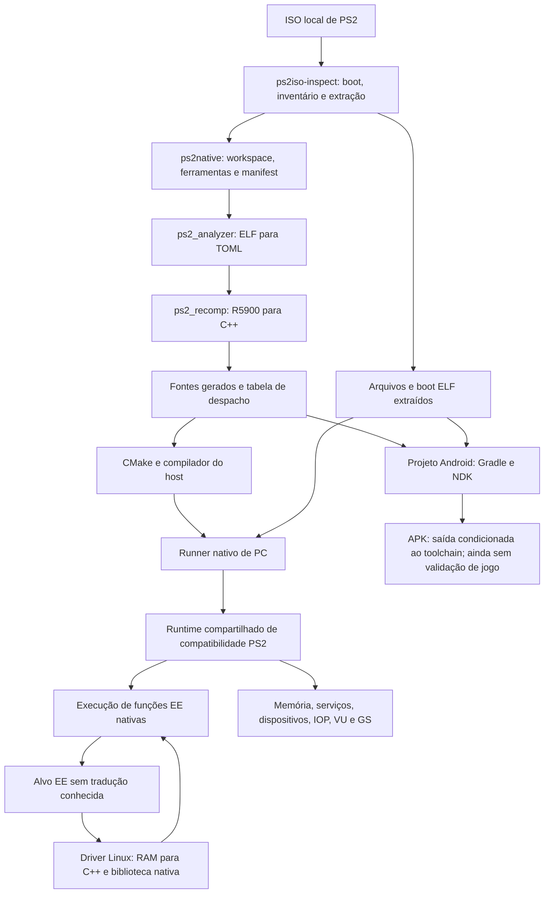

# PS2Native — relatório completo de implementação e estado atual

**Data da auditoria:** 30 de setembro de 2026.\
**Projeto:** `/home/pedrohs/Downloads/ps2-native-recompiler`.\
**Último registro consolidado de validação consultado:** `2026-09-30T13:24:04.546896+00:00`.\
**Foco:** a ferramenta universal PS2Native; Monster House aparece como caso de desenvolvimento e validação.

Este relatório descreve o código, a documentação e as evidências locais existentes. Os resultados de testes apresentados são execuções registradas anteriormente, consultadas nesta auditoria; não são uma nova rodada de testes. As mudanças de desenvolvimento continuam na árvore de trabalho local e não equivalem a uma versão publicada.

## 1. Objetivo e conclusão atual

A meta permanece: **receber uma ISO de PS2, descobrir e recompilar o código necessário, integrar os serviços do console e entregar um executável nativo para PC ou um APK para Android, automaticamente, sem alguém corrigindo cada jogo à mão.** Os 90% são uma etapa intermediária de compatibilidade medida; a ambição final é a biblioteca inteira.

Hoje temos uma ferramenta experimental com um caminho local real de **ISO → análise → C++ gerado → compilação → pacote de PC**, além da infraestrutura de preparação e build para Android. Também temos mecanismos para registrar chamadas indiretas em lote e traduzir novos blocos EE encontrados durante a execução no Linux.

O projeto ainda não demonstrou conversão universal, um jogo completo aprovado ou o motor que descobre e corrige autonomamente qualquer falha. O código EE recompilado executa como código nativo do host; IOP e VU ainda usam interpretação em partes importantes. Gráficos, áudio, dispositivos e temporização continuam dependendo do runtime de compatibilidade.

**Estado do produto:** protótipo funcional de recompilação e empacotamento, com validação de componentes e progresso em um título real. Universalidade, autonomia completa e entrega Android validada continuam em desenvolvimento.

## 2. Quadro do que já existe

| Capacidade | Estado atual | Alcance da evidência |
|---|---|---|
| Inspecionar e extrair ISO | Implementada | ISO9660/Joliet suportados; outros layouts não estão cobertos universalmente |
| Resolver o executável inicial | Implementada | Leitura de `SYSTEM.CNF` e caminho `BOOT2` |
| Inventariar executáveis | Implementada | ELF, segmentos e hashes; deduplicação de conteúdo |
| Analisar e recompilar o EE | Implementada | R5900 → C++ → código de máquina do host, com lacunas semânticas explícitas |
| Recompilar candidatos ELF secundários | Implementada | Heurística conservadora para MIPS III `ET_EXEC`; não identifica todo código possível |
| Registrar entradas indiretas estáticas em lote | Implementada e testada | Limites de instrução decodificados nas funções EE geradas não stub |
| Traduzir blocos EE ausentes em execução | Implementada para desenvolvimento Linux | Gera C++, compila biblioteca nativa, registra e retoma; casos não suportados continuam falhando |
| Cache de blocos EE nativos | Implementado | Identidade de código e ferramentas; validação dos bytes do bloco antes de reutilizar |
| Reutilizar objetos após regeneração | Implementada | Arquivos idênticos mantêm timestamps; CMake reaproveita objetos e PCH |
| Empacotar PC | Implementado e exercitado | Pacote Linux nativo para a ABI da máquina de build |
| Preparar projeto Android por ISO | Implementado | Gradle/CMake/NDK, assets, Activity e biblioteca nativa |
| APK de jogo validado em celular | Não demonstrado | Não há aprovação de instalação, boot e campanha em ARM64 físico |
| Runtime de serviços PS2 | Implementado parcialmente | Memória, scheduling, SIF/IOP, VIF/VU/GIF/GS, arquivos, pad e memory card |
| Testar sem interferir no desktop | Implementado e verificado | Xvfb privado, capturas, entrada e áudio isolados |
| Relatar build, hashes e lacunas | Implementado | Manifests, relatórios CSV, logs e verificação de integridade |
| Diagnosticar falhas complexas | Ferramentas implementadas | Captura e replay; a investigação causal ainda foi conduzida durante o desenvolvimento |
| Corrigir qualquer falha sem agente | Planejado | Não existe ainda o ciclo autônomo completo de diagnóstico, reparo e aprovação |
| Serviço de conversão na nuvem | Planejado | Nenhum serviço operacional de upload, filas e workers foi identificado nesta auditoria |
| Biblioteca PS2 inteira / 90% | Não medido | Um título incompleto não constitui um denominador de compatibilidade |
| Conversão completa em poucos minutos | Meta | Há tempos curtos de etapas e cache; não existe benchmark universal de ponta a ponta |

## 3. Base reaproveitada e trabalho construído por cima

O PS2Native usa o **PS2Recomp** como base experimental. O ponto de partida auditado nos documentos foi o commit `75d729c`. Já havia analisador, tradutores de instruções, runtime, IOP e estrutura de builds. A base não foi criada toda do zero nesta sessão.

O trabalho local acrescentou e ampliou:

- Inspeção/extração de ISO e seleção automática do boot ELF.
- CLI e orquestrador `ps2native`, workspaces por ISO e publicação de pacotes.
- Integração dos fontes gerados ao runner, substituindo a tabela vazia de exemplo.
- Inventário e recompilação de candidatos EE secundários, com registros por módulo.
- Preparação Android por título, inclusão dos dados e inicialização em armazenamento privado.
- Manifests, hashes de artefatos e relatórios de cobertura com limites explícitos.
- Registro de entradas internas e chamadas indiretas em lote.
- Registro compacto, regeneração incremental e perfil de build sem LTO.
- Tradução nativa de blocos EE materializados em RAM e cache Linux.
- Correções genéricas de instruções, ABIs, serviços e transferências encontradas com Monster House.
- Capturas, fixtures nativas, replay VU, benchmarks e execução headless isolada.

As propostas de IR independente do host, compilação nativa completa de IOP/VU, backend gráfico acelerado completo e motor autônomo permanecem objetivos. Uma seção de arquitetura em um documento não prova que seu componente já foi implementado.

## 4. Arquitetura que executa hoje



| Módulo | Responsabilidade atual |
|---|---|
| `tools/iso_inspect/` | Ler a imagem, resolver boot, inventariar ELF e extrair o disco |
| `tools/ps2native/` | CLI, subprocessos, workspaces, manifests, pacotes, overlays e testes headless |
| `ps2xAnalyzer/` | Análise do ELF e emissão da configuração TOML |
| `ps2xRecomp/` | Decodificação R5900, descoberta de entradas e emissão de C++ |
| `ps2xRuntime/` | Contexto EE, memória, despacho, serviços e integração de dispositivos |
| `ps2xIOP/` | Núcleo R3000A interpretado, módulos IRX, kernel e serviços IOP |
| `android/` | Projeto Gradle, wrapper CMake e preparação dos dados antes do native startup |
| `ps2xTest/` | Regressões C++ de compilador, runtime e subsistemas |
| `docs/` | Evidências, limites e procedimentos |

O caminho atual emite C++20 e usa um compilador C++ para gerar código da arquitetura de destino. Não temos hoje um novo backend próprio completo que emita diretamente x86-64/ARM64 a partir de uma IR independente do host.

## 5. Processo automático da ISO ao pacote

### 5.1 Entrada e identificação

1. A CLI recebe a ISO e descobre inspector, analyzer, recompiler e ferramentas de build por argumentos, variáveis de ambiente, `PATH` e diretórios locais conhecidos.
2. O inspector retorna JSON de contrato schema-v1, identifica o filesystem e lê `SYSTEM.CNF`.
3. O pipeline registra SHA-256 da ISO e do boot ELF, caminhos e inventário dos executáveis.
4. Um workspace exclusivo é criado em `<título>-<hash-da-ISO>/run-*`; dados e fontes gerados ficam separados do código compartilhado.
5. O disco é extraído e os hashes relevantes são conferidos. A árvore extraída é preservada como fonte de dados para os serviços de disco/arquivos.

### 5.2 Análise e recompilação

6. O analisador transforma o boot ELF em configuração TOML.
7. O recompilador decodifica funções/entradas e emite fontes C++, declarações, stubs, registro de despacho e relatórios.
8. Candidatos secundários ELF32 little-endian MIPS `ET_EXEC` com flags MIPS III passam por invocações separadas e recebem namespaces e registros próprios.
9. Falhas de candidatos secundários são retidas no manifest; outros candidatos continuam sendo processados. Uma flag MIPS III é uma heurística de classificação, não prova definitiva de que o módulo pertence ao EE.
10. Normalizações locais de compatibilidade do C++ gerado são aplicadas quando necessárias, sem alterar manualmente a estrutura compartilhada para cada título.

### 5.3 Compilação e entrega

11. Para PC, um wrapper CMake conecta os fontes gerados ao runtime e compila o runner para a ABI do host. Para Android, o pipeline prepara um projeto isolado e solicita o build ARM64 ao Gradle/NDK quando seus pré-requisitos existem.
12. O pacote recebe código nativo, dados do disco, boot ELF, configuração de execução e manifest. A publicação em destino novo usa staging e rename atômico sem sobrescrever um pacote existente.

O verificador de pacote detecta arquivos alterados, ausentes ou inesperados em relação ao inventário. Logs e saves declarados como saídas mutáveis recebem tratamento próprio. **Essa verificação mede integridade dos arquivos, não qualidade gráfica ou possibilidade de terminar o jogo.** Os hashes também não constituem assinatura de procedência.

Uma ISO não é apenas o executável inicial. Ela pode conter módulos EE, IRX/IOP, microprogramas VU, código carregado de arquivos, scripts e todos os dados audiovisuais. Universalizar a entrada exige acompanhar também o código e os serviços usados depois do boot.

## 6. O que a recompilação produz

A análise combina metadados ELF, símbolos quando presentes, informações de debug/mapas, alvos J/JAL, endereços materializados, tabelas de ponteiros e heurísticas de funções. Depois vêm a decodificação R5900, análise de controle e tradutores das famílias integer, COP0, FPU, MMI e operações relacionadas a VU.

O C++ mantém explicitamente contexto de registradores, PC e memória convidada. Chamadas para serviços, MMIO, scheduling e gráficos entram no runtime. O compilador do host transforma esse C++ em instruções nativas.

Isso produz uma **tradução semântica executável**, não recupera automaticamente o projeto original do estúdio, seus nomes, comentários, organização da engine ou arquivos-fonte. Tornar a ferramenta aberta e gerar C++ de um binário são operações diferentes; os dados e o programa derivados da ISO continuam sendo os insumos e resultados daquele jogo.

Instruções não implementadas podem resultar em diagnóstico e exceção no C++ gerado. Por isso um arquivo C++ compilável pode conter caminhos que falharão somente quando forem executados. O manifest precisa preservar esse estado parcial.

## 7. Chamadas indiretas: mudança estrutural já feita

O método anterior de adicionar um endereço ao TOML, compilar o jogo inteiro e esperar o próximo endereço ausente foi substituído, para o código estático decodificado, por **registro em lote dos limites de instrução**.

- Cada limite decodificado dentro das funções EE geradas não stub pode receber entrada de retomada.
- O wrapper seleciona o ponto correto a partir de `ctx->pc`.
- Sobreposições usam o dono decodificado mais específico; os inícios das funções mantêm suas entradas.
- Entrada independente numa instrução de delay slot executa essa instrução isoladamente e devolve o próximo PC ao dispatcher. Na execução normal do branch, o delay slot continua executando uma vez.
- Branch dentro de delay slot entrado independentemente continua sendo um caso explicitamente não suportado.
- Endereços não decodificados ou sem tradução continuam aparecendo como lacuna, em vez de serem declarados cobertos.

**Medições do caso Monster House:**

| Medida | Resultado registrado |
|---|---:|
| Limites internos de instrução decodificados | 698.143 |
| Entradas de retomada | 699.283 |
| Bindings totais do despacho | 705.383 |
| Inícios de stubs | 191 |
| Bindings incorretos apontando para stub no teste registrado | 0 |

Os endereços `0x176b10`, `0x1639e0` e `0x177350` passaram a ser emitidos sem suas três entradas manuais no TOML. **705.383 bindings não significam 705.383 funções:** vários endereços compartilham a mesma função nativa e entram em labels diferentes.

## 8. Tradução nativa de código EE encontrado em RAM

Existe um segundo mecanismo para alvos EE ausentes no desenvolvimento Linux:

```text
Alvo EE sem tradução disponível
  → capturar os bytes atuais da RAM
  → descobrir blocos dentro de orçamento limitado
  → gerar C++ para esses blocos
  → compilar biblioteca nativa .so
  → carregar e registrar as entradas
  → retomar execução nativa
```

O driver é `tools/ps2native/native_overlay_driver.py`, integrado ao runtime por `PS2X_NATIVE_OVERLAY_DRIVER`. Ele usa compilador do host com `-O0 -fno-lto`; não exige reconstruir o runner inteiro ou cadastrar individualmente o endereço no TOML.

Snapshots normalmente têm 64 KiB, com janela sobreposta para fronteiras que atravessam um branch e seu delay slot. Blocos têm limite de 128 instruções e existem orçamentos de quantidade de blocos/instruções. O prefetch é especulativo e não garante descobrir todos os endereços.

O cache incorpora bytes de código, endereço de entrada, ferramentas, fonte do driver e headers do runtime. Antes de reutilizar uma tradução, o runtime confere os bytes do bloco que a originou. Traduções que falharam podem ser tentadas novamente quando o snapshot mudar, incluindo alterações além dos primeiros 16 bytes.

**Limites atuais:** Linux; dependência de compilador local; casos de instrução/controle não suportados continuam sendo erro. Não existe o mesmo driver pronto para Android, Windows ou macOS, nem acompanhamento universal completo de toda escrita em páginas de código EE.

Esse mecanismo é **compilação nativa durante a execução**, não AOT estrito de todo o programa antes de iniciar. Para a meta de pacote totalmente AOT, uma evolução necessária é usar essas descobertas na validação, congelar as versões de código e incorporá-las ao build final, com tratamento explícito para versões realmente novas.

Não foi implementado um microinterpretador EE universal que execute qualquer endereço ausente até achar código conhecido. A interpretação que existe em IOP/VU é um subsistema distinto.

## 9. Compilação incremental e redução do tempo de tentativa

### 9.1 Perfil de desenvolvimento

- `PS2X_FAST_ITERATION=ON`: fontes normais do jogo em `-O1 -fno-lto` no caminho GNU/Clang relevante.
- `PS2X_ENABLE_RELEASE_IPO=OFF`: elimina LTO do loop de desenvolvimento.
- PCH do runner reaproveita os headers efetivos daquele título.
- Registro de funções em `-O0`, sem PCH incompatível.
- Fontes gerados maiores que 4 MiB usam `-O0` no perfil rápido para limitar o custo do otimizador.
- Os três fontes privados do VU podem usar `-O2`; o restante do jogo permanece em `-O1`, sem LTO.

### 9.2 Registro compacto

Endereços consecutivos que compartilham wrapper são emitidos como intervalos. O registro expande esses intervalos em execução, preservando buracos e donos distintos. Não removemos entradas para conseguir o ganho.

| Fonte gerado de registro | Bytes |
|---|---:|
| Antes | 136.045.196 |
| Depois | 2.253.899 |

Isso representa cerca de **60 vezes menos texto C++ de registro**, aproximadamente 98,34% de redução. O número de bindings executáveis permanece preservado.

### 9.3 Regeneração que não invalida objetos sem necessidade

O gerador compara os conteúdos antes de gravar fontes e headers. Arquivos idênticos mantêm timestamps; apenas os alterados precisam voltar ao compilador.

Uma repetição de geração levou **5,66 segundos** e preservou os timestamps de **7.244 arquivos C++/headers**, com zero arquivos alterados, sob compilação concorrente. Esse conjunto de geração não é o mesmo inventário de fontes retido no manifest inicial.

Exemplos registrados de regeneração seletiva: correções MMI alteraram 12 fontes; a correção SQRT/RSQRT alterou 138. Os outros objetos puderam ser reutilizados. Alterações em headers públicos ou flags compartilhadas ainda podem invalidar mais objetos.

**Tempos curtos registrados são de etapas específicas:** relink de mudanças restritas ao runtime na ordem de 10 segundos; novo lote de overlay na ordem de 5–10 segundos; bibliotecas de overlay já em cache em cerca de 67–81 ms. Isso não é medição de conversão completa de uma ISO nova.

## 10. Correções genéricas produzidas com Monster House

Monster House tem servido para revelar erros das camadas compartilhadas. A intenção das correções abaixo é melhorar capacidades usadas por muitos títulos; sua generalização para a biblioteca precisa ser medida em outros jogos.

| Camada | Mudança feita | Efeito e limite |
|---|---|---|
| MMI/R5900 | Produtos halfword e acumuladores HI/LO; modos PMFHL, PMTHL e movimentos de 128 bits; interleaving, saturação e ordem de lanes | 21 variantes executadas contra oráculos escalares; não certifica toda a ISA MMI |
| FPU/R5900 | `SQRT.S` lê FT; `RSQRT.S` calcula FS / sqrt(FT) | Corrige erro de operandos compartilhado pelo gerador estático e overlay; flags/exceções/rounding completo continuam fora desse teste |
| COP0/clock | Count compartilhado acompanha o relógio virtual EE, trocas de thread, callbacks, writes, wrap e idle/VSync | O vídeo deixa de repetir indefinidamente o primeiro frame; não estabelece timing cycle-exact nem todos os Compare interrupts |
| ABI libm | 13 funções double passam a ler argumentos de 64 bits e devolver resultado double em V0 | Corrige cadeia de projeção/câmera que gerava FOV zero; não prova todas as variantes de toolchain PS2 ou igualdade bit a bit da libm |
| LOADFILE/IOP | Carregamento por buffer lê RAM física IOP; argumentos IRX recebem argc/argv corretos | Evita uso do espaço de endereço ou formato de argumento errado |
| IOP/kernel | Alarmes preservam GP/userdata, deadline de 64 bits, repetição e cancelamento | Regressões de callbacks e scheduling; kernel completo ainda exige mais cobertura |
| IOP/sysclib | `_wmemcopy`/`_wmemset` tratam tamanho em bytes e preservam tails | Evita corromper alocações adjacentes |
| IOP/heap | Reutilização de espaços liberados, gaps, validação de overflow/alinhamento e maior espaço livre | Melhora estabilidade de alocação; não elimina todos os limites de memória |
| IOP/IOMAN | VFS de leitura: open/close/read limitado/seek assinado/EOF/reset | Escrita e dispositivos personalizados continuam sem cobertura geral |
| SPU AutoDMA | Temporização por frame PCM estéreo de 32 bits: 768 clocks IOP | Corrige callbacks de refill excessivamente rápidos; áudio audível completo não foi aprovado |
| SIF/RPC | Adaptador de assinatura SDK, tabelas de comando visíveis na memória convidada e dispatch respeitando writes diretos | Preserva handler e contexto GP; não implementa todos os serviços RPC |
| VIF/GIF/DMA | DIRECT e IMAGE continuam entre segmentos; palavras TTE não são tratadas como pixels | Regressões de transferências; todos os modos/fragmentações ainda não estão certificados |
| VIF1 | Retenção de headers/payloads parciais STMASK/STROW/STCOL/MPG/UNPACK | Stream fragmentado reproduz o completo nos casos testados; VIF0 e timing parcial permanecem separados |
| VIF UNPACK | V2 escreve X,Y,X,Y; V4-5 expande RGB5 e alpha corretamente e mantém bypass de STMOD | Corrige formatos observados; V3 e alguns modos ROW/STCYCL ainda requerem investigação |
| VU/VI | Branch após cadeia de writes conserva o valor anterior à cadeia inteira | Um microprograma capturado deixa de esgotar 65.536 ciclos |
| VU/LOI/MIN/MAX | Preservação dos bits crus dos operandos e campos de GIF | Evita zerar valores 1, 6 e 14 usados em tags gráficas |
| Pad/ABI | Byte baixo dos botões no offset 2, alto no 3, conforme consumidor SDK | Corrige troca Start/R1; há testes de bytes e verificações reais anteriores |
| Pad/teclado | WASD → analógico esquerdo; setas → D-pad; opostos neutralizam o eixo | Entrega de pacote foi verificada; pacote correto não demonstra sozinho movimento do personagem |
| Memory card | Consultas de diretório exatas distinguem entrada de seus filhos/wildcards | Criação e leitura de save inicial observadas; campanha e saves arbitrários não aprovados |

Na libm foram corrigidas `sqrt`, `sin`, `cos`, `tan`, `atan`, `atan2`, `pow`, `exp`, `log`, `log10`, `ceil`, `floor` e `fabs`. Os testes preservam as variantes float relevantes enquanto verificam o ABI double.

Uma investigação anterior dos botões assumiu ordem de bytes errada a partir de um consumidor de menu. O consumidor de gameplay e as regressões SDK corrigiram essa conclusão. O relatório registra a conclusão atual, sem contar a tentativa anterior como uma capacidade válida.

## 11. Como Monster House foi usado no processo

O ciclo concreto de desenvolvimento foi:

1. **Inspecionar a ISO e recompilar o boot:** confirmar o executável e conectar o C++ gerado a um runner de verdade.
2. **Sair da correção por endereço:** registrar entradas internas em lote e adicionar compilação nativa de blocos em RAM.
3. **Passar do boot para os vídeos/menu:** corrigir MMI, Count, serviços IOP e transferências necessárias.
4. **Exercitar estado persistente e controles:** observar criação/leitura do save inicial e corrigir ABI de pad e diretórios de memory card.
5. **Investigar travamento em código de colisão:** identificar operandos errados de SQRT/RSQRT, reproduzir em fixture nativa e regenerar somente os fontes afetados.
6. **Investigar os pacotes gráficos:** capturar VIF/VU/GIF, reproduzir microprograma fora do boot e corrigir cadeia VI e preservação de bits.
7. **Investigar cena preta:** seguir coordenadas inválidas até a cadeia de conversão double/float da câmera; corrigir o ABI libm e confirmar em build normal novo.
8. **Medir antes de otimizar:** capturar programas VU reais, aplicar mudanças locais e comparar estado/dados e tempo em replays alternados.
9. **Isolar testes da máquina do usuário:** criar harness headless privado para screenshots e entrada sem usar o desktop.

Esse caminho gerou componentes reutilizáveis, testes e dados de diagnóstico. **A investigação causal e a implementação dessas correções ainda foram trabalho de desenvolvimento; o PS2Native não fez todo esse ciclo sozinho.**

### 11.1 Inventário e relatório inicial de tradução

A ISO consultada contém **12 conteúdos ELF únicos** no inventário: um boot ELF e 11 outros MIPS ELF. Nesse caso não foram encontrados candidatos secundários EE elegíveis pela heurística atual. Os demais não foram todos convertidos AOT; entram no inventário e nas rotas IOP/runtime aplicáveis.

O snapshot inicial retido no manifest registra:

| Contador | Valor |
|---|---:|
| Funções descobertas/processadas | 7.224 |
| Funções recompiladas | 7.033 |
| Funções stubbed | 191 |
| Funções geradas reportadas | 7.233 |
| Falhas de decode reportadas | 0 |
| Instruções não tratadas/erros reportados | 13.706 |
| Warnings/promotions reportados | 2.280 |

**Esses são contadores do relatório inicial armazenado.** Houve correções e regenerações posteriores; não devem ser apresentados como 13.706 falhas ativas atuais ou como auditoria semântica completa da versão final. O assessment estático retido continua `known_gaps`/`partial`, e não há uma certificação global atualizada que limpe todas as famílias e caminhos.

O ledger inicial atribui intervalos de funções sobre 2.885.888 bytes executáveis de arquivo, registra 296.320 bytes de zero-fill, sobreposições e oito bytes não atribuídos. Intervalos são heurísticos: um intervalo atribuído pode conter dados e tradução incorreta. Esses números não estabelecem 99,99% de compatibilidade.

### 11.2 Resultado observado, resumido

Boot, avanço de vídeos, menu, criação/leitura/carregamento do save inicial e chegada anterior a HUD/tutorial do primeiro capítulo têm evidências registradas. Um build normal corrigido também mostra um interior 3D avançando, com piso, paredes, escadas e três personagens animados, sem redirects de função, restauração de câmera ou omissão de primitivas pelo debugger.

Há defeitos de renderização dos personagens e não foi demonstrado controle causal de movimento nessa cena mais recente. Campanha completa, áudio audível correto, saves arbitrários, Android e 60 FPS permanecem sem aprovação. Monster House ainda é **caso de validação incompleto**, não um port completo certificado.

## 12. Quanto do processo já é automático

| Tipo de automação | Já temos | Ainda falta |
|---|---|---|
| Preparação e build | Inspecionar, extrair, selecionar boot, analisar, emitir C++, compilar, empacotar e registrar resultados | Universalizar formatos e tornar todo o fluxo reproduzível em todas as plataformas |
| Descoberta de entradas | Heurísticas estáticas, registro interno em lote e compilação de alvos EE novos em RAM no Linux | Código comprimido/relocado, formatos diversos, invalidação completa e inclusão final de todas as versões |
| Diagnóstico | Logs, estado, capturas EE/VU/GS, replay, fixtures e snapshots | Classificação causal automática confiável, identificação sistemática da primeira divergência |
| Correção sem pessoa | Mecanismos específicos resolvem algumas classes automaticamente, como certos alvos EE ausentes | Motor geral que escolha um reparo, gere regressão, implemente, valide, rejeite regressões e tente novamente |
| Validação de jogo | Checkpoints, screenshots e resultados locais registrados | Exploração automática de campanha, saves, áudio, controles e dispositivos com oráculos adequados |

O motor autônomo do plano precisa fechar o ciclo:

```text
Receber ISO nova
  → construir e observar
  → classificar falha
  → reproduzir a menor divergência útil
  → propor correção de compilador/runtime
  → provar a correção e executar regressões
  → incorporar apenas reparos aprovados
  → repetir dentro de orçamento
  → entregar pacote aprovado ou diagnóstico explícito
```

Esse ciclo completo **não está implementado**. Capturar uma falha automaticamente ajuda a investigar; não significa que a ferramenta já saiba consertá-la. Traduzir um endereço novo resolve uma classe de problema, mas não corrige automaticamente um ABI double errado, uma regra VIF incorreta ou um efeito GS ausente.

Uma meta central de universalização é transformar as correções encontradas no primeiro jogo em capacidades genéricas, acompanhadas de regressões, em vez de acumular endereços hardcoded e patches escolhidos manualmente por título.

## 13. Fronteira atual entre nativo, interpretação e dispositivos

| Parte | Implementação atual | Consequência para nossa meta |
|---|---|---|
| EE estático traduzido | C++ compilado para código nativo | Parte efetiva do recompiler já existe |
| Novos blocos EE no Linux | C++ compilado para `.so` durante execução | Continua execução nativa, mas não é AOT estrito prévio |
| IOP / IRX | Núcleo R3000A interpretado e serviços HLE selecionados | Ainda falta tradução nativa completa do código IOP para o contrato final desejado |
| Microprogramas VU | Cores interpretados, com correções e otimizações | Ainda falta estratégia nativa/AOT de VU e validação das pipelines |
| Serviços SDK/sistema | Implementações nativas no runtime, incluindo stubs/HLE | Precisam reproduzir corretamente comportamento e ABI, não apenas retornar sucesso |
| GS | Rasterização principalmente em software na CPU | Backend acelerado completo e fiel permanece trabalho importante |
| Apresentação da imagem | OpenGL/raylib; no Xvfb consultado, llvmpipe | Mostrar textura via OpenGL não implica rasterização GS toda na GPU |

Mesmo um port com todo código convidado compilado precisa implementar o comportamento dos dispositivos e serviços do PS2. Isso pode ser feito em código nativo e com aceleração do host. A parte ainda distante da exigência de recompilar tudo é a execução interpretada de programas IOP/VU e o código EE ainda desconhecido.

O documento inicial `PROJECT_SPEC.md` admite fallback seletivo; o plano universal posterior descreve o objetivo mais estrito. Esta auditoria registra a implementação real. A remoção do código convidado interpretado exige marcos próprios e evidência; não se resolve trocando o nome do pacote para “native”.

## 14. Android e PC: o que está conectado e o que falta

### 14.1 PC

O pacote desktop contém `bin/ps2EntryRunner`, a árvore `game/`, boot ELF de referência, manifest e wrapper de execução. O CMake recebe `PS2X_GENERATED_CODE_DIR`, inclui os fontes daquele jogo e exclui o `register_functions.cpp` vazio de exemplo.

O caminho efetivamente exercitado nesta máquina é **Linux x86-64**. O alvo `desktop` usa a ABI do host; não é um serviço pronto de cross-compilation automática para todos os sistemas. A existência de templates ou CI não certifica o jogo no Windows/macOS, e o driver de overlay vivo é Linux apenas.

### 14.2 Android

A infraestrutura implementada:

- Cria um projeto por ISO sem sobrescrever o projeto Android compartilhado.
- Passa os fontes C++ gerados para o wrapper CMake do Android.
- Solicita biblioteca nativa e APK `arm64-v8a`.
- Deriva a identidade de aplicação do hash da ISO.
- Inclui o disco extraído em `app/src/main/assets/game/`.
- `Ps2PackageActivity` copia dados para `getFilesDir()/game/` antes do native startup.
- O runtime resolve `ANativeActivity::internalDataPath/game/boot.elf`.
- Registra bloqueios de ferramentas e projeto staged; não declara APK quando o build não ocorreu.

Pré-requisitos documentados: JDK 17, Gradle 8.7+, SDK platform 34, NDK `28.2.13676358` e Android CMake `3.22.1`. O projeto usa min SDK 28. Há propriedades do wrapper Gradle, mas não um wrapper completo executável/JAR; o builder aceita Gradle instalado ou distribuição em cache.

**O que não foi demonstrado:** APK real deste caso, execução ARM64 física, paridade das operações SIMD, integração audiovisual completa, campanha e desempenho no celular. O caminho ARM usa `sse2neon`, que precisa de validação semântica própria. Controles touch continuam incompletos.

O driver atual de overlays depende de compilador Linux e de ABI/bibliotecas do host; seu cache não pode ser transplantado como código executável para ARM64. Para o APK final, precisamos incorporar traduções descobertas previamente ou fornecer um mecanismo nativo apropriado ao destino.

Dados de disco embutidos podem criar APKs enormes, com cópia adicional para armazenamento privado. Split/OBB ou outra entrega de dados grandes ainda não está implementada. O build de protótipo usa assinatura debug; um pacote distribuível exige identidade de assinatura apropriada. FFmpeg fica desabilitado por padrão no Android, portanto caminhos de vídeo dependentes dessa integração também precisam ser fechados.

## 15. Testes e evidências que já temos

| Conjunto | Resultado registrado | O que demonstra |
|---|---:|---|
| Suíte C++ principal | 484/484 | Regressões de compilador/runtime/subsistemas cobertos |
| Mesma suíte ligada ao runtime desktop real com VU `-O2` | 484/484 | Mudança de otimização privada não quebrou esses testes |
| Pipeline Python | 18/18 | Casos de CLI, staging/publicação, inventário e isolamento cobertos |
| IOP | 4/4 executáveis/grupos | Importações, compatibilidade e comportamento testado do IOP |
| Fixture nativa de despacho | 4 caminhos; 16 bindings | C++ emitido compila e retoma nas entradas do fixture |
| Fixture nativa MMI | 21 variantes × 512 = 10.752 execuções | Semântica coberta comparada a oráculos escalares |
| Fixture nativa FPU | 7 variantes × 512 = 3.584 execuções | Operand/alias de SQRT/RSQRT nos casos testados |
| ABI libm double | 66 chamadas unárias, 10 binárias e 4 round trips de câmera | Argumento/retorno double e preservação float testados |
| Replay VU de desempenho | 54.000 replays sobre 3 capturas | Estado/dados iguais antes/depois e ganho local medido |
| Harness headless | 5 verificações CLI e 4 de schema | Isolamento e rejeição de sessões inválidas nos casos registrados |

O histórico contém falhas reproduzidas antes das correções e resultados verdes depois, por exemplo em pad SDK, formatos VIF, analógico de teclado e ABI double. Isso ajuda a mostrar que a regressão detecta o erro original.

**A quantidade de testes não é um percentual de títulos compatíveis.** Os conjuntos têm escopos diferentes e não devem ser somados como se cada execução cobrisse um pedaço independente de toda a biblioteca. Também não são prova de todos os modos de exceção, arredondamento, DMA, timing ou renderização.

## 16. Desempenho: resultados medidos e limites

### 16.1 VU

Uma amostragem pequena de stacks apontou VU como alvo de otimização: 20 de 24 interrupções estavam ali, duas no GS software e duas no scan de ready threads IOP. Essa amostra não é uma medição uniforme de tempo de CPU e não estabelece “83% do custo”.

Foram feitas três mudanças:

1. Visitar somente os bits ativos das máscaras de dependência VI, preservando ordem e latência.
2. Normalizar Q/I no cálculo FMAC apenas quando a instrução os usa.
3. Compilar somente três fontes privados VU em `-O2`, mantendo jogo em `-O1` e sem LTO.

Trials alternados antes/depois: três capturas MSCAL reais, três trials, 3.000 replays por variante por trial; **54.000 replays ao todo**. Todas as capturas tiveram hashes de estado e dados VU iguais entre variantes.

| Captura | Mediana anterior | Mediana otimizada | Redução de tempo |
|---|---:|---:|---:|
| Interior, 1.650 ciclos | 433,466 µs | 290,029 µs | 33,09% |
| Cena anterior, 4.873 ciclos | 1.286,710 µs | 872,148 µs | 32,22% |
| Continuação diagnóstica, 2.062 ciclos | 485,227 µs | 334,043 µs | 31,16% |

Essas medições são de **execução VU aquecida em replay**, não de frame completo, compilação fria, VRAM final ou campanha. Os hashes mostram equivalência entre as versões nesses inputs; não provam por si sós equivalência ao hardware PS2 em todos os casos.

A mudança de flags compartilhadas agendou 48 compilações runtime/utilitários, mas zero compilações de fontes gerados do jogo/PCH naquele rebuild. Mudanças posteriores restritas a fontes privados mantêm o caminho curto de relink.

### 16.2 Taxa de apresentação observada

Uma amostra de 15,006 segundos no interior 3D contou 23 uploads de apresentação: aproximadamente **1,53 uploads por segundo** no Xvfb com llvmpipe. É uma taxa ruim, explicitamente mantida no registro. Não é benchmark da GPU física nem prova de gameplay controlável, mas impede apresentar o ganho local VU como “jogo a 60 FPS”.

### 16.3 Conversão em minutos e GPU

Já reduzimos custos desnecessários: LTO no loop de desenvolvimento, registro C++ gigantesco, gravação idêntica de fontes, rebuild de todos os objetos e cadastro individual de entradas. Cache aquecido e compilação incremental têm ganhos comprovados em etapas.

Ainda não temos uma medição de conversão fria completa que entregue um jogo aprovado em dez minutos. Extrair dados, descobrir código, traduzir, compilar, validar todos os caminhos e corrigir uma incompatibilidade desconhecida são custos diferentes.

No projeto atual, parsing, emissão C++ e compilação/link são trabalhos do toolchain no CPU. A GPU pode ajudar fortemente onde existir backend de gráficos/compute adequado; VRAM adicional não fornece automaticamente semântica R5900/IOP/VU, não corrige falhas e não substitui o compilador C++ existente. Experimentos de aceleração precisam de implementação e medição próprias.

## 17. Diagnóstico, replay e headless

Há mecanismos de observação sem recompilar milhares de fontes apenas para mudar verbosidade: controles de tracing, captura de cenas e marcadores para solicitar inputs VU.

Uma captura MSCAL guarda microcode, dados, estado de entrada/saída e um ring limitado das últimas 512 duplas de instrução. O replay pode reproduzir o microprograma sem dar boot no jogo ou abrir uma janela. Saída de sucesso exige terminação normal registrada; esgotar orçamento de ciclos não é contado como sucesso.

O estado cru capturado depende da ABI local do host; registros de trace têm 664 bytes nessa máquina. Isso não é formato portátil de save state. Pipelines ocultas de MSCNT não estão completamente serializadas. O benchmark reseta o interpreter entre execuções independentes para não acumular o relógio absoluto e falsear a medição.

O harness `headless_native_test.py` usa Xvfb em display livre de número 90 ou superior, Xauthority privado e identificação do processo dono. Screenshots e comandos de teclado são direcionados somente a essa sessão validada; sessões do desktop são rejeitadas. Key-up executa mesmo após interrupção. O áudio do runner vai para um sink temporário silencioso, sem mudar a saída padrão do usuário.

Esse isolamento permite desenvolver e observar o runtime sem movimentar o mouse, focar janelas ou capturar o desktop. Ele não resolve automaticamente equivalência de imagem, controle causal do personagem ou aprovação de áudio audível.

## 18. Manifests e significado dos estados

O pacote consultado traz:

```json
{
  "status": "complete",
  "support_tier": "experimental",
  "gameplay_compatibility": "native_chapter_one_tutorial_observed_rendering_incomplete",
  "native_translation_assessment": {
    "status": "known_gaps"
  }
}
```

**`complete` significa que aquele pacote experimental foi construído.** O campo `artifact_completion_scope` esclarece expressamente que isso não certifica um jogo completo ou jogável.

O resumo estático interno ainda conserva `gameplay_compatibility: unverified`; as observações reais posteriores estão no estado geral de compatibilidade e no registro de validação. São escopos distintos e relatórios de momentos distintos. Uma futura consolidação precisa manter essa proveniência, sem interpretar nenhum desses campos como aprovação de campanha.

Os manifests guardam identidade da entrada, ferramentas, fontes, etapas, erros, listas de artefatos, tamanhos e SHA-256. `function_coverage.csv` e `address_coverage.csv` ajudam a localizar intervalos e lacunas, mas não certificam toda instrução, código dinâmico ou serviço de dispositivo.

## 19. Plano, pesquisas e componentes ainda não entregues

O plano mestre `README_AUTOMACAO_UNIVERSAL.md` tem **2.756 linhas na versão consultada**, 30 seções, backlog e propostas experimentais. Ele cobre automação, diagnóstico, nuvem, cache, compilação rápida, primeiro jogo e generalização com mais três ISOs.

Entre as direções descritas estão descoberta AOT orientada por execução, catálogo de versões de código materializadas, primeira divergência causal, especialização VU verificada, reutilização por contrato de módulo, planejamento de build por custo e reparos validados por execução. São **propostas de pesquisa e engenharia**; não há demonstração de que todas estejam implementadas ou de que sejam inéditas na comunidade.

Já existem elementos relacionados a algumas dessas direções, como registro compacto, cache de código EE e replay de microprogramas. Isso não equivale a realizar automaticamente o desenho inteiro do plano.

Não foi identificado nesta árvore um serviço operacional de conversão com upload, autenticação, armazenamento, filas, workers, monitoramento de jobs e download de artefatos. Também não existe demonstração do motor geral de reparos autônomos. A nuvem poderá distribuir trabalho; não garante que uma tradução incorreta se torne correta.

## 20. Lacunas que bloqueiam a universalidade

| Lacuna | Por que importa | Evidência necessária para fechar |
|---|---|---|
| Identificar todo código relevante | Jogos usam módulos, arquivos próprios, overlays, relocação e materialização em RAM | Corpus com inventário e rastros mostrando que entradas executadas foram traduzidas ou explicitamente diagnosticadas |
| Semântica completa do EE | Uma instrução ou ABI errada pode corromper estado sem crash imediato | Testes diferenciais por família, flags, aliases, delay slots, memória e exceções |
| Ciclo de vida do código | Mesmos endereços podem receber novas versões | Rastreamento de load/write/unload, identidade e invalidação de traduções antigas |
| IOP nativo | IRX e R3000A ainda dependem de interpretação e imports parciais | Loader/relocações/imports corretos e execuções nativas verificadas |
| VU nativo e pipelines | Microprogramas e latências podem determinar geometria e GIF | Tradução/especialização com oráculo de estado, dados, flags, término e pipelines |
| GS fiel e rápido | Apresentação OpenGL não cobre todos os efeitos/rasterização do PS2 | Comparação de frames/VRAM e desempenho em backend acelerado real |
| DMA/VIF/GIF/SIF | Fragmentação, máscaras e ordenação alteram dados e sincronização | Fixtures de modos restantes e rastros de títulos distintos |
| Áudio/SPU2/CDVD/IPU e timing | Boot e imagem não provam som, sincronismo ou leituras corretas | Comparações de áudio/vídeo, eventos e acesso a disco |
| Android ARM64 | Build local x86 não prova a execução no celular | APK instalado, SIMD/ABI verificados, controles, áudio, storage e sessões no dispositivo |
| Autocorreção | Resolver alvos novos não repara toda falha de sistema | Ciclo sem intervenção com falhas injetadas, reparos aprovados e regressões rejeitadas |
| Validação de conteúdo completo | Uma cena não cobre campanha, saves, modos e transições | Rotas de aceitação completas e reprodutíveis por revisão |
| Generalização e 90% | Um caso pode favorecer caminhos de uma engine | Corpus diverso, denominador fixado e resultados publicados por hash/revisão |
| Conversão em minutos | Etapas rápidas não garantem baixa latência total | Tempos frios/aquecidos de ponta a ponta, custo e taxa de sucesso sem reparo humano |

Não é possível atribuir honestamente um percentual geral de conclusão com os dados disponíveis. Os contadores medem componentes, intervalos, casos de teste e checkpoints, não a fração da biblioteca que já funciona.

## 21. Sequência concreta para chegar ao produto pretendido

### Marco A — primeiro caso de aceitação completo

Usar Monster House para fechar as capacidades genéricas ainda expostas: renderização, controle real, progressão, áudio e save/reload. Aceitar apenas um build normal reproduzível; resultados obtidos com redirects de debugger continuam diagnósticos. Depois validar o caminho Android em dispositivo físico.

Esse marco testa o conjunto integrado; ele não constitui a universalidade e não exige organizar o projeto permanentemente em torno desse único jogo.

### Marco B — generalização com mais três ISOs

O ciclo proposto no plano ainda não foi concluído. Escolher títulos que exercitem características diferentes e congelar as capacidades gerais antes de cada submissão. Para cada ISO, registrar o que o pipeline resolveu sozinho, a primeira falha, a correção necessária e quais regressões passaram.

Promover correções ao compilador/runtime por comportamento e evidência. Qualquer perfil específico necessário deve ser selecionado automaticamente por identidade exata e não mascarar uma falha genérica compartilhada.

### Marco C — autonomia mensurável

Transformar as classes de diagnóstico já aprendidas em classificadores, reproduções mínimas e regras de reparo. Separar proponente de reparo e avaliador. O sistema precisa rejeitar “correções” que pulam instruções, omitem geometria, apenas mudam o critério de sucesso ou quebram outros títulos.

Aceitação: submissões novas resolvidas sem editar TOML/C++ à mão, com limite de custo, rastros do processo e regressões preservadas. Falhas não solucionadas precisam sair como diagnósticos explícitos.

### Marco D — código convidado totalmente nativo

Fechar IOP/VU nativos, versões de código dinâmico e pacotes por ABI. Converter descobertas de execução em artefatos AOT quando possível. Medir e registrar qualquer fallback restante; não declarar AOT total enquanto programas convidados ainda dependerem de interpretação.

### Marco E — conversão rápida e nuvem

Com comportamento validado, consolidar identidade forte de cache, reuso de objetos/runtime, toolchains pré-preparados, filas e workers por destino. Medir tempo total e custo por ISO fria, revisão nova e cache aquecido. A meta de minutos precisa passar nesses cenários, não apenas no tempo de carregar uma biblioteca já compilada.

### Marco F — medir 90% e ampliar a biblioteca

Definir catálogo, revisões, dispositivos e critérios de suporte. Medir separadamente:

- **Compatibilidade:** quais jogos/revisões passaram os critérios completos.
- **Automação:** quantos desses resultados foram obtidos sem intervenção.
- **Natividade:** quais processadores/caminhos ainda usam código convidado interpretado.
- **Desempenho:** taxa de frames estável, frame times, áudio, consumo e temperatura por dispositivo.
- **Latência de conversão:** tempos e custo frio/aquecido.

Só então “90%” se torna um resultado calculável. A expansão para a biblioteca inteira continua sendo objetivo, com falhas e classes não suportadas visíveis.

## 22. Comandos e localização dos artefatos

Comandos existentes, executados a partir da raiz do projeto:

```sh
python3 -m tools.ps2native inspect --iso '/caminho/jogo.iso'
python3 -m tools.ps2native inspect --iso '/caminho/jogo.iso' --json-output
python3 -m tools.ps2native build --iso '/caminho/jogo.iso' --target desktop --out '/caminho/pacote-novo'
python3 -m tools.ps2native build --iso '/caminho/jogo.iso' --target android --out '/caminho/pacote-android-novo'
python3 -m tools.ps2native verify --package '/caminho/pacote'
```

Opções atuais incluem `--work-root`, ferramentas explícitas, `--gradle`, `--build-jobs` e timeout por ferramenta. Os comandos descrevem a interface existente; não são uma promessa de que qualquer jogo passará o runtime. `--out` exige destino ainda não existente.

Workspace principal consultado:

```text
build/ps2native/
  monster-house-br-usa-t2.0-www.romsportugues.com-cb596f3249f4/
    run-d99723de6164/
      analysis/ps2native.toml
      analysis/output/                 C++ e relatórios do recompilador
      desktop-project/build/          compilação nativa por título
      logs/                           fixtures, capturas e validação
      package/
        bin/ps2EntryRunner
        game/                         dados do disco e outputs mutáveis
        manifest.json
```

As principais fontes desta auditoria:

- [Plano mestre de automação](/home/pedrohs/Downloads/ps2-native-recompiler/README_AUTOMACAO_UNIVERSAL.md).
- [Contrato inicial do projeto](/home/pedrohs/Downloads/ps2-native-recompiler/PROJECT_SPEC.md).
- [CLI e pipeline documentados](/home/pedrohs/Downloads/ps2-native-recompiler/tools/ps2native/README.md).
- [Implementação do pipeline](/home/pedrohs/Downloads/ps2-native-recompiler/tools/ps2native/pipeline.py).
- [Driver de overlays nativos](/home/pedrohs/Downloads/ps2-native-recompiler/tools/ps2native/native_overlay_driver.py).
- [Correções, testes e medições recentes](/home/pedrohs/Downloads/ps2-native-recompiler/docs/FAST_NATIVE_ITERATION.md).
- [Auditoria inicial das lacunas](/home/pedrohs/Downloads/ps2-native-recompiler/docs/RECOMPILER_GAPS.md).
- [Pipeline Android](/home/pedrohs/Downloads/ps2-native-recompiler/docs/ANDROID_PIPELINE.md).
- [README Android](/home/pedrohs/Downloads/ps2-native-recompiler/android/README.md).
- [Ferramenta de testes headless](/home/pedrohs/Downloads/ps2-native-recompiler/tools/ps2native/headless_native_test.py).
- [Registro consolidado de validação](/home/pedrohs/Downloads/ps2-native-recompiler/build/ps2native/monster-house-br-usa-t2.0-www.romsportugues.com-cb596f3249f4/run-d99723de6164/logs/dispatch-validation.json).
- [Manifest do pacote experimental](/home/pedrohs/Downloads/ps2-native-recompiler/build/ps2native/monster-house-br-usa-t2.0-www.romsportugues.com-cb596f3249f4/run-d99723de6164/package/manifest.json).
- [Benchmark VU final](/home/pedrohs/Downloads/ps2-native-recompiler/build/ps2native/monster-house-br-usa-t2.0-www.romsportugues.com-cb596f3249f4/run-d99723de6164/logs/vu-final-benchmark-summary.json).
- [Testes ligados ao runtime desktop otimizado](/home/pedrohs/Downloads/ps2-native-recompiler/build/ps2native/monster-house-br-usa-t2.0-www.romsportugues.com-cb596f3249f4/run-d99723de6164/logs/vu-o2-desktop-root-tests.log).
- [Taxa de apresentação headless registrada](/home/pedrohs/Downloads/ps2-native-recompiler/build/ps2native/monster-house-br-usa-t2.0-www.romsportugues.com-cb596f3249f4/run-d99723de6164/logs/headless-vu-o2-interior-presentation-rate.json).

Alguns documentos são snapshots anteriores: por exemplo, a auditoria inicial de lacunas antecede o driver de overlays, e seções antigas de iteração registram totais menores de testes. Para resultados recentes, este relatório dá precedência ao registro consolidado de validação, aos logs correspondentes e às seções atualizadas de iteração.

## 23. Resumo final do PS2Native

**Já temos:** entrada de ISO, inventário e extração; análise e recompilação EE; ligação e pacote nativo de PC; preparação Android; módulos secundários heurísticos; despacho em lote; overlays EE nativos no Linux; cache e build incremental; runtime parcialmente funcional; correções compartilhadas; fixtures nativas; replay e observação headless; relatórios de integridade e lacunas.

**Aprendemos com Monster House:** vários bloqueios tinham origem em semântica de instruções, ABI, buffers e temporização compartilhados. Resolver essas causas produziu melhorias de ferramenta, em vez de apenas uma lista de endereços para um jogo.

**Ainda falta para o objetivo final:** fechar semântica e dispositivos, eliminar dependência de interpretação de programas convidados conforme o contrato desejado, validar plataformas e conteúdo completo, demonstrar generalização, construir autocorreção e serviço na nuvem, e medir conversão rápida com compatibilidade real.

O próximo salto de produto é transformar a capacidade de construir e investigar um título em **capacidade comprovada de resolver ISOs novas automaticamente**. Essa é a direção do projeto e também o ponto que ainda precisa ser demonstrado.
