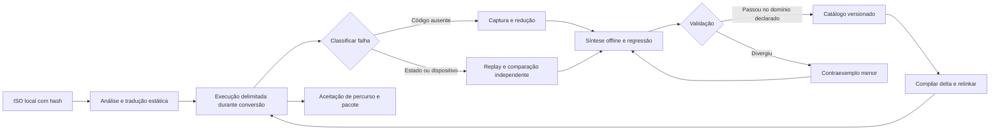

# Retomada do PS2Native: objetivo, evidência e próxima entrega

> **Objetivo atualizado pelo usuário:** trabalhar no Beta v0.1 de menus,
> áudio e controles. O roteiro operacional atual está em [BETA_V01.md](BETA_V01.md).
> As prioridades de gameplay/load abaixo pertencem à auditoria anterior;
> preservar as evidências e usar o novo objetivo para escolher a próxima ação.

Snapshot de 02/10/2026. Este guia é uma entrada curta para continuar o projeto;
o histórico integral permanece em `README_GERAL_COMPLETO.md`. O calendário local
marca sexta-feira, 02/10; o fim de semana solicitado é 03–04/10. As janelas abaixo
são limites de trabalho, não uma promessa de compatibilidade universal em 48 h.

## O objetivo continua sendo o conversor

Entrada: ISO fornecida localmente. Saída desejada: aplicativo que executa EE,
IOP e VU traduzidos previamente, com gráficos, áudio, controles e persistência
corretos. Nenhum endereço, patch ou TOML deve precisar ser escrito pelo usuário
para cada título. Monster House é o primeiro teste de aceitação do conversor.

Minha premissa para esta retomada é preservar o checkout e as alterações locais,
aproveitar o trabalho já medido e entregar uma versão experimental reproduzível
quando os critérios de uma versão estável ainda não tiverem passado. O alvo
universal permanece; nenhum número de famílias substitui a aceitação do jogo.

## O que a revisão realmente encontrou

Foram consultados os últimos turnos relevantes da conversa Codex
`01a0e944-e57b-7562-adcd-4c62188ff953`, os registros locais desse projeto,
o ZIP entregue, o código da CLI, os publicadores EE, os contratos de família,
a configuração do runtime e os recibos das últimas execuções. Fontes externas
verificadas estão em [REFERENCIAS_RECOMP.md](REFERENCIAS_RECOMP.md).

| Evidência | Resultado e limite |
|---|---|
| Checkout | Branch `codex/ps2-native-recomp`, base `c4d5ea7`; há alterações não commitadas. |
| ZIP original | 493 arquivos regulares: 485 iguais ao checkout, 8 diferentes, nenhum ausente; não sobrescrever o checkout com ele. |
| Último histórico | A tarefa de partição consta interrompida, mas seus processos produziram recibos completos. |
| Última recuperação EE | `status=built`, 41 casos, 73.869 candidatos únicos, 18.193 famílias admitidas, 55.676 estruturas recusadas. |
| Reuso | 17.622 famílias e 785 unidades de corpo preservadas; 850 fontes no catálogo novo. |
| Tempo registrado | Preparação 74,83 s, configuração 7,66 s, compilação 31,69 s; comando completo 114,27 s. É uma expansão local, não o tempo de converter uma ISO. |
| Testes desta revisão | 107 testes Python relacionados à descoberta, partição, catálogo, recuperação e CLI passaram em 3,675 s. |
| Gráficos | Os recibos anteriores registram menus/cena 3D na RX 6600, com divergências; há raster Vulkan e apresentação por readback OpenGL. |
| Aceitação | Gameplay causal, campanha, áudio, save/reload, pacote integrado AOT e generalização continuam sem aprovação. |
| ISOs locais | Uma ISO PS2 identificada nos diretórios Downloads/Desktop/Documents: Monster House BR-USA T2.0. A outra imagem encontrada é mídia de outro projeto. |

**Correção de estado:** a abertura do README consolidado ainda chama a partição
de pendente. O recibo abaixo é posterior e já comprova geração/compilação.
Não atualizar números antigos dentro do acervo para fingir que eram atuais.

### Artefatos exatos para continuar agora

```text
build/lab/ee-sharded-native-recovery-1790952188934350523/
  public-cli.json                  # retorno 0, 114,27 s
  recovery/recovery.json            # status built; não aprova gameplay
  recovery/batch/report.json        # 41 casos; duas publicações de candidatos
  recovery/batch/catalog/catalog.json

build/ee-families-native/libps2_ee_compiled_families.a
build/lab/ee-load-native-recovery-1790948588452292506/
  relink.json                       # referência da ligação anterior
  native-gpu-stream-reset-runner    # runner anterior; não assumir catálogo novo
  game-run/misses/ee-miss-000001/    # ausência 0x13a1984 já incorporada no lote novo
  vu-prologue-bank.o                # compilado; ligação ao runner não demonstrada
```

SHA-256 do catálogo novo:
`62b8bfd8b17d524d2d2f1eba8513988275cb551024391fae2eb50de345bd4fd7`.
O cache `build/ee-families-native/CMakeCache.txt` já aponta para esse catálogo.
O arquivo `.a` tem 108.078.172 bytes. Verificar as identidades antes de usar:
compilar uma biblioteca não a instala automaticamente no executável.

## Primeira tarefa, com condição de parada

1. Ler `AGENTS.md`, este guia e os recibos do job novo. Conferir `git diff`.
2. Conferir `relink.json` e o inventário da ligação anterior; montar em **job
   novo** um runner que use a biblioteca de famílias atual. Reutilizar os
   objetos EE estáveis; evitar regenerar o jogo todo ou ligar LTO nesta iteração.
3. Executar o helper headless existente com `--disable-overlay-driver`, captura
   explícita de misses, orçamento de tempo e cards particulares do teste.
4. Repetir o percurso de carregar o save que produziu a ausência, registrando
   input realmente enviado, identidade do runner, término e capturas. Os saves
   existentes servem à regressão; novo jogo também precisa ser aceito depois.
5. Se houver miss novo: classificá-lo, preservar request/RAM/contexto, recuperar
   offline e relinkar. Se não houver miss e a imagem ou o controle estiver errado:
   reduzir a primeira divergência VU/VIF/GIF/GS. Crescer o catálogo não corrige
   automaticamente um erro de dispositivo ou temporização.

O resultado dessa tarefa deve ser uma reprodução com diagnóstico e uma correção
geral testada, ou um recibo preciso do próximo bloqueio. Não produzir outra
consolidação gigante nem declarar M6 fechado por aparecer uma cena 3D.

## Como a adaptação deve funcionar

“Treinar” aqui significa aumentar um corpus de exemplos e regras verificadas.
Os arquivos atuais mineram estruturas e emitem código de forma determinística;
isso não é fine-tuning de um modelo. Uma ISA finita tem combinações de blocos,
overlays, código descompactado, estados e contratos de dispositivos que continuam
a variar. Não há evidência para prometer misses residuais no décimo jogo.



Proposta “Mahoraga”: cada falha vira um contraexemplo reproduzível; o agente
propõe uma regra geral; testes independentes e guardas determinam seu domínio;
só a regra validada passa a beneficiar outras conversões. É uma arquitetura
proposta combinando técnicas conhecidas. Não há prova de novidade científica
ou de fechamento para todas as ISOs.

Separar o banco em duas camadas:

- **Compartilhável:** semântica de instruções, regras de descoberta, contratos
  de SDK/IRX, lowering, políticas e testes sintéticos, identificados por versão
  de ISA/ABI/gerador/flags. A IA pode propor mudanças de código aqui.
- **Privada por conversão:** bytes/endereços/bindings de cada imagem, overlays,
  microprogramas VU, módulos IOP, assets e checkpoints. Identificar por hash
  do conteúdo e versão; dois jogos no mesmo PC convidado não são o mesmo código.

Estruturas equivalentes podem reutilizar corpos compilados quando seus
contratos/guardas permitem. Isso não autoriza compartilhar tabelas de PCs,
ignorar código modificado ou publicar RAM e fontes derivadas dos jogos. O
catálogo de famílias atual é explicitamente de laboratório; `strict_approval`
e `closure_proved` continuam falsos até existir outra qualificação.

## Lote de ISOs: ferramentas existentes e arquivo novo

`python3 -m tools.ps2native build` constrói um pacote; não abre nem testa a
partida. Não existe `build --headless` na CLI atual. O helper separado controla
um Xvfb próprio. Misses EE são capturados quando o runner foi compilado com
`PS2X_NEXO_LAB`/backend AOT e recebe `PS2X_EE_MISS_CAPTURE_DIR`. Setar apenas
essa variável num pacote comum não habilita o backend.

O novo `tools.ps2native.corpus_batch` entrega etapas que já podem ser compostas:
inventário por SHA-256, builds sequenciais com recibo por ISO e união offline de
capturas de vários jogos usando o publicador existente. Ele não qualifica
gameplay nem implementa ainda o ciclo de relink/runner AOT por pacote.

```sh
# Da raiz do repositório; não copia as ISOs nem executa builds:
python3 -m tools.ps2native.corpus_batch plan \
  --iso-dir /home/pedrohs/Downloads

# Lote real: diretório novo; cada falha conserva log e não oculta os demais jogos:
python3 -m tools.ps2native.corpus_batch build \
  --iso-dir /caminho/das/isos --out build/corpus/primeiro-lote \
  --build-jobs 4 --timeout 3600

# Depois de executar runners instrumentados, reunir até 16 capturas novas:
python3 -m tools.ps2native.corpus_batch merge \
  --capture-root /caminho/capturas-jogo-a \
  --capture-root /caminho/capturas-jogo-b \
  --previous-batch /caminho/lote-anterior \
  --family-generator build/ps2xRecomp/ps2_native_data_family \
  --overlay-generator build/ps2xRecomp/ps2_native_overlay \
  --out build/corpus/catalogo-novo --workers 4
```

Em `merge`, sem `--previous-batch`, o publicador pode criar o primeiro lote.
O resultado é código/catálogo gerado; compilar e instalar esse catálogo são
etapas distintas. Usar diretório novo e conservar o catálogo anterior em falhas.
Os comandos com `/caminho/...` são exemplos a preencher, não caminhos existentes.

### Contrato para fechar o orquestrador completo (M8)

Estados explícitos: `INSPECTED → BUILT → RUNNING → CAPTURED → GENERATED →
COMPILED → RELINKED → REPLAYED`, com falha tipada em qualquer transição.
`REPLAYED` não é `GAMEPLAY_APPROVED`. No orçamento esgotado, retornar relatório
e estado retomável em vez de sucesso.

Cada job deve guardar ISO/ELF SHA-256, revision+diff/fingerprint, hashes das
ferramentas e catálogo, perfil EE/IOP/VU/GS, flags/ABI/host, seeds/inputs,
recusa ou divergência, tempo por etapa e artefato realmente carregado. Só
avançar o ponteiro de catálogo depois de publicar/validar o novo manifest.
Serializar escrita nesse ponteiro. Deduplicar exemplos por conteúdo e contrato.

Após o runner atual: integrar as flags AOT/catálogo ao template de pacote e à
CLI; implementar headless/relink/reexecução por pacote; provar numa fixture
sintética que um miss termina a execução, entra na fila, gera o delta, relinka
e avança no replay seguinte. O teste deve ter controle negativo e execução do
código gerado. Aumentar os limites ou mockar sucesso não prova esse ciclo.

## Entregas finitas para o fim de semana

| Ordem | Entrega | Critério de conclusão |
|---|---|---|
| 1 — primeira sessão | Runner usa as 18.193 famílias atuais | Hash da biblioteca/manifest ligado, percurso repetido e resultado registrado. |
| 2 — até 6 h de diagnóstico | Menor bloqueio real corrigido | Regressão falha antes, passa depois; sem patch por PC/título. |
| 3 — próximo bloco | Ciclo automático numa fixture | Capturar → gerar → compilar → relinkar → replay sem edição humana; retomada após falha. |
| 4 — antes da publicação | Versão experimental reproduzível | Clone limpo, comandos/documentação/testes, licença/créditos, limitações e issue conhecida. |
| 5 — quando houver mais ISOs | Generalização | 2–3 jogos de engines/perfis distintos e pelo menos um título reservado sem adaptação prévia. |

Se o bloqueio de fidelidade exceder a janela, a entrega publicável é a ferramenta
experimental e a reprodução. A aceitação de Monster House continua aberta;
reduzir o escopo da release não apaga o objetivo universal.

Para ampliar o corpus, escolher ISOs que você já possua com diferenças de
engine, módulos IOP, microcódigo VU e sistema de overlays; estúdio diferente
sozinho não garante diversidade técnica. Preferir um conjunto pequeno com
inputs/checkpoints verificáveis a dez boots sem cobertura de gameplay.

## Publicação e métricas que interessam

Publicar o conversor e seus testes abertos. Capturas comerciais, assets, ISOs,
memory cards, ELFs extraídos, bibliotecas geradas e fontes de jogos ficam em
`build/` local. A licença base é GPLv3; conservar a atribuição ao PS2Recomp e as
licenças dos componentes usados. Confira o conteúdo real do pacote fonte.

Uma release estável exige controles causais, cenas/transições, áudio, save e
reload após reiniciar, campanha e pacote fora do checkout. Também exige provar
que os caminhos EE/IOP/VU entregues não recorrem a ISA interpreter/JIT/compilador
durante a partida. AOT de EE sozinho não prova isso para IOP/VU.

Medir por ISO/percurso: taxa de build, misses únicos/repetidos, rejeições por
motivo, correções específicas necessárias, reuso de corpos/objetos, tempo
frio/quente, divergências e proporção de cenários aprovados. Medir p95 de frame
time quando houver gameplay; primitivas GPU e ausência de miss não são FPS.
Usar títulos reservados e informar denominador. 41 capturas não são 41 jogos.

Para candidaturas de apoio a open source, descrever a evidência existente e o
trabalho restante. Não anunciar “converte qualquer ISO” nem atribuir qualificação
ao nome de um modelo. O prompt curto desta entrega preserva sua escolha de
GPT-6.1 Sol/xhigh; não altera configuração nem envia candidatura.

## Comandos de verificação desta retomada

```sh
python3 -m unittest \
  lab.tests.test_ee_data_families lab.tests.test_ee_family_catalog \
  lab.tests.test_prepare_ee_family_batch \
  tools.ps2native.tests.test_native_recovery tools.ps2native.tests.test_cli
python3 -m unittest tools.ps2native.tests.test_corpus_batch
git diff --check
```

O roteiro de continuidade está em [PROMPT_CONTINUAR_CODEX.txt](PROMPT_CONTINUAR_CODEX.txt).

## Checkpoint de 03/10/2026 — T4/CT16 após Cross

A mudança local em `GSCpuBackend::LoadClutUnlocked` lê a CLUT diretamente da VRAM. A suíte sintética correspondente continua passando, mas os recibos de Metal Slug 4 não aprovam a cena ao vivo. Não foi feita outra reprodução longa nesta retomada.

Evidências verificadas:

- `cmake --build build --target ps2_gs_clut_cache_tests --parallel 4` e `ctest --test-dir build -R '^gs_cache\.clut\.' --output-on-failure`: **19/19 casos passaram**, incluindo `clut_reload_current_vram`. A fixture monta registros e payload GIF IMAGE sintéticos via `processGIFPacket`, validando o parser CPU genérico; ela não exercita `GifStreamState`/`SubmitGifStream` nem conserva os pacotes e payloads reais do jogo. Isso não valida o conteúdo produzido pelo jogo.
- A captura de 03/10/2026 em `live-clut-run-20261003-2/captures/capture-1790991413173984983/scene.txt` contém TEX0 bruto `0x2013200de1411a40`. Decodificado pelo layout atual de `gs_frontend.cpp`, ele representa `TBP0=6720`, `TBW=4`, T4, `CBP=6400`, CT16, CSM1 e CLD=1. O TBP=6656 do log `metal-slug-gs-diag-v6` pertence a outra execução; não combinar esses estados como se fossem uma só captura.
- A VRAM salva junto à captura, consultada pelo `GSCpuBackend` atual, contém índices T4 0/1 na amostra 16×16 em TBP=6720. As 16 entradas CT16 CSM1 lidas de CBP=6400 são todas `0x0001`; ao carregar essa CLUT e amostrar pelo rasterizador atual, a cor resultante é `0x80000008`. Portanto, a cor uniforme já está nos valores lidos da VRAM nessa captura, antes da apresentação. Isso não determina se o jogo pretendia outra alocação/endereço nem identifica quem escreveu os valores.
- O histórico GS nessa captura conserva só os **512 eventos finais**. Nele, 85 configurações de transferência são host→local, CT16, 8×2 pixels, DBW=1, com DBP de 3416 a 4088; nenhuma dessas configurações escreve diretamente nos valores-base 6400 ou 6720. A janela truncada não exclui escritas anteriores nem cópias locais. Em outro log, o v6 registrou uploads T4 em DBP=4096 e 4608 enquanto a primitiva usava TBP=6656; também não prova que esses uploads deveriam alimentar aquela textura.

**Conclusão:** não há evidência suficiente para outra correção de produção. A regressão CLUT cobre uma recarga após GIF IMAGE em uma fixture, mas a falha ao vivo persiste e a captura atual já contém a CLUT uniforme na VRAM. O diagnóstico mínimo seguinte é correlacionar, numa reprodução nova e interrompida assim que ocorrer o primeiro desenho pós-Cross, as últimas escritas que cobrem a CLUT em CBP=6400 e a textura em TBP=6720 (incluindo GIF IMAGE e local→local), com os 16 valores CT16 e os índices T4 usados naquele desenho. Registrar endereço/formato, dimensões, direção e origem de cada escrita pertinente. Só então escolher entre endereço/alocação do jogo, rota de transferência e amostragem GS; não repetir o replay de 560 s sem esse rastreamento direcionado.

O build e as consultas desta retomada não alteraram fontes C++ nem testes; o executável auxiliar de leitura do snapshot ficou em `build/gs_capture_vram_probe`. O restante dos gates Beta — menu, input causal, áudio não silencioso, tempos de frame, transição qualificada, corpus e meta de 90% — continua aberto.

## Checkpoint interino de 03/10/2026 — cinco trilhas paralelas

Cinco revisões independentes confirmaram os limites abaixo; nenhuma alterou o código:

- **GS:** manter a leitura CLUT atual sem outra mudança de produção. Correlacionar GIF IMAGE e cópias locais que cobrem `CBP=6400`/`TBP=6720` até o primeiro desenho após Cross. Não repetir replay longo sem esse trace.
- **Áudio:** a captura anterior de Metal Slug mediu 594,944 s de PCM estéreo silencioso (pico e RMS zero) e é anterior ao delta v3. Não há medição de PCM depois dele. O caminho atual de SPU/AutoDMA não demonstra amostras entregues ao host; testar um padrão sintético de core 1 antes de atribuir causa ou aprovar áudio de jogo.
- **Controles e transição:** teclado/gamepad chegam ao estado do pad e os testes sintéticos passam, mas não existe percurso ao vivo provando navegação causal. A saída atual da thread convidada fecha a janela; não mostra Coming soon. Não converter Cross isolado, falha, miss ou timeout em transição qualificada.
- **Cadência:** o runtime acumula intervalos do loop host e escreve CSV no encerramento. A prova válida exige o marcador de escrita bem-sucedida e linhas completas/sequenciais compatíveis com o contador; `duration_reached` sozinho não comprova flush ou FPS.
- **Corpus/espaço:** o inventário local encontrou cinco ISOs únicas e nenhum duplicado. Foi iniciado um lote sequencial e aditivo em `build/beta-v01-20261003/corpus-build-v1/`; pacote construído não significa boot, menu, áudio ou gameplay aprovados. A medição inicial indicou cerca de 93 GiB disponíveis em `/home` e 3,5 GiB em `/var/tmp`.

A expectativa CSV do teste `HostFrameTiming` tinha `\\n` literal em vez de escapes de nova linha; foi corrigida em `ps2xTest/src/host_frame_timing_tests.cpp`. A suíte completa passou com **496 testes C++**, a suíte `tools/ps2native/tests` com **50 testes Python**, e os **19 testes GS/CLUT** passaram. `git diff --check` focado nos arquivos Beta passou. O teste SIGTERM é unitário e não substitui verificação de CSV num runner real.

Para liberar espaço sem apagar pacotes ou evidências, foram removidos somente `*.o`/`*.d` de dois diretórios CMake de builds Monster House concluídos em `build/ps2native/.../desktop-project/build/`. Os dois `package/bin/ps2EntryRunner`, fontes geradas, manifests, logs e demais artefatos foram preservados. O `df` mediu **1.731.444.736 bytes liberados** pela remoção; os builds antigos perderam apenas cache incremental e podem exigir recompilação.

Ainda não há aprovação de menu/áudio/controle em nenhuma ISO, medição de 60 FPS sustentada, integração de Coming soon, nem base para declarar 90% ou compatibilidade universal. Atualizar este checkpoint com os estados finais do lote e executar sessões headless delimitadas antes de considerar qualquer ISO aprovada.

## Retomada em 03/10/2026 — lote de ISOs e auditorias Beta

Recibo atual: `build/beta-v01-20261003/corpus-build-v1/corpus.json`. O inventário contém cinco ISOs únicas, sem duplicatas. No momento desta atualização, o status geral é `BUILDING`: Metal Slug 4 está `BUILT_UNVERIFIED` com integridade verificada em 96 arquivos; Monster House está `BUILDING`; R-Type Final, RoboCop e Sega Ages estão `QUEUED`. O pacote construído não é aprovação de execução.

A sessão headless de Metal Slug 4 durou 60,001 s, abriu a janela e terminou pelo limite (`duration_reached`, saída -15). `menu_approved` e `gameplay_approved` são falsos; as capturas antes/depois de Cross estão pretas. O log mostra inicialização do áudio host, carregamento de PADMAN/LIBSD e atividade MPEG, mas não comprova navegação. A análise de `qa/metal-slug-v1/menu-audio.wav` encontrou 45,056 s de PCM estéreo 48 kHz/16-bit, **0 amostras não nulas, pico 0 e RMS 0**. A gravação atual e o probe histórico de 600 s são silenciosos; isso confirma silêncio nesses percursos, não uma falha universal.

A sessão headless de Monster House durou 45,002 s, abriu a janela e também terminou pelo limite; ambos os gates ficaram falsos. Foi enviado `x` por 0,5 s. As capturas antes/depois mostram quadro magenta uniforme, sem menu ou resposta visual. Nos ticks registrados, o PC convidado permaneceu em `0x111f08` e os contadores DMA/GIF/GS/VIF ficaram em zero; o log também informa `Missing Command Line Option: -w (working directory)`. Esses são sinais para diagnóstico, não uma causa confirmada.

R-Type Final (demo) também abriu a janela e executou por 45,001 s até o limite, sem aprovação de menu ou gameplay. Um `x` de 0,5 s não alterou a captura magenta. Nos ticks observados, o PC permaneceu em `0x116f48` e os contadores DMA/GIF/GS/VIF ficaram em zero. A leitura das rotinas geradas e do scheduler diferencia os estados: Monster House em `0x111f08` está no retorno após syscall, com `runningThread=0` e `status=5`; R-Type em `0x116f48` está num countdown loop, com `runningThread=1` e `status=0`, chamando `ps2xFastForwardGuestCountdownLoop`. Não há causa comum evidenciada; a mensagem `-w` só aparece em Monster House. O próximo diagnóstico delimitado é capturar por no máximo dois segundos o resultado/status da syscall em Monster House e `$v0/$v1`, o branch e o retorno do helper no countdown de R-Type. Nenhuma das cinco ISOs tem aprovação ao vivo de menu, controles causais ou áudio.

As cinco auditorias independentes confirmaram: (1) GS/CLUT precisa do trace direcionado das escritas GIF IMAGE e cópias locais cobrindo `CBP=6400`/`TBP=6720`; a captura atual não identifica a origem dos valores uniformes e não sustenta outra correção de produção; (2) áudio e controles têm caminhos e testes sintéticos, mas falta saída PCM não silenciosa e resposta causal ao input num menu; (3) frame timing exige CSV completo e encerramento com flush confirmado, não apenas `duration_reached`; (4) a thread convidada atualmente termina fechando a janela, sem detector qualificado ou tela Coming soon; não classificar falha, miss ou timeout como início de gameplay; (5) o lote atual é sequencial e ainda está em progresso.

A medição local mostrou 88 GiB livres em `/home` e 3,5 GiB no diretório do lote. O build Monster House estava ativo; os três próximos títulos permaneciam na fila. Foram removidos apenas 55 arquivos `.pyc` regeneráveis em caches ignorados pelo Git (1.080.334 bytes). Pacotes, fontes geradas, logs, manifests, capturas, ISOs e o job ativo foram preservados; não há outro artefato descartável cuja remoção compense perder capacidade de retomada enquanto há espaço livre suficiente.

**Estado Beta:** ainda bloqueado antes de menu; nenhuma aprovação entre cinco imagens. A meta de 90% continua não medida e sem aprovação de gameplay. Próximos passos: deixar o lote finalizar sem alterar o código incluído no snapshot; registrar o resultado de cada build; depois executar sessões headless curtas por pacote e aprovar separadamente boot, menu, input, PCM e cadência. Somente integrar Coming soon após existir um sinal de início de partida qualificado que não confunda erro ou timeout com sucesso.

O checkout já tinha alterações locais não commitadas antes desta retomada. Nenhum código de runtime foi editado nesta etapa; o snapshot do lote deve permanecer estável até o lote terminar.
